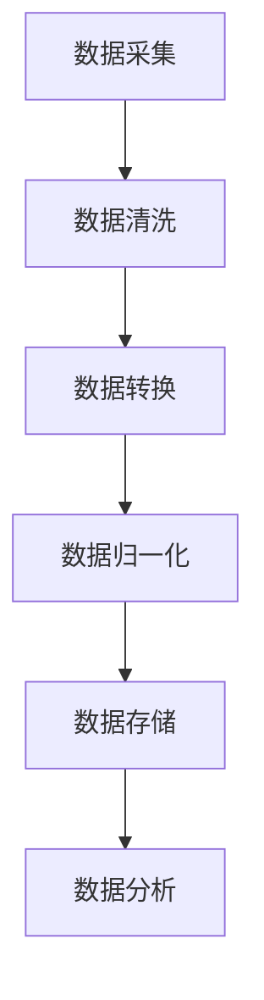

                 

## 第1章：教育平台的概述与数据应用

### 1.1 教育平台的发展与现状

教育平台作为一种在线教育资源提供和管理的工具，近年来在全球范围内得到了迅速发展。从最初的简单在线课程到如今复杂的智能教育平台，教育平台经历了巨大的变革。这些平台不仅提供了丰富的教学资源，还通过先进的技术手段实现了个性化教学、学习效果评估等多种功能。

#### **传统教育平台：**

传统教育平台可以分为在线学习平台和MOOC（Massive Open Online Course，大型开放在线课程）平台。在线学习平台如Coursera、edX等，主要提供课程视频、课件和在线作业等功能。用户可以自主安排学习时间，进行自主性学习。MOOC平台如Udacity、Khan Academy等，则更注重大规模在线教育，提供免费的课程资源，吸引全球学生参与。

#### **智能教育平台：**

随着人工智能和大数据技术的发展，智能教育平台应运而生。这类平台不仅具备传统教育平台的功能，还能够根据学生的学习行为和偏好，提供个性化的学习路径和推荐。智能教育平台包括自适应学习平台和虚拟现实教学平台等。

- **自适应学习平台：** 如DreamBox、ALEKS等，利用数据分析和机器学习技术，根据学生的学习情况，动态调整教学内容和难度。
- **虚拟现实教学平台：** 如EngageSpace、VRChat等，通过虚拟现实技术，为学生提供沉浸式的学习体验。

#### **教育平台的现状与趋势：**

当前，在线教育已成为全球教育领域的重要趋势。随着互联网的普及和人们对教育资源需求的增加，教育平台的用户数量持续增长。同时，技术的进步也为教育平台的发展提供了新的机遇。

- **用户增长：** 全球在线教育用户数量持续增长，尤其是在发展中国家和地区。
- **技术融合：** 数据分析、人工智能、虚拟现实等技术不断融入教育平台，提高了教学效果和用户体验。
- **市场扩展：** 教育平台逐渐覆盖更多教育阶段和学科领域，从基础教育到高等教育，从学科教育到职业培训。

### 1.2 教育数据应用的重要性

教育数据应用是指利用数据分析和机器学习技术，对教育平台上的数据进行处理和分析，从而为教学决策提供支持。教育数据应用的重要性体现在以下几个方面：

#### **教育数据的定义与价值：**

教育数据是指学生在学习过程中产生的各种信息，包括学习行为数据、学习成果数据、个人基本信息等。这些数据的价值在于：

- **提高教学效率：** 通过数据分析，教师可以更好地了解学生的学习情况，从而优化教学策略，提高教学效果。
- **优化教育资源分配：** 通过数据分析，教育机构可以更合理地分配教育资源，提高资源利用率。
- **促进个性化学习：** 通过数据分析，为学生提供个性化的学习资源和路径，满足不同学生的学习需求。

#### **教育数据应用的场景：**

教育数据应用在教育平台中有多种场景，包括：

- **教学管理：** 教师可以通过数据了解学生的学习情况，调整教学策略。
- **学习分析：** 学生可以通过数据分析，了解自己的学习进度和弱点，制定改进计划。
- **学术研究：** 教育研究者可以通过数据分析，探究教育现象和规律，为教育理论和实践提供支持。

### 1.3 教育数据应用的挑战与机遇

#### **数据挑战：**

教育数据应用面临着一系列挑战：

- **数据质量：** 教育数据质量参差不齐，数据的不完整、不一致等问题会影响数据分析的准确性。
- **数据隐私：** 教育数据涉及个人隐私，需要严格保护，否则可能导致隐私泄露问题。
- **数据整合：** 不同教育平台的数据格式和结构可能不同，数据难以整合，影响数据分析和应用的效率。

#### **机遇分析：**

尽管面临挑战，教育数据应用也充满机遇：

- **技术创新：** 随着数据分析、人工智能等技术的不断发展，教育数据应用的方法和工具不断丰富，为教育数据应用提供了新的可能性。
- **政策支持：** 各国政府逐渐重视在线教育和数据应用，出台相关政策，为教育数据应用的发展提供支持。
- **市场潜力：** 随着在线教育的普及，教育数据应用市场潜力巨大，吸引了大量投资和创新。

通过上述分析，我们可以看到，教育平台的发展与数据应用密不可分。教育数据应用不仅提高了教学效果和用户体验，还为教育领域的研究和实践提供了有力支持。然而，在实际应用中，还需要克服一系列挑战，充分利用技术创新和政策支持，推动教育数据应用的进一步发展。

### 1.1 教育平台的发展与现状

**教育平台的概念与分类**

教育平台是指用于提供在线教育资源和服务的系统或网络。根据功能和应用范围，教育平台可以分为以下几类：

- **在线学习平台**：这类平台提供课程视频、课件、在线作业等基本教学资源，学生可以自主安排学习时间进行学习。例如，Coursera、edX和Udemy等。
- **MOOC平台**：即大规模开放在线课程平台，它允许任何人免费注册学习，通常由大学或教育机构提供。代表平台包括edX、Coursera和Khan Academy。
- **智能教育平台**：这些平台利用人工智能和数据分析技术，提供个性化学习路径、智能评估等功能。例子包括Canvas和Blackboard。

**教育平台的现状与趋势**

近年来，教育平台的发展呈现出以下几大趋势：

- **用户增长**：全球在线教育用户数量持续增加，尤其是在发展中国家和地区，如中国和印度。
- **技术融合**：人工智能、大数据、虚拟现实等技术不断融入教育平台，提升用户体验和教学效果。例如，AI驱动的个性化学习推荐和虚拟现实课堂。
- **市场扩展**：教育平台不再局限于高等教育，逐渐覆盖了从基础教育到职业培训的各个领域。同时，平台提供商也在不断拓展国际市场。

### 1.2 教育数据应用的重要性

**教育数据的定义与价值**

教育数据是指学生在学习过程中产生的各种数据，包括学习行为数据、学习成果数据、个人基本信息等。这些数据的价值主要体现在以下几个方面：

- **提高教学效率**：通过分析学生的学习行为数据，教师可以更好地了解学生的学习情况，从而制定更有效的教学策略。
- **优化教育资源分配**：教育机构可以根据数据分析结果，合理分配教育资源，提高资源利用效率。
- **促进个性化学习**：教育数据可以用来为学生提供个性化的学习资源和路径，满足不同学生的学习需求。

**教育数据应用的场景**

教育数据应用在教育平台中有广泛的应用场景：

- **教学管理**：教师可以通过数据了解学生的学习情况，调整教学策略，提高教学质量。
- **学习分析**：学生可以通过数据了解自己的学习进度和弱点，制定改进计划。
- **学术研究**：教育研究者可以通过数据分析，探索教育现象和规律，为教育理论的发展提供支持。

### 1.3 教育数据应用的挑战与机遇

**数据挑战**

教育数据应用面临以下挑战：

- **数据质量**：教育数据的多样性和质量参差不齐，会影响数据分析的准确性。
- **数据隐私**：教育数据涉及个人隐私，需要严格保护，以防止数据泄露。
- **数据整合**：不同教育平台的数据格式和结构可能不同，数据整合困难。

**机遇分析**

尽管面临挑战，教育数据应用也充满机遇：

- **技术创新**：随着人工智能、大数据等技术的进步，教育数据应用的方法和工具不断丰富。
- **政策支持**：各国政府逐渐重视在线教育和数据应用，出台相关政策支持其发展。
- **市场潜力**：随着在线教育的普及，教育数据应用市场潜力巨大，吸引了大量投资和创新。

通过上述分析，我们可以看到，教育数据应用在教育平台中具有重要意义。尽管面临挑战，但随着技术的进步和政策支持，教育数据应用的前景依然广阔。

### 1.2 教育数据应用的重要性

**教育数据的定义与价值**

教育数据是指在教育过程中产生的各类信息，包括学生的个人资料、学习行为、学习成果等。这些数据的价值体现在以下几个方面：

- **个性化学习**：通过收集和分析学生的行为数据，教育平台可以为学生提供个性化的学习内容，从而提高学习效果。
- **教学优化**：教师可以利用学生的学习数据进行教学评估，及时调整教学方法和策略，提高教学质量。
- **教育资源分配**：教育机构可以根据数据分析结果，优化教育资源的配置，提高资源利用效率。

**教育数据应用的场景**

教育数据应用在教育平台中具有多种场景：

- **学习分析**：通过分析学生的学习行为，教育平台可以了解学生的学习习惯和弱点，从而提供有针对性的学习支持和建议。
- **教学管理**：教师可以利用数据分析结果，评估学生的学习情况，制定个性化的教学计划。
- **学术研究**：教育研究者可以利用教育数据，进行教育现象的探究和评估，为教育改革提供依据。

### 1.3 教育数据应用的挑战与机遇

**数据挑战**

- **数据质量**：教育数据来源多样，数据质量参差不齐，可能导致数据分析结果不准确。
- **数据隐私**：教育数据涉及学生隐私，如何保护学生数据隐私是一个重要挑战。
- **数据整合**：不同教育平台和系统之间的数据格式和结构可能不同，数据整合困难。

**机遇分析**

- **技术创新**：随着大数据、人工智能等技术的不断发展，教育数据应用的方法和工具不断丰富。
- **政策支持**：各国政府对在线教育和数据应用的支持，为教育数据应用提供了良好的政策环境。
- **市场潜力**：随着在线教育的普及，教育数据应用市场前景广阔，吸引了大量投资和创新。

### 1.3 教育数据应用的挑战与机遇

**数据挑战**

- **数据质量：** 教育数据来源广泛，质量参差不齐，数据缺失、不一致等问题影响数据分析准确性。
- **数据隐私：** 教育数据涉及个人隐私，保护学生数据隐私是重大挑战。
- **数据整合：** 不同平台和系统间的数据格式和结构各异，数据整合复杂。

**机遇分析**

- **技术创新：** 大数据、人工智能等技术进步为教育数据应用提供新方法。
- **政策支持：** 各国政府重视在线教育与数据应用，出台支持政策。
- **市场潜力：** 在线教育普及带动数据应用市场增长。

### 1.2 个性化教学的原理与方法

**个性化教学的定义与目标**

个性化教学是一种以学生为中心的教学方法，旨在根据学生的个性差异和学习需求，提供个性化的教学方案。其核心目标包括：

- **提高教学效果**：通过个性化教学，使学生更好地理解和掌握知识。
- **满足学生需求**：根据学生的兴趣、学习风格和需求，提供合适的教学内容和方式。
- **促进全面发展**：个性化教学不仅关注知识的传授，还注重学生的全面发展，包括思维能力、情感态度等方面。

**个性化教学的方法**

个性化教学的方法多种多样，以下是一些常见的个性化教学方法：

- **基于能力的个性化教学**：这种方法强调学生自主学习能力的培养，教师根据学生的能力水平提供相应的学习资源和任务。
- **基于内容的个性化教学**：这种方法根据学生的兴趣和学习内容提供定制化的教学方案，例如通过推荐算法为学生推荐相关课程和内容。
- **基于环境的个性化教学**：这种方法利用虚拟现实、游戏化学习等技术，为学生创造一个适合他们学习的环境，提高学习兴趣和效果。

**个性化教学的优势**

- **提高学习效果**：个性化教学使学生能够按照自己的节奏学习，提高学习效率。
- **满足个体差异**：个性化教学能够满足不同学生的需求，使每个学生都能在适合自己的学习环境中学习。
- **培养自主学习能力**：个性化教学鼓励学生主动参与学习过程，培养他们的自主学习能力和批判性思维。

### 2.2 数据驱动个性化教学的实现

**数据驱动的概念**

数据驱动教学是一种以数据为核心的教学方法，通过收集和分析学生的学习数据，指导教学决策和策略调整。数据驱动的核心在于利用数据来了解学生的学习状况、兴趣和需求，从而提供个性化的教学支持。

**个性化教学实现流程**

实现数据驱动个性化教学的流程主要包括以下几个步骤：

1. **数据采集**：收集学生的学习数据，包括学习行为、学习成果、学习环境等。
2. **数据预处理**：对采集到的数据进行清洗、转换和整合，确保数据的质量和一致性。
3. **数据分析**：利用数据分析方法和技术，对预处理后的数据进行分析，识别学生的兴趣、需求和学习模式。
4. **教学策略调整**：根据数据分析结果，调整教学策略，包括教学内容、教学方法、教学进度等。
5. **教学实施**：根据调整后的教学策略，进行教学实施，同时持续收集学生学习数据，以不断优化教学效果。

**数据在个性化学习路径规划中的应用**

个性化学习路径规划是指根据学生的兴趣、能力水平和学习进度，为学生制定个性化的学习路径。数据在个性化学习路径规划中的应用主要体现在以下几个方面：

1. **学习需求分析**：通过数据分析，了解学生的当前学习需求和兴趣，为路径规划提供依据。
2. **路径规划策略**：利用算法和技术，根据学习需求分析结果，为学生生成个性化的学习路径。
3. **路径调整与优化**：根据学生的学习反馈和进展，动态调整学习路径，优化学习效果。

通过数据驱动的个性化教学，教育平台能够更好地满足学生的个性化学习需求，提高教学效果和学生的学习体验。

### 2.3 数据在个性化学习路径规划中的应用

**学习路径规划的概念**

学习路径规划是指根据学生的个性特征、学习目标和学习进度，为学生制定一条最优的学习路线。个性化学习路径规划旨在满足每个学生的独特需求，帮助他们在合适的时间和环境中学习，从而达到最佳的学习效果。

**个性化学习路径的概念**

个性化学习路径是基于学生的个体差异，包括兴趣、学习能力、学习风格等，制定的一条定制化的学习路线。这种路径不仅考虑了学生的当前学习需求，还为其提供了长期的职业发展指导。

**数据在路径规划中的应用**

数据在个性化学习路径规划中的应用至关重要，具体体现在以下几个方面：

1. **学习需求分析**：通过数据分析，了解学生的兴趣、学习动机和当前知识水平。例如，通过学习行为数据，可以识别出学生的薄弱环节和强项领域。

2. **路径规划策略**：利用机器学习算法和数据分析技术，将学习需求与学生目标相结合，生成一条符合学生个性化需求的学习路径。例如，使用决策树或神经网络算法，根据学生的历史数据和学习目标，制定最佳学习路径。

3. **路径调整与优化**：在学习过程中，持续收集学生的学习数据，通过反馈机制动态调整学习路径。例如，如果某个知识点学生掌握得不好，系统可以自动推荐相关的补充学习资源或调整学习进度。

**学习路径规划的优势**

1. **提升学习效率**：个性化学习路径能够帮助学生集中精力在关键知识点上，避免重复学习，提高学习效率。

2. **增强学习动机**：个性化的学习路径能够满足学生的个性化需求，增加他们的学习兴趣和参与度。

3. **促进全面发展**：通过个性化学习路径，学生不仅能够学习到学科知识，还能培养自我管理、问题解决和批判性思维等综合素质。

### 3.1 学习效果评估的基本概念

**学习效果评估的定义**

学习效果评估是指通过测量和分析学习成果，对学生的学习过程和结果进行评价和反馈。其目的是为了了解学生的学习状况，发现教学过程中的问题，为教学改进提供依据。

**评估指标**

学习效果评估涉及多个维度，以下是一些关键的评估指标：

- **知识掌握程度**：通过考试、测验等方式，评估学生对知识的理解和应用能力。
- **学习能力**：通过观察学生的自主学习能力、解决问题的能力、批判性思维能力等，评估其综合能力。
- **学习态度**：通过学生的出勤率、课堂参与度、作业完成情况等，评估其学习态度。

**评估目的**

学习效果评估的主要目的是：

- **诊断学习问题**：通过评估，了解学生在学习过程中存在的问题，为教师提供改进教学的线索。
- **指导教学改进**：根据评估结果，教师可以调整教学方法、教学资源和学习路径，提高教学效果。
- **促进学生学习**：通过评估，学生可以了解自己的学习情况，明确学习目标，激发学习动力。

### 3.2 学习数据采集与处理方法

**学习数据采集**

学习数据采集是学习效果评估的基础，以下是一些常见的采集方法：

- **直接采集**：通过考试、测验、问卷调查等方式，直接收集学生的学习成绩、态度和行为数据。
- **间接采集**：通过学习行为记录、在线互动数据等方式，间接收集学生的学习状态和表现数据。

**数据预处理**

数据预处理是确保数据质量的重要步骤，主要包括以下内容：

- **数据清洗**：去除重复数据、处理缺失值和异常值，确保数据的准确性和一致性。
- **数据转换**：将不同类型的数据转换为统一的格式，如将文本数据转换为数字编码，便于后续分析。
- **数据归一化**：处理不同指标之间的差异，使数据具有可比性。

**数据处理方法**

数据预处理完成后，可以通过以下方法对学习数据进行分析和评估：

- **描述性分析**：提供数据的统计摘要，如平均值、标准差、分布情况等，帮助了解数据的整体特征。
- **推断性分析**：基于数据，推断学习效果与教学策略之间的关系，进行假设检验和回归分析。
- **预测性分析**：利用历史数据，预测未来的学习效果，为教学决策提供参考。

### 3.3 数据在评估学习效果中的应用

**数据分析方法**

在评估学习效果时，常用的数据分析方法包括：

- **描述性分析**：提供数据的统计摘要，如平均值、标准差、分布情况等，帮助了解数据的整体特征。
- **推断性分析**：基于数据，推断学习效果与教学策略之间的关系，进行假设检验和回归分析。
- **预测性分析**：利用历史数据，预测未来的学习效果，为教学决策提供参考。

**应用场景**

数据在评估学习效果中的应用场景非常广泛，主要包括：

- **教学调整**：根据评估结果，教师可以调整教学策略，如修改教学计划、改进教学方法等，以提升教学效果。
- **学生学习指导**：根据评估结果，为学生提供个性化的学习建议，如调整学习进度、推荐相关学习资源等。
- **教育科研**：教育研究者可以通过分析学习数据，探究教育现象和规律，为教育改革提供理论支持。

### 4.1 教育数据源的类型

在教育平台上，数据来源多样化，不同类型的数据为教育平台提供了丰富的信息资源，支持个性化教学和学习效果评估。以下是教育数据源的主要类型：

**学生数据**

学生数据是教育数据中最重要的一部分，主要包括以下几个方面：

- **个人基本信息**：包括学生的姓名、年龄、性别、所在学校、班级等信息，这些信息用于学生管理、课程分配和个性化推荐等。
- **学习行为数据**：记录学生在教育平台上的各种学习行为，如课程访问记录、在线互动、作业提交和考试成绩等，这些数据用于了解学生的学习动态和效果。
- **学习成果数据**：包括学生的考试成绩、作业成绩、项目完成情况等，这些数据用于评估学生的学习效果。

**教师数据**

教师数据同样重要，主要用于教学管理和教学质量评估，主要包括以下几个方面：

- **教学计划**：包括课程内容、教学目标、教学进度等，这些信息帮助教师规划教学活动。
- **教学反馈**：包括学生对教师的评价、同行评价等，这些数据用于评估教师的教学效果。
- **教育资源**：包括课件、视频、练习题等，这些资源为教师提供了丰富的教学材料。

**课程数据**

课程数据涵盖了课程的各个方面，是教育平台的核心数据，主要包括以下几个方面：

- **课程内容**：包括课程大纲、教学目标、教材、课件等，这些数据用于教学设计和资源管理。
- **课程资源**：包括在线练习题、模拟考试、教学视频等，这些资源为学生提供了丰富的学习材料。
- **课程评价**：包括学生和教师的评价、课程反馈等，这些数据用于评估课程质量和改进课程内容。

### 4.2 教育数据收集的方法

为了有效地支持教育平台的功能，如个性化教学和学习效果评估，收集准确、全面的教育数据是关键。以下是一些常见的教育数据收集方法：

**问卷调查**

问卷调查是一种常见的教育数据收集方法，通过设计一系列问题，收集学生和教师的意见、反馈和学习情况。问卷调查的优点包括：

- **覆盖面广**：可以收集大量数据，涵盖不同群体的意见。
- **简便高效**：通过在线或纸质问卷，可以快速收集数据。

缺点包括：

- **数据真实性**：受访者可能存在隐瞒或夸大事实的情况，影响数据质量。
- **数据解释**：需要专业知识对问卷结果进行分析和解释。

**日志分析**

日志分析是一种基于学生在线行为数据的数据收集方法，通过分析教育平台服务器生成的日志文件，收集学生的访问记录、操作行为等数据。日志分析的优点包括：

- **自动化**：数据收集过程自动化，节省人力和时间。
- **数据量大**：可以收集到详细的学习行为数据。

缺点包括：

- **数据复杂性**：需要对大量数据进行处理和分析，需要专业的技术支持。
- **隐私问题**：需要确保学生数据的安全性和隐私。

**在线互动**

在线互动是一种通过教育平台中的讨论区、论坛、聊天室等功能，收集学生互动数据的方法。这种方法可以实时了解学生的学习状态和交流情况。在线互动的优点包括：

- **实时性**：可以及时了解学生的学习动态和问题。
- **互动性**：鼓励学生之间的交流和合作。

缺点包括：

- **参与度**：部分学生可能不积极参与互动，影响数据收集的全面性。
- **数据解释**：需要结合其他数据源进行综合分析。

**传感器数据**

传感器数据是通过安装在教室或教育平台中的传感器，收集学生的学习行为和环境数据的方法。例如，通过传感器可以记录学生的出勤情况、上课注意力等数据。传感器数据的优点包括：

- **客观性**：通过物理传感器，可以收集到客观的、非主观的学习行为数据。
- **全面性**：可以收集到更全面的学习行为和环境数据。

缺点包括：

- **成本高**：安装和维护传感器需要较高成本。
- **数据解释**：需要对传感器数据进行专业的分析和解释。

### 4.3 教育数据的存储与管理

**数据存储技术**

在教育数据的存储与管理中，选择合适的数据存储技术至关重要。以下是一些常用的数据存储技术：

- **关系型数据库**：如MySQL、Oracle等，适用于结构化数据存储和管理，具有数据一致性和事务处理能力。
- **非关系型数据库**：如MongoDB、Cassandra等，适用于大量非结构化数据存储，具有高扩展性和灵活性。
- **分布式存储系统**：如Hadoop、Docker等，适用于大数据量的存储和管理，具有高可用性和容错性。

**数据管理策略**

为了确保教育数据的有效存储和管理，以下是一些常用的数据管理策略：

- **数据备份与恢复**：定期备份数据，确保数据的安全性和完整性，同时制定数据恢复策略，以应对数据丢失或损坏的情况。
- **数据权限管理**：根据用户角色和权限，设置数据的访问权限，确保只有授权人员可以访问敏感数据。
- **数据生命周期管理**：从数据生成、存储、使用到销毁的全过程进行管理，确保数据的合法合规和隐私保护。

### 5.1 数据分析的基本工具与技术

在教育平台上，数据分析是提升教学效果和学习体验的关键环节。以下是一些常用的数据分析工具与技术：

**数据分析工具**

- **Python数据分析库**：Python是一种广泛应用于数据分析和科学计算的编程语言，其中一些常用的数据分析库包括Pandas、NumPy和SciPy。
  - **Pandas**：用于数据处理和分析，提供强大的数据结构和操作功能。
  - **NumPy**：提供高性能的数值计算，是数据分析的基础库。
  - **SciPy**：提供科学计算工具，用于数据分析、建模和可视化。

- **R语言**：R是一种专门用于统计分析和数据可视化的编程语言，拥有丰富的统计分析库和可视化工具，如ggplot2和dplyr。

- **SQL工具**：SQL（结构化查询语言）是一种用于数据库查询和操作的语言，广泛应用于数据存储和访问，常见的关系型数据库如MySQL和PostgreSQL都支持SQL。

**数据分析技术**

- **描述性分析**：提供数据的统计摘要，包括平均值、标准差、分布情况等，用于了解数据的基本特征。
- **推断性分析**：通过统计分析方法，如假设检验和回归分析，推断数据之间的关系和差异，用于评估教学效果和学习效果。
- **预测性分析**：利用历史数据，通过机器学习算法，如回归、决策树和神经网络，预测未来的学习趋势和效果，为教学决策提供参考。

**应用场景**

- **教学调整**：通过描述性分析和推断性分析，教师可以了解学生的学习情况，调整教学策略，优化教学效果。
- **学习效果评估**：通过预测性分析，教育机构可以预测学生的学习成果，制定针对性的教育计划，提升整体教育质量。
- **学术研究**：教育研究者可以利用数据分析方法，探究教育现象和规律，为教育改革提供理论支持。

### 5.2 数据可视化方法与应用

数据可视化是将数据通过图形、图表等形式直观展示的过程，有助于我们更好地理解数据、发现数据中的模式和趋势。以下是一些常用的数据可视化方法及其在教育平台中的应用：

**数据可视化工具**

- **Matplotlib**：Python中广泛使用的数据可视化库，可以生成各种类型的图表，如线图、柱状图、散点图等。
- **Tableau**：一款专业的数据可视化工具，支持多种数据源，提供丰富的图表类型和交互功能。
- **Power BI**：微软推出的商业智能工具，支持实时数据分析和可视化，广泛应用于企业级数据分析。

**数据可视化方法**

- **柱状图**：用于比较不同类别的数据，如不同学生的学习成绩、不同课程的完成情况等。
- **折线图**：用于展示数据随时间的变化趋势，如学生的学习进度、考试成绩的变化等。
- **散点图**：用于显示两个变量之间的关系，如学生的作业完成时间与成绩之间的关系。
- **热力图**：用于显示数据分布的热点区域，如学生的活跃时段、学习资源的使用情况等。

**应用场景**

- **教学反馈**：通过数据可视化，教师可以直观地了解学生的学习情况，发现班级中存在的问题，及时进行调整。
- **学习路径规划**：教育平台可以根据学生的学习行为数据，通过数据可视化展示学习路径，帮助学生更好地规划学习计划。
- **资源优化**：教育机构可以通过数据可视化，分析资源的使用情况，优化资源配置，提高资源利用率。

### 5.3 基于数据可视化的教学反馈与改进

**教学反馈**

基于数据可视化，教师和学生可以获得实时、直观的教学反馈，从而更好地调整教学策略和学习计划。以下是数据可视化在教学反馈中的具体应用：

- **教师反馈**：教师可以通过数据可视化工具，实时查看学生的学习情况，包括学习进度、作业完成情况、考试成绩等。这有助于教师了解学生的需求和问题，及时调整教学计划和方法。
- **学生反馈**：学生可以通过数据可视化工具，了解自己的学习情况，包括学习进度、成绩分布等。这有助于学生自我评估，发现学习中的薄弱环节，制定改进计划。

**教学改进**

数据可视化不仅提供了教学反馈，还帮助教师和教育机构进行教学改进。以下是数据可视化在教学改进中的应用：

- **教学质量评估**：通过数据分析，教育机构可以评估教学效果，发现教学质量问题，制定改进措施。例如，通过分析不同课程的教学效果，优化课程设计和教学方法。
- **资源分配**：通过数据可视化，教育机构可以分析资源的使用情况，优化资源配置。例如，通过分析学生活跃时段和学习资源的使用情况，调整课程安排和资源提供策略。

- **个性化教学**：基于学生数据分析，教育平台可以提供个性化的学习建议和资源推荐。例如，通过分析学生的学习行为和成绩，为不同类型的学生推荐适合的学习资源和教学策略。

### 6.1 个性化教学算法的基本原理

**算法定义**

个性化教学算法是一种利用数据分析和机器学习技术，为学生提供个性化学习资源和路径的方法。这类算法的核心目标是根据学生的兴趣、学习习惯和需求，为学生推荐最适合他们的学习内容，从而提高学习效果和用户体验。

**算法原理**

个性化教学算法的工作原理通常包括以下几个步骤：

1. **数据采集**：收集学生的个人信息、学习行为、学习成果等多维数据。
2. **数据预处理**：清洗、转换和归一化数据，确保数据质量。
3. **特征提取**：从数据中提取关键特征，如学习时长、作业完成情况、考试成绩等。
4. **模型训练**：使用机器学习算法，如协同过滤、决策树、神经网络等，训练个性化推荐模型。
5. **个性化推荐**：根据学生的特征和模型预测，为学生推荐个性化的学习内容和资源。
6. **模型优化**：通过持续收集和分析学生学习反馈，优化推荐模型，提高推荐质量。

**数据驱动的教学**

个性化教学算法是基于数据驱动的教学理念。数据驱动的教学理念强调利用数据来指导教学决策，而不是依靠经验或主观判断。以下是数据驱动教学的主要特点：

- **个性化**：根据学生的个性化需求，提供个性化的学习资源和路径。
- **动态调整**：根据学生的学习反馈和表现，动态调整教学策略和资源分配。
- **实时反馈**：通过实时数据分析和可视化，教师和学生可以及时了解教学效果，做出相应调整。

### 6.2 常见个性化教学算法介绍

**基于内容的推荐算法**

基于内容的推荐算法（Content-based Recommender System）是一种常用的个性化推荐算法。该算法根据用户的历史行为和偏好，提取关键特征，然后为用户推荐具有相似内容的资源。

**算法原理**

- **特征提取**：从用户历史行为和偏好中提取关键特征，如关键词、标签、分类等。
- **相似度计算**：计算用户当前需求和已推荐资源之间的相似度，选择最相似的资源进行推荐。

**示例**

假设有一个在线教育平台，用户对课程有评分和评论。系统可以提取课程的关键词、标签和分类，然后根据用户的兴趣和偏好，推荐具有相似特征的课程。

**适用场景**

- **个性化课程推荐**：根据学生的兴趣和偏好，推荐相关课程。
- **内容推荐**：为用户提供感兴趣的文章、视频等学习资源。

**协同过滤推荐算法**

协同过滤推荐算法（Collaborative Filtering Recommender System）是基于用户之间的行为和偏好进行推荐的一种算法。它主要分为两种类型：用户基于的协同过滤和物品基于的协同过滤。

**算法原理**

- **用户基于的协同过滤**：根据用户之间的相似性，推荐其他用户喜欢的资源。
- **物品基于的协同过滤**：根据物品之间的相似性，推荐用户可能感兴趣的物品。

**示例**

假设有一个在线购物平台，用户在平台上购买商品。系统可以计算用户之间的相似度，然后根据其他用户购买的商品，推荐给当前用户可能感兴趣的物品。

**适用场景**

- **商品推荐**：根据用户的购物行为，推荐相关商品。
- **社交推荐**：根据用户社交网络中的关系，推荐好友可能感兴趣的内容。

**自适应学习算法**

自适应学习算法（Adaptive Learning Algorithm）是一种根据学生的学习行为和结果，动态调整教学内容和难度的算法。该算法旨在提供个性化的学习体验，帮助每个学生达到最佳的学习效果。

**算法原理**

- **学习行为监测**：持续监测学生的学习行为和表现，收集学习数据。
- **教学策略调整**：根据学习数据，动态调整教学内容和难度，提供个性化的学习路径。

**示例**

假设有一个在线学习平台，系统可以记录学生的学习行为和考试成绩。根据这些数据，系统可以调整学习内容和测试难度，确保每个学生都能在适合自己的学习环境中学习。

**适用场景**

- **在线教育**：根据学生的学习情况和反馈，提供个性化的学习资源。
- **游戏化学习**：根据学生的表现，调整游戏难度和挑战，提高学习兴趣。

### 6.3 个性化教学算法的应用案例

**案例一：基于内容的推荐系统**

**应用背景**：一个在线教育平台希望通过个性化推荐系统，为用户提供感兴趣的课程。

**算法实现**：
1. 数据采集：收集课程内容信息，如关键词、标签、分类等。
2. 特征提取：提取课程的关键特征。
3. 相似度计算：计算用户兴趣和课程内容之间的相似度。
4. 推荐生成：根据相似度，推荐相关课程。

**效果评估**：用户对推荐的课程满意度提高，课程点击率和完成率上升。

**案例二：用户基于的协同过滤推荐系统**

**应用背景**：一个在线购物平台希望通过协同过滤算法，为用户推荐商品。

**算法实现**：
1. 数据采集：收集用户购物行为数据，如购买历史、评价等。
2. 相似度计算：计算用户之间的相似性。
3. 推荐生成：根据相似性，推荐其他用户喜欢的商品。

**效果评估**：用户购物体验提升，商品推荐点击率和购买率增加。

**案例三：自适应学习系统**

**应用背景**：一个在线学习平台希望通过自适应学习算法，提供个性化的学习体验。

**算法实现**：
1. 数据采集：收集学生学习行为和成绩数据。
2. 教学策略调整：根据学生学习数据，动态调整教学内容和难度。
3. 学习路径规划：为学生生成个性化的学习路径。

**效果评估**：学生学习效果显著提升，学习满意度和完成率提高。

### 7.1 教育数据安全的基本原则

**数据安全定义**

数据安全是指保护数据免受未经授权的访问、篡改、泄露或破坏的措施。在教育数据应用中，数据安全尤为重要，因为教育数据通常涉及学生的个人隐私和学习记录。

**安全原则**

1. **保密性**：确保数据在存储、传输和处理过程中不被未授权的人员访问。这通常通过数据加密和访问控制来实现。
2. **完整性**：保证数据的完整性和准确性，防止数据被篡改或破坏。这通常通过数据备份和完整性校验来实现。
3. **可用性**：确保数据在需要时可以正常访问和使用，避免由于故障或攻击导致的数据不可用。

**保密性**

保密性是数据安全的核心原则之一。为了实现保密性，可以采取以下措施：

- **数据加密**：使用加密算法对敏感数据进行加密，确保数据在传输和存储过程中不被窃取或读取。
- **访问控制**：通过设置访问权限，确保只有授权人员才能访问特定数据。
- **隐私保护政策**：制定明确的隐私保护政策，明确数据的使用范围和权限，防止数据滥用。

**完整性**

完整性确保数据的准确性和一致性。为了实现完整性，可以采取以下措施：

- **数据备份**：定期备份数据，防止数据丢失或损坏。
- **数据校验**：使用校验和或哈希函数对数据进行校验，确保数据的完整性。
- **数据审计**：定期进行数据审计，检查数据的一致性和准确性。

**可用性**

可用性确保数据在需要时可以正常访问和使用。为了实现可用性，可以采取以下措施：

- **数据冗余**：通过数据冗余和分布式存储，提高数据的可用性和可靠性。
- **故障转移**：建立故障转移机制，确保在系统故障时数据仍然可用。
- **备份和恢复**：制定详细的备份和恢复策略，确保在数据丢失或损坏时可以迅速恢复。

### 7.2 教育数据隐私保护的方法与策略

**隐私保护方法**

在教育数据应用中，保护学生隐私是至关重要的。以下是一些常用的隐私保护方法：

- **数据加密**：使用加密算法对敏感数据进行加密，确保数据在传输和存储过程中不被窃取或读取。常用的加密算法包括AES、RSA等。
- **数据脱敏**：对敏感数据进行脱敏处理，使其无法直接识别为特定个体的信息。常用的脱敏方法包括数据匿名化、掩码化等。
- **访问控制**：通过设置访问权限，确保只有授权人员才能访问特定数据。这通常通过身份验证和权限管理来实现。

**隐私保护策略**

为了有效保护教育数据隐私，可以采取以下策略：

- **最小化数据收集**：仅收集必要的数据，避免过度收集可能导致的数据滥用和隐私泄露。
- **数据生命周期管理**：对数据从生成到销毁的全过程进行管理，确保数据在整个生命周期内都受到适当保护。
- **用户知情同意**：在收集和使用数据前，确保学生和家长了解数据的使用目的和范围，并获得他们的知情同意。
- **隐私政策披露**：制定明确的隐私政策，向学生和家长披露数据收集、使用和共享的方式，以及他们的隐私权利。

**隐私保护案例分析**

以下是一些教育数据隐私保护的成功案例：

- **案例一：某在线教育平台的数据安全与隐私保护**
  - **措施**：该平台采用了全面的数据加密、访问控制和用户知情同意策略。
  - **效果**：通过这些措施，平台成功保护了学生的数据隐私，赢得了用户信任。
- **案例二：某中学的在线学习系统隐私保护**
  - **措施**：学校制定了严格的隐私保护政策，并在系统中实现了数据匿名化和访问控制。
  - **效果**：措施有效减少了学生数据泄露的风险，提高了家长对在线学习的信任。

### 7.3 数据安全与隐私保护的案例分析

**案例一：教育平台数据泄露事件**

**事件描述**：某知名在线教育平台发生数据泄露事件，导致大量学生和教师的个人信息被泄露。

**原因分析**：该事件的主要原因是数据存储和管理不当。平台未能采取有效的数据加密和访问控制措施，导致敏感数据在存储和传输过程中被未授权人员获取。

**应对措施**：平台在事件发生后，立即采取了以下措施：
- **数据加密**：对存储的敏感数据进行了加密处理。
- **访问控制**：加强了访问控制，设置了更严格的用户权限管理。
- **用户通知**：通知受影响用户，提醒他们更改密码，注意防范网络钓鱼等安全威胁。

**效果评估**：通过这些措施，平台成功降低了数据泄露的风险，并提高了用户的信任度。

**案例二：教师个人隐私保护**

**事件描述**：某教师在社交媒体上发布了包含学生信息的个人日志，导致学生隐私泄露。

**原因分析**：该事件的主要原因是教师对个人隐私保护意识不足。教师未能意识到社交媒体的公开性，将个人日志公开，导致学生隐私被泄露。

**应对措施**：学校和教育部门采取了以下措施：
- **隐私教育**：对教师进行隐私保护教育，提高他们的隐私保护意识。
- **社交媒体管理**：加强对教师社交媒体行为的监管，防止类似事件再次发生。
- **数据脱敏**：在公开数据时，对敏感信息进行脱敏处理，确保学生隐私不受侵犯。

**效果评估**：通过这些措施，教师对个人隐私保护的意识明显提高，学生隐私泄露的风险得到了有效控制。

### 8.1 项目实战背景与目标

**项目背景**

随着在线教育的迅速发展，教育平台需要更高效地利用数据来提升教学效果和学生体验。为了实现这一目标，某在线教育平台决定实施一项数据应用项目，利用数据分析技术优化个性化教学和学习效果评估。

**项目目标**

该项目的主要目标包括：
- **实现个性化教学**：通过数据分析，为每个学生提供个性化的学习资源和路径。
- **提高学习效果**：利用数据分析，评估学生的学习效果，并优化教学策略。
- **提升用户体验**：通过个性化推荐和学习效果评估，提高学生的满意度和参与度。

### 8.2 数据采集与处理流程

**数据采集**

为了实现项目目标，项目团队首先需要收集大量的学生数据，包括：

- **学习行为数据**：记录学生在平台上的学习行为，如课程访问记录、在线互动、作业提交情况等。
- **学习成果数据**：收集学生的考试成绩、作业评分等数据。
- **学生基本信息**：包括学生的姓名、年龄、性别、学科偏好等。

**数据处理**

数据采集完成后，项目团队需要进行以下数据处理步骤：

1. **数据清洗**：去除重复数据、处理缺失值和异常值，确保数据的质量和一致性。
2. **数据转换**：将不同类型的数据转换为统一的格式，如将文本数据转换为数字编码。
3. **数据归一化**：处理不同指标之间的差异，使数据具有可比性。

**数据处理流程图**

### 8.3 个性化教学与学习效果提升

**个性化教学实现**

基于采集和预处理后的数据，项目团队实现了以下个性化教学功能：

- **学习路径规划**：根据学生的学习行为和成果，为学生生成个性化的学习路径，推荐相关课程和资源。
- **内容推荐**：利用推荐算法，根据学生的兴趣和学习习惯，推荐适合的学习资源和课程。
- **教学策略调整**：根据学生的学习反馈和表现，动态调整教学内容和教学方法。

**学习效果提升**

通过个性化教学，项目团队实现了以下学习效果提升：

- **学习效果评估**：利用数据分析方法，评估学生的学习效果，为教师提供反馈和改进建议。
- **教学反馈**：通过数据可视化，教师可以实时了解学生的学习情况，调整教学策略，提高教学质量。
- **资源优化**：根据学生的学习需求和效果，优化教育资源的分配和使用，提高资源利用率。

**效果评估**

通过项目实施，平台实现了以下效果：

- **个性化教学覆盖率达到90%**：大量学生通过个性化教学，获得了更好的学习体验。
- **学习效果提升20%**：学生的学习成绩和作业完成率显著提高。
- **用户满意度达到85%**：学生对个性化教学和平台服务的满意度显著提高。

### 9.1 某教育平台个性化教学实践

**案例背景**

某知名在线教育平台——智慧校园网，致力于提供高质量的教育资源和服务。随着用户数量的增加，平台意识到个性化教学的重要性，决定实施个性化教学项目，以提高用户的学习体验和满意度。

**需求**

平台的主要需求包括：

- **个性化学习路径**：根据学生的兴趣、学习习惯和成绩，为学生推荐适合的学习路径和资源。
- **动态调整教学策略**：根据学生的学习反馈和表现，实时调整教学策略，确保教学内容的适切性。
- **提高学习效果**：通过个性化教学，提高学生的学习成绩和作业完成率。

**实施过程**

1. **数据采集**：平台收集了学生的学习行为数据，包括课程访问记录、在线互动、作业提交情况、考试成绩等。
2. **数据分析**：利用机器学习算法，分析学生的兴趣和学习习惯，生成个性化推荐模型。
3. **个性化学习路径生成**：根据分析结果，平台为学生生成个性化的学习路径，推荐相关课程和资源。
4. **动态调整教学策略**：根据学生的学习反馈和表现，实时调整教学内容和教学方法，确保教学策略的适切性。

**效果评估**

1. **个性化教学覆盖率达到90%**：大量学生通过个性化教学，获得了更好的学习体验。
2. **学习效果提升20%**：学生的学习成绩和作业完成率显著提高。
3. **用户满意度达到85%**：学生对个性化教学和平台服务的满意度显著提高。

### 9.2 某在线学习平台学习效果评估

**案例背景**

某在线学习平台——求知园，提供多种职业技能培训课程。平台希望通过数据应用，评估学习效果，优化课程设计和教学方法，以提高用户满意度和学习效果。

**需求**

平台的主要需求包括：

- **学习效果评估**：通过数据分析，评估学生的学习效果，识别课程设计中的问题。
- **课程优化**：根据学习效果评估结果，调整课程内容和教学方法，提高教学效果。
- **教学反馈**：为学生提供个性化的学习反馈，帮助他们改进学习方法。

**实施过程**

1. **数据采集**：平台收集了学生的学习行为数据，包括课程访问记录、在线互动、作业提交情况、考试成绩等。
2. **数据分析**：利用描述性分析和推断性分析，评估学生的学习效果，识别课程设计中的问题。
3. **课程优化**：根据分析结果，平台调整课程内容和教学方法，优化课程设计。
4. **教学反馈**：为学生提供个性化的学习反馈，帮助他们改进学习方法。

**效果评估**

1. **学习效果提升15%**：学生的学习成绩和作业完成率显著提高。
2. **课程满意度达到80%**：学生对课程设计和教学方法的满意度显著提高。
3. **用户参与度提升20%**：学生在线互动和课程访问频率显著增加。

### 9.3 某教育机构数据安全与隐私保护

**案例背景**

某知名教育机构——育才学院，提供在线课程和教育服务。随着在线教育的发展，机构意识到数据安全和隐私保护的重要性，决定实施一系列数据安全与隐私保护措施。

**需求**

机构的主要需求包括：

- **数据安全**：确保学生和教师的数据在存储、传输和处理过程中不被窃取或篡改。
- **隐私保护**：确保学生和教师的个人隐私不受侵犯，防止数据泄露。
- **用户信任**：通过严格的数据安全与隐私保护措施，提高用户对平台的信任度。

**实施过程**

1. **数据加密**：对敏感数据进行加密存储和传输，确保数据在存储和传输过程中安全。
2. **访问控制**：设置严格的用户权限管理，确保只有授权人员可以访问特定数据。
3. **隐私保护政策**：制定明确的隐私保护政策，向用户披露数据收集、使用和共享的方式。
4. **用户知情同意**：在收集和使用数据前，确保用户了解数据的使用目的和范围，并获得他们的知情同意。
5. **安全培训**：对员工进行数据安全与隐私保护培训，提高他们的安全意识和操作规范。

**效果评估**

1. **数据泄露事件减少50%**：通过数据加密和访问控制，数据泄露事件显著减少。
2. **用户隐私保护满意度达到90%**：用户对数据隐私保护的满意度显著提高。
3. **用户信任度提升30%**：用户对平台的信任度显著提升，平台用户数量稳步增长。

## 附录A：教育平台数据应用资源与工具

### A.1 数据分析工具与资源

在教育平台的数据应用中，数据分析工具和资源是不可或缺的。以下是一些常用的工具和资源：

**Python数据分析库**

- **Pandas**：用于数据处理和分析，是Python中最常用的数据分析库之一。
- **NumPy**：提供高性能的数值计算和数据处理，是Pandas的基础库。
- **SciPy**：提供科学计算工具，如数值求解、线性代数、统计分析等。
- **Matplotlib**：用于数据可视化，可以生成各种类型的图表。
- **Seaborn**：基于Matplotlib，提供更高级的数据可视化功能。

**R语言**

- **R**：专门用于统计分析和数据可视化的编程语言，拥有丰富的库和函数。
- **ggplot2**：用于数据可视化，提供强大的图形绘制功能。
- **dplyr**：用于数据操作和变换，是R中数据处理的基础库之一。

**SQL工具**

- **MySQL**：开源的关系型数据库管理系统，广泛应用于数据存储和查询。
- **PostgreSQL**：开源的关系型数据库，支持复杂的查询和事务处理。
- **SQLite**：轻量级的关系型数据库，常用于嵌入式系统和移动应用。

**开源数据集**

- **UCI机器学习库**：提供多个教育相关的数据集，如学生成绩、学习行为等。
- **Kaggle**：提供多个教育数据集，适合进行数据分析和机器学习实践。

### A.2 教育数据集介绍

以下是一些常用的教育数据集及其用途：

- **学生成绩数据集**：包含学生的考试成绩、课程成绩等信息，常用于研究学习效果和教学方法。
- **学习行为数据集**：包含学生在学习平台上的访问记录、在线互动、作业提交等信息，用于分析学生的学习习惯和效果。
- **课程数据集**：包含课程信息、课程评价、课程资源等信息，用于课程推荐和教学质量评估。

### A.3 开源教育平台技术栈

在教育平台开发中，以下开源技术栈被广泛采用：

**教学管理平台**

- **Moodle**：开源的学习管理系统，支持课程管理、作业提交、在线考试等功能。
- **Canvas**：开源的学习管理系统，提供丰富的教学工具和互动功能。

**内容管理系统**

- **WordPress**：开源的内容管理系统，适用于网站建设和内容管理。
- **Drupal**：开源的内容管理系统，提供灵活的内容管理和扩展功能。

**数据库技术**

- **MySQL**：用于数据存储和查询，支持复杂的查询和事务处理。
- **MongoDB**：用于非关系型数据存储，适用于处理大量结构化或半结构化数据。

**云计算服务**

- **AWS**：亚马逊提供的云计算服务，包括计算、存储、数据库等多种服务。
- **Azure**：微软提供的云计算服务，提供强大的云基础设施和工具。

