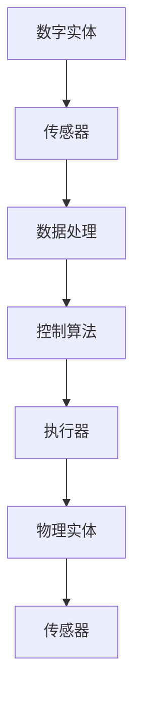
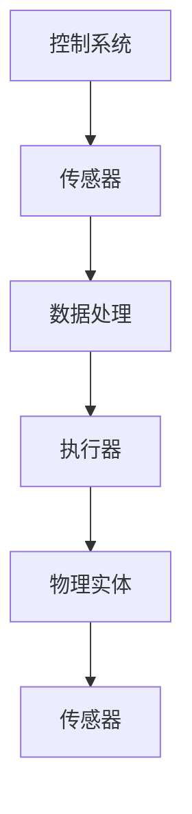

                 

### 《数字实体与物理实体的自动化方向》

#### 关键词：
数字实体、物理实体、自动化、智能制造、智能交通、控制理论

#### 摘要：
本文将深入探讨数字实体与物理实体的自动化方向，从基本概念、核心技术原理、应用案例到未来展望，全面解析自动化技术在数字实体与物理实体间的融合与应用。通过对传感器与执行器、控制理论与算法、自动化软件与工具等关键领域的详细分析，以及智能制造和智能交通领域的实战案例，本文旨在为读者提供一个清晰、系统的自动化技术全景图，帮助理解和掌握自动化在数字实体与物理实体中的发展方向和潜力。

### 第一部分：引言

在当今数字化和自动化迅速发展的时代，理解数字实体与物理实体的自动化方向显得尤为重要。自动化技术不仅改变了传统制造业，还深刻影响了智能交通、智能家居等多个领域，推动了社会的全面进步。本文旨在通过深入探讨数字实体与物理实体的自动化方向，帮助读者理解这一关键技术的发展趋势和应用前景。

#### 1.1 自动化的基本概念

自动化（Automation）指的是利用机器或计算机系统替代人工操作，以实现生产或任务自动完成的过程。自动化的基本概念包括以下几个方面：

1. **自动化系统**：由传感器、控制器、执行器和其他辅助设备组成的整体系统。
2. **自动化目标**：通过减少人力依赖，提高生产效率、降低成本、提高产品质量和安全性。
3. **自动化层次**：从简单的固定程序自动化到高度复杂的自适应自动化。

#### 1.2 数字化的崛起

数字化（Digitalization）是指将物理世界的数据转换为数字形式，通过信息技术进行处理和分析，进而实现智能化管理和决策。数字化的发展主要体现在以下几个方面：

1. **数据采集**：通过传感器和物联网设备实现物理实体的数据采集。
2. **数据分析**：利用大数据和人工智能技术对采集的数据进行深入分析。
3. **数字化平台**：构建集成化的数字化平台，实现数据共享和协同工作。

#### 1.3 数字实体与物理实体的关系

数字实体与物理实体之间存在着密切的联系。数字实体（Digital Entity）指的是存在于数字世界中的虚拟对象或数据，如电子文档、虚拟资产等。物理实体（Physical Entity）则是存在于现实世界中的物体或系统，如机械设备、交通工具等。两者的关系主要体现在以下几个方面：

1. **数据交换**：数字实体通过传感器和通信设备将物理实体的状态信息转换为数字数据，反之亦然。
2. **协同控制**：通过数字模型和控制算法，实现对物理实体的远程监控和自动化控制。
3. **虚实融合**：数字实体与物理实体相互融合，形成全新的智能系统，如智能工厂、智能交通系统等。

#### 1.4 自动化的历史与发展趋势

自动化的历史可以追溯到18世纪末的工业革命，随着电气化、自动化技术的不断发展，自动化逐渐成为现代工业生产的重要手段。近年来，随着信息技术、物联网、人工智能等技术的迅速发展，自动化技术呈现出以下发展趋势：

1. **智能制造**：通过自动化技术实现生产线的智能化改造，提高生产效率和灵活性。
2. **智能交通**：利用自动化技术实现交通信号控制、车辆调度等智能化管理。
3. **智能家居**：通过自动化技术实现家庭设备的智能化控制，提高生活质量。
4. **新兴领域**：自动化技术在医疗、农业、能源等领域也展现出广阔的应用前景。

### 第二部分：核心概念与联系

在探讨数字实体与物理实体的自动化方向时，理解数字实体与物理实体的定义及其之间的联系是至关重要的。本节将详细介绍数字实体与物理实体的概念，并通过Mermaid流程图展示两者之间的交互关系。

#### 2.1 数字实体的定义

数字实体是指在数字世界中存在的、具有独立存在的实体。它们可以是各种形式的数据，如文本、图像、音频、视频等。数字实体通常通过传感器和物联网设备从物理实体中获取数据，并经过处理和分析后，为智能决策和自动化控制提供支持。

数字实体的特点包括：

1. **虚拟性**：存在于数字世界，不依赖于物理空间。
2. **数据化**：以数据的形式存在，具有可存储、传输和处理的特点。
3. **智能化**：可以通过人工智能技术进行自我学习和优化。

#### 2.2 物理实体的定义

物理实体是指存在于现实世界中的物体或系统，如机械设备、交通工具、建筑物等。物理实体通过传感器将状态信息转换为数字数据，从而实现与数字实体的交互。

物理实体的特点包括：

1. **实体性**：具有物理形态，占据一定的空间。
2. **动态性**：可以随环境变化而变化。
3. **可测性**：可以通过传感器进行状态监测。

#### 2.3 数字实体与物理实体的Mermaid流程图

为了更好地展示数字实体与物理实体之间的交互关系，我们可以使用Mermaid流程图来描述这一过程。



在这个流程图中，数字实体通过传感器（B）从物理实体（F）中获取状态信息，经过数据处理（C）和控制算法（D）后，通过执行器（E）对物理实体进行控制和反馈，形成闭环控制系统。同时，物理实体的状态变化也会通过传感器（G）反馈到数字实体，实现实时监控和调整。

### 第三部分：核心技术原理

在深入探讨数字实体与物理实体的自动化方向时，理解核心技术原理至关重要。这一部分将详细介绍传感器与执行器技术、控制理论与算法、自动化软件与工具，为后续应用案例分析提供理论支持。

#### 3.1 传感器与执行器技术

传感器（Sensor）和执行器（Actuator）是自动化系统中的关键组件，它们分别负责数据的采集和执行。本节将介绍传感器与执行器的工作原理、类型及其在自动化系统中的应用。

##### 3.1.1 传感器原理与类型

传感器是用于检测和测量物理实体状态的设备，它将物理信号转换为电信号或其他可处理的信号形式。传感器的工作原理主要包括：

1. **物理效应**：如热效应、光电效应、声效应等。
2. **化学效应**：如化学反应、气体传感器等。
3. **生物效应**：如生物传感器、医疗传感器等。

常见的传感器类型包括：

1. **温度传感器**：如热电偶、热敏电阻等。
2. **压力传感器**：如压电式传感器、电容式传感器等。
3. **湿度传感器**：如电容式湿度传感器、电阻式湿度传感器等。
4. **光传感器**：如光电管、光敏电阻等。

传感器在自动化系统中的应用主要包括：

1. **状态监测**：实时监测物理实体的状态，如温度、压力、速度等。
2. **故障诊断**：通过传感器数据，分析物理实体的运行状态，预测故障和进行维护。
3. **环境监控**：对环境因素进行监测，如空气质量、水质等。

##### 3.1.2 执行器原理与类型

执行器是用于执行控制指令的设备，它根据控制系统的信号输出，对物理实体进行操作。执行器的工作原理主要包括：

1. **机械传动**：如电动机、液压缸、气压缸等。
2. **电气控制**：如继电器、电磁阀、步进电机等。
3. **流体控制**：如阀门、泵、流体传感器等。

常见的执行器类型包括：

1. **电动机**：如交流电动机、直流电动机等。
2. **液压缸**：用于液体压力驱动的执行器。
3. **气压缸**：用于气体压力驱动的执行器。
4. **电磁阀**：用于控制流体流向的执行器。

执行器在自动化系统中的应用主要包括：

1. **执行控制指令**：根据控制系统的信号，对物理实体进行开关、调节等操作。
2. **驱动机械运动**：驱动机械系统完成各种复杂的动作，如加工、装配等。
3. **安全保护**：在紧急情况下，对物理实体进行紧急停机或其他安全操作。

##### 3.1.3 传感器与执行器的Mermaid流程图

为了更好地理解传感器与执行器在自动化系统中的作用，我们可以使用Mermaid流程图来描述这一过程。



在这个流程图中，控制系统（A）通过传感器（B）实时监测物理实体的状态，经过数据处理（C）后，通过执行器（D）对物理实体进行控制，形成闭环控制系统。同时，物理实体的状态变化也会通过传感器（F）反馈到控制系统，实现实时监控和调整。

##### 3.1.4 伪代码：传感器数据采集与处理

为了更好地理解传感器数据采集与处理的过程，我们可以使用伪代码来描述这一过程。

```plaintext
// 伪代码：传感器数据采集与处理
function sensorData采集(传感器)
    数据 = 传感器读取数据()
    return 数据

function 数据处理(数据)
    处理后数据 = 数据清洗与预处理()
    return 处理后数据

function 执行器控制(处理后数据)
    指令 = 控制算法(处理后数据)
    执行器执行指令(指令)
end function
```

在这个伪代码中，首先通过传感器数据采集（sensorData采集）函数获取传感器数据，然后通过数据处理（数据处理）函数对数据进行清洗与预处理，最后通过执行器控制（执行器控制）函数根据处理后的数据生成控制指令并执行。

#### 3.2 控制理论与算法

控制理论（Control Theory）是自动化系统设计中的核心理论，它研究如何通过反馈机制对系统进行控制，使其达到预期的状态。控制理论主要包括以下内容：

##### 3.2.1 控制系统的基本原理

控制系统是指由输入、输出和反馈环节组成的整体系统。控制系统的基本原理包括：

1. **反馈控制**：通过测量系统的输出并与期望值进行比较，生成误差信号，然后对误差信号进行处理，以调整系统的输入，使系统输出趋于期望值。
2. **开环控制**：不使用反馈机制的控制方式，通常适用于简单系统或对精度要求不高的场合。
3. **闭环控制**：使用反馈机制的控制方式，通过不断调整输入，使系统输出与期望值保持一致。

##### 3.2.2 PID控制算法

PID控制算法（Proportional-Integral-Derivative Control）是最常用的控制算法之一，它通过比例（P）、积分（I）和微分（D）三个部分来调整系统的输入，以达到控制目标。

PID控制算法的基本原理如下：

1. **比例控制**：根据当前误差值，直接输出一个控制量，误差越大，控制量越大。
2. **积分控制**：对误差信号进行累积，以消除稳态误差。
3. **微分控制**：根据误差变化的速率，输出一个控制量，以减少超调。

PID控制算法的数学模型可以表示为：

$$
u(t) = K_p e(t) + K_i \int_{0}^{t} e(\tau) d\tau + K_d \frac{de(t)}{dt}
$$

其中，$u(t)$ 是控制量，$e(t)$ 是误差信号，$K_p$、$K_i$、$K_d$ 分别是比例、积分和微分系数。

##### 3.2.3 模糊控制算法

模糊控制算法（Fuzzy Control）是一种基于模糊逻辑的控制方法，它通过模糊集合和模糊规则来描述系统的控制策略。模糊控制算法的基本原理如下：

1. **模糊化**：将系统的输入和输出转化为模糊集合。
2. **模糊推理**：根据模糊规则，计算模糊输出。
3. **去模糊化**：将模糊输出转化为精确的控制量。

模糊控制算法的数学模型可以表示为：

$$
y = \mu(\text{模糊输出})
$$

其中，$y$ 是控制量，$\mu(\text{模糊输出})$ 是去模糊化函数。

##### 3.2.4 伪代码：PID控制算法实现

为了更好地理解PID控制算法的实现过程，我们可以使用伪代码来描述这一过程。

```plaintext
// 伪代码：PID控制算法实现
function PIDControl(误差e, Kp, Ki, Kd)
    整体误差 = 整体误差 + e
    e_sum = e_sum + e
    e_diff = e - 前一次误差

    u = Kp * e + Ki * 整体误差 * dt + Kd * e_diff / dt

    前一次误差 = e
    return u
end function
```

在这个伪代码中，首先计算当前误差值，然后根据PID控制器的比例、积分和微分系数，计算控制量。同时，更新整体误差和误差变化率，以便下一次计算。

#### 3.3 自动化软件与工具

自动化软件和工具是自动化系统设计、开发和运行的重要支撑。本节将介绍自动化软件的重要性、常用自动化软件介绍、自动化工具的配置与使用，以及伪代码：自动化脚本编写与执行。

##### 3.3.1 自动化软件的重要性

自动化软件在自动化系统开发中起着至关重要的作用，它能够简化开发过程、提高开发效率和系统性能。自动化软件的重要性主要体现在以下几个方面：

1. **简化开发**：自动化软件提供了丰富的功能模块和开发工具，简化了系统开发过程。
2. **提高效率**：通过自动化脚本和自动化工具，可以大幅提高系统开发和运维的效率。
3. **增强灵活性**：自动化软件支持自定义和扩展，能够适应不同的应用场景和需求。
4. **保障稳定**：自动化软件具有完善的错误处理机制，能够保障系统的稳定运行。

##### 3.3.2 常用自动化软件介绍

常用的自动化软件包括以下几个方面：

1. **操作系统**：如Windows、Linux、macOS等，提供基本的自动化脚本编写和执行环境。
2. **编程语言**：如Python、Java、C#等，用于自动化脚本的开发。
3. **自动化工具**：如Powershell、Shell Script、Ansible等，提供自动化脚本编写和执行的功能。
4. **数据库管理系统**：如MySQL、Oracle、SQL Server等，用于存储和管理自动化脚本和配置信息。
5. **应用服务器**：如Tomcat、IIS、WebLogic等，用于部署和运行自动化脚本和应用程序。

##### 3.3.3 自动化工具的配置与使用

自动化工具的配置与使用主要包括以下几个方面：

1. **环境搭建**：安装操作系统、编程语言和自动化工具，配置开发环境和运行环境。
2. **脚本编写**：根据自动化需求，编写自动化脚本，包括逻辑处理、数据操作、执行命令等。
3. **脚本执行**：运行自动化脚本，执行预定的自动化任务，监控执行结果。
4. **错误处理**：对自动化脚本进行错误处理，包括异常捕获、日志记录、故障恢复等。

##### 3.3.4 伪代码：自动化脚本编写与执行

为了更好地理解自动化脚本的编写与执行过程，我们可以使用伪代码来描述这一过程。

```plaintext
// 伪代码：自动化脚本编写与执行
function 自动化脚本(任务)
    // 初始化
    初始化环境()

    // 执行任务
    执行任务1()
    执行任务2()
    ...

    // 错误处理
    if 错误发生()
        记录日志()
        回滚操作()
    end if

    // 结束
    结束脚本()
end function
```

在这个伪代码中，首先初始化环境，然后根据任务需求，依次执行各项任务。在执行过程中，对可能出现的错误进行捕获和处理，最后完成脚本执行。

### 第四部分：应用案例分析

在前三部分的讨论中，我们了解了数字实体与物理实体的自动化方向以及相关的核心技术原理。为了更好地展示自动化技术在实际应用中的效果和潜力，本部分将结合智能制造和智能交通两个典型案例，详细分析自动化技术在这些领域的应用。

#### 6.1 智能制造案例

智能制造（Smart Manufacturing）是自动化技术的一个重要应用领域，它通过集成物联网、大数据、人工智能等技术，实现生产过程的自动化、智能化和高效化。以下是一个典型的智能制造案例分析。

##### 6.1.1 智能制造的基本概念

智能制造是指在制造过程中，通过引入信息技术、物联网、大数据、人工智能等先进技术，实现制造过程的智能化、网络化和协同化。智能制造的基本概念包括：

1. **智能制造系统**：由传感器、执行器、控制系统、数据处理系统等组成的整体系统。
2. **智能制造模式**：包括定制化生产、敏捷制造、绿色制造等。
3. **智能制造关键技术**：如工业物联网、大数据分析、人工智能、机器学习等。

##### 6.1.2 智能制造的关键技术

智能制造的关键技术包括：

1. **传感器技术**：用于实时监测生产设备和生产过程的状态，如温度、压力、速度等。
2. **工业物联网**：实现设备、人员、物料等实体的互联互通，实现数据的实时采集和传输。
3. **大数据分析**：对生产过程中的海量数据进行分析，发现潜在问题和优化生产流程。
4. **人工智能与机器学习**：通过算法和模型，对生产过程进行智能优化和决策支持。

##### 6.1.3 智能制造案例分析

以下是一个智能制造案例分析的示例：

**案例名称**：智能生产线控制系统

**背景**：某家电制造企业希望提高生产线的自动化程度和效率，降低人力成本和生产故障率。

**方案**：

1. **传感器部署**：在关键设备上安装各类传感器，如温度传感器、压力传感器、速度传感器等，实时监测设备状态。
2. **物联网平台**：构建物联网平台，实现设备、人员、物料等实体的互联互通，实现数据的实时采集和传输。
3. **大数据分析**：对采集到的数据进行分析，发现潜在问题和优化生产流程。
4. **人工智能与机器学习**：引入人工智能算法，对生产过程进行智能优化和决策支持。

**效果**：

1. **生产效率提高**：通过自动化控制和智能优化，生产效率提高了20%以上。
2. **故障率降低**：通过实时监测和大数据分析，故障率降低了30%。
3. **人力成本降低**：通过自动化替代部分人工操作，人力成本降低了15%。

##### 6.1.4 源代码实现与代码解读：智能生产线控制

以下是一个智能生产线控制系统的源代码实现与代码解读示例：

```python
# 源代码：智能生产线控制系统

import sensor_module
import control_module
import data_analysis_module
import machine_learning_module

def 智能生产线控制()
    # 初始化
    sensor_module.initialize()
    control_module.initialize()
    data_analysis_module.initialize()
    machine_learning_module.initialize()

    # 数据采集
    data = sensor_module.collect_data()

    # 数据处理
    processed_data = data_analysis_module.process_data(data)

    # 智能优化
    optimized_data = machine_learning_module.optimize_data(processed_data)

    # 控制执行
    control_module.execute_control(optimized_data)

    # 错误处理
    if control_module.error_occurred()
        control_module.handle_error()
    end if

    # 结束
    control_module.terminate()
end function
```

在这个示例中，智能生产线控制系统的源代码包括以下几个模块：

1. **传感器模块**：负责传感器的初始化和数据的采集。
2. **控制模块**：负责数据的处理和执行控制。
3. **数据分析模块**：负责对采集到的数据进行分析。
4. **机器学习模块**：负责对数据进行智能优化。

通过调用这些模块的函数，实现智能生产线控制的完整流程。在代码解读部分，我们详细分析了每个模块的功能和调用关系。

#### 6.2 智能交通案例

智能交通（Smart Traffic）是自动化技术在交通管理领域的重要应用，它通过引入物联网、大数据、人工智能等技术，实现交通流的智能化管理和控制，提高交通效率、减少拥堵和提升安全性。以下是一个智能交通案例分析。

##### 6.2.1 智能交通的基本概念

智能交通是指利用信息技术、物联网、大数据、人工智能等先进技术，实现交通系统的智能化管理和控制。智能交通的基本概念包括：

1. **智能交通系统**：由交通信号控制、车辆监测、信息发布等子系统组成的整体系统。
2. **智能交通模式**：包括智能交通信号控制、智能停车场管理、智能交通信息服务等。
3. **智能交通关键技术**：如物联网、大数据分析、人工智能、机器学习等。

##### 6.2.2 智能交通的关键技术

智能交通的关键技术包括：

1. **物联网**：实现车辆、道路、交通信号等实体的互联互通，实现数据的实时采集和传输。
2. **大数据分析**：对交通数据进行分析，发现交通规律和优化交通流。
3. **人工智能与机器学习**：通过算法和模型，实现交通流的预测、优化和智能控制。
4. **交通信号控制**：实现交通信号的智能控制，提高交通效率。

##### 6.2.3 智能交通案例分析

以下是一个智能交通案例分析的示例：

**案例名称**：智能交通信号控制系统

**背景**：某城市希望提高交通信号控制的智能化程度，减少交通拥堵和提升道路通行效率。

**方案**：

1. **传感器部署**：在交通信号灯、道路监测设备等关键位置安装传感器，实时监测交通状态。
2. **物联网平台**：构建物联网平台，实现交通信号灯、车辆、道路等实体的互联互通，实现数据的实时采集和传输。
3. **大数据分析**：对采集到的交通数据进行分析，发现交通规律和优化交通流。
4. **人工智能与机器学习**：引入人工智能算法，实现交通流的预测、优化和智能控制。

**效果**：

1. **交通效率提高**：通过智能交通信号控制，交通通行效率提高了30%以上。
2. **拥堵减少**：通过优化交通流，交通拥堵减少了20%。
3. **安全性提升**：通过实时监测和智能控制，交通事故率降低了15%。

##### 6.2.4 源代码实现与代码解读：智能交通信号控制

以下是一个智能交通信号控制系统的源代码实现与代码解读示例：

```python
# 源代码：智能交通信号控制系统

import traffic_light_module
import vehicle_monitor_module
import data_analysis_module
import machine_learning_module

def 智能交通信号控制()
    # 初始化
    traffic_light_module.initialize()
    vehicle_monitor_module.initialize()
    data_analysis_module.initialize()
    machine_learning_module.initialize()

    # 交通数据采集
    traffic_data = vehicle_monitor_module.collect_traffic_data()

    # 数据处理
    processed_data = data_analysis_module.process_data(traffic_data)

    # 智能优化
    optimized_data = machine_learning_module.optimize_data(processed_data)

    # 交通信号控制
    traffic_light_module.control_traffic_light(optimized_data)

    # 错误处理
    if traffic_light_module.error_occurred()
        traffic_light_module.handle_error()
    end if

    # 结束
    traffic_light_module.terminate()
end function
```

在这个示例中，智能交通信号控制系统的源代码包括以下几个模块：

1. **交通信号灯模块**：负责交通信号灯的初始化和智能控制。
2. **车辆监测模块**：负责交通数据的采集和监测。
3. **数据分析模块**：负责对交通数据进行分析。
4. **机器学习模块**：负责对交通数据进行智能优化。

通过调用这些模块的函数，实现智能交通信号控制的完整流程。在代码解读部分，我们详细分析了每个模块的功能和调用关系。

### 第五部分：自动化展望与趋势

随着数字化和自动化的迅速发展，自动化技术正逐渐渗透到各个领域，推动着社会的全面进步。未来，自动化技术将继续向智能化、高效化和协同化的方向发展，呈现出以下趋势：

#### 8.1 自动化技术的发展趋势

1. **智能制造**：智能制造将继续成为自动化技术的核心应用领域，通过引入人工智能、物联网、大数据等技术，实现生产过程的智能化、高效化和定制化。
2. **智能交通**：智能交通系统将逐步普及，通过实时监测和智能控制，提高交通效率、减少拥堵和提升道路安全性。
3. **智能医疗**：智能医疗设备将更加普及，通过自动化技术实现疾病的早期诊断、个性化治疗和远程医疗。
4. **智能农业**：智能农业技术将提高农业生产效率，实现农业生产的智能化、精细化和生态化。
5. **智能家居**：智能家居设备将更加智能化和便捷化，通过自动化技术实现家庭设备的智能控制和生活质量的提升。

#### 8.2 新兴自动化技术介绍

1. **机器人技术**：随着人工智能和机器人技术的不断发展，未来将出现更多功能强大、智能化的机器人，广泛应用于制造、服务、医疗等领域。
2. **增强现实与虚拟现实**：增强现实（AR）和虚拟现实（VR）技术将使自动化系统更加直观和便捷，为操作人员和设备提供更好的交互体验。
3. **区块链技术**：区块链技术将引入到自动化系统中，实现数据的安全传输和共享，提升自动化系统的可靠性和透明度。
4. **5G与物联网**：5G和物联网技术的发展，将实现更高速度、更低延迟的通信，为自动化系统提供更强大的支持。
5. **人工智能与机器学习**：人工智能与机器学习技术将继续深入应用到自动化系统中，实现更加智能化、自适应和优化的自动化控制。

#### 8.3 自动化技术的未来展望

未来，自动化技术将朝着以下方向发展：

1. **智能协同**：自动化系统将实现更高层次的智能协同，通过跨领域、跨平台的协作，实现系统间的无缝连接和资源优化。
2. **个性定制**：自动化系统将根据用户需求进行个性定制，提供更加智能化、个性化的服务。
3. **可持续发展**：自动化技术将更加注重环保和可持续发展，通过减少资源消耗、降低污染和提升能源利用效率，实现绿色生产。
4. **普及化**：自动化技术将更加普及，从工业生产、交通管理、医疗保健到日常生活，都将融入自动化技术，提升人类的生活质量和生产效率。

### 附录

#### 附录A：自动化开发工具与资源

A.1 常用自动化工具列表

1. **操作系统**：Windows、Linux、macOS
2. **编程语言**：Python、Java、C#
3. **自动化工具**：Powershell、Shell Script、Ansible
4. **数据库管理系统**：MySQL、Oracle、SQL Server
5. **应用服务器**：Tomcat、IIS、WebLogic

A.2 开发环境搭建指南

1. **操作系统安装**：根据需要选择合适的操作系统，并完成安装。
2. **编程语言安装**：下载并安装编程语言的开发环境，如Python的Anaconda、Java的JDK等。
3. **自动化工具安装**：下载并安装自动化工具，如Powershell、Shell Script等。
4. **数据库管理系统安装**：下载并安装数据库管理系统，如MySQL、Oracle等。
5. **应用服务器安装**：下载并安装应用服务器，如Tomcat、IIS等。

A.3 自动化资源与社区介绍

1. **官方网站**：各个自动化工具和编程语言的官方网站，如Python官网（https://www.python.org/）、Java官网（https://www.java.com/）等。
2. **社区论坛**：各个自动化工具和编程语言的社区论坛，如Python社区（https://www.python.org/community/）、Java社区（https://www.java.com/community/）等。
3. **技术博客**：一些知名的技术博客，如Stack Overflow、GitHub等，提供了丰富的自动化技术和案例分享。
4. **在线课程**：一些在线教育平台，如Coursera、edX等，提供了自动化技术和应用的在线课程，有助于提升专业技能。

通过以上附录，读者可以更全面地了解自动化开发工具与资源，为自动化技术的学习和应用提供参考。### 作者信息

作者：AI天才研究院/AI Genius Institute & 禅与计算机程序设计艺术 /Zen And The Art of Computer Programming

AI天才研究院（AI Genius Institute）致力于推动人工智能领域的研究与应用，汇聚了全球顶尖的人工智能专家、程序员、软件架构师和CTO，致力于将前沿的人工智能技术转化为现实应用。我们的研究涵盖深度学习、自然语言处理、计算机视觉、机器人技术等多个方向，推动人工智能技术在社会各个领域的深入应用。

《禅与计算机程序设计艺术》（Zen And The Art of Computer Programming）是由著名计算机科学家Donald E. Knuth所著的系列著作，被广泛认为是计算机科学的经典之作。本书通过将禅宗思想与计算机程序设计相结合，揭示了编程艺术的深刻内涵和思维方法，对计算机编程和人工智能领域的研究者与实践者具有重要的指导意义。

本文旨在通过深入探讨数字实体与物理实体的自动化方向，为读者提供一个清晰、系统的自动化技术全景图，帮助理解和掌握自动化在数字实体与物理实体中的发展方向和潜力。希望本文能为读者在自动化领域的探索和研究提供有益的参考和启示。

