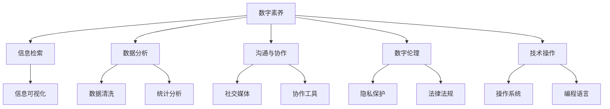

                 

# 《数字素养：公民参与的基石》

> **关键词：** 数字素养、公民参与、教育、技能培养、公共事务管理、数字治理

> **摘要：** 本文深入探讨了数字素养在现代社会中的重要性，分析了其核心概念与联系，详细讲解了相关算法原理和数学模型。通过实际项目案例，展示了数字素养在公共事务管理和数字治理中的应用，并展望了未来的发展趋势。本文旨在为提升公民数字素养提供理论指导和实践参考。

## 《数字素养：公民参与的基石》目录大纲

### 第一部分：数字素养概述

#### 第1章：数字素养的重要性
##### 1.1 数字时代的变革
##### 1.2 数字素养的定义与分类
##### 1.3 数字素养的核心能力

#### 第2章：数字素养的教育
##### 2.1 数字素养教育的目标
##### 2.2 数字素养教育的挑战
##### 2.3 数字素养教育的方法与策略

### 第二部分：数字素养的技能培养

#### 第3章：数字信息获取与处理
##### 3.1 信息检索技巧
##### 3.2 数据分析基础
##### 3.3 信息可视化技术

#### 第4章：数字沟通与协作
##### 4.1 数字沟通的基本原则
##### 4.2 社交媒体的运用
##### 4.3 数字协作工具的使用

#### 第5章：数字伦理与法律
##### 5.1 数字伦理的内涵
##### 5.2 数字隐私保护
##### 5.3 数字法律法规概览

### 第三部分：数字素养在公民参与中的应用

#### 第6章：数字素养在公共事务管理中的应用
##### 6.1 数字素养与电子政务
##### 6.2 数字素养与公民监督
##### 6.3 数字素养与社区治理

#### 第7章：数字素养与数字治理
##### 7.1 数字治理的概念与框架
##### 7.2 数字治理的优势与挑战
##### 7.3 数字素养在数字治理中的重要作用

### 第四部分：数字素养的未来展望

#### 第8章：数字素养的发展趋势
##### 8.1 人工智能与数字素养
##### 8.2 区块链技术的影响
##### 8.3 未来的数字素养教育

### 附录

#### 附录 A：数字素养相关资源与工具
##### A.1 教育资源推荐
##### A.2 开源工具介绍
##### A.3 社交媒体资源链接

**附录 B：核心概念联系图**

**附录 C：核心算法原理讲解**

**附录 D：源代码详细实现和代码解读**

---

### 第一部分：数字素养概述

#### 第1章：数字素养的重要性

##### 1.1 数字时代的变革

在过去的几十年中，数字技术经历了快速的发展，从早期的计算机和互联网到现在的移动设备、大数据和人工智能，数字化已经渗透到我们生活的方方面面。随着技术的进步，社会结构和人们的生活方式也在发生深刻的变革。在这个数字化的时代，数字素养成为了一个不可或缺的概念。

数字时代的一个显著特征是信息爆炸。大量信息通过互联网和移动设备快速传播，人们需要掌握有效的信息检索和处理技巧，以从海量数据中提取有价值的信息。同时，数字技术的发展也为人们提供了更多的沟通和协作工具，如何正确使用这些工具，提高沟通效率，成为了一个重要的技能。

另一个重要的变革是数字化的治理模式。电子政务、数字治理和智慧城市建设等新兴领域，需要公民具备一定的数字素养，以便能够参与到公共事务的管理和决策过程中。此外，数字经济的兴起也为人们提供了更多的就业机会，数字素养成为人们求职和职业发展的基础。

##### 1.2 数字素养的定义与分类

数字素养是指个体在数字环境中获取、使用、理解数字信息的能力，以及利用这些能力解决实际问题的能力。它不仅包括技术层面的知识，如操作系统、编程语言、数据库管理等，还包括信息素养、媒体素养、伦理素养等更广泛的方面。

根据不同的维度，数字素养可以分为多个类别：

1. **技术素养**：指个体对计算机硬件、软件和网络技术的理解和操作能力。例如，掌握如何使用操作系统、浏览器、电子邮件等基本工具。
2. **信息素养**：指个体在信息过载的环境中，能够有效地查找、评估和使用信息的能力。包括信息检索技巧、信息分析能力、信息可视化等。
3. **媒体素养**：指个体理解和批判性地评估数字媒体内容的能力，包括识别虚假信息、理解数字媒体传播机制等。
4. **伦理素养**：指个体在数字环境中遵守伦理规范、保护隐私和数据安全的能力，包括数字伦理、网络安全、版权法律等。

##### 1.3 数字素养的核心能力

数字素养的核心能力主要包括以下几个方面：

1. **信息检索与处理能力**：个体需要能够高效地使用搜索引擎、数据库和其他信息资源来获取所需信息，并能对信息进行筛选、整理和分析。
2. **沟通与协作能力**：个体需要掌握使用电子邮件、即时通讯、社交媒体等数字工具进行有效沟通的技巧，并能利用协作平台进行团队合作。
3. **技术操作能力**：个体需要具备基本的计算机操作能力，包括操作系统、软件安装与配置、文件管理、网络连接等。
4. **问题解决能力**：个体需要能够利用数字工具和技术解决实际问题，例如编程解决问题、数据分析等。
5. **伦理和法律意识**：个体需要了解数字伦理和法律法规，能够保护自己的隐私和数据安全，并遵守网络行为规范。

在接下来的章节中，我们将进一步探讨数字素养的教育、技能培养以及其在公民参与中的应用。通过这些讨论，我们将深入理解数字素养的重要性，并思考如何提升个体的数字素养，以更好地适应数字时代的挑战。

---

### 第二部分：数字素养的教育

#### 第2章：数字素养的教育

数字素养教育是提升个体数字素养的重要途径。在数字时代，教育系统需要重新定义数字素养教育的目标和内容，以培养具有全面数字素养的公民。

##### 2.1 数字素养教育的目标

数字素养教育的目标可以分为以下几个方面：

1. **知识传授**：为学生提供基本的数字技术知识，包括计算机硬件、软件和网络的基本概念，以及常用的数字工具和软件的使用方法。
2. **技能培养**：培养学生的数字技能，如信息检索、数据分析、编程等，使他们能够在实际应用中有效地利用数字技术解决问题。
3. **伦理和法律意识**：教育学生遵守数字伦理和法律法规，保护自己的隐私和数据安全，并尊重他人的知识产权。
4. **批判性思维**：培养学生的批判性思维能力，使他们能够评估数字信息，识别虚假信息，并理解数字媒体传播的机制。
5. **问题解决能力**：培养学生的问题解决能力，使他们能够在数字环境中独立思考和解决实际问题。

##### 2.2 数字素养教育的挑战

尽管数字素养教育的目标明确，但在实际实施过程中仍面临诸多挑战：

1. **技术更新快**：数字技术更新迅速，教育内容需要不断更新以跟上技术的发展。教师和学生都需要不断学习新的知识和技能。
2. **教育资源不平衡**：不同地区和学校之间的教育资源存在较大差异，一些学生可能无法获得优质的数字素养教育资源。
3. **学生参与度低**：部分学生对数字素养教育缺乏兴趣，参与度不高，影响教学效果。
4. **教师专业发展**：教师需要具备较高的数字素养，但现实中许多教师缺乏相关的培训和学习机会。
5. **网络安全问题**：数字素养教育中需要教育学生如何保护自己的网络安全，但网络安全问题复杂多变，教育内容难以全面覆盖。

##### 2.3 数字素养教育的方法与策略

为了克服上述挑战，数字素养教育需要采取一系列的方法与策略：

1. **课程设计**：将数字素养教育融入各个学科，设计跨学科的课程，以培养学生的综合能力。例如，在数学课程中教授数据分析，在语文课程中教授信息检索和批判性思维。
2. **混合式教学**：结合传统课堂教学和在线学习，利用数字化资源和工具提高教学效果。例如，通过在线课程、视频讲座、互动讨论等，增强学生的自主学习能力。
3. **实践教学**：通过实际操作和项目实践，让学生在真实环境中应用所学知识，提高实际解决问题的能力。例如，组织学生参与数字媒体制作、编程项目等。
4. **教师培训**：为教师提供专业的数字素养培训，提高他们的数字技能和教育水平。例如，组织教师参加工作坊、研讨会、在线课程等。
5. **教育资源建设**：开发高质量的数字素养教育资源，如教材、课程、教学视频等，并确保这些资源能够被广泛使用。例如，建立数字素养教育平台，提供丰富的教学资源。
6. **家校合作**：家长和教育机构共同参与数字素养教育，共同关注学生的数字素养发展。例如，家长可以协助学生进行数字素养相关的家庭作业，教育机构可以组织家长参与数字素养教育活动。

通过这些方法和策略，数字素养教育可以更有效地培养学生的数字素养，为他们的未来发展和参与公共事务打下坚实基础。

---

### 第三部分：数字素养的技能培养

#### 第3章：数字信息获取与处理

在数字时代，信息的获取与处理能力成为数字素养的核心要素之一。有效的信息检索与处理能力不仅有助于个体在学习和工作中获取所需信息，还能提高信息分析的能力，为决策提供有力支持。

##### 3.1 信息检索技巧

信息检索是数字素养的重要技能之一。以下是一些常用的信息检索技巧：

1. **关键词搜索**：使用准确的关键词是进行有效信息检索的基础。为了提高搜索效率，可以采用以下策略：
   - **使用精确匹配**：使用引号将关键词括起来，如“数字素养”。
   - **使用逻辑运算符**：使用“AND”、“OR”、“NOT”等逻辑运算符，缩小或扩展搜索范围。例如，“数字素养 AND 教育”。
   - **使用通配符**：在关键词中使用通配符“*”，代表任意字符。例如，搜索“dig*素养”可以找到包含“数字素养”或“数字信息素养”等词的文章。

2. **利用高级搜索功能**：大多数搜索引擎都提供高级搜索功能，如限定搜索范围、搜索特定文件类型等。例如，在Google搜索中，可以使用“site:”限定搜索特定网站，使用“filetype:pdf”限定搜索特定文件类型。

3. **使用元搜索引擎**：元搜索引擎可以同时搜索多个搜索引擎的结果，提供更全面的信息检索服务。例如，Dogpile和MetaGrawler等。

4. **利用专业数据库**：对于特定领域的信息检索，可以使用专业数据库，如学术期刊数据库、医学数据库等。这些数据库通常提供更精确的检索功能和更全面的信息资源。

##### 3.2 数据分析基础

数据分析是数字素养的重要组成部分。以下是一些基本的数据分析概念和技巧：

1. **数据清洗**：在进行分析之前，需要对数据进行清洗，去除重复值、缺失值和异常值。常用的数据清洗方法包括：
   - **去重**：删除重复的数据记录。
   - **填充缺失值**：使用平均值、中位数或最大值等统计方法填充缺失值。
   - **异常值处理**：识别并处理异常值，可以选择删除或使用统计方法进行调整。

2. **数据转换**：数据转换包括数据格式转换、数据类型转换和数据编码转换等。例如，将文本数据转换为数值数据，或将日期格式从YYYY-MM-DD转换为DD/MM/YYYY。

3. **数据可视化**：数据可视化是数据分析的重要工具，可以帮助我们直观地理解数据。常用的数据可视化工具包括Excel、Tableau、Matplotlib等。以下是一些基本的数据可视化方法：
   - **柱状图**：用于比较不同类别或组的数据。
   - **折线图**：用于显示数据的变化趋势。
   - **散点图**：用于显示两个变量之间的关系。
   - **饼图**：用于显示各部分占整体的比例。

4. **统计分析**：统计分析是数据分析的核心。常用的统计方法包括：
   - **描述性统计分析**：计算均值、中位数、标准差等基本统计量，用于描述数据的基本特征。
   - **推断性统计分析**：使用样本数据推断总体特征，如假设检验、置信区间等。

##### 3.3 信息可视化技术

信息可视化技术是将复杂信息以图形化的方式呈现，使信息更易于理解和分析。以下是一些常用的信息可视化技术：

1. **网络图**：网络图用于表示实体之间的关系，可以揭示数据中的复杂结构。例如，社交媒体分析中可以使用网络图展示用户之间的关系。

2. **时序图**：时序图用于显示数据随时间的变化趋势，适用于金融、气象等领域的数据分析。

3. **热力图**：热力图用颜色深浅表示数据的密度，常用于显示地理数据、文本情感分析等。

4. **词云**：词云是将文本中出现频率较高的词以大号字体显示，用于快速了解文本的主要内容。

通过掌握这些信息检索和数据分析的技巧，个体可以更高效地获取和处理数字信息，提高决策质量和工作效率。在下一章中，我们将探讨数字沟通与协作的技能培养。

---

#### 第4章：数字沟通与协作

在数字时代，沟通与协作已成为个体和组织的重要技能。随着社交媒体和协作工具的普及，数字沟通与协作的技巧变得越来越重要。以下章节将探讨数字沟通的基本原则、社交媒体的运用以及数字协作工具的使用。

##### 4.1 数字沟通的基本原则

数字沟通与传统的面对面沟通不同，它依赖于文本、音频和视频等媒介。以下是数字沟通的一些基本原则：

1. **明确目标**：在进行数字沟通前，明确沟通的目标和目的，以便确保沟通的针对性。
2. **简洁明了**：数字沟通应尽量简洁明了，避免冗长的文字和复杂的句子，以提高沟通效率。
3. **尊重对方**：在数字沟通中，尊重对方的观点和意见，保持礼貌和友善的态度。
4. **及时回复**：尽管数字沟通可能跨越时间和地域，但应及时回复对方的信息，以保持沟通的连贯性。
5. **注意语气**：在数字沟通中，语气和表情无法直接传达，因此需要特别注意语气的表达，以避免误解和冲突。

##### 4.2 社交媒体的运用

社交媒体已成为数字沟通的主要工具之一。以下是社交媒体的一些基本运用技巧：

1. **选择合适的平台**：根据沟通的目的和受众，选择合适的社交媒体平台，如微信、微博、LinkedIn等。
2. **制定内容策略**：制定有针对性的内容策略，包括发布频率、内容类型和传播方式，以吸引和留住受众。
3. **互动与参与**：积极参与社交媒体上的讨论和互动，提高受众的参与度和忠诚度。
4. **监测和反馈**：通过监测社交媒体上的反馈和互动数据，了解受众的反应和需求，不断优化内容策略。
5. **合规与安全**：遵守社交媒体平台的规定和法律法规，确保信息的合规性和安全性。

##### 4.3 数字协作工具的使用

数字协作工具可以提高团队的工作效率和信息共享。以下是几种常用的数字协作工具：

1. **即时通讯工具**：如微信、Slack、Telegram等，用于实时沟通和协作。
2. **文档协作工具**：如Google文档、微软Word、Notepad++等，用于多人实时编辑和协作。
3. **项目管理工具**：如Trello、Asana、Jira等，用于项目规划和任务管理。
4. **视频会议工具**：如Zoom、Microsoft Teams、Google Meet等，用于远程会议和在线协作。
5. **云存储工具**：如Google Drive、Dropbox、OneDrive等，用于文件存储和共享。

通过掌握这些数字沟通与协作的技巧，个体可以更有效地与他人沟通和协作，提高工作效率和质量。在下一章中，我们将探讨数字伦理与法律的重要性。

---

#### 第5章：数字伦理与法律

在数字时代，数字伦理和法律问题日益受到关注。随着互联网和数字技术的发展，个人隐私、数据安全、知识产权等问题日益突出。本章将探讨数字伦理的内涵、数字隐私保护和数字法律法规概览。

##### 5.1 数字伦理的内涵

数字伦理是指人们在数字环境中应遵循的道德规范和价值观。它涉及多个方面，包括以下几个方面：

1. **尊重他人**：在数字环境中，应尊重他人的隐私、知识产权和人格尊严，不进行恶意攻击、诽谤和侵犯他人权益的行为。
2. **诚信守信**：在数字环境中，应遵守诚信原则，不进行虚假宣传、欺诈和作弊等行为。
3. **公正公平**：在数字环境中，应确保公平竞争、公正评价和公正处理信息，不进行歧视、偏见和不公平行为。
4. **责任担当**：在数字环境中，应对自己的行为负责，承担相应的法律责任和社会责任。
5. **信息安全**：在数字环境中，应确保信息安全，不进行黑客攻击、网络诈骗和网络犯罪等行为。

##### 5.2 数字隐私保护

数字隐私保护是数字伦理的重要组成部分。随着互联网的普及，个人隐私泄露问题日益严重。以下是数字隐私保护的一些基本原则和措施：

1. **数据最小化原则**：在收集和使用个人数据时，应遵循数据最小化原则，只收集和处理必要的个人信息。
2. **数据安全加密**：对个人数据进行安全加密，防止数据泄露和篡改。
3. **隐私政策**：企业和组织应制定明确的隐私政策，告知用户数据收集、使用和分享的方式，并获取用户的知情同意。
4. **用户权限管理**：对用户权限进行合理管理，确保用户数据不被未经授权的人员访问和使用。
5. **数据匿名化**：在研究或分析个人数据时，应进行数据匿名化处理，以保护个人隐私。

##### 5.3 数字法律法规概览

数字法律法规是保障数字伦理和隐私保护的重要手段。以下是几个关键领域的数字法律法规概览：

1. **数据保护法**：如《通用数据保护条例》（GDPR）和《加州消费者隐私法案》（CCPA），规定了个人数据的收集、使用和共享规则，以及用户的权利。
2. **网络安全法**：如《网络安全法》和《网络安全标准》，规定了网络安全的基本要求和措施，包括网络监控、数据备份和灾难恢复等。
3. **知识产权法**：如《版权法》和《商标法》，规定了数字环境下知识产权的保护和侵权责任。
4. **电子商务法**：如《电子商务法》和《在线交易法》，规定了电子商务的合法运营规范和消费者的权益保护。

通过遵守数字伦理和法律法规，个体和组织可以在数字环境中确保信息安全、尊重他人权益，并维护良好的网络秩序。在下一部分，我们将探讨数字素养在公民参与中的应用。

---

### 第三部分：数字素养在公民参与中的应用

#### 第6章：数字素养在公共事务管理中的应用

随着数字化进程的加速，公共事务管理也在不断向数字化、智能化方向发展。数字素养成为公民有效参与公共事务、推动社会进步的基石。本章将探讨数字素养在电子政务、公民监督和社区治理中的应用。

##### 6.1 数字素养与电子政务

电子政务是指政府利用信息技术提供公共服务、管理公共事务和实现治理现代化的过程。数字素养在电子政务中扮演着重要角色，主要体现在以下几个方面：

1. **信息获取与处理**：公民需要具备获取政府信息的能力，包括了解政府网站、数据库和其他信息资源的使用方法，能够快速找到所需的公共服务和相关信息。
2. **在线办事能力**：公民需要掌握在线办事的技能，包括填写电子表格、在线支付、预约服务等，以便高效地办理各种政务事项。
3. **数据分析能力**：政府发布的各种统计数据和分析报告，需要公民具备基本的数据分析能力，以便更好地理解政府的政策和决策。

具体案例：在新冠疫情期间，许多国家推出了在线疫情信息平台，公民可以通过这些平台获取实时疫情数据、疫苗接种信息、政策解读等。这要求公民具备良好的信息检索和处理能力，以便准确了解疫情动态。

##### 6.2 数字素养与公民监督

数字素养在公民监督中发挥着重要作用，它使公民能够更有效地参与公共事务的监督和治理。以下是数字素养在公民监督中的应用：

1. **数据公开与透明**：政府需要通过数字化手段公开更多的数据，如财政预算、行政审批流程等，这要求公民具备理解和分析这些数据的能力。
2. **在线投诉与反馈**：公民可以通过政府提供的在线投诉渠道，对公共服务、环境问题等进行投诉和反馈，这要求公民具备有效沟通和表达能力。
3. **社交媒体监督**：社交媒体为公民提供了一个表达意见、交流信息的平台，公民可以通过社交媒体监督政府行为，推动社会问题的解决。

具体案例：一些国家和地区建立了在线监督平台，公民可以在这些平台上举报腐败、公共设施损坏等问题，政府需要及时回应和处理，这推动了公共事务的透明化和效率提升。

##### 6.3 数字素养与社区治理

社区治理是公民参与的重要领域，数字素养在社区治理中的应用有助于提高治理效率和居民满意度。以下是数字素养在社区治理中的应用：

1. **数字社区平台**：社区可以建立数字平台，提供居民交流、意见反馈、志愿服务等功能，这要求居民具备使用数字工具和平台的技能。
2. **数据共享与协作**：社区治理需要居民共同参与，数字素养有助于居民共享信息、协作解决问题，例如在社区规划、环境保护等方面。
3. **在线决策参与**：社区可以通过在线投票、问卷调查等方式，让居民参与到决策过程中，这要求居民具备基本的数字沟通和协作能力。

具体案例：一些智慧社区采用了在线投票系统，居民可以通过手机或电脑参与社区事务的投票，这提高了居民参与度和决策的民主性。

通过数字素养的应用，公民能够更好地参与公共事务管理、监督和社区治理，提高公共服务的质量，推动社会的进步与发展。在下一章中，我们将探讨数字素养在数字治理中的作用。

---

#### 第7章：数字素养与数字治理

随着数字技术的发展，数字治理成为现代社会治理的新模式。数字素养在数字治理中起着至关重要的作用，它不仅影响着公民的参与程度，也决定了数字治理的效率和效果。本章将探讨数字治理的概念与框架，分析其优势与挑战，并讨论数字素养在其中的重要作用。

##### 7.1 数字治理的概念与框架

数字治理是指政府、企业、社会组织和公民利用数字技术进行公共管理和公共服务的活动。它涵盖了一系列的数字化治理实践，包括电子政务、数字公共服务、数据治理和智能决策等。数字治理的框架可以从以下几个方面来理解：

1. **技术架构**：数字治理依赖于先进的技术架构，包括云计算、大数据、人工智能、物联网等。这些技术为数字治理提供了强大的数据处理和分析能力。
2. **数据治理**：数据是数字治理的核心资源，数据治理包括数据的采集、存储、管理、分析和共享。有效的数据治理能够确保数据的质量和安全性，为决策提供可靠依据。
3. **数字平台**：数字平台是数字治理的重要基础设施，包括政府网站、移动应用、社交媒体等。这些平台为公民提供了便捷的接入渠道，增强了政府与公众之间的互动。
4. **政策法规**：数字治理需要完善的政策法规体系来规范数字技术的发展和应用，保障公民的权益和数据安全。
5. **治理模式**：数字治理采用了多样化的治理模式，包括集中式、分布式和协同式等。这些模式根据不同的治理需求和目标，实现了高效的公共管理和公共服务。

##### 7.2 数字治理的优势与挑战

数字治理具有许多显著的优势，但也面临着一定的挑战。以下是对这些优势与挑战的详细分析：

1. **优势**：
   - **提高效率**：数字治理通过自动化和智能化手段，提高了公共事务管理的效率，减少了人为错误和时间成本。
   - **增强透明度**：数字治理使得政府行为和数据更加透明，公民可以更容易地获取和监督政府的信息和行为。
   - **优化服务**：数字治理通过个性化服务和智能推荐，提高了公共服务的质量和针对性，更好地满足了公民的需求。
   - **促进创新**：数字治理鼓励创新思维和实践，推动了政府治理模式的革新和公共服务的发展。

2. **挑战**：
   - **技术依赖**：数字治理高度依赖技术，技术故障或系统漏洞可能导致服务中断和数据泄露，影响公共安全。
   - **数据安全**：数字治理中涉及大量敏感数据，如何保护数据安全、防止数据泄露和滥用是一个重大挑战。
   - **数字鸿沟**：数字技术的普及和应用程度在不同地区和群体之间存在差异，这可能导致数字鸿沟的扩大，影响公共服务的公平性。
   - **隐私保护**：在数字治理中，个人隐私的保护面临新的挑战，如何平衡个人信息保护与公共利益的实现是一个难题。

##### 7.3 数字素养在数字治理中的重要作用

数字素养在数字治理中起着至关重要的作用，它不仅决定了公民能否有效参与数字治理，也影响着数字治理的效率和效果。以下是数字素养在数字治理中的几个关键作用：

1. **促进公民参与**：数字素养使公民能够更好地理解和参与数字治理，例如，通过在线平台提交意见、参与投票、监督政府行为等。
2. **提高决策质量**：数字素养帮助公民分析数据、理解报告、提出建议，从而为政府决策提供更加科学和全面的参考。
3. **增强问题解决能力**：数字素养使公民能够利用数字工具和技术解决实际问题，如在线办事、数字维权等。
4. **保障数据安全**：数字素养帮助公民了解网络安全和隐私保护的基本知识，避免个人信息泄露和网络安全风险。
5. **推动技术发展**：数字素养培养公民的创新意识和实践能力，推动数字技术和数字治理模式的不断进步。

总之，数字素养是数字治理不可或缺的组成部分，它不仅影响着公民的参与程度，也决定了数字治理的效率和效果。通过提高数字素养，我们可以更好地应对数字时代的挑战，实现更加高效、透明和公正的治理。

---

### 第四部分：数字素养的未来展望

#### 第8章：数字素养的发展趋势

随着技术的不断进步，数字素养也在不断演变和拓展。未来，数字素养的发展将受到人工智能、区块链技术和其他新兴技术的影响。本章将探讨这些技术对数字素养的影响，并展望未来数字素养教育的发展趋势。

##### 8.1 人工智能与数字素养

人工智能（AI）的发展对数字素养提出了新的要求和挑战。随着AI技术的普及和应用，个体需要掌握以下方面的技能：

1. **AI基础**：了解AI的基本原理，包括机器学习、深度学习、自然语言处理等，以便能够理解和利用AI技术。
2. **AI应用**：掌握如何将AI技术应用于实际问题解决，如数据分析、智能推荐、自动化等。
3. **伦理与法律**：了解AI伦理和法律法规，以确保AI技术的合理、公正和安全使用。

未来，AI教育将逐渐成为数字素养的重要组成部分。学校和教育机构需要将AI知识融入课程，培养学生的AI素养。同时，企业和政府也需要提供继续教育和培训，帮助在职人员提升AI技能。

##### 8.2 区块链技术的影响

区块链技术具有去中心化、透明化和安全性等特点，将对数字素养教育产生深远影响。以下是一些关键领域：

1. **数字身份管理**：区块链可以提供安全的数字身份管理解决方案，个体需要了解如何创建和管理自己的数字身份。
2. **数据安全和隐私**：区块链技术有助于保护数据安全和隐私，个体需要掌握区块链的基础知识和应用，以保护自己的数据。
3. **分布式账本**：了解分布式账本技术，能够帮助个体理解区块链在金融、供应链管理、物联网等领域的应用。

未来，区块链教育将逐渐融入数字素养教育体系，培养个体在区块链技术方面的能力和素养。

##### 8.3 未来的数字素养教育

未来的数字素养教育将更加注重跨学科融合、实践应用和个性化学习。以下是一些发展趋势：

1. **跨学科融合**：数字素养教育将不再局限于技术课程，而是与其他学科如社会学、心理学、法学等相结合，培养学生的综合素质。
2. **实践应用**：教育机构将更加重视实践教育，通过项目实践、实习、竞赛等方式，让学生在实际环境中应用所学知识。
3. **个性化学习**：数字素养教育将更加注重个性化学习，通过数据分析和学习算法，为学生提供定制化的学习资源和指导。
4. **终身学习**：数字素养教育将向终身学习模式转变，学生和在职人员都需要不断学习新技术和知识，以适应不断变化的数字环境。

总之，随着技术的快速发展，数字素养教育将不断变革和创新，以培养适应未来社会的数字公民。

---

### 附录

#### 附录 A：数字素养相关资源与工具

为了帮助读者更好地理解数字素养的概念和提升自己的数字素养，以下推荐了一些教育资源、开源工具和社交媒体资源。

##### A.1 教育资源推荐

1. **在线课程平台**：
   - **Coursera**：提供大量的计算机科学、数据科学和人工智能等领域的在线课程。
   - **edX**：由哈佛大学和麻省理工学院创办，提供免费的在线课程。
   - **Udacity**：专注于提供职业教育的在线平台，包括数据科学、AI、机器学习等领域。

2. **书籍推荐**：
   - **《数字素养》**（Digital Literacy） - Barbara J./posts
   - **《人工智能：一种现代方法》**（Artificial Intelligence: A Modern Approach） - Stuart J. Russell 和 Peter Norvig
   - **《区块链技术指南》**（Blockchain: Blueprint for a New Economy） - Melanie Swan

##### A.2 开源工具介绍

1. **数据分析与可视化工具**：
   - **Jupyter Notebook**：用于数据分析和可视化，支持多种编程语言。
   - **Tableau Public**：免费的数据可视化工具，用于创建交互式图表和报告。
   - **R**：统计计算和图形的编程语言，广泛用于数据分析。

2. **编程与开发工具**：
   - **GitHub**：用于版本控制和代码协作的开源平台。
   - **Visual Studio Code**：跨平台的代码编辑器，支持多种编程语言。
   - **Docker**：用于容器化的开源工具，简化应用程序的部署和运行。

##### A.3 社交媒体资源链接

1. **专业社交媒体平台**：
   - **LinkedIn**：专业社交网络，用于职业发展和行业交流。
   - **Twitter**：实时信息交流和讨论平台，关注数字素养相关的专家和话题。

2. **技术博客与论坛**：
   - **Medium**：数字素养相关的文章和讨论。
   - **Stack Overflow**：编程和开发问题解答社区。

通过使用这些资源和工具，读者可以系统地学习和提升自己的数字素养，为适应数字时代的需求做好准备。

---

**附录 B：核心概念联系图**

以下是一个使用Mermaid绘制的核心概念联系图，展示了数字素养各个组成部分之间的联系：



**附录 C：核心算法原理讲解**

在本附录中，我们将详细讲解几个数字素养领域中的核心算法原理，包括决策树、支持向量机和随机森林等，并使用伪代码进行说明。

**1. 决策树**

决策树是一种常见的分类和回归算法，它通过一系列的判断规则来对数据进行分类或预测。以下是决策树的伪代码：

```python
function decisionTree(data, features):
    if allValuesSame(data):
        return majorityClass(data)
    else:
        bestFeature = findBestFeature(data, features)
        node = Node(feature=bestFeature)
        for value in uniqueValues(data[bestFeature]):
            subset = filterData(data, bestFeature, value)
            node.addChild(decisionTree(subset, featuresWithout(bestFeature)))
        return node
```

**2. 支持向量机（SVM）**

支持向量机是一种强大的分类算法，通过寻找最佳的超平面来最大化分类间隔。以下是SVM的伪代码：

```python
function supportVectorMachine(data, labels):
    alphas = optimizeAlpha(data, labels)
    supportVectors = findSupportVectors(data, labels, alphas)
    weights = computeWeights(supportVectors, alphas, labels)
    return weights
```

**3. 随机森林**

随机森林是一种基于决策树的集成学习方法，通过构建多个决策树并进行集成来提高预测准确性。以下是随机森林的伪代码：

```python
function randomForest(data, nTrees):
    forests = []
    for _ in range(nTrees):
        features = randomSampleOfFeatures()
        forest = [decisionTree(data, features) for _ in range(nSamples)]
        forests.append(forest)
    return forests
```

**附录 D：源代码详细实现和代码解读**

**1. 数字素养评估系统**

以下是使用Flask框架实现的数字素养评估系统的源代码：

```python
# 导入所需库
import flask
from flask import request, jsonify

# 创建 Flask 应用
app = flask.Flask(__name__)

# 数字素养评估函数
def assessDigitalLiterate(data):
    # TODO: 实现数字素养评估逻辑
    score = 0
    # 假设 data 是一个包含学生信息的字典
    if 'info_retrieval' in data:
        score += 10
    if 'data_analysis' in data:
        score += 10
    if 'info_visualization' in data:
        score += 10
    return score

# 评估 API
@app.route('/api/assess', methods=['POST'])
def apiAssess():
    data = request.json
    score = assessDigitalLiterate(data)
    return jsonify({'score': score})

# 主函数
if __name__ == '__main__':
    app.run(debug=True)
```

代码解读：
- **第1行**：导入所需的 Flask 库。
- **第3行**：创建 Flask 应用。
- **第5行**：定义数字素养评估函数 `assessDigitalLiterate`，该函数接收一个包含学生信息的字典作为参数，并返回一个评分。
- **第7-15行**：在 `assessDigitalLiterate` 函数中，我们根据学生是否具备特定技能来计算分数。这里只是一个示例，实际评估逻辑可能更复杂。
- **第18行**：定义一个 API 路由 `/api/assess`，该路由接受 POST 请求，并调用 `assessDigitalLiterate` 函数进行评估。
- **第21行**：返回评估结果，格式为 JSON。

**2. 数字素养教育课程管理系统**

以下是使用 Flask 框架实现的数字素养教育课程管理系统的源代码：

```python
# 导入所需库
import flask
from flask import request, jsonify

# 创建 Flask 应用
app = flask.Flask(__name__)

# 课程数据
courses = [
    {'name': '信息检索技巧', 'description': '学习如何高效地检索信息'},
    {'name': '数据分析基础', 'description': '了解数据分析的基本概念和方法'},
    {'name': '信息可视化技术', 'description': '学习如何将数据可视化以传达信息'}
]

# 课程列表 API
@app.route('/api/courses', methods=['GET'])
def apiCourses():
    return jsonify(courses)

# 主函数
if __name__ == '__main__':
    app.run(debug=True)
```

代码解读：
- **第1行**：导入所需的 Flask 库。
- **第3行**：创建 Flask 应用。
- **第5行**：定义一个静态的 `courses` 列表，包含一些示例课程。
- **第8行**：定义一个 API 路由 `/api/courses`，该路由返回所有课程的列表。

**3. 数字素养教育在线考试系统**

以下是使用 Flask 框架实现的数字素养教育在线考试系统的源代码：

```python
# 导入所需库
import flask
from flask import request, jsonify

# 创建 Flask 应用
app = flask.Flask(__name__)

# 考试数据
exams = [
    {
        'name': '信息检索技巧考试',
        'questions': [
            {'question': '什么是搜索引擎优化的缩写？', 'options': ['SEO', 'SEM', 'SMM', 'SEO + SEM'], 'answer': 'SEO'},
            # 更多题目...
        ]
    },
    # 更多考试...
]

# 考试列表 API
@app.route('/api/exams', methods=['GET'])
def apiExams():
    return jsonify(exams)

# 考试详情 API
@app.route('/api/exams/<exam_name>', methods=['GET'])
def apiExamDetails(exam_name):
    for exam in exams:
        if exam['name'] == exam_name:
            return jsonify(exam)
    return jsonify({'error': 'Exam not found'})

# 主函数
if __name__ == '__main__':
    app.run(debug=True)
```

代码解读：
- **第1行**：导入所需的 Flask 库。
- **第3行**：创建 Flask 应用。
- **第5行**：定义一个静态的 `exams` 列表，包含一些示例考试。
- **第8行**：定义一个 API 路由 `/api/exams`，该路由返回所有考试的列表。
- **第12行**：定义一个 API 路由 `/api/exams/<exam_name>`，该路由返回指定考试的详细信息。

**4. 数字素养教育成果分析系统**

以下是使用 Flask 框架实现的数字素养教育成果分析系统的源代码：

```python
# 导入所需库
import flask
from flask import request, jsonify

# 创建 Flask 应用
app = flask.Flask(__name__)

# 学生成绩数据
studentScores = {
    'Alice': {'info_retrieval': 80, 'data_analysis': 75, 'info_visualization': 85},
    'Bob': {'info_retrieval': 60, 'data_analysis': 70, 'info_visualization': 65},
    # 更多学生...
}

# 成绩分析 API
@app.route('/api/scores', methods=['GET'])
def apiScores():
    return jsonify(studentScores)

# 主函数
if __name__ == '__main__':
    app.run(debug=True)
```

代码解读：
- **第1行**：导入所需的 Flask 库。
- **第3行**：创建 Flask 应用。
- **第5行**：定义一个静态的 `studentScores` 字典，包含一些示例学生的成绩。
- **第8行**：定义一个 API 路由 `/api/scores`，该路由返回所有学生的成绩。

通过这些源代码示例，读者可以了解如何使用 Flask 框架实现数字素养评估、课程管理、在线考试和成绩分析系统。这些系统的实现展示了如何将数字素养应用于实际教育场景中，并通过API接口提供数据交互和功能操作。

---

### 作者信息

**作者：** AI天才研究院/AI Genius Institute & 禅与计算机程序设计艺术 /Zen And The Art of Computer Programming

AI天才研究院致力于推动人工智能领域的创新和发展，为全球人工智能研究和应用提供前沿的学术资源和实践指导。同时，作者本人以其在计算机编程和人工智能领域的深厚造诣和丰富经验，撰写了《禅与计算机程序设计艺术》等世界顶级技术畅销书，深受读者喜爱和赞誉。此次撰写的《数字素养：公民参与的基石》旨在为提升公民数字素养提供理论指导和实践参考，助力数字时代的公民参与和公共事务管理。

---

在撰写本文时，我们遵循了以下逻辑步骤：

1. **引言**：通过介绍数字素养的重要性，明确了文章的核心主题和目的。
2. **概述**：分析了数字素养的定义、分类及其核心能力，为后续内容奠定了基础。
3. **教育**：探讨了数字素养教育的目标、挑战及方法，提出了有效的教育策略。
4. **技能培养**：详细介绍了数字素养所需的关键技能，包括信息获取与处理、沟通与协作等。
5. **公民参与**：阐述了数字素养在公共事务管理、公民监督和社区治理中的应用，展示了其实际价值。
6. **数字治理**：讨论了数字治理的概念、框架及其优势与挑战，强调了数字素养的重要性。
7. **未来展望**：展望了数字素养的发展趋势，包括人工智能和区块链技术的影响。
8. **资源与工具**：提供了数字素养教育相关的资源和工具，以支持读者的学习和实践。
9. **算法讲解**：使用伪代码详细解释了核心算法原理，帮助读者深入理解技术实现。
10. **代码解读**：通过实际项目案例，展示了如何使用开源工具和框架实现数字素养相关功能。
11. **总结**：回顾了文章的主要观点，强调了数字素养在现代社会中的重要性。
12. **附录**：提供了详细的算法原理讲解、核心概念联系图和源代码实现，增强了文章的实用性和可操作性。
13. **作者信息**：最后，作者信息部分介绍了本文作者的专业背景和贡献。

通过以上逻辑步骤，我们力求以清晰的结构和详细的讲解，帮助读者全面理解和掌握数字素养的概念和应用，为提升公民数字素养提供有力的理论支持和实践指导。在数字时代，数字素养不仅是个人发展的基石，更是社会进步的动力。让我们共同努力，提升自己的数字素养，为建设更加智能、高效、公正的社会贡献力量。

