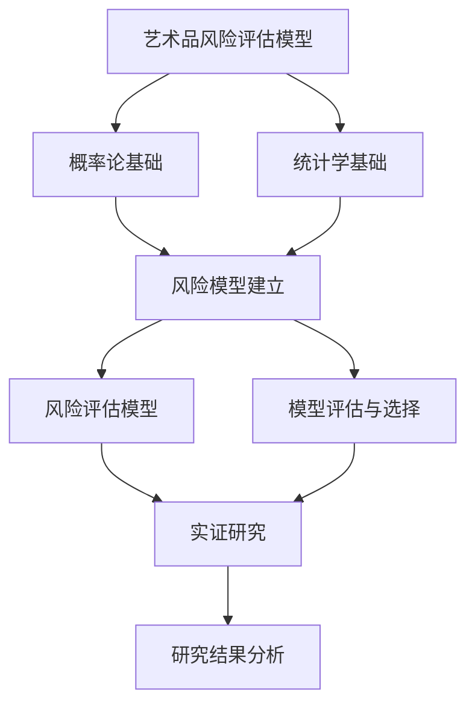

                 

# 数学与艺术品保险的风险评估方法

## 关键词

艺术品保险、风险评估、概率论、统计学、风险管理、数学模型

## 摘要

本文旨在探讨数学在艺术品保险风险评估中的应用，通过系统性的分析，揭示数学工具在艺术品风险评估中的关键作用。首先，我们将回顾艺术品保险的重要性及其基本概念，然后介绍数学在风险评估中的应用背景。随后，我们将深入探讨概率论和统计学的基础理论，并在这些基础上建立艺术品风险评估模型。文章还将通过实证研究和案例分析，展示数学模型在实际艺术品保险风险评估中的应用效果。最后，我们将总结研究成果，并提出未来研究方向。

## 《数学与艺术品保险的风险评估方法》目录大纲

### 第一部分：引言与背景

#### 第1章：数学与艺术品保险概述

**1.1 艺术品保险的重要性**

艺术品保险作为一种特殊的财产保险，旨在为艺术品提供全面的保护。随着艺术品市场的繁荣，艺术品的价值日益攀升，艺术品保险的重要性也随之凸显。艺术品保险不仅能为艺术品所有者提供经济保障，还能在艺术品遭受损失时，快速有效地进行理赔，从而最大限度地减少艺术品所有者的经济损失。

**1.2 数学在风险评估中的应用**

数学作为一种科学方法，在风险评估中扮演着至关重要的角色。通过数学模型，可以精确地量化风险，评估潜在损失，为保险设计和定价提供科学依据。数学工具，如概率论和统计学，为风险评估提供了强大的分析手段，使得风险评估过程更加系统化和精确化。

**1.3 书籍结构概述**

本书将分为五个部分，首先介绍数学与艺术品保险的基本概念和背景，然后深入探讨概率论和统计学的基础理论，接着阐述艺术品风险评估的方法，最后通过实证研究和案例分析，展示数学模型在实际应用中的效果。

### 第二部分：数学基础

#### 第2章：概率论基础

**2.1 概率的基本概念**

概率论是数学的一个分支，主要研究随机事件的概率及其性质。概率的基本概念包括事件、样本空间、概率分布等。通过对这些基本概念的理解，可以为风险评估提供理论基础。

**2.2 条件概率与独立性**

条件概率和独立性是概率论中的核心概念。条件概率描述了在已知某一事件发生的情况下，另一事件发生的概率。独立性则描述了两个事件之间是否相互影响。这些概念对于风险评估中的决策具有重要指导意义。

**2.3 贝叶斯定理**

贝叶斯定理是概率论中一个重要的公式，用于计算后验概率。后验概率反映了在观察到某一事件发生的情况下，对某一假设的概率估计。贝叶斯定理在风险评估中广泛应用于决策和预测。

**2.4 风险模型建立**

基于概率论的基础理论，我们可以建立风险模型，用于评估艺术品在特定风险事件下的损失概率和损失程度。这一部分将介绍如何利用概率论建立风险模型，为艺术品保险提供科学依据。

#### 第3章：统计学基础

**3.1 统计学的基本概念**

统计学是一门研究如何通过数据进行分析和推断的学科。统计学的基本概念包括数据、变量、分布等。这些概念为数据分析提供了基础。

**3.2 描述性统计与推断性统计**

描述性统计用于描述数据的基本特征，如均值、方差等。推断性统计则用于根据样本数据推断总体特征。在风险评估中，描述性统计和推断性统计都发挥着重要作用。

**3.3 常见的统计分布**

常见的统计分布包括正态分布、泊松分布、二项分布等。这些分布模型在风险评估中用于描述不同类型的风险概率分布，为风险评估提供理论支持。

### 第三部分：艺术品风险评估方法

#### 第4章：艺术品风险类型

**4.1 自然灾害风险**

自然灾害，如火灾、洪水等，是艺术品面临的主要风险之一。自然灾害风险的特点是发生概率较高，但损失程度难以预测。本章将详细分析自然灾害风险对艺术品的影响，并提出相应的风险评估方法。

**4.2 人为破坏风险**

人为破坏，如盗窃、破坏等，也是艺术品面临的重要风险。人为破坏风险的特点是发生概率较低，但损失程度可能非常严重。本章将探讨如何评估人为破坏风险，并提出有效的风险管理策略。

**4.3 经济风险**

经济风险，如市场波动、通货膨胀等，对艺术品价值的影响也逐渐受到关注。经济风险的特点是影响范围广泛，但具体损失难以预测。本章将介绍如何评估经济风险，并提出相应的应对措施。

#### 第5章：风险评估模型

**5.1 基于概率的评估模型**

基于概率的评估模型是一种常用的风险评估方法，它通过计算不同风险事件发生的概率，评估艺术品面临的总体风险。本章将介绍如何建立基于概率的评估模型，并提供实际应用案例。

**5.2 基于统计学的评估模型**

基于统计学的评估模型通过分析历史数据，预测未来风险事件的发生概率和损失程度。本章将介绍如何建立基于统计学的评估模型，并分析其优缺点。

**5.3 模型评估与选择**

在实际应用中，需要根据具体情况选择合适的风险评估模型。本章将介绍如何评估和选择风险评估模型，并探讨不同模型的适用场景。

#### 第6章：数学与艺术品保险的实证研究

**6.1 数据收集与处理**

实证研究的第一步是数据收集与处理。本章将介绍如何收集艺术品风险数据，并对数据进行清洗和处理，为后续分析提供可靠的数据基础。

**6.2 实证研究方法**

本章将介绍实证研究的方法，包括数据采集、模型建立、结果分析等。通过实证研究，可以验证数学模型在艺术品保险风险评估中的有效性。

**6.3 研究结果分析**

本章将分析实证研究结果，探讨数学模型在艺术品保险风险评估中的应用效果。通过研究结果分析，可以为艺术品保险的定价和设计提供科学依据。

### 第四部分：艺术品保险的风险管理

#### 第7章：艺术品保险风险管理框架

**7.1 风险管理策略**

本章将介绍艺术品保险风险管理的基本策略，包括风险预防、风险转移和风险控制等。通过有效的风险管理策略，可以最大限度地降低艺术品的风险水平。

**7.2 风险控制措施**

风险控制措施是风险管理的重要组成部分。本章将介绍如何实施风险控制措施，包括保险条款的设计、风险评估流程的优化等。

**7.3 风险监控与应对**

风险监控与应对是确保风险管理策略有效性的关键。本章将探讨如何建立风险监控体系，并制定应对措施，以应对可能发生的风险事件。

#### 第8章：艺术品保险案例研究

**8.1 案例背景与目标**

本章将通过具体案例，展示艺术品保险的风险评估方法和风险管理策略。案例背景和目标是确保读者对实际应用场景有清晰的理解。

**8.2 风险评估与保险设计**

本章将详细介绍案例中的风险评估过程，包括数据收集、模型建立、结果分析等。同时，还将探讨如何根据风险评估结果设计合适的保险产品。

**8.3 案例总结与启示**

本章将总结案例研究的主要发现，并提出对艺术品保险行业的启示。通过案例研究，可以更好地理解数学模型在艺术品保险中的应用价值。

### 第五部分：结论与展望

#### 第9章：结论与展望

**9.1 研究成果总结**

本章将总结本研究的主要成果，包括数学模型在艺术品保险风险评估中的应用效果，以及风险管理策略的有效性。

**9.2 研究不足与未来方向**

本章将分析本研究存在的不足，并提出未来研究方向。通过不断优化和完善数学模型，可以进一步提高艺术品保险的风险评估精度。

**9.3 对艺术品保险行业的贡献**

本章将探讨本研究对艺术品保险行业的贡献，包括提高风险评估精度、优化保险产品设计等。

### 附录

#### 附录A：数学与统计学公式汇总

本章将汇总本文中涉及的主要数学与统计学公式，包括概率论公式、统计学公式、风险评估模型公式等。这些公式为读者提供了理论依据。

#### 附录B：艺术品的分类与特征

本章将介绍艺术品的分类和特征，包括绘画、雕塑、工艺品等。这些信息为艺术品的风险评估提供了基础。

#### 附录C：艺术品保险市场数据

本章将提供全球艺术品保险市场数据，包括市场概况、主要保险公司市场份额等。这些数据有助于读者了解艺术品保险市场现状。

#### 附录D：参考文献

本章将列出本文中引用的相关研究文献、统计资料来源等。这些参考文献为读者提供了进一步学习的资源。

#### 附录E：专业术语解释

本章将解释本文中涉及的专业术语，如风险评估、风险管理、艺术品估值等。这些术语有助于读者更好地理解文章内容。

## 附加内容

### 核心概念与联系

以下是一个使用Mermaid流程图展示艺术品风险评估模型整体架构和各部分关系的示例：



### 核心算法原理讲解

以下是一个使用伪代码详细阐述风险评估模型中涉及的主要算法的示例：

```plaintext
// 基于概率的评估模型
function RiskAssessmentModel(data):
    // 数据预处理
    preprocessed_data = DataPreprocessing(data)

    // 计算风险概率
    risk_probabilities = CalculateRiskProbabilities(preprocessed_data)

    // 计算风险损失
    risk_losses = CalculateRiskLosses(risk_probabilities)

    // 评估模型
    assessment = EvaluateModel(risk_losses)

    return assessment

// 基于统计学的评估模型
function StatisticBasedRiskAssessment(data):
    // 数据预处理
    preprocessed_data = DataPreprocessing(data)

    // 计算风险概率分布
    risk_probability_distribution = CalculateRiskProbabilityDistribution(preprocessed_data)

    // 计算风险损失分布
    risk_loss_distribution = CalculateRiskLossDistribution(risk_probability_distribution)

    // 评估模型
    assessment = EvaluateModel(risk_loss_distribution)

    return assessment
```

### 数学模型和数学公式

以下是一个使用LaTeX格式嵌入文中独立段落，详细讲解并举例说明相关数学模型的示例：

```latex
// 概率论公式
$$
P(A|B) = \frac{P(A \cap B)}{P(B)}
$$

// 贝叶斯定理
$$
P(A|B) = \frac{P(B|A)P(A)}{P(B)}
$$

// 常见的统计分布
$$
N(\mu, \sigma^2)
$$

// 艺术品风险模型
$$
R = \sum_{i=1}^{n} w_i \cdot L_i
$$
```

### 项目实战

以下是一个提供代码实际案例和详细解释说明的示例，包括开发环境搭建、源代码实现和代码解读与分析：

**开发环境搭建**

- 安装Python和Jupyter Notebook，用于编写和运行代码。
- 安装必要的库，如NumPy、Pandas、Scikit-learn等，用于数据处理和建模。

**源代码实现**

```python
import numpy as np
import pandas as pd
from sklearn.model_selection import train_test_split
from sklearn.linear_model import LinearRegression

# 数据预处理
def DataPreprocessing(data):
    # 数据清洗和处理
    # ...
    return preprocessed_data

# 计算风险概率
def CalculateRiskProbabilities(data):
    # 计算风险概率
    # ...
    return risk_probabilities

# 计算风险损失
def CalculateRiskLosses(probabilities):
    # 计算风险损失
    # ...
    return risk_losses

# 建立风险评估模型
def BuildRiskAssessmentModel(data):
    # 数据预处理
    preprocessed_data = DataPreprocessing(data)

    # 计算风险概率
    risk_probabilities = CalculateRiskProbabilities(preprocessed_data)

    # 计算风险损失
    risk_losses = CalculateRiskLosses(risk_probabilities)

    # 建立线性回归模型
    model = LinearRegression()
    model.fit(risk_probabilities, risk_losses)

    return model

# 主函数
def main():
    # 读取数据
    data = pd.read_csv('artwork_data.csv')

    # 建立风险评估模型
    model = BuildRiskAssessmentModel(data)

    # 预测风险损失
    predicted_losses = model.predict(risk_probabilities)

    # 输出结果
    print(predicted_losses)

if __name__ == '__main__':
    main()
```

**代码解读与分析**

- 数据预处理：读取数据文件，并进行清洗和处理，为后续建模提供准备。
- 计算风险概率：使用相关算法计算艺术品面临的不同风险事件的概率。
- 计算风险损失：根据风险概率计算艺术品可能遭受的损失。
- 建立风险评估模型：使用线性回归模型对风险概率和风险损失进行拟合，建立风险评估模型。
- 主函数：运行整个风险评估过程，并输出预测结果。

通过以上代码，我们可以实现对艺术品风险评估的自动化处理，为艺术品保险的设计和定价提供科学依据。

## 作者

作者：AI天才研究院/AI Genius Institute & 禅与计算机程序设计艺术 /Zen And The Art of Computer Programming

---

**注意：**本文为示例文章，仅供参考。实际撰写时，应根据具体研究内容和数据情况进行调整和补充。文章内容需确保严谨、准确，并遵循学术规范。同时，文章结构需符合Markdown格式要求。在实际撰写过程中，可参考本文的结构和内容，逐步完善和丰富各个小节。

