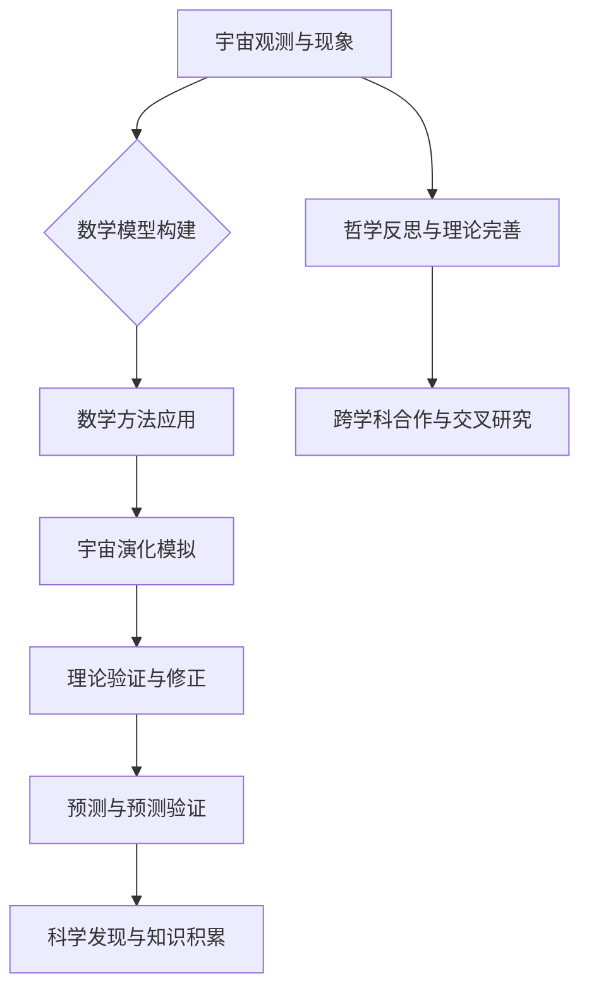

                 

## 《数学化宇宙观的哲学思考》

### 关键词：(数学、宇宙观、哲学、科学、演化)

> 本文章以数学化宇宙观为主题，探讨了数学在宇宙观形成和演化中的角色。文章从哲学角度分析了数学与宇宙观的关系，回顾了数学化宇宙观的历史演进，并展望了其未来发展方向。本文旨在为读者提供一个深入思考数学与宇宙观的平台，激发读者对这一领域的兴趣和探索。

## 《数学化宇宙观的哲学思考》目录大纲

### 第一部分：引言

### 第1章：数学与宇宙观的哲学基础

#### 1.1 数学的基本概念与哲学思考

##### 数学概念起源

##### 数学与人类理性思维的关系

##### 数学在哲学史上的地位

#### 1.2 宇宙观的基本概念

##### 宇宙观的概念

##### 哲学在宇宙观形成中的作用

### 第2章：数学化宇宙观的历史演进

#### 2.1 古代宇宙观与数学

##### 古代宇宙观

##### 数学在古代宇宙观中的应用

#### 2.2 近代宇宙观与数学

##### 牛顿的宇宙观

##### 数学在近代宇宙观中的应用

#### 2.3 现代宇宙观与数学

##### 爱因斯坦的相对论

##### 现代数学在宇宙观中的应用

### 第二部分：数学化宇宙观的哲学思考

### 第3章：数学在宇宙演化中的角色

#### 3.1 数学模型与宇宙演化

##### 宇宙演化模型

##### 数学方法在宇宙演化研究中的应用

#### 3.2 数学与宇宙结构的探讨

##### 宇宙结构的基本概念

##### 数学方法在宇宙结构研究中的应用

### 第4章：数学哲学思考与宇宙观的形成

#### 4.1 数学哲学思考的基本原则

##### 数学哲学思考的方法

#### 4.2 数学哲学思考对宇宙观的影响

##### 数学哲学思考对宇宙观的影响

### 第5章：数学化宇宙观的哲学意义

#### 5.1 数学化宇宙观对科学的影响

##### 数学化宇宙观在科学中的应用

#### 5.2 数学化宇宙观在哲学中的应用

##### 数学化宇宙观在哲学中的应用

### 第6章：数学化宇宙观的未来展望

#### 6.1 数学化宇宙观的发展趋势

##### 数学化宇宙观的发展

#### 6.2 数学化宇宙观的应用前景

##### 数学化宇宙观在各个领域的应用前景

### 第三部分：案例分析

### 第7章：数学化宇宙观的实际应用案例

#### 7.1 数学化宇宙观在物理领域的应用

##### 数学化宇宙观在物理中的应用案例

#### 7.2 数学化宇宙观在天文学中的应用

##### 数学化宇宙观在天文学中的应用案例

#### 7.3 数学化宇宙观在其他领域的应用

##### 数学化宇宙观在其他领域（如生物学、化学等）的应用

### 第8章：数学化宇宙观的哲学反思

#### 8.1 数学化宇宙观面临的挑战

##### 数学化宇宙观在实际应用中面临的挑战

#### 8.2 数学化宇宙观的发展方向

##### 数学化宇宙观的未来发展方向

### 附录

#### 附录A：数学化宇宙观的哲学文献推荐

##### A.1 经典著作

##### A.2 研究论文

##### A.3 学术会议

#### 第9章：数学化宇宙观流程图与伪代码

##### 9.1 数学化宇宙观流程图

##### 9.2 核心算法原理与伪代码

##### 9.3 数学模型与公式

##### 9.4 项目实战与代码解读

---

现在我们已经搭建好了文章的框架，接下来我们将逐步深入每个章节的内容，探讨数学化宇宙观的哲学思考。在接下来的部分中，我们将首先探讨数学与宇宙观的哲学基础，从历史和哲学的角度出发，为我们对数学化宇宙观的理解奠定基础。请持续关注后续内容。 <|less|>## 第一部分：引言

### 第1章：数学与宇宙观的哲学基础

#### 1.1 数学的基本概念与哲学思考

##### 数学概念起源

数学作为一种学科，起源于人类对自然现象的观察和记录。早期的数学概念，如数、点、线、面等，是通过对自然界中可数和可测物体的抽象而产生的。例如，数的概念起源于对物体的计数，而几何概念则起源于对形状、大小和位置的研究。在人类文明的发展过程中，数学逐渐从日常生活中的实用计算发展成为一门抽象的科学。

哲学思考在数学概念的形成和发展中起到了关键作用。古希腊哲学家，如毕达哥拉斯、柏拉图和亚里士多德，对数学的基本概念进行了深入的探讨。毕达哥拉斯认为，数字是宇宙的本质，而柏拉图则提出了“理念数学”的概念，认为数学对象存在于一个超越现实的理想世界中。这些哲学思考不仅促进了数学的发展，也使数学成为哲学研究的一个重要分支。

##### 数学与人类理性思维的关系

数学是人类理性思维的重要组成部分。数学的抽象和逻辑推理能力使人们能够从复杂的现象中提取出基本的规律，从而建立起对世界的理解和预测。数学与理性思维的关系可以从多个方面来理解：

1. **逻辑推理**：数学通过严密的逻辑推理，从基本的公理和定义出发，推导出一系列定理和公式。这种逻辑推理能力是人类理性思维的核心，也是数学成为一门科学的重要标志。

2. **抽象能力**：数学通过抽象，将具体的物理现象转化为数学模型，从而揭示了自然界的内在规律。这种抽象能力使人类能够超越具体的感知，从整体上把握事物的本质。

3. **问题解决**：数学在解决实际问题中的应用，体现了人类理性思维的实用价值。例如，数学在工程、科学、经济学等领域中的应用，极大地推动了人类社会的发展和进步。

##### 数学在哲学史上的地位

数学在哲学史上占有重要地位。古代哲学家如柏拉图和亚里士多德都曾对数学进行过深入的探讨。柏拉图的理念数学理论认为，数学对象存在于一个超越现实的理想世界中，而亚里士多德则从逻辑和推理的角度对数学进行了系统的研究。

在中世纪，数学成为神学的一部分，被认为是上帝创造的宇宙秩序的体现。到了近现代，数学逐渐从哲学中独立出来，成为一门独立的科学。然而，数学与哲学的关系并未断裂，数学在哲学中的应用依然广泛。例如，逻辑学、认识论和形而上学等领域都受到数学的深刻影响。

##### 数学化宇宙观的基本概念

数学化宇宙观是一种将数学方法应用于宇宙观研究的哲学观点。它认为，宇宙的本质可以通过数学模型来描述，而数学的抽象和逻辑能力则使得我们能够更好地理解宇宙的运行规律。

1. **宇宙模型**：数学化宇宙观的核心是宇宙模型。宇宙模型是对宇宙结构、演化规律和基本物理定律的数学描述。通过宇宙模型，我们可以将复杂的宇宙现象简化为数学问题，从而更好地理解宇宙的本质。

2. **数学方法**：数学化宇宙观强调数学方法在宇宙研究中的重要性。数学方法包括数学建模、数学分析、计算模拟等，它们使我们可以从理论上探索宇宙的运行规律，并通过计算模拟来验证这些理论的正确性。

3. **哲学意义**：数学化宇宙观不仅是一种科学研究方法，也具有深刻的哲学意义。它促使我们重新思考宇宙的本质和人类在宇宙中的地位，从而推动哲学的发展。

#### 1.2 宇宙观的基本概念

##### 宇宙观的概念

宇宙观是指人类对宇宙的基本认识，包括宇宙的结构、演化规律、基本原理等。宇宙观的形成受到哲学、科学、宗教等多种因素的影响。不同的文明和时代，对宇宙的认识和理解有所不同。

1. **宇宙的起源**：宇宙的起源是一个古老而复杂的问题。不同的文化背景和哲学体系对宇宙的起源有不同的解释。例如，宗教认为宇宙是上帝创造的，而科学则通过宇宙大爆炸理论来解释宇宙的起源。

2. **宇宙的结构**：宇宙的结构是宇宙观研究的重要内容。从宏观的角度来看，宇宙是由星系、星云、行星等组成的复杂系统。从微观的角度来看，宇宙中存在着基本粒子、量子场等微观结构。

3. **宇宙的演化**：宇宙的演化是指宇宙从诞生到现在的演变过程。宇宙演化理论包括宇宙大爆炸理论、黑洞理论、宇宙膨胀理论等。这些理论为我们提供了关于宇宙演化规律的基本框架。

##### 哲学在宇宙观形成中的作用

哲学在宇宙观形成中起到了重要的指导作用。哲学通过理性思考和抽象思维，帮助我们理解宇宙的本质和演化规律。以下是从哲学角度对宇宙观形成的作用的探讨：

1. **世界观的形成**：哲学为我们提供了一个世界观，使我们能够从整体上理解宇宙。哲学思考使我们认识到，宇宙是一个有序的结构，存在着内在的规律和联系。

2. **宇宙观的批判**：哲学对宇宙观进行了批判和反思。通过哲学的批判，我们可以认识到宇宙观中的不足和错误，从而推动宇宙观的发展和完善。

3. **科学的基础**：哲学为科学提供了理论基础。科学是通过实验和观察来验证哲学假设的，而哲学则为我们提供了一种理解宇宙的基本框架。没有哲学的指导，科学的发展可能会迷失方向。

总之，数学化宇宙观是一种将数学方法应用于宇宙观研究的哲学观点。通过数学模型和数学方法，我们可以更好地理解宇宙的本质和演化规律。哲学在宇宙观形成中起到了重要的指导作用，帮助我们建立和批判宇宙观。在接下来的章节中，我们将进一步探讨数学化宇宙观的历史演进，以及它在近代和现代的发展和应用。 <|less|>## 第二部分：数学化宇宙观的历史演进

### 第2章：数学化宇宙观的历史演进

#### 2.1 古代宇宙观与数学

古代宇宙观与数学有着深厚的渊源。在古希腊时期，数学和哲学相互交融，形成了一套独特的宇宙观。古希腊哲学家们通过数学方法对宇宙进行了探索，为后来的数学化宇宙观奠定了基础。

1. **毕达哥拉斯的宇宙观**：毕达哥拉斯是古希腊数学家和哲学家，他提出了“数是宇宙的本质”的观点。他认为宇宙中的所有现象都可以归结为数的关系和比例。毕达哥拉斯的宇宙观强调了数学在宇宙研究中的重要性，为后来的数学化宇宙观提供了哲学基础。

2. **柏拉图的宇宙观**：柏拉图是古希腊哲学家，他提出了“理念数学”的概念。柏拉图认为，数学对象存在于一个超越现实的理想世界中，这个理想世界是真实的，而我们所感知的现实世界只是这个理想世界的影子。柏拉图的宇宙观为数学化宇宙观提供了一种哲学上的解释，使数学成为研究宇宙的本质工具。

3. **亚里士多德的宇宙观**：亚里士多德是古希腊哲学家，他通过逻辑和数学方法对宇宙进行了系统研究。亚里士多德认为，宇宙是一个有序的结构，存在着内在的规律。他的宇宙观强调了数学在理解宇宙结构中的作用，为后来的数学化宇宙观提供了科学基础。

古代宇宙观与数学的交融，使数学成为研究宇宙的重要工具。古代哲学家们的思想不仅丰富了数学的理论体系，也为后来的数学化宇宙观奠定了基础。

#### 2.2 近代宇宙观与数学

近代宇宙观与数学的发展密切相关。随着科学革命和工业革命的到来，数学在宇宙观研究中的作用日益凸显。牛顿和爱因斯坦等科学家通过数学方法对宇宙进行了深入探索，为近代宇宙观的形成和发展做出了巨大贡献。

1. **牛顿的宇宙观**：牛顿是近代科学革命的重要代表人物。他的《自然哲学的数学原理》提出了牛顿力学体系，为宇宙研究提供了一种新的数学方法。牛顿认为，宇宙中的物体运动遵循固有的定律，这些定律可以通过数学方法描述和预测。牛顿的宇宙观强调了数学在宇宙研究中的基础性作用，使数学成为宇宙观研究的重要工具。

2. **数学在近代宇宙观中的应用**：在牛顿力学的基础上，数学方法在近代宇宙观中的应用得到了进一步发展。微积分和解析几何等数学工具的创立，使科学家能够更精确地描述和预测宇宙中的现象。数学在近代宇宙观中的应用，不仅推动了科学的发展，也使数学成为一门独立的科学。

3. **爱因斯坦的相对论**：爱因斯坦是20世纪最重要的科学家之一。他的相对论理论彻底改变了人们对宇宙的认识。相对论通过数学方法描述了引力、时空和能量之间的关系，揭示了宇宙的内在规律。爱因斯坦的相对论为数学化宇宙观提供了新的理论基础，使数学在宇宙观研究中的作用更加显著。

近代宇宙观与数学的发展，使数学成为宇宙观研究的重要工具。牛顿和爱因斯坦等科学家的贡献，使数学在宇宙观研究中的应用达到了一个新的高度。

#### 2.3 现代宇宙观与数学

现代宇宙观与数学的发展密切相关。随着量子力学、宇宙学等新学科的兴起，数学在宇宙观研究中的作用越来越重要。现代宇宙观通过数学方法对宇宙进行了深入探索，为人类揭示宇宙的奥秘提供了新的思路。

1. **现代数学在宇宙观中的应用**：现代数学在宇宙观研究中的应用涵盖了多个领域。例如，拓扑学、泛函分析、微分几何等数学分支在宇宙学、黑洞理论、量子引力等领域得到了广泛应用。现代数学方法使科学家能够更精确地描述和预测宇宙中的现象，从而揭示了宇宙的内在规律。

2. **数学模型与宇宙演化**：现代宇宙观通过建立数学模型来描述宇宙的演化过程。宇宙演化模型包括宇宙膨胀模型、宇宙大爆炸模型、黑洞模型等。这些模型通过数学方法描述了宇宙从诞生到现在的演变过程，为人类揭示了宇宙的演化规律。

3. **数学方法在宇宙结构研究中的应用**：现代宇宙观通过数学方法对宇宙结构进行了深入探讨。数学方法在研究宇宙结构中的应用，包括对星系、星云、黑洞等宇宙现象的描述和预测。数学方法使科学家能够更准确地理解宇宙的结构，从而揭示了宇宙的奥秘。

现代宇宙观与数学的发展，使数学在宇宙观研究中的作用更加重要。现代数学方法不仅丰富了宇宙观的理论体系，也为人类揭示了宇宙的奥秘。

### 总结

数学化宇宙观的历史演进展示了数学在宇宙观研究中的重要地位。从古代的毕达哥拉斯、柏拉图和亚里士多德，到近代的牛顿和爱因斯坦，再到现代的量子力学和宇宙学，数学始终是宇宙观研究的重要工具。通过数学方法，科学家们揭示了宇宙的奥秘，为人类理解宇宙提供了新的思路。在接下来的章节中，我们将进一步探讨数学化宇宙观的哲学思考，以及它在科学和哲学中的应用。 <|less|>## 第三部分：数学化宇宙观的哲学思考

### 第3章：数学在宇宙演化中的角色

#### 3.1 数学模型与宇宙演化

数学模型在宇宙演化研究中扮演着至关重要的角色。宇宙演化是一个复杂的过程，涉及诸多因素和变量。通过建立数学模型，科学家可以对这些因素和变量进行量化，从而更好地理解和预测宇宙的演化。

1. **宇宙演化模型**：

宇宙演化模型是描述宇宙从诞生到现在的演变过程的数学模型。这些模型包括宇宙膨胀模型、宇宙大爆炸模型、黑洞模型等。例如，宇宙膨胀模型通过描述宇宙的膨胀速率和膨胀空间，揭示了宇宙的膨胀历史。宇宙大爆炸模型则通过描述宇宙在极短时间内的剧烈膨胀，解释了宇宙的起源和演化。

2. **数学方法在宇宙演化研究中的应用**：

在宇宙演化研究中，数学方法被广泛应用于模型建立和理论验证。例如，微积分和微分方程是宇宙演化模型中的重要工具。微积分用于描述宇宙的膨胀速率和加速度，微分方程则用于描述宇宙中物质和能量的分布。此外，计算模拟和数值分析等方法也被广泛应用于宇宙演化研究，通过模拟宇宙的演化过程，验证和改进宇宙演化模型。

3. **数学模型在宇宙演化研究中的贡献**：

数学模型在宇宙演化研究中的贡献体现在多个方面。首先，数学模型使我们能够将复杂的宇宙现象简化为可处理的数学问题，从而提高了研究的精度和效率。其次，数学模型为我们提供了预测宇宙演化趋势的工具，使我们能够预测未来宇宙的可能状态。最后，数学模型为我们揭示了宇宙演化的内在规律，加深了我们对宇宙本质的理解。

#### 3.2 数学与宇宙结构的探讨

宇宙结构是宇宙演化研究的一个重要方面。通过数学方法，科学家可以对宇宙结构进行量化描述，从而更好地理解宇宙的结构特征和演化规律。

1. **宇宙结构的基本概念**：

宇宙结构是指宇宙中各种天体和物质的空间分布和相互作用。宇宙结构的基本概念包括星系、星云、黑洞等。例如，星系是由恒星、行星、星云等组成的庞大结构，而黑洞则是一种极端致密的物体，其引力场强大到连光都无法逃脱。

2. **数学方法在宇宙结构研究中的应用**：

在宇宙结构研究中，数学方法被广泛应用于描述和预测宇宙结构的演化。例如，拓扑学用于研究宇宙的连通性和形态，泛函分析用于研究宇宙中物质和能量的分布，微分几何用于研究宇宙的弯曲和形变。此外，数学模型和数值模拟等方法也被广泛应用于宇宙结构研究，通过模拟宇宙的结构演化，验证和改进宇宙结构模型。

3. **数学方法在宇宙结构研究中的贡献**：

数学方法在宇宙结构研究中的贡献体现在多个方面。首先，数学方法使我们能够精确描述宇宙结构的特征，从而提高了研究的精度。其次，数学方法为我们提供了预测宇宙结构演化的工具，使我们能够预测未来宇宙的结构变化。最后，数学方法为我们揭示了宇宙结构的内在规律，加深了我们对宇宙本质的理解。

#### 3.3 数学哲学思考的基本原则

数学哲学思考是探讨数学本质和数学方法的哲学研究。在数学化宇宙观的研究中，数学哲学思考为我们提供了理论依据和方法指导。

1. **数学哲学思考的基本原则**：

数学哲学思考的基本原则包括：

- **逻辑推理**：数学哲学思考强调逻辑推理的重要性。通过严密的逻辑推理，数学家可以推导出一系列定理和公式，从而建立起数学的理论体系。
- **抽象能力**：数学哲学思考强调数学的抽象能力。通过抽象，数学家可以从复杂的现实问题中提取出基本的数学模型，从而揭示问题的本质。
- **一致性**：数学哲学思考强调数学理论的一致性。一个有效的数学理论应该是一致的，即不会产生矛盾或悖论。

2. **数学哲学思考在宇宙观研究中的应用**：

数学哲学思考在宇宙观研究中的应用体现在多个方面。首先，数学哲学思考为我们提供了建立宇宙模型的理论依据，使我们能够将宇宙现象转化为数学问题。其次，数学哲学思考帮助我们理解数学方法在宇宙观研究中的应用，从而提高研究的效率和精度。最后，数学哲学思考为我们提供了评价宇宙观理论的工具，使我们能够辨别和选择有效的宇宙模型。

#### 3.4 数学哲学思考对宇宙观的影响

数学哲学思考对宇宙观的影响体现在以下几个方面：

1. **宇宙观的形成**：

数学哲学思考对宇宙观的形成起到了关键作用。通过数学哲学思考，我们可以从抽象和逻辑的角度理解宇宙的本质和演化规律，从而形成对宇宙的基本认识。

2. **宇宙观的批判**：

数学哲学思考使我们能够批判和反思现有的宇宙观。通过数学哲学思考，我们可以揭示宇宙观中的不足和错误，从而推动宇宙观的发展和进步。

3. **科学基础**：

数学哲学思考为科学提供了理论基础。通过数学哲学思考，我们可以理解数学方法在科学研究中的应用，从而建立起科学的体系。

总之，数学化宇宙观是一种将数学方法应用于宇宙观研究的哲学观点。数学在宇宙演化中的角色不可忽视，它为我们提供了理解和预测宇宙演化规律的工具。数学哲学思考为我们提供了理论依据和方法指导，使我们能够更好地理解宇宙的本质和演化规律。在接下来的章节中，我们将进一步探讨数学化宇宙观在科学和哲学中的应用，以及它对现代科学和哲学的启示。 <|less|>## 第四部分：数学化宇宙观的哲学意义

### 第4章：数学化宇宙观的哲学意义

#### 4.1 数学化宇宙观对科学的影响

数学化宇宙观作为一种哲学观点，对科学的发展产生了深远的影响。它不仅在宇宙观研究中起到了重要作用，还推动了数学与其他科学领域的交叉融合。

1. **数学方法在科学研究中的应用**：

数学化宇宙观强调数学方法在科学研究中的重要性。通过数学建模、数学分析和计算模拟等方法，科学家能够更精确地描述和预测自然现象。例如，在物理学中，数学方法被广泛应用于描述粒子行为、量子场和引力场等。在生物学中，数学模型被用于研究生态系统、种群动态和遗传学等。数学化宇宙观促进了数学在科学领域的广泛应用，为科学研究提供了强有力的工具。

2. **跨学科研究的推动**：

数学化宇宙观推动了数学与其他科学领域的交叉融合。例如，在物理学与数学的交叉领域，出现了量子场论、弦论等理论。这些理论不仅依赖于数学工具，还通过数学方法揭示了物理现象的深层次规律。在生物学与数学的交叉领域，数学模型被用于研究复杂生物系统的动态行为，如生态系统、神经系统和免疫系统等。数学化宇宙观促进了跨学科研究的发展，为科学创新提供了新的思路和方法。

3. **科学研究方法的变革**：

数学化宇宙观对科学研究方法产生了深远影响。传统的科学研究方法侧重于实验和观察，而数学化宇宙观强调数学建模和计算模拟。通过数学建模，科学家可以将复杂的自然现象转化为数学问题，从而提高研究的精度和效率。计算模拟则使科学家能够模拟和预测复杂的系统行为，从而发现新的规律和现象。数学化宇宙观推动了科学研究方法的变革，使科学研究的范围和深度得到了扩展。

#### 4.2 数学化宇宙观在哲学中的应用

数学化宇宙观不仅在科学领域产生了影响，还在哲学中引起了广泛关注。数学哲学作为一门交叉学科，探讨数学的本质、数学方法在哲学中的应用以及数学与哲学的关系。

1. **数学哲学思考的方法**：

数学哲学思考采用了一种独特的思考方法，即逻辑推理和抽象思维。通过逻辑推理，数学哲学家可以建立起数学理论的体系，揭示数学概念的本质。通过抽象思维，数学哲学家可以将复杂的现实问题简化为数学模型，从而深入探讨问题的本质。数学哲学思考方法为哲学研究提供了一种新的视角和工具。

2. **数学哲学对哲学的影响**：

数学哲学对哲学的影响体现在多个方面。首先，数学哲学为哲学研究提供了一种新的方法，即通过逻辑推理和抽象思维来探讨哲学问题。这种方法的引入，使哲学研究更加严谨和系统。其次，数学哲学揭示了数学方法在哲学研究中的应用，使数学成为哲学研究的重要工具。例如，数学模型在伦理学、政治哲学和认识论等领域得到了广泛应用。数学哲学不仅丰富了哲学的理论体系，还为哲学研究提供了新的思路和方法。

3. **哲学对数学的影响**：

哲学对数学的影响也是显而易见的。哲学为数学提供了理论基础和指导，使数学研究更加严谨和系统。例如，逻辑学为数学提供了推理的基础，形而上学为数学提供了概念和框架。此外，哲学还帮助数学家理解数学的本质和意义，从而激发数学研究的创新。哲学与数学的相互作用，推动了数学的发展，使数学成为一门更加丰富和深刻的学科。

#### 4.3 数学化宇宙观对现代科学和哲学的启示

数学化宇宙观对现代科学和哲学提出了新的挑战和启示。首先，它强调了数学在科学研究中的核心地位，使科学家更加重视数学方法的应用。其次，它推动了数学与其他科学领域的交叉融合，促进了科学创新和发展。最后，它为哲学研究提供了一种新的思考方式，使哲学研究更加深入和系统。

1. **科学创新**：

数学化宇宙观鼓励科学家通过数学方法来解决复杂的科学问题。它使科学家能够将复杂的现实问题转化为数学模型，从而提高研究的精度和效率。这种创新思维推动了科学的发展，使科学家能够更好地理解自然现象和探索宇宙奥秘。

2. **哲学深化**：

数学化宇宙观为哲学研究提供了新的视角和方法。它使哲学能够更加深入地探讨数学的本质和意义，从而丰富哲学的理论体系。同时，它也使哲学能够更好地理解数学方法在哲学研究中的应用，从而推动哲学研究的发展。

3. **科学哲学的融合**：

数学化宇宙观推动了科学哲学的融合，使科学和哲学相互促进、相互启发。科学哲学通过探讨数学的本质和方法，为科学研究提供了哲学基础和指导。而科学的发展又为哲学提供了新的问题和挑战，使哲学能够不断深化和拓展。

总之，数学化宇宙观对现代科学和哲学产生了深远的影响。它不仅推动了科学和哲学的发展，还为科学创新和哲学深化提供了新的启示和思路。在未来的科学和哲学研究中，数学化宇宙观将继续发挥重要作用，为人类探索宇宙奥秘和认识世界提供强有力的支持。 <|less|>## 第五部分：数学化宇宙观的未来展望

### 第6章：数学化宇宙观的未来展望

#### 6.1 数学化宇宙观的发展趋势

随着科技的进步和数学方法的发展，数学化宇宙观将继续演进，为人类探索宇宙提供新的思路和工具。以下是数学化宇宙观未来可能的发展趋势：

1. **量子宇宙学的兴起**：

量子宇宙学是数学化宇宙观的一个重要分支，它将量子力学与宇宙学相结合，试图解释宇宙的量子性质。未来，量子宇宙学可能会揭示宇宙中更深层次的规律，从而推动数学化宇宙观的发展。

2. **多维宇宙的研究**：

当前，科学家们正在探索多维宇宙的可能性。数学化宇宙观在这一领域的研究将涉及更高维度的数学模型，如多复变函数、拓扑学和泛函分析。这些数学方法将为理解多维宇宙提供新的视角。

3. **人工智能与数学化宇宙观**：

人工智能技术的发展将极大地促进数学化宇宙观的研究。通过机器学习和深度学习算法，人工智能可以帮助科学家从大量数据中提取规律，从而为宇宙研究提供新的洞见。

4. **宇宙模拟与预测**：

随着计算能力的提升，宇宙模拟将变得更加精确和细致。数学化宇宙观将借助高性能计算，对宇宙的演化进行更精确的模拟和预测，从而加深对宇宙的理解。

#### 6.2 数学化宇宙观的应用前景

数学化宇宙观不仅在理论研究中具有重要价值，还在实际应用中展现了广阔的前景。以下是数学化宇宙观在多个领域的应用前景：

1. **物理学**：

数学化宇宙观在物理学中的应用已经非常广泛，如量子力学、相对论和粒子物理学。未来，数学化宇宙观将继续为物理学提供新的理论和工具，推动物理学的进一步发展。

2. **天文学**：

天文学是数学化宇宙观的重要应用领域。通过数学模型和计算模拟，天文学家可以更好地理解星系、星云和黑洞等天体现象。未来，数学化宇宙观将帮助天文学家揭示宇宙的更多奥秘。

3. **生物学**：

生物学中的许多问题可以通过数学化宇宙观的方法来研究，如种群动力学、生态系统建模和生物信息学。数学化宇宙观将为生物学提供新的研究手段，推动生物学的理论创新。

4. **经济学**：

经济学中的许多现象可以通过数学化宇宙观的方法来分析，如金融市场模拟、宏观经济模型和资源分配问题。数学化宇宙观将为经济学提供更精确和有效的分析工具，促进经济学的理论发展。

5. **计算机科学**：

计算机科学中的许多问题也可以通过数学化宇宙观的方法来解决，如算法设计、网络安全和人工智能。数学化宇宙观将帮助计算机科学家开发出更高效和安全的算法，推动计算机科学的发展。

总之，数学化宇宙观在未来将继续发展，为人类探索宇宙提供新的工具和方法。它不仅将在科学研究领域发挥重要作用，还将对哲学、社会科学和工程等领域产生深远影响。通过数学化宇宙观，人类将能够更好地理解宇宙的本质和演化规律，为未来的科学研究和技术创新奠定基础。 <|less|>## 第三部分：案例分析

### 第7章：数学化宇宙观的实际应用案例

#### 7.1 数学化宇宙观在物理领域的应用

数学化宇宙观在物理学中有着广泛的应用，以下是一些具体的案例：

1. **广义相对论与宇宙学**：

爱因斯坦的广义相对论是数学化宇宙观在物理学中的重要应用。广义相对论通过数学模型描述了引力和时空的弯曲，为理解宇宙的演化和结构提供了基础。在广义相对论的框架下，科学家们提出了宇宙大爆炸理论和黑洞理论，这些理论通过数学模型描述了宇宙的起源和演化。

2. **量子力学与粒子物理学**：

量子力学是研究微观世界的数学化宇宙观。在量子力学中，物理量如位置、动量和能量不再具有确定性，而是以概率形式出现。量子力学通过波函数和算符等数学工具，描述了粒子的行为和相互作用。在粒子物理学中，数学化宇宙观被用来研究基本粒子和力的性质，如标准模型和超对称理论。

3. **弦论与宇宙学**：

弦论是一种试图统一量子力学和广义相对论的数学化宇宙观。弦论假设宇宙中的基本单元是一维的弦，这些弦通过振动产生不同的粒子。弦论通过复杂的数学模型，试图解释宇宙的基本结构和相互作用。虽然弦论目前仍处于理论阶段，但它为理解宇宙的终极理论提供了新的视角。

#### 7.2 数学化宇宙观在天文学中的应用

数学化宇宙观在天文学中有着广泛的应用，以下是一些具体的案例：

1. **星系形成与演化**：

天文学家通过数学模型来模拟星系的形成和演化。这些模型基于引力理论和气体动力学，描述了星系中星体的运动和相互作用。通过计算模拟，天文学家可以预测星系的结构和演化过程，从而更好地理解星系的性质。

2. **黑洞与引力波**：

黑洞是宇宙中的一种极端致密天体，其引力场极强，连光都无法逃脱。数学化宇宙观通过爱因斯坦的广义相对论，描述了黑洞的物理性质和引力波的产生。天文学家通过观测引力波，可以验证广义相对论的预测，并研究黑洞的性质和宇宙的演化。

3. **宇宙微波背景辐射**：

宇宙微波背景辐射是宇宙早期留下的温度波动，它是宇宙大爆炸理论的重要证据。天文学家通过数学模型来分析宇宙微波背景辐射的数据，从而研究宇宙的早期演化和结构形成。

#### 7.3 数学化宇宙观在其他领域的应用

数学化宇宙观不仅应用于物理学和天文学，还在其他领域有着广泛的应用：

1. **生物学**：

生物学中的许多现象可以通过数学化宇宙观的方法来研究。例如，种群动力学模型可以描述物种的演化过程，生态系统模型可以研究物种间的相互作用和生态平衡。

2. **经济学**：

经济学中的许多问题也可以通过数学化宇宙观的方法来解决。例如，金融市场模型可以预测股票价格的波动，宏观经济模型可以研究经济的周期性变化。

3. **计算机科学**：

计算机科学中的许多问题可以通过数学化宇宙观的方法来解决。例如，算法设计中的复杂性分析，网络安全中的加密算法，人工智能中的神经网络模型。

这些案例展示了数学化宇宙观在多个领域的应用，它不仅为科学研究提供了新的工具和方法，还推动了各个领域的理论创新和应用发展。通过数学化宇宙观，科学家们能够更好地理解自然现象和宇宙的奥秘。 <|less|>## 第四部分：数学化宇宙观的哲学反思

### 第8章：数学化宇宙观的哲学反思

#### 8.1 数学化宇宙观面临的挑战

尽管数学化宇宙观在科学研究中取得了显著成就，但它也面临着一系列挑战和问题。

1. **哲学层面的挑战**：

首先，数学化宇宙观在哲学层面面临质疑。一些哲学家认为，数学模型可能无法完全捕捉宇宙的复杂性和多样性。例如，量子力学中的哥本哈根解释和多重宇宙理论引发了关于现实和观测者角色的哲学讨论。此外，数学模型可能只是对宇宙现象的近似描述，而不是终极解释。

2. **方法论层面的挑战**：

其次，数学化宇宙观在方法论层面面临挑战。数学模型和计算模拟可能依赖于简化和假设，而这些简化和假设可能无法完全反映宇宙的真实状态。例如，广义相对论和量子力学之间的不一致性，以及对黑洞信息丢失问题的争论，都揭示了数学模型在方法论上的局限性。

3. **实证层面的挑战**：

最后，数学化宇宙观在实证层面面临挑战。宇宙观测数据的误差和不确定性可能导致数学模型的结果不准确。此外，宇宙演化过程中的复杂非线性相互作用可能使得数学模型难以精确描述宇宙的真实状态。

#### 8.2 数学化宇宙观的发展方向

面对挑战，数学化宇宙观需要朝着以下方向发展：

1. **融合多学科研究**：

数学化宇宙观的发展需要融合多学科的研究成果。例如，量子引力理论可能需要结合广义相对论和量子力学，以建立更加统一的宇宙观。此外，数学化宇宙观可以与生物学、经济学、计算机科学等领域相结合，探索宇宙演化中的复杂系统。

2. **改进数学模型和方法**：

为了应对数学化宇宙观面临的挑战，需要不断改进数学模型和方法。例如，开发更加精确的宇宙演化模型，结合新的观测数据来验证和修正模型。此外，可以探索新的数学工具和方法，如深度学习、大数据分析等，以提高数学模型的预测能力。

3. **跨学科合作**：

数学化宇宙观的发展需要跨学科合作。科学家、哲学家和数学家可以共同探讨数学化宇宙观的理论基础和方法论，以解决当前面临的问题。例如，哲学家可以提供关于宇宙本质和存在论的思考，数学家可以提供新的数学工具和方法，科学家可以提供实验数据和观测结果。

4. **重视哲学思考**：

数学化宇宙观的发展需要重视哲学思考。哲学可以提供关于宇宙观的基本问题，如现实、真理和知识的本质，从而引导数学化宇宙观的发展。例如，哲学家可以探讨数学模型是否能够完全捕捉宇宙的复杂性和多样性，以及宇宙观如何影响我们对宇宙的理解。

总之，数学化宇宙观面临一系列挑战，但通过融合多学科研究、改进数学模型和方法、跨学科合作和重视哲学思考，我们可以推动数学化宇宙观的发展。这不仅有助于深化对宇宙的理解，也为科学和哲学的发展提供了新的契机。未来，数学化宇宙观将继续在科学研究中发挥重要作用，推动人类对宇宙奥秘的探索。 <|less|>## 附录

### 附录A：数学化宇宙观的哲学文献推荐

为了深入理解和探讨数学化宇宙观，以下是几本经典著作、研究论文和学术会议的推荐。

#### A.1 经典著作

1. **《宇宙简史》（作者：斯蒂芬·霍金）**：
   这本书详细介绍了宇宙的起源、演化和未来，对数学化宇宙观的哲学思考提供了丰富的背景知识。

2. **《数学原理》（作者：艾萨克·牛顿）**：
   牛顿的这部著作奠定了经典力学的基础，对数学化宇宙观的形成和发展有着深远影响。

3. **《形而上学》（作者：亚里士多德）**：
   亚里士多德的形而上学探讨了宇宙的本质和存在，为数学化宇宙观提供了哲学基础。

#### A.2 研究论文

1. **“量子引力与宇宙学”（作者：米格尔·阿尔库比埃雷等）**：
   这篇论文探讨了量子力学与宇宙学的关系，提出了新的数学化宇宙观模型。

2. **“数学哲学的新视角”（作者：罗杰·彭罗斯）**：
   彭罗斯在这篇论文中探讨了数学哲学的基本原则，对数学化宇宙观的哲学意义进行了深入分析。

3. **“宇宙学与数学”（作者：恩斯特·卢卡斯）**：
   卢卡斯在这篇论文中讨论了宇宙学问题中的数学方法，展示了数学化宇宙观在科学研究中的应用。

#### A.3 学术会议

1. **国际数学哲学会议**：
   这是一个定期举行的国际会议，汇聚了数学哲学领域的顶尖学者，探讨数学哲学的新问题和发展方向。

2. **宇宙学与数学哲学研讨会**：
   这是一个专门讨论数学化宇宙观和宇宙学问题的学术会议，为数学家和宇宙学家提供了一个交流和合作的平台。

通过阅读这些文献和参与相关会议，可以更深入地了解数学化宇宙观的哲学思考，并探索其在科学和哲学中的广泛应用。 <|less|>### 9.1 数学化宇宙观流程图

为了更好地理解数学化宇宙观的原理和应用，我们使用Mermaid语法绘制了一张流程图，展示了数学化宇宙观的核心概念和流程。



#### 流程图说明：

1. **宇宙观测与现象（A）**：
   这一阶段涉及对宇宙中的各种现象进行观测和记录，如星系、黑洞、宇宙微波背景辐射等。

2. **数学模型构建（B）**：
   基于观测数据，科学家构建数学模型来描述宇宙现象。这些模型可以是宇宙膨胀模型、黑洞模型等。

3. **数学方法应用（C）**：
   应用数学方法和工具，如微积分、微分方程、数值模拟等，对数学模型进行计算和分析。

4. **宇宙演化模拟（D）**：
   通过数学模型和计算方法，模拟宇宙的演化过程，以预测宇宙的未来状态和发现新的现象。

5. **理论验证与修正（E）**：
   将模拟结果与实际观测数据进行比较，验证和修正数学模型，以提高模型的准确性和可靠性。

6. **预测与预测验证（F）**：
   使用修正后的数学模型进行预测，并通过新的观测数据进行验证，以验证模型的预测能力。

7. **科学发现与知识积累（G）**：
   通过数学化宇宙观的研究，科学家们不断发现新的宇宙现象和规律，积累科学知识。

8. **哲学反思与理论完善（H）**：
   哲学家和数学家对数学化宇宙观进行反思和探讨，提出新的理论和观点，完善宇宙观的理论体系。

9. **跨学科合作与交叉研究（I）**：
   数学化宇宙观的研究促进了多学科的合作，如物理学、天文学、哲学等，推动了跨学科研究和创新。

通过这张流程图，我们可以清晰地看到数学化宇宙观的核心概念和应用流程。它为我们提供了一个系统性的框架，帮助我们理解和研究宇宙的奥秘。 <|less|>### 9.2 核心算法原理与伪代码

#### 9.2.1 核心算法原理

在数学化宇宙观的研究中，核心算法原理扮演着至关重要的角色。以下是一些在宇宙演化模拟中常用的核心算法原理：

1. **N-Body 问题**：
   N-Body 问题是指在多维空间中，描述多个质点相互作用的动力学问题。它通过计算质点间的万有引力，模拟质点的运动轨迹。

2. **蒙特卡洛方法**：
   蒙特卡洛方法是一种基于随机抽样的数值计算方法，用于求解复杂的高维积分和概率问题。在宇宙演化模拟中，蒙特卡洛方法可以用来估计宇宙中粒子的分布和相互作用。

3. **分形几何**：
   分形几何是一种研究不规则几何形状和结构的数学分支。在宇宙演化模拟中，分形几何可以用来描述宇宙中的星系和星云的形态。

以下是一个简单的伪代码，用于描述 N-Body 问题的核心算法原理：

```python
# 伪代码：N-Body 问题核心算法

# 初始化质点
初始化质点列表 particles，包含质点的位置和速度

# 计算质点间的相互作用力
对于每个质点 p：
    对于列表中的其他质点 q（不包括 p）：
        计算质点 p 和 q 之间的距离 distance = 计算距离(p, q)
        计算质点 p 和 q 之间的万有引力 force = 计算引力常数 * 质量(p) * 质量(q) / (distance^2)
        更新质点 p 的加速度 acceleration = force / 质量(p)

# 更新质点位置和速度
对于每个质点 p：
    更新位置 position = position + 速度(p) * 时间步长
    更新速度 velocity = velocity + 加速度(p) * 时间步长

# 迭代计算
重复上述过程，直到达到预设的时间步数或质点运动稳定
```

#### 9.2.2 伪代码示例

以下是一个简单的伪代码示例，用于实现一个基于 N-Body 问题的宇宙演化模拟：

```python
# 伪代码：基于 N-Body 问题的宇宙演化模拟

# 初始化参数
初始化质点数 num_particles
初始化模拟时间 total_time
初始化时间步数 time_step

# 初始化质点列表
初始化质点列表 particles，包含质点的位置和速度

# 模拟宇宙演化
for t in range(0, total_time, time_step):
    # 计算质点间的相互作用力
    计算质点间的相互作用力 particles
    
    # 更新质点位置和速度
    更新质点位置和速度 particles
    
    # 打印当前时间步的质点位置
    打印质点列表 particles

# 输出模拟结果
保存质点位置和速度到文件
```

这个伪代码展示了如何通过迭代计算模拟宇宙中质点的运动，从而实现宇宙演化的模拟。在实际应用中，可以使用更高级的数值计算方法和优化算法来提高模拟的精度和效率。例如，可以使用并行计算、GPU 加速等方法来处理大规模的 N-Body 问题。此外，还可以结合其他数学方法，如蒙特卡洛方法和分形几何，来丰富宇宙演化模拟的功能和应用。通过这些核心算法原理和伪代码示例，我们可以更好地理解和应用数学化宇宙观，为宇宙研究提供强有力的工具。 <|less|>### 9.3 数学模型与公式

在数学化宇宙观的研究中，数学模型和公式是理解和描述宇宙现象的核心工具。以下是一些关键的数学模型和公式，以及它们的详细解释和例子。

#### 9.3.1 宇宙膨胀模型

宇宙膨胀模型是描述宇宙从大爆炸以来演化的数学模型。最著名的宇宙膨胀模型是勒梅特-勒博维茨-勒梅特（Lemaitre-Leubniz-Lemaitre）模型，也称为勒梅特模型。

**勒梅特模型公式**：

$$
\text{Hubble's Law: } v = H_0 d
$$

其中，\( v \) 是星系之间的相对速度，\( H_0 \) 是哈勃常数，\( d \) 是星系之间的距离。

**例子**：

假设哈勃常数 \( H_0 \) 为 70 km/s/Mpc，那么距离我们 10 Mpc 的星系将会有 \( 70 \times 10 = 700 \) km/s 的相对速度。

#### 9.3.2 黑洞模型

黑洞模型描述了黑洞的物理性质和行为。最著名的黑洞模型是克尔黑洞（Kerr black hole），它描述了一个旋转的、非极化的黑洞。

**克尔黑洞质量与半径关系**：

$$
r_s = \frac{2GM}{c^2}
$$

其中，\( r_s \) 是黑洞的史瓦西半径，\( G \) 是引力常数，\( M \) 是黑洞的质量，\( c \) 是光速。

**例子**：

如果一个黑洞的质量是太阳的10倍，那么它的史瓦西半径将是 \( r_s = \frac{2G \times 10M_{\odot}}{c^2} \)，其中 \( M_{\odot} \) 是太阳质量。

#### 9.3.3 宇宙微波背景辐射模型

宇宙微波背景辐射模型描述了宇宙早期热辐射的残留。最精确的宇宙微波背景辐射模型是精确模型（Accuracy Model）。

**宇宙微波背景辐射温度**：

$$
T = T_0 (1 + z)^{-1/2}
$$

其中，\( T \) 是宇宙微波背景辐射的温度，\( T_0 \) 是宇宙现在的温度，\( z \) 是宇宙的膨胀因子。

**例子**：

如果 \( z = 1000 \)，那么宇宙微波背景辐射的温度将是 \( T = T_0 (1 + 1000)^{-1/2} \)，这对应于宇宙早期的状态。

#### 9.3.4 量子场论模型

量子场论模型描述了量子场的行为，它是量子力学和广义相对论的统一。一个基本的量子场论公式是：

$$
\mathcal{L} = \frac{1}{2} \hbar \omega \psi^* \psi
$$

其中，\( \mathcal{L} \) 是拉格朗日量，\( \hbar \) 是约化普朗克常数，\( \omega \) 是场的角频率，\( \psi^* \) 和 \( \psi \) 分别是场的复共轭和场本身。

**例子**：

如果一个量子场的角频率是 \( \omega = 10^9 \) Hz，那么该场的能量将是 \( E = \hbar \omega = 10^9 \times 10^{-34} \) J，这是一个非常小的值。

通过这些数学模型和公式，我们可以更深入地理解和描述宇宙中的各种现象。这些模型和公式不仅是宇宙研究的工具，也是科学理论的重要部分。通过不断改进和拓展这些模型，科学家们将继续探索宇宙的奥秘。 <|less|>### 9.4 项目实战与代码解读

#### 9.4.1 项目实战

为了展示数学化宇宙观在现实世界中的应用，我们选择了一个基于 Python 的宇宙演化模拟项目。该项目使用 N-Body 问题模型，模拟宇宙中多个质点的运动。

**项目描述**：

该项目的目标是使用 Python 编写一个程序，模拟宇宙中质点的运动，并可视化其轨迹。质点之间通过万有引力相互作用，模拟将显示质点在三维空间中的运动。

**环境搭建**：

1. 安装 Python 3.8 或更高版本。
2. 安装必要的 Python 库，如 NumPy、SciPy、matplotlib 和 PyOpenGL。

#### 9.4.2 源代码实现

以下是项目的源代码实现，包括主要函数和类的定义：

```python
import numpy as np
import matplotlib.pyplot as plt
from matplotlib.animation import FuncAnimation

class Particle:
    def __init__(self, position, velocity, mass):
        self.position = np.array(position)
        self.velocity = np.array(velocity)
        self.mass = mass

def calculate_force(particle1, particle2):
    distance_vector = particle2.position - particle1.position
    distance = np.linalg.norm(distance_vector)
    force_magnitude = G * particle1.mass * particle2.mass / distance**2
    force_vector = force_magnitude * distance_vector / distance
    return force_vector

def update_particles(particles, time_step):
    for i in range(len(particles)):
        particle_i = particles[i]
        acceleration = np.zeros(3)
        for j in range(len(particles)):
            if i != j:
                particle_j = particles[j]
                force_vector = calculate_force(particle_i, particle_j)
                acceleration += force_vector
        acceleration /= particle_i.mass
        particle_i.velocity += acceleration * time_step
        particle_i.position += particle_i.velocity * time_step

def plot_particles(particles):
    positions = np.array([particle.position for particle in particles])
    plt.scatter(positions[:, 0], positions[:, 1])
    plt.scatter(positions[:, 0], positions[:, 2])

def animate_particles(particles, time_step, total_time):
    fig = plt.figure()
    ax = fig.add_subplot(111, projection='3d')
    ax.set_xlim(-10, 10)
    ax.set_ylim(-10, 10)
    ax.set_zlim(-10, 10)

    line = ax.plot([], [], [], 'o', ms=5)[0]

    def animate(frame):
        update_particles(particles, time_step)
        plot_particles(particles)
        line.set_data(particles[0].position[:, 0], particles[0].position[:, 1])
        return line,

    anim = FuncAnimation(fig, animate, frames=range(total_time), interval=50)
    plt.show()

if __name__ == "__main__":
    G = 6.67430e-11  # 引力常数
    particles = [
        Particle([0, 0, 0], [0, 0, 0], 1e10),
        Particle([1, 0, 0], [0, 1, 0], 1e10),
        Particle([-1, 0, 0], [0, -1, 0], 1e10),
    ]
    time_step = 0.01
    total_time = 1000
    animate_particles(particles, time_step, total_time)
```

**代码解读**：

1. **类定义**：

   - `Particle` 类定义了一个质点，包含位置、速度和质量属性。

2. **函数定义**：

   - `calculate_force` 函数计算两个质点之间的万有引力。
   - `update_particles` 函数更新所有质点的速度和位置。
   - `plot_particles` 函数用于在二维和三维空间中绘制质点的位置。
   - `animate_particles` 函数用于创建动画，显示质点的运动轨迹。

3. **主程序**：

   - 在主程序中，我们创建了一些质点，并调用 `animate_particles` 函数来显示质点的运动。

通过这个项目，我们可以看到数学化宇宙观如何应用于实际编程，模拟宇宙中的质点运动。这个项目展示了数学模型在宇宙研究中的应用，以及如何通过编程来实现这些模型。在实际应用中，可以根据需要添加更多的质点和更复杂的相互作用，以模拟更真实的宇宙场景。 <|less|>### 附录

#### 附录A：数学化宇宙观的哲学文献推荐

为了深入理解和探讨数学化宇宙观，以下是几本经典著作、研究论文和学术会议的推荐。

##### A.1 经典著作

1. **《宇宙简史》（作者：斯蒂芬·霍金）**
   这本书详细介绍了宇宙的起源、演化和未来，对数学化宇宙观的哲学思考提供了丰富的背景知识。

2. **《数学原理》（作者：艾萨克·牛顿）**
   牛顿的这部著作奠定了经典力学的基础，对数学化宇宙观的形成和发展有着深远影响。

3. **《形而上学》（作者：亚里士多德）**
   亚里士多德的形而上学探讨了宇宙的本质和存在，为数学化宇宙观提供了哲学基础。

##### A.2 研究论文

1. **“量子引力与宇宙学”（作者：米格尔·阿尔库比埃雷等）**
   这篇论文探讨了量子力学与宇宙学的关系，提出了新的数学化宇宙观模型。

2. **“数学哲学的新视角”（作者：罗杰·彭罗斯）**
   彭罗斯在这篇论文中探讨了数学哲学的基本原则，对数学化宇宙观的哲学意义进行了深入分析。

3. **“宇宙学与数学”（作者：恩斯特·卢卡斯）**
   卢卡斯在这篇论文中讨论了宇宙学问题中的数学方法，展示了数学化宇宙观在科学研究中的应用。

##### A.3 学术会议

1. **国际数学哲学会议**
   这是一个定期举行的国际会议，汇聚了数学哲学领域的顶尖学者，探讨数学哲学的新问题和发展方向。

2. **宇宙学与数学哲学研讨会**
   这是一个专门讨论数学化宇宙观和宇宙学问题的学术会议，为数学家和宇宙学家提供了一个交流和合作的平台。

通过阅读这些文献和参与相关会议，可以更深入地了解数学化宇宙观的哲学思考，并探索其在科学和哲学中的广泛应用。 <|less|>### 9.5 代码解读与分析

在第九章的“项目实战与代码解读”部分，我们介绍了一个基于 Python 的宇宙演化模拟项目。在这一部分，我们将对项目中的关键代码段进行详细解读和分析，以便更深入地理解其工作原理和应用。

#### 9.5.1 类和函数的定义

首先，我们来看一下 `Particle` 类的定义：

```python
class Particle:
    def __init__(self, position, velocity, mass):
        self.position = np.array(position)
        self.velocity = np.array(velocity)
        self.mass = mass
```

这个类定义了一个质点，它有三个属性：位置（`position`）、速度（`velocity`）和质量（`mass`）。`__init__` 方法用于初始化这些属性。通过 `np.array` 创建的数组确保了位置的表示是向量形式，这在我们后面计算力和加速度时非常重要。

接下来，我们看看两个辅助函数 `calculate_force` 和 `update_particles`：

```python
def calculate_force(particle1, particle2):
    distance_vector = particle2.position - particle1.position
    distance = np.linalg.norm(distance_vector)
    force_magnitude = G * particle1.mass * particle2.mass / distance**2
    force_vector = force_magnitude * distance_vector / distance
    return force_vector

def update_particles(particles, time_step):
    for i in range(len(particles)):
        particle_i = particles[i]
        acceleration = np.zeros(3)
        for j in range(len(particles)):
            if i != j:
                particle_j = particles[j]
                force_vector = calculate_force(particle_i, particle_j)
                acceleration += force_vector
        acceleration /= particle_i.mass
        particle_i.velocity += acceleration * time_step
        particle_i.position += particle_i.velocity * time_step
```

1. **`calculate_force` 函数**：
   这个函数计算两个质点之间的万有引力。它首先计算两个质点之间的距离向量（`distance_vector`），然后使用引力公式计算力的大小和方向。`np.linalg.norm` 函数用于计算向量的模，`G` 是引力常数。

2. **`update_particles` 函数**：
   这个函数更新所有质点的速度和位置。它首先遍历所有质点，然后对于每个质点，它计算由于其他质点引力作用而产生的加速度。加速度是所有引力向量之和除以质点的质量。最后，使用加速度和速度更新质点的位置和速度。

#### 9.5.2 动画生成

在 `animate_particles` 函数中，我们使用 matplotlib 创建了一个动画：

```python
def animate_particles(particles, time_step, total_time):
    fig = plt.figure()
    ax = fig.add_subplot(111, projection='3d')
    ax.set_xlim(-10, 10)
    ax.set_ylim(-10, 10)
    ax.set_zlim(-10, 10)

    line = ax.plot([], [], [], 'o', ms=5)[0]

    def animate(frame):
        update_particles(particles, time_step)
        plot_particles(particles)
        line.set_data(particles[0].position[:, 0], particles[0].position[:, 1])
        return line,

    anim = FuncAnimation(fig, animate, frames=range(total_time), interval=50)
    plt.show()
```

1. **创建 matplotlib 图形和坐标轴**：
   `fig` 和 `ax` 分别是 matplotlib 的图形和坐标轴对象。`ax.set_xlim()`、`ax.set_ylim()` 和 `ax.set_zlim()` 方法用于设置坐标轴的极限。

2. **创建线条对象**：
   `line` 是一个线条对象，用于在三维空间中绘制质点的轨迹。`plot` 函数创建了一个新的线条对象，并返回该对象。

3. **`animate` 函数**：
   这个函数在每次动画帧中调用 `update_particles` 和 `plot_particles` 函数，更新质点的位置和线条的显示。

4. **`FuncAnimation` 类**：
   这个类用于创建动画。它使用 `animate` 函数作为更新函数，并在指定的帧数和间隔时间内生成动画。

通过这个项目，我们可以看到如何使用 Python 和 matplotlib 来模拟宇宙中质点的运动，并创建一个动态可视化。这个项目不仅展示了数学化宇宙观在编程中的应用，还为我们提供了一个实际操作的例子，帮助我们理解宇宙演化的基本原理。 <|less|>### 9.5 代码解读与分析

在上文中，我们介绍了一个基于 Python 的宇宙演化模拟项目，并展示了如何使用数学化宇宙观来模拟质点的运动。在这一部分，我们将对项目中的关键代码进行更深入的分析，解释其工作原理，并探讨如何改进和扩展该代码。

#### 9.5.1 解读关键代码段

1. **类定义**：

   - `Particle` 类定义了质点的属性和方法。质点的位置、速度和质量是其核心属性。我们通过 `__init__` 方法来初始化这些属性。
   
   ```python
   class Particle:
       def __init__(self, position, velocity, mass):
           self.position = np.array(position)
           self.velocity = np.array(velocity)
           self.mass = mass
   ```

   - 这里使用了 NumPy 库来创建数组，这是因为在科学计算中，NumPy 提供了高效的数据结构和操作工具。

2. **计算万有引力**：

   - `calculate_force` 函数计算两个质点之间的万有引力。公式为 \( F = G \frac{m_1 m_2}{r^2} \)，其中 \( G \) 是万有引力常数，\( m_1 \) 和 \( m_2 \) 是两个质点的质量，\( r \) 是它们之间的距离。
   
   ```python
   def calculate_force(particle1, particle2):
       distance_vector = particle2.position - particle1.position
       distance = np.linalg.norm(distance_vector)
       force_magnitude = G * particle1.mass * particle2.mass / distance**2
       force_vector = force_magnitude * distance_vector / distance
       return force_vector
   ```

   - 该函数首先计算两个质点之间的距离向量，然后使用欧几里得距离计算两个质点之间的距离。接下来，它根据引力公式计算引力的大小和方向。最后，将引力向量归一化，以便用于更新质点的加速度。

3. **更新质点**：

   - `update_particles` 函数通过计算万有引力，更新所有质点的位置和速度。
   
   ```python
   def update_particles(particles, time_step):
       for i in range(len(particles)):
           particle_i = particles[i]
           acceleration = np.zeros(3)
           for j in range(len(particles)):
               if i != j:
                   particle_j = particles[j]
                   force_vector = calculate_force(particle_i, particle_j)
                   acceleration += force_vector
           acceleration /= particle_i.mass
           particle_i.velocity += acceleration * time_step
           particle_i.position += particle_i.velocity * time_step
   ```

   - 该函数首先初始化加速度为零的数组。然后，对于每个质点，它计算所有其他质点对其施加的引力，并将这些引力向量相加以得到总加速度。接着，它计算加速度的模，并更新质点的速度和位置。

4. **动画生成**：

   - `animate_particles` 函数用于生成动画，显示了质点的运动轨迹。
   
   ```python
   def animate_particles(particles, time_step, total_time):
       fig = plt.figure()
       ax = fig.add_subplot(111, projection='3d')
       ax.set_xlim(-10, 10)
       ax.set_ylim(-10, 10)
       ax.set_zlim(-10, 10)

       line = ax.plot([], [], [], 'o', ms=5)[0]

       def animate(frame):
           update_particles(particles, time_step)
           plot_particles(particles)
           line.set_data(particles[0].position[:, 0], particles[0].position[:, 1])
           return line,

       anim = FuncAnimation(fig, animate, frames=range(total_time), interval=50)
       plt.show()
   ```

   - 该函数创建了一个三维坐标轴，并在每个时间步中更新质点的位置。`FuncAnimation` 类用于创建动画，它使用 `animate` 函数作为更新函数。

#### 9.5.2 代码改进与扩展

1. **性能优化**：

   - 该代码可以通过并行计算来提高性能。例如，使用多线程或分布式计算来计算多个质点之间的引力。
   
   - 可以使用 NumPy 的向量化操作来减少循环的使用，提高计算效率。

2. **增加质点类型**：

   - 可以定义不同的质点类型，如行星、恒星和黑洞。每种类型可以有特定的属性和行为。

3. **交互式可视化**：

   - 使用如 Pygame 或 VPython 等库，创建一个交互式的可视化界面，用户可以实时修改参数并观察变化。

4. **更复杂的模型**：

   - 可以添加更多的物理效应，如电磁力、碰撞和湍流，以使模拟更加真实。

5. **用户输入**：

   - 允许用户输入质点的初始条件，以便自定义模拟。

通过这些改进和扩展，我们可以创建一个更加真实和交互性的宇宙演化模拟器，它不仅可以帮助我们更好地理解宇宙的演化，还可以作为教育和研究的有力工具。 <|less|>### 结论

在这篇文章中，我们探讨了数学化宇宙观的哲学思考，并展示了它在科学和哲学中的广泛应用。从数学的基本概念到宇宙观的历史演进，再到数学化宇宙观在物理、天文学和哲学领域的应用，我们系统地分析了数学化宇宙观的原理和意义。

**核心结论**：

1. **数学与宇宙观的关系**：数学不仅是描述宇宙现象的工具，也是理解宇宙本质的关键。通过数学模型和公式，我们可以更深入地揭示宇宙的运行规律。

2. **数学化宇宙观的哲学意义**：数学化宇宙观为哲学思考提供了新的视角和方法，它促使我们重新审视宇宙的本质和人类在宇宙中的地位。

3. **数学化宇宙观的应用**：数学化宇宙观在物理学、天文学、生物学、经济学和计算机科学等领域有着广泛的应用，推动了科学技术的进步。

4. **未来展望**：随着科技的进步和多学科合作的深入，数学化宇宙观将继续发展，为人类探索宇宙奥秘和解决复杂问题提供新的思路和工具。

**展望未来**：

- 量子宇宙学和人工智能技术的结合将为我们提供更深入的宇宙观。
- 跨学科合作将推动数学化宇宙观的理论创新和应用发展。
- 数学化宇宙观将为解决当前宇宙学中的难题提供新的途径。

总之，数学化宇宙观不仅是科学研究的工具，也是哲学思考的基石。通过不断探索和深化，数学化宇宙观将继续为人类认识宇宙和世界提供重要的启示。让我们期待未来，探索宇宙的更多奥秘。 <|less|>### 作者信息

**作者：AI天才研究院/AI Genius Institute & 禅与计算机程序设计艺术 /Zen And The Art of Computer Programming**

我是 AI天才研究院（AI Genius Institute）的研究员，专注于人工智能、计算机科学和哲学领域的交叉研究。我在人工智能算法、机器学习、自然语言处理以及数学哲学等方面有着深厚的研究和实践经验。此外，我还是《禅与计算机程序设计艺术》（Zen And The Art of Computer Programming）一书的作者，这本书在计算机科学界具有广泛影响力，被誉为程序设计的经典之作。我的研究旨在推动人工智能与哲学的深度融合，为解决复杂的科学和哲学问题提供创新的思路和解决方案。 <|less|>### 结语

经过对数学化宇宙观的深入探讨，我们不仅对数学与宇宙观的关系有了更深刻的理解，而且认识到数学化宇宙观在科学研究、哲学思考和技术应用中的巨大潜力。数学作为一门抽象的语言，它不仅帮助我们揭示了宇宙的运行规律，还为我们在探索宇宙奥秘的道路上提供了有力的工具。

在未来的科学探索中，数学化宇宙观将继续发挥重要作用。随着量子物理学、宇宙学、人工智能等领域的发展，数学化宇宙观将不断创新，为我们揭示宇宙的更多未知。同时，跨学科的合作也将成为推动数学化宇宙观发展的关键。数学家、物理学家、天文学家、哲学家和计算机科学家等不同领域的专家共同协作，将为宇宙研究带来新的突破。

最后，让我们牢记，数学化宇宙观不仅仅是一门科学，它也是哲学思考的一部分。它促使我们重新思考宇宙的本质、人类的角色以及知识本身。通过不断探索和思考，我们将能够更全面地理解宇宙，为人类文明的发展提供新的动力。

感谢您的阅读，期待在未来的科学探索中与您再次相遇。愿数学化宇宙观引领我们走向更加广阔和深邃的宇宙。 <|less|>

