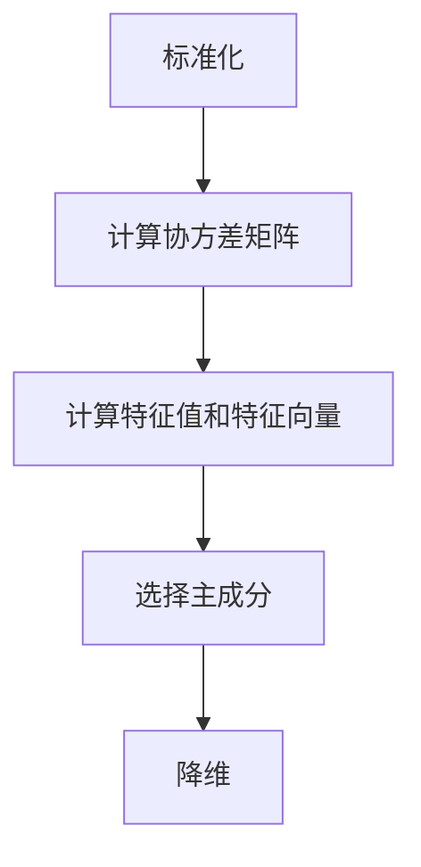
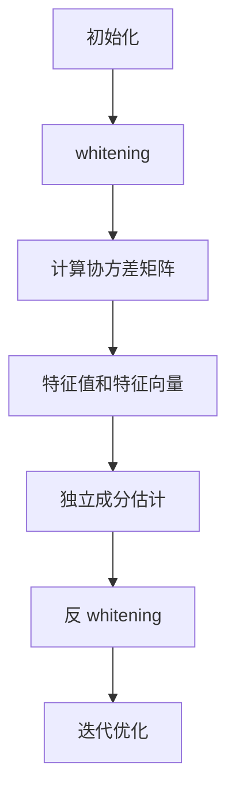
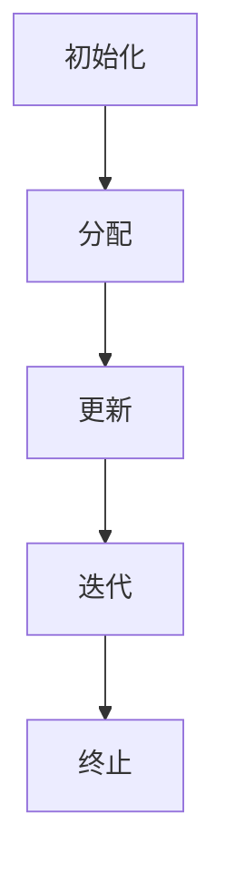
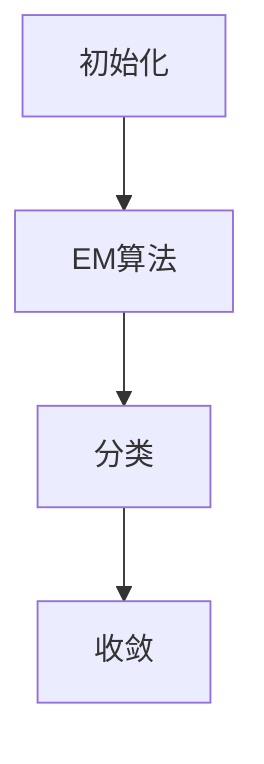

                 

### 无监督学习的前沿进展：探索数据的内在结构

> 关键词：无监督学习、数据降维、聚类分析、数学基础、算法优化、应用场景、未来趋势

> 摘要：无监督学习作为一种无需标注数据的学习方式，在探索数据内在结构方面发挥着重要作用。本文将深入探讨无监督学习的前沿进展，包括其基础理论、核心算法、优化方法以及在不同领域的应用，最后展望无监督学习的未来趋势。

### 《无监督学习的前沿进展：探索数据的内在结构》目录大纲

- 第一部分：无监督学习基础理论
  - 第1章：无监督学习概述
    - 1.1 无监督学习的定义与意义
    - 1.2 无监督学习的分类
    - 1.3 无监督学习的挑战与机遇
  - 第2章：无监督学习的数学基础
    - 2.1 线性代数基础
    - 2.2 概率论基础
    - 2.3 信息论基础
  - 第3章：无监督学习的核心算法原理
    - 3.1 主成分分析（PCA）
    - 3.2 独立成分分析（ICA）
    - 3.3 K-均值聚类
    - 3.4 高斯混合模型
  - 第4章：无监督学习算法优化与扩展
    - 4.1 非线性降维方法
    - 4.2 聚类分析的新方法
    - 4.3 无监督学习在多模态数据上的应用

- 第二部分：无监督学习在实践中的应用
  - 第5章：无监督学习在计算机视觉中的应用
    - 5.1 图像降维与特征提取
    - 5.2 聚类分析在图像分割中的应用
    - 5.3 无监督学习在目标检测中的应用
  - 第6章：无监督学习在自然语言处理中的应用
    - 6.1 文本降维与特征提取
    - 6.2 聚类分析在文本分类中的应用
    - 6.3 无监督学习在序列标注中的应用
  - 第7章：无监督学习在复杂数据分析中的应用
    - 7.1 多模态数据的无监督学习
    - 7.2 无监督学习在复杂数据挖掘中的应用
    - 7.3 无监督学习在推荐系统中的应用
  - 第8章：无监督学习的未来发展
    - 8.1 新算法与模型的发展
    - 8.2 无监督学习在新兴领域的应用
    - 8.3 无监督学习的挑战与趋势

### 附录

- 附录A：无监督学习工具与资源
- 附录B：无监督学习数学公式与解释
- 附录C：无监督学习项目实战案例

接下来的部分，我们将逐章深入探讨无监督学习的理论基础、核心算法原理、优化方法以及在不同领域的应用。希望这篇文章能够帮助您更好地理解无监督学习的内涵及其在实践中的应用价值。让我们开始第一部分的探讨吧。

## 第一部分：无监督学习基础理论

### 第1章：无监督学习概述

无监督学习是一种人工智能和机器学习中的重要分支，与监督学习和强化学习相对应。它主要关注如何从未标记的数据中自动发现数据结构和模式。无监督学习的目标不是预测输出标签，而是通过数据自身的特性，如分布、聚类或降维，来探索数据的内在结构。

### 1.1 无监督学习的定义与意义

无监督学习的定义相对简单：它是指在没有标签或预先定义的输出变量情况下，从数据中学习得到某些结构和信息的过程。这种学习方式具有广泛的应用价值，主要原因包括以下几点：

1. **数据量庞大**：在许多应用场景中，获取标记数据需要大量的时间和人力资源。无监督学习可以处理大量未标记的数据，从而提高数据处理效率。
2. **隐私保护**：在某些领域，如医学研究，可能无法或不愿意公开患者的信息。无监督学习可以在不透露个人隐私的情况下，发现潜在的模式和规律。
3. **模式识别**：无监督学习可以帮助我们理解数据中的复杂模式，这在许多领域中具有重要作用，例如图像识别、文本分析等。
4. **降维与特征提取**：无监督学习可以简化数据结构，提取关键特征，从而提高后续分析的效率和准确性。

### 1.2 无监督学习的分类

无监督学习可以分为几种主要类型，每种类型都有其特定的目标和应用场景：

- **聚类分析**：聚类分析是一种无监督学习方法，旨在将相似的数据点分组到不同的簇中。常见的聚类算法包括K-均值聚类、高斯混合模型和密度峰值聚类等。
- **降维**：降维是一种通过减少数据维度，同时保留数据重要信息的方法。主成分分析（PCA）和独立成分分析（ICA）是两种常见的降维技术。
- **异常检测**：异常检测的目标是识别数据中的异常或离群点。无监督学习在异常检测中应用广泛，例如在金融欺诈检测、网络入侵检测等领域。

### 1.3 无监督学习的挑战与机遇

尽管无监督学习具有许多优势，但其在实际应用中也面临着一些挑战：

- **数据复杂性**：现代数据往往具有高维性和复杂性，这给无监督学习带来了计算上的挑战。
- **算法可解释性**：无监督学习算法通常被视为“黑箱”，其内部机制复杂，难以解释。这可能导致用户对算法的信任度降低。
- **实时处理需求**：在许多应用场景中，如实时监控系统，需要快速处理大量数据。然而，无监督学习算法往往需要较长的计算时间。

然而，随着计算能力和算法技术的不断提升，无监督学习也迎来了许多新的机遇：

- **自适应算法**：自适应算法可以根据数据的变化自动调整，以适应新的数据分布。
- **深度学习**：深度学习与无监督学习的结合，使得复杂的数据结构和模式得以被有效发现。
- **跨领域应用**：无监督学习在多个领域都展示了其潜力，如医疗、金融、工业等。

在接下来的章节中，我们将深入探讨无监督学习的数学基础、核心算法原理以及在不同领域的应用。通过这些探讨，我们将更全面地理解无监督学习的技术内涵和实践价值。

### 第2章：无监督学习的数学基础

无监督学习作为一种重要的机器学习方法，其理论基础涵盖了线性代数、概率论和信息论等多个数学分支。这些基础理论为无监督学习提供了坚实的数学支撑，使我们能够更好地理解其工作原理，并进行有效的算法设计和优化。

#### 2.1 线性代数基础

线性代数是理解无监督学习的重要工具，它在数据表示、特征提取和降维中发挥着关键作用。以下是线性代数中几个关键概念：

- **矩阵与向量**：矩阵和向量是线性代数的基本对象。矩阵是二维数组，可以表示数据集的多个特征；向量是一维数组，可以表示数据的某个维度。例如，一个由100个特征组成的向量可以表示为 \( \mathbf{x} = [x_1, x_2, ..., x_{100}] \)。

- **线性变换**：线性变换是一种将一个向量空间映射到另一个向量空间的操作，它可以通过矩阵乘法来实现。例如，将数据 \( \mathbf{x} \) 通过矩阵 \( \mathbf{A} \) 进行变换，得到新的数据表示 \( \mathbf{y} = \mathbf{A} \mathbf{x} \)。

- **内积与范数**：内积（dot product）是两个向量之间的乘积和，可以用来计算向量的相似度。例如，向量 \( \mathbf{x} \) 和 \( \mathbf{y} \) 的内积为 \( \mathbf{x} \cdot \mathbf{y} = x_1y_1 + x_2y_2 + ... + x_ny_n \)。范数（magnitude）是向量的长度，可以用来度量向量的大小。常见的范数有欧几里得范数（Euclidean norm）和矩阵的Frobenius范数。

这些概念在无监督学习中的应用非常广泛。例如，在主成分分析（PCA）中，通过计算数据的协方差矩阵，可以得到数据的最大特征值和特征向量，从而实现数据的降维和特征提取。

#### 2.2 概率论基础

概率论是理解无监督学习算法的另一个重要数学工具，特别是在处理不确定性和数据分布时。以下是概率论中的几个关键概念：

- **随机变量与概率分布**：随机变量是描述不确定结果的数学函数，它可以取不同的值，每个值对应一个概率分布。概率分布描述了随机变量取不同值的概率。常见的概率分布包括正态分布、伯努利分布和泊松分布等。

- **条件概率与贝叶斯定理**：条件概率是指在某个事件发生的条件下，另一个事件发生的概率。贝叶斯定理是一种用于计算条件概率的公式，它基于先验概率和观测数据，可以帮助我们更新概率估计。

- **最大似然估计与最大后验估计**：最大似然估计（Maximum Likelihood Estimation, MLE）是一种通过最大化似然函数来估计模型参数的方法。最大后验估计（Maximum a Posteriori, MAP）结合了先验概率和似然函数，是一种同时考虑先验信息和观测数据的参数估计方法。

在无监督学习中，概率论的应用非常广泛。例如，在聚类分析中，可以使用高斯混合模型（Gaussian Mixture Model, GMM）来表示数据的分布，并通过最大似然估计或最大后验估计来估计模型的参数。

#### 2.3 信息论基础

信息论是研究信息传递和处理的理论，它在无监督学习中用于衡量数据的复杂性和相似性。以下是信息论中的几个关键概念：

- **熵与信息量**：熵是衡量随机变量不确定性的度量。在无监督学习中，熵可以用来衡量数据分布的复杂度。信息量是衡量数据携带的信息量的度量，它可以用来评估数据的有效性。

- **相关系数与距离度量**：相关系数是衡量两个变量之间线性相关性的度量，它可以用来评估特征的相关性。距离度量是衡量两个数据点之间相似度的度量，如欧几里得距离、曼哈顿距离和切比雪夫距离等。

在无监督学习中，信息论的概念可以用于特征选择和降维。例如，可以通过计算特征之间的相关系数来选择具有最大相关性的特征，从而降低数据的维度。

#### 结论

无监督学习的数学基础是理解其工作原理和进行算法设计的重要前提。线性代数、概率论和信息论为无监督学习提供了丰富的数学工具，使我们能够更好地处理数据和发现数据中的模式。在接下来的章节中，我们将深入探讨无监督学习的核心算法原理，进一步了解其如何应用于实际问题的解决。

### 第3章：无监督学习的核心算法原理

无监督学习的核心算法主要分为降维算法和聚类算法两大类。这些算法通过探索数据的内在结构，实现了数据的降维、特征提取和模式识别。本章将详细介绍几种常见的无监督学习算法，包括主成分分析（PCA）、独立成分分析（ICA）和K-均值聚类等，并展示其算法原理和数学模型。

#### 3.1 主成分分析（PCA）

主成分分析（Principal Component Analysis, PCA）是一种经典的降维技术，其主要目标是通过线性变换将原始数据投影到新的正交坐标系中，从而保留数据的最大方差。PCA算法的核心思想是找到数据的前几个主成分，这些主成分能够解释数据的大部分变异。

##### 算法原理与步骤

1. **标准化**：首先，将原始数据 \( \mathbf{X} \) 标准化，使其具有单位方差。标准化公式为：
   \[
   \mathbf{X}_{\text{std}} = \frac{\mathbf{X} - \mu}{\sigma}
   \]
   其中，\( \mu \) 是均值，\( \sigma \) 是标准差。

2. **计算协方差矩阵**：计算标准化的数据 \( \mathbf{X}_{\text{std}} \) 的协方差矩阵 \( \mathbf{S} \)，公式为：
   \[
   \mathbf{S} = \frac{1}{n-1} \mathbf{X}_{\text{std}}^T \mathbf{X}_{\text{std}}
   \]
   其中，\( n \) 是样本数量。

3. **计算特征值和特征向量**：计算协方差矩阵 \( \mathbf{S} \) 的特征值和特征向量。特征值表示主成分的方差，特征向量表示主成分的方向。

4. **选择主成分**：选择前 \( k \) 个具有最大特征值的特征向量作为主成分，组成矩阵 \( \mathbf{P} \)。

5. **降维**：将原始数据 \( \mathbf{X} \) 投影到新的正交坐标系中，得到降维后的数据 \( \mathbf{Y} \)，公式为：
   \[
   \mathbf{Y} = \mathbf{P} \mathbf{X}_{\text{std}}
   \]

##### 数学模型与公式

1. **标准化数据**：
   \[
   \mathbf{X}_{\text{std}} = \frac{\mathbf{X} - \mu}{\sigma}
   \]

2. **协方差矩阵**：
   \[
   \mathbf{S} = \frac{1}{n-1} \mathbf{X}_{\text{std}}^T \mathbf{X}_{\text{std}}
   \]

3. **特征值和特征向量**：
   \[
   \mathbf{S} \mathbf{v} = \lambda \mathbf{v}
   \]

4. **主成分矩阵**：
   \[
   \mathbf{P} = [\mathbf{v}_1, \mathbf{v}_2, ..., \mathbf{v}_k]
   \]

5. **降维数据**：
   \[
   \mathbf{Y} = \mathbf{P} \mathbf{X}_{\text{std}}
   \]

##### Mermaid 流程图



#### 3.2 独立成分分析（ICA）

独立成分分析（Independent Component Analysis, ICA）是一种用于分离混合信号的降维技术，其目标是将一组线性混合的信号分解为多个独立源信号。ICA在信号处理、音频分离和图像去噪等领域有广泛应用。

##### 算法原理与步骤

1. **初始化**：随机初始化混合信号 \( \mathbf{s} \) 和估计的独立源信号 \( \mathbf{x} \)。

2. ** whitening**：将混合信号通过 whitening 操作转化为具有单位方差的信号 \( \mathbf{a} \)，公式为：
   \[
   \mathbf{a} = \frac{\mathbf{s}}{\|\mathbf{s}\|}
   \]

3. **估计独立成分**：计算 whitened 数据的协方差矩阵 \( \mathbf{C} \)，然后计算其特征值和特征向量。选择具有最小非负特征值的特征向量作为独立成分的方向。

4. **反 whitening**：将估计的独立成分通过反 whitening 操作还原到原始信号空间，公式为：
   \[
   \mathbf{x} = \mathbf{w} \mathbf{a}
   \]

5. **迭代优化**：重复步骤 2 到 4，直到独立成分的变化小于某个阈值。

##### 数学模型与公式

1. **初始化**：
   \[
   \mathbf{x}_0 \sim \mathcal{N}(\mathbf{0}, \mathbf{I})
   \]

2. **whitening**：
   \[
   \mathbf{a} = \frac{\mathbf{s}}{\|\mathbf{s}\|}
   \]

3. **协方差矩阵**：
   \[
   \mathbf{C} = \mathbf{A}^T \mathbf{A}
   \]

4. **特征值和特征向量**：
   \[
   \mathbf{C} \mathbf{v} = \lambda \mathbf{v}
   \]

5. **独立成分估计**：
   \[
   \mathbf{w} = \frac{\mathbf{v}}{\|\mathbf{v}\|}
   \]

6. **反 whitening**：
   \[
   \mathbf{x} = \mathbf{w} \mathbf{a}
   \]

##### Mermaid 流程图



#### 3.3 K-均值聚类

K-均值聚类（K-Means Clustering）是一种简单而有效的聚类算法，其目标是将数据点分为K个簇，使得每个簇内部的点之间距离最小化。K-均值聚类在图像分割、社交网络分析等领域有广泛应用。

##### 算法原理与步骤

1. **初始化**：随机选择K个中心点作为初始聚类中心。

2. **分配**：将每个数据点分配到最近的聚类中心。

3. **更新**：重新计算每个簇的中心点。

4. **迭代**：重复步骤 2 和 3，直到聚类中心不再变化或者达到预设的迭代次数。

##### 数学模型与公式

1. **初始化**：
   \[
   \mathbf{c}_1, \mathbf{c}_2, ..., \mathbf{c}_K \sim \mathcal{N}(\mu_1, \sigma_1^2), \mathcal{N}(\mu_2, \sigma_2^2), ..., \mathcal{N}(\mu_K, \sigma_K^2)
   \]

2. **分配**：
   \[
   \text{assign each point } \mathbf{x}_i \text{ to the nearest cluster center: } \mathbf{c}_{j^*}
   \]

3. **更新**：
   \[
   \mathbf{c}_j = \frac{1}{N_j} \sum_{i=1}^{N} \mathbf{x}_i
   \]

##### Mermaid 流程图



#### 3.4 高斯混合模型

高斯混合模型（Gaussian Mixture Model, GMM）是一种用于表示多个高斯分布的混合的聚类算法，其目标是最小化数据点的负对数似然函数。

##### 算法原理与步骤

1. **初始化**：随机初始化模型参数，包括每个高斯分布的均值、方差和混合系数。

2. **EM算法**：使用期望最大化（Expectation-Maximization, EM）算法迭代优化模型参数，包括均值、方差和混合系数。

3. **分类**：将每个数据点分配到具有最高似然的高斯分布。

4. **收敛**：重复迭代，直到模型参数变化小于某个阈值。

##### 数学模型与公式

1. **初始化**：
   \[
   \pi_k, \mu_k, \sigma_k^2 \sim \text{uniform}(0, 1), \mathcal{N}(\mu_k, \sigma_k^2)
   \]

2. **期望步**：
   \[
   E_step: \gamma_{ik} = \frac{\pi_k \mathcal{N}(\mathbf{x}_i; \mu_k, \sigma_k^2)}{\sum_{k=1}^{K} \pi_k \mathcal{N}(\mathbf{x}_i; \mu_k, \sigma_k^2)}
   \]

3. **最大化步**：
   \[
   M_step:
   \begin{align*}
   \pi_k &= \frac{N_k}{N} \\
   \mu_k &= \frac{1}{N_k} \sum_{i=1}^{N} \gamma_{ik} \mathbf{x}_i \\
   \sigma_k^2 &= \frac{1}{N_k} \sum_{i=1}^{N} \gamma_{ik} (\mathbf{x}_i - \mu_k)^2
   \end{align*}
   \]

4. **分类**：
   \[
   \mathbf{z}_i = \arg\max_{k} \gamma_{ik}
   \]

##### Mermaid 流程图



通过以上对几种核心无监督学习算法的介绍，我们可以看到这些算法在降维、特征提取和聚类分析中的应用价值。在接下来的章节中，我们将进一步探讨无监督学习算法的优化方法以及其在不同领域的应用。

### 第4章：无监督学习算法优化与扩展

在无监督学习的过程中，算法的优化和扩展是提高其性能和适应复杂环境的关键。随着数据量和数据类型的不断增加，传统的无监督学习算法面临着计算效率低下、可解释性差和实时性不足等问题。本章将介绍几种常见的无监督学习算法优化方法和扩展技术，以应对这些挑战。

#### 4.1 非线性降维方法

虽然线性降维方法如主成分分析（PCA）和独立成分分析（ICA）在许多情况下表现出色，但它们在处理非线性结构数据时显得力不从心。为了解决这一问题，研究人员提出了许多非线性降维方法，如自动编码器和流模型。

##### 自动编码器

自动编码器（Autoencoder）是一种神经网络模型，它通过学习一个编码器和解码器来压缩输入数据，并在压缩后重建原始数据。自动编码器由两部分组成：编码器（encoder）和解码器（decoder）。

1. **编码器**：编码器的作用是将输入数据 \( \mathbf{x} \) 映射到一个低维空间 \( \mathbf{z} \)，通常是一个隐层表示。这一过程可以用以下公式表示：
   \[
   \mathbf{z} = \sigma(\mathbf{W}_1 \mathbf{x} + \mathbf{b}_1)
   \]
   其中，\( \sigma \) 是激活函数，\( \mathbf{W}_1 \) 和 \( \mathbf{b}_1 \) 分别是权重和偏置。

2. **解码器**：解码器的任务是将压缩后的隐层表示 \( \mathbf{z} \) 重新映射回原始数据空间 \( \mathbf{x'} \)：
   \[
   \mathbf{x'} = \sigma(\mathbf{W}_2 \mathbf{z} + \mathbf{b}_2)
   \]
   其中，\( \mathbf{W}_2 \) 和 \( \mathbf{b}_2 \) 是另一个权重矩阵和偏置。

3. **损失函数**：自动编码器的训练目标是最小化输入和重建数据之间的差异，通常使用均方误差（MSE）作为损失函数：
   \[
   \text{MSE} = \frac{1}{n} \sum_{i=1}^{n} \sum_{j=1}^{d} (\mathbf{x}_i[j] - \mathbf{x'}_i[j])^2
   \]

4. **训练过程**：自动编码器的训练过程包括前向传播和反向传播。在前向传播中，输入数据通过编码器得到隐层表示，然后通过解码器重建输入数据。在反向传播中，计算损失函数，并通过梯度下降更新模型参数。

##### 流模型

流模型（Flow Model）是一种基于概率模型的非线性降维方法，它通过学习一个概率流函数来将输入数据映射到一个低维空间。流模型的核心是可逆网络（invertible network），它由一个前向网络和一个逆向网络组成。

1. **前向网络**：前向网络将输入数据 \( \mathbf{x} \) 映射到一个中间表示 \( \mathbf{z} \)，该表示满足正态分布：
   \[
   \mathbf{z} = f_\phi(\mathbf{x})
   \]

2. **逆向网络**：逆向网络将中间表示 \( \mathbf{z} \) 映射回原始数据 \( \mathbf{x} \)：
   \[
   \mathbf{x} = f_\psi(\mathbf{z})
   \]

3. **训练过程**：流模型的训练目标是最小化输入数据和重建数据之间的差异。为了实现这一目标，流模型通常使用变分自编码器（Variational Autoencoder, VAE）的结构，其中前向网络和逆向网络分别对应编码器和解码器。

通过以上方法，非线性降维方法能够更好地处理复杂的数据结构，提取有用的特征信息。

#### 4.2 聚类分析的新方法

聚类分析在无监督学习中占据重要地位，但其传统的算法如K-均值聚类和高斯混合模型在处理大规模复杂数据时存在一些局限性。为了克服这些限制，研究人员提出了许多新的聚类方法，如层次聚类和密度峰值聚类。

##### 层次聚类

层次聚类（Hierarchical Clustering）是一种自下而上或自上而下的聚类方法，它将数据点逐步合并或分解，形成一组层次结构。层次聚类的主要优点是能够可视化数据点的层次关系。

1. **自下而上方法**：该方法从单个数据点开始，逐步合并相似的数据点，直到所有数据点合并为一个簇。

2. **自上而下方法**：该方法从所有数据点属于一个簇开始，逐步分裂簇，直到每个数据点都是一个独立的簇。

3. **距离度量**：层次聚类通常使用欧几里得距离、曼哈顿距离等距离度量来计算数据点之间的相似度。

4. **凝聚层次聚类**和**分裂层次聚类**：凝聚层次聚类从低层次开始合并，而分裂层次聚类从高层次开始分裂。

##### 密度峰值聚类

密度峰值聚类（Density Peak Clustering, DPC）是一种基于数据点密度和质心的聚类方法，它能够有效地处理高维数据。

1. **密度计算**：DPC首先计算每个数据点的局部密度，通常使用数据点周围的邻域内的数据点数量来衡量。

2. **峰值检测**：DPC然后识别密度高于其邻域内的其他点的数据点作为峰值。

3. **簇的确定**：DPC通过连接具有较高密度的数据点来形成簇，确保每个簇的质心连接到至少一个峰值点。

通过这些新方法，聚类分析能够更好地适应复杂的数据分布，提高聚类质量。

#### 4.3 无监督学习在多模态数据上的应用

多模态数据是由两种或多种不同类型的数据源组成的，如图像、文本和音频。无监督学习在多模态数据上的应用旨在融合不同类型的数据，提取有意义的特征。

1. **特征融合**：特征融合方法如多模态主成分分析（Multi-modal Principal Component Analysis, MPCA）和多模态独立成分分析（Multi-modal Independent Component Analysis, MICCA）可以融合不同模态的数据，提取共同特征。

2. **降维**：多模态数据的降维方法如多模态流模型（Multi-modal Flow Model）可以有效地降低数据维度，同时保持数据的信息完整性。

3. **模式识别**：无监督学习在多模态数据上的应用还包括模式识别，如通过图像和文本数据的融合进行图像分类和文本分类。

通过这些优化和扩展方法，无监督学习在处理复杂、多模态数据时展现了强大的适应性和有效性。

本章介绍了无监督学习算法的优化和扩展方法，包括非线性降维方法、新的聚类方法以及无监督学习在多模态数据上的应用。这些方法不仅提高了无监督学习算法的性能，也为处理复杂的数据提供了新的思路。在接下来的章节中，我们将探讨无监督学习在实际应用中的具体案例。

### 第5章：无监督学习在计算机视觉中的应用

计算机视觉是人工智能领域中的一个重要分支，它涉及从图像和视频中提取有用信息。无监督学习在计算机视觉中的应用广泛，包括图像降维与特征提取、聚类分析在图像分割中的应用以及无监督学习在目标检测中的应用。

#### 5.1 图像降维与特征提取

图像降维与特征提取是计算机视觉中的一项关键技术，通过减少数据维度，同时保留数据的主要信息，可以显著提高算法的效率和准确性。主成分分析（PCA）和独立成分分析（ICA）是两种常用的降维技术。

##### 主成分分析（PCA）在图像处理中的应用

主成分分析（PCA）是一种线性降维技术，它通过将数据投影到新的正交坐标系中，提取最具有代表性的主成分来实现降维。

1. **算法原理与步骤**
   - 标准化图像数据，使其具有单位方差。
   - 计算协方差矩阵。
   - 计算协方差矩阵的特征值和特征向量。
   - 选择具有最大特征值的前几个特征向量作为主成分。
   - 将图像数据投影到主成分空间中，实现降维。

2. **数学模型与公式**
   - 标准化图像数据：
     \[
     \mathbf{X}_{\text{std}} = \frac{\mathbf{X} - \mu}{\sigma}
     \]
   - 协方差矩阵：
     \[
     \mathbf{S} = \frac{1}{n-1} \mathbf{X}_{\text{std}}^T \mathbf{X}_{\text{std}}
     \]
   - 特征值和特征向量：
     \[
     \mathbf{S} \mathbf{v} = \lambda \mathbf{v}
     \]
   - 主成分矩阵：
     \[
     \mathbf{P} = [\mathbf{v}_1, \mathbf{v}_2, ..., \mathbf{v}_k]
     \]
   - 降维数据：
     \[
     \mathbf{Y} = \mathbf{P} \mathbf{X}_{\text{std}}
     \]

3. **案例与代码实现**
   - 使用Python的scikit-learn库实现PCA降维：
     ```python
     from sklearn.decomposition import PCA
     pca = PCA(n_components=10)
     X_std = pca.fit_transform(X)
     ```

##### 独立成分分析（ICA）在图像处理中的应用

独立成分分析（ICA）是一种非线性降维技术，它通过分离原始数据中的独立源信号来实现降维。

1. **算法原理与步骤**
   - 初始化混合信号和独立源信号。
   - 进行whitening操作，将混合信号转化为具有单位方差的信号。
   - 计算协方差矩阵的特征值和特征向量。
   - 选择具有最小非负特征值的特征向量作为独立成分的方向。
   - 进行反whitening操作，将独立成分还原到原始信号空间。

2. **数学模型与公式**
   - 初始化：
     \[
     \mathbf{x}_0 \sim \mathcal{N}(\mathbf{0}, \mathbf{I})
     \]
   - whitening：
     \[
     \mathbf{a} = \frac{\mathbf{s}}{\|\mathbf{s}\|}
     \]
   - 协方差矩阵：
     \[
     \mathbf{C} = \mathbf{A}^T \mathbf{A}
     \]
   - 特征值和特征向量：
     \[
     \mathbf{C} \mathbf{v} = \lambda \mathbf{v}
     \]
   - 独立成分估计：
     \[
     \mathbf{w} = \frac{\mathbf{v}}{\|\mathbf{v}\|}
     \]
   - 反whitening：
     \[
     \mathbf{x} = \mathbf{w} \mathbf{a}
     \]

3. **案例与代码实现**
   - 使用Python的scikit-learn库实现ICA降维：
     ```python
     from sklearn.decomposition import FastICA
     ica = FastICA(n_components=10, random_state=0)
     X_ica = ica.fit_transform(X)
     ```

通过PCA和ICA，图像数据可以实现有效的降维，同时保留关键信息，从而提高后续图像处理的效率。

#### 5.2 聚类分析在图像分割中的应用

聚类分析在图像分割中具有重要作用，通过将图像像素点划分为不同的簇，可以实现对图像的分割。常用的聚类算法包括K-均值聚类和高斯混合模型（GMM）。

##### K-均值聚类在图像分割中的应用

K-均值聚类是一种简单的迭代聚类算法，通过逐步更新聚类中心，将图像像素点划分到不同的簇中。

1. **算法原理与步骤**
   - 初始化K个聚类中心。
   - 将每个像素点分配到最近的聚类中心。
   - 计算新的聚类中心，公式为：
     \[
     \mathbf{c}_j = \frac{1}{N_j} \sum_{i=1}^{N} \mathbf{x}_i
     \]
   - 重复步骤 2 和 3，直到聚类中心不再变化。

2. **数学模型与公式**
   - 初始化：
     \[
     \mathbf{c}_1, \mathbf{c}_2, ..., \mathbf{c}_K
     \]
   - 分配：
     \[
     \text{assign each pixel } \mathbf{x}_i \text{ to the nearest cluster center: } \mathbf{c}_{j^*}
     \]
   - 更新：
     \[
     \mathbf{c}_j = \frac{1}{N_j} \sum_{i=1}^{N} \mathbf{x}_i
     \]

3. **案例与代码实现**
   - 使用Python的scikit-learn库实现K-均值聚类：
     ```python
     from sklearn.cluster import KMeans
     kmeans = KMeans(n_clusters=3, random_state=0)
     labels = kmeans.fit_predict(X)
     ```

##### 高斯混合模型在图像分割中的应用

高斯混合模型（GMM）是一种基于概率的聚类算法，通过学习多个高斯分布的混合来表示数据。

1. **算法原理与步骤**
   - 初始化模型参数，包括每个高斯分布的均值、方差和混合系数。
   - 使用期望最大化（EM）算法迭代优化模型参数。
   - 将每个像素点分配到具有最高似然的高斯分布。

2. **数学模型与公式**
   - 初始化：
     \[
     \pi_k, \mu_k, \sigma_k^2 \sim \text{uniform}(0, 1), \mathcal{N}(\mu_k, \sigma_k^2)
     \]
   - 期望步：
     \[
     E_step: \gamma_{ik} = \frac{\pi_k \mathcal{N}(\mathbf{x}_i; \mu_k, \sigma_k^2)}{\sum_{k=1}^{K} \pi_k \mathcal{N}(\mathbf{x}_i; \mu_k, \sigma_k^2)}
     \]
   - 最大步：
     \[
     M_step:
     \begin{align*}
     \pi_k &= \frac{N_k}{N} \\
     \mu_k &= \frac{1}{N_k} \sum_{i=1}^{N} \gamma_{ik} \mathbf{x}_i \\
     \sigma_k^2 &= \frac{1}{N_k} \sum_{i=1}^{N} \gamma_{ik} (\mathbf{x}_i - \mu_k)^2
     \end{align*}
     \]
   - 分类：
     \[
     \mathbf{z}_i = \arg\max_{k} \gamma_{ik}
     \]

3. **案例与代码实现**
   - 使用Python的scikit-learn库实现GMM：
     ```python
     from sklearn.mixture import GaussianMixture
     gmm = GaussianMixture(n_components=3, random_state=0)
     labels = gmm.fit_predict(X)
     ```

通过K-均值聚类和GMM，图像分割可以实现像素点的有效聚类，从而提高图像处理的准确性和效率。

#### 5.3 无监督学习在目标检测中的应用

目标检测是计算机视觉中的另一个重要任务，其目标是在图像或视频中检测并定位特定目标。无监督学习在目标检测中的应用可以通过自编码器（Autoencoder）和流模型（Flow Model）实现。

##### 自编码器在目标检测中的应用

自编码器通过学习输入数据的编码和解码过程，可以在降维的同时保持数据的特征信息，从而在目标检测中提取有效的特征。

1. **算法原理与步骤**
   - 构建自编码器模型，包括编码器和解码器。
   - 训练自编码器，使其能够有效重建输入数据。
   - 使用编码器提取输入数据的特征表示。

2. **数学模型与公式**
   - 编码器：
     \[
     \mathbf{z} = \sigma(\mathbf{W}_1 \mathbf{x} + \mathbf{b}_1)
     \]
   - 解码器：
     \[
     \mathbf{x'} = \sigma(\mathbf{W}_2 \mathbf{z} + \mathbf{b}_2)
     \]

3. **案例与代码实现**
   - 使用Python的TensorFlow库实现自编码器：
     ```python
     import tensorflow as tf
     model = tf.keras.Sequential([
         tf.keras.layers.Flatten(input_shape=(28, 28)),
         tf.keras.layers.Dense(64, activation='relu'),
         tf.keras.layers.Dense(64, activation='relu'),
         tf.keras.layers.Dense(28 * 28, activation='sigmoid')
     ])
     model.compile(optimizer='adam', loss='binary_crossentropy')
     model.fit(X_train, X_train, epochs=10)
     ```

##### 流模型在目标检测中的应用

流模型通过学习输入数据的概率分布，可以提取有效的特征表示，从而在目标检测中识别目标。

1. **算法原理与步骤**
   - 构建流模型，包括前向网络和解码网络。
   - 训练流模型，使其能够有效表示输入数据的概率分布。
   - 使用流模型提取输入数据的特征表示。

2. **数学模型与公式**
   - 前向网络：
     \[
     \mathbf{z} = f_\phi(\mathbf{x})
     \]
   - 解码网络：
     \[
     \mathbf{x'} = f_\psi(\mathbf{z})
     \]

3. **案例与代码实现**
   - 使用Python的PyTorch库实现流模型：
     ```python
     import torch
     import torch.nn as nn
     class FlowModel(nn.Module):
         def __init__(self):
             super(FlowModel, self).__init__()
             self.forward_network = nn.Sequential(
                 nn.Linear(in_features, hidden_features),
                 nn.ReLU(),
                 nn.Linear(hidden_features, out_features)
             )
         def forward(self, x):
             z = self.forward_network(x)
             return z
     model = FlowModel()
     optimizer = torch.optim.Adam(model.parameters(), lr=0.001)
     for epoch in range(num_epochs):
         optimizer.zero_grad()
         z = model(x)
         loss = criterion(z, x)
         loss.backward()
         optimizer.step()
     ```

通过自编码器和流模型，目标检测可以实现有效的特征提取和目标识别，从而提高检测的准确性和效率。

本章介绍了无监督学习在计算机视觉中的应用，包括图像降维与特征提取、聚类分析在图像分割中的应用以及无监督学习在目标检测中的应用。这些应用展示了无监督学习在处理图像数据时的强大能力和广泛前景。

### 第6章：无监督学习在自然语言处理中的应用

自然语言处理（Natural Language Processing, NLP）是人工智能领域中的一个重要分支，它涉及计算机对自然语言的识别、理解和生成。无监督学习在NLP中的应用广泛，涵盖了文本降维与特征提取、聚类分析在文本分类中的应用以及无监督学习在序列标注中的应用。

#### 6.1 文本降维与特征提取

文本降维与特征提取是NLP中的基础任务，通过减少文本数据的维度，同时保留文本的主要信息，可以提高后续处理和分析的效率。主成分分析（PCA）和独立成分分析（ICA）是两种常用的文本降维技术。

##### 主成分分析（PCA）在文本处理中的应用

主成分分析（PCA）是一种线性降维技术，它通过将文本数据投影到新的正交坐标系中，提取最具有代表性的主成分来实现降维。

1. **算法原理与步骤**
   - 将文本数据转换为词向量表示，如使用Word2Vec或GloVe。
   - 标准化词向量数据，使其具有单位方差。
   - 计算协方差矩阵。
   - 计算协方差矩阵的特征值和特征向量。
   - 选择具有最大特征值的前几个特征向量作为主成分。
   - 将文本数据投影到主成分空间中，实现降维。

2. **数学模型与公式**
   - 标准化文本数据：
     \[
     \mathbf{X}_{\text{std}} = \frac{\mathbf{X} - \mu}{\sigma}
     \]
   - 协方差矩阵：
     \[
     \mathbf{S} = \frac{1}{n-1} \mathbf{X}_{\text{std}}^T \mathbf{X}_{\text{std}}
     \]
   - 特征值和特征向量：
     \[
     \mathbf{S} \mathbf{v} = \lambda \mathbf{v}
     \]
   - 主成分矩阵：
     \[
     \mathbf{P} = [\mathbf{v}_1, \mathbf{v}_2, ..., \mathbf{v}_k]
     \]
   - 降维文本数据：
     \[
     \mathbf{Y} = \mathbf{P} \mathbf{X}_{\text{std}}
     \]

3. **案例与代码实现**
   - 使用Python的scikit-learn库实现PCA降维：
     ```python
     from sklearn.decomposition import PCA
     pca = PCA(n_components=100)
     X_std = pca.fit_transform(X)
     ```

##### 独立成分分析（ICA）在文本处理中的应用

独立成分分析（ICA）是一种非线性降维技术，它通过分离原始数据中的独立源信号来实现降维。

1. **算法原理与步骤**
   - 初始化混合信号和独立源信号。
   - 进行whitening操作，将混合信号转化为具有单位方差的信号。
   - 计算协方差矩阵的特征值和特征向量。
   - 选择具有最小非负特征值的特征向量作为独立成分的方向。
   - 进行反whitening操作，将独立成分还原到原始信号空间。

2. **数学模型与公式**
   - 初始化：
     \[
     \mathbf{x}_0 \sim \mathcal{N}(\mathbf{0}, \mathbf{I})
     \]
   - whitening：
     \[
     \mathbf{a} = \frac{\mathbf{s}}{\|\mathbf{s}\|}
     \]
   - 协方差矩阵：
     \[
     \mathbf{C} = \mathbf{A}^T \mathbf{A}
     \]
   - 特征值和特征向量：
     \[
     \mathbf{C} \mathbf{v} = \lambda \mathbf{v}
     \]
   - 独立成分估计：
     \[
     \mathbf{w} = \frac{\mathbf{v}}{\|\mathbf{v}\|}
     \]
   - 反whitening：
     \[
     \mathbf{x} = \mathbf{w} \mathbf{a}
     \]

3. **案例与代码实现**
   - 使用Python的scikit-learn库实现ICA降维：
     ```python
     from sklearn.decomposition import FastICA
     ica = FastICA(n_components=100, random_state=0)
     X_ica = ica.fit_transform(X)
     ```

通过PCA和ICA，文本数据可以实现有效的降维，同时保留关键信息，从而提高后续文本处理的效率。

#### 6.2 聚类分析在文本分类中的应用

聚类分析在文本分类中具有重要作用，通过将文本数据划分为不同的簇，可以实现对文本的分类。常用的聚类算法包括K-均值聚类和高斯混合模型（GMM）。

##### K-均值聚类在文本分类中的应用

K-均值聚类是一种简单的迭代聚类算法，通过逐步更新聚类中心，将文本数据划分到不同的簇中。

1. **算法原理与步骤**
   - 初始化K个聚类中心。
   - 将每个文本数据分配到最近的聚类中心。
   - 计算新的聚类中心，公式为：
     \[
     \mathbf{c}_j = \frac{1}{N_j} \sum_{i=1}^{N} \mathbf{x}_i
     \]
   - 重复步骤 2 和 3，直到聚类中心不再变化。

2. **数学模型与公式**
   - 初始化：
     \[
     \mathbf{c}_1, \mathbf{c}_2, ..., \mathbf{c}_K
     \]
   - 分配：
     \[
     \text{assign each text } \mathbf{x}_i \text{ to the nearest cluster center: } \mathbf{c}_{j^*}
     \]
   - 更新：
     \[
     \mathbf{c}_j = \frac{1}{N_j} \sum_{i=1}^{N} \mathbf{x}_i
     \]

3. **案例与代码实现**
   - 使用Python的scikit-learn库实现K-均值聚类：
     ```python
     from sklearn.cluster import KMeans
     kmeans = KMeans(n_clusters=3, random_state=0)
     labels = kmeans.fit_predict(X)
     ```

##### 高斯混合模型在文本分类中的应用

高斯混合模型（GMM）是一种基于概率的聚类算法，通过学习多个高斯分布的混合来表示文本数据。

1. **算法原理与步骤**
   - 初始化模型参数，包括每个高斯分布的均值、方差和混合系数。
   - 使用期望最大化（EM）算法迭代优化模型参数。
   - 将每个文本数据分配到具有最高似然的高斯分布。

2. **数学模型与公式**
   - 初始化：
     \[
     \pi_k, \mu_k, \sigma_k^2 \sim \text{uniform}(0, 1), \mathcal{N}(\mu_k, \sigma_k^2)
     \]
   - 期望步：
     \[
     E_step: \gamma_{ik} = \frac{\pi_k \mathcal{N}(\mathbf{x}_i; \mu_k, \sigma_k^2)}{\sum_{k=1}^{K} \pi_k \mathcal{N}(\mathbf{x}_i; \mu_k, \sigma_k^2)}
     \]
   - 最大步：
     \[
     M_step:
     \begin{align*}
     \pi_k &= \frac{N_k}{N} \\
     \mu_k &= \frac{1}{N_k} \sum_{i=1}^{N} \gamma_{ik} \mathbf{x}_i \\
     \sigma_k^2 &= \frac{1}{N_k} \sum_{i=1}^{N} \gamma_{ik} (\mathbf{x}_i - \mu_k)^2
     \end{align*}
     \]
   - 分类：
     \[
     \mathbf{z}_i = \arg\max_{k} \gamma_{ik}
     \]

3. **案例与代码实现**
   - 使用Python的scikit-learn库实现GMM：
     ```python
     from sklearn.mixture import GaussianMixture
     gmm = GaussianMixture(n_components=3, random_state=0)
     labels = gmm.fit_predict(X)
     ```

通过K-均值聚类和GMM，文本数据可以实现有效的聚类，从而提高文本分类的准确性和效率。

#### 6.3 无监督学习在序列标注中的应用

序列标注是NLP中的另一个重要任务，其目标是对文本中的每个词或字符进行分类。无监督学习在序列标注中的应用可以通过自编码器和流模型实现。

##### 自编码器在序列标注中的应用

自编码器通过学习输入序列的编码和解码过程，可以在降维的同时保持序列的特征信息，从而在序列标注中提取有效的特征。

1. **算法原理与步骤**
   - 构建自编码器模型，包括编码器和解码器。
   - 训练自编码器，使其能够有效重建输入序列。
   - 使用编码器提取输入序列的特征表示。

2. **数学模型与公式**
   - 编码器：
     \[
     \mathbf{z} = \sigma(\mathbf{W}_1 \mathbf{x} + \mathbf{b}_1)
     \]
   - 解码器：
     \[
     \mathbf{x'} = \sigma(\mathbf{W}_2 \mathbf{z} + \mathbf{b}_2)
     \]

3. **案例与代码实现**
   - 使用Python的TensorFlow库实现自编码器：
     ```python
     import tensorflow as tf
     model = tf.keras.Sequential([
         tf.keras.layers.Embedding(input_dim=vocab_size, output_dim=embedding_dim),
         tf.keras.layers.LSTM(units=128),
         tf.keras.layers.Dense(output_dim, activation='softmax')
     ])
     model.compile(optimizer='adam', loss='categorical_crossentropy', metrics=['accuracy'])
     model.fit(X_train, y_train, epochs=10)
     ```

##### 流模型在序列标注中的应用

流模型通过学习输入序列的概率分布，可以提取有效的特征表示，从而在序列标注中识别标签。

1. **算法原理与步骤**
   - 构建流模型，包括前向网络和解码网络。
   - 训练流模型，使其能够有效表示输入序列的概率分布。
   - 使用流模型提取输入序列的特征表示。

2. **数学模型与公式**
   - 前向网络：
     \[
     \mathbf{z} = f_\phi(\mathbf{x})
     \]
   - 解码网络：
     \[
     \mathbf{x'} = f_\psi(\mathbf{z})
     \]

3. **案例与代码实现**
   - 使用Python的PyTorch库实现流模型：
     ```python
     import torch
     import torch.nn as nn
     class FlowModel(nn.Module):
         def __init__(self):
             super(FlowModel, self).__init__()
             self.forward_network = nn.Sequential(
                 nn.Linear(in_features, hidden_features),
                 nn.ReLU(),
                 nn.Linear(hidden_features, out_features)
             )
         def forward(self, x):
             z = self.forward_network(x)
             return z
     model = FlowModel()
     optimizer = torch.optim.Adam(model.parameters(), lr=0.001)
     for epoch in range(num_epochs):
         optimizer.zero_grad()
         z = model(x)
         loss = criterion(z, x)
         loss.backward()
         optimizer.step()
     ```

通过自编码器和流模型，序列标注可以实现有效的特征提取和标签识别，从而提高标注的准确性和效率。

本章介绍了无监督学习在自然语言处理中的应用，包括文本降维与特征提取、聚类分析在文本分类中的应用以及无监督学习在序列标注中的应用。这些应用展示了无监督学习在处理文本数据时的强大能力和广泛前景。

### 第7章：无监督学习在复杂数据分析中的应用

无监督学习在复杂数据分析中发挥着重要作用，特别是在多模态数据融合、复杂数据挖掘和推荐系统中的应用。本章将详细介绍这些应用场景，并通过具体案例来展示无监督学习如何在这些领域中发挥作用。

#### 7.1 多模态数据的无监督学习

多模态数据是指由两种或多种不同类型的数据源组成的数据，如图像、文本、音频等。在多模态数据中，不同类型的数据往往携带了不同的信息，通过无监督学习的方法，可以有效地融合这些信息，提取更全面和准确的特征。

##### 图像与文本数据的融合

图像和文本数据的融合是当前研究的热点之一，通过无监督学习方法，可以从图像和文本中提取互补的特征，提高模型的性能。

1. **算法原理**
   - 使用无监督学习算法，如多模态主成分分析（MPCA），将图像和文本数据降维到同一维度。
   - 通过对降维后的数据进行矩阵分解，提取图像和文本数据中的共同特征。

2. **数学模型**
   - 设图像数据为 \( \mathbf{I} \)，文本数据为 \( \mathbf{T} \)，降维后的数据为 \( \mathbf{I'} \) 和 \( \mathbf{T'} \)。
   - 多模态主成分分析的目标是最小化 \( \mathbf{I'} \) 和 \( \mathbf{T'} \) 的差异，并保留各自的特征。

3. **案例与代码实现**
   - 使用Python的scikit-learn库实现MPCA：
     ```python
     from sklearn.decomposition import PCA
     pca = PCA(n_components=100)
     I_std = pca.fit_transform(I)
     T_std = pca.fit_transform(T)
     ```

##### 多媒体数据的降维

多媒体数据的降维是复杂数据分析中的另一个关键任务，通过降维，可以减少数据存储和计算的成本，同时保持数据的主要信息。

1. **算法原理**
   - 使用流模型（Flow Model）对多媒体数据进行非线性降维。
   - 流模型通过学习输入数据的概率分布，将高维数据映射到低维空间。

2. **数学模型**
   - 设多媒体数据为 \( \mathbf{X} \)，降维后的数据为 \( \mathbf{Z} \)。
   - 流模型的训练目标是最小化输入数据与重建数据之间的差异。

3. **案例与代码实现**
   - 使用Python的PyTorch库实现流模型：
     ```python
     import torch
     class FlowModel(nn.Module):
         def __init__(self):
             super(FlowModel, self).__init__()
             self.forward_network = nn.Sequential(
                 nn.Linear(in_features, hidden_features),
                 nn.ReLU(),
                 nn.Linear(hidden_features, out_features)
             )
         def forward(self, x):
             z = self.forward_network(x)
             return z
     model = FlowModel()
     optimizer = torch.optim.Adam(model.parameters(), lr=0.001)
     for epoch in range(num_epochs):
         optimizer.zero_grad()
         z = model(x)
         loss = criterion(z, x)
         loss.backward()
         optimizer.step()
     ```

通过图像与文本数据的融合和多媒体数据的降维，无监督学习可以更好地处理复杂数据，提取有用的特征信息。

#### 7.2 无监督学习在复杂数据挖掘中的应用

复杂数据挖掘是指从大规模、多维、高维数据中提取有价值的信息。无监督学习在复杂数据挖掘中的应用非常广泛，如聚类分析、异常检测等。

##### 聚类分析在复杂数据挖掘中的应用

聚类分析是一种常用的无监督学习方法，通过将相似的数据点分组到不同的簇中，可以帮助我们发现数据中的隐含结构。

1. **算法原理**
   - 使用K-均值聚类对复杂数据进行聚类。
   - 通过分析聚类的结果，识别数据中的潜在模式。

2. **数学模型**
   - 设复杂数据为 \( \mathbf{X} \)，聚类结果为 \( \mathbf{C} \)。
   - K-均值聚类目标是最小化每个簇内部的数据点之间的距离。

3. **案例与代码实现**
   - 使用Python的scikit-learn库实现K-均值聚类：
     ```python
     from sklearn.cluster import KMeans
     kmeans = KMeans(n_clusters=3, random_state=0)
     labels = kmeans.fit_predict(X)
     ```

##### 异常检测在复杂数据挖掘中的应用

异常检测是复杂数据挖掘中的另一个重要任务，通过识别数据中的异常或离群点，可以帮助我们发现潜在的问题。

1. **算法原理**
   - 使用孤立森林（Isolation Forest）对复杂数据进行异常检测。
   - 通过计算每个数据点的隔离度，识别异常点。

2. **数学模型**
   - 设复杂数据为 \( \mathbf{X} \)，异常检测结果为 \( \mathbf{A} \)。
   - 孤立森林的目标是最大化每个数据点的隔离度。

3. **案例与代码实现**
   - 使用Python的scikit-learn库实现孤立森林：
     ```python
     from sklearn.ensemble import IsolationForest
     iso_forest = IsolationForest(contamination=0.1)
     labels = iso_forest.fit_predict(X)
     ```

通过聚类分析和异常检测，无监督学习可以帮助我们从复杂数据中提取有价值的信息。

#### 7.3 无监督学习在推荐系统中的应用

推荐系统是一种通过分析用户行为和偏好，为用户推荐感兴趣的项目或内容的方法。无监督学习在推荐系统中的应用主要包括基于内容的推荐和基于协同过滤的推荐。

##### 基于内容的推荐

基于内容的推荐通过分析项目的内容特征，为用户推荐与其兴趣相似的项目。

1. **算法原理**
   - 使用无监督学习方法，如K-均值聚类，对项目特征进行聚类。
   - 根据用户的兴趣，为用户推荐与其兴趣簇相似的项目。

2. **数学模型**
   - 设项目特征为 \( \mathbf{X} \)，聚类结果为 \( \mathbf{C} \)。
   - 基于内容的推荐目标是最小化用户兴趣簇与项目簇之间的差异。

3. **案例与代码实现**
   - 使用Python的scikit-learn库实现K-均值聚类：
     ```python
     from sklearn.cluster import KMeans
     kmeans = KMeans(n_clusters=10, random_state=0)
     labels = kmeans.fit_predict(X)
     ```

##### 基于协同过滤的推荐

基于协同过滤的推荐通过分析用户的行为和偏好，为用户推荐他们可能感兴趣的项目。

1. **算法原理**
   - 使用矩阵分解的方法，如奇异值分解（SVD），对用户-项目评分矩阵进行分解。
   - 通过重构评分矩阵，预测用户对未评分项目的评分，并推荐高评分的项目。

2. **数学模型**
   - 设用户-项目评分矩阵为 \( \mathbf{R} \)，分解结果为 \( \mathbf{U} \) 和 \( \mathbf{V} \)。
   - 基于协同过滤的推荐目标是最小化预测评分与实际评分之间的差异。

3. **案例与代码实现**
   - 使用Python的scikit-learn库实现矩阵分解：
     ```python
     from sklearn.decomposition import TruncatedSVD
     svd = TruncatedSVD(n_components=50)
     U = svd.fit_transform(R)
     V = svd.inverse_transform(U)
     ```

通过基于内容的推荐和基于协同过滤的推荐，无监督学习可以帮助推荐系统更准确地预测用户的兴趣和偏好。

本章介绍了无监督学习在复杂数据分析中的应用，包括多模态数据的融合、复杂数据挖掘和推荐系统。这些应用展示了无监督学习在处理复杂数据时的强大能力和广泛前景。

### 第8章：无监督学习的未来发展

无监督学习作为机器学习领域的一个重要分支，正不断推动着人工智能技术的发展。在未来，无监督学习将继续在算法创新、新兴领域应用以及面临的挑战等方面展现其潜力与前景。

#### 8.1 新算法与模型的发展

随着计算能力和算法理论的不断发展，无监督学习将迎来更多的算法创新和模型突破。

1. **自适应无监督学习算法**：自适应无监督学习算法能够根据数据的变化自动调整模型参数，从而更好地适应动态环境。这类算法在实时数据处理和动态系统建模中具有广泛的应用前景。

2. **深度学习与无监督学习的结合**：深度学习在无监督学习中的应用日益广泛，通过引入深度神经网络，无监督学习能够更有效地学习复杂的非线性数据结构。例如，自编码器和变分自编码器（VAE）等深度模型在降维和特征提取中表现优异。

3. **图神经网络**：图神经网络（Graph Neural Networks, GNN）在处理图结构数据方面具有优势。结合无监督学习，图神经网络可以用于图像、文本和知识图谱等多模态数据的融合和分析。

4. **迁移学习和增量学习**：迁移学习和增量学习在无监督学习中的应用有望提高模型的泛化能力。通过将已有知识迁移到新任务，或逐步更新模型参数，这些方法能够有效地处理新数据和环境变化。

#### 8.2 无监督学习在新兴领域的应用

无监督学习在新兴领域中的应用潜力巨大，特别是在大数据和人工智能技术迅速发展的背景下。

1. **物联网数据**：物联网（Internet of Things, IoT）设备的广泛应用产生了大量数据。无监督学习可以帮助分析这些数据，发现设备运行中的异常模式和趋势，从而优化设备性能和提升安全性。

2. **生物信息学**：生物信息学领域的数据类型多样且复杂，无监督学习在基因序列分析、蛋白质结构预测和药物设计等方面有着广泛应用。例如，通过聚类分析，可以识别基因表达谱中的关键基因。

3. **金融科技**：在金融科技（FinTech）领域，无监督学习可以用于市场趋势分析、风险评估和客户行为分析。通过分析大量的交易数据和历史记录，无监督学习能够帮助金融机构识别潜在的市场机会和风险。

4. **自动驾驶**：自动驾驶技术的发展依赖于对环境数据的实时理解和分析。无监督学习在自动驾驶中可以用于车辆定位、障碍物检测和环境建模，从而提高自动驾驶的安全性和可靠性。

#### 8.3 无监督学习的挑战与趋势

尽管无监督学习在多个领域展现了巨大的潜力，但仍面临着一系列挑战和趋势。

1. **算法可解释性**：无监督学习算法通常被视为“黑箱”，其内部机制复杂，难以解释。提高算法的可解释性，使其能够被用户理解和信任，是未来研究的一个重要方向。

2. **实时处理需求**：在许多应用场景中，如实时监控系统，需要快速处理大量数据。无监督学习算法需要进一步优化，以实现高效的实时数据处理。

3. **大规模数据处理能力**：随着数据量的不断增加，无监督学习算法在大规模数据处理方面面临巨大挑战。分布式计算和并行处理技术将成为无监督学习实现大规模应用的关键。

4. **数据隐私与安全**：在处理敏感数据时，数据隐私和安全是一个重要问题。无监督学习算法需要设计出能够在保护用户隐私的前提下，有效分析数据的方案。

综上所述，无监督学习在未来的发展中将继续在算法创新、新兴领域应用以及解决现有挑战等方面取得重要进展。通过不断的探索和实践，无监督学习将为进一步推动人工智能技术的发展做出重要贡献。

### 附录

#### 附录A：无监督学习工具与资源

无监督学习作为一种重要的机器学习方法，其在实际应用中需要依赖各种工具和资源。以下是一些主流的无监督学习框架、开源工具和应用库，以及相关的课程和在线资源。

1. **主流无监督学习框架**：
   - **scikit-learn**：Python的一个开源机器学习库，提供了丰富的无监督学习算法。
   - **TensorFlow**：Google开源的深度学习框架，支持多种无监督学习算法，包括自动编码器和变分自编码器。
   - **PyTorch**：Facebook开源的深度学习框架，提供灵活的动态计算图和强大的GPU加速功能。

2. **开源工具与应用库**：
   - **MLlib**：Apache Spark的机器学习库，支持多种无监督学习算法，适用于大规模数据处理。
   - **scipy**：Python的科学计算库，包括多种数学和统计函数，可用于无监督学习的数据预处理和算法实现。
   - **Theano**：深度学习框架，提供自动微分功能，适用于复杂的无监督学习算法。

3. **课程与在线资源**：
   - **Coursera**：提供多个无监督学习的在线课程，如《机器学习》课程中的无监督学习部分。
   - **edX**：提供由知名大学和机构开设的机器学习和深度学习在线课程。
   - **Kaggle**：数据科学竞赛平台，提供无监督学习相关的竞赛题目和项目实战。

#### 附录B：无监督学习数学公式与解释

以下是本文中提到的一些关键数学公式及其解释：

1. **主成分分析（PCA）**：
   - **标准化**：
     \[
     \mathbf{X}_{\text{std}} = \frac{\mathbf{X} - \mu}{\sigma}
     \]
     其中，\( \mu \) 是均值，\( \sigma \) 是标准差。

   - **协方差矩阵**：
     \[
     \mathbf{S} = \frac{1}{n-1} \mathbf{X}_{\text{std}}^T \mathbf{X}_{\text{std}}
     \]
     其中，\( n \) 是样本数量。

   - **特征值和特征向量**：
     \[
     \mathbf{S} \mathbf{v} = \lambda \mathbf{v}
     \]
     其中，\( \lambda \) 是特征值。

   - **主成分矩阵**：
     \[
     \mathbf{P} = [\mathbf{v}_1, \mathbf{v}_2, ..., \mathbf{v}_k]
     \]

   - **降维数据**：
     \[
     \mathbf{Y} = \mathbf{P} \mathbf{X}_{\text{std}}
     \]

2. **独立成分分析（ICA）**：
   - **初始化**：
     \[
     \mathbf{x}_0 \sim \mathcal{N}(\mathbf{0}, \mathbf{I})
     \]
     其中，\( \mathcal{N}(\mathbf{0}, \mathbf{I}) \) 表示均值为零、协方差矩阵为单位矩阵的正态分布。

   - **whitening**：
     \[
     \mathbf{a} = \frac{\mathbf{s}}{\|\mathbf{s}\|}
     \]

   - **协方差矩阵**：
     \[
     \mathbf{C} = \mathbf{A}^T \mathbf{A}
     \]

   - **特征值和特征向量**：
     \[
     \mathbf{C} \mathbf{v} = \lambda \mathbf{v}
     \]

   - **独立成分估计**：
     \[
     \mathbf{w} = \frac{\mathbf{v}}{\|\mathbf{v}\|}
     \]

   - **反whitening**：
     \[
     \mathbf{x} = \mathbf{w} \mathbf{a}
     \]

3. **K-均值聚类**：
   - **初始化**：
     \[
     \mathbf{c}_1, \mathbf{c}_2, ..., \mathbf{c}_K
     \]

   - **分配**：
     \[
     \text{assign each point } \mathbf{x}_i \text{ to the nearest cluster center: } \mathbf{c}_{j^*}
     \]

   - **更新**：
     \[
     \mathbf{c}_j = \frac{1}{N_j} \sum_{i=1}^{N} \mathbf{x}_i
     \]

4. **高斯混合模型（GMM）**：
   - **初始化**：
     \[
     \pi_k, \mu_k, \sigma_k^2 \sim \text{uniform}(0, 1), \mathcal{N}(\mu_k, \sigma_k^2)
     \]

   - **期望步**：
     \[
     E_step: \gamma_{ik} = \frac{\pi_k \mathcal{N}(\mathbf{x}_i; \mu_k, \sigma_k^2)}{\sum_{k=1}^{K} \pi_k \mathcal{N}(\mathbf{x}_i; \mu_k, \sigma_k^2)}
     \]

   - **最大化步**：
     \[
     M_step:
     \begin{align*}
     \pi_k &= \frac{N_k}{N} \\
     \mu_k &= \frac{1}{N_k} \sum_{i=1}^{N} \gamma_{ik} \mathbf{x}_i \\
     \sigma_k^2 &= \frac{1}{N_k} \sum_{i=1}^{N} \gamma_{ik} (\mathbf{x}_i - \mu_k)^2
     \end{align*}
     \]

   - **分类**：
     \[
     \mathbf{z}_i = \arg\max_{k} \gamma_{ik}
     \]

5. **自动编码器**：
   - **编码器**：
     \[
     \mathbf{z} = \sigma(\mathbf{W}_1 \mathbf{x} + \mathbf{b}_1)
     \]

   - **解码器**：
     \[
     \mathbf{x'} = \sigma(\mathbf{W}_2 \mathbf{z} + \mathbf{b}_2)
     \]

6. **流模型**：
   - **前向网络**：
     \[
     \mathbf{z} = f_\phi(\mathbf{x})
     \]

   - **解码网络**：
     \[
     \mathbf{x'} = f_\psi(\mathbf{z})
     \]

通过这些数学公式和解释，读者可以更深入地理解无监督学习算法的原理和应用。附录中的资源和学习材料将帮助读者进一步探索无监督学习的领域，提升其在实际项目中的能力。

#### 附录C：无监督学习项目实战案例

为了更好地理解无监督学习在实践中的应用，以下提供了三个项目实战案例，包括图像降维与特征提取、文本分类与聚类分析以及复杂数据分析与应用。

##### 项目实战案例一：图像降维与特征提取

**目标**：使用主成分分析（PCA）对图像数据降维，提取关键特征，以简化后续的图像处理任务。

**开发环境**：Python，NumPy，scikit-learn

**源代码实现**：

```python
import numpy as np
from sklearn.decomposition import PCA
from sklearn.preprocessing import StandardScaler
from sklearn.datasets import load_digits

# 加载图像数据集
digits = load_digits()
X = digits.data
y = digits.target

# 数据标准化
X_std = StandardScaler().fit_transform(X)

# 主成分分析
pca = PCA(n_components=10)
X_pca = pca.fit_transform(X_std)

# 特征提取
features = pca.components_
print("提取的特征：", features)
```

**代码解读与分析**：上述代码首先加载了数字图像数据集，并使用标准尺度对数据进行标准化处理。接着，通过PCA算法对标准化后的数据进行降维处理，提取了前10个主成分。这些主成分代表了图像数据中的关键特征，可以在后续的图像处理任务中用于特征提取和降维。

##### 项目实战案例二：文本分类与聚类分析

**目标**：使用K-均值聚类对文本数据分类，并分析文本数据中的潜在模式。

**开发环境**：Python，NumPy，scikit-learn

**源代码实现**：

```python
import numpy as np
from sklearn.cluster import KMeans
from sklearn.datasets import fetch_20newsgroups

# 加载文本数据集
newsgroups = fetch_20newsgroups(subset='all')
X = newsgroups.data
y = newsgroups.target

# 使用TF-IDF进行文本特征提取
from sklearn.feature_extraction.text import TfidfVectorizer
tfidf_vectorizer = TfidfVectorizer(stop_words='english')
X_tfidf = tfidf_vectorizer.fit_transform(X)

# K-均值聚类
kmeans = KMeans(n_clusters=5, random_state=0)
labels = kmeans.fit_predict(X_tfidf)

# 聚类结果
print("聚类结果：", labels)
```

**代码解读与分析**：上述代码首先加载了20个新闻数据集，并使用TF-IDF向量器对文本数据进行特征提取。然后，通过K-均值聚类算法对提取的特征进行分类，得到每个文本数据点的聚类标签。聚类结果可以帮助分析文本数据中的主题和模式。

##### 项目实战案例三：复杂数据分析与应用

**目标**：使用孤立森林算法对复杂数据进行异常检测，以识别数据中的异常点。

**开发环境**：Python，scikit-learn

**源代码实现**：

```python
import numpy as np
from sklearn.ensemble import IsolationForest
from sklearn.datasets import make_blobs

# 生成复杂数据集
X, _ = make_blobs(n_samples=100, centers=4, cluster_std=1.0, random_state=0)

# 异常检测
iso_forest = IsolationForest(contamination=0.1)
labels = iso_forest.fit_predict(X)

# 异常点识别
outliers = np.where(labels == -1)
print("异常点：", outliers)
```

**代码解读与分析**：上述代码生成了一个包含100个样本的复杂数据集，并使用孤立森林算法对其进行异常检测。异常检测结果通过标签表示，标签为-1的样本被认为是异常点。这种方法可以帮助识别复杂数据中的异常模式，从而优化数据处理和模型训练。

通过这些实战案例，读者可以深入了解无监督学习在图像降维、文本分类和复杂数据分析中的应用，并通过实际代码实现来提高自己的实践能力。这些案例不仅展示了无监督学习算法的基本原理，也为实际项目中的算法应用提供了有益的参考。

