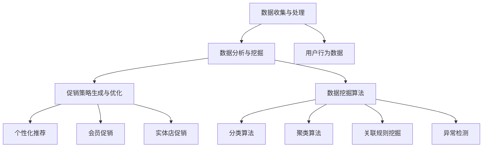
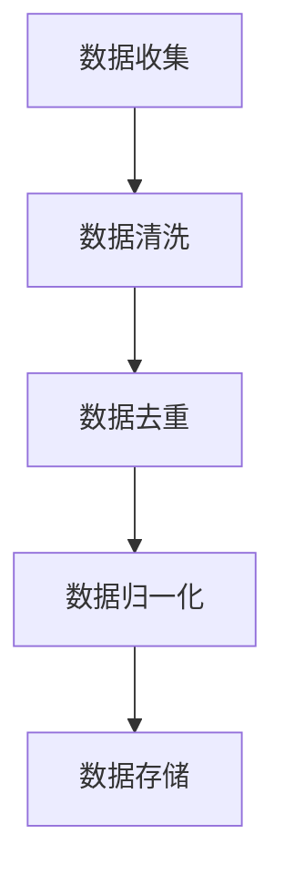
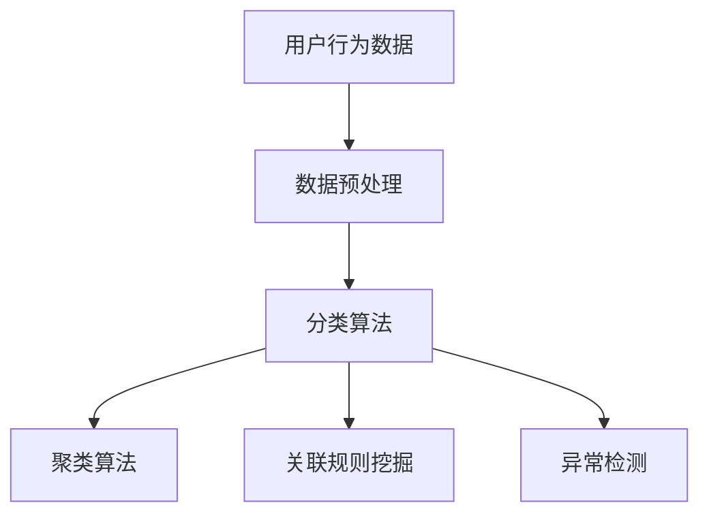
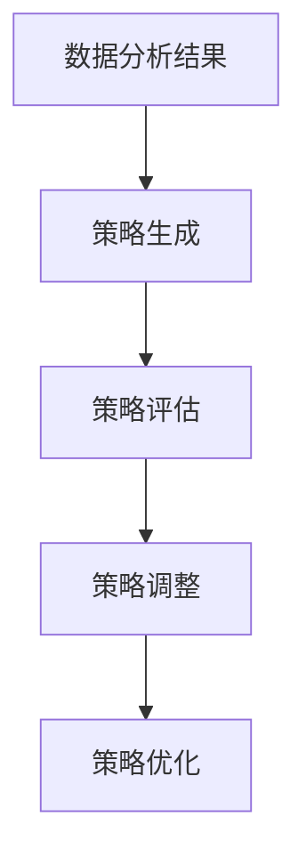
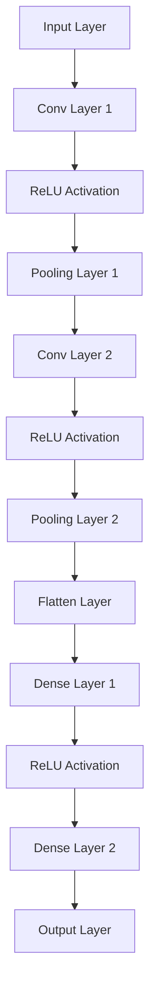
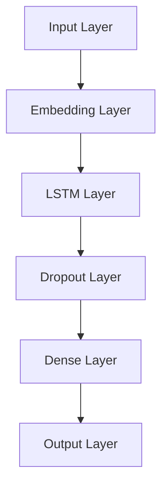
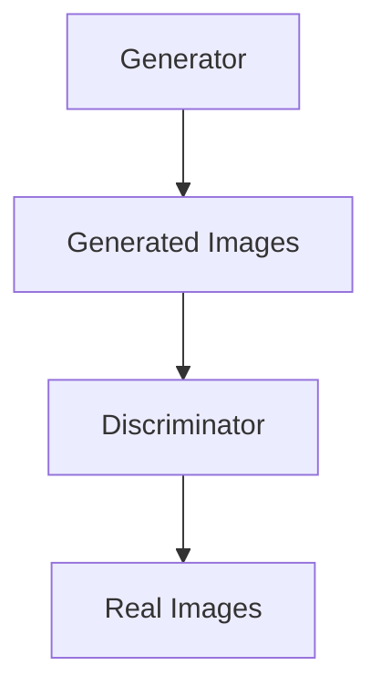
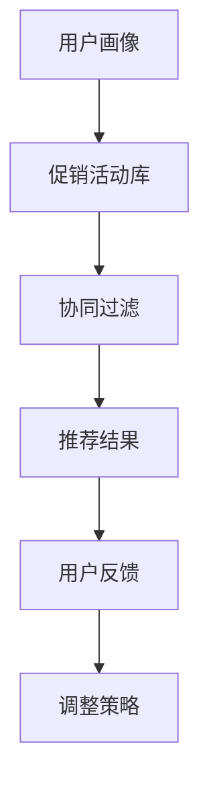
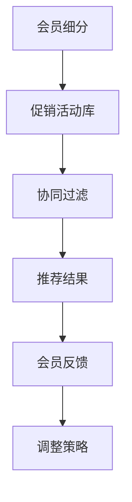
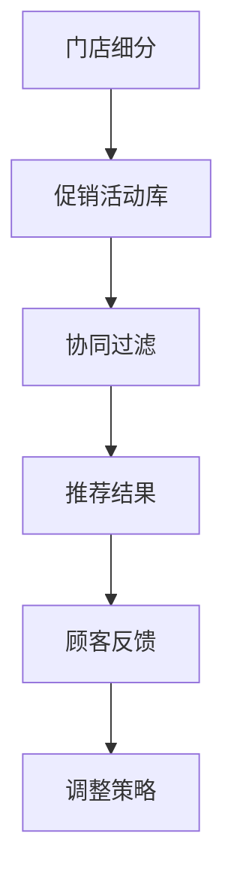

                 

 

### 概念与联系

智能促销策略是指利用大数据、人工智能等技术手段，对企业促销活动进行数据驱动的优化和调整。其核心在于通过分析用户行为数据，为不同用户群体提供个性化的促销方案，从而提升购买转化率和销售额。

智能促销策略的基本架构包括三个主要环节：数据收集与处理、数据分析与挖掘、促销策略生成与优化。具体而言，数据收集与处理环节负责收集用户行为数据，并进行数据清洗、去重和归一化等处理，以确保数据质量。数据分析与挖掘环节则通过数据挖掘算法，对用户行为数据进行深入分析，提取有价值的信息。最后，促销策略生成与优化环节根据分析结果，生成个性化的促销策略，并通过不断优化，提高策略的有效性。

智能促销策略与传统促销策略相比，具有显著的优势。传统促销策略往往依赖于历史经验和直觉，缺乏科学的数据支持，而智能促销策略则通过数据驱动的分析，能够更加精准地识别用户需求，提高促销活动的针对性。此外，智能促销策略还能够实现实时调整和优化，快速响应市场变化，提高企业的竞争力。

智能促销策略的应用领域非常广泛，包括电子商务、零售业、线下实体店等多个领域。在电子商务领域，智能促销策略可以通过个性化推荐，提高用户购买转化率和销售额；在零售业领域，可以通过会员促销策略，提高客户忠诚度；在实体店领域，则可以通过数据驱动的促销活动，吸引更多顾客进店消费。

为了更好地理解智能促销策略的基本架构和应用，我们可以通过以下 Mermaid 流程图来展示其核心概念与联系：



通过这个流程图，我们可以清晰地看到智能促销策略的核心环节及其相互关系。数据收集与处理环节为后续的数据分析与挖掘提供了基础数据，而数据分析与挖掘环节则通过各种数据挖掘算法，提取出有用的信息，最终用于生成个性化的促销策略。

在接下来的章节中，我们将详细探讨智能促销策略的核心技术，包括数据分析基础、机器学习算法、深度学习算法等，并通过实际案例展示这些技术的具体应用。

## 第一部分：智能促销策略概述

### 1.1 智能促销策略的定义与重要性

#### 1.1.1 传统促销策略的局限性

传统促销策略主要依赖于广告、优惠券、打折等手段，通常由企业市场部门根据经验和直觉制定。虽然这些策略在一定程度上能够吸引顾客，提高销售业绩，但它们存在以下几个局限性：

1. **缺乏个性化**：传统促销策略往往是一刀切的方式，不考虑不同顾客的需求和偏好。这种做法导致许多顾客感到不感兴趣，从而降低了促销效果。
2. **效果难以评估**：传统促销策略的效果往往难以量化，企业难以了解哪些策略对顾客有吸引力，哪些策略效果不佳，导致资源的浪费。
3. **响应速度慢**：传统促销策略的制定和实施需要较长时间，无法快速响应市场变化，从而错失商机。
4. **无法提供实时反馈**：传统促销策略缺乏实时反馈机制，无法根据顾客的即时反应进行调整。

#### 1.1.2 智能促销策略的核心优势

智能促销策略通过大数据和人工智能技术，克服了传统促销策略的局限性，具有以下核心优势：

1. **个性化推荐**：智能促销策略能够根据用户的购买历史、浏览行为、偏好等信息，为每位顾客提供个性化的促销方案，提高顾客的参与度和购买意愿。
2. **数据驱动**：智能促销策略依赖于数据分析和挖掘，能够量化促销效果，帮助企业了解哪些策略最有效，哪些策略需要改进。
3. **快速响应**：智能促销策略能够实时分析市场数据和用户行为，快速制定和调整促销策略，提高企业的市场竞争力。
4. **自动化实施**：智能促销策略的自动化实施降低了人工成本，提高了促销活动的执行效率。

#### 1.1.3 智能促销策略的应用领域

智能促销策略在多个领域得到了广泛应用，以下是一些主要的应用领域：

1. **电子商务**：电商平台利用智能促销策略，为顾客提供个性化的商品推荐和促销活动，提高购买转化率和销售额。
2. **零售业**：零售企业通过智能促销策略，优化会员管理，提高客户忠诚度，同时提高促销活动的效果。
3. **线下实体店**：实体店利用智能促销策略，通过数据分析优化库存管理和促销活动，吸引更多顾客进店消费。
4. **金融行业**：金融机构通过智能促销策略，针对不同客户群体，提供个性化的金融产品和服务，提高客户满意度和忠诚度。

#### 1.1.4 智能促销策略的基本流程

智能促销策略的基本流程包括以下几个步骤：

1. **数据收集**：收集用户行为数据，包括购买记录、浏览行为、搜索历史等。
2. **数据预处理**：清洗和整理数据，去除噪声和异常值，为后续分析做准备。
3. **数据分析**：利用数据挖掘算法，对用户行为数据进行分析，提取有价值的信息。
4. **策略生成**：根据数据分析结果，生成个性化的促销策略。
5. **策略实施**：将促销策略应用于实际业务中，并根据用户反馈进行调整和优化。

### 1.2 智能促销策略的基本架构

智能促销策略的基本架构主要包括三个核心环节：数据收集与处理、数据分析与挖掘、促销策略生成与优化。以下是这三个环节的具体内容：

#### 1.2.1 数据收集与处理

数据收集与处理是智能促销策略的基础。企业需要从多个渠道收集用户行为数据，包括线上电商平台、线下门店、社交媒体等。数据收集后，需要进行数据清洗、去重、归一化等处理，以确保数据质量。



#### 1.2.2 数据分析与挖掘

数据分析与挖掘是智能促销策略的核心环节。通过数据挖掘算法，对用户行为数据进行分析，提取有价值的信息，如用户偏好、购买模式等。这些信息为生成个性化的促销策略提供了基础。



#### 1.2.3 促销策略生成与优化

促销策略生成与优化是根据数据分析结果，生成个性化的促销策略，并对其进行不断优化。促销策略的生成和优化过程通常包括以下几个步骤：

1. **策略生成**：根据用户行为数据和市场需求，设计个性化的促销方案。
2. **策略评估**：通过实验或数据分析，评估促销策略的效果。
3. **策略调整**：根据评估结果，调整促销策略，提高其有效性。



通过以上基本架构，企业可以构建一个完整的智能促销策略体系，从而提高促销活动的效果和效益。

在接下来的章节中，我们将深入探讨智能促销策略的核心技术，包括数据分析基础、机器学习算法、深度学习算法等，并分析这些技术在智能促销策略中的应用。

## 第一部分：智能促销策略概述

### 1.1 智能促销策略的定义与重要性

#### 1.1.1 传统促销策略的局限性

传统促销策略主要依赖于广告、优惠券、打折等手段，通常由企业市场部门根据经验和直觉制定。虽然这些策略在一定程度上能够吸引顾客，提高销售业绩，但它们存在以下几个局限性：

1. **缺乏个性化**：传统促销策略往往是一刀切的方式，不考虑不同顾客的需求和偏好。这种做法导致许多顾客感到不感兴趣，从而降低了促销效果。
2. **效果难以评估**：传统促销策略的效果往往难以量化，企业难以了解哪些策略对顾客有吸引力，哪些策略效果不佳，导致资源的浪费。
3. **响应速度慢**：传统促销策略的制定和实施需要较长时间，无法快速响应市场变化，从而错失商机。
4. **无法提供实时反馈**：传统促销策略缺乏实时反馈机制，无法根据顾客的即时反应进行调整。

#### 1.1.2 智能促销策略的核心优势

智能促销策略通过大数据和人工智能技术，克服了传统促销策略的局限性，具有以下核心优势：

1. **个性化推荐**：智能促销策略能够根据用户的购买历史、浏览行为、偏好等信息，为每位顾客提供个性化的促销方案，提高顾客的参与度和购买意愿。
2. **数据驱动**：智能促销策略依赖于数据分析和挖掘，能够量化促销效果，帮助企业了解哪些策略最有效，哪些策略需要改进。
3. **快速响应**：智能促销策略能够实时分析市场数据和用户行为，快速制定和调整促销策略，提高企业的市场竞争力。
4. **自动化实施**：智能促销策略的自动化实施降低了人工成本，提高了促销活动的执行效率。

#### 1.1.3 智能促销策略的应用领域

智能促销策略在多个领域得到了广泛应用，以下是一些主要的应用领域：

1. **电子商务**：电商平台利用智能促销策略，为顾客提供个性化的商品推荐和促销活动，提高购买转化率和销售额。
2. **零售业**：零售企业通过智能促销策略，优化会员管理，提高客户忠诚度，同时提高促销活动的效果。
3. **线下实体店**：实体店利用智能促销策略，通过数据分析优化库存管理和促销活动，吸引更多顾客进店消费。
4. **金融行业**：金融机构通过智能促销策略，针对不同客户群体，提供个性化的金融产品和服务，提高客户满意度和忠诚度。

#### 1.1.4 智能促销策略的基本流程

智能促销策略的基本流程包括以下几个步骤：

1. **数据收集**：收集用户行为数据，包括购买记录、浏览行为、搜索历史等。
2. **数据预处理**：清洗和整理数据，去除噪声和异常值，为后续分析做准备。
3. **数据分析**：利用数据挖掘算法，对用户行为数据进行分析，提取有价值的信息。
4. **策略生成**：根据数据分析结果，生成个性化的促销策略。
5. **策略实施**：将促销策略应用于实际业务中，并根据用户反馈进行调整和优化。

### 1.2 智能促销策略的基本架构

智能促销策略的基本架构主要包括三个核心环节：数据收集与处理、数据分析与挖掘、促销策略生成与优化。以下是这三个环节的具体内容：

#### 1.2.1 数据收集与处理

数据收集与处理是智能促销策略的基础。企业需要从多个渠道收集用户行为数据，包括线上电商平台、线下门店、社交媒体等。数据收集后，需要进行数据清洗、去重、归一化等处理，以确保数据质量。


#### 1.2.2 数据分析与挖掘

数据分析与挖掘是智能促销策略的核心环节。通过数据挖掘算法，对用户行为数据进行分析，提取有价值的信息，如用户偏好、购买模式等。这些信息为生成个性化的促销策略提供了基础。


#### 1.2.3 促销策略生成与优化

促销策略生成与优化是根据数据分析结果，生成个性化的促销策略，并对其进行不断优化。促销策略的生成和优化过程通常包括以下几个步骤：

1. **策略生成**：根据用户行为数据和市场需求，设计个性化的促销方案。
2. **策略评估**：通过实验或数据分析，评估促销策略的效果。
3. **策略调整**：根据评估结果，调整促销策略，提高其有效性。


通过以上基本架构，企业可以构建一个完整的智能促销策略体系，从而提高促销活动的效果和效益。

在接下来的章节中，我们将深入探讨智能促销策略的核心技术，包括数据分析基础、机器学习算法、深度学习算法等，并分析这些技术在智能促销策略中的应用。

## 第一部分：智能促销策略概述

### 1.1 智能促销策略的定义与重要性

#### 1.1.1 传统促销策略的局限性

传统促销策略主要依赖于广告、优惠券、打折等手段，通常由企业市场部门根据经验和直觉制定。虽然这些策略在一定程度上能够吸引顾客，提高销售业绩，但它们存在以下几个局限性：

1. **缺乏个性化**：传统促销策略往往是一刀切的方式，不考虑不同顾客的需求和偏好。这种做法导致许多顾客感到不感兴趣，从而降低了促销效果。
2. **效果难以评估**：传统促销策略的效果往往难以量化，企业难以了解哪些策略对顾客有吸引力，哪些策略效果不佳，导致资源的浪费。
3. **响应速度慢**：传统促销策略的制定和实施需要较长时间，无法快速响应市场变化，从而错失商机。
4. **无法提供实时反馈**：传统促销策略缺乏实时反馈机制，无法根据顾客的即时反应进行调整。

#### 1.1.2 智能促销策略的核心优势

智能促销策略通过大数据和人工智能技术，克服了传统促销策略的局限性，具有以下核心优势：

1. **个性化推荐**：智能促销策略能够根据用户的购买历史、浏览行为、偏好等信息，为每位顾客提供个性化的促销方案，提高顾客的参与度和购买意愿。
2. **数据驱动**：智能促销策略依赖于数据分析和挖掘，能够量化促销效果，帮助企业了解哪些策略最有效，哪些策略需要改进。
3. **快速响应**：智能促销策略能够实时分析市场数据和用户行为，快速制定和调整促销策略，提高企业的市场竞争力。
4. **自动化实施**：智能促销策略的自动化实施降低了人工成本，提高了促销活动的执行效率。

#### 1.1.3 智能促销策略的应用领域

智能促销策略在多个领域得到了广泛应用，以下是一些主要的应用领域：

1. **电子商务**：电商平台利用智能促销策略，为顾客提供个性化的商品推荐和促销活动，提高购买转化率和销售额。
2. **零售业**：零售企业通过智能促销策略，优化会员管理，提高客户忠诚度，同时提高促销活动的效果。
3. **线下实体店**：实体店利用智能促销策略，通过数据分析优化库存管理和促销活动，吸引更多顾客进店消费。
4. **金融行业**：金融机构通过智能促销策略，针对不同客户群体，提供个性化的金融产品和服务，提高客户满意度和忠诚度。

#### 1.1.4 智能促销策略的基本流程

智能促销策略的基本流程包括以下几个步骤：

1. **数据收集**：收集用户行为数据，包括购买记录、浏览行为、搜索历史等。
2. **数据预处理**：清洗和整理数据，去除噪声和异常值，为后续分析做准备。
3. **数据分析**：利用数据挖掘算法，对用户行为数据进行分析，提取有价值的信息。
4. **策略生成**：根据数据分析结果，生成个性化的促销策略。
5. **策略实施**：将促销策略应用于实际业务中，并根据用户反馈进行调整和优化。

### 1.2 智能促销策略的基本架构

智能促销策略的基本架构主要包括三个核心环节：数据收集与处理、数据分析与挖掘、促销策略生成与优化。以下是这三个环节的具体内容：

#### 1.2.1 数据收集与处理

数据收集与处理是智能促销策略的基础。企业需要从多个渠道收集用户行为数据，包括线上电商平台、线下门店、社交媒体等。数据收集后，需要进行数据清洗、去重、归一化等处理，以确保数据质量。


#### 1.2.2 数据分析与挖掘

数据分析与挖掘是智能促销策略的核心环节。通过数据挖掘算法，对用户行为数据进行分析，提取有价值的信息，如用户偏好、购买模式等。这些信息为生成个性化的促销策略提供了基础。


#### 1.2.3 促销策略生成与优化

促销策略生成与优化是根据数据分析结果，生成个性化的促销策略，并对其进行不断优化。促销策略的生成和优化过程通常包括以下几个步骤：

1. **策略生成**：根据用户行为数据和市场需求，设计个性化的促销方案。
2. **策略评估**：通过实验或数据分析，评估促销策略的效果。
3. **策略调整**：根据评估结果，调整促销策略，提高其有效性。


通过以上基本架构，企业可以构建一个完整的智能促销策略体系，从而提高促销活动的效果和效益。

在接下来的章节中，我们将深入探讨智能促销策略的核心技术，包括数据分析基础、机器学习算法、深度学习算法等，并分析这些技术在智能促销策略中的应用。

## 第二部分：智能促销策略的核心技术

### 2.1 数据分析基础

数据分析是智能促销策略的核心环节，通过对大量用户行为数据进行处理和分析，提取出有价值的信息，为企业提供决策支持。以下是数据分析的一些基础概念和方法：

#### 2.1.1 数据类型与数据预处理

数据分析首先需要了解数据的类型，常见的数据类型包括：

1. **结构化数据**：如关系型数据库中的数据，具有固定的格式和结构，便于存储和管理。
2. **非结构化数据**：如文本、图像、音频等，没有固定的格式，需要通过特殊的方法进行解析和处理。
3. **半结构化数据**：如日志文件、XML等，部分信息是结构化的，但不是完全格式化。

数据预处理是数据分析的第一步，主要包括以下步骤：

1. **数据清洗**：去除重复数据、异常值和噪声数据，保证数据的准确性。
2. **数据转换**：将数据转换为适合分析的形式，如将文本数据转换为数值形式。
3. **数据归一化**：对不同特征进行归一化处理，使它们具有相似的尺度，便于后续计算。

#### 2.1.2 常见数据分析方法

数据分析方法种类繁多，以下介绍几种常见的方法：

1. **描述性分析**：对数据进行统计分析，如计算均值、中位数、标准差等，用于了解数据的整体分布情况。
2. **分类分析**：将数据分为不同的类别，如逻辑回归、决策树等，用于预测和分类任务。
3. **聚类分析**：将相似的数据点分为同一个簇，如K-means、层次聚类等，用于数据降维和模式识别。
4. **关联规则挖掘**：发现数据之间的关联关系，如Apriori算法、FP-growth算法等，用于推荐系统和市场细分。
5. **异常检测**：识别数据中的异常值，如基于统计的方法、基于邻近度的方法等，用于数据安全和风险控制。

#### 2.1.3 数据可视化工具与应用

数据可视化是将数据以图形化方式展示，使数据更加直观、易于理解。以下是一些常用的数据可视化工具：

1. **Matplotlib**：Python中的一个绘图库，可以生成各种类型的图表，如折线图、散点图、条形图等。
2. **Seaborn**：基于Matplotlib的一个数据可视化库，提供了更多精美的图表样式和高级功能。
3. **Tableau**：一个强大的商业智能和数据可视化工具，支持多种数据源和多种图表类型。
4. **Power BI**：微软推出的商业智能工具，提供数据连接、数据建模和数据可视化功能。

数据可视化在智能促销策略中具有重要意义，可以帮助企业直观地了解用户行为和促销效果，从而做出更科学的决策。以下是一个简单的数据可视化示例，使用Python的Matplotlib库绘制用户购买额的直方图：

python
import matplotlib.pyplot as plt
import pandas as pd

# 加载数据
data = pd.read_csv('user_purchase.csv')

# 绘制直方图
plt.hist(data['purchase_amount'], bins=30, edgecolor='black')
plt.xlabel('Purchase Amount')
plt.ylabel('Frequency')
plt.title('User Purchase Amount Distribution')
plt.show()
```

通过这个直方图，我们可以直观地看到用户购买额的分布情况，帮助企业制定更有针对性的促销策略。

### 2.2 机器学习算法在促销策略中的应用

机器学习算法是智能促销策略中的重要工具，通过训练模型，可以自动发现数据中的规律和模式，帮助企业制定个性化的促销策略。以下介绍几种常用的机器学习算法：

#### 2.2.1 监督学习算法

监督学习算法通过已有标签数据训练模型，然后对新数据进行预测。以下是一些常见的监督学习算法：

1. **线性回归**：通过建立线性模型，预测连续值输出。
   ```python
   from sklearn.linear_model import LinearRegression

   model = LinearRegression()
   model.fit(X_train, y_train)
   predictions = model.predict(X_test)
   ```
2. **逻辑回归**：用于二分类问题，预测概率并转化为分类结果。
   ```python
   from sklearn.linear_model import LogisticRegression

   model = LogisticRegression()
   model.fit(X_train, y_train)
   predictions = model.predict(X_test)
   ```
3. **决策树**：通过一系列规则进行分类或回归。
   ```python
   from sklearn.tree import DecisionTreeClassifier

   model = DecisionTreeClassifier()
   model.fit(X_train, y_train)
   predictions = model.predict(X_test)
   ```
4. **支持向量机（SVM）**：通过寻找最优超平面进行分类。
   ```python
   from sklearn.svm import SVC

   model = SVC()
   model.fit(X_train, y_train)
   predictions = model.predict(X_test)
   ```

#### 2.2.2 无监督学习算法

无监督学习算法没有预定义的标签数据，主要用于降维、聚类等任务。以下是一些常见的无监督学习算法：

1. **K-means聚类**：将数据点分为K个簇，每个簇的中心代表该簇的特征。
   ```python
   from sklearn.cluster import KMeans

   model = KMeans(n_clusters=3)
   model.fit(X)
   clusters = model.predict(X)
   ```
2. **层次聚类**：通过层次结构将数据点逐步合并或分裂，形成聚类树。
   ```python
   from sklearn.cluster import AgglomerativeClustering

   model = AgglomerativeClustering(n_clusters=3)
   model.fit(X)
   clusters = model.predict(X)
   ```
3. **主成分分析（PCA）**：通过降维，将数据投影到新的特征空间，保留主要信息。
   ```python
   from sklearn.decomposition import PCA

   model = PCA(n_components=2)
   X_pca = model.fit_transform(X)
   ```

#### 2.2.3 强化学习算法

强化学习算法通过不断与环境互动，学习最优策略。以下是一些常见的强化学习算法：

1. **Q学习**：通过学习状态-动作价值函数，选择最优动作。
   ```python
   import numpy as np
   from collections import defaultdict

   Q = defaultdict(lambda: np.zeros(V))
   alpha = 0.1  # 学习率
   gamma = 0.9  # 折扣因子

   for episode in range(total_episodes):
       state = env.reset()
       done = False
       while not done:
           action = np.argmax(Q[state])
           next_state, reward, done, _ = env.step(action)
           Q[state][action] = Q[state][action] + alpha * (reward + gamma * np.max(Q[next_state]) - Q[state][action])
           state = next_state
   ```

2. **策略梯度**：通过直接优化策略，选择最优动作。
   ```python
   import tensorflow as tf
   from tensorflow.keras.models import Sequential
   from tensorflow.keras.layers import Dense
   from tensorflow.keras.optimizers import Adam

   model = Sequential()
   model.add(Dense(output_size, input_shape=input_shape, activation='softmax'))
   model.compile(optimizer=Adam(learning_rate=0.001), loss='categorical_crossentropy')

   policy = model.predict(state)
   action = np.argmax(policy)
   reward = env.step(action)
   loss = policy[0, action] - reward
   model.fit(state, policy, loss=loss)
   ```

通过以上机器学习算法，企业可以实现对用户行为数据的深入分析和预测，从而制定更有效的促销策略。接下来，我们将介绍深度学习在智能促销策略中的应用。

## 第二部分：智能促销策略的核心技术

### 2.1 数据分析基础

数据分析是智能促销策略的核心环节，通过对大量用户行为数据进行处理和分析，提取出有价值的信息，为企业提供决策支持。以下是数据分析的一些基础概念和方法：

#### 2.1.1 数据类型与数据预处理

数据分析首先需要了解数据的类型，常见的数据类型包括：

1. **结构化数据**：如关系型数据库中的数据，具有固定的格式和结构，便于存储和管理。
2. **非结构化数据**：如文本、图像、音频等，没有固定的格式，需要通过特殊的方法进行解析和处理。
3. **半结构化数据**：如日志文件、XML等，部分信息是结构化的，但不是完全格式化。

数据预处理是数据分析的第一步，主要包括以下步骤：

1. **数据清洗**：去除重复数据、异常值和噪声数据，保证数据的准确性。
2. **数据转换**：将数据转换为适合分析的形式，如将文本数据转换为数值形式。
3. **数据归一化**：对不同特征进行归一化处理，使它们具有相似的尺度，便于后续计算。

#### 2.1.2 常见数据分析方法

数据分析方法种类繁多，以下介绍几种常见的方法：

1. **描述性分析**：对数据进行统计分析，如计算均值、中位数、标准差等，用于了解数据的整体分布情况。
2. **分类分析**：将数据分为不同的类别，如逻辑回归、决策树等，用于预测和分类任务。
3. **聚类分析**：将相似的数据点分为同一个簇，如K-means、层次聚类等，用于数据降维和模式识别。
4. **关联规则挖掘**：发现数据之间的关联关系，如Apriori算法、FP-growth算法等，用于推荐系统和市场细分。
5. **异常检测**：识别数据中的异常值，如基于统计的方法、基于邻近度的方法等，用于数据安全和风险控制。

#### 2.1.3 数据可视化工具与应用

数据可视化是将数据以图形化方式展示，使数据更加直观、易于理解。以下是一些常用的数据可视化工具：

1. **Matplotlib**：Python中的一个绘图库，可以生成各种类型的图表，如折线图、散点图、条形图等。
2. **Seaborn**：基于Matplotlib的一个数据可视化库，提供了更多精美的图表样式和高级功能。
3. **Tableau**：一个强大的商业智能和数据可视化工具，支持多种数据源和多种图表类型。
4. **Power BI**：微软推出的商业智能工具，提供数据连接、数据建模和数据可视化功能。

数据可视化在智能促销策略中具有重要意义，可以帮助企业直观地了解用户行为和促销效果，从而做出更科学的决策。以下是一个简单的数据可视化示例，使用Python的Matplotlib库绘制用户购买额的直方图：

```python
import matplotlib.pyplot as plt
import pandas as pd

# 加载数据
data = pd.read_csv('user_purchase.csv')

# 绘制直方图
plt.hist(data['purchase_amount'], bins=30, edgecolor='black')
plt.xlabel('Purchase Amount')
plt.ylabel('Frequency')
plt.title('User Purchase Amount Distribution')
plt.show()
```

通过这个直方图，我们可以直观地看到用户购买额的分布情况，帮助企业制定更有针对性的促销策略。

### 2.2 机器学习算法在促销策略中的应用

机器学习算法是智能促销策略中的重要工具，通过训练模型，可以自动发现数据中的规律和模式，帮助企业制定个性化的促销策略。以下介绍几种常用的机器学习算法：

#### 2.2.1 监督学习算法

监督学习算法通过已有标签数据训练模型，然后对新数据进行预测。以下是一些常见的监督学习算法：

1. **线性回归**：通过建立线性模型，预测连续值输出。
   ```python
   from sklearn.linear_model import LinearRegression

   model = LinearRegression()
   model.fit(X_train, y_train)
   predictions = model.predict(X_test)
   ```

2. **逻辑回归**：用于二分类问题，预测概率并转化为分类结果。
   ```python
   from sklearn.linear_model import LogisticRegression

   model = LogisticRegression()
   model.fit(X_train, y_train)
   predictions = model.predict(X_test)
   ```

3. **决策树**：通过一系列规则进行分类或回归。
   ```python
   from sklearn.tree import DecisionTreeClassifier

   model = DecisionTreeClassifier()
   model.fit(X_train, y_train)
   predictions = model.predict(X_test)
   ```

4. **支持向量机（SVM）**：通过寻找最优超平面进行分类。
   ```python
   from sklearn.svm import SVC

   model = SVC()
   model.fit(X_train, y_train)
   predictions = model.predict(X_test)
   ```

#### 2.2.2 无监督学习算法

无监督学习算法没有预定义的标签数据，主要用于降维、聚类等任务。以下是一些常见的无监督学习算法：

1. **K-means聚类**：将数据点分为K个簇，每个簇的中心代表该簇的特征。
   ```python
   from sklearn.cluster import KMeans

   model = KMeans(n_clusters=3)
   model.fit(X)
   clusters = model.predict(X)
   ```

2. **层次聚类**：通过层次结构将数据点逐步合并或分裂，形成聚类树。
   ```python
   from sklearn.cluster import AgglomerativeClustering

   model = AgglomerativeClustering(n_clusters=3)
   model.fit(X)
   clusters = model.predict(X)
   ```

3. **主成分分析（PCA）**：通过降维，将数据投影到新的特征空间，保留主要信息。
   ```python
   from sklearn.decomposition import PCA

   model = PCA(n_components=2)
   X_pca = model.fit_transform(X)
   ```

#### 2.2.3 强化学习算法

强化学习算法通过不断与环境互动，学习最优策略。以下是一些常见的强化学习算法：

1. **Q学习**：通过学习状态-动作价值函数，选择最优动作。
   ```python
   import numpy as np
   from collections import defaultdict

   Q = defaultdict(lambda: np.zeros(V))
   alpha = 0.1  # 学习率
   gamma = 0.9  # 折扣因子

   for episode in range(total_episodes):
       state = env.reset()
       done = False
       while not done:
           action = np.argmax(Q[state])
           next_state, reward, done, _ = env.step(action)
           Q[state][action] = Q[state][action] + alpha * (reward + gamma * np.max(Q[next_state]) - Q[state][action])
           state = next_state
   ```

2. **策略梯度**：通过直接优化策略，选择最优动作。
   ```python
   import tensorflow as tf
   from tensorflow.keras.models import Sequential
   from tensorflow.keras.layers import Dense
   from tensorflow.keras.optimizers import Adam

   model = Sequential()
   model.add(Dense(output_size, input_shape=input_shape, activation='softmax'))
   model.compile(optimizer=Adam(learning_rate=0.001), loss='categorical_crossentropy')

   policy = model.predict(state)
   action = np.argmax(policy)
   reward = env.step(action)
   loss = policy[0, action] - reward
   model.fit(state, policy, loss=loss)
   ```

通过以上机器学习算法，企业可以实现对用户行为数据的深入分析和预测，从而制定更有效的促销策略。接下来，我们将介绍深度学习在智能促销策略中的应用。

## 第二部分：智能促销策略的核心技术

### 2.1 数据分析基础

数据分析是智能促销策略的核心环节，通过对大量用户行为数据进行处理和分析，提取出有价值的信息，为企业提供决策支持。以下是数据分析的一些基础概念和方法：

#### 2.1.1 数据类型与数据预处理

数据分析首先需要了解数据的类型，常见的数据类型包括：

1. **结构化数据**：如关系型数据库中的数据，具有固定的格式和结构，便于存储和管理。
2. **非结构化数据**：如文本、图像、音频等，没有固定的格式，需要通过特殊的方法进行解析和处理。
3. **半结构化数据**：如日志文件、XML等，部分信息是结构化的，但不是完全格式化。

数据预处理是数据分析的第一步，主要包括以下步骤：

1. **数据清洗**：去除重复数据、异常值和噪声数据，保证数据的准确性。
2. **数据转换**：将数据转换为适合分析的形式，如将文本数据转换为数值形式。
3. **数据归一化**：对不同特征进行归一化处理，使它们具有相似的尺度，便于后续计算。

#### 2.1.2 常见数据分析方法

数据分析方法种类繁多，以下介绍几种常见的方法：

1. **描述性分析**：对数据进行统计分析，如计算均值、中位数、标准差等，用于了解数据的整体分布情况。
2. **分类分析**：将数据分为不同的类别，如逻辑回归、决策树等，用于预测和分类任务。
3. **聚类分析**：将相似的数据点分为同一个簇，如K-means、层次聚类等，用于数据降维和模式识别。
4. **关联规则挖掘**：发现数据之间的关联关系，如Apriori算法、FP-growth算法等，用于推荐系统和市场细分。
5. **异常检测**：识别数据中的异常值，如基于统计的方法、基于邻近度的方法等，用于数据安全和风险控制。

#### 2.1.3 数据可视化工具与应用

数据可视化是将数据以图形化方式展示，使数据更加直观、易于理解。以下是一些常用的数据可视化工具：

1. **Matplotlib**：Python中的一个绘图库，可以生成各种类型的图表，如折线图、散点图、条形图等。
2. **Seaborn**：基于Matplotlib的一个数据可视化库，提供了更多精美的图表样式和高级功能。
3. **Tableau**：一个强大的商业智能和数据可视化工具，支持多种数据源和多种图表类型。
4. **Power BI**：微软推出的商业智能工具，提供数据连接、数据建模和数据可视化功能。

数据可视化在智能促销策略中具有重要意义，可以帮助企业直观地了解用户行为和促销效果，从而做出更科学的决策。以下是一个简单的数据可视化示例，使用Python的Matplotlib库绘制用户购买额的直方图：

```python
import matplotlib.pyplot as plt
import pandas as pd

# 加载数据
data = pd.read_csv('user_purchase.csv')

# 绘制直方图
plt.hist(data['purchase_amount'], bins=30, edgecolor='black')
plt.xlabel('Purchase Amount')
plt.ylabel('Frequency')
plt.title('User Purchase Amount Distribution')
plt.show()
```

通过这个直方图，我们可以直观地看到用户购买额的分布情况，帮助企业制定更有针对性的促销策略。

### 2.2 机器学习算法在促销策略中的应用

机器学习算法是智能促销策略中的重要工具，通过训练模型，可以自动发现数据中的规律和模式，帮助企业制定个性化的促销策略。以下介绍几种常用的机器学习算法：

#### 2.2.1 监督学习算法

监督学习算法通过已有标签数据训练模型，然后对新数据进行预测。以下是一些常见的监督学习算法：

1. **线性回归**：通过建立线性模型，预测连续值输出。
   ```python
   from sklearn.linear_model import LinearRegression

   model = LinearRegression()
   model.fit(X_train, y_train)
   predictions = model.predict(X_test)
   ```

2. **逻辑回归**：用于二分类问题，预测概率并转化为分类结果。
   ```python
   from sklearn.linear_model import LogisticRegression

   model = LogisticRegression()
   model.fit(X_train, y_train)
   predictions = model.predict(X_test)
   ```

3. **决策树**：通过一系列规则进行分类或回归。
   ```python
   from sklearn.tree import DecisionTreeClassifier

   model = DecisionTreeClassifier()
   model.fit(X_train, y_train)
   predictions = model.predict(X_test)
   ```

4. **支持向量机（SVM）**：通过寻找最优超平面进行分类。
   ```python
   from sklearn.svm import SVC

   model = SVC()
   model.fit(X_train, y_train)
   predictions = model.predict(X_test)
   ```

#### 2.2.2 无监督学习算法

无监督学习算法没有预定义的标签数据，主要用于降维、聚类等任务。以下是一些常见的无监督学习算法：

1. **K-means聚类**：将数据点分为K个簇，每个簇的中心代表该簇的特征。
   ```python
   from sklearn.cluster import KMeans

   model = KMeans(n_clusters=3)
   model.fit(X)
   clusters = model.predict(X)
   ```

2. **层次聚类**：通过层次结构将数据点逐步合并或分裂，形成聚类树。
   ```python
   from sklearn.cluster import AgglomerativeClustering

   model = AgglomerativeClustering(n_clusters=3)
   model.fit(X)
   clusters = model.predict(X)
   ```

3. **主成分分析（PCA）**：通过降维，将数据投影到新的特征空间，保留主要信息。
   ```python
   from sklearn.decomposition import PCA

   model = PCA(n_components=2)
   X_pca = model.fit_transform(X)
   ```

#### 2.2.3 强化学习算法

强化学习算法通过不断与环境互动，学习最优策略。以下是一些常见的强化学习算法：

1. **Q学习**：通过学习状态-动作价值函数，选择最优动作。
   ```python
   import numpy as np
   from collections import defaultdict

   Q = defaultdict(lambda: np.zeros(V))
   alpha = 0.1  # 学习率
   gamma = 0.9  # 折扣因子

   for episode in range(total_episodes):
       state = env.reset()
       done = False
       while not done:
           action = np.argmax(Q[state])
           next_state, reward, done, _ = env.step(action)
           Q[state][action] = Q[state][action] + alpha * (reward + gamma * np.max(Q[next_state]) - Q[state][action])
           state = next_state
   ```

2. **策略梯度**：通过直接优化策略，选择最优动作。
   ```python
   import tensorflow as tf
   from tensorflow.keras.models import Sequential
   from tensorflow.keras.layers import Dense
   from tensorflow.keras.optimizers import Adam

   model = Sequential()
   model.add(Dense(output_size, input_shape=input_shape, activation='softmax'))
   model.compile(optimizer=Adam(learning_rate=0.001), loss='categorical_crossentropy')

   policy = model.predict(state)
   action = np.argmax(policy)
   reward = env.step(action)
   loss = policy[0, action] - reward
   model.fit(state, policy, loss=loss)
   ```

通过以上机器学习算法，企业可以实现对用户行为数据的深入分析和预测，从而制定更有效的促销策略。接下来，我们将介绍深度学习在智能促销策略中的应用。

## 第二部分：智能促销策略的核心技术

### 2.1 数据分析基础

数据分析是智能促销策略的核心环节，通过对大量用户行为数据进行处理和分析，提取出有价值的信息，为企业提供决策支持。以下是数据分析的一些基础概念和方法：

#### 2.1.1 数据类型与数据预处理

数据分析首先需要了解数据的类型，常见的数据类型包括：

1. **结构化数据**：如关系型数据库中的数据，具有固定的格式和结构，便于存储和管理。
2. **非结构化数据**：如文本、图像、音频等，没有固定的格式，需要通过特殊的方法进行解析和处理。
3. **半结构化数据**：如日志文件、XML等，部分信息是结构化的，但不是完全格式化。

数据预处理是数据分析的第一步，主要包括以下步骤：

1. **数据清洗**：去除重复数据、异常值和噪声数据，保证数据的准确性。
2. **数据转换**：将数据转换为适合分析的形式，如将文本数据转换为数值形式。
3. **数据归一化**：对不同特征进行归一化处理，使它们具有相似的尺度，便于后续计算。

#### 2.1.2 常见数据分析方法

数据分析方法种类繁多，以下介绍几种常见的方法：

1. **描述性分析**：对数据进行统计分析，如计算均值、中位数、标准差等，用于了解数据的整体分布情况。
2. **分类分析**：将数据分为不同的类别，如逻辑回归、决策树等，用于预测和分类任务。
3. **聚类分析**：将相似的数据点分为同一个簇，如K-means、层次聚类等，用于数据降维和模式识别。
4. **关联规则挖掘**：发现数据之间的关联关系，如Apriori算法、FP-growth算法等，用于推荐系统和市场细分。
5. **异常检测**：识别数据中的异常值，如基于统计的方法、基于邻近度的方法等，用于数据安全和风险控制。

#### 2.1.3 数据可视化工具与应用

数据可视化是将数据以图形化方式展示，使数据更加直观、易于理解。以下是一些常用的数据可视化工具：

1. **Matplotlib**：Python中的一个绘图库，可以生成各种类型的图表，如折线图、散点图、条形图等。
2. **Seaborn**：基于Matplotlib的一个数据可视化库，提供了更多精美的图表样式和高级功能。
3. **Tableau**：一个强大的商业智能和数据可视化工具，支持多种数据源和多种图表类型。
4. **Power BI**：微软推出的商业智能工具，提供数据连接、数据建模和数据可视化功能。

数据可视化在智能促销策略中具有重要意义，可以帮助企业直观地了解用户行为和促销效果，从而做出更科学的决策。以下是一个简单的数据可视化示例，使用Python的Matplotlib库绘制用户购买额的直方图：

```python
import matplotlib.pyplot as plt
import pandas as pd

# 加载数据
data = pd.read_csv('user_purchase.csv')

# 绘制直方图
plt.hist(data['purchase_amount'], bins=30, edgecolor='black')
plt.xlabel('Purchase Amount')
plt.ylabel('Frequency')
plt.title('User Purchase Amount Distribution')
plt.show()
```

通过这个直方图，我们可以直观地看到用户购买额的分布情况，帮助企业制定更有针对性的促销策略。

### 2.2 机器学习算法在促销策略中的应用

机器学习算法是智能促销策略中的重要工具，通过训练模型，可以自动发现数据中的规律和模式，帮助企业制定个性化的促销策略。以下介绍几种常用的机器学习算法：

#### 2.2.1 监督学习算法

监督学习算法通过已有标签数据训练模型，然后对新数据进行预测。以下是一些常见的监督学习算法：

1. **线性回归**：通过建立线性模型，预测连续值输出。
   ```python
   from sklearn.linear_model import LinearRegression

   model = LinearRegression()
   model.fit(X_train, y_train)
   predictions = model.predict(X_test)
   ```

2. **逻辑回归**：用于二分类问题，预测概率并转化为分类结果。
   ```python
   from sklearn.linear_model import LogisticRegression

   model = LogisticRegression()
   model.fit(X_train, y_train)
   predictions = model.predict(X_test)
   ```

3. **决策树**：通过一系列规则进行分类或回归。
   ```python
   from sklearn.tree import DecisionTreeClassifier

   model = DecisionTreeClassifier()
   model.fit(X_train, y_train)
   predictions = model.predict(X_test)
   ```

4. **支持向量机（SVM）**：通过寻找最优超平面进行分类。
   ```python
   from sklearn.svm import SVC

   model = SVC()
   model.fit(X_train, y_train)
   predictions = model.predict(X_test)
   ```

#### 2.2.2 无监督学习算法

无监督学习算法没有预定义的标签数据，主要用于降维、聚类等任务。以下是一些常见的无监督学习算法：

1. **K-means聚类**：将数据点分为K个簇，每个簇的中心代表该簇的特征。
   ```python
   from sklearn.cluster import KMeans

   model = KMeans(n_clusters=3)
   model.fit(X)
   clusters = model.predict(X)
   ```

2. **层次聚类**：通过层次结构将数据点逐步合并或分裂，形成聚类树。
   ```python
   from sklearn.cluster import AgglomerativeClustering

   model = AgglomerativeClustering(n_clusters=3)
   model.fit(X)
   clusters = model.predict(X)
   ```

3. **主成分分析（PCA）**：通过降维，将数据投影到新的特征空间，保留主要信息。
   ```python
   from sklearn.decomposition import PCA

   model = PCA(n_components=2)
   X_pca = model.fit_transform(X)
   ```

#### 2.2.3 强化学习算法

强化学习算法通过不断与环境互动，学习最优策略。以下是一些常见的强化学习算法：

1. **Q学习**：通过学习状态-动作价值函数，选择最优动作。
   ```python
   import numpy as np
   from collections import defaultdict

   Q = defaultdict(lambda: np.zeros(V))
   alpha = 0.1  # 学习率
   gamma = 0.9  # 折扣因子

   for episode in range(total_episodes):
       state = env.reset()
       done = False
       while not done:
           action = np.argmax(Q[state])
           next_state, reward, done, _ = env.step(action)
           Q[state][action] = Q[state][action] + alpha * (reward + gamma * np.max(Q[next_state]) - Q[state][action])
           state = next_state
   ```

2. **策略梯度**：通过直接优化策略，选择最优动作。
   ```python
   import tensorflow as tf
   from tensorflow.keras.models import Sequential
   from tensorflow.keras.layers import Dense
   from tensorflow.keras.optimizers import Adam

   model = Sequential()
   model.add(Dense(output_size, input_shape=input_shape, activation='softmax'))
   model.compile(optimizer=Adam(learning_rate=0.001), loss='categorical_crossentropy')

   policy = model.predict(state)
   action = np.argmax(policy)
   reward = env.step(action)
   loss = policy[0, action] - reward
   model.fit(state, policy, loss=loss)
   ```

通过以上机器学习算法，企业可以实现对用户行为数据的深入分析和预测，从而制定更有效的促销策略。接下来，我们将介绍深度学习在智能促销策略中的应用。

### 2.3 深度学习在智能促销策略中的应用

深度学习作为人工智能领域的一个重要分支，近年来在图像识别、自然语言处理等领域取得了显著的成果。随着数据量和计算能力的提升，深度学习逐渐应用于商业智能领域，特别是在智能促销策略中。深度学习在智能促销策略中的应用主要包括卷积神经网络（CNN）、递归神经网络（RNN）和生成对抗网络（GAN）等。

#### 2.3.1 卷积神经网络（CNN）

卷积神经网络（Convolutional Neural Networks，CNN）是处理图像数据的一种强大工具。其核心思想是通过卷积操作自动提取图像中的特征。在智能促销策略中，CNN可以用于图像分类和图像识别任务，例如，识别用户上传的优惠券照片，或识别商品图像的标签。

以下是一个简化的CNN模型结构，用于商品图像分类：



在智能促销策略中，我们可以将CNN应用于以下场景：

1. **商品推荐**：通过CNN对用户上传的商品图像进行分类，推荐相似的商品。
2. **库存管理**：通过CNN对库存商品的图像进行分类，优化库存策略。
3. **广告投放**：通过CNN识别用户兴趣，优化广告投放策略。

#### 2.3.2 递归神经网络（RNN）

递归神经网络（Recurrent Neural Networks，RNN）是一种处理序列数据的神经网络，特别适合处理时间序列数据。在智能促销策略中，RNN可以用于预测用户的行为，如预测用户的购买时间、购买金额等。

以下是一个简化的RNN模型结构，用于预测用户的购买金额：



在智能促销策略中，我们可以将RNN应用于以下场景：

1. **销售预测**：通过RNN分析历史销售数据，预测未来的销售趋势。
2. **库存规划**：通过RNN预测未来几个月的库存需求，优化库存管理。
3. **促销活动规划**：通过RNN预测促销活动的效果，优化促销策略。

#### 2.3.3 生成对抗网络（GAN）

生成对抗网络（Generative Adversarial Networks，GAN）是由生成器和判别器两个神经网络组成的一个对抗性模型。生成器的目标是生成类似于真实数据的假数据，判别器的目标是区分真实数据和生成数据。GAN在图像生成、文本生成等领域表现出色，也可以应用于智能促销策略中。

以下是一个简化的GAN模型结构：



在智能促销策略中，我们可以将GAN应用于以下场景：

1. **个性化广告**：通过GAN生成个性化的广告图像，提高广告的吸引力。
2. **商品展示**：通过GAN生成虚拟商品展示图，提高用户的购买意愿。
3. **客户细分**：通过GAN生成虚拟客户画像，用于更精准的客户细分和促销策略。

通过以上深度学习技术，企业可以在智能促销策略中实现自动化和个性化的促销活动，提高用户参与度和销售额。在实际应用中，企业需要根据具体业务场景和数据特点，选择合适的深度学习模型，并不断优化和调整模型参数，以实现最佳效果。

### 第三部分：智能促销策略实践案例

#### 3.1 案例一：电商平台个性化促销策略

随着电子商务的快速发展，电商平台面临激烈的竞争，如何提高用户购买转化率和销售额成为企业关注的焦点。某大型电商平台通过实施智能促销策略，成功实现了这一目标。

#### 3.1.1 案例背景与目标

该电商平台拥有庞大的用户基础和丰富的用户行为数据。企业希望通过智能促销策略，实现以下目标：

1. 提高用户购买转化率：通过个性化推荐，提高用户对促销活动的参与度。
2. 提升销售额：通过精准的促销策略，提高用户的购买金额。
3. 优化用户体验：通过智能化的推荐和促销，提升用户的购物体验。

#### 3.1.2 数据收集与处理

电商平台从多个渠道收集用户行为数据，包括用户浏览记录、购买记录、搜索历史、评价等。数据收集后，进行以下预处理步骤：

1. **数据清洗**：去除重复数据和异常值，保证数据质量。
2. **特征工程**：提取用户行为特征，如用户浏览时间、浏览频率、购买频率等。
3. **数据归一化**：对特征值进行归一化处理，使不同特征具有相似的尺度。

#### 3.1.3 个性化促销策略设计与实现

个性化促销策略的设计主要包括以下几个步骤：

1. **用户画像**：基于用户行为特征，构建用户画像，包括用户兴趣、消费水平、购买习惯等。
2. **促销活动库**：构建包含多种促销活动的活动库，包括打折、满减、赠品等。
3. **个性化推荐算法**：基于用户画像和促销活动库，使用协同过滤、基于内容的推荐等方法，为不同用户推荐最合适的促销活动。

以下是一个简化的个性化推荐算法流程：



在实际应用中，电商平台通过以下步骤实现个性化促销策略：

1. **用户画像构建**：通过分析用户行为数据，提取用户特征，构建用户画像。例如，根据用户的购买记录和浏览行为，确定用户的兴趣和购买偏好。
2. **促销活动设计**：根据用户画像和市场需求，设计个性化的促销活动。例如，为高频购买的用户提供满减优惠，为低频购买的用户提供优惠券。
3. **推荐算法实现**：使用协同过滤或基于内容的推荐算法，为用户推荐最合适的促销活动。协同过滤算法可以通过计算用户之间的相似度，推荐相似用户的促销活动；基于内容的推荐算法则通过分析用户的行为特征，推荐与用户兴趣相关的促销活动。
4. **用户反馈收集**：通过用户对促销活动的参与度和购买行为，收集用户反馈。例如，记录用户对促销活动的点击率、购买转化率等。
5. **策略调整**：根据用户反馈，不断优化个性化促销策略。例如，如果某类促销活动的参与度较低，可以尝试调整促销方案或优化推荐算法。

#### 3.1.4 案例分析与评估

实施个性化促销策略后，该电商平台取得了显著的效果。以下是对案例的分析与评估：

1. **用户购买转化率**：通过个性化推荐，用户购买转化率显著提升。例如，用户对推荐促销活动的点击率和购买率均高于非推荐促销活动。
2. **销售额提升**：个性化促销策略实施后，电商平台销售额同比增长。例如，通过为高频购买用户提供的满减优惠，提高了用户的购买金额。
3. **用户满意度**：通过优化用户购物体验，用户满意度显著提升。例如，用户对购物过程的满意度评分高于实施个性化促销策略前。
4. **促销活动效果**：通过对促销活动的效果进行评估，发现个性化促销策略对提升销售额具有显著的促进作用。例如，某次促销活动中，个性化推荐的点击率和购买转化率均高于平均水平。

#### 3.1.5 案例总结

该案例展示了智能促销策略在电商平台中的应用，通过个性化推荐和优化促销策略，提高了用户购买转化率和销售额，优化了用户购物体验。以下是对案例的总结：

1. **数据驱动**：通过数据收集与处理，为企业提供了丰富的用户行为数据，为个性化促销策略提供了基础。
2. **用户画像**：通过构建用户画像，为企业提供了深入了解用户需求的途径，有助于设计更精准的促销策略。
3. **协同过滤与基于内容的推荐**：通过协同过滤和基于内容的推荐算法，为用户提供了个性化的促销活动，提高了用户参与度。
4. **用户反馈**：通过收集用户反馈，不断优化促销策略，提高了促销活动的有效性。

在未来的发展中，电商平台可以继续深化智能促销策略的应用，结合更多新技术，如深度学习和强化学习，进一步提升促销活动的效果和用户体验。

### 第三部分：智能促销策略实践案例

#### 3.2 案例二：零售业会员促销策略

随着零售行业的竞争日益激烈，企业需要通过创新的促销策略来提高客户忠诚度和销售额。某大型零售企业通过实施智能会员促销策略，成功实现了这一目标。

#### 3.2.1 案例背景与目标

该零售企业拥有广泛的线下门店和会员群体，会员消费占企业总销售额的比重较大。企业希望通过智能会员促销策略，实现以下目标：

1. 提高会员忠诚度：通过个性化促销活动，增强会员对企业的忠诚度。
2. 提升会员消费额：通过精准的促销策略，提高会员的购买金额。
3. 吸引更多潜在客户：通过会员促销活动，吸引非会员客户成为会员，扩大会员群体。

#### 3.2.2 数据收集与处理

零售企业通过多种渠道收集会员数据，包括购买记录、浏览行为、参与促销活动记录等。数据收集后，进行以下预处理步骤：

1. **数据清洗**：去除重复数据和异常值，保证数据质量。
2. **特征工程**：提取会员行为特征，如购买频率、购买金额、促销活动参与情况等。
3. **数据归一化**：对特征值进行归一化处理，使不同特征具有相似的尺度。

#### 3.2.3 会员促销策略设计与实现

会员促销策略的设计主要包括以下几个步骤：

1. **会员细分**：根据会员的消费行为和偏好，将会员分为不同的细分群体，如高频消费会员、低频消费会员、促销活动积极参与会员等。
2. **促销活动设计**：针对不同会员群体，设计个性化的促销活动。例如，为高频消费会员提供专属折扣，为低频消费会员提供优惠券。
3. **推荐算法实现**：基于会员细分和促销活动库，使用协同过滤、基于内容的推荐等方法，为会员推荐最合适的促销活动。

以下是一个简化的会员推荐算法流程：



在实际应用中，零售企业通过以下步骤实现会员促销策略：

1. **会员细分**：通过分析会员的购买记录和浏览行为，构建会员细分模型，将会员分为不同的群体。
2. **促销活动设计**：根据会员细分结果和市场需求，设计个性化的促销活动。例如，为高频消费会员提供专属折扣，为低频消费会员提供优惠券。
3. **推荐算法实现**：使用协同过滤算法，根据会员的行为特征和促销活动特点，为会员推荐最合适的促销活动。
4. **会员反馈收集**：通过会员对促销活动的参与度和购买行为，收集会员反馈。例如，记录会员对促销活动的点击率、购买转化率等。
5. **策略调整**：根据会员反馈，不断优化会员促销策略。例如，如果某类促销活动的参与度较低，可以尝试调整促销方案或优化推荐算法。

#### 3.2.4 案例分析与评估

实施会员促销策略后，该零售企业取得了显著的效果。以下是对案例的分析与评估：

1. **会员忠诚度**：通过个性化促销活动，会员的忠诚度显著提升。例如，会员对企业的评价和回购率均高于未实施智能会员促销策略前。
2. **会员消费额**：个性化促销策略实施后，会员的平均消费额有所提高。例如，通过为高频消费会员提供的专属折扣，提高了会员的购买金额。
3. **非会员转化**：通过会员促销活动，成功吸引了更多非会员客户成为会员。例如，某次促销活动中，非会员客户注册会员的比例显著提高。
4. **促销活动效果**：通过对促销活动的效果进行评估，发现个性化促销策略对提升会员消费额和吸引非会员客户具有显著的促进作用。例如，某次促销活动的点击率和购买转化率均高于平均水平。

#### 3.2.5 案例总结

该案例展示了智能会员促销策略在零售业中的应用，通过会员细分和个性化推荐，提高了会员忠诚度和消费额，吸引了更多非会员客户。以下是对案例的总结：

1. **会员细分**：通过数据分析，将会员分为不同的群体，有助于设计更有针对性的促销活动。
2. **个性化推荐**：基于会员细分和促销活动库，使用推荐算法为会员推荐最合适的促销活动，提高了会员的参与度和满意度。
3. **反馈优化**：通过收集会员反馈，不断调整和优化促销策略，提高了促销活动的有效性。
4. **会员价值提升**：通过提高会员忠诚度和消费额，提升了企业的整体业绩。

在未来的发展中，零售企业可以继续深化智能会员促销策略的应用，结合更多新技术，如深度学习和强化学习，进一步提升促销活动的效果和用户体验。

### 第三部分：智能促销策略实践案例

#### 3.3 案例三：线下实体店促销策略优化

随着线上购物的普及，线下实体店的竞争压力不断增大。某大型零售连锁企业通过实施智能促销策略优化，成功提升了实体店的销售额和顾客满意度。

#### 3.3.1 案例背景与目标

该零售连锁企业拥有多家线下门店，分布在不同地区。企业希望通过智能促销策略优化，实现以下目标：

1. 提高销售额：通过精准的促销策略，提高顾客的购买转化率和购买金额。
2. 提升顾客满意度：通过个性化的促销活动，提升顾客的购物体验。
3. 优化库存管理：通过促销策略的优化，减少库存积压，提高库存周转率。

#### 3.3.2 数据收集与处理

零售连锁企业通过多种渠道收集顾客数据，包括顾客购买记录、门店销售数据、顾客行为数据等。数据收集后，进行以下预处理步骤：

1. **数据清洗**：去除重复数据和异常值，保证数据质量。
2. **特征工程**：提取顾客行为特征，如购买频率、购买金额、门店访问频率等。
3. **数据归一化**：对特征值进行归一化处理，使不同特征具有相似的尺度。

#### 3.3.3 促销策略优化方案设计与实现

促销策略优化方案的设计主要包括以下几个步骤：

1. **门店细分**：根据顾客行为数据，将门店分为不同的群体，如高客流量门店、低客流量门店等。
2. **促销活动设计**：针对不同门店群体，设计个性化的促销活动。例如，为高客流量门店提供限时抢购，为低客流量门店提供会员专属优惠。
3. **推荐算法实现**：基于门店细分和促销活动库，使用协同过滤、基于内容的推荐等方法，为顾客推荐最合适的促销活动。

以下是一个简化的促销策略优化流程：



在实际应用中，零售连锁企业通过以下步骤实现促销策略优化：

1. **门店细分**：通过分析顾客行为数据和门店销售数据，构建门店细分模型，将门店分为不同的群体。
2. **促销活动设计**：根据门店细分结果和市场需求，设计个性化的促销活动。例如，为高客流量门店提供限时抢购，为低客流量门店提供会员专属优惠。
3. **推荐算法实现**：使用协同过滤算法，根据顾客的行为特征和促销活动特点，为顾客推荐最合适的促销活动。
4. **顾客反馈收集**：通过顾客对促销活动的参与度和购买行为，收集顾客反馈。例如，记录顾客对促销活动的点击率、购买转化率等。
5. **策略调整**：根据顾客反馈，不断优化促销策略。例如，如果某类促销活动的参与度较低，可以尝试调整促销方案或优化推荐算法。

#### 3.3.4 案例分析与评估

实施促销策略优化后，该零售连锁企业取得了显著的效果。以下是对案例的分析与评估：

1. **销售额提升**：通过个性化促销活动，销售额显著提升。例如，高客流量门店的销售额同比增长，低客流量门店的顾客访问量也有所增加。
2. **顾客满意度**：个性化促销策略提高了顾客的购物体验，顾客满意度显著提升。例如，顾客对购物过程的满意度评分高于实施促销策略优化前。
3. **库存周转率**：通过精准的促销策略，库存管理得到优化，库存周转率有所提高。例如，某次促销活动中，库存积压情况明显减少。
4. **促销活动效果**：通过对促销活动的效果进行评估，发现个性化促销策略对提升销售额和优化库存管理具有显著的促进作用。例如，某次促销活动的点击率和购买转化率均高于平均水平。

#### 3.3.5 案例总结

该案例展示了智能促销策略优化在实体店中的应用，通过门店细分和个性化推荐，提高了销售额、顾客满意度和库存周转率。以下是对案例的总结：

1. **数据驱动**：通过数据分析，为企业提供了丰富的顾客行为数据，为个性化促销策略提供了基础。
2. **门店细分**：通过门店细分，有助于设计更有针对性的促销活动，提高顾客的参与度。
3. **推荐算法**：通过协同过滤算法，为顾客推荐最合适的促销活动，提高了促销活动的有效性。
4. **反馈优化**：通过收集顾客反馈，不断调整和优化促销策略，提高了促销活动的效果。

在未来的发展中，零售连锁企业可以继续深化智能促销策略的应用，结合更多新技术，如深度学习和强化学习，进一步提升促销活动的效果和顾客满意度。

### 第四部分：智能促销策略的挑战与未来展望

#### 4.1 智能促销策略面临的挑战

尽管智能促销策略在提升企业销售额和顾客满意度方面取得了显著成效，但其在实际应用过程中仍然面临一些挑战：

1. **数据隐私与安全**：智能促销策略依赖于大量用户数据，涉及用户隐私和安全问题。如何确保数据的安全性和隐私性是企业在实施智能促销策略时必须考虑的关键问题。
2. **算法公平性与透明性**：智能促销策略的决策过程通常涉及复杂的算法，可能存在歧视或不公平的问题。如何确保算法的公平性和透明性，避免算法偏见，是智能促销策略面临的挑战之一。
3. **技术更新与适应**：随着技术的快速发展，智能促销策略需要不断更新和优化，以适应新的数据和技术环境。这对企业的技术能力和资源提出了更高的要求。

#### 4.2 智能促销策略的未来发展趋势

尽管面临挑战，智能促销策略的未来发展趋势依然光明。以下是几个关键方向：

1. **多渠道整合与跨行业合作**：智能促销策略将进一步整合线上线下渠道，实现全渠道营销。同时，不同行业间的合作也将成为趋势，通过共享数据和技术，实现更高效的促销策略。
2. **个性化与智能化**：随着技术的进步，智能促销策略将更加个性化与智能化。通过深度学习和强化学习等技术，智能促销策略将能够更加精准地满足用户需求，实现自动化决策。
3. **新技术的应用**：区块链技术、物联网技术等新兴技术将在智能促销策略中得到广泛应用。例如，区块链可以用于确保数据的安全性和透明性，物联网可以用于实时监测和分析用户行为。

#### 4.3 智能促销策略的实践建议

为了有效实施智能促销策略，企业可以采取以下实践建议：

1. **数据安全与隐私保护**：建立严格的数据安全管理体系，确保用户数据的安全性和隐私性。同时，遵守相关法律法规，确保数据处理的合规性。
2. **算法透明与公平**：确保算法的透明性，公开算法的基本原理和决策过程。同时，通过数据分析和模型评估，确保算法的公平性和无偏见。
3. **技术持续更新与学习**：不断跟踪和引入最新的技术，提升企业的技术能力和竞争力。同时，通过内部培训和外部合作，不断提升员工的技术水平。
4. **跨部门协作**：推动不同部门间的协作，实现数据共享和资源整合。通过跨部门合作，提高智能促销策略的实施效果。

通过以上实践建议，企业可以更好地应对智能促销策略面临的挑战，抓住未来发展机遇，实现持续增长。

### 附录

#### 附录 A：智能促销策略相关工具与资源

**A.1 常用数据分析与机器学习工具**

1. **Python数据分析库**：Pandas、NumPy、SciPy
   - 官网：https://pandas.pydata.org/
   - https://numpy.org/
   - https://scipy.org/

2. **Python机器学习库**：scikit-learn、TensorFlow、PyTorch
   - 官网：https://scikit-learn.org/
   - https://www.tensorflow.org/
   - https://pytorch.org/

3. **R语言数据分析库**：dplyr、ggplot2、caret
   - 官网：https://dplyr.tidyverse.org/
   - https://ggplot2.tidyverse.org/
   - https://caret.Rdoc.io/

**A.2 深度学习框架与库**

1. **TensorFlow**：Google开发的开源深度学习框架
   - 官网：https://www.tensorflow.org/

2. **PyTorch**：Facebook AI Research开发的深度学习库
   - 官网：https://pytorch.org/

3. **Keras**：高层次的深度学习API，可以与TensorFlow和Theano兼容
   - 官网：https://keras.io/

**A.3 智能促销策略相关的论文与书籍推荐**

1. **论文**
   - “Recommender Systems Handbook” by Francesco Ricci et al.
   - “Deep Learning for Business” by Eric Siegel
   - “User Modeling and User-Adapted Interaction” by Juergen Ziegler et al.

2. **书籍**
   - 《机器学习实战》by Peter Harrington
   - 《深度学习》by Ian Goodfellow et al.
   - 《数据挖掘：实用工具与技术》by Ian H. Witten et al.

这些工具和资源将为从事智能促销策略开发的专业人员提供丰富的技术支持和知识储备，帮助他们更好地理解和应用智能促销策略的相关技术。

### 总结

本文从多个角度深入探讨了智能促销策略的概念、核心技术、实践案例及其面临的挑战与未来展望。通过详细分析数据分析基础、机器学习算法和深度学习技术，我们了解了如何利用这些技术手段优化促销策略，提高企业销售额和顾客满意度。实践案例展示了智能促销策略在不同行业中的应用效果，为我们提供了宝贵的经验和借鉴。

智能促销策略的核心在于数据驱动的个性化推荐，通过数据分析、机器学习和深度学习等技术手段，实现精准的用户行为预测和个性化促销活动设计。在实际应用中，企业需要不断优化和调整促销策略，以满足不断变化的市场需求。

未来，智能促销策略将继续发展，多渠道整合和跨行业合作将成为趋势。同时，新技术的应用，如区块链和物联网，将为智能促销策略带来更多可能性。企业应积极拥抱这些新技术，不断提升自身技术能力和创新能力，以应对激烈的市场竞争。

最后，本文的撰写离不开各位专家的指导和帮助，在此表示衷心的感谢。希望通过本文，能够为从事智能促销策略开发的同行提供一些有益的启示和参考。

## 作者信息

**作者：AI天才研究院/AI Genius Institute & 禅与计算机程序设计艺术 /Zen And The Art of Computer Programming**

