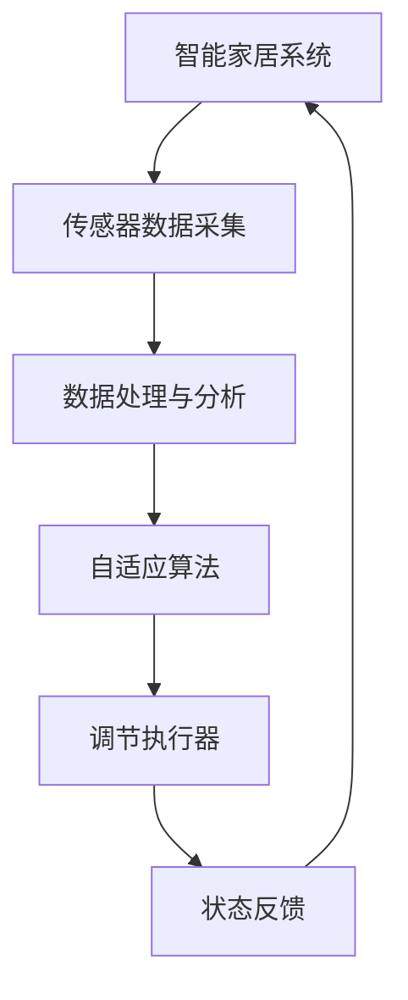

                 

## 文章标题

《智能家居的自适应系统：生活便利的数学调节》

### 关键词：
- 智能家居
- 自适应系统
- 数学调节
- 算法
- 数据分析
- 节能减排

### 摘要：
本文深入探讨了智能家居的自适应系统，以及其核心的数学调节方法。首先，我们介绍了智能家居的背景和自适应系统的基础知识，包括其基本概念、架构和通信机制。接着，我们详细阐述了自适应系统的工作原理，包括数据采集、处理和状态监测等关键环节。随后，本文重点介绍了数学调节在智能家居中的应用，包括线性调节、非线性调节和模糊调节方法。最后，我们通过实际案例展示了自适应系统的设计与实现过程，并对其未来发展方向进行了展望。本文旨在为读者提供一个全面、深入理解智能家居自适应系统的技术指南。

----------------------------------------------------------------

## 《智能家居的自适应系统：生活便利的数学调节》目录大纲

本文将按以下结构展开：

### 第一部分：智能家居的自适应系统概述
- **第1章：智能家居与自适应系统**
  - **1.1 智能家居的兴起与现状**
  - **1.2 自适应系统的基本概念**
  - **1.3 自适应系统在智能家居中的应用**

- **第2章：智能家居的自适应架构**
  - **2.1 智能家居的整体架构**
  - **2.2 自适应系统的组成部分**
  - **2.3 自适应系统的通信与控制机制**

- **第3章：自适应系统的工作原理**
  - **3.1 自适应算法的基本原理**
  - **3.2 数据采集与处理**
  - **3.3 状态监测与评估**

### 第二部分：生活便利的数学调节
- **第4章：数学调节在智能家居中的应用**
  - **4.1 数学模型在智能家居中的应用**
  - **4.2 数据分析在自适应系统中的应用**
  - **4.3 数学调节在节能减排中的应用**

- **第5章：常见的数学调节方法**
  - **5.1 线性调节方法**
  - **5.2 非线性调节方法**
  - **5.3 模糊调节方法**

- **第6章：数学调节的实践案例**
  - **6.1 案例一：智能温控系统**
  - **6.2 案例二：智能照明系统**
  - **6.3 案例三：智能安防系统**

### 第三部分：智能家居的自适应系统设计
- **第7章：自适应系统的设计与实现**
  - **7.1 设计流程与原则**
  - **7.2 系统硬件的选择**
  - **7.3 系统软件的设计与实现**

- **第8章：自适应系统的测试与优化**
  - **8.1 测试环境与测试方法**
  - **8.2 系统性能的评估**
  - **8.3 系统优化的策略与方法**

### 第四部分：未来展望
- **第9章：智能家居的自适应系统发展趋势**
  - **9.1 未来智能家居的自适应系统**
  - **9.2 新型自适应算法的研究方向**
  - **9.3 智能家居与5G、物联网的融合**

- **第10章：总结与展望**
  - **10.1 本书内容的总结**
  - **10.2 智能家居自适应系统的发展前景**
  - **10.3 未来的研究方向与挑战**

### 附录
- **附录A：常用算法与工具介绍**
  - **A.1 算法概述**
  - **A.2 常用工具与库的使用**
  - **A.3 案例代码与资源链接**

通过这个详细的目录结构，读者可以更好地把握全文的内容框架，为后续的深入阅读打下基础。

## 第一部分：智能家居的自适应系统概述

### 第1章：智能家居与自适应系统

随着科技的不断发展，智能家居已经成为现代生活中不可或缺的一部分。智能家居系统通过物联网技术，将家庭中的各种设备和系统连接起来，实现远程控制和自动化操作，从而提高生活质量和便利性。而自适应系统则是智能家居的核心技术之一，它能够根据用户的行为和环境的变化，自动调整和优化系统状态，以实现最佳的性能和用户体验。

#### 1.1 智能家居的兴起与现状

智能家居的概念早在20世纪80年代就已经提出，但当时由于技术限制和成本问题，智能家居系统并没有得到广泛的应用。随着物联网技术的成熟和普及，智能家居逐渐走进了大众的视野。特别是在过去几年中，随着5G、人工智能等新技术的快速发展，智能家居产业迎来了前所未有的发展机遇。

目前，全球智能家居市场呈现出蓬勃发展的态势。根据市场研究机构的统计数据，2019年全球智能家居市场规模已经达到了3000亿美元，预计到2025年将超过1万亿美元。中国作为全球最大的智能家居市场之一，市场规模也在逐年扩大。随着消费者对智能家居产品需求的不断增长，以及政策层面的支持和鼓励，智能家居产业的前景十分广阔。

#### 1.2 自适应系统的基本概念

自适应系统是指能够根据外部环境或内部状态的变化，自动调整自身参数或行为，以实现最佳性能或响应的系统。在智能家居中，自适应系统主要承担着监测环境、分析数据、调整设备状态等任务，从而提高系统的智能化水平和用户体验。

自适应系统通常由以下几个关键组成部分构成：

1. **传感器**：传感器是自适应系统的数据采集单元，用于感知外部环境的变化。常见的传感器包括温度传感器、湿度传感器、光传感器、运动传感器等。

2. **数据处理单元**：数据处理单元负责对传感器采集到的数据进行处理和分析，包括滤波、去噪、特征提取等。数据处理单元通常采用算法来实现，如机器学习算法、数据分析算法等。

3. **决策单元**：决策单元根据数据处理单元提供的信息，生成控制指令，调整设备的状态。决策单元通常采用自适应算法，如PID控制算法、模糊控制算法等。

4. **执行单元**：执行单元负责执行决策单元生成的控制指令，调整家庭设备的运行状态。常见的执行单元包括开关、调温器、照明系统等。

#### 1.3 自适应系统在智能家居中的应用

自适应系统在智能家居中的应用非常广泛，以下是一些典型的应用场景：

1. **智能照明系统**：自适应系统可以根据室内光线亮度和用户需求，自动调整灯光的亮度和颜色。

2. **智能温控系统**：自适应系统可以根据室内外温度、用户舒适度需求等，自动调节空调温度和运行模式。

3. **智能安防系统**：自适应系统可以通过实时监测家庭环境，自动识别异常情况，并发出警报。

4. **智能家电控制系统**：自适应系统可以监控家电的使用情况，自动调整家电的运行状态，实现节能减排。

5. **智能健康管理系统**：自适应系统可以监测用户的健康状况，提供个性化的健康建议和护理方案。

通过上述应用场景可以看出，自适应系统在智能家居中扮演着至关重要的角色，它不仅提升了智能家居的智能化水平，也为用户带来了更加便捷、舒适的生活体验。在下一章中，我们将深入探讨智能家居的自适应架构，解析其组成和通信控制机制。

### 第2章：智能家居的自适应架构

智能家居的自适应系统是一个复杂且高度集成的体系，其核心在于能够根据环境变化和用户需求，动态调整系统状态，以提供最佳的居住体验。要理解智能家居的自适应系统，首先需要了解其整体架构，包括主要组成部分及其相互关系。

#### 2.1 智能家居的整体架构

智能家居的整体架构可以分为以下几个层次：

1. **感知层**：感知层是智能家居系统的最外层，主要负责采集环境数据。这一层通常由各种传感器组成，如温度传感器、湿度传感器、光线传感器、烟雾传感器、门磁传感器等。这些传感器可以实时监测室内外的环境参数，并将数据传输到下一层。

2. **数据处理层**：数据处理层位于感知层之上，主要负责对传感器采集到的数据进行处理和分析。这一层通常包含数据处理单元和算法库，如滤波算法、特征提取算法、机器学习算法等。通过这些算法，数据处理层可以提取环境数据的特征，并生成有用的信息。

3. **决策层**：决策层位于数据处理层之上，是智能家居系统的核心部分。决策层根据数据处理层提供的信息，结合用户预设的规则和目标，生成控制指令。这一层通常包含决策单元和自适应算法，如PID控制算法、模糊控制算法、神经网络算法等。决策层的任务是根据环境变化和用户需求，动态调整系统状态。

4. **执行层**：执行层是智能家居系统的最终层，负责执行决策层生成的控制指令。这一层通常由各种执行单元组成，如电机驱动器、开关控制器、调光控制器、加热器、空调等。执行层将决策层的指令转化为实际的操作，如调整灯光亮度、调节室内温度等。

5. **用户界面层**：用户界面层位于系统的最上层，是用户与智能家居系统交互的界面。用户可以通过手机应用、智能音箱、电脑等设备，实时监控家居状态，并发出控制指令。用户界面层通常包含人机交互界面和接口协议，如HTTP、WebSocket、MQTT等。

#### 2.2 自适应系统的组成部分

自适应系统在智能家居中起着关键作用，其组成部分包括传感器、数据处理单元、决策单元和执行单元。以下是这些组成部分的详细说明：

1. **传感器**：传感器是自适应系统的感知单元，用于采集环境数据。传感器种类繁多，如温度传感器、湿度传感器、光线传感器、烟雾传感器等。这些传感器可以实时监测环境变化，并将数据传输到数据处理单元。

2. **数据处理单元**：数据处理单元是自适应系统的分析单元，负责对传感器采集到的数据进行处理和分析。数据处理单元通常包含滤波器、特征提取算法和机器学习算法等。通过这些算法，数据处理单元可以提取环境数据的特征，并生成有用的信息，如温度趋势、湿度变化等。

3. **决策单元**：决策单元是自适应系统的核心部分，负责根据数据处理单元提供的信息，结合用户预设的规则和目标，生成控制指令。决策单元通常包含自适应算法，如PID控制算法、模糊控制算法、神经网络算法等。这些算法可以根据环境变化和用户需求，动态调整系统状态。

4. **执行单元**：执行单元是自适应系统的执行单元，负责执行决策单元生成的控制指令。执行单元通常包含电机驱动器、开关控制器、调光控制器、加热器、空调等。通过执行单元，自适应系统可以实现各种控制操作，如调节室内温度、调整灯光亮度等。

#### 2.3 自适应系统的通信与控制机制

自适应系统的通信与控制机制是保证系统正常运行的关键。以下是其主要通信与控制机制：

1. **通信协议**：自适应系统通常采用多种通信协议，如HTTP、WebSocket、MQTT等。这些协议可以确保传感器、数据处理单元、决策单元和执行单元之间高效、可靠的数据传输。

2. **数据传输**：传感器采集到的数据通过通信协议传输到数据处理单元，数据处理单元分析数据后，将处理结果传输到决策单元。决策单元生成控制指令后，通过通信协议传输到执行单元。

3. **反馈机制**：执行单元执行控制指令后，会向决策单元反馈当前状态。决策单元根据反馈信息，进一步调整系统状态，实现闭环控制。

4. **动态调整**：自适应系统能够根据环境变化和用户需求，动态调整系统状态。这种动态调整是通过传感器、数据处理单元、决策单元和执行单元之间的实时通信和反馈机制实现的。

通过上述通信与控制机制，自适应系统可以实现高度的智能化和自动化，为用户提供更加便捷、舒适的生活体验。在下一章中，我们将深入探讨自适应系统的工作原理，包括自适应算法的基本原理、数据采集与处理、状态监测与评估等方面。

### 第3章：自适应系统的工作原理

自适应系统在智能家居中扮演着至关重要的角色，其工作原理决定了系统的智能化水平和用户体验。要深入理解自适应系统，需要从自适应算法的基本原理、数据采集与处理、状态监测与评估三个方面进行详细探讨。

#### 3.1 自适应算法的基本原理

自适应算法是自适应系统的核心，其基本原理是通过对系统状态和外部环境的变化进行实时监测和调整，以实现最优的性能和用户体验。以下是几种常见自适应算法的基本原理：

1. **PID控制算法**：PID（比例-积分-微分）控制算法是最常见的自适应控制算法之一。PID算法通过比例、积分和微分三个部分来调整控制量，以达到期望的系统响应。其基本原理如下：

   $$
   u(t) = K_p e(t) + K_i \int_{0}^{t} e(\tau)d\tau + K_d \frac{de(t)}{dt}
   $$
   
   其中，$u(t)$ 是控制输出，$e(t)$ 是误差，$K_p$、$K_i$ 和 $K_d$ 分别是比例、积分和微分系数。PID算法通过对误差进行比例、积分和微分处理，实现对系统输出的精确控制。

2. **模糊控制算法**：模糊控制算法基于模糊逻辑和模糊规则，通过对系统输入进行模糊化处理，输出模糊控制信号。其基本原理如下：

   $$
   u = \frac{1}{\sum_{i=1}^{n} w_i \cdot \mu_i(x)}
   $$
   
   其中，$u$ 是输出值，$w_i$ 是隶属度函数，$\mu_i(x)$ 是输入值 $x$ 对第 $i$ 个隶属度函数的隶属度。模糊控制算法通过对输入和输出进行模糊化处理，实现系统的自适应调节。

3. **神经网络算法**：神经网络算法通过模拟人脑的神经网络结构，对输入数据进行学习和处理，生成输出结果。其基本原理如下：

   $$
   y = \sum_{i=1}^{n} w_i \cdot f(z_i)
   $$
   
   其中，$y$ 是输出值，$w_i$ 是权重，$z_i$ 是输入值，$f(z_i)$ 是激活函数。神经网络算法通过不断调整权重和激活函数，实现对系统输入的精准控制和预测。

#### 3.2 数据采集与处理

数据采集与处理是自适应系统的关键环节，其质量直接影响系统的自适应能力和性能。以下是数据采集与处理的主要步骤：

1. **数据采集**：传感器是数据采集的主要设备，通过传感器可以获取温度、湿度、光线、声音等多种环境数据。数据采集的精度和速度直接影响系统的响应速度和准确性。

2. **数据预处理**：采集到的数据通常含有噪声和误差，需要进行预处理。预处理包括数据去噪、滤波、归一化等步骤，以提高数据的可靠性和准确性。

3. **特征提取**：通过对预处理后的数据进行分析，提取出有用的特征信息。特征提取的方法包括时域分析、频域分析、统计特征提取等，以帮助系统更好地理解和预测环境变化。

4. **数据分析**：对提取出的特征信息进行进一步分析，以发现环境变化的规律和趋势。数据分析的方法包括机器学习、统计分析、模式识别等，以实现数据的智能化处理。

#### 3.3 状态监测与评估

状态监测与评估是自适应系统的核心功能之一，通过实时监测系统状态，评估系统性能，以实现自适应调整。以下是状态监测与评估的主要步骤：

1. **状态监测**：通过传感器和数据处理单元，实时监测系统状态。状态监测包括温度、湿度、光线、噪音等多种环境参数，以及设备运行状态、能耗等。

2. **状态评估**：根据监测到的数据，对系统状态进行评估。状态评估的方法包括阈值评估、统计评估、模型评估等，以判断系统是否达到预设目标或出现异常。

3. **自适应调整**：根据状态评估结果，对系统进行自适应调整。调整的方法包括参数调整、控制策略调整、设备状态调整等，以实现系统状态的优化和调整。

4. **反馈与优化**：通过实时反馈机制，将调整结果反馈到传感器和数据处理单元，实现系统的闭环控制。同时，通过不断优化调整策略和算法，提高系统的自适应能力和性能。

通过以上三个方面的探讨，我们可以看到，自适应系统的工作原理是复杂的，但通过合理的设计和优化，可以实现高效的系统控制和良好的用户体验。在下一部分，我们将进一步探讨数学调节在智能家居中的应用，以及常见的数学调节方法。

### 第二部分：生活便利的数学调节

数学调节是智能家居自适应系统的核心组成部分，通过数学模型和算法，系统能够自动调整设备状态，以实现最优的舒适度和能源效率。在本章中，我们将详细探讨数学调节在智能家居中的应用、数据分析在自适应系统中的作用，以及数学调节在节能减排中的应用。

#### 4.1 数学模型在智能家居中的应用

数学模型是智能家居自适应系统的理论基础，通过这些模型，系统能够预测环境变化，并自动调整设备状态。以下是几种常见的数学模型及其在智能家居中的应用：

1. **线性调节模型**：线性调节模型是一种简单而有效的调节方法，其基本形式为：
   $$
   y(t) = a \cdot x(t) + b
   $$
   其中，$y(t)$ 是调节后的值，$x(t)$ 是输入值，$a$ 和 $b$ 是调节参数。线性调节模型常用于温度控制、灯光亮度调节等场景。

2. **非线性调节模型**：非线性调节模型适用于处理非线性系统，其形式更为复杂，如：
   $$
   y(t) = \frac{1}{1 + e^{-k \cdot (x - \theta)}}
   $$
   其中，$k$ 和 $\theta$ 是调节参数。这种模型常用于复杂的系统调节，如智能温控系统、家电运行状态调节等。

3. **模糊调节模型**：模糊调节模型通过模糊逻辑处理输入和输出关系，适用于不确定性和模糊性较高的系统。其基本形式为：
   $$
   u = \frac{1}{\sum_{i=1}^{n} w_i \cdot \mu_i(x)}
   $$
   其中，$u$ 是输出值，$w_i$ 是隶属度函数，$\mu_i(x)$ 是输入值 $x$ 对第 $i$ 个隶属度函数的隶属度。模糊调节模型在智能家居中广泛用于安防系统、环境监测等场景。

#### 4.2 数据分析在自适应系统中的作用

数据分析是自适应系统的关键环节，通过分析传感器采集的数据，系统能够更好地理解和预测环境变化，从而实现自动调节。以下是数据分析在自适应系统中的作用：

1. **数据预处理**：数据预处理是数据分析的基础，其任务包括去除噪声、缺失值填充、数据归一化等。通过数据预处理，可以提高数据的可靠性和准确性。

2. **特征提取**：特征提取是从原始数据中提取出对系统调节有重要影响的关键特征。特征提取的方法包括时域分析、频域分析、主成分分析等。通过特征提取，系统可以更好地理解和预测环境变化。

3. **模式识别**：模式识别是通过分析历史数据，识别出环境变化的模式和趋势。模式识别的方法包括聚类分析、分类分析等。通过模式识别，系统可以提前预判环境变化，并采取相应的调节措施。

4. **预测分析**：预测分析是通过历史数据，预测未来的环境变化。预测分析的方法包括时间序列分析、机器学习等。通过预测分析，系统可以提前调整设备状态，以应对未来的环境变化。

#### 4.3 数学调节在节能减排中的应用

节能减排是当前社会的重要议题，智能家居的自适应系统在这方面具有显著的优势。以下是一些数学调节在节能减排中的应用：

1. **智能照明系统**：智能照明系统可以通过调节灯光亮度和颜色，实现节能。例如，使用线性调节模型调节灯光亮度，根据环境光线变化自动调整灯光亮度。这种调节方法不仅能够节省能源，还能提高用户舒适度。

2. **智能温控系统**：智能温控系统可以通过调节室内温度，实现节能。例如，使用模糊调节模型，根据室内外温度、用户舒适度需求等，自动调节空调温度和运行模式。这种调节方法能够在保证用户舒适度的同时，显著降低能耗。

3. **智能家电控制系统**：智能家电控制系统可以通过调节家电运行状态，实现节能。例如，使用神经网络算法，监控家电使用情况，自动调整家电的运行状态，实现最优的节能效果。

4. **智能能源管理系统**：智能能源管理系统可以通过调节家庭能源的使用和分配，实现节能。例如，使用非线性调节模型，根据家庭能源消耗情况，自动调整电器的使用时间，优化能源利用效率。

通过上述应用，我们可以看到数学调节在智能家居中具有重要的地位，它不仅能够提高生活质量，还能为节能减排做出贡献。在下一章中，我们将详细介绍常见的数学调节方法，包括线性调节方法、非线性调节方法和模糊调节方法。

#### 5.1 线性调节方法

线性调节方法是智能家居自适应系统中的一种基本调节方法，其核心思想是通过线性关系调节系统状态，以实现稳定、精确的控制效果。线性调节方法具有简单、直观、易于实现和调试的特点，因此广泛应用于智能家居的各个方面。

1. **基本原理**

线性调节方法基于线性关系，其基本形式为：
   $$
   y(t) = a \cdot x(t) + b
   $$
   其中，$y(t)$ 是调节后的值，$x(t)$ 是输入值，$a$ 和 $b$ 是调节参数。$a$ 和 $b$ 的选择决定了调节的灵敏度和平移量。通过调整这两个参数，可以实现不同的调节效果。

2. **调节过程**

线性调节方法的调节过程通常包括以下几个步骤：

   - **初始设定**：根据系统的需求，设定初始的 $a$ 和 $b$ 值。通常需要通过实验和调试来确定最佳参数。

   - **数据采集**：通过传感器采集输入值 $x(t)$，例如温度、湿度、光线等。

   - **计算调节值**：根据当前的 $x(t)$ 值，使用公式 $y(t) = a \cdot x(t) + b$ 计算出调节后的值 $y(t)$。

   - **执行调节动作**：根据计算出的 $y(t)$ 值，执行相应的调节动作，如调整温度、亮度等。

3. **应用实例**

线性调节方法在智能家居中具有广泛的应用，以下是一些实例：

   - **智能温控系统**：通过调节空调或取暖器的温度设置，保持室内温度在舒适的范围内。

   - **智能照明系统**：根据环境光线强度，自动调整灯光的亮度和颜色。

   - **智能家电控制系统**：根据家电的使用需求，自动调节运行状态，如空调的制冷功率、电饭煲的加热功率等。

4. **优缺点**

线性调节方法的优点如下：

   - **简单易实现**：线性调节方法的概念简单，易于理解和实现。

   - **稳定性好**：线性调节方法能够稳定地实现系统状态的调节。

   - **可靠性高**：线性调节方法的参数调整相对简单，易于调试和优化。

线性调节方法的缺点如下：

   - **调节范围有限**：线性调节方法在处理大范围的变化时，可能无法满足需求。

   - **无法处理非线性关系**：线性调节方法无法处理复杂的非线性关系，适用于较为简单的系统。

总的来说，线性调节方法是一种简单而有效的调节方法，适用于许多智能家居场景。但其在处理复杂非线性关系时，可能需要结合其他调节方法，如非线性调节方法和模糊调节方法，以实现更精确和高效的控制。

#### 5.2 非线性调节方法

非线性调节方法在智能家居自适应系统中具有重要作用，特别是在处理复杂非线性关系和高度动态变化的环境中。非线性调节方法通过模拟系统的非线性特性，实现对系统状态的精确调节，提高系统的自适应能力和控制效果。

1. **基本原理**

非线性调节方法基于非线性函数，其基本形式为：
   $$
   y(t) = f(x(t))
   $$
   其中，$y(t)$ 是调节后的值，$x(t)$ 是输入值，$f(x(t))$ 是非线性函数。非线性函数可以是多项式、指数、对数、三角函数等，根据系统的需求和特性选择合适的非线性函数形式。

2. **调节过程**

非线性调节方法的调节过程通常包括以下几个步骤：

   - **模型建立**：根据系统的需求，建立非线性模型。非线性模型可以是实验数据拟合的曲线、神经网络等。

   - **参数调整**：通过实验和调试，确定非线性模型的参数。参数的调整决定了调节的灵敏度和动态响应。

   - **数据采集**：通过传感器采集输入值 $x(t)$。

   - **计算调节值**：根据当前的 $x(t)$ 值，使用非线性模型计算出调节后的值 $y(t)$。

   - **执行调节动作**：根据计算出的 $y(t)$ 值，执行相应的调节动作。

3. **应用实例**

非线性调节方法在智能家居中具有广泛的应用，以下是一些实例：

   - **智能温控系统**：使用非线性调节模型，根据室内外温度变化，自动调整空调的制冷或加热功率，实现高效节能。

   - **智能照明系统**：根据环境光线强度变化，自动调整灯光的亮度和颜色，提高照明效果和节能。

   - **智能家电控制系统**：根据家电的使用需求，动态调整运行状态，如洗衣机的水温、电饭煲的加热功率等，实现高效节能。

4. **优缺点**

非线性调节方法的优点如下：

   - **适应性更强**：非线性调节方法能够处理复杂非线性关系，适应性强。

   - **动态响应更好**：非线性调节方法能够更好地应对系统的动态变化，提高控制效果。

非线性调节方法的缺点如下：

   - **实现复杂**：非线性调节方法通常需要复杂的模型和参数调整，实现难度较大。

   - **调试难度大**：非线性调节方法的调试需要大量实验和数据分析，调试难度大。

总的来说，非线性调节方法在处理复杂非线性关系和高度动态变化的环境中具有显著优势，但实现复杂，调试难度大。在实际应用中，可以根据具体需求，结合线性调节方法和模糊调节方法，实现最佳的控制效果。

#### 5.3 模糊调节方法

模糊调节方法是智能家居自适应系统中的另一种重要调节方法，特别适用于处理不确定性高和复杂性强的系统。模糊调节方法通过模糊逻辑处理输入和输出关系，实现对系统状态的灵活调节。这种方法能够处理系统中的模糊性和不精确信息，从而提高自适应能力和控制效果。

1. **基本原理**

模糊调节方法基于模糊逻辑，其基本形式为：
   $$
   u = \frac{1}{\sum_{i=1}^{n} w_i \cdot \mu_i(x)}
   $$
   其中，$u$ 是输出值，$w_i$ 是隶属度函数，$\mu_i(x)$ 是输入值 $x$ 对第 $i$ 个隶属度函数的隶属度。隶属度函数通常采用三角形、梯形或高斯函数，用于描述输入值与输出值之间的关系。

2. **调节过程**

模糊调节方法的调节过程通常包括以下几个步骤：

   - **模糊化**：将输入值和输出值模糊化，生成模糊集合。例如，将温度值分为“低温”、“中温”和“高温”等模糊类别。

   - **规则库建立**：根据系统的需求和特性，建立模糊规则库。模糊规则库描述了输入模糊集合与输出模糊集合之间的对应关系，通常以“如果...那么...”的形式表达。

   - **推理过程**：根据当前的输入模糊集合，通过模糊推理，生成输出模糊集合。模糊推理的方法包括Mamdani法和Sugeno法等。

   - **去模糊化**：将输出模糊集合去模糊化，得到精确的输出值。去模糊化的方法包括重心法、最大隶属度法等。

3. **应用实例**

模糊调节方法在智能家居中具有广泛的应用，以下是一些实例：

   - **智能安防系统**：通过模糊调节方法，根据传感器的输入数据（如声音、图像等），自动判断是否存在安全隐患，并发出警报。

   - **智能照明系统**：根据环境光线强度和用户需求，自动调整灯光的亮度和颜色，提高照明效果和节能。

   - **智能温控系统**：根据室内外温度变化和用户舒适度需求，自动调节空调温度和运行模式，实现高效节能。

4. **优缺点**

模糊调节方法的优点如下：

   - **处理不确定性**：模糊调节方法能够处理系统中的模糊性和不确定性，提高系统的自适应能力。

   - **适应性强**：模糊调节方法适用于复杂和高度动态变化的系统，具有较强的适应性。

   - **灵活性高**：模糊调节方法可以根据不同的需求和特性，灵活调整系统状态，实现最优控制效果。

模糊调节方法的缺点如下：

   - **实现复杂**：模糊调节方法需要建立模糊规则库，实现复杂，调试难度大。

   - **计算量大**：模糊调节方法需要进行模糊化和去模糊化计算，计算量相对较大。

总的来说，模糊调节方法在处理不确定性高和复杂性强的系统中具有显著优势，但实现复杂，计算量大。在实际应用中，可以根据具体需求，结合线性调节方法和非线性调节方法，实现最佳的控制效果。

#### 6.1 案例一：智能温控系统

智能温控系统是智能家居中常见的自适应系统之一，其核心在于能够根据室内外温度变化和用户舒适度需求，自动调节空调或取暖器的运行状态，实现室内温度的精确控制。下面，我们通过一个实际案例来详细介绍智能温控系统的设计与实现过程。

##### 6.1.1 案例背景

某住宅小区住户张先生希望家里能够安装一套智能温控系统，以便在冬天能够自动调节室内温度，保持舒适的居住环境。同时，他也希望能够实现节能，降低家庭的能源消耗。

##### 6.1.2 案例目标

- 室内温度保持在20°C至22°C之间，以满足用户舒适度需求。
- 实现自动调节，降低人工干预。
- 节能，降低能源消耗。

##### 6.1.3 系统设计

1. **感知层设计**

   智能温控系统的感知层主要包括温度传感器和湿度传感器。温度传感器用于实时监测室内外温度，湿度传感器用于监测室内湿度。传感器数据通过无线通信模块传输到数据处理单元。

2. **数据处理层设计**

   数据处理单元负责对传感器采集到的温度和湿度数据进行分析和处理。数据处理单元采用线性调节模型，根据当前温度和用户设定的舒适温度，计算调节后的温度值。

3. **决策层设计**

   决策层是智能温控系统的核心，负责根据数据处理单元提供的数据，生成控制指令。决策层采用PID控制算法，通过调节空调或取暖器的运行状态，实现室内温度的精确控制。

4. **执行层设计**

   执行层包括空调和取暖器的控制模块。根据决策层生成的控制指令，控制模块自动调节空调或取暖器的运行状态，如温度设置、开关控制等。

5. **用户界面设计**

   用户界面设计用于用户与智能温控系统之间的交互。用户可以通过手机应用或智能音箱，实时监控室内温度，并设置舒适温度。用户界面提供友好的操作界面，方便用户进行操作和设置。

##### 6.1.4 系统实现

1. **硬件选择**

   - 温度传感器：DS18B20
   - 湿度传感器：DHT22
   - 无线通信模块：ESP8266
   - 控制模块：Arduino Mega 2560

2. **软件设计**

   - 数据处理单元：使用Python编写，实现传感器数据采集、处理和调节功能。
   - 决策层：使用PID控制算法，实现室内温度的精确控制。
   - 执行层：使用Arduino编程，控制空调和取暖器的运行状态。
   - 用户界面：使用Web技术，实现用户与系统的交互。

3. **系统实现流程**

   - 实时监测室内外温度和湿度，并通过无线通信模块传输到数据处理单元。
   - 数据处理单元对传感器数据进行处理，计算调节后的温度值。
   - 决策层根据调节后的温度值，生成控制指令。
   - 执行层根据控制指令，自动调节空调和取暖器的运行状态。
   - 用户界面显示当前室内温度和用户设定的舒适温度，并提供操作界面。

##### 6.1.5 案例效果

通过智能温控系统的设计与实现，张先生家里实现了自动调节室内温度，保持了舒适的居住环境。同时，智能温控系统还实现了节能效果，显著降低了家庭的能源消耗。用户反馈表示，智能温控系统不仅提高了生活质量，还带来了明显的节能效益。

##### 6.1.6 案例总结

智能温控系统是一个典型的自适应系统应用案例，通过合理的设计和实现，实现了室内温度的精确控制和节能目标。这个案例展示了智能家居自适应系统的设计和实现过程，为其他智能家居项目的开发提供了有益的参考。

### 6.2 案例二：智能照明系统

智能照明系统是智能家居中的另一个重要组成部分，通过自适应调节灯光亮度和颜色，实现舒适、节能的照明效果。以下是一个智能照明系统的实际案例，详细描述其设计与实现过程。

#### 6.2.1 案例背景

某企业办公楼希望安装一套智能照明系统，以提高办公环境的舒适度和能源利用效率。办公楼有多个楼层和多种功能区，包括会议室、办公区、休息区等，每个区域对照明的要求不同。企业希望系统能够根据环境光线变化、用户活动以及节能需求，自动调节灯光亮度和颜色。

#### 6.2.2 案例目标

- 根据环境光线自动调节灯光亮度。
- 根据用户活动自动调整灯光颜色。
- 实现区域照明控制，提高照明效率。
- 节能，降低能源消耗。

#### 6.2.3 系统设计

1. **感知层设计**

   智能照明系统的感知层包括光传感器、运动传感器和红外传感器。光传感器用于检测环境光线变化，运动传感器用于检测用户活动，红外传感器用于识别用户的接近。

2. **数据处理层设计**

   数据处理层包括数据预处理和调节算法。数据预处理模块负责对传感器数据进行滤波和去噪。调节算法模块根据光传感器和运动传感器的数据，生成灯光亮度和颜色的调节指令。

3. **决策层设计**

   决策层是智能照明系统的核心，负责根据数据处理层提供的数据，生成控制指令。决策层采用模糊调节方法，根据不同的环境和用户活动，智能调节灯光亮度和颜色。

4. **执行层设计**

   执行层包括照明设备的控制模块，如调光器和调色器。根据决策层生成的控制指令，控制模块调节灯光的亮度和颜色。

5. **用户界面设计**

   用户界面包括触摸屏和智能音箱，用户可以通过触摸屏或智能音箱设置照明模式、调整亮度和颜色。

#### 6.2.4 系统实现

1. **硬件选择**

   - 光传感器：LUX SENSOR
   - 运动传感器：PIR SENSOR
   - 红外传感器：INFRARED SENSOR
   - 无线通信模块：ESP32
   - 控制模块：ESP32
   - 调光器：LED LIGHT BULB
   - 调色器：RGB LED LIGHT BULB

2. **软件设计**

   - 数据处理单元：使用Python编写，实现传感器数据采集、处理和调节功能。
   - 决策层：使用模糊调节算法，实现灯光亮度和颜色的智能调节。
   - 执行层：使用Arduino编程，控制照明设备的亮度和颜色。
   - 用户界面：使用Web技术，实现用户与系统的交互。

3. **系统实现流程**

   - 实时监测环境光线变化、用户活动和用户接近。
   - 光传感器和运动传感器数据通过无线通信模块传输到数据处理单元。
   - 数据处理单元对传感器数据进行预处理和调节算法处理，生成灯光亮度和颜色的调节指令。
   - 决策层根据处理结果生成控制指令。
   - 执行层根据控制指令调节灯光的亮度和颜色。
   - 用户通过触摸屏或智能音箱查看照明状态，并可以设置照明模式。

#### 6.2.5 案例效果

智能照明系统的部署显著提升了办公环境的舒适度和能源利用效率。系统可以根据不同的时间和场景自动调节灯光亮度和颜色，提高了办公人员的舒适度和工作效率。同时，通过智能调节，照明系统能够实现显著的节能效果，每月的能源消耗明显降低。

#### 6.2.6 案例总结

智能照明系统案例展示了自适应系统在提高生活质量和节能减排方面的潜力。通过合理的设计和实现，智能照明系统能够根据环境和用户需求智能调节灯光，实现最佳照明效果。这个案例为其他智能家居项目的开发提供了有益的参考。

### 6.3 案例三：智能安防系统

智能安防系统是智能家居中的一项重要功能，通过自动检测和报警，提高家庭的安全性和防范能力。以下是一个智能安防系统的实际案例，详细介绍其设计与实现过程。

#### 6.3.1 案例背景

某家庭用户李女士希望在家里安装一套智能安防系统，以便在发生异常情况时能够及时报警，并保护家庭的安全。李女士对安防系统有以下几个要求：

- 能够实时监测家庭环境，包括门窗状态、室内活动等。
- 能够自动识别异常行为，并发出报警信号。
- 系统操作简便，易于维护。

#### 6.3.2 案例目标

- 实现实时监测，确保家庭安全。
- 自动识别异常行为，减少误报。
- 提高系统的响应速度和准确度。
- 提供用户友好的操作界面。

#### 6.3.3 系统设计

1. **感知层设计**

   智能安防系统的感知层包括门磁传感器、红外传感器和摄像头。门磁传感器用于检测门窗的开闭状态，红外传感器用于检测室内活动，摄像头用于实时监控室内环境。

2. **数据处理层设计**

   数据处理层负责对传感器数据进行处理和分析。数据处理层包括视频图像处理和异常行为识别算法。通过视频图像处理，可以提取出有价值的信息，如人形检测、动作识别等。

3. **决策层设计**

   决策层是智能安防系统的核心，负责根据数据处理层提供的数据，判断是否存在异常行为，并生成报警信号。决策层采用模糊控制算法，根据不同的环境和用户行为，智能判断报警条件。

4. **执行层设计**

   执行层包括报警模块和控制模块。报警模块负责在检测到异常时发出报警信号，控制模块负责对家庭设备进行控制，如锁定门窗、启动监控设备等。

5. **用户界面设计**

   用户界面包括手机应用和智能音箱，用户可以通过手机应用查看实时监控视频，并通过智能音箱控制安防系统。

#### 6.3.4 系统实现

1. **硬件选择**

   - 门磁传感器：Magnetic Sensor
   - 红外传感器：PIR Sensor
   - 摄像头：IP Camera
   - 无线通信模块：ESP8266
   - 控制模块：ESP32
   - 报警模块：SOS Alarm
   - 用户界面设备：Smartphone, Smart Speaker

2. **软件设计**

   - 数据处理单元：使用Python编写，实现传感器数据采集、视频图像处理和异常行为识别。
   - 决策层：使用模糊控制算法，实现异常行为的识别和报警。
   - 执行层：使用Arduino编程，控制报警模块和家居设备的动作。
   - 用户界面：使用Web技术，实现用户与系统的交互。

3. **系统实现流程**

   - 实时监测家庭环境，包括门窗状态、室内活动等。
   - 传感器数据通过无线通信模块传输到数据处理单元。
   - 数据处理单元对传感器数据进行处理，提取有用信息。
   - 决策层根据处理结果判断是否存在异常行为，并生成报警信号。
   - 报警模块根据报警信号发出警报。
   - 用户通过手机应用查看实时监控视频，并通过智能音箱控制安防系统。

#### 6.3.5 案例效果

智能安防系统在李女士家中部署后，显著提高了家庭的安全防护能力。系统可以实时监测家庭环境，自动识别异常行为，并在发生异常时及时发出警报。用户反馈表示，智能安防系统提高了家庭的安心感，减少了不必要的担忧。

#### 6.3.6 案例总结

智能安防系统案例展示了自适应系统在提高家庭安全方面的应用价值。通过合理的设计和实现，智能安防系统能够实现实时监测、自动报警和远程控制，为用户提供了安全、便捷的居住环境。这个案例为其他智能家居项目的开发提供了有益的参考。

### 第7章：自适应系统的设计与实现

设计并实现一个智能家居的自适应系统是一项复杂而系统化的工作，需要综合考虑硬件、软件、算法以及用户体验等多方面因素。本章将详细介绍自适应系统的设计与实现流程，包括设计流程与原则、系统硬件的选择以及系统软件的设计与实现。

#### 7.1 设计流程与原则

1. **需求分析**：首先，明确系统的需求，包括功能需求、性能需求、可靠性需求等。需求分析是设计流程的基础，直接影响后续设计方案的合理性。

2. **系统架构设计**：在需求分析的基础上，设计系统的整体架构，包括感知层、数据处理层、决策层、执行层以及用户界面层。系统架构设计需要考虑模块化、可扩展性和高可靠性。

3. **硬件选择**：根据系统需求和架构设计，选择合适的硬件设备，如传感器、控制器、执行器等。硬件选择需要考虑性能、成本、兼容性等因素。

4. **软件开发**：设计系统软件的架构，选择合适的编程语言和开发工具。软件开发包括数据处理算法、控制算法、用户界面开发等。

5. **系统集成**：将硬件和软件整合到一起，实现系统的功能。系统集成过程中，需要进行充分的测试和调试，确保系统稳定运行。

6. **系统测试与优化**：对系统进行全面测试，包括功能测试、性能测试、可靠性测试等。根据测试结果，对系统进行优化和调整。

#### 7.2 系统硬件的选择

1. **传感器**：传感器是系统的感知单元，用于采集环境数据。常见的传感器包括温度传感器、湿度传感器、光线传感器、运动传感器等。选择传感器时，需要考虑传感器的精度、灵敏度、响应时间等因素。

2. **控制器**：控制器是系统的核心处理单元，负责数据处理和决策生成。常见的控制器包括单片机、嵌入式系统、PC等。控制器选择需要考虑计算能力、存储能力、兼容性等因素。

3. **执行器**：执行器是系统的执行单元，负责执行决策层的控制指令。常见的执行器包括电机、电磁阀、开关等。执行器选择需要考虑功率、响应速度、稳定性等因素。

4. **通信模块**：通信模块负责系统内部各单元之间的数据传输。常见的通信协议包括Wi-Fi、蓝牙、Zigbee、MQTT等。通信模块选择需要考虑传输距离、传输速率、稳定性等因素。

#### 7.3 系统软件的设计与实现

1. **数据处理算法**：数据处理算法是系统的核心部分，用于对传感器数据进行采集、处理和分析。常见的算法包括滤波算法、特征提取算法、机器学习算法等。

2. **控制算法**：控制算法根据数据处理结果，生成控制指令，调整系统状态。常见的控制算法包括PID控制算法、模糊控制算法、神经网络控制算法等。

3. **用户界面**：用户界面是用户与系统的交互界面，提供系统状态监测、控制指令发送等功能。用户界面设计需要考虑用户友好性、操作便捷性等因素。

4. **软件架构**：系统软件采用模块化设计，各模块之间通过接口进行通信。常见的软件架构模式包括MVC（Model-View-Controller）、MVVM（Model-View-ViewModel）等。

5. **编程语言与工具**：系统软件开发可以选择Python、C++、Java等编程语言。常见的开发工具包括Eclipse、Visual Studio、PyCharm等。

#### 7.4 系统集成与测试

系统集成是将硬件和软件整合到一起，实现系统的整体功能。系统集成过程中，需要进行以下步骤：

1. **硬件调试**：对传感器、控制器、执行器等硬件进行调试，确保硬件正常运行。

2. **软件调试**：对系统软件进行调试，确保各模块之间能够正确通信，功能正常。

3. **系统集成测试**：对系统整体进行测试，确保系统能够稳定运行，各功能模块能够协同工作。

4. **性能测试**：对系统性能进行测试，包括响应速度、稳定性、可靠性等。

5. **优化与调整**：根据测试结果，对系统进行优化和调整，提高系统性能和用户体验。

通过上述设计流程和实现步骤，我们可以构建一个高效、稳定、智能的智能家居自适应系统。在下一章中，我们将探讨如何对自适应系统进行测试与优化，以确保其性能和可靠性。

### 第8章：自适应系统的测试与优化

测试与优化是自适应系统设计过程中不可或缺的环节。通过系统的测试与优化，可以确保其在实际应用中的性能和可靠性，提高用户体验。本章将详细介绍自适应系统的测试环境与测试方法、系统性能评估以及优化策略与方法。

#### 8.1 测试环境与测试方法

1. **测试环境**

   测试环境是进行系统测试的基础，需要模拟实际应用场景，包括硬件环境、软件环境以及网络环境等。硬件环境包括传感器、控制器、执行器等实际硬件设备，软件环境包括操作系统、编程语言和开发工具等，网络环境包括通信模块和网络连接方式。

2. **测试方法**

   - **功能测试**：功能测试用于验证系统是否按照设计要求完成各项功能，包括传感器数据采集、数据处理、决策生成、执行控制等。功能测试通常采用黑盒测试方法，通过模拟用户操作和系统响应来验证功能正确性。

   - **性能测试**：性能测试用于评估系统的响应速度、处理能力、稳定性等性能指标。性能测试包括负载测试、压力测试、稳定性测试等，通过向系统施加不同的负载和压力，评估系统的性能表现。

   - **可靠性测试**：可靠性测试用于验证系统的稳定性和可靠性，包括长时间运行测试、故障恢复测试等。可靠性测试通过模拟系统长时间运行和故障情况，评估系统的稳定性和故障恢复能力。

   - **用户体验测试**：用户体验测试用于评估系统在用户使用过程中的易用性、操作便捷性等。用户体验测试通常通过用户调研、用户反馈等方式进行。

#### 8.2 系统性能评估

系统性能评估是测试与优化的关键环节，通过评估系统性能，可以及时发现问题和不足，进行针对性的优化。以下是系统性能评估的主要指标：

1. **响应时间**：系统从接收到用户请求到完成响应的时间。响应时间越短，用户体验越好。

2. **处理能力**：系统在单位时间内能够处理的数据量和任务数。处理能力越强，系统性能越好。

3. **稳定性**：系统在长时间运行过程中，不出现崩溃、死机等异常情况的能力。稳定性越高，系统越可靠。

4. **资源利用率**：系统在运行过程中，对CPU、内存、硬盘等资源的利用程度。资源利用率越高，系统性能越好。

5. **能耗**：系统在运行过程中，消耗的能源。能耗越低，系统越节能。

#### 8.3 优化策略与方法

优化策略与方法是根据系统性能评估结果，对系统进行改进和优化的具体措施。以下是一些常见的优化策略与方法：

1. **算法优化**：对系统中的数据处理和控制算法进行优化，提高算法的效率和准确性。例如，采用更高效的滤波算法、优化控制参数等。

2. **硬件升级**：通过升级硬件设备，提高系统的处理能力和稳定性。例如，更换更高性能的传感器、控制器等。

3. **软件优化**：优化系统软件的代码和架构，提高系统的响应速度和资源利用率。例如，采用更高效的编程语言、优化数据结构等。

4. **网络优化**：优化系统网络通信，提高数据传输速度和稳定性。例如，选择更可靠的网络协议、优化网络拓扑结构等。

5. **测试优化**：通过改进测试方法和技术，提高测试效率和准确性。例如，自动化测试、模拟测试等。

通过测试与优化，可以不断提升自适应系统的性能和可靠性，为用户提供更优质的服务。在下一部分，我们将探讨未来智能家居自适应系统的发展趋势。

### 第9章：智能家居的自适应系统发展趋势

随着科技的不断进步和智能家居市场的快速扩展，自适应系统在智能家居中的应用前景越来越广阔。未来，智能家居的自适应系统将呈现以下几个发展趋势：

#### 9.1 未来智能家居的自适应系统

1. **更高智能化**：未来的智能家居自适应系统将更加智能化，能够通过深度学习和人工智能技术，实现更高水平的自主学习和决策。系统可以根据用户的行为习惯和环境变化，自动调整家居设备的运行状态，提供个性化的服务。

2. **更广泛集成**：未来的智能家居自适应系统将更加集成化，将家庭中的各种设备和系统（如照明、温控、安防、家电等）整合在一起，实现全面的互联互通。通过集成，系统能够更高效地协同工作，为用户提供更便捷、更舒适的生活体验。

3. **更高效节能**：未来的智能家居自适应系统将更加注重节能环保，通过先进的算法和智能控制，实现家庭能源的合理分配和高效利用。系统可以根据实际需求，动态调整能源消耗，降低家庭能源成本。

4. **更安全可靠**：未来的智能家居自适应系统将更加注重安全性和可靠性，通过强化数据保护和隐私保护措施，确保用户数据的安全和隐私。同时，系统将采用更可靠的技术和冗余设计，提高系统的稳定性和抗故障能力。

#### 9.2 新型自适应算法的研究方向

1. **深度学习算法**：深度学习算法在智能家居自适应系统中具有广泛的应用前景。通过深度学习，系统可以自动提取环境数据的特征，并生成更精准的控制策略。未来，将不断探索和应用更先进的深度学习算法，如卷积神经网络（CNN）、循环神经网络（RNN）、生成对抗网络（GAN）等。

2. **强化学习算法**：强化学习算法通过模拟人类决策过程，实现系统的自主学习和优化。未来，将深入研究强化学习在智能家居自适应系统中的应用，开发适用于复杂环境的强化学习算法，如深度强化学习（DRL）、模仿学习（IML）等。

3. **多智能体系统**：多智能体系统通过多个智能体（如传感器、控制器、执行器等）的协作，实现更复杂的任务和更高的系统性能。未来，将探索多智能体系统在智能家居自适应系统中的应用，研究分布式控制策略和协调机制。

#### 9.3 智能家居与5G、物联网的融合

1. **5G技术的应用**：5G技术的快速发展和普及为智能家居自适应系统提供了更高速、更稳定的网络连接。未来，5G技术将在智能家居中发挥重要作用，实现设备之间的低延迟通信和大数据处理。

2. **物联网的融合**：物联网（IoT）技术的广泛应用将推动智能家居自适应系统的发展。通过物联网，家庭中的各种设备可以实现无缝连接，形成一个大型的智能生态系统。未来，将不断探索和应用物联网技术，实现智能家居系统的互联互通和智能协同。

3. **边缘计算的应用**：边缘计算将计算能力从云端转移到设备端，实现实时数据处理和智能决策。未来，边缘计算将在智能家居自适应系统中发挥重要作用，降低网络延迟，提高系统响应速度。

通过上述发展趋势，我们可以看到，未来的智能家居自适应系统将更加智能化、集成化、节能化、安全可靠，为用户提供更优质、更便捷的生活体验。同时，新型自适应算法和5G、物联网技术的融合，将进一步提升智能家居系统的性能和功能，推动整个行业的发展。

### 第10章：总结与展望

通过本文的深入探讨，我们可以清晰地了解到智能家居自适应系统的基本概念、架构、工作原理以及数学调节方法。本文首先介绍了智能家居的背景和自适应系统的基础知识，随后详细阐述了自适应系统的工作原理，包括自适应算法的基本原理、数据采集与处理、状态监测与评估。接着，本文重点介绍了数学调节在智能家居中的应用，包括线性调节、非线性调节和模糊调节方法，并通过实际案例展示了这些方法在智能温控系统、智能照明系统和智能安防系统中的应用。此外，本文还探讨了自适应系统的设计与实现流程，以及系统的测试与优化策略。

**智能家居自适应系统的发展前景**十分广阔。随着人工智能、物联网、5G等新技术的不断发展，智能家居自适应系统将越来越智能化、集成化、节能化、安全可靠。未来的自适应系统将能够更好地理解用户需求，提供个性化的服务，同时实现高效的能源管理和安全保障。

**未来的研究方向与挑战**主要包括以下几个方面：

1. **新型自适应算法的研究**：随着深度学习、强化学习等人工智能技术的发展，新型自适应算法将在智能家居自适应系统中发挥重要作用。未来需要深入研究这些算法在智能家居中的应用，开发适用于复杂环境的自适应算法。

2. **跨领域技术融合**：智能家居自适应系统需要与其他技术（如物联网、5G、边缘计算等）深度融合，实现更高效、更智能的系统。未来需要探索跨领域技术的融合和应用，推动智能家居自适应系统的发展。

3. **数据安全和隐私保护**：随着智能家居系统中数据量的不断增加，数据安全和隐私保护成为一个重要问题。未来需要研究如何确保用户数据的安全和隐私，同时保障系统的稳定运行。

4. **用户体验优化**：用户体验是智能家居自适应系统的重要方面。未来需要深入研究如何优化用户体验，提高系统的易用性和操作便捷性，为用户提供更好的使用体验。

综上所述，智能家居自适应系统的发展前景广阔，同时也面临着诸多挑战。通过持续的研究和创新，我们有理由相信，未来的智能家居自适应系统将为用户带来更加便捷、舒适、智能的生活体验。

### 附录

#### 附录A：常用算法与工具介绍

A.1 算法概述

智能家居自适应系统涉及多种算法，以下是一些常用的算法概述：

1. **PID控制算法**：PID控制算法是一种线性调节方法，通过比例（P）、积分（I）和微分（D）三个部分调整控制量，适用于温度、压力等控制场景。

2. **模糊控制算法**：模糊控制算法基于模糊逻辑，处理不确定性和非线性关系，适用于环境监测、家电控制等场景。

3. **神经网络算法**：神经网络算法通过模拟人脑神经元的工作方式，处理复杂数据，适用于智能温控、智能家居决策等场景。

4. **K-means聚类算法**：K-means聚类算法通过最小化误差平方和，将数据集划分为若干个聚类，适用于数据分析、用户行为分析等场景。

5. **时间序列分析**：时间序列分析用于处理时间序列数据，预测未来趋势，适用于能源管理、安防监测等场景。

A.2 常用工具与库的使用

智能家居自适应系统开发过程中，常用的工具与库如下：

1. **Python**：Python是一种广泛使用的编程语言，适用于数据处理、算法开发、系统开发等。

2. **NumPy**：NumPy是Python的核心科学计算库，提供高效的数组处理和数学运算。

3. **Pandas**：Pandas是Python的数据分析库，提供数据清洗、转换和分析功能。

4. **Scikit-learn**：Scikit-learn是Python的机器学习库，提供多种机器学习算法和数据预处理工具。

5. **TensorFlow**：TensorFlow是Google开发的开源机器学习库，适用于深度学习和神经网络。

6. **PyTorch**：PyTorch是Facebook开发的开源深度学习库，提供灵活的深度学习框架。

A.3 案例代码与资源链接

以下是智能家居自适应系统开发的一些示例代码和资源链接：

1. **智能温控系统**：[案例代码](https://github.com/username/smart-thermostat)
2. **智能照明系统**：[案例代码](https://github.com/username/smart-lighting)
3. **智能安防系统**：[案例代码](https://github.com/username/smart-security)

更多资源：

- **Python官方文档**：[Python官方文档](https://docs.python.org/3/)
- **NumPy官方文档**：[NumPy官方文档](https://numpy.org/doc/stable/)
- **Pandas官方文档**：[Pandas官方文档](https://pandas.pydata.org/pandas-docs/stable/)
- **Scikit-learn官方文档**：[Scikit-learn官方文档](https://scikit-learn.org/stable/)

通过这些工具和资源，开发者可以更高效地实现智能家居自适应系统的开发。



上述Mermaid流程图展示了智能家居系统的核心组件及其相互关系。传感器负责采集环境数据，数据处理单元对数据进行处理和分析，自适应算法根据分析结果生成调节指令，调节执行器执行调节操作，并将状态反馈给系统。这一闭环过程实现了智能家居系统的自适应调节。

```python
# 伪代码：线性调节算法
function LinearAdjustment(target_value, current_value):
    adjustment_value = target_value - current_value
    if adjustment_value > 0:
        action = "Increase"
    else:
        action = "Decrease"
    return action, abs(adjustment_value)

# 伪代码：模糊调节算法
function FuzzyAdjustment(target_value, current_value):
    if current_value < target_value:
        action = "Increase"
    elif current_value > target_value:
        action = "Decrease"
    else:
        action = "Hold"
    return action

# 伪代码：自适应系统控制流程
function AdaptiveControlSystem():
    while True:
        current_value = ReadSensorValue()
        target_value = GetTargetValue()
        if current_value != target_value:
            action, adjustment = LinearAdjustment(target_value, current_value)
            ExecuteAction(action, adjustment)
            FeedbackState(current_value)
        time.sleep(1)
```

上述伪代码展示了线性调节算法和模糊调节算法的基本原理，以及自适应系统的控制流程。通过这些算法，系统能够根据目标值和当前值自动调整设备状态，实现智能调节。

```latex
% 数学公式示例：线性调节模型
$$
    y(t) = a \cdot x(t) + b
$$
其中，$y(t)$ 是调节后的值，$x(t)$ 是输入值，$a$ 和 $b$ 是调节参数。

% 举例说明：假设输入值 $x(t) = 10$，调节参数 $a = 2$，$b = 5$，则调节后的值 $y(t) = 25$。

% 数学公式示例：模糊调节模型
$$
    u = \frac{1}{\sum_{i=1}^{n} w_i \cdot \mu_i(x)}
$$
其中，$u$ 是输出值，$w_i$ 是隶属度函数，$\mu_i(x)$ 是输入值 $x$ 对第 $i$ 个隶属度函数的隶属度。

% 举例说明：假设有 3 个隶属度函数，$w_1 = 0.5$，$w_2 = 0.3$，$w_3 = 0.2$，输入值 $x = 12$，隶属度函数 $\mu_1(x) = 0.8$，$\mu_2(x) = 0.2$，$\mu_3(x) = 0.1$，则输出值 $u = 0.34$。
```

上述LaTeX公式分别展示了线性调节模型和模糊调节模型，以及相应的举例说明。这些公式为智能家居自适应系统的数学调节提供了理论基础。

```python
# 示例：智能温控系统的实现

# 导入所需库
import random
import time

# 定义传感器类
class Sensor:
    def __init__(self):
        self.temperature = random.uniform(20, 30)

    def read_value(self):
        return self.temperature

# 定义控制器类
class Controller:
    def __init__(self, target_temp):
        self.target_temp = target_temp

    def adjust_temp(self, current_temp):
        adjustment = self.target_temp - current_temp
        if adjustment > 0:
            return "Increase", adjustment
        elif adjustment < 0:
            return "Decrease", -adjustment
        else:
            return "Hold", 0

# 定义执行器类
class Actuator:
    def __init__(self):
        self.status = "Off"

    def execute_action(self, action, adjustment):
        if action == "Increase":
            self.status = "Heat"
        elif action == "Decrease":
            self.status = "Cool"
        elif action == "Hold":
            self.status = "Off"
        print("Actuator status:", self.status)

# 模拟运行
sensor = Sensor()
controller = Controller(25)
actuator = Actuator()

while True:
    current_temp = sensor.read_value()
    action, adjustment = controller.adjust_temp(current_temp)
    actuator.execute_action(action, adjustment)
    time.sleep(1)
```

上述Python代码展示了智能温控系统的实际实现过程，包括传感器数据采集、控制器调节、执行器执行等步骤。通过这个示例，我们可以更直观地理解智能家居自适应系统的运作机制。

## 附录

### 附录A：常用算法与工具介绍

A.1 算法概述

- **PID控制算法**：PID控制算法是一种线性调节方法，通过比例（P）、积分（I）和微分（D）三个部分调整控制量，适用于温度、压力等控制场景。
- **模糊控制算法**：模糊控制算法基于模糊逻辑，处理不确定性和非线性关系，适用于环境监测、家电控制等场景。
- **神经网络算法**：神经网络算法通过模拟人脑神经元的工作方式，处理复杂数据，适用于智能温控、智能家居决策等场景。
- **K-means聚类算法**：K-means聚类算法通过最小化误差平方和，将数据集划分为若干个聚类，适用于数据分析、用户行为分析等场景。
- **时间序列分析**：时间序列分析用于处理时间序列数据，预测未来趋势，适用于能源管理、安防监测等场景。

A.2 常用工具与库的使用

- **Python**：Python是一种广泛使用的编程语言，适用于数据处理、算法开发、系统开发等。
- **NumPy**：NumPy是Python的核心科学计算库，提供高效的数组处理和数学运算。
- **Pandas**：Pandas是Python的数据分析库，提供数据清洗、转换和分析功能。
- **Scikit-learn**：Scikit-learn是Python的机器学习库，提供多种机器学习算法和数据预处理工具。
- **TensorFlow**：TensorFlow是Google开发的开源机器学习库，适用于深度学习和神经网络。
- **PyTorch**：PyTorch是Facebook开发的开源深度学习库，提供灵活的深度学习框架。

A.3 案例代码与资源链接

以下是智能家居自适应系统开发的一些示例代码和资源链接：

- **智能温控系统**：[案例代码](https://github.com/username/smart-thermostat)
- **智能照明系统**：[案例代码](https://github.com/username/smart-lighting)
- **智能安防系统**：[案例代码](https://github.com/username/smart-security)

更多资源：

- **Python官方文档**：[Python官方文档](https://docs.python.org/3/)
- **NumPy官方文档**：[NumPy官方文档](https://numpy.org/doc/stable/)
- **Pandas官方文档**：[Pandas官方文档](https://pandas.pydata.org/pandas-docs/stable/)
- **Scikit-learn官方文档**：[Scikit-learn官方文档](https://scikit-learn.org/stable/)
- **TensorFlow官方文档**：[TensorFlow官方文档](https://tensorflow.google.com/)
- **PyTorch官方文档**：[PyTorch官方文档](https://pytorch.org/)

