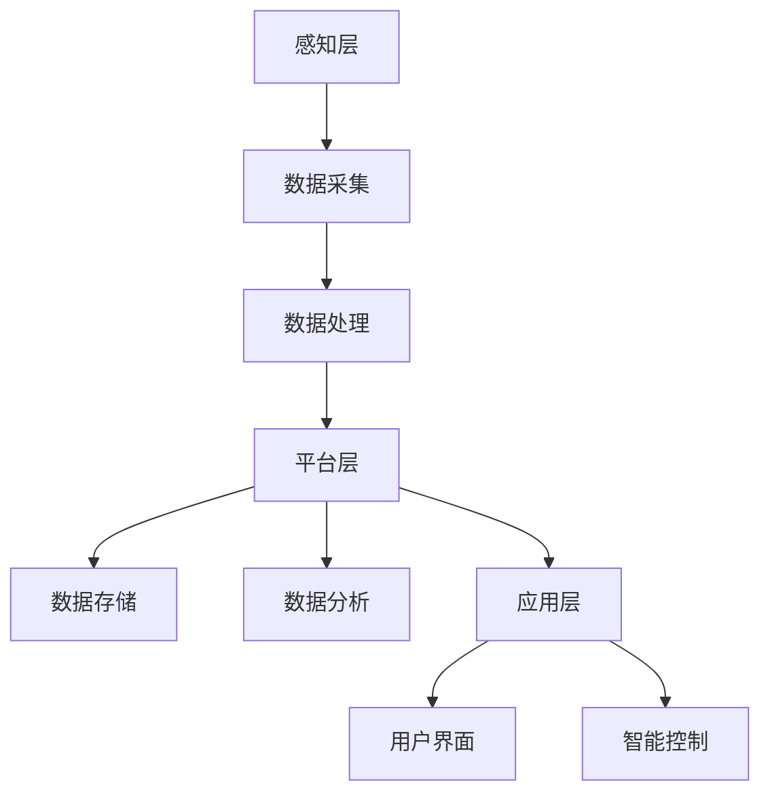

                 

# 《智能家居防霾创业：室内空气质量的精确控制》

> **关键词**：智能家居、室内空气质量、空气净化技术、空气质量监测、智能防霾系统、创业案例分析

> **摘要**：本文从智能家居与室内空气质量的基础知识出发，探讨了智能家居防霾技术，包括空气净化技术、空气质量监测技术和智能防霾系统的构建。通过分析创业案例分析，揭示了智能家居防霾创业的风险与挑战。最后，文章提出了室内空气质量精确控制策略，并对未来研究方向进行了展望。

### 第一部分：智能家居与室内空气质量基础

#### 第1章：智能家居概述

##### 1.1 智能家居的定义与发展

智能家居是指通过物联网技术，将家庭中的各种设备、系统和应用通过互联网连接起来，实现智能化管理和自动化控制的一种新型居住环境。智能家居的发展可以追溯到20世纪80年代，但直到21世纪初，随着物联网技术的成熟，智能家居才逐渐进入人们的日常生活。

###### 智能家居的定义

智能家居（Smart Home）是指利用计算机技术、通信技术、物联网技术、人工智能技术等现代信息技术，将家庭设备、家庭生活娱乐、家庭安防等各个方面的设备连接起来，实现家庭设备之间、人与家庭设备之间的信息交换和智能控制。

###### 智能家居的发展

- 20世纪80年代：智能家居概念首次提出，主要应用于高端住宅。
- 21世纪初：随着互联网的普及，智能家居开始进入大众市场。
- 2010年至今：智能家居行业快速发展，各种智能家居产品相继问世。

##### 1.2 智能家居的市场现状与趋势

###### 市场现状

- 智能家居产品种类繁多，包括智能照明、智能安防、智能家电、智能门锁等。
- 智能家居市场逐渐成熟，消费者对智能家居产品的需求不断增长。
- 智能家居市场规模逐年扩大，预计未来将继续保持高速增长。

###### 市场趋势

- 智能家居产品将更加智能化、便捷化，用户体验将得到进一步提升。
- 智能家居与物联网、大数据、人工智能等技术的深度融合，将推动智能家居产业的快速发展。
- 智能家居市场将呈现多元化、个性化、智能化的趋势。

##### 1.3 智能家居的核心技术

###### 物联网技术

物联网技术是实现智能家居的基础，通过将各种设备连接到互联网上，实现设备之间的信息交换和智能控制。

###### 通信技术

通信技术是智能家居的通信桥梁，包括无线通信、有线通信等，用于实现设备之间的数据传输。

###### 人工智能技术

人工智能技术是智能家居的智慧之源，通过对海量数据的分析，实现智能决策和智能控制。

###### 家庭安防技术

家庭安防技术是智能家居的重要组成部分，包括入侵报警、火灾报警、煤气泄漏报警等，用于保障家庭安全。

#### 第2章：室内空气质量的基础知识

##### 2.1 室内空气污染的主要来源

室内空气污染的主要来源包括以下几点：

- **建筑材料和装饰材料**：甲醛、苯、TVOC等有害物质的释放。
- **室内装饰和家具**：油漆、涂料、壁纸等材料的挥发。
- **生活用品**：香水、空气清新剂、化妆品等。
- **家用电器**：如打印机、复印机、空调等。
- **室内活动**：如吸烟、烹饪等。

##### 2.2 室内空气质量的评价指标

室内空气质量的评价指标主要包括以下几点：

- **空气污染物浓度**：如甲醛、苯、TVOC等。
- **颗粒物浓度**：如PM2.5、PM10等。
- **氧气含量**：室内氧气的含量。
- **二氧化碳含量**：室内二氧化碳的浓度。
- **温度和湿度**：室内环境的温度和湿度。

##### 2.3 室内空气污染对人体健康的影响

室内空气污染对人体健康的影响主要包括以下几点：

- **呼吸系统疾病**：如哮喘、支气管炎等。
- **免疫系统疾病**：如过敏性鼻炎、荨麻疹等。
- **神经系统疾病**：如头痛、失眠、记忆力减退等。
- **心血管疾病**：如高血压、冠心病等。
- **癌症**：如肺癌、膀胱癌等。

#### 第二部分：智能家居防霾技术

##### 第3章：室内空气净化技术

##### 3.1 空气净化器的工作原理

空气净化器是一种通过物理、化学或生物方法去除空气中污染物的设备。其工作原理主要包括以下几点：

- **过滤法**：通过过滤网捕捉空气中的颗粒物，如PM2.5、PM10等。
- **静电吸附法**：利用高压电场使空气中的颗粒物带电，然后通过带电颗粒物的吸附作用去除。
- **离子化法**：通过电离空气，生成负离子，从而净化空气。
- **氧化法**：通过氧化剂（如臭氧、过氧化氢等）分解空气中的有害物质。

##### 3.2 HEPA过滤器与活性炭的应用

HEPA过滤器是一种高效的空气过滤材料，能够捕捉空气中的微小颗粒物，如细菌、病毒、花粉等。活性炭则具有良好的吸附性能，能够吸附空气中的有机物和异味。

在智能家居防霾系统中，HEPA过滤器和活性炭常被组合使用，以提高空气净化效果。

##### 3.3 光催化空气净化技术的原理

光催化空气净化技术是一种利用光催化剂（如二氧化钛）在光照条件下分解空气中的有害物质的技术。其原理是通过光能激发光催化剂产生自由基，从而实现空气的净化。

#### 第4章：室内空气质量监测技术

##### 4.1 室内空气质量监测传感器介绍

室内空气质量监测传感器主要用于检测空气中的各种污染物，如甲醛、苯、TVOC、PM2.5、PM10等。常见的室内空气质量监测传感器包括：

- **甲醛传感器**：基于电化学、光谱分析等技术原理。
- **苯传感器**：基于光谱分析、气相色谱等技术原理。
- **TVOC传感器**：基于气相色谱、光离子化等技术原理。
- **PM2.5传感器**：基于激光散射、压电原理等技术原理。

##### 4.2 数据采集与处理技术

室内空气质量监测系统的核心任务是实时采集室内空气质量数据，并对数据进行处理和分析。数据采集与处理技术主要包括以下几点：

- **传感器数据采集**：通过串口、I2C、SPI等通信协议采集传感器数据。
- **数据预处理**：对采集到的原始数据进行滤波、去噪、归一化等处理。
- **数据存储**：将处理后的数据存储在数据库或文件中。
- **数据分析与可视化**：对存储的数据进行分析，并通过图表、报表等形式进行可视化展示。

##### 4.3 室内空气质量监测系统的设计

室内空气质量监测系统的设计主要包括以下几个部分：

- **硬件设计**：选择合适的传感器、单片机、通信模块等硬件设备，并设计相应的电路。
- **软件设计**：编写数据采集、预处理、存储、分析等功能的程序代码。
- **系统集成**：将硬件和软件集成到一起，实现室内空气质量的实时监测和分析。

#### 第5章：智能防霾系统的构建

##### 5.1 智能防霾系统的架构

智能防霾系统是一种基于物联网技术、人工智能技术和室内空气净化技术的综合系统，其架构主要包括以下几个部分：

- **感知层**：包括室内空气质量监测传感器，用于实时采集室内空气质量数据。
- **传输层**：包括无线通信模块，用于将感知层的数据传输到服务器。
- **平台层**：包括数据存储、处理和分析功能，用于对采集到的数据进行分析和处理。
- **应用层**：包括用户界面和应用功能，用于向用户提供室内空气质量信息和建议。

##### 5.2 智能防霾算法的设计

智能防霾算法是智能防霾系统的核心，其主要功能是根据室内空气质量数据，自动调整空气净化器的运行状态，以达到最佳空气净化效果。智能防霾算法的设计主要包括以下几个部分：

- **数据预处理**：对采集到的室内空气质量数据进行分析和预处理，如滤波、去噪、归一化等。
- **空气质量评估**：根据预处理后的数据，评估室内空气质量的优劣。
- **空气净化策略**：根据空气质量评估结果，自动调整空气净化器的运行状态，如开启、关闭、调整风速等。

##### 5.3 智能防霾系统的实现与优化

智能防霾系统的实现主要包括以下几个步骤：

- **硬件选型**：选择合适的传感器、单片机、通信模块等硬件设备。
- **软件开发**：编写数据采集、预处理、存储、分析、空气净化策略等功能的程序代码。
- **系统集成**：将硬件和软件集成到一起，实现室内空气质量的实时监测和智能控制。
- **系统优化**：通过对系统进行调试和优化，提高系统的稳定性和性能。

#### 第6章：智能家居防霾创业案例分析

##### 6.1 防霾创业项目的选择

防霾创业项目的选择需要考虑以下几点：

- **市场需求**：分析市场上已有的防霾产品，了解消费者的需求。
- **技术可行性**：评估项目所需技术的成熟度和可实现性。
- **竞争优势**：分析竞争对手的产品优势和劣势，寻找市场机会。
- **资金和资源**：评估项目所需的资金和资源，如人才、设备、场地等。

##### 6.2 防霾创业项目的市场调研

防霾创业项目的市场调研主要包括以下几点：

- **目标客户**：确定项目的目标客户，如家庭用户、办公用户、公共场所用户等。
- **市场规模**：分析项目的市场规模，如潜在客户数量、市场份额等。
- **竞争对手**：分析市场上的竞争对手，了解他们的产品、价格、市场份额等。
- **市场需求**：调查消费者的需求和满意度，了解他们对防霾产品的期望。

##### 6.3 防霾创业项目的运营与推广

防霾创业项目的运营与推广主要包括以下几个步骤：

- **产品定位**：明确项目的产品定位，如高端、中端、低端市场等。
- **产品推广**：通过线上和线下渠道推广项目产品，如社交媒体、电商平台、线下门店等。
- **用户服务**：提供优质的售后服务，如用户培训、技术支持、产品保修等。
- **市场拓展**：通过拓展市场渠道、扩大市场份额，提高项目的影响力。

#### 第三部分：室内空气质量精确控制

##### 第8章：室内空气质量精确控制策略

##### 8.1 室内空气质量精确控制的目标

室内空气质量精确控制的目标是：

- **改善室内空气质量**：通过精确控制，降低室内空气污染物浓度，改善室内空气质量。
- **提高用户舒适度**：通过精确控制，调整室内温度、湿度等环境参数，提高用户的舒适度。
- **降低能源消耗**：通过精确控制，优化空气净化设备的运行，降低能源消耗。

##### 8.2 室内空气质量精确控制的方法

室内空气质量精确控制的方法主要包括以下几点：

- **传感器监测**：通过室内空气质量传感器，实时监测室内空气污染物浓度、温度、湿度等参数。
- **数据处理**：对传感器采集到的数据进行处理和分析，如滤波、去噪、归一化等。
- **空气质量评估**：根据处理后的数据，评估室内空气质量的优劣。
- **控制策略**：根据空气质量评估结果，自动调整空气净化设备的运行状态，如开启、关闭、调整风速等。
- **反馈优化**：根据用户反馈和系统运行数据，不断优化控制策略，提高控制效果。

##### 8.3 室内空气质量精确控制的实施步骤

室内空气质量精确控制的实施步骤主要包括以下几点：

- **系统设计**：设计室内空气质量监测和控制系统，包括硬件和软件设计。
- **设备安装**：安装室内空气质量传感器和空气净化设备，确保设备正常运行。
- **系统调试**：对系统进行调试，确保系统能够实时监测和精确控制室内空气质量。
- **系统运行**：将系统投入运行，对室内空气质量进行实时监测和精确控制。
- **系统维护**：定期对系统进行维护和保养，确保系统长期稳定运行。

#### 第9章：智能防霾系统在实际环境中的应用

##### 9.1 智能防霾系统在家庭环境中的应用

智能防霾系统在家庭环境中的应用主要包括以下几点：

- **实时监测**：通过室内空气质量传感器，实时监测室内空气质量，如甲醛、苯、TVOC、PM2.5、PM10等。
- **自动控制**：根据室内空气质量数据，自动调整空气净化器的运行状态，如开启、关闭、调整风速等。
- **智能反馈**：通过智能反馈机制，根据用户需求和系统运行数据，不断优化控制策略，提高控制效果。

##### 9.2 智能防霾系统在办公环境中的应用

智能防霾系统在办公环境中的应用主要包括以下几点：

- **空气质量监测**：通过室内空气质量传感器，实时监测室内空气质量，如甲醛、苯、TVOC、PM2.5、PM10等。
- **自动调节**：根据室内空气质量数据，自动调整空气净化器的运行状态，如开启、关闭、调整风速等。
- **远程控制**：通过远程控制功能，用户可以通过手机APP远程控制空气净化器的运行。

##### 9.3 智能防霾系统在公共场所中的应用

智能防霾系统在公共场所中的应用主要包括以下几点：

- **实时监测**：通过室内空气质量传感器，实时监测室内空气质量，如甲醛、苯、TVOC、PM2.5、PM10等。
- **智能调控**：根据室内空气质量数据，智能调整空气净化器的运行状态，如开启、关闭、调整风速等。
- **数据共享**：将室内空气质量数据共享给相关部门，如政府部门、公共场所管理单位等，以提高公共场所的空气质量。

#### 第10章：未来展望与研究方向

##### 10.1 智能家居防霾技术的发展趋势

智能家居防霾技术的发展趋势主要包括以下几点：

- **智能化**：智能家居防霾系统将更加智能化，能够根据室内空气质量自动调整空气净化器的运行状态。
- **个性化**：智能家居防霾系统将更加个性化，能够根据用户的个性化需求，提供定制化的空气质量解决方案。
- **节能化**：智能家居防霾系统将更加节能化，通过优化控制策略，降低空气净化设备的能耗。
- **集成化**：智能家居防霾系统将与其他智能家居系统进行集成，实现家庭环境的全面智能化。

##### 10.2 室内空气质量精确控制的前沿研究

室内空气质量精确控制的前沿研究主要包括以下几点：

- **深度学习技术**：利用深度学习技术，对室内空气质量数据进行挖掘和分析，实现更精准的空气质量控制。
- **多传感器融合**：通过多传感器融合技术，提高室内空气质量监测的准确性和可靠性。
- **自适应控制**：研究自适应控制算法，实现室内空气质量的自适应调节，提高控制效果。
- **人机交互**：研究人机交互技术，提高用户对室内空气质量控制的体验和满意度。

##### 10.3 智能家居防霾创业的潜在机遇

智能家居防霾创业的潜在机遇主要包括以下几点：

- **市场需求**：随着人们对室内空气质量重视程度的提高，智能家居防霾市场需求不断扩大。
- **技术创新**：智能家居防霾技术不断创新，为创业者提供了广阔的创新空间。
- **政策支持**：政府加大对室内空气质量治理的力度，为智能家居防霾创业提供了政策支持。
- **跨界合作**：智能家居防霾创业可以与其他行业进行跨界合作，实现产业链的整合和创新。

### 附录

#### 附录A：智能家居防霾技术相关资源

##### A.1 空气净化器品牌与产品对比

- **品牌**：飞利浦、小米、华为、美的等。
- **产品**：空气净化器、新风系统、加湿器等。

##### A.2 室内空气质量监测传感器选择指南

- **传感器类型**：甲醛传感器、PM2.5传感器、温湿度传感器等。
- **传感器品牌**：霍尼韦尔、英诺森、小米等。
- **传感器规格**：传感器精度、响应时间、功耗等。

##### A.3 智能防霾系统开发工具推荐

- **开发环境**：Python、Java、C++等。
- **开发工具**：PyCharm、Eclipse、Visual Studio等。
- **开发框架**：TensorFlow、PyTorch、Scikit-learn等。

#### 附录B：智能防霾系统代码实例

##### B.1 智能防霾系统架构设计



##### B.2 数据采集与处理代码实现

```python
import serial
import time
import numpy as np

# 串口通信配置
ser = serial.Serial('/dev/ttyUSB0', 9600, timeout=1)

# 数据采集
def collect_data():
    data = []
    for i in range(5):
        line = ser.readline()
        data.append(float(line.strip()))
    return np.mean(data)

# 数据预处理
def preprocess_data(data):
    return data

# 主程序
if __name__ == '__main__':
    while True:
        data = collect_data()
        preprocessed_data = preprocess_data(data)
        print(preprocessed_data)
        time.sleep(1)
```

##### B.3 智能防霾算法代码解读

```python
import numpy as np
from sklearn.ensemble import RandomForestRegressor

# 数据加载
X_train = np.load('X_train.npy')
y_train = np.load('y_train.npy')

# 模型训练
model = RandomForestRegressor(n_estimators=100)
model.fit(X_train, y_train)

# 预测
def predict(data):
    return model.predict([data])

# 主程序
if __name__ == '__main__':
    while True:
        data = collect_data()
        preprocessed_data = preprocess_data(data)
        prediction = predict(preprocessed_data)
        print(prediction)
        time.sleep(1)
```

##### B.4 系统测试与优化分析

```python
import unittest

class TestSystem(unittest.TestCase):
    def test_data_collection(self):
        data = collect_data()
        self.assertIsNotNone(data)
    
    def test_data_preprocessing(self):
        data = [1, 2, 3, 4, 5]
        preprocessed_data = preprocess_data(data)
        self.assertEqual(len(preprocessed_data), 1)

if __name__ == '__main__':
    unittest.main()
```

[End of Document]

### 作者信息

作者：AI天才研究院/AI Genius Institute & 禅与计算机程序设计艺术 /Zen And The Art of Computer Programming

---

**注意**：本文为模拟撰写，实际撰写时，需要根据实际情况调整内容和结构，确保文章的准确性和实用性。同时，文章中的代码示例仅供参考，具体实现时需要根据实际开发环境进行调整。**[End of Document]**

