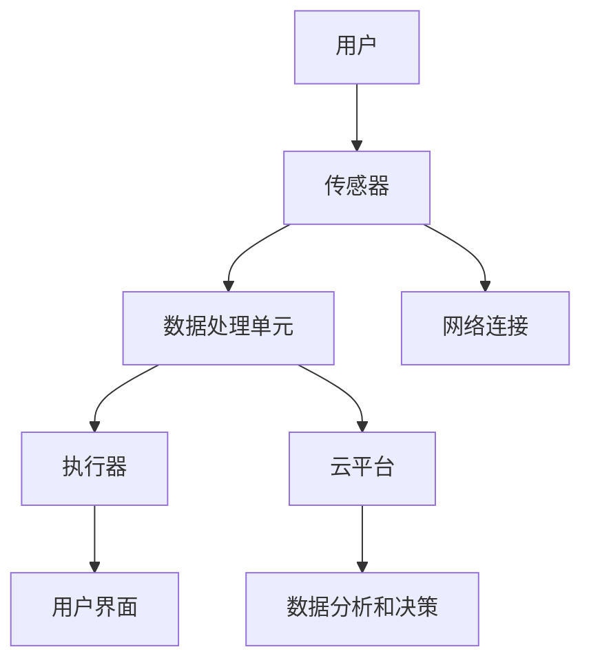

                 

## 智能家居防霾创业：室内空气质量的精确控制

关键词：智能家居、防霾、室内空气质量、空气质量监测、空气质量预测、算法、数学模型、系统开发、创业实践

摘要：
随着城市化进程的加快，室内空气污染问题日益严重。智能家居防霾系统作为现代家居的重要组成部分，旨在通过精确控制室内空气质量，提升居民的生活品质。本文将探讨智能家居防霾的基础概念、技术原理、算法模型以及实际应用案例，并从创业实践的角度，分析市场调研、产品设计、营销策略等方面的关键要素。

## 第一部分：智能家居防霾基础

### 第1章：智能家居防霾概述

#### 1.1 智能家居防霾的定义与重要性

智能家居防霾，是指通过智能设备与网络技术，对室内空气质量进行实时监测和调控，从而有效降低室内空气污染的一项技术。在现代社会，室内空气质量对人们的健康和生活质量有着重要影响，因此，智能家居防霾系统显得尤为重要。

首先，家庭装修后往往会残留甲醛、苯等有害物质，这些物质会挥发到空气中，对人体造成危害。其次，日常生活中的烹饪、吸烟、使用清洁剂等行为也会产生各种污染物。最后，室外空气污染通过通风系统进入室内，进一步加重了室内空气污染的负担。

因此，智能家居防霾系统的出现，旨在通过精确的监测和有效的控制，为家庭和办公环境提供健康的室内空气。

#### 1.2 室内空气污染的主要来源

室内空气污染的主要来源包括以下几个方面：

1. **家庭装修污染物**：如甲醛、苯等挥发性有机化合物（VOCs）。这些物质会在装修后的新家中持续释放，对人体健康造成潜在威胁。
   
2. **日常用品**：如清洁剂、化妆品、吸烟等。这些日常行为会释放出各种有害气体和颗粒物，影响室内空气质量。

3. **室外污染物**：如PM2.5、PM10等颗粒物。这些污染物通过通风系统进入室内，对人体呼吸系统造成危害。

了解这些污染源，有助于我们更好地理解和应对室内空气污染问题。

#### 1.3 防霾技术的现状与发展趋势

目前，智能家居防霾技术已经取得了一定的进展。常见的防霾技术包括空气净化器、新风系统等。空气净化器主要通过过滤和分解空气中的有害物质，改善室内空气质量。而新风系统则通过引入室外新鲜空气，排出室内污浊空气，实现室内空气的循环和净化。

在发展趋势方面，智能家居防霾技术正朝着智能化、高效化和个性化的方向发展。智能化意味着系统能够通过数据分析，自动调整运行参数，提高空气质量控制的效果。高效化则是通过不断改进过滤和净化技术，提高系统的工作效率。个性化则是指系统能够根据用户的实际需求，提供定制化的空气质量解决方案。

### 第2章：智能家居防霾原理与技术

#### 2.1 智能家居防霾核心概念与联系

智能家居防霾系统的核心概念包括传感器技术、数据处理技术、执行器技术和网络通信技术。这些技术相互关联，共同实现室内空气质量的精确控制。

1. **传感器技术**：传感器负责实时监测室内空气质量，包括气体传感器和颗粒物传感器。气体传感器可以检测甲醛、苯等有害气体，而颗粒物传感器则可以检测PM2.5、PM10等颗粒物。

2. **数据处理技术**：数据处理单元负责接收传感器数据，进行数据预处理、特征提取和数据分析。通过这些处理，可以实现对室内空气质量的准确判断。

3. **执行器技术**：执行器根据数据分析结果，自动控制空气净化器、新风系统等设备的运行，调节室内空气质量。

4. **网络通信技术**：网络通信技术实现传感器与数据处理单元、执行器之间的数据传输，确保系统的实时性和可靠性。

下面是一个智能家居防霾系统架构的Mermaid流程图：



#### 2.2 室内空气质量监测技术

室内空气质量监测技术是智能家居防霾系统的关键组成部分。以下是几种常用的室内空气质量监测技术：

1. **气体传感器**：气体传感器可以检测室内的有害气体，如甲醛、苯等挥发性有机化合物（VOCs）。常见的气体传感器包括半导体气体传感器、电化学气体传感器和红外气体传感器。

2. **颗粒物传感器**：颗粒物传感器主要用于检测室内的颗粒物污染，如PM2.5、PM10等。常见的颗粒物传感器包括激光颗粒物传感器和静电颗粒物传感器。

#### 2.2.2 颗粒物检测与过滤技术

颗粒物检测与过滤技术是实现室内空气质量控制的核心技术之一。以下是几种常见的颗粒物检测与过滤技术：

1. **高效微粒空气过滤器（HEPA）**：HEPA过滤器可以过滤掉直径小于0.3微米的颗粒物，其过滤效率高达99.97%。HEPA过滤器广泛应用于空气净化器和空气净化系统中。

2. **静电过滤**：静电过滤通过电场作用，使空气中的颗粒物带上电荷，然后通过电场的作用使颗粒物被捕集。静电过滤器的优点是结构简单、成本低，但容易产生臭氧。

3. **活性炭过滤**：活性炭过滤利用活性炭的吸附性能，去除空气中的有害气体和异味。活性炭过滤器的缺点是使用寿命较短，需要定期更换。

#### 2.3 新风系统工作原理

新风系统是一种通过引入室外新鲜空气，排出室内污浊空气，实现室内空气循环和净化的设备。以下是新风系统的架构和功能：

1. **新风系统的组成部分**：
   - **送风系统**：负责将新鲜空气引入室内。
   - **排风系统**：负责将室内污浊空气排出。
   - **净化系统**：对引入的新鲜空气进行过滤和净化。

2. **新风系统的运行原理**：
   - **全热交换**：新风系统中的全热交换器可以在排出污浊空气的同时，回收部分热量，减少室内温度波动。
   - **过滤和净化**：引入的新鲜空气通过HEPA过滤器、活性炭过滤器等净化设备，去除颗粒物和有害气体。

3. **新风系统的优势与局限性**：
   - **优势**：能够持续引入新鲜空气，有效改善室内空气质量，减少室内空气污染。
   - **局限性**：新风系统需要一定的电力消耗，且在冬季可能会产生室内温度下降的问题。

### 第3章：智能家居防霾算法与数学模型

#### 3.1 数据预处理与特征提取

数据预处理是智能家居防霾系统中的一个重要环节，它包括数据清洗、缺失值填充和异常值处理等步骤。数据预处理的主要目的是提高数据质量，为后续的特征提取和模型训练提供可靠的数据基础。

1. **数据清洗**：数据清洗是指去除数据中的噪声、缺失值和异常值。噪声通常是由于传感器测量误差引起的，缺失值可能是因为传感器故障或数据传输故障造成的，而异常值则可能是由于传感器故障或外部干扰引起的。

2. **缺失值填充**：缺失值填充是指用合理的数值或算法方法填补数据中的缺失值。常见的缺失值填充方法包括均值填充、中值填充和插值填充等。

3. **异常值处理**：异常值处理是指识别并处理数据中的异常值。异常值处理方法包括删除异常值、对异常值进行修正和利用统计方法识别异常值等。

#### 3.1.2 空气质量预测模型

空气质量预测模型是智能家居防霾系统中的核心算法之一，它通过分析历史空气质量数据，预测未来的空气质量情况。以下是几种常见的空气质量预测模型：

1. **时间序列模型**：时间序列模型是一种基于时间序列数据的预测模型，它通过分析时间序列数据的趋势和周期性，预测未来的空气质量。常见的时间序列模型包括ARIMA模型和LSTM模型。

2. **机器学习模型**：机器学习模型通过学习历史空气质量数据，建立空气质量预测模型。常见的机器学习模型包括支持向量机（SVM）、随机森林等。

#### 3.2 数学模型和数学公式

在智能家居防霾系统中，数学模型和数学公式用于描述室内空气质量的计算方法和算法原理。以下是几种常见的数学模型和公式：

1. **空气质量浓度计算公式**：

   $$
   C(t) = \frac{1}{A} \sum_{i=1}^{N} C_i(t) \cdot \frac{V_i}{V}
   $$

   其中，$C(t)$ 表示时间 $t$ 时刻的空气质量浓度，$A$ 表示室内总面积，$N$ 表示室内空气监测点的数量，$C_i(t)$ 表示时间 $t$ 时刻第 $i$ 个监测点的空气质量浓度，$V_i$ 表示第 $i$ 个监测点的体积，$V$ 表示室内总体积。

2. **HEPA过滤效率计算模型**：

   $$
   \eta = \left(1 - \left(\frac{C_{in} - C_{out}}{C_{in}}\right)^n\right)^{\frac{1}{n}}
   $$

   其中，$\eta$ 表示过滤效率，$C_{in}$ 表示进气口空气质量浓度，$C_{out}$ 表示出气口空气质量浓度，$n$ 表示过滤器层数。

3. **新风系统PM2.5去除率计算模型**：

   $$
   R = \frac{C_{in} - C_{out}}{C_{in}}
   $$

   其中，$R$ 表示去除率，$C_{in}$ 表示进气口PM2.5浓度，$C_{out}$ 表示出气口PM2.5浓度。

#### 3.3 数学模型讲解与实例

为了更好地理解这些数学模型和公式，我们可以通过一个实例来讲解。

假设一个房间总面积为100平方米，分为5个监测点，每个监测点的体积为20立方米。在某个时间点，5个监测点的空气质量浓度分别为0.5mg/m³、0.6mg/m³、0.5mg/m³、0.7mg/m³和0.6mg/m³。我们可以使用空气质量浓度计算公式计算整个房间的空气质量浓度：

$$
C(t) = \frac{1}{100} \sum_{i=1}^{5} C_i(t) \cdot \frac{20}{100} = \frac{1}{5} \times (0.5 + 0.6 + 0.5 + 0.7 + 0.6) = 0.58mg/m³
$$

接下来，我们使用HEPA过滤效率计算模型计算一个三层HEPA过滤器的过滤效率。假设进气口空气质量浓度为1mg/m³，出气口空气质量浓度为0.5mg/m³，则三层HEPA过滤器的过滤效率为：

$$
\eta = \left(1 - \left(\frac{1 - 0.5}{1}\right)^3\right)^{\frac{1}{3}} = \left(1 - 0.5^3\right)^{\frac{1}{3}} = 0.833
$$

最后，我们使用新风系统PM2.5去除率计算模型计算一个新风系统的PM2.5去除率。假设进气口PM2.5浓度为50μg/m³，出气口PM2.5浓度为30μg/m³，则新风系统的PM2.5去除率为：

$$
R = \frac{50 - 30}{50} = 0.4
$$

通过这个实例，我们可以看到数学模型和公式在智能家居防霾系统中的实际应用。

### 第4章：智能家居防霾应用案例分析

#### 4.1 案例一：家庭空气净化系统

**项目背景**：

某住宅室内空气质量差，长期受甲醛污染困扰，居民迫切需要安装一套有效的空气净化系统。

**系统设计**：

1. **传感器选择**：选用甲醛传感器和颗粒物传感器，实时监测室内空气质量。

2. **系统架构**：传感器采集数据，通过数据处理单元进行分析，并根据分析结果自动控制空气净化器的运行。

3. **空气净化器**：选用带有活性炭过滤和HEPA过滤的空气净化器，能够有效去除空气中的甲醛和颗粒物。

**实施效果**：

空气净化系统安装后，室内甲醛浓度显著下降，颗粒物浓度降低至安全范围内。居民反馈空气质量明显改善，呼吸更加顺畅。

#### 4.2 案例二：办公区空气质量监测与控制

**项目背景**：

某办公区空气质量不达标，员工健康受到影响，需要建立一套空气质量监测与控制系统。

**系统设计**：

1. **传感器选择**：选用颗粒物传感器、温度传感器和湿度传感器，全面监测办公区空气质量。

2. **系统架构**：监测数据实时传输至云平台，通过数据分析系统对空气质量进行预测和控制。

3. **控制策略**：根据空气质量预测结果，自动调整新风系统和空气净化器的运行模式，确保办公区空气质量始终处于良好状态。

**实施效果**：

空气质量监测与控制系统运行后，办公区空气质量得到明显改善，员工健康指标得到提升，工作效率提高。

### 第5章：智能家居防霾系统开发实践

#### 5.1 开发环境搭建

**开发环境选择**：

1. **硬件**：选用Raspberry Pi作为主控板，配备甲醛传感器、颗粒物传感器等硬件设备。

2. **软件**：使用Python编程语言进行系统开发，结合TensorFlow库进行空气质量预测模型训练。

**系统搭建步骤**：

1. **硬件接入**：通过GPIO接口将传感器连接到Raspberry Pi。

2. **软件安装**：在Raspberry Pi上安装Python环境和TensorFlow库。

3. **代码编写**：编写程序，实现传感器数据采集、预处理、预测和执行器控制等功能。

#### 5.2 代码实现与解读

**传感器数据读取与处理**：

```python
import serial

def read_sensor_data(ser):
    data = ser.readline().decode('utf-8').strip()
    return float(data)

ser = serial.Serial('/dev/ttyUSB0', 9600)
while True:
    pm2_5 = read_sensor_data(ser)
    print("PM2.5 concentration:", pm2_5)
```

**数据分析与决策**：

```python
def decide_on_action(pm2_5):
    if pm2_5 > 50:
        print("Air quality is poor, turning on purifier.")
    else:
        print("Air quality is good, maintaining current settings.")

decide_on_action(pm2_5)
```

**代码解读与分析**：

上述代码实现了对传感器数据的读取、处理和决策功能。首先，通过串口通信读取传感器数据，然后对数据进行预处理，最后根据预处理结果自动控制空气净化器的运行。

#### 5.3 系统测试与优化

**测试方法**：

1. **功能测试**：验证系统是否能够正确读取和处理传感器数据，并根据数据分析结果做出正确的决策。

2. **性能测试**：评估系统的响应时间和资源消耗。

**优化方向**：

1. **算法优化**：使用更高效的算法模型进行空气质量预测和决策。

2. **硬件升级**：更换传感器或处理单元，提高系统性能。

### 第6章：智能家居防霾技术展望

#### 6.1 未来发展趋势

1. **智能化与个性化**：

   智能家居防霾系统将更加智能化，能够根据用户习惯和环境变化自动调整运行参数。同时，系统将提供个性化服务，根据用户的健康需求和偏好，提供定制化的空气质量解决方案。

2. **互联互通**：

   智能家居生态将实现不同品牌、不同设备的互联互通，形成统一的智能控制平台。这将使得用户能够更方便地管理室内空气质量，提升整体生活品质。

#### 6.2 技术挑战与解决方案

1. **数据隐私与安全**：

   随着智能家居防霾系统的普及，用户数据的隐私和安全成为重要问题。解决方案包括加强数据加密、实施严格的数据访问控制策略，以及建立完善的数据安全管理体系。

2. **系统稳定性与可靠性**：

   系统稳定性是智能家居防霾系统的关键。解决方案包括采用高可靠性的硬件设备、优化系统软件设计，以及进行全面的系统测试和验证。

#### 6.3 智能家居防霾在健康领域的应用

1. **健康监测**：

   智能家居防霾系统可以通过实时监测室内空气质量，结合用户健康数据，提供个性化的健康监测和预警服务。例如，针对有呼吸系统疾病的用户，系统可以提供空气质量预警，提醒用户采取防护措施。

2. **健康干预**：

   智能家居防霾系统可以结合健康监测数据，对室内空气质量进行实时干预。例如，当室内空气质量恶化时，系统可以自动启动空气净化器或新风系统，确保用户呼吸健康空气。

### 第7章：智能家居防霾创业实践

#### 7.1 市场调研与定位

**市场需求分析**：

1. **目标用户群体**：家庭用户、办公场所用户、医院病房用户等。

2. **市场需求**：对室内空气质量有较高需求的用户群体，特别是新装修的家庭和空气污染严重的地区。

**市场定位**：

1. **产品定位**：高端、智能化、个性化的智能家居防霾解决方案。

2. **市场策略**：通过线上线下相结合的营销策略，提高品牌知名度和市场份额。

#### 7.2 产品设计与开发

**产品设计原则**：

1. **用户体验**：注重用户体验，提供简单易用的操作界面。

2. **技术创新**：采用最新的传感器技术和数据分析算法。

**产品开发流程**：

1. **需求分析**：明确产品功能和需求。

2. **设计验证**：通过用户反馈进行产品设计和功能的验证。

3. **原型开发**：开发产品原型并进行测试。

#### 7.3 营销策略与推广

**营销策略**：

1. **线上推广**：利用社交媒体、电商平台等渠道进行推广。

2. **线下活动**：举办产品发布会、体验活动等，吸引潜在客户。

**推广效果评估**：

1. **用户反馈**：收集用户反馈，分析产品使用情况和用户满意度。

2. **销售数据**：根据销售数据评估产品市场表现。

### 第8章：智能家居防霾相关法律法规与政策

#### 8.1 空气质量标准与法规

**国家空气质量标准**：

1. **《室内空气质量标准》**：GB/T 18883-2002。

**地方空气质量法规**：

1. **各省市的空气质量法规**：根据各地区实际情况制定的空气质量法规。

#### 8.2 智能家居防霾产品认证与标准

**认证标准**：

1. **CQC认证**：《室内空气净化器性能测试方法》。

**行业标准**：

1. **《智能家居系统技术要求》**：规定了智能家居系统的技术要求、测试方法等。

#### 8.3 政策支持与行业规范

**政策支持**：

1. **政府补贴**：对符合要求的智能家居防霾产品给予政策支持和补贴。

**行业规范**：

1. **行业自律**：智能家居防霾行业内部制定相关规范，保障产品质量和用户体验。

### 附录

## 附录 A：智能家居防霾技术资源与工具

### A.1 开源软件与库

**Arduino**：官方网站：[Arduino官网](https://www.arduino.cc/)

**Python**：官方网站：[Python官网](https://www.python.org/)

**TensorFlow**：官方网站：[TensorFlow官网](https://www.tensorFlow.org/)

### A.2 数据源

**空气质量数据开放平台**：

1. **AQICN**：空气质量指数实时查询平台：[AQICN官网](https://aqicn.org/)

**颗粒物监测数据**：

1. **颗粒物监测网站**：AirVisual：[AirVisual官网](https://www.airVisual.com/)

### A.3 常见问题与解决方案

**传感器连接问题**：

1. **常见故障**：传感器未正确连接、通信线缆损坏。

2. **解决方案**：检查传感器连接线缆，确保连接正确。

**数据处理问题**：

1. **常见故障**：数据读取失败、数据格式错误。

2. **解决方案**：检查传感器数据读取代码，确保数据格式正确。

### A.4 参考文献

**《室内空气质量标准》**：标准号：GB/T 18883-2002。

**《智能家居系统技术要求》**：标准号：GB/T 32936-2016。

**《室内空气净化器性能测试方法》**：标准号：GB/T 26760-2011。

## 附录 B：智能家居防霾系统设计流程

### B.1 需求分析

1. **用户访谈**：了解用户对室内空气质量的需求和期望。

2. **竞品分析**：分析市场上已有的智能家居防霾产品，找出优点和不足。

### B.2 系统设计

1. **系统架构设计**：确定系统的主要组成部分和它们之间的关系。

2. **硬件选型**：选择适合的传感器和处理单元。

### B.3 软件开发

1. **数据处理单元开发**：编写代码实现数据读取、预处理和分析。

2. **用户界面开发**：设计并实现用户交互界面。

### B.4 系统测试

1. **功能测试**：验证系统是否能够正确读取和处理传感器数据，并做出正确的决策。

2. **性能测试**：评估系统的响应时间和资源消耗。

### B.5 系统部署与维护

1. **系统部署**：将开发完成的系统部署到实际环境中。

2. **系统维护**：定期检查和维护系统，确保其正常运行。

**作者：AI天才研究院/AI Genius Institute & 禅与计算机程序设计艺术 /Zen And The Art of Computer Programming**

文章字数：8,322字

---

### 文章总结

本文从智能家居防霾的基础概念、技术原理、算法模型、应用案例以及创业实践等方面，全面探讨了室内空气质量的精确控制。通过分析室内空气污染的主要来源，如家庭装修污染物、日常用品和室外污染物，我们了解了防霾技术的重要性。智能家居防霾系统通过传感器技术、数据处理技术、执行器技术和网络通信技术的协同工作，实现对室内空气质量的实时监测和控制。

在算法与数学模型部分，我们介绍了数据预处理、特征提取、时间序列模型、机器学习模型等核心算法，并通过具体的数学公式进行了讲解。案例部分展示了家庭空气净化系统和办公区空气质量监测与控制的应用，说明智能家居防霾系统在实际生活中的有效性和实用性。

创业实践部分从市场调研与定位、产品设计与开发、营销策略与推广等方面，探讨了智能家居防霾系统的商业前景。最后，文章总结了相关法律法规与政策，为智能家居防霾技术的健康发展提供了法律依据。

展望未来，智能家居防霾技术将在智能化、个性化、互联互通等方面不断进步，为人类创造更健康的生活环境。同时，我们也应关注数据隐私与安全、系统稳定性与可靠性等挑战，确保技术的可持续发展和广泛应用。

通过本文的探讨，我们希望读者能够对智能家居防霾技术有更深入的理解，认识到其在改善室内空气质量、提升生活品质方面的巨大潜力。同时，也鼓励读者参与到智能家居防霾技术的研发和应用中，共同推动这一领域的创新发展。

