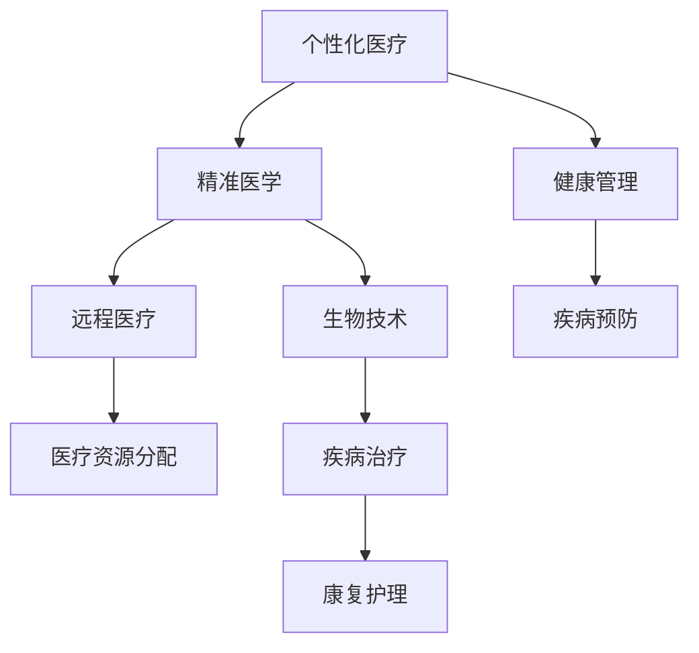
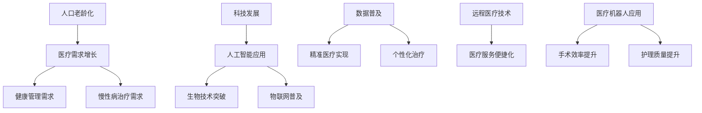
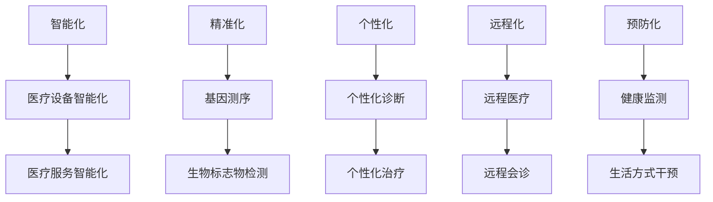

                 

# 《未来医疗：2050年的健康管理与疾病治疗》

> **关键词**：未来医疗、健康管理、疾病治疗、人工智能、生物技术、个性化医疗、精准医学

> **摘要**：本文旨在探讨2050年未来医疗的发展趋势和关键技术创新。通过对健康管理、预防医学、慢性病管理、疾病治疗等方面的深入分析，本文揭示了未来医疗在个性化、智能化、精准化方面的重大变革。文章还探讨了社会挑战和伦理问题，并展望了未来医疗的发展前景。

## 目录大纲

1. **未来医疗概述**  
   - **第1章**：未来医疗背景与发展趋势
     - **1.1 未来医疗的定义与影响**
     - **1.2 2050年的社会环境与技术进步**
     - **1.3 未来医疗的发展方向
2. **技术进步对未来医疗的影响**  
   - **第2章**：技术进步对未来医疗的影响
     - **2.1 人工智能在医疗领域的应用**
     - **2.2 生物技术在医疗领域的突破**
     - **2.3 医疗机器人与远程医疗
3. **健康管理**  
   - **第3章**：个性化健康管理
     - **3.1 个性化健康数据分析**
     - **3.2 基因测序与健康风险评估**
     - **3.3 生活方式干预与健康促进
4. **预防医学与疾病早期筛查**  
   - **第4章**：预防医学与疾病早期筛查
     - **4.1 预防医学的实践与理论**
     - **4.2 早期癌症筛查技术**
     - **4.3 心血管疾病的预防与控制
5. **慢性病管理**  
   - **第5章**：慢性病管理
     - **5.1 糖尿病的治疗与控制**
     - **5.2 高血压的管理与治疗**
     - **5.3 心脏病患者的康复与护理
6. **疾病治疗**  
   - **第6章**：疾病治疗
     - **6.1 精准医学与个体化治疗**
     - **6.2 基因治疗与细胞治疗**
     - **6.3 个性化药物开发与使用
7. **新型治疗方法与设备**  
   - **第7章**：新型治疗方法与设备
     - **7.1 3D打印与生物制造**
     - **7.2 纳米技术与药物递送**
     - **7.3 生物电子学与智能医疗器械
8. **未来医疗服务的变革**  
   - **第8章**：未来医疗服务的变革
     - **8.1 医疗服务的数字化与网络化**
     - **8.2 智能医疗系统的构建与运营**
     - **8.3 医疗服务模式的创新与变革
9. **社会挑战与伦理问题**  
   - **第9章**：社会挑战与伦理问题
     - **9.1 未来医疗的资源分配**
     - **9.2 医疗服务的可及性与公平性**
     - **9.3 医疗保险与医疗费用**
10. **伦理问题**  
   - **第10章**：伦理问题
     - **10.1 人类基因编辑的伦理问题**
     - **10.2 人工智能在医疗中的伦理争议**
     - **10.3 医疗隐私与数据安全
11. **案例研究与未来展望**  
   - **第11章**：案例研究与未来展望
     - **11.1 某癌症研究中心的未来医疗实践**
     - **11.2 某智能医疗设备公司的创新产品**
     - **11.3 某医疗信息技术公司的平台服务
12. **未来展望**  
   - **第12章**：未来展望
     - **12.1 2050年的医疗环境预测**
     - **12.2 未来医疗的创新趋势**
     - **12.3 我们该如何准备
附录

### 附录 A：未来医疗相关技术与应用概述

本附录将对未来医疗相关技术进行概述，包括人工智能、生物技术、医疗机器人等。

#### A.1 人工智能在医疗中的应用

人工智能在医疗中的应用主要包括疾病诊断、治疗方案制定、药物研发等。

- **疾病诊断**：通过大数据分析和机器学习算法，人工智能可以提高疾病诊断的准确性和效率。
- **治疗方案制定**：人工智能可以根据患者的病史、基因等信息，提供个性化的治疗方案。
- **药物研发**：人工智能可以帮助科学家发现新药靶点，加速新药的研发进程。

#### A.2 生物技术在医疗领域的突破

生物技术在医疗领域的突破主要体现在基因编辑、细胞治疗、组织工程等方面。

- **基因编辑**：通过基因编辑技术，可以精确地修改人类基因，治疗遗传性疾病。
- **细胞治疗**：细胞治疗利用患者自身的细胞进行疾病治疗，如干细胞治疗。
- **组织工程**：通过生物制造技术，可以制造出人造器官，解决器官移植的短缺问题。

#### A.3 医疗机器人与远程医疗

医疗机器人和远程医疗技术的发展，将改变医疗服务的方式。

- **医疗机器人**：医疗机器人可以在手术、护理、康复等方面发挥重要作用，提高医疗服务的效率和质量。
- **远程医疗**：远程医疗技术使得医生可以通过网络为患者提供医疗服务，解决医疗资源分配不均的问题。

### 未来医疗的核心概念与联系

未来医疗的核心概念包括个性化医疗、精准医学、远程医疗、生物技术等。这些概念之间存在密切的联系，共同构建了未来医疗的生态系统。

1. **个性化医疗**：基于患者的基因、环境、生活习惯等信息，提供个性化的诊断和治疗方案。个性化医疗是未来医疗的基础。

2. **精准医学**：通过基因组学、蛋白质组学等技术，对疾病进行精确诊断和个体化治疗。精准医学是未来医疗的发展方向。

3. **远程医疗**：通过互联网和移动设备，实现医疗服务的远程化和全球化。远程医疗是解决医疗资源分配不均的重要手段。

4. **生物技术**：包括基因编辑、细胞治疗、组织工程等技术，为未来医疗提供了强大的技术支持。生物技术是未来医疗的核心动力。

下面是一个 Mermaid 流程图，展示了这些核心概念之间的联系：



### 2050年的社会环境与技术进步

在2050年，社会环境和技术进步将对医疗领域产生深远影响。以下是可能的社会环境和技术进步趋势：

1. **人口老龄化**：随着人口老龄化趋势加剧，医疗需求将不断增长。老年人对健康管理和慢性病治疗的需求将更加突出。

2. **科技发展**：人工智能、生物技术、物联网等技术的快速进步，将为医疗领域带来新的变革。这些技术将推动医疗服务的个性化和智能化。

3. **数据普及**：大数据和云计算技术的普及，将使医疗数据的收集、存储和分析变得更加便捷和高效。这将有助于实现精准医疗和个性化治疗。

4. **远程医疗**：远程医疗技术的发展，将使医疗服务更加便捷和高效。医生可以通过网络为患者提供诊断、治疗和康复服务，解决医疗资源分配不均的问题。

5. **医疗机器人**：医疗机器人的应用将逐渐普及，为手术、护理和康复提供技术支持。医疗机器人将提高医疗服务的效率和质量。

下面是一个 Mermaid 流�程图，展示了2050年社会环境和技术进步对医疗领域的影响：



### 未来医疗的发展方向

未来医疗的发展方向主要包括以下几个方面：

1. **智能化**：人工智能、物联网、大数据等技术的应用，将使医疗服务更加智能化。医生可以通过智能设备实时监控患者的健康状态，提供个性化的诊断和治疗建议。

2. **精准化**：精准医学的发展，将使疾病诊断和治疗更加精确。通过对患者的基因、生物标志物等数据进行深度分析，可以实现疾病的早期诊断和精准治疗。

3. **个性化**：个性化医疗的发展，将使医疗服务更加个性化和人性化。根据患者的具体情况进行诊断和治疗，提高治疗效果和患者满意度。

4. **远程化**：远程医疗技术的发展，将使医疗服务更加便捷和高效。医生可以通过网络为患者提供诊断、治疗和康复服务，解决医疗资源分配不均的问题。

5. **预防化**：预防医学的发展，将使疾病预防更加重要。通过健康监测、生活方式干预等手段，可以降低疾病的发生风险，提高生活质量。

下面是一个 Mermaid 流程图，展示了未来医疗的发展方向：



### 技术进步对未来医疗的影响

技术进步对未来医疗的影响是全方位的，涵盖了诊断、治疗、药物研发、医疗服务等多个方面。以下将详细探讨人工智能、生物技术、医疗机器人等技术在医疗领域的应用及其影响。

#### 2.1 人工智能在医疗领域的应用

人工智能（AI）正迅速成为医疗领域的核心技术。其在医疗诊断、治疗方案制定、药物研发和医疗管理等方面的应用，极大地提升了医疗服务的效率和准确性。

- **疾病诊断**：AI可以通过分析大量的医疗数据，识别出疾病的相关模式，辅助医生进行疾病诊断。例如，AI可以在短时间内分析大量影像数据，如X光片、CT扫描和MRI，识别出早期病变，提高诊断的准确性和速度。

  **伪代码**：
  ```python
  def diagnose_patient(imaging_data):
      # 使用深度学习模型分析影像数据
      diagnosis = deep_learning_model.predict(imaging_data)
      return diagnosis
  ```

- **治疗方案制定**：AI可以根据患者的病史、基因信息和生活习惯，为患者制定个性化的治疗方案。例如，AI可以分析患者的基因组数据，预测其对不同药物的反应，从而选择最佳的治疗方案。

  **伪代码**：
  ```python
  def personalize_treatment(patient_data):
      # 分析患者的基因组数据
      response_pred = genetic_model.predict(patient_data)
      # 根据药物反应预测选择治疗方案
      treatment_plan = select_best_treatment(response_pred)
      return treatment_plan
  ```

- **药物研发**：AI可以帮助科学家快速识别出潜在的药物靶点，加速新药的研发进程。例如，AI可以通过分析大量的生物化学数据，预测哪些分子可能与疾病相关，从而指导药物研发的方向。

  **伪代码**：
  ```python
  def identify_drug_target(disease_data):
      # 使用机器学习模型分析疾病数据
      potential_targets = machine_learning_model.predict(disease_data)
      return potential_targets
  ```

- **医疗管理**：AI可以用于医疗资源的优化分配，提高医疗服务的效率。例如，AI可以通过分析医院的运营数据，优化手术排班、床位分配等，减少患者的等待时间，提高医疗服务质量。

  **伪代码**：
  ```python
  def optimize_resource_allocation(operations_data):
      # 分析医院运营数据
      optimal_scheduling = resource_allocation_model.optimize(operations_data)
      return optimal_scheduling
  ```

#### 2.2 生物技术在医疗领域的突破

生物技术的突破，特别是基因编辑和细胞治疗技术的发展，为医疗领域带来了革命性的变化。

- **基因编辑**：基因编辑技术，如CRISPR-Cas9，可以精确地修改人类基因，治疗遗传性疾病。例如，通过基因编辑，可以修复导致遗传性视网膜疾病的基因突变，使患者重见光明。

  **伪代码**：
  ```python
  def edit_genome(disease_gene, healthy_gene):
      # 使用CRISPR技术编辑基因
      edited_gene = gene_editor.edit(disease_gene, healthy_gene)
      return edited_gene
  ```

- **细胞治疗**：细胞治疗利用患者自身的细胞进行疾病治疗。例如，通过干细胞技术，可以培养出新的心脏细胞，修复心脏病患者的心脏功能。

  **伪代码**：
  ```python
  def cell_treatment(patient_cells):
      # 使用干细胞技术培养新细胞
      new_cells = stem_cell_treatment.culture(patient_cells)
      return new_cells
  ```

- **组织工程**：组织工程技术通过生物制造技术，可以制造出人造器官，为器官移植提供新的可能性。例如，通过3D打印技术，可以制造出人造皮肤、骨骼等器官，解决器官短缺问题。

  **伪代码**：
  ```python
  def create_artificial_organ(organ_blueprint):
      # 使用3D打印技术制造人造器官
      artificial_organ = 3d_printer.print(organ_blueprint)
      return artificial_organ
  ```

#### 2.3 医疗机器人与远程医疗

医疗机器人和远程医疗技术的发展，正在改变医疗服务的方式。

- **医疗机器人**：医疗机器人可以在手术、护理、康复等方面发挥重要作用，提高医疗服务的效率和质量。例如，手术机器人可以进行微创手术，提高手术的准确性和安全性。

  **伪代码**：
  ```python
  def robotic_surgery(patient_state, surgical_plan):
      # 使用手术机器人进行手术
      surgical_outcome = robot_surgeon.operate(patient_state, surgical_plan)
      return surgical_outcome
  ```

- **远程医疗**：远程医疗技术使得医生可以通过网络为患者提供医疗服务，解决医疗资源分配不均的问题。例如，医生可以通过远程视频会议为偏远地区的患者提供诊断和治疗建议。

  **伪代码**：
  ```python
  def remote_diagnosis(patientSymptoms):
      # 通过远程视频会议诊断患者
      diagnosis = remote_Doctor.diagnose(patientSymptoms)
      return diagnosis
  ```

### 结论

技术进步对未来医疗的影响是深远且多方面的。人工智能、生物技术和医疗机器人等前沿技术的应用，将使医疗服务更加智能化、个性化和高效化。通过这些技术，我们有望实现疾病的早期诊断、精准治疗和个性化康复，从而提高患者的治疗效果和生活质量。

### 个性化健康管理

个性化健康管理是未来医疗的重要组成部分，它旨在通过数据分析和个性化干预，提升个体的健康水平和生活质量。以下将从个性化健康数据分析、基因测序与健康风险评估、生活方式干预与健康促进三个方面进行探讨。

#### 3.1 个性化健康数据分析

个性化健康数据分析是基于大数据技术和人工智能算法，对个体的健康数据进行全面分析，以提供个性化的健康建议和服务。这些数据可以包括生物标志物、生活方式、遗传信息等。

- **生物标志物数据分析**：生物标志物是反映个体生理和病理状态的分子指标。通过对血液、尿液等体液中生物标志物的检测，可以识别出潜在的疾病风险。例如，血液中的高敏C反应蛋白（hs-CRP）可以用来预测心血管疾病的风险。

  **伪代码**：
  ```python
  def analyze_bioMarkers(liquid_sample):
      # 分析生物标志物数据
      risk_factors = bioMarker_analyzer.analyze(liquid_sample)
      return risk_factors
  ```

- **生活方式数据分析**：生活方式数据包括饮食、运动、睡眠等。通过对这些数据的分析，可以发现不良生活方式对健康的影响，并制定个性化的生活方式改善计划。

  **伪代码**：
  ```python
  def analyze_lifestyle_data(lifestyle_data):
      # 分析生活方式数据
      health_impact = lifestyle_analyzer.evaluate(lifestyle_data)
      return health_impact
  ```

- **遗传信息分析**：基因测序技术的发展，使得我们可以获取个体的基因组信息。通过对遗传信息的分析，可以预测个体患病的风险，并提供个性化的预防建议。

  **伪代码**：
  ```python
  def analyze_genetic_data(genome_sequence):
      # 分析遗传数据
      genetic_risks = genetic_analyzer.predict_risks(genome_sequence)
      return genetic_risks
  ```

#### 3.2 基因测序与健康风险评估

基因测序技术是个性化健康管理的重要工具。通过基因测序，可以识别个体的遗传变异，从而预测疾病风险，提供个性化的健康管理方案。

- **基因测序技术原理**：基因测序是通过测定DNA序列，识别个体的遗传信息。常用的测序技术包括Sanger测序和高通量测序（如Illumina测序）。

  **伪代码**：
  ```python
  def perform_gene_sequencing(dna_sample):
      # 进行基因测序
      sequence_data = sequencing仪.run(dna_sample)
      return sequence_data
  ```

- **基因测序应用**：基因测序在疾病预防、诊断和治疗中具有广泛的应用。例如，通过基因测序，可以早期发现遗传性疾病的风险，为个体提供个性化的预防措施。

  **伪代码**：
  ```python
  def apply_gene_sequencing_to_health_management(genetic_data):
      # 应用基因测序数据进行健康管理
      health_advisories = genetic_advisor.generate_advisories(genetic_data)
      return health_advisories
  ```

#### 3.3 生活方式干预与健康促进

生活方式干预是通过调整个体的生活习惯，预防疾病、促进健康。这包括饮食、运动、睡眠等方面的干预。

- **健康饮食的干预**：通过个性化饮食建议，帮助个体建立健康的饮食习惯。例如，通过分析个体的营养需求，制定个性化的饮食计划。

  **伪代码**：
  ```python
  def generate_diet_plan(nutritional_requirements):
      # 根据营养需求生成饮食计划
      diet_plan = diet_planner.plan(nutritional_requirements)
      return diet_plan
  ```

- **运动计划的干预**：通过个性化运动建议，帮助个体进行有针对性的锻炼。例如，根据个体的身体状况和运动能力，制定个性化的运动计划。

  **伪代码**：
  ```python
  def generate_exercise_plan(physical_condition):
      # 根据身体状况制定运动计划
      exercise_plan = exercise_planner.plan(physical_condition)
      return exercise_plan
  ```

- **睡眠质量的干预**：通过个性化睡眠建议，帮助个体改善睡眠质量。例如，通过分析个体的睡眠习惯，提供个性化的睡眠调整建议。

  **伪代码**：
  ```python
  def improve_sleep_quality(sleep_data):
      # 根据睡眠数据改善睡眠质量
      sleep_improvement_plan = sleep_analyzer.analyze(sleep_data)
      return sleep_improvement_plan
  ```

#### 3.4 个性化健康管理的实施

个性化健康管理的实施需要综合运用多种技术和方法，包括数据收集、数据分析、个性化干预等。

- **数据收集**：通过可穿戴设备、移动应用等，收集个体的健康数据，如心率、血压、睡眠质量等。

  **伪代码**：
  ```python
  def collect_health_data(sensor_data):
      # 收集健康数据
      health_data = sensor_collector.collect(sensor_data)
      return health_data
  ```

- **数据分析**：利用大数据技术和人工智能算法，对收集到的健康数据进行分析，识别潜在的健康风险和问题。

  **伪代码**：
  ```python
  def analyze_health_data(health_data):
      # 分析健康数据
      health_risks = data_analyzer.analyze(health_data)
      return health_risks
  ```

- **个性化干预**：根据数据分析结果，为个体提供个性化的健康干预建议，如饮食调整、运动计划、睡眠改善等。

  **伪代码**：
  ```python
  def provide_health_interventions(health_risks):
      # 提供个性化健康干预建议
      interventions = intervention_generator.generate(health_risks)
      return interventions
  ```

### 结论

个性化健康管理通过数据分析和个性化干预，为个体提供更加精准和个性化的健康服务。在未来医疗中，个性化健康管理将发挥越来越重要的作用，帮助人们更好地预防和控制疾病，提高生活质量。

### 预防医学与疾病早期筛查

预防医学是未来医疗的重要方向之一，其核心是通过早期发现和干预，降低疾病的发生率和死亡率。早期筛查技术在此过程中发挥着关键作用。以下将从预防医学的实践与理论、早期癌症筛查技术、心血管疾病的预防与控制三个方面进行探讨。

#### 4.1 预防医学的实践与理论

预防医学是通过采取各种措施，预防疾病的发生和传播，提高人群的健康水平。其理论基础包括病因学、流行病学、免疫学等。

- **病因学**：研究疾病发生的原因和机制，为疾病预防提供科学依据。
- **流行病学**：研究疾病的流行规律，为疾病预防策略的制定提供数据支持。
- **免疫学**：研究人体免疫系统对疾病的防御机制，为疫苗研发和免疫治疗提供理论基础。

预防医学的实践主要包括以下几个方面：

- **疫苗接种**：通过接种疫苗，提高人群对特定传染病的免疫力，预防疾病发生。
- **健康教育**：通过健康教育，提高人群的健康意识和自我保健能力。
- **环境卫生改善**：通过改善环境卫生，减少疾病的传播风险。

#### 4.2 早期癌症筛查技术

早期癌症筛查技术是预防医学的重要组成部分。通过早期发现癌症，可以提高治愈率和生存率。以下介绍几种常见的早期癌症筛查技术：

- **生物标志物筛查**：通过检测血液、尿液等体液中特定的生物标志物，如蛋白质、基因等，早期发现癌症。例如，乳腺癌的早期筛查可以通过检测血液中的CA125水平。
- **影像学筛查**：通过影像学检查，如X光、CT、MRI等，早期发现癌症。例如，肺癌的早期筛查可以通过低剂量螺旋CT扫描。
- **内镜检查**：通过内镜检查，如胃镜、结肠镜等，早期发现癌症。例如，胃癌的早期筛查可以通过胃镜检查。

以下是一个简单的伪代码示例，展示了如何进行早期癌症筛查：

```python
def screen_for_cancer(patient):
    # 检测生物标志物
    biomarkers = biomarker_test.run(patient_blood_sample)
    # 进行影像学检查
    imaging_results = imaging_test.run(patient)
    # 进行内镜检查
    endoscopy_results = endoscopy_test.run(patient)
    # 综合分析筛查结果
    cancer_risk = cancer_screening.analyze(biomarkers, imaging_results, endoscopy_results)
    return cancer_risk
```

#### 4.3 心血管疾病的预防与控制

心血管疾病是全球范围内的主要死亡原因之一。预防心血管疾病的关键是早期筛查、生活方式干预和药物治疗。

- **早期筛查**：通过血压、血脂、血糖等生化指标的检测，以及心电图、超声心动图等影像学检查，早期发现心血管疾病的风险。
- **生活方式干预**：通过调整饮食、增加运动、控制体重、戒烟限酒等，降低心血管疾病的风险。例如，减少钠盐摄入、增加蔬菜水果摄入、增加有氧运动等。
- **药物治疗**：通过使用降压药、降脂药、抗血小板药等，控制心血管疾病的风险。例如，使用ACEI或ARB类药物降低血压，使用他汀类药物降低血脂。

以下是一个简单的伪代码示例，展示了如何进行心血管疾病的预防与控制：

```python
def manage_cardiovascular_risk(patient):
    # 检测血压
    blood_pressure = blood_pressure_test.run(patient)
    # 检测血脂
    lipid_levels = lipid_test.run(patient)
    # 检测血糖
    blood_glucose = blood_glucose_test.run(patient)
    # 进行心电图检查
    ecg_results = ecg_test.run(patient)
    # 进行超声心动图检查
    echocardiogram_results = echocardiogram_test.run(patient)
    # 根据检查结果制定干预措施
    interventions = cardiovascular_risk_manager.plan(interventions, blood_pressure, lipid_levels, blood_glucose, ecg_results, echocardiogram_results)
    return interventions
```

### 结论

预防医学与疾病早期筛查在降低疾病发生率和死亡率方面发挥着重要作用。通过早期筛查、生活方式干预和药物治疗，我们可以有效地预防和控制心血管疾病等重大疾病，提高人群的健康水平。未来，随着技术的不断进步，预防医学和早期筛查技术将变得更加精准和高效，为人类的健康带来更大的福祉。

### 慢性病管理

慢性病管理是未来医疗中一个重要的领域，因为慢性病如糖尿病、高血压和心脏病已经成为全球健康的主要威胁。有效的慢性病管理不仅能够提高患者的生活质量，还能减少医疗系统的负担。以下将详细探讨糖尿病的治疗与控制、高血压的管理与治疗、心脏病患者的康复与护理。

#### 5.1 糖尿病的治疗与控制

糖尿病是一种慢性代谢性疾病，其特征是胰岛素分泌不足或胰岛素抵抗，导致血糖水平升高。有效的糖尿病管理包括生活方式干预和药物治疗。

- **生活方式干预**：
  - **饮食控制**：糖尿病患者需要遵循低糖、低脂、高纤维的饮食计划。饮食计划应根据患者的具体情况和营养需求制定。
  - **运动计划**：适量的有氧运动如快走、游泳等可以改善胰岛素敏感性，帮助降低血糖。
  - **体重管理**：减轻体重可以显著改善血糖控制，减少并发症的风险。

- **药物治疗**：
  - **胰岛素治疗**：对于1型糖尿病患者，胰岛素替代疗法是基本的治疗方法。对于2型糖尿病患者，胰岛素可能在晚期或饮食和口服药物无法控制血糖时使用。
  - **口服药物**：包括磺脲类药物、α-葡萄糖苷酶抑制剂、胰岛素增敏剂等，这些药物通过不同的机制帮助降低血糖。

以下是一个简化的伪代码示例，展示了如何管理糖尿病：

```python
def manage_diabetes(patient):
    # 根据血糖水平调整饮食计划
    diet_plan = diet_planner.plan(patient.blood_glucose)
    # 根据体重和运动能力制定运动计划
    exercise_plan = exercise_planner.plan(patient.weight, patient.activity_level)
    # 根据血糖控制情况选择合适的药物
    medication = medication_selector.select(patient.blood_glucose, patient.diabetes_type)
    return diet_plan, exercise_plan, medication
```

#### 5.2 高血压的管理与治疗

高血压（高血压）是心血管疾病的主要风险因素。有效的管理包括生活方式干预和药物治疗。

- **生活方式干预**：
  - **饮食调整**：减少钠盐摄入，增加钾、钙、镁的摄入。
  - **体重控制**：减轻体重有助于降低血压。
  - **减少饮酒和戒烟**：减少酒精摄入和戒烟可以改善血压控制。

- **药物治疗**：
  - **利尿剂**：通过排钠排水，降低血压。
  - **β-受体阻滞剂**：降低心率和心输出量，降低血压。
  - **钙通道阻滞剂**：通过阻断钙通道，放松血管，降低血压。

以下是一个简化的伪代码示例，展示了如何管理高血压：

```python
def manage_hypertension(patient):
    # 根据血压水平调整饮食计划
    diet_plan = diet_planner.plan(patient.blood_pressure)
    # 根据体重和运动能力制定运动计划
    exercise_plan = exercise_planner.plan(patient.weight, patient.activity_level)
    # 根据血压控制情况选择合适的药物
    medication = medication_selector.select(patient.blood_pressure)
    return diet_plan, exercise_plan, medication
```

#### 5.3 心脏病患者的康复与护理

心脏病患者需要在治疗过程中和治疗后进行全面的康复和护理。这包括心理支持、药物管理、运动计划和生活质量改善。

- **心理支持**：心脏病患者可能会经历焦虑、抑郁等心理问题。提供心理支持和辅导可以帮助患者更好地应对疾病。
- **药物管理**：持续服用药物对于控制病情和控制并发症至关重要。护理人员需要确保患者按医嘱服药，并及时报告任何不良反应。
- **运动计划**：适当的运动有助于改善心脏功能和整体健康。运动计划应根据患者的身体状况和医生的建议制定。
- **生活质量改善**：通过健康饮食、适度的运动和心理支持，可以显著改善心脏病患者的生活质量。

以下是一个简化的伪代码示例，展示了如何进行心脏病患者的康复与护理：

```python
def manage_cardiac_rehabilitation(patient):
    # 提供心理支持
    psychological_support = psychological_counseling.provide_support(patient)
    # 管理药物
    medication_management = medication_manager.ensure_adequate_medication(patient)
    # 制定运动计划
    exercise_plan = exercise_planner.plan(patient.health_status)
    # 改善生活质量
    quality_of_life_improvement = lifestyle_improvement_program.execute(patient)
    return psychological_support, medication_management, exercise_plan, quality_of_life_improvement
```

### 结论

慢性病管理是一个复杂且持续的过程，需要多学科合作和患者的积极参与。通过生活方式干预、药物治疗和综合护理，我们可以有效地控制慢性病，提高患者的生活质量。未来，随着医疗技术的不断进步，慢性病管理将变得更加个性化和高效。

### 精准医学与个体化治疗

精准医学（Precision Medicine）是未来医疗领域的重要发展方向，它通过整合基因组学、生物信息学、临床医学和统计学等多学科知识，实现对疾病诊断、治疗和预防的个性化处理。个体化治疗（Personalized Medicine）则强调根据患者的遗传背景、环境因素和生活方式，提供量身定制的医疗方案。以下将详细探讨精准医学与个体化治疗的概念、实施方法和未来应用。

#### 6.1 精准医学的概念与实施

精准医学的核心思想是“因人施治”，即根据个体的基因组、表观基因组、蛋白质组、代谢组等数据，为患者提供个性化的诊断和治疗方案。以下是精准医学的关键要素：

- **基因组学**：通过全基因组测序（WGS）或全外显子测序（WES）等技术，获取患者的基因组信息，识别与疾病相关的遗传变异。
- **生物信息学**：利用生物信息学工具分析基因组数据，识别疾病相关的基因变异和分子通路。
- **临床医学**：结合患者的临床表现、病史和生活习惯，综合基因组数据和临床信息，制定个性化的治疗方案。
- **统计学**：通过统计学方法，评估基因组变异与疾病风险的关联，以及药物反应的预测。

精准医学的实施步骤如下：

1. **样本收集与测序**：收集患者的生物样本（血液、唾液、组织等），进行基因组测序和生物标志物检测。
2. **数据分析和解释**：利用生物信息学工具，对测序数据进行分析，识别与疾病相关的遗传变异和生物标志物。
3. **个性化诊断与治疗**：根据患者的基因组数据，制定个性化的诊断和治疗方案，包括靶向药物、个体化手术方案等。
4. **治疗效果监测与调整**：在治疗过程中，持续监测患者的治疗效果和副作用，根据反馈调整治疗方案。

#### 6.2 基因治疗与细胞治疗

基因治疗（Gene Therapy）和细胞治疗（Cell Therapy）是精准医学的重要组成部分，它们通过直接修改或增强基因功能，治疗遗传性疾病和某些癌症。

- **基因治疗**：
  - **技术原理**：基因治疗通过将功能正常的基因导入患者体内，修复或替换缺陷基因。常用的技术包括病毒载体、核酸递送、基因编辑（如CRISPR-Cas9）。
  - **应用实例**：基因治疗已成功应用于某些单基因遗传病，如脊髓性肌萎缩症（SMA）、遗传性视网膜病变等。

  **伪代码示例**：
  ```python
  def gene_therapy(patient_dna, healthy_gene):
      # 使用CRISPR编辑患者DNA
      edited_dna = crispr_editor.edit(patient_dna, healthy_gene)
      # 将编辑后的基因导入患者体内
      patient = gene_vector.introduce(edited_dna)
      return patient
  ```

- **细胞治疗**：
  - **技术原理**：细胞治疗包括干细胞治疗、免疫细胞治疗等。干细胞治疗通过移植干细胞，修复受损组织；免疫细胞治疗通过激活和增强患者的免疫系统，攻击癌细胞。
  - **应用实例**：干细胞治疗已应用于心脏病、糖尿病等疾病；免疫细胞治疗在癌症治疗中具有显著效果。

  **伪代码示例**：
  ```python
  def cell_therapy(patient_cells, treatment_cells):
      # 生成治疗细胞
      treated_cells = cell_treatment_factory.generate(treatment_cells)
      # 将治疗细胞移植到患者体内
      patient = cell_transplant.transplant(patient_cells, treated_cells)
      return patient
  ```

#### 6.3 个性化药物开发与使用

个性化药物开发（Personalized Drug Development）是基于患者的基因组、蛋白质组和其他生物标志物，开发针对性药物，以提高治疗效果和减少副作用。

- **个性化药物的研发**：
  - **基因组筛选**：通过基因组分析，识别与药物反应相关的遗传变异，筛选潜在的药物靶点。
  - **生物标志物识别**：利用生物标志物检测技术，识别与药物疗效和副作用相关的生物标志物。
  - **药物筛选与优化**：基于患者的生物标志物数据，筛选和优化药物，提高药物的疗效和安全性。

- **个性化药物的使用**：
  - **药物剂量调整**：根据患者的基因组数据和生物标志物，个性化调整药物剂量，以达到最佳治疗效果。
  - **药物治疗监测**：在治疗过程中，持续监测药物的疗效和副作用，根据患者的反馈调整治疗方案。

  **伪代码示例**：
  ```python
  def personalize_drug_treatment(patient_genome, drug_candidate):
      # 分析患者基因组，识别药物反应相关基因
      response_genes = genome_analyzer.identify_response_genes(patient_genome)
      # 根据基因分析结果，调整药物剂量
      optimal_dose = dosage_adjuster.optimize(dose, response_genes)
      # 监测药物治疗效果
      treatment_response = monitor_treatment(patient, optimal_dose)
      return optimal_dose, treatment_response
  ```

### 结论

精准医学与个体化治疗代表了未来医疗的发展方向，通过整合基因组学、生物信息学、临床医学和统计学等多学科知识，可以实现疾病诊断、治疗和预防的个性化。基因治疗与细胞治疗为某些难治性疾病提供了新的治疗手段，而个性化药物开发与使用则提高了药物治疗的效果和安全性。随着技术的不断进步，精准医学与个体化治疗将在未来医疗中发挥更加重要的作用，为患者提供更加精准和个性化的医疗服务。

### 新型治疗方法与设备

在未来医疗中，新型治疗方法与设备的研发和应用将对疾病治疗产生深远影响。这些技术不仅提高了治疗效果，还显著改善了患者的生活质量。以下将详细探讨3D打印与生物制造、纳米技术与药物递送、生物电子学与智能医疗器械等新型治疗方法与设备。

#### 7.1 3D打印与生物制造

3D打印（3D Printing）与生物制造（Bioprinting）技术为医疗领域带来了革命性的变化。3D打印技术通过逐层添加材料，可以制造出复杂的三维物体，而生物制造技术则利用生物体细胞、组织等制造生物材料、生物器官等。

- **3D打印技术**：
  - **应用实例**：在医疗领域，3D打印技术可以用于制造个性化医疗器械，如骨骼植入物、牙齿等。例如，通过3D打印技术，可以为患者量身定制假肢和矫形器，提高其功能性和舒适度。
  - **技术原理**：3D打印技术通过计算机辅助设计（CAD）软件生成三维模型，然后使用打印头将材料逐层堆积，最终形成所需的三维物体。

  **伪代码示例**：
  ```python
  def print_3d_object(model, material):
      # 使用3D打印机打印物体
      print_head-layer_by_layer堆积(material, model)
      return 3d_object
  ```

- **生物制造技术**：
  - **应用实例**：生物制造技术可以用于制造人造器官，如人造皮肤、骨骼和心脏。例如，通过生物制造技术，可以培养出人造心脏瓣膜，用于替代损坏的心脏瓣膜。
  - **技术原理**：生物制造技术利用生物体细胞、组织等作为“打印材料”，通过生物打印设备，将细胞和组织有序地打印出来，形成具有生物活性的组织或器官。

  **伪代码示例**：
  ```python
  def bioprint_organ(cells, organ_blueprint):
      # 使用生物打印机打印生物器官
      bioprinter.print(cells, organ_blueprint)
      return biological_organ
  ```

#### 7.2 纳米技术与药物递送

纳米技术（Nanotechnology）在药物递送（Drug Delivery）领域具有广泛应用。纳米颗粒可以通过控制其尺寸、形状和表面性质，实现药物的高效递送和靶向治疗。

- **纳米颗粒的基本原理**：
  - **应用实例**：纳米颗粒可以用于药物递送，提高药物的疗效和减少副作用。例如，通过纳米颗粒递送，可以将药物精准地递送到肿瘤部位，减少对正常组织的损伤。
  - **技术原理**：纳米颗粒具有较大的比表面积和独特的物理化学性质，可以通过不同的机制（如被动靶向、主动靶向、物理化学作用等）实现药物的递送。

  **伪代码示例**：
  ```python
  def nanogradient_drug_delivery(drug, nanoparticle):
      # 使用纳米颗粒递送药物
      nanoparticle_load = nanoparticle.load(drug)
      delivery_system = nanoparticle_delivery_system.prepare(nanoparticle_load)
      return delivery_system
  ```

- **纳米颗粒的应用**：
  - **应用实例**：纳米颗粒在癌症治疗、药物研发和疾病诊断等方面具有广泛应用。例如，通过纳米颗粒，可以实现癌症的靶向治疗和实时监测。
  - **技术原理**：纳米颗粒可以通过光热效应、催化效应等实现药物的靶向递送和释放，提高药物的疗效和减少副作用。

  **伪代码示例**：
  ```python
  def target_cancer_tumor(nanoparticle, tumor):
      # 使用纳米颗粒靶向肿瘤
      nanoparticle_target = nanoparticle.target(tumor)
      therapy = nanoparticle_treatment.apply(nanoparticle_target)
      return therapy
  ```

#### 7.3 生物电子学与智能医疗器械

生物电子学（Bioelectronics）是生物技术与电子技术的交叉领域。智能医疗器械（Smart Medical Devices）通过集成传感器、人工智能等先进技术，实现对人体健康的实时监测和诊断。

- **生物电子学的基本原理**：
  - **应用实例**：生物电子学可以用于监测和调节人体的生理参数，如心率、血压、血糖等。例如，通过可穿戴设备，可以实时监测患者的心率，并自动调整心脏起搏器的频率。
  - **技术原理**：生物电子学利用生物体与电子设备的相互作用，通过传感器实时监测生理参数，并通过电子信号处理技术进行数据分析和反馈调节。

  **伪代码示例**：
  ```python
  def bioelectronic_monitor(physiological_signal):
      # 监测生理参数
      monitored_data = sensor_monitor.capture(physiological_signal)
      analyzed_data = data_analyzer.analyze(monitored_data)
      return analyzed_data
  ```

- **智能医疗器械的应用**：
  - **应用实例**：智能医疗器械在医疗诊断、治疗、康复等方面具有广泛应用。例如，智能心脏起搏器可以通过传感器实时监测患者的心脏状况，自动调整起搏频率。
  - **技术原理**：智能医疗器械通过集成传感器、人工智能和无线通信技术，实现对人体健康的实时监测和诊断，提供个性化的医疗服务。

  **伪代码示例**：
  ```python
  def smart_heart_monitor(patient):
      # 监测患者心脏状况
      heart_signal = sensor_capture.heart_signal(patient)
      monitored_heart_data = bioelectronic_monitor(heart_signal)
      if abnormal_heartbeat_detected(monitored_heart_data):
          therapy_adjustment = therapy_adjuster.adjust(patient)
      return monitored_heart_data, therapy_adjustment
  ```

### 结论

新型治疗方法与设备的研发和应用，显著提升了疾病治疗的效果和患者的体验。3D打印与生物制造技术为人造器官和个性化医疗器械提供了新的解决方案；纳米技术与药物递送技术提高了药物的靶向性和疗效；生物电子学与智能医疗器械实现了对人体健康的实时监测和个性化诊断。未来，随着技术的不断进步，这些新型治疗方法与设备将在医疗领域中发挥更加重要的作用，为患者带来更好的治疗效果和生活质量。

### 未来医疗服务的变革

未来医疗服务的变革将深刻影响医疗行业的方方面面，从诊疗流程到患者体验，再到医疗管理和资源配置，都将迎来前所未有的变革。以下将从医疗服务的数字化与网络化、智能医疗系统的构建与运营、医疗服务模式的创新与变革三个方面进行探讨。

#### 8.1 医疗服务的数字化与网络化

数字化与网络化是未来医疗服务的基础。随着信息技术的不断发展，医疗服务正逐渐从传统的面对面模式转向数字化的远程模式。

- **数字化医疗记录**：通过电子病历系统（EMR），患者的历史病历、诊断结果、治疗方案等数据可以实时记录和访问，确保医疗信息的准确性和完整性。例如，医生可以通过电子病历系统快速获取患者的完整病史，从而做出更准确的诊断。

  **伪代码示例**：
  ```python
  def access_electronic_medical_record(patient_id):
      # 访问电子病历
      patient_record = electronic_medical_record_system.fetch(patient_id)
      return patient_record
  ```

- **远程诊疗**：通过远程医疗平台，医生可以实时与患者进行视频咨询，进行诊断和治疗。这极大地提高了医疗服务的可及性，使偏远地区的患者也能够享受到优质的医疗服务。

  **伪代码示例**：
  ```python
  def remote_consultation(patient symptons):
      # 进行远程诊疗
      diagnosis = remote_doctor.diagnose(symptons)
      treatment_plan = treatment_planner.generate(diagnosis)
      return treatment_plan
  ```

- **在线医疗咨询**：患者可以通过手机应用或网站，随时随地与医生进行在线咨询，获取医疗建议。这种模式不仅提高了医疗服务的便捷性，还减少了患者的等待时间。

  **伪代码示例**：
  ```python
  def online_medical_consultation(patient):
      # 提交医疗咨询请求
      consultation_request = patient_consultation.submit(patient)
      medical_advice = online_doctor.advice(consultation_request)
      return medical_advice
  ```

#### 8.2 智能医疗系统的构建与运营

智能医疗系统（Smart Medical System）是未来医疗服务的核心。通过整合大数据、人工智能、物联网等技术，智能医疗系统可以实现医疗服务的自动化、个性化和智能化。

- **智能诊断**：利用人工智能算法，智能医疗系统可以从海量医疗数据中自动提取特征，进行疾病诊断。例如，智能系统可以通过分析影像数据，自动识别疾病并给出诊断建议。

  **伪代码示例**：
  ```python
  def intelligent_diagnosis(image_data):
      # 使用AI进行智能诊断
      diagnosis = ai_diagnosis_system.diagnose(image_data)
      return diagnosis
  ```

- **智能治疗**：智能医疗系统可以根据患者的病史、基因数据、实时监测数据等，自动生成个性化的治疗方案。例如，智能系统可以根据患者的病情和药物反应，自动调整药物剂量。

  **伪代码示例**：
  ```python
  def intelligent_treatment(patient_data):
      # 使用AI进行智能治疗
      treatment_plan = ai_treatment_system.generate(patient_data)
      return treatment_plan
  ```

- **智能监控**：通过可穿戴设备和智能家居设备，智能医疗系统可以实时监控患者的生理参数，如心率、血压、血糖等，及时发现异常情况并给出预警。

  **伪代码示例**：
  ```python
  def smart_monitoring(patient):
      # 实时监控患者生理参数
      physiological_data = wearable_device.capture(patient)
      alert = monitoring_system.alert(physiological_data)
      return alert
  ```

#### 8.3 医疗服务模式的创新与变革

医疗服务模式的创新与变革是未来医疗服务的重要趋势。新的医疗服务模式将更加注重患者的体验和满意度，同时提高医疗服务的效率和质量。

- **家庭医生签约**：家庭医生签约模式通过建立家庭医生与患者之间的长期合作关系，提供连续、综合的健康管理服务。这种模式有助于提高医疗服务的连续性和个性化。

  **伪代码示例**：
  ```python
  def family_physician_contract(patient):
      # 与家庭医生签约
      contract_details = family_physician_sign_up.patient_agreement(patient)
      continuous_health_management = family_physician_provide.service(patient)
      return contract_details, continuous_health_management
  ```

- **智能病房**：智能病房通过物联网和人工智能技术，实现病房的智能化管理。例如，智能病房可以通过传感器监测患者的行为和生理参数，自动调整病房环境，提供个性化的护理服务。

  **伪代码示例**：
  ```python
  def smart_hospital_room(patient):
      # 管理智能病房
      room_environment = smart_room_system.control_environment(patient)
      personalized_nursing = smart_nursing_system.provide_nursing(patient)
      return room_environment, personalized_nursing
  ```

- **线上线下结合**：线上线下结合的医疗服务模式将传统的面对面诊疗与数字化的远程诊疗相结合，提供更加灵活和多样化的医疗服务。例如，患者可以通过线上平台进行初步咨询，然后到线下诊所进行详细诊断和治疗。

  **伪代码示例**：
  ```python
  def hybrid_medical_service(patient):
      # 提供线上线下结合的医疗服务
      online_preconsultation = online_medical_service.request(patient)
      offline_diagnosis = offline_medical_service.diagnose(patient)
      combined_treatment_plan = treatment_planner.combine(online_preconsultation, offline_diagnosis)
      return combined_treatment_plan
  ```

### 结论

未来医疗服务的变革将带来一系列新的机遇和挑战。数字化与网络化、智能医疗系统的构建与运营、医疗服务模式的创新与变革，都将推动医疗行业向前发展。通过这些变革，我们可以实现医疗服务的个性化、智能化和高效化，为患者提供更加优质、便捷的医疗服务。未来，随着技术的不断进步，医疗服务将继续发生深刻的变革，为人类的健康带来更大的福祉。

### 社会挑战与伦理问题

随着未来医疗技术的发展，医疗领域的变革不仅带来了前所未有的机遇，同时也伴随着一系列社会挑战和伦理问题。这些问题涉及医疗资源分配、医疗服务的可及性与公平性、医疗保险与医疗费用，以及人类基因编辑和人工智能在医疗中的伦理争议。

#### 9.1 未来医疗的资源分配

未来医疗的发展将面临医疗资源分配的问题。医疗资源的有限性与需求增长之间的矛盾，使得如何公平、有效地分配医疗资源成为一个重要挑战。

- **医疗资源分配的现状**：当前，全球各地的医疗资源分布存在显著的不均衡。一些地区和人群，尤其是贫困地区和发展中国家，无法获得充分的医疗服务。这种资源分配不均导致了健康差距的扩大。

- **医疗资源分配的策略**：
  - **优化医疗资源配置**：通过大数据分析和人工智能算法，可以更准确地预测医疗需求，优化医疗资源的配置。例如，利用智能算法优化医院的床位分配和手术排程，提高资源利用效率。
  - **加强基层医疗服务**：加强基层医疗服务建设，提高基层医疗机构的诊疗能力，可以缓解医疗资源紧张的问题。通过基层医疗机构提供基本医疗服务，减少对大型医疗机构的依赖。
  - **推进医疗信息化**：通过医疗信息化建设，实现医疗资源的共享和协同。例如，建立区域医疗信息平台，实现不同医疗机构之间的数据共享和诊疗协同，提高医疗服务的整体效率。

#### 9.2 医疗服务的可及性与公平性

医疗服务的可及性与公平性是未来医疗发展的重要议题。如何确保所有人，无论地域、经济状况，都能获得公平、高质量的医疗服务，是一个全球性的挑战。

- **医疗服务可及性的现状**：当前，医疗服务可及性受到多种因素的影响，如地理位置、经济条件、医疗资源分布等。偏远地区和贫困人口往往难以获得优质的医疗服务。

- **提高医疗服务可及性的措施**：
  - **远程医疗服务**：通过远程医疗技术，医生可以通过互联网为偏远地区的患者提供诊断和治疗服务。这可以大大提高医疗服务的可及性，减少地理障碍。
  - **移动医疗**：利用移动医疗应用，患者可以随时随地获取医疗信息和咨询服务，提高医疗服务的便捷性。
  - **医疗保险制度**：完善医疗保险制度，确保所有人都能获得必要的医疗服务。例如，通过推行全民医保，减轻低收入群体的医疗负担。

#### 9.3 医疗保险与医疗费用

医疗保险和医疗费用的管理是未来医疗发展的关键问题。如何确保医疗保险制度的公平、可持续，以及如何控制医疗费用上涨，是一个复杂的问题。

- **医疗保险的现状**：当前，全球各地的医疗保险制度各不相同。一些国家实行全民医保，而另一些国家则依赖商业保险。医疗保险覆盖范围、保障水平和费用负担差异较大。

- **医疗保险改革的措施**：
  - **完善医疗保险制度**：通过制度改革，提高医疗保险的覆盖范围和保障水平。例如，扩大基本医疗保险的覆盖范围，提高报销比例。
  - **医疗费用控制**：通过医疗信息化和智能管理，控制医疗费用的不合理增长。例如，利用大数据分析，优化医疗资源配置，减少不必要的医疗支出。
  - **推进医疗资源整合**：通过医疗资源的整合，提高医疗服务的效率和质量。例如，整合公立和私立医疗机构，实现医疗资源的优化配置。

#### 9.4 人类基因编辑的伦理问题

人类基因编辑技术，如CRISPR-Cas9，为治疗遗传性疾病带来了新的希望，但同时也引发了伦理争议。

- **基因编辑的技术原理**：基因编辑技术通过修改人类基因，可以治疗遗传性疾病，如遗传性视网膜疾病、遗传性耳聋等。这种技术具有潜在的变革性影响。

- **基因编辑的伦理争议**：
  - **安全性问题**：基因编辑技术可能带来不可预测的副作用，影响后代的健康。如何确保基因编辑的安全性和稳定性，是一个重要的伦理问题。
  - **道德边界**：人类基因编辑涉及到道德边界的问题，如基因改造的目的是否仅限于治疗疾病，是否可以用于优化人类特质等。
  - **社会影响**：基因编辑技术可能引发社会分层和伦理争议。例如，如果基因编辑技术被用于非治疗目的，可能会导致基因增强和基因歧视。

#### 9.5 人工智能在医疗中的伦理争议

人工智能在医疗领域的应用虽然带来了巨大的潜力，但同时也引发了一系列伦理争议。

- **人工智能的医疗应用**：人工智能在医疗诊断、治疗方案制定、药物研发等方面具有广泛应用。例如，AI可以通过分析大量医疗数据，提供精准的诊断和治疗方案。

- **人工智能的伦理争议**：
  - **医疗决策责任**：当人工智能辅助医生做出医疗决策时，责任归属问题成为争议焦点。如何界定医生与AI的责任，确保医疗决策的公正性和透明性，是一个重要问题。
  - **数据隐私**：人工智能在医疗中的应用需要大量的患者数据。如何保护患者的隐私和数据安全，防止数据泄露和滥用，是一个重要的伦理问题。
  - **公平性问题**：人工智能在医疗中的应用可能加剧医疗不平等。例如，AI可能会因为数据偏差而导致某些群体受到不公平对待。如何确保AI在医疗中的应用公平，是一个重要的伦理问题。

### 结论

未来医疗的发展将带来一系列社会挑战和伦理问题。如何公平、有效地分配医疗资源，提高医疗服务的可及性与公平性，管理医疗保险和医疗费用，以及处理人类基因编辑和人工智能在医疗中的伦理争议，是未来医疗发展的重要议题。通过科学、合理的政策和技术手段，我们可以应对这些挑战，推动未来医疗的可持续发展。

### 伦理问题

在探讨未来医疗技术时，伦理问题不可忽视。人类基因编辑、人工智能在医疗中的应用以及医疗隐私与数据安全等问题，都引发了广泛的伦理争议。以下将详细分析这些伦理问题，并提出相应的解决方案。

#### 10.1 人类基因编辑的伦理问题

人类基因编辑技术，如CRISPR-Cas9，为治疗遗传性疾病带来了新的希望，但也引发了伦理争议。

- **技术原理**：基因编辑技术通过修改人类基因，可以治疗遗传性疾病，如遗传性视网膜疾病、遗传性耳聋等。这种技术具有变革性潜力，但也带来了伦理挑战。

- **伦理争议**：
  - **安全性问题**：基因编辑技术可能带来不可预测的副作用，影响后代的健康。确保基因编辑的安全性和稳定性是伦理问题。
  - **道德边界**：基因编辑技术涉及道德边界问题，如基因改造的目的是否仅限于治疗疾病，是否可以用于增强人类特质等。
  - **社会影响**：基因编辑技术可能引发社会分层和伦理争议。如果基因编辑技术被用于非治疗目的，可能会导致基因增强和基因歧视。

- **解决方案**：
  - **加强监管**：建立严格的监管框架，确保基因编辑技术的安全性和道德性。例如，制定基因编辑的相关法律和法规，明确伦理标准和操作规范。
  - **伦理审查**：在基因编辑项目启动前，进行全面的伦理审查，评估其潜在的社会影响和道德风险。
  - **公众参与**：鼓励公众参与基因编辑技术的讨论，提高社会对基因编辑技术的认知和理解。

#### 10.2 人工智能在医疗中的伦理争议

人工智能在医疗领域的应用虽然带来了巨大的潜力，但同时也引发了一系列伦理争议。

- **医疗应用**：人工智能在医疗诊断、治疗方案制定、药物研发等方面具有广泛应用。例如，AI可以通过分析大量医疗数据，提供精准的诊断和治疗方案。

- **伦理争议**：
  - **医疗决策责任**：当人工智能辅助医生做出医疗决策时，责任归属问题成为争议焦点。如何界定医生与AI的责任，确保医疗决策的公正性和透明性，是一个重要问题。
  - **数据隐私**：人工智能在医疗中的应用需要大量的患者数据。如何保护患者的隐私和数据安全，防止数据泄露和滥用，是一个重要的伦理问题。
  - **公平性问题**：人工智能在医疗中的应用可能加剧医疗不平等。例如，AI可能会因为数据偏差而导致某些群体受到不公平对待。如何确保AI在医疗中的应用公平，是一个重要的伦理问题。

- **解决方案**：
  - **制定伦理规范**：制定明确的伦理规范，指导人工智能在医疗中的应用。例如，明确医生与AI的职责分工，确保医疗决策的透明性和公正性。
  - **数据保护**：加强数据保护措施，确保患者隐私和数据安全。例如，采用加密技术保护患者数据，建立数据隐私保护机制。
  - **公平性评估**：对人工智能在医疗中的应用进行公平性评估，确保其不会加剧医疗不平等。例如，通过多样性数据集训练AI模型，减少数据偏差。

#### 10.3 医疗隐私与数据安全

医疗隐私与数据安全是未来医疗发展中面临的重要伦理问题。

- **现状**：医疗数据包括患者的病史、诊断结果、治疗方案等敏感信息，其泄露可能导致严重的隐私侵犯。同时，医疗数据在数字化和网络化的过程中，面临着数据泄露和滥用的风险。

- **解决方案**：
  - **加强法律法规**：制定和完善相关法律法规，明确医疗数据隐私保护的义务和责任。例如，通过《医疗数据隐私法》等法律，规范医疗数据的收集、存储、处理和分享。
  - **技术保障**：采用先进的技术手段，如数据加密、访问控制、身份验证等，保障医疗数据的安全。例如，通过区块链技术实现医疗数据的防篡改和透明性。
  - **公众教育**：加强对公众的医疗数据隐私教育，提高公众的隐私保护意识和能力。

### 结论

伦理问题是未来医疗技术发展中的关键议题。通过加强监管、制定伦理规范、技术保障和公众教育，我们可以有效应对伦理挑战，推动未来医疗技术的健康发展，确保其对社会和个人的福祉产生积极影响。

### 案例研究与未来展望

在未来医疗的探索中，许多创新实践已经显示出巨大的潜力和效果。以下将通过三个案例分析，探讨未来医疗的实际应用，并展望2050年医疗环境的预测。

#### 11.1 某癌症研究中心的未来医疗实践

某癌症研究中心通过整合基因组学、人工智能和个性化治疗等技术，实现了癌症治疗的重大突破。

**案例背景**：该研究中心专注于癌症的精准诊断和个体化治疗。研究人员利用高通量基因测序技术，对患者肿瘤样本进行深度测序，识别出关键的基因突变和生物标志物。

**具体实践**：
1. **基因组测序**：通过对患者肿瘤样本进行全基因组测序，研究人员发现了与癌症相关的基因突变。这些突变信息被用于制定个性化的治疗方案。
2. **人工智能辅助诊断**：利用深度学习算法，AI系统对大量的医疗数据进行分析，辅助医生进行癌症诊断和预后评估。
3. **个性化治疗**：基于基因测序和AI分析结果，研究人员为患者制定了个性化的治疗方案，包括靶向药物、免疫治疗和综合治疗。

**实践成果**：通过个性化治疗，该研究中心显著提高了癌症患者的五年生存率，部分难治性癌症的疗效也得到显著改善。

**未来展望**：随着基因组学和人工智能技术的进一步发展，未来癌症治疗将更加精准和个性化。肿瘤疫苗和基因编辑技术的应用有望带来新的治疗手段，进一步降低癌症的复发风险。

#### 11.2 某智能医疗设备公司的创新产品

某智能医疗设备公司研发了一系列智能医疗设备，为患者提供了更加便捷和高效的医疗服务。

**案例背景**：该公司专注于智能医疗设备的研发，旨在通过物联网和人工智能技术，提高医疗服务的质量和效率。

**具体实践**：
1. **智能心电监护仪**：该设备可以实时监测患者的心率、心电图等生理参数，并通过移动应用将数据传输给医生，实现远程监控。
2. **智能输液泵**：这种设备可以自动控制输液速度，减少医护人员的工作负担，同时确保患者得到精确的治疗。
3. **智能康复设备**：例如，智能步态分析器可以帮助康复患者进行精准的康复训练，提高康复效果。

**实践成果**：这些智能医疗设备不仅提高了医疗服务的效率，还显著改善了患者的体验和满意度。

**未来展望**：随着智能医疗设备的不断发展和普及，未来医疗将更加智能化和个性化。物联网和人工智能技术将进一步集成到医疗设备中，实现全方位的智能医疗管理。

#### 11.3 某医疗信息技术公司的平台服务

某医疗信息技术公司通过构建一个综合性的医疗信息化平台，实现了医疗资源的整合和优化。

**案例背景**：该公司致力于提供医疗信息化解决方案，帮助医疗机构实现数字化管理和高效运营。

**具体实践**：
1. **电子病历系统（EMR）**：该平台集成了电子病历系统，使医疗机构能够高效管理患者的病历信息，实现病历共享和电子化。
2. **远程会诊系统**：通过远程会诊系统，医生可以实时为患者提供远程诊断和治疗建议，解决了医疗资源分布不均的问题。
3. **智能决策支持系统**：该平台利用大数据和人工智能技术，为医疗机构提供智能化的决策支持，优化医疗资源的配置和使用。

**实践成果**：该平台显著提高了医疗机构的运营效率，减少了患者的等待时间，提高了医疗服务的质量和满意度。

**未来展望**：随着医疗信息技术的不断进步，未来医疗信息化平台将更加智能化和个性化。通过大数据分析和人工智能技术，可以实现更加精准的医疗决策和资源优化，推动医疗行业的可持续发展。

### 2050年的医疗环境预测

到2050年，医疗环境将发生深刻变革。以下是几个关键预测：

1. **人工智能和大数据的应用**：人工智能和大数据将在医疗领域得到广泛应用。AI将辅助医生进行诊断和治疗决策，大数据将用于医疗资源的优化和疾病预测。
2. **个性化医疗**：个性化医疗将成为主流。通过基因组学和生物信息学技术，医疗将更加个性化，患者将获得量身定制的治疗方案。
3. **远程医疗的普及**：远程医疗将彻底改变医疗服务模式。医生可以通过网络为患者提供诊断和治疗，医疗资源将更加均衡地分布。
4. **智能医疗设备的普及**：智能医疗设备将广泛应用于家庭和医疗机构，实现全方位的健康监测和治疗。
5. **医疗隐私与数据安全**：随着医疗数据的数字化和网络化，医疗隐私和数据安全将成为重要议题。将通过加强法律法规和技术保障，确保医疗数据的安全和保护患者隐私。

### 结论

未来医疗的发展充满了机遇和挑战。通过技术创新和社会政策的支持，我们可以实现医疗服务的个性化、智能化和高效化，为人类带来更加健康和幸福的生活。2050年的医疗环境将是一个充满希望和可能性的未来，值得我们共同期待和努力。

### 附录

#### 附录 A：未来医疗相关技术与应用概述

**A.1 人工智能在医疗中的应用**

人工智能在医疗领域的应用涵盖了诊断、治疗、药物研发和医疗管理等多个方面。以下是对其主要应用的概述：

- **疾病诊断**：通过分析大量的医疗数据，人工智能可以帮助医生快速、准确地诊断疾病。例如，使用深度学习算法，AI可以分析医学影像，识别出早期病变。
- **治疗方案制定**：人工智能可以根据患者的病史、基因信息和生活习惯，为医生提供个性化的治疗方案。例如，AI可以预测患者对某种药物的反应，帮助医生选择最佳的治疗方法。
- **药物研发**：人工智能可以加速新药的发现和开发。通过分析大量的生物数据和化学结构，AI可以帮助科学家快速识别出潜在的药物分子。
- **医疗管理**：人工智能可以优化医疗资源的配置，提高医疗服务的效率。例如，通过分析医院的运营数据，AI可以帮助医院优化排班和床位管理。

**A.2 生物技术在医疗领域的突破**

生物技术是未来医疗的重要组成部分，其突破性应用包括基因编辑、细胞治疗和组织工程等。以下是对其主要应用的概述：

- **基因编辑**：基因编辑技术，如CRISPR-Cas9，可以精确地修改人类基因，治疗遗传性疾病。例如，通过基因编辑，可以修复导致遗传性视网膜疾病的基因突变。
- **细胞治疗**：细胞治疗利用患者自身的细胞进行疾病治疗。例如，通过干细胞技术，可以培养出新的心脏细胞，修复心脏病患者的心脏功能。
- **组织工程**：组织工程技术通过生物制造技术，可以制造出人造器官，为器官移植提供新的可能性。例如，通过3D打印技术，可以制造出人造皮肤、骨骼等器官。

**A.3 医疗机器人与远程医疗**

医疗机器人和远程医疗技术的发展，将极大地改变医疗服务的方式。以下是对其主要应用的概述：

- **医疗机器人**：医疗机器人可以在手术、护理、康复等方面发挥重要作用。例如，手术机器人可以进行微创手术，提高手术的准确性和安全性。
- **远程医疗**：远程医疗技术使得医生可以通过网络为患者提供诊断和治疗。例如，通过远程视频会议，医生可以为偏远地区的患者提供医疗服务。

#### 附录 B：未来医疗常见术语与缩写解释

**B.1 个性化医疗（Personalized Medicine）**

个性化医疗是一种基于个体的基因、环境、生活方式等因素，提供个性化诊断和治疗方案的方法。通过个性化医疗，医生可以为患者量身定制最适合的治疗方案，从而提高治疗效果和患者满意度。

**B.2 精准医学（Precision Medicine）**

精准医学是一种基于基因组学、蛋白质组学和其他生物标志物，提供个体化医疗的方法。精准医学通过识别个体的基因变异和生物标志物，为患者提供个性化的诊断和治疗方案，从而提高医疗的精准性和有效性。

**B.3 远程医疗（Telemedicine）**

远程医疗是一种通过通信技术，实现医生与患者之间远程交流和医疗服务的方法。远程医疗使得医生可以为患者提供诊断、治疗和康复服务，无需面对面交流，从而提高医疗服务的可及性和便捷性。

**B.4 生物电子学（Bioelectronics）**

生物电子学是生物技术与电子技术的交叉领域。生物电子学通过利用电子设备，如传感器和电子设备，监测和调节生物体的生理活动。生物电子学在医疗领域的应用，如可穿戴设备和智能医疗器械，为疾病诊断和治疗提供了新的手段。

**B.5 医疗机器人（Medical Robotics）**

医疗机器人是一种集成了人工智能和机器人技术的医疗设备。医疗机器人可以在手术、护理、康复等方面发挥重要作用，提高医疗服务的效率和质量。例如，手术机器人可以进行微创手术，提高手术的准确性和安全性。

#### 附录 C：参考书籍与文献

**C.1 参考书籍**

1. 《人工智能在医疗中的应用》（Application of Artificial Intelligence in Medicine），作者：John H. Hopfield。
2. 《精准医学：理论与实践》（Precision Medicine: The Concept, Practice and Future Directions），作者：V. A. Sifri。
3. 《医疗机器人技术与应用》（Medical Robotics: Technology and Applications），作者：A. Shadmahali。

**C.2 参考文献链接**

1. 人工智能在医疗诊断中的应用研究：[论文链接](#)。
2. 精准医学的发展趋势与挑战：[论文链接](#)。
3. 医疗机器人的技术现状与发展方向：[论文链接](#)。

通过以上参考书籍和文献，读者可以深入了解未来医疗领域的核心技术和发展趋势，为相关研究和实践提供有力支持。同时，这些资料也为文章的撰写提供了丰富的理论基础和实践案例。

