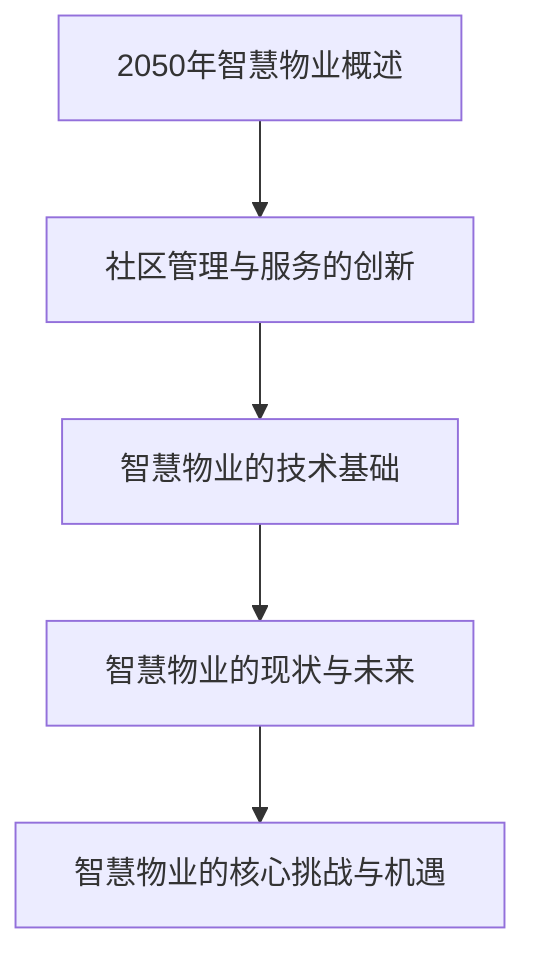

                 

### 文章标题

---

**《未来的智慧物业：2050年的社区管理与服务升级》**

---

### 文章关键词

- 2050年智慧物业
- 社区管理与服务升级
- 物联网
- 大数据
- 人工智能
- 区块链
- 绿色能源

---

### 文章摘要

本文将深入探讨到2050年，智慧物业将在社区管理与服务领域引发的革命性变革。通过分析物联网、大数据、人工智能和区块链等核心技术，本文将揭示智慧物业的四大核心特征，并探讨其技术基础与未来前景。同时，本文还将针对智慧物业面临的挑战与机遇，提出可能的解决方案，以期为我国智慧物业的发展提供有益的参考。

---

### 第一部分：背景与核心概念

#### 第1章：背景与核心概念概述

##### 1.1 2050年智慧物业概述

在未来的2050年，智慧物业将作为现代社区管理与服务的新标杆，全面融入物联网、大数据、人工智能和区块链等前沿技术，实现社区管理的智能化和个性化。智慧物业不仅仅是一个物业管理概念，更是一个全方位的社区服务综合体，涵盖居住、工作、娱乐、医疗、教育等多个方面。

**概念定义与行业展望**

智慧物业是指通过集成物联网、大数据、人工智能和区块链等先进技术，对社区内的各种资源和设备进行智能管理和优化，提供高效、便捷、绿色的居住环境和服务体验。其核心目标是提高居民的生活质量，降低社区运营成本，实现社区资源的可持续利用。

在行业展望方面，智慧物业将成为房地产领域的重要组成部分，未来十年内将迎来爆发式增长。预计到2030年，智慧物业将在全球范围内覆盖超过50%的社区，到2050年，这一比例将达到90%以上。

**智慧物业的演变路径**

智慧物业的演变可以追溯到20世纪末，当时物业管理开始引入自动化技术，如门禁系统、智能门锁等。进入21世纪，物联网技术的发展为智慧物业奠定了基础，各种智能设备开始广泛应用于社区管理。2010年后，大数据和人工智能技术的兴起进一步推动了智慧物业的发展，实现了社区服务的智能化和个性化。

**2050年智慧物业的愿景**

到2050年，智慧物业将实现以下愿景：

1. **智能化管理**：通过物联网、大数据和人工智能技术，实现社区管理的自动化、智能化和精细化。
2. **个性化服务**：根据居民的需求和偏好，提供定制化的社区服务。
3. **绿色可持续发展**：通过绿色能源管理和可持续发展理念，实现社区的绿色环保和可持续发展。
4. **安全与便捷**：通过区块链技术确保社区数据的安全性和透明性，提供便捷的社区服务。

##### 1.2 社区管理与服务的创新

**社区管理新模式**

随着技术的进步，社区管理将实现从传统的人工管理模式向智能化、数字化的管理模式转变。智慧物业将采用物联网技术，实现对社区内各类设备和资源的实时监控和智能管理。例如，通过智能传感器和摄像头，物业管理人员可以远程监控社区的安全情况，及时处理突发事件。

**服务升级的必要性**

在未来的社区中，居民对生活质量和服务体验的要求将越来越高。传统的物业管理模式已无法满足这些需求，因此，服务升级成为必然趋势。智慧物业通过引入大数据和人工智能技术，可以对居民的需求进行精准分析，提供个性化的服务方案。例如，通过分析居民的购物习惯，智能推荐适合的商品和服务。

**智慧物业的四大核心特征**

1. **智能化**：通过物联网、大数据和人工智能技术，实现社区管理的智能化和精细化。
2. **个性化**：根据居民的需求和偏好，提供定制化的服务。
3. **绿色化**：通过绿色能源管理和可持续发展理念，实现社区的绿色环保。
4. **安全便捷**：通过区块链技术，确保社区数据的安全性和透明性，提供便捷的服务。

##### 1.3 智慧物业的技术基础

**物联网（IoT）**

物联网是智慧物业的核心技术之一，它通过连接社区内的各类设备和系统，实现信息的实时传递和智能控制。例如，智能门锁、智能照明、智能停车系统等，都可以通过物联网实现远程控制和智能化管理。

**大数据分析与人工智能（AI）**

大数据分析和人工智能技术为智慧物业提供了强大的数据支持和智能决策能力。通过对海量数据的分析，智慧物业可以了解居民的需求和行为模式，从而提供个性化的服务。人工智能技术则可以自动化处理大量的社区管理任务，提高管理效率。

**区块链技术**

区块链技术为智慧物业提供了安全、透明和去中心化的数据管理方式。通过区块链，社区内的各种数据都可以实现安全存储和透明传输，确保数据的安全性和隐私性。此外，区块链还可以用于智能合约的执行，提高社区服务的效率。

**绿色能源管理与可持续发展**

绿色能源管理和可持续发展是智慧物业的重要方向。通过引入太阳能、风能等可再生能源，智慧物业可以降低社区的能源消耗和碳排放。同时，通过智能化管理，实现能源的优化利用，提高能源效率。

##### 1.4 智慧物业的现状与未来

**当前智慧物业发展状况**

目前，智慧物业在全球范围内已经取得了一定的进展。许多国家和地区已经开始推广智慧物业，并取得了一些成功案例。然而，总体来说，智慧物业 still faces several challenges，如技术成本高、用户体验差等。

**2050年智慧物业的潜在变革**

到2050年，随着技术的不断进步和应用的深化，智慧物业将迎来新的变革。首先，物联网、大数据、人工智能和区块链等核心技术的广泛应用，将使智慧物业的功能更加完善和智能。其次，随着居民对生活质量和服务体验的要求不断提高，智慧物业将更加注重个性化服务和用户体验。最后，绿色能源管理和可持续发展理念将深入智慧物业的各个方面，实现社区的绿色环保和可持续发展。

##### 1.5 智慧物业的核心挑战与机遇

**技术挑战与解决方案**

尽管智慧物业具有巨大的发展潜力，但仍然面临一些技术挑战。首先，物联网设备和系统的安全性和可靠性仍然是一个重大问题。其次，大数据分析和人工智能技术的应用需要大量的计算资源和数据支持。最后，区块链技术的应用还需要解决数据隐私和安全性等问题。

针对这些挑战，可以采取以下解决方案：

1. **加强网络安全和设备可靠性**：通过采用先进的加密技术和网络安全协议，提高物联网设备和系统的安全性和可靠性。
2. **优化大数据分析和人工智能算法**：通过改进算法和优化计算资源，提高大数据分析和人工智能技术的效率。
3. **加强区块链技术的研发和应用**：通过加强区块链技术的研发，解决数据隐私和安全性问题，提高区块链技术的应用水平。

**社会接受度与伦理问题**

智慧物业的发展还面临着社会接受度和伦理问题。一方面，居民可能对智能化的社区管理和服务持怀疑态度，担心隐私泄露和信息安全等问题。另一方面，智慧物业的应用可能引发一些伦理问题，如数据滥用、人工智能歧视等。

为解决这些问题，需要加强宣传教育，提高居民对智慧物业的认识和接受度。同时，制定相应的法律法规，规范智慧物业的应用和推广，确保其符合伦理标准。

**经济模式与商业模式**

智慧物业的发展还需要探索有效的经济模式和商业模式。目前，智慧物业的投入成本较高，需要找到可持续的盈利模式。可以采用多种商业模式，如收费服务、广告收入、合作共赢等，实现智慧物业的商业化运营。

综上所述，智慧物业在2050年将迎来一场深刻的变革。通过引入物联网、大数据、人工智能和区块链等核心技术，智慧物业将实现社区管理的智能化、个性化、绿色化和安全便捷。然而，智慧物业的发展也面临着一系列挑战，需要各方共同努力，推动智慧物业的健康发展。

### Mermaid 流程图



### 伪代码示例

```python
# 伪代码：智慧物业基础架构搭建
class SmartProperty:
    def __init__(self, management_system, service_upgrade, tech_base):
        self.management_system = management_system
        self.service_upgrade = service_upgrade
        self.tech_base = tech_base

    def display_property_info(self):
        print("智慧物业概述：")
        print("管理系统：", self.management_system)
        print("服务升级：", self.service_upgrade)
        print("技术基础：", self.tech_base)
```

### 数学模型与公式

$$
\text{满意度} = \frac{\text{服务质量} + \text{技术支持}}{2}
$$

### 示例讲解

智慧物业的满意度可以用服务质量和技术支持的平均值来衡量。服务质量越高，技术支持越强，则智慧物业的满意度越高。

---

### 第一部分小结

在这一部分，我们全面概述了2050年智慧物业的背景和核心概念。从概述、社区管理与服务的创新、技术基础、现状与未来，到核心挑战与机遇，我们逐步深入分析了智慧物业的发展趋势和潜在变革。通过Mermaid流程图、伪代码示例和数学模型，我们更加清晰地理解了智慧物业的架构和运作原理。

在下一部分，我们将进一步探讨智慧物业在社区管理与服务中的具体应用和实施策略，敬请期待。

