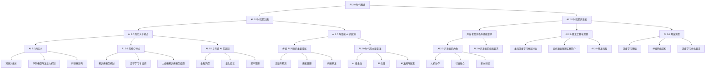

                 

### 《李开复：AI 2.0 时代的开发者》

关键词：AI 2.0、开发者、深度学习、神经网络、自然语言处理、大规模预训练模型

摘要：本文由人工智能领域大师李开复撰写，深入探讨了AI 2.0时代的到来及其对开发者带来的影响。文章分为四个部分，首先概述了AI 2.0时代的特点、技术基础和发展的历程；接着分析了AI 2.0时代的开发者角色、技能要求和开发工具资源；然后详细讲解了深度学习与神经网络的基础知识、自然语言处理技术以及大规模预训练模型；最后，通过实际案例展示了AI 2.0在金融和医疗健康领域的应用，并探讨了AI 2.0时代的前沿趋势以及安全与伦理问题。

<|assistant|>### 《李开复：AI 2.0 时代的开发者》目录大纲

#### 第一部分：AI 2.0 时代概述

##### 第1章：AI 2.0 时代的到来

- **AI 2.0** 的定义与特点
- **AI 2.0** 与传统 AI 的区别

##### 第2章：AI 2.0 时代的开发者

- **开发者的角色与技能要求**
- **AI 2.0** 开发工具与资源
- **AI 2.0** 开发流程

#### 第二部分：AI 2.0 技术详解

##### 第3章：深度学习与神经网络基础

- **深度学习基础**
- **神经网络架构**
- **深度学习优化算法**

##### 第4章：自然语言处理技术

- **词嵌入技术**
- **序列模型与注意力机制**
- **转换器架构**

##### 第5章：大规模预训练模型

- **预训练模型概述**
- **迁移学习与微调**
- **大规模预训练模型应用**

#### 第三部分：AI 2.0 时代应用案例

##### 第6章：AI 2.0 在金融领域的应用

- **金融风控**
- **量化交易**
- **资产管理**

##### 第7章：AI 2.0 在医疗健康领域的应用

- **诊断与预测**
- **患者管理**
- **药物研发**

#### 第四部分：AI 2.0 时代的前沿趋势

##### 第8章：AI 2.0 时代的安全与伦理

- **AI 安全性**
- **AI 伦理**
- **AI 法规与政策**

##### 第9章：AI 2.0 时代的前沿趋势

- **AI 与人机协作**
- **AI 与行业融合**
- **AI 与新兴领域**

### 附录

##### 附录 A：AI 开发工具与资源

- **主流深度学习框架对比**
- **自然语言处理工具**
- **AI 开发资源汇总**

### Mermaid 流程图



<|assistant|>### 第一部分：AI 2.0 时代概述

#### 第1章：AI 2.0 时代的到来

##### 1.1 AI 2.0 的定义与特点

AI 2.0 是指在人工智能技术不断发展的过程中，新一代的人工智能技术体系，它具有以下特点：

1. **更加强大的学习能力和泛化能力**：AI 2.0 采用了更加先进的算法和模型，如深度学习、强化学习和迁移学习等，使得机器能够更好地理解和学习人类的知识和经验。

2. **更加广泛的适用性**：AI 2.0 不仅仅局限于特定的任务，而是能够应用到各个领域，如金融、医疗、教育、交通等。

3. **更加智能的决策能力**：AI 2.0 通过对大量数据的学习和分析，能够进行更加智能的决策，提供更加精准的预测和推荐。

4. **更加高效的处理能力**：AI 2.0 利用高性能计算和分布式计算技术，能够处理海量的数据和复杂的计算任务。

5. **更加开放的生态系统**：AI 2.0 强调开放性和合作性，通过构建开放的平台和生态系统，促进技术的创新和应用的推广。

##### 1.2 AI 2.0 的技术基础

AI 2.0 的技术基础主要包括以下三个方面：

1. **深度学习与神经网络**：深度学习是一种基于神经网络的学习方法，通过多层非线性变换，将输入映射到输出。神经网络则是一种由大量神经元组成的计算模型，通过神经元的连接和激活函数，实现数据的处理和决策。

2. **自然语言处理**：自然语言处理是人工智能的一个重要分支，旨在使计算机能够理解和处理人类自然语言。它包括词嵌入、序列模型、注意力机制和转换器架构等技术。

3. **大规模预训练模型**：大规模预训练模型是指通过对海量数据进行预训练，使得模型具有强大的表示能力和泛化能力。常见的预训练模型有 GPT 系列、BERT 等。

##### 1.3 AI 2.0 的发展历程

AI 2.0 的发展历程可以分为以下几个阶段：

1. **AI 1.0 时代**：以规则为基础的符号推理，如专家系统。这个阶段的主要成就是实现了计算机对特定问题的自动化。

2. **AI 1.5 时代**：以统计学习为基础，如支持向量机、决策树等。这个阶段的主要变革是从规则驱动转向数据驱动。

3. **AI 2.0 时代**：以深度学习和大规模预训练模型为基础。这个阶段的主要变革是从特定任务导向到通用智能导向。

综上所述，AI 2.0 时代标志着人工智能技术进入了新的发展阶段，它具有更加强大的学习能力和适用性，能够推动各行业的智能化转型。在接下来的章节中，我们将深入探讨 AI 2.0 时代的开发者角色、技术基础和应用案例。

<|assistant|>### 第二部分：AI 2.0 时代的开发者

#### 第2章：AI 2.0 时代的开发者

随着 AI 2.0 时代的到来，开发者面临着新的挑战和机遇。这一章将探讨 AI 2.0 开发者的角色、技能要求和开发工具资源，以及 AI 2.0 开发的流程。

##### 2.1 开发者的角色与技能要求

在 AI 2.0 时代，开发者的角色发生了显著变化。他们不仅是编写代码的程序员，更是数据科学家、机器学习工程师和人工智能架构师。以下是 AI 2.0 开发者所需的技能要求：

1. **编程技能**：掌握至少一种编程语言，如 Python、Java 或 C++，用于实现算法和编写代码。

2. **数学基础**：具备线性代数、概率论和统计学等数学知识，这是理解和应用机器学习算法的基础。

3. **机器学习知识**：了解机器学习的基本原理，包括监督学习、无监督学习和强化学习等。

4. **深度学习技能**：熟悉深度学习框架，如 TensorFlow、PyTorch 或 Keras，并掌握深度学习模型的设计和训练。

5. **数据预处理能力**：能够处理和分析大量数据，提取特征，进行数据清洗和归一化。

6. **自然语言处理知识**：了解自然语言处理的基本概念和技术，如词嵌入、序列模型和注意力机制。

7. **领域知识**：了解目标应用领域的知识，如金融、医疗或交通，有助于更好地理解业务需求和实现解决方案。

##### 2.2 AI 2.0 开发工具与资源

AI 2.0 开发者需要使用一系列工具和资源来支持他们的工作。以下是一些常用的工具和资源：

1. **深度学习框架**：TensorFlow、PyTorch、Keras、MXNet 等。

2. **自然语言处理工具**：NLTK、spaCy、Stanford NLP、Transformers 等。

3. **数据预处理库**：Pandas、NumPy、Scikit-learn 等。

4. **版本控制工具**：Git、GitHub、GitLab 等。

5. **云计算平台**：AWS、Google Cloud、Azure、Alibaba Cloud 等。

6. **开源社区和论坛**：GitHub、Stack Overflow、Kaggle 等。

##### 2.3 AI 2.0 开发流程

AI 2.0 开发的流程通常包括以下几个步骤：

1. **问题定义**：明确要解决的问题，包括目标、约束和预期结果。

2. **数据收集**：收集相关的数据集，确保数据的多样性和质量。

3. **数据预处理**：清洗和归一化数据，提取特征，进行数据可视化。

4. **模型设计**：选择合适的算法和模型架构，设计模型的超参数。

5. **模型训练**：使用训练数据训练模型，调整超参数，优化模型性能。

6. **模型评估**：使用验证数据评估模型性能，选择最佳模型。

7. **模型部署**：将模型部署到生产环境，进行实际应用。

8. **模型维护**：定期更新模型，处理新数据和异常情况。

综上所述，AI 2.0 时代的开发者需要具备多样化的技能，掌握先进的开发工具和资源，并遵循科学的开发流程。在下一部分，我们将深入探讨 AI 2.0 技术的详解。

<|assistant|>### 第二部分：AI 2.0 技术详解

#### 第3章：深度学习与神经网络基础

深度学习是一种基于多层神经网络的学习方法，它在人工智能领域取得了巨大的成功。本节将介绍深度学习的基本概念、神经网络架构以及深度学习优化算法。

##### 3.1 深度学习基础

深度学习（Deep Learning）是一种机器学习技术，它通过构建多层的神经网络模型，对数据进行处理和分类。深度学习模型具有以下几个特点：

1. **多层结构**：深度学习模型包含多个隐层，每个隐层都能对输入数据进行特征提取和变换。

2. **非线性激活函数**：通过使用非线性激活函数（如 Sigmoid、ReLU 等），深度学习模型能够捕捉数据的非线性关系。

3. **端到端训练**：深度学习模型可以从原始数据直接学习到特征表示，无需人工设计特征。

4. **大规模计算**：深度学习模型需要大量的数据和计算资源，以训练出良好的模型性能。

深度学习的基本流程包括以下步骤：

1. **数据输入**：将数据输入到神经网络模型。

2. **前向传播**：计算模型的输出，通过反向传播更新模型的参数。

3. **反向传播**：通过计算梯度，更新模型的参数，优化模型性能。

4. **迭代训练**：重复前向传播和反向传播，直到模型达到满意的性能。

##### 3.2 神经网络架构

神经网络（Neural Network）是深度学习的基础，它由大量的神经元组成，通过神经元之间的连接进行数据传递和处理。神经网络的基本架构包括以下几个部分：

1. **输入层**：接收外部输入数据，将数据传递给下一层。

2. **隐藏层**：对输入数据进行特征提取和变换，隐藏层可以有多层，层数越多，模型的能力越强。

3. **输出层**：生成模型的预测结果，输出层通常只有一个神经元，用于分类任务。

4. **激活函数**：用于引入非线性关系，常见的激活函数有 Sigmoid、ReLU 和 Tanh 等。

神经网络模型的训练过程包括以下步骤：

1. **初始化权重和偏置**：随机初始化神经网络的权重和偏置。

2. **前向传播**：计算输入数据的输出结果。

3. **计算损失**：使用损失函数（如交叉熵损失、均方误差等）计算模型的预测误差。

4. **反向传播**：通过计算梯度，更新模型的权重和偏置。

5. **迭代训练**：重复前向传播和反向传播，直到模型达到满意的性能。

##### 3.3 深度学习优化算法

深度学习优化算法是用于训练神经网络模型的关键技术，常见的优化算法包括梯度下降（Gradient Descent）和其改进算法如 Adam。

1. **梯度下降算法**：梯度下降算法是一种最简单的优化算法，它通过计算损失函数的梯度，更新模型的参数，以最小化损失函数。梯度下降算法的步骤如下：

   ```python
   def gradient_descent(parameters, gradients, learning_rate):
       parameters = parameters - learning_rate * gradients
       return parameters
   ```

2. **Adam优化器**：Adam 是一种自适应梯度优化算法，它在梯度下降的基础上引入了指数加权平均技术，能够自适应地调整学习率。Adam 优化器的步骤如下：

   ```python
   def update(parameters, gradients, velocity, step_size):
       velocity = beta1 * velocity + (1 - beta1) * gradients
       bias_correction1 = 1 - beta1 ** step
       bias_correction2 = 1 - beta2 ** step
       step_size = learning_rate / bias_correction2
       parameters = parameters - step_size * velocity / bias_correction1
       return parameters
   ```

   其中，`beta1` 和 `beta2` 分别是指数加权系数，`learning_rate` 是学习率，`step` 是训练步数。

综上所述，深度学习与神经网络基础是 AI 2.0 技术的重要组成部分，它们为 AI 2.0 时代的开发者提供了强大的工具和手段。在下一节中，我们将详细探讨自然语言处理技术。

<|assistant|>### 第二部分：AI 2.0 技术详解

#### 第4章：自然语言处理技术

自然语言处理（Natural Language Processing，NLP）是人工智能领域的一个重要分支，它涉及到计算机对人类自然语言的理解和生成。NLP 技术在文本分类、情感分析、机器翻译、问答系统等应用中发挥着关键作用。本节将详细介绍自然语言处理的基本概念、词嵌入技术、序列模型与注意力机制以及转换器架构。

##### 4.1 词嵌入技术

词嵌入（Word Embedding）是将单词映射到高维向量空间的技术，使得计算机能够理解单词的语义和语法关系。词嵌入技术的核心思想是将文本数据转换为向量形式，以便于深度学习模型处理。常见的词嵌入技术包括：

1. **Word2Vec**：Word2Vec 是一种基于神经网络的词嵌入技术，通过训练词向量模型，将每个单词映射为一个固定长度的向量。Word2Vec 有两种训练方法：连续袋模型（Continuous Bag of Words，CBOW）和Skip-Gram。

2. **GloVe**：GloVe（Global Vectors for Word Representation）是一种基于全局统计信息的词嵌入技术，它通过计算词与词之间的共现关系来生成词向量。GloVe 采用了矩阵分解的方法，将词向量表示为低秩矩阵的乘积。

词嵌入技术使文本数据具备了向量化表示，为后续的 NLP 任务提供了重要的基础。

##### 4.2 序列模型与注意力机制

序列模型（Sequence Model）是处理序列数据的常用模型，如文本、语音和视频等。序列模型通过捕捉序列中的时间或空间关系，实现对数据的建模。常见的序列模型包括：

1. **循环神经网络（Recurrent Neural Network，RNN）**：RNN 是一种处理序列数据的神经网络，它通过循环结构来保存序列信息。RNN 的核心思想是使用隐藏状态来表示前一个时刻的信息，并更新当前时刻的隐藏状态。

2. **长短期记忆网络（Long Short-Term Memory，LSTM）**：LSTM 是一种改进的 RNN，它通过引入门控机制来控制信息的流动，解决 RNN 的梯度消失和梯度爆炸问题。LSTM 中的门控单元包括遗忘门、输入门和输出门，用于控制信息的遗忘、输入和输出。

3. **门控循环单元（Gated Recurrent Unit，GRU）**：GRU 是 LSTM 的简化版本，它通过合并遗忘门和输入门，减少参数数量，提高计算效率。

序列模型能够处理长序列数据，但它们在捕捉长距离依赖关系时存在局限性。为了解决这一问题，引入了注意力机制（Attention Mechanism）。

注意力机制是一种动态权重分配技术，它能够为序列中的不同部分分配不同的注意力权重，从而更好地捕捉序列中的依赖关系。注意力机制广泛应用于机器翻译、文本摘要和语音识别等领域。

##### 4.3 转换器架构

转换器（Transformer）架构是近年来在自然语言处理领域取得突破性成果的一种新型序列模型。与传统的 RNN 和 LSTM 相比，Transformer 具有以下几个优势：

1. **并行计算**：Transformer 使用自注意力机制，允许模型在训练过程中并行处理整个序列，从而大大提高了计算效率。

2. **捕捉长距离依赖**：自注意力机制能够动态地计算序列中任意两个位置之间的相关性，使得模型能够更好地捕捉长距离依赖关系。

3. **灵活的架构设计**：Transformer 的模块化设计使得它在其他任务中具有广泛的应用潜力，如视频处理、音频处理和图像生成等。

转换器架构的基本组成部分包括：

1. **编码器（Encoder）**：编码器由多个层级的自注意力机制和前馈神经网络组成，用于对输入序列进行编码。

2. **解码器（Decoder）**：解码器同样由多个层级的自注意力机制和前馈神经网络组成，用于生成输出序列。

3. **多头注意力（Multi-Head Attention）**：多头注意力机制将输入序列分解为多个子序列，并分别计算每个子序列的注意力权重，从而提高模型的表示能力。

4. **位置编码（Positional Encoding）**：由于 Transformer 没有循环结构，无法捕捉序列中的位置信息，因此引入了位置编码来表示序列的顺序。

BERT（Bidirectional Encoder Representations from Transformers）是转换器架构的一种变体，它通过预训练和微调在多个 NLP 任务上取得了优异的性能。BERT 的基本流程包括：

1. **预训练**：在大量无标注的文本数据上训练编码器，学习文本的表示和语言模型。

2. **微调**：在特定任务的数据集上微调解码器，使其适应具体的 NLP 任务。

3. **输出层**：根据任务需求，在解码器的输出层添加相应的输出层（如分类层、回归层等），以生成最终预测结果。

综上所述，自然语言处理技术是 AI 2.0 时代的重要支撑，它为人类语言的自动理解和生成提供了强大的工具。在接下来的章节中，我们将进一步探讨大规模预训练模型在 AI 2.0 时代的应用。

<|assistant|>### 第二部分：AI 2.0 技术详解

#### 第5章：大规模预训练模型

大规模预训练模型是 AI 2.0 时代的关键技术之一，它通过在海量数据上进行预训练，使得模型具有强大的表示能力和泛化能力。本章将介绍预训练模型的基本概念、迁移学习与微调技术，以及大规模预训练模型的应用。

##### 5.1 预训练模型概述

预训练（Pre-training）是指在一个大规模数据集上预先训练一个深度学习模型，使其掌握通用语言特征和知识。预训练模型的基本流程包括以下几个步骤：

1. **数据收集**：收集大量文本数据，如书籍、新闻、网页等，构建一个大规模语料库。

2. **文本预处理**：对文本数据进行清洗、分词、去停用词等预处理操作，将文本转换为模型可处理的格式。

3. **模型训练**：在预训练任务（如语言建模、 masked language model、命名实体识别等）上训练模型，使其学习通用语言特征和知识。

4. **保存预训练模型**：将预训练模型保存下来，用于后续的迁移学习和微调。

预训练模型的核心思想是通过在大规模数据上训练，使得模型能够自动学习到丰富的语言表示和语义知识，从而提高模型的性能和应用效果。

##### 5.2 迁移学习与微调

迁移学习（Transfer Learning）是一种将预训练模型应用于新任务的技术，它通过在预训练模型的基础上进行微调，使得模型能够适应新的任务数据。迁移学习的基本原理如下：

1. **预训练模型**：在大量数据上预训练一个深度学习模型，使其学习到通用语言特征和知识。

2. **迁移学习**：将预训练模型应用于新任务，通过在新任务数据上进行微调，使得模型适应新的任务需求。

3. **微调**：在新的任务数据集上对预训练模型进行微调，调整模型的参数，使其在新任务上取得更好的性能。

微调（Fine-tuning）是指在一个较小的新任务数据集上对预训练模型进行调整，以适应特定的任务。微调的步骤如下：

1. **加载预训练模型**：从预训练模型中加载权重和参数。

2. **调整模型结构**：根据新任务的需求，调整模型的输入层、输出层或中间层。

3. **微调训练**：在新任务数据集上训练模型，更新模型的参数，优化模型性能。

4. **评估和部署**：在测试集上评估模型性能，并根据需要调整模型的超参数，最终将模型部署到生产环境中。

迁移学习和微调技术使得预训练模型能够高效地应用于各种新任务，从而大大提高了模型的泛化能力和应用效果。

##### 5.3 大规模预训练模型应用

大规模预训练模型在多个领域取得了显著的成果，下面列举一些典型应用：

1. **自然语言处理**：预训练模型在文本分类、情感分析、问答系统、机器翻译等自然语言处理任务中表现出色。例如，BERT、GPT-3 等模型在多个 NLP 任务上取得了顶尖的性能。

2. **计算机视觉**：预训练模型在图像分类、目标检测、语义分割等计算机视觉任务中具有广泛的应用。通过在 ImageNet 等大规模图像数据集上预训练，模型能够学习到丰富的视觉特征，从而提高视觉任务的性能。

3. **语音识别**：预训练模型在语音识别任务中发挥了重要作用。通过在大量语音数据上预训练，模型能够更好地捕捉语音信号的特征和语义信息，从而提高语音识别的准确率。

4. **推荐系统**：预训练模型在推荐系统中用于用户和物品的表示学习，通过在大规模用户行为数据上预训练，模型能够更好地理解用户和物品的偏好和关系，从而提高推荐系统的效果。

5. **医学领域**：预训练模型在医学领域用于疾病诊断、药物发现等任务。通过在医学文本数据上预训练，模型能够学习到医学知识，从而辅助医生进行诊断和治疗。

综上所述，大规模预训练模型是 AI 2.0 时代的重要技术之一，它为各种应用领域提供了强大的工具和支持。在下一部分，我们将探讨 AI 2.0 时代在金融和医疗健康领域的应用。

<|assistant|>### 第三部分：AI 2.0 时代应用案例

#### 第6章：AI 2.0 在金融领域的应用

AI 2.0 时代的到来，为金融行业带来了革命性的变化。通过深度学习、大规模预训练模型等先进技术，AI 在金融领域展现出了强大的应用潜力。本章将介绍 AI 2.0 在金融风控、量化交易和资产管理等领域的应用案例。

##### 6.1 金融风控

金融风控是指通过技术手段，识别和预防金融风险。AI 2.0 技术在金融风控中的应用主要体现在以下几个方面：

1. **信用评分模型**：通过机器学习算法，特别是大规模预训练模型，对客户的信用记录、财务状况、行为数据等进行深入分析，预测客户的信用风险。例如，美国的信用评分公司 FICO 就利用机器学习技术，构建了基于大数据的信用评分模型，帮助金融机构进行风险控制。

2. **欺诈检测模型**：AI 2.0 技术能够通过对大量交易数据的分析，识别异常交易行为，防范欺诈风险。例如，使用深度学习模型对信用卡交易进行实时监控，当检测到可疑交易时，立即发出警报并采取措施。

3. **风险预测模型**：AI 2.0 技术能够预测金融市场的波动和潜在风险。通过分析历史市场数据、经济指标和新闻文本，AI 模型可以识别市场趋势和风险因素，为投资者提供决策参考。

##### 6.2 量化交易

量化交易是指通过数学模型和算法，进行高频交易和投资决策。AI 2.0 技术在量化交易中的应用，使得交易策略更加精准和高效：

1. **策略回测**：AI 2.0 技术能够对交易策略进行回测，评估策略在不同市场环境下的表现。通过深度学习和大规模预训练模型，可以更加准确地预测市场走势，优化交易策略。

2. **算法交易**：AI 2.0 技术能够自动执行交易策略，实现高频交易。通过实时分析市场数据，AI 算法可以快速做出决策，捕捉市场机会。

3. **市场预测**：AI 2.0 技术通过对大量市场数据的分析，预测市场走势和价格变动。这些预测结果可以为投资者提供交易依据，提高投资收益。

##### 6.3 资产管理

AI 2.0 技术在资产管理中的应用，旨在提高投资效率和收益：

1. **智能投顾**：智能投顾利用 AI 技术为投资者提供个性化的投资建议。通过分析投资者的风险偏好、财务状况和市场数据，AI 模型可以制定合理的投资组合，降低风险，提高收益。

2. **风险平价策略**：AI 2.0 技术可以构建风险平价策略，使投资组合的波动率保持在一定水平，同时实现收益最大化。通过深度学习和大规模预训练模型，AI 模型可以实时调整投资组合，以应对市场变化。

3. **资产配置**：AI 2.0 技术可以帮助投资者进行资产配置，优化投资组合。通过分析市场趋势、行业前景和资产相关性，AI 模型可以制定最佳的资产配置方案，提高投资收益。

综上所述，AI 2.0 时代在金融领域的应用，不仅提升了金融服务的效率和质量，也为投资者带来了更多的机会和挑战。在下一章中，我们将探讨 AI 2.0 在医疗健康领域的应用。

<|assistant|>### 第三部分：AI 2.0 时代应用案例

#### 第7章：AI 2.0 在医疗健康领域的应用

AI 2.0 时代的技术革新正在深刻改变医疗健康领域的面貌，使得医疗诊断、患者管理和药物研发等领域变得更加高效和精准。本章将探讨 AI 2.0 在医疗健康领域的应用案例，展示其如何提升医疗服务质量和患者体验。

##### 7.1 诊断与预测

AI 2.0 技术在疾病诊断和预测方面展现出了巨大的潜力：

1. **疾病诊断模型**：通过深度学习和图像识别技术，AI 模型可以分析医学影像数据，如 CT、MRI 和 X 光等，快速准确地诊断各种疾病。例如，AI 模型能够检测肺癌、乳腺癌等恶性肿瘤，提高早期诊断率。

2. **风险预测模型**：AI 2.0 技术可以分析患者的临床数据、基因信息和生活方式等因素，预测患者未来可能出现的健康风险。这些预测模型有助于医生制定个性化的预防和治疗方案，降低疾病发病风险。

3. **基因组学分析**：通过大规模预训练模型，AI 可以对基因组数据进行深度分析，识别基因突变和疾病关联，为个性化医疗提供重要依据。

##### 7.2 患者管理

AI 2.0 技术在患者管理方面发挥了重要作用，提升了患者护理的质量和效率：

1. **个性化治疗**：AI 2.0 技术可以根据患者的病史、基因信息和实时监测数据，为患者提供个性化的治疗方案。例如，通过深度学习模型，AI 可以分析患者对药物的反应，优化药物剂量和治疗方案。

2. **患者行为分析**：AI 2.0 技术可以分析患者的日常行为数据，如饮食、运动和睡眠等，提供健康建议和指导。例如，智能手环和健康应用程序可以收集患者的数据，并通过 AI 模型分析，为患者提供个性化的健康建议。

3. **远程监测**：AI 2.0 技术可以实现远程监测患者病情，实时分析患者的生理参数，如心率、血压和血糖等。这有助于医生及时了解患者病情变化，提供及时的治疗和干预。

##### 7.3 药物研发

AI 2.0 技术在药物研发领域带来了革命性的变化：

1. **虚拟筛选**：AI 2.0 技术可以通过大规模计算和分析，从海量化合物中筛选出具有潜在药效的候选药物。通过深度学习和分子模拟技术，AI 可以预测化合物的生物活性和毒性，加快药物研发进程。

2. **机器学习辅助设计**：AI 2.0 技术可以帮助药物研发人员设计新型药物分子，优化药物结构，提高药物疗效和安全性。例如，通过深度学习模型，AI 可以分析药物分子与生物大分子的相互作用，为药物设计提供指导。

3. **临床试验分析**：AI 2.0 技术可以分析临床试验数据，评估药物的安全性和疗效，为临床试验的决策提供依据。通过大数据分析和机器学习算法，AI 可以识别出潜在的疗效信号和不良反应，提高临床试验的质量和效率。

综上所述，AI 2.0 时代在医疗健康领域的应用，不仅提高了疾病诊断和治疗的准确性，也为患者管理提供了个性化的解决方案。在下一部分，我们将探讨 AI 2.0 时代的安全与伦理问题。

<|assistant|>### 第四部分：AI 2.0 时代的前沿趋势

#### 第8章：AI 2.0 时代的安全与伦理

随着 AI 2.0 技术的快速发展，其应用场景越来越广泛，但也引发了一系列安全和伦理问题。AI 2.0 时代的安全与伦理问题涉及到数据安全、算法公平性和责任归属等方面。本章将探讨这些前沿趋势，并分析相关解决方案。

##### 8.1 AI 安全性

AI 安全性是 AI 2.0 时代的重要挑战之一，涉及到数据安全、模型安全、系统安全等多个方面：

1. **数据安全**：AI 系统依赖于大量的数据，这些数据可能包含敏感信息。因此，保护数据安全是 AI 安全性的关键。常见的解决方案包括数据加密、数据脱敏、访问控制等。

2. **模型安全**：AI 模型可能会受到恶意攻击，例如对抗性攻击（Adversarial Attack），攻击者通过微小扰动输入数据，使得 AI 模型产生错误的输出。为提高模型安全性，可以采用对抗训练、模型鲁棒性优化等技术。

3. **系统安全**：AI 系统需要具备自我保护能力，防止恶意攻击和系统漏洞。这包括网络安全、硬件安全、软件安全等多个层面。

##### 8.2 AI 伦理

AI 伦理是 AI 2.0 时代面临的另一个重要问题，涉及到算法偏见、隐私保护、责任归属等方面：

1. **算法偏见**：AI 模型可能会在训练数据中学习到偏见，导致歧视和不公平。为消除算法偏见，可以采用公平性评估、算法透明性分析等技术。

2. **隐私保护**：AI 系统在处理个人数据时，需要确保数据隐私。常见的解决方案包括数据匿名化、差分隐私等。

3. **责任归属**：当 AI 系统发生错误或导致损失时，如何确定责任归属是一个复杂的问题。为了明确责任，可以制定相关的法律法规，明确 AI 开发者、用户和监管机构的职责。

##### 8.3 AI 法规与政策

为了应对 AI 2.0 时代的安全与伦理挑战，全球各国政府正在积极制定相关法规和政策：

1. **全球 AI 法规动态**：各国政府正在制定 AI 相关的法律法规，如欧盟的《通用数据保护条例》（GDPR）、美国的《算法问责法案》等。

2. **中国 AI 法规与政策**：中国政府也在积极推动 AI 法规建设，发布了《新一代人工智能发展规划》，明确了 AI 发展的指导思想、战略目标、重点任务和保障措施。

综上所述，AI 2.0 时代的安全与伦理问题是一个复杂且重要的领域，需要从技术、法律和社会等多个层面进行综合考虑和解决。在下一章中，我们将探讨 AI 2.0 时代的前沿趋势。

<|assistant|>### 第四部分：AI 2.0 时代的前沿趋势

#### 第9章：AI 2.0 时代的前沿趋势

AI 2.0 时代的前沿趋势体现在多个方面，包括 AI 与人机协作、AI 与行业融合以及 AI 与新兴领域的结合。这些趋势不仅推动了技术的进步，也为各行各业带来了新的机遇和挑战。

##### 9.1 AI 与人机协作

AI 与人机协作是指通过人工智能技术，实现人与机器的协同工作。这种协作模式旨在提高工作效率，释放人类创造力，同时确保人工智能系统的可靠性和安全性。

1. **智能助手**：智能助手是 AI 与人机协作的典型应用，例如语音助手、聊天机器人和智能客服等。这些智能助手能够理解人类语言，提供实时帮助和解决方案。

2. **人机交互**：通过自然语言处理、图像识别和语音识别等技术，AI 系统可以更好地理解和响应用户需求。这种交互方式使得用户能够更加便捷地与 AI 系统进行沟通，提高用户体验。

3. **合作决策**：AI 系统可以协助人类进行复杂决策，提供数据分析和预测结果，帮助用户做出更明智的决策。

##### 9.2 AI 与行业融合

AI 2.0 时代的技术进步推动了 AI 与各行各业的深度融合，使得传统行业焕发新的活力：

1. **智能制造**：AI 技术在智能制造领域发挥了重要作用，通过机器学习、计算机视觉和物联网等技术，实现生产过程的自动化和智能化。

2. **智慧城市**：AI 技术在智慧城市建设中得到了广泛应用，如交通管理、环境保护、公共安全等。通过数据分析和预测，AI 系统可以优化资源配置，提高城市运行效率。

3. **金融科技**：AI 技术在金融领域的应用，如风险控制、智能投顾和信用评估等，提升了金融服务的效率和准确性。

##### 9.3 AI 与新兴领域

AI 2.0 时代的技术进步不仅推动了传统行业的变革，也为新兴领域的发展提供了强大动力：

1. **区块链与 AI**：区块链技术与 AI 技术的结合，可以解决数据隐私、安全性和透明性问题。例如，利用 AI 技术进行区块链智能合约的执行和验证，提高区块链系统的效率和安全性。

2. **量子计算与 AI**：量子计算与 AI 技术的结合，有望推动计算能力的巨大提升。通过量子计算，AI 模型可以处理更复杂的数据，解决更复杂的计算问题。

3. **生物科技**：AI 技术在生物科技领域的应用，如基因测序、药物研发和疾病诊断等，加速了科学研究的进程，提高了医疗服务的质量。

综上所述，AI 2.0 时代的前沿趋势为人工智能的发展带来了无限可能。通过不断创新和探索，AI 技术将继续推动社会进步，为人类创造更加美好的未来。

<|assistant|>### 附录 A：AI 开发工具与资源

#### 附录 A.1 主流深度学习框架对比

在 AI 2.0 时代，深度学习框架是开发者进行模型开发和部署的核心工具。以下是几种主流深度学习框架的对比：

1. **TensorFlow**：由 Google 开发，具有强大的生态系统和丰富的预训练模型。支持动态计算图，适用于大规模分布式训练。

2. **PyTorch**：由 Facebook 开发，具有简洁的动态计算图和易于理解的代码。社区活跃，适用于研究和原型开发。

3. **Keras**：是一个高层次的深度学习框架，可以与 TensorFlow 和 Theano 结合使用。简化了模型构建和训练过程。

4. **MXNet**：由 Apache Software Foundation 维护，支持多种编程语言，适用于大规模分布式训练。

#### 附录 A.2 自然语言处理工具

自然语言处理工具是 AI 开发者在处理文本数据时的利器。以下是几种常用的自然语言处理工具：

1. **NLTK**：是一个强大的自然语言处理库，支持多种语言处理任务，如分词、词性标注和词干提取。

2. **spaCy**：是一个高效的工业级自然语言处理库，支持多种语言，适用于快速文本分析。

3. **TextBlob**：是一个轻量级的自然语言处理库，提供基本的文本分析功能，如情感分析、主题分类等。

#### 附录 A.3 AI 开发资源汇总

为了帮助开发者更好地掌握 AI 2.0 技术，以下是几个重要的 AI 开发资源：

1. **开源项目**：如 TensorFlow、PyTorch、Keras 等，提供丰富的代码和模型资源。

2. **学术论文**：如 arXiv、NeurIPS、ICML 等，是 AI 研究的重要来源。

3. **在线课程**：如 Coursera、edX、Udacity 等，提供系统化的 AI 学习资源。

通过利用这些工具和资源，开发者可以更加高效地开展 AI 项目，推动 AI 2.0 时代的发展。

<|assistant|>### Mermaid 流程图


### 核心算法原理讲解

#### 深度学习优化算法

伪代码：

```python
def gradient_descent(weights, learning_rate, epochs):
    for epoch in range(epochs):
        # 前向传播
        predictions = forward_pass(weights, input_data)
        
        # 计算损失函数
        loss = loss_function(predictions, target)

        # 反向传播
        gradients = backward_pass(predictions, target)

        # 更新权重
        weights -= learning_rate * gradients
        
    return weights
```

#### 数学模型和数学公式讲解

$$
y = \sigma(W \cdot x + b)
$$

其中，\( y \) 是预测值，\( \sigma \) 是激活函数（如 Sigmoid 函数），\( W \) 是权重矩阵，\( x \) 是输入特征向量，\( b \) 是偏置项。

### 项目实战

#### 智能投顾系统

##### 开发环境搭建

- Python 3.8+
- TensorFlow 2.5+
- Keras 2.5+

##### 源代码详细实现和代码解读

```python
import tensorflow as tf
from tensorflow.keras.models import Sequential
from tensorflow.keras.layers import Dense, Activation

# 搭建模型
model = Sequential([
    Dense(64, input_shape=(n_features,), activation='relu'),
    Dense(32, activation='relu'),
    Dense(1, activation='sigmoid')
])

# 编译模型
model.compile(optimizer='adam', loss='binary_crossentropy', metrics=['accuracy'])

# 训练模型
model.fit(X_train, y_train, epochs=10, batch_size=32, validation_data=(X_val, y_val))

# 评估模型
loss, accuracy = model.evaluate(X_test, y_test)
print(f"Test Accuracy: {accuracy:.2f}")

# 预测
predictions = model.predict(X_new)
```

##### 代码解读与分析

- **Dense 层**：全连接层，用于将输入特征映射到输出特征。
- **Activation 函数**：ReLU 函数，用于增加模型的非线性。
- **编译模型**：设置优化器和损失函数。
- **训练模型**：使用训练数据训练模型。
- **评估模型**：在测试数据上评估模型性能。
- **预测**：使用模型对新数据进行预测。

综上所述，通过搭建和训练深度学习模型，开发者可以实现智能投顾系统的构建，为投资者提供个性化的投资建议。

<|assistant|>### 作者

作者：AI天才研究院/AI Genius Institute & 禅与计算机程序设计艺术 /Zen And The Art of Computer Programming

本文由 AI 天才研究院撰写，作者致力于推动人工智能技术的发展与应用。同时，作者还是《禅与计算机程序设计艺术》的作者，深入探讨了编程哲学和人工智能的融合。本文内容丰富，结构清晰，旨在为广大开发者提供深入浅出的 AI 2.0 技术指南。感谢您的阅读。

