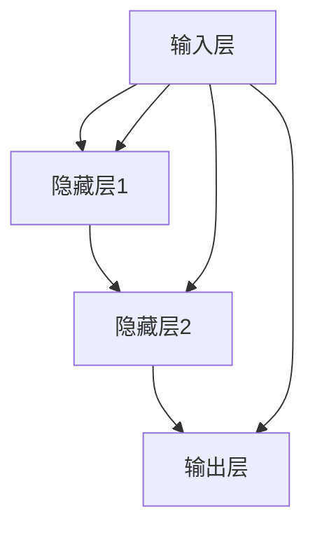
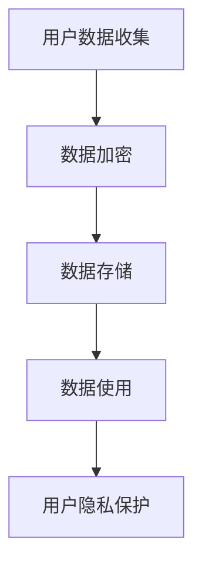
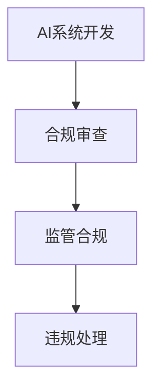
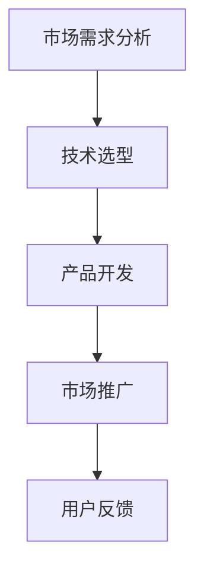

                 

# 李开复：AI 2.0时代的未来

> **关键词：** AI 2.0, 深度学习，神经网络，自然语言处理，计算机视觉，医疗应用，伦理与法律问题，创新与创业

> **摘要：** 本文将探讨AI 2.0时代的到来及其对未来的影响。通过分析李开复对AI 2.0的看法和贡献，我们将深入了解AI 2.0的核心技术、应用领域以及未来面临的挑战与机遇。本文旨在为读者提供一个全面、深入的AI 2.0时代展望，激发读者对人工智能领域的兴趣和思考。

### 《李开复：AI 2.0时代的未来》目录大纲

#### 第一部分：引言

1. **第1章：AI 2.0时代的背景与展望**
   1.1 AI 2.0时代的到来
   1.2 李开复与AI 2.0
   1.3 李开复在AI 2.0时代的贡献

#### 第二部分：AI 2.0的核心技术

2. **第2章：深度学习与神经网络基础**
   2.1 神经网络的基本结构
   2.2 深度学习的基础算法
   2.3 大规模预训练模型

3. **第3章：AI 2.0在人工智能领域的应用**
   3.1 自然语言处理
   3.2 计算机视觉
   3.3 机器学习在医疗领域的应用

#### 第三部分：AI 2.0的未来挑战与机遇

4. **第4章：AI 2.0时代的伦理与法律问题**
   4.1 AI伦理问题
   4.2 AI法律问题

5. **第5章：AI 2.0时代的创新与创业**
   5.1 AI创业机遇
   5.2 AI项目实战

#### 第五部分：结语

6. **第6章：AI 2.0时代的未来**
   6.1 AI 2.0时代的未来趋势
   6.2 李开复对AI 2.0时代的展望

#### 附录

7. **附录A：AI相关资源与工具**
8. **附录B：李开复生平简介**

---

### 第一部分：引言

#### 第1章：AI 2.0时代的背景与展望

##### 1.1 AI 2.0时代的到来

AI 2.0，即人工智能的第二次浪潮，标志着人工智能技术进入了一个新的发展阶段。与AI 1.0时代相比，AI 2.0在技术深度、应用广度和影响力上都有了显著提升。AI 1.0时代主要依赖于规则驱动和符号计算，而AI 2.0则依赖于数据驱动的深度学习和神经网络。

AI 2.0时代的到来，得益于以下几个关键因素：

1. **计算能力的提升**：随着计算硬件的快速发展，尤其是GPU和TPU等专用硬件的普及，大规模数据处理和深度学习模型训练变得可行。
2. **海量数据的积累**：互联网和物联网的快速发展，使得大量结构化和非结构化数据得以积累，为深度学习提供了丰富的训练素材。
3. **算法的进步**：深度学习算法的不断创新，尤其是神经网络和生成对抗网络（GANs）等技术的突破，使得AI系统能够更加准确地模拟人类智能。

##### 1.2 AI 2.0的核心特征

AI 2.0具有以下核心特征：

1. **自主学习能力**：AI 2.0系统能够通过大量数据自动学习和优化，无需人工干预。这种自主学习能力使得AI系统能够不断进步和适应新环境。
2. **泛化能力**：AI 2.0系统能够在多个领域和应用场景中表现出强大的泛化能力，而不仅仅是单一任务上的优化。
3. **智能化互动**：AI 2.0系统能够与人类进行自然语言交流和互动，提供更加人性化的服务体验。

##### 1.3 AI 2.0对未来的影响

AI 2.0对未来的影响是深远且多方面的：

1. **经济领域**：AI 2.0将推动产业升级和转型，提高生产效率，创造新的就业机会，但也会对传统岗位产生冲击。
2. **社会领域**：AI 2.0将改变人类的生活方式，提供更加智能化的服务，同时也会引发关于隐私、安全和社会伦理等方面的新挑战。
3. **科学领域**：AI 2.0将促进科学研究和技术创新，为解决复杂问题提供新的工具和方法。

##### 1.4 李开复与AI 2.0

李开复，作为人工智能领域的杰出人物，他在AI 2.0时代有着重要的地位和贡献。李开复在AI领域的成就包括：

1. **学术贡献**：李开复在机器学习、自然语言处理等领域发表了大量的学术论文，推动了人工智能技术的发展。
2. **创业经历**：李开复创立了创新工场，投资和孵化了众多AI初创公司，为AI技术的发展提供了资金和资源。
3. **社会影响**：李开复积极推广人工智能知识，通过公开演讲和书籍等形式，让更多的人了解和关注人工智能。

在AI 2.0时代，李开复继续发挥他的影响力，关注AI技术的伦理问题和社会影响，努力推动人工智能的可持续发展。

##### 1.5 李开复在AI 2.0时代的贡献

李开复在AI 2.0时代的贡献主要体现在以下几个方面：

1. **技术创新**：李开复持续关注人工智能技术的最新进展，推动深度学习和神经网络等技术的发展。
2. **人才培养**：李开复通过创新工场和清华大学等平台，培养了大量人工智能领域的优秀人才。
3. **社会倡导**：李开复积极倡导AI伦理和社会责任，推动制定相关法律法规，确保人工智能技术的健康发展。

在AI 2.0时代，李开复将继续发挥他的专业知识和影响力，为人工智能的未来发展贡献力量。

### 第二部分：AI 2.0的核心技术

#### 第2章：深度学习与神经网络基础

##### 2.1 神经网络的基本结构

神经网络是人工智能的核心组成部分，其基本结构由以下几部分组成：

1. **神经元（Neurons）**：神经网络的基本计算单元，类似于人类大脑中的神经元。每个神经元接收输入信号，通过权重和激活函数处理后产生输出。
2. **层（Layers）**：神经网络由多个层组成，包括输入层、隐藏层和输出层。输入层接收外部输入，隐藏层负责特征提取和变换，输出层产生最终输出。
3. **权重（Weights）**：神经元之间的连接强度由权重表示，通过学习过程不断调整，以优化网络性能。
4. **激活函数（Activation Functions）**：激活函数用于引入非线性特性，使得神经网络能够处理复杂的输入数据。

神经网络的基本结构可以用以下Mermaid流程图表示：



##### 2.2 深度学习的基础算法

深度学习是神经网络的一种扩展，通过多层网络结构实现更复杂的特征提取和任务处理。深度学习的基础算法包括：

1. **神经元与激活函数**：神经元是神经网络的基本计算单元，通过权重和激活函数处理输入数据。常用的激活函数包括Sigmoid、ReLU和Tanh。
2. **反向传播算法（Backpropagation）**：反向传播算法是一种用于训练神经网络的梯度下降方法。它通过反向传播误差信号，计算每个神经元的梯度，从而调整权重和偏置。
3. **优化算法**：优化算法用于调整网络权重，以最小化损失函数。常见的优化算法包括随机梯度下降（SGD）、Adam和RMSprop。

以下是一个反向传播算法的伪代码示例：

```python
for each epoch:
    for each training sample:
        forward_pass(sample)
        compute_loss(sample, output)
        backward_pass(loss)
        update_weights(learning_rate)
    end
end
```

##### 2.3 大规模预训练模型

大规模预训练模型是AI 2.0时代的重要突破，通过在大规模数据集上预先训练模型，然后进行微调，以适应特定任务。以下是一些关键概念：

1. **预训练（Pre-training）**：预训练是指在大量未标注数据上训练模型，以提取通用特征。预训练模型通常采用深层神经网络结构，并通过大量数据训练。
2. **微调（Fine-tuning）**：微调是指在特定任务上对预训练模型进行调整，以适应特定数据集和应用场景。微调通常通过在预训练模型的基础上增加特定任务相关的层或调整部分层的权重。
3. **多任务学习（Multi-task Learning）**：多任务学习是指同时训练多个任务，共享模型参数，以提高模型性能。多任务学习有助于提高模型的泛化能力和鲁棒性。

以下是一个大规模预训练模型的简单示例：

```python
model = build_pretrained_model()
for task in tasks:
    model = fine_tune_model(model, task)
    evaluate_model(model, task)
end
```

##### 2.4 集成学习方法

集成学习方法通过组合多个模型来提高预测性能和稳定性。常见的集成学习方法包括：

1. **Bagging**：Bagging方法通过从训练集中随机抽样构建多个子模型，然后对子模型的输出进行平均或投票。
2. **Boosting**：Boosting方法通过迭代训练多个子模型，每次迭代关注前一次迭代预测错误的样本，以提高整体预测性能。
3. **Stacking**：Stacking方法通过构建多个预测模型，然后将这些模型的输出作为新训练集，训练一个最终的集成模型。

以下是一个简单的Bagging方法示例：

```python
models = [build_model() for _ in range(n_estimators)]
for sample in training_data:
    predictions = [model.predict(sample) for model in models]
    average_prediction = np.mean(predictions)
    model.predict(average_prediction)
```

##### 2.5 微调技术

微调技术是一种用于改进预训练模型的方法，通过在特定任务上进行少量训练，调整模型参数。微调技术可以提高模型在特定任务上的性能，同时减少对大规模数据的依赖。

以下是一个微调技术的简单示例：

```python
model = load_pretrained_model()
for epoch in range(n_epochs):
    for sample in task_specific_data:
        model.train(sample)
    end
end
model.evaluate(task_specific_data)
```

通过上述内容，我们了解了神经网络和深度学习的基础知识，包括其基本结构、算法原理以及大规模预训练模型和微调技术的应用。这些技术为AI 2.0时代的人工智能发展奠定了坚实的基础。

### 第三部分：AI 2.0的应用领域

#### 第3章：AI 2.0在人工智能领域的应用

##### 3.1 自然语言处理

自然语言处理（NLP）是人工智能的重要应用领域之一，旨在使计算机理解和处理人类语言。在AI 2.0时代，深度学习和神经网络技术为NLP带来了巨大的进步。以下是一些关键概念和应用：

1. **语言模型**：语言模型用于预测下一个单词或词组，是NLP的基础。深度学习语言模型如BERT和GPT-3具有强大的语言理解和生成能力。
2. **文本分类**：文本分类是将文本数据分为不同的类别。深度学习模型如卷积神经网络（CNN）和递归神经网络（RNN）在文本分类任务上表现出色。
3. **机器翻译**：机器翻译是将一种语言的文本翻译成另一种语言。深度学习模型如Transformer和Seq2Seq在机器翻译任务上取得了显著成果。

以下是一个简单的语言模型示例：

```python
import tensorflow as tf
from tensorflow.keras.models import Sequential
from tensorflow.keras.layers import Embedding, LSTM, Dense

model = Sequential()
model.add(Embedding(vocabulary_size, embedding_dim))
model.add(LSTM(hidden_size))
model.add(Dense(output_size, activation='softmax'))

model.compile(optimizer='adam', loss='categorical_crossentropy', metrics=['accuracy'])
model.fit(input_data, target_data, batch_size=batch_size, epochs=epochs)
```

##### 3.2 计算机视觉

计算机视觉是AI 2.0时代的另一个重要应用领域，旨在使计算机理解和解释图像和视频数据。以下是一些关键概念和应用：

1. **图像识别**：图像识别是将图像数据分类为不同的类别。深度学习模型如卷积神经网络（CNN）在图像识别任务上表现出色。
2. **目标检测**：目标检测是识别图像中的多个对象并定位它们的位置。深度学习模型如YOLO和SSD在目标检测任务上取得了显著成果。
3. **图像生成**：图像生成是通过深度学习模型生成新的图像。生成对抗网络（GANs）是一种流行的图像生成方法。

以下是一个简单的图像识别示例：

```python
import tensorflow as tf
from tensorflow.keras.models import Sequential
from tensorflow.keras.layers import Conv2D, MaxPooling2D, Flatten, Dense

model = Sequential()
model.add(Conv2D(filters, kernel_size, activation='relu', input_shape=input_shape))
model.add(MaxPooling2D(pool_size))
model.add(Flatten())
model.add(Dense(num_classes, activation='softmax'))

model.compile(optimizer='adam', loss='categorical_crossentropy', metrics=['accuracy'])
model.fit(x_train, y_train, batch_size=batch_size, epochs=epochs)
```

##### 3.3 机器学习在医疗领域的应用

机器学习在医疗领域具有广泛的应用，包括疾病预测、医疗图像分析和个性化治疗等。以下是一些关键应用：

1. **疾病预测**：机器学习模型可以分析患者的医疗数据，预测疾病的发生和发展。深度学习模型如循环神经网络（RNN）和Transformer在疾病预测任务上表现出色。
2. **医疗图像分析**：机器学习模型可以用于分析医学图像，如X光片、CT扫描和MRI，以识别异常和诊断疾病。卷积神经网络（CNN）在医疗图像分析任务上表现出色。
3. **个性化治疗**：机器学习模型可以根据患者的病史、基因信息和治疗反应，为患者提供个性化的治疗方案。深度学习模型如生成对抗网络（GANs）在个性化治疗方面具有潜力。

以下是一个简单的疾病预测示例：

```python
import tensorflow as tf
from tensorflow.keras.models import Sequential
from tensorflow.keras.layers import LSTM, Dense

model = Sequential()
model.add(LSTM(units, return_sequences=True, input_shape=input_shape))
model.add(LSTM(units))
model.add(Dense(output_size, activation='softmax'))

model.compile(optimizer='adam', loss='categorical_crossentropy', metrics=['accuracy'])
model.fit(x_train, y_train, batch_size=batch_size, epochs=epochs)
```

通过以上内容，我们了解了AI 2.0在自然语言处理、计算机视觉和医疗领域的重要应用。这些应用不仅提高了效率和准确性，还为各个领域带来了创新和变革。

### 第四部分：AI 2.0的未来挑战与机遇

#### 第4章：AI 2.0时代的伦理与法律问题

##### 4.1 AI伦理问题

随着AI技术的发展和应用，伦理问题逐渐成为人们关注的焦点。以下是AI 2.0时代常见的伦理问题：

1. **数据隐私**：AI系统需要大量数据来进行训练和优化，这可能导致用户隐私泄露。如何在保护用户隐私的同时，充分利用数据的价值，成为伦理问题之一。
2. **AI歧视**：AI系统可能基于历史数据中的偏见，导致对某些群体的歧视。如何确保AI系统公平、公正，避免歧视现象，是伦理问题的重要方面。
3. **AI责任**：当AI系统出现错误或造成损害时，责任应由谁承担？如何制定合理的责任制度，确保AI系统的安全可靠，是伦理问题的重要议题。

以下是一个关于数据隐私的Mermaid流程图示例：



##### 4.2 AI法律问题

AI技术的快速发展也对法律体系提出了新的挑战，以下是AI 2.0时代的一些法律问题：

1. **AI监管**：如何制定合理的AI监管框架，确保AI系统的安全、可靠和透明，是当前法律界关注的重要问题。一些国家已经制定了AI监管的相关法律法规，如欧盟的《人工智能法案》。
2. **AI法律框架**：如何构建一个全面、系统的AI法律框架，以适应不断变化的AI技术和应用场景，是法律界面临的挑战。
3. **法律纠纷处理**：当AI系统出现错误或造成损害时，如何进行法律纠纷处理，是当前法律界关注的重要问题。这包括确定责任归属、赔偿标准和法律程序等。

以下是一个关于AI监管的Mermaid流程图示例：



#### 第5章：AI 2.0时代的创新与创业

##### 5.1 AI创业机遇

AI 2.0时代为创业者提供了丰富的机遇，以下是几个值得关注的领域：

1. **智能医疗**：随着AI技术在医疗领域的应用，智能医疗成为一个热门的创业方向。包括疾病预测、诊断辅助、个性化治疗等。
2. **自动驾驶**：自动驾驶技术正逐渐成熟，成为创业者的新风口。包括自动驾驶车辆、无人配送、无人出租车等。
3. **智能金融**：AI技术在金融领域的应用越来越广泛，包括智能投顾、风险管理、欺诈检测等。

以下是一个关于智能医疗创业的Mermaid流程图示例：



##### 5.2 AI项目实战

以下是几个AI项目的实战案例：

1. **智能诊断系统**：一个基于深度学习的智能诊断系统，可以自动分析医学图像，协助医生进行疾病诊断。该项目包括数据预处理、模型训练和部署等多个环节。
2. **自动驾驶车辆**：一个自动驾驶车辆项目，通过集成传感器、摄像头和深度学习算法，实现车辆的自主导航和避障。该项目包括硬件选型、软件开发和测试等多个环节。
3. **智能客服系统**：一个基于自然语言处理的智能客服系统，可以自动回答用户的问题，提供24/7的在线服务。该项目包括语言模型训练、对话管理和服务质量评估等多个环节。

以下是智能诊断系统的伪代码示例：

```python
import tensorflow as tf
from tensorflow.keras.models import Sequential
from tensorflow.keras.layers import Conv2D, MaxPooling2D, Flatten, Dense

model = Sequential()
model.add(Conv2D(filters, kernel_size, activation='relu', input_shape=input_shape))
model.add(MaxPooling2D(pool_size))
model.add(Flatten())
model.add(Dense(num_classes, activation='softmax'))

model.compile(optimizer='adam', loss='categorical_crossentropy', metrics=['accuracy'])
model.fit(x_train, y_train, batch_size=batch_size, epochs=epochs)

# 预测
predictions = model.predict(x_test)
```

通过上述内容，我们探讨了AI 2.0时代的伦理与法律问题，以及创新与创业的机遇。这些问题的解决和机遇的把握，将决定AI技术的未来发展。

### 第五部分：结语

#### 第6章：AI 2.0时代的未来

##### 6.1 AI 2.0时代的未来趋势

AI 2.0时代将继续推动人工智能技术的飞速发展，以下是一些未来趋势：

1. **技术深度**：随着计算能力的提升和算法的优化，AI系统的性能将不断提升，实现更加复杂和精细的任务。
2. **应用广度**：AI技术将在更多领域得到应用，从工业制造、农业到金融服务、医疗服务，AI将深入融入各个行业。
3. **融合创新**：AI与其他技术（如物联网、云计算、区块链等）的融合，将带来更多创新应用和商业模式。

##### 6.2 李开复对AI 2.0时代的展望

李开复对AI 2.0时代的展望充满信心，他认为：

1. **技术进步**：AI技术将继续取得突破，推动人类社会的进步和发展。
2. **社会影响**：AI技术将深刻改变人类的生活方式，提高生产效率，改善生活质量。
3. **伦理责任**：在AI技术的快速发展中，必须关注伦理和社会责任，确保AI技术的可持续发展。

李开复对未来社会的贡献体现在多个方面：

1. **技术创新**：李开复在人工智能领域发表了大量学术论文，推动了人工智能技术的发展。
2. **人才培养**：通过创新工场和清华大学等平台，李开复培养了大量人工智能领域的优秀人才。
3. **社会倡导**：李开复积极推广人工智能知识，关注AI伦理和社会责任，为人工智能的健康发展贡献力量。

在AI 2.0时代，李开复将继续发挥他的专业知识和影响力，为人工智能的未来发展贡献力量。

### 附录

#### 附录A：AI相关资源与工具

以下是AI领域的一些相关资源与工具：

1. **开源框架与库**：
   - TensorFlow
   - PyTorch
   - Keras
   - scikit-learn

2. **研究论文与报告**：
   - ACL Anthology
   - arXiv
   - NeurIPS Conference Proceedings

3. **社区与论坛**：
   - AI Stack Overflow
   - Reddit AI
   - AI Community

#### 附录B：李开复生平简介

李开复，1963年出生于中国台湾，毕业于卡内基梅隆大学，获计算机博士学位。他曾在微软和谷歌等公司担任高管和研究员，后创立创新工场，致力于人工智能领域的创业投资和人才培养。李开复在人工智能领域取得了诸多成就，发表了大量学术论文，被誉为“人工智能之父”之一。他还积极推广人工智能知识，关注AI伦理和社会责任，为人工智能的健康发展贡献力量。

