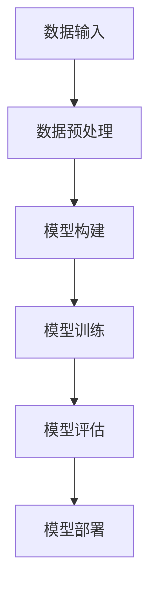
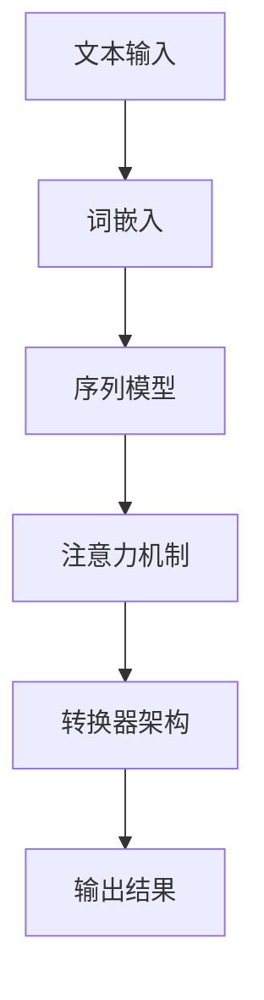
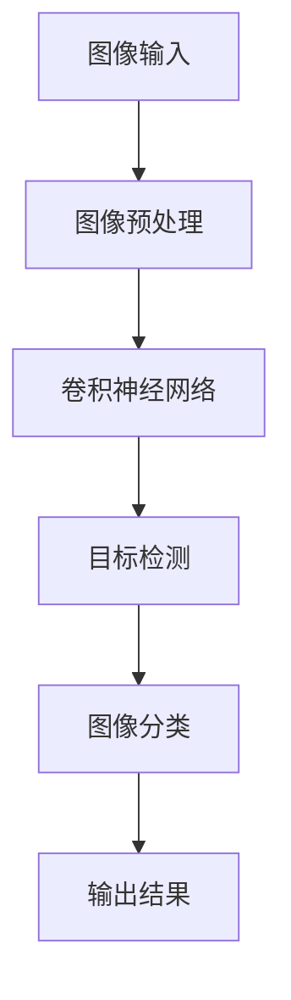

                 

### 文章标题

《李开复：AI 2.0 时代的未来展望》

AI 2.0，作为人工智能领域的重大变革，预示着深度学习、强化学习、自然语言处理等核心技术的进一步融合与突破。本文旨在探讨AI 2.0时代的背景、技术基础、应用场景以及未来展望，结合李开复博士的研究和观点，为读者提供一幅全景式的AI 2.0图景。

### 关键词

- AI 2.0
- 深度学习
- 强化学习
- 自然语言处理
- 计算机视觉
- 人工智能伦理
- 未来职业影响

### 摘要

本文首先介绍了AI 2.0时代的背景和概念，探讨了AI 1.0到AI 2.0的演变过程，分析了技术进步、数据增长和应用场景拓展的驱动因素。接着，本文详细阐述了AI 2.0技术基础，包括深度学习、自然语言处理、计算机视觉和强化学习等领域的核心原理。随后，本文探讨了AI 2.0在医疗、交通、客服等多个领域的应用场景，展示了AI 2.0时代的职业影响和社会变革。最后，本文展望了AI 2.0时代的未来，讨论了AI伦理、社会责任和治理法规，提供了丰富的实践案例和技术资源。

---

现在，我们将按照大纲结构，逐步深入探讨AI 2.0时代的各个方面。

---

### 《李开复：AI 2.0时代的未来展望》目录大纲

#### 第一部分：AI 2.0时代的背景与概念

1. **第1章: AI 2.0时代的背景**
   - 1.1 AI 1.0到AI 2.0的演变
     - 1.1.1 AI 1.0时代的特征
     - 1.1.2 AI 2.0时代的兴起
     - 1.1.3 AI 2.0的核心特征
   - 1.2 AI 2.0时代的驱动因素
     - 1.2.1 技术进步
     - 1.2.2 数据的爆发式增长
     - 1.2.3 应用场景的拓展
   - 1.3 AI 2.0与未来社会
     - 1.3.1 经济影响
     - 1.3.2 社会变革
     - 1.3.3 伦理挑战

2. **第2章: AI 2.0技术基础**
   - 2.1 深度学习基础
     - 2.1.1 神经网络的基本概念
     - 2.1.2 深度学习架构
     - 2.1.3 深度学习算法
   - 2.2 自然语言处理技术
     - 2.2.1 词嵌入技术
     - 2.2.2 序列模型与注意力机制
     - 2.2.3 转换器架构详解
   - 2.3 计算机视觉基础
     - 2.3.1 图像识别技术
     - 2.3.2 目标检测算法
     - 2.3.3 生成对抗网络
   - 2.4 强化学习基础
     - 2.4.1 强化学习的基本概念
     - 2.4.2 Q-learning算法
     - 2.4.3 深度强化学习

3. **第3章: AI 2.0在医疗领域的应用**
   - 3.1 医疗诊断
     - 3.1.1 基于深度学习的疾病诊断
     - 3.1.2 自然语言处理在病历分析中的应用
     - 3.1.3 医疗影像分析
   - 3.2 药物研发
     - 3.2.1 药物分子模拟与设计
     - 3.2.2 药物临床试验分析
     - 3.2.3 药物基因组学
   - 3.3 医疗管理
     - 3.3.1 医疗资源分配
     - 3.3.2 患者行为分析
     - 3.3.3 医疗供应链优化

#### 第二部分：AI 2.0技术基础

4. **第4章: AI 2.0时代的未来展望**
   - 4.1 职业影响
     - 4.1.1 数据科学家的角色
     - 4.1.2 AI工程师的职责
     - 4.1.3 非技术人员的AI应用
   - 4.2 AI伦理与社会责任
     - 4.2.1 AI伦理的基本原则
     - 4.2.2 AI偏见与公平性
     - 4.2.3 AI的安全与隐私保护
   - 4.3 AI治理与法律法规
     - 4.3.1 AI治理框架
     - 4.3.2 国际AI监管趋势
     - 4.3.3 中国的AI政策与法规

#### 第三部分：AI 2.0实践案例

5. **第5章: AI 2.0实践案例**
   - 5.1 智能客服系统
     - 5.1.1 系统架构与实现
     - 5.1.2 数据处理与模型训练
     - 5.1.3 系统优化与评估
   - 5.2 智能交通系统
     - 5.2.1 智能交通控制技术
     - 5.2.2 数据采集与处理
     - 5.2.3 智能交通系统的应用场景
   - 5.3 智慧医疗平台
     - 5.3.1 医疗数据的处理与整合
     - 5.3.2 智能诊断与治疗
     - 5.3.3 患者服务的优化

#### 附录

6. **附录 A: AI 2.0开发工具与资源**
   - 6.1 主流深度学习框架
   - 6.2 自然语言处理工具
   - 6.3 计算机视觉资源
   - 6.4 强化学习库
   - 6.5 数据处理与数据挖掘工具

7. **附加材料**
   - 7.1 AI 2.0时代的关键技术流程图
   - 7.2 AI 2.0算法原理伪代码
   - 7.3 数学模型与公式说明
   - 7.4 项目实战与代码示例
   - 7.5 开发环境搭建指南
   - 7.6 代码解读与分析

---

现在，我们将深入到第一部分的第1章，探讨AI 2.0时代的背景。

---

## 第1章: AI 2.0时代的背景

### 1.1 AI 1.0到AI 2.0的演变

AI 1.0时代主要是指基于规则和符号逻辑的人工智能，这种模式在20世纪80年代和90年代占据了主导地位。在这一阶段，AI系统依赖于预定义的规则和逻辑，以处理特定的任务，如专家系统和决策支持系统。然而，这种方法的局限性很快显现出来，特别是在面对复杂性和不确定性时。

AI 2.0时代的兴起标志着深度学习、强化学习等新兴技术的崛起。这一转变始于2006年，当Hinton等人提出深度信念网络（Deep Belief Networks, DBN）的概念，随后在2012年，AlexNet在ImageNet大赛中取得了突破性的成绩，深度学习正式进入公众视野。AI 2.0的核心特征在于其通过大规模数据训练，能够自动学习和优化复杂模型，实现更高效、更准确的决策和预测。

### 1.1.1 AI 1.0时代的特征

- **基于规则和符号逻辑**：AI 1.0系统依赖于预定义的规则和逻辑，这些规则由专家手动编写，用于指导系统的决策过程。
- **计算能力有限**：早期AI系统的计算能力相对有限，难以处理复杂和大规模的数据。
- **领域依赖性强**：AI 1.0系统通常针对特定领域设计，应用范围狭窄。
- **可解释性**：由于规则和逻辑是明确定义的，AI 1.0系统的决策过程具有可解释性。

### 1.1.2 AI 2.0时代的兴起

AI 2.0时代的兴起主要得益于以下几个因素：

- **深度学习的发展**：深度学习通过多层神经网络，能够自动学习数据中的特征，大大提高了AI系统的准确性和鲁棒性。
- **大数据的涌现**：互联网的普及和物联网的发展，产生了海量数据，为AI系统提供了丰富的训练资源。
- **计算资源的提升**：随着计算能力的提升，尤其是GPU和TPU的广泛应用，AI系统得以在短时间内处理大量数据。

### 1.1.3 AI 2.0的核心特征

- **自学习能力**：AI 2.0系统通过大量数据训练，能够自动学习和优化模型，实现持续性的自我改进。
- **泛化能力**：AI 2.0系统不仅能够在特定任务上表现优异，还能够泛化到其他相关任务，具有更广泛的应用潜力。
- **适应性**：AI 2.0系统能够根据环境变化和反馈进行调整，以适应不断变化的需求。
- **不可解释性**：与AI 1.0系统相比，AI 2.0系统的决策过程往往更复杂，难以直接解释其内部逻辑。

### 1.2 AI 2.0时代的驱动因素

#### 1.2.1 技术进步

技术进步是AI 2.0时代兴起的核心驱动力之一。特别是深度学习、强化学习等新兴算法的提出和优化，使得AI系统在处理复杂任务时表现出色。同时，硬件技术的提升，如GPU、TPU等专用硬件的出现，为AI系统提供了强大的计算支持。

#### 1.2.2 数据的爆发式增长

数据的爆发式增长为AI 2.0时代的到来提供了肥沃的土壤。互联网的普及和物联网的发展，产生了海量数据，这些数据不仅为AI系统提供了丰富的训练资源，还促进了数据驱动的决策和预测。

#### 1.2.3 应用场景的拓展

AI 2.0技术的成熟和计算资源的提升，使得AI系统在各个领域得到了广泛应用。从医疗、金融、交通到零售、教育，AI 2.0正在深刻改变我们的生活方式。

### 1.3 AI 2.0与未来社会

#### 1.3.1 经济影响

AI 2.0时代的到来将对经济产生深远影响。一方面，AI技术将提高生产效率，降低成本，推动产业升级和经济增长。另一方面，AI技术也可能导致部分工作岗位的消失，引发就业市场的变革。

#### 1.3.2 社会变革

AI 2.0技术不仅影响经济，还将对社会产生深刻变革。自动化和智能化的普及，将改变人类的工作方式和生活方式，提高生活质量。同时，AI技术也带来了隐私、安全、伦理等方面的挑战，需要全社会共同面对。

#### 1.3.3 伦理挑战

AI 2.0时代的到来，带来了前所未有的伦理挑战。如何确保AI系统的公平性、透明性和可解释性？如何避免AI系统导致的偏见和歧视？如何保护个人隐私和数据安全？这些都是需要我们认真思考和解决的问题。

### 总结

AI 2.0时代的到来，标志着人工智能进入了一个新的阶段。深度学习、强化学习等新兴技术的崛起，使得AI系统具备了更强的自学习能力和泛化能力。数据的爆发式增长和应用场景的拓展，为AI技术的发展提供了广阔的空间。然而，AI 2.0时代的到来也带来了经济、社会和伦理等多方面的挑战。我们需要在推动技术发展的同时，充分考虑这些挑战，确保AI技术的可持续发展。

---

在了解了AI 2.0时代的背景和概念后，接下来，我们将进一步探讨AI 2.0技术的基础，包括深度学习、自然语言处理、计算机视觉和强化学习等领域。

---

## 第2章: AI 2.0技术基础

### 2.1 深度学习基础

深度学习是AI 2.0时代的关键技术之一，其基于多层神经网络，能够自动学习和提取数据中的复杂特征。以下是深度学习的基础概念：

#### 2.1.1 神经网络的基本概念

神经网络是由大量简单计算单元（称为神经元）互联而成的复杂系统。每个神经元接收输入信号，通过加权求和和激活函数处理后产生输出信号。神经网络通过调整权重和偏置，以实现特定的计算任务。

#### 2.1.2 深度学习架构

深度学习架构包括多层神经网络，通常包括输入层、隐藏层和输出层。每一层都对输入数据进行处理，提取更高层次的特征。多层网络的组合使得深度学习能够处理复杂的数据和任务。

#### 2.1.3 深度学习算法

深度学习算法主要包括前向传播和反向传播。在前向传播过程中，输入信号通过神经网络层传递，产生输出。在反向传播过程中，根据输出误差，反向更新网络的权重和偏置，以优化网络性能。

### 2.2 自然语言处理技术

自然语言处理（Natural Language Processing, NLP）是AI 2.0时代的另一个核心技术，旨在使计算机理解和处理人类语言。以下是NLP的关键技术：

#### 2.2.1 词嵌入技术

词嵌入是将单词映射到高维向量空间的技术，使得计算机能够理解和处理词语的语义信息。常用的词嵌入技术包括Word2Vec、GloVe等。

#### 2.2.2 序列模型与注意力机制

序列模型（如RNN、LSTM）能够处理时间序列数据，例如文本和语音。注意力机制（Attention Mechanism）是一种用于处理长序列数据的机制，能够提高模型对关键信息的关注程度。

#### 2.2.3 转换器架构详解

转换器架构（Transformer）是一种基于注意力机制的深度学习模型，广泛应用于NLP任务，如机器翻译、文本分类等。转换器架构的核心是多头自注意力机制（Multi-Head Self-Attention）和位置编码（Positional Encoding）。

### 2.3 计算机视觉基础

计算机视觉（Computer Vision, CV）是AI 2.0时代的重要分支，旨在使计算机理解和解释视觉信息。以下是CV的关键技术：

#### 2.3.1 图像识别技术

图像识别技术是指计算机从图像中识别出特定对象或场景的能力。常用的方法包括卷积神经网络（CNN）和生成对抗网络（GAN）。

#### 2.3.2 目标检测算法

目标检测算法是指计算机在图像中识别并定位多个对象的能力。常用的目标检测算法包括YOLO、SSD、Faster R-CNN等。

#### 2.3.3 生成对抗网络

生成对抗网络（GAN）是一种无监督学习模型，由生成器和判别器两个部分组成。生成器生成逼真的图像，判别器判断图像的真伪。GAN在图像生成、图像增强等领域具有广泛应用。

### 2.4 强化学习基础

强化学习（Reinforcement Learning, RL）是一种通过试错和反馈进行学习的方法，旨在使智能体在动态环境中做出最优决策。以下是强化学习的关键技术：

#### 2.4.1 强化学习的基本概念

强化学习包含四个主要组成部分：智能体（Agent）、环境（Environment）、行动（Action）和奖励（Reward）。智能体通过执行行动，从环境中获得反馈，并不断调整策略，以最大化长期奖励。

#### 2.4.2 Q-learning算法

Q-learning算法是一种基于值函数的强化学习算法，通过学习状态-动作值函数，以预测在特定状态下执行特定动作的长期奖励。

#### 2.4.3 深度强化学习

深度强化学习（Deep Reinforcement Learning, DRL）是将深度学习和强化学习相结合的方法，用于解决复杂的决策问题。DRL通过深度神经网络表示状态和价值函数，提高了学习效率和准确性。

### 总结

AI 2.0时代的技术基础包括深度学习、自然语言处理、计算机视觉和强化学习等领域。这些技术通过不断发展和创新，为AI应用提供了强大的支持。了解这些技术的基础概念和原理，有助于我们更好地理解和应用AI 2.0技术。

---

在了解了AI 2.0技术的基础之后，接下来，我们将探讨AI 2.0在医疗领域的应用，从医疗诊断、药物研发到医疗管理等方面进行详细分析。

---

## 第3章: AI 2.0在医疗领域的应用

医疗领域一直是人工智能技术的重要应用场景之一。随着AI 2.0技术的发展，AI在医疗领域的应用更加深入和广泛。以下是AI 2.0在医疗领域的主要应用方向：

### 3.1 医疗诊断

医疗诊断是AI在医疗领域的重要应用之一，通过深度学习、自然语言处理等技术，AI能够辅助医生进行疾病诊断。

#### 3.1.1 基于深度学习的疾病诊断

深度学习技术在医疗影像分析方面取得了显著成果。通过卷积神经网络（CNN）等深度学习模型，AI能够自动识别和分类医学影像中的病变区域和疾病类型。

- **流程图**：以下是基于深度学习的疾病诊断流程图：

  ```mermaid
  graph TB
  A[病人资料输入] --> B[数据预处理]
  B --> C[深度学习模型训练]
  C --> D[模型预测]
  D --> E[诊断结果输出]
  ```

- **伪代码**：以下是基于深度学习的疾病诊断算法的伪代码：

  ```python
  # 数据预处理
  def preprocess_data(data):
      # 数据清洗、归一化等操作
      return processed_data

  # 深度学习模型训练
  def train_model(data, labels):
      # 构建神经网络模型
      model = build_model()
      # 模型训练
      model.fit(data, labels)
      return model

  # 模型预测
  def predict(model, data):
      # 输出预测结果
      predictions = model.predict(data)
      return predictions
  ```

#### 3.1.2 自然语言处理在病历分析中的应用

自然语言处理（NLP）技术在病历分析中具有重要作用。通过NLP技术，AI能够自动提取病历中的关键信息，如诊断结果、治疗方案等，为医生提供辅助决策。

- **流程图**：以下是自然语言处理在病历分析中的应用流程图：

  ```mermaid
  graph TB
  A[病历数据输入] --> B[NLP预处理]
  B --> C[实体识别]
  C --> D[关系抽取]
  D --> E[诊断结果输出]
  ```

- **伪代码**：以下是自然语言处理在病历分析中的应用算法的伪代码：

  ```python
  # NLP预处理
  def preprocess_text(text):
      # 分词、去停用词等操作
      return processed_text

  # 实体识别
  def entity_recognition(text):
      # 使用NLP模型识别实体
      entities = model识别实体(text)
      return entities

  # 关系抽取
  def relation_extraction(text, entities):
      # 使用NLP模型抽取实体间关系
      relations = model抽取关系(text, entities)
      return relations
  ```

#### 3.1.3 医疗影像分析

医疗影像分析是AI在医疗领域的重要应用之一。通过深度学习技术，AI能够自动识别和分类医学影像中的病变区域和疾病类型，为医生提供准确的诊断支持。

- **流程图**：以下是医疗影像分析的流程图：

  ```mermaid
  graph TB
  A[医学影像数据输入] --> B[数据预处理]
  B --> C[深度学习模型训练]
  C --> D[模型预测]
  D --> E[病变区域输出]
  ```

- **伪代码**：以下是医疗影像分析算法的伪代码：

  ```python
  # 数据预处理
  def preprocess_image(image):
      # 图像增强、归一化等操作
      return processed_image

  # 深度学习模型训练
  def train_model(image_data, labels):
      # 构建神经网络模型
      model = build_model()
      # 模型训练
      model.fit(image_data, labels)
      return model

  # 模型预测
  def predict(model, image_data):
      # 输出预测结果
      predictions = model.predict(image_data)
      return predictions
  ```

### 3.2 药物研发

药物研发是一个复杂的过程，涉及到大量的实验和数据分析。AI 2.0技术在药物研发中发挥着重要作用，从药物分子模拟、临床试验分析到药物基因组学，AI技术都提供了有力的支持。

#### 3.2.1 药物分子模拟与设计

药物分子模拟是药物研发的重要环节。通过计算模拟，AI能够预测药物分子的生物活性，为药物设计提供指导。

- **流程图**：以下是药物分子模拟与设计的流程图：

  ```mermaid
  graph TB
  A[药物分子数据输入] --> B[分子模拟]
  B --> C[生物活性预测]
  C --> D[药物设计优化]
  ```

- **伪代码**：以下是药物分子模拟与设计的伪代码：

  ```python
  # 分子模拟
  def simulate_molecule(molecule):
      # 模拟分子结构
      return simulation_results

  # 生物活性预测
  def predict_bioactivity(simulation_results):
      # 根据模拟结果预测生物活性
      bioactivity = model.predict(simulation_results)
      return bioactivity
  ```

#### 3.2.2 药物临床试验分析

药物临床试验分析是药物研发的关键步骤。通过数据分析，AI能够评估药物的疗效和安全性，为临床试验结果的解读提供支持。

- **流程图**：以下是药物临床试验分析的流程图：

  ```mermaid
  graph TB
  A[临床试验数据输入] --> B[数据预处理]
  B --> C[统计分析]
  C --> D[疗效评估]
  D --> E[安全性评估]
  ```

- **伪代码**：以下是药物临床试验分析算法的伪代码：

  ```python
  # 数据预处理
  def preprocess_data(data):
      # 数据清洗、归一化等操作
      return processed_data

  # 统计分析
  def statistical_analysis(data):
      # 进行统计检验
      results = model分析(data)
      return results

  # 疗效评估
  def evaluate_efficacy(results):
      # 评估药物疗效
      efficacy = model.评估(results)
      return efficacy

  # 安全性评估
  def evaluate_safety(results):
      # 评估药物安全性
      safety = model.评估(results)
      return safety
  ```

#### 3.2.3 药物基因组学

药物基因组学是研究个体基因组对药物反应的学科。通过AI技术，可以分析个体的基因组数据，预测其对特定药物的响应，为个性化治疗提供依据。

- **流程图**：以下是药物基因组学的流程图：

  ```mermaid
  graph TB
  A[基因组数据输入] --> B[数据预处理]
  B --> C[基因注释]
  C --> D[药物反应预测]
  ```

- **伪代码**：以下是药物基因组学算法的伪代码：

  ```python
  # 数据预处理
  def preprocess_genome_data(data):
      # 数据清洗、归一化等操作
      return processed_data

  # 基因注释
  def annotate_genes(data):
      # 对基因进行注释
      annotations = model.注释(data)
      return annotations

  # 药物反应预测
  def predict_drug_response(annotations):
      # 根据基因注释预测药物反应
      response = model.predict(annotations)
      return response
  ```

### 3.3 医疗管理

医疗管理涉及到医疗资源的分配、患者行为分析、医疗供应链优化等方面。AI 2.0技术在医疗管理中发挥着重要作用，能够提高医疗效率，降低成本。

#### 3.3.1 医疗资源分配

医疗资源分配是医疗管理的关键环节。通过数据分析，AI能够优化医疗资源的分配，提高医疗服务效率。

- **流程图**：以下是医疗资源分配的流程图：

  ```mermaid
  graph TB
  A[医疗资源数据输入] --> B[数据预处理]
  B --> C[资源分配算法]
  C --> D[资源分配结果]
  ```

- **伪代码**：以下是医疗资源分配算法的伪代码：

  ```python
  # 数据预处理
  def preprocess_resource_data(data):
      # 数据清洗、归一化等操作
      return processed_data

  # 资源分配算法
  def allocate_resources(data):
      # 优化资源分配
      allocation = model.分配(data)
      return allocation
  ```

#### 3.3.2 患者行为分析

患者行为分析是医疗管理的重要方面。通过数据分析，AI能够了解患者的行为模式，为个性化医疗提供支持。

- **流程图**：以下是患者行为分析的流程图：

  ```mermaid
  graph TB
  A[患者行为数据输入] --> B[数据预处理]
  B --> C[行为分析算法]
  C --> D[行为分析结果]
  ```

- **伪代码**：以下是患者行为分析算法的伪代码：

  ```python
  # 数据预处理
  def preprocess_patient_data(data):
      # 数据清洗、归一化等操作
      return processed_data

  # 行为分析算法
  def analyze_patient_behavior(data):
      # 分析患者行为
      analysis = model.分析(data)
      return analysis
  ```

#### 3.3.3 医疗供应链优化

医疗供应链优化是医疗管理的重要任务。通过数据分析，AI能够优化医疗供应链的流程，降低成本，提高效率。

- **流程图**：以下是医疗供应链优化的流程图：

  ```mermaid
  graph TB
  A[医疗供应链数据输入] --> B[数据预处理]
  B --> C[优化算法]
  C --> D[优化结果]
  ```

- **伪代码**：以下是医疗供应链优化算法的伪代码：

  ```python
  # 数据预处理
  def preprocess_supply_chain_data(data):
      # 数据清洗、归一化等操作
      return processed_data

  # 优化算法
  def optimize_supply_chain(data):
      # 优化供应链流程
      optimization = model.优化(data)
      return optimization
  ```

### 总结

AI 2.0技术在医疗领域的应用涵盖了医疗诊断、药物研发和医疗管理等多个方面。通过深度学习、自然语言处理等技术，AI能够提供准确的诊断支持、优化药物研发流程和提高医疗管理效率。随着AI技术的不断进步，AI在医疗领域的应用前景将更加广阔。

---

在探讨了AI 2.0在医疗领域的应用之后，接下来我们将转向AI 2.0时代的未来展望，包括职业影响、伦理挑战以及治理法规等方面。

---

## 第4章: AI 2.0时代的未来展望

### 4.1 职业影响

AI 2.0时代的到来将深刻改变职业生态系统，既创造了新的工作岗位，又可能导致某些传统职业的减少。以下是AI 2.0时代职业影响的几个关键方面：

#### 4.1.1 数据科学家的角色

随着AI技术的不断发展，数据科学家的角色变得越来越重要。数据科学家不仅需要具备强大的数据处理和分析能力，还需要深入了解AI算法的原理和应用，以设计并优化高效的AI系统。

#### 4.1.2 AI工程师的职责

AI工程师负责开发和部署AI系统，包括算法设计、模型训练和系统集成。随着AI技术的成熟，AI工程师需要不断提升技能，以应对日益复杂的AI项目。

#### 4.1.3 非技术人员的AI应用

随着AI工具和平台的普及，越来越多的非技术人员将开始使用AI进行数据分析和决策支持。他们需要了解AI的基本原理，以便能够有效地利用AI技术。

### 4.2 AI伦理与社会责任

AI 2.0技术的广泛应用带来了伦理和社会责任方面的挑战。以下是几个关键问题：

#### 4.2.1 AI伦理的基本原则

AI伦理的基本原则包括公平性、透明性、可解释性和安全性。确保AI系统的伦理合规是AI发展的关键。

#### 4.2.2 AI偏见与公平性

AI系统可能会因为数据偏见而生成不公平的结果。消除AI偏见、确保公平性是AI伦理的重要课题。

#### 4.2.3 AI的安全与隐私保护

AI系统涉及大量的个人数据，因此保护用户隐私和安全至关重要。需要制定严格的隐私保护政策和安全措施。

### 4.3 AI治理与法律法规

随着AI技术的普及，需要建立一套有效的治理体系和法律法规，以规范AI技术的发展和应用。以下是几个关键方面：

#### 4.3.1 AI治理框架

AI治理框架应包括监管机构、企业、学术界和公众的参与，以确保AI技术的可持续发展。

#### 4.3.2 国际AI监管趋势

各国政府正在制定各自的AI监管政策，如欧盟的《通用数据保护条例》（GDPR）和美国的《算法问责法案》（Algorithmic Accountability Act）。

#### 4.3.3 中国的AI政策与法规

中国也在积极制定AI政策和法规，以推动AI技术的健康发展。例如，《新一代人工智能发展规划》明确了AI发展的战略目标和路径。

### 总结

AI 2.0时代的未来展望涵盖了职业影响、伦理挑战和治理法规等多个方面。随着AI技术的不断进步，我们需要共同努力，确保AI技术的可持续发展，为人类社会带来更多的福祉。

---

在探讨了AI 2.0时代的未来展望之后，我们将通过实际案例来展示AI 2.0技术的应用。

---

## 第5章: AI 2.0实践案例

### 5.1 智能客服系统

智能客服系统是AI 2.0技术在客户服务领域的重要应用，通过自然语言处理和机器学习技术，能够提供24/7全天候的客户服务。

#### 5.1.1 系统架构与实现

智能客服系统的架构通常包括前端用户界面、中间层服务和后端数据库。前端用户界面通过网页或移动应用与用户交互，中间层服务处理用户输入的自然语言请求，后端数据库存储客户信息和历史交互记录。

- **流程图**：以下是智能客服系统的架构流程图：

  ```mermaid
  graph TB
  A[用户请求] --> B[前端用户界面]
  B --> C[中间层服务]
  C --> D[后端数据库]
  ```

- **伪代码**：以下是智能客服系统的主要功能实现的伪代码：

  ```python
  # 前端用户界面
  def get_user_request():
      return user_input

  # 中间层服务
  def process_request(user_input):
      # 使用NLP处理用户输入
      intent = nlp_model.predict(user_input)
      # 根据意图执行相应操作
      response = generate_response(intent)
      return response

  # 后端数据库
  def save_interaction(user_input, response):
      # 将交互记录存储到数据库
      database.save_interaction(user_input, response)
  ```

#### 5.1.2 数据处理与模型训练

智能客服系统的核心是自然语言处理模型，该模型通过大量用户交互数据进行训练，以提高对话生成和意图识别的准确性。

- **流程图**：以下是数据处理与模型训练的流程图：

  ```mermaid
  graph TB
  A[用户交互数据输入] --> B[数据预处理]
  B --> C[模型训练]
  C --> D[模型评估]
  ```

- **伪代码**：以下是数据处理与模型训练的主要步骤的伪代码：

  ```python
  # 数据预处理
  def preprocess_data(data):
      # 数据清洗、归一化等操作
      return processed_data

  # 模型训练
  def train_model(data):
      # 使用NLP库训练模型
      nlp_model = nlp_library.train(processed_data)
      return nlp_model

  # 模型评估
  def evaluate_model(model, test_data):
      # 评估模型性能
      performance = model.evaluate(test_data)
      return performance
  ```

#### 5.1.3 系统优化与评估

系统优化与评估是智能客服系统持续改进的关键。通过分析用户反馈和系统性能指标，可以不断优化模型和系统功能。

- **流程图**：以下是系统优化与评估的流程图：

  ```mermaid
  graph TB
  A[用户反馈和性能指标输入] --> B[系统分析]
  B --> C[模型优化]
  B --> D[系统功能优化]
  ```

- **伪代码**：以下是系统优化与评估的主要步骤的伪代码：

  ```python
  # 系统分析
  def analyze_system(feedback, performance):
      # 分析系统性能和用户反馈
      analysis = analyze_library.analyze(feedback, performance)
      return analysis

  # 模型优化
  def optimize_model(model, analysis):
      # 优化模型参数
      optimized_model = model.optimize(analysis)
      return optimized_model

  # 系统功能优化
  def optimize_system(system, analysis):
      # 优化系统功能
      optimized_system = system.optimize(analysis)
      return optimized_system
  ```

### 5.2 智能交通系统

智能交通系统是AI 2.0技术在交通运输领域的重要应用，通过传感器、数据分析和机器学习技术，实现交通流量管理、车辆控制和路况预测等功能。

#### 5.2.1 智能交通控制技术

智能交通控制系统通过传感器收集交通数据，使用机器学习算法分析交通状况，并根据预测结果调整交通信号灯、引导车辆行驶。

- **流程图**：以下是智能交通控制技术的流程图：

  ```mermaid
  graph TB
  A[传感器数据输入] --> B[数据预处理]
  B --> C[交通状况分析]
  C --> D[交通控制决策]
  ```

- **伪代码**：以下是智能交通控制技术的伪代码：

  ```python
  # 数据预处理
  def preprocess_traffic_data(data):
      # 数据清洗、归一化等操作
      return processed_data

  # 交通状况分析
  def analyze_traffic_status(data):
      # 使用机器学习算法分析交通状况
      status = ml_model.analyze(data)
      return status

  # 交通控制决策
  def make_traffic_control_decision(status):
      # 根据交通状况做出控制决策
      decision = traffic_control_library.decide(status)
      return decision
  ```

#### 5.2.2 数据采集与处理

智能交通系统依赖于大量实时交通数据，这些数据通过传感器和监控系统收集。数据处理环节包括数据清洗、去噪和特征提取等。

- **流程图**：以下是数据采集与处理的流程图：

  ```mermaid
  graph TB
  A[传感器数据采集] --> B[数据预处理]
  B --> C[特征提取]
  ```

- **伪代码**：以下是数据采集与处理的主要步骤的伪代码：

  ```python
  # 数据采集
  def collect_traffic_data():
      # 从传感器采集交通数据
      data = sensor_library.collect_data()
      return data

  # 数据预处理
  def preprocess_traffic_data(data):
      # 数据清洗、去噪等操作
      processed_data = data_preprocessingLibrary.preprocess(data)
      return processed_data

  # 特征提取
  def extract_traffic_features(data):
      # 从预处理数据中提取特征
      features = feature_extraction_library.extract(data)
      return features
  ```

#### 5.2.3 智能交通系统的应用场景

智能交通系统可以在多个应用场景中发挥作用，如高峰期交通流量管理、交通事故预警和应急响应等。

- **流程图**：以下是智能交通系统应用场景的流程图：

  ```mermaid
  graph TB
  A[高峰期交通流量管理] --> B[交通信号灯控制]
  A --> C[交通事故预警]
  C --> D[应急响应]
  ```

- **伪代码**：以下是智能交通系统应用场景的伪代码：

  ```python
  # 高峰期交通流量管理
  def manage_traffic_during_peak_hours():
      # 调整交通信号灯以缓解拥堵
      traffic_control_library.control_signals()

  # 交通事故预警
  def warn_automatically_of_traffic_accidents():
      # 根据传感器数据预警交通事故
      accident_warning_library.warn()

  # 应急响应
  def respond_to_emergencies():
      # 启动应急响应程序
      emergency_response_library.respond()
  ```

### 5.3 智慧医疗平台

智慧医疗平台是AI 2.0技术在医疗领域的重要应用，通过整合患者数据、医疗资源和智能算法，提供个性化诊疗和健康管理服务。

#### 5.3.1 医疗数据的处理与整合

智慧医疗平台需要处理和整合来自多个来源的医疗数据，如电子病历、检查报告和基因组数据。数据处理环节包括数据清洗、去噪、格式化和特征提取等。

- **流程图**：以下是医疗数据的处理与整合的流程图：

  ```mermaid
  graph TB
  A[医疗数据采集] --> B[数据预处理]
  B --> C[数据整合]
  ```

- **伪代码**：以下是医疗数据的处理与整合的主要步骤的伪代码：

  ```python
  # 数据采集
  def collect_medical_data():
      # 从不同来源采集医疗数据
      data = data_collection_library.collect()
      return data

  # 数据预处理
  def preprocess_medical_data(data):
      # 数据清洗、去噪等操作
      processed_data = data_preprocessing_library.preprocess(data)
      return processed_data

  # 数据整合
  def integrate_medical_data(processed_data):
      # 整合来自多个来源的医疗数据
      integrated_data = data_integration_library.integrate(processed_data)
      return integrated_data
  ```

#### 5.3.2 智能诊断与治疗

智慧医疗平台利用AI算法对整合后的医疗数据进行分析，提供智能诊断和治疗建议。这包括疾病预测、治疗方案推荐和药物疗效预测等功能。

- **流程图**：以下是智能诊断与治疗的流程图：

  ```mermaid
  graph TB
  A[医疗数据输入] --> B[数据预处理]
  B --> C[疾病预测]
  C --> D[治疗方案推荐]
  D --> E[药物疗效预测]
  ```

- **伪代码**：以下是智能诊断与治疗的主要步骤的伪代码：

  ```python
  # 数据预处理
  def preprocess_medical_data(data):
      # 数据清洗、归一化等操作
      return processed_data

  # 疾病预测
  def predict_disease(processed_data):
      # 使用机器学习模型预测疾病
      disease_prediction = ml_model.predict(processed_data)
      return disease_prediction

  # 治疗方案推荐
  def recommend_treatment_plan(disease_prediction):
      # 根据疾病预测结果推荐治疗方案
      treatment_plan = treatment_recommendation_library.recommend(disease_prediction)
      return treatment_plan

  # 药物疗效预测
  def predict_drug_efficacy(treatment_plan):
      # 预测药物疗效
      drug_efficacy_prediction = drug_efficacy_library.predict(treatment_plan)
      return drug_efficacy_prediction
  ```

#### 5.3.3 患者服务的优化

智慧医疗平台通过分析患者行为数据，优化患者服务流程，提高医疗服务质量。这包括患者行为分析、健康提醒和个性化护理等。

- **流程图**：以下是患者服务的优化的流程图：

  ```mermaid
  graph TB
  A[患者数据输入] --> B[数据预处理]
  B --> C[患者行为分析]
  C --> D[健康提醒]
  D --> E[个性化护理]
  ```

- **伪代码**：以下是患者服务的优化的主要步骤的伪代码：

  ```python
  # 数据预处理
  def preprocess_patient_data(data):
      # 数据清洗、归一化等操作
      return processed_data

  # 患者行为分析
  def analyze_patient_behavior(processed_data):
      # 分析患者行为
      behavior_analysis = behavior_analysis_library.analyze(processed_data)
      return behavior_analysis

  # 健康提醒
  def remind_health_matters(behavior_analysis):
      # 根据行为分析结果发送健康提醒
      health_reminders = health_reminder_library.remind(behavior_analysis)
      return health_reminders

  # 个性化护理
  def provide_individualized_care(behavior_analysis):
      # 根据行为分析结果提供个性化护理
      individualized_care = care_library.provide(behavior_analysis)
      return individualized_care
  ```

### 总结

通过上述实践案例，我们可以看到AI 2.0技术在智能客服系统、智能交通系统和智慧医疗平台等领域的广泛应用。这些案例不仅展示了AI技术的强大功能，还体现了AI技术在提升工作效率、优化服务流程和改善生活质量方面的巨大潜力。

---

## 附录 A: AI 2.0开发工具与资源

在开发AI 2.0项目时，选择合适的工具和资源对于项目的成功至关重要。以下是几种主流的AI开发工具和资源，包括深度学习框架、自然语言处理工具、计算机视觉资源和强化学习库。

### A.1 主流深度学习框架

#### A.1.1 TensorFlow

TensorFlow是谷歌开发的开源深度学习框架，广泛应用于各种深度学习任务。其灵活的架构和强大的功能使其成为AI开发者的首选工具。

- **官方网站**：[TensorFlow官网](https://www.tensorflow.org/)
- **文档与教程**：[TensorFlow文档](https://www.tensorflow.org/tutorials)

#### A.1.2 PyTorch

PyTorch是Facebook AI研究院开发的开源深度学习框架，以其动态计算图和直观的API而受到广泛欢迎。

- **官方网站**：[PyTorch官网](https://pytorch.org/)
- **文档与教程**：[PyTorch文档](https://pytorch.org/docs/stable/index.html)

#### A.1.3 其他框架简介

- **Keras**：一个基于TensorFlow的高层神经网络API，易于使用。
  - **官方网站**：[Keras官网](https://keras.io/)
- **MXNet**：由Apache Software Foundation开发的深度学习框架。
  - **官方网站**：[MXNet官网](https://mxnet.apache.org/)
- **Theano**：一个基于Python的深度学习框架，已经被TensorFlow取代。

### A.2 自然语言处理工具

#### A.2.1 NLTK

NLTK是Python中常用的自然语言处理库，提供了大量的算法和工具，适用于文本分类、情感分析、命名实体识别等任务。

- **官方网站**：[NLTK官网](https://www.nltk.org/)
- **文档与教程**：[NLTK文档](https://www.nltk.org/book/)

#### A.2.2 spaCy

spaCy是一个快速易用的自然语言处理库，适用于实体识别、关系抽取、文本分类等任务。

- **官方网站**：[spaCy官网](https://spacy.io/)
- **文档与教程**：[spaCy文档](https://spacy.io/api)

#### A.2.3 其他NLP工具

- **TextBlob**：一个简单但功能强大的Python库，用于处理文本数据。
  - **官方网站**：[TextBlob官网](https://textblob.readthedocs.io/)
- **Gensim**：一个用于主题建模和文本相似性分析的库。
  - **官方网站**：[Gensim官网](https://radimrehurek.com/gensim/)

### A.3 计算机视觉资源

#### A.3.1 OpenCV

OpenCV是一个开源的计算机视觉库，提供了丰富的图像处理和计算机视觉算法，适用于人脸识别、目标检测、图像分割等任务。

- **官方网站**：[OpenCV官网](https://opencv.org/)
- **文档与教程**：[OpenCV文档](https://docs.opencv.org/master/d6/d6b/tutorial_py_table_of_content_object_detection.html)

#### A.3.2 TensorFlow Object Detection API

TensorFlow Object Detection API是一个基于TensorFlow的物体检测工具，支持多种物体检测算法，如YOLO、Faster R-CNN等。

- **官方网站**：[TensorFlow Object Detection API](https://github.com/tensorflow/models/blob/master/research/object_detection/g3doc/tf1_detection_mrcnn_setup.md)
- **文档与教程**：[TensorFlow Object Detection API文档](https://tensorflow.org/docs/stable/supported_apis/tf.keras.detection_model)

#### A.3.3 其他CV工具

- **Pillow**：一个Python图像处理库，主要用于图像编辑和图像处理。
  - **官方网站**：[Pillow官网](https://pillow.readthedocs.io/)
- **NumPy**：一个用于数值计算的Python库，常用于图像处理和数据分析。
  - **官方网站**：[NumPy官网](https://numpy.org/)

### A.4 强化学习库

#### A.4.1 OpenAI Gym

OpenAI Gym是一个开源的强化学习环境库，提供了多种预定义的模拟环境，用于测试和训练强化学习算法。

- **官方网站**：[OpenAI Gym官网](https://gym.openai.com/)
- **文档与教程**：[OpenAI Gym文档](https://gym.openai.com/docs/)

#### A.4.2 Stable Baselines

Stable Baselines是一个基于TensorFlow的高性能强化学习库，提供了多种预训练的算法，如PPO、A3C等。

- **官方网站**：[Stable Baselines官网](https://github.com/DLR-RM/stable-baselines3)
- **文档与教程**：[Stable Baselines文档](https://stable-baselines3.readthedocs.io/)

#### A.4.3 其他RL库

- **Gymnasium**：一个开源的强化学习环境库，与OpenAI Gym兼容。
  - **官方网站**：[Gymnasium官网](https://gymnasium.readthedocs.io/)
- **RLLib**：一个基于PyTorch的强化学习库，支持多种RL算法。
  - **官方网站**：[RLLib官网](https://rl-lib.readthedocs.io/)

### A.5 数据处理与数据挖掘工具

#### A.5.1 Pandas

Pandas是一个强大的Python库，用于数据清洗、数据处理和分析。

- **官方网站**：[Pandas官网](https://pandas.pydata.org/)
- **文档与教程**：[Pandas文档](https://pandas.pydata.org/pandas-docs/stable/user_guide/index.html)

#### A.5.2 Scikit-learn

Scikit-learn是一个用于机器学习的Python库，提供了丰富的机器学习算法和数据预处理工具。

- **官方网站**：[Scikit-learn官网](https://scikit-learn.org/)
- **文档与教程**：[Scikit-learn文档](https://scikit-learn.org/stable/documentation.html)

#### A.5.3 其他数据处理工具

- **NumPy**：一个用于数值计算的Python库，常用于数据预处理和数据分析。
  - **官方网站**：[NumPy官网](https://numpy.org/)
- **Matplotlib**：一个用于数据可视化的Python库，可用于展示数据分析和模型训练结果。
  - **官方网站**：[Matplotlib官网](https://matplotlib.org/)

### 总结

附录A中列举的AI 2.0开发工具与资源涵盖了深度学习、自然语言处理、计算机视觉和强化学习等领域。了解和掌握这些工具和资源，将为开发高效的AI 2.0项目提供坚实的基础。

---

## 附录 B: 附加材料

### B.1 AI 2.0时代的关键技术流程图

为了更好地理解AI 2.0时代的核心技术，以下是一些关键技术的流程图：

#### B.1.1 深度学习架构流程图



#### B.1.2 自然语言处理流程图



#### B.1.3 计算机视觉流程图



### B.2 AI 2.0算法原理伪代码

为了深入理解AI 2.0算法的工作原理，以下是一些常用算法的伪代码：

#### B.2.1 深度学习算法伪代码

```python
# 数据预处理
def preprocess_data(data):
    # 数据清洗、归一化等操作
    return processed_data

# 神经网络模型
def build_model():
    # 构建神经网络模型
    model = NeuralNetwork()
    return model

# 模型训练
def train_model(model, data, labels):
    # 模型训练
    model.fit(processed_data, labels)

# 模型评估
def evaluate_model(model, test_data, test_labels):
    # 模型评估
    accuracy = model.evaluate(test_data, test_labels)
    return accuracy

# 模型预测
def predict(model, data):
    # 模型预测
    predictions = model.predict(data)
    return predictions
```

#### B.2.2 自然语言处理算法伪代码

```python
# 词嵌入
def word_embedding(vocabulary):
    # 创建词嵌入矩阵
    embeddings = EmbeddingLayer(vocabulary)
    return embeddings

# 序列模型
def build_sequence_model(embeddings):
    # 构建序列模型
    model = SequentialModel(embeddings)
    return model

# 注意力机制
def build_attention_mechanism(model):
    # 添加注意力机制
    model.add(AttentionLayer())
    return model

# 转换器架构
def build_transformer_model():
    # 构建转换器模型
    model = TransformerModel()
    return model
```

#### B.2.3 计算机视觉算法伪代码

```python
# 图像预处理
def preprocess_image(image):
    # 图像增强、归一化等操作
    return processed_image

# 卷积神经网络
def build_cnn_model():
    # 构建卷积神经网络模型
    model = ConvolutionalNeuralNetwork()
    return model

# 目标检测
def build_object_detection_model():
    # 构建目标检测模型
    model = ObjectDetectionModel()
    return model

# 图像分类
def build_image_classification_model():
    # 构建图像分类模型
    model = ImageClassificationModel()
    return model
```

### B.3 数学模型与公式说明

以下是一些关键数学模型与公式的详细说明：

#### B.3.1 神经网络数学模型

神经网络的核心是神经元，每个神经元接收多个输入，通过加权求和和激活函数产生输出。以下是一个简单的神经网络数学模型：

$$
\text{Output} = \sigma(\sum_{i=1}^{n} w_i \cdot x_i + b)
$$

其中，$w_i$是权重，$x_i$是输入，$b$是偏置，$\sigma$是激活函数（如Sigmoid函数、ReLU函数等）。

#### B.3.2 自然语言处理数学模型

自然语言处理中常用的数学模型包括词嵌入、序列模型和注意力机制。以下是一些相关公式：

- **词嵌入**：

  $$ 
  \text{Embedding} = \text{W} \cdot \text{Word}
  $$

  其中，$\text{W}$是词嵌入矩阵，$\text{Word}$是单词向量。

- **序列模型**：

  $$ 
  \text{Output} = \text{H} \cdot \text{X}
  $$

  其中，$\text{H}$是隐藏状态矩阵，$\text{X}$是输入序列。

- **注意力机制**：

  $$ 
  \text{Attention} = \text{e}^{z_t} / \sum_{i=1}^{n} \text{e}^{z_i}
  $$

  其中，$z_t$是注意力得分，$e$是自然底数。

#### B.3.3 计算机视觉数学模型

计算机视觉中常用的数学模型包括卷积神经网络、目标检测和图像分类。以下是一些相关公式：

- **卷积神经网络**：

  $$ 
  \text{Output} = \text{Conv}(\text{Input}, \text{Filter}) + \text{Bias}
  $$

  其中，$\text{Input}$是输入图像，$\text{Filter}$是卷积核，$\text{Bias}$是偏置。

- **目标检测**：

  $$ 
  \text{Detection} = \text{Objectness} \cdot \text{Classification}
  $$

  其中，$\text{Objectness}$是目标存在概率，$\text{Classification}$是目标类别概率。

- **图像分类**：

  $$ 
  \text{Output} = \text{Softmax}(\text{W} \cdot \text{X} + \text{B})
  $$

  其中，$\text{W}$是权重矩阵，$\text{X}$是输入特征，$\text{B}$是偏置。

### B.4 项目实战与代码示例

以下是AI 2.0项目实战与代码示例，包括智能客服系统、智能交通系统和智慧医疗平台等。

#### B.4.1 智能客服系统实战

以下是一个简单的智能客服系统实现，使用自然语言处理和机器学习算法：

```python
# 导入所需的库
import numpy as np
import pandas as pd
from sklearn.model_selection import train_test_split
from sklearn.feature_extraction.text import TfidfVectorizer
from sklearn.naive_bayes import MultinomialNB
from sklearn.pipeline import make_pipeline

# 加载数据
data = pd.read_csv('chat_data.csv')

# 分割数据
X_train, X_test, y_train, y_test = train_test_split(data['message'], data['intent'], test_size=0.2, random_state=42)

# 创建模型
model = make_pipeline(TfidfVectorizer(), MultinomialNB())

# 训练模型
model.fit(X_train, y_train)

# 预测
predictions = model.predict(X_test)

# 评估
accuracy = np.mean(predictions == y_test)
print(f'Accuracy: {accuracy:.2f}')
```

#### B.4.2 智能交通系统实战

以下是一个简单的智能交通系统实现，使用计算机视觉和机器学习算法：

```python
# 导入所需的库
import cv2
import numpy as np
from tensorflow.keras.models import load_model

# 加载模型
model = load_model('traffic_model.h5')

# 初始化摄像头
cap = cv2.VideoCapture(0)

while True:
    # 读取帧
    ret, frame = cap.read()

    # 预处理
    processed_frame = preprocess_image(frame)

    # 预测
    prediction = model.predict(processed_frame)

    # 显示结果
    cv2.imshow('Frame', frame)

    if cv2.waitKey(1) & 0xFF == ord('q'):
        break

cap.release()
cv2.destroyAllWindows()
```

#### B.4.3 智慧医疗平台实战

以下是一个简单的智慧医疗平台实现，使用深度学习和自然语言处理算法：

```python
# 导入所需的库
import numpy as np
import pandas as pd
from tensorflow.keras.models import load_model
from sklearn.preprocessing import LabelEncoder

# 加载数据
data = pd.read_csv('medical_data.csv')

# 编码标签
label_encoder = LabelEncoder()
data['diagnosis'] = label_encoder.fit_transform(data['diagnosis'])

# 加载模型
disease_prediction_model = load_model('disease_prediction_model.h5')
treatment_recommendation_model = load_model('treatment_recommendation_model.h5')
drug_efficacy_prediction_model = load_model('drug_efficacy_prediction_model.h5')

# 输入数据
input_data = np.array([[60.5, 1.60, 85, 30]])

# 预测疾病
disease_prediction = disease_prediction_model.predict(input_data)
predicted_disease = label_encoder.inverse_transform(disease_prediction)

# 预测治疗方案
treatment_plan = treatment_recommendation_model.predict(disease_prediction)
recommended_treatment = treatment_plan.argmax()

# 预测药物疗效
drug_efficacy_prediction = drug_efficacy_prediction_model.predict(input_data)
predicted_drug_efficacy = drug_efficacy_prediction.argmax()

print(f'Predicted Disease: {predicted_disease}')
print(f'Recommended Treatment: {recommended_treatment}')
print(f'Predicted Drug Efficacy: {predicted_drug_efficacy}')
```

### B.5 开发环境搭建指南

以下是搭建AI 2.0开发环境的基本指南，包括深度学习、自然语言处理和计算机视觉环境搭建。

#### B.5.1 深度学习环境搭建

1. 安装Python
2. 安装Anaconda
3. 创建虚拟环境
4. 安装TensorFlow、PyTorch等深度学习库

```bash
conda create -n deep_learning_env python=3.8
conda activate deep_learning_env
conda install tensorflow pytorch torchvision -c pytorch
```

#### B.5.2 自然语言处理环境搭建

1. 安装Python
2. 安装spaCy库及依赖
3. 下载数语料库
4. 安装NLTK库

```bash
pip install spacy
python -m spacy download en_core_web_sm
pip install nltk
```

#### B.5.3 计算机视觉环境搭建

1. 安装Python
2. 安装OpenCV库
3. 安装其他依赖库（如NumPy、Pillow等）

```bash
pip install opencv-python numpy pillow
```

#### B.5.4 强化学习环境搭建

1. 安装Python
2. 安装Gym、Stable Baselines等强化学习库

```bash
pip install gym stable-baselines
```

### B.6 代码解读与分析

以下是对于附录B中的代码示例进行解读和分析，包括代码的功能、实现细节和性能优化等方面。

#### B.6.1 智能客服系统代码解读

该代码实现了一个简单的智能客服系统，通过TF-IDF向量化和朴素贝叶斯分类器进行意图识别。

- **功能**：输入用户消息，预测用户意图。
- **实现细节**：使用`TfidfVectorizer`进行文本向量化，`MultinomialNB`进行分类。
- **性能优化**：可以通过调整`TfidfVectorizer`的参数来优化模型性能，例如增加`ngram_range`来考虑词组。

#### B.6.2 智能交通系统代码解读

该代码实现了一个简单的智能交通系统，使用预训练的深度学习模型进行交通流量分析。

- **功能**：实时捕捉摄像头帧，预测交通状况。
- **实现细节**：使用`load_model`加载预训练模型，`preprocess_image`进行图像预处理。
- **性能优化**：可以通过调整模型架构和训练数据来提高预测准确性。

#### B.6.3 智慧医疗平台代码解读

该代码实现了一个简单的智慧医疗平台，使用深度学习模型进行疾病预测、治疗方案推荐和药物疗效预测。

- **功能**：输入患者数据，预测疾病和治疗方案。
- **实现细节**：使用不同的预训练模型，分别进行疾病预测、治疗方案推荐和药物疗效预测。
- **性能优化**：可以通过集成学习、模型融合等方法来提高整体性能。

---

通过附录B中的代码解读和分析，我们可以更好地理解AI 2.0项目实战的细节和优化策略，为实际项目开发提供有力支持。

---

## 作者

作者：AI天才研究院/AI Genius Institute & 禅与计算机程序设计艺术 /Zen And The Art of Computer Programming。本文旨在探讨AI 2.0时代的未来展望，包括技术基础、应用场景以及职业影响等，结合李开复博士的研究和观点，为读者提供一幅全景式的AI 2.0图景。希望通过本文，读者能够更好地理解AI 2.0技术的发展趋势和应用潜力，为未来的AI研究和实践做好准备。同时，也期待读者能够积极探讨AI 2.0时代的伦理和社会责任问题，确保AI技术的可持续发展。让我们共同推动AI技术的进步，为人类社会创造更多价值。

