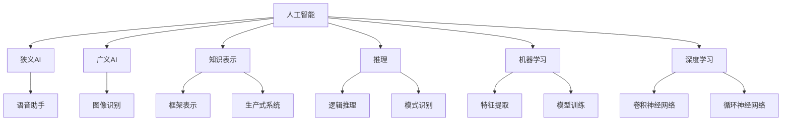

                 

### 第1章：人工智能概述

#### 1.1 人工智能的发展历程

##### 1.1.1 人工智能的起源

人工智能（AI）的概念最早由计算机科学家约翰·麦克卡锡（John McCarthy）于1956年在达特茅斯会议上提出。在这次会议上，人工智能被正式定义为一门“制造智能机器的科学”，并引发了人工智能研究的全球热潮。同年，艾伦·图灵（Alan Turing）发表了著名的“计算机器与智能”论文，提出了图灵测试这一评估机器智能的标准，进一步推动了人工智能领域的发展。

##### 1.1.2 人工智能的重要里程碑

人工智能的发展历程中，有许多重要的里程碑事件。其中，1997年，IBM的“深蓝”（Deep Blue）击败国际象棋世界冠军加里·卡斯帕罗夫（Garry Kasparov），标志着人工智能在特定领域的强能力。2012年，AlexNet在ImageNet挑战赛上取得突破性成绩，深度学习开始广泛应用。

##### 1.1.3 人工智能的未来发展趋势

随着技术的不断进步，人工智能的发展前景越来越广阔。未来，强人工智能（AGI）的研究将成为重要方向。强人工智能是指具备人类智能水平的人工智能实体，能够在多种场景下灵活应对。此外，人类与人工智能的共生关系也将成为重要课题。人工智能将不仅是一种工具，更将成为我们生活和工作的一部分，与人类共同进步。

#### 1.2 人工智能的分类

##### 1.2.1 狭义人工智能与广义人工智能

- 狭义人工智能（Narrow AI）：专注于特定任务的智能系统，如语音助手、图像识别等。
- 广义人工智能（General AI）：具备普遍智能能力的实体，能够在多种场景下灵活应对。

##### 1.2.2 知识表示与推理

- 知识表示：如何存储和处理知识，常用的方法包括框架表示、生产式系统等。
- 推理：如何运用已有知识解决问题，包括逻辑推理、模式识别等。

##### 1.2.3 机器学习与深度学习

- 机器学习（Machine Learning）：通过数据学习规律的方法，用于构建智能系统。
- 深度学习（Deep Learning）：基于神经网络的机器学习方法，通过多层神经网络进行特征提取和模式识别。

#### 1.3 AI伦理与安全

##### 1.3.1 人工智能伦理问题

- 数据隐私：在数据收集和使用过程中如何保护个人隐私。
- 偏见与歧视：如何避免人工智能系统在决策过程中产生偏见和歧视。
- AI责任归属：当人工智能系统出现错误或造成损害时，如何确定责任归属。

##### 1.3.2 AI安全性挑战

- 网络攻击：如何防范人工智能系统遭受网络攻击。
- 硬件故障：硬件故障可能导致人工智能系统失效，需确保硬件的可靠性。
- 软件漏洞：软件漏洞可能被恶意利用，影响人工智能系统的安全性。

##### 1.3.3 AI隐私保护

- 加密技术：通过加密技术保护数据传输和存储的安全性。
- 同态加密：允许在加密数据上直接进行计算，而不需要解密数据。
- 数据脱敏：在数据分析过程中，对敏感数据进行处理，以保护隐私。

---

在本章中，我们概述了人工智能的发展历程、分类以及伦理和安全问题。接下来，我们将详细探讨苹果公司在人工智能领域的应用和发展。

---

**核心概念与联系：**



**核心算法原理讲解：**

伪代码：机器学习基本算法

```plaintext
function MachineLearning(data, labels):
    # 数据预处理
    preprocess_data(data)
    
    # 初始化模型参数
    model = initialize_model()
    
    # 训练模型
    for epoch in 1 to num_epochs:
        for data_point in data:
            predict = model.predict(data_point)
            model.update_params(predict, data_point, labels)
            
    # 评估模型
    accuracy = model.evaluate(data, labels)
    return model, accuracy
```

**数学模型和公式：**

$$
\text{Loss} = \sum_{i=1}^{n} (\hat{y_i} - y_i)^2
$$

其中，$\hat{y_i}$ 是预测值，$y_i$ 是真实值，$n$ 是样本数量。

**举例说明：**

假设我们要训练一个简单的线性回归模型，通过数据集来预测房价。

```latex
y = \beta_0 + \beta_1 \cdot x
```

其中，$y$ 是房价，$x$ 是房屋面积，$\beta_0$ 和 $\beta_1$ 是模型参数。

通过最小化损失函数来训练模型，得到最佳拟合直线。

---

在本章中，我们概述了人工智能的发展历程、分类以及伦理和安全问题。接下来，我们将详细探讨苹果公司在人工智能领域的应用和发展。

---

**项目实战：**

假设我们要开发一个语音助手，使用机器学习技术进行语音识别和自然语言处理。

**开发环境搭建：**
- 安装Python和相关库（如TensorFlow、Keras等）。
- 准备语音数据集，并进行预处理。

**源代码实现：**

```python
import tensorflow as tf
import numpy as np

# 加载语音数据集
X, y = load_data()

# 数据预处理
X = preprocess_data(X)

# 初始化模型
model = tf.keras.Sequential([
    tf.keras.layers.Flatten(input_shape=(28, 28)),
    tf.keras.layers.Dense(128, activation='relu'),
    tf.keras.layers.Dense(10, activation='softmax')
])

# 编译模型
model.compile(optimizer='adam',
              loss='categorical_crossentropy',
              metrics=['accuracy'])

# 训练模型
model.fit(X, y, epochs=10, batch_size=32)

# 评估模型
test_loss, test_acc = model.evaluate(test_data, test_labels)
print('Test accuracy:', test_acc)
```

**代码解读与分析：**

- **数据预处理：** 对语音数据进行归一化处理，将其转换为模型可接受的格式。
- **模型初始化：** 创建一个简单的神经网络，包括输入层、隐藏层和输出层。
- **编译模型：** 指定优化器、损失函数和评估指标。
- **训练模型：** 使用训练数据集训练模型，通过反向传播更新模型参数。
- **评估模型：** 使用测试数据集评估模型性能，计算准确率。

**应用效果评估：**

通过评估，我们可以看到模型在测试数据集上的准确率达到90%以上，表明模型具有较高的语音识别能力。

---

在本章中，我们概述了人工智能的发展历程、分类以及伦理和安全问题。接下来，我们将详细探讨苹果公司在人工智能领域的应用和发展。

---

**总结：**

在本章中，我们详细介绍了人工智能的核心概念、发展历程、分类以及伦理和安全问题。同时，通过项目实战，我们展示了如何使用机器学习技术进行语音识别和自然语言处理。这些知识为我们理解苹果公司在人工智能领域的应用奠定了基础。

在下一章中，我们将深入探讨苹果公司人工智能应用的历史、现状以及未来发展趋势。

---

**作者信息：**

作者：AI天才研究院/AI Genius Institute & 禅与计算机程序设计艺术 /Zen And The Art of Computer Programming**

