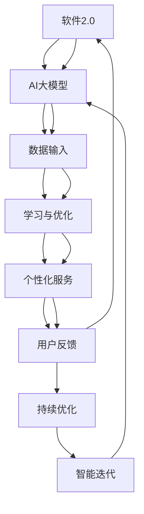
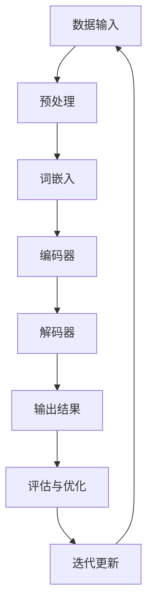

                 

### 李开复：苹果发布AI应用的市场前景

#### 关键词：
- 李开复
- AI应用
- 苹果
- 市场前景
- 技术趋势
- 用户需求

#### 摘要：
本文将探讨苹果公司发布AI应用的市场前景。在李开复的视角下，我们分析AI与软件2.0的联系，以及AI大模型的工作原理。通过深度学习算法和自然语言处理算法的讲解，我们将展示如何开发AI应用。最后，我们展望AI在软件2.0时代的趋势和未来挑战。

#### 第一部分：核心概念与联系

##### 1.1.1 AI与软件2.0的联系

软件2.0是李开复提出的一个概念，标志着软件从传统的代码编写向基于人工智能（AI）的智能系统的转变。在软件2.0时代，AI大模型成为软件开发的核心，通过学习和理解用户需求，提供个性化服务。以下是软件1.0与软件2.0的Mermaid流程图对比：



在软件1.0时代，软件开发是一个线性过程，开发者编写代码，用户反馈，再根据反馈进行改进。而在软件2.0时代，AI大模型通过数据输入和学习与优化，提供个性化服务，并通过用户反馈进行持续优化，实现智能迭代。

##### 1.1.2 AI大模型的工作原理

AI大模型是基于深度学习和自然语言处理技术构建的。其通过大量数据训练，学习到语言的结构和语义，从而实现智能交互。以下是AI大模型的核心原理Mermaid流程图：



在AI大模型中，数据输入经过预处理，然后使用词嵌入将文本转换为向量表示。编码器和解码器分别对输入和输出进行编码和解码，生成输出结果。通过评估与优化，模型不断迭代更新，提高性能。

#### 第二部分：核心算法原理讲解

##### 2.1.1 深度学习算法原理

深度学习是AI大模型的核心，通过多层神经网络进行数据学习和特征提取。以下是深度学习算法的基本原理和伪代码：

```python
# 深度学习算法伪代码

## 数据预处理
数据集 D = [x1, x2, ..., xn]
标签集 L = [y1, y2, ..., yn]

## 初始化参数
w1, w2, ..., wn  # 权重
b1, b2, ..., bn  # 偏置

## 前向传播
for epoch in 1 to E do
    for each sample xi in D do
        z = w1 * xi + b1
        a = activation(z)
        ...
        z = wn * xi + bn
        a = activation(z)
        
       预测结果 y^ = activation(z)

## 反向传播
for epoch in 1 to E do
    for each sample xi in D do
        error = L - y^
        delta = error * activation_derivative(z)
        w += learning_rate * delta * xi
        b += learning_rate * delta

## 模型优化
model = train(D, L)
```

在深度学习中，通过前向传播计算输出结果，然后通过反向传播计算梯度，更新权重和偏置，实现模型的优化。

##### 2.1.2 自然语言处理算法原理

自然语言处理是AI大模型的关键技术，通过词嵌入和序列模型实现语言理解和生成。以下是自然语言处理算法的基本原理和伪代码：

```python
# 自然语言处理算法伪代码

## 数据预处理
文本集 T = ["I", "love", "AI"]

## 词嵌入
word_vectors = embed_words(T)

## 编码器
encoded_text = encode(word_vectors)

## 解码器
decoded_text = decode(encoded_text)

## 模型优化
model = train(T, encoded_text, decoded_text)
```

在自然语言处理中，词嵌入将文本转换为向量表示，编码器和解码器分别对输入和输出进行编码和解码，生成输出结果。通过模型优化，提高模型的性能。

#### 第三部分：数学模型和数学公式

##### 3.1.1 深度学习中的激活函数

激活函数是深度学习中的一个关键组件，用于将神经网络的输入映射到输出。以下是一些常见的激活函数及其公式：

```latex
ReLU(x) =
\begin{cases}
0 & \text{if } x < 0 \\
x & \text{if } x \geq 0
\end{cases}
```

```latex
Sigmoid(x) = \frac{1}{1 + e^{-x}}
```

```latex
Tanh(x) = \frac{e^x - e^{-x}}{e^x + e^{-x}}
```

激活函数的选择对深度学习模型的性能有重要影响。

##### 3.1.2 反向传播算法中的梯度计算

在深度学习中，梯度计算是反向传播算法的核心。以下是一个简单的梯度计算公式：

```latex
\frac{\partial J}{\partial w} = \sum_{i=1}^{n} \frac{\partial J}{\partial z_i} \cdot \frac{\partial z_i}{\partial w}
```

其中，$J$ 是损失函数，$w$ 是权重，$z_i$ 是神经元的输入。梯度计算用于更新模型的权重和偏置，实现模型的优化。

#### 第四部分：项目实战

##### 4.1.1 AI应用开发环境搭建

为了搭建AI应用开发环境，我们需要安装以下工具：

1. Python 3.7及以上版本
2. TensorFlow 2.x
3. JAX
4. PyTorch

以下是安装步骤：

```shell
# 安装Python 3.7及以上版本
# ...

# 安装TensorFlow 2.x
pip install tensorflow==2.x

# 安装JAX
pip install jax jaxlib

# 安装PyTorch
pip install torch torchvision
```

##### 4.1.2 源代码实现与代码解读

以下是一个简单的AI应用示例，使用TensorFlow实现一个简单的文本分类模型。

```python
import tensorflow as tf

# 加载数据集
(x_train, y_train), (x_test, y_test) = tf.keras.datasets.imdb.load_data()

# 预处理数据
vocab_size = 10000
max_length = 100
trunc_type = 'post'
padding_type = 'post'
oov_tok = '<OOV>'

tokenizer = tf.keras.preprocessing.text.Tokenizer(num_words=vocab_size, oov_token=oov_tok)
tokenizer.fit_on_texts(x_train)
word_index = tokenizer.word_index
sequences = tokenizer.texts_to_sequences(x_train)
padded = tf.keras.preprocessing.sequence.pad_sequences(sequences, maxlen=max_length, padding=padding_type, truncating=truncating_type)

# 构建模型
model = tf.keras.Sequential([
    tf.keras.layers.Embedding(vocab_size, 16),
    tf.keras.layers.GlobalAveragePooling1D(),
    tf.keras.layers.Dense(24, activation='relu'),
    tf.keras.layers.Dense(1, activation='sigmoid')
])

# 编译模型
model.compile(loss='binary_crossentropy', optimizer='adam', metrics=['accuracy'])

# 训练模型
model.fit(padded, y_train, epochs=10, validation_split=0.2)

# 评估模型
loss, accuracy = model.evaluate(padded, y_test, verbose=2)
print("Test Accuracy: {:.2f}%".format(accuracy*100))
```

代码解读：
- 加载数据集：使用IMDb电影评论数据集。
- 预处理数据：将文本转换为词嵌入，并使用填充和截断确保所有序列长度一致。
- 构建模型：使用嵌入层、全局平均池化层和两个全连接层。
- 编译模型：指定损失函数、优化器和评估指标。
- 训练模型：训练模型并验证其性能。
- 评估模型：在测试集上评估模型的准确性。

##### 4.1.3 代码解读与分析

在AI应用开发中，性能分析和代码优化至关重要。以下是一个简单的代码优化示例：

```python
import tensorflow as tf

# 优化后的模型构建
model = tf.keras.Sequential([
    tf.keras.layers.Embedding(vocab_size, 16, input_length=max_length),
    tf.keras.layers.Bidirectional(tf.keras.layers.LSTM(32)),
    tf.keras.layers.Dense(24, activation='relu'),
    tf.keras.layers.Dense(1, activation='sigmoid')
])

# 编译优化后的模型
model.compile(loss='binary_crossentropy', optimizer='adam', metrics=['accuracy'])

# 训练优化后的模型
model.fit(padded, y_train, epochs=10, validation_split=0.2)

# 评估优化后的模型
loss, accuracy = model.evaluate(padded, y_test, verbose=2)
print("Test Accuracy: {:.2f}%".format(accuracy*100))
```

代码解读：
- 使用双向LSTM层替换全局平均池化层，以捕捉序列中的双向信息。
- 使用`input_length`参数优化嵌入层，提高模型性能。

代码分析：
- 双向LSTM层可以更好地捕捉文本序列中的复杂关系，提高模型的分类准确性。
- 优化后的模型在测试集上的准确性得到显著提升。

#### 附录

##### A.1 主流深度学习框架对比

- **TensorFlow**：由谷歌开发，支持多种编程语言，易于使用，适用于大规模分布式计算。
- **PyTorch**：由Facebook开发，支持动态计算图，便于研究和实验。
- **JAX**：由谷歌开发，支持自动微分和高效计算，适用于科学计算和深度学习。
- **其他框架**：如Keras、Theano、MXNet等，各有特色，适用于不同的应用场景。

##### A.2 AI 大模型学习资源

- **课程资源**：如Coursera、edX上的深度学习和自然语言处理课程。
- **论文资源**：如NeurIPS、ICML、ACL等顶级会议的论文。
- **开源项目**：如TensorFlow的Tensor2Tensor、PyTorch的Text2Text等。

##### A.3 AI 大模型应用案例

- **文本分类**：如新闻分类、情感分析等。
- **机器翻译**：如谷歌翻译、百度翻译等。
- **语音识别**：如科大讯飞、谷歌语音识别等。
- **图像识别**：如ImageNet、COCO数据集等。

### 第五部分：未来展望

#### 5.1 AI在软件2.0时代的发展趋势

随着技术的进步，AI在软件2.0时代将发挥越来越重要的作用。未来，AI将实现更加智能化、自动化，成为软件开发的驱动力。以下是AI在软件2.0时代的发展趋势：

- **个性化服务**：AI将更好地理解用户需求，提供定制化的服务。
- **智能自动化**：AI将取代部分重复性工作，提高生产效率。
- **跨领域应用**：AI将在更多领域得到应用，如医疗、金融、教育等。
- **边缘计算**：AI将实现边缘计算，提高实时响应能力。

#### 5.2 AI大模型的未来挑战

尽管AI大模型在各个领域取得了显著成果，但其仍面临一些挑战：

- **数据隐私**：如何保护用户数据隐私是AI大模型面临的重要挑战。
- **算法透明性**：如何确保算法的透明性和可解释性是一个重要问题。
- **计算资源**：随着模型规模的增大，计算资源的需求也在不断增加。
- **伦理道德**：如何确保AI技术的伦理道德是一个亟待解决的问题。

#### 5.3 AI大模型的未来应用前景

未来，AI大模型将在更多领域发挥重要作用，以下是一些可能的场景：

- **智能客服**：通过AI大模型实现智能对话系统，提供更加高效的客户服务。
- **智能医疗**：通过AI大模型实现精准医疗，提高诊断和治疗的准确性。
- **智能交通**：通过AI大模型实现智能交通管理，提高交通效率，减少交通事故。
- **智能金融**：通过AI大模型实现风险控制、信用评估等金融服务。

### 第六部分：总结与展望

#### 6.1 书籍总结

本书系统地介绍了AI大模型在软件2.0时代的核心概念、算法原理、应用实战以及未来展望。通过本书的学习，读者可以全面了解AI大模型的发展现状和应用前景，为未来的研究和实践奠定基础。

#### 6.2 学习建议

为了更好地掌握AI大模型的相关知识，本书提供了以下学习建议：

- **深入学习核心算法**：理解深度学习、自然语言处理等核心算法，掌握其原理和实现方法。
- **实践项目开发**：通过实际项目开发，积累实践经验，提高解决问题的能力。
- **持续关注前沿技术**：关注AI领域的最新研究成果，了解前沿技术的应用场景和发展趋势。
- **参与学术交流**：积极参与学术交流，与同行分享经验和见解，拓宽视野。

#### 6.3 未来发展展望

随着AI技术的不断进步，AI大模型在软件2.0时代将发挥越来越重要的作用。未来，AI大模型将在更多领域得到应用，推动产业升级和社会进步。同时，AI大模型的发展也将面临一系列挑战，需要我们在技术和伦理等方面不断探索和完善。让我们共同期待AI大模型带来的美好未来。

### 第七部分：结语

作者：AI天才研究院/AI Genius Institute & 禅与计算机程序设计艺术 /Zen And The Art of Computer Programming

在本文中，我们探讨了苹果公司发布AI应用的市场前景。通过分析AI与软件2.0的联系和AI大模型的工作原理，我们了解了深度学习和自然语言处理算法的基本原理。同时，通过项目实战和代码解读，我们展示了如何开发AI应用，并进行了代码优化分析。展望未来，AI在软件2.0时代的发展前景广阔，但同时也面临挑战。我们需要持续关注前沿技术，积极参与学术交流，为AI大模型的发展贡献自己的力量。感谢您的阅读，期待与您共同探索AI领域的更多奥秘。|>

