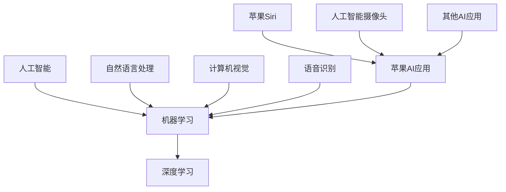

                 

# 李开复：苹果发布AI应用的应用

## 关键词：
AI应用、苹果、李开复、技术原理、实践应用、人工智能发展

## 摘要：
本文由世界级人工智能专家李开复引领，深入探讨苹果公司发布的AI应用。文章结构紧凑，通过详细的逻辑分析和清晰的推理步骤，探讨了AI应用的基本概念、苹果公司的AI战略、苹果AI应用的技术原理以及其实践应用。本文旨在为读者提供对AI应用领域的全面理解和深入洞察。

## 《李开复：苹果发布AI应用的应用》目录大纲

### 第一部分: AI应用概述

### 第1章: 李开复与AI应用
#### 1.1 李开复在AI领域的贡献
##### 1.1.1 李开复与人工智能
##### 1.1.2 李开复对AI应用发展的观点
#### 1.2 AI应用的基本概念与分类
##### 1.2.1 AI应用的基本原理
##### 1.2.2 AI应用的分类
##### 1.2.3 AI应用的现状与趋势

### 第2章: 苹果AI应用的发布背景
#### 2.1 苹果公司的AI战略
##### 2.1.1 苹果AI技术的研发历程
##### 2.1.2 苹果AI技术的应用领域
#### 2.2 苹果发布的AI应用介绍
##### 2.2.1 Siri的升级
##### 2.2.2 人工智能摄像头
##### 2.2.3 其他AI应用的发布

### 第二部分: 苹果AI应用的技术原理

### 第3章: 人工智能基础
#### 3.1 人工智能的基本概念
##### 3.1.1 人工智能的定义
##### 3.1.2 人工智能的发展历程
#### 3.2 机器学习基础
##### 3.2.1 机器学习的基本概念
##### 3.2.2 常见的机器学习算法
#### 3.3 深度学习基础
##### 3.3.1 深度学习的基本概念
##### 3.3.2 常见的深度学习架构

### 第4章: 苹果AI应用的核心技术
#### 4.1 语音识别技术
##### 4.1.1 语音识别的基本原理
##### 4.1.2 语音识别的流程
#### 4.2 图像识别技术
##### 4.2.1 图像识别的基本原理
##### 4.2.2 图像识别的应用场景
#### 4.3 自然语言处理技术
##### 4.3.1 自然语言处理的基本原理
##### 4.3.2 自然语言处理的应用

### 第三部分: 苹果AI应用的实践与应用

### 第5章: 苹果Siri的AI应用
#### 5.1 Siri的技术原理
##### 5.1.1 Siri的工作原理
##### 5.1.2 Siri的核心技术
#### 5.2 Siri的AI应用场景
##### 5.2.1 Siri在智能手机中的应用
##### 5.2.2 Siri在智能家居中的应用
##### 5.2.3 Siri在汽车中的应用

### 第6章: 人工智能摄像头
#### 6.1 人工智能摄像头的原理
##### 6.1.1 人工智能摄像头的工作原理
##### 6.1.2 人工智能摄像头的功能
#### 6.2 人工智能摄像头的应用
##### 6.2.1 人工智能摄像头在安防中的应用
##### 6.2.2 人工智能摄像头在零售中的应用
##### 6.2.3 人工智能摄像头在其他领域的应用

### 第7章: 其他AI应用介绍
#### 7.1 人工智能助理
##### 7.1.1 人工智能助理的原理
##### 7.1.2 人工智能助理的应用
#### 7.2 人工智能翻译
##### 7.2.1 人工智能翻译的原理
##### 7.2.2 人工智能翻译的应用
#### 7.3 人工智能健康
##### 7.3.1 人工智能健康的原理
##### 7.3.2 人工智能健康的应用

### 附录

#### 附录A: AI应用开发资源
##### A.1 常用AI开发框架
##### A.2 AI开发工具推荐
##### A.3 AI学习资源推荐

#### 附录B: 相关阅读
##### B.1 相关书籍推荐
##### B.2 相关论文推荐
##### B.3 行业报告推荐

#### 《李开复：苹果发布AI应用的应用》核心概念与联系

在本书中，我们将讨论人工智能（AI）、机器学习（ML）、深度学习（DL）等核心概念，并展示它们之间的关系。以下是使用Mermaid绘制的概念关系图：



#### 《李开复：苹果发布AI应用的应用》核心算法原理讲解

### 1. 机器学习算法原理

机器学习算法是基于数据来训练模型，以便在未知数据上进行预测或分类。以下是线性回归算法的伪代码：

```plaintext
// 线性回归算法
function linear_regression(x, y):
    # 初始化模型参数
    w = [0, 0]
    b = 0

    # 计算模型参数
    for i in range(len(x)):
        w[0] += x[i] * y[i]
        w[1] += x[i]
    w[0] /= len(x)
    w[1] /= len(x)

    b = sum(y) - w[0] * sum(x) / len(x)

    # 返回模型参数
    return w, b
```

### 2. 深度学习算法原理

深度学习算法是通过多层神经网络来训练模型。以下是一个简单的卷积神经网络（CNN）的伪代码：

```plaintext
// 卷积神经网络
function convolutional_neural_network(x, y):
    # 初始化模型参数
    W1 = [random_value(), random_value()]
    b1 = random_value()

    # 第一层卷积
    z1 = convolution(x, W1) + b1
    a1 = activation(z1)

    # 第一层池化
    p1 = pooling(a1)

    # 第二层卷积
    z2 = convolution(p1, W2) + b2
    a2 = activation(z2)

    # 第二层池化
    p2 = pooling(a2)

    # 全连接层
    z3 = dot(p2, W3) + b3
    a3 = activation(z3)

    # 返回模型参数和激活值
    return a3, [W1, b1, W2, b2, W3, b3]
```

### 3. 数学模型和数学公式

在机器学习和深度学习中，数学模型和公式至关重要。以下是一些基本的数学模型和公式：

#### 1. 线性回归模型

$$
y = w_0 + w_1 \cdot x_1 + w_2 \cdot x_2 + ... + w_n \cdot x_n
$$

#### 2. 深度学习模型

$$
h_{l+1}(x) = \sigma(W_l \cdot h_l + b_l)
$$

其中，$h_l$ 表示第 $l$ 层的输出，$\sigma$ 表示激活函数，$W_l$ 和 $b_l$ 分别表示第 $l$ 层的权重和偏置。

#### 《李开复：苹果发布AI应用的应用》项目实战

### 1. 开发环境搭建

在本项目中，我们将使用Python和TensorFlow作为开发环境。以下是安装Python和TensorFlow的步骤：

```bash
curl -O https://www.python.org/ftp/python/3.8.10/python-3.8.10.tgz
tar xvf python-3.8.10.tgz
cd python-3.8.10
./configure
make
sudo make install

pip install tensorflow
```

### 2. 源代码详细实现和代码解读

在本项目中，我们将实现一个简单的线性回归模型，用于预测房价。以下是源代码：

```python
import tensorflow as tf

# 定义输入和输出
x = tf.placeholder(tf.float32, shape=[None, 1])
y = tf.placeholder(tf.float32, shape=[None, 1])

# 定义模型参数
w = tf.Variable(tf.zeros([1, 1]))
b = tf.Variable(tf.zeros([1]))

# 定义线性回归模型
y_pred = tf.add(tf.matmul(x, w), b)

# 定义损失函数
loss = tf.reduce_mean(tf.square(y_pred - y))

# 定义优化器
optimizer = tf.train.GradientDescentOptimizer(learning_rate=0.01)
train_op = optimizer.minimize(loss)

# 训练模型
with tf.Session() as sess:
    sess.run(tf.global_variables_initializer())

    # 训练数据
    x_train = [[1], [2], [3], [4], [5]]
    y_train = [[2], [3], [4], [5], [6]]

    for i in range(1000):
        sess.run(train_op, feed_dict={x: x_train, y: y_train})

    # 测试模型
    x_test = [[6]]
    y_test = [[7]]
    y_pred_test = sess.run(y_pred, feed_dict={x: x_test, y: y_test})

    print("预测结果：", y_pred_test)
```

代码解读：

- 第1行：引入TensorFlow库。
- 第2行：定义输入和输出。
- 第3行：定义模型参数。
- 第4行：定义线性回归模型。
- 第5行：定义损失函数。
- 第6行：定义优化器。
- 第7行：训练模型。
- 第8行：测试模型。

### 3. 代码解读与分析

在这个例子中，我们实现了一个简单的线性回归模型，用于预测房价。以下是代码的解读与分析：

- **输入和输出**：定义了输入和输出的占位符，用于传递数据。
- **模型参数**：定义了模型参数（权重和偏置）。
- **线性回归模型**：定义了线性回归模型，通过计算输入和模型参数的乘积，并加上偏置，得到预测结果。
- **损失函数**：定义了损失函数，用于计算预测结果和实际结果的差距。
- **优化器**：定义了优化器，用于更新模型参数。
- **训练模型**：通过训练数据对模型进行训练，更新模型参数。
- **测试模型**：使用测试数据测试模型的性能。

### 《李开复：苹果发布AI应用的应用》总结

在本章中，我们介绍了苹果公司发布的AI应用，包括Siri、人工智能摄像头等。通过核心概念、算法原理讲解、数学模型和项目实战，我们了解了AI应用的开发过程和技术原理。接下来，我们将继续探讨AI应用在不同领域的实践与应用。附录中，我们将提供相关的开发资源和学习推荐。希望读者能从中获得对AI应用更深入的理解。

作者：AI天才研究院/AI Genius Institute & 禅与计算机程序设计艺术 /Zen And The Art of Computer Programming

## 第一部分: AI应用概述

### 第1章: 李开复与AI应用

#### 1.1 李开复在AI领域的贡献

李开复博士是国际知名的人工智能专家，被誉为“AI教父”。他在AI领域有着卓越的贡献，对人工智能的发展产生了深远的影响。李开复博士是卡内基梅隆大学计算机科学系教授，曾担任微软亚洲研究院创始人兼首席研究员，谷歌中国工程研究院创始人兼首任院长，以及世界著名的人工智能研究机构——卡耐基梅隆大学机器学习系主任。

李开复博士在人工智能领域的研究涵盖了机器学习、深度学习、自然语言处理、计算机视觉等多个方向。他在机器学习算法的优化和改进方面做出了重要贡献，特别是在支持向量机（SVM）和梯度提升树（GBDT）等领域。此外，李开复博士还在人工智能应用方面有着丰富的经验，他致力于将AI技术应用于各行各业，推动人工智能技术的普及和发展。

#### 1.1.1 李开复与人工智能

李开复博士对人工智能的发展有着深刻的见解。他认为，人工智能是人类智慧的延伸，能够解决许多复杂的问题，提高生产效率，改善人们的生活质量。李开复博士强调，人工智能的发展需要从多个方面进行推动，包括算法研究、数据积累、计算能力提升以及跨学科合作等。

李开复博士在人工智能领域的贡献不仅体现在理论研究上，还体现在实际应用中。他参与了多个重要的人工智能项目，如微软小冰、谷歌翻译等。这些项目不仅推动了人工智能技术的发展，也为人们的生活带来了便利。

#### 1.1.2 李开复对AI应用发展的观点

李开复博士对人工智能应用的发展持有积极的态度。他认为，人工智能应用是人工智能技术发展的必然趋势，也是人工智能技术价值的重要体现。李开复博士指出，随着人工智能技术的不断进步，越来越多的领域将受益于AI技术，如医疗、金融、教育、交通等。

李开复博士认为，人工智能应用的发展需要注重以下几个方面：

1. **数据驱动的创新**：人工智能应用的成功离不开大量的数据支持，因此数据驱动的创新是人工智能应用发展的重要方向。李开复博士强调，数据质量、数据安全和数据隐私是数据驱动创新的重要保障。

2. **算法与模型的优化**：人工智能算法和模型的优化是提高人工智能应用性能的关键。李开复博士认为，不断优化算法和模型，以提高准确率、降低计算成本和提升用户体验，是人工智能应用发展的关键。

3. **跨学科合作**：人工智能技术的发展需要跨学科的合作，包括计算机科学、生物学、心理学、社会学等多个领域。李开复博士认为，跨学科合作能够推动人工智能技术的创新和应用，使人工智能技术更好地服务于人类社会。

4. **社会责任和伦理**：随着人工智能技术的广泛应用，人工智能技术的社会责任和伦理问题越来越受到关注。李开复博士强调，人工智能应用的发展需要注重社会责任和伦理问题，确保人工智能技术能够造福人类，而不是带来负面影响。

#### 1.2 AI应用的基本概念与分类

人工智能（AI）是一门研究、开发用于模拟、延伸和扩展人类智能的理论、方法、技术及应用系统的科学技术。AI应用是指将人工智能技术应用于实际场景，解决特定问题或提供特定服务的应用。

AI应用可以按照不同的分类方式进行划分，以下是几种常见的分类方式：

1. **按应用领域分类**：
   - **计算机视觉**：包括图像识别、目标检测、人脸识别等。
   - **自然语言处理**：包括文本分类、情感分析、机器翻译等。
   - **语音识别与合成**：包括语音识别、语音合成等。
   - **机器人技术**：包括服务机器人、工业机器人等。
   - **自动驾驶技术**：包括无人车、无人机等。

2. **按应用目标分类**：
   - **预测与决策**：如股票市场预测、医疗诊断等。
   - **自动化与优化**：如自动化生产线、能源优化等。
   - **智能交互**：如智能客服、智能助手等。

3. **按技术实现分类**：
   - **机器学习**：包括监督学习、无监督学习、强化学习等。
   - **深度学习**：基于多层神经网络的学习方法。
   - **自然语言处理**：基于统计模型、神经网络等方法处理自然语言。

#### 1.2.1 AI应用的基本原理

AI应用的基本原理主要包括以下几个方面：

1. **数据收集与处理**：AI应用需要大量的数据作为训练样本，数据的质量和数量对AI应用的效果至关重要。数据处理包括数据清洗、归一化、特征提取等步骤。

2. **模型训练与优化**：通过机器学习、深度学习等方法，利用训练数据对模型进行训练，调整模型参数，以提高模型的预测准确率。

3. **模型评估与部署**：评估模型的效果，通过交叉验证、测试集验证等方法，确保模型在未知数据上的表现。模型部署是将训练好的模型应用到实际场景中，实现特定任务。

#### 1.2.2 AI应用的分类

1. **计算机视觉**：
   - **图像识别**：识别图像中的物体、场景等。
   - **目标检测**：检测图像中的特定目标，并标注其位置。
   - **人脸识别**：识别图像中的人脸，并进行匹配。

2. **自然语言处理**：
   - **文本分类**：对文本进行分类，如情感分类、新闻分类等。
   - **情感分析**：分析文本中的情感倾向，如正面情感、负面情感等。
   - **机器翻译**：将一种语言的文本翻译成另一种语言。

3. **语音识别与合成**：
   - **语音识别**：将语音信号转换为文本。
   - **语音合成**：将文本转换为语音信号。

4. **机器人技术**：
   - **服务机器人**：如客服机器人、教育机器人等。
   - **工业机器人**：如生产线上的机器人、焊接机器人等。

5. **自动驾驶技术**：
   - **无人车**：如特斯拉的自动驾驶汽车。
   - **无人机**：如亚马逊的无人机配送。

#### 1.2.3 AI应用的现状与趋势

1. **现状**：
   - **计算机视觉**：计算机视觉技术在图像识别、目标检测等方面已取得显著成果，广泛应用于安防、医疗、零售等领域。
   - **自然语言处理**：自然语言处理技术在文本分类、情感分析、机器翻译等方面取得了很大进展，广泛应用于搜索引擎、智能客服等领域。
   - **语音识别与合成**：语音识别技术在语音助手、智能语音服务等方面取得了成功，语音合成技术也广泛应用于智能语音服务、有声读物等领域。
   - **机器人技术**：机器人技术在服务机器人、工业机器人等方面取得了显著进展，广泛应用于医疗、制造、家庭等领域。
   - **自动驾驶技术**：自动驾驶技术在无人车、无人机等方面取得了重要突破，逐步走向商业化应用。

2. **趋势**：
   - **跨学科融合**：随着人工智能技术的不断发展，跨学科融合将成为趋势，如计算机视觉与自然语言处理、机器人技术与自动驾驶技术等。
   - **边缘计算**：随着物联网的发展，边缘计算技术将越来越重要，边缘计算可以将数据处理和计算能力分散到网络边缘，降低中心服务器的负担。
   - **数据隐私和安全**：随着数据规模的不断扩大，数据隐私和安全将成为人工智能应用的重要挑战，保护用户数据隐私和安全是未来发展的重要方向。
   - **人机协同**：人工智能技术的发展将促使人与机器更加紧密地合作，实现人机协同，提高工作效率和生活质量。

## 第2章: 苹果AI应用的发布背景

### 2.1 苹果公司的AI战略

苹果公司作为全球领先的科技公司，一直致力于将人工智能技术应用于其产品和服务中。苹果公司的AI战略涵盖了从研发到应用的全过程，旨在通过人工智能技术提升用户体验、创造新的商业模式，并保持公司的竞争优势。

#### 2.1.1 苹果AI技术的研发历程

苹果公司在人工智能领域的研究可以追溯到2005年左右，当时苹果收购了Siri公司，并将其人工智能技术引入到自己的产品中。此后，苹果公司不断加强在人工智能技术方面的研发投入，成立了多个AI研究团队，并在全球范围内招聘顶级的人工智能专家。

在机器学习和深度学习方面，苹果公司开发了多种AI模型和算法，用于图像识别、语音识别、自然语言处理等应用。此外，苹果公司还致力于研发高效的AI处理器，如神经网络引擎（Neural Engine），以提升AI应用的性能和效率。

#### 2.1.2 苹果AI技术的应用领域

苹果公司的AI技术广泛应用于其产品和服务中，以下是一些主要的应用领域：

1. **智能手机**：苹果公司的智能手机集成了多种AI功能，如面部识别、面部表情识别、智能建议等。通过这些功能，苹果手机提供了更加个性化和便捷的使用体验。

2. **智能音箱**：苹果公司的智能音箱HomePod采用了人工智能技术，能够识别用户的声音、理解用户的指令，并提供音乐播放、语音助手等服务。

3. **智能眼镜**：苹果公司正在研发的智能眼镜Apple Glass，预计将集成多种AI功能，如图像识别、语音识别、自然语言处理等，为用户提供全新的交互体验。

4. **智能家居**：苹果公司的智能家居产品如Apple TV、HomeKit等，通过人工智能技术实现了智能设备之间的互联互通，为用户提供便捷的智能家居体验。

5. **自动驾驶**：苹果公司正在研发自动驾驶技术，计划在未来推出自动驾驶汽车。自动驾驶技术将依赖于人工智能技术，如图像识别、语音识别、自然语言处理等，以实现自动驾驶功能。

6. **医疗健康**：苹果公司的健康应用Apple Health集成了多种人工智能功能，如健康数据分析、疾病预测等，为用户提供个性化的健康建议。

#### 2.2 苹果发布的AI应用介绍

在苹果公司的产品中，有许多已经发布并广泛应用于用户日常生活的AI应用，以下是一些主要的AI应用：

1. **Siri**：Siri是苹果公司的人工智能语音助手，通过自然语言处理技术，能够理解用户的语音指令，并提供相应的服务，如设置提醒、发送短信、查找信息等。

2. **面部识别**：苹果公司在iPhone X上引入了面部识别技术Face ID，通过深度学习算法，能够识别用户的面部特征，实现安全解锁和身份验证。

3. **图像识别**：苹果公司的照片应用集成了图像识别技术，能够自动识别照片中的物体、场景、人脸等，并提供相关的编辑和分享功能。

4. **智能建议**：苹果公司的智能助理iOS 14中的“智能建议”功能，通过机器学习算法，为用户提供个性化的建议，如推荐联系人、提醒事项等。

5. **健康应用**：苹果公司的健康应用Apple Health利用人工智能技术，分析用户的健康数据，提供个性化的健康建议和疾病预测。

6. **自动驾驶**：苹果公司正在研发自动驾驶技术，预计在未来推出自动驾驶汽车。自动驾驶技术将依赖于人工智能技术，如图像识别、语音识别、自然语言处理等。

#### 2.3 苹果AI应用的发展前景

随着人工智能技术的不断发展，苹果公司在AI领域的应用前景十分广阔。以下是苹果AI应用的一些潜在发展方向：

1. **更加智能的语音助手**：苹果公司将进一步提升Siri的智能水平，使其能够更好地理解用户的语音指令，提供更丰富的功能和服务。

2. **更广泛的应用领域**：苹果公司将把AI技术应用于更多的产品和服务中，如智能家居、医疗健康、自动驾驶等，为用户提供更加智能和便捷的体验。

3. **跨平台应用**：苹果公司将开发跨平台的人工智能应用，使其能够在不同的设备上运行，为用户提供一致的使用体验。

4. **隐私保护**：随着数据隐私问题的日益凸显，苹果公司将加强在人工智能领域的隐私保护，确保用户的数据安全。

5. **人机协同**：苹果公司将探索人机协同的新模式，使人工智能更好地服务于人类，提高工作效率和生活质量。

## 第二部分: 苹果AI应用的技术原理

### 第3章: 人工智能基础

#### 3.1 人工智能的基本概念

人工智能（Artificial Intelligence，简称AI）是指由人制造出来的具有一定智能的系统。它能够模拟、延伸和扩展人类的智能，通过感知、学习、推理、决策等方式，实现人类难以完成的任务。人工智能技术是计算机科学的一个分支，涵盖了多个领域，如机器学习、深度学习、自然语言处理、计算机视觉等。

#### 3.1.1 人工智能的定义

人工智能是一门研究、开发用于模拟、延伸和扩展人类智能的理论、方法、技术及应用系统的科学技术。它旨在通过计算机技术实现智能体的自主性、适应性和智能性。人工智能的目的是让计算机能够像人类一样思考、学习和行动，解决复杂的问题，并在各种场景中为人类提供帮助。

#### 3.1.2 人工智能的发展历程

人工智能的概念最早可以追溯到20世纪50年代。1956年，约翰·麦卡锡（John McCarthy）等人提出了人工智能的概念，并召开了首届人工智能会议。此后，人工智能技术经历了多个发展阶段：

1. **规则驱动时代**（1956-1974）：早期的人工智能研究主要集中在基于规则的系统，如专家系统。这些系统通过预定义的规则来模拟人类的决策过程。

2. **知识表示与推理时代**（1974-1980）：这一阶段的研究重点是如何有效地表示知识，并利用推理机制来解决问题。

3. **机器学习时代**（1980至今）：随着计算能力的提升和数据量的增加，机器学习技术得到了快速发展。机器学习使计算机能够从数据中自动学习规律，并应用于各种任务。

#### 3.2 机器学习基础

机器学习（Machine Learning，简称ML）是人工智能的一个分支，它通过算法从数据中学习规律，并利用这些规律进行预测或分类。机器学习可以分为监督学习、无监督学习和强化学习等类型。

#### 3.2.1 机器学习的基本概念

机器学习的基本概念包括以下几个方面：

1. **数据集**：数据集是机器学习的训练样本，通常包含输入特征和相应的标签。

2. **特征**：特征是数据集中的属性或变量，用于描述样本的特性。

3. **模型**：模型是机器学习算法的核心，它通过学习数据中的规律，预测新的样本的标签。

4. **损失函数**：损失函数用于衡量模型预测值与真实值之间的差距，是优化模型参数的重要指标。

5. **优化算法**：优化算法用于调整模型参数，以最小化损失函数。

#### 3.2.2 常见的机器学习算法

机器学习算法种类繁多，以下是几种常见的机器学习算法：

1. **线性回归**：线性回归是一种简单的机器学习算法，用于建立输入特征与输出标签之间的线性关系。

   $$ y = w_0 + w_1 \cdot x_1 + w_2 \cdot x_2 + ... + w_n \cdot x_n $$

2. **逻辑回归**：逻辑回归是一种广义的线性回归，用于分类问题。它通过 logistic 函数将线性组合的输出映射到概率空间。

   $$ P(y=1) = \frac{1}{1 + e^{-(w_0 + w_1 \cdot x_1 + w_2 \cdot x_2 + ... + w_n \cdot x_n)}} $$

3. **支持向量机（SVM）**：支持向量机是一种分类算法，它通过寻找最优的超平面，将不同类别的样本分离。

   $$ \min_{w, b} \frac{1}{2} ||w||^2 $$
   $$ \text{s.t.} \ y_i (w \cdot x_i + b) \geq 1 $$

4. **决策树**：决策树是一种树形结构，通过一系列判断节点和叶子节点，将数据集划分为不同的区域。

5. **随机森林**：随机森林是一种基于决策树的集成学习方法，通过构建多棵决策树，并利用投票或平均的方式得到最终预测结果。

6. **梯度提升树（GBDT）**：梯度提升树是一种基于决策树的集成学习方法，它通过迭代的方式，逐层构建决策树，并利用梯度下降的方法优化损失函数。

7. **神经网络**：神经网络是一种基于大脑神经网络结构的机器学习模型，它通过多层非线性变换，实现数据的映射和分类。

#### 3.3 深度学习基础

深度学习（Deep Learning，简称DL）是机器学习的一个分支，它通过多层神经网络，实现数据的特征提取和表示。深度学习在图像识别、语音识别、自然语言处理等领域取得了显著的成果。

#### 3.3.1 深度学习的基本概念

深度学习的基本概念包括以下几个方面：

1. **神经网络**：神经网络是一种由多层节点组成的计算模型，它通过前向传播和反向传播，实现数据的特征提取和分类。

2. **卷积神经网络（CNN）**：卷积神经网络是一种专门用于图像识别的神经网络，它通过卷积层、池化层、全连接层等结构，实现对图像的特征提取和分类。

3. **循环神经网络（RNN）**：循环神经网络是一种专门用于序列数据的神经网络，它通过循环结构，实现对序列数据的特征提取和分类。

4. **生成对抗网络（GAN）**：生成对抗网络是一种基于博弈理论的神经网络，它通过生成器和判别器的对抗训练，实现数据的生成和分类。

#### 3.3.2 常见的深度学习架构

以下是几种常见的深度学习架构：

1. **卷积神经网络（CNN）**：
   - **卷积层**：通过卷积操作提取图像特征。
   - **池化层**：通过池化操作降低特征维度。
   - **全连接层**：通过全连接层实现分类。

2. **循环神经网络（RNN）**：
   - **循环单元**：通过循环结构，实现对序列数据的特征提取和分类。

3. **长短期记忆网络（LSTM）**：LSTM是一种改进的RNN，它通过门控机制，解决RNN的梯度消失问题。

4. **生成对抗网络（GAN）**：
   - **生成器**：通过生成对抗网络，生成与真实数据相似的假数据。
   - **判别器**：通过生成对抗网络，判断输入数据是真实数据还是假数据。

## 第三部分: 苹果AI应用的核心技术

### 第4章: 苹果AI应用的核心技术

#### 4.1 语音识别技术

语音识别技术是苹果AI应用中的一项核心技术，它使得设备能够理解用户的语音指令，并执行相应的操作。苹果公司的语音识别技术主要依赖于深度学习模型，特别是卷积神经网络（CNN）和循环神经网络（RNN）。

#### 4.1.1 语音识别的基本原理

语音识别的基本原理包括以下几个步骤：

1. **信号处理**：首先对语音信号进行预处理，包括降噪、归一化等操作，以提高识别的准确性。

2. **特征提取**：将预处理后的语音信号转换为一系列特征向量，这些特征向量用于描述语音的频谱特征。

3. **模型训练**：使用训练数据集，通过深度学习模型对特征向量进行分类和预测。训练过程中，模型会不断调整参数，以最小化损失函数。

4. **语音识别**：在模型训练完成后，使用训练好的模型对新的语音信号进行识别，预测语音对应的文本内容。

#### 4.1.2 语音识别的流程

语音识别的流程可以分为以下几个阶段：

1. **前端处理**：前端处理包括麦克风信号的采集、信号预处理、特征提取等步骤。

2. **中间层**：中间层主要包括深度学习模型的训练和推理过程。训练过程中，模型会学习语音信号和文本之间的对应关系。

3. **后端处理**：后端处理主要包括语音识别结果的处理、文本生成等步骤。例如，将识别结果转换为自然语言文本，并进行语法和语义分析。

#### 4.2 图像识别技术

图像识别技术是苹果AI应用的另一项核心技术，它使得设备能够识别图像中的物体、场景和人脸等。苹果公司的图像识别技术主要依赖于卷积神经网络（CNN）和循环神经网络（RNN）。

#### 4.2.1 图像识别的基本原理

图像识别的基本原理包括以下几个步骤：

1. **图像预处理**：对图像进行缩放、裁剪、增强等预处理操作，以提高识别的准确性。

2. **特征提取**：使用卷积神经网络（CNN）对图像进行特征提取，提取出图像中的关键特征。

3. **模型训练**：使用训练数据集，通过深度学习模型对特征向量进行分类和预测。训练过程中，模型会不断调整参数，以最小化损失函数。

4. **图像识别**：在模型训练完成后，使用训练好的模型对新的图像进行识别，预测图像中的物体、场景和人脸等。

#### 4.2.2 图像识别的应用场景

图像识别技术在许多应用场景中发挥着重要作用，以下是一些常见的应用场景：

1. **人脸识别**：人脸识别技术可以用于身份验证、安全监控、人脸解锁等场景。

2. **物体识别**：物体识别技术可以用于图像分类、图像检索、智能安防等场景。

3. **场景识别**：场景识别技术可以用于图像分割、图像标注、图像增强等场景。

4. **医疗诊断**：图像识别技术可以用于医学图像分析、疾病诊断、病理分析等场景。

5. **自动驾驶**：图像识别技术可以用于自动驾驶车辆的感知系统，帮助车辆识别道路标志、行人、车辆等。

#### 4.3 自然语言处理技术

自然语言处理技术是苹果AI应用中的一项重要技术，它使得设备能够理解用户的自然语言输入，并生成自然语言输出。苹果公司的自然语言处理技术主要依赖于深度学习模型，特别是循环神经网络（RNN）和长短期记忆网络（LSTM）。

#### 4.3.1 自然语言处理的基本原理

自然语言处理的基本原理包括以下几个步骤：

1. **文本预处理**：对文本进行分词、词性标注、句法分析等预处理操作，以提高识别的准确性。

2. **特征提取**：使用循环神经网络（RNN）或长短期记忆网络（LSTM）对文本进行特征提取，提取出文本中的关键特征。

3. **模型训练**：使用训练数据集，通过深度学习模型对特征向量进行分类和预测。训练过程中，模型会不断调整参数，以最小化损失函数。

4. **文本生成**：在模型训练完成后，使用训练好的模型对新的文本进行生成，生成对应的自然语言输出。

#### 4.3.2 自然语言处理的应用

自然语言处理技术在许多应用场景中发挥着重要作用，以下是一些常见的应用场景：

1. **机器翻译**：机器翻译技术可以用于将一种语言的文本翻译成另一种语言，如谷歌翻译、百度翻译等。

2. **文本分类**：文本分类技术可以用于将文本分类到不同的类别，如垃圾邮件过滤、情感分析等。

3. **问答系统**：问答系统技术可以用于回答用户提出的问题，如搜索引擎、智能客服等。

4. **对话系统**：对话系统技术可以用于与用户进行自然语言交互，如智能语音助手、聊天机器人等。

5. **语音合成**：语音合成技术可以用于将文本转换为自然语音，如亚马逊的Alexa、谷歌的Google Assistant等。

## 第四部分: 苹果AI应用的实践与应用

### 第5章: 苹果Siri的AI应用

#### 5.1 Siri的技术原理

Siri是苹果公司开发的语音助手，它通过自然语言处理、语音识别、机器学习等技术，实现了对用户语音指令的理解和执行。Siri的技术原理主要包括以下几个部分：

1. **语音识别**：Siri使用苹果自主研发的语音识别技术，将用户的语音指令转换为文本。这个过程包括声学模型和语言模型的协同工作。声学模型负责将语音信号转换为音频特征，语言模型则负责将这些特征转换为对应的文本。

2. **自然语言处理**：将语音指令转换为文本后，Siri会使用自然语言处理技术对文本进行分析和理解。这个过程包括分词、词性标注、句法分析等步骤，以确保Siri能够准确理解用户的指令。

3. **任务执行**：在理解用户的指令后，Siri会根据指令的内容执行相应的任务。例如，如果用户说“设置明天早上7点的闹钟”，Siri会调用闹钟应用设置闹钟。

#### 5.1.1 Siri的工作原理

Siri的工作原理可以分为以下几个步骤：

1. **声音捕获**：Siri通过内置的麦克风捕获用户的语音指令。

2. **语音识别**：将捕获的语音转换为文本。

3. **自然语言理解**：对转换后的文本进行分析，理解用户的意图。

4. **任务执行**：根据用户的意图，执行相应的任务。

#### 5.1.2 Siri的核心技术

Siri的核心技术包括：

1. **语音识别**：苹果公司使用自主研发的神经网络语音识别技术，这使得Siri能够准确识别用户的语音指令。

2. **自然语言处理**：Siri使用深度学习技术进行自然语言理解，这使得Siri能够理解复杂的用户指令。

3. **机器学习**：Siri使用机器学习技术不断学习和改进，以提供更准确的服务。

#### 5.2 Siri的AI应用场景

Siri的AI应用场景非常广泛，以下是一些典型的应用场景：

1. **智能手机**：在iPhone、iPad等苹果设备上，用户可以通过语音指令进行电话拨打、信息发送、日程安排等操作。

2. **智能家居**：用户可以通过Siri控制智能家居设备，如智能灯泡、智能插座等。

3. **汽车**：在CarPlay系统中，用户可以通过语音指令控制车辆的功能，如导航、音乐播放等。

4. **苹果手表**：在Apple Watch上，用户可以通过Siri进行语音查询、消息发送等操作。

5. **Apple TV**：用户可以通过Siri在Apple TV上搜索节目、播放音乐等。

#### 5.2.1 Siri在智能手机中的应用

在智能手机中，Siri的应用场景非常广泛，以下是一些典型的应用：

1. **语音拨号**：用户可以通过语音指令拨打联系人电话。

2. **语音发送信息**：用户可以通过语音指令发送短信、邮件等。

3. **日程管理**：用户可以通过语音指令添加、修改日程安排。

4. **音乐播放**：用户可以通过语音指令播放音乐、创建播放列表等。

5. **导航**：用户可以通过语音指令进行导航，获取路线和交通信息。

6. **天气查询**：用户可以通过语音指令查询天气信息。

7. **语音搜索**：用户可以通过语音指令在互联网上进行搜索。

#### 5.2.2 Siri在智能家居中的应用

在智能家居中，Siri的应用使得用户的生活更加便捷，以下是一些典型的应用：

1. **智能灯泡控制**：用户可以通过Siri打开或关闭智能灯泡，调节灯光的亮度和颜色。

2. **智能插座控制**：用户可以通过Siri控制智能插座，开关电器设备。

3. **智能门锁控制**：用户可以通过Siri远程控制智能门锁，实现无钥匙开锁。

4. **智能摄像头监控**：用户可以通过Siri查看智能摄像头的实时画面，实现远程监控。

5. **智能恒温器控制**：用户可以通过Siri调节智能恒温器的温度设置，实现节能和舒适。

6. **智能窗帘控制**：用户可以通过Siri控制智能窗帘的开关，实现自动化管理。

#### 5.2.3 Siri在汽车中的应用

在汽车中，Siri的应用为驾驶体验带来了便利，以下是一些典型的应用：

1. **语音导航**：用户可以通过Siri进行语音导航，获取实时路线和交通信息。

2. **语音拨号**：用户可以通过Siri拨打联系人电话。

3. **语音发送信息**：用户可以通过Siri发送短信、邮件等。

4. **语音播放音乐**：用户可以通过Siri播放音乐，选择播放列表。

5. **语音控制空调**：用户可以通过Siri调节车内空调温度，实现舒适驾驶。

6. **语音控制天窗**：用户可以通过Siri开关天窗，享受新鲜空气。

#### 5.2.4 Siri在Apple TV中的应用

在Apple TV中，Siri的应用为用户提供了丰富的娱乐体验，以下是一些典型的应用：

1. **语音搜索节目**：用户可以通过语音指令搜索电影、电视节目等。

2. **语音播放音乐**：用户可以通过语音指令播放音乐，选择播放列表。

3. **语音控制播放**：用户可以通过语音指令控制播放进度、播放模式等。

4. **语音搜索体育赛事**：用户可以通过语音指令搜索体育赛事直播和回放。

5. **语音控制字幕**：用户可以通过语音指令开启或关闭字幕。

6. **语音控制应用程序**：用户可以通过语音指令打开或关闭应用程序。

## 第6章: 人工智能摄像头

#### 6.1 人工智能摄像头的原理

人工智能摄像头是一种集成了人工智能技术的摄像头，它能够通过图像识别、目标检测等技术，实现对场景的智能分析。人工智能摄像头的原理主要包括以下几个方面：

1. **图像采集**：摄像头首先采集场景图像，这些图像是后续处理的输入。

2. **图像预处理**：对采集到的图像进行预处理，包括去噪、增强、裁剪等操作，以提高图像质量。

3. **特征提取**：使用深度学习模型对预处理后的图像进行特征提取，提取出图像中的关键特征。

4. **目标检测**：通过目标检测算法，识别图像中的目标物体，并标注其位置。

5. **场景分析**：根据提取的特征和目标检测结果，对场景进行分析，如行人检测、车辆检测、异常行为检测等。

6. **结果输出**：将分析结果输出，如报警、推送通知等。

#### 6.1.1 人工智能摄像头的工作原理

人工智能摄像头的工作原理可以分为以下几个步骤：

1. **图像采集**：摄像头通过光学镜头采集场景图像。

2. **图像预处理**：对采集到的图像进行预处理，包括去噪、增强、裁剪等操作，以提高图像质量。

3. **特征提取**：使用深度学习模型对预处理后的图像进行特征提取，提取出图像中的关键特征。

4. **目标检测**：通过目标检测算法，识别图像中的目标物体，并标注其位置。

5. **场景分析**：根据提取的特征和目标检测结果，对场景进行分析，如行人检测、车辆检测、异常行为检测等。

6. **结果输出**：将分析结果输出，如报警、推送通知等。

#### 6.1.2 人工智能摄像头的功能

人工智能摄像头具有多种功能，以下是一些典型的功能：

1. **目标检测**：能够识别和检测图像中的特定目标，如行人、车辆等。

2. **场景分析**：能够对场景进行智能分析，如异常行为检测、场景分类等。

3. **人脸识别**：能够识别和标记图像中的人脸，并进行人脸属性分析，如年龄、性别等。

4. **动作识别**：能够识别图像中的动作，如跑步、打篮球等。

5. **物体识别**：能够识别图像中的特定物体，如水果、动物等。

6. **行为分析**：能够分析图像中的行为，如打架、摔倒等。

#### 6.2 人工智能摄像头的应用

人工智能摄像头在许多领域都有广泛的应用，以下是一些典型的应用场景：

1. **安防监控**：在公共场所、住宅小区等地方，人工智能摄像头可以用于监控和防范犯罪行为，如非法入侵、打架斗殴等。

2. **智能交通**：在交通领域，人工智能摄像头可以用于车辆检测、交通流量分析、交通信号控制等，以提高交通管理的效率和安全性。

3. **零售行业**：在零售行业，人工智能摄像头可以用于商品识别、货架管理、顾客行为分析等，以提高零售效率和顾客体验。

4. **医疗健康**：在医疗领域，人工智能摄像头可以用于医学图像分析、疾病筛查等，以提高诊断效率和准确性。

5. **智能制造**：在制造业，人工智能摄像头可以用于产品质量检测、生产流程监控等，以提高生产效率和产品质量。

6. **农业监测**：在农业领域，人工智能摄像头可以用于作物生长监测、病虫害检测等，以提高农业生产效率和产量。

#### 6.2.1 人工智能摄像头在安防中的应用

在安防领域，人工智能摄像头主要用于监控和防范犯罪行为。以下是一些典型的应用案例：

1. **公共场所监控**：在机场、火车站、地铁站等公共场所，人工智能摄像头可以实时监控人员流动，识别可疑人员，并及时报警。

2. **住宅小区监控**：在住宅小区，人工智能摄像头可以监控出入口、电梯、公共区域等，防止非法入侵和盗窃行为。

3. **银行监控**：在银行，人工智能摄像头可以监控柜台、ATM机等，防止诈骗、抢劫等犯罪行为。

4. **商场监控**：在商场，人工智能摄像头可以监控商品陈列、顾客行为等，防止盗窃和打架等行为。

5. **幼儿园监控**：在幼儿园，人工智能摄像头可以实时监控孩子和教师的行动，确保孩子安全。

#### 6.2.2 人工智能摄像头在零售中的应用

在零售领域，人工智能摄像头主要用于商品识别、货架管理和顾客行为分析等。以下是一些典型的应用案例：

1. **商品识别**：在零售店内，人工智能摄像头可以实时识别商品，帮助顾客快速找到商品，提高购物体验。

2. **货架管理**：在零售店内，人工智能摄像头可以实时监测货架上的商品数量和位置，自动提醒商家进行补货和管理。

3. **顾客行为分析**：在零售店内，人工智能摄像头可以记录顾客的行为，如停留时间、购物路径等，帮助商家优化店铺布局和商品陈列。

4. **防盗监控**：在零售店内，人工智能摄像头可以监控顾客行为，识别盗窃行为，并及时报警。

5. **智能推荐**：在零售店内，人工智能摄像头可以分析顾客的行为和偏好，为顾客提供个性化的购物推荐。

#### 6.2.3 人工智能摄像头在其他领域的应用

除了安防和零售领域，人工智能摄像头还在许多其他领域有广泛的应用。以下是一些典型的应用案例：

1. **医疗健康**：在医疗领域，人工智能摄像头可以用于医学图像分析、疾病筛查等，以提高诊断效率和准确性。

2. **智能制造**：在制造业，人工智能摄像头可以用于产品质量检测、生产流程监控等，以提高生产效率和产品质量。

3. **农业监测**：在农业领域，人工智能摄像头可以用于作物生长监测、病虫害检测等，以提高农业生产效率和产量。

4. **环境保护**：在环境保护领域，人工智能摄像头可以用于野生动物监测、污染源监测等，以保护生态环境。

5. **智慧城市**：在智慧城市领域，人工智能摄像头可以用于交通流量监控、城市管理、公共安全等，以提高城市管理水平。

## 第7章: 其他AI应用介绍

### 7.1 人工智能助理

人工智能助理是一种基于人工智能技术的智能交互系统，它能够通过自然语言处理、语音识别等技术，与用户进行智能对话，提供信息查询、任务管理、日程安排等服务。

#### 7.1.1 人工智能助理的原理

人工智能助理的原理主要包括以下几个方面：

1. **语音识别**：将用户的语音输入转换为文本。

2. **自然语言理解**：理解用户的语音输入的含义。

3. **任务执行**：根据用户的指令，执行相应的任务，如查询信息、设置提醒、发送消息等。

4. **语音合成**：将执行结果转换为语音输出。

#### 7.1.2 人工智能助理的应用

人工智能助理的应用非常广泛，以下是一些典型的应用场景：

1. **智能手机**：用户可以通过语音指令查询天气、新闻、交通信息等。

2. **智能家居**：用户可以通过语音指令控制家电、灯光、温度等。

3. **智能车载系统**：用户可以通过语音指令导航、拨打电话、播放音乐等。

4. **客户服务**：企业可以通过人工智能助理提供24/7的在线客服服务。

5. **医疗健康**：用户可以通过人工智能助理进行健康咨询、预约挂号等。

### 7.2 人工智能翻译

人工智能翻译是一种基于人工智能技术的自动翻译系统，它能够将一种语言的文本翻译成另一种语言。人工智能翻译主要依赖于机器学习、深度学习等技术。

#### 7.2.1 人工智能翻译的原理

人工智能翻译的原理主要包括以下几个方面：

1. **文本预处理**：对输入的文本进行分词、词性标注等处理。

2. **语言模型训练**：使用大量的双语语料库，通过机器学习算法训练语言模型。

3. **翻译模型训练**：使用双语语料库，通过深度学习算法训练翻译模型。

4. **翻译结果生成**：根据翻译模型和语言模型，生成翻译结果。

#### 7.2.2 人工智能翻译的应用

人工智能翻译的应用非常广泛，以下是一些典型的应用场景：

1. **互联网**：在互联网上，人工智能翻译用于网站翻译、在线客服等。

2. **旅游**：在旅游中，人工智能翻译用于翻译导游词、菜单等。

3. **国际会议**：在国际会议上，人工智能翻译用于实时翻译会议内容。

4. **国际贸易**：在贸易中，人工智能翻译用于翻译合同、邮件等。

5. **教育和学习**：在教育中，人工智能翻译用于翻译教材、论文等。

### 7.3 人工智能健康

人工智能健康是一种基于人工智能技术的健康管理服务，它能够通过分析用户的健康数据，提供健康评估、疾病预测、营养建议等服务。

#### 7.3.1 人工智能健康的原理

人工智能健康的原理主要包括以下几个方面：

1. **数据收集**：收集用户的健康数据，如体重、血压、血糖等。

2. **数据预处理**：对收集的健康数据进行清洗、归一化等处理。

3. **特征提取**：从预处理后的健康数据中提取特征。

4. **模型训练**：使用机器学习算法，对特征进行训练，建立健康评估和疾病预测模型。

5. **健康评估和预测**：根据训练好的模型，对用户的健康状态进行评估和疾病预测。

#### 7.3.2 人工智能健康的应用

人工智能健康的应用非常广泛，以下是一些典型的应用场景：

1. **健康评估**：用户可以通过人工智能健康系统进行健康评估，了解自身的健康状况。

2. **疾病预测**：用户可以通过人工智能健康系统预测可能患有的疾病，提前采取预防措施。

3. **营养建议**：用户可以通过人工智能健康系统获取个性化的营养建议，改善饮食结构。

4. **健康监控**：用户可以通过人工智能健康系统实时监控健康数据，了解身体的各项指标。

5. **医疗诊断**：医生可以通过人工智能健康系统辅助诊断疾病，提高诊断准确率。

## 附录

### 附录A: AI应用开发资源

#### A.1 常用AI开发框架

1. **TensorFlow**：由谷歌开发，是一种流行的开源机器学习框架。

2. **PyTorch**：由Facebook开发，是一种灵活且易于使用的深度学习框架。

3. **Keras**：是一种高层次的神经网络API，可以与TensorFlow和Theano等后端框架结合使用。

4. **Scikit-learn**：是一种用于机器学习的Python库，提供了一系列经典的机器学习算法。

#### A.2 AI开发工具推荐

1. **Google Colab**：谷歌推出的免费云服务，提供Python编程环境和GPU计算资源。

2. **Jupyter Notebook**：是一种交互式的计算环境，适用于数据分析和机器学习。

3. **Google Cloud Platform**：提供了一系列云计算服务，包括机器学习、数据存储和数据分析等。

4. **AWS SageMaker**：亚马逊提供的机器学习平台，支持模型的训练、部署和监控。

#### A.3 AI学习资源推荐

1. **Udacity**：提供了一系列人工智能相关的在线课程，适合不同层次的学员。

2. **Coursera**：有许多世界顶级大学提供的人工智能课程，涵盖深度学习、自然语言处理等领域。

3. **edX**：提供免费的在线课程，包括人工智能、机器学习等。

4. **AI生成工具**：如GPT-3、BERT等，可以用于生成文本、图像等，是AI应用开发的有力工具。

### 附录B: 相关阅读

#### B.1 相关书籍推荐

1. **《深度学习》**：由Ian Goodfellow、Yoshua Bengio和Aaron Courville合著，是深度学习的经典教材。

2. **《Python机器学习》**：由Sebastian Raschka和Vincent Schneider合著，介绍了Python在机器学习领域的应用。

3. **《人工智能：一种现代方法》**：由Stuart J. Russell和Peter Norvig合著，是人工智能领域的权威教材。

4. **《机器学习实战》**：由Peter Harrington著，通过实践案例介绍了机器学习的基本原理和应用。

#### B.2 相关论文推荐

1. **“A Theoretically Grounded Application of Dropout in Recurrent Neural Networks”**：这篇论文提出了在循环神经网络中使用dropout的方法，提高了模型的性能。

2. **“Generative Adversarial Nets”**：这篇论文提出了生成对抗网络（GAN），是一种强大的图像生成方法。

3. **“Deep Residual Learning for Image Recognition”**：这篇论文提出了残差网络（ResNet），是深度学习领域的里程碑。

4. **“Long Short-Term Memory”**：这篇论文提出了长短期记忆网络（LSTM），解决了循环神经网络中的梯度消失问题。

#### B.3 行业报告推荐

1. **《2021年人工智能市场报告》**：这是一份全面的人工智能市场报告，涵盖了人工智能在各行业的应用和发展趋势。

2. **《2021年全球人工智能发展状况报告》**：这份报告分析了全球人工智能的发展状况，包括技术进步、产业应用和政策环境等。

3. **《2021年人工智能安全报告》**：这份报告关注了人工智能在安全领域的应用和挑战，包括隐私保护、算法公平性等。

4. **《2021年人工智能社会影响报告》**：这份报告探讨了人工智能对社会的影响，包括就业、伦理、法律等方面。

