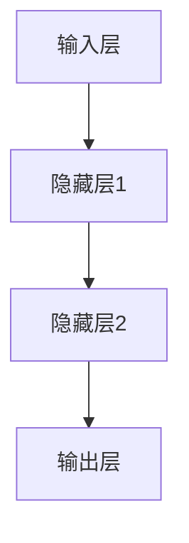
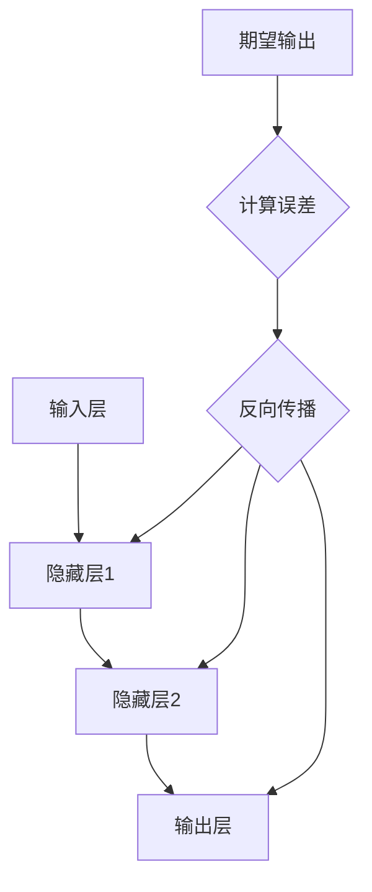
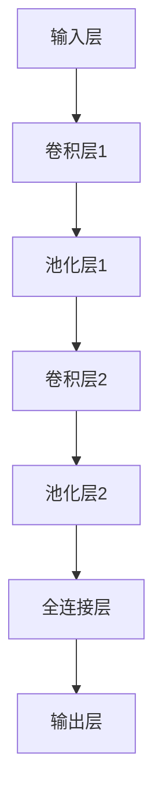
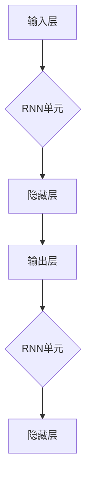

                 

# 《李开复：苹果发布AI应用的未来展望》

## 关键词：
- AI应用
- 苹果
- 人工智能技术
- 未来趋势
- 开发实践
- 伦理与法律

## 摘要：
本文旨在探讨苹果在人工智能（AI）领域的最新进展，并展望AI应用的未来发展趋势。通过李开复的视角，我们将深入分析苹果AI应用的背景、技术原理、潜在影响以及面临的挑战。同时，本文还将探讨AI核心算法原理、开发实践，以及AI应用在伦理和法律方面的议题。最后，我们将总结苹果AI应用的未来前景，并展望AI技术对社会的影响。

### 第一部分：AI应用的未来趋势与影响

#### 第1章：李开复谈AI与未来科技

##### 1.1 AI技术的发展趋势
人工智能技术正在以惊人的速度发展，其应用范围从自动驾驶、智能家居到医疗诊断和金融服务。李开复认为，AI技术的发展趋势将主要集中在以下几个方向：

1. **深度学习**：深度学习作为AI的核心技术，将继续引领AI研究的发展。通过增加神经网络的层数和参数，深度学习模型在图像识别、语音识别和自然语言处理等领域取得了显著突破。

2. **迁移学习**：迁移学习是一种利用已训练模型在新任务上的表现，从而减少新任务训练所需的数据量和计算资源的技术。随着数据的增加和模型的优化，迁移学习将在各种AI应用中发挥越来越重要的作用。

3. **强化学习**：强化学习是一种通过与环境交互来学习策略的机器学习方法。在游戏、机器人控制和自动驾驶等领域，强化学习算法已经取得了显著成果，未来将在更多领域得到应用。

##### 1.2 AI对人类社会的影响
AI技术的快速发展将对人类社会产生深远的影响：

1. **产业变革**：AI技术将推动传统产业的数字化转型，提高生产效率和降低成本。例如，在制造业中，AI可以帮助实现智能化生产线的自动化控制。

2. **就业影响**：尽管AI将创造新的就业机会，但同时也可能取代一些传统工作岗位。李开复认为，教育系统需要适应这一变化，培养更多具备AI技能的人才。

3. **社会治理**：AI技术在智能监控、网络安全和公共安全等领域具有巨大潜力。通过利用AI技术，政府可以更有效地管理公共资源和提高社会治理水平。

##### 1.3 未来科技与人类生活的融合
未来科技与人类生活的融合将是AI应用的一个重要趋势：

1. **智能家居**：智能家居设备将更加智能化和便捷化，通过AI技术实现自动化控制，提高居住体验。

2. **健康医疗**：AI技术在疾病诊断、药物研发和个人健康管理等领域具有广泛应用前景，将极大地改善医疗服务质量。

3. **教育与培训**：AI技术可以提供个性化学习方案，帮助学生提高学习效率，同时为教师提供更有效的教学工具。

#### 第2章：苹果AI应用的探索

##### 2.1 苹果AI应用的背景
苹果公司一直致力于在人工智能领域进行创新，其AI应用涵盖了多个方面：

1. **Siri**：作为苹果公司的智能语音助手，Siri通过自然语言处理技术提供语音交互服务。

2. **面部识别**：苹果的Face ID技术利用深度学习算法进行面部识别，确保设备的安全性。

3. **图像识别**：苹果的图像识别技术通过机器学习算法实现图像分类和物体检测。

##### 2.2 典型AI应用案例解析
以下是几个典型的苹果AI应用案例：

1. **增强现实（AR）应用**：苹果的ARKit框架支持开发者创建高质量的AR应用，如《星球大战：星球战役》等。

2. **语音识别与翻译**：苹果的语音识别技术支持多种语言，并且具有实时翻译功能，为用户提供便捷的交流体验。

3. **健康监测**：苹果的健康应用通过集成多种传感器和AI算法，帮助用户监测健康状况，如心率监测、睡眠分析等。

##### 2.3 苹果AI应用的技术原理
苹果AI应用的技术原理主要包括以下几个方面：

1. **神经网络**：苹果使用神经网络进行图像识别和语音识别，通过大量数据训练模型，提高识别准确率。

2. **迁移学习**：苹果利用迁移学习技术，将预训练模型应用于新任务，从而减少新任务训练所需的时间和计算资源。

3. **强化学习**：苹果的ARKit框架中使用强化学习算法，通过不断与环境交互，优化AR应用的性能。

### 第二部分：AI应用的技术深度

#### 第4章：AI核心算法原理

##### 4.1 神经网络基础
神经网络是AI应用的基础，其结构如图1所示：



神经网络通过前向传播和反向传播进行训练，如图2所示：



##### 4.2 机器学习算法
机器学习算法包括监督学习、无监督学习和半监督学习。以下是几个典型算法的伪代码：

##### 4.2.1 监督学习
```python
def supervised_learning(X, Y):
    # X: 输入特征
    # Y: 标签
    model = train_model(X, Y)
    predict(X, model)
```

##### 4.2.2 无监督学习
```python
def unsupervised_learning(X):
    # X: 输入特征
    model = train_model(X)
    clusters = predict_clusters(X, model)
    return clusters
```

##### 4.3 深度学习算法
深度学习算法是基于神经网络的，其结构如图3所示：



##### 4.3.1 卷积神经网络（CNN）
卷积神经网络是一种用于图像识别和物体检测的深度学习算法，其伪代码如下：

```python
def cnn(image):
    # image: 图像
    conv1 = conv2d(image)
    pool1 = max_pool(conv1)
    conv2 = conv2d(pool1)
    pool2 = max_pool(conv2)
    flatten = flatten(pool2)
    fc = fully_connected(flatten)
    output = softmax(fc)
    return output
```

##### 4.3.2 递归神经网络（RNN）
递归神经网络是一种用于序列数据处理的深度学习算法，其结构如图4所示：



#### 第5章：AI应用的开发实践

##### 5.1 开发环境搭建
要开发AI应用，首先需要搭建一个合适的开发环境。以下是一个简单的Python开发环境搭建步骤：

1. 安装Python（3.7及以上版本）。
2. 安装Anaconda，用于管理Python环境。
3. 创建一个新的Anaconda环境，并安装所需的库（如TensorFlow、PyTorch等）。

##### 5.2 代码实战案例

##### 5.2.1 语音识别
以下是一个使用TensorFlow实现语音识别的简单代码示例：

```python
import tensorflow as tf
import librosa

def extract_mel_spectrogram(audio, sample_rate):
    # audio: 音频数据
    # sample_rate: 样本率
    melspectrogram = librosa.feature.melspectrogram(y=audio, sr=sample_rate)
    log_melspectrogram = librosa.power_to_db(melspectrogram)
    return log_melspectrogram

def build_model(input_shape):
    model = tf.keras.Sequential([
        tf.keras.layers.Input(shape=input_shape),
        tf.keras.layers.Conv2D(32, (3, 3), activation='relu'),
        tf.keras.layers.MaxPooling2D(pool_size=(2, 2)),
        tf.keras.layers.Flatten(),
        tf.keras.layers.Dense(128, activation='relu'),
        tf.keras.layers.Dense(1, activation='sigmoid')
    ])
    return model

def main():
    # 加载音频数据
    audio, sample_rate = librosa.load('audio.wav')
    # 提取梅尔频谱
    melspectrogram = extract_mel_spectrogram(audio, sample_rate)
    # 构建和训练模型
    model = build_model(melspectrogram.shape[1:])
    model.compile(optimizer='adam', loss='binary_crossentropy', metrics=['accuracy'])
    model.fit(melspectrogram, labels, epochs=10)
    # 保存模型
    model.save('speech_recognition_model.h5')

if __name__ == '__main__':
    main()
```

##### 5.2.2 图像分类
以下是一个使用TensorFlow实现图像分类的简单代码示例：

```python
import tensorflow as tf
import tensorflow_hub as hub
import tensorflow_text as text
import numpy as np
import cv2

def preprocess_image(image):
    # image: 图像数据
    image = cv2.resize(image, (224, 224))
    image = image / 255.0
    return image

def classify_image(image_path):
    # 加载预训练的模型
    model = hub.load("https://tfhub.dev/google/tf2-preview/mobilenet_v2_100_224/1")
    # 读取图像
    image = preprocess_image(cv2.imread(image_path))
    # 进行图像分类
    predictions = model.predict(np.expand_dims(image, 0))
    predicted_class = np.argmax(predictions)
    return predicted_class

def main():
    image_path = 'image.jpg'
    predicted_class = classify_image(image_path)
    print(f"预测的类别为：{predicted_class}")

if __name__ == '__main__':
    main()
```

#### 第6章：AI应用的伦理与法律

##### 6.1 AI伦理问题探讨
AI伦理问题是当前社会关注的焦点，主要包括以下几个方面：

1. **隐私保护**：AI技术在数据收集和使用过程中可能侵犯个人隐私。如何确保数据的安全和隐私保护是一个重要议题。

2. **算法公平性**：算法在决策过程中可能存在偏见，导致不公平对待。如何确保算法的公平性和透明性是亟待解决的问题。

3. **责任归属**：当AI系统出现故障或导致损害时，如何确定责任归属是一个复杂的问题。

##### 6.2 AI法律框架构建
为了应对AI伦理问题，各国政府正在积极构建AI法律框架：

1. **数据保护法**：加强对个人数据的保护，确保数据收集和使用合法、透明。

2. **算法监管**：加强对算法的监管，确保算法的公平性和透明性。

3. **责任认定**：明确AI系统的责任归属，为受害者提供法律救济。

##### 6.3 AI应用的社会责任
AI应用的发展需要承担社会责任，主要包括以下几个方面：

1. **普及教育**：推动AI技术的普及教育，提高公众的AI素养。

2. **就业支持**：为受AI影响的就业人群提供职业培训和转岗支持。

3. **公益项目**：利用AI技术开展公益项目，为社会福利事业贡献力量。

### 第三部分：AI应用的未来展望

#### 第7章：李开复对苹果AI应用的看法

##### 7.1 对苹果AI应用的认可
李开复对苹果AI应用的发展给予了高度认可，他认为：

1. **技术创新**：苹果在AI领域的技术创新，如Siri、Face ID和ARKit，为用户体验带来了显著的提升。

2. **市场影响力**：苹果作为全球最大的科技公司之一，其AI应用的成功将为整个行业树立标杆。

##### 7.2 对苹果AI应用的未来期待
李开复对未来苹果AI应用的发展充满期待，他认为：

1. **更智能的交互**：苹果将进一步优化AI交互，如语音识别、手势控制和自然语言处理，为用户提供更加智能的体验。

2. **更广泛的应用场景**：苹果的AI应用将在更多领域得到应用，如医疗、教育和金融等。

##### 7.3 对苹果AI应用的挑战与应对策略
李开复也指出，苹果AI应用面临一些挑战：

1. **数据隐私**：如何在确保用户隐私的同时，充分发挥AI技术的作用是一个重要问题。

2. **算法公平性**：如何确保算法的公平性和透明性，避免偏见和不公平对待。

应对策略：

1. **加强数据隐私保护**：通过加密技术和隐私保护算法，确保用户数据的安全和隐私。

2. **开放算法审查**：建立透明、公开的算法审查机制，接受外部监督，确保算法的公平性和透明性。

#### 第8章：未来AI应用的发展方向

##### 8.1 AI应用的未来趋势
未来AI应用的发展将呈现以下几个趋势：

1. **智能化**：AI应用将更加智能化，通过深度学习和强化学习等技术，实现更精准的预测和决策。

2. **个性化**：AI应用将根据用户行为和偏好，提供个性化的服务和建议。

3. **跨界融合**：AI技术与其他领域的融合将创造新的应用场景，如AI+医疗、AI+教育、AI+金融等。

##### 8.2 AI技术革新
未来AI技术的革新将主要集中在以下几个方面：

1. **量子计算**：量子计算有望为AI带来巨大的计算能力提升，推动AI技术的发展。

2. **边缘计算**：边缘计算将使AI应用在数据产生的地方进行处理，提高响应速度和降低延迟。

3. **生物计算**：生物计算将利用生物系统进行计算，如DNA计算和蛋白质计算，为AI提供新的计算范式。

##### 8.3 AI应用的创新实践
未来AI应用的创新实践将主要集中在以下几个方面：

1. **智能制造**：利用AI技术实现智能制造，提高生产效率和产品质量。

2. **智能交通**：利用AI技术优化交通流

