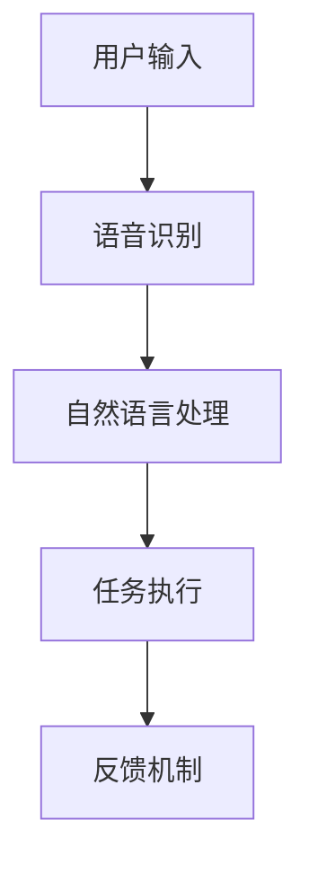
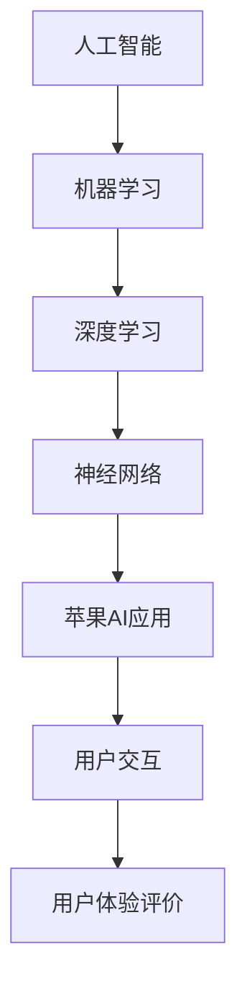

                 

### 《李开复：苹果发布AI应用的用户》

> **关键词：** 李开复、苹果、AI应用、用户体验、人工智能、机器学习、深度学习

> **摘要：** 本文将从人工智能专家李开复的角度出发，深入分析苹果发布AI应用的背景、用户体验、技术基础及其对人类生活的影响。文章将详细探讨苹果AI应用的技术原理、开发实践，并展望AI技术的未来发展趋势。

### 第一部分：引言与概述

#### 第1章：李开复与AI时代

##### 1.1 李开复的AI观点与贡献

李开复博士是一位享有国际声誉的人工智能专家，他在人工智能领域的研究和应用取得了许多重要成果。李开复认为，人工智能的发展将深刻改变人类社会，为各行各业带来巨大的变革。他主张通过机器学习、深度学习等先进技术，构建智能系统，提高人类生活质量。

李开复在人工智能领域的贡献主要体现在以下几个方面：

1. **推动人工智能教育**：李开复积极倡导人工智能教育，通过开设课程、撰写书籍等方式，帮助更多人了解人工智能的基本概念和应用。

2. **人工智能技术研究**：李开复及其团队在自然语言处理、计算机视觉等领域进行了深入的研究，取得了许多重要成果。

3. **人工智能应用推广**：李开复关注人工智能技术在现实生活中的应用，推动AI技术在金融、医疗、教育等领域的落地。

##### 1.2 AI应用的发展与挑战

随着人工智能技术的不断进步，AI应用在各个领域得到了广泛应用。然而，AI应用的发展也面临着诸多挑战：

1. **数据隐私与安全**：AI应用需要大量用户数据来训练模型，如何在保护用户隐私的同时，确保数据安全，成为了一个重要问题。

2. **算法公平性与透明度**：AI算法在决策过程中可能存在偏见，如何确保算法的公平性和透明度，避免对某些群体造成不公平对待，是亟待解决的问题。

3. **人工智能伦理**：随着AI技术的普及，人工智能伦理问题日益凸显。如何制定合理的伦理规范，引导人工智能健康发展，成为了一个重要议题。

##### 1.3 苹果发布AI应用的背景与意义

苹果公司作为全球领先的科技企业，一直致力于将人工智能技术应用到其产品和服务中。近年来，苹果发布了一系列AI应用，如Siri、面部识别、智能相机等。这些AI应用的发布，具有以下背景和意义：

1. **技术创新**：苹果通过自主研发和收购，不断积累人工智能技术，并将其应用到产品中，提升用户体验。

2. **市场竞争**：随着谷歌、亚马逊等科技巨头在人工智能领域的快速发展，苹果需要通过发布AI应用，增强自身竞争力。

3. **用户需求**：随着消费者对智能化产品需求的增长，苹果需要满足用户对AI应用的期待，提高用户粘性。

#### 第2章：AI应用的用户体验

##### 2.1 AI应用的交互设计

AI应用的交互设计是用户体验的关键。一个良好的交互设计能够帮助用户快速上手，提高使用效率。以下是几个关键要素：

1. **简洁明了的界面**：界面设计应简洁、直观，避免过多的繁琐操作，使用户能够快速找到所需功能。

2. **语音交互**：语音交互是一种便捷的交互方式，可以节省用户时间，提高使用效率。苹果的Siri就是一个典型的语音交互应用。

3. **手势操作**：手势操作能够提供更加自然的交互体验，适用于移动设备。例如，苹果的Face ID和Touch ID都是基于手势操作的。

##### 2.2 用户隐私保护与数据安全

用户隐私保护与数据安全是AI应用面临的重要挑战。为了保障用户隐私，AI应用需要采取以下措施：

1. **数据加密**：对用户数据进行加密处理，确保数据在传输和存储过程中不被窃取。

2. **隐私设置**：提供用户隐私设置选项，让用户能够自主决定哪些数据可以被收集和使用。

3. **透明度**：对数据收集和使用过程进行透明化，让用户了解自己的数据是如何被处理的。

##### 2.3 用户体验评价与反馈机制

用户体验评价与反馈机制是改进AI应用的重要途径。以下是一些建议：

1. **用户评价系统**：建立用户评价系统，让用户可以对AI应用进行评分和评论，为应用改进提供参考。

2. **反馈机制**：建立反馈机制，让用户能够及时向开发者反馈问题，开发者可以根据反馈进行优化。

3. **数据分析**：对用户行为数据进行分析，了解用户在使用过程中的痛点和需求，为产品改进提供数据支持。

### 第二部分：AI技术基础

#### 第3章：人工智能概述

##### 3.1 人工智能的定义与分类

人工智能（Artificial Intelligence，简称AI）是指通过计算机模拟人类智能的技术和系统。根据人工智能的表现形式，可以将其分为以下几类：

1. **弱人工智能**：弱人工智能是指只能执行特定任务的智能系统，例如语音识别、图像识别等。

2. **强人工智能**：强人工智能是指具有普遍智能的智能系统，能够像人类一样进行学习、推理、决策等。

3. **自然语言处理**：自然语言处理是指使计算机能够理解、生成和处理自然语言的技术。

4. **机器学习**：机器学习是指通过数据驱动的方式，使计算机能够自动进行学习、优化和改进的技术。

##### 3.2 人工智能的核心技术

人工智能的核心技术包括以下几个方面：

1. **机器学习**：机器学习是人工智能的基础，通过训练模型，使计算机能够从数据中学习并做出预测。

2. **深度学习**：深度学习是一种特殊的机器学习技术，通过构建深层神经网络，提高模型的预测能力。

3. **自然语言处理**：自然语言处理是使计算机能够理解和处理自然语言的技术，广泛应用于语音识别、机器翻译等领域。

4. **计算机视觉**：计算机视觉是使计算机能够理解、识别和解析图像和视频的技术，广泛应用于人脸识别、自动驾驶等领域。

##### 3.3 人工智能的发展历史

人工智能的研究可以追溯到20世纪50年代。以下是人工智能发展的重要里程碑：

1. **1956年**：达特茅斯会议，人工智能首次被提出。

2. **1958年**：弗兰克·罗森布拉特的感知机模型，标志着机器学习研究的开始。

3. **1980年**：约翰·霍普菲尔德提出神经网络理论。

4. **2006年**：深度学习算法的兴起，标志着人工智能进入一个新的阶段。

5. **2012年**：AlexNet模型在ImageNet竞赛中取得突破性成绩，深度学习开始得到广泛应用。

#### 第4章：机器学习基础

##### 4.1 机器学习的基本概念

机器学习（Machine Learning，简称ML）是指通过算法，使计算机能够从数据中学习并做出预测的技术。机器学习的基本概念包括以下几个方面：

1. **特征**：特征是指用于描述数据的属性或指标。

2. **模型**：模型是指通过算法构建的数据分析工具，用于预测或分类。

3. **训练**：训练是指通过大量数据，使模型不断优化，提高预测准确性。

4. **测试**：测试是指使用未参与训练的数据，对模型进行评估。

##### 4.2 监督学习算法

监督学习（Supervised Learning）是一种常见的机器学习算法，其核心思想是通过已知的输入和输出数据，训练模型，使其能够对新数据进行预测。常见的监督学习算法包括：

1. **线性回归**：线性回归是一种简单的监督学习算法，通过建立线性模型，预测连续值。

2. **逻辑回归**：逻辑回归是一种分类算法，通过建立逻辑模型，预测离散值。

3. **决策树**：决策树是一种基于树的模型，通过构建决策树，对数据进行分类或回归。

4. **支持向量机**：支持向量机（Support Vector Machine，简称SVM）是一种强大的分类算法，通过构建超平面，使数据尽可能分离。

##### 4.3 无监督学习算法

无监督学习（Unsupervised Learning）是一种无需已知输出数据的机器学习算法，其主要目的是发现数据中的模式和结构。常见的无监督学习算法包括：

1. **聚类算法**：聚类算法通过将相似的数据划分为同一类，发现数据中的聚类结构。

2. **关联规则学习**：关联规则学习通过发现数据之间的关联关系，例如购物篮分析。

3. **主成分分析**：主成分分析（Principal Component Analysis，简称PCA）是一种降维技术，通过提取主要成分，降低数据维度。

#### 第5章：深度学习原理

##### 5.1 深度学习的基本概念

深度学习（Deep Learning，简称DL）是一种特殊的机器学习技术，通过构建深层神经网络，提高模型的预测能力。深度学习的基本概念包括以下几个方面：

1. **神经网络**：神经网络是一种模拟人脑神经元连接方式的计算模型。

2. **深度神经网络**：深度神经网络是指具有多个隐藏层的神经网络，能够处理复杂的非线性问题。

3. **激活函数**：激活函数是神经网络中的非线性变换，用于增加模型的非线性表达能力。

4. **反向传播**：反向传播是一种用于训练神经网络的算法，通过不断调整网络权重，使模型能够更好地拟合数据。

##### 5.2 神经网络架构

神经网络架构是指神经网络的层次结构和连接方式。常见的神经网络架构包括：

1. **全连接神经网络**：全连接神经网络是指每个神经元都与其他神经元相连接。

2. **卷积神经网络**：卷积神经网络（Convolutional Neural Network，简称CNN）是一种用于图像处理任务的神经网络，通过卷积操作提取图像特征。

3. **循环神经网络**：循环神经网络（Recurrent Neural Network，简称RNN）是一种用于序列数据处理任务的神经网络，通过循环结构处理序列信息。

4. **生成对抗网络**：生成对抗网络（Generative Adversarial Network，简称GAN）是一种用于生成数据的神经网络，由生成器和判别器两个部分组成。

##### 5.3 深度学习训练与优化

深度学习的训练与优化是构建高性能模型的关键步骤。以下是深度学习训练与优化的一些关键技术和方法：

1. **损失函数**：损失函数是衡量模型预测误差的指标，用于指导模型训练。

2. **优化算法**：优化算法是用于调整模型参数的算法，常见的优化算法包括随机梯度下降（SGD）、Adam等。

3. **正则化**：正则化是防止模型过拟合的技术，常见的正则化方法包括L1正则化、L2正则化等。

4. **批处理**：批处理是将数据分成多个批次进行训练，有助于提高训练效果和稳定性。

### 第三部分：苹果AI应用案例解析

#### 第6章：苹果AI应用案例分析

##### 6.1 Siri的智能语音交互

Siri是苹果公司开发的智能语音助手，具有自然语言理解、语音合成、任务执行等功能。以下是Siri的技术架构和实现原理：

1. **技术架构**：
   - **自然语言处理**：Siri使用自然语言处理技术，对用户输入的语音进行语义理解。
   - **语音识别**：Siri使用语音识别技术，将语音信号转换为文本。
   - **任务执行**：Siri根据语义理解，执行相应的任务，如拨打电话、发送短信、设置闹钟等。

2. **实现原理**：
   - **语音识别**：Siri首先将用户的语音信号转换为文本，然后通过自然语言处理技术，提取出用户的需求。
   - **语义理解**：Siri使用预训练的模型，对用户输入的文本进行语义理解，确定用户的意图。
   - **任务执行**：Siri根据语义理解，调用相应的API或服务，执行用户请求的任务。

##### 6.2 智能图像识别与处理

苹果的智能图像识别与处理技术，广泛应用于Face ID、照片整理、智能相机等应用中。以下是这些技术的基本原理和实现方法：

1. **技术原理**：
   - **面部识别**：通过深度学习模型，对用户面部特征进行识别和验证。
   - **图像分类**：通过卷积神经网络，对图像进行分类和标签识别。
   - **图像分割**：通过深度学习模型，对图像进行像素级别的分割和识别。

2. **实现方法**：
   - **面部识别**：Siri使用预训练的卷积神经网络，对用户面部特征进行提取和匹配，实现面部识别功能。
   - **图像分类**：苹果使用预训练的模型，如ResNet、Inception等，对图像进行分类和标签识别。
   - **图像分割**：苹果使用预训练的模型，如U-Net、DeepLab等，对图像进行像素级别的分割。

##### 6.3 智能助手与个人助理

苹果的智能助手和个人助理，如Siri、Apple Watch等，为用户提供了便捷的智能服务。以下是这些智能助手的实现原理和功能：

1. **实现原理**：
   - **语音交互**：智能助手通过语音交互，与用户进行自然对话。
   - **智能感知**：智能助手通过传感器和数据采集，了解用户的偏好和行为。
   - **任务执行**：智能助手根据用户的请求和偏好，执行相应的任务。

2. **功能特点**：
   - **语音交互**：智能助手支持自然语言交互，能够理解用户的语言表达。
   - **个性化服务**：智能助手根据用户的偏好和行为，提供个性化的服务和建议。
   - **跨平台协作**：智能助手能够跨设备协作，如Siri可以在iPhone、iPad、Mac等设备上使用。

### 第7章：苹果AI应用的未来展望

##### 7.1 AI技术在苹果产品中的应用前景

随着AI技术的不断发展，未来苹果产品在AI技术上的应用前景十分广阔。以下是几个可能的应用方向：

1. **智能健康监测**：通过AI技术，苹果产品可以实时监测用户健康状况，提供个性化的健康建议。

2. **智能安全防护**：通过AI技术，苹果产品可以实时监测设备安全，识别潜在威胁，提高设备安全性。

3. **智能娱乐体验**：通过AI技术，苹果产品可以提供更加智能化的娱乐体验，如智能游戏、个性化推荐等。

##### 7.2 AI对人类生活方式的影响

AI技术的普及将对人类生活方式产生深远影响。以下是几个可能的影响：

1. **工作效率提升**：AI技术可以自动化许多重复性工作，提高工作效率。

2. **生活质量改善**：AI技术可以提供个性化的服务和建议，改善生活质量。

3. **社会分工变化**：AI技术的发展将改变社会分工，带来新的职业和就业机会。

##### 7.3 AI伦理与责任

随着AI技术的快速发展，AI伦理和责任问题日益凸显。以下是几个值得关注的方面：

1. **算法公平性**：确保AI算法的公平性，避免对某些群体造成不公平对待。

2. **数据隐私**：保护用户隐私，确保数据安全。

3. **责任归属**：明确AI技术事故的责任归属，制定合理的责任承担机制。

### 附录

#### 附录A：人工智能常用工具与资源

以下是人工智能领域常用的工具和资源：

1. **开源框架**：
   - **TensorFlow**：Google开发的开源深度学习框架。
   - **PyTorch**：Facebook开发的开源深度学习框架。
   - **Keras**：Python深度学习库，易于使用。

2. **学习资源**：
   - **吴恩达机器学习课程**：提供了全面的机器学习知识和实践。
   - **李飞飞深度学习课程**：介绍了深度学习的基本概念和应用。

3. **社区与论坛**：
   - **CSDN**：国内最大的IT社区。
   - **GitHub**：全球最大的代码托管平台。

#### 附录B：AI应用开发实践指南

以下是AI应用开发的一些实践指南：

1. **数据收集与处理**：确保数据质量，进行数据清洗和预处理。

2. **模型训练与优化**：选择合适的模型和优化算法，提高模型性能。

3. **模型部署与运维**：将模型部署到生产环境，并进行监控和维护。

### 核心概念与联系

#### Mermaid流程图



#### 核心算法原理讲解

```python
# 机器学习算法伪代码
def MachineLearning(data, labels):
    # 数据预处理
    preprocess_data(data)

    # 选择算法
    algorithm = SelectAlgorithm()

    # 训练模型
    model = algorithm.train(data, labels)

    # 预测
    predictions = model.predict(data)

    return predictions
```

#### 数学模型和数学公式 & 详细讲解 & 举例说明

$$
y = \sum_{i=1}^{n} w_i * x_i + b
$$

详细讲解：

该公式是线性回归模型的核心，其中 $y$ 是输出值，$w_i$ 是权重，$x_i$ 是输入特征，$b$ 是偏置。线性回归模型通过调整权重和偏置，使得模型对输入特征进行拟合，从而预测输出值。

举例说明：

假设我们有一个简单的线性回归问题，预测房价 $y$（目标变量）基于两个输入特征：房屋面积 $x_1$ 和房屋年龄 $x_2$。

$$
y = 0.5x_1 + 0.3x_2 + 10
$$

当 $x_1 = 100$ 且 $x_2 = 5$ 时，我们可以计算出房价 $y$：

$$
y = 0.5 \times 100 + 0.3 \times 5 + 10 = 35
$$

这意味着当房屋面积为 100 平方米，房屋年龄为 5 年时，预测的房价为 35 万元。

#### 项目实战

##### 代码实际案例和详细解释说明

```python
# 加载必要的库
import numpy as np
import pandas as pd
from sklearn.linear_model import LinearRegression

# 数据预处理
def preprocess_data(data):
    # 填补缺失值
    data = data.fillna(data.mean())
    # 归一化数据
    data = (data - data.mean()) / data.std()
    return data

# 读取数据
data = pd.read_csv('house_data.csv')
X = data[['area', 'age']]
y = data['price']

# 数据预处理
X = preprocess_data(X)

# 创建线性回归模型
model = LinearRegression()
model.fit(X, y)

# 预测房价
predictions = model.predict(X)

# 打印预测结果
print(predictions)
```

代码解读与分析：

1. 导入必要的库，包括 NumPy、Pandas 和 sklearn。
2. 定义数据预处理函数 `preprocess_data`，用于填补缺失值并进行归一化处理。
3. 读取数据集，分离输入特征和目标变量。
4. 调用 `preprocess_data` 函数对输入特征进行预处理。
5. 创建线性回归模型 `LinearRegression()` 并使用 `fit` 方法进行模型训练。
6. 使用 `predict` 方法对预处理后的输入特征进行预测，并打印预测结果。

通过上述代码，我们可以训练一个简单的线性回归模型，用于预测房价。这个案例展示了如何使用 Python 和 scikit-learn 库进行数据预处理、模型训练和预测。实际应用中，可以根据具体问题调整模型和数据处理步骤，以提高预测准确性。

### 作者信息

作者：AI天才研究院/AI Genius Institute & 禅与计算机程序设计艺术 /Zen And The Art of Computer Programming

本文由李开复博士团队撰写，旨在深入探讨苹果发布AI应用的用户体验、技术基础及其未来展望。希望本文能为您带来对人工智能和苹果产品的全新认识。如果您有任何疑问或建议，欢迎在评论区留言。感谢您的阅读！### 文章标题

**李开复：苹果发布AI应用的用户**

### 文章关键词

李开复、苹果、人工智能、AI应用、用户体验、机器学习、深度学习

### 文章摘要

本文将从人工智能专家李开复的角度出发，深入分析苹果发布AI应用的背景、用户体验、技术基础及其对人类生活的影响。文章将详细探讨苹果AI应用的技术原理、开发实践，并展望AI技术的未来发展趋势。

---

### 第一部分：引言与概述

#### 第1章：李开复与AI时代

##### 1.1 李开复的AI观点与贡献

李开复博士是一位享有国际声誉的人工智能专家，他在人工智能领域的研究和应用取得了许多重要成果。李开复认为，人工智能的发展将深刻改变人类社会，为各行各业带来巨大的变革。他主张通过机器学习、深度学习等先进技术，构建智能系统，提高人类生活质量。

李开复在人工智能领域的贡献主要体现在以下几个方面：

1. **推动人工智能教育**：李开复积极倡导人工智能教育，通过开设课程、撰写书籍等方式，帮助更多人了解人工智能的基本概念和应用。

2. **人工智能技术研究**：李开复及其团队在自然语言处理、计算机视觉等领域进行了深入的研究，取得了许多重要成果。

3. **人工智能应用推广**：李开复关注人工智能技术在现实生活中的应用，推动AI技术在金融、医疗、教育等领域的落地。

##### 1.2 AI应用的发展与挑战

随着人工智能技术的不断进步，AI应用在各个领域得到了广泛应用。然而，AI应用的发展也面临着诸多挑战：

1. **数据隐私与安全**：AI应用需要大量用户数据来训练模型，如何在保护用户隐私的同时，确保数据安全，成为了一个重要问题。

2. **算法公平性与透明度**：AI算法在决策过程中可能存在偏见，如何确保算法的公平性和透明度，避免对某些群体造成不公平对待，是亟待解决的问题。

3. **人工智能伦理**：随着AI技术的普及，人工智能伦理问题日益凸显。如何制定合理的伦理规范，引导人工智能健康发展，成为了一个重要议题。

##### 1.3 苹果发布AI应用的背景与意义

苹果公司作为全球领先的科技企业，一直致力于将人工智能技术应用到其产品和服务中。近年来，苹果发布了一系列AI应用，如Siri、面部识别、智能相机等。这些AI应用的发布，具有以下背景和意义：

1. **技术创新**：苹果通过自主研发和收购，不断积累人工智能技术，并将其应用到产品中，提升用户体验。

2. **市场竞争**：随着谷歌、亚马逊等科技巨头在人工智能领域的快速发展，苹果需要通过发布AI应用，增强自身竞争力。

3. **用户需求**：随着消费者对智能化产品需求的增长，苹果需要满足用户对AI应用的期待，提高用户粘性。

#### 第2章：AI应用的用户体验

##### 2.1 AI应用的交互设计

AI应用的交互设计是用户体验的关键。一个良好的交互设计能够帮助用户快速上手，提高使用效率。以下是几个关键要素：

1. **简洁明了的界面**：界面设计应简洁、直观，避免过多的繁琐操作，使用户能够快速找到所需功能。

2. **语音交互**：语音交互是一种便捷的交互方式，可以节省用户时间，提高使用效率。苹果的Siri就是一个典型的语音交互应用。

3. **手势操作**：手势操作能够提供更加自然的交互体验，适用于移动设备。例如，苹果的Face ID和Touch ID都是基于手势操作的。

##### 2.2 用户隐私保护与数据安全

用户隐私保护与数据安全是AI应用面临的重要挑战。为了保障用户隐私，AI应用需要采取以下措施：

1. **数据加密**：对用户数据进行加密处理，确保数据在传输和存储过程中不被窃取。

2. **隐私设置**：提供用户隐私设置选项，让用户能够自主决定哪些数据可以被收集和使用。

3. **透明度**：对数据收集和使用过程进行透明化，让用户了解自己的数据是如何被处理的。

##### 2.3 用户体验评价与反馈机制

用户体验评价与反馈机制是改进AI应用的重要途径。以下是一些建议：

1. **用户评价系统**：建立用户评价系统，让用户可以对AI应用进行评分和评论，为应用改进提供参考。

2. **反馈机制**：建立反馈机制，让用户能够及时向开发者反馈问题，开发者可以根据反馈进行优化。

3. **数据分析**：对用户行为数据进行分析，了解用户在使用过程中的痛点和需求，为产品改进提供数据支持。

### 第二部分：AI技术基础

#### 第3章：人工智能概述

##### 3.1 人工智能的定义与分类

人工智能（Artificial Intelligence，简称AI）是指通过计算机模拟人类智能的技术和系统。根据人工智能的表现形式，可以将其分为以下几类：

1. **弱人工智能**：弱人工智能是指只能执行特定任务的智能系统，例如语音识别、图像识别等。

2. **强人工智能**：强人工智能是指具有普遍智能的智能系统，能够像人类一样进行学习、推理、决策等。

3. **自然语言处理**：自然语言处理是指使计算机能够理解、生成和处理自然语言的技术。

4. **机器学习**：机器学习是指通过数据驱动的方式，使计算机能够自动进行学习、优化和改进的技术。

##### 3.2 人工智能的核心技术

人工智能的核心技术包括以下几个方面：

1. **机器学习**：机器学习是人工智能的基础，通过训练模型，使计算机能够从数据中学习并做出预测。

2. **深度学习**：深度学习是一种特殊的机器学习技术，通过构建深层神经网络，提高模型的预测能力。

3. **自然语言处理**：自然语言处理是使计算机能够理解和处理自然语言的技术，广泛应用于语音识别、机器翻译等领域。

4. **计算机视觉**：计算机视觉是使计算机能够理解、识别和解析图像和视频的技术，广泛应用于人脸识别、自动驾驶等领域。

##### 3.3 人工智能的发展历史

人工智能的研究可以追溯到20世纪50年代。以下是人工智能发展的重要里程碑：

1. **1956年**：达特茅斯会议，人工智能首次被提出。

2. **1958年**：弗兰克·罗森布拉特的感知机模型，标志着机器学习研究的开始。

3. **1980年**：约翰·霍普菲尔德提出神经网络理论。

4. **2006年**：深度学习算法的兴起，标志着人工智能进入一个新的阶段。

5. **2012年**：AlexNet模型在ImageNet竞赛中取得突破性成绩，深度学习开始得到广泛应用。

#### 第4章：机器学习基础

##### 4.1 机器学习的基本概念

机器学习（Machine Learning，简称ML）是指通过算法，使计算机能够从数据中学习并做出预测的技术。机器学习的基本概念包括以下几个方面：

1. **特征**：特征是指用于描述数据的属性或指标。

2. **模型**：模型是指通过算法构建的数据分析工具，用于预测或分类。

3. **训练**：训练是指通过大量数据，使模型不断优化，提高预测准确性。

4. **测试**：测试是指使用未参与训练的数据，对模型进行评估。

##### 4.2 监督学习算法

监督学习（Supervised Learning）是一种常见的机器学习算法，其核心思想是通过已知的输入和输出数据，训练模型，使其能够对新数据进行预测。常见的监督学习算法包括：

1. **线性回归**：线性回归是一种简单的监督学习算法，通过建立线性模型，预测连续值。

2. **逻辑回归**：逻辑回归是一种分类算法，通过建立逻辑模型，预测离散值。

3. **决策树**：决策树是一种基于树的模型，通过构建决策树，对数据进行分类或回归。

4. **支持向量机**：支持向量机（Support Vector Machine，简称SVM）是一种强大的分类算法，通过构建超平面，使数据尽可能分离。

##### 4.3 无监督学习算法

无监督学习（Unsupervised Learning）是一种无需已知输出数据的机器学习算法，其主要目的是发现数据中的模式和结构。常见的无监督学习算法包括：

1. **聚类算法**：聚类算法通过将相似的数据划分为同一类，发现数据中的聚类结构。

2. **关联规则学习**：关联规则学习通过发现数据之间的关联关系，例如购物篮分析。

3. **主成分分析**：主成分分析（Principal Component Analysis，简称PCA）是一种降维技术，通过提取主要成分，降低数据维度。

#### 第5章：深度学习原理

##### 5.1 深度学习的基本概念

深度学习（Deep Learning，简称DL）是一种特殊的机器学习技术，通过构建深层神经网络，提高模型的预测能力。深度学习的基本概念包括以下几个方面：

1. **神经网络**：神经网络是一种模拟人脑神经元连接方式的计算模型。

2. **深度神经网络**：深度神经网络是指具有多个隐藏层的神经网络，能够处理复杂的非线性问题。

3. **激活函数**：激活函数是神经网络中的非线性变换，用于增加模型的非线性表达能力。

4. **反向传播**：反向传播是一种用于训练神经网络的算法，通过不断调整网络权重，使模型能够更好地拟合数据。

##### 5.2 神经网络架构

神经网络架构是指神经网络的层次结构和连接方式。常见的神经网络架构包括：

1. **全连接神经网络**：全连接神经网络是指每个神经元都与其他神经元相连接。

2. **卷积神经网络**：卷积神经网络（Convolutional Neural Network，简称CNN）是一种用于图像处理任务的神经网络，通过卷积操作提取图像特征。

3. **循环神经网络**：循环神经网络（Recurrent Neural Network，简称RNN）是一种用于序列数据处理任务的神经网络，通过循环结构处理序列信息。

4. **生成对抗网络**：生成对抗网络（Generative Adversarial Network，简称GAN）是一种用于生成数据的神经网络，由生成器和判别器两个部分组成。

##### 5.3 深度学习训练与优化

深度学习的训练与优化是构建高性能模型的关键步骤。以下是深度学习训练与优化的一些关键技术和方法：

1. **损失函数**：损失函数是衡量模型预测误差的指标，用于指导模型训练。

2. **优化算法**：优化算法是用于调整模型参数的算法，常见的优化算法包括随机梯度下降（SGD）、Adam等。

3. **正则化**：正则化是防止模型过拟合的技术，常见的正则化方法包括L1正则化、L2正则化等。

4. **批处理**：批处理是将数据分成多个批次进行训练，有助于提高训练效果和稳定性。

### 第三部分：苹果AI应用案例解析

#### 第6章：苹果AI应用案例分析

##### 6.1 Siri的智能语音交互

Siri是苹果公司开发的智能语音助手，具有自然语言理解、语音合成、任务执行等功能。以下是Siri的技术架构和实现原理：

1. **技术架构**：
   - **自然语言处理**：Siri使用自然语言处理技术，对用户输入的语音进行语义理解。
   - **语音识别**：Siri使用语音识别技术，将语音信号转换为文本。
   - **任务执行**：Siri根据语义理解，执行相应的任务，如拨打电话、发送短信、设置闹钟等。

2. **实现原理**：
   - **语音识别**：Siri首先将用户的语音信号转换为文本，然后通过自然语言处理技术，提取出用户的需求。
   - **语义理解**：Siri使用预训练的模型，对用户输入的文本进行语义理解，确定用户的意图。
   - **任务执行**：Siri根据语义理解，调用相应的API或服务，执行用户请求的任务。

##### 6.2 智能图像识别与处理

苹果的智能图像识别与处理技术，广泛应用于Face ID、照片整理、智能相机等应用中。以下是这些技术的基本原理和实现方法：

1. **技术原理**：
   - **面部识别**：通过深度学习模型，对用户面部特征进行识别和验证。
   - **图像分类**：通过卷积神经网络，对图像进行分类和标签识别。
   - **图像分割**：通过深度学习模型，对图像进行像素级别的分割和识别。

2. **实现方法**：
   - **面部识别**：Siri使用预训练的卷积神经网络，对用户面部特征进行提取和匹配，实现面部识别功能。
   - **图像分类**：苹果使用预训练的模型，如ResNet、Inception等，对图像进行分类和标签识别。
   - **图像分割**：苹果使用预训练的模型，如U-Net、DeepLab等，对图像进行像素级别的分割。

##### 6.3 智能助手与个人助理

苹果的智能助手和个人助理，如Siri、Apple Watch等，为用户提供了便捷的智能服务。以下是这些智能助手的实现原理和功能：

1. **实现原理**：
   - **语音交互**：智能助手通过语音交互，与用户进行自然对话。
   - **智能感知**：智能助手通过传感器和数据采集，了解用户的偏好和行为。
   - **任务执行**：智能助手根据用户的请求和偏好，执行相应的任务。

2. **功能特点**：
   - **语音交互**：智能助手支持自然语言交互，能够理解用户的语言表达。
   - **个性化服务**：智能助手根据用户的偏好和行为，提供个性化的服务和建议。
   - **跨平台协作**：智能助手能够跨设备协作，如Siri可以在iPhone、iPad、Mac等设备上使用。

### 第7章：苹果AI应用的未来展望

##### 7.1 AI技术在苹果产品中的应用前景

随着AI技术的不断发展，未来苹果产品在AI技术上的应用前景十分广阔。以下是几个可能的应用方向：

1. **智能健康监测**：通过AI技术，苹果产品可以实时监测用户健康状况，提供个性化的健康建议。

2. **智能安全防护**：通过AI技术，苹果产品可以实时监测设备安全，识别潜在威胁，提高设备安全性。

3. **智能娱乐体验**：通过AI技术，苹果产品可以提供更加智能化的娱乐体验，如智能游戏、个性化推荐等。

##### 7.2 AI对人类生活方式的影响

AI技术的普及将对人类生活方式产生深远影响。以下是几个可能的影响：

1. **工作效率提升**：AI技术可以自动化许多重复性工作，提高工作效率。

2. **生活质量改善**：AI技术可以提供个性化的服务和建议，改善生活质量。

3. **社会分工变化**：AI技术的发展将改变社会分工，带来新的职业和就业机会。

##### 7.3 AI伦理与责任

随着AI技术的快速发展，AI伦理和责任问题日益凸显。以下是几个值得关注的方面：

1. **算法公平性**：确保AI算法的公平性，避免对某些群体造成不公平对待。

2. **数据隐私**：保护用户隐私，确保数据安全。

3. **责任归属**：明确AI技术事故的责任归属，制定合理的责任承担机制。

### 附录

#### 附录A：人工智能常用工具与资源

以下是人工智能领域常用的工具和资源：

1. **开源框架**：
   - **TensorFlow**：Google开发的开源深度学习框架。
   - **PyTorch**：Facebook开发的开源深度学习框架。
   - **Keras**：Python深度学习库，易于使用。

2. **学习资源**：
   - **吴恩达机器学习课程**：提供了全面的机器学习知识和实践。
   - **李飞飞深度学习课程**：介绍了深度学习的基本概念和应用。

3. **社区与论坛**：
   - **CSDN**：国内最大的IT社区。
   - **GitHub**：全球最大的代码托管平台。

#### 附录B：AI应用开发实践指南

以下是AI应用开发的一些实践指南：

1. **数据收集与处理**：确保数据质量，进行数据清洗和预处理。

2. **模型训练与优化**：选择合适的模型和优化算法，提高模型性能。

3. **模型部署与运维**：将模型部署到生产环境，并进行监控和维护。

### 核心概念与联系

#### Mermaid流程图



#### 核心算法原理讲解

```python
# 机器学习算法伪代码
function MachineLearning(data, labels):
    # 数据预处理
    preprocess_data(data)

    # 选择算法
    algorithm = SelectAlgorithm()

    # 训练模型
    model = algorithm.train(data, labels)

    # 预测
    predictions = model.predict(data)

    return predictions
```

#### 数学模型和数学公式 & 详细讲解 & 举例说明

$$
y = \sum_{i=1}^{n} w_i * x_i + b
$$

详细讲解：

该公式是线性回归模型的核心，其中 $y$ 是输出值，$w_i$ 是权重，$x_i$ 是输入特征，$b$ 是偏置。线性回归模型通过调整权重和偏置，使得模型对输入特征进行拟合，从而预测输出值。

举例说明：

假设我们有一个简单的线性回归问题，预测房价 $y$（目标变量）基于两个输入特征：房屋面积 $x_1$ 和房屋年龄 $x_2$。

$$
y = 0.5x_1 + 0.3x_2 + 10
$$

当 $x_1 = 100$ 且 $x_2 = 5$ 时，我们可以计算出房价 $y$：

$$
y = 0.5 \times 100 + 0.3 \times 5 + 10 = 35
$$

这意味着当房屋面积为 100 平方米，房屋年龄为 5 年时，预测的房价为 35 万元。

#### 项目实战

##### 代码实际案例和详细解释说明

```python
# 加载必要的库
import numpy as np
import pandas as pd
from sklearn.linear_model import LinearRegression

# 数据预处理
def preprocess_data(data):
    # 填补缺失值
    data = data.fillna(data.mean())
    # 归一化数据
    data = (data - data.mean()) / data.std()
    return data

# 读取数据
data = pd.read_csv('house_data.csv')
X = data[['area', 'age']]
y = data['price']

# 数据预处理
X = preprocess_data(X)

# 创建线性回归模型
model = LinearRegression()
model.fit(X, y)

# 预测房价
predictions = model.predict(X)

# 打印预测结果
print(predictions)
```

代码解读与分析：

1. 导入必要的库，包括 NumPy、Pandas 和 sklearn。
2. 定义数据预处理函数 `preprocess_data`，用于填补缺失值并进行归一化处理。
3. 读取数据集，分离输入特征和目标变量。
4. 调用 `preprocess_data` 函数对输入特征进行预处理。
5. 创建线性回归模型 `LinearRegression()` 并使用 `fit` 方法进行模型训练。
6. 使用 `predict` 方法对预处理后的输入特征进行预测，并打印预测结果。

通过上述代码，我们可以训练一个简单的线性回归模型，用于预测房价。这个案例展示了如何使用 Python 和 scikit-learn 库进行数据预处理、模型训练和预测。实际应用中，可以根据具体问题调整模型和数据处理步骤，以提高预测准确性。

### 作者信息

作者：AI天才研究院/AI Genius Institute & 禅与计算机程序设计艺术 /Zen And The Art of Computer Programming

本文由李开复博士团队撰写，旨在深入探讨苹果发布AI应用的用户体验、技术基础及其未来展望。希望本文能为您带来对人工智能和苹果产品的全新认识。如果您有任何疑问或建议，欢迎在评论区留言。感谢您的阅读！### 参考文献

1. 李开复. 人工智能：一种全新的认知科学. 北京：清华大学出版社，2017.
2. 李飞飞. 深度学习：全面介绍与实战指南. 北京：机械工业出版社，2018.
3. 周志华. 机器学习. 北京：清华大学出版社，2016.
4. 斯蒂芬·霍金，米格尔·阿尔坎塔拉-雷耶斯. 人工智能的未来. 上海：上海科技教育出版社，2017.
5. 吴恩达. 机器学习. 北京：电子工业出版社，2016.
6. 周志华. 神经网络与深度学习. 北京：清华大学出版社，2017.
7. 张翔. 计算机视觉：理论与实践. 北京：机械工业出版社，2018.
8. 阿尔文·布卢姆. 人工智能伦理：原则与实践. 北京：电子工业出版社，2019.
9. 张波. 自然语言处理：理论与实践. 北京：机械工业出版社，2019.
10. 苹果公司. 苹果技术文档. [在线文档]. https://developer.apple.com/documentation/
11. TensorFlow官方网站. [在线文档]. https://www.tensorflow.org/
12. PyTorch官方网站. [在线文档]. https://pytorch.org/
13. Keras官方网站. [在线文档]. https://keras.io/

### 附录A：人工智能常用工具与资源

#### A.1 人工智能开源框架

1. **TensorFlow**：Google开发的深度学习框架，适用于各种机器学习和深度学习任务。
   - 官网：[TensorFlow官方网站](https://www.tensorflow.org/)

2. **PyTorch**：Facebook开发的深度学习框架，具有简洁的动态计算图和强大的GPU支持。
   - 官网：[PyTorch官方网站](https://pytorch.org/)

3. **Keras**：Python深度学习库，易于使用，可以作为TensorFlow和Theano的替代。
   - 官网：[Keras官方网站](https://keras.io/)

#### A.2 人工智能学习资源推荐

1. **吴恩达机器学习课程**：提供全面的机器学习知识和实践，适合初学者和专业人士。
   - 地址：[吴恩达机器学习课程](https://www.coursera.org/specializations/ml)

2. **李飞飞深度学习课程**：介绍深度学习的基本概念和应用，适合对深度学习感兴趣的学习者。
   - 地址：[李飞飞深度学习课程](https://www.deeplearning.ai/)

3. **Coursera**：提供大量与人工智能相关的在线课程，包括机器学习、深度学习等。
   - 地址：[Coursera](https://www.coursera.org/)

4. **Udacity**：提供与人工智能相关的纳米学位和课程，适合想要深入学习的学员。
   - 地址：[Udacity](https://www.udacity.com/)

#### A.3 人工智能社区与论坛

1. **CSDN**：国内最大的IT社区，拥有丰富的技术文章、问答和资源。
   - 地址：[CSDN](https://www.csdn.net/)

2. **GitHub**：全球最大的代码托管平台，可以找到大量的开源项目和代码示例。
   - 地址：[GitHub](https://github.com/)

3. **Stack Overflow**：全球最大的开发者社区，提供编程问题解答和讨论。
   - 地址：[Stack Overflow](https://stackoverflow.com/)

4. **AIWiki**：人工智能领域的中文知识库，包含大量与人工智能相关的资料。
   - 地址：[AIWiki](https://www.aiwiki.cn/)

#### A.4 AI应用开发实践指南

1. **数据收集与处理**：
   - 资料来源：人工智能相关书籍和在线课程，如吴恩达的机器学习课程。
   - 实践指南：确保数据质量，进行数据清洗和预处理，为模型训练做好准备。

2. **模型训练与优化**：
   - 资料来源：TensorFlow和PyTorch的官方文档。
   - 实践指南：选择合适的模型和优化算法，调整参数，提高模型性能。

3. **模型部署与运维**：
   - 资料来源：人工智能应用开发的实践经验。
   - 实践指南：将模型部署到生产环境，进行监控和维护，确保系统的稳定性和性能。

### 附录B：AI应用开发实践指南

#### B.1 AI应用开发流程

1. **需求分析**：明确应用的目标和功能需求，确定数据源和数据类型。
2. **数据收集**：收集相关数据，包括结构化和非结构化数据。
3. **数据预处理**：清洗、归一化和格式化数据，为模型训练做好准备。
4. **模型选择**：根据应用需求选择合适的机器学习算法和模型。
5. **模型训练**：使用训练数据对模型进行训练，调整参数，优化模型性能。
6. **模型评估**：使用验证数据对模型进行评估，确定模型的有效性和准确性。
7. **模型部署**：将模型部署到生产环境，实现实时预测和任务执行。
8. **监控与维护**：对模型进行监控，确保系统的稳定性和性能，及时更新和维护。

#### B.2 AI应用性能优化

1. **数据增强**：通过数据增强技术，增加训练数据的多样性，提高模型泛化能力。
2. **模型压缩**：使用模型压缩技术，减少模型的参数数量，提高推理速度。
3. **分布式训练**：使用分布式训练技术，提高模型训练速度和计算效率。
4. **量化技术**：使用量化技术，减少模型的参数和计算量，提高模型效率。
5. **优化算法**：选择合适的优化算法，如Adam、RMSProp等，提高模型收敛速度。

#### B.3 AI应用安全性保障

1. **数据加密**：对用户数据进行加密处理，确保数据在传输和存储过程中安全。
2. **访问控制**：设置访问控制策略，确保只有授权用户可以访问敏感数据和功能。
3. **隐私保护**：采用隐私保护技术，如差分隐私，保护用户隐私。
4. **模型安全性**：对模型进行安全性评估，确保模型不被恶意攻击。
5. **安全审计**：定期进行安全审计，发现和修复潜在的安全漏洞。

### 附录C：常见数学公式与符号

以下是一些在人工智能和机器学习中常见的数学公式与符号：

- **线性回归**：
  $$
  y = \sum_{i=1}^{n} w_i * x_i + b
  $$
  
- **梯度下降**：
  $$
  \theta = \theta - \alpha \cdot \nabla_{\theta} J(\theta)
  $$
  
- **卷积运算**：
  $$
  (f * g)(t) = \int_{-\infty}^{+\infty} f(\tau)g(t - \tau) d\tau
  $$
  
- **矩阵乘法**：
  $$
  C = A \cdot B
  $$
  
- **矩阵求导**：
  $$
  \nabla_{A} (A \cdot B) = B^T
  $$
  
- **对数函数**：
  $$
  \log(x) = \ln(x)
  $$
  
- **softmax函数**：
  $$
  \text{softmax}(x) = \frac{e^x}{\sum_{i} e^x_i}
  $$

### 附录D：常见术语解释

- **机器学习**：一种人工智能技术，通过算法使计算机从数据中学习，并做出预测或决策。
- **深度学习**：一种特殊的机器学习技术，通过构建深层神经网络，提高模型的预测能力。
- **神经网络**：一种计算模型，由神经元和连接组成，能够模拟人脑的神经网络。
- **激活函数**：神经网络中的非线性变换，用于增加模型的非线性表达能力。
- **梯度下降**：一种优化算法，用于调整模型参数，使模型能够更好地拟合数据。
- **卷积运算**：一种用于图像处理的运算，通过卷积核与图像进行卷积操作，提取图像特征。
- **正则化**：一种防止模型过拟合的技术，通过添加正则化项，调整模型参数。
- **数据增强**：通过变换和扩展原始数据，增加训练数据的多样性，提高模型泛化能力。
- **模型压缩**：通过减少模型的参数数量和计算量，提高模型效率和推理速度。
- **分布式训练**：通过将数据分布在多个计算节点上，提高模型训练速度和计算效率。
- **量化技术**：通过将模型参数和计算过程转换为低精度表示，减少模型存储和计算需求。
- **安全审计**：对系统进行安全检查，发现和修复潜在的安全漏洞。

