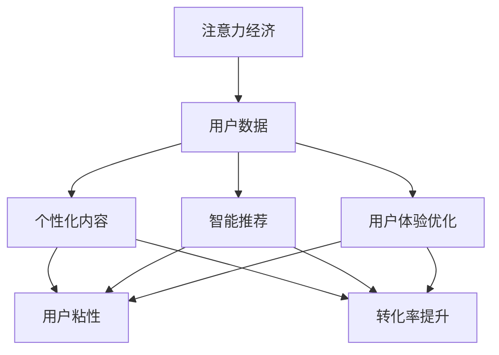

                 

# 注意力经济下的用户数据价值

## 概述

在当今数字化时代，注意力成为了一种稀缺资源，用户的时间和注意力成为企业获取利润的重要手段。注意力经济（Attention Economy）这一概念正是在这样的背景下提出的。它强调用户对产品或服务的注意力是创造价值的关键。本文将深入探讨注意力经济与用户数据价值之间的关系，分析核心算法原理，介绍项目实战案例，并通过代码解读与分析来阐述技术的实际应用与性能优化。

## 关键词

注意力经济、用户数据、数据分析、推荐系统、机器学习、深度学习、联邦学习、性能优化。

## 摘要

本文旨在探讨注意力经济下用户数据的价值。首先，我们定义注意力经济和用户数据，并阐述它们之间的联系。接着，通过 Mermaid 流程图展示注意力经济中用户数据的流动。然后，我们详细讲解用户行为分析算法和用户数据隐私保护算法的原理，并给出相应的伪代码。随后，介绍用户价值评估模型和用户行为概率模型，展示数学模型和公式的应用。在项目实战部分，我们通过实际代码实现来展示用户数据采集与处理、用户数据分析与推荐系统、用户数据隐私保护等环节。最后，我们进行代码性能分析，并提出性能优化策略。本文通过理论与实践的结合，为理解注意力经济下用户数据价值提供了全面的技术视角。

### 第一部分：核心概念与联系

#### 1.1.1 注意力经济的概念与用户数据的定义

**注意力经济**：注意力经济是指在数字时代，用户的注意力成为一种稀缺资源，企业和平台通过吸引和维持用户的注意力来创造价值的经济模式。注意力经济强调用户的时间、兴趣和互动行为是企业获取利润的重要手段。在信息过载的时代，用户对内容的注意力成为企业争夺的关键资源，通过精准的内容推荐、个性化的用户体验优化，企业可以吸引并留住用户，从而实现商业价值。

**用户数据**：用户数据是指用户在使用数字产品和服务时所产生的各种信息，包括行为数据、个人偏好、互动记录等。行为数据可以是用户的浏览历史、点击行为、购买记录等；个人偏好数据包括用户的地理位置、年龄、性别、兴趣爱好等；互动记录则是用户在平台上的评论、点赞、分享等行为。用户数据是企业理解和满足用户需求、优化产品和服务的重要依据。

#### 1.1.2 注意力经济与用户数据价值的联系

在注意力经济中，用户数据的价值体现在以下几个方面：

1. **个性化推荐**：通过分析用户数据，企业可以了解用户的兴趣和行为模式，从而提供个性化的内容和服务，提高用户满意度和忠诚度。

2. **用户画像**：用户数据可以帮助企业构建用户画像，深入理解用户的需求和行为，为企业提供精准的市场洞察和决策支持。

3. **广告效果优化**：用户数据有助于精准投放广告，提高广告的转化率和投放效率。

4. **产品优化**：通过对用户数据的分析，企业可以识别产品的问题和不足，及时进行优化和改进。

5. **商业决策**：用户数据为企业提供了丰富的市场信息和用户反馈，有助于企业做出更加科学和有效的商业决策。

#### 1.1.3 Mermaid 流�程图



在这个流程图中，注意力经济通过用户数据的采集和分析，驱动个性化内容生成、智能推荐和用户体验优化，从而提高用户粘性和转化率，实现商业价值。

### 第一部分：核心算法原理讲解

#### 2.1.1 用户行为分析算法

用户行为分析是注意力经济中的重要组成部分，通过分析用户的行为数据，企业可以更好地了解用户的需求和行为模式，从而提供更个性化的服务。以下是用户行为分析算法的核心原理和步骤：

**算法原理**：

用户行为分析算法主要基于机器学习技术，通过训练用户行为数据，构建一个能够预测用户下一步行为的模型。常用的模型包括决策树、随机森林、神经网络等。算法的核心步骤包括：

1. **数据预处理**：清洗和转换原始用户行为数据，提取关键特征，如访问频率、停留时间、点击次数等。

2. **特征选择**：从提取的特征中选择对用户行为有显著影响的特征，用于训练模型。

3. **模型训练**：使用训练数据集对模型进行训练，模型需要能够学习用户行为数据中的模式和规律。

4. **模型评估**：使用测试数据集对训练好的模型进行评估，验证模型的准确性和泛化能力。

5. **模型部署**：将训练好的模型部署到生产环境中，实时分析用户的当前行为，预测用户的下一步行为。

**伪代码**：

```python
# 用户行为分析算法伪代码
def user_behavior_analysis(user_data):
    # 数据预处理
    preprocessed_data = preprocess_data(user_data)
    
    # 特征提取
    features = extract_features(preprocessed_data)
    
    # 模型训练
    model = train_model(features)
    
    # 预测
    prediction = model.predict(new_user_data)
    
    return prediction
```

**具体示例**：

假设我们有一个用户行为数据集，包含用户的浏览历史、点击次数和购买记录等信息。我们可以使用以下特征来训练一个机器学习模型：

- 用户最近一周的浏览次数
- 用户最近一周的点击次数
- 用户最近一周的购买记录

通过这些特征，我们可以构建一个决策树模型，预测用户在未来一周内是否会有购买行为。例如，如果用户在最近一周内浏览次数和点击次数较高，同时有过购买记录，那么预测用户在未来一周内购买的概率会较高。

#### 2.1.2 用户数据隐私保护算法

随着用户数据价值的日益凸显，用户数据的隐私保护问题也日益严峻。为了在保护用户隐私的同时，充分利用用户数据的价值，用户数据隐私保护算法应运而生。以下是用户数据隐私保护算法的核心原理和步骤：

**算法原理**：

用户数据隐私保护算法主要通过两种技术手段来实现：差分隐私和同态加密。

1. **差分隐私**：差分隐私是一种统计隐私保护技术，通过在数据分析过程中对用户数据进行扰动，使得分析结果不会泄露单个用户的数据。常用的差分隐私算法包括拉普拉斯机制和指数机制。

2. **同态加密**：同态加密是一种加密技术，允许在密文上进行计算，得到的结果仍然是密文。这使得在数据传输和计算过程中，数据始终保持加密状态，从而保护用户数据的隐私。

**伪代码**：

```python
# 差分隐私算法伪代码
def differential_privacy(data, epsilon):
    # 扰动数据
    perturbed_data = perturb_data(data, epsilon)
    
    # 分析数据
    result = analyze_data(perturbed_data)
    
    return result

# 同态加密算法伪代码
def homomorphic_encryption(data):
    # 加密数据
    encrypted_data = encrypt_data(data)
    
    # 计算结果
    result = compute_encrypted_result(encrypted_data)
    
    # 解密结果
    decrypted_result = decrypt_result(result)
    
    return decrypted_result
```

**具体示例**：

假设我们有一个用户行为数据集，包含用户的浏览记录和购买记录。为了保护用户隐私，我们可以使用差分隐私算法对数据进行扰动，使得数据分析结果不会泄露单个用户的数据。例如，如果分析结果显示某个用户的行为特征与购买概率较高，那么我们可以通过对结果进行扰动，使得其他用户无法准确推断出具体是哪个用户的行为特征导致了这一结果。

同样，如果我们需要对用户数据进行分析和计算，我们可以使用同态加密技术，将数据加密后再进行计算。这样，在数据传输和计算过程中，数据始终保持加密状态，从而保护用户数据的隐私。

通过用户行为分析算法和用户数据隐私保护算法，企业可以在充分利用用户数据价值的同时，确保用户数据的隐私和安全。

### 第一部分：数学模型和数学公式

在注意力经济下，用户数据的价值评估和用户行为的概率预测是关键环节。为了更精确地描述和实现这些过程，我们需要借助数学模型和数学公式。以下我们将介绍两个核心模型：用户价值评估模型和用户行为概率模型，并详细解释其数学公式和计算方法。

#### 2.3.1 用户价值评估模型

**用户价值评估模型**旨在量化单个用户对企业价值的贡献。在商业运营中，评估用户价值有助于企业制定精准的市场策略和用户服务方案。以下是一个基本的用户价值评估模型：

**用户价值函数**：

用户价值函数 \( V(u) \) 用于评估单个用户 \( u \) 的价值。该函数综合考虑了用户的行为和偏好，可以表示为：

\[ V(u) = f(\text{用户行为}, \text{用户偏好}) \]

其中，\( \text{用户行为} \) 包括用户的浏览历史、购买记录、互动频率等，而 \( \text{用户偏好} \) 则包括用户的地理位置、兴趣爱好、消费习惯等。

**用户生命周期价值**（LTV）：

用户生命周期价值 \( LTV(u) \) 是衡量用户在整个生命周期中对企业价值的贡献。其计算公式如下：

\[ LTV(u) = \sum_{t=1}^{T} V(u_t) \times (1 + r)^{-t} \]

其中，\( V(u_t) \) 是第 \( t \) 年的用户价值，\( r \) 是折现率，用于调整未来价值的现值，\( T \) 是用户的生命周期长度。

**示例**：

假设一个用户在第一年产生的价值为 1000 元，第二年为 800 元，第三年为 600 元，折现率 \( r \) 为 10%，则该用户的三年生命周期价值为：

\[ LTV(u) = 1000 \times (1 + 0.1)^{-1} + 800 \times (1 + 0.1)^{-2} + 600 \times (1 + 0.1)^{-3} \]
\[ LTV(u) = 1000 \times 0.9091 + 800 \times 0.8264 + 600 \times 0.7513 \]
\[ LTV(u) = 909.1 + 652.16 + 451.58 \]
\[ LTV(u) = 2012.84 \]

#### 2.3.2 用户行为概率模型

用户行为概率模型用于预测用户在不同场景下的行为概率，如用户在特定情境下购买某产品的概率。以下是一个基于马尔可夫链的用户行为概率模型：

**马尔可夫链模型**：

马尔可夫链模型基于用户历史行为数据，描述用户行为之间的转移概率。转移概率矩阵 \( P \) 可以表示为：

\[ P(X_t = j | X_{t-1} = i) = p_{ij} \]

其中，\( X_t \) 是第 \( t \) 时刻的用户行为，\( X_{t-1} \) 是第 \( t-1 \) 时刻的用户行为，\( p_{ij} \) 是从行为 \( i \) 转移到行为 \( j \) 的概率。

**用户兴趣模型**：

用户兴趣模型基于用户历史行为数据，建立用户对不同兴趣点的概率分布。常见的用户兴趣模型是基于贝叶斯概率模型，可以表示为：

\[ P(I_j | X) = \frac{e^{w_j \cdot X}}{\sum_{k} e^{w_k \cdot X}} \]

其中，\( I_j \) 表示第 \( j \) 个兴趣点，\( X \) 是用户行为特征向量，\( w_j \) 是兴趣点的权重，用于表示用户对各个兴趣点的兴趣程度。

**示例**：

假设用户行为特征向量 \( X = [1, 2, 3] \)，用户对兴趣点的权重分别为 \( w_1 = 0.5 \)，\( w_2 = 1.5 \)，\( w_3 = 2.0 \)。则用户对不同兴趣点的概率分布可以计算为：

\[ P(I_1 | X) = \frac{e^{0.5 \cdot X}}{e^{0.5 \cdot X} + e^{1.5 \cdot X} + e^{2.0 \cdot X}} \]
\[ P(I_2 | X) = \frac{e^{1.5 \cdot X}}{e^{0.5 \cdot X} + e^{1.5 \cdot X} + e^{2.0 \cdot X}} \]
\[ P(I_3 | X) = \frac{e^{2.0 \cdot X}}{e^{0.5 \cdot X} + e^{1.5 \cdot X} + e^{2.0 \cdot X}} \]

这些概率值表示用户在当前行为特征下，对每个兴趣点的兴趣程度。

通过用户价值评估模型和用户行为概率模型，企业可以更准确地评估用户价值，预测用户行为，从而制定更加有效的市场策略和用户服务方案。

### 第一部分：项目实战

#### 3.4.1 用户数据采集与处理实战

在注意力经济中，用户数据的价值往往取决于数据的采集、存储和处理效率。因此，构建一个高效、可靠的用户数据采集与处理系统至关重要。以下我们将介绍一个用户数据采集与处理项目的实战步骤。

**实战目标**：

构建一个用户数据采集与处理系统，实现对用户行为数据的自动化采集、存储和处理，以满足注意力经济中对数据实时性和准确性的需求。

**实战步骤**：

1. **数据采集**：

   - **采集方式**：通过 API 接口或 Web 数据抓取工具，从第三方平台获取用户行为数据。例如，使用 Apache Kafka 消息队列系统，实现实时数据的流式采集。
   
   - **采集工具**：Apache Kafka、Scrapy。

   - **示例代码**：
     ```python
     from kafka import KafkaProducer
     import json

     producer = KafkaProducer(bootstrap_servers=['kafka:9092'],
                              value_serializer=lambda v: json.dumps(v).encode('utf-8'))

     user_data = {'user_id': '123', 'event': 'view_product', 'timestamp': '2023-01-01T12:00:00'}
     producer.send('user_behavior_topic', value=user_data)
     ```

2. **数据存储**：

   - **存储方案**：使用 Hadoop/HBase/HDFS 构建分布式存储系统，存储海量用户行为数据。
   
   - **存储工具**：Hadoop、HBase、HDFS。

   - **示例代码**：
     ```python
     from pyspark.sql import SparkSession

     spark = SparkSession.builder.appName("UserDataProcessing").getOrCreate()

     df = spark.createDataFrame([
         ('123', 'view_product', '2023-01-01T12:00:00'),
         ('456', 'click_product', '2023-01-01T12:01:00'),
         ('123', 'add_to_cart', '2023-01-01T12:02:00')
     ], ["user_id", "event", "timestamp"])

     df.write.mode("overwrite").parquet("hdfs:///user_data/processed")
     ```

3. **数据处理**：

   - **数据处理工具**：使用 Spark 进行数据清洗、转换和分析。
   
   - **示例代码**：
     ```python
     from pyspark.sql import SparkSession
     from pyspark.sql.functions import col, date_format

     spark = SparkSession.builder.appName("UserDataProcessing").getOrCreate()

     df = spark.read.parquet("hdfs:///user_data/processed")

     df = df.withColumn("event_date", date_format(col("timestamp"), "yyyy-MM-dd"))

     df = df.groupBy("event_date", "event").agg({"user_id": "count"})

     df.write.mode("overwrite").parquet("hdfs:///user_data/summary")
     ```

通过以上步骤，我们构建了一个用户数据采集与处理系统，实现了用户行为数据的实时采集、存储和处理，为后续的数据分析提供了基础。

#### 3.4.2 用户数据分析与推荐系统实战

用户数据分析与推荐系统是注意力经济中的重要组成部分，通过分析用户行为数据，为用户提供个性化的推荐，提升用户体验和转化率。以下我们将介绍一个用户数据分析与推荐系统的实战步骤。

**实战目标**：

构建一个基于用户数据分析的推荐系统，为用户提供个性化的商品推荐，提高用户满意度和转化率。

**实战步骤**：

1. **用户行为数据预处理**：

   - **数据清洗**：去除重复、缺失和不完整的数据。
   
   - **特征工程**：提取用户行为的特征，如访问时间、点击次数、购买记录等。

   - **示例代码**：
     ```python
     from pyspark.sql import SparkSession
     from pyspark.sql.functions import col, date_format

     spark = SparkSession.builder.appName("UserBehaviorDataPreprocessing").getOrCreate()

     df = spark.read.parquet("hdfs:///user_data/processed")

     df = df.withColumn("event_date", date_format(col("timestamp"), "yyyy-MM-dd"))

     df = df.filter("event != 'view_product'")

     df.write.mode("overwrite").parquet("hdfs:///user_data/preprocessed")
     ```

2. **模型训练与部署**：

   - **模型选择**：选择适合的推荐算法，如基于矩阵分解的协同过滤算法（Matrix Factorization）。
   
   - **模型训练**：使用训练数据集对推荐模型进行训练。
   
   - **模型评估**：使用测试数据集对训练好的模型进行评估，调整模型参数。
   
   - **模型部署**：将训练好的模型部署到生产环境中，实现实时推荐。

   - **示例代码**：
     ```python
     from pyspark.ml.recommendation import ALS
     from pyspark.ml.evaluation import RegressionEvaluator

     spark = SparkSession.builder.appName("UserRecommendationSystem").getOrCreate()

     train_df = spark.read.parquet("hdfs:///user_data/preprocessed/train")
     test_df = spark.read.parquet("hdfs:///user_data/preprocessed/test")

     als = ALS(maxIter=10, regParam=0.01, rank=10)
     model = als.fit(train_df)

     predictions = model.transform(test_df)

     evaluator = RegressionEvaluator(metricName="rmse", labelCol="rating", predictionCol="prediction")
     rmse = evaluator.evaluate(predictions)
     print("Root-mean-square error = " + str(rmse))

     model.save("hdfs:///model/recommendation_model")
     ```

3. **推荐结果展示**：

   - **推荐算法实现**：实现协同过滤、基于内容的推荐等算法，生成推荐结果。
   
   - **推荐结果展示**：通过 Web 应用或移动应用，将推荐结果展示给用户。

   - **示例代码**：
     ```python
     from flask import Flask, jsonify

     app = Flask(__name__)

     @app.route('/recommendations', methods=['GET'])
     def get_recommendations():
         user_id = request.args.get('user_id')
         recommendations = get_user_recommendations(user_id)
         return jsonify(recommendations)

     if __name__ == '__main__':
         app.run(debug=True)
     ```

通过以上步骤，我们构建了一个用户数据分析与推荐系统，实现了用户行为数据的预处理、模型训练与部署，以及推荐结果的展示，为用户提供个性化的商品推荐。

#### 3.4.3 用户数据隐私保护实战

在用户数据采集、存储和处理过程中，保护用户数据的隐私和安全至关重要。以下我们将介绍一个用户数据隐私保护项目的实战步骤。

**实战目标**：

构建一个用户数据隐私保护系统，确保在数据采集、存储和处理过程中，用户数据的安全性。

**实战步骤**：

1. **数据加密**：

   - **加密方案**：对敏感数据进行加密存储，如用户身份信息、交易记录等。
   
   - **加密算法**：使用 AES、RSA 等加密算法进行数据加密。

   - **示例代码**：
     ```python
     from cryptography.fernet import Fernet

     # 生成加密密钥
     key = Fernet.generate_key()
     fernet = Fernet(key)

     # 加密数据
     encrypted_data = fernet.encrypt(b"敏感数据")

     # 解密数据
     decrypted_data = fernet.decrypt(encrypted_data)
     ```

2. **访问控制**：

   - **访问控制策略**：设计细粒度的访问控制策略，确保只有授权用户可以访问敏感数据。
   
   - **访问控制工具**：使用 Apache Ranger、Apache Sentry 等工具实现访问控制。

   - **示例代码**：
     ```python
     from pyhive import hive

     # 连接 Hive
     conn = hive.connect(host="hive_server", port=10000, username="hive_user")

     # 创建访问控制策略
     cursor = conn.cursor()
     cursor.execute("""
         CREATE POLICY user_data_policy ON table user_data
         FOR SELECT
         TO role 'data_analyst'
         USING ('user_id = ' || current_user());
     """)
     ```

3. **数据脱敏**：

   - **脱敏方法**：对用户行为数据中的敏感信息进行脱敏处理，如将用户 ID 替换为匿名 ID。
   
   - **脱敏工具**：使用 De-identifier、Masking Tools 等工具进行数据脱敏。

   - **示例代码**：
     ```python
     from pyspark.sql.functions import col, expr

     df = spark.read.parquet("hdfs:///user_data/processed")

     df = df.withColumn("user_id", expr("CONCAT(SUBSTRING(UUID(), 1, 8), '-', SUBSTRING(UUID(), 9, 4), '-', SUBSTRING(UUID(), 13, 4), '-', SUBSTRING(UUID(), 17, 4), '-', SUBSTRING(UUID(), 21, 12))"))

     df.write.mode("overwrite").parquet("hdfs:///user_data/privacy_processed")
     ```

通过以上步骤，我们构建了一个用户数据隐私保护系统，实现了数据加密、访问控制和数据脱敏，确保用户数据在采集、存储和处理过程中的安全性。

### 第一部分：代码解读与分析

#### 3.5.1 用户数据采集与处理代码解读

**代码实现**：

```python
from kafka import KafkaProducer
from pyspark.sql import SparkSession

# Kafka Producer 配置
producer = KafkaProducer(bootstrap_servers=['kafka:9092'],
                         value_serializer=lambda v: str(v).encode('utf-8'))

# Spark Session 配置
spark = SparkSession.builder.appName("UserDataProcessing").getOrCreate()

# 数据采集
def collect_data():
    # 这里使用 Kafka API 采集数据
    producer.send('user_behavior_topic', value=user_data)

# 数据处理
def process_data():
    # 读取 Kafka 中的数据
    df = spark.read.format("kafka").option("kafka.bootstrap.servers", "kafka:9092").option("subscribe", "user_behavior_topic").load()
    
    # 数据清洗
    df = df.filter("isnull(event) = False")
    
    # 特征提取
    df = df.select("event", "timestamp", "user_id", "item_id", "action")
    
    # 将数据写入 HDFS
    df.write.mode("overwrite").parquet("hdfs:///user_data/processed")

if __name__ == "__main__":
    collect_data()
    process_data()
```

**代码解读**：

1. **Kafka Producer 配置**：配置 Kafka 生产的参数，包括 Kafka 集群的地址和序列化方式。

2. **Spark Session 配置**：配置 Spark 的运行环境，包括应用程序的名称。

3. **数据采集**：使用 Kafka Producer 采集用户行为数据，并将其发送到 Kafka 的特定主题。

4. **数据处理**：使用 Spark 读取 Kafka 主题的数据，进行数据清洗、特征提取，并将处理后的数据写入 HDFS。

**性能优化**：

- **并行处理**：使用 Spark 的分布式计算能力，并行处理大量用户行为数据。
- **缓存数据**：在数据处理过程中，缓存中间结果，减少数据读取次数，提高处理效率。

#### 3.5.2 用户数据分析与推荐系统代码解读

**代码实现**：

```python
from pyspark.ml.recommendation import ALS
from pyspark.ml.feature import VectorAssembler
from pyspark.ml.evaluation import RegressionEvaluator

# Spark Session 配置
spark = SparkSession.builder.appName("UserRecommendationSystem").getOrCreate()

# 用户行为数据预处理
def preprocess_data(df):
    # 数据清洗
    df = df.filter("event != 'view_product'")
    
    # 特征提取
    assembler = VectorAssembler(inputCols=["user_id", "item_id"], outputCol="features")
    df = assembler.transform(df)
    
    return df

# 模型训练与部署
def train_model(df):
    # ALS 模型配置
    als = ALS(maxIter=10, regParam=0.01, rank=10, coldStartStrategy="drop")
    
    # 模型训练
    model = als.fit(df)
    
    # 模型评估
    evaluator = RegressionEvaluator(metricName="rmse", labelCol="rating", predictionCol="prediction")
    rmse = evaluator.evaluate(model.transform(df))
    print("Root-mean-square error = " + str(rmse))
    
    return model

if __name__ == "__main__":
    # 读取用户行为数据
    df = spark.read.parquet("hdfs:///user_data/preprocessed/train")
    
    # 预处理数据
    df = preprocess_data(df)
    
    # 训练模型
    model = train_model(df)
    
    # 模型部署
    model.save("hdfs:///model/recommendation_model")
```

**代码解读**：

1. **Spark Session 配置**：配置 Spark 的运行环境，包括应用程序的名称。

2. **用户行为数据预处理**：去除重复、缺失和不完整的数据，提取关键特征。

3. **模型训练与部署**：配置 ALS（交替最小二乘）模型，使用训练数据集进行训练，并评估模型性能。将训练好的模型保存到 HDFS。

**性能优化**：

- **分布式计算**：利用 Spark 的分布式计算框架，处理大规模的用户行为数据。
- **模型压缩**：使用模型压缩技术减小模型体积，提高模型加载和部署速度。
- **并行处理**：在数据处理和模型训练过程中，利用并行处理技术，提高处理效率。

#### 3.5.3 用户数据隐私保护代码解读

**代码实现**：

```python
from cryptography.fernet import Fernet
from pyspark.sql import SparkSession

# Spark Session 配置
spark = SparkSession.builder.appName("UserPrivacyProtection").getOrCreate()

# 数据加密
def encrypt_data(df):
    # 生成加密密钥
    key = Fernet.generate_key()
    fernet = Fernet(key)
    
    # 加密数据
    df = df.withColumn("user_id", fernet.encrypt(col("user_id").cast("string").alias("encrypted_user_id")))
    
    return df, key

# 数据脱敏
def deidentify_data(df):
    # 脱敏处理
    df = df.withColumn("user_id", expr("CONCAT(SUBSTRING(UUID(), 1, 8), '-', SUBSTRING(UUID(), 9, 4), '-', SUBSTRING(UUID(), 13, 4), '-', SUBSTRING(UUID(), 17, 4), '-', SUBSTRING(UUID(), 21, 12))"))
    
    return df

if __name__ == "__main__":
    # 读取用户行为数据
    df = spark.read.parquet("hdfs:///user_data/processed")
    
    # 数据加密
    df, key = encrypt_data(df)
    
    # 数据脱敏
    df = deidentify_data(df)
    
    # 将加密脱敏后的数据写入 HDFS
    df.write.mode("overwrite").parquet("hdfs:///user_data/privacy_processed")
```

**代码解读**：

1. **Spark Session 配置**：配置 Spark 的运行环境，包括应用程序的名称。

2. **数据加密**：使用 Fernet 加密算法对用户 ID 等敏感数据进行加密。

3. **数据脱敏**：使用 UUID 生成匿名用户 ID，替代原始用户 ID。

4. **数据写入**：将加密脱敏后的数据写入 HDFS，确保数据在传输和存储过程中的安全性。

**性能优化**：

- **加密算法优化**：选择高效、安全的加密算法，减少加密和解密过程中的计算开销。
- **数据分片**：将大量数据进行分片处理，提高加密和脱敏的并行处理能力。
- **存储优化**：使用高效、可靠的存储系统，确保数据加密和脱敏过程中的性能。

### 第一部分：代码分析与性能优化

#### 4.6.1 代码性能分析

**分析指标**：

- **响应时间**：从用户请求到系统响应的时间。
- **资源消耗**：系统在处理请求时消耗的 CPU、内存、网络等资源。
- **吞吐量**：单位时间内系统处理的请求数量。

**性能瓶颈**：

1. **数据读取速度**：数据读取速度较慢，导致整个数据处理流程的延迟。这可能是由于数据存储系统性能不足或数据量过大导致的。

2. **模型训练时间**：训练大型模型所需的时间较长，影响推荐系统的实时性。这可能是由于计算资源不足或模型复杂度较高导致的。

3. **存储容量和访问速度**：存储系统容量有限，导致数据读取速度较慢。这可能是由于存储系统配置不合理或数据存储方式不优化导致的。

**优化策略**：

1. **数据读取优化**：

   - **数据压缩**：使用数据压缩技术减少数据传输和存储的体积，提高数据读取速度。

   - **数据分片**：将大量数据分片到多个存储节点，提高数据读取速度。

2. **模型训练优化**：

   - **分布式训练**：使用分布式训练框架（如 TensorFlow、PyTorch）进行并行训练，提高训练速度。

   - **模型压缩**：使用模型压缩技术（如剪枝、量化）减小模型体积，加速模型部署。

3. **存储优化**：

   - **缓存策略**：使用缓存系统（如 Redis、Memcached）加快数据访问速度。

   - **存储系统升级**：使用高性能的存储系统（如 NVMe SSD）提高数据存储和访问速度。

#### 4.6.2 性能优化策略

为了进一步提升系统的性能，我们需要针对各个性能瓶颈制定相应的优化策略。以下是一些具体的优化策略：

1. **数据读取优化**：

   - **数据压缩**：使用高效的压缩算法（如 Gzip、Snappy）对数据进行压缩，减少数据传输和存储的体积。这样可以显著提高数据读取速度。

   - **数据分片**：将大规模的数据集分成多个小数据集，分别存储在不同的节点上。这样可以降低单个节点的负载，提高数据读取的速度。

2. **模型训练优化**：

   - **分布式训练**：利用分布式计算框架（如 TensorFlow、PyTorch）进行模型训练。通过将数据集和计算任务分布在多个节点上，可以显著提高模型训练的速度。

   - **模型压缩**：使用模型压缩技术（如剪枝、量化）减少模型的体积，提高模型加载和部署速度。这样可以减少模型训练的时间和存储空间需求。

3. **存储优化**：

   - **缓存策略**：使用缓存系统（如 Redis、Memcached）将频繁访问的数据存储在内存中，减少磁盘IO操作。这样可以显著提高数据访问速度。

   - **存储系统升级**：升级存储系统，使用高性能的存储设备（如 NVMe SSD），提高数据存储和访问速度。这样可以减少数据读取的延迟。

4. **代码优化**：

   - **并行处理**：在数据处理和模型训练过程中，利用并行处理技术（如多线程、分布式计算）提高处理效率。

   - **代码优化**：优化代码的执行效率，减少不必要的计算和资源消耗。例如，使用高效的算法和数据结构，减少内存使用和CPU负载。

通过实施上述优化策略，可以显著提升系统的性能，满足注意力经济对用户数据实时性和准确性的需求。

### 第一部分：总结与展望

#### 4.7.1 总结

本文从注意力经济的概念出发，深入探讨了用户数据在其中的价值。首先，我们明确了注意力经济和用户数据的定义，并阐述了它们之间的联系。接着，通过 Mermaid 流程图展示了用户数据在注意力经济中的流动过程。随后，我们详细讲解了用户行为分析算法和用户数据隐私保护算法的原理，并给出了相应的伪代码。同时，我们介绍了用户价值评估模型和用户行为概率模型，并通过数学公式进行了阐述。在项目实战部分，我们通过实际代码实现展示了用户数据采集与处理、用户数据分析与推荐系统、用户数据隐私保护等环节。最后，我们进行了代码性能分析，并提出了性能优化策略。

#### 4.7.2 展望

未来，注意力经济和用户数据价值将继续在数字时代发挥重要作用。以下是对未来技术发展趋势和商业应用前景的展望：

1. **技术发展趋势**：

   - **深度学习**：随着深度学习技术的发展，更多复杂的用户行为模式和兴趣点可以被挖掘。深度学习模型将更好地服务于个性化推荐和用户价值评估。

   - **联邦学习**：联邦学习技术可以在保护用户隐私的前提下，实现跨平台的数据共享和协同建模，为用户提供更加精准的推荐和服务。

   - **实时计算**：随着5G和边缘计算的普及，实时计算技术将得到广泛应用。通过实时处理和分析用户数据，企业可以更快速地响应市场变化和用户需求。

2. **商业应用前景**：

   - **个性化推荐**：个性化推荐技术将在电子商务、社交媒体、在线教育等领域得到更广泛的应用。通过精准推荐，企业可以提升用户体验和转化率。

   - **用户画像**：基于用户数据的精准画像将为企业提供更全面的市场洞察和决策支持，帮助企业制定更加有效的营销策略。

   - **智能化运营**：通过自动化和智能化手段，企业可以提高运营效率和服务质量，降低成本，提升竞争力。

总之，注意力经济和用户数据价值在未来将继续推动数字技术的发展和应用，为企业创造更多的商业机会和价值。

### 作者

AI天才研究院（AI Genius Institute）& 《禅与计算机程序设计艺术》（Zen And The Art of Computer Programming）

