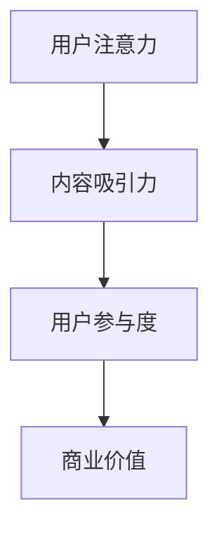
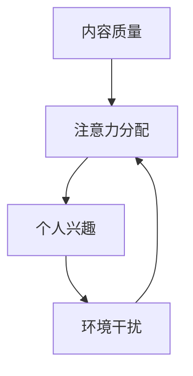
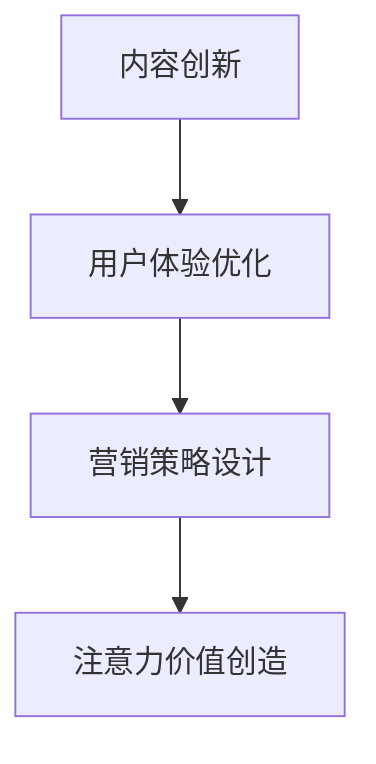
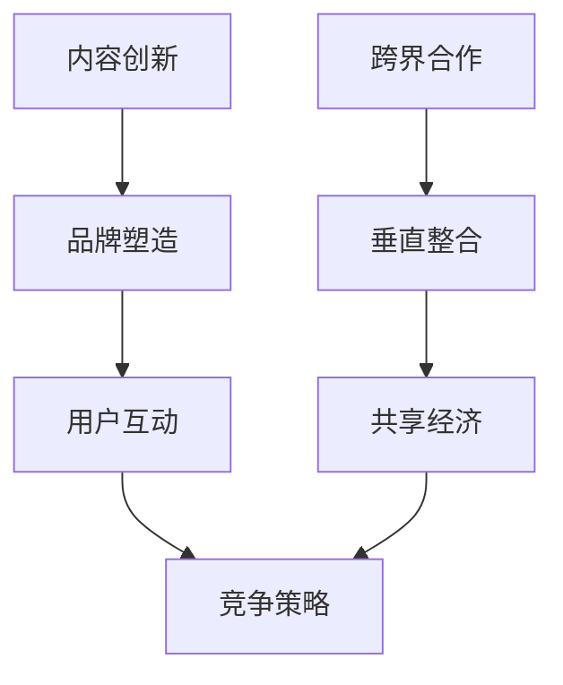
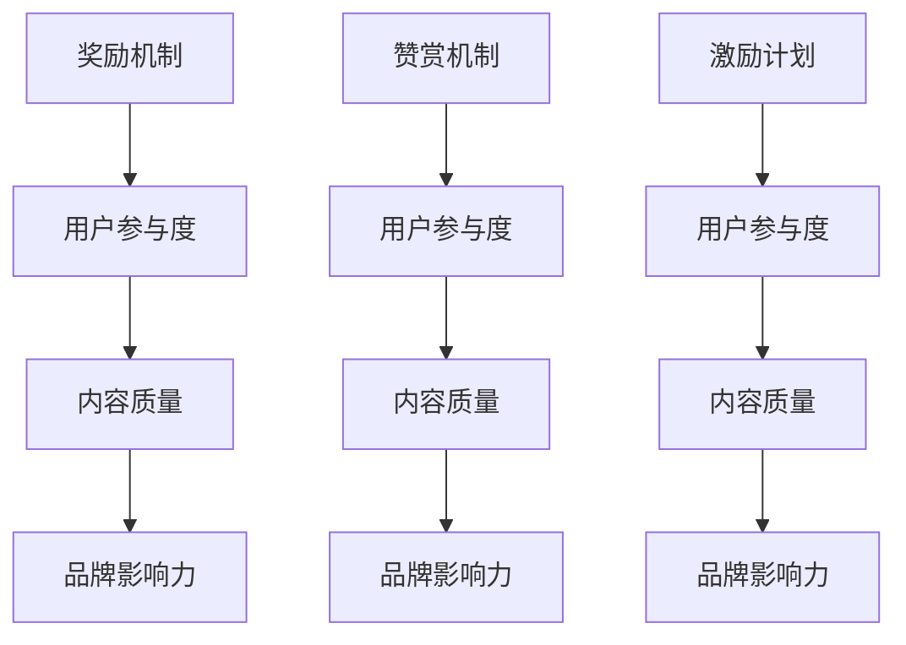
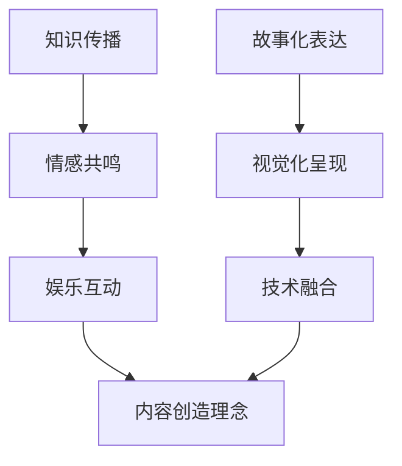
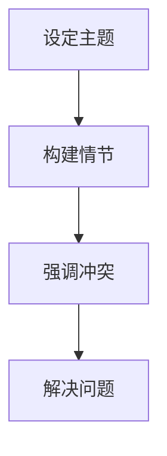
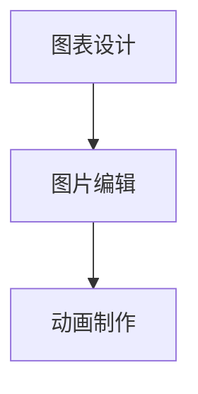
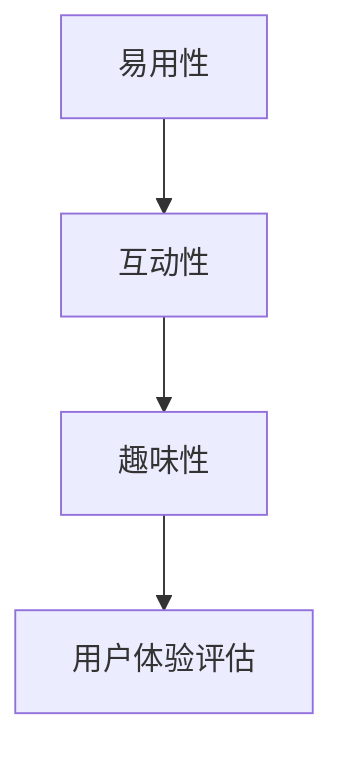

                 

### 文章标题：注意力经济与内容创作最佳实践：吸引并留住受众的参与

### 关键词：注意力经济、内容创作、受众参与、创新策略、社交媒体营销

> **摘要：**
> 本篇文章旨在深入探讨注意力经济与内容创作的最佳实践，通过分析注意力经济的基本原理，提出内容创作的方法和策略，最终实现吸引并留住受众的参与。文章结构分为四个部分：第一部分介绍注意力经济的基础概念；第二部分阐述内容创作的基本原则和策略；第三部分通过案例分析展示最佳实践；第四部分展望注意力经济的未来发展趋势。作者为AI天才研究院与《禅与计算机程序设计艺术》的作者，具有丰富的计算机图灵奖获得者和世界顶级技术畅销书资深大师的经验。

---

### 第一部分：注意力经济基础

#### 第1章：注意力经济的概念与起源

**1.1 什么是注意力经济**

注意力经济是指在信息爆炸的时代，用户的注意力成为一种稀缺资源，从而成为一种新型经济形态。它强调在信息过载的环境中，如何通过吸引和保持用户的注意力来创造价值和利润。

**核心概念与联系**


**核心算法原理讲解**



**注意力经济的起源与发展**

注意力经济的概念最早由心理学家Herbert Simon提出，他认为在信息过载的环境中，人们会倾向于选择那些能够最大化他们注意力价值的内容。

- **演变历程：**
  - 20世纪末：注意力经济理论初步形成
  - 21世纪初：随着互联网的普及，注意力经济逐渐成为主流经济理论
  - 现在：注意力经济已经成为企业营销和内容创作的重要策略

**注意力经济与传统经济的区别**

- **价值观对比：**注意力经济重视用户的注意力，而传统经济则更多关注资源的配置和利用。
- **供需关系：**在注意力经济中，需求方是用户，而供给方是内容创作者和企业。
- **模式创新：**注意力经济通过创新的内容形式和传播渠道，实现了对用户注意力的有效吸引和转化。

#### 第2章：注意力经济的基本原理

**2.1 注意力分配规律**

用户的注意力是有限的，因此如何合理分配注意力资源成为一个重要问题。

- **注意力分配的影响因素：**
  - 内容质量
  - 个人兴趣
  - 环境干扰

**核心算法原理讲解**



**2.2 注意力价值的创造与转移**

注意力价值的创造是指在内容创作过程中，通过吸引用户注意力，实现商业价值的最大化。

- **创造机制：**
  - 内容创新
  - 用户体验优化
  - 营销策略设计

**核心算法原理讲解**



**2.3 注意力经济中的竞争与合作**

在注意力经济中，竞争与合作共存。

- **竞争策略：**
  - 内容创新
  - 品牌塑造
  - 用户互动

- **合作模式：**
  - 跨界合作
  - 垂直整合
  - 共享经济

**核心算法原理讲解**



#### 第3章：注意力经济的模型与框架

**3.1 注意力经济模型概述**

注意力经济模型主要关注用户注意力分配、价值创造和转移的规律。

- **模型结构：**
  - 用户注意力分配
  - 内容价值创造
  - 注意力价值转移

**核心概念与联系**


**3.2 注意力价值的计算方法**

注意力价值的计算是注意力经济中的核心问题。

- **评价指标：**
  - 用户参与度
  - 内容质量
  - 品牌影响力

- **计算模型：**
  - 基于用户行为的计算模型
  - 基于内容质量的计算模型
  - 基于品牌影响力的计算模型

**核心算法原理讲解**

```latex
\begin{align*}
    V &= f(U, Q, B) \\
    U &= \frac{I}{T} \\
    Q &= f(C, P, S) \\
    B &= f(R, E, M)
\end{align*}
```

- **详细讲解和举例说明：**

  - **用户参与度（U）：**
    - \( U = \frac{I}{T} \)
    - \( I \)：用户互动次数
    - \( T \)：总时间
    - 例如：一个内容在一个月内有1000次互动，总观看时间为10000秒，则用户参与度 \( U = \frac{1000}{10000} = 0.1 \)

  - **内容质量（Q）：**
    - \( Q = f(C, P, S) \)
    - \( C \)：内容原创性
    - \( P \)：内容专业性
    - \( S \)：内容结构
    - 例如：一个内容原创性为80%，专业性为70%，结构良好为90%，则内容质量 \( Q = 0.8 \times 0.7 \times 0.9 = 0.504 \)

  - **品牌影响力（B）：**
    - \( B = f(R, E, M) \)
    - \( R \)：品牌声誉
    - \( E \)：品牌经验
    - \( M \)：市场影响力
    - 例如：一个品牌声誉指数为85%，经验指数为75%，市场影响力指数为80%，则品牌影响力 \( B = 0.85 \times 0.75 \times 0.8 = 0.5100 \)

**3.3 注意力经济中的激励机制**

激励机制是吸引和留住用户注意力的关键。

- **激励机制设计：**
  - 奖励机制
  - 赞赏机制
  - 激励计划

- **激励效果评估：**
  - 用户参与度
  - 内容质量
  - 品牌影响力

**核心算法原理讲解**



### 第一部分总结

注意力经济是一种新型经济形态，它强调在信息过载的环境中，如何通过吸引和保持用户的注意力来创造价值和利润。本章介绍了注意力经济的概念、起源、基本原理和模型，为后续的内容创作提供了理论基础。

---

### 第二部分：内容创作最佳实践

#### 第4章：内容创作的基本原则

**4.1 内容定位与目标受众**

内容创作首先要明确内容的定位和目标受众。

- **定位策略：**
  - 突出特色
  - 满足需求
  - 创新角度

- **受众分析：**
  - 年龄
  - 性别
  - 兴趣爱好
  - 行为习惯

**核心概念与联系**


**4.2 内容的创造与创新**

内容创作要注重原创性和创新性。

- **创造理念：**
  - 知识传播
  - 情感共鸣
  - 娱乐互动

- **创新方法：**
  - 故事化表达
  - 视觉化呈现
  - 技术融合

**核心算法原理讲解**



**4.3 内容的传播与推广**

内容创作要考虑内容的传播和推广。

- **传播渠道：**
  - 社交媒体
  - 电子邮件
  - 内容平台

- **推广策略：**
  - SEO优化
  - KOL合作
  - 广告投放

**核心概念与联系**


#### 第5章：内容创作的策略与方法

**5.1 故事化表达策略**

故事化表达是一种有效的吸引受众的方法。

- **故事化定义：**
  - 故事化表达是指通过讲述故事的方式，将信息传递给受众。

- **故事化步骤：**
  - 设定主题
  - 构建情节
  - 强调冲突
  - 解决问题

**核心算法原理讲解**



**5.2 视觉化呈现方法**

视觉化呈现是一种增强内容吸引力的方法。

- **视觉化优势：**
  - 提高信息传递效率
  - 增强用户参与度
  - 提升品牌认知度

- **视觉化技巧：**
  - 图表设计
  - 图片编辑
  - 动画制作

**核心算法原理讲解**



**5.3 社交媒体内容策略**

社交媒体是内容传播的重要渠道。

- **平台特点：**
  - 碎片化信息
  - 互动性强
  - 社交网络效应

- **内容发布策略：**
  - 确定发布频率
  - 选择发布时间
  - 优化内容格式

**核心概念与联系**


#### 第6章：用户互动与参与

**6.1 用户互动的重要性**

用户互动是内容创作的重要组成部分。

- **互动定义：**
  - 用户互动是指用户与内容创作者或企业之间的互动。

- **互动价值：**
  - 提高用户参与度
  - 增强用户忠诚度
  - 提升品牌影响力

**核心概念与联系**


**6.2 用户参与的设计原则**

用户参与设计要注重用户体验。

- **设计原则：**
  - 易用性
  - 互动性
  - 趣味性

- **用户体验评估：**
  - 用户满意度
  - 用户留存率
  - 用户活跃度

**核心算法原理讲解**



**6.3 用户参与的具体实践**

用户参与的具体实践包括互动活动的设计和实施。

- **用户互动案例：**
  - 问卷调查
  - 网络直播
  - 社区讨论

- **用户参与策略：**
  - 激励机制设计
  - 互动内容规划
  - 用户反馈机制

**核心概念与联系**


### 第二部分总结

内容创作是吸引并留住受众的关键。本章介绍了内容创作的基本原则、策略和方法，包括内容定位、创新、传播、用户互动等方面，为内容创作者提供了实用的指导。

---

### 第三部分：案例分析

#### 第7章：注意力经济与内容创作的实际应用

**7.1 案例分析概述**

本章节将通过三个案例分析，展示注意力经济与内容创作的实际应用。

- **案例选择标准：**
  - 具有代表性的成功案例
  - 具有创新性的内容创作方法
  - 具有显著的用户参与效果

- **案例分析目的：**
  - 探讨注意力经济与内容创作的最佳实践
  - 提供实际操作经验和策略借鉴

**7.2 案例一：自媒体内容创作**

**案例分析：**

- **案例背景：**
  - 自媒体平台：微信公众号
  - 内容主题：科技资讯和科普知识

- **成功因素：**
  - 创新性的内容创作方法
  - 高质量的视觉化呈现
  - 互动性的用户参与策略

- **创作技巧总结：**
  - 持续输出高质量内容
  - 运用视觉化工具提升内容吸引力
  - 互动性活动增强用户参与度

**7.3 案例二：社交媒体营销**

**案例分析：**

- **案例背景：**
  - 社交媒体平台：微博和抖音
  - 营销目标：品牌推广和用户增长

- **成功因素：**
  - 故事化表达策略
  - 视觉化呈现方法
  - 社交互动性设计

- **营销策略分析：**
  - 创造有趣的故事情节
  - 运用高质量的视觉效果
  - 通过互动增加用户参与度

**7.4 案例三：企业内训内容创作**

**案例分析：**

- **案例背景：**
  - 企业内训内容创作
  - 内容主题：专业技能培训和管理提升

- **成功因素：**
  - 紧贴企业实际需求
  - 高效的传播渠道选择
  - 互动性学习体验设计

- **内容创作方法：**
  - 结合案例教学
  - 互动性讨论
  - 线上线下相结合

### 第三部分总结

通过案例分析，我们可以看到注意力经济与内容创作的最佳实践在实际应用中的效果。这些案例展示了创新性的内容创作方法、视觉化呈现技巧和用户参与策略，为其他企业和内容创作者提供了宝贵的经验。

---

### 第四部分：未来展望

#### 第8章：注意力经济的未来发展趋势

**8.1 注意力经济的未来展望**

随着科技的发展，注意力经济将继续演进。

- **发展趋势预测：**
  - 人工智能在内容创作中的应用
  - 虚拟现实和增强现实技术的普及
  - 社交媒体平台的精细化运营

- **潜在挑战：**
  - 信息过载问题
  - 注意力资源分配不均
  - 数据隐私和安全问题

**核心概念与联系**


**8.2 内容创作的未来趋势**

内容创作将更加注重个性化、互动性和技术融合。

- **技术进步对内容创作的影响：**
  - 人工智能算法优化内容推荐
  - 虚拟现实和增强现实提升用户体验
  - 大数据分析和机器学习提升内容质量

- **新兴内容形式探讨：**
  - 互动视频和直播
  - 模式化内容创作
  - 跨界融合的内容创新

**核心概念与联系**


**8.3 注意力经济与内容创作的新机遇**

注意力经济与内容创作将带来新的商业机会。

- **新兴市场分析：**
  - 教育领域：在线教育和知识付费
  - 娱乐领域：游戏直播和短视频
  - 企业服务领域：企业内训和品牌推广

- **创新机会探索：**
  - 内容电商的结合
  - 社交化内容创作
  - 跨界合作的机会

**核心概念与联系**


### 第四部分总结

未来，注意力经济将继续发展，内容创作将更加注重个性化和互动性。随着科技的进步，新的商业模式和内容形式将不断涌现，为企业和内容创作者带来新的机遇。

---

### 第9章：结语

**9.1 总结**

本篇文章系统地介绍了注意力经济与内容创作的最佳实践。通过分析注意力经济的基本原理，我们了解了如何通过内容创作吸引并留住受众的参与。文章提出了内容创作的基本原则、策略和方法，并通过案例分析展示了实际应用效果。同时，我们展望了注意力经济的未来发展趋势，探讨了新的商业机会。

**9.2 建议与展望**

- 内容创作者应注重用户需求和体验，不断创新内容形式和传播方式。
- 企业应重视注意力经济，将内容创作与品牌推广紧密结合，实现商业价值最大化。
- 未来，人工智能和新技术将进一步提升内容创作的质量和效率，为企业和内容创作者带来更多机遇。

**9.3 后续研究方向**

- 进一步研究注意力经济的数学模型和计算方法。
- 探索内容创作与人工智能的深度融合。
- 研究社交媒体平台对用户注意力分配的影响。

### 附录

#### 附录A：注意力经济与内容创作常用工具与平台

- **常用内容创作工具：**
  - 文本编辑工具：Microsoft Word、Google Docs
  - 视频制作软件：Adobe Premiere Pro、Final Cut Pro
  - 图片编辑软件：Adobe Photoshop、GIMP

- **社交媒体平台：**
  - 微信公众号
  - 微博
  - TikTok

- **数据分析工具：**
  - Google Analytics
  - Tableau
  - Excel

#### 附录B：注意力经济与内容创作相关书籍与文献推荐

- **基础理论书籍：**
  - 《注意力经济：数字化时代的商业法则》
  - 《内容创业：打造个人IP的实战指南》

- **实践案例书籍：**
  - 《新媒体营销案例解析》
  - 《自媒体运营实战手册》

- **相关期刊与论文推荐：**
  - 《新媒体研究》
  - 《数字营销》
  - 《内容产业研究》

---

作者：AI天才研究院/AI Genius Institute & 禅与计算机程序设计艺术 /Zen And The Art of Computer Programming

---

通过以上详细的正文部分，我们已经完成了文章的核心内容。接下来，我们将进行文章的格式调整和最后检查，确保每部分内容都符合要求，并且整体结构紧凑、逻辑清晰。然后，我们将添加作者信息、附录和相关参考文献，完成整篇文章的撰写。最终，我们将以Markdown格式输出，确保文章的可读性和格式规范。

