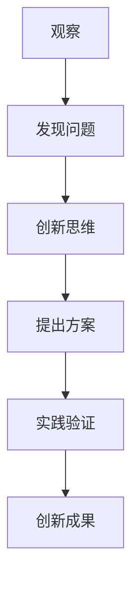

                 

### 《洞察力培养：从观察到创新》

#### 关键词：洞察力、观察力、创新、培养、实践

> 在这个信息爆炸的时代，洞察力已成为我们应对复杂问题、把握机遇的关键能力。本文旨在探讨如何通过培养观察力和创新思维，提升洞察力，为个人和组织的发展提供有力支持。

### 目录

1. **第一部分：洞察力的基本概念**
    1.1. 什么是洞察力
    1.2. 洞察力的形成与影响因素
    1.3. 洞察力的分类

2. **第二部分：观察力培养**
    2.1. 观察力的重要性
    2.2. 观察力的培养方法
    2.3. 观察力训练实践

3. **第三部分：从观察到创新**
    3.1. 观察与创新的关系
    3.2. 创新思维培养
    3.3. 创新实践与案例分析

4. **第四部分：综合能力提升**
    4.1. 综合能力提升的意义
    4.2. 综合能力提升的方法
    4.3. 综合能力提升实践

5. **附录**
    5.1. 洞察力培养与创新的工具资源

### 引言

在信息时代的浪潮中，我们每天都被大量的数据和信息所包围。然而，仅仅拥有大量的信息并不足以让我们在复杂的环境中做出明智的决策。真正重要的是如何从这些信息中看到本质，发现规律，这就是洞察力的价值所在。

洞察力是一种高级的认知能力，它能够帮助我们穿透表面的现象，看到问题的本质，预见未来的趋势。在个人成长、职业发展、企业运营等方面，洞察力都是不可或缺的。然而，洞察力并非与生俱来，它需要通过后天的培养和锻炼来提升。

本文将分为四个部分，首先介绍洞察力的基本概念，包括其定义、形成过程和影响因素；接着探讨如何培养观察力，因为观察力是洞察力的基础；然后讨论从观察到创新的路径，包括创新思维的培养和创新实践的方法；最后，介绍如何提升综合能力，以更好地运用洞察力和创新思维。

### 1.1. 什么是洞察力

洞察力，顾名思义，是一种深入观察和分析问题的能力。它不仅包括对现象的敏锐感知，还涉及到对问题本质的深刻理解。简单来说，洞察力就是通过深入思考、分析和理解，从表面现象中看到本质的能力。

#### 洞察力的定义

洞察力是一种高级的认知能力，它涉及到多个方面的因素，包括观察力、理解力、分析力等。具体来说，洞察力包括以下几个方面的定义：

1. **理解力**：洞察力首先需要具备良好的理解力，只有理解了事物的本质，才能从中看到更深层次的联系。
2. **分析力**：洞察力还涉及到分析力，通过分析，我们可以从复杂的现象中找到关键因素，从而理解问题的本质。
3. **预见力**：洞察力还包括预见力，即能够预见问题的未来发展趋势和可能的结果。

#### 洞察力的重要性

洞察力在现代社会中具有极其重要的地位，以下是洞察力的重要性：

1. **解决问题的能力**：洞察力使我们能够看到问题的本质，从而找到解决问题的有效方法。
2. **决策的支撑**：洞察力可以帮助我们更准确地理解问题的本质，从而做出更明智的决策。
3. **创新的基础**：洞察力是创新思维的核心，没有洞察力，就难以产生创新的想法。
4. **提高竞争力**：具备洞察力的人或组织能够更快地发现市场机会，从而在竞争中占据优势。

### 1.2. 洞察力的形成与影响因素

洞察力并非与生俱来，它需要通过后天的培养和锻炼来提升。以下是洞察力形成的过程和影响因素：

#### 洞察力的形成过程

1. **经验积累**：经验是洞察力形成的基础。通过不断积累经验，我们可以提高对问题的理解力和分析力。
2. **知识储备**：丰富的知识储备是洞察力形成的必要条件。只有掌握了足够的知识，我们才能从复杂的现象中看到本质。
3. **思维方式**：思维方式直接影响洞察力的形成。开放性思维、批判性思维等都有助于提高洞察力。

#### 影响洞察力发展的因素

1. **教育背景**：不同的教育背景会影响我们的思维方式，从而影响洞察力的发展。
2. **个人经历**：个人的生活经历和工作经历会丰富我们的经验，从而提高洞察力。
3. **文化环境**：不同的文化环境会对我们的思维方式产生影响，从而影响洞察力的发展。

#### 洞察力的培养方法与策略

1. **增强观察力**：观察力是洞察力的基础，通过增强观察力，我们可以提高洞察力。
2. **深入学习**：通过深入学习，我们可以掌握更多的知识，从而提高洞察力。
3. **思维训练**：通过思维训练，我们可以培养批判性思维、创造性思维等，从而提高洞察力。
4. **实践经验**：通过实践，我们可以将理论知识应用到实际中，从而提高洞察力。

### 1.3. 洞察力的分类

洞察力可以从不同的角度进行分类，以下是几种常见的分类方法：

1. **按能力层次**：基础洞察力、高级洞察力。
    - **基础洞察力**：指对常见问题的基本理解和分析能力。
    - **高级洞察力**：指能够深入理解复杂问题，发现事物之间的内在联系。

2. **按领域**：科学洞察力、商业洞察力、社会洞察力。
    - **科学洞察力**：指在科学研究中的观察和分析能力。
    - **商业洞察力**：指在商业决策和市场分析中的洞察力。
    - **社会洞察力**：指在社会现象和人际关系中的洞察力。

3. **按方法**：逻辑洞察力、直觉洞察力、情境洞察力。
    - **逻辑洞察力**：通过逻辑推理和分析得出结论。
    - **直觉洞察力**：通过直觉和感知发现问题的本质。
    - **情境洞察力**：在特定情境下，对问题的深入理解和分析。

### 1.4. 洞察力与创新能力的关系

洞察力与创新能力之间存在着密切的关系。以下是洞察力与创新能力的关系：

1. **洞察力促进创新**：强大的洞察力能够帮助我们识别新的机会，发现新的问题，从而激发创新的思维。
2. **创新能力增强洞察力**：通过创新实践，我们可以锻炼洞察力，使其更敏锐，更深入。

### 1.5. 洞察力的应用场景

洞察力在许多领域和场景中都有着广泛的应用，以下是几个典型的应用场景：

1. **科学研究**：科学家通过洞察力发现新的自然现象，提出新的理论。
2. **商业决策**：企业家通过洞察力分析市场趋势，制定发展战略。
3. **产品设计**：设计师通过洞察力理解用户需求，设计出更符合用户期望的产品。
4. **社会分析**：社会学家通过洞察力分析社会现象，提出社会改革方案。
5. **个人成长**：个人通过洞察力反思自己的行为和思维方式，实现自我提升。

### 总结

洞察力是一种高级的认知能力，它能够帮助我们穿透表面的现象，看到问题的本质，预见未来的趋势。通过理解洞察力的定义、形成过程、分类和应用场景，我们可以更好地认识到洞察力的重要性。在接下来的章节中，我们将进一步探讨如何培养观察力和创新思维，以提升洞察力。

### 2.1. 观察力的重要性

观察力是洞察力的基础，它直接决定了我们能否准确、深入地理解事物。观察力不仅是一种感官能力，更是一种认知过程，它包括感知、分析、判断等多个环节。强大的观察力可以帮助我们从纷繁复杂的信息中捕捉到关键信息，从而提升我们的洞察力。

#### 观察力在洞察力培养中的作用

观察力在洞察力培养中起着至关重要的作用，具体体现在以下几个方面：

1. **发现新信息**：观察力使我们能够发现新信息，这些新信息是洞察力形成的重要基础。
2. **理解复杂现象**：通过观察，我们可以更深入地理解复杂的现象，从而提高洞察力。
3. **识别问题**：观察力使我们能够识别问题，从而为解决问题提供方向。

#### 观察力的定义与特点

观察力是指有目的、有计划地感知、描述和分析事物的一种能力。它具有以下特点：

1. **目的性**：观察是有目的的，它不是随意的观看，而是有针对性地去感知和描述。
2. **系统性**：观察需要系统性，只有系统地观察，我们才能从整体上理解事物。
3. **准确性**：观察需要准确性，只有准确观察，我们才能发现事物的本质。

#### 观察力培养的重要性

观察力培养对于个人和社会都有着重要的意义：

1. **个人成长**：良好的观察力有助于我们更好地理解世界，提高自我认知，从而促进个人成长。
2. **社会进步**：观察力是社会进步的重要驱动力，只有通过观察，我们才能发现社会问题，推动社会变革。

### 2.2. 观察力的培养方法

培养观察力需要系统的训练和实践，以下是一些有效的培养方法：

1. **增强观察力**：通过刻意练习，提高观察的细致度和速度。
2. **观察练习**：进行有目的的观察练习，如观察自然、艺术品、社会现象等。
3. **反思总结**：观察后进行反思总结，分析观察到的现象和规律。
4. **多角度观察**：从不同角度观察同一事物，提高观察的全面性。

### 2.3. 观察力提升的技巧

提升观察力需要采用一些技巧，以下是一些有效的提升技巧：

1. **细致观察**：仔细观察事物的细节，抓住关键信息。
2. **多角度观察**：从不同角度观察，全面理解事物。
3. **反思观察**：对观察结果进行反思，找出观察中的问题和不足。

### 2.4. 观察力训练项目案例

为了更好地理解观察力训练的方法，以下是一个观察力训练项目案例：

**项目名称**：观察力训练：从自然风景中寻找规律

**项目目标**：通过观察自然风景，寻找其中的规律，提高观察力。

**项目步骤**：

1. **准备阶段**：选择一个自然风景优美的地点，准备好观察工具，如相机、笔记本等。
2. **观察阶段**：在自然风景中，按照目的进行观察，记录下观察到的规律。
3. **总结阶段**：回到室内，对观察结果进行总结，分析观察到的规律，并提出改进意见。

### 2.5. 观察力训练实践步骤

观察力训练实践需要按照以下步骤进行：

1. **确定训练目标**：明确观察力训练的目标，如提高观察细致度、提升观察速度等。
2. **选择训练场景**：根据训练目标，选择适合的训练场景，如自然风景、艺术品展览等。
3. **制定观察计划**：制定详细的观察计划，包括观察时间、观察内容等。
4. **实施观察**：按照观察计划，进行实际观察。
5. **总结观察结果**：对观察结果进行总结，分析观察过程中遇到的问题，并提出改进措施。
6. **反馈与改进**：根据观察结果，进行反馈与改进，不断提高观察力。

### 2.6. 观察力训练效果评估

观察力训练效果评估需要按照以下步骤进行：

1. **确定评估标准**：明确评估观察力训练效果的指标，如观察细致度、观察速度等。
2. **实施评估**：按照评估标准，对观察力训练效果进行评估。
3. **分析评估结果**：对评估结果进行分析，找出观察力训练中的问题。
4. **提出改进方案**：根据评估结果，提出改进方案，以进一步提高观察力。

### 3.1. 观察与创新的关系

观察与创新之间存在着密切的关系。观察是创新的基础，创新则是观察的升华。以下是观察与创新之间的关系：

1. **观察是创新的基础**：创新需要基于对现实世界的深入观察，只有通过观察，我们才能发现新的问题，提出新的解决方案。
2. **创新促进观察**：创新过程中，我们需要对新的解决方案进行观察和验证，从而提高我们的观察力。

#### 观察与创新的方法论

1. **观察的方法**：
   - **有目的观察**：明确观察的目标，有针对性地进行观察。
   - **系统观察**：从多个角度和层面进行观察，确保观察的全面性。
   - **细致观察**：注重细节，深入分析，确保观察的准确性。

2. **创新的方法**：
   - **发散思维**：从不同的角度和思路出发，寻找新的解决方案。
   - **逆向思维**：从问题的反面出发，寻找创新的切入点。
   - **组合创新**：将不同的元素组合在一起，创造出新的价值。

#### 观察与创新的关系图示

### 3.2. 创新思维的重要性

创新思维在现代社会中具有极其重要的地位。创新思维不仅能够推动科技进步，还能够促进社会进步和经济发展。以下是创新思维的重要性：

1. **解决复杂问题**：创新思维可以帮助我们解决复杂的问题，找到更有效的解决方案。
2. **提高竞争力**：创新思维是企业持续发展的动力，它可以帮助企业抓住机遇，开拓市场。
3. **推动个人成长**：创新思维可以激发个人的潜能，推动个人成长。

#### 创新思维的定义与特点

1. **定义**：
   创新思维是一种以创新为核心的思维方式，它包括发散思维、逆向思维、组合思维等多种思维方式。

2. **特点**：
   - **开放性**：创新思维不受传统观念和方法的束缚，具有开放性。
   - **创造性**：创新思维能够产生新的想法和解决方案，具有创造性。
   - **适应性**：创新思维能够适应不同的环境和情境，具有适应性。

#### 创新思维的方法

1. **发散思维**：
   - **定义**：从多个角度出发，寻找不同的解决方案。
   - **应用场景**：产品设计、市场营销、问题解决等。

2. **逆向思维**：
   - **定义**：从问题的反面出发，寻找创新的切入点。
   - **应用场景**：产品创新、服务改进、商业模式设计等。

3. **组合思维**：
   - **定义**：将不同的元素组合在一起，创造出新的价值。
   - **应用场景**：新产品开发、新业务模式设计、跨学科研究等。

### 3.3. 创新思维培养方法

培养创新思维需要系统的训练和实践，以下是一些有效的创新思维培养方法：

1. **头脑风暴**：
   - **定义**：一种集体创意思维方法，通过集体讨论，激发创新思维。
   - **应用场景**：团队协作、问题解决、产品创意等。

2. **思维导图**：
   - **定义**：一种图形化的思维工具，可以帮助我们梳理思路，发现新的创新点。
   - **应用场景**：项目管理、创意构思、知识管理等。

3. **案例学习**：
   - **定义**：通过学习成功创新案例，了解创新思维的应用方法。
   - **应用场景**：企业培训、创新项目设计、个人成长等。

### 3.4. 创新思维训练实践

创新思维训练实践需要按照以下步骤进行：

1. **确定训练目标**：明确创新思维训练的目标，如提高发散思维能力、提高逆向思维能力等。
2. **选择训练方式**：根据训练目标，选择适合的训练方式，如头脑风暴训练、思维导图训练等。
3. **实施训练**：按照训练方式，进行实际训练。
4. **总结训练效果**：对训练效果进行总结，分析训练过程中遇到的问题，并提出改进措施。
5. **反馈与改进**：根据训练效果，进行反馈与改进，不断提高创新思维能力。

### 3.5. 创新实践与案例分析

创新实践是培养创新思维的重要途径，以下是一个创新实践与案例分析：

**项目名称**：创新实践：设计一款智能家居设备

**项目目标**：通过设计一款智能家居设备，提高创新思维能力。

**项目步骤**：

1. **市场调研**：对当前市场上的智能家居设备进行调研，了解市场需求和潜在的创新点。
2. **创意构思**：根据市场调研结果，构思一款智能家居设备的创意。
3. **产品设计**：根据创意，设计智能家居设备的外观和功能。
4. **原型制作**：制作智能家居设备的原型，并进行测试。
5. **优化与改进**：根据测试结果，对产品进行优化和改进。

### 3.6. 创新实践效果评估

创新实践效果评估需要按照以下步骤进行：

1. **确定评估标准**：明确评估创新实践效果的指标，如产品创新程度、市场接受度等。
2. **实施评估**：按照评估标准，对创新实践效果进行评估。
3. **分析评估结果**：对评估结果进行分析，找出创新实践中的问题。
4. **提出改进方案**：根据评估结果，提出改进方案，以进一步提高创新实践效果。

### 4.1. 综合能力提升的意义

综合能力提升在现代社会中具有重要意义。随着科技的飞速发展和全球化的推进，我们面临的问题越来越复杂，单一的技能和知识已经无法应对这些挑战。提升综合能力可以帮助我们更好地适应复杂多变的环境，提高工作效率，实现个人和组织的长远发展。

以下是综合能力提升的几个方面：

1. **应对复杂问题**：提升综合能力，尤其是问题解决能力和决策能力，可以帮助我们更有效地应对复杂问题，找到最佳的解决方案。
2. **提高工作效率**：综合能力提升，如沟通能力、时间管理能力等，可以让我们更高效地完成工作，提高工作效率。
3. **适应快速变化**：现代社会变化迅速，提升综合能力可以帮助我们更快地适应变化，抓住机遇，应对挑战。
4. **提升个人竞争力**：综合能力的提升可以增强个人的竞争力，在职场中获得更多的机会和优势。

### 4.2. 综合能力提升的方法

提升综合能力需要采取多种方法，以下是一些有效的提升方法：

1. **知识学习**：不断学习新的知识和技能，是提升综合能力的基础。可以通过阅读书籍、参加培训课程、在线学习平台等方式进行。
2. **实践锻炼**：将理论知识应用到实践中，通过实际操作来提升综合能力。例如，参与项目实践、实习、志愿服务等。
3. **反思总结**：通过反思和总结，可以不断优化自己的思维和行为方式，提高综合能力。例如，定期进行自我反思、撰写总结报告等。
4. **团队协作**：在团队中合作，与他人共同解决问题，可以提升沟通能力、协作能力和解决问题的能力。

### 4.3. 综合能力提升实践

综合能力提升实践需要按照以下步骤进行：

1. **确定提升目标**：明确综合能力提升的目标，例如提高沟通能力、时间管理能力等。
2. **选择提升方式**：根据提升目标，选择适合的提升方式，如参加培训课程、阅读相关书籍、实践锻炼等。
3. **实施提升**：按照提升方式，进行实际提升。
4. **总结提升效果**：对提升效果进行总结，分析提升过程中遇到的问题，并提出改进措施。
5. **反馈与改进**：根据提升效果，进行反馈与改进，不断提高综合能力。

### 4.4. 综合能力提升效果评估

综合能力提升效果评估需要按照以下步骤进行：

1. **确定评估标准**：明确评估综合能力提升效果的指标，如沟通能力提升程度、时间管理能力提升程度等。
2. **实施评估**：按照评估标准，对综合能力提升效果进行评估。
3. **分析评估结果**：对评估结果进行分析，找出综合能力提升中的问题。
4. **提出改进方案**：根据评估结果，提出改进方案，以进一步提高综合能力提升效果。

### 附录

#### 附录A：洞察力培养与创新的工具资源

为了更好地培养洞察力和进行创新实践，以下是一些常用的工具和资源：

1. **思维导图工具**：
   - **MindManager**：一款功能强大的思维导图软件，适合进行创意构思和项目管理。
   - **XMind**：一款免费的思维导图软件，适用于个人和组织进行思维梳理和创意生成。

2. **知识管理平台**：
   - **Notion**：一款多功能的笔记和知识管理平台，适用于个人和组织进行信息整理和项目管理。
   - **Evernote**：一款流行的笔记应用，适合进行信息收集和知识管理。

3. **在线学习平台**：
   - **Coursera**：提供大量免费和付费的在线课程，涵盖多个领域，适合进行知识学习和技能提升。
   - **Udemy**：提供丰富的在线课程，包括编程、设计、商业等领域，适合进行专业技能提升。

4. **创新方法资源**：
   - **Design Thinking**：一种以用户为中心的创新方法，适用于产品设计和创新实践。
   - **TRIZ**：一种基于矛盾分析的创新方法，适用于解决复杂问题。

#### 资源推荐

1. **书籍推荐**：
   - 《创新者的窘境》：作者克莱顿·克里斯坦森，探讨企业如何应对技术创新的挑战。
   - 《深度工作》：作者卡尔·纽波特，介绍如何在信息过载的时代保持专注和工作效率。

2. **在线平台与社区推荐**：
   - **Innovation Leader**：一个专注于创新和设计思维的在线社区，提供最新的创新实践和案例。
   - **GitHub**：一个流行的代码托管平台，适合进行开源项目和知识分享。

通过利用这些工具和资源，我们可以更好地培养洞察力和进行创新实践，提升个人和组织的综合能力。

### 结论

洞察力是一种关键的能力，它能够帮助我们穿透表面的现象，看到问题的本质，预见未来的趋势。通过本文的探讨，我们了解了洞察力的定义、形成过程、分类和应用场景，以及如何培养观察力和创新思维，提升综合能力。

洞察力不仅对个人成长具有重要意义，也对组织发展起到关键作用。在未来的发展中，我们应该注重培养和提升洞察力，通过观察、学习和实践，不断提高我们的认知能力和创新能力。

同时，我们也应该认识到，洞察力并非一蹴而就，它需要通过持续的努力和训练来提升。只有不断学习和实践，我们才能在复杂多变的环境中保持敏锐的洞察力，为个人和组织的发展提供有力支持。

最后，希望本文能够为读者提供有价值的启示，激发大家对洞察力的关注和培养。让我们一起努力，提升洞察力，迎接更加美好的未来。

### 作者信息

**作者：AI天才研究院/AI Genius Institute & 禅与计算机程序设计艺术 /Zen And The Art of Computer Programming**

AI天才研究院致力于推动人工智能技术的发展和应用，通过研究、培训和咨询服务，为个人和组织提供创新解决方案。同时，作者长期致力于计算机编程和人工智能领域的教学和研究，出版了多本畅销书，包括《禅与计算机程序设计艺术》，深受读者喜爱。

