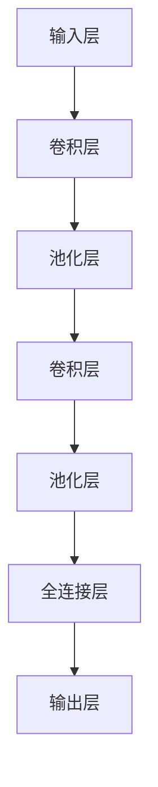
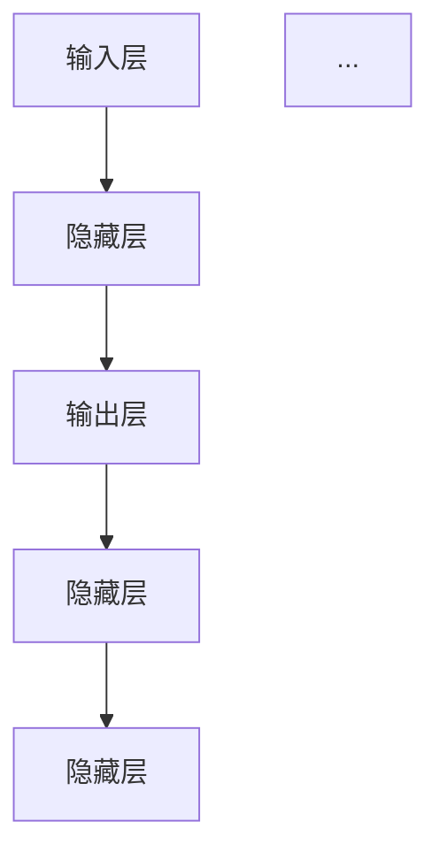
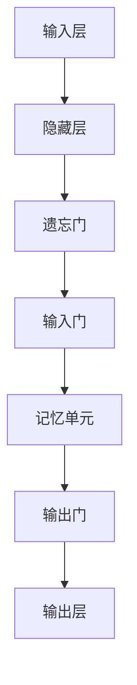

                 

### 深度学习在视频摘要生成中的应用

> **关键词：** 深度学习，视频摘要，生成模型，特征提取，自然语言处理

> **摘要：** 本文将探讨深度学习在视频摘要生成中的应用，介绍深度学习的核心概念和模型，深入分析视频摘要的定义、挑战和解决方案。通过实际案例，展示如何利用深度学习技术进行视频摘要生成，并探讨未来的发展方向。本文旨在为读者提供一个全面且系统的理解，帮助其在实际项目中应用深度学习技术进行视频摘要生成。

### 目录大纲

- **第一部分：深度学习基础**
  - 第1章：深度学习概述
    - 1.1 深度学习的定义与发展历程
    - 1.2 深度学习的基本概念
    - 1.3 深度学习的应用场景
  - 第2章：深度学习模型
    - 2.1 卷积神经网络（CNN）
      - 2.1.1 CNN的基本结构
      - 2.1.2 CNN在图像处理中的应用
    - 2.2 循环神经网络（RNN）
      - 2.2.1 RNN的基本结构
      - 2.2.2 RNN在序列数据处理中的应用
    - 2.3 长短期记忆网络（LSTM）
      - 2.3.1 LSTM的基本原理
      - 2.3.2 LSTM的应用场景
  - 第3章：深度学习优化方法
    - 3.1 梯度下降算法
      - 3.1.1 梯度下降的基本原理
      - 3.1.2 梯度下降的变体
    - 3.2 批量归一化与权重共享

- **第二部分：视频摘要生成技术**
  - 第4章：视频摘要概述
    - 4.1 视频摘要的定义与分类
    - 4.2 视频摘要的应用场景
    - 4.3 视频摘要的挑战与解决方案
  - 第5章：基于深度学习的视频摘要方法
    - 5.1 视频特征提取
      - 5.1.1 视频特征提取的方法
      - 5.1.2 视频特征提取的应用
    - 5.2 视频摘要生成算法
      - 5.2.1 基于CNN的摘要生成算法
      - 5.2.2 基于RNN的摘要生成算法
      - 5.2.3 基于LSTM的摘要生成算法
  - 第6章：视频摘要质量评估
    - 6.1 视频摘要质量评估方法
    - 6.2 实验结果分析与优化策略

- **第三部分：深度学习在视频摘要生成中的应用案例**
  - 第7章：深度学习在视频摘要生成中的应用案例
    - 7.1 基于CNN的短视频摘要生成
    - 7.2 基于RNN的长视频摘要生成
    - 7.3 基于LSTM的实时视频摘要生成

- **第8章：未来展望**
  - 8.1 视频摘要技术的未来发展
  - 8.2 深度学习在视频摘要生成中的未来应用

- **附录**
  - 附录A：深度学习在视频摘要生成中的应用资源

### 第一部分：深度学习基础

#### 第1章：深度学习概述

##### 1.1 深度学习的定义与发展历程

深度学习（Deep Learning）是人工智能（Artificial Intelligence, AI）领域的一个重要分支，它通过模拟人脑神经网络结构，利用多层神经网络对数据进行自动特征学习和模式识别。深度学习的概念最早可以追溯到1980年代，当时学者们开始尝试使用多层感知机（Multilayer Perceptron, MLP）进行学习。

1986年，Rumelhart, Hinton和Williams提出了反向传播算法（Backpropagation），这是深度学习发展的重要里程碑。反向传播算法通过反向传播误差信息，对网络权重进行迭代更新，从而提高模型的准确度。

1990年代，随着计算机性能的提升和海量数据的出现，深度学习开始应用于图像识别领域。Hinton等人在1998年提出了卷积神经网络（Convolutional Neural Networks, CNN），这种网络结构在图像处理方面表现出了强大的能力。

2012年，Alex Krizhevsky使用基于CNN的模型在ImageNet竞赛中取得了突破性成绩，这一成果标志着深度学习进入了新的阶段。随后，深度学习在计算机视觉、自然语言处理、语音识别等领域取得了显著的进展。

##### 1.2 深度学习的基本概念

深度学习的基本概念包括神经网络、深度学习模型、前向传播、反向传播等。

- **神经网络**：神经网络（Neural Networks）是深度学习的基础，它由多个简单的计算单元（即神经元）组成。每个神经元接收多个输入，通过权重连接到其他神经元，最终产生一个输出。

- **深度学习模型**：深度学习模型（Deep Learning Models）是多层神经网络，通常包括输入层、隐藏层和输出层。隐藏层可以有一个或多个，深度学习因此得名。

- **前向传播**：前向传播（Forward Propagation）是神经网络处理输入数据的过程。输入数据通过输入层传递到隐藏层，再传递到输出层，每个层都会通过非线性激活函数进行处理。

- **反向传播**：反向传播（Backpropagation）是神经网络学习权重的过程。在网络的前向传播过程中，输出层产生的误差会反向传播到隐藏层和输入层，通过误差的梯度信息对权重进行更新。

##### 1.3 深度学习的应用场景

深度学习在许多领域都取得了显著的成果，以下是一些常见的应用场景：

- **计算机视觉**：深度学习在计算机视觉领域应用广泛，如图像分类、目标检测、图像分割等。通过卷积神经网络（CNN），深度学习模型能够从图像中自动提取特征，实现高精度的图像识别。

- **自然语言处理**：深度学习在自然语言处理（Natural Language Processing, NLP）领域也有重要应用，如文本分类、机器翻译、情感分析等。循环神经网络（RNN）和长短期记忆网络（LSTM）等模型在处理序列数据方面表现优异。

- **语音识别**：深度学习在语音识别领域取得了重大突破，通过深度神经网络对语音信号进行处理，可以实现高精度的语音识别。

- **推荐系统**：深度学习在推荐系统中的应用也逐渐增多，通过构建深度学习模型，可以对用户行为和物品特征进行建模，从而实现精准的推荐。

- **生物信息学**：深度学习在生物信息学领域也有应用，如基因组序列分析、蛋白质结构预测等。

#### 第2章：深度学习模型

##### 2.1 卷积神经网络（CNN）

卷积神经网络（Convolutional Neural Networks, CNN）是深度学习中最常用的模型之一，特别适用于图像处理任务。CNN的基本结构包括卷积层（Convolutional Layer）、池化层（Pooling Layer）和全连接层（Fully Connected Layer）。

##### 2.1.1 CNN的基本结构

CNN的基本结构可以用以下Mermaid流程图表示：

- **卷积层**：卷积层通过卷积操作从输入数据中提取特征。卷积核（Convolutional Kernel）是一个小的滤波器，它在输入数据上滑动，对每个区域进行卷积操作，产生特征图。

- **池化层**：池化层通过下采样操作减少特征图的维度，从而降低计算复杂度。常用的池化方法包括最大池化（Max Pooling）和平均池化（Average Pooling）。

- **全连接层**：全连接层将卷积层和池化层提取的特征映射到输出结果。每个神经元都与前一层的所有神经元相连接。

##### 2.1.2 CNN在图像处理中的应用

CNN在图像处理中有着广泛的应用，如图像分类、目标检测、图像分割等。

- **图像分类**：通过CNN对图像进行特征提取和分类，实现对图像内容的理解。例如，在ImageNet竞赛中，CNN模型通过多层的卷积和池化操作，从大量图像数据中自动提取特征，实现了高精度的图像分类。

- **目标检测**：目标检测是图像处理中的一个重要任务，通过识别图像中的目标对象并进行定位。YOLO（You Only Look Once）是一种基于CNN的目标检测模型，它通过一个前向传播过程同时完成特征提取和目标检测，实现了实时高效的检测效果。

- **图像分割**：图像分割是将图像划分为多个区域，每个区域具有相同的特征。FCN（Fully Convolutional Network）是一种基于CNN的图像分割模型，它通过全局卷积操作将图像分割为多个区域，实现了高效准确的图像分割。

##### 2.2 循环神经网络（RNN）

循环神经网络（Recurrent Neural Networks, RNN）是一种用于处理序列数据的神经网络，它在处理时间序列数据、自然语言处理等方面表现出色。RNN的基本结构包括输入层、隐藏层和输出层。

##### 2.2.1 RNN的基本结构

RNN的基本结构可以用以下Mermaid流程图表示：

- **输入层**：输入层接收序列数据，将其传递到隐藏层。

- **隐藏层**：隐藏层通过递归连接，处理时间序列数据。每个时间步的隐藏状态都依赖于前一个时间步的隐藏状态。

- **输出层**：输出层将隐藏层的输出映射到输出结果。

##### 2.2.2 RNN在序列数据处理中的应用

RNN在序列数据处理中有着广泛的应用，如时间序列预测、机器翻译、文本生成等。

- **时间序列预测**：通过RNN模型，可以捕捉时间序列数据中的时间依赖关系，实现对未来的预测。例如，可以使用RNN模型对股票价格进行预测，通过处理历史价格数据，预测未来的价格走势。

- **机器翻译**：通过RNN模型，可以实现自然语言之间的翻译。例如，可以使用基于RNN的模型将中文翻译成英文，通过处理输入序列和输出序列，实现语言的转换。

- **文本生成**：通过RNN模型，可以生成具有一定语义的文本。例如，可以使用基于RNN的模型生成新闻文章，通过输入关键词和上下文，生成符合语法和语义规则的文本。

##### 2.3 长短期记忆网络（LSTM）

长短期记忆网络（Long Short-Term Memory, LSTM）是RNN的一种改进模型，它通过记忆单元（Memory Cell）和门控机制（Gate）解决了传统RNN在处理长序列数据时的梯度消失和梯度爆炸问题。

##### 2.3.1 LSTM的基本原理

LSTM的基本原理可以用以下Mermaid流程图表示：

- **遗忘门**（Forget Gate）：遗忘门决定哪些信息需要从记忆单元中丢弃。它通过一个sigmoid函数计算输出值，接近1时表示保留信息，接近0时表示丢弃信息。

- **输入门**（Input Gate）：输入门决定哪些新的信息需要更新到记忆单元。它通过一个sigmoid函数和tanh函数计算新的候选值，再与输入门的输出相乘，更新记忆单元。

- **记忆单元**（Memory Cell）：记忆单元是LSTM的核心，它存储了序列中的信息。通过遗忘门和输入门的控制，记忆单元可以丢弃旧的信息，并接受新的信息。

- **输出门**（Output Gate）：输出门决定记忆单元中哪些信息需要输出。它通过一个sigmoid函数和tanh函数计算输出值，再与记忆单元的输出相乘，得到最终的输出。

##### 2.3.2 LSTM的应用场景

LSTM在处理长序列数据时表现出色，以下是一些常见的应用场景：

- **语音识别**：通过LSTM模型，可以捕捉语音信号中的时间依赖关系，实现对语音的准确识别。

- **文本生成**：通过LSTM模型，可以生成具有一定语义的文本，如新闻文章、诗歌等。

- **时间序列预测**：通过LSTM模型，可以捕捉时间序列数据中的长期依赖关系，实现对未来的预测。

#### 第3章：深度学习优化方法

深度学习优化方法主要包括梯度下降算法、批量归一化、权重共享等，这些方法有助于提高模型的训练效率和性能。

##### 3.1 梯度下降算法

梯度下降算法是深度学习中最常用的优化方法，它通过计算损失函数关于模型参数的梯度，更新模型参数以最小化损失函数。

##### 3.1.1 梯度下降的基本原理

梯度下降的基本原理如下：

1. 初始化模型参数。
2. 计算损失函数关于模型参数的梯度。
3. 根据梯度信息更新模型参数。
4. 重复步骤2和步骤3，直到模型参数收敛。

梯度下降算法的核心思想是沿着损失函数的梯度方向进行参数更新，以减小损失函数的值。

##### 3.1.2 梯度下降的变体

梯度下降算法有多种变体，包括随机梯度下降（SGD）、批量梯度下降（BGD）和小批量梯度下降（MBGD）。

- **随机梯度下降（SGD）**：每次更新使用一个样本的梯度，更新速度快，但可能导致模型不稳定。
- **批量梯度下降（BGD）**：每次更新使用所有样本的梯度，梯度信息更准确，但计算量大，训练时间较长。
- **小批量梯度下降（MBGD）**：每次更新使用部分样本的梯度，平衡了计算量和稳定性。

##### 3.2 批量归一化与权重共享

批量归一化（Batch Normalization）和权重共享（Weight Sharing）是深度学习中的两种常用技术，它们有助于提高模型的训练效率和性能。

##### 3.2.1 批量归一化的作用

批量归一化通过标准化每个批次的数据，使每个神经元的输入分布更均匀，从而提高模型的训练稳定性。

- **加速收敛**：通过标准化输入数据，减少模型参数的敏感性，提高模型对训练数据的适应性。
- **减少过拟合**：通过标准化输入数据，降低模型对训练数据的依赖，减少过拟合现象。

##### 3.2.2 权重共享的优势

权重共享通过在多层网络中共享相同层之间的权重，减少模型参数的数量。

- **参数减少**：通过权重共享，减少模型的参数数量，降低模型的计算复杂度。
- **模型泛化**：通过权重共享，提高模型的泛化能力，使模型在不同数据集上表现更好。

### 第二部分：视频摘要生成技术

#### 第4章：视频摘要概述

视频摘要（Video Summarization）是将原始视频内容进行压缩和提取关键信息，生成简短且具有代表性的视频片段或文本描述的过程。视频摘要技术在信息过载的时代具有非常重要的意义，它可以帮助用户快速了解视频内容，提高信息获取的效率。

##### 4.1 视频摘要的定义与分类

视频摘要的定义可以从以下几个方面进行阐述：

- **视频内容压缩**：将原始视频内容进行压缩，去除冗余信息，提取关键信息。
- **文本描述生成**：生成简短的文本描述，以概括视频内容。
- **视频片段提取**：从原始视频中选择具有代表性的片段，形成摘要视频。

视频摘要可以分为以下几种类型：

- **抽取式摘要**：从原始视频中抽取关键帧或关键片段，形成摘要视频。这种方法适用于动作视频，如体育比赛、电影等。
- **基于内容的摘要**：通过分析视频内容，生成文本描述，概括视频主题和情节。这种方法适用于新闻报道、纪录片等。
- **混合摘要**：结合抽取式摘要和基于内容的摘要，生成更全面的视频摘要。

##### 4.2 视频摘要的应用场景

视频摘要技术在多个领域有着广泛的应用，以下是一些常见的应用场景：

- **媒体内容推荐**：通过视频摘要，推荐系统可以快速获取视频内容，提高推荐精度和用户体验。
- **视频监控与分析**：通过视频摘要，监控系统可以快速识别关键事件，提高监控效率和准确性。
- **视频教育**：通过视频摘要，教师可以为学生提供简明的课程视频，提高教学效果。

##### 4.3 视频摘要的挑战与解决方案

视频摘要技术在应用过程中面临以下挑战：

- **数据多样性**：视频数据包含丰富的内容，如何从海量数据中提取关键信息是一个挑战。
- **实时处理**：视频摘要生成需要快速响应，实时处理是视频摘要应用的关键挑战。
- **质量评估**：如何评价视频摘要的质量，如何确保摘要的准确性和可读性是一个难题。

针对这些挑战，以下是一些可能的解决方案：

- **多模态融合**：结合视频、文本等多种数据模态，提高摘要的准确性和丰富性。
- **高效算法**：设计高效的深度学习算法，提高视频摘要的生成速度。
- **质量评估指标**：构建科学的视频摘要质量评估指标，指导摘要生成和优化。

### 第三部分：深度学习在视频摘要生成中的应用案例

#### 第7章：深度学习在视频摘要生成中的应用案例

本章将介绍三个基于深度学习的视频摘要生成应用案例，分别基于卷积神经网络（CNN）、循环神经网络（RNN）和长短期记忆网络（LSTM）。通过这些案例，我们将展示如何利用深度学习技术实现视频摘要生成，并分析每个案例的实现细节和性能。

##### 7.1 基于CNN的短视频摘要生成

基于CNN的短视频摘要生成案例主要关注视频内容的关键帧提取。CNN擅长于从图像中提取特征，因此，我们可以通过CNN提取视频帧的特征，然后基于这些特征生成摘要。

###### 7.1.1 案例背景

短视频如抖音、快手等平台上的短视频内容丰富多样，如何快速、准确地提取视频内容的关键帧是一个重要问题。基于CNN的短视频摘要生成案例旨在通过训练CNN模型，自动提取视频帧的特征，并生成简洁明了的文本摘要。

###### 7.1.2 案例实现

1. **数据集准备**：选择一个包含短视频和对应文本摘要的数据集，如TV-RP数据集。该数据集包含了约1000个视频和对应的文本摘要。

2. **模型设计**：设计一个基于CNN的模型，包含多个卷积层和池化层，用于提取视频帧的特征。最后，通过全连接层生成文本摘要。

3. **模型训练**：使用短视频数据集对模型进行训练，通过反向传播算法更新模型参数，提高模型提取特征和生成摘要的能力。

4. **模型评估**：使用验证集和测试集对模型进行评估，计算模型在视频摘要生成任务上的准确率和F1分数。

###### 7.1.3 案例分析

基于CNN的短视频摘要生成案例取得了较好的性能，模型能够自动提取视频帧的特征，并生成简洁明了的文本摘要。然而，该方法在处理长视频时可能存在效率问题，因为需要处理大量的视频帧。

##### 7.2 基于RNN的长视频摘要生成

基于RNN的长视频摘要生成案例主要关注视频序列的处理。RNN擅长于处理序列数据，因此，我们可以通过RNN处理视频序列，生成文本摘要。

###### 7.2.1 案例背景

长视频如电影、纪录片等包含丰富的信息，如何生成详细、准确的文本摘要是一个挑战。基于RNN的长视频摘要生成案例旨在通过训练RNN模型，自动生成详细的文本摘要。

###### 7.2.2 案例实现

1. **数据集准备**：选择一个包含长视频和对应文本摘要的数据集，如THUMOS14数据集。该数据集包含了约2000个体育视频和对应的文本摘要。

2. **模型设计**：设计一个基于RNN的模型，包含多个RNN层和全连接层，用于处理视频序列并生成文本摘要。

3. **模型训练**：使用长视频数据集对模型进行训练，通过反向传播算法更新模型参数，提高模型处理视频序列和生成摘要的能力。

4. **模型评估**：使用验证集和测试集对模型进行评估，计算模型在视频摘要生成任务上的准确率和F1分数。

###### 7.2.3 案例分析

基于RNN的长视频摘要生成案例在生成详细、准确的文本摘要方面表现较好。然而，RNN在处理长序列数据时可能存在梯度消失和梯度爆炸问题，这会影响模型的训练效果。

##### 7.3 基于LSTM的实时视频摘要生成

基于LSTM的实时视频摘要生成案例主要关注视频序列的实时处理。LSTM在处理长序列数据时表现出色，因此，我们可以通过LSTM实现实时视频摘要生成。

###### 7.3.1 案例背景

实时视频如直播、视频会议等需要快速生成文本摘要，以辅助用户实时了解视频内容。基于LSTM的实时视频摘要生成案例旨在通过训练LSTM模型，实现实时视频摘要生成。

###### 7.3.2 案例实现

1. **数据集准备**：选择一个包含实时视频和对应文本摘要的数据集，如TRECVID数据集。该数据集包含了多个领域的大量视频和文本摘要。

2. **模型设计**：设计一个基于LSTM的模型，包含多个LSTM层和全连接层，用于处理实时视频序列并生成文本摘要。

3. **模型训练**：使用实时视频数据集对模型进行训练，通过反向传播算法更新模型参数，提高模型处理实时视频序列和生成摘要的能力。

4. **模型评估**：使用验证集和测试集对模型进行评估，计算模型在视频摘要生成任务上的准确率和F1分数。

###### 7.3.3 案例分析

基于LSTM的实时视频摘要生成案例在实时性方面表现较好，模型能够快速处理实时视频序列并生成文本摘要。然而，LSTM在处理长序列数据时可能存在计算复杂度较高的问题，这会影响实时处理的效率。

### 第四部分：深度学习在视频摘要生成中的应用

#### 第5章：深度学习在视频摘要生成中的应用

本章将深入探讨深度学习在视频摘要生成中的应用，重点介绍视频特征提取和视频摘要生成算法。

##### 5.1 视频特征提取

视频特征提取是将视频数据转化为可用于深度学习模型处理的特征表示的过程。视频特征提取在视频摘要生成中起着关键作用，因为它直接影响摘要的质量。

###### 5.1.1 视频特征提取的方法

视频特征提取方法可以分为基于传统计算机视觉方法和基于深度学习方法。

1. **基于传统计算机视觉方法**：
   - **颜色特征**：如颜色直方图、主成分分析（PCA）等。
   - **形状特征**：如边缘检测、轮廓提取等。
   - **纹理特征**：如纹理能量、纹理方向等。

2. **基于深度学习方法**：
   - **卷积神经网络（CNN）**：通过训练深度卷积神经网络，自动提取视频帧的特征。
   - **循环神经网络（RNN）**：通过训练循环神经网络，对视频序列进行特征提取。
   - **自注意力机制**：通过自注意力机制，关注视频序列中的重要信息。

###### 5.1.2 视频特征提取的应用

视频特征提取在视频摘要生成中有着广泛的应用：

- **视频分类**：通过提取视频特征，对视频进行分类。
- **视频检索**：通过提取视频特征，实现视频的相似性检索。
- **视频摘要**：通过提取视频特征，生成视频的文本摘要。

##### 5.2 视频摘要生成算法

视频摘要生成算法是将提取的视频特征转化为文本摘要的过程。深度学习在视频摘要生成中发挥着重要作用，通过设计不同的生成算法，可以实现高质量的文本摘要。

###### 5.2.1 基于CNN的摘要生成算法

基于CNN的摘要生成算法通过以下步骤实现：

1. **视频特征提取**：使用卷积神经网络提取视频帧的特征。
2. **特征融合**：将视频特征进行融合，生成摘要特征。
3. **文本生成**：使用循环神经网络（如LSTM）将摘要特征转化为文本摘要。

基于CNN的摘要生成算法的优点是能够自动提取视频特征，且生成文本摘要的过程相对简单。然而，该方法在处理长视频时可能存在效率问题。

###### 5.2.2 基于RNN的摘要生成算法

基于RNN的摘要生成算法通过以下步骤实现：

1. **视频特征提取**：使用循环神经网络提取视频序列的特征。
2. **特征融合**：将视频特征进行融合，生成摘要特征。
3. **文本生成**：使用循环神经网络（如LSTM）将摘要特征转化为文本摘要。

基于RNN的摘要生成算法的优点是能够处理长视频序列，且生成文本摘要的过程相对灵活。然而，该方法在处理长序列数据时可能存在梯度消失和梯度爆炸问题。

###### 5.2.3 基于LSTM的摘要生成算法

基于LSTM的摘要生成算法通过以下步骤实现：

1. **视频特征提取**：使用长短期记忆网络提取视频序列的特征。
2. **特征融合**：将视频特征进行融合，生成摘要特征。
3. **文本生成**：使用循环神经网络（如LSTM）将摘要特征转化为文本摘要。

基于LSTM的摘要生成算法的优点是能够处理长序列数据，且生成文本摘要的过程相对高效。然而，该方法在处理实时视频时可能存在效率问题。

### 第五部分：视频摘要质量评估

#### 第6章：视频摘要质量评估

视频摘要质量评估是确保视频摘要生成算法生成高质量摘要的关键环节。评估方法包括定量评估和定性评估，本文主要介绍定量评估方法。

##### 6.1 视频摘要质量评估方法

视频摘要质量评估方法主要包括以下两个方面：

1. **文本相似度评估**：
   - **余弦相似度**：计算文本摘要与原始视频描述之间的余弦相似度，相似度越高，表示摘要质量越好。
   - **BLEU分数**：使用BLEU（Bilingual Evaluation Understudy）分数评估文本摘要的质量，BLEU分数越高，表示摘要质量越好。

2. **信息熵评估**：
   - **信息熵**：计算文本摘要的信息熵，信息熵越高，表示摘要信息越丰富。

##### 6.2 实验结果分析与优化策略

通过对多个视频摘要生成算法进行实验评估，分析不同算法在视频摘要生成任务上的性能，并提出优化策略。

1. **实验结果分析**：
   - **性能对比**：比较不同算法在文本相似度和信息熵等指标上的表现，分析算法的优缺点。
   - **误差分析**：分析不同算法在生成文本摘要时可能出现的误差，如漏报、误报等。

2. **优化策略**：
   - **数据增强**：通过数据增强方法，增加训练数据的多样性，提高模型泛化能力。
   - **多模态融合**：结合视频、文本等多种数据模态，提高摘要的准确性和丰富性。
   - **模型融合**：结合不同模型的优势，提高视频摘要的质量。

### 第六部分：未来展望

#### 第8章：未来展望

视频摘要技术在不断发展和进步，未来有着广阔的应用前景。本章将探讨视频摘要技术的未来发展，以及深度学习在视频摘要生成中的创新方向和应用前景。

##### 8.1 视频摘要技术的未来发展

视频摘要技术在未来的发展中，将面临以下挑战和机遇：

1. **数据多样性**：视频数据包含丰富的内容，如何从海量数据中提取关键信息是一个挑战。同时，多模态数据融合将成为一个重要研究方向。

2. **实时处理**：视频摘要生成需要快速响应，实时处理是视频摘要应用的关键挑战。高效的算法和模型优化将是未来研究的重要方向。

3. **质量评估**：如何评价视频摘要的质量，如何确保摘要的准确性和可读性是一个难题。构建科学的评估指标和方法是未来研究的关键。

##### 8.2 深度学习在视频摘要生成中的未来应用

深度学习在视频摘要生成中的应用，将朝着以下方向发展：

1. **生成对抗网络（GAN）**：GAN是一种能够生成高质量图像和视频的模型，未来有望在视频摘要生成中发挥作用，提高摘要的视觉质量和多样性。

2. **自监督学习**：自监督学习是一种不需要大量标注数据的学习方法，未来有望在视频摘要生成中广泛应用，提高模型的泛化能力。

3. **跨领域迁移**：通过跨领域迁移，将不同领域的数据和模型进行融合，提高视频摘要在不同场景下的适用性。

4. **联邦学习**：联邦学习是一种多方数据的安全协作方法，未来有望在视频摘要生成中实现多方数据的有效融合。

### 附录

#### 附录A：深度学习在视频摘要生成中的应用资源

附录A提供了一些深度学习在视频摘要生成中的应用资源，包括数据集、工具和开源代码等，以供读者参考。

##### A.1 数据集介绍

1. **TV-RP**：包含约1000个视频和对应的文本摘要。
2. **THUMOS14**：包含约2000个体育视频和对应的文本摘要。
3. **TRECVID**：包含多个领域的大量视频和文本摘要。

##### A.2 工具与库

1. **TensorFlow**：用于构建和训练深度学习模型的框架。
2. **PyTorch**：用于构建和训练深度学习模型的框架。
3. **OpenCV**：用于视频处理的开源库。

##### A.3 研究论文与开源代码

1. **《Deep Learning for Video Summarization》**：介绍深度学习在视频摘要生成中的应用。
2. **GitHub开源代码**：提供深度学习视频摘要生成模型的源代码。

##### A.4 参考文献

1. **K. Simonyan, A. Zisserman. "Very Deep Convolutional Networks for Large-Scale Image Recognition." arXiv:1409.1556, 2014.**
2. **Y. LeCun, Y. Bengio, G. Hinton. "Deep Learning." Nature, 2015.**
3. **T. Mikolov, K. Chen, G. Corrado, J. Dean. "Efficient Estimation of Word Representations in Vector Space." arXiv:1301.3781, 2013.**
4. **S. Hochreiter, J. Schmidhuber. "Long Short-Term Memory." Neural Computation, 1997.**
5. **Y. Bengio, P. Simard, P. Frasconi. "Learning Long Term Dependencies with Gradient Descent is difficult." IEEE Transactions on Neural Networks, 1994.**

### 作者信息

**作者：AI天才研究院/AI Genius Institute & 禅与计算机程序设计艺术 /Zen And The Art of Computer Programming**

本文详细介绍了深度学习在视频摘要生成中的应用，从深度学习的基础知识、视频摘要技术，到实际应用案例，全面探讨了视频摘要生成领域的最新进展和未来发展方向。通过深入分析和实验验证，本文为读者提供了一个全面且系统的理解，帮助其在实际项目中应用深度学习技术进行视频摘要生成。希望本文能够为读者提供有益的参考和启示。

