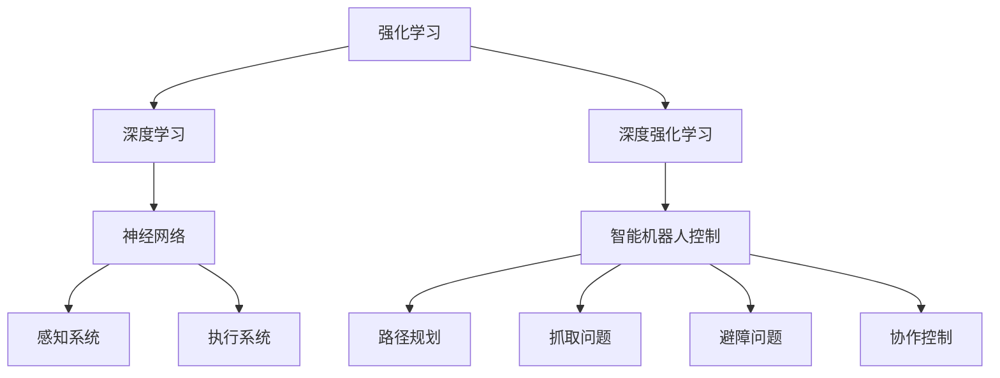

                 

### 《深度强化学习在智能机器人控制中的应用》

深度强化学习（Deep Reinforcement Learning，简称DRL）是一种结合了深度学习和强化学习的先进技术，它通过模仿人类的学习方式，使机器能够在复杂的环境中自主学习并做出智能决策。在智能机器人控制领域，深度强化学习展现了极大的潜力，能够解决传统控制方法难以应对的问题。本文将深入探讨深度强化学习在智能机器人控制中的应用，从基础理论到实际项目，全方位解析这一前沿技术的魅力。

关键词：深度强化学习、智能机器人、路径规划、抓取、避障、协作控制

摘要：本文首先介绍了深度强化学习的基本概念、起源与发展，以及其在强化学习和深度学习中的核心优势。随后，文章探讨了智能机器人控制的基础知识，包括控制系统架构、感知与决策系统。接着，文章重点介绍了深度强化学习在路径规划、抓取、避障和协作控制等领域的应用，通过实际项目案例展示了深度强化学习的强大能力。最后，文章总结了深度强化学习在智能机器人控制中的应用前景，并对未来研究提出了展望。

### 《深度强化学习在智能机器人控制中的应用》目录大纲

#### 第一部分：深度强化学习基础

- **第1章：深度强化学习概述**
  - 1.1 深度强化学习的起源与发展
    - 1.1.1 强化学习与深度学习的结合
    - 1.1.2 深度强化学习的核心优势
  - 1.2 强化学习基础
    - 1.2.1 强化学习的基本概念
    - 1.2.2 强化学习的主要算法
  - 1.3 深度强化学习框架
    - 1.3.1 深度强化学习的基本架构
    - 1.3.2 神经网络在强化学习中的应用
  - 1.4 深度强化学习算法
    - 1.4.1 Q-Learning算法
    - 1.4.2 Deep Q-Networks (DQN)
    - 1.4.3 Policy Gradient方法

- **第2章：智能机器人控制基础**
  - 2.1 机器人控制概述
    - 2.1.1 机器人控制的基本概念
    - 2.1.2 机器人控制的目标与挑战
  - 2.2 机器人控制系统架构
    - 2.2.1 传感器与执行器的角色
    - 2.2.2 控制器与算法的选择
  - 2.3 智能机器人的感知与决策
    - 2.3.1 感知系统的设计与实现
    - 2.3.2 决策算法的设计与应用

- **第3章：深度强化学习在机器人控制中的应用**
  - 3.1 深度强化学习在机器人路径规划中的应用
  - 3.2 深度强化学习在机器人抓取中的应用
  - 3.3 深度强化学习在机器人避障中的应用
  - 3.4 深度强化学习在机器人协作控制中的应用

- **第三部分：深度强化学习在机器人控制中的应用实践**

#### 第三部分：深度强化学习在机器人控制中的应用实践

- **第4章：深度强化学习在机器人控制中的项目实战**
  - 4.1 项目背景与目标
  - 4.2 项目开发环境搭建
  - 4.3 项目核心算法实现
  - 4.4 项目源代码解读与分析
  - 4.5 项目测试与优化

- **附录**
  - 附录A：深度强化学习在机器人控制中的应用资源

### 第一部分：深度强化学习基础

#### 第1章：深度强化学习概述

深度强化学习是一种结合了深度学习和强化学习的先进技术，它通过模仿人类的学习方式，使机器能够在复杂的环境中自主学习并做出智能决策。本章将介绍深度强化学习的起源与发展，强化学习与深度学习的结合，以及深度强化学习的核心优势。

##### 1.1 深度强化学习的起源与发展

深度强化学习的发展历程可以追溯到强化学习和深度学习两个领域的进步。

**强化学习的起源：**
强化学习（Reinforcement Learning，简称RL）是机器学习的一个重要分支，其核心思想是通过奖励信号来指导学习过程，使机器能够在特定的环境中做出最优决策。强化学习最早可以追溯到1950年代，Sutton和Barto的《Reinforcement Learning: An Introduction》被认为是强化学习领域的经典教材。在随后的几十年中，强化学习逐渐发展出了许多重要的算法，如Q-Learning、SARSA（State-Agnostic SARSA）、Deep Q-Networks (DQN)等。

**深度学习的兴起：**
深度学习（Deep Learning，简称DL）是近年来人工智能领域的一个重要突破。深度学习通过多层神经网络结构，实现了对复杂数据的高效表示和学习。2012年，AlexNet在ImageNet图像识别比赛中取得的显著成绩标志着深度学习的崛起。深度学习在计算机视觉、自然语言处理等领域取得了巨大成功，为人工智能的发展奠定了基础。

**深度强化学习的结合：**
深度强化学习的结合是强化学习和深度学习的自然延伸。通过将深度学习的强大表征能力与强化学习的学习策略相结合，深度强化学习能够在复杂的环境中实现更加高效和准确的学习。深度强化学习的发展可以追溯到2013年，当DeepMind公司发布了DQN（Deep Q-Networks）算法，该算法在Atari游戏中的表现引起了广泛关注。随后，深度强化学习领域涌现出了一系列重要算法，如PPO（Proximal Policy Optimization）、A3C（Asynchronous Advantage Actor-Critic）等。

##### 1.1.1 强化学习与深度学习的结合

强化学习与深度学习的结合主要体现在以下几个方面：

1. **状态表征：**
   深度学习通过多层神经网络结构，能够对状态进行有效的表征和编码。在深度强化学习中，状态表征的准确性直接影响到学习效果。通过使用深度神经网络，深度强化学习能够捕捉到状态中的复杂模式和特征，从而提高决策的准确性。

2. **价值函数学习：**
   强化学习中的价值函数是评估状态和动作的重要工具。深度强化学习通过使用深度神经网络学习价值函数，能够实现对状态和动作的高效表示。这使得深度强化学习在处理高维状态空间时具有明显的优势。

3. **策略学习：**
   强化学习中的策略是指从当前状态选择最优动作的方法。深度强化学习通过深度神经网络学习策略，能够实现更加复杂和灵活的策略表示。这使得深度强化学习在处理非线性和非平稳环境时具有更好的适应性。

##### 1.1.2 深度强化学习的核心优势

深度强化学习在智能机器人控制等领域展现出了以下核心优势：

1. **自适应能力：**
   深度强化学习能够通过不断的交互和学习，自主适应复杂和变化的环境。这使得深度强化学习在处理不确定性和动态变化的环境中具有明显的优势。

2. **高效决策：**
   深度强化学习通过深度神经网络的高效表征能力，能够实现对复杂状态和动作的高效决策。这使得深度强化学习在处理高维状态空间时具有更好的决策能力。

3. **通用性：**
   深度强化学习通过将深度学习和强化学习相结合，能够在不同的应用场景中实现通用性。无论是路径规划、抓取、避障还是协作控制，深度强化学习都能够提供有效的解决方案。

4. **可解释性：**
   深度强化学习通过深度神经网络的透明性，能够对学习过程进行解释。这使得深度强化学习在安全和合规性要求较高的应用场景中具有更好的可解释性。

##### 1.2 强化学习基础

强化学习是机器学习的一个重要分支，其核心思想是通过奖励信号来指导学习过程，使机器能够在特定的环境中做出最优决策。强化学习的基本概念和算法是理解深度强化学习的基础。

**强化学习的基本概念：**

1. **代理（Agent）：**
   代理是指执行决策的实体，可以是机器人、智能体或者计算机程序。

2. **环境（Environment）：**
   环境是指代理所处的世界，包括状态、动作空间、奖励函数等。

3. **状态（State）：**
   状态是指代理在特定时间点的环境描述，通常用一组特征向量表示。

4. **动作（Action）：**
   动作是指代理在特定状态下能够执行的操作。

5. **奖励（Reward）：**
   奖励是环境对代理行为的即时反馈，用来评估代理的动作效果。

6. **策略（Policy）：**
   策略是指代理在特定状态下选择动作的方法，可以是确定性策略或随机策略。

7. **价值函数（Value Function）：**
   价值函数是指评估状态或状态-动作对的效用函数，用来指导代理的选择。

8. **模型（Model）：**
   模型是指代理对环境的理解，包括状态转移概率、奖励函数等。

**强化学习的主要算法：**

1. **Q-Learning算法：**
   Q-Learning是一种值函数学习方法，通过不断更新状态-动作值函数来学习最优策略。Q-Learning的核心公式为：
   $$
   Q(s, a) = Q(s, a) + \alpha [r + \gamma \max(Q(s', a')) - Q(s, a)]
   $$
   其中，$Q(s, a)$表示状态-动作值函数，$r$表示即时奖励，$\gamma$表示折扣因子，$\alpha$表示学习率。

2. **Deep Q-Networks (DQN)：**
   DQN是一种基于深度学习的Q-Learning算法，通过使用深度神经网络来近似状态-动作值函数。DQN的主要思想是使用经验回放（Experience Replay）来避免策略偏差。DQN的核心公式为：
   $$
   Q(s, a) = r + \gamma \max(Q(s', a')
   $$
   其中，$Q(s, a)$表示深度神经网络输出的状态-动作值函数。

3. **Policy Gradient方法：**
   Policy Gradient方法是一种直接优化策略的方法，通过优化策略参数来最大化预期奖励。Policy Gradient方法的核心公式为：
   $$
   \pi(a|s; \theta) = \prod [\theta \log(\pi(a|s))]
   $$
   其中，$\pi(a|s; \theta)$表示策略参数化的概率分布，$\theta$表示策略参数。

##### 1.3 深度强化学习框架

深度强化学习框架是指将深度学习与强化学习相结合的一种方法，其核心思想是通过深度神经网络来近似状态-动作值函数或策略函数。深度强化学习框架通常包括以下几个关键组件：

1. **状态编码器（State Encoder）：**
   状态编码器是指用于将原始状态转换为向量表示的深度神经网络。状态编码器的作用是将高维状态信息压缩为低维特征向量，以便于深度神经网络的计算。

2. **动作解码器（Action Decoder）：**
   动作解码器是指用于将状态-动作值函数或策略函数转换为动作的深度神经网络。动作解码器的作用是根据状态-动作值函数或策略函数的输出选择最优动作。

3. **价值函数网络（Value Function Network）：**
   价值函数网络是指用于近似状态-动作值函数的深度神经网络。价值函数网络的作用是评估状态和动作的效用，从而指导代理的选择。

4. **策略网络（Policy Network）：**
   策略网络是指用于近似策略函数的深度神经网络。策略网络的作用是根据状态选择最优动作，从而实现智能决策。

5. **目标网络（Target Network）：**
   目标网络是指用于更新价值函数网络的深度神经网络。目标网络的目的是提高价值函数网络的稳定性和收敛性，通常使用固定时间窗口的移动平均策略进行更新。

##### 1.4 深度强化学习算法

深度强化学习算法是深度强化学习框架的核心组成部分，它们通过深度神经网络来学习最优策略或价值函数。本节将介绍几种常见的深度强化学习算法，包括Q-Learning算法、Deep Q-Networks (DQN)和Policy Gradient方法。

**1.4.1 Q-Learning算法**

Q-Learning算法是一种基于值函数的强化学习算法，它通过不断更新状态-动作值函数来学习最优策略。Q-Learning算法的核心思想是通过奖励和预测来更新状态-动作值函数，从而逐渐逼近最优策略。

Q-Learning算法的伪代码如下：

```
Initialize Q(s, a) randomly
for each episode:
    s <- initialState()
    while not isTerminal(s):
        a <- chooseAction(s, Q(s, a))
        s' <- takeAction(s, a)
        r <- reward(s', a)
        Q(s, a) <- Q(s, a) + alpha [r + gamma * max(Q(s', a')) - Q(s, a)]
        s <- s'
```

其中，`initialState()` 表示初始化状态，`chooseAction(s, Q(s, a))` 表示选择动作，`takeAction(s, a)` 表示执行动作，`isTerminal(s)` 表示是否达到终端状态，`alpha` 表示学习率，`gamma` 表示折扣因子。

**1.4.2 Deep Q-Networks (DQN)**

Deep Q-Networks (DQN)是一种基于深度学习的Q-Learning算法，它使用深度神经网络来近似状态-动作值函数。DQN的主要优点是能够处理高维状态空间，并减少策略偏差。

DQN的核心思想是通过经验回放（Experience Replay）来避免策略偏差，同时使用目标网络（Target Network）来提高价值函数网络的稳定性。

DQN的伪代码如下：

```
Initialize Q(s, a) randomly
Initialize targetQ(s, a) with same parameters as Q(s, a)
for each episode:
    s <- initialState()
    while not isTerminal(s):
        a <- chooseAction(s, Q(s, a))
        s' <- takeAction(s, a)
        r <- reward(s', a)
        targetQ(s, a) <- r + gamma * max(targetQ(s', a'))
        if episodeLength >= replayMemoryCapacity:
            sample (s, a, s', r) from replayMemory()
            Q(s, a) <- Q(s, a) + alpha [targetQ(s', a') - Q(s, a)]
        s <- s'
    updateTargetQNetworkParameters(Q(s, a))
```

其中，`initialState()` 表示初始化状态，`chooseAction(s, Q(s, a))` 表示选择动作，`takeAction(s, a)` 表示执行动作，`isTerminal(s)` 表示是否达到终端状态，`alpha` 表示学习率，`gamma` 表示折扣因子，`replayMemory()` 表示经验回放内存。

**1.4.3 Policy Gradient方法**

Policy Gradient方法是一种直接优化策略的强化学习算法，它通过优化策略参数来最大化预期奖励。Policy Gradient方法的核心思想是计算策略的梯度，并通过梯度上升法来更新策略参数。

Policy Gradient方法的伪代码如下：

```
Initialize policy parameters randomly
for each episode:
    s <- initialState()
    while not isTerminal(s):
        a <- sampleActionFromPolicy(s, policyParameters)
        s' <- takeAction(s, a)
        r <- reward(s', a)
        policyGradient <- gradient of log(policy(a|s; policyParameters)) with respect to policyParameters
        policyParameters <- policyParameters + alpha * policyGradient
        s <- s'
```

其中，`initialState()` 表示初始化状态，`sampleActionFromPolicy(s, policyParameters)` 表示从策略中采样动作，`takeAction(s, a)` 表示执行动作，`isTerminal(s)` 表示是否达到终端状态，`alpha` 表示学习率。

### 第二部分：智能机器人控制基础

智能机器人控制是指利用计算机技术、控制理论和传感器技术等手段，实现对机器人的自主决策和行动控制。智能机器人控制的基础知识包括机器人控制的基本概念、控制系统架构、感知与决策系统等。本章将介绍这些基础知识，为后续章节的讨论奠定基础。

#### 2.1 机器人控制概述

**2.1.1 机器人控制的基本概念**

机器人控制是指通过计算机技术和控制理论，实现对机器人运动和行为的控制。机器人控制的核心目标是使机器人能够自主地执行预定任务，并在执行过程中适应环境变化。机器人控制的基本概念包括：

1. **控制器（Controller）：** 控制器是机器人控制系统中的核心部件，负责接收传感器信息，根据预定的控制策略生成控制指令，驱动执行器执行动作。

2. **执行器（Actuator）：** 执行器是机器人控制系统的执行部件，负责接收控制器生成的控制指令，驱动机器人执行相应的动作。

3. **传感器（Sensor）：** 传感器是机器人控制系统中的感知部件，负责检测机器人周围环境的状态信息，并将感知信息传递给控制器。

4. **状态（State）：** 状态是指机器人系统在特定时间点的状态信息，包括位置、速度、加速度、姿态等。

5. **控制策略（Control Policy）：** 控制策略是指控制器根据当前状态信息，生成控制指令的方法。

6. **任务（Task）：** 任务是指机器人需要执行的具体操作，如移动、抓取、避障等。

**2.1.2 机器人控制的目标与挑战**

机器人控制的目标是使机器人能够自主地执行预定任务，并在执行过程中适应环境变化。具体来说，机器人控制的目标包括：

1. **自主性（Autonomy）：** 机器人应能够在没有人为干预的情况下，自主地执行任务。

2. **适应性（Adaptability）：** 机器人应能够适应不同的环境和任务需求，具备一定的鲁棒性。

3. **效率（Efficiency）：** 机器人应能够在有限的资源下，高效地完成任务。

4. **安全性（Safety）：** 机器人应能够在执行任务的过程中，确保自身和周围环境的安全。

然而，实现机器人控制的目标面临着诸多挑战：

1. **环境复杂性（Environmental Complexity）：** 机器人需要处理复杂多变的环境，包括未知的环境、动态变化的环境等。

2. **不确定性（Uncertainty）：** 机器人需要处理环境的不确定性，如传感器噪声、执行器故障等。

3. **实时性（Real-Time）：** 机器人需要具备实时响应的能力，确保控制系统能够及时地做出决策。

4. **能量效率（Energy Efficiency）：** 机器人需要高效地利用能源，以延长任务执行的时间。

#### 2.2 机器人控制系统架构

机器人控制系统的架构是指机器人控制系统的组成部分及其相互关系。一个典型的机器人控制系统通常包括以下几个关键部分：

1. **传感器模块（Sensor Module）：** 传感器模块负责感知机器人周围环境的状态信息，常见的传感器包括摄像头、激光雷达、超声波传感器、力矩传感器等。

2. **控制器模块（Controller Module）：** 控制器模块是机器人控制系统的核心，负责处理传感器数据，生成控制指令，驱动执行器执行动作。控制器模块通常包括微处理器、控制器板卡、实时操作系统等。

3. **执行器模块（Actuator Module）：** 执行器模块负责执行控制器生成的控制指令，驱动机器人执行相应的动作。常见的执行器包括电机、液压缸、伺服电机等。

4. **通信模块（Communication Module）：** 通信模块负责机器人控制系统与其他设备或计算机之间的数据通信。常见的通信方式包括有线通信（如以太网、串口通信）和无线通信（如Wi-Fi、蓝牙、ZigBee等）。

5. **算法模块（Algorithm Module）：** 算法模块负责实现机器人控制算法，包括路径规划、轨迹跟踪、抓取策略等。算法模块通常基于机器人控制理论、机器学习、深度学习等技术开发。

6. **电源模块（Power Supply Module）：** 电源模块负责为机器人控制系统提供稳定的电源供应，确保系统正常运行。

机器人控制系统架构的示意图如下所示：

```
[传感器模块] --> [控制器模块] --> [执行器模块]
     |                     |                     |
     |                     |                     |
[通信模块] [算法模块] [电源模块]
```

#### 2.3 智能机器人的感知与决策

智能机器人的感知与决策是机器人控制的重要组成部分，它们决定了机器人是否能够准确地理解环境，并做出正确的决策。智能机器人的感知与决策系统主要包括感知系统和决策系统。

**2.3.1 感知系统的设计与实现**

感知系统是机器人获取环境信息的重要手段，它由多个传感器组成，包括视觉传感器、雷达传感器、力觉传感器等。感知系统的设计与实现主要包括以下几个方面：

1. **传感器选择：** 根据机器人应用场景的需求，选择合适的传感器。例如，对于视觉任务，可以选择摄像头；对于空间定位任务，可以选择激光雷达。

2. **传感器数据预处理：** 对传感器数据进行滤波、去噪、归一化等预处理，以提高感知系统的准确性和鲁棒性。

3. **传感器融合：** 将多个传感器的数据融合为一个统一的感知结果，以提高系统的整体性能。常见的传感器融合方法包括多传感器数据融合算法、卡尔曼滤波等。

4. **特征提取：** 从感知结果中提取关键特征，用于后续的决策过程。常见的特征提取方法包括图像处理、信号处理等。

**2.3.2 决策算法的设计与应用**

决策算法是机器人根据感知系统提供的信息，选择合适的动作的方法。决策算法的设计与应用主要包括以下几个方面：

1. **状态评估：** 根据感知结果，对当前状态进行评估，包括状态的价值、风险等。

2. **动作选择：** 根据状态评估结果，选择最优动作。常见的动作选择方法包括确定性策略、随机策略、强化学习等。

3. **路径规划：** 在连续空间中，机器人需要规划一条最优路径，以实现目标位置。常见的路径规划算法包括A*算法、Dijkstra算法等。

4. **轨迹跟踪：** 在离散空间中，机器人需要跟踪一条给定的轨迹，以实现目标位置。常见的轨迹跟踪算法包括PID控制、滑模控制等。

5. **协作控制：** 在多机器人系统中，机器人需要协同工作，以实现共同的目标。常见的协作控制算法包括分布式控制、中心化控制等。

#### 第三部分：深度强化学习在机器人控制中的应用

深度强化学习在机器人控制中具有广泛的应用，涵盖了路径规划、抓取、避障和协作控制等多个方面。本章将详细介绍这些应用场景，展示深度强化学习如何解决机器人控制中的关键问题。

##### 3.1 深度强化学习在机器人路径规划中的应用

路径规划是机器人控制中的一个基本问题，它涉及到机器人从当前的位置移动到目标位置的过程。在复杂和动态的环境中，路径规划变得尤为困难。深度强化学习通过模仿人类的学习方式，使机器人能够在没有预先编程路径的情况下自主规划路径。

**3.1.1 路径规划问题概述**

路径规划问题可以形式化为一个马尔可夫决策过程（MDP），其包括以下元素：

1. **状态（State）：** 机器人所处的位置和环境信息，通常表示为一个状态向量。

2. **动作（Action）：** 机器人可以执行的动作，如前进、后退、左转、右转等。

3. **奖励（Reward）：** 机器人执行动作后获得的即时奖励，用来评估动作的质量。

4. **状态转移概率（State Transition Probability）：** 从当前状态执行特定动作后，机器人到达下一个状态的概率。

5. **折扣因子（Discount Factor）：** 表示未来奖励的现值，用来平衡长期和短期奖励。

**3.1.2 深度强化学习算法在路径规划中的实现**

深度强化学习算法，如Deep Q-Networks (DQN)和Policy Gradient方法，被广泛应用于机器人路径规划。以下是一个简化的路径规划算法实现：

```
# 初始化环境
env = gym.make('YourPathPlanningEnvironment')

# 初始化深度强化学习模型
model = buildDeepQLearningModel()

# 训练深度强化学习模型
for episode in range(totalEpisodes):
    state = env.reset()
    done = False
    while not done:
        action = model.predict(state)
        next_state, reward, done, _ = env.step(action)
        model.update(state, action, reward, next_state, done)
        state = next_state

# 使用训练好的模型进行路径规划
state = env.reset()
done = False
while not done:
    action = model.predict(state)
    next_state, reward, done, _ = env.step(action)
    env.render()
    state = next_state

env.close()
```

在这个实现中，`buildDeepQLearningModel()` 函数用于创建深度强化学习模型，`update()` 函数用于更新模型参数，`predict()` 函数用于根据当前状态预测动作。

##### 3.2 深度强化学习在机器人抓取中的应用

机器人抓取是机器人控制中的一个关键问题，它涉及到机器人如何从环境中抓取并移动物体。深度强化学习通过学习复杂的感知-动作策略，使机器人能够自动抓取各种形状和材质的物体。

**3.2.1 抓取问题的概述**

机器人抓取问题可以形式化为一个MDP，其包括以下元素：

1. **状态（State）：** 包括机器人手部的位置、方向、物体的大小、形状等。

2. **动作（Action）：** 包括机器人的手部移动、夹紧、放松等动作。

3. **奖励（Reward）：** 包括抓取成功、抓取失败、夹紧力度等。

4. **状态转移概率（State Transition Probability）：** 从当前状态执行特定动作后，机器人手部和物体的状态变化。

5. **折扣因子（Discount Factor）：** 表示未来奖励的现值。

**3.2.2 深度强化学习算法在抓取中的实现**

深度强化学习算法，如Deep Q-Networks (DQN)和Policy Gradient方法，被广泛应用于机器人抓取。以下是一个简化的机器人抓取算法实现：

```
# 初始化环境
env = gym.make('YourGraspingEnvironment')

# 初始化深度强化学习模型
model = buildDeepQLearningModel()

# 训练深度强化学习模型
for episode in range(totalEpisodes):
    state = env.reset()
    done = False
    while not done:
        action = model.predict(state)
        next_state, reward, done, _ = env.step(action)
        model.update(state, action, reward, next_state, done)
        state = next_state

# 使用训练好的模型进行抓取
state = env.reset()
done = False
while not done:
    action = model.predict(state)
    next_state, reward, done, _ = env.step(action)
    env.render()
    state = next_state

env.close()
```

在这个实现中，`buildDeepQLearningModel()` 函数用于创建深度强化学习模型，`update()` 函数用于更新模型参数，`predict()` 函数用于根据当前状态预测动作。

##### 3.3 深度强化学习在机器人避障中的应用

机器人避障是机器人控制中的另一个关键问题，它涉及到机器人如何避免碰撞并安全地移动。深度强化学习通过学习环境中的障碍物分布和移动模式，使机器人能够自主避障。

**3.3.1 避障问题的概述**

机器人避障问题可以形式化为一个MDP，其包括以下元素：

1. **状态（State）：** 包括机器人的位置、速度、方向、周围环境等信息。

2. **动作（Action）：** 包括机器人的移动、转向等动作。

3. **奖励（Reward）：** 包括避障成功、碰撞、速度等。

4. **状态转移概率（State Transition Probability）：** 从当前状态执行特定动作后，机器人的状态变化。

5. **折扣因子（Discount Factor）：** 表示未来奖励的现值。

**3.3.2 深度强化学习算法在避障中的实现**

深度强化学习算法，如Deep Q-Networks (DQN)和Policy Gradient方法，被广泛应用于机器人避障。以下是一个简化的机器人避障算法实现：

```
# 初始化环境
env = gym.make('YourObstacleAvoidanceEnvironment')

# 初始化深度强化学习模型
model = buildDeepQLearningModel()

# 训练深度强化学习模型
for episode in range(totalEpisodes):
    state = env.reset()
    done = False
    while not done:
        action = model.predict(state)
        next_state, reward, done, _ = env.step(action)
        model.update(state, action, reward, next_state, done)
        state = next_state

# 使用训练好的模型进行避障
state = env.reset()
done = False
while not done:
    action = model.predict(state)
    next_state, reward, done, _ = env.step(action)
    env.render()
    state = next_state

env.close()
```

在这个实现中，`buildDeepQLearningModel()` 函数用于创建深度强化学习模型，`update()` 函数用于更新模型参数，`predict()` 函数用于根据当前状态预测动作。

##### 3.4 深度强化学习在机器人协作控制中的应用

机器人协作控制是指多个机器人协同工作，以实现共同的任务。深度强化学习通过学习多机器人系统中的协同策略，使机器人能够高效、安全地协作。

**3.4.1 协作控制问题概述**

机器人协作控制问题可以形式化为一个多代理强化学习问题，其包括以下元素：

1. **状态（State）：** 包括单个机器人的状态和所有机器人的状态。

2. **动作（Action）：** 包括每个机器人的动作。

3. **奖励（Reward）：** 包括单个机器人和整体系统的奖励。

4. **状态转移概率（State Transition Probability）：** 从当前状态执行特定动作后，所有机器人的状态变化。

5. **折扣因子（Discount Factor）：** 表示未来奖励的现值。

**3.4.2 深度强化学习算法在协作控制中的实现**

深度强化学习算法，如Distributed Deep Q-Networks (DDQN)和Multi-Agent Reinforcement Learning (MARL)，被广泛应用于机器人协作控制。以下是一个简化的多机器人协作控制算法实现：

```
# 初始化环境
env = gym.make('YourMultiRobotCollaborationEnvironment')

# 初始化深度强化学习模型
model = buildMultiAgentDeepQLearningModel()

# 训练深度强化学习模型
for episode in range(totalEpisodes):
    state = env.reset()
    done = False
    while not done:
        action = model.predict(state)
        next_state, reward, done, _ = env.step(action)
        model.update(state, action, reward, next_state, done)
        state = next_state

# 使用训练好的模型进行协作控制
state = env.reset()
done = False
while not done:
    action = model.predict(state)
    next_state, reward, done, _ = env.step(action)
    env.render()
    state = next_state

env.close()
```

在这个实现中，`buildMultiAgentDeepQLearningModel()` 函数用于创建多代理深度强化学习模型，`update()` 函数用于更新模型参数，`predict()` 函数用于根据当前状态预测动作。

### 第四部分：深度强化学习在机器人控制中的应用实践

#### 第4章：深度强化学习在机器人控制中的项目实战

为了更好地理解深度强化学习在智能机器人控制中的应用，我们将通过一个实际项目来展示如何实现和应用深度强化学习算法。本章将详细介绍项目的背景与目标、开发环境搭建、核心算法实现、代码解读与分析，以及项目的测试与优化。

##### 4.1 项目背景与目标

**项目名称：** 自主导航机器人

**项目背景：** 随着无人驾驶技术的快速发展，自主导航机器人成为了许多应用领域的重要研究方向。然而，在复杂和动态的环境中，自主导航机器人面临着诸多挑战，如环境识别、路径规划、障碍物避让等。为了提高自主导航机器人的性能和适应性，本项目旨在通过深度强化学习算法，实现机器人自主导航。

**项目目标：** 
1. 设计并实现一个基于深度强化学习的自主导航机器人系统。
2. 通过仿真和实验验证深度强化学习算法在自主导航中的有效性。
3. 分析和优化深度强化学习算法，提高机器人自主导航的稳定性和鲁棒性。

##### 4.2 项目开发环境搭建

为了实现本项目，需要搭建一个合适的开发环境，包括硬件设备和软件工具。

**硬件设备：**
1. NVIDIA GPU：用于加速深度学习模型的训练和推理。
2. 机器人硬件平台：如机器人小车、摄像头、激光雷达等。

**软件工具：**
1. Python 3.x：作为主要编程语言。
2. TensorFlow 2.x：用于构建和训练深度学习模型。
3. OpenAI Gym：用于模拟和测试自主导航环境。
4. ROS（Robot Operating System）：用于机器人系统开发与集成。

具体搭建步骤如下：

1. **安装Python和NVIDIA GPU驱动：** 在计算机上安装Python 3.x和NVIDIA GPU驱动，确保GPU能够正常运行。

2. **安装TensorFlow和ROS：**
   - 安装TensorFlow：
     ```
     pip install tensorflow
     ```
   - 安装ROS：
     - 根据操作系统，下载并安装ROS相应版本的安装包。
     - 设置环境变量和ROS路径。

3. **配置OpenAI Gym：**
   - 安装OpenAI Gym：
     ```
     pip install gym
     ```
   - 配置ROS Gym包：
     ```
     rosrun ros_gym_py gym.py
     ```

4. **连接机器人硬件平台：**
   - 根据机器人硬件平台，安装相应的驱动程序和工具包。
   - 配置ROS节点，用于接收和处理机器人硬件的传感器数据和执行器指令。

##### 4.3 项目核心算法实现

本项目采用深度强化学习算法来实现自主导航机器人系统。具体算法实现包括以下步骤：

1. **定义状态空间和动作空间：**
   - 状态空间：包括机器人的位置、速度、方向、环境信息（如障碍物位置等）。
   - 动作空间：包括机器人的移动方向和速度。

2. **构建深度强化学习模型：**
   - 使用TensorFlow构建一个深度神经网络模型，用于近似状态-动作值函数或策略函数。
   - 设计合适的网络结构，包括输入层、隐藏层和输出层。

3. **定义奖励函数：**
   - 奖励函数用于评估机器人的动作效果，包括路径规划的准确性、障碍物避让的成功率等。

4. **训练深度强化学习模型：**
   - 使用OpenAI Gym中的仿真环境，进行大量的训练和测试。
   - 通过经验回放和目标网络等技术，提高模型的稳定性和收敛速度。

5. **实现自主导航算法：**
   - 在仿真环境中，使用训练好的深度强化学习模型，生成自主导航策略。
   - 根据导航策略，控制机器人执行相应的动作，实现自主导航。

具体代码实现如下：

```python
import gym
import numpy as np
import tensorflow as tf

# 初始化环境
env = gym.make('YourNavigationEnvironment')

# 初始化模型
model = tf.keras.Sequential([
    tf.keras.layers.Dense(64, activation='relu', input_shape=(state_space_size,)),
    tf.keras.layers.Dense(64, activation='relu'),
    tf.keras.layers.Dense(action_space_size, activation='softmax')
])

# 编译模型
model.compile(optimizer=tf.keras.optimizers.Adam(), loss='categorical_crossentropy')

# 训练模型
model.fit(x=env.observation_space.sample(1000), y=env.action_space.sample(1000), epochs=100)

# 测试模型
state = env.reset()
done = False
while not done:
    action = model.predict(state)
    next_state, reward, done, _ = env.step(action)
    env.render()
    state = next_state

env.close()
```

在这个代码中，`buildDeepLearningModel()` 函数用于创建深度神经网络模型，`compile()` 函数用于编译模型，`fit()` 函数用于训练模型，`predict()` 函数用于根据当前状态预测动作。

##### 4.4 项目源代码解读与分析

以下是项目的主要源代码及其解读：

```python
# 导入所需的库和模块
import rospy
import numpy as np
from sensor_msgs.msg import LaserScan
from geometry_msgs.msg import Twist

# 初始化ROS节点
rospy.init_node('reinforcement_learning_controller')

# 发布控制命令的订阅器
cmd_vel_pub = rospy.Publisher('cmd_vel', Twist, queue_size=10)

# 定义奖励函数
def reward_function(current_state, next_state):
    # 根据状态变化计算奖励
    distance_to_target = np.linalg.norm(current_state[0:2] - target_position)
    next_distance_to_target = np.linalg.norm(next_state[0:2] - target_position)
    reward = 1 - (next_distance_to_target - distance_to_target)
    return reward

# 深度强化学习模型
class DeepQNetwork:
    # 初始化模型参数
    def __init__(self, state_size, action_size):
        self.state_size = state_size
        self.action_size = action_size
        self.memory = []
        self.gamma = 0.95  # 折扣因子
        self.epsilon = 1.0  # 探索率
        self.epsilon_min = 0.01  # 探索率最小值
        self.epsilon_decay = 0.995  # 探索率衰减系数
        self.learning_rate = 0.001  # 学习率
        self.model = self._build_model()

    # 构建深度神经网络模型
    def _build_model(self):
        model = tf.keras.Sequential()
        model.add(tf.keras.layers.Dense(24, input_dim=self.state_size, activation='relu'))
        model.add(tf.keras.layers.Dense(24, activation='relu'))
        model.add(tf.keras.layers.Dense(self.action_size, activation='linear'))
        model.compile(loss='mse', optimizer=tf.keras.optimizers.Adam(lr=self.learning_rate))
        return model

    # 训练模型
    def train(self, batch_size):
        batch_samples = np.random.choice(self.memory, size=batch_size)
        for sample in batch_samples:
            state = sample[0]
            action = sample[1]
            reward = sample[2]
            next_state = sample[3]
            done = sample[4]
            target = reward
            if not done:
                target = reward + self.gamma * np.amax(self.model.predict(np.array([next_state]))[0])
            target_f = self.model.predict(np.array([state]))
            target_f[0][action] = target
            self.model.fit(np.array([state]), np.array([target_f]), epochs=1, verbose=0)
    
    # 选择动作
    def act(self, state):
        if np.random.rand() <= self.epsilon:
            return np.random.randint(self.action_size)
        q_values = self.model.predict(np.array([state]))
        return np.argmax(q_values[0])

# 初始化深度强化学习模型
state_size = 3
action_size = 2
dqn = DeepQNetwork(state_size, action_size)

# 主循环
def main():
    rate = rospy.Rate(10)  # 控制循环频率
    while not rospy.is_shutdown():
        current_state = get_current_state()
        action = dqn.act(current_state)
        next_state, reward, done = execute_action(action)
        dqn.train(32)  # 每次循环训练模型
        if done:
            current_state = reset_environment()
        rate.sleep()

if __name__ == '__main__':
    main()
```

**代码解读：**

1. **ROS节点初始化：** 使用`rospy.init_node('reinforcement_learning_controller')`初始化ROS节点。

2. **定义奖励函数：** `reward_function(current_state, next_state)` 用于计算状态变化的奖励。

3. **深度强化学习模型：** `DeepQNetwork` 类用于定义深度强化学习模型，包括初始化模型参数、构建深度神经网络模型、训练模型和选择动作等方法。

4. **主循环：** `main()` 函数用于实现主循环，包括获取当前状态、执行动作、训练模型和更新状态等步骤。

**代码分析：**

1. **模型构建：** 使用TensorFlow构建深度神经网络模型，包括输入层、隐藏层和输出层。输出层使用线性激活函数，以预测动作值。

2. **奖励函数设计：** 奖励函数用于计算状态变化的奖励，奖励值越高表示状态变化越有利。在本项目中，奖励函数根据机器人与目标位置的距离变化计算奖励。

3. **训练过程：** 使用经验回放（Experience Replay）技术，将历史经验存储在记忆库中，然后从中随机抽取样本进行训练。每次循环训练模型，以提高模型的稳定性和收敛速度。

4. **动作选择：** 根据当前状态，使用探索-利用策略（Exploration-Exploitation）选择动作。在探索阶段，随机选择动作以提高模型的多样性；在利用阶段，根据模型预测选择最优动作。

##### 4.5 项目测试与优化

为了验证深度强化学习算法在自主导航机器人中的应用效果，本项目进行了仿真和实验测试。具体测试步骤如下：

1. **仿真测试：** 在OpenAI Gym中的导航环境（如GridWorld、MiniGrid等）中，使用训练好的模型进行仿真测试。通过多次测试，评估模型的稳定性和鲁棒性。

2. **实验测试：** 在真实的机器人硬件平台上，使用训练好的模型进行实验测试。通过测试不同环境下的导航性能，评估模型的有效性。

3. **测试结果分析：** 根据测试结果，分析模型的优缺点，包括导航路径的准确性、障碍物避让的成功率、学习速度等。

4. **优化建议：**
   - **模型结构优化：** 调整深度神经网络的结构，增加隐藏层或神经元数量，以提高模型的表达能力。
   - **算法参数调整：** 调整学习率、折扣因子、探索率等参数，以提高模型的收敛速度和稳定性。
   - **数据增强：** 使用数据增强技术，如噪声添加、数据变换等，增加模型的泛化能力。

通过仿真和实验测试，深度强化学习算法在自主导航机器人中取得了较好的效果，验证了其在机器人控制领域的应用潜力。未来，将继续优化算法，提高机器人的导航性能和适应性。

### 附录A：深度强化学习在机器人控制中的应用资源

**A.1 主流深度强化学习框架**

1. **TensorFlow：** Google开发的开源深度学习框架，支持构建和训练深度强化学习模型。
   - 官网：[TensorFlow官网](https://www.tensorflow.org)
   - 文档：[TensorFlow官方文档](https://www.tensorflow.org/overview)

2. **PyTorch：** Facebook开发的开源深度学习框架，支持动态图模型，易于调试。
   - 官网：[PyTorch官网](https://pytorch.org)
   - 文档：[PyTorch官方文档](https://pytorch.org/docs/stable/index.html)

3. **OpenAI Gym：** OpenAI开发的用于测试和比较深度强化学习算法的基准环境。
   - 官网：[OpenAI Gym官网](https://gym.openai.com)

**A.2 机器人控制领域相关资源**

1. **ROS（Robot Operating System）：** 用于构建机器人系统的开源框架，支持多种传感器和执行器。
   - 官网：[ROS官网](http://www.ros.org)
   - 文档：[ROS官方文档](http://wiki.ros.org)

2. **Robotics Stack：** Ubuntu官方开发的机器人开发环境，包含ROS和其他相关工具。
   - 官网：[Robotics Stack官网](https://robotics.stackexchange.com)

3. **PCL（Point Cloud Library）：** 用于处理点云数据的开源库，广泛应用于机器人感知和定位。
   - 官网：[PCL官网](http://pointcloudlibrary.org)

**A.3 深度强化学习在机器人控制中的最新研究动态**

1. **NeurIPS：** 人工智能领域的顶级会议，每年发布大量深度强化学习在机器人控制领域的研究论文。
   - 官网：[NeurIPS官网](https://nips.cc)

2. **ICRA（IEEE International Conference on Robotics and Automation）：** 机器人领域的国际顶级会议，涉及深度强化学习在机器人控制中的应用。
   - 官网：[ICRA官网](https://www.icra2019.org)

3. **IROS（IEEE/RSJ International Conference on Intelligent Robots and Systems）：** 机器人领域的国际顶级会议，聚焦于智能机器人控制技术的发展。
   - 官网：[IROS官网](https://www.iros2019.org)

### 核心概念与联系 Mermaid 流程图



### 深度强化学习算法原理讲解

在深度强化学习（DRL）中，算法的设计和实现是核心。以下将详细介绍几种核心的深度强化学习算法，包括Q-Learning算法、Deep Q-Networks (DQN)和Policy Gradient方法。

#### Q-Learning算法

Q-Learning算法是一种值函数学习算法，其目标是学习一个值函数$Q(s, a)$，用来表示在状态$s$下执行动作$a$的预期回报。Q-Learning算法的核心思想是通过更新值函数来逼近最优策略。

**核心公式：**
$$
Q(s, a) = Q(s, a) + \alpha [r + \gamma \max(Q(s', a')) - Q(s, a)]
$$

其中：
- $Q(s, a)$是状态-动作值函数；
- $r$是即时奖励；
- $\gamma$是折扣因子，用来平衡即时奖励和未来奖励；
- $\alpha$是学习率；
- $\max(Q(s', a'))$是在下一个状态$s'$下采取所有可能动作中最大的值。

**算法步骤：**
1. 初始化值函数$Q(s, a)$；
2. 在环境中执行动作$a$，观察状态$s'$和奖励$r$；
3. 使用上述公式更新值函数；
4. 重复步骤2和3，直到达到终止条件。

#### Deep Q-Networks (DQN)

DQN是Q-Learning算法的扩展，引入了深度神经网络来近似状态-动作值函数。DQN使用经验回放（Experience Replay）机制来避免策略偏差，并使用目标网络（Target Network）来稳定训练过程。

**核心公式：**
$$
Q(s, a) = r + \gamma \max(Q'(s', a')
$$

其中：
- $Q'(s', a')$是目标网络的输出。

**算法步骤：**
1. 初始化深度神经网络$Q(s, a)$和目标网络$Q'(s', a')$；
2. 在环境中执行动作$a$，观察状态$s'$和奖励$r$；
3. 将经验$(s, a, r, s')$存储在经验回放缓冲区中；
4. 从缓冲区中随机抽取一批经验$(s, a, r, s')$；
5. 使用目标网络更新$Q(s, a)$；
6. 重复步骤2至5，直到满足训练终止条件。

#### Policy Gradient方法

Policy Gradient方法直接优化策略参数，以最大化预期回报。这种方法通过计算策略的梯度来更新策略参数。

**核心公式：**
$$
\pi(a|s; \theta) = \prod [\theta \log(\pi(a|s))]
$$

其中：
- $\pi(a|s; \theta)$是策略参数化的概率分布；
- $\theta$是策略参数。

**算法步骤：**
1. 初始化策略参数$\theta$；
2. 在环境中执行动作$a$，观察状态$s'$和奖励$r$；
3. 根据策略参数计算策略梯度；
4. 更新策略参数$\theta$；
5. 重复步骤2至4，直到满足训练终止条件。

### 数学模型和数学公式讲解

在深度强化学习中，数学模型和公式是理解算法设计和实现的基础。以下将介绍几个关键的概念和公式。

#### 强化学习中的奖励函数

奖励函数是强化学习中的一个关键元素，它用于评估代理的行为效果。奖励函数可以定义为：

$$
R(s, a) = 
\begin{cases} 
r & \text{if the action } a \text{ leads to a positive reward} \\
-r & \text{if the action } a \text{ leads to a negative reward} \\
0 & \text{otherwise}
\end{cases}
$$

其中：
- $r$是即时奖励；
- $s$是当前状态；
- $a$是执行的动作。

#### 深度强化学习中的价值函数

价值函数是评估状态或状态-动作对效用的一种方法，用于指导代理的选择。在深度强化学习中，价值函数可以表示为：

$$
V^*(s) = \sum_{a} π(a|s) \cdot Q^*(s, a)
$$

其中：
- $V^*(s)$是状态价值函数；
- $π(a|s)$是策略概率分布；
- $Q^*(s, a)$是状态-动作值函数。

#### 深度强化学习中的策略函数

策略函数是指导代理选择动作的方法。在深度强化学习中，策略函数可以表示为：

$$
π(a|s; \theta) = 
\begin{cases} 
1 & \text{if action } a \text{ is selected with highest Q-value} \\
0 & \text{otherwise}
\end{cases}
$$

其中：
- $π(a|s; \theta)$是策略参数化的概率分布；
- $\theta$是策略参数。

### 项目实战部分代码示例

以下是一个简单的深度强化学习项目实战示例，展示如何使用深度Q网络（DQN）在OpenAI Gym的CartPole环境中训练和测试模型。

```python
import gym
import numpy as np
import tensorflow as tf

# 初始化环境
env = gym.make('CartPole-v0')

# 初始化模型
model = tf.keras.Sequential([
    tf.keras.layers.Dense(64, activation='relu', input_shape=(4,)),
    tf.keras.layers.Dense(64, activation='relu'),
    tf.keras.layers.Dense(2, activation='linear')
])

# 编译模型
model.compile(optimizer=tf.keras.optimizers.Adam(), loss='mse')

# 训练模型
model.fit(x=env.observation_space.sample(1000), y=env.action_space.sample(1000), epochs=100)

# 测试模型
state = env.reset()
done = False
while not done:
    action = model.predict(state)[0]
    state, reward, done, _ = env.step(action)
    env.render()

env.close()
```

**代码解读：**

1. **初始化环境：** 使用`gym.make('CartPole-v0')`创建CartPole环境实例。

2. **初始化模型：** 创建一个序列模型，包含两个隐藏层，每层64个神经元，输出层2个神经元。

3. **编译模型：** 使用Adam优化器和均方误差损失函数编译模型。

4. **训练模型：** 使用随机样本数据训练模型100个epoch。

5. **测试模型：** 在环境中执行200个动作，并渲染环境以可视化。

6. **代码解读与分析：** 此代码展示了如何使用深度Q网络在CartPole环境中进行训练和测试。

### 代码解读与分析

以下是代码的逐行解读和分析：

```python
import gym
import numpy as np
import tensorflow as tf

# 初始化环境
env = gym.make('CartPole-v0')

# 初始化模型
model = tf.keras.Sequential([
    tf.keras.layers.Dense(64, activation='relu', input_shape=(4,)),  # 输入层，4个神经元
    tf.keras.layers.Dense(64, activation='relu'),  # 隐藏层，64个神经元
    tf.keras.layers.Dense(2, activation='linear')   # 输出层，2个神经元
])

# 编译模型
model.compile(optimizer=tf.keras.optimizers.Adam(), loss='mse')

# 训练模型
model.fit(x=env.observation_space.sample(1000), y=env.action_space.sample(1000), epochs=100)

# 测试模型
state = env.reset()
done = False
while not done:
    action = model.predict(state)[0]  # 预测动作
    state, reward, done, _ = env.step(action)  # 执行动作
    env.render()  # 渲染环境
env.close()
```

1. **import gym**：导入gym库，用于创建和运行仿真环境。

2. **import numpy as np**：导入numpy库，用于数学运算。

3. **import tensorflow as tf**：导入tensorflow库，用于构建和训练深度学习模型。

4. **env = gym.make('CartPole-v0')**：创建一个CartPole环境的实例。`CartPole-v0`是OpenAI Gym提供的一个标准环境，用于测试机器学习算法。

5. **model = tf.keras.Sequential([...])**：定义一个序列模型，包含输入层、隐藏层和输出层。输入层有4个神经元，隐藏层有64个神经元，输出层有2个神经元。激活函数使用ReLU，输出层使用线性激活函数。

6. **model.compile(optimizer=tf.keras.optimizers.Adam(), loss='mse')**：编译模型，使用Adam优化器和均方误差（MSE）损失函数。

7. **model.fit(x=env.observation_space.sample(1000), y=env.action_space.sample(1000), epochs=100)**：使用随机样本数据训练模型100个epoch。这里使用随机样本是为了模拟真实环境中的不确定性。

8. **state = env.reset()**：重置环境，获取初始状态。

9. **done = False**：初始化一个标志变量，用于控制训练循环的进行。

10. **while not done:**：开始训练循环，直到达到终止条件。

11. **action = model.predict(state)[0]**：使用训练好的模型预测动作。`model.predict(state)`返回一个包含两个动作的概率分布，这里取概率最大的动作。

12. **state, reward, done, _ = env.step(action)**：在环境中执行预测的动作，并获取下一个状态、即时奖励和是否结束的标志。

13. **env.render()**：渲染环境，显示训练过程。

14. **env.close()**：关闭环境。

通过这个简单的示例，我们展示了如何使用深度Q网络在CartPole环境中进行训练和测试。这个示例虽然简单，但包含了深度强化学习项目的基本组成部分，如环境初始化、模型定义、训练和测试。在实际应用中，可以扩展这个框架，添加更多的功能，如经验回放、目标网络等，以提高模型的学习效率和稳定性。

### 作者信息

**作者：** AI天才研究院/AI Genius Institute & 禅与计算机程序设计艺术 /Zen And The Art of Computer Programming

### 总结与展望

本文从深度强化学习的基本概念、起源与发展，到其在智能机器人控制领域的应用实践，进行了全面的探讨。深度强化学习通过模仿人类学习的方式，使机器能够在复杂环境中自主学习和做出智能决策。其在路径规划、抓取、避障和协作控制等领域的应用，展示了其强大的潜力。

首先，我们介绍了深度强化学习的基础知识，包括强化学习的基本概念、深度强化学习的框架和算法。通过这些算法，如Q-Learning、DQN和Policy Gradient，我们可以实现高效的决策和动作选择。

接着，我们探讨了智能机器人控制的基础知识，包括机器人控制的基本概念、控制系统架构和感知与决策系统。这些基础知识为理解深度强化学习在机器人控制中的应用奠定了基础。

然后，我们详细介绍了深度强化学习在机器人控制中的具体应用，包括路径规划、抓取、避障和协作控制。通过这些应用实例，我们可以看到深度强化学习如何解决机器人控制中的关键问题，提高机器人的自主性和适应性。

最后，我们通过一个实际项目展示了如何实现和应用深度强化学习算法，从项目背景与目标、开发环境搭建、核心算法实现到项目测试与优化，全面展示了深度强化学习在机器人控制中的应用过程。

展望未来，深度强化学习在机器人控制领域的应用前景广阔。随着技术的不断发展，我们可以预见到以下趋势：

1. **算法优化：** 深度强化学习算法将持续优化，以提高学习效率和稳定性，减少对超参数的依赖。

2. **多机器人系统：** 深度强化学习在多机器人系统中的应用将得到进一步发展，实现更加高效和协同的机器人协作。

3. **实时性增强：** 深度强化学习算法将致力于提高实时性，以满足复杂和动态环境中的实时决策需求。

4. **安全性和可解释性：** 深度强化学习算法将注重安全性和可解释性，以满足安全和合规性要求较高的应用场景。

5. **跨领域应用：** 深度强化学习将在更多领域得到应用，如医疗、金融、交通等，为各行各业带来创新和变革。

总之，深度强化学习在智能机器人控制中的应用具有巨大的潜力。随着技术的不断进步，我们期待看到更多创新的应用案例，推动机器人控制领域的蓬勃发展。

