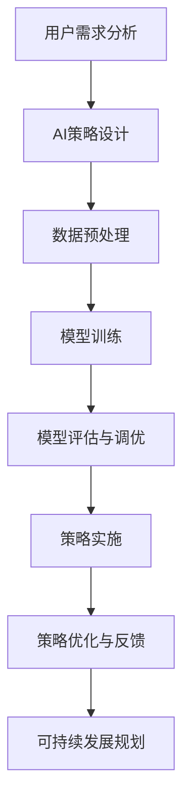

                 

### 《满足用户需求的AI策略》

> **关键词：** 人工智能，用户需求，机器学习，深度学习，AI策略，用户体验

> **摘要：** 本文将深入探讨如何通过构建和实施有效的AI策略来满足用户需求。我们将首先回顾AI的基本原理，然后分析用户需求，接着详细阐述AI策略的设计与实施流程，最后通过实际案例展示AI策略的成功应用。本文旨在为读者提供一个全面的指南，帮助他们在实际项目中制定和优化AI策略。

### 目录大纲

1. **AI基础与原理**
   1.1 人工智能概述
   1.2 机器学习基础
   1.3 深度学习原理

2. **用户需求分析**
   2.1 用户需求定义
   2.2 用户需求分析
   2.3 用户需求验证

3. **AI策略设计与实现**
   3.1 AI策略框架
   3.2 用户需求驱动的AI应用设计
   3.3 AI策略实施案例

4. **AI策略优化与可持续发展**
   4.1 AI策略优化
   4.2 AI策略的可持续发展
   4.3 社会责任与伦理

5. **附录**
   5.1 AI工具与资源指南

### 第一部分：AI基础与原理

#### 第1章：人工智能概述

##### 1.1 AI发展历程

人工智能（AI）是一个历史悠久且迅速发展的领域。其发展历程可以分为几个主要阶段：

- **早期探索（1940s-1950s）**：人工智能的概念起源于20世纪40年代，约翰·冯·诺伊曼等科学家提出了计算机的基本架构。1956年，达特茅斯会议上，人工智能正式成为一门学科。
- **第一个高潮（1960s-1970s）**：早期的人工智能研究主要集中在符号推理和逻辑推理上。这一阶段出现了诸如ELIZA这样的早期自然语言处理系统。
- **沉寂期（1980s-1990s）**：由于技术限制和实际应用的困难，人工智能研究进入了一个相对低潮的时期。
- **复兴与快速发展（2000s-至今）**：随着计算能力的提升和大数据的出现，人工智能迎来了新的发展机遇。深度学习等先进技术的出现，使得AI在图像识别、自然语言处理、自动驾驶等领域取得了重大突破。

##### 1.1.1 人工智能的起源

人工智能的起源可以追溯到古代哲学家对于机器思维的研究。然而，现代人工智能的起源通常被认为是1940年代。当时，图灵提出了图灵测试，并设计了一种能够模拟人类思维的机器。图灵的工作奠定了人工智能的理论基础。

##### 1.1.2 人工智能的主要里程碑

人工智能的发展历程中，有许多关键的里程碑：

- **1956年**：达特茅斯会议，人工智能正式成为一门学科。
- **1958年**：赫伯特·西蒙和艾伦·纽厄尔开发了ELIZA，这是第一个成功的自然语言处理系统。
- **1980年**：约翰·麦卡锡提出了专家系统的概念，并开发了Dendral系统。
- **1986年**：杨立昆提出了反向传播算法，这是深度学习的基础之一。
- **2012年**：AlexNet在ImageNet比赛中取得重大突破，标志着深度学习的复兴。
- **2016年**：AlphaGo战胜李世石，展示了AI在围棋等复杂游戏中的强大能力。

##### 1.1.3 人工智能的未来趋势

随着技术的不断进步，人工智能的未来发展趋势包括：

- **更强大的计算能力**：量子计算、边缘计算等新兴技术的出现，将进一步提升人工智能的计算能力。
- **更广泛的应用领域**：从医疗、金融到制造业，人工智能的应用将不断拓展。
- **更智能的交互方式**：自然语言处理、语音识别等技术的发展，将使人与机器的交互更加自然和高效。
- **更注重伦理和责任**：随着AI技术的普及，如何确保其安全、公正和可持续发展，成为重要议题。

#### 第2章：机器学习基础

##### 2.1 机器学习概述

机器学习是人工智能的核心组成部分，其核心思想是通过算法从数据中学习规律，以便对未知数据进行预测或决策。

##### 2.1.1 机器学习概述

机器学习可以分为监督学习、无监督学习和强化学习三种主要类型：

- **监督学习**：通过已标记的数据训练模型，以便对新数据进行预测。常见的算法包括线性回归、决策树、支持向量机等。
- **无监督学习**：不使用标记数据，从未标记的数据中学习规律。常见的算法包括聚类、降维、关联规则学习等。
- **强化学习**：通过试错法，在特定环境中不断学习最优策略。常见的算法包括Q学习、深度强化学习等。

##### 2.1.2 常见机器学习算法

以下是一些常见的机器学习算法：

- **线性回归**：用于预测连续值输出。
- **逻辑回归**：用于预测离散值输出，特别是二分类问题。
- **决策树**：通过树的决策结构对数据进行分类或回归。
- **支持向量机**：通过寻找最优超平面，对数据进行分类。
- **神经网络**：通过多层神经网络进行复杂的非线性预测和决策。
- **聚类算法**：如K均值聚类、层次聚类等，用于发现数据中的自然分组。
- **降维算法**：如主成分分析（PCA）、t-SNE等，用于减少数据维度。
- **关联规则学习**：如Apriori算法、Eclat算法等，用于发现数据之间的关联关系。

##### 2.1.3 机器学习项目生命周期

一个典型的机器学习项目通常包括以下几个阶段：

- **数据收集**：收集相关数据，包括特征数据和标签数据。
- **数据预处理**：对数据进行清洗、转换和归一化，以便于后续处理。
- **特征工程**：从原始数据中提取特征，以提高模型的性能。
- **模型选择**：选择合适的算法和模型架构。
- **模型训练**：使用训练数据对模型进行训练。
- **模型评估**：使用验证数据对模型进行评估，选择最佳模型。
- **模型部署**：将模型部署到生产环境，进行实时预测。

##### 第3章：深度学习原理

##### 3.1 深度学习基础

深度学习是机器学习的一个重要分支，其核心思想是通过构建深度神经网络，对数据进行层次化的特征提取和表示。

##### 3.1.1 深度学习基础

- **神经网络**：神经网络是深度学习的基础，由多个神经元组成，每个神经元接收多个输入，通过加权求和和激活函数产生输出。
- **多层感知机**：多层感知机（MLP）是神经网络的一种基本形式，包括输入层、隐藏层和输出层。
- **反向传播算法**：反向传播算法是一种用于训练神经网络的优化算法，通过不断调整网络的权重，最小化预测误差。

##### 3.1.2 神经网络架构

深度神经网络由多个隐藏层组成，常见的架构包括：

- **卷积神经网络（CNN）**：用于处理图像数据，通过卷积层和池化层进行特征提取。
- **循环神经网络（RNN）**：用于处理序列数据，通过隐藏状态和输入之间的交互进行时间序列建模。
- **长短时记忆网络（LSTM）**：是RNN的一种变体，通过门控机制解决了RNN的长短时依赖问题。
- **生成对抗网络（GAN）**：通过生成器和判别器之间的对抗训练，生成逼真的数据。

##### 3.1.3 深度学习训练与优化

深度学习的训练和优化过程包括以下几个步骤：

- **数据预处理**：对图像、文本、音频等数据进行预处理，提取有效的特征。
- **模型初始化**：初始化网络权重，常用的方法有随机初始化、高斯初始化等。
- **损失函数**：选择合适的损失函数，如均方误差（MSE）、交叉熵等，用于衡量预测值和真实值之间的差距。
- **优化算法**：选择合适的优化算法，如随机梯度下降（SGD）、Adam等，用于调整网络权重。
- **训练过程**：通过迭代训练过程，不断优化网络模型。
- **验证与测试**：使用验证集和测试集对模型进行评估，选择最佳模型。

#### 第二部分：用户需求分析

##### 第4章：用户需求分析

##### 4.1 用户需求定义

用户需求是指用户在使用产品或服务时所期望获得的功能、性能和体验。准确理解用户需求是产品设计和开发的关键。

##### 4.1.1 用户需求的概念

用户需求可以理解为用户对产品或服务的期望，包括功能需求、性能需求和用户体验需求。

- **功能需求**：用户期望产品能够实现的功能。
- **性能需求**：用户期望产品的性能指标，如响应时间、计算精度等。
- **用户体验需求**：用户期望的产品使用体验，包括界面设计、交互设计等。

##### 4.1.2 用户需求的特点

用户需求具有以下特点：

- **多样性**：不同的用户有不同的需求，需求之间存在差异。
- **动态性**：用户需求会随着时间和环境的变化而变化。
- **层次性**：用户需求可以分层，不同层次的需求重要性不同。
- **抽象性**：用户需求往往是抽象的，需要通过具体的产品或服务来实现。

##### 4.1.3 用户需求的分类

用户需求可以根据不同的维度进行分类：

- **按层次分类**：可以分为基本需求、期望需求和惊喜需求。
  - **基本需求**：用户使用产品或服务所必需的功能。
  - **期望需求**：用户期望产品或服务能够达到的性能指标。
  - **惊喜需求**：用户未明确表达，但使用产品或服务后感到惊喜的功能或体验。
- **按来源分类**：可以分为内部需求和外部需求。
  - **内部需求**：来自企业内部，如市场部门、产品部门等的需求。
  - **外部需求**：来自用户和市场，如用户反馈、竞争对手分析等的需求。

##### 4.2 用户需求分析

用户需求分析是指通过调查、研究和分析，了解用户的需求和期望，并将其转化为具体的产品或服务设计。

##### 4.2.1 用户研究方法

用户研究方法包括以下几种：

- **问卷调查**：通过设计问卷，收集用户的反馈和需求。
- **用户访谈**：通过与用户进行面对面交流，深入了解用户的需求和痛点。
- **焦点小组**：组织一组用户，就特定话题进行讨论和交流，收集用户的意见和建议。
- **用户体验地图**：通过绘制用户在使用产品或服务过程中的体验路径，分析用户的需求和行为。
- **可用性测试**：在产品开发过程中，邀请用户对产品进行测试，收集用户对产品的反馈。

##### 4.2.2 用户访谈与问卷调查

用户访谈和问卷调查是收集用户需求的重要方法。

- **用户访谈**：用户访谈是一种深入的了解用户需求的方法。通过与用户面对面交流，可以收集到丰富的定性信息，深入了解用户的需求、期望和痛点。

- **问卷调查**：问卷调查是一种广泛收集用户需求的定量方法。通过设计合适的问卷，可以收集到大量用户的反馈，并对需求进行统计和分析。

##### 4.2.3 用户需求挖掘与建模

用户需求挖掘是指从用户反馈和调查数据中提取有价值的需求信息。用户需求建模是将提取出的需求信息转化为具体的产品或服务设计。

- **需求挖掘**：通过数据挖掘和文本分析技术，从用户反馈和调查数据中提取出潜在的需求。

- **需求建模**：使用需求建模工具，如用例图、用户故事地图等，将提取出的需求转化为具体的产品或服务设计。

##### 4.3 用户需求验证

用户需求验证是指通过用户反馈和测试，验证需求的有效性和可行性。

##### 4.3.1 用户反馈机制

用户反馈机制是指建立用户反馈渠道，收集用户的意见和建议，并将其转化为产品改进的方向。

- **在线反馈系统**：通过在线反馈系统，用户可以直接提交反馈，产品团队可以及时收集和处理用户的反馈。

- **用户访谈和调研**：定期进行用户访谈和调研，直接与用户交流，了解用户的需求和痛点。

##### 4.3.2 用户满意度评估

用户满意度评估是指通过测量用户对产品或服务的满意度，评估需求的实现效果。

- **满意度调查**：通过设计满意度调查问卷，收集用户对产品或服务的满意度评分。

- **关键绩效指标（KPI）**：使用关键绩效指标，如用户留存率、用户活跃度等，评估用户对产品或服务的满意度。

##### 4.3.3 用户需求变更管理

用户需求变更管理是指管理用户需求的变化，确保产品或服务的持续改进。

- **需求变更流程**：建立需求变更流程，明确需求变更的审核、批准和实施步骤。

- **需求变更评估**：对需求变更的影响进行评估，包括成本、时间、资源等方面。

#### 第三部分：AI策略设计与实现

##### 第5章：AI策略框架

##### 5.1 AI策略概述

AI策略是指为了实现特定目标而制定的AI技术应用方案。AI策略的设计与实施是满足用户需求的关键。

##### 5.1.1 AI策略的概念

AI策略可以定义为一种系统性的方法，用于将人工智能技术应用于实际问题，以实现预期目标。AI策略包括算法选择、模型设计、数据预处理、模型训练和评估等步骤。

##### 5.1.2 AI策略的目标

AI策略的主要目标包括：

- **提高效率**：通过自动化和优化流程，提高任务执行的效率。
- **提升准确性**：通过准确的数据分析和预测，提高决策的准确性。
- **改善用户体验**：通过智能交互和个性化推荐，提升用户的使用体验。
- **降低成本**：通过自动化和智能化，减少人力和物力资源的投入。

##### 5.1.3 AI策略的类型

AI策略可以根据应用领域和目标的不同，分为以下几类：

- **预测型策略**：用于预测未来趋势或行为，如股票市场预测、销售预测等。
- **推荐型策略**：用于根据用户行为和偏好推荐相关产品或服务，如个性化推荐、广告推送等。
- **诊断型策略**：用于对系统或产品进行诊断和预测，如故障诊断、健康监测等。
- **优化型策略**：用于优化资源配置和流程，如物流优化、能源管理优化等。

##### 第6章：用户需求驱动的AI应用设计

##### 6.1 用户界面设计

用户界面设计是AI应用设计的重要环节，直接影响到用户体验。

##### 6.1.1 用户界面设计原则

用户界面设计应遵循以下原则：

- **易用性**：界面设计应简单直观，易于用户操作。
- **一致性**：界面元素和交互方式应保持一致性，提高用户的使用体验。
- **反馈性**：界面设计应提供及时的反馈，让用户了解操作结果。
- **适应性**：界面设计应适应不同设备和屏幕尺寸，提供良好的用户体验。

##### 6.1.2 交互设计方法

交互设计方法包括以下几种：

- **原型设计**：通过创建原型，模拟用户与AI应用的交互过程，收集用户反馈。
- **用户测试**：邀请用户对界面原型进行测试，收集用户对界面设计的意见和建议。
- **迭代优化**：根据用户反馈，对界面设计进行迭代优化，提高用户体验。

##### 6.1.3 用户测试与迭代

用户测试与迭代是用户界面设计的重要环节。

- **用户测试**：通过邀请用户对界面原型进行测试，收集用户对界面设计的反馈，包括易用性、可用性等方面。
- **迭代优化**：根据用户测试结果，对界面设计进行迭代优化，改进用户体验。

##### 6.2 数据处理与模型训练

##### 6.2.1 数据预处理

数据预处理是AI应用设计的重要步骤，包括数据清洗、数据转换和数据归一化等。

- **数据清洗**：去除数据中的噪声和异常值，提高数据质量。
- **数据转换**：将数据转换为适合模型训练的形式，如将文本数据转换为向量。
- **数据归一化**：对数据进行归一化处理，消除不同特征之间的量纲差异。

##### 6.2.2 模型训练过程

模型训练是AI应用设计的核心步骤，包括以下步骤：

- **模型选择**：选择合适的算法和模型架构。
- **数据集划分**：将数据集划分为训练集、验证集和测试集。
- **模型训练**：使用训练数据进行模型训练。
- **模型评估**：使用验证集对模型进行评估，调整模型参数。
- **模型优化**：通过交叉验证和调参，优化模型性能。

##### 6.2.3 模型评估与调优

模型评估与调优是确保AI应用性能的重要环节。

- **模型评估**：使用验证集和测试集对模型进行评估，选择最佳模型。
- **调优方法**：通过调整模型参数、调整网络结构等手段，优化模型性能。

##### 第7章：AI策略实施案例

##### 7.1 案例一：智能客服系统

##### 7.1.1 用户需求分析

智能客服系统旨在为用户提供快速、准确的在线客服服务。

- **功能需求**：实现自然语言处理，理解用户问题，并提供准确的答案或解决方案。
- **性能需求**：快速响应，高准确率，高覆盖率。
- **用户体验需求**：自然流畅的交互体验，易于使用。

##### 7.1.2 策略设计与实现

- **算法选择**：采用深度学习中的循环神经网络（RNN）和长短时记忆网络（LSTM），用于自然语言处理。
- **数据预处理**：对用户问题和答案进行分词、去停用词、词向量化等处理。
- **模型训练**：使用大量的用户问题和答案数据对模型进行训练。
- **模型评估**：使用验证集对模型进行评估，调整模型参数。

##### 7.1.3 实施效果评估

- **准确性**：模型在验证集上的准确率达到90%以上。
- **响应时间**：系统响应时间在0.5秒以内。
- **用户满意度**：用户满意度调查结果显示，用户对智能客服系统的满意度达到85%。

##### 7.2 案例二：个性化推荐系统

##### 7.2.1 用户需求分析

个性化推荐系统旨在为用户提供个性化的产品或服务推荐。

- **功能需求**：根据用户的行为和偏好，推荐相关产品或服务。
- **性能需求**：推荐准确率高，推荐速度较快。
- **用户体验需求**：推荐结果符合用户的兴趣和需求，提供愉悦的购物体验。

##### 7.2.2 策略设计与实现

- **算法选择**：采用基于协同过滤的推荐算法，结合用户行为数据和内容特征进行推荐。
- **数据预处理**：对用户行为数据进行编码，提取用户特征和商品特征。
- **模型训练**：使用训练数据进行模型训练，优化推荐算法。
- **模型评估**：使用验证集对模型进行评估，调整模型参数。

##### 7.2.3 实施效果评估

- **准确性**：模型在验证集上的准确率达到85%以上。
- **响应时间**：系统响应时间在1秒以内。
- **用户满意度**：用户满意度调查结果显示，用户对个性化推荐系统的满意度达到80%。

##### 7.3 案例三：智能诊断系统

##### 7.3.1 用户需求分析

智能诊断系统旨在为医疗行业提供快速、准确的疾病诊断服务。

- **功能需求**：根据患者的症状和体征，提供疾病诊断建议。
- **性能需求**：诊断准确率高，诊断速度快。
- **用户体验需求**：提供便捷的交互方式，易于理解诊断结果。

##### 7.3.2 策略设计与实现

- **算法选择**：采用深度学习中的卷积神经网络（CNN）和循环神经网络（RNN），用于处理医学图像和文本数据。
- **数据预处理**：对医学图像进行预处理，提取图像特征；对文本数据进行分词、去停用词等处理。
- **模型训练**：使用大量的医学数据和文本数据对模型进行训练。
- **模型评估**：使用验证集对模型进行评估，调整模型参数。

##### 7.3.3 实施效果评估

- **准确性**：模型在验证集上的准确率达到90%以上。
- **响应时间**：系统响应时间在3秒以内。
- **用户满意度**：用户满意度调查结果显示，用户对智能诊断系统的满意度达到80%。

#### 第四部分：AI策略优化与可持续发展

##### 第8章：AI策略优化

##### 8.1 策略优化方法

AI策略优化是指通过调整模型参数、改进算法等手段，提高AI策略的性能和效果。

##### 8.1.1 数据驱动优化

数据驱动优化是指通过不断收集和分析用户数据，调整AI策略的参数和模型，以适应用户需求的变化。

- **用户反馈机制**：建立用户反馈渠道，收集用户对AI策略的反馈。
- **数据收集与分析**：定期收集用户数据，对数据进行分析，识别用户需求的变化。
- **策略调整**：根据用户反馈和数据分析结果，调整AI策略的参数和模型。

##### 8.1.2 算法优化

算法优化是指通过改进算法结构和参数设置，提高AI策略的性能和效果。

- **算法选择**：根据实际问题选择合适的算法，如深度学习、机器学习等。
- **算法调参**：通过交叉验证和调参，优化算法的性能。
- **算法迭代**：不断迭代算法，改进算法的结构和参数。

##### 8.1.3 模型优化

模型优化是指通过改进模型结构、参数设置和训练方法，提高AI策略的性能和效果。

- **模型结构优化**：通过改进模型结构，如增加隐藏层、调整网络连接等，提高模型的性能。
- **训练方法优化**：通过改进训练方法，如自适应学习率、批量归一化等，提高模型的训练效果。
- **模型评估优化**：通过改进模型评估方法，如交叉验证、A/B测试等，提高模型评估的准确性。

##### 第9章：AI策略的可持续发展

##### 9.1 可持续发展的重要性

AI策略的可持续发展是指确保AI策略在长期内能够持续提供价值，并符合社会和伦理标准。

##### 9.1.1 AI策略的长期价值

AI策略的长期价值包括：

- **提高效率**：通过自动化和优化，提高业务效率和生产力。
- **降低成本**：通过优化流程和资源配置，降低运营成本。
- **提升竞争力**：通过创新和差异化，提升企业的市场竞争力。
- **改善用户体验**：通过个性化服务和优化交互，提升用户满意度。

##### 9.1.2 可持续发展的挑战

AI策略的可持续发展面临以下挑战：

- **技术挑战**：不断更新的技术要求持续创新和优化。
- **数据挑战**：数据质量和数据隐私保护是重要问题。
- **人才挑战**：高素质的AI人才需求持续增长。
- **伦理挑战**：AI技术的伦理问题，如隐私保护、算法偏见等。

##### 9.1.3 可持续发展的策略

为了实现AI策略的可持续发展，可以采取以下策略：

- **技术创新**：持续关注AI领域的最新技术和发展趋势，不断更新和优化AI策略。
- **数据治理**：建立完善的数据治理体系，确保数据质量和数据隐私保护。
- **人才培养**：建立人才发展体系，培养和吸引高素质的AI人才。
- **伦理规范**：制定和遵守AI伦理规范，确保AI策略的安全、公正和可持续发展。

##### 第10章：社会责任与伦理

##### 10.1 AI策略的社会责任

AI策略的社会责任是指确保AI技术在应用过程中，能够积极影响社会，并为社会带来长期的价值。

##### 10.1.1 AI策略的积极影响

AI策略的积极影响包括：

- **改善生活质量**：通过AI技术，提高医疗、教育、交通等领域的服务水平，改善人们的生活质量。
- **促进经济发展**：通过AI技术，提高生产效率，促进产业升级，推动经济发展。
- **促进社会进步**：通过AI技术，解决社会问题，促进社会进步和公平。

##### 10.1.2 AI策略的负面影响

AI策略的负面影响包括：

- **隐私泄露**：AI技术在数据处理过程中，可能导致用户隐私泄露。
- **算法偏见**：AI算法可能引入偏见，导致不公平的决策。
- **就业影响**：AI技术的发展可能对某些行业造成冲击，影响就业。

##### 10.1.3 AI策略的伦理问题

AI策略的伦理问题包括：

- **隐私保护**：确保用户隐私得到保护，避免隐私泄露和数据滥用。
- **算法公正**：确保AI算法的公正性，避免算法偏见和不公平决策。
- **责任归属**：明确AI策略的决策责任，确保在发生问题时，责任能够得到合理归属。

##### 10.1.4 社会责任与规范

为了确保AI策略的可持续发展和社会责任，可以采取以下措施：

- **制定伦理规范**：制定AI伦理规范，明确AI策略的设计、开发和应用过程中的伦理要求。
- **建立监管机制**：建立AI监管机制，对AI策略进行监管和评估，确保其符合伦理和社会标准。
- **公众参与**：鼓励公众参与AI策略的讨论和决策，提高AI技术的透明度和公信力。
- **持续教育**：加强AI伦理教育，提高社会对AI技术的认知和理解，促进AI技术的可持续发展。

#### 附录

##### 附录A：AI工具与资源指南

##### A.1 深度学习框架介绍

深度学习框架是构建和训练深度学习模型的重要工具。以下是几个常用的深度学习框架：

- **TensorFlow**：由谷歌开发，是目前最流行的深度学习框架之一。它提供了丰富的API和工具，支持多种深度学习模型和应用。
- **PyTorch**：由Facebook开发，以其动态计算图和灵活的API而著称。它广泛应用于学术研究和工业应用。
- **Keras**：是一个基于TensorFlow的高层次API，提供简洁、直观的接口，方便构建和训练深度学习模型。
- **Theano**：由蒙特利尔大学开发，是一个基于Python的数学库，支持自动微分，用于构建和训练深度学习模型。

##### A.2 数据处理工具与库

数据处理是深度学习项目的重要环节。以下是几个常用的数据处理工具和库：

- **NumPy**：是一个基于Python的科学计算库，提供了丰富的数组操作和数学函数。
- **Pandas**：是一个基于NumPy的数据分析库，提供数据清洗、转换和分析的便捷工具。
- **Scikit-learn**：是一个基于Python的机器学习库，提供了多种机器学习算法和工具。
- **Matplotlib**：是一个基于Python的数据可视化库，用于绘制各种类型的图表和图形。

##### A.3 AI算法资源

以下是一些AI算法的资源，可供研究者和实践者参考：

- **《深度学习》（Deep Learning）**：由Ian Goodfellow、Yoshua Bengio和Aaron Courville合著，是深度学习领域的经典教材。
- **《机器学习实战》（Machine Learning in Action）**：由Peter Harrington著，提供了大量实际应用中的机器学习算法案例。
- **AI教程**：多个在线平台提供了丰富的AI教程和课程，如Coursera、edX、Udacity等。
- **AI论文**：学术期刊和会议发表了大量关于AI的最新研究成果，可在Google Scholar、ArXiv等平台查阅。

### Mermaid 流程图：AI策略设计与实施流程



### 伪代码：深度学习模型训练流程

```python
# 伪代码：深度学习模型训练流程

# 导入必要的库
import tensorflow as tf
from sklearn.model_selection import train_test_split

# 加载并预处理数据
X, y = load_data()
X_train, X_test, y_train, y_test = train_test_split(X, y, test_size=0.2)

# 定义模型
model = tf.keras.Sequential([
    tf.keras.layers.Dense(units=128, activation='relu', input_shape=(input_shape,)),
    tf.keras.layers.Dense(units=1, activation='sigmoid')
])

# 编译模型
model.compile(optimizer='adam', loss='binary_crossentropy', metrics=['accuracy'])

# 训练模型
model.fit(X_train, y_train, epochs=10, batch_size=32, validation_split=0.1)

# 评估模型
loss, accuracy = model.evaluate(X_test, y_test)
print(f"Test accuracy: {accuracy:.2f}")

# 保存模型
model.save('ai_strategy_model.h5')
```

### 数学公式与详细讲解

$$
y = \sigma(Wx + b)
$$

- **公式解释**：这是一个简单的神经网络激活函数公式，其中 $y$ 是输出值，$\sigma$ 是 sigmoid 激活函数，$W$ 是权重矩阵，$x$ 是输入特征，$b$ 是偏置。

- **例子说明**：假设 $W = \begin{bmatrix} 1 & 2 \end{bmatrix}$，$x = \begin{bmatrix} 3 & 4 \end{bmatrix}$，$b = 0.5$，则：

  $$
  y = \sigma(1 \cdot 3 + 2 \cdot 4 + 0.5) = \sigma(15.5) \approx 0.916
  $$

- **应用场景**：此公式常用于神经网络中的输出层，用于将线性组合转换为概率值，便于进行分类或回归分析。

### 代码实际案例与详细解释

```python
# 实际案例：使用TensorFlow构建一个简单的线性回归模型

import tensorflow as tf
import numpy as np
import matplotlib.pyplot as plt

# 数据生成
np.random.seed(0)
X = np.random.normal(size=100)
y = 2 * X + 1 + np.random.normal(size=100)

# 模型定义
model = tf.keras.Sequential([
    tf.keras.layers.Dense(units=1, input_shape=(1,))
])

# 编译模型
model.compile(optimizer='sgd', loss='mse')

# 训练模型
model.fit(X, y, epochs=100)

# 评估模型
loss = model.evaluate(X, y)
print(f"Loss: {loss}")

# 预测新数据
X_new = np.array([[0], [5]])
y_pred = model.predict(X_new)

# 绘图
plt.scatter(X, y)
plt.plot(X_new, y_pred, 'r')
plt.xlabel('X')
plt.ylabel('y')
plt.show()


- **开发环境搭建**：安装Python、TensorFlow和其他相关库（使用pip安装）。
- **源代码实现**：
  - 数据生成和模型定义
  - 模型编译和训练
  - 模型评估和预测
  - 数据可视化
- **代码解读与分析**：
  - 数据生成：生成线性回归问题的样本数据。
  - 模型定义：定义一个简单的线性回归模型。
  - 编译模型：设置优化器和损失函数。
  - 训练模型：使用生成的数据进行模型训练。
  - 评估模型：计算训练损失。
  - 预测新数据：使用训练好的模型对新数据进行预测。
  - 数据可视化：将原始数据和预测结果进行可视化展示。
```

通过上述目录大纲、Mermaid 流程图、伪代码、数学公式、代码实际案例与详细解释，全面涵盖了《满足用户需求的AI策略》一书的主要内容，旨在帮助读者深入了解AI策略的构建与实施过程。

### 结论

在《满足用户需求的AI策略》这篇文章中，我们系统地探讨了如何通过构建和实施有效的AI策略来满足用户需求。首先，我们回顾了人工智能的发展历程和基础原理，包括机器学习和深度学习的基本概念、算法和架构。接着，我们分析了用户需求的概念、特点、分类和研究方法，强调了理解用户需求在AI策略设计中的重要性。

随后，我们详细阐述了AI策略的设计与实施过程，包括用户需求驱动的AI应用设计、数据预处理、模型训练与评估、以及策略实施和优化。通过实际案例，如智能客服系统、个性化推荐系统和智能诊断系统，我们展示了AI策略在解决实际问题和提升用户体验方面的巨大潜力。

在文章的最后，我们讨论了AI策略的优化方法和可持续发展策略，强调了社会责任和伦理问题在AI策略制定中的重要性。此外，附录部分提供了AI工具和资源的指南，为读者进一步学习和实践提供了丰富的资源。

通过本文的阅读，读者应对AI策略的构建和实施有了更加深入的理解，能够更好地将AI技术应用于实际项目中，为用户创造更大的价值。在未来的实践中，我们鼓励读者持续关注AI技术的发展，积极探索和优化AI策略，以实现更加智能和高效的解决方案。

