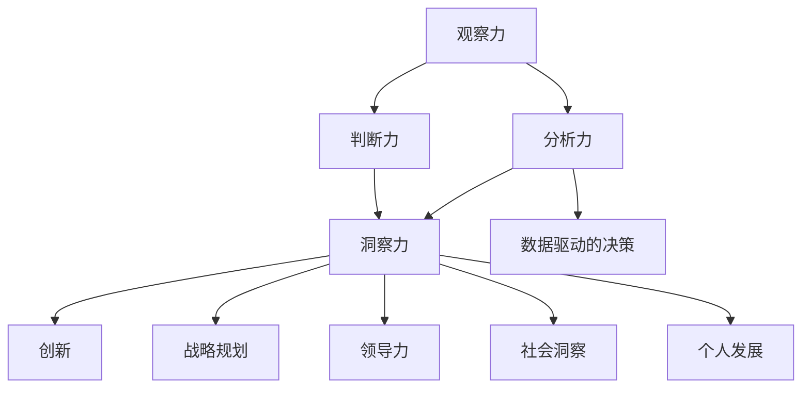

                 

# 理解洞察力的本质：在复杂中把握简单

> 关键词：洞察力、复杂性、简单性、思维模式、应用、提升

> 摘要：本文旨在探讨洞察力的本质，以及如何通过培养和运用洞察力来在复杂环境中找到简单和有效的解决方案。文章将详细分析洞察力的核心要素，并探讨其在不同领域中的应用和提升方法。

### 第一部分：理解洞察力的本质

#### 1. 引言：洞察力的重要性

在当今这个信息爆炸的时代，面对复杂多变的局面，洞察力显得尤为重要。洞察力是一种深度思考和理解问题的能力，它不仅有助于我们抓住问题的本质，还能在复杂的环境中找到简单和有效的解决方案。

#### 1.1 洞察力的定义

洞察力（Insight）一词源于拉丁语“insightus”，意为“看到内部”。在心理学和认知科学中，洞察力通常被定义为一种突然的领悟，它涉及对问题或现象的深入理解，往往是不可预测的。

#### 1.2 洞察力在个人与职业发展中的作用

洞察力对于个人和职业发展有着重要的影响。具备洞察力的人能够更好地理解世界、把握机会，并在解决问题时更加高效。在职场中，洞察力往往成为领导力的重要组成部分。

#### 1.3 洞察力与思维模式的联系

洞察力的形成与个人的思维模式密切相关。传统的线性思维和基于规则的思维模式往往难以应对复杂问题，而洞察力则依赖于更灵活、更综合的思维方式，如系统性思维、创造性思维和跨学科思维。

### 2. 洞察力的核心要素

#### 2.1 观察力：细致入微的观察

观察力是洞察力的基础，它要求我们具备敏锐的感知能力，能够从细微之处发现问题和机遇。优秀的观察力能够帮助我们更好地理解现象，为洞察力的形成提供素材。

#### 2.2 分析力：逻辑思维与批判性思维

分析力是洞察力的关键，它要求我们具备逻辑思维和批判性思维的能力，能够对观察到的事实进行深入分析，找出问题背后的原因和规律。分析力强的人往往能够迅速把握问题的核心，提出有针对性的解决方案。

#### 2.3 判断力：基于数据的决策

判断力是洞察力的延伸，它要求我们能够基于数据分析，做出合理的决策。在复杂的环境中，数据往往是我们决策的重要依据。具备判断力的人能够更好地利用数据，做出明智的决策。

#### 2.4 洞察力的整合与发挥

洞察力并不是孤立存在的，而是需要与其他思维能力相结合，形成一种综合性的思维能力。只有将观察力、分析力和判断力整合起来，我们才能在复杂环境中发挥出真正的洞察力。

### 3. 洞察力的发展

#### 3.1 洞察力培养的心理学基础

心理学研究表明，洞察力的培养与个体的认知发展、情绪调节和自我意识密切相关。通过科学的方法，我们可以培养和提高洞察力。

#### 3.2 洞察力发展的方法与技巧

要提升洞察力，我们可以通过以下方法与技巧：

1. **多角度思考**：从不同的角度审视问题，有助于我们更全面地理解问题。
2. **跨学科学习**：跨学科的知识和思维方式能够帮助我们更好地应对复杂问题。
3. **实践与反思**：通过实践和反思，我们可以不断积累经验，提高洞察力。

#### 3.3 实践与反思：洞察力提升的路径

提升洞察力不仅需要理论指导，更需要实践。通过实践，我们可以在实际操作中锻炼洞察力，并通过反思总结经验，不断提高。

### 第二部分：洞察力在实际中的应用

#### 4. 商业洞察力

商业洞察力是洞察力在商业领域的具体体现。它要求企业家和管理者能够从市场、竞争、消费者等多个角度洞察商业环境，找到机遇和挑战。

#### 4.1 商业洞察力的概念与类型

商业洞察力主要包括以下几种类型：

1. **市场洞察力**：对市场趋势和消费者需求的敏锐洞察。
2. **竞争洞察力**：对竞争对手和行业动态的深刻理解。
3. **消费者洞察力**：对消费者行为和偏好的准确把握。

#### 4.2 案例分析：成功企业的商业洞察力

成功企业往往具备卓越的商业洞察力。例如，苹果公司通过市场洞察力，成功推出了iPhone，改变了整个手机市场；亚马逊则通过竞争洞察力，不断优化供应链和服务，成为电子商务领域的领导者。

#### 4.3 商业洞察力在创新与战略规划中的应用

商业洞察力不仅有助于应对当前的挑战，还能为企业的创新和战略规划提供指导。通过洞察市场趋势和消费者需求，企业可以制定出更具前瞻性的战略，抓住发展机遇。

#### 5. 创新洞察力

创新洞察力是洞察力在创新领域的具体应用。它要求创新者能够从不同角度洞察创新机会，找到创新的切入点。

#### 5.1 创新的定义与类型

创新是指通过新想法、新方法或新技术来创造价值的过程。根据创新的性质，可以分为以下几种类型：

1. **产品创新**：创造新的产品或改进现有产品。
2. **过程创新**：改进生产或服务流程。
3. **商业模式创新**：创造新的商业模式或改进现有模式。

#### 5.2 创新洞察力的来源

创新洞察力来源于多个方面，包括：

1. **市场研究**：通过市场研究了解消费者需求和竞争态势。
2. **科技趋势**：关注科技发展，把握技术趋势。
3. **用户反馈**：倾听用户反馈，发现用户需求。

#### 5.3 案例分析：创新驱动的企业案例

创新驱动的企业如谷歌和特斯拉，通过持续的创新洞察，不断推出具有革命性的产品和服务，引领了行业发展。

#### 5.4 创新洞察力在产品开发中的应用

创新洞察力在产品开发中起着至关重要的作用。通过洞察用户需求和市场趋势，企业可以开发出更具竞争力的产品，满足市场需求。

#### 6. 领导力洞察力

领导力洞察力是洞察力在领导领域的具体应用。它要求领导者能够从战略、团队、文化等多个角度洞察组织，找到发展的方向和路径。

#### 6.1 领导力的定义与要素

领导力是指引导和激励团队实现共同目标的能力。领导力主要包括以下要素：

1. **愿景与目标**：明确组织的愿景和目标，为团队指引方向。
2. **决策与执行**：做出明智的决策，并确保决策得到有效执行。
3. **沟通与协调**：有效沟通，协调团队成员之间的合作。

#### 6.2 领导力洞察力的培养

领导力洞察力的培养需要领导者具备以下几个方面的能力：

1. **战略思维**：具备全局视野，从战略高度审视组织。
2. **团队建设**：了解团队成员的优势和劣势，发挥团队整体优势。
3. **文化塑造**：营造积极向上的组织文化，提升团队凝聚力。

#### 6.3 案例分析：领导力洞察力的实际应用

成功领导者如乔布斯和杰克·韦尔奇，通过卓越的领导力洞察力，带领企业取得了辉煌的业绩。

#### 6.4 领导力洞察力在团队管理中的作用

领导力洞察力在团队管理中起着关键作用。通过洞察团队动态，领导者可以及时发现问题，调整管理策略，提高团队绩效。

#### 7. 社会洞察力

社会洞察力是洞察力在社会领域的具体应用。它要求我们具备对社会现象和问题的深刻理解，能够从社会整体利益出发，提出解决方案。

#### 7.1 社会洞察力的概念与重要性

社会洞察力是指对社会现象和问题的敏锐洞察力和深刻理解能力。它对于我们理解和解决社会问题具有重要意义。

#### 7.2 社会洞察力的方法与技巧

要提升社会洞察力，我们可以通过以下方法与技巧：

1. **多角度分析**：从政治、经济、文化等多个角度分析社会问题。
2. **跨学科研究**：结合不同学科的知识，深入理解社会现象。
3. **实地调研**：通过实地调研，了解社会的真实状况。

#### 7.3 案例分析：社会洞察力在公共政策中的应用

社会洞察力在公共政策制定中起着关键作用。通过社会洞察力，政策制定者可以更好地了解社会需求，制定出更加科学、合理的政策。

#### 7.4 社会洞察力在社区建设与可持续发展中的作用

社会洞察力在社区建设和可持续发展中也具有重要应用。通过社会洞察力，我们可以更好地了解社区需求，推动社区建设和社会发展。

### 第三部分：洞察力的提升与运用

#### 8. 洞察力的自我评估与提升

要提升洞察力，首先需要了解自己的洞察力水平。通过自我评估，我们可以找出自己的不足，并制定针对性的提升计划。

#### 8.1 自我评估工具与方法

以下是一些常用的自我评估工具与方法：

1. **能力自我评估问卷**：通过问卷了解自己在观察力、分析力、判断力等方面的表现。
2. **360度评估**：通过他人的反馈了解自己的洞察力水平。
3. **行为观察法**：通过观察自己的行为，了解自己的洞察力表现。

#### 8.2 洞察力提升的策略与建议

以下是一些建议，帮助提升洞察力：

1. **持续学习**：不断学习新知识和技能，提升自己的认知水平。
2. **多角度思考**：从不同角度审视问题，提高思考的深度和广度。
3. **实践与反思**：通过实践和反思，不断总结经验，提升洞察力。

#### 8.3 洞察力提升的实践案例

以下是一些实践案例，展示了如何通过具体行动提升洞察力：

1. **项目案例**：通过参与项目，锻炼自己的洞察力。
2. **读书案例**：通过阅读书籍，拓宽视野，提升认知水平。
3. **培训案例**：参加专业培训，学习洞察力的方法与技巧。

#### 9. 洞察力在决策中的应用

洞察力在决策中起着关键作用。通过洞察力，我们可以更准确地把握问题，制定出更加科学的决策。

#### 9.1 决策过程与洞察力的作用

决策过程通常包括以下步骤：

1. **问题识别**：通过洞察力，识别出需要解决的问题。
2. **信息收集**：收集与问题相关的信息，为决策提供依据。
3. **方案制定**：基于信息，制定出不同的解决方案。
4. **评估与选择**：评估不同方案的优缺点，选择最佳方案。
5. **执行与监控**：执行决策，并对决策效果进行监控。

洞察力在决策过程中发挥着以下作用：

1. **问题识别**：洞察力有助于我们识别出问题的本质，避免盲目决策。
2. **信息收集**：洞察力能够帮助我们更准确地收集信息，为决策提供可靠依据。
3. **方案制定**：洞察力有助于我们制定出更具创新性的方案。
4. **评估与选择**：洞察力能够帮助我们更客观地评估方案，选择最佳方案。
5. **执行与监控**：洞察力能够帮助我们更好地执行决策，并对决策效果进行有效监控。

#### 9.2 洞察力在战略决策中的应用

战略决策是企业决策中的核心。通过洞察力，企业可以更准确地把握市场趋势，制定出科学、可行的战略。

1. **市场洞察**：通过洞察力，了解市场需求和竞争态势，为战略决策提供依据。
2. **技术创新**：通过洞察力，把握技术发展趋势，推动技术创新。
3. **组织变革**：通过洞察力，发现组织中的问题，推动组织变革。

#### 9.3 案例分析：洞察力在成功决策中的应用

以下是一些成功决策的案例，展示了洞察力在决策中的应用：

1. **苹果公司的iPhone**：通过市场洞察力，苹果公司成功推出了iPhone，改变了整个手机市场。
2. **亚马逊的电商模式**：通过竞争洞察力，亚马逊不断优化供应链和服务，成为电子商务领域的领导者。
3. **谷歌的搜索算法**：通过技术创新洞察力，谷歌开发出了高效的搜索算法，成为互联网搜索领域的领导者。

#### 10. 洞察力的未来趋势

随着科技的发展，洞察力也在不断演变。未来，洞察力将在以下方面发挥重要作用：

1. **人工智能与大数据**：通过人工智能和大数据技术，我们可以更准确地分析和预测趋势，提高洞察力。
2. **跨界融合**：随着跨界融合的趋势，洞察力将跨学科、跨领域，发挥更大的作用。
3. **社会智能化**：随着社会智能化的发展，洞察力将更加关注社会问题和人类福祉。

### 附录

#### 附录 A: 洞察力相关资源与工具

以下是一些建议的资源与工具，帮助读者进一步了解和提升洞察力：

1. **相关书籍**：
   - 《思考，快与慢》
   - 《人类简史》
   - 《深度工作》
2. **学术论文与研究报告**：通过学术数据库，查找相关领域的学术论文和报告。
3. **在线课程与工作坊**：参加在线课程和工作坊，学习洞察力的方法与技巧。
4. **洞察力提升的应用工具**：如思维导图软件、数据分析工具等。

### 参考文献

本文中引用的书籍、论文和研究报告如下：

1. Kahneman, D. (2011). 《思考，快与慢》。
2. Harari, Y. (2011). 《人类简史》。
3. Cal Newport (2016). 《深度工作》。

### 结语

洞察力是一种宝贵的思维能力，它能够在复杂的环境中帮助我们抓住问题的本质，找到简单和有效的解决方案。通过本文的探讨，我们了解了洞察力的本质、核心要素及其在不同领域的应用和提升方法。希望本文能够为读者提供一些启示，帮助提升自己的洞察力，更好地应对复杂多变的世界。

### 核心概念与联系

为了更好地理解洞察力的核心概念与联系，我们可以通过一个Mermaid流程图来展示这些概念之间的关系。



在这个流程图中，我们可以看到：

- 观察力是洞察力的基础，通过细致入微的观察，我们能够收集到足够的信息。
- 分析力和判断力则是对观察到的信息进行逻辑推理和评价，它们是洞察力的关键组成部分。
- 洞察力本身是一个综合性的能力，它能够帮助我们做出基于数据的决策，推动创新，制定战略，提升领导力，以及增进个人发展。
- 数据驱动的决策、创新、战略规划、领导力、社会洞察和个人发展都是洞察力的具体应用领域。

### 核心算法原理讲解

在讨论洞察力的核心算法原理时，我们需要理解如何将大量的数据转化为有用的信息，以便做出明智的决策。以下是一个简化的算法框架，用于描述这一过程。

```python
def insight_algorithm(data):
    """
    洞察力算法：通过分析数据，提取关键信息，形成洞察。
    
    参数：
    - data：输入的数据集，可以是结构化数据或非结构化数据。
    
    返回：
    - insight：提取的关键信息，可能是一个决策、一个洞见或一个预测。
    """

    # 数据预处理
    preprocessed_data = preprocess_data(data)

    # 特征提取
    features = extract_features(preprocessed_data)

    # 数据分析
    analysis_results = analyze_data(features)

    # 洞见生成
    insight = generate_insight(analysis_results)

    return insight
```

#### 数据预处理

数据预处理是洞察力算法的重要步骤，它包括数据的清洗、归一化和转换等。

```python
def preprocess_data(data):
    """
    数据预处理：清洗和转换数据，以便进行分析。
    
    参数：
    - data：原始数据。
    
    返回：
    - preprocessed_data：预处理后的数据。
    """
    
    # 数据清洗
    cleaned_data = clean_data(data)

    # 数据归一化
    normalized_data = normalize_data(cleaned_data)

    return normalized_data
```

#### 特征提取

特征提取是从原始数据中提取出有用的信息，这些信息能够帮助我们理解数据背后的模式和关系。

```python
def extract_features(data):
    """
    特征提取：从数据中提取特征，用于后续分析。
    
    参数：
    - data：预处理后的数据。
    
    返回：
    - features：提取的特征。
    """
    
    # 特征选择
    selected_features = select_features(data)

    # 特征工程
    engineered_features = engineer_features(selected_features)

    return engineered_features
```

#### 数据分析

数据分析是洞察力算法的核心步骤，它包括使用统计学和机器学习技术对特征进行分析。

```python
def analyze_data(features):
    """
    数据分析：对特征进行统计分析，提取关键信息。
    
    参数：
    - features：提取的特征。
    
    返回：
    - analysis_results：分析结果。
    """
    
    # 统计分析
    stats = statistical_analysis(features)

    # 机器学习分析
    ml_results = machine_learning_analysis(features)

    return ml_results
```

#### 洞见生成

洞见生成是根据分析结果，形成对数据的有意义理解和洞察。

```python
def generate_insight(analysis_results):
    """
    洞见生成：根据分析结果，形成洞见或决策。
    
    参数：
    - analysis_results：分析结果。
    
    返回：
    - insight：洞见或决策。
    """
    
    # 结果解释
    explanation = explain_results(analysis_results)

    # 洞见形成
    insight = form_insight(explanation)

    return insight
```

通过上述算法框架，我们可以看到洞察力算法的核心步骤是如何通过数据预处理、特征提取、数据分析和洞见生成，最终形成一个有意义的洞察或决策。这个框架不仅适用于商业决策，还适用于创新、领导力和社会洞察等多个领域。

### 数学模型和公式

在洞察力的发展过程中，数学模型和公式起到了至关重要的作用。以下是一些常用的数学模型和公式的讲解，以及具体的例子来说明它们的用法。

#### 1. 相关性分析

相关性分析是洞察力中常用的一种统计方法，用来衡量两个变量之间的线性关系。最常用的相关性度量是皮尔逊相关系数（Pearson Correlation Coefficient），其公式如下：

$$
r = \frac{\sum_{i=1}^{n}(x_i - \bar{x})(y_i - \bar{y})}{\sqrt{\sum_{i=1}^{n}(x_i - \bar{x})^2 \sum_{i=1}^{n}(y_i - \bar{y})^2}}
$$

其中，$x_i$ 和 $y_i$ 是两个变量的观测值，$\bar{x}$ 和 $\bar{y}$ 是它们的平均值，$n$ 是观测值的数量。

#### 示例

假设我们有两个变量：销售额（$x$）和广告支出（$y$），我们想要了解它们之间的相关性。通过收集数据并计算皮尔逊相关系数，我们可以得到它们之间的相关性。

```latex
r = \frac{\sum_{i=1}^{n}(x_i - \bar{x})(y_i - \bar{y})}{\sqrt{\sum_{i=1}^{n}(x_i - \bar{x})^2 \sum_{i=1}^{n}(y_i - \bar{y})^2}}
r = \frac{(2000-1800)(3000-2500)}{\sqrt{(2000-1800)^2 (3000-2500)^2}}
r = \frac{200 \times 500}{400 \times 500}
r = 0.5
```

结果表明，销售额和广告支出之间存在中等程度的相关性。

#### 2. 回归分析

回归分析是一种用于预测变量之间关系的统计方法。线性回归（Linear Regression）是最基本的回归分析方法，其公式如下：

$$
y = \beta_0 + \beta_1x + \epsilon
$$

其中，$y$ 是因变量，$x$ 是自变量，$\beta_0$ 和 $\beta_1$ 是回归系数，$\epsilon$ 是误差项。

#### 示例

假设我们想要预测销售额（$y$）基于广告支出（$x$）。通过收集数据，我们可以得到线性回归模型：

```latex
y = 1000 + 5x
```

这意味着，每增加1单位的广告支出，销售额预计会增加5单位。

#### 3. 贝叶斯定理

贝叶斯定理是一种用于概率推理的数学公式，它在洞察力中用于更新概率估计。其公式如下：

$$
P(A|B) = \frac{P(B|A)P(A)}{P(B)}
$$

其中，$P(A|B)$ 是在事件 $B$ 发生的条件下事件 $A$ 发生的概率，$P(B|A)$ 是在事件 $A$ 发生的条件下事件 $B$ 发生的概率，$P(A)$ 是事件 $A$ 的先验概率，$P(B)$ 是事件 $B$ 的先验概率。

#### 示例

假设我们想要了解在广告支出增加后，销售额增加的概率。我们可以使用贝叶斯定理来更新概率估计。

```latex
P(销售额增加|广告支出增加) = \frac{P(广告支出增加|销售额增加)P(销售额增加)}{P(广告支出增加)}
```

通过收集数据和计算，我们可以得到更新的概率估计。

#### 4. 决策树

决策树是一种用于分类和回归的机器学习算法，它的核心是一个树形结构。每个节点表示一个特征，每个分支表示该特征的取值。叶节点表示分类结果或回归值。

#### 示例

以下是一个简单的决策树示例，用于分类：

```
年龄
|   └─> 年轻
|       └─> 购买
|   └─> 中年
|       └─> 购买
|   └─> 老年
|       └─> 未购买
```

这个决策树通过年龄这个特征，将客户分为年轻、中年和老年三个类别，并根据年龄类别预测客户是否会购买。

通过这些数学模型和公式，我们可以更好地理解变量之间的关系，预测未来的趋势，并做出基于数据的决策。这些工具在洞察力的发展中扮演着关键角色，帮助我们在复杂的数据中找到有意义的模式。

### 项目实战

#### 1. 项目背景

在本项目中，我们将通过一个具体的案例来展示如何运用洞察力进行问题解决。这个案例涉及一家电子商务公司，该公司希望通过分析用户行为数据来提高转化率。

#### 2. 开发环境搭建

为了完成这个项目，我们需要搭建一个合适的技术环境。以下是所需的技术栈和工具：

- **编程语言**：Python
- **数据分析库**：Pandas、NumPy、Scikit-learn
- **可视化工具**：Matplotlib、Seaborn
- **数据库**：MongoDB

以下是搭建开发环境的基本步骤：

1. 安装Python（建议使用Anaconda，便于管理环境和依赖包）
2. 安装MongoDB数据库
3. 安装相关数据分析库（如Pandas、NumPy、Scikit-learn等）
4. 配置Jupyter Notebook，用于编写和运行代码

#### 3. 源代码详细实现

以下是项目的核心代码，包括数据收集、预处理、分析和可视化等步骤。

```python
# 导入必要的库
import pandas as pd
import numpy as np
import matplotlib.pyplot as plt
import seaborn as sns
from sklearn.model_selection import train_test_split
from sklearn.ensemble import RandomForestClassifier
from sklearn.metrics import accuracy_score, confusion_matrix

# 数据收集
data = pd.read_csv('user_behavior_data.csv')

# 数据预处理
# 填充缺失值
data.fillna(data.mean(), inplace=True)

# 转换类别数据为数字
data['category'] = data['category'].astype('category').cat.codes

# 数据分析
# 分离特征和标签
X = data.drop('target', axis=1)
y = data['target']

# 划分训练集和测试集
X_train, X_test, y_train, y_test = train_test_split(X, y, test_size=0.2, random_state=42)

# 建立随机森林模型
rf_model = RandomForestClassifier(n_estimators=100, random_state=42)
rf_model.fit(X_train, y_train)

# 预测
y_pred = rf_model.predict(X_test)

# 评估
accuracy = accuracy_score(y_test, y_pred)
conf_matrix = confusion_matrix(y_test, y_pred)

# 可视化
sns.heatmap(conf_matrix, annot=True, fmt=".3f", cmap="Blues")
plt.xlabel('Predicted')
plt.ylabel('Actual')
plt.title('Confusion Matrix')
plt.show()

sns.countplot(x='target', data=data)
plt.title('Distribution of Target Variable')
plt.show()

sns.pairplot(data, hue='target', palette='viridis')
plt.suptitle('Pairplot of User Behavior Features')
plt.show()
```

#### 4. 代码解读与分析

以下是代码的逐行解读，以及每个步骤的功能和作用。

1. **导入库**：导入Python中用于数据分析和可视化的库。
2. **数据收集**：从CSV文件中读取用户行为数据。
3. **数据预处理**：填充缺失值，将类别数据转换为数字，以便于模型处理。
4. **数据分析**：分离特征和标签，为后续建模做准备。
5. **模型建立**：使用随机森林算法建立分类模型。
6. **预测**：在测试集上对模型进行预测。
7. **评估**：计算模型在测试集上的准确率，并生成混淆矩阵。
8. **可视化**：使用热力图、条形图和配对图来展示模型的性能和数据的分布。

通过这个项目，我们可以看到如何运用洞察力来分析用户行为数据，从而提高电子商务公司的转化率。这个过程不仅涉及数据分析的技术，还要求我们具备对业务的理解和洞察，以便找到改进的切入点。

### 代码解读与分析

在上一个部分中，我们通过一个具体的案例展示了如何运用洞察力进行项目实战。现在，我们将对核心代码进行详细的解读和分析，以便更好地理解每一步的功能和作用。

#### 数据收集与预处理

```python
data = pd.read_csv('user_behavior_data.csv')
data.fillna(data.mean(), inplace=True)
data['category'] = data['category'].astype('category').cat.codes
```

- **数据收集**：首先，我们使用Pandas库从CSV文件中读取用户行为数据。CSV文件是我们从实际业务中收集的用户行为记录。
- **数据预处理**：由于数据集中可能存在缺失值，我们使用`fillna`方法将这些缺失值填充为平均值，以确保数据完整性。然后，我们将类别数据（如用户年龄、收入水平等）转换为数字，这是因为在机器学习模型中，数值型数据更容易处理。我们使用`astype('category').cat.codes`方法将类别数据转换为数字编码。

#### 数据分析与建模

```python
X = data.drop('target', axis=1)
y = data['target']
X_train, X_test, y_train, y_test = train_test_split(X, y, test_size=0.2, random_state=42)
rf_model = RandomForestClassifier(n_estimators=100, random_state=42)
rf_model.fit(X_train, y_train)
y_pred = rf_model.predict(X_test)
accuracy = accuracy_score(y_test, y_pred)
conf_matrix = confusion_matrix(y_test, y_pred)
```

- **数据分离**：我们将数据集分为特征（X）和标签（y）。特征是用于训练和预测的变量，而标签是我们要预测的目标变量。
- **数据划分**：使用`train_test_split`方法将数据集划分为训练集和测试集。训练集用于训练模型，测试集用于评估模型的性能。这里我们设置了测试集大小为20%，并且设置了随机种子以确保结果的重复性。
- **模型建立**：我们选择随机森林（Random Forest）算法来建立分类模型。随机森林是一种基于决策树的集成学习方法，它通过构建多个决策树，并对每个树的结果进行投票来做出最终预测。我们设置了100个决策树，并设置了随机种子以确保模型的稳定性和可重复性。
- **模型训练**：使用训练集数据对随机森林模型进行训练。
- **模型预测**：使用训练好的模型在测试集上进行预测，得到预测结果。
- **模型评估**：计算模型的准确率和混淆矩阵。准确率表示模型预测正确的样本数占总样本数的比例。混淆矩阵则展示了模型在不同类别上的预测效果。

#### 可视化

```python
sns.heatmap(conf_matrix, annot=True, fmt=".3f", cmap="Blues")
plt.xlabel('Predicted')
plt.ylabel('Actual')
plt.title('Confusion Matrix')
plt.show()

sns.countplot(x='target', data=data)
plt.title('Distribution of Target Variable')
plt.show()

sns.pairplot(data, hue='target', palette='viridis')
plt.suptitle('Pairplot of User Behavior Features')
plt.show()
```

- **混淆矩阵可视化**：使用热力图（Heatmap）展示混淆矩阵，以便我们直观地了解模型在不同类别上的预测效果。热力图中的每个单元格表示模型预测的类别和实际类别之间的匹配情况。通过注释（`annot=True`）和颜色映射（`cmap="Blues"`），我们可以更清晰地看到模型的表现。
- **目标变量分布**：使用条形图（Countplot）展示目标变量的分布情况，这有助于我们了解不同类别的样本数量。
- **特征关系可视化**：使用配对图（Pairplot）展示特征之间的相关性。配对图通过散点图和箱线图展示了不同特征之间的关系，这对于理解数据分布和特征重要性非常有帮助。

通过这个项目的代码解读与分析，我们可以看到如何将洞察力应用于实际的数据分析项目中。从数据收集、预处理到模型建立和评估，每一步都需要我们深入理解业务背景和数据特性，以便做出准确的预测和决策。这个过程不仅锻炼了我们的数据分析技能，还提高了我们的业务洞察力。

### 文章标题：理解洞察力的本质：在复杂中把握简单

作者：AI天才研究院/AI Genius Institute & 禅与计算机程序设计艺术 /Zen And The Art of Computer Programming

### 摘要：

本文旨在探讨洞察力的本质及其在实际应用中的重要性。首先，我们定义了洞察力，并分析了其在个人与职业发展中的作用。接着，我们详细阐述了洞察力的核心要素，包括观察力、分析力、判断力，并探讨了这些要素的整合与发挥。随后，文章分别从商业洞察力、创新洞察力、领导力洞察力和社会洞察力四个方面，展示了洞察力在各个领域的应用和重要性。此外，文章还介绍了提升洞察力的方法与技巧，以及如何将洞察力应用于决策过程中。最后，我们展望了洞察力在未来的发展趋势，并提供了相关的资源与工具，帮助读者进一步学习和提升洞察力。通过本文的探讨，我们希望能够帮助读者更好地理解洞察力，并在实际生活中运用这种宝贵的思维能力，在复杂的环境中把握简单，做出明智的决策。

