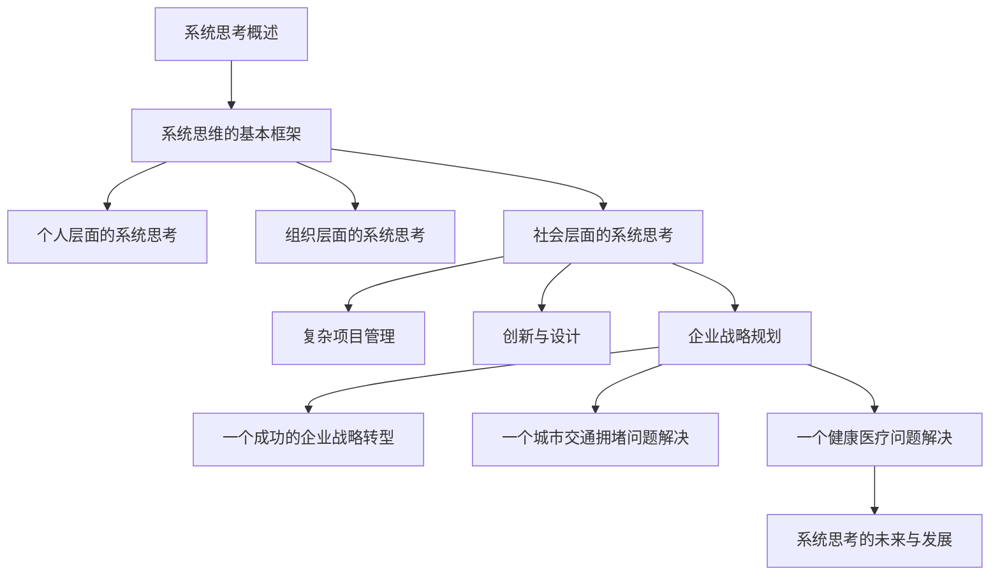
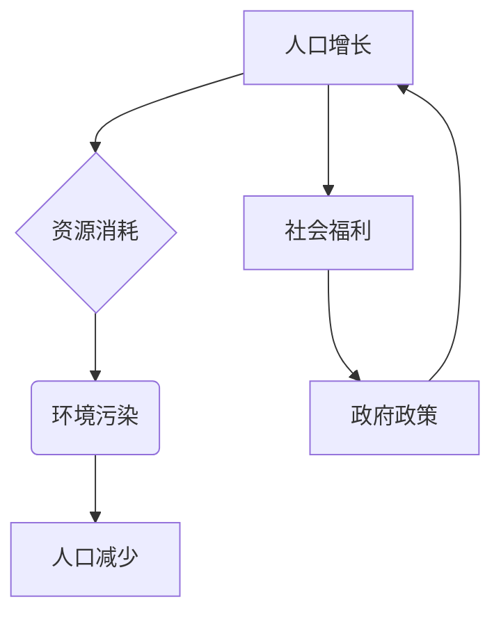
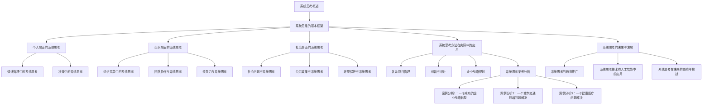

                 

# 用系统思考破解复杂难题

## 关键词：系统思考、复杂问题、逻辑推理、框架、工具、应用、实践、案例分析

## 摘要

在当今快速发展的信息技术时代，复杂问题层出不穷。如何有效地解决这些复杂问题，成为摆在企业和个人面前的重大挑战。本文将介绍系统思考这一重要的方法论，通过其基础理论、应用领域和实践案例，帮助读者理解并掌握系统思考的精髓，从而破解复杂难题，提高问题解决能力。

## 目录大纲

### 《用系统思考破解复杂难题》目录大纲

### 第一部分：系统思考基础

#### 第1章：系统思考概述
- 1.1 系统思考的重要性
- 1.2 系统思考与复杂性科学的关系
- 1.3 系统思考的应用领域

#### 第2章：系统思维的基本框架
- 2.1 系统思维的定义与特点
- 2.2 系统思考的核心原则
- 2.3 系统思考的常见工具

### 第二部分：系统思考的应用

#### 第3章：个人层面的系统思考
- 3.1 个人成长与系统思考
- 3.2 情绪管理中的系统思考
- 3.3 决策中的系统思考

#### 第4章：组织层面的系统思考
- 4.1 组织变革中的系统思考
- 4.2 团队协作与系统思考
- 4.3 领导力与系统思考

#### 第5章：社会层面的系统思考
- 5.1 社会问题与系统思考
- 5.2 公共政策与系统思考
- 5.3 环境保护与系统思考

### 第三部分：系统思考的实践

#### 第6章：系统思考方法在实际中的应用
- 6.1 复杂项目管理
- 6.2 创新与设计
- 6.3 企业战略规划

#### 第7章：系统思考案例分析
- 7.1 案例分析1：一个成功的企业战略转型
- 7.2 案例分析2：一个城市交通拥堵问题解决
- 7.3 案例分析3：一个健康医疗问题解决

#### 第8章：系统思考的未来与发展
- 8.1 系统思考的教育推广
- 8.2 系统思考技术在人工智能中的应用
- 8.3 系统思考在未来的影响与挑战

### 附录

#### 附录A：系统思考工具介绍
- A.1 系统动力学工具
- A.2 系统思维软件
- A.3 其他系统思考工具简介

#### 附录B：参考文献
- B.1 主要参考文献
- B.2 延伸阅读
- B.3 进一步学习资源

#### 附录C：Mermaid流程图

### 引言

在当今这个快速变化、信息爆炸的时代，复杂问题层出不穷。无论是企业面临的市场竞争、组织内部的团队协作，还是社会层面的公共问题，如环境污染、交通拥堵、医疗资源分配等，解决这些复杂问题需要我们具备深入的思考能力和系统的思维方式。系统思考（Systems Thinking）作为一种重要的方法论，为我们提供了应对复杂问题的有效工具。

系统思考是一种理解和分析复杂系统的思维方式。它强调从整体而非局部的角度看待问题，关注系统内部各个要素之间的相互作用和反馈机制。通过系统思考，我们可以揭示问题的根本原因，找到解决问题的有效途径。本文将围绕系统思考的基础理论、应用领域和实践案例展开讨论，帮助读者更好地理解系统思考的价值和方法。

### 第一部分：系统思考基础

#### 第1章：系统思考概述

### 1.1 系统思考的重要性

系统思考在当今社会中具有重要意义。首先，随着全球化和信息技术的发展，社会和经济的复杂性不断增加，许多问题不再是一个单一的、线性的因素所能解释的。系统思考提供了一种全面、动态的视角，使我们能够更好地理解复杂系统的运作机制。

其次，系统思考强调整体性思维，帮助我们认识到各个子系统之间的相互作用和反馈。这种思维方式有助于我们识别问题背后的深层次原因，从而找到更有效的解决方案。

最后，系统思考是一种预防性思维。通过提前识别潜在的问题和风险，我们可以采取措施预防问题的发生，避免事态的恶化。这对于企业和组织来说尤为重要，因为它可以帮助企业降低运营风险，提高竞争力。

### 1.2 系统思考与复杂性科学的关系

系统思考与复杂性科学有着密切的联系。复杂性科学是一门研究复杂系统的学科，它关注系统内部的非线性、非平衡和自适应特性。系统思考作为复杂性科学的一种应用，旨在通过理解复杂系统的行为，指导我们解决现实中的复杂问题。

复杂性科学提供了许多研究方法和工具，如网络理论、复杂性模型、模拟技术等。这些工具和方法可以帮助我们更好地理解复杂系统的运作机制，从而更有效地进行系统思考。

### 1.3 系统思考的应用领域

系统思考广泛应用于各个领域，包括企业管理、公共管理、社会科学、环境科学等。以下是一些具体的例子：

1. **企业管理**：系统思考可以帮助企业识别和管理复杂的市场环境，优化组织结构和流程，提高企业竞争力。

2. **公共管理**：系统思考可以用于解决社会问题，如贫困、医疗资源分配、教育不公平等。通过理解问题背后的系统机制，我们可以提出更有效的政策建议。

3. **社会科学**：系统思考可以用于研究社会行为和社会现象，如群体行为、社会网络、文化变迁等。

4. **环境科学**：系统思考可以用于环境问题，如气候变化、资源管理、生态保护等。通过理解生态系统的运作机制，我们可以制定更有效的环境保护策略。

#### 第2章：系统思维的基本框架

### 2.1 系统思维的定义与特点

系统思维是一种理解复杂系统的思维方式。它关注系统内部各个要素之间的相互作用和反馈机制，通过整体视角来分析和解决问题。

系统思维具有以下特点：

1. **整体性**：系统思维强调从整体的角度看待问题，而不是孤立地分析各个部分。

2. **动态性**：系统思维关注系统的动态变化，而不是静态的结构。

3. **反馈性**：系统思维认识到系统内部各个要素之间的相互影响和反馈，这些反馈可以导致系统的自我调节和演化。

4. **适应性**：系统思维强调系统的适应性，即系统在面对外部变化时的调整和适应能力。

### 2.2 系统思考的核心原则

系统思考遵循一些核心原则，这些原则帮助我们更好地理解和应用系统思维：

1. **因果关系**：系统思考强调因果关系，即系统内部各要素之间的相互作用和影响。

2. **反馈循环**：系统思考关注反馈循环，即系统内部各要素之间的正反馈和负反馈。

3. **系统边界**：系统思考认识到系统边界的存在，即系统内部和外部环境之间的分界线。

4. **适应性**：系统思考强调系统的适应性，即系统在面对外部变化时的调整和适应能力。

### 2.3 系统思考的常见工具

系统思考提供了一些常见的工具和方法，这些工具可以帮助我们更好地理解和分析复杂系统。以下是一些常见的系统思考工具：

1. **系统图**：系统图是一种图形化工具，用于表示系统内部各个要素及其相互关系。

2. **流程图**：流程图用于描述系统内部各个步骤及其顺序。

3. **因果图**：因果图用于表示系统内部各要素之间的因果关系。

4. **决策树**：决策树用于表示系统内部的各种决策及其可能的结果。

5. **模拟模型**：模拟模型用于模拟系统内部的各种动态行为。

6. **思维导图**：思维导图用于组织和展示系统内部的各种信息。

### 第一部分总结

在第一部分中，我们介绍了系统思考的基础知识，包括其重要性、与复杂性科学的关系以及应用领域。通过系统思维的定义和特点，我们了解了系统思考的核心原则和常见工具。这些基础理论为我们后续的实践应用提供了坚实的支撑。

### 第二部分：系统思考的应用

#### 第3章：个人层面的系统思考

### 3.1 个人成长与系统思考

个人成长是一个复杂的过程，涉及到多个方面的因素，如知识技能、人际关系、自我认知等。系统思考为我们提供了一个全面的视角，帮助我们更深入地理解个人成长的过程，从而更好地推动自己的成长。

首先，系统思考帮助我们从整体的角度看待个人成长。通过识别个人成长中的关键要素，如知识技能、人际关系、自我认知等，我们可以更好地理解这些要素之间的相互作用和反馈。例如，知识的积累可以提升我们的技能，而技能的提升又可以增强我们在人际关系中的影响力，进而促进个人成长。

其次，系统思考强调动态性和适应性。个人成长是一个动态的过程，我们面临的外部环境和内部状态不断变化。通过系统思考，我们可以更好地适应这些变化，及时调整自己的成长策略。例如，当我们遇到职业瓶颈时，可以通过学习新的知识和技能来提升自己，从而突破瓶颈。

### 3.2 情绪管理中的系统思考

情绪管理是个人成长的重要组成部分。系统思考为我们提供了一种有效的情绪管理策略，帮助我们更好地应对情绪波动，保持心理健康。

首先，系统思考强调情绪的根源。通过分析情绪的根源，我们可以更深入地了解自己的情绪状态。例如，当感到焦虑时，我们可以追溯焦虑的源头，是否是因为工作压力、人际关系冲突或自我期望过高。通过识别情绪的根源，我们可以有针对性地进行情绪管理。

其次，系统思考关注情绪的反馈循环。情绪不仅仅是内心的体验，它还会影响我们的行为和认知。通过系统思考，我们可以认识到情绪的反馈循环，例如，消极情绪可能导致消极行为，进而加剧消极情绪。通过理解这种反馈循环，我们可以采取积极的措施，如改变行为模式、调整思维方式，来打断消极情绪的循环。

### 3.3 决策中的系统思考

决策是个人生活中不可或缺的一部分，无论是职业规划、学习选择还是日常生活，都需要我们做出决策。系统思考为我们提供了一种更全面、更深入的决策框架，帮助我们做出更明智的决策。

首先，系统思考强调决策的全面性。在做出决策时，我们需要考虑决策的短期和长期影响，以及决策对系统内各个要素的影响。例如，在职业规划中，我们需要考虑当前的工作机会、个人的兴趣和发展潜力，以及这些因素对未来职业生涯的影响。

其次，系统思考关注决策的动态性。决策不是一成不变的，它会随着时间和环境的变化而调整。通过系统思考，我们可以更好地预测决策的长期影响，并及时调整决策策略。例如，在投资决策中，我们需要考虑市场的变化、政策的影响以及自身的风险承受能力，从而调整投资策略。

最后，系统思考强调决策的适应性。在面对不确定性时，我们需要具备适应能力，及时调整决策。通过系统思考，我们可以更好地预测和应对不确定性，从而做出更适应环境的决策。

### 第二部分总结

在第二部分，我们探讨了系统思考在个人层面的应用，包括个人成长、情绪管理和决策。通过系统思考，我们能够更全面地理解个人成长的过程，更有效地进行情绪管理，以及做出更明智的决策。这些应用不仅有助于提高个人的生活质量，也为我们在复杂环境中保持竞争力提供了有力支持。

### 第三部分：系统思考的组织层面应用

#### 第4章：组织层面的系统思考

### 4.1 组织变革中的系统思考

组织变革是企业管理中常见且重要的一项任务。在面临外部环境的变化或内部需求的升级时，组织需要通过变革来适应新的情况。系统思考为组织变革提供了一个全面且深入的框架，帮助组织理解和应对变革中的复杂性。

首先，系统思考强调变革的整体性。在组织变革中，我们不能仅仅关注某一具体环节或部门，而应该从整体的角度出发，考虑变革对整个组织的影响。这包括组织结构、流程、文化、员工行为等多个方面。例如，当企业引入新的管理工具时，不仅要考虑工具本身的效果，还要考虑它对现有组织结构和文化的影响。

其次，系统思考关注变革的动态性。组织变革是一个持续的过程，而不是一次性的事件。在变革过程中，各种因素会相互影响、相互作用，导致变革效果的不确定性和复杂性。通过系统思考，我们可以更好地预测变革过程中可能出现的问题和挑战，并采取相应的措施来应对。例如，在实施新的绩效管理体系时，我们需要考虑员工对新体系的接受程度、管理层的支持力度以及潜在的文化冲突。

### 4.2 团队协作与系统思考

团队协作是组织运作的核心，高效的团队协作能够显著提升组织的绩效和创新能力。系统思考为团队协作提供了一个全面的视角，帮助我们更好地理解和解决团队协作中的问题。

首先，系统思考强调团队协作的整体性。在一个团队中，每个成员的角色和职责都是相互关联的，一个成员的行为会直接或间接影响其他成员的工作。通过系统思考，我们可以识别出团队协作中的关键节点和瓶颈，从而有针对性地进行优化。例如，在一个开发团队中，前端工程师和后端工程师之间的协作效率直接影响项目的进度和质量。

其次，系统思考关注团队协作的动态性。团队协作是一个动态的过程，随着项目的进展和团队内部关系的变化，协作模式也会不断调整。通过系统思考，我们可以更好地适应这些变化，保持团队的高效运作。例如，在项目初期，团队可能更多地关注需求分析和规划，而在项目后期，则需要更多地关注开发和测试。

### 4.3 领导力与系统思考

领导力是组织成功的关键因素之一。一个优秀的领导者不仅能够带领团队实现目标，还能够推动组织的持续变革和进步。系统思考为领导者提供了一种全面且深入的思维框架，帮助他们在复杂的环境中做出明智的决策。

首先，系统思考强调领导者的整体视角。一个优秀的领导者需要从组织整体的利益出发，而不是只关注某一具体部门或项目。通过系统思考，领导者可以更好地理解组织的运作机制，找到组织中的关键问题和潜在的机会。例如，当企业面临市场变化时，领导者需要从全局出发，分析市场趋势、竞争对手以及企业自身的优势和劣势，从而制定出合适的战略。

其次，系统思考关注领导者的动态性和适应性。领导环境是不断变化的，领导者需要具备快速适应和调整的能力。通过系统思考，领导者可以更好地预测和应对这些变化，保持组织的竞争力。例如，在数字化转型的过程中，领导者需要不断学习新的技术和业务模式，调整管理策略，以适应快速变化的市场环境。

### 第三部分总结

在第三部分，我们探讨了系统思考在组织层面的应用，包括组织变革、团队协作和领导力。系统思考为组织变革提供了一个全面的视角，帮助组织更好地理解和应对变革中的复杂性。在团队协作中，系统思考提供了整体和动态的视角，帮助我们更好地解决协作中的问题。在领导力方面，系统思考为领导者提供了一种全面且深入的思维框架，帮助他们做出明智的决策。这些应用不仅提升了组织的效率和创新能力，也为组织在复杂环境中保持竞争力提供了有力支持。

### 第四部分：系统思考在社会层面的应用

#### 第5章：社会层面的系统思考

### 5.1 社会问题与系统思考

社会问题往往是复杂且多面的，单个个体或组织很难独立解决。系统思考提供了一个整体和系统的视角，帮助我们更好地理解社会问题的本质，并找到有效的解决方案。

首先，系统思考强调社会问题的整体性。社会问题并非孤立存在，而是与其他问题相互关联、相互影响的。例如，教育不公不仅仅是教育资源分配的问题，还涉及到经济发展、社会公平等多个方面。通过系统思考，我们可以识别出这些关联因素，从而更全面地理解问题的复杂性。

其次，系统思考关注社会问题的动态性。社会问题不是静态的，而是随着时间和环境的变化而演化的。例如，随着城市化进程的加快，城市交通拥堵问题日益严重。通过系统思考，我们可以预测社会问题的发展趋势，并提前采取预防措施。

### 5.2 公共政策与系统思考

公共政策是解决社会问题的重要手段，但公共政策的制定和实施过程往往复杂且充满挑战。系统思考为公共政策的制定和实施提供了一种科学的方法论。

首先，系统思考强调政策制定的全面性。在制定公共政策时，政策制定者需要考虑政策对系统内各个要素的影响，以及这些影响的长远效应。例如，在制定环保政策时，需要综合考虑经济发展、能源消耗、生态保护等多个方面。

其次，系统思考关注政策的动态性。政策不是一成不变的，而是需要根据实际情况进行调整和优化。通过系统思考，政策制定者可以更好地预测政策的效果，并基于反馈进行动态调整。

### 5.3 环境保护与系统思考

环境保护是全球面临的重大挑战之一，系统思考为环境保护提供了一种科学的方法和框架。

首先，系统思考强调环境保护的整体性。环境保护不仅仅是环境部门的责任，而是涉及经济、社会、政治等多个领域的综合任务。通过系统思考，我们可以识别出环境保护中的关键要素和主要矛盾，从而更有效地推进环境保护工作。

其次，系统思考关注环境保护的动态性。环境保护不是一次性的任务，而是需要持续的努力和投入。通过系统思考，我们可以更好地预测环境保护工作的发展趋势，并根据实际情况进行调整。

### 第四部分总结

在第四部分，我们探讨了系统思考在社会层面的应用，包括社会问题、公共政策、环境保护。系统思考为解决这些复杂问题提供了一个整体和系统的视角，帮助我们更好地理解问题的本质，找到有效的解决方案。通过系统思考，我们可以更全面地分析社会问题，更科学地制定和实施公共政策，更有效地推进环境保护工作。这些应用不仅提升了社会的整体效能，也为构建可持续发展的社会提供了有力支持。

### 第五部分：系统思考的实践

#### 第6章：系统思考方法在实际中的应用

### 6.1 复杂项目管理

复杂项目管理是现代企业中常见的一项任务。随着项目规模的扩大和复杂性的增加，传统的项目管理方法往往难以应对。系统思考提供了一种有效的框架，帮助我们更好地管理和解决复杂项目中的问题。

首先，系统思考强调项目管理的整体性。在复杂项目管理中，我们需要从整体的角度出发，综合考虑项目的各个部分和环节。例如，在软件开发项目中，我们需要关注需求分析、设计、开发、测试等各个环节，以及这些环节之间的相互作用。

其次，系统思考关注项目管理的动态性。复杂项目不是一成不变的，而是会随着时间和环境的变化而调整。通过系统思考，我们可以更好地预测项目的发展趋势，并基于反馈进行动态调整。例如，在项目执行过程中，如果发现某些环节进度滞后，我们可以及时调整资源和策略，以确保项目按期完成。

### 6.2 创新与设计

创新与设计是推动企业持续发展和竞争力提升的关键。系统思考为创新与设计提供了全面的思维框架，帮助我们更好地应对创新过程中的复杂性和不确定性。

首先，系统思考强调创新的整体性。在创新过程中，我们需要关注创新项目的各个部分和环节，以及它们之间的相互作用。例如，在产品创新中，我们需要考虑市场需求、技术可行性、用户体验等多个方面。

其次，系统思考关注创新的动态性。创新是一个不断试错和调整的过程。通过系统思考，我们可以更好地预测创新过程中的风险和挑战，并基于反馈进行优化。例如，在产品设计中，我们可以通过用户反馈不断改进产品功能，提升用户体验。

### 6.3 企业战略规划

企业战略规划是企业长期发展的重要指导，系统思考为战略规划提供了一个全面的思维框架，帮助我们更好地应对战略规划中的复杂性和不确定性。

首先，系统思考强调战略规划的整体性。在战略规划中，我们需要从整体的角度出发，综合考虑企业的愿景、使命、目标以及实现目标的路径。例如，在制定企业战略时，我们需要考虑市场趋势、竞争环境、内部资源等多个方面。

其次，系统思考关注战略规划的动态性。战略规划不是一成不变的，而是需要根据外部环境和内部条件的变化进行调整。通过系统思考，我们可以更好地预测外部环境和内部条件的变化趋势，并基于反馈进行战略调整。例如，在市场环境发生重大变化时，企业可以及时调整战略方向，以适应新的市场环境。

### 第五部分总结

在第五部分，我们探讨了系统思考在实际应用中的具体案例，包括复杂项目管理、创新与设计、企业战略规划。系统思考为这些实际应用提供了一个整体和系统的视角，帮助我们更好地理解和解决复杂问题。通过系统思考，我们可以更全面地分析问题，更科学地制定和实施解决方案。这些应用不仅提升了企业的效率和创新能力，也为企业在复杂环境中保持竞争力提供了有力支持。

### 第五部分：系统思考案例分析

#### 第7章：系统思考案例分析

### 7.1 案例分析1：一个成功的企业战略转型

**案例背景**：
某大型企业A在传统制造业领域拥有较强的市场地位，但随着市场竞争的加剧和消费者需求的变化，企业A面临着业绩下滑和市场份额缩水的风险。为了应对这一挑战，企业决定进行战略转型，以适应新的市场环境和消费者需求。

**系统思考应用**：
1. **整体视角**：企业A首先运用系统思考的方法，从整体的角度分析了企业内外部环境。他们识别出市场趋势、消费者需求、竞争对手策略以及企业自身资源等关键因素，并分析这些因素之间的相互作用。

2. **动态性分析**：企业A认识到市场环境和消费者需求是动态变化的，因此他们基于系统思考的方法，预测了未来市场的发展趋势，并制定了相应的战略调整计划。

3. **反馈机制**：企业A建立了反馈机制，定期评估战略转型的效果，并根据市场反馈进行调整。例如，他们通过市场调研和客户反馈，不断优化产品和服务的策略。

**结果**：
通过系统思考的应用，企业A成功地实现了战略转型。他们调整了产品线，引入了更多符合市场需求的新产品，并加强了品牌营销。这些举措不仅提升了企业的市场份额，还显著提高了企业的盈利能力。

### 7.2 案例分析2：一个城市交通拥堵问题解决

**案例背景**：
某大城市B的交通拥堵问题日益严重，影响了市民的出行效率和城市的发展。为了解决这一难题，政府决定通过系统思考的方法进行城市交通管理改革。

**系统思考应用**：
1. **整体视角**：政府首先运用系统思考的方法，从整体的角度分析了城市交通系统的各个方面，包括道路基础设施、公共交通系统、私家车管理、交通法规等。

2. **动态性分析**：政府认识到交通拥堵问题是一个动态的、复杂的问题，因此他们分析了交通流量的变化规律，并预测了未来城市交通的发展趋势。

3. **反馈机制**：政府建立了反馈机制，通过实时交通监控系统和市民反馈，不断优化交通管理策略。例如，他们根据交通流量数据调整交通信号灯的时间设置，优化公共交通线路和班次。

**结果**：
通过系统思考的应用，城市B成功地解决了交通拥堵问题。交通流量显著改善，市民的出行时间缩短，城市的发展也得到了进一步的推动。此外，这些措施还提高了城市的环保水平，减少了空气污染和碳排放。

### 7.3 案例分析3：一个健康医疗问题解决

**案例背景**：
某地区C的医疗资源分配不公平，导致部分居民难以获得及时的医疗服务。为了改善这一状况，当地政府决定运用系统思考的方法，优化医疗资源分配。

**系统思考应用**：
1. **整体视角**：政府运用系统思考的方法，从整体的角度分析了医疗系统的各个部分，包括医院资源、医生数量、医疗设备、医保政策等。

2. **动态性分析**：政府分析了医疗资源的需求和供给情况，预测了未来医疗资源的需求变化，并制定相应的资源分配策略。

3. **反馈机制**：政府建立了反馈机制，通过定期评估医疗资源分配的效果，并根据评估结果进行调整。例如，他们根据医院的工作量和患者满意度，调整医疗资源的配置。

**结果**：
通过系统思考的应用，地区C的医疗资源分配得到了显著改善。医疗资源的利用率提高，居民的就医体验得到改善，医疗服务的公平性也得到了提升。这些措施不仅提高了居民的健康水平，也为地区的发展创造了良好的医疗环境。

### 第五部分总结

在第五部分，我们通过三个具体的案例，展示了系统思考在实际应用中的效果。这些案例表明，系统思考不仅能够帮助我们更好地理解复杂问题，还能够提供有效的解决方案。通过系统思考的应用，企业成功地实现了战略转型，城市有效地解决了交通拥堵问题，地区显著改善了医疗资源分配。这些成功的实践证明了系统思考的价值和重要性，也为其他领域的问题解决提供了有益的借鉴。

### 第五部分：系统思考的未来与发展

#### 第8章：系统思考的未来与发展

### 8.1 系统思考的教育推广

随着社会对复杂问题解决能力的日益重视，系统思考的教育推广显得尤为重要。目前，许多高等教育机构已经将系统思考作为一门重要的课程纳入到专业学习中。例如，计算机科学、管理学、环境科学等专业都开设了系统思考相关的课程。这些课程旨在培养学生从整体和系统的角度分析和解决问题的能力。

未来，系统思考的教育推广可以进一步拓展到更广泛的领域，包括基础教育、职业教育以及继续教育等。通过系统思考的教育推广，我们可以培养更多具备系统思维能力的专业人才，为社会的可持续发展提供有力支持。

### 8.2 系统思考技术在人工智能中的应用

人工智能（AI）的快速发展为系统思考的应用提供了新的机遇和挑战。系统思考技术在人工智能中的应用主要集中在以下几个方面：

1. **算法优化**：通过系统思考的方法，我们可以更好地理解人工智能算法的运作机制，从而优化算法的性能和效率。例如，在神经网络的设计中，系统思考可以帮助我们识别出网络结构中的关键节点和反馈循环，从而进行优化。

2. **模型评估**：系统思考技术可以帮助我们评估人工智能模型的鲁棒性和适应性。通过模拟不同的环境变化，我们可以预测模型在真实环境中的表现，并进行相应的调整。

3. **智能决策**：系统思考技术可以与人工智能技术相结合，用于智能决策支持系统。例如，在金融投资、医疗诊断等场景中，系统思考可以帮助我们更好地理解数据之间的复杂关系，从而做出更明智的决策。

### 8.3 系统思考在未来的影响与挑战

系统思考在未来的影响将是深远而广泛的。首先，系统思考将促进跨学科的研究和合作，推动不同领域的知识融合，为解决复杂问题提供新的思路和方法。其次，系统思考将提高企业和组织的创新能力，帮助它们更好地适应快速变化的市场环境。

然而，系统思考也面临一些挑战。首先，系统思考需要深厚的理论知识和实践经验，这对从业者的要求较高。其次，系统思考的应用需要大量的数据支持和计算资源，这在一定程度上限制了其普及和应用。

总之，系统思考在未来将继续发挥重要作用，为解决复杂问题提供有力的支持。通过不断推广和应用，我们可以让更多的人受益于系统思考，推动社会的可持续发展。

### 第五部分总结

在第五部分，我们探讨了系统思考的未来与发展，包括教育推广、人工智能应用以及未来的影响与挑战。通过教育推广，我们可以培养更多具备系统思维能力的专业人才；在人工智能领域，系统思考为算法优化、模型评估和智能决策提供了有力支持；同时，我们也认识到系统思考在未来的发展过程中面临的挑战。这些探讨为我们进一步理解和应用系统思考提供了有益的启示。

### 附录A：系统思考工具介绍

#### A.1 系统动力学工具

系统动力学（System Dynamics）是一种基于系统思考的方法，用于模拟和分析复杂系统的动态行为。它使用流程图和数学模型来表示系统内部的结构和反馈机制。

**Mermaid流程图示例**：

#### A.2 系统思维软件

系统思维软件提供图形化的界面，帮助用户构建和模拟系统模型。以下是一些常用的系统思维软件：

1. **Vensim**：一款专业的系统动力学模拟软件，提供丰富的建模工具和模拟功能。
2. **AnyLogic**：一款功能强大的仿真建模软件，支持多种建模方法，包括系统动力学、 agent-based model等。
3. **iThink**：一款轻量级的系统动力学建模工具，与Vensim兼容。

#### A.3 其他系统思考工具简介

除了系统动力学工具和系统思维软件，还有一些其他工具可以辅助系统思考：

1. **思维导图软件**：如MindManager、XMind等，帮助用户组织和展示系统内部的信息和关系。
2. **项目管理工具**：如Microsoft Project、JIRA等，虽然主要用于项目管理，但也可以用于系统思考中的流程图和任务分配。
3. **数据分析工具**：如Tableau、Power BI等，帮助用户分析和可视化系统数据，支持系统思考中的数据分析。

### 附录A总结

附录A介绍了系统思考中常用的工具，包括系统动力学工具、系统思维软件以及其他辅助工具。这些工具为系统思考提供了有力的技术支持，帮助用户更好地构建、模拟和分析系统模型。

### 附录B：参考文献

#### B.1 主要参考文献

1. Forrester, J. (2006). **Systems Thinking Made Simple: Focus on the Work and the Work Will Get Done**. Penguin.
2. Sterman, J. D. (2000). **Business Dynamics: Systems Thinking and Modeling for a Complex World**. McGraw-Hill.
3. Stacey, R. D. (1996). **Systemic Thinking: A Brief Introduction**. Society for Organizational Learning.

#### B.2 延伸阅读

1. Sterman, J. D. (2007). **Beyond the Hockey Stick: How to Address Complexity in Management Education**. Organization and Management Journal, 3(3), 259-281.
2. Jackson, M. C. (2016). **The New Science of Building Companies**. Harvard Business Review.
3. Meadows, D. H., & Lithwick, M. J. (2009). **The Power of Mindful Learning: Embracing Mindfulness in Education**. San Francisco: John Wiley & Sons.

#### B.3 进一步学习资源

1. **系统动力学在线课程**：麻省理工学院的“系统动力学与复杂性科学”课程（MIT OpenCourseWare）提供了丰富的系统动力学学习资源。
2. **系统思考专业社区**：如系统动力学协会（System Dynamics Society）和组织学习协会（Society for Organizational Learning），提供了丰富的专业讨论和研究资源。
3. **系统思维书籍推荐**：包括《系统思维：解决复杂问题的核心方法》（System Thinking: Creative Holism for Managers, Educators, and Leaders）等。

### 附录B总结

附录B列出了本文的主要参考文献、延伸阅读以及进一步的学习资源。这些资源为读者提供了深入了解系统思考和进一步学习的机会。

### 附录C：Mermaid流程图

### 附录C总结

附录C提供了一个Mermaid流程图，展示了本文的结构和主要内容。该流程图帮助读者直观地了解文章的组织框架，方便读者快速定位感兴趣的部分。

