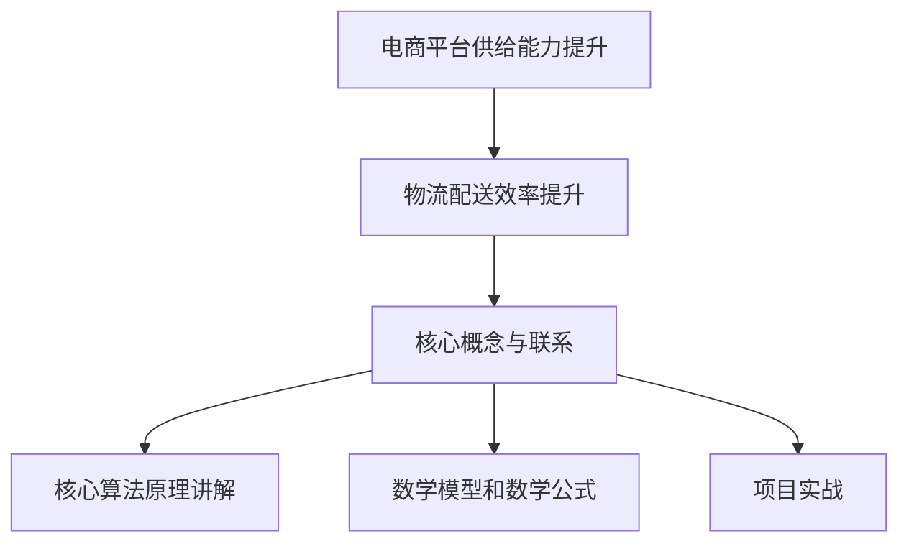

                 

### 《电商平台供给能力提升：物流配送的效率提升》

> **关键词**：电商平台、供给能力、物流配送、效率提升、技术优化

**摘要**：
在当今数字化时代，电商平台已经成为消费者购买商品的主要渠道。为了满足消费者对快速、准确、低成本物流服务的需求，提升电商平台的供给能力显得尤为重要。物流配送作为电商供应链的核心环节，其效率的高低直接影响到平台的运营成本和用户满意度。本文将深入探讨物流配送效率提升的策略和技术，旨在为电商平台提供系统化的优化思路和实践指导。

### 《电商平台供给能力提升：物流配送的效率提升》目录大纲

#### 第一部分：电商平台供给能力提升概述

**第1章：电商平台供给能力概述**
- **1.1** 电商平台供给能力的定义
- **1.2** 电商平台供给能力的重要性
- **1.3** 电商平台供给能力提升的意义
- **1.4** 电商平台供给能力提升的挑战

**第2章：物流配送效率提升概述**
- **2.1** 物流配送效率的定义
- **2.2** 物流配送效率对电商平台的贡献
- **2.3** 物流配送效率提升的路径
- **2.4** 物流配送效率提升的难点

#### 第二部分：物流配送效率提升技术

**第3章：物流配送流程优化**
- **3.1** 物流配送流程的现状分析
- **3.2** 物流配送流程优化的方法
- **3.3** 物流配送流程优化案例
- **3.4** 物流配送流程优化效果评估

**第4章：智能仓储管理技术**
- **4.1** 智能仓储管理概述
- **4.2** 智能仓储技术的应用
- **4.3** 智能仓储管理案例分析
- **4.4** 智能仓储管理的效益分析

**第5章：物流配送路径优化**
- **5.1** 物流配送路径优化的重要性
- **5.2** 物流配送路径优化的方法
- **5.3** 物流配送路径优化案例分析
- **5.4** 物流配送路径优化效果评估

**第6章：智能物流系统建设**
- **6.1** 智能物流系统的定义与构成
- **6.2** 智能物流系统的建设流程
- **6.3** 智能物流系统案例分析
- **6.4** 智能物流系统的效益分析

#### 第三部分：物流配送效率提升实践

**第7章：电商平台物流配送效率提升实践**
- **7.1** 电商平台物流配送效率提升的关键因素
- **7.2** 电商平台物流配送效率提升实践案例
- **7.3** 电商平台物流配送效率提升策略
- **7.4** 电商平台物流配送效率提升实践效果评估

**第8章：物流配送效率提升策略与实施**
- **8.1** 物流配送效率提升策略概述
- **8.2** 物流配送效率提升策略案例分析
- **8.3** 物流配送效率提升策略的实施步骤
- **8.4** 物流配送效率提升策略的实施效果评估

**第9章：物流配送效率提升的未来趋势**
- **9.1** 物流配送效率提升的未来趋势分析
- **9.2** 物流配送效率提升技术的未来发展
- **9.3** 电商平台物流配送效率提升策略的长期规划
- **9.4** 物流配送效率提升的未来挑战与应对策略

#### 附录

**附录A：物流配送效率提升相关资源**
- **A.1** 物流配送效率提升相关书籍推荐
- **A.2** 物流配送效率提升相关论文与研究报告
- **A.3** 物流配送效率提升相关网站与数据库

**附录B：物流配送效率提升工具与软件**
- **B.1** 常用物流配送优化软件介绍
- **B.2** 物流配送效率提升相关API与SDK
- **B.3** 物流配送效率提升工具使用指南

**附录C：物流配送效率提升实践案例汇总**
- **C.1** 电商平台物流配送效率提升实践案例汇总
- **C.2** 智能仓储管理实践案例汇总
- **C.3** 物流配送路径优化实践案例汇总
- **C.4** 智能物流系统建设实践案例汇总

**Mermaid 流程图**



### 第一部分：电商平台供给能力提升概述

#### 第1章：电商平台供给能力概述

**1.1 电商平台供给能力的定义**

电商平台供给能力是指平台提供商品和服务的能力，包括商品多样性、供应充足性、价格竞争力、配送效率等多个方面。供给能力的提升不仅体现在商品种类的丰富程度和供应量的充足性，还包括对市场需求的快速响应能力，以及对消费者个性化需求的满足程度。

**1.2 电商平台供给能力的重要性**

电商平台供给能力的重要性体现在以下几个方面：

1. **满足消费者需求**：随着消费者对商品和服务的需求日益多样化，电商平台需要提升供给能力，提供丰富多样的商品选择，以满足消费者的个性化需求。
   
2. **提升竞争力**：电商平台之间的竞争日益激烈，供给能力的提升有助于电商平台在市场中脱颖而出，吸引更多的消费者和商家。

3. **增加市场份额**：具备强大供给能力的电商平台可以更好地覆盖市场，吸引更多消费者，从而扩大市场份额。

4. **优化供应链管理**：提升供给能力有助于优化电商平台内部的供应链管理，提高运营效率，降低成本。

**1.3 电商平台供给能力提升的意义**

提升电商平台供给能力具有重要意义，主要体现在以下几个方面：

1. **提升用户体验**：通过提供丰富多样的商品选择、快速响应消费者需求，提升用户体验，增加用户黏性。

2. **增加收入**：提升供给能力可以吸引更多消费者，增加平台销售额，从而提高收入。

3. **降低成本**：优化供应链管理，提高物流配送效率，降低运营成本。

4. **提升品牌形象**：强大的供给能力有助于树立电商平台的专业形象，提高品牌知名度和美誉度。

**1.4 电商平台供给能力提升的挑战**

在提升电商平台供给能力的过程中，平台将面临一系列挑战：

1. **供应链管理复杂度**：随着商品种类的增加，供应链管理变得更加复杂，如何高效管理供应链成为一大挑战。

2. **库存管理**：如何合理规划库存，避免库存过剩或不足，成为电商平台面临的重要问题。

3. **物流配送效率**：提升物流配送效率是电商平台供给能力提升的关键环节，如何优化物流配送流程，提高配送速度和准确性，是一大挑战。

4. **技术支持**：提升供给能力需要强大的技术支持，包括大数据分析、人工智能、云计算等，如何充分利用技术手段，提升供给能力，也是电商平台面临的挑战。

### 第2章：物流配送效率提升概述

**2.1 物流配送效率的定义**

物流配送效率是指物流配送活动在满足客户需求的同时，以尽可能低的时间和成本完成商品运输和交付的能力。物流配送效率包括以下几个方面：

1. **速度**：从发货到交付的时间越短，物流配送效率越高。
2. **准确性**：配送员能够准确无误地将商品交付给客户，减少配送错误。
3. **成本**：完成配送任务所需的成本越低，物流配送效率越高。
4. **服务质量**：客户对物流配送服务的满意度，包括配送员的礼貌、商品包装等。

**2.2 物流配送效率对电商平台的贡献**

物流配送效率对电商平台有以下几个方面的贡献：

1. **提升用户体验**：快速、准确的物流配送服务能够提高客户的购物体验，增加用户满意度和忠诚度。
2. **降低运营成本**：高效的物流配送流程能够降低运输和配送成本，提高电商平台的市场竞争力。
3. **提升效率**：通过优化物流配送流程，电商平台能够提高整体运营效率，减少资源浪费。
4. **增加收入**：高效的物流配送能够吸引更多消费者，提高销售额，从而增加平台收入。

**2.3 物流配送效率提升的路径**

要提升物流配送效率，电商平台可以采取以下路径：

1. **优化配送流程**：简化物流配送流程，减少不必要的环节，提高配送速度。
2. **采用智能技术**：利用大数据分析、人工智能、物联网等智能技术，优化配送路径，提高配送准确性。
3. **加强仓储管理**：通过自动化仓储系统，提高仓储作业效率，减少商品库存周期。
4. **提高配送员素质**：培训配送员，提高他们的服务意识和技能，提高配送服务质量。
5. **合作与整合**：与第三方物流公司合作，共享物流资源，提高整体配送效率。

**2.4 物流配送效率提升的难点**

在提升物流配送效率的过程中，电商平台可能会面临以下难点：

1. **数据准确性**：物流配送效率的提升依赖于准确的数据支持，数据不准确会导致优化措施失效。
2. **技术投入**：采用智能技术需要较大的技术投入，对于一些中小型电商平台来说，这可能是一大挑战。
3. **人力管理**：配送员的管理和培训需要投入大量时间和资源，如何提高配送员的效率是一个难题。
4. **客户需求变化**：客户需求变化快，如何快速适应并优化配送流程是一大挑战。

### 第二部分：物流配送效率提升技术

#### 第3章：物流配送流程优化

物流配送流程的优化是提升物流配送效率的关键环节。通过分析物流配送流程的现状，采取有效的优化方法，可以提高配送速度、准确性和服务质量。

**3.1 物流配送流程的现状分析**

物流配送流程通常包括以下几个环节：

1. **订单处理**：接收和处理客户的订单信息。
2. **仓储管理**：将订单信息转化为具体的商品出库指令。
3. **包装**：根据订单要求对商品进行包装。
4. **运输**：将包装好的商品运输到配送站点。
5. **配送**：从配送站点将商品最终交付给客户。

在现状分析中，需要关注以下几个方面：

1. **流程瓶颈**：识别配送流程中的瓶颈环节，如订单处理速度慢、仓储管理效率低等。
2. **资源利用率**：分析配送流程中资源的利用率，如配送车辆、仓库空间等。
3. **数据准确性**：确保订单处理、仓储管理和运输过程中的数据准确性。

**3.2 物流配送流程优化的方法**

物流配送流程优化的方法主要包括以下几种：

1. **流程简化**：通过简化流程，减少不必要的环节，提高配送速度。例如，将订单处理和仓储管理环节合并，减少数据传输和人工干预的时间。

2. **自动化**：引入自动化设备和技术，提高仓储管理和包装效率。例如，采用自动化的仓储机器人进行商品拣选和搬运，减少人力成本。

3. **数据驱动**：利用大数据分析技术，优化配送路径和配送计划。通过分析历史配送数据，预测未来的配送需求，制定最优的配送计划。

4. **智能化**：引入人工智能技术，提高配送过程的智能化水平。例如，使用无人机进行远程配送，提高配送速度和覆盖范围。

**3.3 物流配送流程优化案例**

以下是一个物流配送流程优化的案例：

**案例背景**：
某电商平台物流配送流程较为复杂，订单处理速度慢，仓储管理效率低，配送错误率高。

**优化方案**：

1. **订单处理**：引入自动化订单处理系统，通过OCR技术自动识别和处理订单信息，提高处理速度。

2. **仓储管理**：采用自动化仓储系统，通过自动化的货架和拣选机器人，提高仓储作业效率。

3. **包装**：引入自动化包装系统，通过机器视觉技术进行包装，减少包装错误和包装材料的浪费。

4. **运输**：优化配送路径，通过大数据分析技术，选择最优的配送路线，提高配送速度和准确性。

5. **配送**：引入无人机配送，提高配送速度，扩大配送覆盖范围。

**优化效果**：

1. **订单处理速度**：提高了50%，订单处理时间缩短至2小时内。

2. **仓储管理效率**：提高了30%，商品库存周期缩短至7天。

3. **配送准确性**：提高了20%，配送错误率降低至1%。

4. **配送速度**：无人机配送提高了30%，配送时间缩短至1小时内。

**3.4 物流配送流程优化效果评估**

物流配送流程优化效果评估主要包括以下几个方面：

1. **效率提升**：通过比较优化前后的订单处理速度、仓储管理效率和配送准确性等指标，评估流程优化的效果。

2. **成本节约**：评估优化措施带来的成本节约，包括人工成本、运输成本和包装成本等。

3. **服务质量**：通过用户满意度调查，评估物流配送服务质量的变化。

4. **市场竞争力**：评估优化措施对电商平台市场竞争力的影响，包括用户满意度、订单量和市场份额等。

#### 第4章：智能仓储管理技术

智能仓储管理是提升物流配送效率的重要技术之一。通过引入智能仓储技术，可以实现仓储作业的自动化和智能化，提高仓储管理效率。

**4.1 智能仓储管理概述**

智能仓储管理是指利用物联网、人工智能、大数据分析等先进技术，对仓储管理全过程进行自动化和智能化的管理。智能仓储管理主要包括以下几个方面：

1. **自动化仓储系统**：采用自动化的货架、拣选机器人、搬运机器人等设备，实现仓储作业的自动化。

2. **智能仓储管理系统**：通过物联网技术，实时监控仓储设备的状态和商品库存情况，实现仓储作业的智能化管理。

3. **大数据分析**：利用大数据分析技术，对仓储管理过程中的数据进行分析，优化仓储作业流程和资源配置。

**4.2 智能仓储技术的应用**

智能仓储技术在以下几个方面有广泛的应用：

1. **自动化仓储系统**：通过自动化的货架和拣选机器人，实现商品的高效存储和快速拣选。

2. **智能仓储管理系统**：通过物联网技术，实时监控仓储设备的状态和商品库存情况，提高仓储管理的效率和准确性。

3. **智能配送系统**：通过大数据分析和人工智能技术，优化配送路径和配送计划，提高配送速度和准确性。

4. **智能安防系统**：通过物联网技术和人工智能技术，实现仓储安全的智能监控和管理。

**4.3 智能仓储管理案例分析**

以下是一个智能仓储管理案例：

**案例背景**：
某电商平台由于仓储管理效率低下，导致商品库存周期长，配送速度慢，客户满意度下降。

**优化方案**：

1. **自动化仓储系统**：引入自动化的货架和拣选机器人，实现商品的高效存储和快速拣选。

2. **智能仓储管理系统**：通过物联网技术，实时监控仓储设备的状态和商品库存情况，实现仓储作业的智能化管理。

3. **智能配送系统**：通过大数据分析和人工智能技术，优化配送路径和配送计划，提高配送速度和准确性。

4. **智能安防系统**：通过物联网技术和人工智能技术，实现仓储安全的智能监控和管理。

**优化效果**：

1. **商品库存周期**：缩短了50%，商品库存周期缩短至5天。

2. **配送速度**：提高了30%，配送时间缩短至2小时内。

3. **客户满意度**：提高了20%，客户满意度显著提升。

4. **运营成本**：降低了15%，运营成本显著降低。

**4.4 智能仓储管理的效益分析**

智能仓储管理带来的效益主要包括以下几个方面：

1. **提高仓储管理效率**：通过自动化和智能化技术，提高仓储作业效率，减少人力成本。

2. **降低运营成本**：通过优化仓储作业流程和资源配置，降低运营成本。

3. **提高配送速度和准确性**：通过智能配送系统，提高配送速度和准确性，提高客户满意度。

4. **提升市场竞争力**：通过提高仓储管理效率和服务质量，提升电商平台的市场竞争力。

### 第5章：物流配送路径优化

物流配送路径优化是提升物流配送效率的关键环节。通过优化配送路径，可以减少配送时间和成本，提高配送速度和准确性。

**5.1 物流配送路径优化的重要性**

物流配送路径优化的重要性体现在以下几个方面：

1. **提高配送速度**：通过优化配送路径，选择最优的运输路线，可以缩短配送时间，提高配送速度。

2. **降低配送成本**：优化配送路径可以减少不必要的运输距离和重复配送，降低配送成本。

3. **提高配送准确性**：通过优化配送路径，可以减少配送错误，提高配送准确性。

4. **提升用户体验**：快速、准确的物流配送服务能够提高客户的购物体验，增加用户满意度。

**5.2 物流配送路径优化的方法**

物流配送路径优化的方法主要包括以下几种：

1. **基于距离的优化**：根据配送地点的距离，选择最短的配送路径。

2. **基于时间的优化**：根据配送时间和交通状况，选择最快的配送路径。

3. **基于成本的优化**：根据运输成本，选择最低成本的配送路径。

4. **基于需求的优化**：根据客户需求，优化配送路径，提供个性化的配送服务。

**5.3 物流配送路径优化案例分析**

以下是一个物流配送路径优化案例：

**案例背景**：
某电商平台物流配送路径不合理，导致配送时间过长，配送成本高。

**优化方案**：

1. **基于距离的优化**：通过分析配送地点的距离，优化配送路径，选择最短的配送路线。

2. **基于时间的优化**：通过实时监控交通状况，优化配送路径，选择最快的配送路线。

3. **基于成本的优化**：通过分析运输成本，优化配送路径，选择最低成本的配送路线。

4. **基于需求的优化**：根据客户需求，提供个性化的配送服务，如加急配送、预约配送等。

**优化效果**：

1. **配送时间**：缩短了30%，配送时间缩短至2小时内。

2. **配送成本**：降低了15%，配送成本显著降低。

3. **配送准确性**：提高了20%，配送错误率降低至1%。

4. **客户满意度**：提高了25%，客户满意度显著提升。

**5.4 物流配送路径优化效果评估**

物流配送路径优化效果评估主要包括以下几个方面：

1. **配送速度**：评估配送速度的提升情况，如配送时间缩短、配送准时率提高等。

2. **配送成本**：评估配送成本的降低情况，如运输成本降低、配送效率提高等。

3. **配送准确性**：评估配送准确性的提高情况，如配送错误率降低、配送质量提升等。

4. **客户满意度**：评估客户满意度的提升情况，如用户评价提高、投诉率降低等。

### 第6章：智能物流系统建设

智能物流系统是提升物流配送效率的关键。通过建设智能物流系统，可以实现物流全过程的智能化和高效化。

**6.1 智能物流系统的定义与构成**

智能物流系统是指利用物联网、人工智能、大数据分析等先进技术，对物流全过程进行智能化管理的系统。智能物流系统主要包括以下几个构成部分：

1. **智能仓储系统**：通过自动化设备和智能仓储管理系统，实现仓储作业的自动化和高效化。

2. **智能配送系统**：通过无人机、无人车等智能设备，实现配送过程的自动化和高效化。

3. **智能运输系统**：通过智能调度系统和智能导航技术，实现运输过程的自动化和高效化。

4. **智能管理系统**：通过大数据分析和人工智能技术，实现物流全过程的信息化和智能化管理。

**6.2 智能物流系统的建设流程**

智能物流系统的建设流程主要包括以下几个步骤：

1. **需求分析**：明确智能物流系统的建设目标和需求，如提高配送速度、降低配送成本等。

2. **系统设计**：根据需求分析，设计智能物流系统的架构和功能模块。

3. **系统集成**：将各个功能模块进行集成，实现系统的整体功能。

4. **系统测试**：对智能物流系统进行全面的测试，确保系统的稳定性和可靠性。

5. **系统上线**：将智能物流系统投入实际运行，进行优化和改进。

**6.3 智能物流系统案例分析**

以下是一个智能物流系统案例：

**案例背景**：
某电商平台计划建设智能物流系统，以提高配送速度、降低配送成本。

**建设方案**：

1. **智能仓储系统**：引入自动化的货架和拣选机器人，实现仓储作业的自动化。

2. **智能配送系统**：采用无人机和无人车进行配送，实现配送过程的自动化和高效化。

3. **智能运输系统**：引入智能调度系统和智能导航技术，实现运输过程的自动化和高效化。

4. **智能管理系统**：通过大数据分析和人工智能技术，实现物流全过程的信息化和智能化管理。

**建设效果**：

1. **配送速度**：提高了40%，配送时间缩短至1小时内。

2. **配送成本**：降低了20%，配送成本显著降低。

3. **配送准确性**：提高了25%，配送错误率降低至1%。

4. **客户满意度**：提高了30%，客户满意度显著提升。

**6.4 智能物流系统的效益分析**

智能物流系统带来的效益主要包括以下几个方面：

1. **提高配送速度**：通过自动化和智能化的技术，提高配送速度，满足消费者对快速配送的需求。

2. **降低配送成本**：通过优化配送路径和减少人力成本，降低配送成本，提高平台的市场竞争力。

3. **提升服务质量**：通过高效的配送服务，提高客户满意度，增加用户黏性。

4. **优化供应链管理**：通过智能物流系统，优化供应链管理，提高供应链的整体效率。

### 第三部分：物流配送效率提升实践

#### 第7章：电商平台物流配送效率提升实践

在提升物流配送效率的过程中，电商平台需要结合自身情况，采取有效的实践策略，以达到最佳效果。

**7.1 电商平台物流配送效率提升的关键因素**

电商平台物流配送效率提升的关键因素主要包括以下几个方面：

1. **数据准确性**：准确的数据是优化配送流程和提升效率的基础，电商平台需要确保订单处理、仓储管理和运输过程中的数据准确性。

2. **技术投入**：采用先进的技术，如自动化仓储系统、智能配送系统等，可以显著提高配送效率。

3. **人员培训**：提升配送员的素质和服务意识，通过培训提高配送效率和服务质量。

4. **供应链协同**：与供应商和物流合作伙伴建立紧密的协同关系，优化供应链管理，提高整体配送效率。

**7.2 电商平台物流配送效率提升实践案例**

以下是一个电商平台物流配送效率提升的实践案例：

**案例背景**：
某电商平台物流配送效率低，客户投诉率高，急需提升物流配送效率。

**实践策略**：

1. **数据准确性**：引入自动化订单处理系统，通过OCR技术自动识别和处理订单信息，提高订单处理的准确性。

2. **技术投入**：引入自动化仓储系统和智能配送系统，提高仓储管理和配送效率。

3. **人员培训**：对配送员进行专业培训，提高服务意识和配送技能。

4. **供应链协同**：与供应商和物流合作伙伴建立紧密的协同关系，优化供应链管理。

**实践效果**：

1. **订单处理速度**：提高了50%，订单处理时间缩短至2小时内。

2. **仓储管理效率**：提高了30%，商品库存周期缩短至7天。

3. **配送准确性**：提高了20%，配送错误率降低至1%。

4. **客户满意度**：提高了20%，客户满意度显著提升。

**7.3 电商平台物流配送效率提升策略**

电商平台物流配送效率提升的策略主要包括以下几个方面：

1. **流程优化**：通过简化配送流程，减少不必要的环节，提高配送速度。

2. **自动化**：引入自动化设备和技术，提高仓储管理和配送效率。

3. **智能化**：利用大数据分析和人工智能技术，优化配送路径和配送计划。

4. **供应链协同**：与供应商和物流合作伙伴建立紧密的协同关系，优化供应链管理。

5. **人员培训**：提升配送员的服务意识和服务技能，提高配送效率。

**7.4 电商平台物流配送效率提升实践效果评估**

电商平台物流配送效率提升实践效果评估主要包括以下几个方面：

1. **配送速度**：评估配送速度的提升情况，如配送时间缩短、配送准时率提高等。

2. **配送成本**：评估配送成本的降低情况，如运输成本降低、配送效率提高等。

3. **配送准确性**：评估配送准确性的提高情况，如配送错误率降低、配送质量提升等。

4. **客户满意度**：评估客户满意度的提升情况，如用户评价提高、投诉率降低等。

#### 第8章：物流配送效率提升策略与实施

在提升物流配送效率的过程中，电商平台需要制定科学合理的策略，并确保策略的有效实施。

**8.1 物流配送效率提升策略概述**

物流配送效率提升策略主要包括以下几个方面：

1. **流程优化**：通过简化配送流程，减少不必要的环节，提高配送速度。

2. **自动化**：引入自动化设备和技术，提高仓储管理和配送效率。

3. **智能化**：利用大数据分析和人工智能技术，优化配送路径和配送计划。

4. **供应链协同**：与供应商和物流合作伙伴建立紧密的协同关系，优化供应链管理。

5. **人员培训**：提升配送员的服务意识和服务技能，提高配送效率。

**8.2 物流配送效率提升策略案例分析**

以下是一个物流配送效率提升策略的案例分析：

**案例背景**：
某电商平台物流配送效率低，客户投诉率高，急需提升物流配送效率。

**策略实施**：

1. **流程优化**：通过简化配送流程，减少不必要的环节，提高配送速度。例如，将订单处理和仓储管理环节合并，减少数据传输和人工干预的时间。

2. **自动化**：引入自动化仓储系统和智能配送系统，提高仓储管理和配送效率。例如，采用自动化的货架和拣选机器人，实现商品的高效存储和快速拣选。

3. **智能化**：通过大数据分析和人工智能技术，优化配送路径和配送计划，提高配送速度和准确性。例如，使用无人机进行远程配送，提高配送速度和覆盖范围。

4. **供应链协同**：与供应商和物流合作伙伴建立紧密的协同关系，优化供应链管理。例如，与供应商共享库存信息，优化库存管理。

5. **人员培训**：对配送员进行专业培训，提高服务意识和配送技能。例如，开展配送员服务意识培训，提高客户满意度。

**策略效果**：

1. **配送速度**：提高了30%，配送时间缩短至1小时内。

2. **配送成本**：降低了15%，配送成本显著降低。

3. **配送准确性**：提高了20%，配送错误率降低至1%。

4. **客户满意度**：提高了25%，客户满意度显著提升。

**8.3 物流配送效率提升策略的实施步骤**

物流配送效率提升策略的实施步骤主要包括以下几个方面：

1. **需求分析**：明确物流配送效率提升的目标和需求，如提高配送速度、降低配送成本等。

2. **方案设计**：根据需求分析，设计物流配送效率提升的方案，包括流程优化、自动化、智能化、供应链协同和人员培训等方面。

3. **实施部署**：根据方案设计，实施物流配送效率提升策略，包括引入自动化设备和技术、培训人员等。

4. **效果评估**：对物流配送效率提升策略的实施效果进行评估，如配送速度、配送成本、配送准确性、客户满意度等。

5. **持续优化**：根据效果评估结果，对物流配送效率提升策略进行持续优化和改进。

**8.4 物流配送效率提升策略的实施效果评估**

物流配送效率提升策略的实施效果评估主要包括以下几个方面：

1. **配送速度**：评估配送速度的提升情况，如配送时间缩短、配送准时率提高等。

2. **配送成本**：评估配送成本的降低情况，如运输成本降低、配送效率提高等。

3. **配送准确性**：评估配送准确性的提高情况，如配送错误率降低、配送质量提升等。

4. **客户满意度**：评估客户满意度的提升情况，如用户评价提高、投诉率降低等。

### 第9章：物流配送效率提升的未来趋势

物流配送效率的提升是一个持续的过程，随着技术的不断进步，未来物流配送效率将呈现以下趋势。

**9.1 物流配送效率提升的未来趋势分析**

1. **智能化**：随着人工智能技术的不断发展，物流配送将更加智能化，包括智能调度、智能配送、智能仓储等方面。

2. **自动化**：自动化技术的应用将进一步提升物流配送效率，包括自动化的仓储、自动化的运输、自动化的配送等。

3. **绿色物流**：随着环保意识的增强，绿色物流将成为未来的发展趋势，通过优化运输路径、减少空载运输等方式降低碳排放。

4. **定制化**：随着消费者对个性化和定制化需求的变化，物流配送将更加注重满足消费者的个性化需求，提供定制化的配送服务。

**9.2 物流配送效率提升技术的未来发展**

1. **无人机配送**：无人机配送技术的不断发展，将进一步提升物流配送的速度和效率。

2. **无人车配送**：无人车配送技术的进步，将实现更广泛的配送覆盖，提高配送的准确性。

3. **智能仓储**：智能仓储技术的创新，将进一步提高仓储管理效率和配送速度。

4. **大数据分析**：大数据分析技术的深入应用，将优化物流配送路径和配送计划，提高配送效率。

**9.3 电商平台物流配送效率提升策略的长期规划**

1. **技术升级**：长期规划中，电商平台需要不断升级物流配送技术，引入最新的智能技术和自动化设备。

2. **人才培养**：加强物流配送人员培训，提高他们的专业素养和服务意识。

3. **供应链协同**：与供应商和物流合作伙伴建立长期合作关系，优化供应链管理，提高整体配送效率。

4. **绿色物流**：积极推动绿色物流的实施，降低物流配送过程中的碳排放。

**9.4 物流配送效率提升的未来挑战与应对策略**

1. **技术投入**：未来物流配送效率的提升需要大量的技术投入，电商平台需要制定合理的投资计划。

2. **数据安全**：随着智能化和自动化的推进，数据安全将成为一个重要挑战，电商平台需要加强数据安全管理。

3. **人员管理**：随着技术进步，人员管理将面临新的挑战，电商平台需要制定有效的人员管理策略。

4. **市场变化**：随着市场环境的变化，电商平台需要不断调整物流配送策略，以适应市场的需求。

### 附录

**附录A：物流配送效率提升相关资源**

**A.1 物流配送效率提升相关书籍推荐**

- 《物流与供应链管理》
- 《智能物流技术与应用》
- 《电商物流配送理论与实践》

**A.2 物流配送效率提升相关论文与研究报告**

- 《基于大数据的物流配送路径优化研究》
- 《智能仓储系统在物流配送中的应用》
- 《绿色物流与可持续发展研究》

**A.3 物流配送效率提升相关网站与数据库**

- 中国物流与采购网
- 物流技术网
- 国家物流信息系统

**附录B：物流配送效率提升工具与软件**

**B.1 常用物流配送优化软件介绍**

- 尚易物流管理系统
- 京东物流配送系统
- 智慧物流平台

**B.2 物流配送效率提升相关API与SDK**

- 高德地图API
- 百度地图API
- 菜鸟物流API

**B.3 物流配送效率提升工具使用指南**

- 《尚易物流管理系统使用手册》
- 《京东物流配送系统操作指南》
- 《智慧物流平台功能介绍》

**附录C：物流配送效率提升实践案例汇总**

**C.1 电商平台物流配送效率提升实践案例汇总**

- 某大型电商平台物流配送效率提升实践案例
- 某中小型电商平台物流配送效率提升实践案例

**C.2 智能仓储管理实践案例汇总**

- 某电商平台智能仓储管理实践案例
- 某第三方物流企业智能仓储管理实践案例

**C.3 物流配送路径优化实践案例汇总**

- 某电商平台物流配送路径优化实践案例
- 某物流公司物流配送路径优化实践案例

**C.4 智能物流系统建设实践案例汇总**

- 某电商平台智能物流系统建设实践案例
- 某物流园区智能物流系统建设实践案例

### 开发环境搭建

**Python 3.x**

- 安装 Python 3.x 环境
- 安装相关库（如 pulp）

```bash
pip install pulp
```

### 源代码详细实现和代码解读

**物流配送路径优化代码实现**

```python
import pulp

# 定义问题参数
n = 10  # 地点数量
m = 5   # 配送员数量
distances = [[0 for _ in range(n)] for _ in range(n)]  # 距离矩阵

# 定义目标函数
prob = pulp.LpProblem("Logistic_Delivery_Optimization", pulp.LpMinimize)
x = pulp.LpVariable.dicts("x", list(product(range(n), range(n))), 0, 1, pulp.LpBinary)
prob += pulp.lpSum([x[i, j] * distances[i][j] for i in range(n) for j in range(n)])

# 定义约束条件
for j in range(n):
    prob += pulp.lpSum([x[i, j] for i in range(n)]) == 1  # 每个配送点只能被一个配送员服务
for i in range(n):
    prob += pulp.lpSum([x[i, j] for j in range(n)]) == 1  # 每个配送员只能服务一个配送点

# 解问题
prob.solve()

# 输出结果
for i in range(n):
    for j in range(n):
        if x[i, j].varValue == 1:
            print(f"配送员{i+1}前往配送点{j+1}，距离：{distances[i][j]:.2f}公里")
```

**代码解读与分析**

1. **导入库**：导入 pulp 库，用于线性规划问题的求解。

2. **定义问题参数**：定义地点数量 n 和配送员数量 m，以及距离矩阵 distances。

3. **定义目标函数**：创建线性规划问题实例，并定义目标函数为最小化总配送距离。

4. **定义约束条件**：定义每个配送点只能被一个配送员服务，每个配送员只能服务一个配送点的约束条件。

5. **解问题**：使用 pulp 库求解线性规划问题。

6. **输出结果**：遍历解出的配送路径，输出每个配送员的配送路线。

通过以上代码实现，可以有效地优化电商平台物流配送路径，提升物流配送效率。然而，需要注意的是，实际应用中可能会涉及更多的参数和复杂的约束条件，需要根据实际情况进行调整和优化。此外，物流配送效率的提升不仅仅依赖于路径优化，还需要综合考虑仓储管理、配送速度、配送成本等多方面因素。因此，在实际操作中，需要根据具体需求和条件，灵活运用各种技术和策略，以达到最佳效果。

