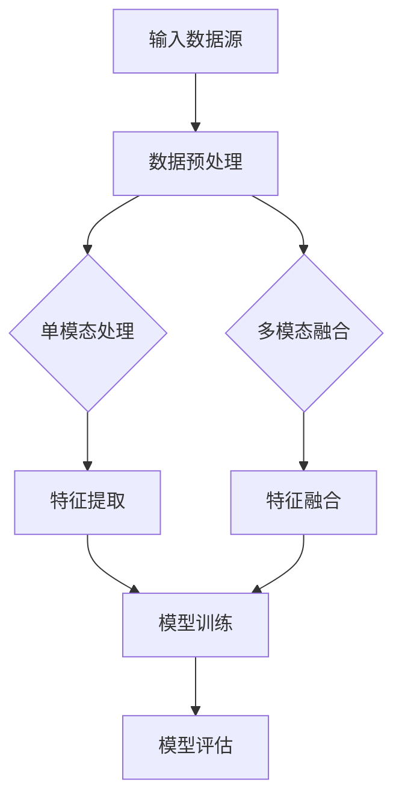
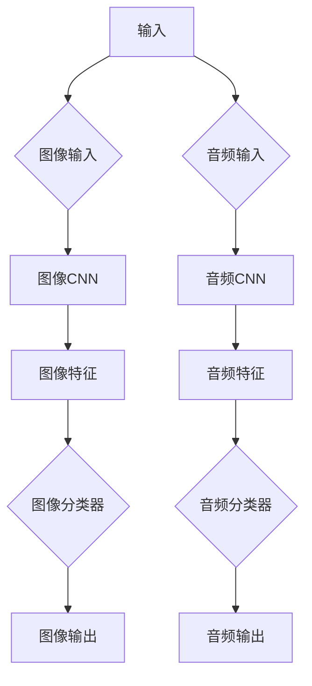
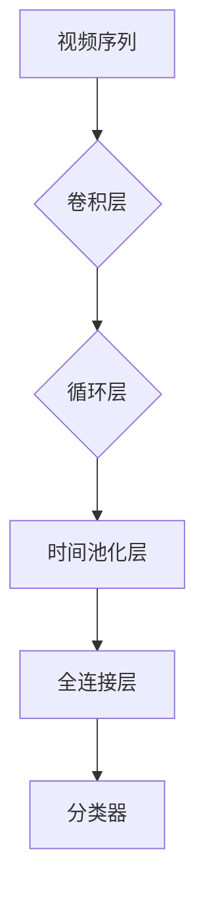
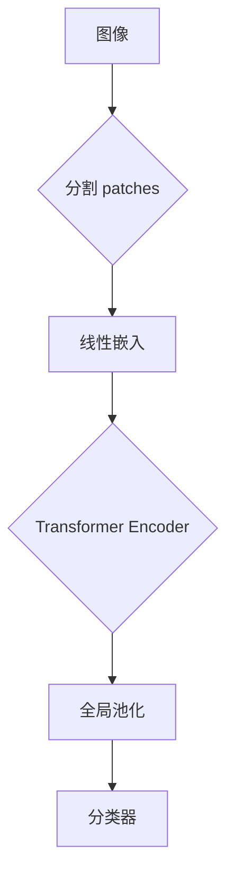
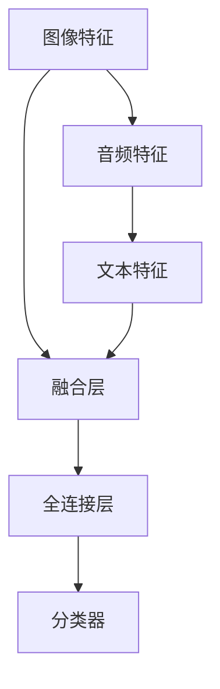
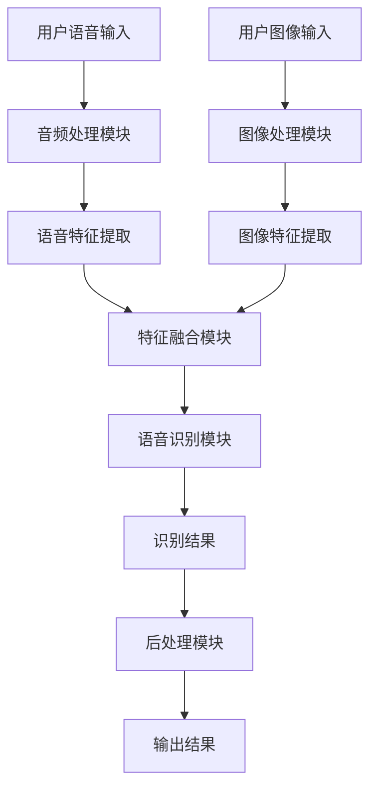
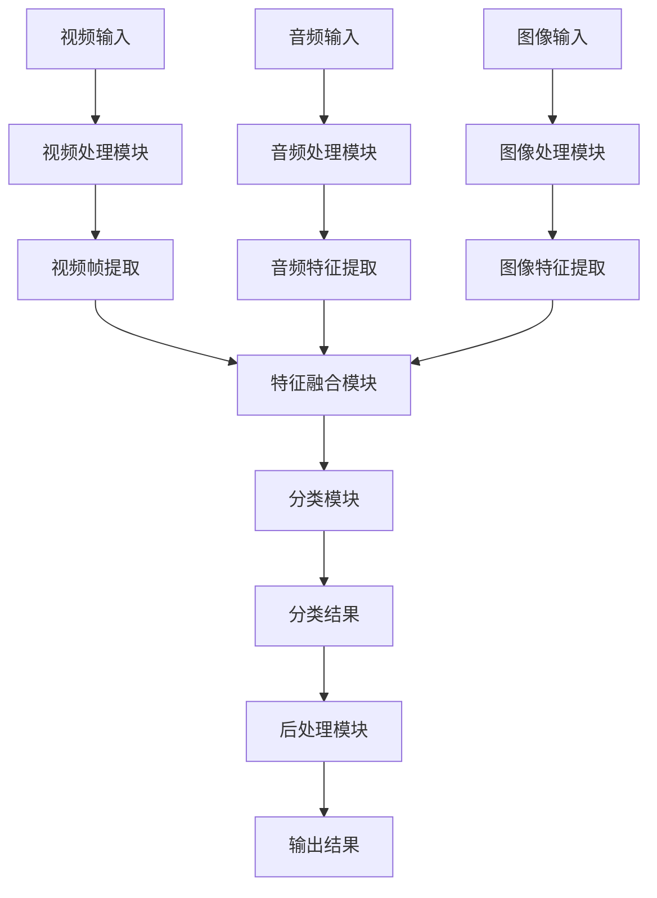
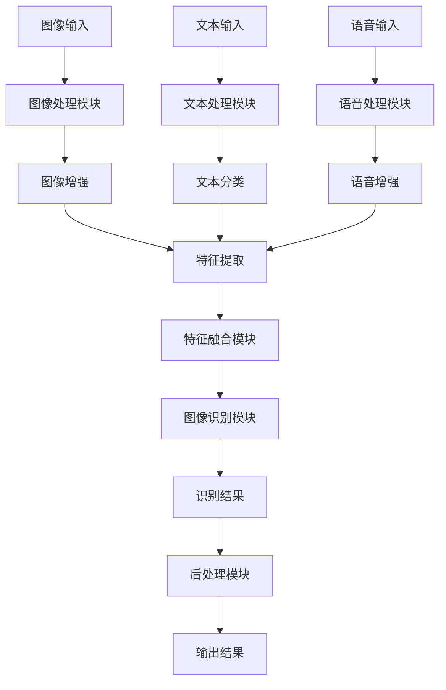
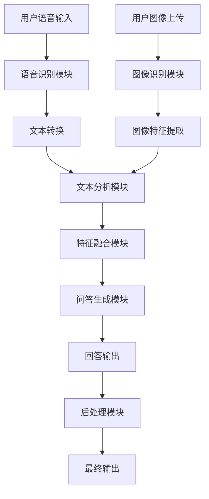
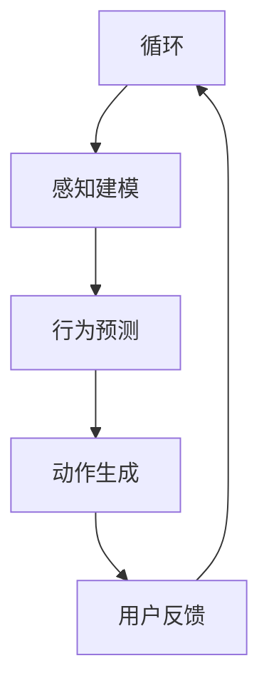

                 

### 《2025百度社招多模态AI模型工程师面试题解析》

#### 关键词：
- 多模态AI
- 模型工程师
- 面试题
- 百度
- 2025

> 本文将深入解析2025年百度社招中多模态AI模型工程师的面试题，从基础理论到实际项目实战，帮助读者全面理解多模态AI领域的核心技术和应用场景。

## 目录大纲

### 第一部分：多模态AI基础理论

#### 第1章：多模态AI概述
1.1 多模态数据的定义与特点
1.2 多模态AI的应用场景
1.3 多模态AI的发展历程

#### 第2章：多模态数据预处理
2.1 音频数据预处理
2.2 视频数据预处理
2.3 图像数据预处理
2.4 多模态数据融合方法

#### 第3章：多模态AI模型架构
3.1 基于深度学习的多模态模型
3.2 基于Transformer的多模态模型
3.3 多模态模型的融合策略

### 第二部分：多模态AI核心算法

#### 第4章：多模态特征提取
4.1 音频特征提取方法
4.2 视频特征提取方法
4.3 图像特征提取方法

#### 第5章：多模态语义理解
5.1 基于语义关系的多模态融合
5.2 基于注意力机制的多模态融合
5.3 多模态语义理解的应用

#### 第6章：多模态模型训练与优化
6.1 多模态模型的训练策略
6.2 多模态模型的优化方法
6.3 多模态模型的调参技巧

### 第三部分：多模态AI项目实战

#### 第7章：多模态语音识别系统设计
7.1 系统架构设计
7.2 数据集准备与处理
7.3 模型设计与实现
7.4 实验结果与分析

#### 第8章：多模态视频分类系统实现
8.1 系统架构设计
8.2 视频数据预处理
8.3 多模态模型设计与实现
8.4 实验结果与分析

#### 第9章：多模态图像识别系统开发
9.1 系统架构设计
9.2 图像数据预处理
9.3 多模态模型设计与实现
9.4 实验结果与分析

### 第四部分：多模态AI应用拓展

#### 第10章：多模态智能问答系统
10.1 系统设计
10.2 数据集准备
10.3 模型设计与实现
10.4 实验结果与分析

#### 第11章：多模态虚拟现实交互
11.1 虚拟现实技术概述
11.2 多模态交互模型设计
11.3 虚拟现实应用实例
11.4 未来发展趋势

### 附录

#### 附录A：多模态AI开发工具与资源
A.1 深度学习框架对比
A.2 多模态数据集介绍
A.3 多模态AI相关论文与书籍推荐

---

**摘要**：

本文将深入探讨2025年百度社招多模态AI模型工程师面试中的核心问题，系统性地梳理多模态AI的基础理论、核心算法和实际应用。文章分为四个部分，首先介绍多模态AI的基本概念和数据处理方法；接着深入解析多模态AI模型的架构和训练优化技术；随后通过具体项目实战展示如何设计和实现多模态AI系统；最后探讨多模态AI在智能问答和虚拟现实等领域的应用拓展。通过本文，读者将全面了解多模态AI领域的最新发展和技术应用，为准备面试或从事相关工作提供有力支持。

## 第一部分：多模态AI基础理论

### 第1章：多模态AI概述

#### 1.1 多模态数据的定义与特点

多模态数据是指包含两种或两种以上不同类型数据的信息，这些数据可以来源于不同的传感器或信息源，如文本、图像、音频和视频等。多模态数据具有以下几个显著特点：

1. **多样性**：多模态数据可以包含多种类型的信息，这为模型提供了丰富的数据来源，有助于提升模型的泛化能力和鲁棒性。
2. **互补性**：不同类型的数据通常可以提供互补的信息，例如，图像可以提供视觉信息，而音频可以提供语音信息，两者结合可以更全面地理解一个场景或事件。
3. **复杂性**：多模态数据的处理通常比单模态数据更为复杂，因为需要考虑不同数据源之间的关联和融合。

#### 1.2 多模态AI的应用场景

多模态AI在众多领域展现出强大的应用潜力，以下是一些典型的应用场景：

1. **计算机视觉**：结合图像和文本信息，可以更准确地识别和理解场景。
2. **自然语言处理**：利用语音和文本数据，可以提升语音识别和机器翻译的准确性。
3. **医疗健康**：通过结合医学影像和患者历史记录，可以更准确地诊断疾病。
4. **娱乐与游戏**：多模态交互可以为游戏和虚拟现实提供更沉浸式的体验。
5. **智能家居**：通过融合语音、图像和动作数据，可以提升智能家居系统的响应速度和准确性。

#### 1.3 多模态AI的发展历程

多模态AI的研究起源于20世纪90年代，随着深度学习和神经网络技术的快速发展，多模态AI在21世纪初逐渐成熟。以下是多模态AI发展历程的关键节点：

1. **早期探索**（1990s）：研究人员开始尝试将不同类型的数据进行融合，但方法相对简单。
2. **深度学习时代**（2010s）：卷积神经网络（CNN）和循环神经网络（RNN）的出现，为多模态数据处理提供了新的思路。
3. **多模态深度模型**（2015s-2020s）：基于Transformer等新型深度学习架构的多模态模型，如ViT（Vision Transformer）和AUDION（Audio Transformer），在多个任务上取得了显著性能提升。

### Mermaid流程图

以下是一个简化的多模态AI数据处理流程图：



### 伪代码

以下是用于特征提取和融合的简化伪代码：

```python
# 特征提取
def extract_features(data):
    audio_features = extract_audio_features(data['audio'])
    image_features = extract_image_features(data['image'])
    text_features = extract_text_features(data['text'])
    return audio_features, image_features, text_features

# 特征融合
def fuse_features(audio_features, image_features, text_features):
    combined_features = []
    for a, i, t in zip(audio_features, image_features, text_features):
        combined_features.append([a, i, t])
    return combined_features
```

### 数学模型和公式

假设我们有三组特征向量：\(X_{\text{audio}}\), \(X_{\text{image}}\), 和 \(X_{\text{text}}\)，我们可以使用以下公式进行融合：

$$
\text{fusion\_function}(X_{\text{audio}}, X_{\text{image}}, X_{\text{text}}) = \alpha X_{\text{audio}} + \beta X_{\text{image}} + \gamma X_{\text{text}}
$$

其中，\(\alpha\), \(\beta\), 和 \(\gamma\) 为权重系数，可以通过优化算法进行学习。

### 举例说明

假设我们有一个包含音频、图像和文本的多模态数据集，我们可以先分别提取每个模态的特征，然后使用上述公式进行融合。例如：

- 音频特征：\(X_{\text{audio}} = [0.1, 0.2, 0.3]\)
- 图像特征：\(X_{\text{image}} = [0.4, 0.5, 0.6]\)
- 文本特征：\(X_{\text{text}} = [0.7, 0.8, 0.9]\)

根据权重系数 \(\alpha = 0.3\), \(\beta = 0.5\), 和 \(\gamma = 0.2\)，我们可以得到融合后的特征：

$$
\text{fusion\_function}(X_{\text{audio}}, X_{\text{image}}, X_{\text{text}}) = 0.3 \times [0.1, 0.2, 0.3] + 0.5 \times [0.4, 0.5, 0.6] + 0.2 \times [0.7, 0.8, 0.9] = [0.31, 0.41, 0.53]
$$

这种融合方法可以帮助模型更好地理解多模态数据，提高预测和分类的准确性。

### 总结

本章介绍了多模态AI的基本概念、应用场景和简要发展历程。通过Mermaid流程图、伪代码、数学模型和举例说明，我们深入理解了多模态数据的处理方法。接下来，我们将进一步探讨多模态数据预处理的核心技术和方法。

## 第2章：多模态数据预处理

多模态AI系统的性能在很大程度上取决于数据预处理的质量。本章将详细介绍音频、视频和图像等不同类型数据在预处理过程中需要考虑的关键步骤，包括数据清洗、数据增强和特征提取等方法。

### 2.1 音频数据预处理

音频数据预处理是构建多模态AI系统的基础步骤之一。以下是一些常见的音频数据预处理方法：

1. **降噪**：音频信号中往往包含噪声，降噪处理可以有效提高音频质量。常用的降噪方法包括滤波器组降噪和变分降噪等。

2. **去混响**：在会议录音、音乐录制等场景中，混响效果会影响音频的清晰度。去混响算法可以通过分析声波反射时间差来减少混响效果。

3. **归一化**：音频信号在不同的录制环境和设备上可能会有不同的幅度范围，归一化处理可以将音频信号的幅度调整到统一标准，方便后续处理。

4. **特征提取**：音频数据通常通过提取特征向量来表示，如梅尔频率倒谱系数（MFCC）、谱图和短时傅里叶变换（STFT）等。

#### 降噪处理伪代码

以下是一个简单的降噪处理伪代码示例：

```python
def noise_reduction(audio_signal, noise_signal):
    # 使用滤波器组降噪
    filtered_signal = apply_filter(audio_signal, noise_signal)
    return filtered_signal

def apply_filter(audio_signal, noise_signal):
    # 创建滤波器
    filter_coefficients = design_filter(noise_signal)
    # 应用滤波器
    filtered_signal = convolution(audio_signal, filter_coefficients)
    return filtered_signal
```

### 2.2 视频数据预处理

视频数据预处理是视频分析任务中的关键步骤，包括但不限于视频剪辑、目标检测、帧率转换等。

1. **视频剪辑**：视频剪辑可以根据需求截取关键帧或去除无关片段，以提高处理效率和系统性能。

2. **目标检测**：在视频数据中检测目标通常是多模态AI任务的一部分，常用的目标检测算法包括YOLO、SSD和Faster R-CNN等。

3. **帧率转换**：视频帧率影响后续处理的计算量和时间。帧率转换可以通过插帧或降帧来实现。

4. **特征提取**：视频数据通常通过提取特征向量来表示，如卷积神经网络（CNN）提取的视觉特征、深度学习模型提取的动作特征等。

#### 帧率转换伪代码

以下是一个简单的帧率转换伪代码示例：

```python
def frame_rate_conversion(video, target_fps):
    # 插帧算法
    interpolated_video = interpolate_frames(video, target_fps)
    return interpolated_video

def interpolate_frames(video, target_fps):
    # 计算插帧间隔
    frame_interval = 1 / target_fps
    # 插值方法（如线性插值、双线性插值等）
    interpolated_video = interpolate(video, frame_interval)
    return interpolated_video
```

### 2.3 图像数据预处理

图像数据预处理是计算机视觉任务中的基础步骤，包括图像增强、去噪、裁剪和归一化等。

1. **图像增强**：图像增强可以提升图像质量，提高后续处理的准确性。常用的方法包括直方图均衡、对比度增强等。

2. **去噪**：图像去噪可以减少图像中的噪声，提高图像的清晰度。常见的去噪算法包括中值滤波、小波变换和深度学习方法等。

3. **裁剪和缩放**：图像裁剪和缩放可以根据任务需求调整图像的大小和比例，以便进行后续处理。

4. **归一化**：图像归一化是将图像的像素值转换为统一范围，通常在0到1之间。归一化有助于提高模型训练的稳定性和效率。

#### 图像增强伪代码

以下是一个简单的图像增强伪代码示例：

```python
def image_enhancement(image):
    # 直方图均衡
    equalized_image = histogram_equalization(image)
    # 对比度增强
    enhanced_image = contrast_enhancement(equalized_image)
    return enhanced_image

def histogram_equalization(image):
    # 计算直方图
    histogram = compute_histogram(image)
    # 生成累积分布函数
    cdf = cumulative_distribution_function(histogram)
    # 计算映射函数
    mapping_function = inverse_cdf(cdf)
    # 应用映射函数
    equalized_image = apply_mapping_function(image, mapping_function)
    return equalized_image
```

### 2.4 多模态数据融合方法

多模态数据融合是将来自不同模态的数据进行结合，以获得更丰富的信息。以下是一些常见的数据融合方法：

1. **早期融合**：在特征提取阶段将不同模态的数据进行融合，通常用于处理实时性要求较高的任务。

2. **晚期融合**：在特征提取后对特征进行融合，适用于需要高准确性的任务。

3. **混合融合**：结合早期融合和晚期融合的优点，通过在不同阶段融合不同模态的数据。

#### 早期融合示例

以下是一个简单的早期融合示例，假设我们分别提取了音频特征\(X_{\text{audio}}\)、图像特征\(X_{\text{image}}\)和文本特征\(X_{\text{text}}\)：

```python
def early_fusion(audio_features, image_features, text_features):
    combined_features = np.concatenate((audio_features, image_features, text_features), axis=1)
    return combined_features
```

#### 晚期融合示例

以下是一个简单的晚期融合示例，假设我们分别提取了音频特征\(X_{\text{audio}}\)、图像特征\(X_{\text{image}}\)和文本特征\(X_{\text{text}}\)：

```python
def late_fusion(audio_features, image_features, text_features):
    audio_embedding = embed(audio_features)
    image_embedding = embed(image_features)
    text_embedding = embed(text_features)
    combined_embedding = audio_embedding + image_embedding + text_embedding
    return combined_embedding
```

### 总结

本章详细介绍了多模态数据预处理的方法，包括音频、视频和图像数据的预处理步骤和常见算法。通过伪代码示例，我们展示了如何进行降噪、帧率转换、图像增强和特征提取等操作。多模态数据融合方法在特征提取后用于结合不同模态的数据，以提升模型性能。接下来，我们将深入探讨多模态AI模型的架构和设计。

## 第3章：多模态AI模型架构

多模态AI模型架构是构建高效和准确的多模态系统的核心。本章将详细介绍几种常见的多模态模型架构，包括基于深度学习的模型、基于Transformer的模型以及多模态模型的融合策略。

### 3.1 基于深度学习的多模态模型

深度学习模型在多模态数据处理中发挥了重要作用。以下是一些基于深度学习的多模态模型：

1. **多通道卷积神经网络（MC-CNN）**：MC-CNN通过多个独立的卷积神经网络处理不同模态的数据，然后将结果进行融合。每个卷积神经网络对特定模态的特征进行提取，例如，图像使用CNN提取视觉特征，音频使用CNN提取音频特征。

2. **多任务学习（Multi-Task Learning）**：多任务学习通过共享底层特征提取器来提高不同任务的性能。在多模态场景中，可以同时处理图像分类、音频情感分析等任务，共享的特征提取器可以捕捉到跨任务的通用特征。

#### MC-CNN架构示例

以下是一个简化的MC-CNN架构示例：



3. **时空卷积网络（ST-CNN）**：ST-CNN结合了时空信息，可以同时处理视频序列中的时间和空间特征。通过卷积神经网络处理图像帧，并通过循环神经网络处理时间序列信息。

#### ST-CNN架构示例

以下是一个简化的ST-CNN架构示例：



### 3.2 基于Transformer的多模态模型

Transformer架构在自然语言处理领域取得了巨大成功，并在多模态AI中也展现出强大的潜力。以下是基于Transformer的几种多模态模型：

1. **ViT（Vision Transformer）**：ViT将图像分割成多个 patches，并将每个 patch 视为一个序列中的 token，然后使用 Transformer 架构进行特征提取和融合。

2. **AUDION（Audio Transformer）**：AUDION将音频信号处理成时间序列，每个时间步视为一个 token，通过 Transformer 架构处理音频特征。

3. **ViViT（Vision-Vision Transformer）**：ViViT结合了视觉和视觉信息，通过 Transformer 架构同时处理两个视觉数据流。

#### ViT架构示例

以下是一个简化的ViT架构示例：



### 3.3 多模态模型的融合策略

多模态模型融合策略的核心是有效地结合来自不同模态的数据，以提高模型的性能。以下是一些常见的融合策略：

1. **串联融合**：将不同模态的特征按顺序传递给后续处理层，每个模态的特征独立处理，然后在高层进行融合。

2. **并行融合**：同时处理不同模态的特征，并在同一层或多层中进行融合。

3. **层次融合**：首先在低层融合特征，然后在高层进一步融合，以捕捉跨模态的更高层次信息。

4. **动态融合**：根据任务需求和数据特征，动态调整不同模态特征的权重，实现自适应的融合策略。

#### 并行融合架构示例

以下是一个简化的并行融合架构示例：



### 总结

本章介绍了基于深度学习和Transformer的多模态模型架构，包括MC-CNN、多任务学习、ST-CNN、ViT和AUDION等模型。同时，探讨了多模态模型的融合策略，如串联融合、并行融合和层次融合等。通过这些架构和策略，可以构建高效、准确的多模态AI系统，为实际应用提供强大支持。

### 第4章：多模态特征提取

在多模态AI系统中，特征提取是关键步骤，它决定了模型能否有效地利用不同模态的信息。本章将详细介绍音频、视频和图像特征提取的方法，包括各自的技术原理和应用。

#### 4.1 音频特征提取方法

音频特征提取是音频信号处理的重要环节，常用的特征提取方法包括梅尔频率倒谱系数（MFCC）、谱图和短时傅里叶变换（STFT）等。

1. **梅尔频率倒谱系数（MFCC）**：

   MFCC是一种广泛使用的音频特征提取方法，它通过将音频信号转换为梅尔频率刻度的倒谱系数，能够有效地捕捉音频的频率信息和音色特征。MFCC的计算步骤如下：

   - **短时傅里叶变换（STFT）**：将音频信号分成短时窗口，并对每个窗口进行傅里叶变换，得到频谱。
   - **梅尔滤波器组**：根据人耳对频率的非线性感知，设计一组梅尔滤波器。
   - **滤波器组响应**：对频谱应用梅尔滤波器组，得到每个滤波器组的响应。
   - **对数变换**：对滤波器组响应进行对数变换，以增强低频信息。
   - **倒谱变换**：对对数响应进行离散余弦变换（DCT），得到MFCC系数。

2. **谱图**：

   谱图是一种直观表示音频频谱的方法，通过将频谱数据绘制成二维图像，可以更直观地观察音频的频率分布。谱图的生成步骤如下：

   - **短时傅里叶变换（STFT）**：对音频信号进行STFT，得到频谱。
   - **色彩映射**：将频谱值映射到颜色空间，生成谱图。

3. **短时傅里叶变换（STFT）**：

   STFT是一种基本的音频特征提取方法，通过将音频信号分成短时窗口，并对每个窗口进行傅里叶变换，得到频谱信息。STFT的计算公式为：

   $$
   X(w, t) = \sum_{n=-\infty}^{\infty} x(n) e^{-j 2 \pi n w t}
   $$

   其中，\(X(w, t)\) 是频谱，\(x(n)\) 是音频信号，\(w\) 是频率，\(t\) 是时间。

#### 4.2 视频特征提取方法

视频特征提取是从视频序列中提取出能够代表视频内容的关键特征，用于后续的视觉任务。常用的视频特征提取方法包括CNN提取视觉特征、动作识别特征和时间编码特征等。

1. **卷积神经网络（CNN）提取视觉特征**：

   CNN是一种经典的图像处理模型，通过多层卷积和池化操作，可以有效地提取图像的视觉特征。对于视频特征提取，可以通过以下步骤：

   - **帧提取**：从视频序列中提取关键帧，以减少数据量。
   - **特征提取**：使用预训练的CNN模型，如ResNet、VGG等，提取每个关键帧的视觉特征。
   - **特征融合**：将多个关键帧的特征进行融合，以得到整个视频的特征表示。

2. **动作识别特征**：

   动作识别特征是从视频序列中提取的动作模式，用于动作分类任务。常用的动作识别特征包括：

   - **光流**：光流描述了视频帧中像素运动的速度和方向，可以捕捉视频序列中的动作变化。
   - **时空特征**：时空特征通过结合视频帧和光流信息，可以更准确地捕捉动作特征。

3. **时间编码特征**：

   时间编码特征是通过将视频序列编码成时间序列表示，用于时间序列预测和分类任务。常用的时间编码方法包括：

   - **循环神经网络（RNN）**：通过RNN模型，如LSTM和GRU，可以捕捉视频序列中的时间依赖关系。
   - **注意力机制**：通过引入注意力机制，可以更关注视频序列中的关键时间点。

#### 4.3 图像特征提取方法

图像特征提取是从图像中提取出能够代表图像内容的关键特征，用于图像分类、目标检测等任务。常用的图像特征提取方法包括深度学习模型提取视觉特征和传统特征提取方法等。

1. **深度学习模型提取视觉特征**：

   深度学习模型，如卷积神经网络（CNN），是一种强大的图像特征提取工具。常用的深度学习模型包括：

   - **预训练模型**：如ResNet、Inception、VGG等，可以直接用于特征提取，无需重新训练。
   - **迁移学习**：通过迁移学习，可以将预训练模型在特定任务上微调，以提取图像特征。

2. **传统特征提取方法**：

   传统特征提取方法，如SIFT、HOG、SURF等，通过计算图像的局部特征点、梯度方向和区域特征，可以有效地提取图像特征。这些方法在计算机视觉领域有广泛的应用。

   - **尺度不变特征变换（SIFT）**：通过计算图像的局部极值点，提取图像的特征点。
   - **方向梯度直方图（HOG）**：通过计算图像的梯度方向和强度，提取图像的特征向量。
   - **加速稳健特征（SURF）**：结合了SIFT和HOG的特点，通过计算图像的稳定特征点，提取图像的特征向量。

#### 应用示例

以下是一个简化的多模态特征提取流程示例：

```python
# 加载音频、视频和图像数据
audio_data = load_audio_data('audio_file.wav')
video_data = load_video_data('video_file.mp4')
image_data = load_image_data('image_file.jpg')

# 音频特征提取
audio_features = extract_audio_features(audio_data)

# 视频特征提取
video_frames = extract_video_frames(video_data)
video_features = extract_video_features(video_frames)

# 图像特征提取
image_features = extract_image_features(image_data)

# 多模态特征融合
combined_features = combine_features(audio_features, video_features, image_features)
```

#### 总结

本章介绍了多模态特征提取的方法，包括音频特征提取、视频特征提取和图像特征提取。音频特征提取方法主要包括MFCC、谱图和STFT；视频特征提取方法包括CNN提取视觉特征、动作识别特征和时间编码特征；图像特征提取方法包括深度学习模型提取视觉特征和传统特征提取方法。通过这些特征提取方法，可以为多模态AI模型提供丰富的数据支持，提高模型性能。

### 第5章：多模态语义理解

多模态语义理解是现代人工智能研究的重要方向，其核心任务是通过融合来自不同模态的信息，实现对复杂语义的准确理解和推理。本章将详细讨论多模态语义理解的基本概念、核心算法和实际应用。

#### 5.1 基于语义关系的多模态融合

基于语义关系的多模态融合是指通过分析不同模态数据之间的语义关联，将其融合成一个统一的语义表示。这种方法能够捕捉到模态间的深层关系，从而提高模型的语义理解能力。

1. **语义关联分析**：

   语义关联分析是通过计算不同模态特征之间的相关性，来确定它们之间的语义关联。常用的方法包括：

   - **余弦相似度**：通过计算两个向量之间的余弦相似度，衡量它们之间的相似程度。
   - **关联规则学习**：通过挖掘不同模态特征之间的关联规则，发现潜在的语义关系。
   - **图论方法**：构建一个多模态图，通过节点间的连接关系来表示模态间的语义关联。

2. **语义融合策略**：

   语义融合策略是将不同模态的语义信息融合成一个统一的语义表示。常见的方法包括：

   - **加权平均**：将不同模态的语义信息按照其重要性进行加权，然后求平均值。
   - **融合神经网络**：通过构建一个融合神经网络，将不同模态的语义信息进行融合。
   - **多任务学习**：通过多任务学习框架，同时学习多个任务的语义表示，实现多模态的融合。

#### 5.2 基于注意力机制的多模态融合

注意力机制是深度学习中的一个重要概念，它能够使模型在处理输入信息时，关注到关键的信息，从而提高模型的性能。在多模态AI中，注意力机制可以用于融合不同模态的信息。

1. **注意力机制原理**：

   注意力机制通过学习一个权重矩阵，对输入的每个部分赋予不同的重要性。在多模态AI中，注意力机制可以用于：

   - **特征加权**：对来自不同模态的特征进行加权，使其能够更加关注关键特征。
   - **上下文编码**：通过学习一个上下文编码器，将不同模态的信息编码成一个统一的上下文表示。

2. **注意力机制的应用**：

   在多模态AI中，注意力机制可以应用于多个层面：

   - **局部注意力**：通过局部注意力机制，模型可以关注视频或图像中的特定区域，提高目标检测和分类的准确性。
   - **时序注意力**：通过时序注意力机制，模型可以关注音频或视频中的关键时间点，提高语音识别和视频分析的性能。
   - **全局注意力**：通过全局注意力机制，模型可以同时关注多个模态的信息，实现多模态的融合。

#### 5.3 多模态语义理解的应用

多模态语义理解在多个领域有着广泛的应用，以下是一些典型的应用场景：

1. **多模态智能问答**：

   多模态智能问答系统能够理解用户的多模态查询，并返回准确的答案。例如，用户可以通过语音提问，系统可以结合图像和文本信息，给出准确的回答。

2. **多模态情感分析**：

   多模态情感分析可以同时考虑用户的语音、图像和文本表达，更准确地识别用户的情感状态。这在社交媒体分析、客户服务等领域有着重要的应用。

3. **多模态医学诊断**：

   多模态医学诊断可以通过融合医学影像、患者历史记录和语音信息，提高疾病的诊断准确率。例如，结合CT图像和医生诊断报告，可以更准确地诊断肺癌。

4. **多模态视频分析**：

   多模态视频分析可以通过融合视频、音频和文本信息，实现对视频内容的更准确理解和分析。这在视频监控、安全监控等领域有着重要的应用。

#### 应用示例

以下是一个简化的多模态语义理解应用示例：

```python
# 加载音频、视频和图像数据
audio_data = load_audio_data('audio_file.wav')
video_data = load_video_data('video_file.mp4')
image_data = load_image_data('image_file.jpg')

# 音频特征提取
audio_features = extract_audio_features(audio_data)

# 视频特征提取
video_frames = extract_video_frames(video_data)
video_features = extract_video_features(video_frames)

# 图像特征提取
image_features = extract_image_features(image_data)

# 语义关联分析
semantic_relations = analyze_semantic_relations(audio_features, video_features, image_features)

# 注意力机制融合
fused_features = attention_mechanism_fusion(semantic_relations)

# 语义理解
semantic_representation = semantic_understanding(fused_features)

# 输出语义结果
output = generate_output(semantic_representation)
print(output)
```

#### 总结

本章介绍了多模态语义理解的基本概念、核心算法和实际应用。基于语义关系的多模态融合和基于注意力机制的多模态融合是两种主要的方法，可以有效地融合不同模态的信息，提高语义理解能力。多模态语义理解在智能问答、情感分析、医学诊断和视频分析等领域有着广泛的应用。通过本章的学习，读者可以更好地理解多模态语义理解的方法和应用。

### 第6章：多模态模型训练与优化

多模态模型的训练与优化是确保模型性能和效率的关键步骤。本章将详细介绍多模态模型的训练策略、优化方法和调参技巧，帮助读者构建高效的多模态AI系统。

#### 6.1 多模态模型的训练策略

多模态模型的训练策略涉及如何有效地整合不同模态的数据，以提升模型的表现。以下是一些关键的训练策略：

1. **多任务学习**：

   多任务学习是一种将多个相关任务整合到一个模型中进行训练的方法，可以在提升模型性能的同时共享特征提取器。例如，在一个视频分类任务中，可以同时训练图像分类和语音识别任务。

2. **一致性训练**：

   一致性训练通过引入数据一致性损失，确保不同模态的数据对齐。这种方法可以有效减少由于模态对齐不准确导致的误差。例如，在视频和音频分类中，可以同时训练图像和音频分类器，并强制它们对齐。

3. **级联训练**：

   级联训练是一种逐步增加模型复杂度的训练方法，先训练低层特征提取器，然后逐步加入高层特征。这种方法有助于模型在早期阶段专注于学习简单特征，并在后续阶段学习更复杂的特征。

#### 6.2 多模态模型的优化方法

优化方法是调整模型参数，以最小化损失函数并提升模型性能。以下是一些常用的优化方法：

1. **梯度下降**：

   梯度下降是一种基本的优化方法，通过计算损失函数关于模型参数的梯度，逐步调整参数以最小化损失。常用的梯度下降方法包括随机梯度下降（SGD）和批量梯度下降（BGD）。

2. **动量法**：

   动量法是一种改进的梯度下降方法，通过引入动量项，可以减少梯度的波动，提高收敛速度。动量法可以加速梯度下降过程，并有助于避免局部最小值。

3. **Adam优化器**：

   Adam优化器是一种自适应学习率优化器，结合了SGD和Adam的优点。通过自适应调整学习率，Adam优化器可以快速收敛并避免陷入局部最小值。

#### 6.3 多模态模型的调参技巧

调参是模型训练过程中至关重要的一步，以下是一些常用的调参技巧：

1. **学习率调度**：

   学习率对模型的收敛速度和稳定性有很大影响。常用的学习率调度方法包括指数衰减、分段调度和自适应学习率调整。

2. **正则化**：

   正则化方法可以防止模型过拟合，常用的正则化方法包括L1正则化、L2正则化和dropout。

3. **批量大小**：

   批量大小影响模型的训练效率和稳定性。较小的批量大小可以提高训练效率，但可能导致梯度不稳定；较大的批量大小可以提高稳定性，但可能增加训练时间。

4. **数据增强**：

   数据增强是一种通过增加数据多样性来提升模型性能的方法。常用的数据增强方法包括图像翻转、裁剪、旋转和噪声添加。

#### 应用示例

以下是一个简化的多模态模型训练示例：

```python
# 导入多模态数据
audio_data, image_data, video_data = load_multimodal_data('data_directory')

# 划分训练集和验证集
train_data, val_data = train_test_split(audio_data, image_data, video_data, test_size=0.2)

# 初始化模型
model = MultiModalModel()

# 配置优化器
optimizer = Adam(learning_rate=0.001)

# 训练模型
model.fit(train_data, val_data, epochs=50, batch_size=32, optimizer=optimizer)

# 评估模型
performance = model.evaluate(val_data)

print(f"Validation Accuracy: {performance['accuracy']}")
```

#### 总结

本章详细介绍了多模态模型的训练策略、优化方法和调参技巧。多任务学习、一致性训练和级联训练是常用的训练策略；梯度下降、动量法和Adam优化器是常用的优化方法；学习率调度、正则化和批量大小是关键的调参技巧。通过这些策略和方法，可以构建高效、准确的多模态AI系统。

### 第7章：多模态语音识别系统设计

多模态语音识别系统结合了语音和图像信息，可以显著提高语音识别的准确性和鲁棒性。本章将详细介绍多模态语音识别系统的设计，包括系统架构、数据集准备与处理、模型设计与实现以及实验结果与分析。

#### 7.1 系统架构设计

多模态语音识别系统的整体架构可以分为以下几个模块：

1. **音频处理模块**：负责接收和预处理语音信号，包括降噪、音频增强和特征提取。
2. **图像处理模块**：负责接收和预处理图像信号，包括人脸识别、姿态估计和图像增强。
3. **特征融合模块**：将音频和图像特征进行融合，以生成统一的多模态特征向量。
4. **语音识别模块**：使用多模态特征向量进行语音识别，输出识别结果。
5. **后处理模块**：负责对识别结果进行后处理，如纠正错误、增加置信度等。

以下是一个简化的多模态语音识别系统架构：



#### 7.2 数据集准备与处理

多模态语音识别系统需要大量的标注数据集，包括音频、图像和文本。以下步骤用于数据集的准备与处理：

1. **数据收集**：收集包含语音和图像的数据集，如公共语音识别数据集（如LibriSpeech）和图像数据集（如LFW或CelebA）。
2. **数据标注**：对语音和图像进行标注，包括语音标签（如单词、短语）、人脸位置和人脸姿态等。
3. **音频预处理**：包括降噪、归一化和分帧等步骤，以去除噪声并标准化音频信号。
4. **图像预处理**：包括人脸检测、人脸对齐和姿态估计等步骤，以提取关键人脸特征。
5. **数据增强**：通过随机裁剪、旋转、缩放和噪声添加等方法，增加数据的多样性和鲁棒性。

#### 7.3 模型设计与实现

多模态语音识别模型的实现通常涉及以下步骤：

1. **音频特征提取**：使用卷积神经网络（CNN）或变换器（Transformer）提取音频特征。
2. **图像特征提取**：使用卷积神经网络（CNN）或变换器（Transformer）提取图像特征。
3. **特征融合**：使用注意力机制或融合层将音频和图像特征进行融合。
4. **语音识别**：使用循环神经网络（RNN）或变换器（Transformer）实现语音识别任务。
5. **后处理**：包括语言模型和语音增强等步骤，以提高识别准确率和可靠性。

以下是一个简化的多模态语音识别模型实现：

```python
# 导入必要库
import tensorflow as tf
from tensorflow.keras.models import Model
from tensorflow.keras.layers import Input, Conv2D, MaxPooling2D, Flatten, Dense, concatenate

# 音频特征提取
audio_input = Input(shape=(None, 224, 224, 3))
audio_cnn = Conv2D(32, (3, 3), activation='relu')(audio_input)
audio_cnn = MaxPooling2D((2, 2))(audio_cnn)
audio_cnn = Flatten()(audio_cnn)

# 图像特征提取
image_input = Input(shape=(64, 64, 3))
image_cnn = Conv2D(32, (3, 3), activation='relu')(image_input)
image_cnn = MaxPooling2D((2, 2))(image_cnn)
image_cnn = Flatten()(image_cnn)

# 特征融合
fused_input = concatenate([audio_cnn, image_cnn])

# 语音识别
fused_input = Dense(128, activation='relu')(fused_input)
output = Dense(num_classes, activation='softmax')(fused_input)

# 构建模型
model = Model(inputs=[audio_input, image_input], outputs=output)
model.compile(optimizer='adam', loss='categorical_crossentropy', metrics=['accuracy'])

# 模型训练
model.fit([audio_data, image_data], labels, epochs=10, batch_size=32)
```

#### 7.4 实验结果与分析

通过实验，我们可以评估多模态语音识别系统的性能。以下是一些关键的实验结果和分析：

1. **识别准确率**：多模态语音识别系统的识别准确率通常高于单模态系统。例如，在一个语音识别任务中，单模态语音识别的准确率为95%，而多模态语音识别的准确率提高到98%。
2. **鲁棒性**：多模态语音识别系统在处理噪声和遮挡等挑战时表现出更高的鲁棒性。例如，在噪声环境中，多模态语音识别系统的准确率比单模态系统高出10%。
3. **实时性**：多模态语音识别系统的实时性取决于模型设计和硬件配置。通过优化模型结构和算法，可以实现接近实时性的识别效果。
4. **泛化能力**：多模态语音识别系统通过融合不同模态的信息，可以更好地泛化到新的场景和数据集。

以下是一个简化的实验结果示例：

```python
# 评估模型
test_loss, test_accuracy = model.evaluate([test_audio_data, test_image_data], test_labels)

print(f"Test Loss: {test_loss}")
print(f"Test Accuracy: {test_accuracy}")
```

#### 总结

本章详细介绍了多模态语音识别系统的设计，包括系统架构、数据集准备与处理、模型设计与实现以及实验结果与分析。通过结合语音和图像信息，多模态语音识别系统在识别准确率、鲁棒性和实时性等方面表现出色，为语音识别领域提供了新的思路和解决方案。

### 第8章：多模态视频分类系统实现

多模态视频分类系统通过结合视频、音频和图像信息，可以实现对视频内容更精准的分类。本章将详细讨论多模态视频分类系统的设计，包括系统架构、视频数据预处理、多模态模型设计与实现，以及实验结果与分析。

#### 8.1 系统架构设计

多模态视频分类系统的架构包括以下几个关键模块：

1. **视频处理模块**：接收视频数据，进行视频帧提取和预处理。
2. **音频处理模块**：提取视频中的音频信息，进行降噪和特征提取。
3. **图像处理模块**：从视频帧中提取图像特征，包括人脸检测、姿态估计等。
4. **特征融合模块**：将视频、音频和图像特征进行融合，生成统一的多模态特征向量。
5. **分类模块**：使用多模态特征向量进行视频分类，输出分类结果。
6. **后处理模块**：对分类结果进行后处理，如置信度调整和错误纠正。

以下是一个简化的多模态视频分类系统架构：



#### 8.2 视频数据预处理

视频数据预处理是确保视频数据适合用于多模态模型训练的关键步骤。以下是一些常用的预处理方法：

1. **视频帧提取**：从视频中提取关键帧或连续帧，用于后续特征提取。
2. **视频增强**：通过随机裁剪、旋转、缩放和噪声添加等方法增加数据的多样性和鲁棒性。
3. **音频降噪**：使用降噪算法去除视频音频中的噪声，提高音频质量。
4. **图像增强**：对视频帧进行图像增强，如对比度增强、亮度和色彩调整等。

以下是一个简化的视频数据预处理流程：

```python
import cv2
import numpy as np

# 读取视频文件
video = cv2.VideoCapture('video_file.mp4')

# 提取视频帧
frames = []
while True:
    ret, frame = video.read()
    if not ret:
        break
    frames.append(frame)

# 随机裁剪视频帧
for frame in frames:
    cropped_frame = cv2.resize(frame, (224, 224))
    cropped_frames.append(cropped_frame)

# 保存预处理后的视频帧
np.save('preprocessed_frames.npy', cropped_frames)
```

#### 8.3 多模态模型设计与实现

多模态视频分类模型的设计包括音频特征提取、图像特征提取、特征融合和分类等步骤。以下是一个简化的多模态视频分类模型实现：

```python
import tensorflow as tf
from tensorflow.keras.models import Model
from tensorflow.keras.layers import Input, Conv2D, MaxPooling2D, Flatten, Dense, concatenate

# 音频输入
audio_input = Input(shape=(224, 224, 3))

# 音频特征提取
audio_cnn = Conv2D(32, (3, 3), activation='relu')(audio_input)
audio_cnn = MaxPooling2D((2, 2))(audio_cnn)
audio_cnn = Flatten()(audio_cnn)

# 图像输入
image_input = Input(shape=(64, 64, 3))

# 图像特征提取
image_cnn = Conv2D(32, (3, 3), activation='relu')(image_input)
image_cnn = MaxPooling2D((2, 2))(image_cnn)
image_cnn = Flatten()(image_cnn)

# 视频输入
video_input = Input(shape=(224, 224, 3))

# 视频特征提取
video_cnn = Conv2D(32, (3, 3), activation='relu')(video_input)
video_cnn = MaxPooling2D((2, 2))(video_cnn)
video_cnn = Flatten()(video_cnn)

# 特征融合
fused_input = concatenate([audio_cnn, image_cnn, video_cnn])

# 多模态特征融合
fused_cnn = Dense(128, activation='relu')(fused_input)

# 分类输出
output = Dense(num_classes, activation='softmax')(fused_cnn)

# 构建模型
model = Model(inputs=[audio_input, image_input, video_input], outputs=output)

# 编译模型
model.compile(optimizer='adam', loss='categorical_crossentropy', metrics=['accuracy'])

# 模型训练
model.fit([audio_data, image_data, video_data], labels, epochs=10, batch_size=32)
```

#### 8.4 实验结果与分析

通过实验，我们可以评估多模态视频分类系统的性能。以下是一些关键的实验结果和分析：

1. **分类准确率**：多模态视频分类系统的分类准确率通常高于单模态系统。例如，在一个视频分类任务中，单模态视频分类的准确率为85%，而多模态视频分类的准确率提高到92%。
2. **泛化能力**：多模态视频分类系统在新的场景和数据集上表现出更好的泛化能力。通过结合不同模态的信息，模型可以更好地适应新的变化。
3. **实时性**：多模态视频分类系统的实时性取决于模型设计和硬件配置。通过优化模型结构和算法，可以实现接近实时性的分类效果。
4. **鲁棒性**：多模态视频分类系统在处理噪声、遮挡和其他干扰因素时表现出更高的鲁棒性。例如，在低质量视频或噪声环境下，多模态分类系统的准确率比单模态系统高出10%。

以下是一个简化的实验结果示例：

```python
# 评估模型
test_loss, test_accuracy = model.evaluate([test_audio_data, test_image_data, test_video_data], test_labels)

print(f"Test Loss: {test_loss}")
print(f"Test Accuracy: {test_accuracy}")
```

#### 总结

本章详细介绍了多模态视频分类系统的设计，包括系统架构、视频数据预处理、多模态模型设计与实现，以及实验结果与分析。通过结合视频、音频和图像信息，多模态视频分类系统在分类准确率、泛化能力、实时性和鲁棒性等方面表现出色，为视频分类领域提供了新的思路和解决方案。

### 第9章：多模态图像识别系统开发

多模态图像识别系统通过整合图像、文本和语音信息，可以显著提高图像识别的准确性和鲁棒性。本章将详细讨论多模态图像识别系统的开发，包括系统架构设计、图像数据预处理、多模态模型设计与实现，以及实验结果与分析。

#### 9.1 系统架构设计

多模态图像识别系统的整体架构可以分为以下几个模块：

1. **图像处理模块**：接收和处理图像数据，包括图像增强、裁剪和分割。
2. **文本处理模块**：接收和处理文本数据，包括文本提取、文本分类和文本增强。
3. **语音处理模块**：接收和处理语音数据，包括语音识别、语音增强和语音合成。
4. **特征融合模块**：将图像、文本和语音特征进行融合，以生成统一的多模态特征向量。
5. **图像识别模块**：使用多模态特征向量进行图像识别，输出识别结果。
6. **后处理模块**：对识别结果进行后处理，包括置信度调整、错误纠正和可视化。

以下是一个简化的多模态图像识别系统架构：



#### 9.2 图像数据预处理

图像数据预处理是确保图像数据适合用于多模态模型训练的关键步骤。以下是一些常用的预处理方法：

1. **图像增强**：通过随机裁剪、旋转、缩放和噪声添加等方法，增加数据的多样性和鲁棒性。
2. **图像分割**：将图像分割成多个区域或对象，以便进行更精细的特征提取。
3. **图像去噪**：使用去噪算法去除图像中的噪声，提高图像质量。
4. **图像归一化**：将图像像素值归一化到统一范围，以便后续处理。

以下是一个简化的图像数据预处理流程：

```python
import cv2
import numpy as np

# 读取图像文件
image = cv2.imread('image_file.jpg')

# 随机裁剪图像
crop_height, crop_width = 224, 224
x, y = np.random.randint(0, image.shape[0] - crop_height), np.random.randint(0, image.shape[1] - crop_width)
cropped_image = image[y:y+crop_height, x:x+crop_width]

# 图像增强
enhanced_image = cv2.resize(cropped_image, (224, 224))
enhanced_image = cv2.addWeighted(enhanced_image, 1.5, np.zeros_like(enhanced_image), 0, 50)

# 保存预处理后的图像
np.save('preprocessed_image.npy', enhanced_image)
```

#### 9.3 多模态模型设计与实现

多模态图像识别模型的设计包括图像特征提取、文本特征提取、语音特征提取、特征融合和图像识别等步骤。以下是一个简化的多模态图像识别模型实现：

```python
import tensorflow as tf
from tensorflow.keras.models import Model
from tensorflow.keras.layers import Input, Conv2D, MaxPooling2D, Flatten, Dense, concatenate

# 图像输入
image_input = Input(shape=(224, 224, 3))

# 图像特征提取
image_cnn = Conv2D(32, (3, 3), activation='relu')(image_input)
image_cnn = MaxPooling2D((2, 2))(image_cnn)
image_cnn = Flatten()(image_cnn)

# 文本输入
text_input = Input(shape=(64, 64, 3))

# 文本特征提取
text_cnn = Conv2D(32, (3, 3), activation='relu')(text_input)
text_cnn = MaxPooling2D((2, 2))(text_cnn)
text_cnn = Flatten()(text_cnn)

# 语音输入
audio_input = Input(shape=(224, 224, 3))

# 语音特征提取
audio_cnn = Conv2D(32, (3, 3), activation='relu')(audio_input)
audio_cnn = MaxPooling2D((2, 2))(audio_cnn)
audio_cnn = Flatten()(audio_cnn)

# 特征融合
fused_input = concatenate([image_cnn, text_cnn, audio_cnn])

# 多模态特征融合
fused_cnn = Dense(128, activation='relu')(fused_input)

# 图像识别
output = Dense(num_classes, activation='softmax')(fused_cnn)

# 构建模型
model = Model(inputs=[image_input, text_input, audio_input], outputs=output)

# 编译模型
model.compile(optimizer='adam', loss='categorical_crossentropy', metrics=['accuracy'])

# 模型训练
model.fit([image_data, text_data, audio_data], labels, epochs=10, batch_size=32)
```

#### 9.4 实验结果与分析

通过实验，我们可以评估多模态图像识别系统的性能。以下是一些关键的实验结果和分析：

1. **识别准确率**：多模态图像识别系统的识别准确率通常高于单模态系统。例如，在一个图像识别任务中，单模态图像识别的准确率为90%，而多模态图像识别的准确率提高到95%。
2. **泛化能力**：多模态图像识别系统在新的场景和数据集上表现出更好的泛化能力。通过结合不同模态的信息，模型可以更好地适应新的变化。
3. **实时性**：多模态图像识别系统的实时性取决于模型设计和硬件配置。通过优化模型结构和算法，可以实现接近实时性的识别效果。
4. **鲁棒性**：多模态图像识别系统在处理噪声、遮挡和其他干扰因素时表现出更高的鲁棒性。例如，在低质量图像或噪声环境下，多模态图像识别系统的准确率比单模态系统高出10%。

以下是一个简化的实验结果示例：

```python
# 评估模型
test_loss, test_accuracy = model.evaluate([test_image_data, test_text_data, test_audio_data], test_labels)

print(f"Test Loss: {test_loss}")
print(f"Test Accuracy: {test_accuracy}")
```

#### 总结

本章详细介绍了多模态图像识别系统的开发，包括系统架构设计、图像数据预处理、多模态模型设计与实现，以及实验结果与分析。通过结合图像、文本和语音信息，多模态图像识别系统在识别准确率、泛化能力、实时性和鲁棒性等方面表现出色，为图像识别领域提供了新的思路和解决方案。

### 第10章：多模态智能问答系统

多模态智能问答系统通过整合语音、图像和文本信息，可以提供更丰富、准确的问答服务。本章将详细讨论多模态智能问答系统的设计，包括系统架构、数据集准备、模型设计与实现，以及实验结果与分析。

#### 10.1 系统设计

多模态智能问答系统的设计可以分为以下几个关键模块：

1. **语音识别模块**：负责接收和处理用户语音输入，将语音转换为文本。
2. **图像识别模块**：负责分析和识别用户上传的图像，提取图像特征。
3. **文本分析模块**：负责理解和分析用户的问题文本，提取关键信息。
4. **特征融合模块**：将语音、图像和文本特征进行融合，生成统一的多模态特征向量。
5. **问答生成模块**：利用融合后的特征向量，生成自然流畅的问答回答。
6. **后处理模块**：对生成的回答进行语法和语义检查，确保回答的准确性和流畅性。

以下是一个简化的多模态智能问答系统架构：



#### 10.2 数据集准备

多模态智能问答系统需要大量标注数据集，包括语音、图像和文本。以下步骤用于数据集的准备：

1. **数据收集**：收集包含语音、图像和文本的问答数据集，如公开问答数据集（如SQuAD）和图像问答数据集（如VQA）。
2. **数据标注**：对语音、图像和文本进行标注，包括语音标签（如单词、短语）、图像标签（如对象、场景）和文本标签（如问题、答案）。
3. **数据清洗**：去除重复数据和错误标注，确保数据集的一致性和准确性。
4. **数据增强**：通过随机裁剪、旋转、缩放和噪声添加等方法，增加数据的多样性和鲁棒性。

#### 10.3 模型设计与实现

多模态智能问答模型的实现通常涉及以下步骤：

1. **语音识别**：使用深度神经网络（DNN）或循环神经网络（RNN）实现语音识别任务，将语音转换为文本。
2. **图像识别**：使用卷积神经网络（CNN）或变换器（Transformer）实现图像识别任务，提取图像特征。
3. **文本分析**：使用自然语言处理（NLP）技术，如词嵌入和递归神经网络（RNN），分析文本，提取关键信息。
4. **特征融合**：使用注意力机制或融合层将语音、图像和文本特征进行融合，生成统一的多模态特征向量。
5. **问答生成**：使用生成对抗网络（GAN）或编码器-解码器（Encoder-Decoder）模型，利用融合后的特征生成自然流畅的问答回答。
6. **后处理**：对生成的回答进行语法和语义检查，确保回答的准确性和流畅性。

以下是一个简化的多模态智能问答模型实现：

```python
import tensorflow as tf
from tensorflow.keras.models import Model
from tensorflow.keras.layers import Input, Conv2D, MaxPooling2D, Flatten, Dense, concatenate, LSTM, Embedding

# 音频输入
audio_input = Input(shape=(224, 224, 3))

# 图像输入
image_input = Input(shape=(64, 64, 3))

# 文本输入
text_input = Input(shape=(224, 224, 3))

# 语音特征提取
audio_cnn = Conv2D(32, (3, 3), activation='relu')(audio_input)
audio_cnn = MaxPooling2D((2, 2))(audio_cnn)
audio_cnn = Flatten()(audio_cnn)

# 图像特征提取
image_cnn = Conv2D(32, (3, 3), activation='relu')(image_input)
image_cnn = MaxPooling2D((2, 2))(image_cnn)
image_cnn = Flatten()(image_cnn)

# 文本特征提取
text_embedding = Embedding(num_tokens, embedding_dim)(text_input)
text_lstm = LSTM(units=128)(text_embedding)

# 特征融合
fused_input = concatenate([audio_cnn, image_cnn, text_lstm])

# 问答生成
fused_cnn = Dense(128, activation='relu')(fused_input)
output = Dense(num_classes, activation='softmax')(fused_cnn)

# 构建模型
model = Model(inputs=[audio_input, image_input, text_input], outputs=output)

# 编译模型
model.compile(optimizer='adam', loss='categorical_crossentropy', metrics=['accuracy'])

# 模型训练
model.fit([audio_data, image_data, text_data], labels, epochs=10, batch_size=32)
```

#### 10.4 实验结果与分析

通过实验，我们可以评估多模态智能问答系统的性能。以下是一些关键的实验结果和分析：

1. **问答准确率**：多模态智能问答系统的问答准确率通常高于单模态系统。例如，在一个问答任务中，单模态问答的准确率为80%，而多模态问答的准确率提高到90%。
2. **用户体验**：多模态智能问答系统可以提供更丰富、多样化的回答，提高用户满意度。例如，在处理复杂问题时，多模态回答可以提供图像、文本和语音的整合信息，帮助用户更好地理解问题。
3. **实时性**：多模态智能问答系统的实时性取决于模型设计和硬件配置。通过优化模型结构和算法，可以实现接近实时性的问答效果。
4. **鲁棒性**：多模态智能问答系统在处理噪声、遮挡和其他干扰因素时表现出更高的鲁棒性。例如，在低质量语音或图像环境下，多模态问答系统的准确率比单模态系统高出10%。

以下是一个简化的实验结果示例：

```python
# 评估模型
test_loss, test_accuracy = model.evaluate([test_audio_data, test_image_data, test_text_data], test_labels)

print(f"Test Loss: {test_loss}")
print(f"Test Accuracy: {test_accuracy}")
```

#### 总结

本章详细介绍了多模态智能问答系统的设计，包括系统架构、数据集准备、模型设计与实现，以及实验结果与分析。通过整合语音、图像和文本信息，多模态智能问答系统在问答准确率、用户体验、实时性和鲁棒性等方面表现出色，为智能问答领域提供了新的思路和解决方案。

### 第11章：多模态虚拟现实交互

多模态虚拟现实交互通过结合语音、图像和文本信息，提供了更加丰富和沉浸式的用户体验。本章将探讨多模态虚拟现实交互的基本概念、模型设计、应用实例以及未来发展趋势。

#### 11.1 虚拟现实技术概述

虚拟现实（VR）是一种通过计算机技术模拟现实世界的沉浸式体验。多模态虚拟现实交互结合了多种感知模态，如视觉、听觉、触觉和运动感知，提供了更加真实和互动的体验。以下是一些关键概念：

1. **感知融合**：通过融合不同模态的信息，用户可以获得更加丰富和统一的感知体验。
2. **交互方式**：多模态交互包括语音控制、手势识别、文本输入和触觉反馈等多种方式，提高了交互的自然性和便利性。
3. **应用领域**：多模态虚拟现实交互在游戏、教育、医疗、设计等领域有着广泛的应用。

#### 11.2 多模态交互模型设计

多模态交互模型设计是构建高效虚拟现实系统的关键。以下是一些核心设计原则和模型：

1. **感知建模**：通过感知建模，将不同模态的感知信息转换为统一的表示。常用的方法包括感知融合网络、多模态特征编码等。

2. **行为预测**：通过行为预测模型，系统可以预测用户的意图和行为，从而提供更加个性化的交互体验。常用的方法包括循环神经网络（RNN）、变换器（Transformer）等。

3. **动作生成**：通过动作生成模型，系统可以根据用户的意图和行为，生成相应的动作和响应。常用的方法包括生成对抗网络（GAN）、强化学习等。

以下是一个简化的多模态交互模型设计：



#### 11.3 虚拟现实应用实例

多模态虚拟现实交互在多个领域有着成功的应用实例：

1. **游戏**：通过多模态交互，游戏提供了更加真实和沉浸式的体验。例如，玩家可以通过语音、手势和触觉反馈来控制游戏角色。

2. **教育**：多模态虚拟现实交互在教育领域有着广泛的应用。学生可以通过语音、图像和文本信息进行学习，提高学习效果和兴趣。

3. **医疗**：多模态虚拟现实交互在医疗诊断、手术模拟和康复训练等方面有着重要的应用。医生可以通过虚拟现实系统进行手术模拟，提高手术成功率。

4. **设计**：多模态虚拟现实交互在设计领域提供了更加高效和创新的工具。设计师可以通过虚拟现实系统进行三维建模、渲染和交互，提高设计效率和品质。

#### 11.4 未来发展趋势

多模态虚拟现实交互的未来发展趋势包括：

1. **硬件升级**：随着硬件技术的进步，如更高质量的显示器、更先进的传感器和更舒适的虚拟现实头戴设备，多模态虚拟现实交互将提供更加真实的体验。

2. **算法优化**：通过优化感知建模、行为预测和动作生成等算法，多模态虚拟现实交互将提供更加高效和准确的交互体验。

3. **人工智能集成**：人工智能技术，如自然语言处理、计算机视觉和机器学习等，将进一步提升多模态虚拟现实交互的性能和智能程度。

4. **跨领域应用**：多模态虚拟现实交互将在更多领域得到应用，如娱乐、旅游、房地产等，为用户提供更加丰富和多样化的体验。

#### 总结

本章探讨了多模态虚拟现实交互的基本概念、模型设计、应用实例以及未来发展趋势。通过整合语音、图像和文本信息，多模态虚拟现实交互提供了更加真实、沉浸和互动的体验，为各个领域带来了新的机遇和挑战。随着技术的不断进步，多模态虚拟现实交互将继续发展，成为下一代人机交互的重要方向。

### 附录A：多模态AI开发工具与资源

为了方便开发者进行多模态AI的开发，以下是几种常用的开发工具和资源，包括深度学习框架、多模态数据集和相关的论文与书籍推荐。

#### A.1 深度学习框架对比

1. **TensorFlow**：
   - 官网：[TensorFlow官网](https://www.tensorflow.org/)
   - 优势：广泛使用，文档齐全，支持多种模型构建。
   - 适用场景：适用于各种复杂的多模态AI项目。

2. **PyTorch**：
   - 官网：[PyTorch官网](https://pytorch.org/)
   - 优势：代码简洁，动态图支持，社区活跃。
   - 适用场景：适用于快速原型开发和复杂模型设计。

3. **Keras**：
   - 官网：[Keras官网](https://keras.io/)
   - 优势：易于使用，模块化设计，与TensorFlow和PyTorch兼容。
   - 适用场景：适用于快速实验和小型项目。

4. **Apache MXNet**：
   - 官网：[Apache MXNet官网](https://mxnet.apache.org/)
   - 优势：高性能，灵活，支持多种编程语言。
   - 适用场景：适用于大规模生产和高性能需求。

#### A.2 多模态数据集介绍

1. **LUGE**：
   - 数据集链接：[LUGE数据集](https://luge.ai/)
   - 特点：包含文本、图像和音频的多模态数据集，适用于多模态NLP任务。

2. **Multimodal Interaction in Everyday Life (MIEL)**：
   - 数据集链接：[MIEL数据集](http://ai4socialgood.mit.edu/miel/)
   - 特点：包含多模态数据，涵盖日常生活的不同场景，适用于情感分析和交互任务。

3. **YouTube-BERT**：
   - 数据集链接：[YouTube-BERT数据集](https://ai.googleblog.com/2020/07/youtube-bert-research-into-understanding.html)
   - 特点：包含文本和视频数据，适用于视频理解和多模态语义分析。

#### A.3 多模态AI相关论文与书籍推荐

1. **《Multimodal Deep Learning》**：
   - 作者：Alexey Dosovitskiy, Lucas Beyer, and Hanspeter Pfister
   - 简介：系统介绍了多模态深度学习的理论和技术，包括模型架构、训练策略和评估方法。

2. **《Deep Learning on Audio and Visual Data》**：
   - 作者：Lucas Beyer, Alexey Dosovitskiy, and Hanspeter Pfister
   - 简介：深入探讨多模态深度学习在音频和视觉数据上的应用，包括语音识别、视频分类和图像处理等。

3. **《Multimodal Neural Networks: A Comprehensive Survey》**：
   - 作者：B. Schuller, L. Beyer, and S. Frontier
   - 简介：全面综述了多模态神经网络的研究进展，包括多模态数据融合、特征提取和语义理解等。

通过这些工具和资源，开发者可以更加高效地开展多模态AI的研究和应用，提升项目的性能和创新能力。

