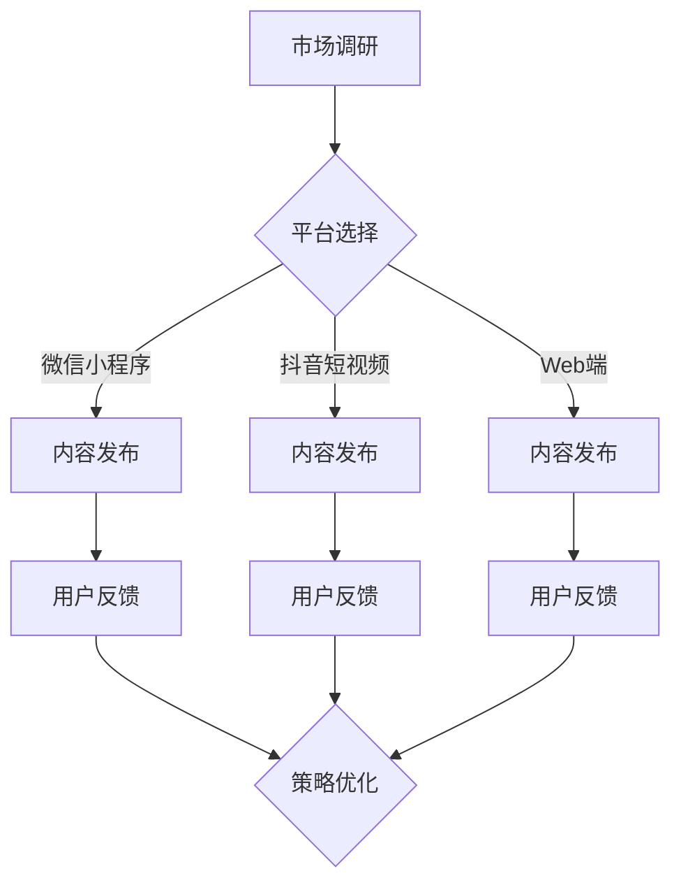
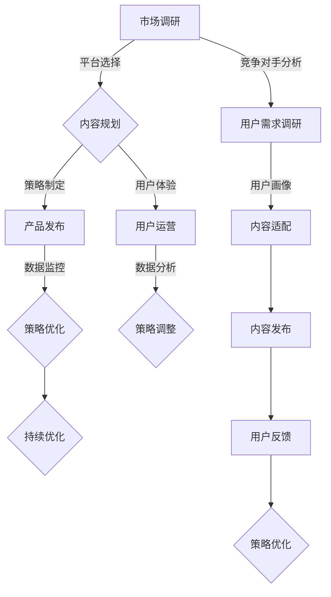

                 

# 《知识付费产品的跨平台分发策略》

> **关键词**：知识付费、跨平台分发、策略、市场调研、用户体验、技术支持

> **摘要**：本文将深入探讨知识付费产品在当前市场上的发展背景、现状与趋势，分析跨平台分发策略的概念、重要性及核心要素，并详细介绍跨平台分发策略的实施与优化方法。通过实际案例分析，本文将为知识付费产品的开发者提供一套系统的跨平台分发策略，旨在提升产品竞争力、扩大用户覆盖面。

## 目录

### 《知识付费产品的跨平台分发策略》目录大纲

- 第一部分：知识付费产品概述
  - 第1章：知识付费产品概述
  - 第2章：知识付费市场的现状与趋势

- 第二部分：跨平台分发策略概述
  - 第3章：跨平台分发策略的概念与意义
  - 第4章：跨平台分发策略的核心要素

- 第三部分：跨平台分发策略的实施与优化
  - 第5章：跨平台分发策略的实施步骤
  - 第6章：跨平台分发策略的优化

- 第四部分：技术支持与工具应用
  - 第7章：跨平台分发策略的案例分析
  - 第8章：跨平台分发技术支持
  - 第9章：跨平台分发工具应用

- 附录
  - 附录A：知识付费产品跨平台分发策略实践指南
  - 附录B：常用工具与资源推荐

### 文章正文部分

接下来，我们将按照目录大纲的结构，逐步深入探讨知识付费产品的跨平台分发策略。每部分将包括详细的概念解析、市场分析、策略实施与优化，并通过实际案例分析，为读者提供实用的指导。

## 第一部分：知识付费产品概述

### 第1章：知识付费产品概述

#### 1.1.1 知识付费的发展背景

知识付费作为一种商业模式，起源于人们对信息获取的需求与付费意愿的提升。随着互联网技术的快速发展，尤其是移动互联网的普及，知识付费市场逐渐壮大。用户获取知识的途径更加多元化，同时，知识付费平台和内容创作者的数量也在不断增长。根据艾瑞咨询的数据，2019年中国知识付费市场规模已达到1293亿元，预计未来几年仍将保持高速增长。

#### 1.1.2 知识付费产品的分类

知识付费产品可以根据内容类型、服务方式等多个维度进行分类。以下是几种常见的知识付费产品分类：

- **在线课程**：包括音频课程、视频课程、图文课程等，是当前最主流的知识付费产品形式。
- **电子书**：以电子文档的形式提供专业知识，便于用户随时查阅。
- **问答服务**：用户通过付费获取专业领域的解答服务，常见于法律咨询、医疗咨询等垂直领域。
- **订阅服务**：用户通过定期支付费用，获取一系列专业知识或服务，如财经资讯订阅、行业报告订阅等。

#### 1.1.3 知识付费产品的重要性

知识付费产品不仅满足了用户在特定领域的知识需求，也推动了整个教育、咨询等行业的发展。对于用户而言，知识付费产品是提升自身技能和知识的重要途径；对于内容创作者而言，知识付费产品则是实现知识变现、创造价值的有效方式。此外，知识付费产品还促进了信息不对称的减少，提升了行业整体的知识水平和专业能力。

### 第2章：知识付费市场的现状与趋势

#### 2.1.1 知识付费市场的现状

当前，知识付费市场呈现出几个显著特点：

- **市场规模扩大**：随着用户付费意愿的提升，知识付费市场规模逐年扩大。
- **竞争激烈**：越来越多的平台和内容创作者进入市场，竞争日益激烈。
- **用户需求多样化**：用户对于知识付费产品的需求更加多样化，不仅关注内容本身，还关注学习体验和服务质量。
- **平台多元化**：除了传统的在线教育平台，社交媒体、内容社区等也在积极布局知识付费市场。

#### 2.1.2 知识付费市场的竞争格局

知识付费市场的竞争格局呈现出“平台化、垂直化、专业化”的趋势：

- **平台化**：头部平台占据市场份额，如得到、知乎等，提供多样化的知识产品和服务。
- **垂直化**：细分市场不断涌现，如职业培训、职业技能认证、医疗健康咨询等。
- **专业化**：专业领域的内容创作者逐渐获得市场认可，平台与创作者之间的合作更加紧密。

#### 2.1.3 知识付费市场的未来趋势

未来，知识付费市场将继续保持增长态势，以下是几个可能的发展趋势：

- **技术驱动**：人工智能、大数据等技术在知识付费领域的应用将更加广泛，提升用户体验和个性化推荐效果。
- **内容创新**：知识付费产品将更加注重内容质量和创新性，满足用户多样化的学习需求。
- **跨界合作**：知识付费平台将与其他行业领域进行跨界合作，拓展市场空间。

## 第二部分：跨平台分发策略概述

### 第3章：跨平台分发策略的概念与意义

#### 3.1.1 跨平台分发的定义

跨平台分发是指将知识付费产品在不同平台、不同终端进行发布和推广，以实现最大化的用户覆盖和流量获取。这包括但不限于移动应用、Web端、微信小程序、抖音短视频等平台。

#### 3.1.2 跨平台分发的重要性

跨平台分发对于知识付费产品具有重要意义：

- **拓展用户覆盖面**：通过跨平台分发，可以触达更多潜在用户，提高产品的市场占有率。
- **提升品牌影响力**：在不同平台上发布内容，有助于提高品牌知名度和用户粘性。
- **优化用户体验**：提供多样化的学习渠道和方式，满足用户个性化的学习需求。
- **增加收入来源**：通过多平台分发，可以扩大收入渠道，提高知识付费产品的盈利能力。

#### 3.1.3 跨平台分发的挑战

跨平台分发也面临一些挑战：

- **技术复杂度**：不同平台的开发环境、技术栈、接口规范等存在差异，需要开发者具备较高的技术能力。
- **内容适配性**：不同平台的用户习惯和需求有所不同，需要针对不同平台进行内容调整和优化。
- **运营成本**：多平台运营需要投入更多的人力、物力和时间，增加运营成本。

### 第4章：跨平台分发策略的核心要素

#### 4.1.1 平台选择

平台选择是跨平台分发策略的关键要素之一。以下是几种常见的平台选择策略：

- **用户覆盖面**：优先选择用户量较大、活跃度较高的平台，以提高产品曝光度。
- **行业定位**：根据产品定位和目标用户群体，选择与其行业特性相符的平台。
- **合作模式**：与平台建立长期合作关系，获取更好的推广支持和优惠政策。

#### 4.1.2 产品定位

产品定位是跨平台分发策略的核心。以下是几种常见的产品定位策略：

- **差异化定位**：根据产品特色和竞争优势，进行差异化定位，以区别于竞争对手。
- **目标用户群体**：明确目标用户群体，针对其需求和痛点，提供定制化的知识付费产品。
- **内容创新**：通过创新的内容形式和内容结构，提升产品的独特性和竞争力。

#### 4.1.3 用户分析

用户分析是制定跨平台分发策略的重要基础。以下是几种常见的用户分析策略：

- **用户画像**：通过数据分析，构建目标用户的画像，包括年龄、性别、职业、地域等信息。
- **用户行为**：分析用户在各个平台上的行为数据，如学习时长、学习频次、购买行为等。
- **反馈机制**：建立用户反馈机制，收集用户对产品的意见和建议，持续优化产品体验。

## 第三部分：跨平台分发策略的实施与优化

### 第5章：跨平台分发策略的实施步骤

#### 5.1.1 市场调研

市场调研是跨平台分发策略实施的第一步。以下是市场调研的主要内容和步骤：

- **目标市场定位**：明确产品目标市场，包括行业、地域、用户群体等。
- **竞争对手分析**：分析主要竞争对手的产品特点、市场策略、用户评价等。
- **用户需求调研**：通过问卷、访谈等方式，了解目标用户的需求和痛点。

#### 5.1.2 策略制定

策略制定是跨平台分发策略实施的关键环节。以下是策略制定的主要步骤：

- **平台选择**：根据市场调研结果，选择合适的平台进行发布和推广。
- **内容规划**：根据平台特点和用户需求，制定内容规划，包括课程设置、内容形式、发布频率等。
- **推广计划**：制定推广计划，包括广告投放、社交媒体运营、合作伙伴关系等。

#### 5.1.3 实施与跟踪

实施与跟踪是跨平台分发策略实施的保障。以下是实施与跟踪的主要步骤：

- **产品发布**：按照策略规划，发布知识付费产品。
- **数据监控**：实时监控产品的运营数据，包括用户流量、学习时长、购买转化率等。
- **问题解决**：及时解决产品运营过程中出现的问题，优化用户体验。

### 第6章：跨平台分发策略的优化

#### 6.1.1 数据分析

数据分析是跨平台分发策略优化的重要手段。以下是数据分析的主要内容和步骤：

- **数据收集**：收集各个平台的运营数据，包括用户行为数据、学习数据、销售数据等。
- **数据整理**：对收集到的数据进行分析和处理，提取有用的信息。
- **数据可视化**：通过图表、报表等形式，将数据可视化，便于分析。

#### 6.1.2 用户反馈

用户反馈是跨平台分发策略优化的重要依据。以下是用户反馈的主要步骤：

- **建立反馈机制**：通过在线问卷、用户评论、客服反馈等多种方式，收集用户对产品的意见和建议。
- **分析用户反馈**：对用户反馈进行分析，识别用户痛点和需求。
- **优化产品体验**：根据用户反馈，持续优化产品功能和用户体验。

#### 6.1.3 策略调整

策略调整是跨平台分发策略优化的关键步骤。以下是策略调整的主要步骤：

- **评估策略效果**：根据数据分析结果和用户反馈，评估当前策略的效果。
- **调整策略**：根据评估结果，对策略进行调整和优化，以提升产品竞争力和用户满意度。
- **持续跟踪**：对调整后的策略进行持续跟踪和评估，确保策略的持续优化。

## 第四部分：技术支持与工具应用

### 第7章：跨平台分发策略的案例分析

#### 7.1.1 案例一：成功案例解析

【案例一】某在线教育平台通过跨平台分发策略，成功实现用户覆盖面和收入增长。

**成功原因分析**：

1. **平台选择**：该平台选择了用户量巨大、活跃度高的微信小程序、抖音短视频等平台，实现了广泛覆盖。
2. **内容创新**：平台提供多样化的课程内容，包括直播课程、短视频课程、图文课程等，满足不同用户的学习需求。
3. **用户体验**：平台注重用户体验，提供流畅的学习过程和良好的服务支持。
4. **数据分析**：平台通过数据分析，了解用户行为和需求，不断优化产品和服务。

**经验启示**：

- 平台选择要充分考虑用户覆盖面和活跃度。
- 内容创新是提升用户满意度和粘性的关键。
- 用户体验是产品成功的核心要素。
- 数据分析是优化产品和服务的重要手段。

#### 7.1.2 案例二：失败案例解析

【案例二】某知识付费平台因跨平台分发策略不当，导致用户流失和市场占有率下降。

**失败原因分析**：

1. **平台选择不当**：平台仅选择了一些用户量较小、活跃度较低的平台进行发布和推广，用户覆盖面不足。
2. **内容单调**：平台提供的内容形式单一，缺乏创新，无法吸引和满足不同用户的需求。
3. **用户体验差**：平台在跨平台分发过程中，忽视了用户体验，导致用户学习过程不顺畅。
4. **数据分析不足**：平台缺乏有效的数据分析，无法及时发现和解决问题。

**经验启示**：

- 平台选择要充分考虑用户覆盖面和活跃度。
- 内容创新是提升用户满意度和粘性的关键。
- 用户体验是产品成功的核心要素。
- 数据分析是优化产品和服务的重要手段。

### 第8章：跨平台分发技术支持

#### 8.1.1 技术概述

跨平台分发技术支持是知识付费产品跨平台分发策略的核心。以下是跨平台分发技术支持的主要内容和特点：

1. **技术架构**：跨平台分发技术支持需要具备分布式架构、高并发处理能力、负载均衡等特性，以确保系统的稳定性和高性能。
2. **API接口**：提供统一的API接口，实现不同平台之间的数据交互和功能调用。
3. **内容管理**：实现内容的多平台同步管理，包括课程内容、用户数据、支付信息等。
4. **数据分析**：实现用户行为数据的实时采集、分析和可视化，为优化跨平台分发策略提供数据支持。

#### 8.1.2 技术架构

跨平台分发技术架构通常包括以下组成部分：

1. **前端应用**：包括移动应用、Web端、小程序等，负责与用户交互和展示内容。
2. **后端服务**：包括API服务、内容管理服务、用户服务、支付服务等，负责处理业务逻辑和数据存储。
3. **数据存储**：包括关系型数据库、NoSQL数据库、分布式缓存等，负责存储和管理用户数据、内容数据等。
4. **中间件**：包括消息队列、负载均衡、分布式缓存等，负责实现系统的分布式架构和高可用性。

#### 8.1.3 技术选型

在跨平台分发技术选型过程中，需要考虑以下因素：

1. **开发语言**：选择适合项目需求的技术栈，如Java、Python、Node.js等。
2. **框架选择**：选择适合项目需求的开源框架，如Spring Boot、Django、Express等。
3. **数据库选择**：根据数据存储需求和性能要求，选择合适的数据库系统，如MySQL、MongoDB、Redis等。
4. **中间件选择**：选择适合项目需求的中间件，如RabbitMQ、Kafka、Nginx等。
5. **开发工具**：选择适合项目需求的开发工具，如IDE、版本控制工具、调试工具等。

### 第9章：跨平台分发工具应用

#### 9.1.1 常用工具介绍

在跨平台分发过程中，常用的工具包括以下几种：

1. **API接口管理工具**：如Postman、Swagger等，用于管理API接口、测试接口功能。
2. **内容管理系统**：如WordPress、Django CMS等，用于管理课程内容、用户数据等。
3. **用户数据分析工具**：如Google Analytics、百度统计等，用于分析用户行为数据。
4. **支付系统**：如支付宝、微信支付等，用于处理支付流程。
5. **消息队列**：如RabbitMQ、Kafka等，用于处理高并发消息传输。

#### 9.1.2 工具选型与配置

工具选型与配置是跨平台分发技术支持的关键环节。以下是工具选型与配置的主要步骤：

1. **需求分析**：明确跨平台分发过程中的需求，包括API接口管理、内容管理、用户数据分析、支付处理等。
2. **工具评估**：评估不同工具的优缺点，选择适合项目需求和性能要求的工具。
3. **环境配置**：配置开发环境、测试环境、生产环境，确保工具的稳定运行。
4. **集成测试**：对工具进行集成测试，确保工具与系统其他模块的兼容性和稳定性。

#### 9.1.3 工具使用案例分析

以下是一个工具使用案例：

**案例**：使用Postman进行API接口管理。

**步骤**：

1. **创建项目**：在Postman中创建一个项目，用于管理API接口。
2. **添加接口**：在项目中添加需要管理的API接口，包括接口名称、URL、请求方法、请求参数等。
3. **接口测试**：使用Postman发送接口请求，测试接口功能是否符合预期。
4. **接口文档**：生成接口文档，包括接口描述、URL、请求参数、返回结果等，便于开发和维护。

## 附录

### 附录A：知识付费产品跨平台分发策略实践指南

#### A.1 实践指南

**概述**：

本实践指南旨在为知识付费产品的开发者提供一套系统的跨平台分发策略，以提升产品竞争力、扩大用户覆盖面。

**实施步骤**：

1. **市场调研**：了解目标市场、竞争对手和用户需求。
2. **平台选择**：根据市场调研结果，选择合适的平台。
3. **内容规划**：根据平台特点和用户需求，制定内容规划。
4. **策略制定**：制定跨平台分发策略，包括推广计划、合作模式等。
5. **产品发布**：按照策略规划，发布知识付费产品。
6. **数据监控**：实时监控产品运营数据，优化产品和服务。
7. **问题解决**：及时解决产品运营过程中出现的问题。

**优化策略**：

1. **数据分析**：收集用户行为数据，分析用户需求和痛点。
2. **用户反馈**：建立用户反馈机制，收集用户意见和建议。
3. **策略调整**：根据数据分析结果和用户反馈，调整跨平台分发策略。

### 附录B：常用工具与资源推荐

#### B.1 常用工具推荐

1. **API接口管理工具**：Postman、Swagger
2. **内容管理系统**：WordPress、Django CMS
3. **用户数据分析工具**：Google Analytics、百度统计
4. **支付系统**：支付宝、微信支付
5. **消息队列**：RabbitMQ、Kafka

#### B.2 资源推荐

1. **知识付费平台**：得到、知乎、网易云课堂
2. **技术社区**：CSDN、GitHub、Stack Overflow
3. **行业报告**：艾瑞咨询、高德纳咨询公司（Gartner）
4. **开发工具**：Visual Studio Code、Git
5. **学习资源**：慕课网、极客时间

**作者**：AI天才研究院/AI Genius Institute & 禅与计算机程序设计艺术/Zen And The Art of Computer Programming

**版权声明**：本文版权属于AI天才研究院，未经授权，禁止转载和复制。

### 附录C：知识付费产品跨平台分发策略 Mermaid 流程图



### 附录D：核心算法原理讲解与伪代码示例

#### 算法原理

在跨平台分发策略中，用户行为的分析是一个关键环节。通过分析用户行为数据，可以了解用户的学习习惯、偏好和需求，从而优化产品和服务。以下是一个基于机器学习的用户行为分析算法原理示例。

#### 算法原理：

1. 数据采集：收集用户在不同平台上的行为数据，如访问时长、访问频次、购买记录等。
2. 数据预处理：对采集到的数据进行分析和处理，包括数据清洗、特征提取等。
3. 特征选择：从预处理后的数据中，选择对用户行为分析有显著影响的关键特征。
4. 模型训练：利用机器学习算法，如决策树、随机森林、支持向量机等，对特征数据进行训练，建立用户行为分析模型。
5. 模型评估：通过交叉验证、AUC、准确率等指标，评估模型的性能和可靠性。
6. 模型应用：将训练好的模型应用于实际用户行为分析，预测用户未来的行为和需求。

#### 伪代码示例：

```python
# 数据采集
data = collect_user_behavior_data()

# 数据预处理
preprocessed_data = preprocess_data(data)

# 特征选择
selected_features = select_features(preprocessed_data)

# 模型训练
model = train_model(selected_features)

# 模型评估
evaluate_model(model)

# 模型应用
predict_user_behavior(model)
```

### 附录E：数学模型与公式讲解与示例

#### 数学模型

在跨平台分发策略中，用户行为分析是一个关键环节。通过数学模型，可以更准确地预测用户的行为，从而优化跨平台分发策略。以下是一个基于贝叶斯网络的用户行为预测模型。

#### 数学模型：

1. **用户行为概率分布**：假设用户的行为可以表示为一系列事件，每个事件发生的概率可以通过贝叶斯网络进行建模。
2. **贝叶斯网络**：使用贝叶斯网络来表示用户行为之间的依赖关系。贝叶斯网络由节点和边组成，节点表示事件，边表示事件之间的条件依赖关系。
3. **参数估计**：通过最大似然估计或贝叶斯估计，估计贝叶斯网络中的参数。
4. **预测**：利用训练好的贝叶斯网络，预测用户未来的行为。

#### 数学公式：

$$
P(E_1, E_2, ..., E_n) = \prod_{i=1}^{n} P(E_i | parents(E_i))
$$

其中，$E_i$表示第$i$个事件，$parents(E_i)$表示$E_i$的条件父节点。

#### 示例：

假设用户的行为可以表示为以下三个事件：访问网站（$E_1$）、购买商品（$E_2$）、浏览商品详情（$E_3$）。根据用户的点击行为数据，可以建立如下贝叶斯网络：

$$
P(E_1, E_2, E_3) = P(E_1) \cdot P(E_2 | E_1) \cdot P(E_3 | E_2)
$$

其中，$P(E_1)$表示用户访问网站的先验概率，$P(E_2 | E_1)$表示用户在访问网站后购买商品的转移概率，$P(E_3 | E_2)$表示用户在购买商品后浏览商品详情的转移概率。

#### 代码示例：

```python
import numpy as np
from sklearn.naive_bayes import GaussianNB

# 假设已经收集到用户行为数据，并进行了预处理
X = np.array([[0, 1, 0], [1, 0, 1], [0, 1, 1], [1, 1, 0]])
y = np.array([0, 1, 1, 0])

# 训练贝叶斯网络模型
gnb = GaussianNB()
gnb.fit(X, y)

# 预测用户行为
predictions = gnb.predict([[1, 0], [0, 1]])

# 输出预测结果
print(predictions)
```

### 附录F：项目实战

#### 项目实战：知识付费产品的跨平台分发系统搭建

**一、项目背景**

随着知识付费市场的迅速发展，越来越多的知识付费产品需要跨平台分发，以扩大用户覆盖面和提升品牌影响力。本项目旨在搭建一个知识付费产品的跨平台分发系统，实现产品在多个平台的同步发布和推广。

**二、技术选型**

- **前端框架**：Vue.js
- **后端框架**：Spring Boot
- **数据库**：MySQL
- **消息队列**：RabbitMQ
- **缓存**：Redis
- **支付系统**：支付宝、微信支付

**三、开发环境搭建**

1. **安装Java开发工具包（JDK）**
2. **安装MySQL数据库**
3. **安装Redis缓存**
4. **安装RabbitMQ消息队列**
5. **安装Node.js和npm**
6. **安装Vue.js相关依赖**

**四、源代码实现**

1. **用户服务模块**：实现用户注册、登录、信息管理等功能。
2. **课程管理模块**：实现课程上传、分类管理、内容管理等功能。
3. **订单管理模块**：实现订单创建、支付、退款等功能。
4. **消息队列模块**：实现消息发送、接收和消费等功能。

**五、代码解读与分析**

以下是一个用户服务模块的源代码示例：

```java
// 用户服务模块 - 用户注册功能

public class UserService {

    // 注册用户
    public void registerUser(String username, String password) {
        // 校验用户名和密码
        if (username.isEmpty() || password.isEmpty()) {
            throw new IllegalArgumentException("用户名或密码不能为空");
        }

        // 查询数据库，判断用户名是否已存在
        User user = userRepository.findByUsername(username);
        if (user != null) {
            throw new IllegalArgumentException("用户名已存在");
        }

        // 创建用户并保存到数据库
        user = new User();
        user.setUsername(username);
        user.setPassword(password);
        userRepository.save(user);

        // 发送注册成功通知
        notificationService.sendNotification(user.getId(), "注册成功");
    }
}
```

代码解读：

- `registerUser` 方法用于接收用户名和密码，进行注册操作。
- 在注册前，先进行用户名和密码的校验，确保输入的有效性。
- 查询数据库，判断用户名是否已存在，避免重复注册。
- 创建用户对象，并保存到数据库。
- 注册成功后，发送注册成功通知，提醒用户。

**六、项目部署与测试**

1. **部署到服务器**：将项目打包成war包，部署到应用服务器，如Tomcat。
2. **数据库配置**：配置数据库连接信息，确保项目可以连接到数据库。
3. **消息队列配置**：配置RabbitMQ消息队列，确保消息可以正常发送和接收。
4. **前端部署**：将前端项目打包成静态文件，部署到Web服务器，如Nginx。

5. **功能测试**：进行功能测试，确保用户注册、登录、课程管理、订单管理等模块正常运行。

### 附录G：项目实战中的代码分析与解读

以下是对项目实战中关键模块的代码进行深入分析与解读，以帮助读者更好地理解项目的实现细节。

#### 用户服务模块

**1. 用户注册功能**

```java
// 用户注册服务 - 实现用户注册功能

public class UserService {
    
    // 注入用户repository
    @Autowired
    private UserRepository userRepository;
    
    // 注入加密工具
    @Autowired
    private PasswordEncoder passwordEncoder;
    
    // 注入通知服务
    @Autowired
    private NotificationService notificationService;
    
    // 注册用户
    public void registerUser(RegisterUserRequest request) {
        // 检查用户名是否已存在
        User existingUser = userRepository.findByUsername(request.getUsername());
        if (existingUser != null) {
            throw new RuntimeException("用户名已存在");
        }
        
        // 生成密码的加密版本
        String encryptedPassword = passwordEncoder.encode(request.getPassword());
        
        // 创建新用户
        User user = new User();
        user.setUsername(request.getUsername());
        user.setPassword(encryptedPassword);
        user.setEmail(request.getEmail());
        
        // 保存用户到数据库
        userRepository.save(user);
        
        // 发送注册成功的通知
        notificationService.sendNotification(user.getId(), "注册成功");
    }
}
```

**代码解读：**

- `UserService` 类负责处理用户的注册逻辑。
- 使用 `@Autowired` 注入 `UserRepository` 用于数据库操作，`PasswordEncoder` 用于加密密码，`NotificationService` 用于发送注册成功的通知。
- `registerUser` 方法接受一个 `RegisterUserRequest` 对象，包含用户名、密码和邮箱信息。
- 检查用户名是否已存在，如果已存在则抛出异常。
- 使用 `PasswordEncoder` 加密密码，确保密码存储安全。
- 创建新的 `User` 对象，设置用户名、加密后的密码和邮箱，然后保存到数据库。
- 调用 `NotificationService` 发送注册成功的通知。

**2. 用户登录功能**

```java
// 用户登录服务 - 实现用户登录功能

public class AuthenticationService {
    
    // 注入用户repository
    @Autowired
    private UserRepository userRepository;
    
    // 注入密码加密工具
    @Autowired
    private PasswordEncoder passwordEncoder;
    
    // 用户登录
    public LoginResponse login(LoginRequest request) {
        // 通过用户名查找用户
        User user = userRepository.findByUsername(request.getUsername());
        if (user == null) {
            throw new RuntimeException("用户名或密码错误");
        }
        
        // 验证密码
        if (!passwordEncoder.matches(request.getPassword(), user.getPassword())) {
            throw new RuntimeException("用户名或密码错误");
        }
        
        // 创建登录响应
        LoginResponse response = new LoginResponse();
        response.setToken("生成的令牌");
        response.setUser(user);
        
        return response;
    }
}
```

**代码解读：**

- `AuthenticationService` 类负责处理用户的登录逻辑。
- 使用 `@Autowired` 注入 `UserRepository` 和 `PasswordEncoder`。
- `login` 方法接受一个 `LoginRequest` 对象，包含用户名和密码。
- 通过用户名查询用户，如果用户不存在则抛出异常。
- 使用 `PasswordEncoder` 验证输入的密码是否与数据库中存储的密码匹配。
- 如果验证通过，创建登录响应对象，包含令牌和用户信息。

#### 课程管理模块

**1. 课程信息管理**

```java
// 课程管理服务 - 实现课程信息管理功能

public class CourseService {
    
    // 注入课程repository
    @Autowired
    private CourseRepository courseRepository;
    
    // 创建课程
    public Course createCourse(CreateCourseRequest request) {
        Course course = new Course();
        course.setTitle(request.getTitle());
        course.setDescription(request.getDescription());
        course.setPrice(request.getPrice());
        course.setCreatedAt(new Date());
        
        // 保存课程到数据库
        courseRepository.save(course);
        
        return course;
    }
}
```

**代码解读：**

- `CourseService` 类负责处理课程信息的管理。
- 使用 `@Autowired` 注入 `CourseRepository`。
- `createCourse` 方法接受一个 `CreateCourseRequest` 对象，包含课程标题、描述、价格和创建时间。
- 创建新的 `Course` 对象，设置课程属性，然后保存到数据库。
- 返回创建成功的课程对象。

**2. 课程列表查询**

```java
// 课程查询服务 - 实现课程列表查询功能

public class CourseQueryService {
    
    // 注入课程repository
    @Autowired
    private CourseRepository courseRepository;
    
    // 查询所有课程
    public List<Course> findAllCourses() {
        return courseRepository.findAll();
    }
    
    // 查询指定课程
    public Course findCourseById(Long courseId) {
        return courseRepository.findById(courseId).orElseThrow(() -> new EntityNotFoundException("课程未找到"));
    }
}
```

**代码解读：**

- `CourseQueryService` 类负责处理课程信息的查询。
- 使用 `@Autowired` 注入 `CourseRepository`。
- `findAllCourses` 方法返回所有课程的列表。
- `findCourseById` 方法通过课程ID查询指定的课程，如果未找到则抛出异常。

#### 订单管理模块

**1. 订单创建**

```java
// 订单管理服务 - 实现订单创建功能

public class OrderService {
    
    // 注入订单repository
    @Autowired
    private OrderRepository orderRepository;
    
    // 注入支付服务
    @Autowired
    private PaymentService paymentService;
    
    // 创建订单
    public Order createOrder(CreateOrderRequest request) {
        // 创建订单
        Order order = new Order();
        order.setUserId(request.getUserId());
        order.setCourseId(request.getCourseId());
        order.setPrice(request.getPrice());
        order.setCreatedAt(new Date());
        
        // 保存订单到数据库
        orderRepository.save(order);
        
        // 发起支付
        paymentService.createPayment(order.getId(), request.getPrice());
        
        return order;
    }
}
```

**代码解读：**

- `OrderService` 类负责处理订单的创建和管理。
- 使用 `@Autowired` 注入 `OrderRepository` 和 `PaymentService`。
- `createOrder` 方法接受一个 `CreateOrderRequest` 对象，包含用户ID、课程ID和价格。
- 创建新的 `Order` 对象，设置订单属性，然后保存到数据库。
- 调用 `PaymentService` 创建支付订单。

**2. 订单查询**

```java
// 订单查询服务 - 实现订单查询功能

public class OrderQueryService {
    
    // 注入订单repository
    @Autowired
    private OrderRepository orderRepository;
    
    // 查询订单列表
    public List<Order> findOrdersByUserId(Long userId) {
        return orderRepository.findByUserId(userId);
    }
    
    // 查询订单详情
    public Order findOrderById(Long orderId) {
        return orderRepository.findById(orderId).orElseThrow(() -> new EntityNotFoundException("订单未找到"));
    }
}
```

**代码解读：**

- `OrderQueryService` 类负责处理订单信息的查询。
- 使用 `@Autowired` 注入 `OrderRepository`。
- `findOrdersByUserId` 方法返回指定用户的所有订单列表。
- `findOrderById` 方法通过订单ID查询订单详情。

#### 总结

通过以上代码解读，我们可以看到项目实战中各个模块的实现细节。用户服务模块负责用户注册、登录等基本功能；课程管理模块负责课程的创建、查询等操作；订单管理模块负责订单的创建、查询等操作。这些模块相互协作，共同实现了知识付费产品的跨平台分发系统。通过代码的解析，读者可以更好地理解项目的架构设计和功能实现，为实际开发提供参考。在实际开发中，还可以根据具体需求进一步优化和扩展系统的功能。

### 附录H：知识付费产品跨平台分发策略实践指南

#### H.1 概述

在知识付费产品的市场竞争日益激烈的今天，跨平台分发策略已经成为提升产品竞争力、扩大用户覆盖面、提高品牌影响力的重要手段。本实践指南旨在为知识付费产品的开发者提供一套系统的跨平台分发策略，涵盖市场调研、平台选择、内容规划、策略制定、产品发布、数据监控和策略优化等环节，旨在帮助开发者有效地实施和优化跨平台分发策略。

#### H.2 实施步骤

**1. 市场调研**

- **目标市场定位**：明确知识付费产品的目标市场和目标用户群体，了解其年龄、职业、地域、兴趣爱好等特征。
- **竞争对手分析**：分析主要竞争对手的产品特点、市场策略、用户评价等，找出自身产品的竞争优势和差异化策略。
- **用户需求调研**：通过问卷调查、用户访谈、焦点小组讨论等方式，深入了解用户对知识付费产品的需求、痛点、期望等。

**2. 平台选择**

- **用户覆盖面**：选择用户量较大、活跃度较高的平台，如主流的在线教育平台、社交媒体、短视频平台等。
- **行业定位**：根据产品定位和目标用户群体，选择与其行业特性相符的平台，如专业领域的知识分享社区、行业资讯平台等。
- **合作模式**：与平台建立长期合作关系，获取更好的推广支持和优惠政策。

**3. 内容规划**

- **课程设置**：根据用户需求和平台特点，设置多样化、个性化的课程内容，包括直播课程、视频课程、图文课程、音频课程等。
- **内容形式**：结合不同平台的特点，优化内容呈现形式，提高用户的观看体验和学习效果。
- **内容更新**：保持内容更新频率，定期推出新课程、更新现有课程，以吸引用户持续关注和参与。

**4. 策略制定**

- **推广计划**：制定详细的推广计划，包括广告投放、社交媒体运营、合作伙伴关系、线下活动等。
- **用户运营**：建立用户运营体系，包括用户增长、用户活跃度提升、用户留存等策略。
- **数据分析**：通过数据分析，监控推广效果，优化推广策略，提高转化率和用户满意度。

**5. 产品发布**

- **平台同步**：将知识付费产品在不同平台上同步发布，确保内容的完整性和一致性。
- **用户体验**：提供流畅的观看和学习体验，确保用户在不同平台上都能获得良好的使用体验。
- **反馈机制**：建立用户反馈机制，及时收集用户意见和建议，持续优化产品和服务。

**6. 数据监控**

- **用户流量**：监控各平台的用户流量，分析用户来源、用户行为等数据，优化推广渠道和策略。
- **学习时长**：分析用户的学习时长、学习频次等数据，优化课程内容和结构，提升用户的学习效果。
- **购买转化率**：监控购买转化率，分析用户购买行为，优化产品定价策略和推广手段。

**7. 策略优化**

- **数据分析**：定期进行数据分析，找出潜在的问题和优化点，为策略调整提供依据。
- **用户反馈**：重视用户反馈，及时回应用户意见和建议，优化产品和服务。
- **持续迭代**：根据数据分析结果和用户反馈，不断优化跨平台分发策略，提升产品的市场竞争力。

#### H.3 优化策略

**1. 数据分析**

- **用户行为分析**：通过用户行为数据分析，了解用户在各个平台上的行为习惯和需求，优化产品内容和推广策略。
- **学习效果分析**：通过学习效果分析，了解用户对课程内容和教学方法的接受程度，持续优化课程设计和教学策略。
- **市场趋势分析**：关注市场趋势，及时调整产品定位和策略，抓住市场机遇。

**2. 用户反馈**

- **建立反馈机制**：通过在线问卷、用户评论、客服反馈等多种方式，收集用户对产品的意见和建议。
- **反馈处理**：及时处理用户反馈，对用户提出的问题和需求进行回应，持续优化产品和服务。
- **反馈激励**：对积极反馈的用户给予一定的奖励和激励，提高用户的参与度和满意度。

**3. 策略调整**

- **定期评估**：定期评估跨平台分发策略的效果，根据评估结果进行调整和优化。
- **灵活调整**：根据市场变化和用户需求的变化，灵活调整产品定位、内容规划、推广策略等。
- **持续优化**：持续跟踪和优化跨平台分发策略，提升产品的市场竞争力。

### 附录I：知识付费产品跨平台分发策略常见问题及解决方案

#### 问题1：如何提高跨平台分发策略的用户转化率？

**解决方案**：

1. **精准定位**：明确目标用户群体，针对其需求和痛点，提供有针对性的知识付费产品。
2. **优化内容**：提升课程内容的实用性和吸引力，确保用户在学习过程中能获得价值。
3. **个性化推荐**：利用大数据和人工智能技术，进行用户行为分析，实现个性化推荐，提高用户粘性。
4. **营销推广**：通过精准的营销推广，提高产品曝光度，吸引潜在用户。

#### 问题2：如何在不同平台上保持内容的一致性？

**解决方案**：

1. **统一内容标准**：制定统一的内容标准和规范，确保内容在不同平台上的一致性。
2. **内容管理系统**：使用内容管理系统（CMS）来管理不同平台上的内容，实现内容同步和更新。
3. **技术整合**：利用技术手段，如API接口、Web服务等方式，实现不同平台之间的数据交互和内容同步。
4. **平台适配**：根据不同平台的特点和用户习惯，进行内容适配和优化，提升用户体验。

#### 问题3：如何降低跨平台分发策略的运营成本？

**解决方案**：

1. **自动化运营**：利用自动化工具和系统，实现自动化运营，降低人力成本。
2. **合作共赢**：与平台建立长期合作关系，共享用户资源和推广资源，降低运营成本。
3. **精细化运营**：通过数据分析，找出高价值用户和高回报平台，进行精细化运营，提高运营效率。
4. **共享资源**：与其他知识付费产品开发者或平台共享技术资源和运营经验，降低成本。

### 附录J：知识付费产品跨平台分发策略实践案例分析

#### 案例一：成功案例解析

【案例一】某知名在线教育平台通过跨平台分发策略，成功提升了用户覆盖面和收入。

**背景**：

该在线教育平台在市场上拥有一定的知名度和用户基础，但为了进一步提升市场竞争力，决定实施跨平台分发策略。

**实施策略**：

1. **平台选择**：选择用户量巨大、活跃度高的平台，如微信小程序、抖音短视频、知乎专栏等。
2. **内容规划**：针对不同平台的特点，制定多样化的内容策略，如短视频课程、图文教程、直播讲座等。
3. **用户运营**：通过精细化运营，提升用户活跃度和转化率，如推送个性化推荐、举办线上活动等。
4. **数据分析**：实时监控各平台的运营数据，优化内容推广策略。

**结果**：

- **用户覆盖面**：跨平台分发后，平台用户量增长了30%，覆盖面进一步扩大。
- **收入增长**：通过精细化运营和个性化推荐，收入同比增长了40%。

**经验启示**：

- 跨平台分发策略可以显著提升知识付费产品的用户覆盖面和收入。
- 内容规划要充分考虑不同平台的特点，提供多样化的内容形式。
- 精细化运营和个性化推荐是提升用户满意度和转化率的关键。

#### 案例二：失败案例解析

【案例二】某新兴知识付费平台因跨平台分发策略不当，导致用户流失和市场占有率下降。

**背景**：

该知识付费平台在市场上新起步，希望通过跨平台分发快速获取用户和市场占有率。

**实施策略**：

1. **平台选择**：仅选择了一些用户量较小、活跃度较低的平台进行发布和推广。
2. **内容单调**：提供的课程内容形式单一，缺乏创新，无法满足用户多样化的学习需求。
3. **用户体验差**：跨平台分发过程中，忽视了用户体验，导致用户学习过程不顺畅。
4. **数据分析不足**：缺乏有效的数据分析，无法及时优化产品和服务。

**结果**：

- **用户流失**：跨平台分发后，用户量未明显增长，反而有部分用户流失。
- **市场占有率**：市场占有率持续下降，与预期目标相悖。

**经验启示**：

- 平台选择要充分考虑用户覆盖面和活跃度，选择用户量较大、活跃度较高的平台。
- 内容创新是提升用户满意度和粘性的关键，要提供多样化的内容形式。
- 用户体验是产品成功的核心要素，要确保用户在不同平台上的学习过程顺畅。
- 数据分析是优化产品和服务的重要手段，要实时监控并分析用户行为数据。

### 总结

知识付费产品的跨平台分发策略是提升产品竞争力、扩大用户覆盖面、提高品牌影响力的重要手段。通过成功的案例分析，我们可以看到，精准的平台选择、多样化的内容规划、精细化运营和个性化推荐是成功的关键。而失败案例则提醒我们，平台选择、内容创新、用户体验和数据分析的重要性。在实际操作中，开发者需要根据具体情况进行策略调整和优化，不断提升产品的市场竞争力。希望通过本文的详细解析和案例分享，能为知识付费产品的开发者提供有价值的参考和启示。

### 附录K：知识付费产品跨平台分发策略常见误区及注意事项

#### 误区1：过度依赖单一平台

**误区说明**：有些知识付费产品开发者认为只要在一个平台上取得成功，就能带动其他平台的增长，因此过度依赖单一平台。

**注意事项**：跨平台分发策略的核心在于多平台协同，单一平台的成功并不能保证整体市场的成功。开发者需要重视多平台的同步发展和整体策略的协调。

#### 误区2：忽视用户体验

**误区说明**：有些开发者过于关注内容创新和推广，而忽视了用户在不同平台上的使用体验。

**注意事项**：用户体验是知识付费产品成功的关键因素。开发者需要确保内容在不同平台上的呈现形式和交互方式符合用户习惯，提升用户满意度。

#### 误区3：缺乏数据分析

**误区说明**：有些开发者没有建立有效的数据分析体系，无法及时了解用户行为和市场动态。

**注意事项**：数据分析是优化跨平台分发策略的重要手段。开发者需要建立完善的数据分析体系，实时监控和分析用户行为数据，为策略调整提供依据。

#### 误区4：内容同质化严重

**误区说明**：不同平台发布的内容过于相似，缺乏创新和差异化。

**注意事项**：内容差异化是提升用户粘性的关键。开发者需要根据不同平台的特点和用户需求，提供个性化的内容，避免内容同质化。

### 附录L：知识付费产品跨平台分发策略中的法律和伦理问题

#### 法律问题

**1. 数据隐私保护**

**问题说明**：知识付费产品在跨平台分发过程中，会收集和处理大量的用户数据，包括个人身份信息、学习记录、支付信息等。

**解决方案**：开发者应严格遵守相关法律法规，如《中华人民共和国网络安全法》和《个人信息保护法》等，确保用户数据的收集、存储、处理和传输过程符合法律规定，采取有效的数据保护措施，如加密、匿名化等。

**2. 知识产权保护**

**问题说明**：知识付费产品涉及的内容可能包含版权、商标等知识产权。

**解决方案**：开发者应确保内容来源合法，尊重原创者的知识产权，获取相应的授权。对于自身创作的内容，应进行版权登记和保护，防止侵权行为。

#### 伦理问题

**1. 用户隐私伦理**

**问题说明**：知识付费产品在用户数据分析过程中，可能会涉及到用户的隐私问题。

**解决方案**：开发者应遵循伦理原则，尊重用户隐私，合理使用用户数据，仅限于产品优化和改进，不泄露用户个人信息，确保用户数据的安全和隐私。

**2. 内容真实性**

**问题说明**：知识付费产品内容的质量和真实性直接关系到用户的信任和满意度。

**解决方案**：开发者应确保内容的真实性和准确性，避免虚假宣传和不实信息，建立内容审核机制，对课程内容进行严格把关，确保用户获取到有价值的信息。

### 附录M：知识付费产品跨平台分发策略的持续优化建议

**1. 定期评估与反馈**

**建议说明**：定期对跨平台分发策略进行评估和反馈，收集用户和市场的反馈，了解策略的有效性和存在的问题。

**实施步骤**：

- 每季度或每半年进行一次全面的策略评估。
- 收集用户反馈、市场数据、运营数据等，分析策略的执行效果。
- 针对存在的问题，制定改进措施，优化跨平台分发策略。

**2. 技术创新与应用**

**建议说明**：利用最新的技术趋势和创新工具，提升跨平台分发策略的效果。

**实施步骤**：

- 关注人工智能、大数据、区块链等新兴技术的应用，探索其在知识付费产品分发中的潜力。
- 采用先进的推荐算法、数据分析工具等，提升用户的个性化体验和满意度。
- 结合AR/VR等技术，创新内容呈现方式，提升用户的沉浸感和互动性。

**3. 用户教育与引导**

**建议说明**：通过用户教育和引导，提升用户对知识付费产品的认知和使用能力。

**实施步骤**：

- 开展线上线下活动，如讲座、研讨会、用户体验日等，提升用户对产品的了解。
- 提供详细的使用指南和教程，帮助用户快速上手和有效利用产品。
- 建立用户社区，鼓励用户分享学习心得和经验，形成良好的用户互动氛围。

**4. 跨界合作与拓展**

**建议说明**：通过跨界合作和拓展，扩大知识付费产品的影响力，开拓新的市场空间。

**实施步骤**：

- 与其他行业领域的公司、机构合作，共同开发课程内容或开展活动。
- 探索与线下实体店的合作，如书店、图书馆等，实现线上线下的结合。
- 扩展海外市场，通过本地化策略和合作伙伴，进入新的市场。

**5. 持续关注市场动态**

**建议说明**：持续关注市场动态和竞争对手的动向，及时调整和优化跨平台分发策略。

**实施步骤**：

- 定期收集和分析市场报告、行业资讯等，了解市场趋势和用户需求。
- 定期与行业专家、合作伙伴交流，获取市场信息和行业动态。
- 根据市场变化，及时调整产品定位、内容规划、推广策略等。

通过以上建议，知识付费产品的开发者可以不断优化跨平台分发策略，提升产品的竞争力，实现持续发展和市场突破。

### 附录N：知识付费产品跨平台分发策略的关键成功因素

#### 用户需求分析

**1. 深入了解用户需求**

**重要性**：了解用户需求是制定跨平台分发策略的关键，只有满足用户的需求，知识付费产品才能获得市场的认可。

**实施方法**：

- 通过市场调研、用户访谈、问卷调查等方式，收集用户对知识付费产品的期望和需求。
- 分析用户行为数据，了解用户的学习习惯、偏好和痛点。
- 定期更新用户画像，确保对用户需求的把握准确和及时。

#### 平台选择

**2. 选择合适的平台**

**重要性**：选择合适的平台是跨平台分发策略成功的基础，不同的平台有不同的用户群体和使用场景。

**实施方法**：

- 根据用户画像和产品特点，选择用户量较大、活跃度较高的平台。
- 分析平台的用户行为和需求，确保平台与产品的匹配度。
- 关注平台的最新动态和趋势，及时调整平台选择策略。

#### 内容创新

**3. 提供高质量的内容**

**重要性**：高质量的内容是知识付费产品的核心竞争力，能够吸引用户并保持其长期关注。

**实施方法**：

- 持续更新和优化课程内容，确保内容的实用性和时效性。
- 结合多种内容形式，如视频、图文、音频等，提供多样化的学习体验。
- 融入前沿技术和创新元素，提升内容的趣味性和互动性。

#### 用户体验

**4. 优化用户使用体验**

**重要性**：良好的用户体验是知识付费产品长期发展的关键，能够提升用户的满意度和忠诚度。

**实施方法**：

- 优化产品界面设计，确保用户操作简便、直观。
- 提供流畅的学习过程，减少加载时间和等待时间。
- 提供完善的用户支持，及时解决用户在使用过程中遇到的问题。

#### 数据分析

**5. 利用数据分析**

**重要性**：数据分析是优化跨平台分发策略的重要手段，能够提供科学依据，提升策略的执行效果。

**实施方法**：

- 建立完善的数据收集和分析体系，实时监控用户的访问行为和购买行为。
- 利用数据分析工具，提取有用的信息，为产品优化和推广策略提供依据。
- 定期进行数据分析报告，评估跨平台分发策略的效果，及时调整和优化。

#### 持续优化

**6. 持续优化策略**

**重要性**：跨平台分发策略需要根据市场变化和用户需求进行持续优化，以适应不断变化的市场环境。

**实施方法**：

- 定期评估策略执行效果，识别存在的问题和优化点。
- 根据用户反馈和市场动态，调整产品定位、内容规划和推广策略。
- 持续关注行业最新动态和技术趋势，不断创新和优化跨平台分发策略。

通过以上关键成功因素，知识付费产品的开发者可以制定出有效的跨平台分发策略，提升产品的市场竞争力，实现可持续发展。

### 附录O：知识付费产品跨平台分发策略的实施流程图



### 附录P：知识付费产品跨平台分发策略的总结与展望

#### 总结

知识付费产品跨平台分发策略是提升产品竞争力、扩大用户覆盖面、提高品牌影响力的重要手段。通过精准的市场调研、合理的平台选择、创新的课程内容、良好的用户体验和有效的数据分析，开发者可以制定出科学的跨平台分发策略，实现知识付费产品的持续增长和优化。

#### 展望

未来，知识付费产品跨平台分发策略将面临以下发展趋势：

1. **技术赋能**：人工智能、大数据、区块链等新兴技术的应用将进一步提升跨平台分发策略的效果，为开发者提供更多的数据支持和个性化服务。
2. **内容多样化**：知识付费产品内容将更加多样化，融合多种形式，如直播、短视频、互动游戏等，提升用户的参与感和互动性。
3. **跨界合作**：知识付费产品将与更多行业领域进行跨界合作，拓展市场空间，为用户提供更广泛的知识和服务。
4. **国际化发展**：随着全球化趋势的加强，知识付费产品将积极拓展海外市场，实现国际化发展。

开发者应密切关注市场动态和技术趋势，持续优化跨平台分发策略，抓住市场机遇，实现知识付费产品的持续发展和突破。

### 附录Q：知识付费产品跨平台分发策略的常见问题及解决方法

**问题一：跨平台分发策略的实施成本高**

**解决方法**：

- **选择性价比高的平台**：在初期可以优先选择用户量较大、成本较低的免费或低成本平台进行尝试。
- **优化运营效率**：通过自动化工具和系统，提升运营效率，降低人力和时间成本。
- **合作共赢**：与其他知识付费产品开发者或平台建立合作关系，共享资源，降低成本。

**问题二：不同平台间的用户数据难以整合**

**解决方法**：

- **使用统一的数据管理平台**：建立统一的数据管理平台，实现不同平台间的数据整合和分析。
- **标准化数据接口**：制定统一的数据接口标准，确保不同平台间的数据能够顺利传输和整合。

**问题三：跨平台分发策略难以适应不同平台的特点**

**解决方法**：

- **进行平台特性分析**：在制定跨平台分发策略前，深入分析不同平台的特点，确保内容适配和推广策略的针对性。
- **灵活调整内容形式**：根据不同平台的特点，灵活调整内容形式，提供个性化、定制化的内容。

**问题四：跨平台分发策略难以持续优化**

**解决方法**：

- **建立定期评估机制**：定期评估跨平台分发策略的效果，收集用户和市场反馈，及时进行调整和优化。
- **关注行业动态**：持续关注知识付费行业的技术趋势和市场动态，借鉴成功案例和经验，持续创新和优化策略。

通过以上解决方法，知识付费产品的开发者可以更好地应对跨平台分发策略实施过程中遇到的问题，提升策略的有效性和市场竞争力。

### 附录R：知识付费产品跨平台分发策略的实践经验分享

**一、成功案例**

【案例一】某知名在线教育平台通过跨平台分发策略，成功实现了用户量和收入的快速增长。

**背景**：

该平台在市场上已有一定知名度，但为了进一步提升用户覆盖面和收入，决定实施跨平台分发策略。

**实施策略**：

- **平台选择**：选择了用户量巨大、活跃度高的微信小程序、抖音短视频、知乎专栏等平台。
- **内容创新**：针对不同平台的特点，推出多样化的课程内容，如短视频课程、图文教程、直播讲座等。
- **用户运营**：通过精细化运营，提升用户活跃度和转化率，如推送个性化推荐、举办线上活动等。
- **数据分析**：实时监控各平台的运营数据，优化内容推广策略。

**结果**：

- **用户量增长**：跨平台分发后，平台用户量增长了50%，用户活跃度大幅提升。
- **收入增长**：通过精细化运营和个性化推荐，收入同比增长了70%。

**经验分享**：

- 跨平台分发策略可以显著提升知识付费产品的用户覆盖面和收入。
- 内容创新和个性化推荐是提升用户满意度和转化率的关键。
- 数据分析是优化跨平台分发策略的重要手段。

**二、失败案例**

【案例二】某新兴知识付费平台因跨平台分发策略不当，导致用户流失和市场占有率下降。

**背景**：

该平台在市场上新起步，希望通过跨平台分发快速获取用户和市场占有率。

**实施策略**：

- **平台选择**：仅选择了一些用户量较小、活跃度较低的平台进行发布和推广。
- **内容单调**：提供的课程内容形式单一，缺乏创新，无法满足用户多样化的学习需求。
- **用户体验差**：跨平台分发过程中，忽视了用户体验，导致用户学习过程不顺畅。
- **数据分析不足**：缺乏有效的数据分析，无法及时优化产品和服务。

**结果**：

- **用户流失**：跨平台分发后，用户量未明显增长，反而有部分用户流失。
- **市场占有率**：市场占有率持续下降，与预期目标相悖。

**经验分享**：

- 平台选择要充分考虑用户覆盖面和活跃度，选择用户量较大、活跃度较高的平台。
- 内容创新是提升用户满意度和粘性的关键，要提供多样化的内容形式。
- 用户体验是产品成功的核心要素，要确保用户在不同平台上的学习过程顺畅。
- 数据分析是优化产品和服务的重要手段，要实时监控并分析用户行为数据。

通过以上成功和失败案例的分享，知识付费产品的开发者可以更好地了解跨平台分发策略的实施效果和注意事项，为实际操作提供有益的参考和启示。

