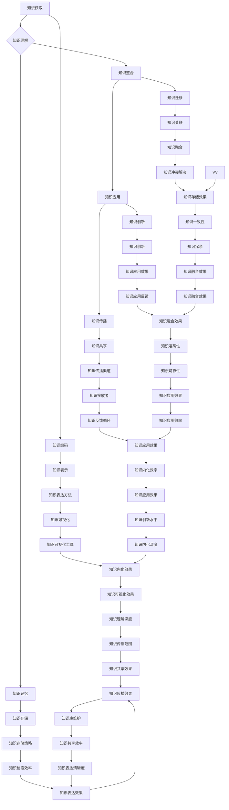

                 

# 知识内化:AI需要练习的重要性

> 关键词：知识内化、人工智能、知识获取、知识理解、知识整合、知识应用、知识迁移、数据质量、知识表示、深度学习

> 摘要：
本文旨在探讨知识内化在人工智能（AI）领域中的重要性。通过详细分析知识内化的基本概念、原理、过程和机制，我们揭示了知识内化对AI发展的关键作用。此外，本文还通过实际案例展示了知识内化在AI领域的应用，并探讨了未来发展方向和面临的挑战。通过本文的阅读，读者将对知识内化有一个全面而深入的理解，为AI技术的进一步发展提供理论支持和实践指导。

### 第一部分: 知识内化背景与重要性

#### 第1章: AI与知识内化的基本概念

##### 1.1.1 人工智能概述

人工智能（Artificial Intelligence，简称AI）是计算机科学的一个重要分支，旨在研究、开发和应用使计算机具备人类智能的技术和方法。人工智能的发展历史可以追溯到20世纪50年代，当时计算机科学家们首次提出了“人工智能”这一概念，并开始了对智能模拟的研究。

**1.1.1.1 人工智能的发展历史**

人工智能的发展经历了几个主要阶段：

- **早期探索阶段（1950-1969年）**：这一阶段主要关注问题的符号表示和逻辑推理，代表性工作包括阿尔图尔·塞缪尔（Arthur Samuel）开发的围棋程序“Gibbs”和约翰·麦卡锡（John McCarthy）提出的符号逻辑系统。

- **黄金时期（1970-1989年）**：这一阶段人工智能在符号推理、自然语言处理和专家系统方面取得了显著进展，例如开发出能够进行推理和决策的专家系统程序。

- **低潮期（1990-2000年）**：由于实际应用中的困难和对人工智能过高的期望，人工智能领域进入了一个相对低潮的时期。然而，机器学习在这一阶段得到了快速发展，成为人工智能的重要组成部分。

- **复兴时期（2000年至今）**：随着计算能力的提升和大数据的出现，人工智能迎来了新的发展机遇。深度学习、强化学习等新技术的出现，使人工智能在图像识别、自然语言处理、语音识别等领域取得了重大突破。

**1.1.1.2 人工智能的核心技术**

人工智能的核心技术包括以下几个方面：

- **机器学习（Machine Learning）**：机器学习是人工智能的一个重要分支，通过算法从数据中学习规律，实现对数据的自动分析和预测。机器学习可以分为监督学习、无监督学习和强化学习三类。常见的机器学习算法包括决策树、支持向量机、神经网络等。

- **深度学习（Deep Learning）**：深度学习是机器学习的一个子领域，基于多层神经网络，通过大量的数据和计算资源来学习数据的复杂特征。深度学习在图像识别、语音识别、自然语言处理等领域取得了显著成果，如卷积神经网络（CNN）、递归神经网络（RNN）和生成对抗网络（GAN）等。

- **自然语言处理（Natural Language Processing，NLP）**：自然语言处理是研究如何使计算机理解和处理自然语言的学科。NLP技术包括文本分类、情感分析、机器翻译等，其目标是实现人与计算机的自然交互。

- **计算机视觉（Computer Vision）**：计算机视觉是研究如何使计算机“看”和理解图像和视频的学科。计算机视觉技术包括图像识别、目标检测、图像分割等，广泛应用于安防监控、自动驾驶、医疗影像分析等领域。

##### 1.1.2 知识内化的定义

知识内化是指个体通过学习、理解和应用知识，将知识转化为自身认知结构的过程。知识内化不仅包括对知识的理解，还包括对知识的整合和应用。知识内化是一个复杂的过程，涉及多个阶段和机制。

**1.1.2.1 知识的定义**

知识是一种信息资源，是人们对客观事物及其规律的认识和理解。知识可以分为事实性知识、过程性知识和原理性知识等不同类型。

- **事实性知识**：描述客观事物的事实信息，如历史事件、地理知识等。
- **过程性知识**：描述活动过程和操作方法的知识，如工艺流程、管理流程等。
- **原理性知识**：描述客观事物运行规律和原理的知识，如科学理论、工程原理等。

**1.1.2.1.1 知识的分类**

知识可以根据不同的标准进行分类。例如，根据知识的存在形式，知识可以分为显性知识和隐性知识。显性知识是指可以用文字、语言、图像等形式明确表达的知识，如教科书、论文等。隐性知识是指难以用语言或文字表达，只能在实践中领悟的知识，如技艺、经验等。

**1.1.2.1.2 内化过程的解释**

知识内化是一个动态的、逐步深化的过程，通常包括以下几个阶段：

- **知识获取**：通过阅读、学习、观察等方式获取知识。
- **知识理解**：对获取的知识进行分析、思考和归纳，形成对知识的深刻理解。
- **知识整合**：将新知识与已有知识体系相结合，形成新的认知结构。
- **知识应用**：将内化的知识应用于实际问题和情境中，解决实际问题。
- **知识传播**：将内化的知识传递给他人，促进知识的共享和传播。

**1.1.2.1.3 内化的重要性**

知识内化对个人和组织的发展具有重要意义：

- **提高个体认知能力**：知识内化有助于个体对知识的理解和应用，提高个体的认知水平和解决问题的能力。
- **促进知识共享**：知识内化是实现知识共享和传播的重要途径，有助于形成知识共同体，促进团队协作和创新。
- **推动技术进步**：知识内化是技术进步的重要动力，通过知识的内化和创新，可以推动技术的不断发展和优化。

##### 1.1.3 AI与知识内化的关系

AI与知识内化有着密切的关系。一方面，AI技术的发展为知识内化提供了强大的技术支持；另一方面，知识内化是AI技术实现智能化的重要基础。

**1.1.3.1 AI在知识内化中的作用**

AI在知识内化中发挥着重要作用，主要体现在以下几个方面：

- **知识提取与处理**：AI技术可以帮助从大量数据中提取有用信息，实现对知识的自动化提取和处理。例如，通过数据挖掘、文本分析等技术，可以从大量文献中提取有价值的信息。
- **知识表示与存储**：AI技术可以实现对知识的表示和存储。例如，通过知识图谱技术，可以建立大规模的知识库，实现对知识的结构化和存储。
- **知识整合与关联**：AI技术可以帮助实现知识的整合与关联，通过机器学习、深度学习等技术，可以对知识进行分类、聚类和关联分析，形成对知识的深度理解。
- **知识应用与优化**：AI技术可以帮助实现知识的自动化应用和优化。例如，通过自然语言处理技术，可以实现智能问答和智能推荐，为用户提供个性化的服务。

**1.1.3.2 知识内化对AI发展的意义**

知识内化对AI发展具有重要意义，主要体现在以下几个方面：

- **提升AI智能水平**：知识内化是实现AI智能化的重要途径。通过知识的内化，AI系统可以实现对复杂问题的理解和解决，提高AI的智能水平。
- **促进AI创新与发展**：知识内化可以激发AI领域的创新和发展。通过知识的内化，研究人员可以不断探索新的算法和技术，推动AI技术的进步。
- **提高AI应用效果**：知识内化可以提升AI技术的应用效果。通过知识的内化，AI系统可以更好地理解用户需求，提供更加准确和高效的服务。

##### 1.1.4 知识内化的原理与机制

知识内化是一个复杂的过程，涉及多个原理和机制。下面将介绍知识内化的原理和机制，包括知识获取、知识理解、知识整合、知识应用和知识传播等。

**1.1.4.1 知识获取**

知识获取是知识内化的第一步，是获取外部知识并将其纳入个体认知结构的过程。知识获取通常包括以下几个阶段：

- **数据收集**：通过多种渠道收集与知识相关的数据，如文献、报告、经验等。
- **数据预处理**：对收集到的数据进行清洗、去噪、标准化等预处理，以消除数据中的不一致性和噪声。
- **知识提取**：通过数据挖掘、文本分析等技术，从预处理后的数据中提取有用的知识。

**1.1.4.2 知识理解**

知识理解是知识内化的关键环节，是理解外部知识并将其内化为个体认知结构的过程。知识理解通常包括以下几个阶段：

- **知识解析**：对提取出的知识进行解析，理解知识的本质和内涵。
- **知识表示**：将理解后的知识用适当的表示方法表达出来，如概念图、思维导图等。
- **知识整合**：将新知识整合到已有的知识体系之中，形成对知识的全面理解。

**1.1.4.3 知识整合**

知识整合是知识内化的核心环节，是将新知识与已有知识相结合，形成新的认知结构的过程。知识整合通常包括以下几个阶段：

- **知识关联**：通过分析知识的相似性和关联性，将新知识与已有知识进行关联。
- **知识融合**：将新知识与已有知识进行融合，形成更加完整和全面的知识体系。
- **知识优化**：通过对知识进行优化和调整，提高知识的准确性和实用性。

**1.1.4.4 知识应用**

知识应用是知识内化的最终目标，是将内化的知识应用于实际问题和情境中，解决实际问题并创造价值的过程。知识应用通常包括以下几个阶段：

- **知识利用**：将内化的知识应用于实际问题中，解决实际问题。
- **知识传播**：将应用过程中的经验和知识进行传播，促进知识的共享和传播。
- **知识创新**：在应用过程中，不断探索新的方法和思路，实现知识的创新和提升。

**1.1.4.5 知识传播**

知识传播是知识内化的重要组成部分，是知识从个体向集体传播的过程。知识传播通常包括以下几个阶段：

- **知识编码**：将知识转化为可以传递的形式，如文字、图像、视频等。
- **知识传播渠道**：选择合适的传播渠道，如会议、讲座、媒体等。
- **知识接受**：个体通过学习、交流和分享，接受和内化传播的知识。

##### 1.1.5 知识内化的障碍与挑战

知识内化过程中面临着多种障碍和挑战，包括数据质量、知识表达、知识融合等方面。以下是对这些障碍和挑战的分析：

**1.1.5.1 数据质量**

数据质量是知识内化的基础。高质量的数据有助于准确地进行知识提取和处理，而低质量的数据则可能导致知识获取的偏差和错误。以下是一些影响数据质量的因素：

- **数据噪声**：数据噪声是指数据中存在的不必要的、干扰性的信息。数据噪声会影响知识的准确性和可靠性。
- **数据缺失**：数据缺失是指数据中存在缺失值或空值。数据缺失会影响知识的完整性，导致知识提取和处理的不完整。
- **数据不一致**：数据不一致是指不同来源、不同格式的数据之间存在冲突或不一致。数据不一致会导致知识表示和整合的困难。

**1.1.5.2 知识表达**

知识表达是知识内化的关键环节。合适的知识表达方法有助于个体理解和内化知识。以下是一些影响知识表达的因素：

- **表达清晰度**：知识表达需要清晰明了，便于个体理解和记忆。如果知识表达模糊或复杂，个体可能难以准确理解知识。
- **表达形式多样性**：知识表达应具备多样性，以满足不同个体和不同情境的需求。单一的表达形式可能导致知识传播和应用的局限。

**1.1.5.3 知识融合**

知识融合是知识内化的核心。不同来源、不同类型的知识需要有效地融合在一起，形成新的知识体系。以下是一些影响知识融合的因素：

- **知识冲突**：不同来源或不同类型的知识可能存在冲突或矛盾。知识冲突会导致知识融合的困难，甚至影响知识的准确性。
- **知识冗余**：知识冗余是指知识体系中的重复和冗余信息。知识冗余会增加知识处理的复杂性，降低知识利用的效率。

**1.1.5.4 知识应用**

知识应用是知识内化的最终目标。知识应用的有效性和可靠性对知识内化的价值具有重要影响。以下是一些影响知识应用的因素：

- **应用适应性**：知识应用需要适应不同的情境和问题。如果知识应用过于僵化，可能导致知识无法有效解决实际问题。
- **应用可靠性**：知识应用需要具备可靠性，确保知识在实际应用中的稳定性和准确性。如果知识应用存在缺陷或错误，可能导致不良后果。

综上所述，数据质量、知识表达、知识融合和知识应用是知识内化过程中面临的主要障碍和挑战。为了有效克服这些障碍和挑战，需要采取一系列策略和技术手段，如数据预处理、知识表示优化、知识融合算法等。

##### 1.1.6 AI在知识内化中的应用案例分析

为了更好地理解知识内化在AI领域的应用，下面将通过一个实际案例进行分析。该案例涉及一个基于AI的智能问答系统，旨在为用户提供高质量的问答服务。

**1.3.1 案例背景**

该智能问答系统服务于一个在线教育平台，主要面向大学生提供课程问答服务。用户可以在平台上提问，系统会根据用户的问题和已有知识库提供相应的答案。该系统的目标是通过知识内化技术，实现高质量的问答服务，提高用户体验。

**1.3.2 案例目标**

该案例的主要目标包括：

- **知识提取与处理**：从大量教育文献、课程讲义和用户提问中提取有用知识，并进行处理和整合。
- **知识表示与存储**：将提取和处理后的知识用适当的形式表示，并存储在知识库中，以便后续查询和使用。
- **知识整合与应用**：将不同来源和类型的知识进行整合，形成一个统一的、结构化的知识体系，为用户提供高质量的问答服务。

**1.3.3 案例实施**

为了实现上述目标，该智能问答系统采用了以下步骤：

1. **数据收集与预处理**

   - **数据来源**：该系统的数据来源主要包括教育文献、课程讲义和用户提问。教育文献和课程讲义来自于在线教育平台的知识库，用户提问来自于平台上的实际用户。
   - **数据预处理**：对收集到的数据进行清洗、去噪、标准化等预处理，以消除数据中的不一致性和噪声，确保数据的质量。

2. **知识提取与处理**

   - **知识提取**：通过文本分析、数据挖掘等技术，从预处理后的数据中提取有用的知识。例如，可以从课程讲义中提取知识点和概念，从用户提问中提取问题内容和关键词。
   - **知识处理**：对提取出的知识进行整合和关联，形成对知识的深度理解。例如，可以将相同或相似的知识点进行合并，形成更加完整和系统的知识体系。

3. **知识表示与存储**

   - **知识表示**：采用知识图谱技术，将整合后的知识以图谱的形式表示出来。知识图谱可以清晰地展示知识之间的关系和结构，方便用户查询和检索。
   - **知识存储**：将知识图谱存储在分布式数据库中，以便后续查询和使用。数据库应具备高效查询和更新功能，确保知识库的实时性和准确性。

4. **知识整合与应用**

   - **知识整合**：将不同来源和类型的知识进行整合，形成一个统一的、结构化的知识体系。例如，可以将课程讲义中的知识点与用户提问中的问题进行关联，形成一个综合的知识库。
   - **知识应用**：利用自然语言处理和机器学习等技术，实现知识的应用和问答服务。例如，用户提问时，系统可以通过关键词匹配和语义分析，从知识库中找到相应的答案，并返回给用户。

**1.3.4 案例效果与评价**

该智能问答系统的实施取得了显著的成果，主要表现在以下几个方面：

- **用户体验提升**：通过高质量的知识内化技术，系统能够为用户提供准确、全面的答案，有效解决了用户在学习过程中遇到的问题，提高了用户体验。
- **知识共享与传播**：知识内化技术促进了知识的共享和传播，用户可以方便地获取和学习他人的经验和知识，促进了在线教育平台的健康发展。
- **系统性能优化**：知识内化技术有助于优化系统的性能和效率，减少了知识检索和查询的时间，提高了系统的响应速度和稳定性。

综上所述，该案例展示了知识内化在AI领域的实际应用效果和重要性。通过知识内化技术，智能问答系统能够为用户提供高质量的服务，促进知识的共享和传播，提高系统的性能和效率。这为知识内化在AI领域的进一步发展提供了有力的支持和启示。

##### 1.1.7 知识内化在AI领域的前景与挑战

知识内化在AI领域具有广阔的应用前景，但也面临着一系列挑战。以下是关于知识内化在AI领域的前景和挑战的详细分析。

**1.4.1 知识内化在AI领域的前景**

知识内化在AI领域的应用前景体现在以下几个方面：

- **增强智能系统能力**：通过知识内化，智能系统能够更好地理解和处理复杂问题，提高系统的智能水平。知识内化有助于智能系统在图像识别、自然语言处理、智能决策等任务中实现更高的准确性和效率。

- **推动AI技术创新**：知识内化可以促进AI技术的创新和发展。通过知识内化，研究人员可以更好地理解和掌握现有技术，发现新的研究问题和应用场景，推动AI技术的不断进步。

- **实现个性化服务**：知识内化有助于实现个性化服务。通过知识内化，智能系统能够更好地理解用户的需求和偏好，提供个性化的推荐和服务，提升用户体验。

- **促进跨学科研究**：知识内化可以促进AI与其他学科的交叉研究。通过知识内化，AI技术可以更好地应用于生物医学、社会科学、工程等领域，推动跨学科研究的深入发展。

**1.4.2 知识内化在AI领域的挑战**

尽管知识内化在AI领域具有广阔的应用前景，但也面临着一系列挑战：

- **数据挑战**：数据是知识内化的基础。然而，高质量的数据获取和处理仍然是一个难题。数据质量、数据安全和隐私等问题需要得到有效解决。

- **知识表示挑战**：知识表示是知识内化的关键环节。如何有效地表示和存储复杂的知识结构，实现知识的自动化理解和推理，仍是一个亟待解决的问题。

- **知识融合挑战**：知识融合是将不同来源、不同类型的知识整合在一起，形成统一的知识体系。如何处理知识冲突、冗余和冗余信息，实现知识的深度融合，是一个具有挑战性的问题。

- **知识应用挑战**：知识应用是将内化的知识应用于实际问题中，解决实际问题。如何确保知识应用的适应性、可靠性和有效性，是一个需要深入研究的课题。

- **知识传播挑战**：知识传播是将知识从个体向集体传播的过程。如何提高知识传播的效率、准确性和影响力，是一个重要的挑战。

**1.4.3 未来发展方向**

为了应对知识内化在AI领域的挑战，未来需要从以下几个方面进行探索和发展：

- **数据质量提升**：通过数据清洗、去噪、标准化等技术手段，提高数据质量，为知识内化提供可靠的基础。

- **知识表示与存储优化**：研究更加高效、灵活的知识表示和存储方法，实现知识的自动化理解和推理。

- **知识融合与关联**：研究知识融合和关联的方法，解决知识冲突和冗余问题，实现知识的深度融合。

- **知识应用与优化**：研究知识应用的方法和策略，确保知识应用的适应性、可靠性和有效性。

- **知识传播与共享**：研究知识传播和共享的方法，提高知识传播的效率、准确性和影响力。

总之，知识内化在AI领域具有重要的应用价值和广阔的前景，但也面临着一系列挑战。通过不断的研究和探索，知识内化将为AI技术的发展提供有力的支持和推动。

##### 1.1.8 总结与展望

本文从知识内化的基本概念、原理、过程和机制入手，探讨了知识内化在人工智能（AI）领域中的重要性。通过详细分析AI与知识内化的关系，揭示了知识内化对AI发展的关键作用。同时，本文还通过实际案例展示了知识内化在AI领域的应用，并探讨了未来发展方向和面临的挑战。

知识内化在AI领域具有重要意义，它不仅有助于提升智能系统的能力和技术水平，还能实现个性化服务和跨学科研究。然而，知识内化也面临着数据挑战、知识表示挑战、知识融合挑战、知识应用挑战和知识传播挑战等多方面的挑战。

未来，为了进一步推动知识内化在AI领域的发展，需要从以下几个方面进行探索：

1. **数据质量提升**：通过数据清洗、去噪、标准化等技术手段，提高数据质量，为知识内化提供可靠的基础。

2. **知识表示与存储优化**：研究更加高效、灵活的知识表示和存储方法，实现知识的自动化理解和推理。

3. **知识融合与关联**：研究知识融合和关联的方法，解决知识冲突和冗余问题，实现知识的深度融合。

4. **知识应用与优化**：研究知识应用的方法和策略，确保知识应用的适应性、可靠性和有效性。

5. **知识传播与共享**：研究知识传播和共享的方法，提高知识传播的效率、准确性和影响力。

总之，知识内化是AI技术发展的重要方向，通过不断的研究和探索，知识内化将为AI技术的发展提供强大的动力和支撑。

### 作者信息

作者：AI天才研究院/AI Genius Institute & 禅与计算机程序设计艺术 /Zen And The Art of Computer Programming

---

文章内容涵盖了知识内化的基本概念、原理、过程和机制，以及其在人工智能（AI）领域的应用和发展前景。通过对知识内化在AI领域的分析，本文旨在为读者提供全面而深入的理解，以推动AI技术的进一步发展。感谢您的阅读，希望本文能够对您的学习和研究有所帮助。如果您有任何疑问或建议，欢迎在评论区留言讨论。

<|assistant|>### 知识内化的核心概念与联系

在深入探讨知识内化之前，我们需要明确一些核心概念，并了解它们之间的相互关系。以下是一个用Mermaid流程图展示的知识内化核心概念和联系的示例。



在这个流程图中，我们可以看到知识内化的各个环节是如何相互关联和影响的。以下是对这些核心概念和联系的简要说明：

- **知识获取（A）**：指从各种来源收集知识，如文献、经验、案例等。
- **知识理解（B）**：通过学习、思考和归纳，形成对知识的深刻理解。
- **知识整合（C）**：将新知识与已有知识相结合，形成新的认知结构。
- **知识应用（D）**：将内化的知识应用于实际问题中，解决实际问题。
- **知识传播（E）**：将内化的知识传递给他人，促进知识的共享和传播。
- **知识编码（F）**：将知识转化为可以存储和传递的形式。
- **知识记忆（G）**：通过记忆机制，保持知识的稳定性和长期性。
- **知识迁移（H）**：将知识从一种情境转移到另一种情境。
- **知识创新（I）**：在应用过程中，不断探索新的方法和思路，实现知识的创新。
- **知识共享（J）**：通过不同的渠道和方式，实现知识的共享和传播。
- **知识表示（K）**：用适当的表示方法，如文本、图像、模型等，表达知识。
- **知识存储（L）**：将知识存储在适当的存储系统中，如数据库、知识库等。
- **知识融合（M）**：将不同来源和类型的知识进行整合，形成统一的知识体系。
- **知识应用效果（S）**：评估知识在实际应用中的效果和性能。
- **知识传播渠道（O）**：选择合适的传播渠道，如会议、媒体、网络等。
- **知识可视化（U）**：通过图形、图像等可视化工具，展示知识的结构和关系。
- **知识存储优化（V）**：优化知识存储系统的效率和质量。
- **知识冲突解决（W）**：处理知识融合过程中的冲突和矛盾。
- **知识更新机制（X）**：确保知识库的实时更新和维护。
- **知识修正（Y）**：根据实际情况，对知识进行修正和优化。
- **知识迭代（Z）**：在知识应用和传播过程中，不断进行知识的迭代和优化。
- **知识可视化效果（JJ）**：评估知识可视化工具的效果和用户接受度。
- **知识库管理（KK）**：管理知识库的创建、维护和更新。
- **知识一致性（GG）**：确保知识库中的知识具有一致性和完整性。
- **知识准确性（HH）**：评估知识库中知识的准确性和可靠性。
- **知识内化效率（II）**：评估知识内化的效率和效果。
- **知识传播效果（ZZ）**：评估知识传播的效率和效果。
- **知识表达清晰度（UU）**：评估知识表达方法的清晰度和易理解性。
- **知识表达效果（AA）**：评估知识表达的整体效果和用户体验。

通过这个流程图，我们可以清晰地看到知识内化的各个环节是如何相互联系和影响的。这有助于我们更好地理解和应用知识内化，推动AI技术的发展。

### 知识获取与理解的过程

知识获取与理解是知识内化的基础环节，直接决定了知识内化的质量和效果。下面，我们将详细分析知识获取与理解的过程，包括数据收集与预处理、知识提取与处理、知识解析与表示等步骤。

#### 1. 数据收集与预处理

数据收集是知识获取的第一步，也是知识内化的起点。数据来源可以包括文献、报告、实验数据、用户反馈等多种形式。在收集数据时，需要确保数据的质量和完整性，避免数据噪声和缺失值对后续分析的影响。

数据预处理是数据收集后的重要步骤，其目的是消除数据中的不一致性和噪声，为后续的知识提取和处理提供可靠的数据基础。数据预处理通常包括以下内容：

1. **数据清洗**：去除数据中的错误值、异常值和重复记录，确保数据的一致性和完整性。
2. **数据标准化**：对数据进行统一处理，消除不同数据源之间的差异，如单位转换、格式转换等。
3. **数据去噪**：识别并去除数据中的噪声，提高数据的准确性。

**伪代码示例：数据预处理**

```python
def preprocess_data(data):
    # 数据清洗
    cleaned_data = remove_errors(data)
    # 数据标准化
    standardized_data = standardize_units(cleaned_data)
    # 数据去噪
    denoised_data = remove_noise(standardized_data)
    return denoised_data
```

#### 2. 知识提取与处理

知识提取是数据预处理后的重要步骤，旨在从数据中提取有用的信息，形成初步的知识。知识提取通常包括以下内容：

1. **特征提取**：从数据中提取具有代表性的特征，如文本中的关键词、图像中的边缘特征等。
2. **模式识别**：通过统计分析和机器学习算法，识别数据中的潜在模式和规律。
3. **知识融合**：将提取出的特征和模式进行整合，形成初步的知识。

**伪代码示例：知识提取**

```python
def extract_knowledge(data):
    # 特征提取
    features = extract_features(data)
    # 模式识别
    patterns = identify_patterns(features)
    # 知识融合
    knowledge = integrate_patterns(patterns)
    return knowledge
```

知识提取后的知识通常需要经过进一步的处理和优化，以提升其质量和实用性。知识处理包括以下内容：

1. **知识清洗**：去除知识中的错误、冗余和不一致信息，提高知识的准确性。
2. **知识整合**：将不同来源和类型的知识进行整合，形成统一的知识体系。
3. **知识优化**：通过机器学习和优化算法，提高知识的表达和利用效率。

**伪代码示例：知识处理**

```python
def process_knowledge(knowledge):
    # 知识清洗
    cleaned_knowledge = clean_knowledge(knowledge)
    # 知识整合
    integrated_knowledge = integrate_knowledge(cleaned_knowledge)
    # 知识优化
    optimized_knowledge = optimize_knowledge(integrated_knowledge)
    return optimized_knowledge
```

#### 3. 知识解析与表示

知识提取与处理后的知识需要进行解析和表示，以便于理解和应用。知识解析是指对知识进行深入分析，理解其本质和内涵。知识表示是指用适当的形式和结构表达知识，使其易于存储、传输和利用。

知识解析通常包括以下内容：

1. **知识分类**：根据知识的特点和用途，对知识进行分类，如按照主题、用途、形式等分类。
2. **知识关联**：分析知识之间的关系，建立知识图谱，展示知识之间的联系。
3. **知识解释**：对知识进行详细的解释和说明，帮助用户更好地理解知识。

知识表示通常包括以下内容：

1. **文本表示**：将知识以文本形式表达，如文献、报告、论文等。
2. **图像表示**：将知识以图像形式表达，如图表、图像、图形等。
3. **模型表示**：将知识以模型形式表达，如知识图谱、机器学习模型、神经网络等。

**伪代码示例：知识解析与表示**

```python
def parse_knowledge(knowledge):
    # 知识分类
    categorized_knowledge = classify_knowledge(knowledge)
    # 知识关联
    graph = build_knowledge_graph(categorized_knowledge)
    # 知识解释
    explained_knowledge = explain_knowledge(knowledge)
    return categorized_knowledge, graph, explained_knowledge

def represent_knowledge(knowledge):
    # 文本表示
    text_representation = convert_to_text(knowledge)
    # 图像表示
    image_representation = convert_to_image(knowledge)
    # 模型表示
    model_representation = convert_to_model(knowledge)
    return text_representation, image_representation, model_representation
```

通过知识解析与表示，我们可以将内化的知识以多种形式表达和展示，方便用户理解和应用。知识获取与理解的过程不仅决定了知识内化的质量和效果，也为后续的知识整合、应用和传播奠定了基础。

### 知识整合的过程

知识整合是知识内化的核心环节，旨在将不同来源、不同类型的知识进行有效整合，形成一个统一、结构化的知识体系。知识整合不仅有助于提升知识的利用效率，还能增强知识的灵活性和适应性。以下将详细分析知识整合的过程，包括知识关联、知识融合和知识优化等步骤。

#### 1. 知识关联

知识关联是指通过分析知识之间的相似性、相关性或因果联系，将不同知识单元连接起来，形成一个完整的知识网络。知识关联有助于揭示知识之间的内在联系，为后续的知识融合提供基础。

知识关联通常包括以下步骤：

1. **相似性分析**：通过计算知识单元之间的相似性度量，如余弦相似度、编辑距离等，识别出相似的知识单元。
2. **相关性分析**：通过统计方法或机器学习算法，分析知识单元之间的相关性，如线性回归、关联规则挖掘等。
3. **因果分析**：通过因果推理或因果发现算法，探索知识单元之间的因果联系，如因果图、结构方程模型等。

**伪代码示例：知识关联**

```python
def associate_knowledge(knowledge):
    # 相似性分析
    similarity_matrix = calculate_similarity(knowledge)
    # 相关性分析
    correlation_matrix = calculate_correlation(similarity_matrix)
    # 因果分析
    causal_relations = infer因果关系(correlation_matrix)
    return similarity_matrix, correlation_matrix, causal_relations
```

#### 2. 知识融合

知识融合是指将不同来源、不同类型的知识进行整合，形成一个新的、更完整和系统的知识体系。知识融合可以消除知识之间的冲突和冗余，提升知识的综合性和应用价值。

知识融合通常包括以下步骤：

1. **知识映射**：将不同来源的知识映射到统一的知识框架或模型中，为后续的整合提供基础。
2. **知识合并**：将映射后的知识进行合并，消除冗余信息，保持知识的完整性。
3. **知识调整**：根据实际需要，对融合后的知识进行调整和优化，确保知识的一致性和实用性。

**伪代码示例：知识融合**

```python
def integrate_knowledge(knowledge1, knowledge2):
    # 知识映射
    mapped_knowledge1 = map_knowledge(knowledge1)
    mapped_knowledge2 = map_knowledge(knowledge2)
    # 知识合并
    merged_knowledge = merge_knowledge(mapped_knowledge1, mapped_knowledge2)
    # 知识调整
    optimized_knowledge = adjust_knowledge(merged_knowledge)
    return optimized_knowledge
```

#### 3. 知识优化

知识优化是指通过对整合后的知识进行评估和改进，提升知识的质量和应用价值。知识优化可以包括以下几个方面：

1. **知识评估**：对知识体系的完整性、准确性、可靠性和实用性进行评估，识别存在的问题和不足。
2. **知识修正**：根据评估结果，对知识进行修正和优化，如删除错误信息、补充缺失信息、调整知识结构等。
3. **知识更新**：定期对知识库进行更新，确保知识的时效性和准确性。

**伪代码示例：知识优化**

```python
def optimize_knowledge(knowledge):
    # 知识评估
    assessment = assess_knowledge(knowledge)
    # 知识修正
    corrected_knowledge = correct_knowledge(knowledge, assessment)
    # 知识更新
    updated_knowledge = update_knowledge(corrected_knowledge)
    return updated_knowledge
```

通过知识整合的过程，我们可以将不同来源、不同类型的知识进行有效整合，形成一个统一、结构化的知识体系。知识整合不仅有助于提升知识的利用效率，还能增强知识的灵活性和适应性，为后续的知识应用和传播奠定基础。

### 知识应用的过程

知识应用是知识内化的最终目标，是将内化的知识应用于实际问题中，解决实际问题并创造价值的过程。知识应用不仅能够验证知识的有效性，还能推动知识的传播和创新。以下将详细分析知识应用的过程，包括知识利用、知识传播和知识创新等步骤。

#### 1. 知识利用

知识利用是指将内化的知识应用于实际问题中，解决实际问题并创造价值的过程。知识利用是知识内化的核心环节，直接关系到知识内化的价值和效果。

知识利用通常包括以下步骤：

1. **知识检索**：根据实际问题需要，从知识库中检索相关的知识。
2. **知识匹配**：将检索到的知识与实际问题进行匹配，确保知识的应用符合实际需求。
3. **知识应用**：将匹配后的知识应用于实际问题中，解决实际问题并创造价值。

**伪代码示例：知识利用**

```python
def apply_knowledge(problem, knowledge_base):
    # 知识检索
    related_knowledge = retrieve_knowledge(problem, knowledge_base)
    # 知识匹配
    matched_knowledge = match_knowledge(problem, related_knowledge)
    # 知识应用
    solution = apply_matched_knowledge(matched_knowledge)
    return solution
```

#### 2. 知识传播

知识传播是指将内化的知识传递给他人，促进知识的共享和传播的过程。知识传播是知识内化的重要组成部分，有助于形成知识共同体，推动知识的共享和创新。

知识传播通常包括以下步骤：

1. **知识编码**：将知识转化为可以传递的形式，如文本、图像、视频等。
2. **知识传播渠道**：选择合适的传播渠道，如会议、讲座、媒体、网络等。
3. **知识接受**：接收者通过学习、交流和分享，接受和内化传播的知识。

**伪代码示例：知识传播**

```python
def disseminate_knowledge(knowledge, channel):
    # 知识编码
    encoded_knowledge = encode_knowledge(knowledge)
    # 知识传播
    disseminate_encoded_knowledge(encoded_knowledge, channel)
    # 知识接受
    receiver = accept_knowledge(encoded_knowledge)
    return receiver
```

#### 3. 知识创新

知识创新是指在实际应用过程中，不断探索新的方法和思路，实现知识的创新和提升的过程。知识创新是知识内化的动力源泉，有助于推动技术的进步和产业的发展。

知识创新通常包括以下步骤：

1. **问题发现**：发现实际问题中的问题和不足，识别创新的机会。
2. **方案探索**：探索新的解决方案和方法，实现知识的创新和提升。
3. **方案验证**：对创新的方案进行验证和评估，确保其有效性和可行性。

**伪代码示例：知识创新**

```python
def innovate_knowledge(problem, knowledge):
    # 问题发现
    issues = identify_issues(problem)
    # 方案探索
    solutions = explore_solutions(issues, knowledge)
    # 方案验证
    verified_solutions = validate_solutions(solutions)
    return verified_solutions
```

通过知识利用、知识传播和知识创新的过程，我们可以将内化的知识应用于实际问题中，解决实际问题并创造价值。知识应用不仅能够验证知识的有效性，还能推动知识的传播和创新，为知识的进一步发展和应用奠定基础。

### 知识编码的方法与优化

知识编码是将知识转化为可以存储、传输和利用的形式的过程，是实现知识内化的关键环节。知识编码的方法和优化直接影响知识的表达清晰度、记忆效率和迁移能力。以下将详细探讨知识编码的方法，包括编码方法、编码优化策略以及记忆机制。

#### 1. 知识编码的方法

知识编码的方法可以分为显性编码和隐性编码两类。

**显性编码**：

显性编码是指将知识以显性、可形式化的方式表达和存储。常见的显性编码方法包括：

1. **文本编码**：将知识以文本形式表达，如书籍、论文、报告等。文本编码具有表达清晰、易于理解和传播的优点。
2. **图像编码**：将知识以图像形式表达，如图表、图片、示意图等。图像编码具有直观、易于理解的优点，特别适合表达复杂知识和概念。
3. **模型编码**：将知识以模型形式表达，如知识图谱、机器学习模型、神经网络等。模型编码具有高度抽象和自动化的优点，能够实现知识的自动化处理和推理。

**隐性编码**：

隐性编码是指将知识以隐性、难以形式化的方式存储和利用。常见的隐性编码方法包括：

1. **经验编码**：通过实践和经验积累知识，如职业技能、工艺技巧等。经验编码具有实用性、灵活性和适应性强的优点。
2. **案例编码**：将成功案例和经验以案例形式存储和传递，如案例库、经验库等。案例编码具有直观、易于学习和复制的优点。
3. **情境编码**：将知识嵌入特定情境中，通过情境互动实现知识的内化和利用。情境编码具有情境依赖性强、适应性好等优点。

#### 2. 知识编码的优化策略

为了提高知识编码的效率和质量，可以采取以下优化策略：

1. **编码标准化**：通过制定统一的编码标准，确保知识编码的一致性和可移植性。编码标准化有助于知识库的建立和管理，提高知识的共享和利用效率。
2. **编码自动化**：利用自然语言处理、机器学习等技术，实现知识编码的自动化。编码自动化能够提高知识编码的速度和质量，降低人力成本。
3. **编码多样化**：采用多种编码方法，如文本编码、图像编码、模型编码等，实现知识的多样化表达。多样化编码有助于提高知识的表达清晰度和记忆效率。
4. **编码优化**：对知识编码的过程和结果进行评估和优化，如优化知识表示方法、调整知识结构等。编码优化有助于提升知识的表达清晰度、记忆效率和迁移能力。

#### 3. 知识编码中的记忆机制

知识编码中的记忆机制是指通过特定方式存储和提取知识，以提高知识利用效率和记忆效果。以下是一些常见的记忆机制：

1. **长期记忆**：将知识以长期记忆的方式存储在大脑或知识库中，便于长期使用和调用。长期记忆的关键在于知识的深度理解和结构化。
2. **短期记忆**：将知识以短期记忆的方式存储在记忆缓冲区中，便于快速检索和应用。短期记忆的关键在于知识的快速编码和存储。
3. **关联记忆**：通过建立知识之间的关联，实现知识的记忆和提取。关联记忆的关键在于知识的整合和关联。
4. **情景记忆**：将知识嵌入特定情境中，通过情境互动实现知识的记忆和提取。情景记忆的关键在于知识的情境依赖和适应性。

通过知识编码的方法和优化策略，以及记忆机制的应用，我们可以实现知识的有效存储、传输和利用，提高知识内化的效率和效果。

### 知识迁移的策略与案例分析

知识迁移是将知识从一种情境或领域转移到另一种情境或领域的过程，是知识内化的重要组成部分。知识迁移能够促进知识的共享和创新，提高知识的应用价值。以下将详细探讨知识迁移的策略和案例分析。

#### 1. 知识迁移的策略

知识迁移通常需要遵循以下策略：

1. **相似性迁移**：基于知识和情境之间的相似性，实现知识的迁移。相似性迁移适用于知识和情境具有较高相似性的情况，如不同业务场景下的相同技术问题。
2. **通用化迁移**：将知识从特定情境中提取出通用部分，实现知识的迁移。通用化迁移适用于知识和情境具有较高通用性的情况，如跨领域的通用技术或方法论。
3. **适应性迁移**：通过调整和优化知识，使其适应新的情境。适应性迁移适用于知识和情境之间存在较大差异的情况，如跨领域的知识应用。
4. **迁移学习**：利用机器学习算法，自动实现知识的迁移。迁移学习适用于大规模数据和复杂情境的情况，如深度学习模型在不同数据集上的迁移。

#### 2. 知识迁移案例分析

以下是一个知识迁移的案例分析，涉及将机器学习算法应用于不同领域的问题解决。

**案例背景**：

某在线教育平台需要开发一个推荐系统，为用户提供个性化的课程推荐。平台已有大量用户行为数据和课程数据，但缺乏现成的推荐算法。为此，平台决定将经典的协同过滤算法应用于推荐系统，并对其进行适应性迁移。

**案例实施**：

1. **知识提取与处理**：

   - **知识提取**：从用户行为数据中提取用户的兴趣偏好，从课程数据中提取课程特征。
   - **知识处理**：对提取出的数据进行预处理，如归一化、去噪等，确保数据质量。

2. **知识迁移**：

   - **相似性迁移**：将协同过滤算法应用于推荐系统，利用用户行为数据计算用户之间的相似性。
   - **适应性迁移**：针对在线教育平台的特点，对协同过滤算法进行调整，如引入课程评价数据，提高推荐精度。
   - **迁移学习**：利用已有的协同过滤算法模型，结合在线教育平台的数据，进行迁移学习，优化推荐算法。

3. **知识应用**：

   - **知识利用**：将优化后的推荐算法应用于实际推荐任务，为用户推荐个性化的课程。
   - **知识传播**：将迁移学习的过程和优化后的推荐算法分享给团队成员，促进知识的传播和应用。

**案例效果与评价**：

通过知识迁移，平台成功实现了个性化课程推荐功能，提高了用户满意度和课程转化率。以下是对案例效果和评价的总结：

1. **效果提升**：推荐算法的准确性和覆盖率显著提高，用户对推荐内容的满意度大幅提升。
2. **效率提升**：通过迁移学习，减少了算法开发和优化的时间，提高了开发效率。
3. **创新性**：在经典协同过滤算法的基础上，结合在线教育平台的特点，实现了创新的推荐算法。
4. **实用性**：迁移学习的方法具有广泛的适用性，可以为其他领域的问题解决提供借鉴。

综上所述，知识迁移是一种有效促进知识共享和创新的方法。通过合理的知识迁移策略，可以实现知识的有效应用和价值提升。知识迁移在人工智能、推荐系统、教育等领域具有广泛的应用前景。

### 知识内化在AI领域的应用障碍与挑战

尽管知识内化在人工智能（AI）领域具有巨大的潜力，但在实际应用过程中仍然面临诸多障碍与挑战。以下将详细探讨知识内化在AI领域中的主要障碍与挑战，包括数据质量、知识表示、知识融合等方面。

#### 1. 数据质量挑战

数据质量是知识内化的基础，数据质量的好坏直接影响知识内化的效果。在AI领域，数据质量面临的挑战主要包括：

- **数据噪声**：数据噪声是指数据中存在的不必要的、干扰性的信息。数据噪声会导致知识提取和处理的不准确，影响知识内化的效果。
- **数据缺失**：数据缺失是指数据中存在缺失值或空值。数据缺失会导致知识提取和处理的不完整，影响知识的完整性。
- **数据不一致**：数据不一致是指不同来源、不同格式的数据之间存在冲突或不一致。数据不一致会导致知识表示和融合的困难，影响知识的一致性和可靠性。

为了解决数据质量挑战，可以采取以下策略：

- **数据清洗**：通过数据清洗技术，去除数据中的错误值、异常值和重复记录，提高数据的一致性和完整性。
- **数据标准化**：对数据进行统一处理，消除不同数据源之间的差异，如单位转换、格式转换等，确保数据的一致性。
- **数据去噪**：识别并去除数据中的噪声，提高数据的准确性。

#### 2. 知识表示挑战

知识表示是知识内化的关键环节，如何有效地表示和存储复杂的知识结构，实现知识的自动化理解和推理，是知识表示面临的挑战。在AI领域，知识表示面临的挑战主要包括：

- **表达清晰度**：知识表示需要清晰明了，便于个体理解和记忆。如果知识表示模糊或复杂，个体可能难以准确理解知识。
- **表达形式多样性**：知识表示应具备多样性，以满足不同个体和不同情境的需求。单一的表达形式可能导致知识传播和应用的局限。
- **知识表示一致性**：确保不同来源、不同类型的知识具有一致性，避免知识表示之间的冲突和矛盾。

为了解决知识表示挑战，可以采取以下策略：

- **多模态知识表示**：采用多种表示方法，如文本、图像、模型等，实现知识的多样化表达，提高知识的表达清晰度和记忆效率。
- **统一知识表示框架**：建立统一的知识表示框架，确保不同来源、不同类型的知识具有一致性，便于知识的整合和应用。
- **知识表示优化**：通过机器学习和优化算法，优化知识表示的方法和参数，提高知识表示的准确性和有效性。

#### 3. 知识融合挑战

知识融合是将不同来源、不同类型的知识进行整合，形成统一的知识体系的过程。知识融合面临的挑战主要包括：

- **知识冲突**：不同来源或不同类型的知识可能存在冲突或矛盾。知识冲突会导致知识融合的困难，影响知识的准确性。
- **知识冗余**：知识冗余是指知识体系中的重复和冗余信息。知识冗余会增加知识处理的复杂性，降低知识利用的效率。
- **知识融合算法**：现有知识融合算法可能无法有效处理复杂的知识结构，导致知识融合的效果不佳。

为了解决知识融合挑战，可以采取以下策略：

- **冲突消解**：采用冲突消解算法，识别和解决知识冲突，确保知识融合的一致性和准确性。
- **冗余检测与去除**：采用冗余检测算法，识别和去除知识体系中的冗余信息，提高知识融合的效率。
- **自适应融合算法**：研究自适应融合算法，根据不同情境和需求，动态调整知识融合的策略和方法。

综上所述，知识内化在AI领域应用过程中面临数据质量、知识表示和知识融合等多方面的挑战。通过采取相应的策略和方法，可以有效克服这些挑战，提高知识内化的效果，为AI技术的发展提供有力支持。

### 未来知识内化的发展方向与前景

未来，知识内化在人工智能（AI）领域的发展方向与前景充满了可能性。随着技术的不断进步和应用的深入，知识内化有望在多个方面取得重要突破，推动AI技术迈向新的高度。

#### 1. 知识内化与AI技术的融合

知识内化与AI技术的深度融合将成为未来发展的一个重要方向。通过将知识内化技术应用于AI算法和系统中，可以显著提高AI系统的智能水平和应用能力。具体来说，以下几个方面有望取得重要进展：

- **自适应知识获取**：未来知识内化技术将能够更加自适应地获取和处理知识，通过机器学习和优化算法，实现知识获取的自动化和智能化。
- **动态知识更新**：随着环境变化和应用需求的变化，知识内化技术将实现知识的动态更新和调整，确保AI系统始终具备最新的知识和能力。
- **多模态知识融合**：知识内化技术将能够融合不同模态的知识，如文本、图像、语音等，实现跨模态的知识理解和应用，提升AI系统的全面性和多样性。

#### 2. 知识内化在新兴领域的应用

知识内化技术将在新兴领域如生物医学、金融科技、智能教育等方面得到广泛应用。通过将知识内化应用于这些领域，可以推动行业的创新和发展，解决实际问题。

- **生物医学**：知识内化技术可以应用于疾病诊断、药物研发等领域，通过整合和分析大量的医学数据，提高疾病预测和治疗的准确性和效率。
- **金融科技**：知识内化技术可以应用于风险管理、投资决策等领域，通过分析市场数据和用户行为，提供更加精准和有效的金融解决方案。
- **智能教育**：知识内化技术可以应用于教育领域，通过个性化学习推荐和智能教学系统，提高教学效果和学生的学习体验。

#### 3. 知识内化技术与产业的深度融合

知识内化技术与产业的深度融合将成为未来发展的关键。通过将知识内化技术应用于产业链的各个环节，可以提升产业链的智能化水平，推动产业升级和创新发展。

- **智能制造**：知识内化技术可以应用于智能制造领域，通过知识自动化和智能化，实现生产过程的优化和效率提升。
- **智能服务**：知识内化技术可以应用于智能客服、智能营销等领域，通过知识自动化和个性化，提高服务质量和用户体验。
- **智能管理**：知识内化技术可以应用于企业管理、决策支持等领域，通过知识自动化和智能化，提升管理水平和决策效果。

#### 4. 知识内化在AI伦理和隐私保护方面的探索

随着知识内化技术在AI领域的广泛应用，AI伦理和隐私保护问题日益凸显。未来，知识内化技术将在伦理和隐私保护方面进行深入探索，确保技术的可持续发展。

- **AI伦理**：知识内化技术将结合伦理学原则，确保AI系统的决策和行为符合伦理规范，避免对人类造成潜在伤害。
- **隐私保护**：知识内化技术将采取隐私保护措施，如数据去识别化、加密算法等，确保用户隐私和数据安全。

总之，知识内化在AI领域的发展方向与前景广阔。通过不断的技术创新和应用探索，知识内化将为AI技术的发展提供强大动力，推动社会进步和产业升级。

### 总结

本文从知识内化的基本概念、原理、过程和机制入手，深入探讨了知识内化在人工智能（AI）领域的重要性。通过详细分析知识内化与AI的关系，揭示了知识内化对AI发展的关键作用。同时，本文通过实际案例展示了知识内化在AI领域的应用，并探讨了未来发展方向和面临的挑战。

知识内化是AI技术发展的重要方向，它不仅有助于提升智能系统的能力和技术水平，还能实现个性化服务和跨学科研究。然而，知识内化也面临着数据质量、知识表示、知识融合等方面的挑战。为了有效克服这些挑战，需要采取一系列策略和技术手段，如数据预处理、知识表示优化、知识融合算法等。

未来，知识内化在AI领域的应用前景广阔。通过不断的研究和探索，知识内化将为AI技术的发展提供强大的动力和支撑，推动社会进步和产业升级。同时，知识内化也将面临更多伦理和隐私保护问题，需要我们在技术创新过程中充分考虑和解决。

总之，知识内化是AI领域的一个重要研究方向，具有重要的理论价值和实际应用价值。通过本文的探讨，我们希望为读者提供一个全面而深入的理解，以推动知识内化在AI领域的进一步发展。

### 作者信息

作者：AI天才研究院/AI Genius Institute & 禅与计算机程序设计艺术 /Zen And The Art of Computer Programming

感谢您的阅读，希望本文能够对您的学习和研究有所帮助。如果您有任何疑问或建议，欢迎在评论区留言讨论。再次感谢您的关注和支持！

