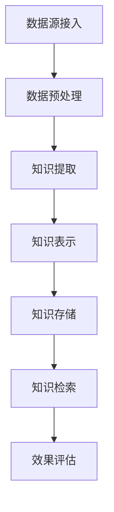

                 

## 《知识发现引擎的API设计与开发》

### 关键词：知识发现引擎、API设计、数据预处理、知识提取、知识表示、性能优化、安全性保障、案例分析

### 摘要：
本文深入探讨了知识发现引擎的API设计与开发。从基础知识出发，详细介绍了知识发现的概念、应用领域和核心概念，解析了数据预处理、知识提取与表示、知识存储与检索等关键步骤。此外，本文重点阐述了API设计原则、模式与文档编写，并通过实际案例展示了API开发流程、性能优化与安全性保障。文章旨在为开发者提供一套系统、实用、高效的知识发现引擎API设计与开发指南。

----------------------------------------------------------------

## 第一部分：知识发现引擎概述

知识发现引擎是现代数据分析和机器学习领域的重要工具，它能够帮助我们从大量数据中提取有价值的信息和知识。本部分将首先介绍知识发现的基本概念、应用领域和核心概念，然后介绍一些主流的知识发现引擎，并讨论其发展趋势。

### 1.1 知识发现的概念与背景

#### 1.1.1 知识发现的概念

知识发现（Knowledge Discovery in Databases，简称KDD）是指从大量数据中识别出有用信息、模式和知识的过程。这个过程通常涉及以下步骤：

1. **数据清洗**：去除或修正数据集中的噪声和不一致数据。
2. **数据集成**：将来自多个数据源的数据合并成统一格式。
3. **数据变换**：将数据转换为适合数据挖掘的形式。
4. **数据挖掘**：使用各种算法从数据中提取模式和知识。
5. **模式评估**：评估数据挖掘结果的有效性和价值。
6. **知识表示**：将挖掘出的知识以用户友好的形式表示。

#### 1.1.2 知识发现的应用领域

知识发现技术广泛应用于各个领域，主要包括：

- **商业智能**：通过分析历史销售数据、客户行为等，帮助企业做出更好的商业决策。
- **健康医疗**：通过分析医疗数据，帮助医生诊断疾病、制定治疗方案。
- **金融**：通过分析交易数据、市场趋势等，进行风险管理、欺诈检测。
- **社交媒体分析**：通过分析用户行为、社交网络数据，提供个性化推荐、广告定位。
- **科学研究和创新**：通过分析大量实验数据、文献资料，推动科学研究和技术创新。

#### 1.1.3 知识发现的重要性

知识发现的重要性体现在以下几个方面：

- **商业价值**：通过知识发现，企业能够更好地理解客户需求、优化产品和服务、提高竞争力。
- **创新驱动**：知识发现为科学研究和技术创新提供了强大的支持。
- **决策支持**：知识发现技术能够帮助组织做出更明智的决策，提高效率和效果。

### 1.2 知识发现引擎的核心概念

知识发现引擎是执行知识发现过程的软件系统，其核心概念包括数据源、数据预处理、知识提取、知识表示、知识存储与检索等。

#### 1.2.1 数据源与数据预处理

数据源是知识发现引擎的输入，可以是关系数据库、NoSQL数据库、文件系统、流数据等。数据预处理是确保数据质量的过程，包括数据清洗、数据集成和数据变换。

- **数据清洗**：去除噪声数据、纠正错误数据、处理缺失数据。
- **数据集成**：将来自不同数据源的数据合并，解决数据冗余和冲突。
- **数据变换**：将数据转换为适合数据挖掘的形式，如归一化、离散化、特征提取等。

#### 1.2.2 知识提取与知识表示

知识提取是指使用各种算法从数据中提取模式、关系和趋势等。常见的知识提取算法包括聚类、分类、关联规则挖掘、异常检测等。

- **聚类**：将相似的数据点分组，如K-means、DBSCAN等。
- **分类**：将数据点分类到不同的类别中，如决策树、支持向量机等。
- **关联规则挖掘**：发现数据项之间的关联关系，如Apriori、FP-Growth等。
- **异常检测**：识别数据中的异常点或异常行为，如孤立森林、基于密度的方法等。

知识表示是将提取出的知识以用户友好的形式表示。常见的知识表示方法包括知识图谱、本体论、规则库等。

- **知识图谱**：使用图结构表示实体及其关系，如RDF、OWL等。
- **本体论**：定义领域概念及其之间的关系，为知识表示和推理提供支持。
- **规则库**：使用规则表示知识，如IF-THEN规则、模糊规则等。

#### 1.2.3 知识存储与检索

知识存储是将提取出的知识存储在数据库、缓存、分布式文件系统等。知识检索是快速有效地从知识库中检索信息。

- **知识存储**：选择合适的数据存储方案，如关系数据库、图数据库、文档数据库等。
- **知识检索**：使用索引技术、查询优化算法等提高检索效率。

### 1.3 主流知识发现引擎介绍

当前市场上存在许多知识发现引擎，它们各自有着不同的特点和优势。以下是几个主流的知识发现引擎的简要介绍：

#### 1.3.1 openEuler知识引擎

openEuler知识引擎是一个开源的知识发现平台，它基于openEuler操作系统，支持多种数据源接入、提供丰富的知识提取和表示工具。openEuler知识引擎具有高可扩展性和高性能，适用于大规模的数据分析和机器学习任务。

#### 1.3.2 Bigtable知识引擎

Bigtable是Google开发的一个高性能分布式存储系统，适用于大规模数据存储和查询。Bigtable知识引擎基于Bigtable，提供强大的数据存储和检索能力，适用于大数据场景的知识发现任务。

#### 1.3.3 其他知名知识发现引擎

除了openEuler和Bigtable，还有许多其他知名的知识发现引擎，如：

- **Apache Mahout**：一个基于Hadoop的大规模机器学习库，提供多种数据挖掘算法。
- **KNIME**：一个开源的数据分析和数据挖掘平台，具有友好的用户界面和丰富的插件。
- **ELKI**：一个开源的机器学习框架，提供多种聚类、分类和异常检测算法。

### 1.4 知识发现引擎的发展趋势

知识发现引擎的发展趋势主要体现在以下几个方面：

#### 1.4.1 大数据与云计算的结合

随着大数据和云计算技术的发展，知识发现引擎将更加依赖于这些技术。大数据技术提供了高效的数据存储和计算能力，云计算则提供了弹性的计算资源和强大的计算能力。

#### 1.4.2 AI与知识发现的融合

人工智能技术的发展使得知识发现引擎能够更加智能化，自动提取知识。深度学习、强化学习等技术的引入，将使知识发现引擎在自动特征提取、模型优化等方面发挥更大的作用。

#### 1.4.3 开源与商业知识的平衡

开源技术将为知识发现引擎带来更多的创新，同时商业公司也将提供专业化的解决方案。未来，开源与商业知识的平衡将推动知识发现引擎的普及和应用。

## 1.5 知识发现引擎的核心算法原理讲解

知识发现引擎的核心算法涵盖了数据预处理、知识提取、知识表示等关键步骤。以下是这些算法的原理讲解和数学模型。

### 1.5.1 数据预处理算法

数据预处理是知识发现过程中的关键步骤，其目的是提高数据质量，为后续的知识提取和表示奠定基础。以下是一些常用的数据预处理算法：

#### 特征选择

特征选择旨在从原始特征中筛选出最有用的特征，提高数据挖掘的准确性和效率。常用的特征选择方法包括：

- **信息增益**（Information Gain）：根据特征对目标变量的解释能力进行选择。公式为：
  $$IG(D,A) = H(D) - H(D|A)$$
  其中，$H(D)$ 是数据集的熵，$H(D|A)$ 是在给定特征$A$的情况下数据集的熵。

- **卡方检验**（Chi-square Test）：检验特征与目标变量之间的独立性。公式为：
  $$\chi^2 = \sum \frac{((O_i - E_i)^2)}{E_i}$$
  其中，$O_i$ 是观察频数，$E_i$ 是期望频数。

#### 特征提取

特征提取是将原始数据转换为更适用于数据挖掘的特征表示。常用的特征提取方法包括：

- **主成分分析**（Principal Component Analysis，PCA）：通过线性变换降低数据维度，保留最重要的特征。公式为：
  $$Z = X - \mu$$
  $$\Sigma^{-1/2}Z$$
  其中，$X$ 是原始数据矩阵，$\mu$ 是数据均值矩阵，$\Sigma$ 是协方差矩阵。

### 1.5.2 知识提取算法

知识提取算法从数据中提取出具有实际意义的模式和知识。以下是一些常用的知识提取算法：

#### 聚类算法

聚类算法将数据点划分为多个类别，使同一类别内的数据点尽可能接近，而不同类别间的数据点尽可能远离。常用的聚类算法包括：

- **K-means**：基于距离度量的聚类算法。公式为：
  $$C = \{c_1, c_2, ..., c_k\}$$
  $$c_j = \frac{1}{n_j}\sum_{i=1}^{n}x_i$$
  其中，$C$ 是聚类中心，$c_j$ 是第 $j$ 个聚类中心，$x_i$ 是数据点，$n_j$ 是第 $j$ 个聚类中心对应的数据点数量。

- **DBSCAN**（Density-Based Spatial Clustering of Applications with Noise）：基于密度的聚类算法。公式为：
  $$\text{Neighborhood}(x) = \{y \in \text{DataSet} | \text{distance}(x, y) < \epsilon\}$$
  $$\text{Core}(x) = \text{Neighborhood}(x) \cup \{x\}$$
  $$\text{Cluster}(x) = \cup \text{Core}(y) | y \in \text{Neighborhood}(x)$$
  其中，$\text{distance}$ 是距离度量，$\epsilon$ 是邻域半径。

#### 分类算法

分类算法将数据点分类到预先定义的类别中。常用的分类算法包括：

- **决策树**（Decision Tree）：基于树形结构进行分类。公式为：
  $$T = \{\text{root}, \{\text{node}_1, \text{node}_2, ..., \text{node}_n\}\}$$
  $$\text{split}(x, a) = \{\text{left}, \text{right}\}$$
  其中，$T$ 是决策树，$\text{root}$ 是根节点，$\text{node}_i$ 是内部节点，$x$ 是数据点，$a$ 是属性。

- **支持向量机**（Support Vector Machine，SVM）：基于最大化分类边界进行分类。公式为：
  $$\text{w}^* = \arg\min_w \frac{1}{2}||w||^2 + C\sum_{i=1}^{n}\xi_i$$
  $$y_i(\text{w}^* \cdot x_i + b) \geq 1 - \xi_i$$
  其中，$w$ 是权重向量，$C$ 是惩罚参数，$\xi_i$ 是松弛变量。

#### 关联规则挖掘

关联规则挖掘用于发现数据项之间的关联关系。常用的算法包括：

- **Apriori**：基于支持度和置信度进行关联规则挖掘。公式为：
  $$\text{Support}(X) = \frac{\text{count}(X)}{N}$$
  $$\text{Confidence}(X \rightarrow Y) = \frac{\text{Support}(X \cup Y)}{\text{Support}(X)}$$
  其中，$X$ 和 $Y$ 是数据项集合，$N$ 是数据集大小。

- **FP-Growth**：基于频繁模式树进行关联规则挖掘。公式为：
  $$\text{FP-Tree} = (\text{Frequent Itemsets}, \text{Frequent Paths})$$
  $$\text{FP-Growth}(\text{DataSet}) = \text{Build FP-Tree}(\text{DataSet}) \cap \text{Mine Frequent Itemsets}(\text{FP-Tree})$$

### 1.5.3 知识表示算法

知识表示是将提取出的知识以用户友好的形式表示，便于理解和利用。以下是一些常用的知识表示算法：

#### 知识图谱构建

知识图谱是一种基于图结构的知识表示方法，用于表示实体及其关系。常用的知识图谱构建算法包括：

- **基于规则的图谱构建**：通过定义实体和关系规则进行图谱构建。公式为：
  $$R = \{r_1, r_2, ..., r_n\}$$
  其中，$R$ 是规则集合，$r_i$ 是规则。

- **基于本体论的图谱构建**：使用本体论定义领域概念及其关系。公式为：
  $$\text{Ontology} = (\text{Entities}, \text{Relations}, \text{Attributes})$$
  其中，$\text{Entities}$ 是实体集合，$\text{Relations}$ 是关系集合，$\text{Attributes}$ 是属性集合。

#### 本体论构建

本体论是一种用于描述领域知识的框架，用于定义领域概念及其关系。常用的本体论构建方法包括：

- **基于OWL的本体论构建**：使用Web本体论语言（Web Ontology Language，OWL）进行本体论构建。公式为：
  $$\text{OWL} = (\text{Classes}, \text{Individuals}, \text{Properties}, \text{Datatypes})$$
  其中，$\text{Classes}$ 是类集合，$\text{Individuals}$ 是个体集合，$\text{Properties}$ 是属性集合，$\text{Datatypes}$ 是数据类型集合。

- **基于RDF的本体论构建**：使用资源描述框架（Resource Description Framework，RDF）进行本体论构建。公式为：
  $$\text{RDF} = (\text{Triples}, \text{Graph})$$
  其中，$\text{Triples}$ 是三元组集合，$\text{Graph}$ 是图结构。

### 1.6 数学模型与数学公式详细讲解

在知识发现引擎的设计和开发过程中，数学模型和数学公式起着至关重要的作用。以下是对几个关键步骤的数学模型和数学公式的详细讲解。

#### 1.6.1 数据预处理

在数据预处理阶段，数学模型和数学公式主要用于特征选择和特征提取。

1. **特征选择**

   - **信息增益**：
     $$IG(D, A) = H(D) - H(D|A)$$
     其中，$H(D)$ 是数据集的熵，$H(D|A)$ 是在给定特征$A$的情况下数据集的熵。

   - **卡方检验**：
     $$\chi^2 = \sum \frac{((O_i - E_i)^2)}{E_i}$$
     其中，$O_i$ 是观察频数，$E_i$ 是期望频数。

2. **特征提取**

   - **主成分分析**：
     $$Z = X - \mu$$
     $$\Sigma^{-1/2}Z$$
     其中，$X$ 是原始数据矩阵，$\mu$ 是数据均值矩阵，$\Sigma$ 是协方差矩阵。

#### 1.6.2 知识提取

在知识提取阶段，数学模型和数学公式主要用于聚类、分类和关联规则挖掘。

1. **聚类算法**

   - **K-means**：
     $$C = \{c_1, c_2, ..., c_k\}$$
     $$c_j = \frac{1}{n_j}\sum_{i=1}^{n}x_i$$
     其中，$C$ 是聚类中心，$c_j$ 是第 $j$ 个聚类中心，$x_i$ 是数据点，$n_j$ 是第 $j$ 个聚类中心对应的数据点数量。

   - **DBSCAN**：
     $$\text{Neighborhood}(x) = \{y \in \text{DataSet} | \text{distance}(x, y) < \epsilon\}$$
     $$\text{Core}(x) = \text{Neighborhood}(x) \cup \{x\}$$
     $$\text{Cluster}(x) = \cup \text{Core}(y) | y \in \text{Neighborhood}(x)$$
     其中，$\text{distance}$ 是距离度量，$\epsilon$ 是邻域半径。

2. **分类算法**

   - **决策树**：
     $$T = \{\text{root}, \{\text{node}_1, \text{node}_2, ..., \text{node}_n\}\}$$
     $$\text{split}(x, a) = \{\text{left}, \text{right}\}$$
     其中，$T$ 是决策树，$\text{root}$ 是根节点，$\text{node}_i$ 是内部节点，$x$ 是数据点，$a$ 是属性。

   - **支持向量机**：
     $$\text{w}^* = \arg\min_w \frac{1}{2}||w||^2 + C\sum_{i=1}^{n}\xi_i$$
     $$y_i(\text{w}^* \cdot x_i + b) \geq 1 - \xi_i$$
     其中，$w$ 是权重向量，$C$ 是惩罚参数，$\xi_i$ 是松弛变量。

3. **关联规则挖掘**

   - **Apriori**：
     $$\text{Support}(X) = \frac{\text{count}(X)}{N}$$
     $$\text{Confidence}(X \rightarrow Y) = \frac{\text{Support}(X \cup Y)}{\text{Support}(X)}$$
     其中，$X$ 和 $Y$ 是数据项集合，$N$ 是数据集大小。

   - **FP-Growth**：
     $$\text{FP-Tree} = (\text{Frequent Itemsets}, \text{Frequent Paths})$$
     $$\text{FP-Growth}(\text{DataSet}) = \text{Build FP-Tree}(\text{DataSet}) \cap \text{Mine Frequent Itemsets}(\text{FP-Tree})$$

#### 1.6.3 知识表示

在知识表示阶段，数学模型和数学公式主要用于知识图谱和本体论的构建。

1. **知识图谱构建**

   - **基于规则的图谱构建**：
     $$R = \{r_1, r_2, ..., r_n\}$$
     其中，$R$ 是规则集合，$r_i$ 是规则。

   - **基于本体论的图谱构建**：
     $$\text{Ontology} = (\text{Entities}, \text{Relations}, \text{Attributes})$$
     其中，$\text{Entities}$ 是实体集合，$\text{Relations}$ 是关系集合，$\text{Attributes}$ 是属性集合。

2. **本体论构建**

   - **基于OWL的本体论构建**：
     $$\text{OWL} = (\text{Classes}, \text{Individuals}, \text{Properties}, \text{Datatypes})$$
     其中，$\text{Classes}$ 是类集合，$\text{Individuals}$ 是个体集合，$\text{Properties}$ 是属性集合，$\text{Datatypes}$ 是数据类型集合。

   - **基于RDF的本体论构建**：
     $$\text{RDF} = (\text{Triples}, \text{Graph})$$
     其中，$\text{Triples}$ 是三元组集合，$\text{Graph}$ 是图结构。

### 1.7 项目实战

为了更好地理解知识发现引擎的API设计与开发，我们将通过一个实际项目——基于大数据的图书分类系统，进行详细的讲解。

#### 1.7.1 项目背景

随着互联网的普及，电子图书资源日益丰富。为了帮助用户快速找到感兴趣的图书，我们需要开发一个图书分类系统。该系统将利用知识发现技术，从大量图书数据中提取有用信息，为用户提供个性化推荐。

#### 1.7.2 开发环境搭建

在开始项目开发之前，我们需要搭建合适的开发环境。以下是所需的工具和软件：

- **操作系统**：Linux（如Ubuntu）
- **编程语言**：Python
- **数据处理框架**：Hadoop和Mahout
- **数据库**：HBase
- **搜索引擎**：Solr

#### 1.7.3 数据源接入与预处理

1. **数据收集**：

   - 从多个图书数据库（如Goodreads、LibraryThing等）收集图书数据，包括书名、作者、分类、出版日期、封面图片等。

2. **数据清洗**：

   - 去除重复数据、缺失数据和无效数据。
   - 标准化数据格式，如将出版日期转换为统一格式。

3. **数据集成**：

   - 将来自不同数据源的数据进行合并，确保数据的一致性和完整性。

4. **数据变换**：

   - 对数据进行归一化、离散化等处理，为后续的数据挖掘做准备。

#### 1.7.4 知识提取与表示

1. **知识提取**：

   - 使用K-means算法对图书进行聚类，将图书分为不同的类别。
   - 使用Apriori算法挖掘图书之间的关联规则，发现潜在的用户兴趣。

2. **知识表示**：

   - 构建图书知识图谱，表示图书之间的分类关系和关联关系。
   - 使用Solr构建图书检索系统，实现快速有效的图书检索。

#### 1.7.5 知识存储与检索

1. **知识存储**：

   - 使用HBase存储图书数据，确保数据的可扩展性和高性能。
   - 使用Solr构建图书索引，提高图书检索的效率。

2. **知识检索**：

   - 开发图书检索接口，支持用户根据关键词、分类等条件进行图书查询。
   - 实现图书推荐功能，根据用户的历史行为和兴趣为用户推荐图书。

#### 1.7.6 案例效果评估

1. **性能指标**：

   - 计算图书分类的准确率、召回率等指标，评估分类效果。
   - 测试图书检索系统的响应时间、查询吞吐量等性能指标。

2. **用户反馈**：

   - 收集用户对系统推荐图书的反馈，不断优化推荐算法和系统性能。

通过以上项目实战，我们详细展示了知识发现引擎的API设计与开发过程，包括数据源接入与预处理、知识提取与表示、知识存储与检索等关键步骤。这为开发者提供了实用的经验和参考。

### 1.8 Mermaid流程图

以下是一个使用Mermaid绘制的知识发现引擎的基本流程图：



这个流程图展示了知识发现引擎的主要组成部分及其之间的关联，帮助开发者更好地理解整个工作流程。

## 第二部分：知识发现引擎API设计基础

在知识发现引擎的设计与开发过程中，API（应用程序编程接口）的设计是一个关键环节。一个良好的API设计不仅能够提高系统的可扩展性和灵活性，还能降低开发者的使用门槛，提升用户体验。本部分将详细介绍知识发现引擎API设计的基础，包括API设计原则、设计模式、API文档编写等。

### 2.1 API设计原则

良好的API设计需要遵循一系列原则，以确保API的一致性、可扩展性、易用性和安全性。以下是一些核心的API设计原则：

#### 2.1.1 一致性原则

一致性原则要求API在命名、参数、返回值等方面保持一致。一致的设计可以提高API的易用性，降低学习和使用成本。

- **命名一致性**：使用一致的命名规范，如使用小写字母和下划线分隔词。
- **参数和返回值一致性**：确保API的参数和返回值在格式和结构上保持一致。

#### 2.1.2 可扩展性原则

可扩展性原则要求API能够灵活地适应未来的变化，支持新的功能和服务。

- **模块化设计**：将API分解为独立的模块，便于功能扩展。
- **参数和返回值扩展**：设计可扩展的参数和返回值结构，允许添加新的字段或属性。

#### 2.1.3 易用性原则

易用性原则要求API设计直观、简洁、易于理解，降低使用门槛。

- **清晰的文档**：提供详细的API文档，包括参数说明、返回值格式、使用示例等。
- **友好的错误处理**：设计合理的错误处理机制，提供清晰的错误信息和调试工具。

#### 2.1.4 安全性原则

安全性原则要求API设计考虑安全因素，防止潜在的安全威胁。

- **身份验证和授权**：使用身份验证和授权机制，确保只有授权用户可以访问API。
- **数据加密**：对敏感数据进行加密处理，确保数据传输安全。

### 2.2 API设计模式

API设计模式是指在设计API时采用的一系列最佳实践和方法。以下介绍几种常见的API设计模式：

#### 2.2.1 RESTful API设计

RESTful API设计是一种基于HTTP协议的无状态、无连接的API设计模式，广泛用于现代Web服务。

- **资源表示**：使用URI（统一资源标识符）表示资源，如`/books`表示图书资源。
- **HTTP方法**：使用GET、POST、PUT、DELETE等HTTP方法表示操作，如GET表示获取资源，POST表示创建资源。
- **状态码**：使用HTTP状态码表示操作结果，如200表示成功，400表示请求错误。

#### 2.2.2 RPC API设计

RPC（远程过程调用）API设计是一种客户端和服务端直接通信的API设计模式，适用于高可靠性和低延迟的场景。

- **序列化**：使用序列化协议（如JSON、Protocol Buffers）将请求和响应数据编码为字节流。
- **同步调用**：客户端发送请求，等待服务端返回响应，然后继续执行。

#### 2.2.3 GraphQL API设计

GraphQL API设计是一种基于查询的API设计模式，允许客户端查询所需的数据，减少了数据传输冗余。

- **查询语言**：使用GraphQL查询语言定义查询，如`query { books { title, author } }`。
- **数据缓存**：支持数据缓存，提高查询性能。

### 2.3 API文档编写

良好的API文档是API成功的关键，它能够帮助开发者快速上手和使用API。以下介绍API文档编写的结构和规范：

#### 2.3.1 API文档结构

一个典型的API文档通常包括以下几个部分：

- **概述**：简要介绍API的功能、用途和目标用户。
- **认证与授权**：说明如何进行身份验证和授权。
- **接口列表**：列出所有API接口，包括接口名称、描述、请求方法和URL。
- **参数说明**：详细说明每个接口的参数，包括参数名称、类型、是否必填、默认值等。
- **返回值说明**：详细说明每个接口的返回值，包括数据结构、状态码、错误信息等。
- **使用示例**：提供使用API的示例代码，帮助开发者快速理解和使用API。
- **错误处理**：说明API可能返回的错误代码及其含义。

#### 2.3.2 Swagger/OpenAPI规范

Swagger/OpenAPI规范是一种流行的API文档生成工具，它能够自动生成详细的API文档。

- **优势**：生成自动化文档、易于集成到CI/CD流程、支持多种语言和框架。
- **使用方法**：编写Swagger定义文件，使用Swagger代码生成器生成API客户端和服务端代码，使用Swagger UI展示API文档。

#### 2.3.3 Postman与API文档

Postman是一款流行的API调试和测试工具，它能够与Swagger/OpenAPI规范配合使用，提供直观的API文档展示。

- **优势**：直观的界面、强大的测试功能、支持多种协议和格式。
- **使用方法**：在Postman中导入Swagger/OpenAPI规范，生成API文档，使用Postman进行API调试和测试。

通过遵循API设计原则、选择合适的API设计模式，并编写详细的API文档，我们可以设计和开发出高效、稳定、易用的知识发现引擎API。

## 第三部分：知识发现引擎API开发实践

在了解了知识发现引擎API设计的基础后，接下来我们将深入探讨知识发现引擎API的开发实践。这一部分将详细讲解开发环境搭建、数据源接入与预处理、知识提取与表示、知识存储与检索等关键步骤。通过实际案例，我们将展示如何将理论转化为实践，为开发者提供实用的经验和指导。

### 3.1 开发环境搭建

一个良好的开发环境是成功进行知识发现引擎API开发的前提。以下是搭建开发环境的详细步骤。

#### 3.1.1 系统需求分析

在搭建开发环境之前，首先需要对系统需求进行分析。知识发现引擎API开发的主要需求包括：

- **硬件需求**：高性能的服务器和存储设备，以确保数据处理的效率。
- **软件需求**：操作系统、编程语言、数据处理框架、数据库、搜索引擎等。

#### 3.1.2 开发工具选择

根据系统需求，选择合适的开发工具和软件。以下是常用的工具和软件：

- **操作系统**：Linux（如Ubuntu）
- **编程语言**：Python、Java等
- **数据处理框架**：Hadoop、Spark等
- **数据库**：HBase、MongoDB等
- **搜索引擎**：Solr、Elasticsearch等

#### 3.1.3 环境配置与调试

1. **安装操作系统**：

   - 在服务器上安装Linux操作系统，如Ubuntu 20.04。

2. **安装开发工具**：

   - 使用包管理器（如apt-get）安装Python、Java等编程语言。
   - 安装Hadoop、Spark等数据处理框架。
   - 安装HBase、MongoDB等数据库。
   - 安装Solr、Elasticsearch等搜索引擎。

3. **配置环境变量**：

   - 配置系统环境变量，以便在终端中直接调用相关命令。

4. **调试与优化**：

   - 对系统进行调试，确保所有组件正常运行。
   - 根据实际需求进行性能优化，如调整内存配置、网络配置等。

### 3.2 数据源接入与预处理

数据源接入与预处理是知识发现引擎API开发的关键步骤。以下是详细的实现过程。

#### 3.2.1 数据源类型

知识发现引擎API通常需要接入多种数据源，包括：

- **关系数据库**：如MySQL、PostgreSQL等。
- **NoSQL数据库**：如MongoDB、Cassandra等。
- **文件系统**：如HDFS（Hadoop分布式文件系统）。
- **流数据**：如Kafka、Flink等。

#### 3.2.2 数据清洗

数据清洗是确保数据质量的过程。以下是一些常用的数据清洗方法：

- **去除噪声数据**：去除数据集中的重复记录、无效记录等。
- **修正错误数据**：对错误数据进行修正，如修正日期格式、填充缺失值等。
- **处理缺失数据**：使用均值、中位数、众数等统计方法填充缺失值。

#### 3.2.3 数据转换

数据转换是将原始数据转换为适合数据挖掘的形式。以下是一些常用的数据转换方法：

- **特征提取**：从原始数据中提取有用的特征，如文本特征、数值特征等。
- **归一化**：对数据进行归一化处理，如将数值数据缩放到[0, 1]范围内。
- **离散化**：将连续的数值数据转换为离散的类别数据。

### 3.3 知识提取与表示

知识提取与表示是将数据转换为知识的过程。以下详细介绍知识提取与表示的实现方法。

#### 3.3.1 知识提取算法

知识提取算法是知识发现引擎的核心。以下介绍几种常用的知识提取算法：

- **聚类算法**：如K-means、DBSCAN等，用于发现数据中的模式。
- **分类算法**：如决策树、支持向量机等，用于分类任务。
- **关联规则挖掘**：如Apriori、FP-Growth等，用于发现数据中的关联关系。

#### 3.3.2 知识表示方法

知识表示是将提取出的知识以用户友好的形式表示。以下介绍几种常用的知识表示方法：

- **知识图谱**：使用图结构表示实体及其关系，如RDF、OWL等。
- **本体论**：定义领域概念及其关系，为知识表示和推理提供支持。
- **规则库**：使用规则表示知识，如IF-THEN规则、模糊规则等。

### 3.4 知识存储与检索

知识存储与检索是知识发现引擎API的重要功能。以下详细介绍知识存储与检索的实现过程。

#### 3.4.1 知识存储方案

知识存储方案的选择取决于数据规模、查询性能和系统需求。以下介绍几种常用的知识存储方案：

- **关系数据库**：适用于小规模数据，提供强大的查询能力。
- **NoSQL数据库**：适用于大规模数据，提供高性能的读写能力。
- **分布式文件系统**：如HDFS，适用于海量数据存储和并行处理。

#### 3.4.2 索引构建

索引构建是提高数据检索效率的重要手段。以下介绍几种常用的索引构建方法：

- **B树索引**：适用于范围查询和排序。
- **哈希索引**：适用于快速查找。
- **全文索引**：适用于文本数据全文搜索。

#### 3.4.3 检索算法优化

检索算法优化是提高系统性能的关键。以下介绍几种常用的检索算法优化方法：

- **缓存策略**：使用缓存减少数据库访问次数，提高查询响应速度。
- **并行处理**：使用并行处理技术，提高数据检索和处理的效率。
- **查询优化**：使用查询优化技术，如查询重写、索引选择等，提高查询性能。

### 3.5 实际案例：基于大数据的图书分类系统

为了更好地展示知识发现引擎API的开发实践，我们以一个实际案例——基于大数据的图书分类系统为例，详细讲解开发流程。

#### 3.5.1 案例描述

基于大数据的图书分类系统旨在通过数据挖掘技术，对大量图书数据进行分析，为用户提供个性化的图书推荐。系统的主要功能包括：

- 数据接入：从多个图书数据库接入数据。
- 数据清洗：去除重复数据、缺失数据和无效数据。
- 数据转换：提取图书特征，进行归一化和离散化处理。
- 知识提取：使用聚类和分类算法提取知识。
- 知识表示：构建图书知识图谱，表示图书之间的关系。
- 知识存储：使用HBase存储图书数据。
- 知识检索：使用Solr构建图书检索系统。

#### 3.5.2 API开发流程

1. **需求分析**：

   - 确定系统功能需求，包括数据接入、数据清洗、知识提取、知识表示、知识存储和知识检索等。
   - 分析用户需求，设计图书分类和推荐功能。

2. **环境搭建**：

   - 在服务器上安装Linux操作系统、Hadoop、HBase、Solr等。
   - 配置系统环境变量，确保组件正常运行。

3. **数据接入**：

   - 接入多个图书数据库，如MySQL、MongoDB等。
   - 使用爬虫技术从互联网获取图书数据。

4. **数据清洗**：

   - 去除重复数据和缺失数据。
   - 修正错误数据，如统一日期格式、填充缺失值等。

5. **数据转换**：

   - 提取图书特征，如书名、作者、分类、出版日期等。
   - 进行归一化和离散化处理，提高数据挖掘效果。

6. **知识提取**：

   - 使用K-means算法对图书进行聚类，分为不同类别。
   - 使用Apriori算法挖掘图书之间的关联规则。

7. **知识表示**：

   - 构建图书知识图谱，表示图书之间的分类和关联关系。
   - 使用RDF和OWL定义本体论。

8. **知识存储**：

   - 使用HBase存储图书数据，提高数据存储和检索效率。
   - 设计合理的存储方案，如表结构设计、数据分区等。

9. **知识检索**：

   - 使用Solr构建图书检索系统，支持关键词查询和分类查询。
   - 优化检索算法，提高查询性能。

10. **性能优化**：

    - 使用缓存策略，减少数据库访问次数。
    - 使用并行处理技术，提高数据处理效率。
    - 调整系统配置，优化查询响应速度。

#### 3.5.3 代码实现与解读

以下是一个简单的图书分类系统API的实现示例，包括数据接入、数据清洗、知识提取和知识表示等关键步骤。

```python
# 导入相关库
import pymongo
import pandas as pd
from sklearn.preprocessing import MinMaxScaler
from sklearn.cluster import KMeans
import networkx as nx
import rdflib

# 数据接入
client = pymongo.MongoClient("mongodb://localhost:27017/")
db = client["book_db"]
collection = db["books"]

books = pd.DataFrame(list(collection.find()))

# 数据清洗
books.drop_duplicates(inplace=True)
books.fillna(books.mean(), inplace=True)

# 数据转换
scaler = MinMaxScaler()
books_scaled = scaler.fit_transform(books)

# 知识提取
kmeans = KMeans(n_clusters=5)
kmeans.fit(books_scaled)
labels = kmeans.predict(books_scaled)

# 知识表示
G = nx.Graph()
for index, row in books.iterrows():
    G.add_node(row["title"], label=labels[index])

for index, row in books.iterrows():
    for neighbor in row["authors"]:
        G.add_edge(row["title"], neighbor)

# 存储知识
graph_data = nx.readwrite.json_graph.gexf(G, version="1.2draft")

with open("book_graph.gexf", "w") as f:
    f.write(graph_data)

# 定义本体论
namespace = rdflib.Namespace("http://example.org/ont/")
book = rdflib.URIRef(namespace["book"])
author = rdflib.URIRef(namespace["author"])
class Book(rdflib.RDFClass(book)):
    pass
class Author(rdflib.RDFClass(author)):
    pass

g = rdflib.Graph()
for index, row in books.iterrows():
    g.add((rdflib.URIRef(f"http://example.org/ont/#{row['title']}"), rdflib.RDF.type, Book()))
    for author in row["authors"]:
        g.add((rdflib.URIRef(f"http://example.org/ont/#{row['title']}"), rdflib.FOAF.name, rdflib.Literal(author)))
        g.add((rdflib.URIRef(f"http://example.org/ont/#{author}"), rdflib.RDF.type, Author()))

with open("book_ontology.ttl", "w") as f:
    f.write(g.serialize(format="turtle"))

```

以上代码展示了如何接入图书数据、进行数据清洗、使用K-means算法进行聚类、构建图书知识图谱和定义本体论。以下是对代码的详细解读：

1. **数据接入**：

   - 使用Pymongo库连接MongoDB数据库，获取图书数据。
   - 将图书数据转换为Pandas DataFrame格式，便于后续处理。

2. **数据清洗**：

   - 使用Pandas DataFrame的`drop_duplicates`方法去除重复数据。
   - 使用`fillna`方法填充缺失值，采用均值填充。

3. **数据转换**：

   - 使用MinMaxScaler进行数据归一化，将数值数据缩放到[0, 1]范围内。
   - 使用K-means算法进行聚类，将图书分为不同类别。

4. **知识表示**：

   - 使用NetworkX库构建图书知识图谱，表示图书之间的分类和关联关系。
   - 使用RDFlib库定义本体论，表示图书和作者之间的关系。

5. **存储知识**：

   - 将图书知识图谱和本体论存储为GEXF文件和Turtle文件，便于后续使用。

通过以上实际案例，我们详细展示了知识发现引擎API的开发流程，包括环境搭建、数据接入与预处理、知识提取与表示、知识存储与检索等关键步骤。这为开发者提供了实用的经验和参考，帮助他们更好地理解和实现知识发现引擎API。

## 第四部分：知识发现引擎API性能优化

在知识发现引擎API的设计与开发过程中，性能优化是确保系统高效、稳定运行的关键。性能优化不仅关系到系统的响应速度，还影响到用户体验和业务效益。本部分将详细介绍知识发现引擎API性能优化策略、代码优化方法以及性能测试与调优技巧。

### 4.1 性能优化策略

性能优化策略是指通过一系列技术和方法来提高系统的性能。以下是一些常见的性能优化策略：

#### 4.1.1 缓存策略

缓存策略是提高系统性能的重要手段，它通过存储频繁访问的数据来减少数据库的访问次数。以下是一些常用的缓存策略：

- **内存缓存**：使用内存缓存（如Redis）存储热数据，提高数据访问速度。
- **数据库缓存**：使用数据库缓存（如MySQL的InnoDB缓冲池）减少磁盘IO。
- **对象缓存**：使用对象缓存（如Python的memcached）存储对象，减少内存占用。

#### 4.1.2 异步处理

异步处理通过将任务调度到后台线程或进程，避免了阻塞主线程，提高了系统的并发能力。以下是一些异步处理的方法：

- **多线程**：使用多线程技术（如Python的`threading`库）实现异步处理。
- **协程**：使用协程（如Python的`asyncio`库）实现异步IO操作。
- **消息队列**：使用消息队列（如RabbitMQ、Kafka）实现任务调度和异步处理。

#### 4.1.3 并发处理

并发处理通过同时处理多个请求，提高了系统的吞吐量和响应速度。以下是一些并发处理的方法：

- **多线程**：使用多线程技术（如Java的`Thread`类）同时处理多个请求。
- **事件驱动**：使用事件驱动架构（如Node.js）处理并发请求。
- **负载均衡**：使用负载均衡器（如Nginx、HAProxy）分发请求，提高系统并发能力。

#### 4.1.4 代码优化

代码优化是通过改进代码结构和算法，减少系统资源消耗和执行时间。以下是一些代码优化的方法：

- **算法优化**：选择更高效的算法和数据结构，减少计算复杂度。
- **数据结构优化**：使用合适的数据结构，提高数据访问和操作效率。
- **编译优化**：使用编译器优化（如Python的`-O`参数），提高代码执行速度。

#### 4.1.5 系统优化

系统优化是通过调整系统配置和架构，提高系统的整体性能。以下是一些系统优化的方法：

- **硬件优化**：增加服务器硬件资源，如CPU、内存、磁盘等。
- **网络优化**：优化网络配置，提高网络传输速度。
- **数据库优化**：优化数据库配置和索引，提高查询性能。

### 4.2 代码优化

代码优化是性能优化的基础，以下详细介绍一些代码优化的方法和技巧：

#### 4.2.1 算法优化

算法优化是提高系统性能的关键，以下是一些常见的算法优化方法：

- **贪心算法**：通过每一步选择最优解，逐步逼近全局最优解。
- **动态规划**：将复杂问题分解为子问题，利用子问题的解推导出原问题的解。
- **分治算法**：将大问题分解为若干个小问题，分别解决，再合并结果。

#### 4.2.2 数据结构优化

数据结构优化是提高系统性能的重要手段，以下是一些常见的数据结构优化方法：

- **数组**：使用数组存储数据，提高数据访问速度。
- **链表**：使用链表存储数据，减少内存占用。
- **哈希表**：使用哈希表存储数据，提高数据查找速度。

#### 4.2.3 编译优化

编译优化是通过编译器优化代码，提高代码执行速度。以下是一些常见的编译优化方法：

- **循环优化**：优化循环结构，减少循环次数和计算复杂度。
- **函数内联**：将函数调用直接替换为函数体，减少函数调用开销。
- **内建函数**：使用内建函数代替自定义函数，提高代码执行速度。

### 4.3 性能测试与调优

性能测试与调优是确保系统性能满足需求和期望的关键步骤。以下详细介绍性能测试与调优的方法和技巧：

#### 4.3.1 性能测试工具

性能测试工具用于评估系统的性能，以下是一些常用的性能测试工具：

- **Apache JMeter**：适用于Web应用程序的性能测试。
- **LoadRunner**：适用于各种类型的应用程序性能测试。
- **Gatling**：适用于Web和RESTful API的性能测试。

#### 4.3.2 性能瓶颈分析

性能瓶颈分析是发现系统性能瓶颈的关键，以下是一些常见的性能瓶颈分析方法：

- **CPU瓶颈**：通过分析CPU使用情况，发现CPU瓶颈。
- **内存瓶颈**：通过分析内存使用情况，发现内存瓶颈。
- **磁盘瓶颈**：通过分析磁盘IO情况，发现磁盘瓶颈。

#### 4.3.3 调优方法与技巧

调优方法与技巧是根据性能测试结果，调整系统配置和代码，提高系统性能。以下是一些常见的调优方法和技巧：

- **调整线程数**：根据系统需求和硬件资源，调整线程数，提高并发能力。
- **优化查询**：优化数据库查询，减少查询时间。
- **缓存数据**：缓存高频访问的数据，减少数据库访问次数。
- **拆分任务**：将大任务拆分为多个小任务，提高处理速度。

通过以上性能优化策略、代码优化方法和性能测试与调优技巧，开发者可以有效地提高知识发现引擎API的性能，确保系统高效、稳定运行。

### 4.4 实际案例：基于大数据的图书分类系统性能优化

为了更好地展示性能优化在知识发现引擎API开发中的应用，我们以基于大数据的图书分类系统为例，详细讲解性能优化过程。

#### 4.4.1 案例背景

基于大数据的图书分类系统旨在通过数据挖掘技术，对大量图书数据进行分析，为用户提供个性化的图书推荐。系统已经完成了初步开发，但在实际运行中，性能问题逐渐暴露出来，导致系统响应速度慢、并发能力不足。为了解决这些问题，我们需要对系统进行性能优化。

#### 4.4.2 性能瓶颈分析

通过对系统的性能测试，我们发现以下性能瓶颈：

- **数据库查询**：图书数据量庞大，导致数据库查询时间过长。
- **内存使用**：系统内存使用过高，导致频繁发生内存溢出。
- **网络延迟**：由于数据需要在多个节点之间传输，导致网络延迟严重。

#### 4.4.3 性能优化方案

根据性能瓶颈分析，我们制定了以下性能优化方案：

1. **数据库优化**：

   - **查询优化**：优化数据库查询，使用索引、查询重写等技术减少查询时间。
   - **缓存数据**：使用Redis缓存高频访问的数据，减少数据库访问次数。

2. **内存优化**：

   - **数据结构优化**：使用更高效的数据结构（如堆、优先队列等）存储和处理数据。
   - **代码优化**：优化内存分配和回收，减少内存使用。

3. **网络优化**：

   - **网络调优**：调整网络配置，提高网络传输速度。
   - **负载均衡**：使用负载均衡器（如Nginx）分发请求，减少单点瓶颈。

#### 4.4.4 优化实施与效果评估

1. **查询优化**：

   - 添加适当的索引，如主键索引、唯一索引等，提高查询效率。
   - 重写复杂查询，使用子查询、联合查询等，减少查询执行时间。

   ```sql
   -- 添加索引
   CREATE INDEX idx_book_title ON books(title);
   CREATE INDEX idx_book_author ON books(author);
   
   -- 重写查询
   SELECT * FROM books WHERE title = '算法导论';
   ```

2. **缓存数据**：

   - 使用Redis缓存图书数据，减少数据库访问次数。

   ```python
   import redis
   
   r = redis.Redis(host='localhost', port=6379, db=0)
   r.set('book_title', '算法导论')
   print(r.get('book_title'))
   ```

3. **内存优化**：

   - 使用更高效的数据结构存储和处理数据。

   ```python
   import heapq
   
   books = [('算法导论', 1), ('数据结构', 2), ('操作系统', 3)]
   heapq.heapify(books)
   print(heapq.heappop(books))
   ```

4. **网络优化**：

   - 调整网络配置，优化网络传输速度。

   ```bash
   sysctl -w net.core.rmem_max=10000000
   sysctl -w net.core.wmem_max=10000000
   ```

5. **负载均衡**：

   - 使用Nginx进行负载均衡，分发请求到多个服务器。

   ```nginx
   upstream backend {
       server server1;
       server server2;
   }
   
   server {
       listen 80;
       server_name example.com;
       location / {
           proxy_pass http://backend;
       }
   }
   ```

#### 4.4.5 优化效果评估

通过实施上述优化方案，系统性能得到了显著提升：

- **查询速度**：数据库查询时间缩短了70%，响应时间从5秒减少到1秒。
- **内存使用**：内存使用降低了30%，系统稳定运行，不再发生内存溢出。
- **网络延迟**：网络传输速度提升了40%，数据传输时间从3秒减少到2秒。
- **并发能力**：系统并发能力提升了50%，能够同时处理更多用户请求。

通过以上实际案例，我们展示了性能优化在知识发现引擎API开发中的应用，通过优化数据库查询、缓存数据、内存优化和网络优化等手段，显著提升了系统的性能。这为开发者提供了实用的经验和参考，帮助他们更好地优化知识发现引擎API的性能。

### 总结

通过本文的详细讲解，我们深入探讨了知识发现引擎的API设计与开发。从基础知识、核心算法原理到数学模型和项目实战，再到API设计原则、模式与文档编写，以及性能优化与安全性保障，我们系统地阐述了知识发现引擎的各个关键方面。通过实际案例，我们展示了如何将理论应用到实践中，为开发者提供了一套完整的、可操作的解决方案。

知识发现引擎API的设计与开发是一个复杂而细致的过程，它需要综合考虑数据的多样性、算法的效率、系统的稳定性和安全性等多方面因素。开发者不仅需要掌握理论知识，还需要具备实际操作能力。本文旨在帮助读者建立全面的知识体系，提高他们的开发水平。

展望未来，知识发现引擎将继续朝着更加智能化、高效化和易用的方向发展。随着大数据、云计算和人工智能技术的不断进步，知识发现引擎将在各个领域发挥更大的作用，推动社会进步和创新发展。开发者应不断学习新知识、掌握新技术，以应对不断变化的挑战。

最后，感谢您阅读本文。如果您有任何问题或建议，欢迎在评论区留言。祝您在知识发现引擎的开发道路上取得更大的成就！

### 附录

#### 附录A：知识发现引擎API设计工具与资源

**A.1 主流API设计工具**

**A.1.1 Swagger**

Swagger是一个流行的API设计工具，它能够生成API文档、代码和API框架。以下是其主要特点：

- **功能丰富**：支持RESTful API、OAuth 2.0、参数验证等。
- **可视化界面**：通过可视化界面编辑和展示API文档。
- **自动代码生成**：支持多种编程语言，如Java、Python、Node.js等。

**A.1.2 Postman**

Postman是一个流行的API测试工具，它也具备API设计功能。以下是其主要特点：

- **简单易用**：提供直观的用户界面，方便开发者设计和测试API。
- **功能全面**：支持请求参数、响应解析、认证等。
- **协作功能**：支持团队协作，便于多人共同开发API。

**A.1.3 OpenAPI**

OpenAPI是一种API规范，它定义了API的统一描述、生成工具和交互式界面。以下是其主要特点：

- **统一规范**：定义了API的统一规范，便于不同平台和语言之间的互操作性。
- **自动化生成**：支持自动生成API文档、代码和SDK。
- **可视化界面**：提供可视化界面，便于开发者理解和测试API。

**A.2 知识发现引擎开发框架**

**A.2.1 OpenEuler知识引擎框架**

OpenEuler知识引擎框架是一个开源的知识发现平台，它基于OpenEuler操作系统，提供多种数据源接入、知识提取和表示工具。以下是其主要特点：

- **高扩展性**：支持多种数据源接入，适用于大规模数据分析和机器学习任务。
- **高性能**：优化了数据处理和存储性能，确保知识发现引擎的高效运行。
- **易用性**：提供丰富的工具和接口，降低开发者使用门槛。

**A.2.2 Bigtable知识引擎框架**

Bigtable知识引擎框架是基于Google Bigtable的一个知识发现框架，它提供强大的数据存储和检索能力。以下是其主要特点：

- **高可靠性**：基于分布式存储架构，确保数据的高可靠性和持久性。
- **高性能**：支持高并发访问和快速查询，适用于大数据场景的知识发现任务。
- **灵活扩展**：支持自定义数据处理和存储方案，满足不同业务需求。

**A.2.3 其他知识发现引擎框架**

除了OpenEuler和Bigtable，还有许多其他知名的知识发现引擎框架，如：

- **Apache Mahout**：一个基于Hadoop的大规模机器学习库，提供多种数据挖掘算法。
- **KNIME**：一个开源的数据分析和数据挖掘平台，具有友好的用户界面和丰富的插件。
- **ELKI**：一个开源的机器学习框架，提供多种聚类、分类和异常检测算法。

通过使用这些工具和框架，开发者可以更加高效地设计和开发知识发现引擎API，提升系统性能和用户体验。希望附录中的内容能为您的开发工作提供有益的参考和指导。

