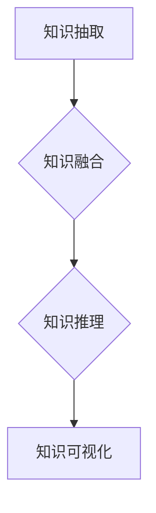

                 

### 《知识发现引擎的前端技术选型与实现》

**关键词**：知识发现引擎、前端技术、选型、实现、性能优化、安全性

**摘要**：本文将深入探讨知识发现引擎的前端技术选型与实现。首先，我们将了解知识发现引擎的基础和核心技术，包括知识抽取、知识融合和知识推理。接着，我们将介绍前端技术的发展趋势和选型原则，以及前端架构设计原则和性能优化策略。随后，我们将详细讨论前端技术选型与实现，包括常用的前端框架、组件开发、前端工程化和ES6+新特性。然后，通过一个实战项目，我们将展示知识发现引擎前端开发的实际过程，并分析代码的实现与性能优化。最后，我们将探讨知识发现引擎前端的安全性，包括常见安全漏洞的防范和用户隐私保护。

## 目录

### 《知识发现引擎的前端技术选型与实现》

#### 关键词：知识发现引擎、前端技术、选型、实现、性能优化、安全性

#### 摘要：本文将深入探讨知识发现引擎的前端技术选型与实现，涵盖从基础知识到实战项目的全面内容。

### 第一部分：知识发现引擎基础

#### 第1章：知识发现引擎概述

##### 1.1 知识发现引擎的定义与作用

##### 1.2 知识发现引擎的分类与应用场景

##### 1.3 知识发现引擎的发展历程

#### 第2章：知识发现引擎的核心技术

##### 2.1 知识抽取技术

###### 2.1.1 实体识别

###### 2.1.2 关系抽取

###### 2.1.3 命名实体识别

##### 2.2 知识融合技术

###### 2.2.1 知识合并

###### 2.2.2 知识冲突消解

###### 2.2.3 知识层次化组织

##### 2.3 知识推理技术

###### 2.3.1 知识图谱推理

###### 2.3.2 基于规则的推理

###### 2.3.3 基于机器学习的推理

### 第二部分：前端技术选型

#### 第3章：前端技术概述

##### 3.1 前端技术发展趋势

##### 3.2 前端技术选型原则

##### 3.3 常见前端技术框架比较

#### 第4章：知识发现引擎前端架构设计

##### 4.1 前端架构设计原则

##### 4.2 前端架构设计模式

##### 4.3 前端性能优化策略

#### 第5章：前端技术选型与实现

##### 5.1 前端框架选型

###### 5.1.1 React

###### 5.1.2 Vue.js

###### 5.1.3 Angular

##### 5.2 前端组件开发

###### 5.2.1 组件设计原则

###### 5.2.2 组件通信机制

###### 5.2.3 组件状态管理

##### 5.3 前端工程化

###### 5.3.1 Webpack配置

###### 5.3.2 Babel转译

###### 5.3.3 ES6+新特性

### 第三部分：知识发现引擎前端实战

#### 第6章：知识发现引擎前端实战

##### 6.1 实战项目介绍

##### 6.2 开发环境搭建

##### 6.3 数据获取与处理

##### 6.4 知识可视化与交互设计

##### 6.5 项目部署与维护

#### 第7章：知识发现引擎前端性能优化

##### 7.1 前端性能监控

##### 7.2 网络优化

##### 7.3 代码优化

##### 7.4 缓存策略

##### 7.5 响应式设计

#### 第8章：知识发现引擎前端安全

##### 8.1 前端安全概述

##### 8.2 常见安全漏洞及防范

##### 8.3 知识图谱数据安全

##### 8.4 用户隐私保护

### 附录

#### 附录A：知识发现引擎前端技术资源

##### A.1 前端技术文档

##### A.2 前端技术社区

##### A.3 开源知识发现引擎项目

### Mermaid 流程图示例



### 核心算法原理讲解

#### 2.2 知识融合技术

**知识合并**：将来自不同来源的知识进行合并，避免重复和冲突。

```python
def knowledge_merge(knowledge_sources):
    merged_knowledge = {}
    for source in knowledge_sources:
        for entity, data in source.items():
            if entity in merged_knowledge:
                merged_knowledge[entity].update(data)
            else:
                merged_knowledge[entity] = data
    return merged_knowledge
```

**知识冲突消解**：解决知识合并时可能出现的冲突。

```python
def resolve_conflicts(knowledge):
    for entity, data in knowledge.items():
        if len(data) > 1:
            # 根据一定的策略选择合适的知识
            chosen_data = choose_best_data(data)
            knowledge[entity] = chosen_data
    return knowledge
```

#### 2.3 知识推理技术

**知识图谱推理**：通过图算法推理出新的知识。

$$
\text{result} = \text{graph_query}(\text{knowledge_graph}, \text{query})
$$`

**基于规则的推理**：使用预定义的规则进行推理。

```python
def rule_based_inference(rules, knowledge):
    inferred_knowledge = {}
    for rule in rules:
        if all(condition in knowledge for condition in rule['conditions']):
            inferred_knowledge[rule['result']] = True
    return inferred_knowledge
```

### 数学模型和数学公式

**知识图谱相似度计算**：

$$
sim(A, B) = \frac{1}{|A| + |B|} \sum_{i \in A \cap B} \frac{1}{\text{distance}(i, A) + \text{distance}(i, B)}
$$`

### 项目实战

#### 6.1 实战项目介绍

**项目背景**：开发一个基于React的知识发现引擎，用于从大量文本中提取知识，并展示给用户。

**项目目标**：实现以下功能：

- 数据获取与处理
- 知识可视化
- 用户交互

**项目架构**：采用React+Redux进行状态管理，使用D3.js进行数据可视化。

#### 6.2 开发环境搭建

- Node.js环境
- React开发工具
- Redux状态管理工具
- D3.js可视化工具

#### 6.3 数据获取与处理

- 使用axios进行数据获取
- 使用lodash进行数据处理

#### 6.4 知识可视化与交互设计

- 使用D3.js绘制知识图谱
- 实现鼠标悬停和点击交互效果

#### 6.5 项目部署与维护

- 使用Webpack进行项目打包
- 使用GitHub进行版本控制
- 使用Jenkins进行自动化部署

### 代码解读与分析

**示例代码**：

```jsx
// App.js
import React from 'react';
import KnowledgeGraph from './components/KnowledgeGraph';

const App = () => {
  return (
    <div className="App">
      <KnowledgeGraph />
    </div>
  );
};

export default App;
```

**代码解读**：

- 导入React组件
- 定义App组件
- 返回包含知识图谱组件的 JSX 结构

**代码分析**：

- App组件是整个应用的入口组件
- 使用KnowledgeGraph组件展示知识图谱
- 知识图谱组件负责处理数据和渲染视图

以上是《知识发现引擎的前端技术选型与实现》的目录大纲及其详细内容。这个大纲包含了核心概念、算法原理讲解、数学模型和数学公式、项目实战以及代码解读与分析，旨在为读者提供一本全面且实用的计算机技术书籍。

接下来，我们将按照这个大纲逐一展开详细的讨论。首先，我们将探讨知识发现引擎的基础知识，包括其定义、作用、分类和应用场景，以及知识发现引擎的发展历程。然后，我们将深入分析知识发现引擎的核心技术，包括知识抽取、知识融合和知识推理，并使用Mermaid流程图和伪代码来讲解核心算法原理。接着，我们将讨论前端技术的基础知识，包括发展趋势、选型原则和常见前端技术框架的比较。随后，我们将详细讲解知识发现引擎前端架构设计的原则、模式以及性能优化策略。然后，我们将介绍前端技术选型与实现的步骤，包括前端框架选型、组件开发、前端工程化和ES6+新特性。接下来，我们将通过一个实战项目展示知识发现引擎前端开发的实际过程，并分析代码的实现与性能优化。最后，我们将探讨知识发现引擎前端的安全性，包括常见安全漏洞的防范和用户隐私保护。通过这些讨论，我们将帮助读者全面了解知识发现引擎的前端技术选型与实现，为他们在实际项目中提供指导。

## 第一部分：知识发现引擎基础

### 第1章：知识发现引擎概述

知识发现引擎是一种自动化处理数据的技术，它能够从大量文本、图像、音频等多媒体数据中提取有价值的信息和知识。这一概念最早出现在20世纪80年代，随着人工智能和数据挖掘技术的不断发展，知识发现引擎逐渐成为数据密集型领域的关键工具。

#### 1.1 知识发现引擎的定义与作用

**定义**：知识发现引擎是一种集成多种数据挖掘技术的系统，它能够从大量数据中自动发现潜在的模式、趋势、关联和异常，并将这些信息以知识的形式进行组织和呈现。

**作用**：知识发现引擎在多个领域发挥着重要作用，主要包括：

- **商业智能**：帮助企业分析海量数据，发现市场趋势、消费者行为等，从而指导决策。
- **科学研究**：支持科学研究中的数据挖掘和分析，辅助研究人员发现新的科学规律。
- **社会管理**：用于政府、公共安全等领域的数据分析，帮助政府更好地管理和决策。
- **智能推荐**：用于互联网平台，根据用户行为和偏好推荐个性化的内容。

#### 1.2 知识发现引擎的分类与应用场景

知识发现引擎可以根据功能和技术特点进行分类，常见的分类方法包括：

- **基于内容的方法**：主要利用自然语言处理、文本挖掘等技术进行文本分析，适用于文本数据的处理。
- **基于模式的方法**：通过模式识别和机器学习技术发现数据中的规律和模式，适用于复杂数据集的挖掘。
- **基于模型的方法**：利用数据挖掘模型，如分类、聚类、关联规则挖掘等，对数据进行分析，适用于结构化数据的处理。

不同的知识发现引擎适用于不同的应用场景，例如：

- **商业智能**：常用于客户关系管理、市场预测、风险控制等领域，帮助企业从数据中发现商机。
- **社交媒体分析**：用于分析用户行为、兴趣、情感等，为社交媒体平台提供个性化推荐和内容优化。
- **科学研究**：支持基因组学、生态学、心理学等领域的科学研究，辅助研究人员发现新的科学规律。
- **公共安全**：用于公共安全管理，如犯罪预测、交通流量分析、灾害预警等。

#### 1.3 知识发现引擎的发展历程

知识发现引擎的发展历程可以分为以下几个阶段：

- **早期阶段**（20世纪80年代）：知识发现引擎的初步概念被提出，主要依靠人工定义规则进行数据挖掘。
- **成熟阶段**（20世纪90年代）：随着人工智能、机器学习等技术的快速发展，知识发现引擎逐渐实现自动化处理，成为数据挖掘领域的重要工具。
- **智能化阶段**（21世纪初至今）：随着深度学习和大数据技术的兴起，知识发现引擎的智能化水平不断提高，能够处理更加复杂的数据集和任务。

未来，知识发现引擎将继续向着智能化、自动化和高效化的方向发展，为各领域的数据分析提供更加强大的支持。

### 第2章：知识发现引擎的核心技术

知识发现引擎的核心技术包括知识抽取、知识融合和知识推理，这些技术共同构成了知识发现引擎的基石，使得引擎能够从海量数据中提取有价值的信息。

#### 2.1 知识抽取技术

知识抽取是知识发现引擎中的关键步骤，它旨在从非结构化的数据（如文本、图像等）中提取结构化的知识。知识抽取技术可以分为以下几类：

- **实体识别**：通过识别文本中的实体，如人名、地名、机构名等，将它们标记为具有特定意义的对象。

  ```python
  def entity_recognition(text):
      entities = []
      for token in text:
          if is_entity(token):
              entities.append(token)
      return entities
  ```

- **关系抽取**：通过分析实体之间的关系，如朋友关系、合作关系、亲属关系等，将它们表示为实体间的联系。

  ```python
  def relation_extraction(text):
      relations = []
      for entity in text:
          for relation in entity.relations:
              relations.append((entity, relation, entity))
      return relations
  ```

- **命名实体识别**：识别文本中的特定实体，如人名、地名等，并将其标准化为统一的格式。

  ```python
  def named_entity_recognition(text):
      named_entities = []
      for token in text:
          if is_named_entity(token):
              named_entities.append(normalize_entity(token))
      return named_entities
  ```

#### 2.2 知识融合技术

知识融合是将来自不同来源的知识进行整合和合并，以消除冗余和冲突，提高知识的准确性和一致性。知识融合技术主要包括以下几类：

- **知识合并**：将多个数据源中的知识进行合并，以形成统一的视图。

  ```python
  def knowledge_merge(knowledge_sources):
      merged_knowledge = {}
      for source in knowledge_sources:
          for entity, data in source.items():
              if entity in merged_knowledge:
                  merged_knowledge[entity].update(data)
              else:
                  merged_knowledge[entity] = data
      return merged_knowledge
  ```

- **知识冲突消解**：解决知识合并时可能出现的冲突，如同一实体在不同数据源中的信息不一致。

  ```python
  def resolve_conflicts(knowledge):
      for entity, data in knowledge.items():
          if len(data) > 1:
              # 根据一定的策略选择合适的知识
              chosen_data = choose_best_data(data)
              knowledge[entity] = chosen_data
      return knowledge
  ```

- **知识层次化组织**：将融合后的知识按照一定的层次结构进行组织，以方便后续的查询和利用。

  ```python
  def knowledge_hierarchical_organization(knowledge):
      organized_knowledge = {}
      for entity, data in knowledge.items():
          if entity not in organized_knowledge:
              organized_knowledge[entity] = []
          organized_knowledge[entity].extend(data)
      return organized_knowledge
  ```

#### 2.3 知识推理技术

知识推理是利用已有的知识进行逻辑推理，以发现新的知识或验证现有知识的正确性。知识推理技术可以分为以下几类：

- **知识图谱推理**：通过图算法对知识图谱进行推理，以发现实体间的隐含关系。

  ```python
  def knowledge_graph_reasoning(knowledge_graph, query):
      results = []
      for node in knowledge_graph:
          if node.matches_query(query):
              results.append(node)
      return results
  ```

- **基于规则的推理**：使用预定义的规则进行推理，以发现新的知识。

  ```python
  def rule_based_reasoning(rules, knowledge):
      inferred_knowledge = []
      for rule in rules:
          if all(condition in knowledge for condition in rule['conditions']):
              inferred_knowledge.append(rule['result'])
      return inferred_knowledge
  ```

- **基于机器学习的推理**：利用机器学习模型进行推理，以发现新的知识或验证现有知识的正确性。

  ```python
  def machine_learning_reasoning(model, knowledge):
      inferred_knowledge = model.predict(knowledge)
      return inferred_knowledge
  ```

知识发现引擎的核心技术是相互关联的，它们共同构成了一个完整的知识发现流程。通过这些技术的综合运用，知识发现引擎能够从海量数据中提取有价值的信息，为各领域的决策提供支持。

### 第二部分：前端技术选型

### 第3章：前端技术概述

前端技术是构建现代Web应用的基石，它负责用户界面和用户体验的设计与实现。随着互联网技术的不断发展，前端技术也在不断演进，从最初的HTML和CSS，到现在的JavaScript框架和库，前端技术已经变得异常复杂和多样化。

#### 3.1 前端技术发展趋势

**移动优先**：随着移动设备的普及，前端开发逐渐转向移动优先（Mobile First）的策略，这意味着在开发过程中，首先考虑移动设备的用户界面和用户体验。

**组件化**：组件化开发是前端技术的一个重要趋势，通过将用户界面拆分成可复用的组件，可以提高开发效率和代码的可维护性。

**框架和库的繁荣**：当前前端技术领域有多个主流的框架和库，如React、Vue.js、Angular等，它们各自有着不同的特点和应用场景。

**渐进式Web应用**（PWA）：渐进式Web应用结合了Web应用和原生应用的优点，提供了更好的性能和用户体验。

**人工智能和机器学习**：前端技术开始与人工智能和机器学习技术相结合，例如使用机器学习模型进行个性化推荐、情感分析等。

#### 3.2 前端技术选型原则

选择合适的前端技术对于项目的成功至关重要。以下是一些选型原则：

**功能需求**：根据项目的功能需求选择合适的技术，如数据可视化、实时通信、复杂用户界面等。

**性能要求**：考虑项目的性能要求，包括响应速度、加载时间、内存使用等。

**开发效率和可维护性**：选择能够提高开发效率和降低维护成本的技术，如具有良好文档和社区支持的框架。

**团队技能**：考虑团队成员的技术栈和技能水平，选择他们熟悉的框架。

**生态和社区支持**：选择拥有强大生态和社区支持的框架，这有助于解决问题和获取资源。

#### 3.3 常见前端技术框架比较

**React**：由Facebook推出，是一个用于构建用户界面的JavaScript库。React具有组件化开发、虚拟DOM、单向数据流等优点，适用于复杂、动态的界面。

**Vue.js**：是一个渐进式JavaScript框架，易于上手，具有良好的性能和丰富的生态系统。Vue.js适合中小型项目，也适用于大型应用。

**Angular**：由Google推出，是一个全功能的JavaScript框架。Angular具有强类型检查、依赖注入、数据绑定等优点，适用于大型企业级应用。

以下是这些框架的一些对比：

| 特性 | React | Vue.js | Angular |
| --- | --- | --- | --- |
| 组件化 | 是 | 是 | 是 |
| 虚拟DOM | 是 | 是 | 是 |
| 数据绑定 | 单向 | 双向 | 双向 |
| 类型检查 | 需要额外库 | 是 | 是 |
| 社区支持 | 强大 | 强大 | 强大 |
| 学习曲线 | 中等 | 易于上手 | 高 |

通过对比，我们可以看到每个框架都有其独特的优势和适用场景。在实际项目中，应根据具体需求和团队技能进行选择。

### 第4章：知识发现引擎前端架构设计

前端架构设计是知识发现引擎开发过程中至关重要的一环，它直接影响到应用的性能、可维护性和扩展性。合理的前端架构设计不仅能够提高开发效率，还能为后续的优化和维护提供便利。

#### 4.1 前端架构设计原则

**模块化**：将前端应用拆分为多个模块，每个模块负责特定的功能，这样可以提高代码的可复用性和可维护性。

**可扩展性**：设计时应考虑未来的扩展需求，使应用能够方便地添加新功能或进行架构调整。

**性能优化**：在架构设计时就要考虑性能优化，如减少HTTP请求、使用缓存等。

**代码复用**：通过组件化和模块化设计，实现代码的最大程度复用。

**安全性**：设计时应考虑安全性，如防止XSS攻击、CSRF攻击等。

**可维护性**：设计简洁、结构清晰，便于团队协作和维护。

**可测试性**：设计应支持单元测试和集成测试，以便快速发现和修复问题。

#### 4.2 前端架构设计模式

**分层设计模式**：将前端应用分为展示层、业务逻辑层和数据层，各层之间解耦，便于开发和维护。

- **展示层**：负责渲染用户界面，处理用户的交互操作。
- **业务逻辑层**：处理业务逻辑，如数据验证、状态管理等。
- **数据层**：负责与后端进行数据交互，如API请求、数据缓存等。

**组件化设计模式**：将界面拆分为多个独立的组件，每个组件负责特定的功能，这样可以提高代码的可维护性和可复用性。

**事件驱动设计模式**：通过事件监听和处理，实现用户界面与业务逻辑的解耦。

**服务端渲染**（SSR）：服务端渲染可以将HTML直接发送给浏览器，减少客户端的渲染负担，提高页面加载速度。

**客户端渲染**：客户端渲染是在浏览器端动态生成HTML，虽然加载速度较慢，但具有更好的交互性和灵活性。

#### 4.3 前端性能优化策略

**减少HTTP请求**：通过资源合并、使用CDN、图片懒加载等技术，减少HTTP请求的数量。

**缓存策略**：使用浏览器缓存和服务器缓存，减少重复数据的传输。

**代码压缩和混淆**：对JavaScript和CSS文件进行压缩和混淆，减少文件体积。

**懒加载**：对页面中非必要的资源进行懒加载，提高页面初始加载速度。

**预渲染**：对于静态内容，可以通过预渲染的方式提高页面的首次加载速度。

**异步加载**：使用异步加载技术，如async/await，减少代码阻塞。

**响应式设计**：通过媒体查询和弹性布局，确保页面在不同设备上都能良好展示。

通过遵循上述原则、设计模式和优化策略，我们可以构建一个高性能、可扩展、易于维护的知识发现引擎前端架构。

### 第5章：前端技术选型与实现

在前端技术选型与实现过程中，选择合适的技术栈和工具至关重要。本章节将详细介绍前端技术选型，包括主流前端框架的比较、组件开发、前端工程化和ES6+新特性，并通过实际案例展示其应用。

#### 5.1 前端框架选型

当前前端框架和库众多，如React、Vue.js、Angular等，每个都有其独特的优势和适用场景。以下是这些框架的详细比较：

**React**：由Facebook推出，是一个用于构建用户界面的JavaScript库。React具有以下优势：

- **组件化开发**：React通过组件化思想，将用户界面拆分为独立的组件，提高代码的可维护性和复用性。
- **虚拟DOM**：React使用虚拟DOM技术，通过比较虚拟DOM和实际DOM的差异，减少不必要的DOM操作，提高性能。
- **单向数据流**：React采用单向数据流，使得状态管理和数据更新更加简单和可预测。

React适用于需要高度动态交互和复杂用户界面的项目，如社交网络、电商平台等。

**Vue.js**：是一个渐进式JavaScript框架，易于上手。Vue.js的优势包括：

- **轻量级**：Vue.js相对于React和Angular来说，更轻量级，适用于中小型项目。
- **双向数据绑定**：Vue.js采用双向数据绑定，使数据与视图保持同步，提高开发效率。
- **强大的生态系统**：Vue.js拥有丰富的生态系统和社区支持，有助于解决问题和获取资源。

Vue.js适用于中小型项目，也适用于大型应用的前端部分。

**Angular**：由Google推出，是一个全功能的JavaScript框架。Angular的优势包括：

- **强类型检查**：Angular使用强类型检查，有助于发现潜在的错误。
- **依赖注入**：Angular采用依赖注入，使代码更模块化和可测试。
- **数据绑定**：Angular支持双向数据绑定，使数据与视图保持同步。

Angular适用于大型企业级应用，特别是需要严格管理和复杂业务逻辑的项目。

在实际项目中，应根据需求、团队技能和项目规模进行框架选型。例如，对于需要高度动态交互和复杂用户界面的项目，React是一个很好的选择；对于中小型项目，Vue.js则具有更高的灵活性和易用性；而对于大型企业级应用，Angular则提供了强大的功能支持。

#### 5.2 前端组件开发

组件开发是现代前端开发的核心，它将用户界面拆分为多个独立的组件，每个组件负责特定的功能。以下是组件开发的相关原则和步骤：

**组件设计原则**：

- **单一职责**：每个组件应具有单一职责，只负责一个功能。
- **可复用性**：组件应具备高可复用性，以便在不同页面和项目中重复使用。
- **独立性**：组件应独立运行，不依赖于其他组件的内部状态。
- **可维护性**：组件代码应简洁、清晰，便于维护和更新。

**组件通信机制**：

- **父子组件通信**：通过属性（props）实现数据的传递，父组件通过属性向子组件传递数据，子组件通过回调函数向父组件发送消息。
- **兄弟组件通信**：通过事件总线（Event Bus）或中间组件（Middle Component）实现通信。
- **跨组件通信**：通过状态管理库（如Redux、Vuex）实现全局状态管理，从而实现跨组件通信。

**组件状态管理**：

- **本地状态**：组件的本地状态存储在组件的state中，通过this.state访问和修改。
- **全局状态**：通过状态管理库（如Redux、Vuex）实现全局状态管理，以便跨组件共享和管理状态。

**组件开发步骤**：

1. **定义组件**：使用JavaScript或TypeScript定义组件类，或使用模板文件（如React的JSX）定义组件结构。
2. **实现功能**：编写组件的逻辑代码，包括数据获取、处理和渲染。
3. **样式设计**：使用CSS或CSS预处理器（如Sass、Less）为组件设计样式。
4. **测试**：编写单元测试和集成测试，确保组件的功能和性能符合预期。

通过组件开发，我们可以构建一个模块化、可维护和可扩展的前端应用。

#### 5.3 前端工程化

前端工程化是将前端开发的过程规范化、自动化和优化，以提高开发效率和代码质量。以下是前端工程化中的重要工具和概念：

**Webpack**：Webpack是一个模块打包工具，它能够将各种类型的模块（如JavaScript、CSS、图片等）打包为一个或多个静态文件，便于浏览器加载。Webpack具有以下功能：

- **模块化**：将代码拆分为多个模块，便于管理和复用。
- **打包**：将模块打包为一个或多个静态文件，减少HTTP请求。
- **依赖管理**：管理模块之间的依赖关系，确保模块的加载顺序正确。
- **性能优化**：通过代码分割、懒加载等技术，优化应用性能。

**Babel**：Babel是一个JavaScript编译器，它能够将ES6+的新特性代码转换为浏览器和旧环境中可运行的代码。Babel的主要功能包括：

- **转译**：将ES6+的新特性代码转换为ES5代码，确保代码的兼容性。
- **插件系统**：通过插件系统，可以扩展Babel的功能，支持更多的语言特性。

**ES6+新特性**：ES6+引入了许多新的语法和功能，如模块化、类、Promise、async/await、解构赋值等，这些新特性使代码更简洁、更易读、更易维护。使用ES6+新特性，可以提升代码的质量和开发效率。

通过前端工程化，我们可以构建一个高效、可靠和可维护的前端应用。

### 第三部分：知识发现引擎前端实战

#### 第6章：知识发现引擎前端实战

在前端实战部分，我们将通过一个实际项目来展示知识发现引擎前端开发的流程和技巧。本项目将基于React框架，使用Redux进行状态管理，D3.js进行数据可视化。

#### 6.1 实战项目介绍

**项目背景**：本项目旨在开发一个基于React的知识发现引擎，用于从大量文本中提取知识，并展示给用户。项目的主要功能包括数据获取与处理、知识可视化、用户交互等。

**项目目标**：

- 实现数据获取与处理功能，从文本中提取实体、关系等知识。
- 使用D3.js绘制知识图谱，实现知识可视化。
- 提供用户交互功能，如搜索、过滤等。

**项目架构**：

- 采用React + Redux进行状态管理。
- 使用D3.js进行数据可视化。
- 配置Webpack进行项目打包。

#### 6.2 开发环境搭建

为了顺利进行项目开发，我们需要搭建一个合适的前端开发环境。以下是开发环境的搭建步骤：

**1. 安装Node.js**

确保已经安装了Node.js环境，Node.js是React和许多其他前端工具的基础。

**2. 创建React项目**

使用Create React App工具创建一个新的React项目。

```bash
npx create-react-app knowledge-discovery-engine
```

**3. 安装Redux和D3.js**

在项目中安装Redux和D3.js库。

```bash
cd knowledge-discovery-engine
npm install redux react-redux d3
```

**4. 配置Webpack**

虽然Create React App自带Webpack配置，但为了更好地优化项目，我们可能需要自定义Webpack配置。可以创建一个Webpack配置文件`webpack.config.js`，并根据需求进行调整。

#### 6.3 数据获取与处理

数据获取与处理是知识发现引擎前端开发的核心之一。以下是一个简单的数据获取与处理流程：

**1. 使用axios获取数据**

在React组件中，可以使用axios库发起HTTP请求，获取文本数据。

```javascript
import axios from 'axios';

const fetchData = async () => {
  try {
    const response = await axios.get('/api/text-data');
    return response.data;
  } catch (error) {
    console.error('Error fetching data:', error);
  }
};
```

**2. 使用lodash处理数据**

使用lodash库处理获取到的文本数据，如提取实体、关系等。

```javascript
import _ from 'lodash';

const processTextData = (text) => {
  // 提取实体
  const entities = extractEntities(text);
  // 提取关系
  const relations = extractRelations(text);
  return { entities, relations };
};

const extractEntities = (text) => {
  // 实现实体提取逻辑
};

const extractRelations = (text) => {
  // 实现关系提取逻辑
};
```

**3. 使用Redux管理状态**

将处理后的数据存储在Redux的state中，以便在组件中访问和更新。

```javascript
import { createStore } from 'redux';

const initialState = {
  entities: [],
  relations: [],
};

const knowledgeReducer = (state = initialState, action) => {
  switch (action.type) {
    case 'SET_KNOWLEDGE':
      return { ...state, ...action.payload };
    default:
      return state;
  }
};

const store = createStore(knowledgeReducer);
```

通过以上步骤，我们可以实现数据获取与处理功能，为后续的知识可视化和用户交互提供数据支持。

#### 6.4 知识可视化与交互设计

知识可视化是知识发现引擎的重要功能之一。以下是一个简单的知识可视化与交互设计流程：

**1. 使用D3.js绘制知识图谱**

使用D3.js库绘制知识图谱，展示提取到的实体和关系。

```javascript
import React, { useEffect, useRef } from 'react';
import * as d3 from 'd3';

const KnowledgeGraph = () => {
  const containerRef = useRef(null);

  useEffect(() => {
    if (containerRef.current) {
      const container = d3.select(containerRef.current);
      // 绘制知识图谱的逻辑
    }
  }, []);

  return <div ref={containerRef}>Knowledge Graph</div>;
};
```

**2. 实现交互效果**

通过鼠标悬停和点击交互，为用户提供更好的用户体验。

```javascript
const handleMouseOver = (entity) => {
  // 鼠标悬停时的交互逻辑
};

const handleClick = (entity) => {
  // 点击时的交互逻辑
};
```

通过以上步骤，我们可以实现知识可视化和用户交互功能，为用户提供直观的知识展示和操作方式。

#### 6.5 项目部署与维护

完成前端开发后，我们需要将项目部署到服务器，并确保其稳定运行。以下是一个简单的项目部署与维护流程：

**1. 使用Webpack打包项目**

在项目根目录下执行Webpack打包命令，生成生产环境的静态文件。

```bash
npm run build
```

**2. 部署到服务器**

将打包后的静态文件上传到服务器，如使用Nginx或Apache等Web服务器进行部署。

**3. 持续集成与持续部署**

使用Git进行版本控制，结合持续集成和持续部署（CI/CD）工具，如Jenkins或GitHub Actions，实现自动化部署。

通过以上步骤，我们可以确保项目的高效开发和稳定运行。

### 第7章：知识发现引擎前端性能优化

在前端开发过程中，性能优化是确保应用流畅性和用户体验的重要环节。以下是一些常见的前端性能优化方法：

#### 7.1 前端性能监控

性能监控是性能优化的第一步，通过监控工具可以实时了解应用的性能状况。以下是一些常用的前端性能监控工具：

- **Google Chrome DevTools**：Chrome DevTools内置了丰富的性能监控功能，包括火焰图、性能分析等。
- **Lighthouse**：Lighthouse是Chrome DevTools中的一个工具，用于评估Web应用的性能、可访问性、最佳实践和SEO。
- **WebPageTest**：WebPageTest是一个在线工具，用于模拟不同网络条件下的网页性能。

通过这些工具，开发者可以及时发现性能瓶颈，并针对性地进行优化。

#### 7.2 网络优化

网络优化是提高前端性能的关键步骤，以下是一些网络优化的方法：

- **懒加载**：对于大量图片、视频等资源，可以采用懒加载技术，仅在需要显示时才加载。
- **缓存策略**：合理设置缓存策略，如使用Etag、Cache-Control等HTTP头部信息，可以减少资源的重复请求。
- **CDN加速**：使用CDN（内容分发网络）可以将静态资源分发到全球各地的节点，减少用户访问延迟。
- **资源压缩**：对JavaScript、CSS文件进行压缩和混淆，减少文件体积。
- **代码分割**：将应用拆分为多个代码块，按需加载，减少初始加载时间。

#### 7.3 代码优化

代码优化是提高前端性能的重要手段，以下是一些代码优化的方法：

- **避免全局变量**：避免使用全局变量，以免引起命名冲突和性能问题。
- **减少DOM操作**：尽量减少DOM操作，避免频繁地访问和修改DOM结构。
- **使用事件委托**：使用事件委托可以减少事件监听的数量，提高事件处理效率。
- **延迟加载**：对于非核心的JavaScript文件，可以采用延迟加载技术，只在需要时才加载。
- **代码拆分**：将代码拆分为多个文件，按需加载，减少首次加载时间。

#### 7.4 缓存策略

缓存策略是提高应用性能的关键手段，以下是一些缓存策略：

- **浏览器缓存**：利用浏览器的缓存机制，如HTTP缓存控制，减少资源的重复请求。
- **本地缓存**：使用Web Storage API（如localStorage和sessionStorage）缓存部分数据，减少后端请求。
- **服务端缓存**：使用服务器缓存，如Redis或Memcached，缓存部分动态数据。

通过合理设置缓存策略，可以提高应用的加载速度和性能。

#### 7.5 响应式设计

响应式设计是确保应用在不同设备和屏幕尺寸上都能良好展示的关键，以下是一些响应式设计的策略：

- **媒体查询**：使用媒体查询（Media Queries）为不同设备和屏幕尺寸设置不同的样式。
- **弹性布局**：使用Flexbox和CSS Grid等弹性布局技术，使布局能够灵活适应不同的屏幕尺寸。
- **图片优化**：为不同设备和屏幕尺寸提供不同分辨率的图片，减少加载时间。
- **预渲染**：对于静态内容，可以采用预渲染技术，减少客户端渲染时间。

通过响应式设计，可以提供一致的用户体验，提高应用的可用性。

通过以上方法，我们可以全面优化知识发现引擎前端性能，提高应用的响应速度和用户体验。

### 第8章：知识发现引擎前端安全

在前端开发过程中，安全性是一个不可忽视的重要方面。一个安全的Web应用能够有效防范恶意攻击，保护用户数据和隐私。以下是一些常见的前端安全问题和相应的防范措施。

#### 8.1 前端安全概述

前端安全主要包括以下几个方面：

- **数据安全**：确保数据在传输和存储过程中不被窃取或篡改。
- **代码安全**：防范代码注入、XSS攻击等安全漏洞。
- **用户隐私保护**：保护用户个人信息不被泄露。

#### 8.2 常见安全漏洞及防范

**XSS攻击（跨站脚本攻击）**

XSS攻击是一种常见的Web安全漏洞，攻击者通过在目标网站上注入恶意脚本，盗取用户数据或操纵用户操作。以下是一些常见的防范措施：

- **输入验证**：对用户输入进行严格验证，过滤掉可能包含恶意脚本的输入。
- **输出编码**：对输出内容进行编码，避免直接输出用户输入的未编码内容。
- **内容安全策略（CSP）**：使用CSP（Content Security Policy）来限制网页可执行脚本的来源，减少XSS攻击的风险。

**CSRF攻击（跨站请求伪造）**

CSRF攻击是一种攻击者利用用户的登录会话，在用户不知情的情况下执行恶意操作的攻击方式。以下是一些常见的防范措施：

- **验证Token**：在每个请求中加入随机Token，验证请求是否由用户发起。
- **双重提交Cookie**：使用双重提交Cookie技术，通过在Cookie中存储一个随机Token，确保请求由用户发起。

**SQL注入攻击**

SQL注入攻击是一种攻击者通过在Web应用中注入恶意SQL语句，篡改数据库数据或窃取敏感信息的攻击方式。以下是一些常见的防范措施：

- **参数化查询**：使用参数化查询，避免将用户输入直接拼接到SQL语句中。
- **输入验证**：对用户输入进行严格验证，过滤掉可能包含恶意SQL语句的输入。

**点击劫攻击（Clickjacking）**

点击劫攻击是一种攻击者利用透明覆盖层，诱导用户点击恶意按钮或链接的攻击方式。以下是一些常见的防范措施：

- **使用X-Frame-Options头部**：设置X-Frame-Options头部，禁止网页被其他页面嵌套。
- **内容安全策略（CSP）**：使用CSP限制网页可嵌入的iframe来源。

#### 8.3 知识图谱数据安全

知识图谱数据安全是知识发现引擎前端安全的重要方面，以下是一些常见的安全问题和防范措施：

- **数据加密**：对存储和传输的知识图谱数据进行加密，确保数据不被窃取或篡改。
- **权限控制**：对知识图谱数据访问进行严格的权限控制，确保只有授权用户可以访问特定数据。
- **数据备份**：定期备份知识图谱数据，防止数据丢失或损坏。

#### 8.4 用户隐私保护

用户隐私保护是当前Web应用开发的重要课题，以下是一些常见的用户隐私保护措施：

- **数据最小化原则**：只收集实现功能所需的最少用户数据，避免过度收集。
- **数据加密传输**：使用HTTPS加密传输用户数据，防止数据在传输过程中被窃取。
- **用户权限管理**：提供用户权限管理功能，让用户自主管理自己的隐私数据。

通过以上安全措施，我们可以有效提高知识发现引擎前端的安全性，保护用户数据和隐私。

### 附录

#### 附录A：知识发现引擎前端技术资源

**A.1 前端技术文档**

- **React官方文档**：[https://reactjs.org/docs/getting-started.html](https://reactjs.org/docs/getting-started.html)
- **Vue.js官方文档**：[https://vuejs.org/v2/guide/](https://vuejs.org/v2/guide/)
- **Angular官方文档**：[https://angular.io/docs](https://angular.io/docs)
- **D3.js官方文档**：[https://d3js.org](https://d3js.org)

**A.2 前端技术社区**

- **React社区**：[https://reactjs.org/community/](https://reactjs.org/community/)
- **Vue.js社区**：[https://vuejs.org/v2/guide/](https://vuejs.org/v2/guide/)
- **Angular社区**：[https://angular.io/learn](https://angular.io/learn)
- **D3.js社区**：[https://discourse.d3js.org/](https://discourse.d3js.org/)

**A.3 开源知识发现引擎项目**

- **Apache Mahout**：[https://mahout.apache.org/](https://mahout.apache.org/)
- **OpenNLP**：[http://opennlp.sourceforge.net/](http://opennlp.sourceforge.net/)
- **Apache Lucene**：[https://lucene.apache.org/](https://lucene.apache.org/)

通过参考这些资源和社区，开发者可以更好地掌握知识发现引擎前端技术，并获取最新的技术动态和解决方案。

