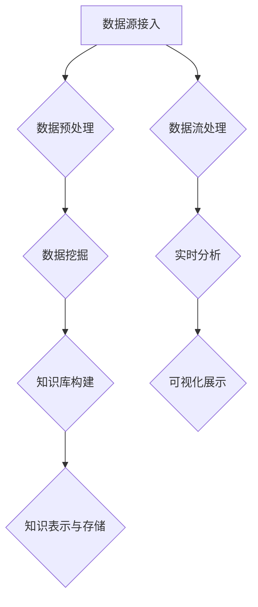

                 

# 《知识发现引擎的架构设计与实现》

## 1.1 知识发现的概念与意义

知识发现（Knowledge Discovery in Databases，简称KDD）是指从大量的数据中通过多种技术和算法提取出隐含在数据中的、有意义的知识的过程。知识发现的过程可以概括为以下几个步骤：数据清洗、数据集成、数据选择、数据变换、数据挖掘和知识表示。其中，知识发现引擎是这一过程中至关重要的一环。

### 知识发现的基本概念

知识发现涉及到的核心概念主要包括数据、信息、知识和智慧。

- **数据**：数据是知识发现的基础，包括结构化数据（如关系型数据库中的表）、半结构化数据（如XML文档）和非结构化数据（如文本、图像、音频等）。
- **信息**：信息是对数据进行处理和解释后所获得的结果，它能够帮助用户更好地理解数据。
- **知识**：知识是经过抽象和总结的信息，是人们对事物的理解和认知。
- **智慧**：智慧是对知识的应用和创新，是解决复杂问题的能力。

### 知识发现的应用场景

知识发现的应用场景非常广泛，主要包括以下几个方面：

1. **商业智能**：通过分析大量销售数据、客户反馈等，帮助企业做出更准确的商业决策。
2. **金融风控**：通过分析客户交易行为、信用记录等，评估客户信用风险，预防金融诈骗。
3. **医疗健康**：通过分析患者病历、基因数据等，发现潜在的健康问题，为疾病预防提供依据。
4. **社交网络**：通过分析用户行为、关系网络等，发现社交趋势、潜在关系等，为社交平台的个性化推荐提供支持。
5. **科学探索**：通过分析天文观测数据、生物实验数据等，发现新的科学规律和现象。

### 知识发现引擎的重要性

知识发现引擎在知识发现过程中起着核心作用，其主要功能包括：

- **数据集成**：将来自不同来源、不同格式、不同结构的数据进行整合，为后续的数据处理和挖掘提供统一的数据源。
- **数据预处理**：对原始数据进行清洗、转换、归一化等操作，提高数据质量，为数据挖掘提供准确、可靠的数据。
- **数据挖掘**：运用各种算法和技术，从数据中提取出隐藏的模式、关联、趋势等知识。
- **知识表示**：将挖掘出的知识以用户友好的形式进行展示，方便用户理解和利用。

### 行业趋势

随着大数据、人工智能等技术的发展，知识发现引擎在各个行业中的应用越来越广泛。未来的发展趋势主要包括：

- **算法优化**：随着计算能力的提升，更加复杂、高效的算法将被应用，提高知识发现的效果和效率。
- **多模态数据融合**：将结构化数据、半结构化数据和非结构化数据融合在一起，实现更全面的知识发现。
- **智能化**：利用人工智能技术，使知识发现引擎能够自主学习、自适应调整，提高知识发现的智能化水平。
- **实时性**：实现知识的实时发现和更新，满足实时决策和实时监控的需求。

## 1.2 知识发现引擎的基础架构

知识发现引擎的基础架构主要包括数据源接入、数据预处理、知识库构建、知识表示与存储等关键组成部分。下面将逐一介绍这些组成部分。

### 2.1 数据源接入

数据源接入是知识发现引擎的基础，负责将各种类型的数据集成到引擎中。常见的数据源类型包括：

- **关系型数据库**：如MySQL、Oracle等，提供结构化数据存储和查询功能。
- **NoSQL数据库**：如MongoDB、Cassandra等，适用于存储半结构化或非结构化数据。
- **日志文件**：存储系统运行过程中的日志信息，用于分析和监控。
- **流数据源**：如Kafka、Flume等，实时获取和处理大量实时数据。

数据接入方式主要包括：

- **批量接入**：定期从数据源中获取数据，进行预处理和挖掘。
- **实时接入**：实时地从流数据源中获取数据，进行实时处理和挖掘。

### 2.2 数据预处理

数据预处理是确保数据质量和为数据挖掘提供可靠数据的关键步骤。数据预处理主要包括以下内容：

- **数据清洗**：去除重复数据、填补缺失值、纠正错误数据等，提高数据质量。
- **数据转换**：将不同数据源、不同格式的数据转换为统一的格式，便于后续处理。
- **特征提取**：从原始数据中提取出有用的特征，用于数据挖掘和建模。

数据预处理的过程可以概括为以下几个步骤：

1. **数据收集**：从各个数据源获取原始数据。
2. **数据清洗**：去除重复数据、填补缺失值、纠正错误数据等。
3. **数据转换**：将不同数据源、不同格式的数据转换为统一的格式。
4. **特征提取**：从原始数据中提取出有用的特征。
5. **数据存储**：将处理后的数据存储到数据仓库或数据湖中，供后续使用。

### 2.3 知识库构建

知识库是知识发现引擎的核心组成部分，用于存储和表示从数据中挖掘出的知识。知识库通常包含以下内容：

- **实体**：表示数据中的对象或实体，如用户、商品、交易等。
- **属性**：表示实体的特征或属性，如用户年龄、商品价格等。
- **关系**：表示实体之间的关联或关系，如用户购买商品、商品属于某个类别等。

知识库的构建通常包括以下几个步骤：

1. **知识表示**：选择合适的知识表示方法，如本体、图等。
2. **数据整合**：将预处理后的数据整合到知识库中。
3. **知识存储**：将知识库存储到数据库或图数据库中，供后续使用。

### 2.4 知识表示与存储

知识表示与存储是将知识库中的知识以用户友好的形式进行展示和存储的过程。常见的知识表示方法包括：

- **文本表示**：将知识以文本形式进行展示，便于用户阅读和理解。
- **图表示**：将知识以图形形式进行展示，便于用户可视化分析。
- **本体表示**：利用本体论的概念和理论，对知识进行建模和表示。

知识存储通常包括以下内容：

- **分布式存储**：将知识存储到分布式数据库或图数据库中，提高存储和查询的效率。
- **云存储**：利用云存储技术，实现知识存储的高可用、高可靠性。
- **数据仓库**：将知识存储到数据仓库中，供大数据分析和挖掘。

通过以上基础架构的设计与实现，知识发现引擎能够高效地从大量数据中挖掘出有价值的信息和知识，为各个行业提供数据驱动的决策支持。接下来，我们将进一步探讨知识发现引擎中的核心技术原理，包括数据挖掘算法、知识融合与推理、以及知识表示与存储等方面的内容。

## 2.1 数据源接入

### 数据源类型

知识发现引擎首先需要接入各种类型的数据源，以获取多样化的数据。常见的数据源类型包括：

1. **关系型数据库**：关系型数据库（RDBMS）如MySQL、Oracle、PostgreSQL等，提供了结构化的数据存储和管理方案。这些数据库通常用于存储企业的核心业务数据，例如用户信息、交易记录、产品数据等。

2. **NoSQL数据库**：NoSQL数据库如MongoDB、Cassandra、Redis等，适合存储半结构化或非结构化数据。这些数据库具有高扩展性和灵活的数据模型，适用于存储日志数据、社交网络数据、物联网数据等。

3. **日志文件**：日志文件是系统运行过程中产生的记录，包含了大量的操作和事件信息。这些日志数据可以通过文件系统或日志收集工具（如Flume、Logstash）进行收集和管理。

4. **流数据源**：流数据源如Kafka、Apache Flink等，用于实时收集和处理大量实时数据。这些数据源通常应用于金融交易、物联网传感器数据、实时监控等领域。

### 接入方式

数据接入方式包括批量接入和实时接入，每种方式都有其适用场景和优缺点。

1. **批量接入**：
   - **过程**：定期（如每天、每小时）从数据源中获取数据，经过数据清洗和转换后，批量加载到知识发现引擎中。
   - **优点**：操作简单，易于管理；适合处理大量历史数据。
   - **缺点**：处理延迟较高，无法满足实时性的需求。

2. **实时接入**：
   - **过程**：通过实时数据源或日志收集工具，实时地将数据发送到知识发现引擎，进行实时处理和挖掘。
   - **优点**：处理延迟低，能够及时反映数据变化；适合处理实时数据流。
   - **缺点**：系统复杂度高，对实时处理能力要求较高。

### 数据采集与传输机制

数据采集与传输机制是确保数据能够高效、可靠地传输到知识发现引擎的关键。以下是几种常见的数据采集与传输机制：

1. **ETL（Extract, Transform, Load）**：
   - **过程**：ETL过程包括数据提取、数据转换和数据加载三个步骤。数据提取从源系统中获取数据；数据转换对数据进行清洗、转换和集成；数据加载将转换后的数据加载到目标数据库或数据仓库中。
   - **优点**：支持多种数据源和数据类型的转换；可以实现批量数据的高效处理。
   - **缺点**：处理过程复杂，可能涉及多步操作和依赖关系。

2. **数据流处理**：
   - **过程**：数据流处理（如Apache Kafka、Apache Flink）通过实时处理数据流，实现数据的高效传输和实时处理。
   - **优点**：支持实时数据流处理，具有高吞吐量和低延迟。
   - **缺点**：对系统实时性和可靠性要求较高，开发难度较大。

3. **API接口**：
   - **过程**：通过API接口（如RESTful API）将数据源的数据传输到知识发现引擎，适用于结构化或半结构化数据。
   - **优点**：接口简单，易于集成；支持灵活的数据格式和协议。
   - **缺点**：可能存在性能瓶颈，适用于小规模或简单数据源。

通过合理选择数据源类型、接入方式和数据采集与传输机制，知识发现引擎能够高效地获取和处理各种类型的数据，为后续的数据预处理和挖掘奠定基础。在下一节中，我们将深入探讨数据预处理的重要性以及具体的预处理步骤。

### 2.2 数据预处理

数据预处理是知识发现引擎中至关重要的一步，其目的是提高数据质量，为后续的数据挖掘和建模提供准确、可靠的数据。数据预处理主要包括数据清洗、数据转换和特征提取等内容。以下是详细讨论：

#### 数据清洗

数据清洗是预处理过程中最基础的一步，其目标是去除数据中的噪声和错误，提高数据的质量。常见的数据清洗任务包括：

1. **去除重复数据**：重复数据可能会影响数据挖掘的结果，因此需要识别并删除重复的记录。
2. **填补缺失值**：在实际应用中，数据往往存在缺失值，可以通过插补、均值填补、中值填补等方法来处理缺失值。
3. **纠正错误数据**：数据在采集和传输过程中可能会出现错误，如数据格式错误、数据类型不匹配等，需要进行纠正。
4. **异常值检测**：异常值可能影响模型的训练效果，通过统计学方法（如Z-Score、IQR等）可以识别并处理异常值。

#### 数据转换

数据转换是将数据从一种形式转换为另一种形式，以适应后续处理的需求。常见的数据转换任务包括：

1. **数据格式转换**：将不同数据源的数据格式转换为统一的格式，如将CSV文件转换为JSON格式。
2. **归一化**：对数据进行归一化处理，将不同尺度的数据进行标准化，以消除数据之间的量纲差异。
3. **特征缩放**：对特征进行缩放处理，如采用最小最大缩放、Z-Score缩放等方法，使特征具有相似的尺度。
4. **数据编码**：对类别数据进行编码处理，如将类别数据转换为数值形式，便于后续的数学计算。

#### 特征提取

特征提取是从原始数据中提取出对数据挖掘任务有用的特征，以减少数据的冗余性，提高模型的性能。常见的特征提取方法包括：

1. **统计特征**：通过计算数据的统计指标（如均值、方差、标准差等）来提取特征。
2. **文本特征**：对文本数据提取词频、词频逆文档频率（TF-IDF）、词嵌入等特征。
3. **图像特征**：通过图像处理技术提取图像的特征，如颜色直方图、边缘检测、纹理分析等。
4. **时序特征**：对时序数据进行特征提取，如自相关、周期性分析、季节性分析等。

#### 数据预处理的重要性

数据预处理对于知识发现过程的影响至关重要，具体表现如下：

1. **提高数据质量**：通过数据清洗、转换和特征提取，可以去除数据中的噪声和错误，提高数据的质量，从而为后续的数据挖掘和建模提供准确、可靠的数据。
2. **减少计算复杂度**：通过数据转换和特征提取，可以减少数据的冗余性，降低模型的计算复杂度，提高挖掘和建模的效率。
3. **优化模型性能**：良好的数据预处理能够提高模型的训练效果和预测性能，从而为决策提供更有价值的支持。

#### 数据预处理的过程

数据预处理的过程可以概括为以下几个步骤：

1. **数据收集**：从各种数据源获取原始数据。
2. **数据清洗**：去除重复数据、填补缺失值、纠正错误数据等。
3. **数据转换**：将不同数据源、不同格式的数据转换为统一的格式。
4. **特征提取**：从原始数据中提取出对挖掘任务有用的特征。
5. **数据存储**：将预处理后的数据存储到数据仓库或数据湖中，供后续使用。

通过以上详细讨论，我们可以看到数据预处理在知识发现引擎中的重要性。在下一节中，我们将探讨知识库构建的过程，包括知识库的结构和知识表示方法。

### 2.3 知识库构建

知识库构建是知识发现引擎中的关键环节，旨在将数据挖掘过程中提取出的知识和信息进行有效的组织和管理。知识库的构建不仅能够为后续的推理和分析提供基础，还能提高系统的智能化水平和信息利用率。以下是知识库构建的详细讨论：

#### 知识库结构

知识库结构通常由以下核心组成部分构成：

1. **实体（Entity）**：实体是知识库中的基本对象，可以代表任何具有独立存在意义的个体。例如，在电商领域，实体可以是用户、产品、订单等。

2. **属性（Attribute）**：属性是实体的特征或属性，用于描述实体的具体信息。例如，用户实体可以具有年龄、性别、地理位置等属性。

3. **关系（Relation）**：关系是实体之间的关联或互动，用于描述实体之间的逻辑关系。例如，在社交网络中，用户与用户之间可以通过“好友”关系进行连接。

4. **事实（Fact）**：事实是基于实体和关系的信息，用于描述实体之间的具体交互或状态。例如，“用户A购买了产品B”是一个事实。

5. **本体（Ontology）**：本体是知识库的抽象层次，用于定义实体、属性、关系和事实的语义和规则。本体为知识库提供了一个统一的语义框架，使得知识库中的信息和关系能够被准确理解和解释。

#### 知识库构建的过程

知识库构建通常包括以下几个步骤：

1. **知识表示**：选择合适的知识表示方法，如图数据库、本体论、属性图等。每种方法都有其特定的优势和适用场景。

2. **数据整合**：将来自不同数据源和格式的数据整合到一个统一的知识库中。这一步骤需要解决数据格式、数据类型和命名空间等问题。

3. **知识存储**：将整合后的数据存储到知识库中，确保数据的高效访问和查询。常见的数据存储技术包括关系数据库、图数据库、分布式数据库等。

4. **知识更新**：知识库需要定期更新，以反映现实世界中的变化。这一步骤包括数据的删除、添加和修改等操作。

5. **知识维护**：为了确保知识库的准确性和一致性，需要定期进行数据验证和清洗，处理数据中的错误和异常。

#### 知识库在知识发现中的作用

知识库在知识发现过程中扮演着至关重要的角色：

1. **数据管理**：知识库提供了一个统一的数据管理平台，使得数据能够被高效地存储、检索和管理。

2. **知识推理**：通过知识库中的实体、关系和事实，可以进行基于规则的推理和推理机操作，实现复杂的数据分析和决策支持。

3. **信息检索**：知识库为信息检索提供了强大的支持，用户可以通过查询和搜索功能快速获取所需的信息。

4. **系统集成**：知识库可以作为各个系统和模块的数据共享中心，实现数据的高效集成和共享。

#### 知识库构建的关键挑战

知识库构建面临以下关键挑战：

1. **数据一致性**：确保来自不同数据源和格式的数据能够在知识库中得到一致的处理和表示。

2. **数据更新**：在保证知识库的实时性和准确性之间取得平衡，确保知识库能够及时反映现实世界的变化。

3. **数据质量**：数据质量问题直接影响知识库的可靠性和实用性，需要通过数据清洗和质量控制手段来确保数据质量。

4. **知识表示**：选择合适的知识表示方法，使得知识库能够灵活地适应不同的应用场景和需求。

通过合理构建和有效管理知识库，知识发现引擎能够更好地发挥其数据分析和决策支持的作用，为各个行业提供智能化的解决方案。

### 2.4 知识表示方法

知识表示是知识发现引擎中的核心环节，它决定了知识库中知识的结构、语义和交互方式。知识表示方法的选择对知识发现的效果和应用场景有着重要影响。以下是几种常见的知识表示方法：

#### 2.4.1 图数据库

**图数据库**是一种用于存储和查询图结构数据的数据库系统。在图数据库中，数据以节点（实体）和边（关系）的形式存储，可以灵活地表示复杂的关系网络。图数据库的主要优势包括：

- **高扩展性**：图数据库能够处理大规模、动态变化的网络数据，支持分布式存储和计算。
- **高效的图查询**：通过图遍历和索引技术，图数据库能够高效地进行复杂的图查询和分析。
- **灵活的图建模**：图数据库支持自定义图模型，可以灵活地适应不同应用场景的需求。

常见的图数据库包括Neo4j、Apache JanusGraph和Amazon Neptune等。

**示例：**

假设我们有一个社交网络图，其中节点表示用户，边表示用户之间的关注关系。我们可以使用Neo4j的Cypher查询语言进行图查询，如下所示：

```cypher
MATCH (u:User)-[:FOLLOW]->(v:User)
WHERE u.name = 'Alice'
RETURN v.name
```

这个查询将返回Alice关注的所有用户的名字。

#### 2.4.2 文本数据库

**文本数据库**（如Elasticsearch）主要用于存储和查询文本数据，通过索引和全文检索技术提供高效的内容搜索和文本分析功能。文本数据库的优势包括：

- **高效的全文检索**：文本数据库支持基于全文索引的快速查询，能够实现高效的内容搜索和文本分析。
- **丰富的分析功能**：文本数据库提供了丰富的文本分析功能，如分词、词频统计、词云生成等。
- **易用性**：文本数据库通常具有友好的用户界面和简单的API，便于开发和使用。

**示例：**

假设我们有一个包含用户评论的数据库，我们可以使用Elasticsearch的Query DSL进行全文搜索，如下所示：

```json
{
  "query": {
    "match": {
      "comment": "爱"
    }
  }
}
```

这个查询将返回所有包含“爱”这个词的评论。

#### 2.4.3 本体表示

**本体表示**是基于本体论的概念和理论对知识进行建模和表示的方法。本体为知识库提供了统一的语义框架，使得不同来源和格式的知识能够被一致地理解和解释。本体表示的主要优势包括：

- **语义一致性**：本体定义了实体、属性、关系和事实的语义，确保知识库中的信息具有一致性和可解释性。
- **知识推理**：通过本体中的规则和推理机，可以实现基于知识的推理和自动化决策。
- **跨领域应用**：本体可以跨领域应用，使得知识库中的知识能够被灵活地复用和扩展。

常见的本体表示工具包括OWL（Web Ontology Language）和RDF（Resource Description Framework）。

**示例：**

假设我们有一个基于本体的医疗知识库，其中定义了实体（如“病人”、“医生”、“药物”）和关系（如“诊断”、“开处方”）。我们可以使用OWL语言进行本体表示，如下所示：

```owl
@prefix owl: <http://www.w3.org/2002/07/owl#> .
@prefix rdf: <http://www.w3.org/1999/02/22-rdf-syntax-ns#> .
@prefix xsd: <http://www.w3.org/2001/XMLSchema#> .

:Doctor rdf:type owl:Class ;
         rdfs:label "医生" ;
         rdfs:comment "负责诊断和治疗的医生" .

:Diagnosis rdf:type owl:ObjectProperty ;
           rdfs:label "诊断" ;
           rdfs:comment "医生对病人的诊断结果" ;
           domain :Doctor ;
           range :Patient .

:Patient rdf:type owl:Class ;
         rdfs:label "病人" ;
         rdfs:comment "接受医生诊断和治疗的患者" .

:Prescribe rdf:type owl:ObjectProperty ;
           rdfs:label "开处方" ;
           rdfs:comment "医生给病人开处方" ;
           domain :Doctor ;
           range :Prescription .

:Prescription rdf:type owl:Class ;
              rdfs:label "处方" ;
              rdfs:comment "医生的处方单" .
```

通过以上示例，我们可以看到不同知识表示方法的特点和应用场景。在下一节中，我们将探讨知识库的存储策略，包括分布式存储和云存储技术的应用。

### 2.4 知识库的存储策略

知识库的存储策略对于知识发现引擎的性能、可扩展性和可靠性至关重要。合理的存储策略能够确保知识库的高效访问和快速查询，同时满足数据存储的容量和安全性需求。以下是几种常见的知识库存储策略：

#### 2.4.1 分布式存储

分布式存储是将数据分布在多个节点上，通过分布式文件系统或数据库实现数据的存储和管理。分布式存储的优势包括：

1. **高可用性**：通过数据冗余和节点备份，分布式存储能够确保数据的高可用性，即使某个节点发生故障，系统也能够快速恢复。
2. **高扩展性**：分布式存储系统可以根据需求动态扩展存储容量，无需停机或重新配置。
3. **高性能**：分布式存储通过数据分片和并行处理，能够提高数据访问的速度和查询性能。

常见的分布式存储系统包括HDFS（Hadoop Distributed File System）、Cassandra和HBase。

**实现步骤：**

1. **数据分片**：将数据划分为多个分片，每个分片存储在独立的节点上。
2. **数据复制**：对每个分片进行数据复制，确保数据的高可用性。
3. **负载均衡**：通过负载均衡算法，将数据访问请求均匀地分配到各个节点。

**示例：**

使用Cassandra实现分布式存储，定义一个用户数据表，包括用户ID、用户名和邮箱：

```cql
CREATE TABLE users (
  user_id UUID PRIMARY KEY,
  username TEXT,
  email TEXT
);
```

#### 2.4.2 云存储

云存储是将数据存储在云计算环境中，通过云服务提供商提供的数据存储服务。云存储的优势包括：

1. **弹性扩展**：云存储可以根据需求动态调整存储容量，无需额外硬件投资。
2. **高可靠性**：云存储通常提供数据备份和容灾服务，确保数据的安全和可靠性。
3. **成本效益**：云存储按需付费，可以降低企业的IT成本。

常见的云存储服务包括AWS S3、Azure Blob Storage和Google Cloud Storage。

**实现步骤：**

1. **选择合适的服务**：根据应用场景和数据需求，选择适合的云存储服务。
2. **数据上传**：将数据上传到云存储服务，可以使用API或命令行工具进行上传。
3. **数据访问**：通过API或SDK访问云存储中的数据，实现数据的读取和写入操作。

**示例：**

使用AWS S3存储用户数据，通过Python SDK上传文件：

```python
import boto3

s3 = boto3.client('s3')
response = s3.upload_file('local_file.txt', 'my-bucket', 'remote_file.txt')
```

#### 2.4.3 分布式存储与云存储的集成

在实际应用中，分布式存储和云存储可以结合起来使用，以充分利用两者的优势。常见的集成方式包括：

1. **混合存储**：将热数据和冷数据分开存储，热数据存储在分布式存储中，冷数据存储在云存储中。
2. **数据迁移**：根据数据的使用频率和访问模式，定期将冷数据从分布式存储迁移到云存储，以降低成本。
3. **多活存储**：在分布式存储和云存储之间实现数据的多活同步，确保数据的一致性和可用性。

**示例：**

使用HDFS作为分布式存储，AWS S3作为云存储，实现数据同步：

```shell
hdfs dfs -cp /input_data /output_data
aws s3 cp s3://my-bucket/remote_data.txt /local_data.txt
```

通过合理选择和实施知识库的存储策略，知识发现引擎能够高效地管理大量数据，满足业务需求的同时保证数据的安全性和可靠性。在下一节中，我们将介绍知识发现引擎的具体实践应用案例。

### 2.5 知识发现引擎的具体实践应用

知识发现引擎在各个行业和领域中都有广泛的应用，通过实际案例我们可以更好地理解其应用效果和实现过程。以下是两个典型的应用案例：金融行业和医疗行业。

#### 2.5.1 金融行业应用

在金融行业，知识发现引擎主要用于风险控制、客户关系管理和投资策略优化等方面。

**项目背景：**

某大型银行希望通过知识发现引擎分析客户的交易数据，识别潜在的风险客户，并优化客户体验。

**实现过程：**

1. **数据采集**：通过银行内部的交易系统、客户管理系统等获取客户的交易数据、账户信息等。
2. **数据预处理**：对采集到的数据去重、清洗、填补缺失值，并提取有用的特征，如交易频率、交易金额、交易时间等。
3. **知识库构建**：将预处理后的数据存储到知识库中，定义实体（如客户、账户、交易）和关系（如账户持有、交易发生）。
4. **风险识别**：使用聚类算法（如K-means）对客户进行分类，识别高风险客户；使用分类算法（如决策树）预测客户的风险等级。
5. **风险控制**：对高风险客户进行额外审核或限制高风险交易，降低潜在的风险。
6. **客户关系管理**：通过分析客户的交易行为和偏好，为银行提供定制化的客户服务和产品推荐。

#### 2.5.2 医疗行业应用

在医疗行业，知识发现引擎主要用于疾病预测、治疗方案优化和医疗资源分配等方面。

**项目背景：**

某大型医院希望通过知识发现引擎分析患者的医疗记录和生物信息，提高疾病预测的准确性和治疗效果。

**实现过程：**

1. **数据采集**：从医院的电子病历系统、医疗设备、患者问卷调查等渠道获取患者的医疗数据、生物信息等。
2. **数据预处理**：对采集到的数据进行清洗、去重、填补缺失值，并提取有用的特征，如病史、诊断结果、治疗方案、生活习惯等。
3. **知识库构建**：将预处理后的数据存储到知识库中，定义实体（如患者、疾病、治疗方案）和关系（如疾病诊断、治疗方案应用）。
4. **疾病预测**：使用机器学习算法（如决策树、随机森林）预测患者的疾病风险，辅助医生进行早期干预。
5. **治疗方案优化**：通过分析不同治疗方案的效果和患者反馈，为医生提供最优的治疗方案建议。
6. **医疗资源分配**：通过分析医院的资源使用情况（如床位、医疗设备、医务人员等），优化医疗资源的配置，提高医疗服务效率。

通过以上两个实际案例，我们可以看到知识发现引擎在金融和医疗行业中的重要作用。知识发现引擎不仅能够提高业务的智能化水平，还能够为企业和医疗机构提供数据驱动的决策支持。在下一节中，我们将探讨知识发现引擎的性能优化策略，以确保其在大规模数据处理和实时分析中的高效运行。

### 2.6 知识发现引擎的性能优化

知识发现引擎在处理大规模数据、实时分析和复杂算法时，可能会遇到性能瓶颈，影响系统的响应速度和用户体验。为了提高系统的性能，我们可以从以下几个方面进行优化：

#### 2.6.1 系统性能分析

**性能指标：**

在评估知识发现引擎的性能时，常见的性能指标包括：

1. **响应时间**：系统从接收请求到返回结果所需的时间。
2. **吞吐量**：单位时间内系统能够处理的数据量。
3. **并发处理能力**：系统同时处理多个请求的能力。
4. **资源利用率**：系统对CPU、内存、磁盘等硬件资源的利用率。

**性能瓶颈：**

常见的性能瓶颈包括：

1. **CPU负载**：当CPU利用率接近100%时，系统性能会受到影响。
2. **内存消耗**：当内存占用超过可用内存时，系统会出现内存溢出或性能下降。
3. **磁盘I/O**：磁盘I/O速度较慢会导致数据读写延迟，影响系统的响应速度。
4. **网络延迟**：网络延迟会导致数据传输时间增加，影响系统的实时性。

**解决方法：**

1. **负载均衡**：通过负载均衡器将请求分配到多个节点，降低单个节点的负载。
2. **垂直扩展**：通过增加硬件资源（如CPU、内存）来提高系统的处理能力。
3. **水平扩展**：通过增加节点数量来提高系统的并发处理能力和吞吐量。

#### 2.6.2 并行处理

并行处理是将任务分布在多个处理器或节点上同时执行，以提高系统的性能。在知识发现引擎中，我们可以通过以下方法实现并行处理：

1. **多线程**：在单个节点内部，使用多线程技术将任务分解为多个线程并行执行，如使用Python的`threading`库或Java的`Thread`类。
2. **分布式计算**：在分布式系统中，将任务分配到不同的节点，使用分布式计算框架（如Hadoop、Spark）进行并行处理。

**示例：**

使用Python的`multiprocessing`库实现多线程并行处理：

```python
import multiprocessing

def process_data(data):
    # 处理数据的代码
    return result

if __name__ == '__main__':
    pool = multiprocessing.Pool(processes=4)
    results = pool.map(process_data, data_list)
    pool.close()
    pool.join()
```

#### 2.6.3 索引优化

索引优化可以显著提高数据库查询的速度。在知识发现引擎中，我们可以通过以下方法进行索引优化：

1. **创建索引**：在数据表或数据库列上创建索引，加快数据的查询和排序速度。
2. **选择合适的索引类型**：根据查询需求选择合适的索引类型，如B树索引、哈希索引、全文索引等。
3. **维护索引**：定期维护和优化索引，避免索引碎片化和降低索引性能。

**示例：**

在MySQL数据库中创建索引：

```sql
CREATE INDEX idx_column_name ON table_name(column_name);
```

#### 2.6.4 缓存机制

缓存机制可以减少数据访问的延迟，提高系统的性能。在知识发现引擎中，我们可以通过以下方法实现缓存：

1. **内存缓存**：使用内存缓存（如Redis、Memcached）存储常用数据或计算结果，减少磁盘I/O操作。
2. **分布式缓存**：在分布式系统中，使用分布式缓存框架（如Apache Ignite、Redis Cluster）实现数据的缓存和一致性。
3. **缓存预热**：在系统启动时或数据更新时，预加载常用数据到缓存中，提高数据的访问速度。

**示例：**

使用Redis缓存用户数据：

```python
import redis

client = redis.StrictRedis(host='localhost', port=6379, db=0)

def get_user_data(user_id):
    user_data = client.get(user_id)
    if user_data:
        return json.loads(user_data)
    else:
        # 查询数据库并缓存结果
        user_data = query_database(user_id)
        client.setex(user_id, 3600, json.dumps(user_data))
        return user_data

```

通过以上性能优化策略，知识发现引擎能够在大规模数据处理和实时分析中保持高效运行，为企业和用户提供高质量的决策支持和服务。在下一节中，我们将探讨知识发现引擎的未来发展趋势和技术挑战。

### 2.7 知识发现引擎的未来发展趋势

随着大数据、人工智能、云计算等技术的不断发展，知识发现引擎在未来的发展中将呈现出以下趋势：

#### 2.7.1 人工智能的深度集成

人工智能（AI）的深度集成将使知识发现引擎具备更强的自主学习能力和智能推理能力。通过引入机器学习、深度学习等技术，知识发现引擎能够自动从海量数据中提取特征、发现模式，并不断优化自身的性能和效果。例如，AI可以用于：

- **自动特征工程**：通过学习数据中的潜在特征，自动生成用于模型训练的特征向量。
- **智能推荐系统**：基于用户的兴趣和行为，为用户推荐相关的内容或产品。
- **异常检测**：自动识别数据中的异常行为或潜在风险。

#### 2.7.2 大数据的全方位融合

大数据技术的快速发展，使得知识发现引擎能够处理来自各种来源、各种格式的海量数据。未来，知识发现引擎将实现更加全面的大数据融合，包括：

- **多模态数据融合**：将结构化数据、半结构化数据和非结构化数据融合在一起，实现更全面的数据分析。
- **实时数据融合**：通过实时数据流处理技术，将实时数据和历史数据融合，提供更实时、更精准的分析结果。
- **跨领域数据融合**：打破不同领域之间的数据壁垒，实现跨领域的数据融合和分析。

#### 2.7.3 实时性和动态适应能力的提升

实时性和动态适应能力是知识发现引擎未来发展的重要方向。通过引入实时数据处理技术和自适应算法，知识发现引擎能够：

- **实时数据挖掘**：在数据产生的第一时间进行挖掘和分析，提供即时的洞察和决策支持。
- **动态调整模型**：根据数据的变化和业务需求，动态调整模型参数和算法，保持系统的最优性能。

#### 2.7.4 数据隐私和安全的强化

随着数据隐私和安全问题日益突出，知识发现引擎在未来将更加注重数据隐私保护和安全防护。通过引入加密、匿名化、差分隐私等技术，知识发现引擎能够：

- **保护用户隐私**：确保用户数据在存储、传输和处理过程中不被泄露或滥用。
- **安全合规**：满足各种数据安全法规和合规要求，保障企业合规运营。

#### 2.7.5 跨领域应用和生态融合

知识发现引擎将在各个领域得到广泛应用，并与其他技术（如区块链、物联网等）实现生态融合。跨领域应用将带来以下机遇：

- **智能城市**：通过知识发现技术，实现城市资源的优化配置和智能管理。
- **智能医疗**：利用知识发现技术，提高疾病预测和治疗方案优化的准确性。
- **智能金融**：通过知识发现技术，提升风险管理、欺诈检测和客户服务的水平。

### 2.8 技术挑战与机遇

尽管知识发现引擎的发展前景广阔，但仍然面临一些技术挑战：

#### 2.8.1 数据隐私保护

在处理大规模数据时，如何保护用户隐私是一个关键挑战。未来需要开发更加安全、高效的数据隐私保护技术，如联邦学习、差分隐私等，以保障用户数据的隐私安全。

#### 2.8.2 数据质量和一致性

数据质量和一致性是知识发现的关键前提。如何确保数据在采集、传输、存储和处理过程中的一致性和准确性，是一个长期的技术挑战。

#### 2.8.3 复杂算法的高效实现

随着知识发现技术的发展，算法的复杂度也在不断提高。如何高效地实现和优化这些复杂算法，是提高知识发现引擎性能的关键。

#### 2.8.4 跨领域应用的适应性

知识发现引擎在不同领域中的应用，需要解决领域特定问题，提高跨领域应用的适应性。这需要深入研究各个领域的业务需求和数据特性，开发通用的知识发现框架。

面对这些挑战，未来的知识发现引擎将不断创新和进化，为各行业提供更加智能、高效、安全的解决方案。附录部分将提供知识发现引擎相关的工具、资源和核心算法的详细伪代码，帮助读者深入了解和实际应用。

## 附录A：知识发现引擎相关工具与资源

在构建和优化知识发现引擎的过程中，开发者可以借助多种开源框架、数据库和相关书籍与文献。以下是几个常用的工具和资源：

### 开源框架

1. **ELK（Elasticsearch, Logstash, Kibana）**：
   - **Elasticsearch**：一款强大的全文搜索引擎，用于高效地存储和检索大量数据。
   - **Logstash**：用于收集、处理和路由日志数据的管道。
   - **Kibana**：数据可视化和分析平台，用于监控和展示数据。

2. **Apache Mahout**：
   - 一款基于Hadoop的机器学习库，提供多种数据挖掘算法，如聚类、协同过滤等。

3. **Apache Spark**：
   - 一个开源的分布式计算框架，用于大规模数据处理和分析，提供丰富的机器学习算法库。

### 数据库

1. **Neo4j**：
   - 一款高性能的图形数据库，适用于处理复杂的图结构数据。

2. **MongoDB**：
   - 一款灵活的NoSQL数据库，适用于存储半结构化或非结构化数据。

3. **PostgreSQL**：
   - 一款开源的关系型数据库，适用于存储结构化数据。

### 书籍与文献

1. **《大数据之路：阿里巴巴大数据实践》**：
   - 提供了阿里巴巴在大数据领域的技术实践和案例，对构建知识发现引擎具有参考价值。

2. **《机器学习实战》**：
   - 介绍了多种机器学习算法和实际应用案例，适用于开发者理解和实现数据挖掘算法。

3. **《数据挖掘：实用工具与技术》**：
   - 详细介绍了数据挖掘的基本概念、算法和技术，适合初学者和进阶者学习。

4. **《知识工程与本体论》**：
   - 探讨了知识表示、推理和知识工程的基本原理和方法，对构建本体表示的知识库有重要指导意义。

通过利用这些工具和资源，开发者可以更好地构建和优化知识发现引擎，提升数据分析与决策支持的能力。

### 附录B：知识发现引擎架构 Mermaid 流程图

以下是一个简单的Mermaid流程图示例，展示了知识发现引擎的基本架构：



该流程图描述了知识发现引擎的核心组件，包括数据源接入、数据预处理、数据挖掘、知识库构建、知识表示与存储、数据流处理、实时分析和可视化展示等步骤。

### 附录C：核心算法原理伪代码

以下是几个常见数据挖掘算法的伪代码，包括K-means算法、决策树算法、支持向量机（SVM）算法、Apriori算法和FP-growth算法。

#### 3.1 K-means算法

```python
Algorithm KMeans(data, K):
    1. 随机选择K个初始中心点
    2. 对于每个数据点，计算它与每个中心点的距离，并将其分配到最近的中心点
    3. 更新每个中心点的坐标，计算所有数据点到其中心点的均值
    4. 重复步骤2和3，直到中心点的坐标不再变化或者达到预设的迭代次数
    
    while not converged or iteration <= max_iterations:
        for each data point in data:
            assign to the nearest cluster center
        update cluster centers
        
        converged = true
        for each cluster center:
            if distance from old center to new center > threshold:
                converged = false
```

#### 3.2 决策树算法

```python
Algorithm ID3(data, attributes):
    1. 如果数据是纯净的，返回该数据的最频繁标签
    2. 如果没有可用的属性，返回数据中标签的多数值
    3. 选择具有最高信息增益的属性作为划分标准
    4. 根据该属性划分数据，为每个子集递归调用ID3算法
    
    best_attribute = None
    max_info_gain = -inf
    
    for attribute in attributes:
        info_gain = calculate_info_gain(data, attribute)
        if info_gain > max_info_gain:
            max_info_gain = info_gain
            best_attribute = attribute
    
    decision_tree = {}
    for value in unique_values_of(best_attribute):
        sub_data = data[best_attribute == value]
        decision_tree[value] = ID3(sub_data, attributes - {best_attribute})
        
    return decision_tree
```

#### 3.3 支持向量机（SVM）算法

```python
Algorithm SVM(data, labels):
    1. 将数据转换为核特征空间
    2. 解线性方程组求解最优超平面
    3. 计算支持向量
    4. 构建分类器
    
    K = KernelFunction
    X = data
    y = labels
    
    # Solve the optimization problem
    w = solve_linear_equation_system(K(X), y)
    support_vectors = X[y != 0]
    
    def classify(x):
        return sign(K(x) * w)
    
    return classify
```

#### 3.4 Apriori算法

```python
Algorithm Apriori(data, min_support, min_confidence):
    1. 生成所有频繁项集
    2. 对于每个频繁项集，计算其支持度和置信度
    3. 筛选出满足最小支持度和最小置信度的关联规则
    
    frequent_itemsets = []
    for k in range(1, max_length_of_transaction):
        candidate_itemsets = generate_candidate_itemsets(k)
        if k == 1:
            support_values = calculate_support(candidate_itemsets, data)
        else:
            support_values = calculate_support(candidate_itemsets, data, frequent_itemsets[k-1])
        
        frequent_itemsets.append([itemset for itemset, support in support_values.items() if support >= min_support])
        
        if k > 1:
            confidence_values = calculate_confidence(frequent_itemsets[k], data)
            rules = generate_association_rules(frequent_itemsets[k], confidence_values, min_confidence)
        
    return frequent_itemsets, rules
```

#### 3.5 FP-growth算法

```python
Algorithm FPgrowth(data, min_support):
    1. 构建频繁模式树（FP-tree）
    2. 使用条件模式基（CPM）挖掘频繁项集
    3. 生成关联规则
    
    def construct_FPTree(data):
        # 构建FP树
        pass
    
    def mine_frequent_patterns(FPTree, min_support):
        # 从FP树中挖掘频繁项集
        pass
    
    def generate_association_rules(frequent_itemsets, confidence_threshold):
        # 生成关联规则
        pass
    
    FPTree = construct_FPTree(data)
    frequent_itemsets = mine_frequent_patterns(FPTree, min_support)
    rules = generate_association_rules(frequent_itemsets, confidence_threshold)
    
    return frequent_itemsets, rules
```

这些伪代码提供了数据挖掘算法的基本框架和步骤，读者可以根据具体的应用场景和需求进行修改和优化。通过深入理解这些算法原理，开发者可以更好地设计和实现知识发现引擎。

