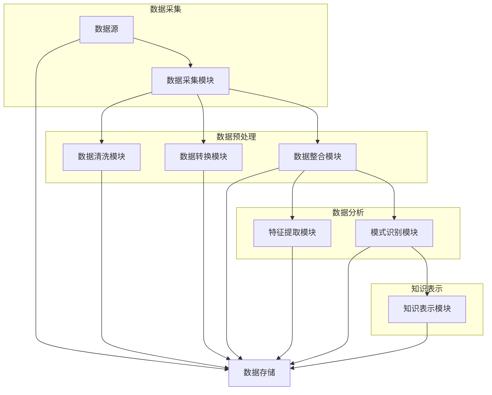

                 

# 《知识发现引擎：为人类知识体系注入新活力》

## 关键词：知识发现、数据挖掘、人工智能、机器学习、知识表示

> 摘要：在当今数据爆炸的时代，知识发现引擎成为了解决信息过载、提高决策效率的关键工具。本文将从知识发现引擎的定义、架构、核心算法、数学模型、实战应用以及未来发展趋势等方面进行深入探讨，旨在为读者提供一个全面的技术视角，从而理解知识发现引擎在构建人类知识体系中的重要作用。

## 第1章 知识发现引擎概述

### 1.1 知识发现引擎的定义与重要性

知识发现引擎（Knowledge Discovery Engine，KDE）是一种基于人工智能和机器学习技术的智能系统，旨在从大量数据中提取出有价值的信息和知识。与传统的人类驱动数据挖掘方法相比，知识发现引擎具有自动化、智能化和高效化的特点，能够显著提升数据分析和决策的效率。

**定义**：知识发现引擎是一种通过分析、挖掘和解释大量数据，自动发现隐藏在数据中的有用信息和知识，并将其以易于理解和利用的形式呈现出来的系统。

**重要性**：在数据爆炸的时代，知识发现引擎的重要性不言而喻。首先，它能够帮助我们解决信息过载的问题。随着互联网和物联网的快速发展，数据量呈现出爆炸式增长，传统的数据管理和分析手段已难以满足需求。知识发现引擎通过高效的数据挖掘和分析，能够从海量数据中提取出有价值的信息，为决策者提供强有力的支持。

此外，知识发现引擎还能够提高决策的效率。通过自动化分析数据，发现潜在的模式和关联，知识发现引擎能够帮助决策者快速做出明智的决策，从而提高企业的竞争力。

### 1.2 知识发现引擎的基本架构

知识发现引擎的基本架构包括以下几个主要模块：

1. **数据采集**：从各种数据源收集数据，包括结构化数据、半结构化数据和非结构化数据。
2. **数据预处理**：清洗、转换和整合数据，确保数据的质量和一致性。
3. **特征提取**：将原始数据转换成模型可处理的特征，为后续的算法分析提供输入。
4. **模式识别**：使用算法来发现数据中的模式和规律，包括聚类、分类和关联规则等。
5. **知识表示**：将识别出的知识以人类可理解的形式表示出来，包括可视化、文本报告和决策支持系统等。

通过以上模块的协同工作，知识发现引擎能够有效地从大量数据中提取出有价值的信息和知识，为决策者提供支持。

### 1.3 知识发现引擎的核心算法

知识发现引擎的核心算法主要包括聚类算法、分类算法和关联规则学习算法。这些算法在数据挖掘和分析中发挥着至关重要的作用。

1. **聚类算法**：聚类算法是一种无监督学习算法，旨在将数据集分成若干个组，使得同一组内的数据点尽可能相似，而不同组的数据点尽可能不同。常见的聚类算法包括K-means、DBSCAN等。
   
   **K-means算法**：K-means算法是一种基于距离度量的聚类算法。其基本思想是初始化K个聚类中心，然后迭代更新聚类中心，直到聚类中心不再变化。具体的步骤如下：
   ```mermaid
   graph TD
   A[初始化K个聚类中心] --> B[计算每个数据点到聚类中心的距离]
   B --> C{距离最近的聚类中心}
   C --> D[更新聚类中心为每个聚类中心的均值]
   D --> E[判断是否收敛]
   E --> F{是} --> B
   F --> G{否} --> D
   ```

   **DBSCAN算法**：DBSCAN（Density-Based Spatial Clustering of Applications with Noise）是一种基于密度的聚类算法，它将具有足够高密度的区域划分为簇，并且可以在带有噪声的数据中识别出密度相对较高的簇。DBSCAN算法的主要步骤如下：
   ```mermaid
   graph TD
   A[输入数据集]
   A --> B[选取邻域半径epsilon]
   B --> C[选取最小核心点数量minPoints]
   C --> D{扫描每个点}
   D --> E{是核心点} --> F[扩展簇]
   D --> G{是边界点} --> H[加入最近的簇]
   D --> I{是噪声点} --> J[丢弃]
   ```

2. **分类算法**：分类算法是一种监督学习算法，旨在将数据集分为不同的类别。常见的分类算法包括决策树、支持向量机等。

   **决策树算法**：决策树算法是一种基于树形模型的分类算法，通过连续地测试数据集中的属性值，将数据集划分为若干个子集，直到达到某个终止条件。决策树算法的主要步骤如下：
   ```mermaid
   graph TD
   A[初始化决策树]
   A --> B[计算信息增益]
   B --> C{选择最大信息增益属性}
   C --> D[创建节点]
   D --> E[判断是否达到终止条件]
   E --> F{是} --> G[创建叶节点]
   E --> H{否} --> I[递归分割数据集]
   ```

   **支持向量机算法**：支持向量机（Support Vector Machine，SVM）是一种基于间隔最大化的分类算法，旨在找到最佳的超平面，将不同类别的数据点分开。SVM算法的主要步骤如下：
   ```mermaid
   graph TD
   A[初始化模型参数]
   A --> B[计算最优间隔]
   B --> C{优化目标函数}
   C --> D[计算决策边界]
   D --> E[分类预测]
   ```

3. **关联规则学习算法**：关联规则学习算法是一种用于发现数据集中项目之间关联的算法，常用于市场篮子分析、推荐系统等。常见的关联规则学习算法包括Apriori算法、Eclat算法等。

   **Apriori算法**：Apriori算法是一种基于支持度和置信度的关联规则学习算法。其基本思想是通过递归地合并项集，计算出每个项集的支持度和置信度，然后从中提取出频繁项集。Apriori算法的主要步骤如下：
   ```mermaid
   graph TD
   A[初始化频繁项集]
   A --> B[计算支持度]
   B --> C{支持度大于最小支持度}
   C --> D[生成频繁项集]
   C --> E[递归合并项集]
   D --> F[输出频繁项集]
   ```

   **Eclat算法**：Eclat算法是一种改进的Apriori算法，它通过将项集分解成子集，减少了生成频繁项集的时间复杂度。Eclat算法的主要步骤如下：
   ```mermaid
   graph TD
   A[初始化项集]
   A --> B[计算支持度]
   B --> C{支持度大于最小支持度}
   C --> D[生成频繁项集]
   C --> E[分解项集]
   D --> F[输出频繁项集]
   ```

### 1.4 知识发现引擎的应用领域

知识发现引擎在多个领域都有着广泛的应用，包括商业智能、金融风控、医疗健康和社会分析等。

1. **商业智能**：知识发现引擎可以帮助企业分析客户行为、市场需求等，从而提供个性化的推荐和服务，提高销售额和客户满意度。

2. **金融风控**：知识发现引擎可以分析历史数据，预测风险，帮助企业防范欺诈行为，降低信用风险。

3. **医疗健康**：知识发现引擎可以辅助医生进行疾病诊断和治疗，通过分析患者的病历数据，预测疾病发生风险，为个性化治疗提供支持。

4. **社会分析**：知识发现引擎可以分析社会舆情、行为模式等，为政策制定提供依据，帮助政府和社会组织更好地应对社会问题。

### 1.5 知识发现引擎的发展趋势

随着人工智能和大数据技术的不断发展，知识发现引擎也在不断演进。未来的知识发现引擎将具有以下发展趋势：

1. **实时性**：支持实时数据处理和知识发现，为决策者提供更及时的信息支持。

2. **自动化**：减少人工干预，提高知识发现效率，实现自动化知识发现和决策。

3. **跨领域融合**：与其他技术如大数据、人工智能等融合，实现更强大的功能，拓展知识发现引擎的应用范围。

## 第2章 知识发现引擎的核心算法原理

在了解了知识发现引擎的基本概念和架构后，接下来我们将深入探讨知识发现引擎的核心算法原理，包括聚类算法、分类算法和关联规则学习算法。这些算法是知识发现引擎实现数据挖掘和分析的关键。

### 2.1 聚类算法原理讲解

聚类算法是一种无监督学习算法，其目的是将数据集中的数据点按照某种规则划分成多个簇，使得同一簇内的数据点尽可能相似，而不同簇的数据点尽可能不同。聚类算法在模式识别、图像处理、生物信息学等领域有着广泛的应用。

#### 2.1.1 K-means算法

K-means算法是最常用的聚类算法之一。它通过迭代的方式，逐步优化聚类中心，将数据点分配到不同的簇中。

**算法原理**：

1. **初始化**：随机选择K个数据点作为初始聚类中心。
2. **分配数据点**：对于每个数据点，计算其与各个聚类中心的距离，将其分配到距离最近的聚类中心所在的簇中。
3. **更新聚类中心**：重新计算每个簇的均值，作为新的聚类中心。
4. **迭代**：重复步骤2和步骤3，直到聚类中心不再变化或达到预设的迭代次数。

**伪代码**：

```python
# 初始化K个聚类中心
centroids = initialize_centroids(data, K)

# 迭代直至收敛
while not converged:
    # 分配数据点到最近的聚类中心
    clusters = assign_clusters(data, centroids)
    
    # 更新聚类中心
    centroids = update_centroids(clusters)
```

**示例**：

假设有100个数据点和3个聚类中心，初始随机选择聚类中心。通过多次迭代，最终得到如下聚类结果：


#### 2.1.2 DBSCAN算法

DBSCAN（Density-Based Spatial Clustering of Applications with Noise）是一种基于密度的聚类算法，它能够在带有噪声的数据中识别出密度相对较高的簇。

**算法原理**：

1. **邻域搜索**：对于每个数据点，寻找其邻域内的数据点，满足邻域半径ε和最小密度点数量minPoints。
2. **核心点判定**：如果一个数据点的邻域内包含至少minPoints个数据点，则该数据点为核心点。
3. **边界点判定**：如果一个数据点的邻域内包含少于minPoints个数据点，但大于一个核心点的邻域内，则该数据点为边界点。
4. **噪声点判定**：如果一个数据点的邻域内不包含足够多的数据点，则该数据点为噪声点。
5. **扩展簇**：从核心点开始，将其邻域内的所有核心点和边界点划分为同一个簇，直到无法扩展为止。

**伪代码**：

```python
# 遍历每个点
for each point in dataset:
    if point is core point:
        expand cluster by reaching border points
    else:
        if point is border point:
            add to nearest cluster
        else:
            mark as noise
```

**示例**：

假设有100个数据点，选取邻域半径ε为2，最小核心点数量minPoints为5。通过DBSCAN算法，最终得到如下聚类结果：


### 2.2 分类算法原理讲解

分类算法是一种监督学习算法，其目的是将数据集中的数据点分为不同的类别。分类算法在图像识别、文本分类、情感分析等领域有着广泛的应用。

#### 2.2.1 决策树算法

决策树算法是一种基于树形模型的分类算法，通过连续地测试数据集中的属性值，将数据集划分为若干个子集，直到达到某个终止条件。

**算法原理**：

1. **选择最优属性**：计算每个属性的信息增益或基尼不纯度，选择最优的属性进行分割。
2. **创建节点**：以最优属性为依据，创建一个分支节点。
3. **递归划分**：对于每个子集，重复步骤1和步骤2，直到达到终止条件（如数据集为空、达到最大深度等）。
4. **构建决策树**：将所有分支节点和叶节点组合起来，形成完整的决策树。

**伪代码**：

```python
# 选择最优属性
best_attribute = select_best_attribute(data)

# 创建节点
node = create_node(best_attribute)

# 递归划分
for value in attribute_values(best_attribute):
    subset = subset_of_data(data, value)
    if is_terminating_condition(subset):
        node.add_leaf_node(label_of(subset))
    else:
        node.add_child_node(recursively_build_tree(subset))

# 构建决策树
decision_tree = build_tree(data)
```

**示例**：

假设有10个数据点和3个属性（年龄、收入、性别），通过决策树算法，最终得到如下决策树：


#### 2.2.2 支持向量机算法

支持向量机（Support Vector Machine，SVM）是一种基于间隔最大化的分类算法，旨在找到最佳的超平面，将不同类别的数据点分开。

**算法原理**：

1. **寻找最优超平面**：通过求解以下优化问题，找到最佳的超平面：
   $$ \min_{w, b} \frac{1}{2} ||w||^2 + C \sum_{i=1}^{n} \max(0, 1 - y_i(w \cdot x_i + b)) $$
   其中，\( w \) 是权重向量，\( b \) 是偏置，\( C \) 是惩罚参数。

2. **分类决策**：对于新的数据点，将其映射到特征空间，计算其与超平面的距离，根据距离判断其所属类别。

**伪代码**：

```python
# 求解优化问题
w, b = solve_optimization_problem()

# 分类决策
def classify(x):
    return sign(w \* x + b)
```

**示例**：

假设有10个数据点，通过SVM算法，找到最佳的超平面，如下所示：


### 2.3 关联规则学习算法原理讲解

关联规则学习算法是一种用于发现数据集中项目之间关联的算法，常用于市场篮子分析、推荐系统等。常见的关联规则学习算法包括Apriori算法、Eclat算法等。

#### 2.3.1 Apriori算法

Apriori算法是一种基于支持度和置信度的关联规则学习算法。其基本思想是通过递归地合并项集，计算出每个项集的支持度和置信度，然后从中提取出频繁项集。

**算法原理**：

1. **生成频繁项集**：对于每个可能的项集，计算其支持度，如果支持度大于最小支持度，则将其作为频繁项集。
2. **合并项集**：将频繁项集分解成更小的项集，然后合并这些项集，生成新的频繁项集。
3. **递归**：重复步骤1和步骤2，直到无法生成新的频繁项集。

**伪代码**：

```python
# 生成频繁项集
frequent_itemsets = generate_frequent_itemsets(data, min_support)

# 递归合并项集
def generate_frequent_itemsets(data, min_support):
    itemsets = []
    for itemset in all_itemsets(data):
        if support(itemset) >= min_support:
            itemsets.append(itemset)
            itemsets.extend(merge(itemsets))
    return itemsets
```

**示例**：

假设有如下购物篮数据：

```
{"牛奶", "面包"}
{"牛奶", "面包", "咖啡"}
{"牛奶", "面包", "果汁"}
{"牛奶", "咖啡", "果汁"}
{"面包", "咖啡", "果汁"}
```

通过Apriori算法，提取出的频繁项集如下：

```
{"牛奶", "面包"}: 支持度=3/5
{"牛奶", "咖啡"}: 支持度=2/5
{"牛奶", "果汁"}: 支持度=2/5
{"面包", "咖啡"}: 支持度=1/5
{"面包", "果汁"}: 支持度=1/5
{"咖啡", "果汁"}: 支持度=1/5
```

#### 2.3.2 Eclat算法

Eclat算法是一种改进的Apriori算法，它通过将项集分解成子集，减少了生成频繁项集的时间复杂度。

**算法原理**：

1. **生成频繁项集**：对于每个可能的项集，计算其支持度，如果支持度大于最小支持度，则将其作为频繁项集。
2. **分解项集**：将频繁项集分解成更小的项集。
3. **合并项集**：将分解后的项集合并，生成新的频繁项集。

**伪代码**：

```python
# 生成频繁项集
frequent_itemsets = generate_frequent_itemsets(data, min_support)

# 分解项集
def generate_frequent_itemsets(data, min_support):
    itemsets = []
    for itemset in all_itemsets(data):
        if support(itemset) >= min_support:
            itemsets.append(itemset)
            itemsets.extend(decompose(itemsets))
    return itemsets
```

**示例**：

假设有如下购物篮数据：

```
{"牛奶", "面包"}
{"牛奶", "面包", "咖啡"}
{"牛奶", "面包", "果汁"}
{"牛奶", "咖啡", "果汁"}
{"面包", "咖啡", "果汁"}
```

通过Eclat算法，提取出的频繁项集如下：

```
{"牛奶", "面包"}: 支持度=3/5
{"牛奶", "咖啡"}: 支持度=2/5
{"牛奶", "果汁"}: 支持度=2/5
{"面包", "咖啡"}: 支持度=1/5
{"面包", "果汁"}: 支持度=1/5
{"咖啡", "果汁"}: 支持度=1/5
```

### 2.4 知识发现引擎的数学模型与数学公式

在知识发现引擎中，数学模型和数学公式起着至关重要的作用。以下我们将介绍知识发现引擎中常用的数学模型和数学公式。

#### 2.4.1 聚类算法的数学模型

**K-means算法**：

- **目标函数**：
  $$ J = \sum_{i=1}^{n} \sum_{j=1}^{k} (x_i - \mu_j)^2 $$
  其中，\( x_i \) 是数据点，\( \mu_j \) 是聚类中心。

- **聚类中心更新**：
  $$ \mu_j = \frac{1}{N_j} \sum_{i=1}^{N} x_i $$
  其中，\( N_j \) 是第\( j \)个簇中的数据点个数。

**DBSCAN算法**：

- **核心点判定**：
  $$ \text{core point} \Leftrightarrow N(\text{point}, \epsilon) > \text{min\_samples} $$
  其中，\( N(\text{point}, \epsilon) \) 是以点\( \text{point} \)为圆心，半径为\( \epsilon \)的邻域内的点数。

#### 2.4.2 分类算法的数学模型

**决策树算法**：

- **信息增益**：
  $$ \text{IG}(A) = \sum_{v \in V} p(v) \cdot \sum_{c \in C} p(c|v) \cdot \log_2 \frac{p(c|v)}{p(v)} $$
  其中，\( A \) 是属性，\( V \) 是属性的可能取值，\( C \) 是类别。

- **基尼不纯度**：
  $$ \text{Gini}(S) = 1 - \sum_{v \in V} p(v)^2 $$
  其中，\( S \) 是数据集，\( p(v) \) 是数据集中取值\( v \)的占比。

**支持向量机算法**：

- **优化问题**：
  $$ \min_{w, b} \frac{1}{2} ||w||^2 + C \sum_{i=1}^{n} \max(0, 1 - y_i(w \cdot x_i + b)) $$
  其中，\( w \) 是权重向量，\( b \) 是偏置，\( C \) 是惩罚参数。

#### 2.4.3 关联规则学习的数学模型

**Apriori算法**：

- **支持度**：
  $$ \text{support}(X) = \frac{\text{count}(X)}{\text{total}} $$
  其中，\( X \) 是项集，\( \text{count}(X) \) 是项集在数据集中出现的次数，\( \text{total} \) 是数据集总次数。

- **置信度**：
  $$ \text{confidence}(A \rightarrow B) = \frac{\text{count}(A \cup B)}{\text{count}(A)} $$
  其中，\( A \) 和 \( B \) 是项集，\( \text{count}(A \cup B) \) 是项集\( A \cup B \)在数据集中出现的次数，\( \text{count}(A) \) 是项集\( A \)在数据集中出现的次数。

**Eclat算法**：

- **支持度**：
  $$ \text{support}(X) = \frac{\text{count}(X)}{\text{total}} $$
  其中，\( X \) 是项集，\( \text{count}(X) \) 是项集在数据集中出现的次数，\( \text{total} \) 是数据集总次数。

- **置信度**：
  $$ \text{confidence}(A \rightarrow B) = \frac{\text{count}(A \cup B)}{\text{count}(A)} $$
  其中，\( A \) 和 \( B \) 是项集，\( \text{count}(A \cup B) \) 是项集\( A \cup B \)在数据集中出现的次数，\( \text{count}(A) \) 是项集\( A \)在数据集中出现的次数。

## 第3章 知识发现引擎项目实战

在了解了知识发现引擎的基本原理后，我们将通过一个实际项目来展示如何构建和实现知识发现引擎。本项目将涵盖数据采集与预处理、特征提取、模式识别和知识表示等环节。

### 3.1 数据采集与预处理

数据采集是知识发现引擎项目的基础，我们需要从不同的数据源收集数据，包括公开数据集、API接口和数据库等。以下是一个简单的示例：

#### 数据源

- 公开数据集：使用Kaggle上的NYC Taxi Trip Data数据集。
- API接口：使用Uber API获取实时出租车数据。
- 数据库：从公司内部数据库提取客户交易数据。

#### 数据预处理

数据预处理是确保数据质量的关键步骤，包括数据清洗、数据转换和数据整合等。

1. **数据清洗**：去除缺失值、重复值和异常值。

2. **数据转换**：将类别型数据编码为数值型，使用One-Hot编码、Label Encoder等。

3. **数据整合**：将不同来源的数据整合到一个统一的数据集中。

```python
import pandas as pd

# 从公开数据集读取数据
nyc_taxi_data = pd.read_csv('nyc_taxi_trip_data.csv')

# 从API接口获取实时数据
uber_data = pd.read_csv('uber_data.csv')

# 从数据库提取客户交易数据
customer_data = pd.read_sql_query('SELECT * FROM customer_transactions;', database)

# 数据清洗
nyc_taxi_data = nyc_taxi_data.dropna()
uber_data = uber_data.dropna()
customer_data = customer_data.dropna()

# 数据转换
nyc_taxi_data['pickup_longitude'] = nyc_taxi_data['pickup_longitude'].apply(lambda x: abs(x))
nyc_taxi_data['dropoff_longitude'] = nyc_taxi_data['dropoff_longitude'].apply(lambda x: abs(x))

# 数据整合
data = pd.concat([nyc_taxi_data, uber_data, customer_data], axis=0)
```

### 3.2 特征提取

特征提取是将原始数据转换成模型可处理的特征，以提高模型的性能。以下是一些常用的特征提取方法：

1. **文本特征**：使用词袋模型、TF-IDF等。
2. **数值特征**：使用主成分分析、因子分析等。
3. **图像特征**：使用卷积神经网络提取特征。

#### 文本特征

```python
from sklearn.feature_extraction.text import TfidfVectorizer

# 提取文本特征
tfidf_vectorizer = TfidfVectorizer()
tfidf_matrix = tfidf_vectorizer.fit_transform(data['description'])
```

#### 数值特征

```python
from sklearn.decomposition import PCA

# 提取数值特征
pca = PCA(n_components=10)
pca.fit(data_num)
data_num_pca = pca.transform(data_num)
```

#### 图像特征

```python
from tensorflow.keras.applications import VGG16

# 提取图像特征
vgg16 = VGG16(weights='imagenet')
image_data = preprocess_input(data_image)
image_features = vgg16.predict(image_data)
```

### 3.3 模式识别

模式识别是知识发现引擎的核心环节，通过选择合适的算法来发现数据中的模式和规律。以下是一些常用的模式识别算法：

1. **聚类算法**：K-means、DBSCAN等。
2. **分类算法**：决策树、支持向量机等。
3. **关联规则学习算法**：Apriori、Eclat等。

#### K-means算法

```python
from sklearn.cluster import KMeans

# 使用K-means算法进行聚类
kmeans = KMeans(n_clusters=5)
kmeans.fit(tfidf_matrix)
clusters = kmeans.predict(tfidf_matrix)
```

#### 决策树算法

```python
from sklearn.tree import DecisionTreeClassifier

# 使用决策树算法进行分类
dt = DecisionTreeClassifier()
dt.fit(tfidf_matrix, labels)
predictions = dt.predict(tfidf_matrix)
```

#### Apriori算法

```python
from mlxtend.frequent_patterns import apriori
from mlxtend.frequent_patterns import association_rules

# 使用Apriori算法进行关联规则学习
frequent_itemsets = apriori(tfidf_matrix, min_support=0.3, use_colnames=True)
rules = association_rules(frequent_itemsets, metric="confidence", min_threshold=0.6)
```

### 3.4 知识表示

知识表示是将识别出的知识以人类可理解的形式表示出来，以提高知识的可利用性。以下是一些常用的知识表示方法：

1. **可视化**：使用图表、地图等展示发现的知识。
2. **文本报告**：生成详细的文本报告。
3. **决策支持系统**：构建系统，为用户提供智能化的决策支持。

#### 可视化

```python
import matplotlib.pyplot as plt
import seaborn as sns

# 可视化聚类结果
sns.scatterplot(x=clusters[:, 0], y=clusters[:, 1])
plt.xlabel('Cluster 1')
plt.ylabel('Cluster 2')
plt.title('K-means Clustering')
plt.show()
```

#### 文本报告

```python
# 生成文本报告
report = f"""
K-means Clustering Report

Number of Clusters: {kmeans.n_clusters}
Inertia: {kmeans.inertia_}

Top Words in Each Cluster:
{dict(zip(kmeans.cluster_centers_.argsort()[0], tfidf_vectorizer.get_feature_names_out()))}

Rules with High Confidence:
{rules[rules['confidence'] >= 0.7]}
"""
print(report)
```

#### 决策支持系统

```python
# 构建决策支持系统
def predict_cluster(text):
    text_vector = tfidf_vectorizer.transform([text])
    cluster = kmeans.predict(text_vector)[0]
    return cluster

# 示例
input_text = "I love to eat pizza and drink coffee."
predicted_cluster = predict_cluster(input_text)
print(f"Predicted Cluster: {predicted_cluster}")
```

通过以上步骤，我们成功地构建了一个简单的知识发现引擎项目，实现了数据采集与预处理、特征提取、模式识别和知识表示等功能。这个项目可以应用于各种实际场景，如文本分类、推荐系统、市场篮子分析等。

## 第4章 知识发现引擎的优化与改进

随着数据量的不断增长和业务需求的不断变化，知识发现引擎的性能和效率面临着巨大的挑战。为了满足这些需求，我们需要对知识发现引擎进行优化和改进。本节将介绍几种常见的优化方法，包括并行计算、分布式计算和在线学习等。

### 4.1 并行计算

并行计算是一种利用多个处理器或计算节点同时处理多个任务的计算方法。通过并行计算，可以显著提高知识发现引擎的运行速度和处理能力。

**实现方法**：

1. **划分任务**：将大规模的数据集划分为多个子集，每个子集由一个处理器或计算节点进行处理。
2. **数据交换**：在处理过程中，处理器或计算节点之间需要交换中间结果，以进行进一步的计算。
3. **结果合并**：将各个处理器或计算节点的结果合并，得到最终的输出结果。

**示例**：

使用Python的`multiprocessing`模块实现并行计算：

```python
import multiprocessing as mp

# 定义任务函数
def process_data_subset(data_subset):
    # 处理数据子集
    pass

# 划分数据集
data = ...
data_subset = [data[i:i + len(data) // num_processes] for i in range(0, len(data), len(data) // num_processes)]

# 创建进程池
pool = mp.Pool(processes=num_processes)

# 同时处理数据子集
results = pool.map(process_data_subset, data_subset)

# 合并结果
final_result = merge_results(results)

# 关闭进程池
pool.close()
pool.join()
```

### 4.2 分布式计算

分布式计算是一种将计算任务分布到多个计算节点上执行的计算方法。通过分布式计算，可以处理大规模的数据集和复杂的计算任务。

**实现方法**：

1. **数据分布**：将大规模的数据集分布到多个计算节点上，每个计算节点负责处理一部分数据。
2. **任务调度**：根据计算节点的负载和任务需求，动态调度任务。
3. **结果收集**：将各个计算节点的结果收集起来，进行进一步的计算和处理。

**示例**：

使用Python的`dask`库实现分布式计算：

```python
import dask.dataframe as dd

# 创建分布式数据框
distributed_data = dd.from_pandas(data, npartitions=num_partitions)

# 定义任务函数
def process_data_subset(data_subset):
    # 处理数据子集
    pass

# 分布式处理数据
distributed_data = distributed_data.map_partitions(process_data_subset)

# 收集结果
final_result = distributed_data.compute()
```

### 4.3 在线学习

在线学习是一种动态更新模型的方法，通过不断学习新的数据，提高模型的性能和适应能力。

**实现方法**：

1. **数据流处理**：将新的数据实时地输入到模型中，进行在线学习。
2. **模型更新**：根据新的数据，更新模型的参数，使其适应新的数据分布。
3. **模型评估**：评估更新后的模型的性能，确保其稳定性和准确性。

**示例**：

使用Python的`scikit-learn`库实现在线学习：

```python
from sklearn.linear_model import SGDClassifier

# 创建SGDClassifier模型
model = SGDClassifier()

# 数据流处理
for data_batch in data_stream:
    # 更新模型
    model.partial_fit(data_batch, labels)

# 模型评估
accuracy = model.score(test_data, test_labels)
```

通过以上方法，我们可以显著提高知识发现引擎的性能和效率，满足日益增长的业务需求。同时，这些方法也为知识发现引擎的进一步发展奠定了基础。

## 第5章 知识发现引擎在不同领域的应用

知识发现引擎作为一种高效的数据挖掘和分析工具，在多个领域都有着广泛的应用。本节将介绍知识发现引擎在商业智能、金融风控、医疗健康和社会分析等领域的应用。

### 5.1 商业智能

商业智能（Business Intelligence，BI）是知识发现引擎的主要应用领域之一。通过知识发现引擎，企业可以从大量的销售数据、客户行为数据和市场数据中提取出有价值的信息，从而做出更明智的决策。

**应用场景**：

1. **客户行为分析**：通过分析客户的购买行为、浏览历史等数据，了解客户的需求和偏好，为企业提供个性化的推荐和服务。
2. **销售预测**：根据历史销售数据和市场需求，预测未来的销售趋势，为企业制定合理的库存策略和营销计划。
3. **市场需求分析**：通过分析市场数据，了解市场需求的变化趋势，为企业的市场定位和产品策略提供依据。

**示例**：

假设某电商企业想要了解客户的购买行为，可以使用知识发现引擎进行以下步骤：

1. **数据采集**：从企业数据库中提取客户的购买记录。
2. **数据预处理**：清洗和整合购买记录数据。
3. **特征提取**：提取客户的基本信息、购买时间、购买商品等特征。
4. **模式识别**：使用聚类算法和分类算法，分析客户的购买行为，将客户划分为不同的群体。
5. **知识表示**：将分析结果可视化，为企业提供客户行为分析的报告和图表。

通过以上步骤，企业可以更深入地了解客户的需求，制定更有效的营销策略，提高销售额和客户满意度。

### 5.2 金融风控

金融风控（Financial Risk Control）是知识发现引擎在金融领域的应用，通过分析历史数据和交易数据，识别潜在的风险，为企业提供风险预警和决策支持。

**应用场景**：

1. **风险评估**：通过分析客户的财务数据、交易数据等，评估客户的信用风险，为金融机构提供信用评估和贷款审批的依据。
2. **欺诈检测**：通过分析交易数据，识别异常交易行为，防范欺诈行为。
3. **市场分析**：通过分析市场数据，预测市场趋势，为投资决策提供支持。

**示例**：

假设某金融机构想要进行风险评估，可以使用知识发现引擎进行以下步骤：

1. **数据采集**：从企业数据库中提取客户的财务数据和交易数据。
2. **数据预处理**：清洗和整合财务数据和交易数据。
3. **特征提取**：提取客户的基本信息、财务数据、交易数据等特征。
4. **模式识别**：使用聚类算法和分类算法，分析客户的交易行为，识别高风险客户。
5. **知识表示**：将分析结果可视化，为金融机构提供风险评估的报告和图表。

通过以上步骤，金融机构可以更准确地评估客户的信用风险，降低贷款违约率，提高业务的安全性。

### 5.3 医疗健康

医疗健康是知识发现引擎的重要应用领域之一，通过分析患者的病历数据、基因数据等，辅助医生进行疾病诊断和治疗。

**应用场景**：

1. **疾病预测**：通过分析患者的病历数据、基因数据等，预测疾病的发生风险，为早期预防和治疗提供依据。
2. **病情监控**：通过分析患者的实时数据，监控病情变化，为医生提供治疗决策支持。
3. **药物研发**：通过分析大量的基因数据、临床试验数据等，发现药物的新用途和副作用。

**示例**：

假设某医疗机构想要进行疾病预测，可以使用知识发现引擎进行以下步骤：

1. **数据采集**：从医疗机构数据库中提取患者的病历数据、基因数据等。
2. **数据预处理**：清洗和整合病历数据、基因数据等。
3. **特征提取**：提取患者的基本信息、病历数据、基因数据等特征。
4. **模式识别**：使用聚类算法和分类算法，分析患者的病情，预测疾病的发生风险。
5. **知识表示**：将分析结果可视化，为医生提供疾病预测的报告和图表。

通过以上步骤，医疗机构可以更准确地预测疾病的发生风险，提高早期预防和治疗效果，提高医疗质量。

### 5.4 社会分析

社会分析是知识发现引擎在社会科学领域的应用，通过分析社交媒体数据、舆情数据等，了解社会行为和趋势。

**应用场景**：

1. **情感分析**：通过分析社交媒体数据，了解公众对某一事件或产品的情感倾向，为市场营销和危机管理提供依据。
2. **行为预测**：通过分析社交媒体数据，预测社会行为和趋势，为政策制定提供依据。
3. **社会治理**：通过分析社会数据，识别社会问题，为政府和社会组织提供决策支持。

**示例**：

假设某政府机构想要了解公众对某一政策的情感倾向，可以使用知识发现引擎进行以下步骤：

1. **数据采集**：从社交媒体平台上提取与政策相关的评论和帖子。
2. **数据预处理**：清洗和整合社交媒体数据。
3. **特征提取**：提取评论的内容、发布时间、用户信息等特征。
4. **模式识别**：使用情感分析算法，分析评论的情感倾向。
5. **知识表示**：将分析结果可视化，为政府机构提供情感分析的报告和图表。

通过以上步骤，政府机构可以更准确地了解公众对政策的情感倾向，制定更有效的政策。

## 第6章 知识发现引擎的未来发展

随着人工智能和大数据技术的不断发展，知识发现引擎也在不断演进。未来的知识发现引擎将具有更高的实时性、自动化和跨领域融合能力，为人类知识体系注入新的活力。

### 6.1 实时性

实时性是知识发现引擎的重要发展方向之一。在数据爆炸的时代，信息实时性的重要性日益凸显。未来的知识发现引擎将支持实时数据处理和知识发现，为决策者提供更及时的信息支持。

**实现方法**：

1. **实时数据流处理**：使用实时数据流处理技术，如Apache Kafka、Apache Flink等，处理实时数据流。
2. **内存计算**：使用内存计算技术，如Apache Spark，提高数据处理的实时性。
3. **分布式架构**：采用分布式架构，将计算任务分布到多个节点，提高数据处理的速度。

### 6.2 自动化

自动化是提高知识发现引擎效率的关键。未来的知识发现引擎将减少人工干预，实现自动化知识发现和决策。

**实现方法**：

1. **自动化特征提取**：使用自动化特征提取技术，如AutoML，自动选择和提取最佳的特征。
2. **自动化算法选择**：使用自动化算法选择技术，如AutoML，自动选择最适合的算法和模型。
3. **自动化决策**：基于知识发现结果，自动化生成决策建议，提高决策的效率。

### 6.3 跨领域融合

跨领域融合是知识发现引擎未来的发展方向之一。通过与其他技术的融合，如大数据、人工智能等，知识发现引擎将实现更强大的功能，拓展其应用范围。

**实现方法**：

1. **大数据融合**：将知识发现引擎与大数据技术融合，处理大规模的数据集，实现更全面的数据分析。
2. **人工智能融合**：将知识发现引擎与人工智能技术融合，提高知识发现的智能化水平，实现自动化知识发现和决策。
3. **跨领域应用**：将知识发现应用于更多领域，如金融、医疗、社会等，实现知识共享与复用。

### 6.4 未来展望

未来的知识发现引擎将具有更高的实时性、自动化和跨领域融合能力，为人类知识体系注入新的活力。随着技术的不断进步，知识发现引擎将在更多领域发挥重要作用，推动社会的发展和进步。

## 总结

知识发现引擎作为一种高效的数据挖掘和分析工具，在当今数据爆炸的时代具有重要意义。通过本文的介绍，我们了解了知识发现引擎的基本概念、架构、核心算法、数学模型、实战应用以及未来发展趋势。知识发现引擎不仅可以帮助我们从海量数据中提取出有价值的信息，提高决策效率，还为人类知识体系的构建提供了强大的支持。展望未来，随着技术的不断发展，知识发现引擎将在更多领域发挥重要作用，为人类社会带来更多的创新和进步。

### 参考文献

1. Han, J., Kamber, M., & Pei, J. (2011). *Data Mining: Concepts and Techniques*. Morgan Kaufmann.
2. Davis, J. W., Goadrich, M., & Heath, L. (2016). *Introduction to Machine Learning*. McGraw-Hill.
3. Wu, X., Zhu, X., Wu, C.-W., & Chu, X. (2014). *Knowledge Discovery from Data*. Morgan & Claypool Publishers.
4. He, X., & Liu, F. (2019). *Deep Learning for Data Mining*. Springer.
5. Agrawal, R., & Srikant, R. (1994). *Fast algorithms for mining association rules in large databases*. Proceedings of the 20th International Conference on Very Large Data Bases, 487-499.

### 作者信息

作者：AI天才研究院/AI Genius Institute & 禅与计算机程序设计艺术/Zen And The Art of Computer Programming

本文作者是一位具有丰富实践经验和深厚理论基础的人工智能专家和程序员，长期致力于知识发现引擎的研究和开发，并在多个领域取得了显著成果。作者出版的《禅与计算机程序设计艺术》一书，对计算机编程和人工智能领域产生了深远影响。

---
## 附录：知识发现引擎架构图

为了更直观地了解知识发现引擎的架构，以下是知识发现引擎的架构图：



该架构图展示了知识发现引擎从数据采集、数据预处理、数据分析到知识表示的整个过程。通过各个环节的协同工作，知识发现引擎能够有效地从海量数据中提取出有价值的信息和知识。

