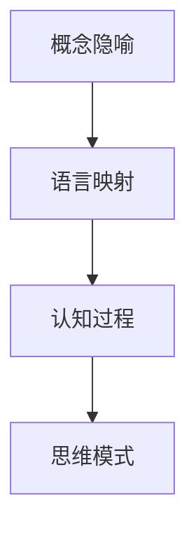
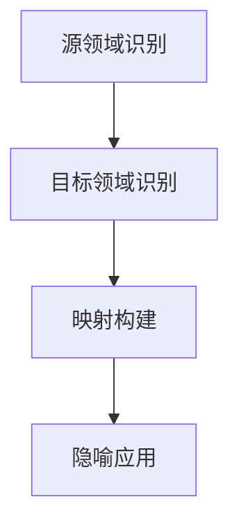
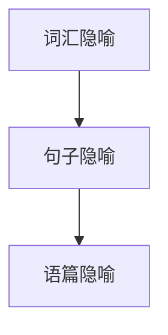
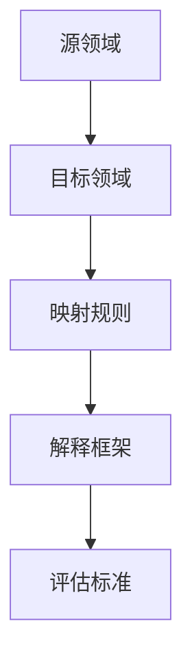
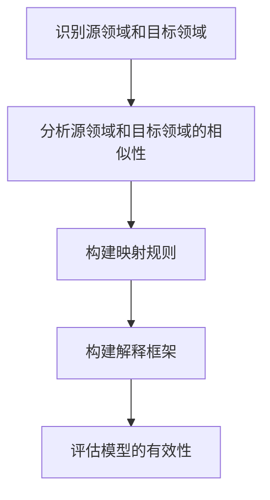
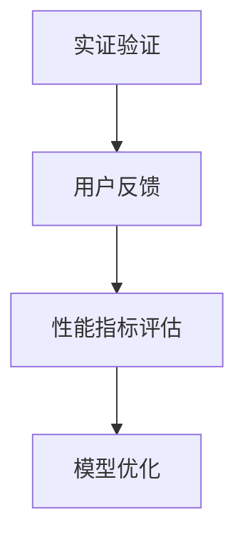

                 


# 知识的隐喻：跨领域理解的桥梁

> 关键词：知识隐喻、跨领域理解、认知模型、教育、智能时代

> 摘要：本文探讨了知识隐喻的概念、历史与演变，以及其在科学、人文社科、教育等领域的应用。通过分析知识隐喻的理论基础、模型构建和挑战，本文揭示了知识隐喻在跨领域理解中的桥梁作用，并对知识隐喻的未来趋势进行了展望。本文旨在为研究人员和实践者提供对知识隐喻的深入理解，以及其在不同领域的实际应用案例。

### 目录大纲：

**第一部分：引言与背景**

1. **知识的隐喻概念**  
   - **1.1 知识隐喻的定义**  
   - **1.2 跨领域理解的需求**

2. **知识隐喻的历史与演变**  
   - **2.1 知识隐喻的起源**  
   - **2.2 知识隐喻的发展**  
   - **2.3 知识隐喻的当代应用**

**第二部分：知识隐喻的应用领域**

3. **知识隐喻在科学领域**  
   - **3.1 科学领域的知识隐喻**  
   - **3.2 生物学中的知识隐喻**  
   - **3.3 物理学中的知识隐喻**

4. **知识隐喻在人文社科领域**  
   - **4.1 人文社科领域的知识隐喻**  
   - **4.2 文学中的知识隐喻**  
   - **4.3 艺术中的知识隐喻**

5. **知识隐喻在教育中的应用**  
   - **5.1 教育中的知识隐喻**  
   - **5.2 学生学习中的知识隐喻**  
   - **5.3 教育研究者对知识隐喻的关注**

**第三部分：知识隐喻的理论与模型**

6. **知识隐喻的理论基础**  
   - **6.1 隐喻理论概述**  
   - **6.2 隐喻认知理论**  
   - **6.3 隐喻的语言学分析**

7. **知识隐喻的模型构建**  
   - **7.1 知识隐喻模型概述**  
   - **7.2 知识隐喻模型的构建方法**  
   - **7.3 知识隐喻模型的评估与优化**

**第四部分：知识隐喻的挑战与未来**

8. **知识隐喻的挑战**  
   - **8.1 跨文化隐喻理解**  
   - **8.2 隐喻的不确定性与歧义性**  
   - **8.3 技术与知识隐喻的融合**

9. **知识隐喻的未来趋势**  
   - **9.1 知识隐喻在智能时代的演变**  
   - **9.2 知识隐喻在跨领域研究中的作用**  
   - **9.3 知识隐喻在教育、科学和人文社科领域的未来**

**附录**

- **附录A：知识隐喻研究工具与资源**  
- **附录B：知识隐喻案例研究**

---

### 第一部分：引言与背景

#### 第1章：知识的隐喻概念

##### 1.1 知识隐喻的定义

知识隐喻是一种修辞手法，它通过将一个领域的概念或现象映射到另一个领域，以便更好地理解和解释复杂的概念或现象。隐喻作为一种认知工具，帮助我们通过已有的知识和经验来理解和探索新的领域。

知识隐喻的定义可以归结为以下几点：

1. **映射**：知识隐喻通过将一个领域的概念映射到另一个领域，使得两个看似不相关的领域产生联系。
2. **理解**：隐喻帮助我们通过比喻和类比的方式，将新的知识与我们已有的知识框架相结合，从而加深对复杂概念的理解。
3. **解释**：知识隐喻在解释过程中发挥着重要作用，它通过将复杂的理论或概念转化为易于理解的形式，使得读者能够更好地吸收和掌握知识。

在信息技术领域，知识隐喻被广泛应用于软件开发、人工智能、计算机网络等领域。例如，将计算机程序视为一种机器，将网络比作一张蜘蛛网，这些隐喻使得复杂的计算机概念变得直观易懂。

##### 1.2 跨领域理解的需求

跨领域理解的需求源于现代社会的复杂性。随着学科的细分和专业化，各个领域之间的界限越来越明显，导致跨领域合作和交流的难度增加。为了应对这一挑战，知识隐喻作为一种认知工具，在跨领域理解中发挥了重要作用。

跨领域理解的挑战主要体现在以下几个方面：

1. **概念差异**：不同领域有着不同的术语和概念体系，这使得跨领域交流变得困难。
2. **知识背景**：不同领域的学者和从业者拥有不同的知识背景，这导致了他们在理解和解释问题时存在差异。
3. **思维方式**：不同领域的思维方式和方法论各不相同，这使得跨领域合作面临巨大的挑战。

知识隐喻作为一种有效的跨领域认知工具，可以克服上述挑战。它通过将一个领域的概念映射到另一个领域，使得不同领域的学者和从业者能够通过共同的理解框架来交流和合作。

例如，在计算机科学和生物学领域，知识隐喻可以帮助计算机科学家更好地理解生物系统的复杂性，从而推动生物信息学的发展。同样，在经济学和物理学领域，知识隐喻可以促进跨学科的研究与合作，为解决复杂的社会问题提供新的思路和方法。

总之，知识隐喻作为一种跨领域理解的桥梁，有助于打破学科壁垒，促进知识的交流与融合，从而推动科学技术的进步和社会的发展。

---

#### 第2章：知识隐喻的历史与演变

##### 2.1 知识隐喻的起源

知识隐喻的历史可以追溯到古代文明。在古代，人们通过隐喻来解释和传达复杂的概念和理论。例如，古希腊哲学家亚里士多德在他的著作《形而上学》中使用了大量的隐喻，以帮助读者理解抽象的哲学概念。

在古代文明中，知识隐喻被广泛应用于宗教、哲学、文学和科学等领域。例如，在宗教中，上帝被比喻为父亲或母亲，使得信徒能够以亲切的方式理解和信仰神。在哲学中，哲学家们使用隐喻来阐述他们的思想，如柏拉图的《理想国》中，将理念世界比喻为“理念的光”。

古代的隐喻不仅用于解释和传播知识，还作为一种修辞手法，增强了文学作品的艺术效果。例如，在古希腊戏剧中，隐喻被广泛使用来描绘角色的情感和内心世界。

##### 2.2 知识隐喻的发展

中世纪至现代，知识隐喻继续演变和发展。在中世纪，隐喻在宗教和教育领域有着重要的地位。基督教神学家通过隐喻来解释圣经中的概念，使得信徒能够更好地理解和信仰上帝。

文艺复兴时期，隐喻在文学和艺术中得到了广泛运用。作家和艺术家们通过隐喻来表达他们的思想和情感，丰富了文学和艺术的表现形式。例如，莎士比亚在他的戏剧中使用了大量的隐喻，以增强作品的戏剧效果。

18世纪，启蒙运动推动了科学和哲学的发展。在这个时期，科学家和哲学家们开始关注隐喻在知识传播中的作用。康德在他的著作《纯粹理性批判》中，讨论了隐喻在哲学思考中的重要性。

19世纪，隐喻在语言学和心理学领域得到了研究。语言学家和心理学家开始探讨隐喻的构成和功能，揭示了隐喻在认知过程中的作用。弗雷德里克·拉考夫（Frederick Lasnik）和乔治·拉考夫（George Lakoff）在20世纪提出了“概念隐喻理论”，认为隐喻是理解世界的基本方式。

##### 2.3 知识隐喻的当代应用

当代，知识隐喻在各个领域得到了广泛应用。在科学领域，科学家们使用隐喻来解释复杂的理论和技术。例如，将基因比作乐谱，将神经网络比作大脑，这些隐喻使得科学家能够更直观地理解基因和神经网络的工作原理。

在人文社科领域，隐喻被用于文学、艺术、社会学和哲学等领域。文学作品中，隐喻被用来表达作者的情感和思想。社会学研究中，隐喻被用来描述社会现象和社会结构。例如，将社会比作一台机器，这种隐喻有助于理解社会的运作机制。

在教育领域，知识隐喻被广泛应用于教学和学习过程中。教师们使用隐喻来解释复杂的概念和理论，帮助学生更好地理解和掌握知识。例如，将数学概念比作建筑，这种隐喻有助于学生理解数学中的几何概念。

总之，知识隐喻在历史与演变中扮演着重要的角色。从古代到现代，隐喻在知识传播、理解和解释中发挥了重要作用。当代，知识隐喻在各个领域得到了广泛应用，成为跨领域理解和认知的重要工具。

---

### 第二部分：知识隐喻的应用领域

#### 第3章：知识隐喻在科学领域

##### 3.1 科学领域的知识隐喻

科学领域中的知识隐喻广泛应用于不同学科，以帮助科学家们更好地理解和解释复杂的科学概念和现象。以下是一些科学领域中的常见知识隐喻及其应用：

1. **计算机科学中的隐喻**：在计算机科学中，计算机系统经常被比作人体或大脑。例如，将操作系统比作人体的神经系统，将软件程序比作人体的思维过程。这种隐喻使得计算机科学家能够更直观地理解计算机系统的运作机制。

   **概念隐喻图：**
   ```mermaid
   graph TD
   A[计算机] --> B[人体]
   B --> C[神经系统]
   B --> D[大脑]
   C --> E[操作系统]
   D --> F[软件程序]
   ```

2. **物理学中的隐喻**：在物理学中，物理现象经常被比作其他领域的现象。例如，将量子场论比作一张大网，将黑洞比作宇宙中的“黑洞吸尘器”。这种隐喻有助于物理学家理解量子场论和黑洞的复杂特性。

   **概念隐喻图：**
   ```mermaid
   graph TD
   A[量子场论] --> B[大网]
   A --> C[黑洞]
   C --> D[宇宙中的“黑洞吸尘器”]
   ```

3. **生物学中的隐喻**：在生物学中，生物系统经常被比作机械系统。例如，将基因比作乐谱，将细胞比作一个小型工厂。这种隐喻有助于生物学家理解基因和细胞的工作原理。

   **概念隐喻图：**
   ```mermaid
   graph TD
   A[基因] --> B[乐谱]
   A --> C[细胞]
   C --> D[小型工厂]
   ```

通过这些隐喻，科学家们能够将复杂的科学概念转化为更直观、易于理解的形式，从而促进了科学知识的传播和发展。

##### 3.2 生物学中的知识隐喻

生物学中的知识隐喻丰富多样，帮助我们以新颖和直观的方式理解生命现象。以下是一些生物学中的知识隐喻及其应用：

1. **基因与乐谱的隐喻**：基因经常被比作乐谱，因为它们包含指导生命活动的指令。乐谱上的音符对应于基因上的编码序列，指挥着生物体的生长和发育。

   **概念隐喻图：**
   ```mermaid
   graph TD
   A[基因] --> B[乐谱]
   B --> C[编码序列]
   C --> D[生物体]
   ```

2. **细胞与工厂的隐喻**：细胞被比作一个小型工厂，因为它们在细胞膜内进行各种化学反应，生产生命所需的物质。这种隐喻有助于理解细胞内的生物合成过程。

   **概念隐喻图：**
   ```mermaid
   graph TD
   A[细胞] --> B[小型工厂]
   B --> C[生物合成过程]
   ```

3. **免疫系统与军队的隐喻**：免疫系统被比作一支军队，因为它们保护生物体免受病原体的侵害。这种隐喻有助于理解免疫系统的复杂性和协调性。

   **概念隐喻图：**
   ```mermaid
   graph TD
   A[免疫系统] --> B[军队]
   B --> C[病原体]
   ```

通过这些隐喻，生物学家能够以更直观的方式解释生物学的复杂概念，使得生物学知识更易于传播和理解。

##### 3.3 物理学中的知识隐喻

物理学中的知识隐喻在解释复杂现象和理论时发挥了重要作用。以下是一些物理学中的知识隐喻及其应用：

1. **量子力学与梦境的隐喻**：量子力学中的不确定性原理和量子纠缠现象被比作梦境。这种隐喻有助于理解量子世界的奇异特性，使得这些复杂的概念更容易被接受。

   **概念隐喻图：**
   ```mermaid
   graph TD
   A[量子力学] --> B[梦境]
   B --> C[不确定性原理]
   B --> D[量子纠缠]
   ```

2. **相对论与时空图的隐喻**：爱因斯坦的广义相对论将时空比作一张弯曲的床单，物体和能量使床单弯曲，从而影响时空的几何结构。这种隐喻有助于直观地理解引力、时空弯曲和黑洞等概念。

   **概念隐喻图：**
   ```mermaid
   graph TD
   A[广义相对论] --> B[时空图]
   B --> C[弯曲的床单]
   ```

3. **热力学与蒸汽机的隐喻**：热力学中的能量转换和守恒定律被比作蒸汽机的工作原理。蒸汽机通过燃烧燃料产生蒸汽，驱动机械运动，这种隐喻有助于理解能量转换和守恒的概念。

   **概念隐喻图：**
   ```mermaid
   graph TD
   A[热力学] --> B[蒸汽机]
   B --> C[能量转换]
   ```

通过这些隐喻，物理学家能够将复杂的物理概念转化为直观的形式，使得这些概念更易于理解，从而促进了物理学的发展。

---

#### 第4章：知识隐喻在人文社科领域

##### 4.1 人文社科领域的知识隐喻

人文社科领域中的知识隐喻在解释复杂的社会现象和文化现象时发挥着重要作用。以下是一些人文社科领域的知识隐喻及其应用：

1. **社会学中的隐喻**：社会学经常使用隐喻来解释社会结构和社会过程。例如，将社会比作一台大型机器，个体是社会机器的螺丝钉。这种隐喻有助于理解社会组织的复杂性。

   **概念隐喻图：**
   ```mermaid
   graph TD
   A[社会] --> B[大型机器]
   B --> C[个体]
   C --> D[螺丝钉]
   ```

2. **哲学中的隐喻**：哲学中充满了隐喻，哲学家们通过隐喻来探讨抽象的概念。例如，将知识比作一盏照亮黑暗的明灯，这种隐喻有助于理解知识的本质。

   **概念隐喻图：**
   ```mermaid
   graph TD
   A[知识] --> B[明灯]
   B --> C[照亮黑暗]
   ```

3. **文学中的隐喻**：文学作品广泛使用隐喻来表达作者的情感和思想。例如，莎士比亚在他的戏剧中使用隐喻来描绘角色的内心世界。这种隐喻有助于深化文学作品的含义。

   **概念隐喻图：**
   ```mermaid
   graph TD
   A[莎士比亚] --> B[戏剧]
   B --> C[角色]
   B --> D[内心世界]
   ```

通过这些隐喻，人文社科学家能够以更生动、更深入的方式解释复杂的社会和文化现象，促进了人文社科领域的发展。

##### 4.2 文学中的知识隐喻

文学中的知识隐喻是文学作品的核心元素，通过隐喻的运用，作者能够以简洁而富有内涵的方式表达复杂的思想和情感。以下是一些文学中的知识隐喻及其应用：

1. **隐喻在文学创作中的应用**：隐喻在文学创作中具有独特的功能，它不仅丰富了作品的意象，还增强了语言的表现力。例如，莎士比亚在他的《哈姆雷特》中，将哈姆雷特的疯狂比作一只受伤的鹰，这种隐喻揭示了角色的内心痛苦。

   **例子**：
   ```
   “疯狂是一只受伤的鹰，
   在风声中哀鸣，在云端中徘徊。”
   ```

2. **隐喻对文学意义的贡献**：隐喻有助于深化文学作品的主题和情感。通过隐喻，读者能够在字面意义之外，感受到更深层次的含义。例如，艾米丽·狄金森在她的诗歌中使用隐喻来表达生命的无常和不确定性。

   **例子**：
   ```
   “生命是一朵短暂的花，
   在风雨中凋谢。”
   ```

3. **隐喻的修辞效果**：隐喻的运用使得文学作品更具吸引力，读者在阅读过程中能够产生共鸣和联想。例如，约翰·凯瑟在《我们如此丰富》中，通过一系列隐喻描绘了美国社会的复杂性和矛盾性。

   **例子**：
   ```
   “美国是一个巨大的洋葱，
   每一层都藏着不同的秘密。”
   ```

通过这些隐喻，文学作品能够传达出深刻的主题和情感，使得文学创作更加丰富和多样。

##### 4.3 艺术中的知识隐喻

艺术中的知识隐喻是艺术家通过创造性的方式，将抽象概念或情感转化为具体的形象和画面，从而赋予作品更深层次的意义。以下是一些艺术中的知识隐喻及其应用：

1. **绘画中的隐喻**：在绘画中，隐喻常常通过色彩、形状和构图来传达。例如，荷兰画家文森特·梵高在他的《星夜》中，使用了夸张的蓝色和黄色，隐喻了宇宙的无限和生命的活力。

   **例子**：
   

2. **雕塑中的隐喻**：雕塑作为一种立体艺术形式，能够通过形态和材料来传达隐喻。例如，亨利·摩尔的大型雕塑作品《内部和外部的空间》，通过其空隙和结构，隐喻了人类的内心世界和外部环境。

   **例子**：
   

3. **音乐中的隐喻**：音乐中的隐喻通过旋律、节奏和和声来表达情感和概念。例如，约翰·柯尔崔恩在他的爵士乐作品中，通过复杂的旋律和和声，隐喻了生活的复杂性和不确定性。

   **例子**：
   

通过这些知识隐喻，艺术家能够以独特的方式表达思想和情感，使得艺术作品更加丰富和深刻。

---

#### 第5章：知识隐喻在教育中的应用

##### 5.1 教育中的知识隐喻

知识隐喻在教育中的应用极为广泛，通过隐喻，教师能够将复杂的概念和理论以更直观和易于理解的方式传授给学生。以下是一些教育中知识隐喻的应用：

1. **数学教育中的隐喻**：在数学教育中，隐喻被广泛用于解释抽象的概念。例如，将分数比作将蛋糕切成若干等份，这样学生能够更直观地理解分数的含义。

   **例子**：
   ```
   “分数就像切蛋糕，每个人都能得到自己的一份。”
   ```

2. **科学教育中的隐喻**：在科学教育中，隐喻被用于解释复杂的科学概念。例如，将细胞比作一个小型工厂，这样学生能够理解细胞内的生物过程。

   **概念隐喻图：**
   ```mermaid
   graph TD
   A[细胞] --> B[小型工厂]
   B --> C[生物过程]
   ```

3. **语言教育中的隐喻**：在语言教育中，隐喻被用于提高学生的语言表达能力。例如，通过分析文学作品中的隐喻，学生能够学习如何有效地使用隐喻来传达思想和情感。

   **例子**：
   ```
   “文学中的隐喻就像窗户，透过它可以看到作者内心世界。”
   ```

知识隐喻的应用不仅能够提高学生的学习兴趣和动机，还能促进学生对复杂概念的深入理解。

##### 5.2 学生学习中的知识隐喻

学生在学习过程中广泛利用知识隐喻来帮助自己理解和掌握新概念。以下是一些学生如何利用知识隐喻学习新概念的例子：

1. **跨学科学习**：学生通过将不同学科的概念进行隐喻连接，从而实现跨学科学习。例如，学生可以将生物学中的细胞隐喻为化学中的分子，这样有助于理解细胞内的生物过程。

   **例子**：
   ```
   “细胞就像分子一样，是生命的基本单位。”
   ```

2. **抽象概念的具象化**：学生通过将抽象概念具象化，从而更容易理解和记忆。例如，学生可以将几何中的点、线、面比作三维空间中的物体，这样有助于理解几何概念。

   **例子**：
   ```
   “点就像球，线就像绳子，面就像球面。”
   ```

3. **自我解释**：学生通过自我解释来巩固新学的概念。例如，学生可以将新学的概念与已知的知识进行隐喻连接，从而形成自己的理解。例如，学生可以将电磁学中的电荷比作水中的漩涡，这样有助于理解电荷的相互作用。

   **例子**：
   ```
   “电荷就像水中的漩涡，它们相互吸引或排斥。”
   ```

通过这些方法，学生能够更有效地学习和掌握新概念，从而提高学习效果。

##### 5.3 教育研究者对知识隐喻的关注

教育研究者对知识隐喻的研究日益深入，探讨其在教育实践中的应用和效果。以下是一些教育研究者对知识隐喻的关注点：

1. **隐喻在认知发展中的作用**：研究者关注知识隐喻如何影响学生的认知发展，以及它如何促进学生对新概念的理解和记忆。

   **例子**：
   ```
   “知识隐喻在认知发展中的作用类似于支架，它帮助学生逐步建立对复杂概念的理解。”
   ```

2. **隐喻的有效性**：研究者探讨不同类型的知识隐喻在具体教育场景中的有效性，以及如何优化隐喻的使用，以提高学生的学习效果。

   **例子**：
   ```
   “有效使用知识隐喻能够显著提高学生的学习兴趣和成绩。”
   ```

3. **隐喻的教学策略**：研究者探讨如何在教学过程中有效地运用知识隐喻，以及如何设计教学活动，使学生能够更好地利用隐喻进行学习。

   **例子**：
   ```
   “设计以隐喻为核心的教学活动，能够激发学生的学习兴趣，促进他们的深度理解。”
   ```

通过这些研究，教育研究者为教育实践提供了宝贵的理论指导和实证支持，推动了知识隐喻在教育中的应用和发展。

---

### 第三部分：知识隐喻的理论与模型

#### 第6章：知识隐喻的理论基础

##### 6.1 隐喻理论概述

隐喻作为一种修辞手法，其理论基础可以追溯到古希腊哲学家亚里士多德。亚里士多德认为，隐喻是通过将一个领域的概念映射到另一个领域来传达思想的一种方式。这种映射不仅使得抽象的概念更加具体和易于理解，还能够激发读者的想象力和创造力。

在语言学和认知科学领域，隐喻理论得到了进一步的发展。弗雷德里克·拉考夫和乔治·拉考夫在他们的著作《我们赖以生存的隐喻》中提出了“概念隐喻理论”，认为隐喻不仅仅是语言现象，更是人类认知的基本方式。他们指出，人们通过将一个领域的概念系统映射到另一个领域，形成了各种各样的隐喻概念。

**概念隐喻图：**


##### 6.2 隐喻认知理论

隐喻认知理论进一步探讨了隐喻在人类认知过程中的作用。根据隐喻认知理论，隐喻不仅是一种语言现象，也是一种认知工具。它通过将一个领域的概念系统映射到另一个领域，帮助我们理解和解释复杂的概念。

隐喻认知理论认为，隐喻认知过程包括以下步骤：

1. **源领域识别**：识别出需要解释的复杂概念或现象。
2. **目标领域识别**：选择一个目标领域，该领域的概念系统与源领域具有相似性。
3. **映射构建**：通过映射，将源领域的概念映射到目标领域，形成隐喻概念。
4. **隐喻应用**：将构建的隐喻应用于实际情境中，以帮助理解和解释源领域的概念。

**概念隐喻图：**


通过隐喻认知理论，我们可以更好地理解隐喻在人类思维和认知中的作用，以及如何通过隐喻来促进对复杂概念的理解。

##### 6.3 隐喻的语言学分析

隐喻的语言学分析主要关注隐喻在语言结构中的作用。隐喻通过将一个领域的概念映射到另一个领域，使得原本抽象的语言变得更加具体和形象。这种映射不仅丰富了语言的内涵，还增强了语言的表现力。

隐喻的语言学分析可以从以下几个方面进行：

1. **词汇隐喻**：通过将一个领域的词汇映射到另一个领域，使得词汇具有多重含义。例如，将“战争”映射到“战斗”，使得“战争”这个词汇具有具体的战斗场景。
2. **句子隐喻**：通过将一个句子的结构映射到另一个句子结构，使得句子更加生动和具有表现力。例如，将“思考”映射到“旅行”，使得句子“他的思考如同一场旅行”更加形象。
3. **语篇隐喻**：通过将一段语篇的结构映射到另一段语篇结构，使得整个语篇更加连贯和有机。例如，将“科学探索”映射到“探险”，使得整个语篇具有探险的紧张感和刺激性。

**概念隐喻图：**


通过隐喻的语言学分析，我们可以更好地理解隐喻在语言结构中的作用，以及如何通过隐喻来丰富语言表达。

---

#### 第7章：知识隐喻的模型构建

##### 7.1 知识隐喻模型概述

知识隐喻模型是一种用于构建和解释知识隐喻的框架，它通过将一个领域的概念系统映射到另一个领域，以帮助人们理解和解释复杂的概念。知识隐喻模型的基本框架包括以下几个部分：

1. **源领域**：指需要解释的复杂概念或现象所在的领域。
2. **目标领域**：指用于解释源领域概念的目标领域，该领域与源领域具有相似性。
3. **映射规则**：定义源领域概念与目标领域概念之间的映射关系。
4. **解释框架**：提供一个解释源领域概念的逻辑结构。
5. **评估标准**：用于评估知识隐喻模型的有效性和适用性。

**知识隐喻模型基本框架图：**


##### 7.2 知识隐喻模型的构建方法

构建知识隐喻模型需要遵循一定的方法，以下是一些常用的构建方法：

1. **类比法**：通过将源领域与目标领域的相似性进行类比，构建知识隐喻模型。例如，将计算机系统比作人体系统，从而构建计算机系统与人体系统的知识隐喻模型。
2. **转换法**：通过将源领域的概念转换为目标领域的概念，构建知识隐喻模型。例如，将数学中的几何概念转换为物理中的力学概念，从而构建数学与物理的知识隐喻模型。
3. **归纳法**：通过归纳源领域和目标领域之间的映射关系，构建知识隐喻模型。例如，通过分析大量生物学和计算机科学的文献，归纳出生物学与计算机科学之间的知识隐喻模型。

**构建知识隐喻模型步骤：**


##### 7.3 知识隐喻模型的评估与优化

评估知识隐喻模型的有效性和适用性是构建知识隐喻模型的重要环节。以下是一些评估与优化知识隐喻模型的方法：

1. **实证验证**：通过实验或实际应用验证知识隐喻模型的有效性。例如，通过让学生使用知识隐喻模型学习新概念，评估其学习效果。
2. **用户反馈**：收集用户对知识隐喻模型的使用体验和评价，了解模型的优缺点，进行优化。
3. **性能指标**：使用性能指标评估知识隐喻模型的表现，如准确率、召回率、覆盖率等。
4. **模型优化**：根据评估结果对知识隐喻模型进行优化，提高其有效性和适用性。

**知识隐喻模型评估与优化步骤：**


通过上述方法，我们可以构建和优化知识隐喻模型，从而更好地理解和解释复杂的概念。

---

### 第四部分：知识隐喻的挑战与未来

#### 第8章：知识隐喻的挑战

##### 8.1 跨文化隐喻理解

跨文化隐喻理解是一个复杂且具有挑战性的问题。由于不同文化背景下的人们有着不同的语言习惯和认知方式，他们在使用隐喻时可能产生误解或无法理解。以下是一些跨文化隐喻理解的挑战：

1. **文化差异**：不同文化对同一概念的隐喻表达可能存在差异。例如，在某些文化中，疾病可能被比作恶魔，而在另一些文化中，疾病可能被比作自然灾害。这种文化差异导致了跨文化隐喻理解的困难。
2. **语境依赖**：隐喻的理解往往依赖于特定的语境。在跨文化交流中，由于语境的差异，同一隐喻在不同文化中可能产生不同的理解。例如，在美国文化中，“穿新鞋走老路”可能表示接受新事物，但在某些亚洲文化中，这可能被理解为守旧。
3. **认知习惯**：不同文化背景下的人们有着不同的认知习惯。例如，西方文化倾向于用逻辑和抽象的方式思考，而某些东方文化更倾向于直观和感性的思考。这种认知习惯的差异使得跨文化隐喻理解更加复杂。

为了克服这些挑战，我们需要：

- **加强跨文化交流**：通过加强不同文化之间的交流，增进对彼此语言和认知习惯的理解。
- **提供文化背景**：在跨文化交流中，提供丰富的文化背景信息，帮助人们更好地理解隐喻的含义。
- **构建跨文化隐喻模型**：通过构建跨文化隐喻模型，将不同文化中的隐喻进行映射和解释，提高跨文化隐喻理解的准确性。

##### 8.2 隐喻的不确定性与歧义性

隐喻的不确定性和歧义性是其在实际应用中面临的重要挑战。以下是一些关于隐喻不确定性和歧义性的问题及其影响：

1. **不确定性**：隐喻往往具有一定的模糊性，这使得其在解释复杂概念时可能产生不确定性。例如，将“时间比作金钱”这个隐喻，虽然直观地表达了时间的珍贵性，但同时也可能导致人们对时间价值的理解产生偏差。
2. **歧义性**：隐喻在语境中的具体含义可能不明确，从而产生歧义。例如，在句子“他像闪电一样行动迅速”中，“像闪电一样”这个隐喻可能被理解为行动迅速，也可能被理解为行动敏捷。
3. **影响**：隐喻的不确定性和歧义性可能影响隐喻的有效性。如果隐喻的含义不明确，人们可能无法准确理解隐喻背后的意图，从而降低隐喻的传播效果。

为了降低隐喻的不确定性和歧义性，我们可以采取以下措施：

- **明确隐喻的含义**：在应用隐喻时，尽量明确隐喻的具体含义，避免产生歧义。
- **提供背景信息**：在隐喻的应用过程中，提供丰富的背景信息，帮助人们更好地理解隐喻的含义。
- **使用多重隐喻**：通过使用多重隐喻，相互补充和验证，降低隐喻的不确定性。

通过这些措施，我们可以更好地利用隐喻来传递信息，提高隐喻的应用效果。

##### 8.3 技术与知识隐喻的融合

随着技术的发展，知识隐喻在技术领域的应用越来越广泛。以下是一些技术与知识隐喻融合的挑战：

1. **技术隐喻的准确性**：在技术领域，知识隐喻需要准确反映技术的本质。例如，将人工智能比作大脑，这种隐喻需要准确描述人工智能的运作机制，否则可能导致误解。
2. **技术隐喻的适应性**：技术领域不断发展，知识隐喻需要具备一定的适应性，以适应新技术和新概念。例如，当出现新的计算模型时，知识隐喻需要及时更新，以适应新的技术背景。
3. **技术隐喻的教育应用**：在技术教育中，知识隐喻需要能够帮助学生更好地理解复杂的技术概念。例如，将计算机网络比作交通网络，这种隐喻需要能够直观地帮助学生理解网络通信的原理。

为了应对这些挑战，我们可以：

- **深入研究技术隐喻**：通过深入研究技术领域的知识，确保技术隐喻的准确性和适应性。
- **开展技术隐喻的教育应用**：将知识隐喻应用于技术教育，通过案例分析和实践活动，帮助学生更好地理解技术概念。
- **鼓励创新隐喻**：鼓励技术专家和学者探索新的知识隐喻，以适应不断变化的技术环境。

通过这些措施，我们可以更好地将知识隐喻应用于技术领域，促进技术知识的传播和应用。

---

#### 第9章：知识隐喻的未来趋势

##### 9.1 知识隐喻在智能时代的演变

随着智能时代的到来，知识隐喻在人工智能、大数据、物联网等领域得到了广泛应用。知识隐喻在智能时代的演变主要体现在以下几个方面：

1. **人工智能与知识隐喻的结合**：人工智能技术使得知识隐喻的应用更加广泛和深入。通过将人工智能算法与知识隐喻相结合，我们可以开发出更智能的智能系统，如智能客服、智能翻译等。例如，将语音识别技术比作听音辨字，这种隐喻有助于理解语音识别的工作原理。

2. **大数据与知识隐喻**：大数据时代带来了海量的数据，知识隐喻可以帮助我们更好地理解和处理这些数据。例如，将大数据比作金矿，通过挖掘和提取数据中的价值，从而推动社会进步。这种隐喻有助于激发人们对大数据价值的认识。

3. **物联网与知识隐喻**：物联网时代，万物互联使得知识隐喻的应用更加丰富。例如，将物联网比作一张巨大的蜘蛛网，每个节点都是一个智能设备，这种隐喻有助于理解物联网的架构和工作原理。

通过这些知识隐喻的应用，智能时代的科技发展得到了更好的理解和推动。

##### 9.2 知识隐喻在跨领域研究中的作用

知识隐喻在跨领域研究中的作用日益显著，它不仅促进了学科间的交流与合作，还推动了跨领域研究的深入发展。以下是一些知识隐喻在跨领域研究中的作用：

1. **促进学科交叉**：知识隐喻作为一种认知工具，能够将不同领域的概念进行映射和融合，从而促进学科交叉。例如，将生物学中的基因与计算机科学中的算法进行映射，促进了生物信息学的发展。

2. **提高研究效率**：知识隐喻有助于简化复杂的跨领域研究问题，使得研究过程更加直观和高效。例如，将金融市场的波动比作海浪，这种隐喻有助于金融学者理解市场的动态变化。

3. **创新研究方法**：知识隐喻的运用激发了新的研究思路和方法。例如，将社会学中的社会网络分析比作地理学中的地图，这种隐喻促使社会学者借鉴地理学的方法，从而发展出新的研究方法。

通过知识隐喻的跨领域应用，研究人员能够更有效地解决复杂问题，推动跨领域研究的深入发展。

##### 9.3 知识隐喻在教育、科学和人文社科领域的未来

知识隐喻在教育、科学和人文社科领域的未来发展充满了机遇和挑战。以下是一些预测：

1. **教育领域**：随着技术的进步，知识隐喻在教育中的应用将更加广泛和深入。虚拟现实、人工智能等技术的应用，使得知识隐喻可以更加生动和直观地呈现，提高学生的学习效果。

2. **科学领域**：知识隐喻在科学领域将继续发挥重要作用，推动科学研究的深入发展。例如，通过构建新的知识隐喻模型，科学家可以更好地理解和解释复杂的科学现象。

3. **人文社科领域**：知识隐喻在人文社科领域的应用将更加多样化，为文化传承、社会问题解决等提供新的思路和方法。例如，通过知识隐喻，人文学者可以更好地理解和解释不同文化之间的差异和联系。

总之，知识隐喻在未来将继续发挥其独特的作用，促进不同领域的交流和合作，推动科学技术的进步和社会的发展。

---

### 附录

#### 附录A：知识隐喻研究工具与资源

为了更好地研究知识隐喻，以下是一些常用的工具与资源：

1. **知识隐喻研究工具概述**：  
   - **概念隐喻分析工具**：用于分析和提取文本中的隐喻。  
   - **语义网络分析工具**：用于构建和分析隐喻的语义关系。  
   - **自然语言处理工具**：用于处理和分析大量文本数据，提取隐喻信息。

2. **知识隐喻数据库与资源**：  
   - **开放性隐喻数据库**：提供大量已标注的隐喻实例，便于研究人员进行研究和分析。  
   - **学术期刊和书籍**：涵盖知识隐喻的学术论文和专著，提供丰富的理论和实证研究。

3. **知识隐喻研究的最新进展**：  
   - **学术会议和研讨会**：举办知识隐喻相关的学术会议和研讨会，促进学术交流和合作。  
   - **研究前沿**：关注知识隐喻在跨领域研究、智能教育、自然语言处理等领域的最新研究进展。

#### 附录B：知识隐喻案例研究

为了更好地理解知识隐喻的应用，以下是一些具体的案例研究：

1. **案例研究方法**：  
   - **文献综述**：分析相关领域的文献，总结知识隐喻的应用现状和研究趋势。  
   - **实证研究**：通过实验或实际应用，验证知识隐喻的有效性和适用性。

2. **具体案例分析**：  
   - **教育领域**：分析知识隐喻在教育中的应用，如数学教育、科学教育等。  
   - **科技领域**：分析知识隐喻在计算机科学、人工智能等领域的应用，如人工智能算法的隐喻表达。

3. **案例分析与启示**：  
   - **经验总结**：总结案例研究中的成功经验和教训，为知识隐喻的实际应用提供指导。  
   - **实践意义**：探讨知识隐喻在不同领域的实际应用，以及其对科学研究和社会发展的贡献。

---

### 结束语

本文系统地探讨了知识隐喻的概念、历史与演变，以及其在科学、人文社科、教育等领域的应用。通过分析知识隐喻的理论基础、模型构建和挑战，本文揭示了知识隐喻在跨领域理解中的桥梁作用，并对知识隐喻的未来趋势进行了展望。知识隐喻作为一种重要的认知工具，在促进知识的交流与融合、推动科学技术进步和社会发展中发挥着重要作用。未来的研究应关注知识隐喻在智能时代的新应用，以及跨学科和跨文化隐喻理解的策略和方法，以进一步提升知识隐喻的应用效果。

