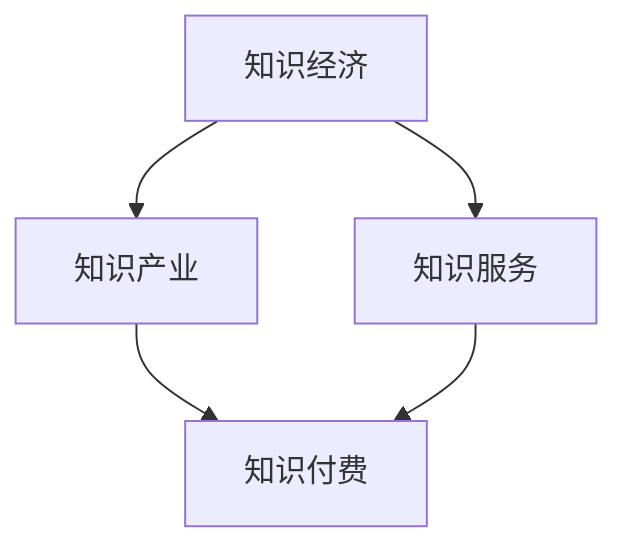

                 

### 第一部分：知识经济与知识付费概述

#### 第1章：知识经济的兴起与知识付费的本质

知识经济是20世纪末以来出现的一种新型经济形态，其主要特点是依赖于知识和信息的创造、传播和应用来驱动经济增长和社会进步。与传统的资源经济和制造经济相比，知识经济更加注重知识的创新和利用，通过提高知识的生产、传播和使用效率，实现经济的持续增长。

知识付费是指消费者为获取优质知识和信息，支付相应的费用。在知识经济时代，知识成为一种重要的商品，其价值通过市场交换得以实现。知识付费的本质是消费者通过付费来购买知识和信息的服务，以满足自身的需求和提升个人能力。

核心概念与联系：

- **知识经济**：以知识为基础的经济形态，通过知识和信息的创造、传播和应用，实现经济增长和社会进步。
- **知识产业**：包括教育、科研、信息服务等与知识相关的产业。
- **知识服务**：为满足用户需求提供知识咨询、培训、传播等服务的活动。
- **知识付费**：消费者为获取优质知识和信息，支付相应的费用。

**Mermaid 流程图**：

知识经济与知识付费之间的关系可以理解为：知识经济是知识付费的基础和前提，知识付费则是知识经济在市场中的表现形式。知识经济提供了丰富的知识和信息资源，知识付费则通过市场机制将这些资源转化为商业价值。

#### 知识经济与知识付费的定义

- **知识经济**：知识经济是指以知识为主要生产要素，以知识和信息的创造、传播和应用为基本驱动力的经济形态。在知识经济中，知识和信息成为一种重要的资源，通过创新、学习和应用，实现经济的增长和社会的发展。

知识经济具有以下特点：

1. **知识依赖性**：知识经济高度依赖知识和信息的生产、传播和应用，知识和信息的创造和创新是经济增长的关键。
2. **创新驱动性**：知识经济强调创新，通过技术创新、管理创新和商业模式创新，推动经济的持续发展。
3. **全球化**：知识经济具有全球化的特征，知识的生产、传播和应用跨越国界，形成全球范围内的知识流动和共享。
4. **可持续性**：知识经济注重可持续性，通过提高资源利用效率，减少环境污染，实现经济的可持续发展。

- **知识付费**：知识付费是指消费者为获取优质知识和信息，支付相应的费用。在知识经济时代，知识和信息成为商品，其价值通过市场交换得以实现。知识付费具有以下特点：

1. **个性化**：知识付费通常根据用户的需求提供定制化的知识服务，满足用户的个性化学习需求。
2. **碎片化**：知识付费的内容通常以短小精悍、易于传播和消费的形式呈现，如音频、视频、图文等。
3. **数字化**：知识付费依托互联网平台，实现高效的知识传播和交易，数字化技术在其中发挥着重要作用。

#### 知识付费的特点

- **个性化**：知识付费能够根据用户的需求提供定制化的知识服务，满足用户的个性化学习需求。例如，在线教育平台通过用户的行为数据和分析，为用户提供个性化的学习路径和推荐内容。

- **碎片化**：知识付费的内容通常以短小精悍、易于传播和消费的形式呈现。例如，短视频、音频课程和图文教程等形式，使得用户可以在碎片化的时间里获取所需的知识。

- **数字化**：知识付费依托互联网平台，实现高效的知识传播和交易。互联网技术使得知识的获取和传播变得更加便捷，用户可以通过手机、电脑等设备随时随地进行学习。

知识付费的这些特点，不仅满足了现代人在快节奏生活中对知识的需求，也为知识的传播和市场化提供了新的途径。通过付费，用户能够获得高质量、专业的知识服务，而内容创作者和平台则能够通过知识付费实现商业价值。

#### 知识付费市场的现状与趋势

知识付费市场在过去几年中取得了显著的增长，随着互联网技术的发展和人们对知识需求的增加，这一市场呈现出以下现状与趋势：

**知识付费市场的现状**：

1. **市场规模不断扩大**：根据市场研究报告，全球知识付费市场规模持续增长，预计未来几年仍将保持高速增长。知识付费已经成为一个庞大的市场，涵盖了在线教育、专业咨询、技能培训等多个领域。

2. **平台发展迅速**：知识付费市场的繁荣带动了各类知识付费平台的发展。如得到、知乎、网易云课堂等平台在内容丰富度、用户黏性和商业模式的创新方面都取得了显著成绩。这些平台通过整合优质内容、提供个性化推荐和服务，吸引了大量用户。

3. **内容形式多样化**：知识付费的内容形式日益丰富，包括音频、视频、图文、直播等多种形式。这种多样化的内容形式不仅满足了用户在不同场景下的学习需求，也提高了知识的传播效率和用户体验。

**知识付费市场的趋势**：

1. **个性化推荐**：随着大数据和人工智能技术的发展，个性化推荐成为知识付费市场的重要趋势。平台通过分析用户行为数据，为用户推荐个性化内容，提高用户的满意度和付费意愿。

2. **垂直领域深耕**：在知识付费市场中，垂直领域的深耕成为平台和创作者的重要策略。通过在特定领域提供专业、深入的内容，平台和创作者能够更好地满足用户需求，提高用户黏性和忠诚度。

3. **跨界融合**：知识付费与其他行业的融合也成为趋势。例如，医疗、金融、教育等行业通过知识付费，为用户提供专业知识和咨询服务，实现跨界发展和创新。

**具体实例**：

- **得到**：作为国内知名的知识付费平台，得到通过邀请各领域的专家和学者，提供高质量的知识内容，满足用户在职场、生活、学习等方面的需求。得到的内容形式包括音频、视频和图文，用户可以根据自己的兴趣和需求选择合适的课程。

- **知乎**：知乎作为一个问答社区，通过知乎Live、知乎书店等平台，提供专业的知识服务和内容。知乎的内容形式丰富多样，包括文字、图片、音频和视频，用户可以在社区中互动和分享知识。

- **网易云课堂**：网易云课堂是网易旗下的在线教育平台，提供包括编程、设计、语言等多个领域的课程。网易云课堂通过大数据分析，为用户提供个性化的学习推荐，提高学习效果。

综上所述，知识付费市场在市场规模、平台发展、内容形式等方面都展现出强劲的增长势头。随着技术的不断进步和用户需求的多样化，知识付费市场将继续保持发展态势，为用户和社会带来更多的价值。

#### 第2章：知识付费平台的发展与挑战

知识付费平台在近年来取得了显著的进步，但同时也面临着诸多挑战。这些平台在技术创新、品牌建设、生态系统构建等方面取得了显著的成就，但也需要面对内容质量、版权保护、盈利模式等挑战。

**知识付费平台的发展**

1. **技术创新**：知识付费平台通过大数据和人工智能技术，实现了个性化推荐、用户行为分析、内容优化等功能。例如，平台通过分析用户的历史行为和兴趣偏好，为用户推荐符合其需求的课程或内容。这种个性化的服务不仅提高了用户体验，也增加了用户对平台的依赖和忠诚度。

2. **品牌建设**：知识付费平台注重品牌形象的建设，通过邀请知名专家和行业领袖入驻，提升平台的专业性和权威性。例如，得到平台邀请了许多知名经济学家、商业人士和学者，使得平台在用户心中树立了良好的专业形象。

3. **生态系统构建**：知识付费平台不仅仅是内容的提供者，还致力于构建一个涵盖创作者、用户、投资者等多方参与的生态系统。平台通过提供创作工具、推广资源、收益分配等支持，鼓励创作者产生高质量的内容，同时通过用户反馈和数据分析，不断优化内容和服务。

**知识付费平台面临的挑战**

1. **内容质量**：内容质量是知识付费平台发展的关键。平台需要确保所提供的内容具有专业性和权威性，以满足用户的需求。然而，由于创作者水平不一，部分内容可能存在质量不高的问题。平台需要建立严格的内容审核机制，确保优质内容的供给。

2. **版权保护**：知识付费平台在内容创作和传播过程中，需要面对版权保护的问题。未经授权的内容传播可能侵犯创作者的权益，导致版权纠纷。平台需要建立健全的版权保护机制，确保内容的合法性和创作者的权益。

3. **盈利模式**：知识付费平台的盈利模式多样化，但同时也需要面对盈利能力不足的挑战。平台需要通过不断优化运营模式和增加服务种类，提高收入来源。例如，通过推出会员服务、付费课程、广告投放等多种方式，实现可持续发展。

**案例分析**

- **得到**：得到是中国知名的知识付费平台，以音频课程为主要内容形式。得到通过大数据和人工智能技术，为用户推荐个性化的课程，提高用户满意度和付费意愿。同时，得到注重品牌建设，邀请知名专家和学者入驻，提升平台的专业性。然而，得到也面临着内容质量参差不齐的挑战，需要通过严格的内容审核和创作者管理，确保优质内容的供给。

- **网易云课堂**：网易云课堂是网易旗下的在线教育平台，提供包括编程、设计、语言等多个领域的课程。网易云课堂通过大数据分析，为用户推荐符合其需求的课程，提高用户的学习效果。同时，网易云课堂注重品牌建设，通过引入知名讲师和优质课程，提升平台的专业形象。然而，网易云课堂也面临着盈利模式单一的挑战，需要通过多元化的发展策略，提高收入来源。

综上所述，知识付费平台在发展过程中取得了显著成就，但同时也需要面对内容质量、版权保护、盈利模式等挑战。通过技术创新、品牌建设和生态系统构建，平台可以不断提升用户体验和盈利能力，实现可持续发展。

#### 第3章：知识付费对用户行为的影响

知识付费作为一种新兴的消费模式，对用户行为产生了深远的影响。这些影响主要体现在学习动力、知识获取方式、学习效果评估和消费观念的变化等方面。

**学习动力增强**

知识付费使得用户为获取优质知识和信息需要支付费用，这一付费行为本身就能激发用户的学习动力。用户在支付费用后，会更加认真地投入到学习过程中，希望自己的投资能够得到回报。此外，付费学习往往意味着用户获得了更加专业和权威的知识，这也增强了用户的学习信心和动力。

**知识获取方式多样化**

知识付费平台提供了多种形式的内容，如音频、视频、图文和直播等，这些多样化的知识获取方式满足了用户在不同场景下的学习需求。例如，用户可以在通勤时听音频课程，在闲暇时间观看视频教程，或在直播中与讲师互动学习。这种多样化的获取方式不仅提高了知识的传播效率，也大大提升了用户的便利性。

**学习效果评估**

知识付费使得用户更加关注学习效果和成果转化。用户在付费学习后，会期望通过所学知识在实际工作中得到应用和提升。因此，知识付费平台通常提供学习效果评估工具，如在线测验、作业提交和成绩反馈等，帮助用户检验学习成果。这种评估机制不仅提高了用户的学习积极性，也促使平台不断提升教学内容的质量和实用性。

**消费观念变化**

知识付费改变了用户的消费观念，使知识成为用户愿意为之一付费的商品。过去，知识往往被视为公共资源，免费获取。而如今，用户逐渐接受了知识付费的理念，愿意为优质的知识和服务支付费用。这种消费观念的变化，不仅促进了知识付费市场的发展，也推动了知识经济的发展。

**综合影响**

知识付费对用户行为的综合影响体现在以下几个方面：

1. **学习习惯的养成**：用户逐渐形成了付费学习的习惯，愿意为知识投资，这种习惯的养成对个人成长具有重要意义。
2. **知识消费的普及**：知识付费使得知识消费变得更加普遍，提高了社会整体的知识水平。
3. **学习效率的提升**：付费学习通常意味着用户能够获得更加专业和系统的知识，从而提升学习效率。
4. **消费观念的转变**：知识付费改变了用户的消费观念，使得用户更加重视知识的价值，愿意为知识投资。

综上所述，知识付费对用户行为产生了积极的影响，不仅激发了用户的学习动力，丰富了知识获取方式，还促进了学习效果评估和消费观念的转变。这些影响为知识经济的发展提供了有力的支持，也为用户提供了一种更加高效、便捷的知识获取途径。

#### 第4章：知识付费产业的生态构建

知识付费产业的生态构建是一个复杂且多层次的过程，涉及平台服务商、内容创作者、用户、版权方和支付渠道等多个角色。各方通过紧密合作，共同构建了一个健康、可持续的知识付费生态系统。

**多方合作**

1. **平台服务商**：知识付费平台是整个生态系统的核心，它们为内容创作者和用户提供一个展示和交易的平台。平台服务商通过提供技术支持、营销推广和用户服务，帮助内容创作者更好地传播知识，同时满足用户的多样化需求。

2. **内容创作者**：内容创作者是知识付费产业的重要组成部分，他们通过创作高质量的知识内容，为用户提供了丰富的知识资源。创作者可以是专家学者、行业专家，也可以是经验丰富的从业者，他们通过平台发布课程、文章、音频等，实现知识的传播和变现。

3. **用户**：用户是知识付费产业的服务对象，他们的需求和付费行为是整个生态系统运转的基础。用户通过平台获取知识，提高自己的能力和素质，从而实现个人成长和职业发展。

4. **版权方**：版权方通常是指拥有知识内容的创作者或机构，他们在知识付费过程中具有重要的权益保障作用。版权方通过授权平台使用其内容，确保内容的合法性和原创性，同时获得相应的经济回报。

5. **支付渠道**：支付渠道是知识付费交易的重要环节，它们为用户和创作者提供了便捷的支付方式。支付渠道不仅包括传统的银行转账、信用卡支付，还包括第三方支付平台和数字货币等新兴支付方式。

**价值链优化**

知识付费产业的价值链包括内容创作、内容审核、内容传播、用户付费、内容反馈等多个环节。各方通过优化这些环节，提高整个产业链的效率和价值。

1. **内容创作**：内容创作者通过创新和专业化，提高内容的质量和影响力。平台服务商则提供丰富的创作工具和技术支持，帮助创作者提升创作效率。

2. **内容审核**：平台服务商需要对内容进行审核，确保内容的合法性、合规性和质量。通过建立严格的内容审核机制，平台可以维护良好的内容生态，保护用户的利益。

3. **内容传播**：平台服务商通过大数据和人工智能技术，实现精准的内容推荐和传播。用户可以根据自己的兴趣和需求，快速找到所需的知识内容。

4. **用户付费**：用户通过付费获取高质量的知识内容，平台服务商则通过用户的付费行为，实现商业模式的闭环。

5. **内容反馈**：用户在学习和使用知识后，会提供反馈，平台服务商可以根据反馈优化内容和服务，进一步提升用户体验。

**产业链完善**

知识付费产业链的完善包括各个环节的协同发展，以及各方的利益分配。平台服务商、内容创作者、用户和版权方通过合作，共同推动知识付费产业的发展。

1. **平台服务商**：平台服务商需要不断提升技术水平，优化用户体验，吸引更多创作者和用户，形成规模效应。

2. **内容创作者**：内容创作者需要不断提升自己的专业能力和创作水平，创作高质量、有影响力的内容，获得用户的认可和市场的回报。

3. **用户**：用户需要积极参与知识付费生态，为优质内容买单，同时通过反馈和评价，推动产业链的良性发展。

4. **版权方**：版权方需要通过有效的版权保护和收益分配机制，确保自身权益，同时鼓励创作者持续创作高质量的内容。

5. **支付渠道**：支付渠道需要不断创新和优化支付方式，提高支付效率和用户体验，为知识付费交易提供便捷的服务。

综上所述，知识付费产业的生态构建是一个多方合作、价值链优化和产业链完善的过程。通过各方共同努力，可以构建一个健康、可持续的知识付费生态系统，为用户和社会带来更多的价值。

### 第二部分：知识付费的风险管理与防控

#### 第6章：知识付费的风险识别与分析

知识付费作为一种新兴的商业模式，虽然为用户提供了丰富的知识资源和便捷的学习途径，但同时也伴随着一系列的风险。这些风险不仅影响知识付费平台的运营，还可能损害用户和创作者的利益。因此，对知识付费风险进行识别与分析，制定有效的风险管理策略，是确保知识付费产业健康发展的关键。

**风险识别**

在知识付费领域，主要的风险可以分为以下几类：

1. **内容质量风险**：知识付费平台提供的内容质量直接影响到用户的体验和满意度。如果内容质量不高，可能导致用户流失，影响平台的口碑和市场份额。

2. **用户隐私风险**：知识付费平台在用户注册、购买和消费过程中，会收集大量的用户个人信息。如果这些信息遭到泄露或滥用，可能导致用户隐私被侵犯，引发法律纠纷和信任危机。

3. **版权风险**：知识付费平台的内容通常来源于创作者，如果未经授权使用或传播他人作品，可能侵犯版权，引发版权纠纷。

4. **技术风险**：知识付费平台依赖于互联网技术，如果技术出现故障，可能导致服务中断，影响用户体验，甚至导致经济损失。

5. **信息泄露风险**：平台在数据存储、传输和处理过程中，可能存在信息泄露的风险。如果用户信息被非法获取，可能被用于诈骗、网络攻击等恶意行为。

6. **数据滥用风险**：平台在收集用户数据时，如果未能妥善处理，可能存在数据滥用的情况，如滥用用户行为数据用于广告推送，影响用户体验。

**风险分析**

1. **内容质量风险**：

   - **原因**：内容质量风险主要源于创作者的能力和责任心。部分创作者可能为了快速变现，忽视内容的质量，导致内容质量不高。
   - **影响**：内容质量不高可能导致用户流失，影响平台的口碑和市场份额。
   - **应对措施**：平台应建立严格的内容审核机制，对内容质量进行把关。同时，鼓励和奖励高质量创作者，提升整体内容水平。

2. **用户隐私风险**：

   - **原因**：用户隐私风险主要源于平台在用户数据收集、存储、传输和处理过程中，存在漏洞和不当操作。
   - **影响**：用户隐私泄露可能导致法律纠纷、信任危机，损害平台声誉和用户利益。
   - **应对措施**：平台应加强用户隐私保护，采取加密、访问控制等措施，确保用户信息的安全。同时，应遵循法律法规，合理使用用户数据。

3. **版权风险**：

   - **原因**：版权风险主要源于平台在内容创作和传播过程中，未对版权进行有效管理和保护。
   - **影响**：版权纠纷可能影响平台运营，甚至导致经济损失和声誉受损。
   - **应对措施**：平台应建立健全的版权保护机制，与创作者签订版权协议，明确版权归属和使用权。同时，加强对侵权行为的监控和打击，保护创作者的权益。

4. **技术风险**：

   - **原因**：技术风险主要源于平台在技术架构、系统维护和升级过程中，存在漏洞和故障。
   - **影响**：技术故障可能导致服务中断，影响用户体验，损害平台声誉。
   - **应对措施**：平台应加强技术建设，定期进行系统维护和升级，提高系统的稳定性和安全性。同时，建立应急预案，确保在故障发生时能够迅速恢复服务。

5. **信息泄露风险**：

   - **原因**：信息泄露风险主要源于平台在数据存储、传输和处理过程中，存在漏洞和安全措施不足。
   - **影响**：信息泄露可能被用于恶意攻击、诈骗等行为，损害用户和平台的利益。
   - **应对措施**：平台应采取加密、访问控制等措施，加强数据保护。同时，加强员工培训，提高信息安全意识。

6. **数据滥用风险**：

   - **原因**：数据滥用风险主要源于平台对用户数据的收集、处理和使用过程中，存在不当操作或利益驱动。
   - **影响**：数据滥用可能影响用户体验，损害平台声誉。
   - **应对措施**：平台应遵循法律法规，合理使用用户数据。建立用户数据使用规范，防止数据滥用。

综上所述，知识付费领域面临多种风险，通过识别与分析这些风险，并采取相应的防控措施，可以有效地降低风险，确保知识付费产业的健康发展。

#### 第7章：知识付费风险的防控策略

在知识付费领域，风险防控是确保平台稳定运营和用户安全的重要环节。为了有效应对各种风险，知识付费平台需要采取一系列综合性的防控策略。以下将从风险预警系统、内容审核机制、用户隐私保护策略、版权保护措施和技术保障措施等方面详细阐述。

**风险预警系统**

1. **构建实时监测机制**：知识付费平台应建立实时监测机制，对用户行为、交易数据、内容质量等关键指标进行持续监控。通过大数据分析和机器学习技术，平台可以及时发现异常行为和潜在风险，如用户投诉率上升、内容质量下降等。

2. **设立风险预警指标**：平台应制定一系列风险预警指标，如用户流失率、投诉率、内容违规率等。当这些指标达到预设阈值时，系统将自动触发预警，提醒平台管理人员采取相应的应对措施。

**内容审核机制**

1. **建立严格的内容审核标准**：知识付费平台应制定严格的内容审核标准，确保所提供的内容具备专业性和权威性。审核标准应涵盖内容的质量、真实性、合规性等方面。

2. **多层次的审核流程**：平台应实施多层次的审核流程，包括初步审核、专家审核和用户反馈审核等。通过不同阶段的审核，确保内容的质量和合规性。

3. **引入第三方审核机构**：平台可以引入第三方审核机构，对内容进行独立审核，以提高审核的公正性和权威性。

**用户隐私保护策略**

1. **数据加密**：平台应对用户数据进行加密处理，确保数据在传输和存储过程中的安全性。采用SSL/TLS等加密协议，防止数据泄露。

2. **访问控制**：平台应建立严格的访问控制机制，限制只有授权人员才能访问敏感数据。通过用户认证、权限分配等技术手段，确保用户隐私不被泄露。

3. **隐私政策**：平台应制定明确的隐私政策，告知用户其个人信息的使用目的、存储方式和保护措施。同时，平台应遵循相关法律法规，保护用户隐私。

**版权保护措施**

1. **版权审查机制**：平台应建立版权审查机制，对上传的内容进行版权核查。对于未经授权的内容，平台应予以删除，并追究相关责任。

2. **版权登记**：平台可以与创作者签订版权协议，明确版权归属和使用权。同时，平台应鼓励创作者进行版权登记，以保护其合法权益。

3. **版权监控**：平台应建立版权监控机制，定期检查内容是否存在侵权行为。一旦发现侵权，平台应立即采取行动，保护创作者的权益。

**技术保障措施**

1. **系统稳定性**：平台应确保系统的稳定性，通过负载均衡、容灾备份等技术手段，确保平台在高峰期或故障情况下能够正常运行。

2. **数据安全**：平台应建立完善的数据安全机制，包括数据备份、灾难恢复、网络安全防护等。通过这些措施，确保数据的安全性和完整性。

3. **应急预案**：平台应制定详细的应急预案，以应对可能发生的风险事件。例如，系统故障、数据泄露、网络安全攻击等，通过应急预案，平台可以迅速响应，减少损失。

**综合防控策略**

知识付费平台的风险防控是一个系统工程，需要综合考虑各种因素，采取多层次的防控策略。以下是一个典型的防控策略框架：

1. **风险评估与分类**：首先，平台应对潜在的风险进行识别和评估，分类为高、中、低风险。

2. **风险预警与监测**：建立风险预警系统，实时监测平台运营数据，及时发现潜在风险。

3. **内容审核与监管**：实施严格的内容审核机制，确保内容的质量和合规性。

4. **用户隐私保护**：采取数据加密、访问控制等措施，保护用户隐私。

5. **版权保护**：建立版权审查和监控机制，防止侵权行为。

6. **技术保障**：确保系统稳定性、数据安全，制定应急预案。

7. **风险管理培训与意识提升**：定期对员工进行风险管理培训，提高全员的风险意识和应对能力。

通过实施上述防控策略，知识付费平台可以有效降低风险，保障平台的稳定运营和用户的安全。

#### 第8章：知识付费风险管理的案例分析

在知识付费领域，风险事件的发生不仅会对平台造成经济损失，还可能损害用户的信任和创作者的权益。因此，对知识付费风险管理的实际案例进行分析，可以为我们提供宝贵的经验和教训。本文将选取几个典型的风险事件，对案例处理与改进措施、影响分析、结论与风险管理启示进行详细阐述。

**案例1：用户隐私泄露事件**

**事件背景**：

某知名知识付费平台发生一起用户隐私泄露事件，大量用户的个人信息（包括姓名、联系方式、支付信息等）被泄露，导致用户隐私被侵犯，引发广泛的社会关注。

**案例处理与改进措施**：

1. **紧急应对措施**：平台在事件发生后，立即启动应急预案，暂停相关服务，进行内部调查，并与相关执法部门沟通。
2. **公开道歉与赔偿**：平台向受影响的用户公开道歉，并提供一定的经济赔偿，同时承诺加强用户隐私保护。
3. **技术改进措施**：平台对系统进行升级和优化，增加数据加密和访问控制措施，防止类似事件再次发生。
4. **法律诉讼**：平台对泄露信息的源头进行调查，对相关责任人进行追责，并提起法律诉讼。

**影响分析**：

1. **用户信任危机**：事件导致大量用户对平台的信任度下降，部分用户选择退出平台，影响平台的用户黏性和市场份额。
2. **经济损失**：平台因用户流失和声誉受损，导致收入减少，经济损失显著。
3. **法律风险**：平台因未有效保护用户隐私，面临法律诉讼和罚款风险。

**案例分析结论**：

通过这一案例，我们可以得出以下结论：

1. **用户隐私保护的重要性**：平台在运营过程中，必须高度重视用户隐私保护，采取有效的技术和管理措施，防止隐私泄露事件的发生。
2. **应急预案的必要性**：平台应制定完善的应急预案，以应对可能发生的风险事件，确保在事件发生时能够迅速响应，减少损失。
3. **法律意识的培养**：平台员工应具备较高的法律意识，了解相关法律法规，确保平台运营的合法合规。

**风险管理启示**：

1. **加强用户隐私保护**：平台应采取严格的数据保护措施，如数据加密、访问控制等，防止用户信息泄露。同时，应制定明确的隐私政策，告知用户其个人信息的保护措施。
2. **建立有效的风险预警系统**：平台应建立实时监测机制，对用户行为、系统运行状态等关键指标进行持续监控，及时发现潜在风险。
3. **提高员工的风险意识**：定期对员工进行风险管理培训，提高其风险意识和应对能力，确保平台在面临风险时能够有效应对。
4. **完善应急预案**：平台应制定详细的应急预案，明确应对措施和责任分工，确保在风险事件发生时能够迅速响应。

通过这一案例的分析，我们可以看到，知识付费平台在风险管理方面面临诸多挑战，但通过有效的措施和改进，可以降低风险，保障平台的稳定运营和用户的安全。

### 第三部分：知识付费的未来发展

#### 第9章：知识付费产业的创新与机遇

知识付费产业在近年来取得了显著的发展，但未来仍有广阔的创新空间和机遇。随着技术的不断进步和用户需求的多样化，知识付费产业将继续迎来新的发展契机。

**新兴技术**

1. **人工智能**：人工智能技术的应用为知识付费产业带来了个性化推荐、智能问答、自动生成内容等创新服务。例如，通过自然语言处理和机器学习算法，平台可以更精准地为用户推荐符合其兴趣的内容，提高用户满意度和付费意愿。

2. **区块链**：区块链技术具有去中心化、透明性和不可篡改等特点，可以为知识付费产业提供版权保护、数据安全和智能合约等服务。通过区块链，创作者可以更好地保护自己的知识产权，平台也可以提高交易的安全性和透明度。

3. **虚拟现实（VR）与增强现实（AR）**：VR和AR技术的应用使得知识付费的内容形式更加丰富和互动。用户可以通过VR和AR技术，体验沉浸式的学习场景，提高学习效果和趣味性。

**知识付费模式创新**

1. **订阅制**：订阅制是一种以固定费用获取无限次内容访问的模式，用户可以通过订阅获取平台上的所有课程或内容。这种模式不仅提高了用户的粘性，也为平台提供了稳定的收入来源。

2. **按需付费**：按需付费是一种根据用户实际需求和使用情况付费的模式。用户可以根据自己的兴趣和需求，选择购买特定的课程或内容，避免浪费和重复购买。

3. **分润模式**：分润模式是一种平台与创作者共享收入的模式。平台通过提供技术支持和推广服务，创作者通过创作高质量的内容获得收益。这种模式激发了创作者的积极性，也为平台吸引了更多优质内容。

**市场拓展机会**

1. **国内市场**：随着国内经济的发展和人们教育水平的提升，国内知识付费市场仍有巨大的增长空间。尤其是在一线和二线城市，人们对知识和教育的需求日益增加，为知识付费产业提供了广阔的市场。

2. **国际市场**：知识付费产业不仅在国内市场取得了成功，也在国际市场有着广阔的发展前景。通过本地化运营和国际合作，知识付费平台可以拓展海外市场，吸引国际用户。

3. **垂直领域**：知识付费产业可以深入到各个垂直领域，如医疗、金融、法律、科技等，为专业人士提供专业知识和咨询服务。这些垂直领域的市场需求较大，为知识付费平台提供了新的增长点。

**产业合作机遇**

1. **跨界合作**：知识付费产业可以与各个行业进行跨界合作，如与在线教育、医疗健康、金融科技等领域的合作，实现资源的整合和优势互补。

2. **内容合作**：知识付费平台可以与内容创作者、机构、媒体等建立长期合作关系，共同开发优质的内容，满足不同用户群体的需求。

3. **技术合作**：知识付费平台可以与技术公司、研究机构等合作，引入先进的技术和应用，提升平台的服务水平和用户体验。

**技术创新**：新兴技术如人工智能、区块链、虚拟现实等在知识付费产业中的应用，将带来一系列的创新服务，如个性化推荐、智能问答、版权保护、数据安全等。这些技术创新不仅提升了知识付费平台的服务质量，也增加了平台的竞争力。

**知识付费模式创新**：订阅制、按需付费、分润模式等多样化的付费模式，为用户提供了更多的选择，也为平台创造了更多的收入来源。通过不断创新和优化付费模式，知识付费平台可以更好地满足用户需求，提高用户满意度和忠诚度。

**市场拓展机会**：国内市场、国际市场以及垂直领域的拓展，为知识付费产业提供了广阔的发展空间。通过深入挖掘市场需求，知识付费平台可以开拓新的市场，实现业务的持续增长。

**产业合作机遇**：跨界合作、内容合作和技术合作等合作模式，为知识付费产业带来了新的发展机遇。通过与其他行业的合作，知识付费平台可以整合资源，实现共赢。

综上所述，知识付费产业在技术创新、模式创新、市场拓展和产业合作等方面具有巨大的发展潜力和机遇。随着技术的不断进步和市场的不断拓展，知识付费产业将继续保持快速增长，为用户和社会带来更多的价值。

#### 第10章：知识付费产业的可持续发展

知识付费产业在快速发展的同时，也面临着诸多挑战，如内容质量、用户隐私保护、盈利模式等。要实现产业的可持续发展，必须采取一系列战略措施，确保经济、社会和环境的协调发展。

**社会责任**

知识付费平台在追求经济效益的同时，也应承担起社会责任，关注社会效益。平台可以通过以下方式履行社会责任：

1. **提供高质量内容**：平台应确保所提供的内容具有专业性和权威性，满足用户的学习需求，帮助用户提升个人能力和职业素养。

2. **扶持教育公益事业**：平台可以与教育公益组织合作，提供免费或低收费的教育资源，帮助更多有学习需求但经济条件有限的人群。

3. **支持科技创新**：平台可以与科研机构、高校等合作，推动知识创新和技术进步，为社会经济发展提供动力。

**可持续发展战略**

知识付费产业需要制定可持续发展战略，以实现长期稳定的发展。以下是一些关键战略措施：

1. **创新商业模式**：通过不断创新和优化付费模式，如订阅制、按需付费、会员制等，提高用户满意度和忠诚度，实现收入的稳定增长。

2. **优化用户体验**：平台应持续改进用户体验，通过个性化推荐、互动学习、智能问答等技术手段，提升用户的学习效果和满意度。

3. **提升内容质量**：平台应建立严格的内容审核机制，确保内容的专业性和权威性。同时，鼓励和支持创作者提高内容质量，提供更有价值的学习资源。

**环境保护与资源利用**

知识付费产业在发展过程中，也应关注环境保护和资源利用问题。以下是一些具体措施：

1. **节能减排**：平台应采用绿色技术，如云计算、分布式存储等，降低能源消耗和碳排放。

2. **循环利用资源**：平台应加强对数字资源的循环利用，通过知识共享和开放获取，提高资源利用效率，减少资源浪费。

3. **绿色办公**：平台应推行绿色办公理念，采用环保材料和节能设备，降低办公过程中的环境负担。

**社会效益评估**

知识付费平台应建立社会效益评估机制，通过定期的评估和反馈，了解其对社会和用户的影响，优化发展策略。以下是一些评估指标：

1. **用户满意度**：通过用户反馈和调查，了解用户对平台内容和服务的满意度。

2. **学习成果转化**：评估用户通过知识付费平台学习后，是否实现了个人能力和职业素养的提升。

3. **社会影响力**：评估平台在扶持教育公益、推动科技创新等方面的贡献。

**可持续发展战略的实施**

知识付费产业可持续发展战略的实施需要平台、创作者和用户共同努力。以下是一些具体建议：

1. **平台责任**：平台应积极履行社会责任，制定和实施可持续发展战略，推动产业健康发展。

2. **创作者参与**：创作者应关注社会效益，提供高质量的内容，积极参与社会公益活动。

3. **用户支持**：用户应积极参与知识付费产业，通过付费支持优质内容，推动产业的长远发展。

通过实施可持续发展战略，知识付费产业可以实现经济、社会和环境的协调发展，为用户和社会创造更大的价值。

### 第四部分：知识付费的未来展望

#### 第11章：知识付费的发展趋势与挑战

知识付费产业在近年来取得了显著的发展，未来将继续保持强劲的增长势头。然而，随着市场的不断变化和技术的快速发展，知识付费产业也将面临诸多趋势和挑战。

**技术进步**

1. **人工智能**：人工智能技术的进步将进一步提升知识付费平台的个性化推荐和智能服务能力。通过自然语言处理和机器学习算法，平台可以更精准地分析用户行为和需求，提供个性化的学习路径和内容推荐。

2. **大数据**：大数据技术的应用将使知识付费平台能够更全面地了解用户需求和市场趋势，从而优化内容创作和营销策略，提升用户体验和满意度。

3. **区块链**：区块链技术的去中心化、透明性和不可篡改性，将为知识付费产业提供更安全的版权保护和交易记录。创作者可以通过区块链技术更有效地保护其知识产权，平台也可以提高交易的安全性和透明度。

**市场竞争**

1. **平台竞争**：随着知识付费市场的不断扩大，各大平台之间的竞争也将日益激烈。平台需要不断提升内容质量、用户体验和营销策略，以在激烈的市场竞争中脱颖而出。

2. **创作者竞争**：创作者在知识付费市场中扮演着重要角色，未来的竞争将更加激烈。创作者需要不断提升自身专业能力和创作水平，提供更有价值、更具吸引力的内容，以吸引更多用户和平台的支持。

3. **用户需求变化**：用户需求的变化将直接影响知识付费市场的发展。随着用户对高质量内容和个性化服务的需求不断增加，平台和创作者需要及时调整策略，满足用户的新需求。

**政策环境**

1. **法规监管**：政府对知识付费产业的监管力度将逐步加强，出台相关法规和标准，规范市场秩序。平台和创作者需要严格遵守法律法规，确保内容合规和安全。

2. **税收政策**：政府可能会对知识付费产业实施税收优惠政策，鼓励知识创新和产业发展。平台和创作者可以积极关注税收政策的变化，合理规划财务和税务安排。

**用户需求变化**

1. **内容多样化**：用户对知识付费内容的需求越来越多样化，不仅包括职业培训、技能提升，还包括文化、艺术、健康等领域的知识。

2. **互动性增强**：用户更倾向于参与互动性更强的学习体验，如直播课程、在线讨论、互动问答等。平台和创作者需要提供更多互动性的内容和服务，满足用户的新需求。

3. **持续学习**：用户对持续学习的需求日益增加，平台和创作者需要提供更加系统和全面的学习资源，帮助用户实现终身学习。

**发展趋势**

1. **智能化**：随着人工智能和大数据技术的应用，知识付费产业将更加智能化，提供更加精准和个性化的服务。

2. **跨界融合**：知识付费产业将与其他行业（如教育、医疗、金融等）进行跨界融合，创造新的市场机会和商业模式。

3. **全球化**：知识付费市场将逐渐全球化，平台和创作者可以拓展海外市场，吸引更多国际用户。

**挑战**

1. **内容质量**：平台和创作者需要不断提升内容质量，满足用户对高质量知识的需求。

2. **用户隐私**：保护用户隐私是知识付费产业面临的重要挑战，平台需要采取有效的数据保护措施，确保用户信息安全。

3. **盈利模式**：平台需要探索多元化的盈利模式，实现可持续发展。

**未来前景**

1. **市场规模扩大**：随着技术的进步和用户需求的增加，知识付费市场规模将继续扩大，为平台和创作者带来更多机遇。

2. **生态构建**：知识付费产业将构建一个涵盖平台、创作者、用户、投资者等多方参与的生态系统，实现产业协同发展。

3. **可持续发展**：通过实施可持续发展战略，知识付费产业可以实现经济、社会和环境的协调发展，为用户和社会创造更大的价值。

综上所述，知识付费产业在未来的发展中将面临诸多趋势和挑战。通过抓住机遇，应对挑战，知识付费产业将继续保持快速发展，为用户和社会带来更多的价值。

#### 第12章：知识付费的未来前景

知识付费产业在近年来经历了快速的发展，随着技术的不断进步和用户需求的多样化，其未来前景依然充满机遇和挑战。在这一章节中，我们将探讨知识付费产业在市场空间拓展、商业模式创新、技术应用拓展等方面的发展趋势，并展望其未来的前景。

**市场空间拓展**

1. **国内市场潜力**：在国内市场，知识付费产业仍然具有巨大的发展潜力。随着教育水平的提升和消费观念的转变，越来越多的用户开始接受并愿意为高质量的知识内容付费。特别是在一线和二线城市，知识付费市场呈现出快速增长的趋势。未来，随着三四线城市和农村地区的互联网普及，知识付费市场将进一步扩大。

2. **国际市场机遇**：国际市场为知识付费产业提供了广阔的发展空间。随着全球化进程的加快，越来越多的国际用户对优质知识内容的需求增加。知识付费平台可以通过本地化运营和国际合作，拓展海外市场，吸引国际用户，实现业务的国际化发展。

3. **垂直领域深耕**：知识付费产业可以深入到各个垂直领域，如医疗、金融、法律、科技等，为专业人士提供专业知识和咨询服务。这些垂直领域的市场需求较大，为知识付费平台提供了新的增长点。通过在垂直领域深耕，平台可以提供更加专业、深入的内容，满足不同用户群体的需求。

**商业模式创新**

1. **多元化付费模式**：未来，知识付费产业将探索更多元化的付费模式，如订阅制、按需付费、分润模式等。通过多样化的付费模式，平台可以更好地满足用户的不同需求，提高用户满意度和忠诚度。同时，多元化付费模式也为平台创造了更多的收入来源。

2. **生态体系建设**：知识付费产业将构建一个涵盖平台、创作者、用户、投资者等多方参与的生态系统。在这个生态系统中，各方通过合作、共享和共赢，实现知识付费产业的可持续发展。平台可以通过提供技术支持、营销推广和资源整合等服务，助力创作者和用户成长，形成良性的生态循环。

3. **跨界合作**：知识付费产业将与其他行业进行跨界合作，如与在线教育、医疗健康、金融科技等领域的合作，实现资源的整合和优势互补。通过跨界合作，知识付费产业可以拓展新的市场空间，创造新的商业模式。

**技术应用拓展**

1. **人工智能**：人工智能技术的应用将进一步提升知识付费平台的个性化推荐和智能服务能力。通过自然语言处理、机器学习等人工智能技术，平台可以更精准地分析用户行为和需求，提供个性化的学习路径和内容推荐。

2. **区块链**：区块链技术的去中心化、透明性和不可篡改性，为知识付费产业提供了新的应用场景。未来，知识付费平台可以通过区块链技术，实现版权保护、交易记录和智能合约等功能，提高交易的安全性和透明度。

3. **虚拟现实与增强现实**：虚拟现实（VR）和增强现实（AR）技术的应用，将改变知识付费的内容形式和学习体验。用户可以通过VR和AR技术，体验沉浸式的学习场景，提高学习效果和趣味性。

**未来前景**

1. **市场规模扩大**：随着技术的进步和用户需求的增加，知识付费市场规模将继续扩大。未来，知识付费产业将成为数字经济的重要组成部分，为用户和社会创造更大的价值。

2. **生态系统完善**：知识付费产业将构建一个完善、健康的生态系统，涵盖内容创作、传播、支付、反馈等各个环节。在这个生态系统中，各方通过合作、共享和共赢，实现知识付费产业的可持续发展。

3. **多元化发展**：知识付费产业将不断创新和拓展，探索多元化的发展模式。通过多元化的发展，知识付费产业可以更好地满足用户的需求，提升用户体验，实现产业的可持续发展。

4. **全球化布局**：知识付费产业将逐步实现全球化布局，拓展海外市场，吸引更多国际用户。通过全球化布局，知识付费产业可以进一步提升国际影响力，推动全球知识共享和传播。

总之，知识付费产业在未来将继续保持快速发展的态势，通过市场空间拓展、商业模式创新、技术应用拓展等途径，实现产业的多元化、可持续发展。知识付费产业将成为数字经济中的重要驱动力，为用户和社会带来更多的价值。

### 附录

#### 附录A：知识付费相关术语与概念

为了更好地理解知识付费产业，以下是一些关键术语和概念的简要解释：

- **知识付费**：用户为获取优质知识和信息，支付相应的费用。这是知识经济时代的一种新型商业模式。
- **内容创作者**：生产知识和信息的专业人士，包括专家、学者、行业从业人员等。
- **平台服务商**：提供知识付费服务的互联网平台，如得到、知乎、网易云课堂等。
- **用户**：购买和消费知识付费服务的个人或组织，他们希望通过付费学习提高个人能力和职业素养。
- **版权方**：通常指拥有知识内容的创作者或机构，他们拥有内容的版权，并授权平台进行传播和使用。
- **付费模式**：知识付费产业中的收费方式，包括订阅制、按需付费、分润模式等。
- **数据隐私**：用户在知识付费过程中产生的个人信息，如姓名、联系方式、支付信息等，需要得到保护，防止泄露和滥用。
- **内容审核**：平台服务商对上传的内容进行审核，确保内容的质量和合规性，防止违法和不良内容的出现。
- **人工智能**：一种模拟人类智能的技术，包括自然语言处理、机器学习、计算机视觉等，广泛应用于知识付费平台的个性化推荐和服务优化。
- **区块链**：一种分布式数据库技术，具有去中心化、不可篡改、透明等特点，用于知识付费产业的版权保护和交易记录。

#### 附录B：知识付费行业法规与政策

知识付费行业的发展受到多种法律法规和政策的影响，以下是一些关键的法规和政策：

- **《中华人民共和国著作权法》**：该法规定了著作权人的权利和义务，以及侵权行为的法律责任，为知识付费产业的版权保护提供了法律依据。
- **《中华人民共和国网络安全法》**：该法规定了网络运营者的安全保护义务，包括用户信息的保护、数据安全的保障等，对知识付费平台的运营提出了要求。
- **《中华人民共和国个人信息保护法》**：该法明确了个人信息保护的基本原则，规定了个人信息处理活动的规则，为知识付费平台的用户隐私保护提供了法律框架。
- **《互联网信息服务管理办法》**：该办法规定了互联网信息服务的管理规则，包括内容审核、用户权益保护等，对知识付费平台的运营有重要影响。
- **《关于进一步加强网络文学版权管理的通知》**：该通知针对网络文学版权保护提出了具体要求，对知识付费平台涉及的网络文学内容保护有指导意义。
- **地方性法规**：不同地区根据实际情况，出台了一些地方性法规，如《上海市网络信息安全条例》等，对知识付费平台的运营提出了具体要求。

#### 附录C：知识付费行业报告与统计数据

知识付费行业报告和统计数据反映了行业的规模、趋势和市场状况，以下是一些关键的报告和统计数据：

- **《中国知识付费行业报告》**：该报告详细分析了知识付费行业的市场规模、用户特征、主要平台和内容形式，以及未来的发展趋势。
- **《中国数字出版产业年度报告》**：该报告涵盖了数字出版产业的整体情况，包括知识付费在内的各个细分市场的发展态势。
- **《互联网用户行为报告》**：该报告分析了互联网用户的行为特征，包括知识付费的使用习惯、消费偏好等，为知识付费平台提供了用户洞察。
- **《知识付费行业研究报告》**：该报告针对知识付费产业进行了深入的研究，包括用户需求分析、市场竞争状况、商业模式创新等。
- **《全球数字内容产业报告》**：该报告提供了全球数字内容产业的宏观分析，包括知识付费在内的各个细分市场的发展状况。

通过这些报告和统计数据，可以全面了解知识付费行业的现状和未来趋势，为相关企业和投资者提供决策依据。

