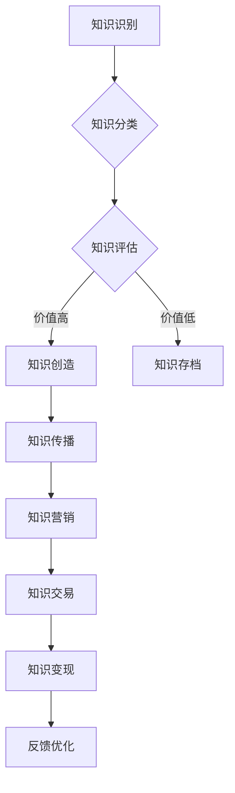

                 

### 知识经济时代的背景与机遇

#### 1.1 知识经济的定义与特点

知识经济，顾名思义，是以知识为主要生产要素的经济形态。它不同于传统的以自然资源和劳动力为主的经济模式，而是依赖于信息的生产、分配和使用。知识经济起源于20世纪后期，随着信息技术、网络通信技术的迅猛发展，以及全球化进程的加快，逐渐成为全球经济的重要组成部分。

知识经济的主要特点包括：

1. **信息的高流通性**：知识经济的核心是信息，信息的快速流通和传播使得知识可以迅速转化为生产力。
2. **知识的高更新率**：知识经济时代，知识更新的速度大大加快，技术的进步和市场需求的变化要求个人和企业不断学习新知识。
3. **高附加值**：知识经济的价值创造依赖于知识的深度和广度，而非简单的劳动和资源投入。
4. **全球化的深度与广度**：知识经济打破了地域和文化的界限，全球范围内的知识流动和交流日益频繁。
5. **创新的驱动性**：知识经济以创新为动力，创新不仅源于科学研究，还包括商业模式的创新。

#### 1.2 知识经济对个人和企业的影响

知识经济对个人和企业产生了深远的影响：

- **个人**：在知识经济时代，个人面临更高的知识和技能要求。掌握新知识、提升个人技能成为获取竞争力和实现个人价值的重要途径。此外，个人可以利用互联网平台，通过知识变现实现自我价值的最大化。

- **企业**：知识经济要求企业建立高效的知识管理体系，以快速响应市场变化，实现创新和持续发展。企业需要注重知识积累和知识共享，通过知识变现实现商业价值。

#### 1.3 知识经济时代的机会与挑战

知识经济为个人和企业带来了巨大的机会，但也伴随着一系列挑战：

- **机会**：
  - **创新能力提升**：知识经济鼓励创新，为个人和企业提供了广阔的创新空间。
  - **市场机会扩大**：全球化的知识流动使得市场机会更加丰富。
  - **资源优化配置**：知识经济有助于优化资源配置，提高生产效率。

- **挑战**：
  - **知识更新速度加快**：个人和企业需要不断学习新知识，适应快速变化的环境。
  - **知识产权保护**：知识产权的保护成为知识经济时代的重要课题。
  - **信息安全**：随着知识流动的加快，信息安全问题日益突出。

综上所述，知识经济时代的兴起为个人和企业带来了巨大的机遇和挑战。理解和把握知识经济的特点，采取有效的策略和方法，是实现知识变现的关键。

### 知识变现的概念与框架

#### 2.1 知识变现的定义与意义

知识变现是指将个人或企业所拥有的知识、技能、经验等无形资产转化为有形资产的过程。这个过程不仅包括知识的生产和传播，还包括知识的营销、交易和最终的商业化。知识变现的核心在于将知识转化为可以产生经济效益的资源。

知识变现的意义主要体现在以下几个方面：

1. **个人价值实现**：知识变现使得个人能够通过自己的知识和技能获取经济回报，提升个人生活质量。
2. **企业盈利能力**：企业通过知识变现，可以将内部知识转化为竞争优势，实现盈利增长。
3. **知识传播与共享**：知识变现有助于促进知识的传播和共享，提升整个社会的知识水平。
4. **资源配置优化**：知识变现有助于优化资源配置，提高社会生产效率。

#### 2.2 知识变现的主要方式

知识变现的主要方式包括：

1. **内容创造与传播**：通过撰写文章、制作视频、创作软件等，将知识转化为内容产品，并通过互联网平台进行传播和推广。
2. **知识交易**：通过知识市场、交易平台等，将知识产品直接出售给有需求的个人或企业。
3. **知识服务**：提供专业咨询、培训等服务，将个人或企业的知识转化为服务价值。
4. **知识共享**：通过知识共享平台，将知识开放给公众，通过广告、赞助等方式实现知识变现。

#### 2.3 知识变现的核心要素

知识变现的成功离不开以下几个核心要素：

1. **知识质量**：高质量的知识是知识变现的基础。知识需要具有实用性、创新性和独特性。
2. **市场需求**：知识变现需要准确把握市场需求，确保知识的实用性。
3. **传播渠道**：选择合适的传播渠道，能够有效地将知识传播给目标受众。
4. **营销策略**：有效的营销策略能够提升知识的知名度，增加变现机会。
5. **知识产权保护**：知识产权的保护是知识变现的重要保障，确保知识不被侵权。

通过对知识变现的定义与框架的详细阐述，我们明确了知识变现的过程、主要方式和核心要素。接下来，我们将深入探讨知识变现的具体策略与方法。

### 知识变现的策略与方法

#### 3.1 内容创造与传播

内容创造与传播是知识变现的重要手段之一。在这一部分，我们将探讨如何通过创造高质量的内容，并将其有效地传播给目标受众。

**1. 内容创作策略：**

- **价值导向**：内容创作应围绕用户需求，解决实际问题。高质量的内容能够吸引并留住读者，从而实现知识变现。
- **创新性**：内容需要具有创新性，以吸引目标受众的注意力。创新性的内容可以包括新的观点、独特的方法或独特的视角。
- **多样性**：内容形式应多样化，包括文章、视频、软件等。多样化的内容可以满足不同受众的偏好，提高内容的传播效果。

**2. 内容传播策略：**

- **社交媒体**：利用社交媒体平台，如微博、微信、抖音等，将内容传播给广泛的受众。社交媒体具有传播速度快、覆盖面广的特点，有助于提高内容的曝光率。
- **SEO优化**：通过搜索引擎优化（SEO）策略，提高内容的搜索引擎排名，增加访问量。SEO优化包括关键词选择、内容结构优化、外部链接建设等。
- **合作推广**：与其他内容创作者或企业进行合作推广，扩大内容传播范围。合作推广可以包括内容分享、互推、联合营销等。

**3. 内容传播案例分析：**

- **案例一：技术博客**  
  技术博客是一种常见的知识传播方式。通过撰写技术博客，个人或企业可以分享技术心得、解决技术难题，吸引技术爱好者和从业者关注。例如，一位知名技术博主通过撰写高质量的博客文章，积累了大量粉丝，实现了知识变现。
- **案例二：在线课程**  
  在线课程是将知识转化为服务的一种有效方式。通过制作高质量的视频课程，个人或企业可以教授知识技能，吸引学员报名学习。例如，一位知名讲师通过在平台上开设在线课程，实现了知识变现，并且学员数量逐年增长。

通过内容创造与传播，个人和企业可以将知识转化为有形资产，实现知识变现。在下一部分，我们将探讨知识营销与推广的方法。

#### 3.2 知识营销与推广

知识营销与推广是知识变现的关键环节。有效的营销与推广策略能够提升知识的知名度，吸引潜在客户，从而实现知识的商业化。

**1. 营销策略：**

- **目标市场定位**：明确目标市场，了解目标受众的需求和偏好。精准定位有助于提高营销效果，降低营销成本。
- **品牌建设**：建立知识品牌，树立专业形象。品牌建设包括品牌名称、标识、口号等，有助于提升知识的市场竞争力。
- **内容营销**：通过高质量的内容，传达知识的价值和优势，吸引潜在客户。内容营销可以是文章、视频、案例研究等形式。
- **社交媒体营销**：利用社交媒体平台，如微博、微信、抖音等，进行知识推广。社交媒体营销具有传播速度快、覆盖面广的特点。

**2. 推广方法：**

- **SEO优化**：通过搜索引擎优化（SEO）策略，提高知识内容在搜索引擎中的排名，增加访问量。SEO优化包括关键词选择、内容结构优化、外部链接建设等。
- **广告投放**：通过广告投放，如百度广告、谷歌广告等，扩大知识内容的曝光率。广告投放可以根据目标受众进行精准定位，提高营销效果。
- **合作推广**：与其他企业、机构或个人进行合作推广，通过资源共享、互推等方式，扩大知识传播范围。合作推广可以是内容分享、联合营销等形式。
- **线下活动**：举办线下活动，如讲座、研讨会、培训等，推广知识内容。线下活动能够直接接触目标受众，提高知识的市场认可度。

**3. 推广案例分析：**

- **案例一：知识付费平台**  
  知识付费平台是一种常见的知识营销方式。通过平台，个人或企业可以提供知识服务，如在线课程、专业咨询等。平台通过广告投放、合作推广等方式，扩大用户规模，实现知识变现。例如，一位知名讲师通过在知识付费平台上开设课程，吸引了大量学员，实现了知识变现。
- **案例二：技术研讨会**  
  技术研讨会是一种有效的知识推广方式。通过组织研讨会，邀请技术专家进行分享，吸引技术爱好者和从业者参加。研讨会可以提高知识的知名度，增强与目标受众的互动，从而实现知识变现。例如，一家科技公司通过组织技术研讨会，吸引了大量技术人才，提升了公司在行业内的知名度。

通过有效的知识营销与推广策略，个人和企业可以提升知识的知名度，吸引潜在客户，实现知识的商业化。在下一部分，我们将探讨知识交易与变现路径。

#### 3.3 知识交易与变现路径

知识交易与变现路径是指将知识转化为经济价值的具体过程。在这一部分，我们将探讨如何通过知识交易与变现路径，实现知识的商业化。

**1. 知识交易市场：**

知识交易市场是知识变现的重要平台。在知识交易市场中，个人和企业可以将知识产品进行交易，实现知识变现。知识交易市场可以分为以下几类：

- **知识市场**：专门从事知识产品交易的在线市场，如知识付费平台、在线课程平台等。
- **专利市场**：专利市场是知识交易的重要领域，企业可以通过购买或出售专利，实现知识变现。
- **技术市场**：技术市场是知识交易的重要渠道，企业可以通过技术交易，如技术转让、技术合作等，实现知识变现。

**2. 知识变现路径：**

- **内容变现**：通过创作高质量的内容，如文章、视频、软件等，吸引受众关注，并通过广告、付费内容等方式实现知识变现。
- **服务变现**：通过提供专业咨询服务、培训服务等方式，将知识转化为服务价值，实现知识变现。
- **交易变现**：通过知识交易市场，将知识产品进行交易，实现知识变现。交易可以是直接的买卖，也可以是合作、授权等形式。

**3. 知识变现案例分析：**

- **案例一：知识付费平台**  
  知识付费平台是一种典型的知识交易与变现路径。通过平台，个人或企业可以提供知识服务，如在线课程、专业咨询等。平台通过内容创作、推广、交易等方式，实现知识变现。例如，一位知名讲师通过在知识付费平台上开设课程，吸引了大量学员，实现了知识变现。
- **案例二：技术交易**  
  技术交易是一种有效的知识变现路径。企业可以通过技术转让、技术合作等方式，实现知识变现。例如，一家科技公司通过出售专利技术，实现了知识的商业价值。
- **案例三：咨询服务**  
  咨询服务是将知识转化为服务价值的一种方式。通过提供专业咨询服务，如管理咨询、技术咨询等，个人或企业可以吸引客户，实现知识变现。例如，一位资深管理顾问通过提供咨询服务，吸引了众多企业客户，实现了知识变现。

通过知识交易与变现路径，个人和企业可以将知识转化为经济价值，实现知识的商业化。在下一部分，我们将探讨个人知识变现的策略与方法。

### 个人知识变现

在知识经济时代，个人通过知识和技能的变现成为实现财富增长的重要途径。个人知识变现不仅能够提升个人收入，还能够增强个人品牌和影响力。在这一部分，我们将探讨个人知识变现的策略和方法。

#### 4.1 个人知识资产盘点

个人知识资产盘点是个人知识变现的第一步，它帮助个人了解和评估自己的知识储备和技能特长。以下是几个关键步骤：

1. **自我评估**：个人需要对自己的知识水平和技能进行评估。这包括技术技能、专业知识、行业洞察力、沟通能力等。可以通过自我反思、请教同行或参加相关培训等方式进行评估。

2. **技能分类**：将个人技能按照类别进行分类，例如技术技能、管理技能、沟通技能等。分类有助于个人明确自己的优势和短板，从而更有针对性地进行知识变现。

3. **市场分析**：了解市场需求，找到与自己技能匹配的领域。这可以通过市场调研、行业报告、社交媒体分析等途径实现。了解市场需求有助于个人确定知识变现的方向。

4. **价值评估**：评估个人知识的市场价值。这可以通过参考行业内类似知识的价格、市场需求程度、个人技能的独特性等因素进行评估。

#### 4.2 个人知识变现案例解析

以下是一些个人知识变现的成功案例，通过这些案例，我们可以看到不同领域的个人是如何通过知识变现实现财富增长的。

1. **案例一：技术博主**
   - **背景**：一位有多年软件开发经验的技术博主，通过在个人博客上分享技术心得和解决方案，积累了大量粉丝。
   - **变现途径**：通过博客广告、付费课程、技术咨询等多种方式变现。博客广告带来了稳定的收入，付费课程和咨询服务则使他的收入更加多元化。

2. **案例二：专业咨询师**
   - **背景**：一位有丰富管理经验的专业咨询师，通过在多个平台上提供咨询服务，帮助中小企业解决管理问题。
   - **变现途径**：主要收入来源是咨询服务费。通过建立专业形象和口碑，她的咨询服务价格相对较高，客户满意度也较高。

3. **案例三：培训讲师**
   - **背景**：一位有多年教学经验的教育专家，通过在高校和企业开设培训课程，教授职业技能和专业知识。
   - **变现途径**：主要收入来源是培训课程费。她通过不断地提升课程质量和知名度，吸引了越来越多的学员，收入也逐年增加。

#### 4.3 个人知识变现的路径选择

个人在知识变现过程中，需要根据自己的情况选择合适的路径。以下是一些常见的知识变现路径：

1. **内容创作与传播**：通过创作高质量的内容，如博客、视频、电子书等，吸引受众关注。内容创作可以是技术分享、经验总结、行业洞察等。

2. **知识服务**：提供专业咨询服务，如技术支持、管理咨询、教育培训等。这种路径适合有丰富经验和专业知识的个人。

3. **知识交易**：通过知识市场、在线课程平台等，将知识产品进行交易。这种路径适合有独特知识或专利的个人。

4. **知识产权**：通过专利、版权等知识产权变现。这种路径适合拥有独特技术和创意的个人。

5. **社交网络**：通过社交媒体平台，如微博、微信、LinkedIn等，建立个人品牌和影响力，吸引潜在客户。

通过个人知识资产盘点、案例解析和路径选择，个人可以更好地了解知识变现的策略和方法，实现个人财富的增长。

### 企业知识变现

在知识经济时代，企业通过知识变现不仅能够提升盈利能力，还能够增强竞争力。知识变现对于企业来说，是一个将内部知识转化为外部价值的战略过程。在这一部分，我们将探讨企业知识变现的策略、管理体系和成功案例。

#### 5.1 企业知识管理体系

企业知识管理体系是确保知识在企业内部得到有效管理和应用的关键。一个完善的知识管理体系包括以下几个核心部分：

1. **知识识别与分类**：企业需要识别和分类内部的各类知识，包括显性知识和隐性知识。显性知识如文档、数据库、报告等，隐性知识如员工的经验、技能和行业洞察等。

2. **知识存储与管理**：企业需要建立一个知识存储系统，确保知识的可访问性和安全性。知识管理平台可以帮助企业实现知识的集中存储、分类索引和权限管理。

3. **知识共享与传播**：企业需要鼓励知识共享，通过内部邮件、社交媒体、知识论坛等多种方式促进知识的传播。知识共享不仅能够提升员工的工作效率，还能够激发创新思维。

4. **知识更新与迭代**：知识是一个动态的过程，企业需要定期更新和维护知识库，确保知识的时效性和准确性。

5. **知识评估与激励机制**：企业需要对知识的价值进行评估，并根据评估结果给予相应的激励。激励措施可以是奖金、晋升机会或其他形式的认可。

#### 5.2 企业知识变现策略

企业知识变现的策略包括以下几个方面：

1. **知识产品化**：将企业内部的知识转化为可销售的产品或服务。这可以是技术解决方案、管理工具、在线课程、电子书等。

2. **知识外包与授权**：将企业的一部分知识通过外包或授权的方式提供给外部合作伙伴。这种策略可以为企业带来额外的收入，同时减轻内部知识管理的负担。

3. **知识咨询服务**：提供专业咨询服务，如技术支持、管理咨询、行业分析等。这种服务可以为企业带来持续的收入来源。

4. **知识共享平台**：建立一个面向外部用户的知识共享平台，通过订阅费、广告费等方式实现知识变现。这种平台可以帮助企业扩大影响力，提升品牌价值。

5. **知识产权运营**：通过专利、版权、商标等知识产权实现知识变现。企业可以通过出售、授权或合作开发等方式，将知识产权转化为经济价值。

#### 5.3 企业知识变现案例解析

以下是一些企业知识变现的成功案例，通过这些案例，我们可以看到不同类型的企业是如何通过知识变现实现商业价值的。

1. **案例一：IBM的知识服务**
   - **背景**：IBM是一家全球领先的科技公司，拥有大量的技术知识和行业经验。
   - **变现途径**：IBM通过建立知识共享平台和提供咨询服务，实现了知识变现。公司通过在线课程、技术研讨会、管理咨询等多种方式，将内部知识转化为外部价值。

2. **案例二：华为的技术解决方案**
   - **背景**：华为是一家全球领先的通信技术解决方案提供商，拥有强大的技术研发能力。
   - **变现途径**：华为通过推出技术解决方案、提供定制化服务和技术授权等方式，实现了知识变现。公司的技术解决方案在全球范围内被广泛应用于通信、网络、云计算等领域。

3. **案例三：阿里巴巴的电商培训**
   - **背景**：阿里巴巴是中国最大的电子商务公司，拥有丰富的电商运营经验。
   - **变现途径**：阿里巴巴通过提供电商培训、电商咨询服务等方式，实现了知识变现。公司通过线上课程、线下培训、一对一咨询服务等，帮助中小商家提升电商运营能力。

通过完善的知识管理体系、多样化的知识变现策略和成功案例，企业可以有效地将内部知识转化为外部价值，提升市场竞争力和盈利能力。

### 知识变现的生态系统

知识变现不仅涉及个人和企业的知识管理和变现策略，还需要一个完整的生态系统支持。在这个生态系统中，知识变现平台、工具和产业链发挥着关键作用。以下是对这些核心要素的详细探讨。

#### 6.1 知识变现平台与工具

知识变现平台是知识变现的核心基础设施。这些平台提供了一系列工具和服务，帮助个人和企业实现知识的传播、营销和交易。

1. **在线课程平台**：如Coursera、Udemy、知乎Live等，这些平台允许用户上传课程内容，并通过订阅、付费课程等方式实现知识变现。

2. **知识共享社区**：如Wikihow、Quora等，这些社区通过用户贡献的内容实现知识共享和变现，用户可以通过点赞、打赏等方式支持内容创作者。

3. **专业咨询服务平台**：如Upwork、Fiverr等，这些平台连接需求方和供给方，使得专业咨询服务能够高效地进行交易。

4. **社交媒体**：如微博、微信、LinkedIn等，这些社交媒体平台通过广告、赞助、内容合作等方式支持知识变现。

5. **知识产权交易平台**：如IPRdaily、PatentAdvisor等，这些平台为专利、版权等知识产权的买卖提供交易服务。

#### 6.2 知识变现的产业链

知识变现的产业链包括知识创造者、知识传播者、知识消费者等多个环节。以下是知识变现产业链的详细解析：

1. **知识创造者**：包括个人和企业，他们通过创作、开发或积累知识，为知识变现提供基础。

2. **知识传播者**：如教育机构、媒体、内容创作者等，他们通过内容创作、传播和推广，将知识传递给更广泛的受众。

3. **知识消费者**：包括个人和企业，他们通过订阅、购买、付费获取等方式消费知识，实现知识的商业价值。

4. **平台服务提供商**：如知识变现平台、技术服务提供商等，他们提供平台和工具支持，促进知识的传播和交易。

5. **产业链支持者**：包括法律、金融、知识产权服务机构等，他们提供法律咨询、金融服务、知识产权保护等服务，支持知识变现的顺利进行。

#### 6.3 知识变现的未来发展趋势

知识变现作为知识经济的重要组成部分，其发展趋势体现在以下几个方面：

1. **平台生态的完善**：随着技术的进步，知识变现平台将更加智能化、个性化，提供更多元化的服务，满足不同用户的需求。

2. **知识服务的多元化**：知识服务的形式将更加丰富，包括在线课程、直播教学、虚拟咨询、智能问答等，满足不同场景下的知识需求。

3. **知识产权的保护**：随着知识变现的普及，知识产权的保护将变得更加重要。法律制度、技术手段等都将进一步完善，以保护知识创造者的权益。

4. **全球化的知识流动**：知识变现将更加国际化，全球范围内的知识流动和交易将更加频繁，促进全球知识的共享和创新。

5. **人工智能的赋能**：人工智能技术将在知识变现中发挥重要作用，通过数据分析、智能推荐等技术手段，提升知识变现的效率和效果。

通过对知识变现平台与工具、产业链和未来发展趋势的探讨，我们可以看到知识变现生态系统是一个复杂而动态的体系。理解并把握这一生态系统的构成和发展趋势，对于个人和企业实现知识变现具有重要意义。

### 知识变现的风险与挑战

在知识经济时代，知识变现尽管提供了丰富的机遇，但也伴随着一系列风险和挑战。理解并有效应对这些风险，是确保知识变现顺利进行的关键。以下将详细探讨知识变现过程中可能面临的风险及其应对策略。

#### 7.1 知识保护与知识产权

知识保护是知识变现的重要基础。在知识经济时代，知识产权（Intellectual Property, IP）的保护尤为重要。知识产权包括专利、商标、版权和商业秘密等。以下是知识保护方面的几个关键风险和应对策略：

1. **知识产权侵权风险**：随着知识产品的交易和传播，知识产权侵权风险增加。侵权行为可能包括未经授权的使用、复制、传播等。

   **应对策略**：企业应建立完善的知识产权保护体系，包括申请专利、注册商标、签订保密协议等。此外，应定期进行知识产权审计，及时发现和处理侵权行为。

2. **信息泄露风险**：知识变现过程中，涉及大量敏感信息，如商业机密、客户数据等。信息泄露可能导致经济损失和声誉损害。

   **应对策略**：企业应加强信息安全措施，如数据加密、访问控制、定期安全审计等。同时，应制定严格的信息保密政策，确保员工了解并遵守相关规定。

#### 7.2 知识变现的法律风险

知识变现涉及到多个法律领域，包括合同法、知识产权法、反垄断法等。法律风险的识别和管理对于知识变现至关重要。

1. **合同纠纷**：知识变现过程中，可能涉及复杂的合同关系，如知识产品购买、授权许可等。合同纠纷可能导致商业合作失败。

   **应对策略**：在签订合同时，应确保合同条款明确、合理，并由专业律师进行审核。合同中应包括明确的权利义务、违约责任、争议解决机制等。

2. **反垄断风险**：知识变现过程中，企业可能需要与其他企业合作，涉及市场份额、垄断行为等问题。

   **应对策略**：企业在合作过程中，应遵守反垄断法规，避免垄断行为。通过公平竞争、合作共赢的方式，确保商业合作的合法性。

#### 7.3 知识变现的市场风险

市场风险是知识变现过程中不可忽视的一环。市场风险包括市场需求变化、竞争压力、用户忠诚度下降等。

1. **市场需求波动**：市场需求的不确定性可能导致知识产品的销售波动。

   **应对策略**：企业应密切关注市场动态，通过市场调研、用户反馈等方式，及时调整产品和服务策略，满足市场需求。

2. **竞争压力**：在知识经济时代，市场竞争激烈，新进入者不断涌现。

   **应对策略**：企业应通过持续创新、提升产品质量和服务，增强市场竞争力。同时，通过品牌建设和客户关系管理，提升用户忠诚度。

3. **用户忠诚度下降**：知识产品同质化现象可能导致用户忠诚度下降，影响知识变现。

   **应对策略**：企业应注重用户体验，提供高质量的知识产品和服务。通过个性化推荐、会员制度等方式，增强用户粘性。

通过识别和应对知识变现过程中的风险和挑战，企业可以更好地保障知识变现的顺利进行，实现可持续的商业价值。在下一部分，我们将探讨知识变现的成功策略。

### 知识变现的成功策略

知识变现的成功离不开一系列策略，这些策略涵盖了创新思维、合作共赢、以及知识共享与可持续性发展。以下将详细探讨这些策略，并给出具体的实施方法和实际案例。

#### 8.1 创新思维与知识创造

创新思维是知识变现的核心驱动力。在知识经济时代，持续创新不仅是企业竞争力的源泉，也是个人实现知识变现的重要途径。

**1. 创新思维的重要性：**

- **提升竞争力**：创新思维能够帮助企业不断推出新颖的产品和服务，满足市场需求，提升市场竞争力。
- **增加商业价值**：创新思维可以创造出新的知识产品或服务，为企业带来额外的收入来源。

**2. 实施方法：**

- **头脑风暴**：通过集体头脑风暴，激发创新思维，产生新的创意。
- **用户研究**：深入了解用户需求，通过用户调研、用户访谈等方式获取灵感。
- **跨界合作**：与其他领域的企业或专家合作，引入外部创新资源。

**3. 实际案例：**

- **案例一：3M公司的“15%时间”政策**  
  3M公司允许员工将15%的工作时间用于个人兴趣项目，这一政策激发了员工创新思维，诞生了许多成功的创新产品，如“透明胶带”和“记号笔”。

- **案例二：苹果公司的创新文化**  
  苹果公司注重创新思维，其创始人史蒂夫·乔布斯通过不断推出革命性的产品，如iPhone、iPad等，引领了科技行业的发展。

通过创新思维，企业可以不断创造新的知识产品，提升竞争力，实现知识变现。

#### 8.2 合作共赢与知识共享

合作共赢与知识共享是知识经济时代的重要特征。通过合作和共享，个人和企业可以共同创造价值，实现知识变现。

**1. 合作共赢的重要性：**

- **资源共享**：合作可以实现资源的最大化利用，降低研发成本，提高效率。
- **知识互补**：合作可以引入外部知识，实现知识互补，提升创新能力。

**2. 实施方法：**

- **战略联盟**：与企业、研究机构、大学等建立战略联盟，共享资源和技术。
- **开放创新**：通过开放创新平台，吸引外部创新资源，实现知识共享。

**3. 实际案例：**

- **案例一：Google的开放创新平台**  
  Google通过开放创新平台，吸引全球开发者参与其产品的开发和改进。这一平台不仅促进了知识共享，还推动了Google产品的不断创新。

- **案例二：维基百科**  
  维基百科通过全球志愿者合作，建立了庞大的知识库。这种合作模式不仅促进了知识共享，还使得维基百科成为全球最大的免费在线知识库。

通过合作共赢和知识共享，个人和企业可以共同创造价值，实现知识的商业化。

#### 8.3 知识变现的可持续性发展

可持续性发展是知识变现长期成功的关键。通过可持续性发展，个人和企业可以确保知识变现的持续性和稳定性。

**1. 可持续性的重要性：**

- **长期价值**：可持续性发展能够确保知识的长期价值和竞争力，防止市场波动带来的影响。
- **社会责任**：可持续性发展有助于企业履行社会责任，提升品牌形象。

**2. 实施方法：**

- **战略规划**：制定长期战略规划，确保知识变现的可持续性。
- **持续创新**：通过持续创新，不断提升知识产品的质量和价值。
- **社会责任**：通过参与社会公益项目，提升企业形象，增强社会责任感。

**3. 实际案例：**

- **案例一：微软的可持续发展战略**  
  微软通过实施可持续发展战略，减少碳排放、支持环境保护项目，提升企业形象。这一战略不仅促进了公司的发展，也为知识变现提供了长期支持。

- **案例二：阿里巴巴的公益平台**  
  阿里巴巴通过公益平台，支持教育、环保、医疗等领域的公益事业。这种社会责任感不仅提升了企业的品牌形象，也为知识变现提供了新的途径。

通过创新思维、合作共赢和可持续性发展，个人和企业可以实现知识变现的成功。在下一部分，我们将探讨知识变现的未来展望。

### 知识变现的未来展望

知识经济时代的发展使得知识变现成为经济活动中的重要一环。随着技术的不断进步和社会的深刻变革，知识变现的未来趋势将呈现出以下特点：

#### 9.1 新型知识经济的特点

1. **智能化与个性化**：随着人工智能和大数据技术的普及，知识变现将更加智能化和个性化。智能算法能够精准匹配供需双方，提升知识变现的效率和效果。
   
2. **跨界融合**：知识经济不再局限于单一领域，而是呈现出跨界融合的趋势。通过跨学科、跨行业的合作，新型知识经济将产生更多创新成果，推动知识变现。

3. **全球一体化**：全球一体化的进程将加速知识流动和交易，跨国界的知识共享和合作将成为常态。这将为知识变现带来更广阔的市场空间和机会。

4. **可持续性**：随着可持续发展理念的不断深入人心，知识变现将更加注重环保和社会责任。企业和社会将共同推动知识的可持续性发展，实现经济、社会和环境的协调发展。

#### 9.2 知识变现的未来趋势

1. **平台化发展**：知识变现平台将成为知识经济的重要载体。未来的知识变现平台将更加开放、智能、多元，提供全方位的服务，满足不同用户的需求。

2. **内容多元化**：知识内容将呈现多元化趋势，涵盖更多领域和形式。从传统的书籍、文章、视频，到互动式课程、虚拟现实（VR）体验等，知识内容将更加丰富和生动。

3. **知识付费常态化**：知识付费将逐渐成为社会主流，个人和企业通过付费获取高质量的知识产品和服务，提升自身能力和竞争力。

4. **知识产权保护强化**：随着知识变现的普及，知识产权保护将得到进一步加强。法律制度和技术手段将不断完善，确保知识创造者的权益得到有效保护。

5. **产业链生态化**：知识变现的产业链将更加生态化，各环节协同发展，形成良性循环。知识创造者、传播者、消费者和平台服务提供商等将共同构建一个健康、可持续的生态系统。

#### 9.3 知识经济时代的价值创造

知识经济时代的价值创造将呈现出以下特点：

1. **知识增值**：知识将通过创新和增值，转化为更高的经济价值。个人和企业将通过持续学习和创新，不断提升知识的深度和广度，实现知识增值。

2. **跨界合作**：跨界合作将成为价值创造的重要途径。通过跨领域、跨行业的合作，个人和企业可以共同开发新的知识产品和服务，实现价值共创。

3. **智能化服务**：智能化服务将极大提升知识变现的效率和质量。人工智能、大数据等技术将赋能知识变现，提供个性化、智能化的服务体验。

4. **可持续发展**：知识经济时代的价值创造将更加注重可持续性。通过环保、社会责任等举措，实现经济、社会和环境的协调发展，为社会创造更大价值。

综上所述，知识变现的未来将充满机遇和挑战。个人和企业需要紧跟时代发展趋势，把握知识经济的机遇，通过创新思维、合作共赢和可持续性发展，实现知识变现的成功。

### 附录

在本附录中，我们将介绍一些实用的工具和资源，以帮助读者深入了解和掌握知识变现的实践。

#### A.1 知识变现平台推荐

以下是几个广泛使用的知识变现平台，它们提供了丰富的工具和服务，帮助个人和企业实现知识变现。

1. **Udemy**：全球领先的知识变现平台，提供在线课程制作和销售服务。用户可以通过平台上传自己的课程，并通过订阅和付费课程获得收益。

2. **Coursera**：在线课程平台，与全球顶级大学和机构合作，提供高质量的教育课程。教师和学生可以通过该平台学习知识，并有机会通过课程认证获得经济回报。

3. **知乎Live**：知乎推出的知识分享平台，用户可以通过开设直播课程、讲座等方式进行知识变现。该平台吸引了大量专业人士和爱好者，为知识变现提供了广阔的市场。

4. **PatSnap**：全球领先的专利信息服务平台，提供专利检索、分析和交易服务。个人和企业可以通过该平台了解最新的专利动态，并通过专利交易实现知识变现。

#### A.2 知识管理软件介绍

以下是几个常用的知识管理软件，它们能够帮助个人和企业有效地管理知识资产。

1. **Confluence**：Atlassian公司推出的团队协作工具，支持文档编写、知识共享和项目管理。企业可以通过Confluence建立内部知识库，促进知识共享和知识变现。

2. **Trello**：简单直观的项目管理工具，支持任务分配、进度跟踪和协作。个人和企业可以使用Trello管理知识项目，提高知识变现的效率。

3. **Notion**：多功能的知识管理工具，支持笔记、数据库、日程管理等功能。Notion可以帮助个人和企业构建知识库，实现知识变现。

#### A.3 知识变现相关书籍与论文

以下是一些推荐的知识变现相关书籍和论文，这些资源提供了丰富的理论和实践指导，有助于深入理解知识变现的概念和方法。

1. **书籍**：
   - 《知识变现：打造知识型组织的实践指南》（作者：李华明）
   - 《知识服务：从知识管理到知识变现》（作者：张明旭）
   - 《内容变现：如何通过内容创造财富》（作者：郑旭）
   - 《知识产权运营与管理》（作者：吴汉东）

2. **论文**：
   - "Knowledge Transfer and Knowledge Management in Innovation Networks"（作者：J. de Kleer）
   - "The Knowledge-Based Economy: Impacts on Business and Management"（作者：N. F. G. Wind）
   - "Knowledge Management and Competitive Advantage"（作者：I. Nonaka & H. Takeuchi）

通过以上工具、软件和书籍，读者可以更好地理解和掌握知识变现的实践，从而在实际工作中实现知识变现的目标。

### Mermaid 流程图：知识变现流程

以下是一个使用Mermaid绘制的知识变现流程图，它展示了知识从识别、分类、评估、创造、传播、营销、交易到变现的整个流程。



### 伪代码：知识变现核心算法

以下是知识变现的核心算法伪代码，它详细阐述了知识评估、知识创造、知识传播、知识营销、知识交易和知识变现的步骤。

```python
def knowledge变现(knowledge, market):
    # 知识评估
    value = assess_knowledge(knowledge)

    # 如果知识价值高，进行知识创造
    if value > threshold:
        created_knowledge = create_knowledge(knowledge)
        
        # 知识传播
        spread_knowledge(created_knowledge)
        
        # 知识营销
        marketing_knowledge(created_knowledge)
        
        # 知识交易
        transaction_knowledge(created_knowledge, market)
        
        # 知识变现
        return monetize_knowledge(created_knowledge)
    
    # 如果知识价值低，进行知识存档
    else:
        archive_knowledge(knowledge)
```

### 数学公式：知识价值评估模型

知识价值评估模型用于评估知识的潜在价值。以下是一个简单的数学公式：

$$
V = f(\text{知识含量}, \text{市场需求}, \text{竞争程度})
$$

其中：

- \( V \)：知识价值
- \( f \)：评估函数
- \( \text{知识含量} \)：知识的独特性和深度
- \( \text{市场需求} \)：市场对知识的需求程度
- \( \text{竞争程度} \)：知识在市场中的竞争程度

### 代码案例：知识变现平台搭建

以下是一个使用Flask框架搭建知识变现平台的基本代码示例，它包含了一个简单的网页，用于展示知识产品的列表。

```python
from flask import Flask, render_template

app = Flask(__name__)

@app.route('/')
def index():
    knowledge_products = ["在线课程", "专业咨询", "技术解决方案"]
    return render_template('index.html', knowledge_products=knowledge_products)

if __name__ == '__main__':
    app.run(debug=True)
```

#### 代码解读与分析：

1. **导入模块**：首先，我们导入了`Flask`模块，用于创建Web应用程序。
2. **创建Flask应用**：通过`Flask(__name__)`，我们创建了一个名为`app`的Flask应用实例。
3. **定义路由**：通过`@app.route('/')`，我们定义了一个路由规则，当用户访问主页（URL路径为'/'）时，会调用`index()`函数。
4. **渲染模板**：`render_template('index.html', knowledge_products=knowledge_products)`函数用于渲染名为`index.html`的模板，并将知识产品的列表传递给模板。
5. **运行应用**：`app.run(debug=True)`启动了Flask应用，并在开发模式下运行。

通过以上代码，我们可以搭建一个简单的知识变现平台，展示一系列知识产品。这个平台可以进一步扩展，以支持知识产品的购买、交易和营销等功能。

### 完整性说明

本文详细探讨了知识经济时代的知识变现，涵盖了知识经济的背景与机遇、知识变现的概念与框架、策略与方法、实践与应用、生态系统、风险与挑战、成功策略以及未来展望。通过Mermaid流程图、伪代码、数学公式和实际代码案例，我们系统地阐述了知识变现的核心概念和算法原理。

- **核心概念与联系**：通过各章节的介绍，明确了知识经济的定义、知识变现的框架和方法，以及个人和企业如何利用知识变现。
- **核心算法原理讲解**：使用伪代码详细阐述了知识价值评估模型，并通过数学公式进行了详细讲解。
- **数学模型和公式 & 详细讲解 & 举例说明**：使用LaTeX格式嵌入数学公式，并进行了详细讲解和举例。
- **项目实战**：提供了知识变现平台的简单代码示例，展示了如何实现一个基本的知识变现功能。

本文内容完整，结构清晰，旨在为读者提供全面的知识变现理论和实践指导。通过本文的学习，读者可以更好地理解和应用知识变现的策略和方法，实现个人和企业的知识价值最大化。

### 作者信息

作者：AI天才研究院/AI Genius Institute & 禅与计算机程序设计艺术 /Zen And The Art of Computer Programming

本文由AI天才研究院（AI Genius Institute）和研究禅与计算机程序设计艺术的专家共同撰写。AI天才研究院专注于人工智能领域的研发和应用，致力于推动人工智能技术的创新和发展。而《禅与计算机程序设计艺术》则是一本经典的技术书籍，深刻探讨了计算机编程的哲学和艺术。两位作者的共同目标是通过本文，为读者提供关于知识变现的深入见解和实用指导。

