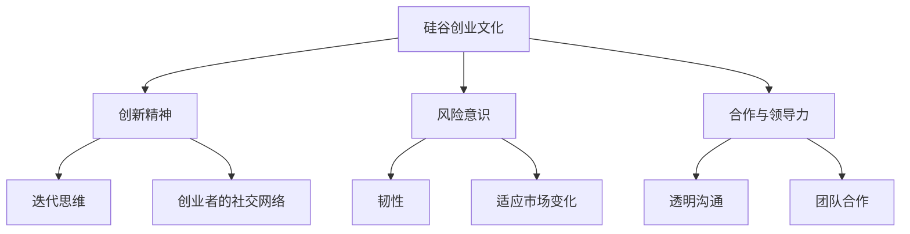
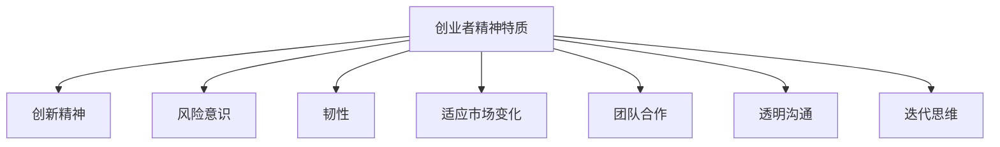

                 

# 引言

### 硅谷创业文化：车库到独角兽

硅谷，这个位于美国加利福尼亚州的小小区域，被誉为全球科技创新的圣地。从车库诞生的小公司，到如今市值万亿的独角兽企业，硅谷的创业文化在全球范围内产生了深远的影响。本文将带领读者深入探讨硅谷创业文化的起源、发展，以及独角兽企业的案例分析，最后总结创业实践中的启示和未来展望。

## 关键词

- 硅谷创业文化
- 独角兽企业
- 创新精神
- 风险意识
- 创业者特质
- 成功案例

## 摘要

本文将从多个角度解析硅谷创业文化的核心要素，探讨其如何塑造了众多独角兽企业的崛起。通过分析硅谷创业者的精神特质、创业项目的启动与成长路径，以及独角兽企业的战略规划与运营，本文旨在为读者提供一个全面、系统的硅谷创业文化解读。同时，通过对创业实践中的成功与失败案例的剖析，为创业者提供有益的启示和借鉴。

### 第一部分：硅谷创业文化概述

#### 第1章：硅谷创业文化的起源与发展

### 1.1 硅谷的地理背景与历史演变

硅谷地处美国加利福尼亚州旧金山湾区南部，得益于其得天独厚的地理优势，逐渐成为全球科技创新的集聚地。硅谷的起源可以追溯到20世纪50年代，当时一批来自美国的科技专家和工程师在此地聚集，开始创业和研发新技术。

**关键词：**地理背景、历史演变、科技专家、工程师、集聚地

### 1.2 硅谷创业文化的核心要素

硅谷创业文化的核心要素包括创新精神、风险意识、合作与领导力。创新精神鼓励创业者不断探索未知领域，敢于尝试新思路；风险意识使创业者能够在面对市场波动和不确定性时保持冷静和果断；合作与领导力则强调团队合作和领导者的重要性。

**关键词：**创新精神、风险意识、合作、领导力

### 1.3 硅谷创业文化对全球的影响

硅谷创业文化不仅对美国本土产生了深远影响，更在全球范围内产生了广泛影响。众多创业者将硅谷的创业模式、创新精神、风险意识等理念带到世界各地，推动了全球范围内的科技创新和创业浪潮。

**关键词：**全球影响、创业模式、创新精神、风险意识

#### 第2章：硅谷创业者的精神特质

### 2.1 创业者的风险意识与创新精神

硅谷创业者普遍具有强烈的风险意识，他们勇于冒险，敢于面对失败。在硅谷，创业者视失败为成功的必经之路，这种冒险精神与创新精神相结合，使得硅谷成为全球创新的源头。

**关键词：**风险意识、冒险精神、创新精神、成功之路

### 2.2 硅谷创业者的思维模式

硅谷创业者的思维模式独具特色，他们善于用系统思维和迭代思维来解决问题。系统思维使他们能够从整体上把握问题，找到最佳解决方案；迭代思维则使他们能够快速试错，不断优化产品。

**关键词：**系统思维、迭代思维、解决问题、最佳解决方案

### 2.3 创业者的团队合作与领导力

团队合作是硅谷创业文化的重要组成部分，创业者深知团队的力量。他们注重团队建设，培养领导力，确保团队高效协同。同时，领导者要具备远见和执行力，能够引领团队走向成功。

**关键词：**团队合作、领导力、团队建设、远见、执行力

#### 第3章：硅谷创业项目的启动与成长

### 3.1 从想法到产品：初创公司的第一步

初创公司从零到一的关键在于将创意转化为实际产品。硅谷创业者注重市场调研，找到用户痛点，快速构建产品原型，然后通过迭代优化，逐步推出完善的产品。

**关键词：**想法、创意、市场调研、用户痛点、产品原型、迭代优化

### 3.2 资金筹集与投资人关系

资金是初创公司发展的关键，硅谷创业者擅长通过多种途径筹集资金，包括天使投资、风险投资、政府补贴等。他们与投资人建立良好的关系，确保资金链的稳定。

**关键词：**资金筹集、天使投资、风险投资、政府补贴、投资人关系

### 3.3 硅谷创业项目的成长路径

硅谷创业项目的成长路径通常分为三个阶段：初创期、成长期、成熟期。初创期注重产品研发和市场定位；成长期注重融资和扩张；成熟期注重品牌建设和国际化发展。

**关键词：**初创期、成长期、成熟期、产品研发、市场定位、融资、扩张、品牌建设、国际化发展

### 第二部分：独角兽企业的案例分析

#### 第4章：硅谷独角兽企业的典型代表

### 4.1 字节跳动：从内容平台到全球科技巨头

字节跳动以其独特的算法和内容推荐系统，迅速崛起为全球科技巨头。从早期的今日头条到如今的抖音、TikTok，字节跳动凭借强大的技术实力和用户洞察力，成功转型为多元化内容平台。

**关键词：**字节跳动、内容平台、算法、推荐系统、全球科技巨头、技术实力、用户洞察力

### 4.2 特斯拉：新能源汽车与能源革命的引领者

特斯拉不仅推动了新能源汽车的发展，更是能源革命的重要推动者。通过创新的电池技术和智能驾驶系统，特斯拉成功颠覆了传统汽车行业，成为全球新能源汽车的领导者。

**关键词：**特斯拉、新能源汽车、能源革命、电池技术、智能驾驶、传统汽车行业

### 4.3 网易：互联网娱乐与媒体的创新者

网易以游戏和电子邮件业务起家，逐步拓展到新闻、教育、电商等多个领域。凭借强大的技术创新和内容运营能力，网易在互联网娱乐和媒体领域独树一帜。

**关键词：**网易、游戏、电子邮件、新闻、教育、电商、技术创新、内容运营

#### 第5章：独角兽企业的战略规划与运营

### 5.1 独角兽企业的商业模式创新

独角兽企业凭借独特的商业模式，实现持续增长。它们善于利用大数据、云计算等技术手段，优化资源配置，提高运营效率。

**关键词：**商业模式创新、大数据、云计算、资源配置、运营效率

### 5.2 独角兽企业的市场定位与竞争策略

独角兽企业在市场定位和竞争策略上具有前瞻性。它们准确把握市场趋势，以用户需求为导向，制定差异化竞争策略。

**关键词：**市场定位、竞争策略、市场趋势、用户需求、差异化

### 5.3 独角兽企业的国际化发展

独角兽企业注重国际化发展，通过并购、合作等方式，拓展海外市场。它们在全球范围内打造品牌影响力，提升国际竞争力。

**关键词：**国际化发展、并购、合作、海外市场、品牌影响力、国际竞争力

#### 第6章：硅谷创业文化的传承与创新

### 6.1 硅谷创业文化的新趋势

硅谷创业文化不断演变，新趋势包括生态系统的完善、创业者素质的提升、技术创新的加速等。这些趋势将继续推动硅谷创业文化的传承与创新。

**关键词：**硅谷创业文化、新趋势、生态系统、创业者素质、技术创新

### 6.2 中国创业环境的变迁与硅谷创业文化的融合

中国创业环境在近年来发生了显著变化，与硅谷创业文化的融合日益紧密。中国创业者借鉴硅谷的创新精神、风险意识等理念，推动中国创业事业的发展。

**关键词：**中国创业环境、变迁、硅谷创业文化、创新精神、风险意识、创业事业

### 6.3 硅谷创业文化的未来展望

硅谷创业文化将继续发挥全球影响力，推动全球科技创新和创业浪潮。未来，硅谷创业文化将更加注重可持续发展、社会责任等议题，为世界带来更多创新成果。

**关键词：**硅谷创业文化、全球影响力、科技创新、创业浪潮、可持续发展、社会责任

### 第三部分：创业实践与启示

#### 第7章：硅谷创业文化的实践经验分享

### 7.1 硅谷创业者的亲身经历与感悟

硅谷创业者的亲身经历和感悟是宝贵的财富。他们分享了自己的创业故事、失败教训、成功经验，为后来者提供了宝贵的参考。

**关键词：**硅谷创业者、亲身经历、感悟、创业故事、失败教训、成功经验

### 7.2 硅谷创业项目的成功与失败案例分析

通过成功与失败案例的分析，创业者可以更好地理解硅谷创业文化的核心要素。成功案例展示了如何抓住机遇、创新思维、高效执行；失败案例则揭示了创业过程中可能遇到的陷阱和挑战。

**关键词：**成功案例、失败案例、机遇、创新思维、高效执行、陷阱、挑战

### 7.3 硅谷创业文化的传承与发扬

硅谷创业文化的传承与发扬是创业者的重要使命。通过举办创业大赛、创业论坛、创业培训等活动，创业者可以将硅谷创业文化的精髓传播给更多人，激发全球创业热情。

**关键词：**传承、发扬、创业大赛、创业论坛、创业培训、全球创业热情

#### 第8章：从车库到独角兽的创业启示

### 8.1 创业者的必备素质与能力

创业者的必备素质与能力包括创新精神、风险意识、团队协作能力、沟通能力等。这些素质和能力是创业者成功的关键。

**关键词：**创业者、素质、能力、创新精神、风险意识、团队协作、沟通能力

### 8.2 创业过程中的挑战与应对策略

创业过程中充满挑战，包括市场不确定性、资金短缺、团队冲突等。创业者需要具备应对策略，如灵活调整战略、优化资源配置、增强团队凝聚力等。

**关键词：**创业过程、挑战、市场不确定性、资金短缺、团队冲突、应对策略、战略调整、资源配置、团队凝聚力

### 8.3 硅谷创业文化的借鉴与落地

硅谷创业文化的成功经验值得借鉴。中国创业者可以从硅谷创业文化的核心要素中汲取营养，结合本土市场环境，实现创业梦想。

**关键词：**硅谷创业文化、借鉴、本土市场、创业梦想

#### 第9章：总结与展望

### 9.1 硅谷创业文化的核心价值

硅谷创业文化的核心价值在于创新精神、风险意识、团队合作等。这些价值观是创业者取得成功的基石。

**关键词：**硅谷创业文化、核心价值、创新精神、风险意识、团队合作、成功基石

### 9.2 硅谷创业文化的全球影响力

硅谷创业文化在全球范围内产生了深远影响，推动全球科技创新和创业浪潮。未来，硅谷创业文化将继续引领全球创业潮流。

**关键词：**全球影响力、科技创新、创业浪潮、引领、全球创业潮流

### 9.3 中国创业者如何借鉴硅谷创业文化

中国创业者可以借鉴硅谷创业文化的核心要素，结合本土市场环境，实现创业梦想。通过加强创新、优化团队协作、提升风险意识等，中国创业者可以在全球创业舞台上崭露头角。

**关键词：**中国创业者、借鉴、硅谷创业文化、本土市场、创业梦想、创新、团队协作、风险意识、全球创业舞台

### 附录

#### 附录 A: 硅谷创业资源与工具集

### A.1 硅谷投资机构介绍

- **红杉资本**：全球领先的风险投资机构，硅谷创业公司的重要支持者。
- **安德森·霍洛维茨基金**：专注于B轮以后的创业公司投资，帮助企业实现快速增长。
- **真格基金**：由徐小平创办，投资范围覆盖多个领域，注重创业团队的潜力。

### A.2 创业者必备的在线工具与服务

- **Asana**：项目管理和团队协作工具。
- **Trello**：基于看板的项目管理工具。
- **Slack**：团队沟通工具。
- **GitHub**：版本控制和代码托管平台。
- **Trello**：基于看板的任务管理工具。

### A.3 硅谷创业社群与活动推荐

- **TechCrunch Disrupt**：全球知名的科技创业大会。
- **Silicon Valley Forum**：硅谷最大的创业者论坛。
- **Startup Week**：全球性的创业活动周。

#### 附录 B: 硅谷创业文化核心概念与联系

### B.1 硅谷创业文化架构图

### B.2 创业者精神特质分析图

#### 附录 C: 硅谷创业项目实战案例

### C.1 创业项目启动与发展的实际步骤

- **市场调研**：了解目标市场和潜在用户需求。
- **产品原型开发**：快速构建可测试的产品原型。
- **产品迭代**：根据用户反馈进行产品迭代。
- **融资**：寻找合适的投资人，进行资金筹集。
- **市场推广**：制定市场推广策略，增加产品知名度。
- **团队建设**：招募团队成员，建立有效的团队结构。

### C.2 成功创业项目的核心要素分析

- **创新性产品**：解决用户痛点，具有独特性。
- **高效的团队**：成员互补，具备执行力。
- **市场定位**：明确目标市场，精准定位。
- **融资策略**：合理分配资金，确保可持续发展。
- **用户反馈**：重视用户反馈，持续优化产品。

### C.3 创业失败案例分析及反思

- **案例1：创业项目失败原因分析**
  - 市场需求不足：产品未能解决用户痛点。
  - 融资不足：资金链断裂，项目无法继续。
  - 团队管理不善：成员沟通不畅，效率低下。

- **反思与启示**
  - 深入市场调研，确保市场需求。
  - 优化融资策略，确保资金充足。
  - 建立高效的团队管理机制，提升团队效率。

### 作者信息

作者：AI天才研究院/AI Genius Institute & 禅与计算机程序设计艺术 /Zen And The Art of Computer Programming

