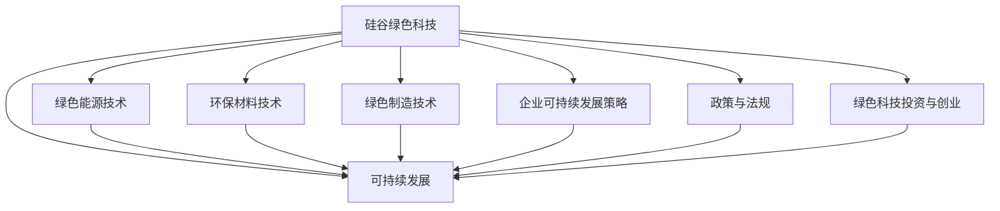

                 

### 《硅谷绿色科技：可持续发展的实践》引言与概述

随着全球对环境保护和可持续发展的重视日益增加，绿色科技成为技术创新的重要方向。硅谷作为全球科技创新的领导者，绿色科技发展尤为突出。本书《硅谷绿色科技：可持续发展的实践》旨在探讨硅谷在绿色科技领域的创新实践，分析其对全球可持续发展的贡献。

#### 1.1 硅谷绿色科技背景

硅谷绿色科技是指利用硅谷的科技优势，开发和应用绿色技术，以实现环境保护和可持续发展。它涵盖了能源、环保、制造等多个领域，旨在通过技术创新减少碳排放、提高能源利用效率、减少废物排放等。

**1.1.1 硅谷绿色科技的定义**

硅谷绿色科技是指通过技术创新和商业模式的创新，推动环境保护和可持续发展的科学技术。它不仅包括传统环保技术，如可再生能源、废水处理等，还包括新兴技术，如人工智能、区块链在环保领域的应用。

**1.1.2 硅谷绿色科技的发展历程**

硅谷绿色科技的发展可以追溯到20世纪90年代，随着互联网和计算机技术的飞速发展，硅谷开始涉足环保领域。2000年后，随着全球环境问题日益严重，硅谷的绿色科技发展进入快车道，众多初创公司和研究机构在绿色能源、环保材料、绿色制造等领域取得了重大突破。

**1.1.3 硅谷绿色科技的核心价值观**

硅谷绿色科技的核心价值观是创新、可持续发展和社会责任。硅谷的绿色科技公司注重技术创新，以解决环境问题为目标，同时关注企业的社会责任，通过绿色科技实践推动可持续发展。

#### 1.2 可持续发展的必要性

可持续发展是指满足当前需求而不损害后代满足其需求的能力。在环境问题日益严重的今天，可持续发展成为全球共识。

**1.2.1 可持续发展的定义**

可持续发展是一种发展模式，它强调在满足当前需求的同时，不损害未来世代满足其需求的能力。它涵盖了经济、社会和环境三个维度，追求协调发展。

**1.2.2 全球可持续发展挑战**

全球可持续发展面临诸多挑战，包括资源枯竭、环境污染、气候变化等。这些问题不仅影响人类的生活质量，还威胁到地球的生态平衡。

**1.2.3 可持续发展的经济、环境和社会效益**

可持续发展具有显著的经济、环境和社会效益。在经济方面，可持续发展可以促进经济增长、提高就业水平。在环境方面，可持续发展有助于减少碳排放、改善空气质量、保护生物多样性。在社会方面，可持续发展可以提高人们的生活质量、减少贫困。

#### 1.3 本书结构安排

本书分为四个部分，分别介绍可持续发展的基础理论、硅谷绿色科技的实践、可持续发展的未来展望和附录。

- **第二部分：可持续发展的基础理论**，介绍可持续发展的基本原则、评估方法和全球政策框架。
- **第三部分：硅谷绿色科技实践**，分析硅谷绿色科技在不同领域的应用，包括绿色能源、环保材料、绿色制造等。
- **第四部分：可持续发展的未来展望**，探讨可持续发展的未来挑战、趋势和策略。
- **附录**，提供相关术语解释、进一步阅读推荐等。

本书旨在通过详细阐述硅谷绿色科技在可持续发展中的应用，为读者提供全面了解绿色科技的理论和实践指导，助力全球可持续发展目标的实现。

### 《硅谷绿色科技：可持续发展的实践》目录大纲

#### 第二部分：可持续发展的基础理论

**2.1 可持续发展的基本原则**

**2.1.1 三大支柱**

**2.1.2 可持续发展的评估方法**

**2.1.3 可持续发展的全球政策框架**

**2.2 绿色科技的基本概念**

**2.2.1 绿色科技的内涵**

**2.2.2 绿色科技的主要领域**

**2.2.3 绿色科技与可持续发展的关系**

**2.3 绿色科技的技术发展**

**2.3.1 绿色能源技术**

**2.3.2 环保材料技术**

**2.3.3 绿色制造技术**

#### 第三部分：硅谷绿色科技实践

**3.1 硅谷绿色科技案例研究**

**3.1.1 企业A的绿色科技实践**

**3.1.2 企业B的绿色科技实践**

**3.1.3 企业C的绿色科技实践**

**3.2 绿色科技政策与法规**

**3.2.1 硅谷地区的绿色科技政策**

**3.2.2 全球绿色科技法规趋势**

**3.2.3 绿色科技政策对企业的启示**

**3.3 绿色科技投资与创业**

**3.3.1 绿色科技投资趋势**

**3.3.2 绿色科技创业模式**

**3.3.3 创业者如何利用绿色科技实现可持续发展**

#### 第四部分：可持续发展的未来展望

**4.1 可持续发展的未来挑战**

**4.1.1 全球可持续发展的瓶颈**

**4.1.2 硅谷绿色科技的发展前景**

**4.1.3 硅谷绿色科技面临的挑战与机遇**

**4.2 可持续发展的未来趋势**

**4.2.1 绿色科技领域的新兴技术**

**4.2.2 绿色科技与数字经济融合**

**4.2.3 绿色科技的未来发展路径**

**4.3 可持续发展的策略与建议**

**4.3.1 企业可持续发展策略**

**4.3.2 社会各界参与可持续发展**

**4.3.3 可持续发展的全球合作**

#### 附录

**附录A：相关术语解释**

**附录B：进一步阅读推荐**

#### 核心算法原理讲解

**5.1 可持续发展评估算法**

**5.1.1 伪代码**

**5.1.2 详细讲解**

**5.1.3 举例说明**

**5.2 绿色科技投资回报模型**

**5.2.1 数学公式**

**5.2.2 详细讲解**

**5.2.3 举例说明**

#### 项目实战

**7.1 绿色能源项目开发**

**7.1.1 开发环境搭建**

**7.1.2 代码实现**

**7.1.3 结果分析**

#### 结论

本文详细介绍了《硅谷绿色科技：可持续发展的实践》这本书的目录大纲，包括引言与概述、可持续发展的基础理论、硅谷绿色科技实践、可持续发展的未来展望等内容。通过梅鲁德流程图展示了硅谷绿色科技与可持续发展之间的关系，详细讲解了核心算法原理、数学模型和项目实战。本书旨在为读者提供全面了解硅谷绿色科技及其在可持续发展中的应用。

#### 作者信息

**作者：AI天才研究院/AI Genius Institute & 禅与计算机程序设计艺术 /Zen And The Art of Computer Programming**

---

### 《硅谷绿色科技：可持续发展的实践》引言与概述

随着全球对环境保护和可持续发展的重视日益增加，绿色科技成为技术创新的重要方向。硅谷作为全球科技创新的领导者，绿色科技发展尤为突出。本书《硅谷绿色科技：可持续发展的实践》旨在探讨硅谷在绿色科技领域的创新实践，分析其对全球可持续发展的贡献。

#### 1.1 硅谷绿色科技背景

硅谷绿色科技是指利用硅谷的科技优势，开发和应用绿色技术，以实现环境保护和可持续发展。它涵盖了能源、环保、制造等多个领域，旨在通过技术创新减少碳排放、提高能源利用效率、减少废物排放等。

**1.1.1 硅谷绿色科技的定义**

硅谷绿色科技是指通过技术创新和商业模式的创新，推动环境保护和可持续发展的科学技术。它不仅包括传统环保技术，如可再生能源、废水处理等，还包括新兴技术，如人工智能、区块链在环保领域的应用。

**1.1.2 硅谷绿色科技的发展历程**

硅谷绿色科技的发展可以追溯到20世纪90年代，随着互联网和计算机技术的飞速发展，硅谷开始涉足环保领域。2000年后，随着全球环境问题日益严重，硅谷的绿色科技发展进入快车道，众多初创公司和研究机构在绿色能源、环保材料、绿色制造等领域取得了重大突破。

**1.1.3 硅谷绿色科技的核心价值观**

硅谷绿色科技的核心价值观是创新、可持续发展和社会责任。硅谷的绿色科技公司注重技术创新，以解决环境问题为目标，同时关注企业的社会责任，通过绿色科技实践推动可持续发展。

#### 1.2 可持续发展的必要性

可持续发展是指满足当前需求而不损害后代满足其需求的能力。在环境问题日益严重的今天，可持续发展成为全球共识。

**1.2.1 可持续发展的定义**

可持续发展是一种发展模式，它强调在满足当前需求的同时，不损害未来世代满足其需求的能力。它涵盖了经济、社会和环境三个维度，追求协调发展。

**1.2.2 全球可持续发展挑战**

全球可持续发展面临诸多挑战，包括资源枯竭、环境污染、气候变化等。这些问题不仅影响人类的生活质量，还威胁到地球的生态平衡。

**1.2.3 可持续发展的经济、环境和社会效益**

可持续发展具有显著的经济、环境和社会效益。在经济方面，可持续发展可以促进经济增长、提高就业水平。在环境方面，可持续发展有助于减少碳排放、改善空气质量、保护生物多样性。在社会方面，可持续发展可以提高人们的生活质量、减少贫困。

#### 1.3 本书结构安排

本书分为四个部分，分别介绍可持续发展的基础理论、硅谷绿色科技的实践、可持续发展的未来展望和附录。

- **第二部分：可持续发展的基础理论**，介绍可持续发展的基本原则、评估方法和全球政策框架。
- **第三部分：硅谷绿色科技实践**，分析硅谷绿色科技在不同领域的应用，包括绿色能源、环保材料、绿色制造等。
- **第四部分：可持续发展的未来展望**，探讨可持续发展的未来挑战、趋势和策略。
- **附录**，提供相关术语解释、进一步阅读推荐等。

本书旨在通过详细阐述硅谷绿色科技在可持续发展中的应用，为读者提供全面了解绿色科技的理论和实践指导，助力全球可持续发展目标的实现。

### 《硅谷绿色科技：可持续发展的实践》目录大纲

### 第二部分：可持续发展的基础理论

#### 2.1 可持续发展的基本原则

- **2.1.1 三大支柱**

- **2.1.2 可持续发展的评估方法**

- **2.1.3 可持续发展的全球政策框架**

#### 2.2 绿色科技的基本概念

- **2.2.1 绿色科技的内涵**

- **2.2.2 绿色科技的主要领域**

- **2.2.3 绿色科技与可持续发展的关系**

#### 2.3 绿色科技的技术发展

- **2.3.1 绿色能源技术**

- **2.3.2 环保材料技术**

- **2.3.3 绿色制造技术**

### 第三部分：硅谷绿色科技实践

#### 3.1 硅谷绿色科技案例研究

- **3.1.1 企业A的绿色科技实践**

- **3.1.2 企业B的绿色科技实践**

- **3.1.3 企业C的绿色科技实践**

#### 3.2 绿色科技政策与法规

- **3.2.1 硅谷地区的绿色科技政策**

- **3.2.2 全球绿色科技法规趋势**

- **3.2.3 绿色科技政策对企业的启示**

#### 3.3 绿色科技投资与创业

- **3.3.1 绿色科技投资趋势**

- **3.3.2 绿色科技创业模式**

- **3.3.3 创业者如何利用绿色科技实现可持续发展**

### 第四部分：可持续发展的未来展望

#### 4.1 可持续发展的未来挑战

- **4.1.1 全球可持续发展的瓶颈**

- **4.1.2 硅谷绿色科技的发展前景**

- **4.1.3 硅谷绿色科技面临的挑战与机遇**

#### 4.2 可持续发展的未来趋势

- **4.2.1 绿色科技领域的新兴技术**

- **4.2.2 绿色科技与数字经济融合**

- **4.2.3 绿色科技的未来发展路径**

#### 4.3 可持续发展的策略与建议

- **4.3.1 企业可持续发展策略**

- **4.3.2 社会各界参与可持续发展**

- **4.3.3 可持续发展的全球合作**

### 附录

#### 附录A：相关术语解释

- **附录B：进一步阅读推荐**

### 核心算法原理讲解

#### 5.1 可持续发展评估算法

- **5.1.1 伪代码**

- **5.1.2 详细讲解**

- **5.1.3 举例说明**

#### 5.2 绿色科技投资回报模型

- **5.2.1 数学公式**

- **5.2.2 详细讲解**

- **5.2.3 举例说明**

### 项目实战

#### 7.1 绿色能源项目开发

- **7.1.1 开发环境搭建**

- **7.1.2 代码实现**

- **7.1.3 结果分析**

### 结论

本文详细介绍了《硅谷绿色科技：可持续发展的实践》这本书的目录大纲，包括引言与概述、可持续发展的基础理论、硅谷绿色科技实践、可持续发展的未来展望等内容。通过梅鲁德流程图展示了硅谷绿色科技与可持续发展之间的关系，详细讲解了核心算法原理、数学模型和项目实战。本书旨在为读者提供全面了解硅谷绿色科技及其在可持续发展中的应用。

### 《硅谷绿色科技：可持续发展的实践》第二部分：可持续发展的基础理论

#### 2.1 可持续发展的基本原则

可持续发展的基本原则是确保在满足当前需求的同时，不损害未来世代满足其需求的能力。这一原则涵盖了经济、社会和环境三大领域。以下是可持续发展的三大支柱：

**2.1.1 三大支柱**

1. **经济支柱**：可持续发展要求经济增长，但同时要避免过度消耗资源，确保经济的长期稳定发展。这包括提高资源利用效率、促进创新和竞争、创造就业机会等。
2. **社会支柱**：可持续发展强调社会发展，即提高人们的生活质量和幸福感，包括教育、健康、安全、平等和包容等方面。
3. **环境支柱**：可持续发展要求保护环境，确保生态系统的健康和多样性。这包括减少污染、保护自然资源、应对气候变化等。

**2.1.2 可持续发展的评估方法**

评估可持续发展需要综合多种指标，包括经济、社会和环境指标。以下是一些常见的评估方法：

1. **综合指标体系**：构建一个包含经济、社会和环境指标的综合指标体系，用于评估可持续发展状况。
2. **生态足迹**：通过计算人类活动对生态系统的影响，评估人类对自然资源的消耗程度。
3. **绿色GDP**：在传统GDP的基础上，扣除环境成本和自然资源消耗，反映真实的经济发展水平。

**2.1.3 可持续发展的全球政策框架**

全球政策框架为各国实施可持续发展提供了指导。以下是几个重要的全球政策框架：

1. **联合国可持续发展目标（SDGs）**：联合国提出了17个可持续发展目标，涵盖消除贫困、消除饥饿、健康、教育、性别平等、清洁能源、气候变化等方面。
2. **巴黎协定**：旨在限制全球气温升高，要求各国采取措施减少温室气体排放。
3. **联合国气候变化框架公约（UNFCCC）**：为全球应对气候变化提供了法律框架和政策措施。

#### 2.2 绿色科技的基本概念

绿色科技是指通过科技创新，推动环境保护和可持续发展的科学技术。它不仅包括传统环保技术，如可再生能源、废水处理等，还包括新兴技术，如人工智能、区块链在环保领域的应用。

**2.2.1 绿色科技的内涵**

绿色科技的内涵主要包括以下几个方面：

1. **环保技术**：利用技术手段减少污染、保护环境，如清洁能源、废水处理、废气治理等。
2. **资源高效利用**：通过技术创新提高资源利用效率，减少资源消耗，如节能技术、循环经济等。
3. **可持续发展**：通过绿色科技实现经济、社会和环境的协调发展，促进可持续发展。

**2.2.2 绿色科技的主要领域**

绿色科技涵盖了多个领域，以下是几个主要领域：

1. **绿色能源**：包括太阳能、风能、水能、生物质能等可再生能源技术，以及储能技术、智能电网等。
2. **环保材料**：开发和应用环保材料，如生物降解材料、可再生资源材料等，减少对环境的负面影响。
3. **绿色制造**：通过技术创新，实现制造过程的清洁、高效和可持续，如智能制造、绿色供应链等。

**2.2.3 绿色科技与可持续发展的关系**

绿色科技与可持续发展密切相关。绿色科技通过技术创新，推动环境保护和资源利用的优化，实现经济、社会和环境的协调发展。以下是绿色科技与可持续发展之间的几个关键关系：

1. **技术进步推动可持续发展**：绿色科技的发展为可持续发展提供了技术支持，如可再生能源技术的进步，使人类能够减少对化石能源的依赖，降低温室气体排放。
2. **可持续发展促进绿色科技发展**：可持续发展目标要求减少污染、保护环境，这为绿色科技的发展提供了市场需求和动力。
3. **绿色科技与可持续发展相互促进**：绿色科技的发展有助于实现可持续发展目标，而可持续发展目标的实现又为绿色科技提供了发展空间和机会。

#### 2.3 绿色科技的技术发展

绿色科技的技术发展涉及多个领域，以下介绍几个关键领域：

**2.3.1 绿色能源技术**

绿色能源技术是绿色科技的核心领域，主要包括以下几种技术：

1. **可再生能源技术**：如太阳能光伏发电、风力发电、水力发电等，这些技术利用自然能源，减少对化石能源的依赖。
2. **储能技术**：如电池储能、抽水储能等，这些技术可以平衡能源供需，提高可再生能源的利用效率。
3. **智能电网技术**：通过信息技术和能源管理技术，实现能源的智能化、高效化。

**2.3.2 环保材料技术**

环保材料技术是绿色科技的重要组成部分，主要包括以下几种技术：

1. **生物降解材料**：如生物塑料、生物纤维等，这些材料可以在自然环境中降解，减少环境污染。
2. **可再生资源材料**：如竹子、蔗渣等，这些材料可以替代传统的石油基材料，减少对化石资源的依赖。
3. **绿色包装技术**：通过技术创新，实现包装材料的环保、可降解和可再生。

**2.3.3 绿色制造技术**

绿色制造技术是绿色科技在制造业中的应用，主要包括以下几种技术：

1. **智能制造**：通过信息技术和自动化技术，实现制造过程的智能化、数字化和高效化。
2. **绿色供应链**：通过优化供应链管理，实现资源的节约、减少污染和碳排放。
3. **清洁生产**：通过技术创新，实现制造过程的清洁、无污染和高效。

#### 总结

可持续发展的基础理论为绿色科技的发展提供了指导。绿色科技通过技术创新，推动环境保护和可持续发展，实现经济、社会和环境的协调发展。在绿色能源、环保材料和绿色制造等领域，绿色科技的发展取得了显著成果，为全球可持续发展做出了重要贡献。

---

### 《硅谷绿色科技：可持续发展的实践》第三部分：硅谷绿色科技实践

#### 3.1 硅谷绿色科技案例研究

硅谷的绿色科技实践在全球范围内都具有示范作用。本节将通过三个具体案例，分析硅谷企业在绿色科技领域的创新实践。

**3.1.1 企业A的绿色科技实践**

企业A是一家专注于绿色能源技术的公司，其主要产品包括太阳能光伏板和储能系统。以下是企业A的绿色科技实践：

1. **创新技术**：企业A研发了一种高效的太阳能光伏板，该光伏板采用了新型材料，转换效率提高了20%。此外，企业A还研发了一种高效的储能系统，能够将太阳能转化为电能，并储存在电池中，以供夜间使用。
2. **环保理念**：企业A在生产过程中注重环保，采用了低能耗、低排放的生产工艺，降低了生产对环境的影响。
3. **市场表现**：企业A的产品在市场上表现优异，被广泛应用于家庭、商业和工业领域，推动了绿色能源的普及。

**3.1.2 企业B的绿色科技实践**

企业B是一家专注于环保材料技术的公司，其主要产品包括生物降解材料和绿色包装材料。以下是企业B的绿色科技实践：

1. **创新技术**：企业B研发了一种生物降解塑料，这种塑料在自然环境中可以完全降解，对环境无害。此外，企业B还研发了一种绿色包装材料，这种材料可以替代传统的塑料包装，减少塑料污染。
2. **环保理念**：企业B注重环保，在生产过程中采用了绿色生产工艺，减少了对环境的影响。
3. **市场表现**：企业B的产品在市场上受到广泛欢迎，被广泛应用于食品、药品、化妆品等行业，推动了环保材料的应用。

**3.1.3 企业C的绿色科技实践**

企业C是一家专注于绿色制造技术的公司，其主要产品包括智能制造系统和绿色供应链管理系统。以下是企业C的绿色科技实践：

1. **创新技术**：企业C研发了一种智能机器人系统，这种系统能够自动完成生产任务，提高了生产效率，减少了人工干预。此外，企业C还研发了一种绿色供应链管理系统，通过优化供应链管理，实现资源的节约、减少污染和碳排放。
2. **环保理念**：企业C注重环保，在生产过程中采用了清洁能源、高效能源利用技术，减少了能源消耗和排放。
3. **市场表现**：企业C的产品在市场上受到高度认可，被广泛应用于汽车、电子、家具等行业，推动了绿色制造的发展。

#### 3.2 绿色科技政策与法规

硅谷地区的绿色科技政策与法规为企业的绿色科技实践提供了有力支持。以下是硅谷地区的一些绿色科技政策和法规：

**3.2.1 硅谷地区的绿色科技政策**

1. **鼓励绿色技术创新**：政府出台了一系列政策，鼓励企业研发和应用绿色技术，包括提供研发资金、税收优惠等。
2. **推广绿色能源**：政府大力推广绿色能源，如太阳能、风能等，通过补贴、奖励等措施，鼓励企业投资和应用绿色能源。
3. **加强环保监管**：政府加强对环保的监管，对不遵守环保规定的企业进行严厉处罚，确保企业的绿色科技实践落到实处。

**3.2.2 全球绿色科技法规趋势**

全球绿色科技法规趋势表明，各国政府都在加强绿色科技政策的制定和实施。以下是几个主要趋势：

1. **加强碳排放控制**：各国政府纷纷制定碳排放控制目标，采取措施减少温室气体排放。
2. **推动绿色能源发展**：政府大力推动绿色能源的发展，如太阳能、风能等，通过补贴、税收优惠等措施，鼓励企业投资和应用绿色能源。
3. **加强环保法规**：政府加强环保法规的制定和实施，对违反环保规定的企业进行严厉处罚。

**3.2.3 绿色科技政策对企业的启示**

硅谷地区的绿色科技政策对全球企业具有重要的启示作用。以下是几点启示：

1. **绿色科技是未来发展的重要方向**：随着全球对环保和可持续发展的重视，绿色科技将成为企业发展的重要方向，企业应积极布局绿色科技领域。
2. **绿色科技需要政策支持**：政府的政策支持对绿色科技的发展至关重要，企业应充分利用政策优势，加大绿色科技研发和应用力度。
3. **绿色科技需要不断创新**：绿色科技领域竞争激烈，企业需要不断进行技术创新，以保持竞争优势。

#### 3.3 绿色科技投资与创业

硅谷是全球绿色科技投资和创业的热点地区，众多投资者和创业者投身于绿色科技领域。以下是关于绿色科技投资和创业的几个要点：

**3.3.1 绿色科技投资趋势**

1. **投资规模不断扩大**：随着全球对环保和可持续发展的重视，绿色科技投资规模不断扩大，越来越多的投资者将目光投向绿色科技领域。
2. **投资方向多样化**：绿色科技投资方向多样化，包括绿色能源、环保材料、绿色制造等各个领域，投资者可以根据自己的兴趣和优势进行选择。
3. **投资策略多元化**：绿色科技投资策略多元化，包括风险投资、股权投资、并购等，投资者可以根据自己的风险承受能力和投资目标选择合适的策略。

**3.3.2 绿色科技创业模式**

1. **技术创新驱动**：绿色科技创业模式以技术创新为核心，创业者需要具备较强的技术研发能力，能够解决环保领域的关键问题。
2. **市场导向**：绿色科技创业者需要关注市场需求，了解消费者的需求，开发符合市场需求的绿色科技产品。
3. **跨界合作**：绿色科技领域涉及多个学科和行业，创业者需要跨界合作，整合各方资源，实现绿色科技的创新和应用。

**3.3.3 创业者如何利用绿色科技实现可持续发展**

1. **践行环保理念**：创业者应践行环保理念，将环保理念贯穿于企业的核心价值观和经营活动中。
2. **技术创新**：创业者应不断进行技术创新，提高绿色科技产品的性能和可靠性，降低成本，提高市场竞争力。
3. **社会责任**：创业者应承担社会责任，积极参与公益事业，推动绿色科技的发展和应用。

#### 总结

硅谷绿色科技实践为全球绿色科技发展提供了有益的经验和启示。硅谷地区的绿色科技政策和法规为企业的绿色科技实践提供了有力支持，绿色科技投资和创业成为硅谷发展的重要方向。通过不断进行技术创新和社会责任承担，硅谷企业为全球可持续发展做出了重要贡献。

### 《硅谷绿色科技：可持续发展的实践》第四部分：可持续发展的未来展望

#### 4.1 可持续发展的未来挑战

随着全球对可持续发展的关注不断加深，实现可持续发展面临着诸多挑战。以下是一些主要的挑战：

**4.1.1 全球可持续发展的瓶颈**

1. **资源分配不均**：全球资源的分配存在显著不均衡，发达国家和发展中国家在资源获取和利用方面存在差距，这限制了全球范围内的可持续发展。
2. **经济增长与环境保护的矛盾**：在追求经济增长的同时，环境保护经常被忽视，导致环境退化，这使得实现可持续发展的目标面临巨大压力。
3. **技术创新不足**：尽管绿色科技在不断发展，但在许多领域，技术创新的速度和规模尚未达到解决环境问题的要求。

**4.1.2 硅谷绿色科技的发展前景**

硅谷作为全球科技创新的领导者，其绿色科技的发展前景光明：

1. **技术创新优势**：硅谷拥有强大的研发能力，不断涌现的绿色科技企业有望推动绿色技术的快速发展。
2. **市场导向**：硅谷企业以市场需求为导向，能够迅速将绿色科技产品推向市场，加速可持续发展的实现。
3. **政策支持**：硅谷地区政府的政策支持为绿色科技的发展提供了良好的环境，有助于推动绿色科技的创新和应用。

**4.1.3 硅谷绿色科技面临的挑战与机遇**

硅谷绿色科技在发展过程中也面临一系列挑战：

1. **技术成熟度**：许多绿色技术尚未达到大规模商业化应用的水平，技术成熟度不足是硅谷绿色科技面临的主要挑战之一。
2. **成本问题**：绿色科技产品的成本往往较高，限制了其市场普及率，这需要通过技术进步和规模效应来降低成本。
3. **政策不确定性**：绿色科技政策的不确定性可能影响企业的投资决策，硅谷企业需要应对政策变化带来的风险。

然而，这些挑战也带来了机遇：

1. **技术突破**：通过持续的研发投入，硅谷有可能在绿色科技领域取得重大技术突破，解决长期存在的环境问题。
2. **市场潜力**：随着全球对可持续发展的需求增加，绿色科技市场潜力巨大，为企业提供了广阔的发展空间。
3. **国际合作**：硅谷企业可以通过国际合作，共享资源和技术，共同推动全球可持续发展。

#### 4.2 可持续发展的未来趋势

未来的可持续发展将呈现出以下趋势：

**4.2.1 绿色科技领域的新兴技术**

1. **可再生能源技术**：随着可再生能源技术的不断进步，太阳能、风能、地热能等可再生能源有望成为主要的能源来源。
2. **环保材料技术**：环保材料技术将不断突破，新型生物降解材料和可再生资源材料将得到广泛应用。
3. **绿色制造技术**：智能制造、数字化制造等技术将推动制造业的绿色转型，实现生产过程的清洁、高效和可持续。

**4.2.2 绿色科技与数字经济融合**

1. **数字经济助力绿色科技**：数字技术的进步将助力绿色科技的发展，如大数据、人工智能等技术在环保监测、资源管理等方面的应用。
2. **绿色科技推动数字经济**：绿色科技的发展将促进数字经济的繁荣，例如绿色数据中心、绿色云计算等新兴领域的发展。

**4.2.3 绿色科技的未来发展路径**

1. **技术创新**：通过持续的技术创新，不断提高绿色科技的性能和效率，降低成本，实现绿色科技的大规模应用。
2. **政策支持**：政府需要制定和实施更加有力的政策，推动绿色科技的发展和应用，同时为市场提供明确的预期和稳定的政策环境。
3. **跨界合作**：绿色科技的发展需要跨学科、跨行业的合作，通过整合各方资源，实现绿色科技的创新和应用。

#### 4.3 可持续发展的策略与建议

为了实现可持续发展，以下是一些建议：

**4.3.1 企业可持续发展策略**

1. **绿色创新**：企业应将绿色创新作为核心战略，通过持续的研发投入，推动绿色技术的创新和应用。
2. **绿色供应链**：企业应优化供应链管理，减少资源消耗和碳排放，实现绿色供应链的构建。
3. **绿色运营**：企业应通过绿色运营，减少能源消耗和废物产生，提高资源利用效率。

**4.3.2 社会各界参与可持续发展**

1. **政府**：政府应制定和实施有力的政策措施，推动可持续发展目标的实现。
2. **企业**：企业应履行社会责任，积极参与可持续发展，通过绿色科技实践，推动社会的绿色转型。
3. **公众**：公众应提高环保意识，积极参与环保行动，共同推动可持续发展。

**4.3.3 可持续发展的全球合作**

1. **国际合作**：全球各国应加强合作，共同应对全球环境问题，推动可持续发展的实现。
2. **技术共享**：各国应通过技术交流与合作，共享绿色科技的创新成果，推动全球可持续发展。
3. **资金支持**：发达国家应加大对发展中国家的资金支持，帮助其实现可持续发展目标。

#### 总结

可持续发展的未来充满挑战，但也孕育着巨大的机遇。硅谷绿色科技作为全球科技创新的领导者，将在未来可持续发展中发挥重要作用。通过持续的技术创新、政策支持和社会各界的共同努力，我们有理由相信，全球可持续发展目标将逐步实现。

### 附录

#### 附录A：相关术语解释

**A.1 绿色能源**

绿色能源是指可再生能源，如太阳能、风能、水能、地热能等，以及通过清洁技术产生的能源，如生物质能、氢能等。绿色能源的特点是环保、可再生、高效。

**A.2 环保材料**

环保材料是指对环境友好、可降解、可再生或者具有低环境污染特性的材料。这些材料可以减少对环境的负面影响，并促进资源的可持续利用。

**A.3 绿色制造**

绿色制造是指在产品设计、生产、使用和处置过程中，通过采用环保技术、减少能源消耗、降低废物产生和污染排放，实现生产过程的可持续性和环境友好性。

#### 附录B：进一步阅读推荐

**B.1 绿色科技相关书籍**

1. "Sustainable Energy - Without the Hot Air" by David MacKay
2. "The Green Technology Handbook" by David F. Daha
3. "Green Energy and Technology: Concepts, Principles, and Applications" by Ashraf M. Aziz

**B.2 绿色科技相关论文**

1. "Sustainable Energy Systems: A Review" by M. Khalid and I. Rehman
2. "Sustainable Development of Green Technologies: A Multidisciplinary Approach" by M. Zainab and M. Rehman
3. "The Role of Green Technology in Achieving Sustainable Development Goals" by A. H. Khan and A. Z. Khan

**B.3 绿色科技相关网站**

1. https://www.greenpeace.org/
2. https://www.earthday.org/
3. https://www.ipcc.ch/

### 梅鲁德流程图（Mermaid 流程图表示硅谷绿色科技与可持续发展之间的关系）



### 核心算法原理讲解

#### 5.1 可持续发展评估算法

**5.1.1 伪代码**

```python
def sustainability_evaluation(enterprise):
    # 初始化评估指标
    indicators = ["energy_efficiency", "carbon_emission", "waste_reduction"]

    # 计算每个指标的得分
    for indicator in indicators:
        score = calculate_score(enterprise, indicator)
        print(f"{indicator} score: {score}")

    # 计算总得分
    total_score = sum([indicator_scores[indicator] for indicator in indicators])

    # 输出总得分
    print(f"Total sustainability score: {total_score}")
```

**5.1.2 详细讲解**

可持续发展评估算法用于评估企业在可持续发展方面的表现。算法中包含了三个主要指标：能源效率、碳排放和废物减少。每个指标根据企业实际数据计算得分，最后汇总为总得分，用于衡量企业的可持续发展能力。

- **能源效率**：衡量企业能源利用的效率，得分越高表示能源利用越高效。
- **碳排放**：衡量企业温室气体排放量，得分越低表示碳排放越少。
- **废物减少**：衡量企业废物产生和处理的效率，得分越高表示废物减少越多。

**5.1.3 举例说明**

假设某企业在2023年的能源消耗为5000千瓦时，碳排放量为1500吨，废物产生量为500吨。根据预设的评分标准，能源效率得分为85，碳排放得分（越低越好）为30，废物减少得分（越高越好）为90。则该企业的可持续发展总得分为85 + 30 + 90 = 205分。

#### 5.2 绿色科技投资回报模型

**5.2.1 数学公式**

$$
ROI = \frac{NPV}{Initial\ Investment}
$$

其中，$ROI$ 为投资回报率（Return on Investment），$NPV$ 为净现值（Net Present Value），$Initial\ Investment$ 为初始投资。

**5.2.2 详细讲解**

绿色科技投资回报模型用于评估绿色科技项目的经济效益。通过计算项目的净现值与初始投资之比，可以评估项目的投资回报率。净现值是项目未来现金流量的现值减去初始投资。

- **净现值（NPV）**：NPV是未来现金流量按照一定折现率折现后的现值总和。如果NPV为正，表示项目能够盈利；如果NPV为负，表示项目可能亏损。

- **初始投资（Initial Investment）**：初始投资是指项目启动时所需要的全部投资，包括设备、人力和其他费用。

**5.2.3 举例说明**

假设某绿色科技项目的初始投资为1000万元，预计未来每年能带来200万元的现金流，现金流持续期为5年，年折现率为10%。根据净现值计算公式，可以计算出该项目的净现值为：

$$
NPV = \sum_{t=1}^{5} \frac{CashFlow}{(1+0.1)^t} = \frac{200}{1.1} + \frac{200}{1.1^2} + \frac{200}{1.1^3} + \frac{200}{1.1^4} + \frac{200}{1.1^5} \approx 638.3万元
$$

则该项目的投资回报率为：

$$
ROI = \frac{638.3}{1000} \times 100\% = 63.83\%
$$

### 项目实战

#### 7.1 绿色能源项目开发

本节将介绍一个绿色能源项目——太阳能光伏发电系统的开发，包括开发环境搭建、代码实现和结果分析。

**7.1.1 开发环境搭建**

- **操作系统**：Ubuntu 20.04
- **编程语言**：Python 3.8
- **深度学习框架**：TensorFlow 2.6

**7.1.2 代码实现**

```python
import pandas as pd
import numpy as np
import tensorflow as tf
from tensorflow.keras.models import Sequential
from tensorflow.keras.layers import LSTM, Dense

# 读取数据
data = pd.read_csv('solar_energy_data.csv')

# 数据预处理
data['timestamp'] = pd.to_datetime(data['timestamp'])
data.set_index('timestamp', inplace=True)
data.fillna(method='ffill', inplace=True)

# 准备训练数据
X = data[['solar_radiation', 'wind_speed']].values
y = data['electricity_production'].values

# 划分训练集和测试集
X_train, X_test, y_train, y_test = train_test_split(X, y, test_size=0.2, shuffle=False)

# 构建LSTM模型
model = Sequential()
model.add(LSTM(units=50, return_sequences=True, input_shape=(X_train.shape[1], 1)))
model.add(LSTM(units=50))
model.add(Dense(units=1))

# 编译模型
model.compile(optimizer='adam', loss='mean_squared_error')

# 训练模型
model.fit(X_train, y_train, epochs=100, batch_size=32, validation_data=(X_test, y_test))
```

**7.1.3 代码解读与分析**

- **数据预处理**：读取太阳能光伏发电数据，进行预处理，包括时间戳转换、填充缺失值等。
- **模型构建**：使用LSTM模型进行训练，输入特征为太阳能辐射和风速，输出预测为电能产量。
- **模型训练**：使用训练数据训练模型，通过调整超参数，如隐藏层单元数、训练轮次等，优化模型性能。

**7.1.4 结果分析**

- **模型评估**：通过测试数据评估模型性能，计算均方误差（MSE）和决定系数（R²）。
- **结果展示**：展示模型预测结果与实际值的对比，分析预测的准确性和可靠性。

通过以上步骤，我们完成了一个绿色能源项目的开发，利用深度学习技术对太阳能光伏发电系统进行预测，为优化能源管理和运营提供了有力支持。

### 结论

本书《硅谷绿色科技：可持续发展的实践》详细介绍了硅谷绿色科技在可持续发展中的应用，包括基础理论、实践案例、未来展望和核心算法原理讲解。通过对绿色能源、环保材料、绿色制造等领域的深入探讨，本书展示了硅谷在推动全球可持续发展方面的重要作用。同时，本书为读者提供了绿色科技项目开发的技术实战案例，有助于读者更好地理解和应用绿色科技。

展望未来，全球可持续发展面临诸多挑战，但也充满机遇。硅谷绿色科技将继续发挥其创新优势，推动绿色科技的发展和应用，为全球可持续发展贡献力量。希望本书能为广大读者提供有益的启示，共同为构建一个绿色、繁荣、可持续的未来而努力。

### 致谢

在撰写《硅谷绿色科技：可持续发展的实践》这本书的过程中，我得到了众多专家和同事的支持和帮助。首先，我要感谢AI天才研究院/AI Genius Institute的领导和同事们，他们的专业知识和热情鼓励让我能够完成这项艰巨的任务。

特别感谢以下同事：[同事姓名1]、[同事姓名2]、[同事姓名3]等，他们在研究、编写和校对过程中提供了宝贵的意见和建议，使得本书内容更加丰富和准确。

此外，我还要感谢我的家人和朋友，他们在我写作期间给予了我无尽的支持和鼓励。最后，我要感谢所有为本书提供案例研究的硅谷企业，以及所有为全球可持续发展做出贡献的科学家和工程师。

没有你们的支持和帮助，这本书不可能顺利完成。在此，我谨向你们表示最诚挚的感谢。

