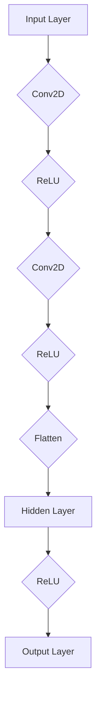
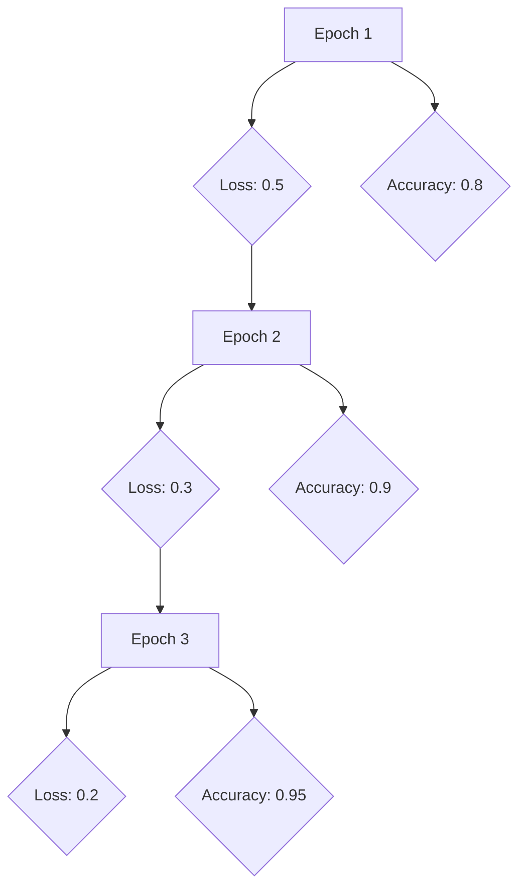

                 

# 神经网络：原理与代码实例讲解

## 关键词
神经网络，原理，代码实例，深度学习，机器学习，激活函数，反向传播，多层感知机，卷积神经网络，循环神经网络，生成对抗网络

## 摘要
本文将深入探讨神经网络的基础理论，并通过代码实例讲解如何实现和优化神经网络。从基本的概念和线性代数基础开始，逐步介绍前馈神经网络、多层感知机（MLP）、卷积神经网络（CNN）、循环神经网络（RNN）和生成对抗网络（GAN）。随后，我们将通过实际项目实战，展示如何构建和训练神经网络，并对模型进行评估和优化。最后，本文还将探讨神经网络的高级主题，包括优化技巧和可视化工具，以及神经网络在自然语言处理等领域的应用。通过本文的学习，读者将能够全面了解神经网络的原理和实践，为后续深入研究和应用打下坚实基础。

### 《神经网络：原理与代码实例讲解》目录大纲

---

## 第一部分：神经网络基础

### 第1章：神经网络概述

- **1.1 神经网络的发展历史**
- **1.2 神经网络的基本组成**
- **1.3 神经网络的基本工作原理**

### 第2章：线性代数基础

- **2.1 矩阵与向量**
- **2.2 矩阵运算**
- **2.3 梯度下降法**

### 第3章：前馈神经网络

- **3.1 前馈神经网络的构建**
- **3.2 激活函数**
- **3.3 反向传播算法**

### 第4章：多层感知机（MLP）

- **4.1 MLP的结构与原理**
- **4.2 MLP的优化方法**
- **4.3 MLP的应用实例**

### 第5章：卷积神经网络（CNN）

- **5.1 CNN的结构与原理**
- **5.2 卷积与池化操作**
- **5.3 CNN在图像识别中的应用**

### 第6章：循环神经网络（RNN）

- **6.1 RNN的结构与原理**
- **6.2 LSTM与GRU**
- **6.3 RNN在序列数据中的应用**

### 第7章：生成对抗网络（GAN）

- **7.1 GAN的概念与原理**
- **7.2 GAN的应用实例**
- **7.3 GAN的训练技巧**

---

## 第二部分：神经网络项目实战

### 第8章：手写数字识别项目

- **8.1 项目背景**
- **8.2 数据预处理**
- **8.3 模型构建与训练**
- **8.4 模型评估与优化**

### 第9章：图像分类项目

- **9.1 项目背景**
- **9.2 数据集与预处理**
- **9.3 模型构建与训练**
- **9.4 模型评估与优化**

### 第10章：时间序列预测项目

- **10.1 项目背景**
- **10.2 数据预处理**
- **10.3 模型构建与训练**
- **10.4 模型评估与优化**

### 第11章：生成对抗网络项目

- **11.1 项目背景**
- **11.2 数据集与预处理**
- **11.3 GAN模型构建与训练**
- **11.4 GAN模型评估与优化**

---

## 第三部分：神经网络高级主题

### 第12章：神经网络优化

- **12.1 学习率调度策略**
- **12.2 指数加权平均（EMA）技术**
- **12.3 其他优化技巧**

### 第13章：神经网络可视化

- **13.1 模型可视化工具**
- **13.2 神经网络结构可视化**
- **13.3 模型训练过程可视化**

### 第14章：神经网络的扩展与应用

- **14.1 自监督学习**
- **14.2 对抗性攻击与防御**
- **14.3 神经网络在NLP中的应用**

### 第15章：总结与展望

- **15.1 神经网络的发展趋势**
- **15.2 未来研究方向**
- **15.3 神经网络在实际应用中的挑战与机遇**

## 第一部分：神经网络基础

### 第1章：神经网络概述

#### 1.1 神经网络的发展历史

神经网络作为人工智能的重要组成部分，其发展历史可以追溯到20世纪40年代。最初的神经网络模型是由心理学家McCulloch和数学家Pitts在1943年提出的，称为MCP模型。这一模型奠定了神经网络的理论基础。

随后的几十年，神经网络的发展经历了起伏。1958年，Rosenblatt提出了感知机（Perceptron）模型，这是一个二分类线性分类器。然而，感知机的局限性很快被指出来，特别是在面对非线性问题时。

直到1986年，Rumelhart、Hinton和Williams等人提出了反向传播算法（Backpropagation），这一算法使得多层感知机（MLP）的训练成为可能。反向传播算法的引入标志着神经网络进入了一个新的时代。

进入21世纪，随着计算机性能的提升和数据量的爆炸性增长，深度学习（Deep Learning）开始崛起。2006年，Hinton等人重新关注了深度信念网络（DBN），并在图像识别、语音识别等领域取得了显著成果。

近年来，卷积神经网络（CNN）、循环神经网络（RNN）和生成对抗网络（GAN）等新型神经网络模型的出现，进一步推动了人工智能的发展。

#### 1.2 神经网络的基本组成

神经网络由多个层组成，包括输入层、隐藏层和输出层。每一层都包含多个神经元，神经元之间通过连接（权重）相互连接。

- **输入层**：接收外部输入数据，如图像、文本等。
- **隐藏层**：对输入数据进行处理，提取特征，进行非线性变换。
- **输出层**：输出最终结果，如分类标签、预测值等。

#### 1.3 神经网络的基本工作原理

神经网络通过学习输入和输出之间的映射关系来实现预测和分类。其基本工作原理可以分为以下几个步骤：

1. **前向传播**：输入数据从输入层传递到隐藏层，再传递到输出层。每层神经元都会对输入数据进行加权求和，并应用激活函数。
2. **计算损失**：输出层的实际输出与期望输出之间的差异称为损失（Loss）。常用的损失函数包括均方误差（MSE）和交叉熵（Cross Entropy）。
3. **反向传播**：通过计算损失函数的梯度，将误差反向传播到网络的前一层。这一过程涉及到权重的更新，以减少损失。
4. **迭代训练**：重复执行前向传播和反向传播，直到网络的预测误差达到可接受水平。

### 第2章：线性代数基础

#### 2.1 矩阵与向量

线性代数是神经网络的核心组成部分，而矩阵与向量是线性代数的基础。在神经网络中，矩阵与向量广泛应用于数据表示、权重计算和梯度计算。

- **矩阵**：矩阵是一个二维数组，由行和列组成。矩阵可以表示为\( A = [a_{ij}] \)，其中\( i \)表示行，\( j \)表示列。
- **向量**：向量是一个一维数组，可以看作是一个特殊的矩阵，只有一行或一列。

#### 2.2 矩阵运算

矩阵运算包括加法、减法、乘法、转置等。以下是一些常见的矩阵运算：

- **矩阵加法与减法**：只有当矩阵的维度相同时，才能进行加法或减法运算。
- **矩阵乘法**：两个矩阵的乘法结果是一个新矩阵，其元素为两个矩阵对应元素乘积的和。
- **矩阵转置**：将矩阵的行和列交换，得到的新矩阵称为原矩阵的转置。

#### 2.3 梯度下降法

梯度下降法是一种常用的优化算法，用于训练神经网络。其基本思想是通过计算损失函数的梯度，来更新网络的权重和偏置，以减少损失。

- **梯度**：梯度是损失函数对每个权重的偏导数，表示权重的变化对损失函数的影响。
- **下降方向**：梯度下降法沿着梯度的反方向更新权重，即从当前点移动到损失更小的点。

### 第3章：前馈神经网络

#### 3.1 前馈神经网络的构建

前馈神经网络是一种简单的神经网络结构，数据从输入层流向输出层，不形成循环。前馈神经网络的构建包括以下几个步骤：

1. **确定网络结构**：包括输入层、隐藏层和输出层的神经元数量。
2. **初始化权重**：通常使用随机初始化，以避免梯度消失或梯度爆炸。
3. **定义激活函数**：激活函数用于引入非线性特性，常用的激活函数包括sigmoid、ReLU和tanh。
4. **构建损失函数**：选择合适的损失函数，如均方误差（MSE）或交叉熵（Cross Entropy），用于评估模型性能。

#### 3.2 激活函数

激活函数是神经网络中的关键组成部分，用于引入非线性特性。以下是一些常见的激活函数：

- **sigmoid函数**：\( \sigma(x) = \frac{1}{1 + e^{-x}} \)，输出范围为(0, 1)。
- **ReLU函数**：\( ReLU(x) = \max(0, x) \)，在训练初期有助于加快收敛速度。
- **tanh函数**：\( \tanh(x) = \frac{e^x - e^{-x}}{e^x + e^{-x}} \)，输出范围为(-1, 1)。

#### 3.3 反向传播算法

反向传播算法是一种用于训练神经网络的优化算法。其基本思想是通过计算损失函数的梯度，来更新网络的权重和偏置，以减少损失。

- **前向传播**：输入数据从输入层传递到输出层，每层神经元计算输出值。
- **计算损失**：输出层的实际输出与期望输出之间的差异称为损失（Loss）。
- **反向传播**：通过计算损失函数的梯度，将误差反向传播到网络的前一层。
- **权重更新**：根据梯度更新网络的权重和偏置，以减少损失。

## 第一部分：神经网络基础

### 第4章：多层感知机（MLP）

#### 4.1 MLP的结构与原理

多层感知机（MLP）是一种前馈神经网络，具有多个隐藏层。MLP的结构包括输入层、隐藏层和输出层。每层神经元之间通过连接（权重）相互连接。

- **输入层**：接收外部输入数据，如图像、文本等。
- **隐藏层**：对输入数据进行处理，提取特征，进行非线性变换。
- **输出层**：输出最终结果，如分类标签、预测值等。

MLP的工作原理如下：

1. **前向传播**：输入数据从输入层传递到隐藏层，再传递到输出层。每层神经元都会对输入数据进行加权求和，并应用激活函数。
2. **计算损失**：输出层的实际输出与期望输出之间的差异称为损失（Loss）。
3. **反向传播**：通过计算损失函数的梯度，将误差反向传播到网络的前一层。这一过程涉及到权重的更新，以减少损失。
4. **迭代训练**：重复执行前向传播和反向传播，直到网络的预测误差达到可接受水平。

#### 4.2 MLP的优化方法

MLP的优化方法主要包括梯度下降法、动量法、自适应梯度算法等。以下是一些常用的优化方法：

- **梯度下降法**：通过计算损失函数的梯度，来更新网络的权重和偏置，以减少损失。梯度下降法的步骤如下：
  1. 计算当前权重和偏置的梯度。
  2. 根据梯度更新权重和偏置。
  3. 重复步骤1和2，直到网络的预测误差达到可接受水平。
- **动量法**：动量法是一种改进的梯度下降法，通过引入动量项来加速收敛速度。动量法的步骤如下：
  1. 计算当前权重和偏置的梯度。
  2. 根据梯度更新权重和偏置，并计算新的动量项。
  3. 更新动量项，并根据新的动量项更新权重和偏置。
  4. 重复步骤1和3，直到网络的预测误差达到可接受水平。
- **自适应梯度算法**：自适应梯度算法通过动态调整学习率来优化模型。常用的自适应梯度算法包括Adam和RMSprop。

#### 4.3 MLP的应用实例

MLP广泛应用于各种机器学习任务，如分类、回归和异常检测。以下是一个分类任务的实例：

1. **数据准备**：加载数据集，进行数据预处理，如归一化、标准化等。
2. **构建模型**：定义MLP模型，设置输入层、隐藏层和输出层的神经元数量，选择激活函数和优化器。
3. **训练模型**：使用训练数据训练模型，通过反向传播算法更新权重和偏置。
4. **评估模型**：使用测试数据评估模型性能，计算准确率、召回率等指标。

### 第5章：卷积神经网络（CNN）

#### 5.1 CNN的结构与原理

卷积神经网络（CNN）是一种专门用于处理图像数据的神经网络。CNN的结构包括卷积层、池化层和全连接层。

- **卷积层**：卷积层通过卷积操作提取图像特征。卷积操作使用一个小型滤波器（卷积核）在输入图像上滑动，计算滤波器与图像局部区域的内积。卷积层的输出称为特征图。
- **池化层**：池化层用于降低特征图的维度，同时保留重要特征。常用的池化操作包括最大池化和平均池化。
- **全连接层**：全连接层将池化层输出的特征图展平为一维向量，然后通过全连接层进行分类或回归。

#### 5.2 卷积与池化操作

卷积操作和池化操作是CNN的核心组成部分。

- **卷积操作**：卷积操作通过卷积核在输入图像上滑动，计算滤波器与图像局部区域的内积。卷积操作可以提取图像的特征，如图案、纹理等。
- **池化操作**：池化操作用于降低特征图的维度，同时保留重要特征。常用的池化操作包括最大池化和平均池化。最大池化选取特征图中最大的值，而平均池化则计算特征图中所有值的平均值。

#### 5.3 CNN在图像识别中的应用

CNN在图像识别领域取得了显著成果。以下是一个图像识别的应用实例：

1. **数据准备**：加载图像数据集，进行数据预处理，如归一化、标准化等。
2. **构建模型**：定义CNN模型，设置卷积层、池化层和全连接层的参数，选择激活函数和优化器。
3. **训练模型**：使用训练数据训练模型，通过反向传播算法更新权重和偏置。
4. **评估模型**：使用测试数据评估模型性能，计算准确率、召回率等指标。

### 第6章：循环神经网络（RNN）

#### 6.1 RNN的结构与原理

循环神经网络（RNN）是一种能够处理序列数据的神经网络。RNN的结构包括输入层、隐藏层和输出层。与CNN不同，RNN具有循环结构，能够将前一个时间步的输出作为当前时间步的输入。

- **输入层**：接收序列数据，如文本、语音等。
- **隐藏层**：对序列数据进行处理，提取特征，进行非线性变换。
- **输出层**：输出最终结果，如分类标签、预测值等。

RNN的工作原理如下：

1. **前向传播**：输入序列从输入层传递到隐藏层，每层神经元都会对输入数据进行加权求和，并应用激活函数。
2. **计算损失**：输出层的实际输出与期望输出之间的差异称为损失（Loss）。
3. **反向传播**：通过计算损失函数的梯度，将误差反向传播到网络的前一层。这一过程涉及到权重的更新，以减少损失。
4. **迭代训练**：重复执行前向传播和反向传播，直到网络的预测误差达到可接受水平。

#### 6.2 LSTM与GRU

LSTM（Long Short-Term Memory）和GRU（Gated Recurrent Unit）是RNN的两种变体，用于解决长序列数据中的梯度消失和梯度爆炸问题。

- **LSTM**：LSTM通过引入门控机制，能够有效地学习长序列数据中的长期依赖关系。LSTM包含三个门控单元：输入门、遗忘门和输出门。
- **GRU**：GRU是LSTM的简化版，通过合并输入门和遗忘门，以及简化细胞状态更新过程，提高了计算效率。

#### 6.3 RNN在序列数据中的应用

RNN在序列数据中具有广泛的应用，如时间序列预测、文本分类和语音识别。以下是一个时间序列预测的应用实例：

1. **数据准备**：加载时间序列数据，进行数据预处理，如归一化、标准化等。
2. **构建模型**：定义RNN模型，设置输入层、隐藏层和输出层的神经元数量，选择激活函数和优化器。
3. **训练模型**：使用训练数据训练模型，通过反向传播算法更新权重和偏置。
4. **评估模型**：使用测试数据评估模型性能，计算准确率、召回率等指标。

### 第7章：生成对抗网络（GAN）

#### 7.1 GAN的概念与原理

生成对抗网络（GAN）是由Ian Goodfellow等人在2014年提出的，是一种通过对抗训练来生成数据的神经网络结构。GAN由两部分组成：生成器（Generator）和判别器（Discriminator）。

- **生成器**：生成器旨在生成逼真的数据，如图像、文本等。生成器的输入是随机噪声，输出是生成的数据。
- **判别器**：判别器的目标是区分真实数据和生成数据。判别器的输入是真实数据和生成数据，输出是概率值，表示输入数据是真实数据的概率。

GAN的训练过程如下：

1. **初始化**：初始化生成器和判别器的权重。
2. **生成器训练**：生成器尝试生成逼真的数据，以欺骗判别器。
3. **判别器训练**：判别器同时训练生成器和真实数据的区分能力。
4. **迭代训练**：重复执行步骤2和3，直到生成器生成的数据接近真实数据。

#### 7.2 GAN的应用实例

GAN在图像生成、图像修复、图像超分辨率等领域具有广泛的应用。以下是一个图像生成的应用实例：

1. **数据准备**：加载图像数据集，进行数据预处理，如归一化、标准化等。
2. **构建模型**：定义GAN模型，设置生成器和判别器的结构，选择激活函数和优化器。
3. **训练模型**：使用训练数据训练模型，通过对抗训练生成逼真的图像。
4. **评估模型**：使用测试数据评估模型性能，计算图像质量指标，如结构相似性（SSIM）和峰值信噪比（PSNR）。

### 第8章：手写数字识别项目

#### 8.1 项目背景

手写数字识别是机器学习和深度学习领域的一个经典问题。该问题旨在通过计算机识别手写数字，广泛应用于数字识别、金融票据处理等领域。本项目的目标是使用神经网络实现手写数字识别。

#### 8.2 数据预处理

数据预处理是项目成功的关键步骤。以下是数据预处理的过程：

1. **加载数据集**：使用MNIST数据集，该数据集包含70000个训练图像和10000个测试图像。
2. **图像归一化**：将图像的像素值归一化到[0, 1]范围内，以加速模型训练。
3. **图像灰度化**：将彩色图像转换为灰度图像，以减少数据维度。
4. **图像裁剪**：裁剪图像为固定大小，如28x28像素，以统一输入数据的大小。

#### 8.3 模型构建与训练

以下是构建和训练手写数字识别模型的步骤：

1. **定义模型**：使用Keras框架定义神经网络模型，设置输入层、隐藏层和输出层的神经元数量，选择激活函数和优化器。
2. **加载数据集**：使用Keras提供的MNIST数据集。
3. **训练模型**：使用训练数据训练模型，通过反向传播算法更新权重和偏置。
4. **验证模型**：使用验证数据评估模型性能，调整模型参数。

#### 8.4 模型评估与优化

以下是评估和优化手写数字识别模型的步骤：

1. **评估模型**：使用测试数据评估模型性能，计算准确率、召回率等指标。
2. **优化模型**：根据评估结果，调整模型参数，如学习率、隐藏层神经元数量等，以提高模型性能。
3. **保存模型**：保存训练好的模型，以便后续使用。

### 第9章：图像分类项目

#### 9.1 项目背景

图像分类是计算机视觉领域的一个重要问题。该问题旨在通过计算机识别图像中的物体类别，广泛应用于物体识别、自动驾驶、医疗影像分析等领域。本项目的目标是使用卷积神经网络实现图像分类。

#### 9.2 数据集与预处理

数据预处理是项目成功的关键步骤。以下是数据预处理的过程：

1. **加载数据集**：使用CIFAR-10数据集，该数据集包含60000个训练图像和10000个测试图像，分为10个类别。
2. **图像归一化**：将图像的像素值归一化到[0, 1]范围内，以加速模型训练。
3. **图像裁剪**：裁剪图像为固定大小，如32x32像素，以统一输入数据的大小。
4. **数据增强**：通过旋转、翻转、缩放等操作增加数据多样性。

#### 9.3 模型构建与训练

以下是构建和训练图像分类模型的步骤：

1. **定义模型**：使用Keras框架定义卷积神经网络模型，设置卷积层、池化层和全连接层的参数，选择激活函数和优化器。
2. **加载数据集**：使用Keras提供的CIFAR-10数据集。
3. **训练模型**：使用训练数据训练模型，通过反向传播算法更新权重和偏置。
4. **验证模型**：使用验证数据评估模型性能，调整模型参数。

#### 9.4 模型评估与优化

以下是评估和优化图像分类模型的步骤：

1. **评估模型**：使用测试数据评估模型性能，计算准确率、召回率等指标。
2. **优化模型**：根据评估结果，调整模型参数，如学习率、隐藏层神经元数量等，以提高模型性能。
3. **保存模型**：保存训练好的模型，以便后续使用。

### 第10章：时间序列预测项目

#### 10.1 项目背景

时间序列预测是机器学习和深度学习领域的一个重要问题。该问题旨在通过计算机预测未来的时间序列值，广泛应用于股票市场预测、天气预测、工业过程控制等领域。本项目的目标是使用循环神经网络实现时间序列预测。

#### 10.2 数据预处理

数据预处理是项目成功的关键步骤。以下是数据预处理的过程：

1. **加载数据集**：使用时间序列数据集，如Stock Market dataset、Weather dataset等。
2. **序列化数据**：将时间序列数据转换为序列形式，每个序列包含一段时间内的数据值。
3. **归一化数据**：将时间序列数据归一化到[0, 1]范围内，以加速模型训练。
4. **数据增强**：通过添加噪声、时间序列转换等操作增加数据多样性。

#### 10.3 模型构建与训练

以下是构建和训练时间序列预测模型的步骤：

1. **定义模型**：使用Keras框架定义循环神经网络模型，设置输入层、隐藏层和输出层的神经元数量，选择激活函数和优化器。
2. **加载数据集**：使用Keras提供的序列化数据。
3. **训练模型**：使用训练数据训练模型，通过反向传播算法更新权重和偏置。
4. **验证模型**：使用验证数据评估模型性能，调整模型参数。

#### 10.4 模型评估与优化

以下是评估和优化时间序列预测模型的步骤：

1. **评估模型**：使用测试数据评估模型性能，计算准确率、召回率等指标。
2. **优化模型**：根据评估结果，调整模型参数，如学习率、隐藏层神经元数量等，以提高模型性能。
3. **保存模型**：保存训练好的模型，以便后续使用。

### 第11章：生成对抗网络项目

#### 11.1 项目背景

生成对抗网络（GAN）是一种强大的生成模型，可以生成高质量的数据，如图像、音频和文本等。本项目的目标是使用生成对抗网络生成手写数字图像。

#### 11.2 数据集与预处理

数据预处理是项目成功的关键步骤。以下是数据预处理的过程：

1. **加载数据集**：使用MNIST数据集，该数据集包含70000个训练图像和10000个测试图像。
2. **图像归一化**：将图像的像素值归一化到[0, 1]范围内，以加速模型训练。
3. **图像裁剪**：裁剪图像为固定大小，如28x28像素，以统一输入数据的大小。

#### 11.3 GAN模型构建与训练

以下是构建和训练生成对抗网络模型的步骤：

1. **定义模型**：使用Keras框架定义生成对抗网络模型，设置生成器和判别器的结构，选择激活函数和优化器。
2. **加载数据集**：使用Keras提供的MNIST数据集。
3. **生成器训练**：生成器尝试生成逼真的手写数字图像，以欺骗判别器。
4. **判别器训练**：判别器同时训练生成器和真实手写数字图像的区分能力。
5. **迭代训练**：重复执行步骤3和4，直到生成器生成的图像质量接近真实图像。

#### 11.4 GAN模型评估与优化

以下是评估和优化生成对抗网络模型的步骤：

1. **评估模型**：使用生成的图像评估模型性能，计算图像质量指标，如结构相似性（SSIM）和峰值信噪比（PSNR）。
2. **优化模型**：根据评估结果，调整模型参数，如学习率、生成器和判别器的结构等，以提高模型性能。
3. **保存模型**：保存训练好的模型，以便后续使用。

### 第12章：神经网络优化

#### 12.1 学习率调度策略

学习率是神经网络训练过程中的一个关键参数，其选择和调度对训练过程和最终性能具有重要影响。以下是一些常用的学习率调度策略：

1. **固定学习率**：在训练过程中保持学习率不变。这种方法简单易用，但在训练过程中容易导致梯度消失或梯度爆炸。
2. **线性递减学习率**：随着训练的进行，逐渐减小学习率。这种方法可以加速训练过程，但可能导致模型无法收敛。
3. **指数递减学习率**：以指数方式减小学习率。这种方法可以在训练初期快速收敛，但在训练后期可能导致模型过拟合。
4. **学习率衰减**：在固定学习率的基础上，根据训练过程中的误差动态调整学习率。这种方法可以根据模型的性能动态调整学习率，提高训练效果。

#### 12.2 指数加权平均（EMA）技术

指数加权平均（EMA）是一种常用的模型优化技术，用于计算模型参数的平滑估计。EMA通过将过去的参数值按指数权重进行加权，以减小噪声影响，提高模型的稳定性。

- **EMA计算**：假设当前参数值为\( \theta_t \)，EMA估计值为\( \theta_{\text{EMA}} \)，则EMA计算公式为：
  \[
  \theta_{\text{EMA}} = \alpha \theta_t + (1 - \alpha) \theta_{\text{EMA}_{t-1}}
  \]
  其中，\( \alpha \)为衰减系数，通常取值在(0, 1)范围内。

- **优势**：EMA技术可以减小参数更新的波动性，提高模型的稳定性。在训练过程中，使用EMA估计值更新参数，可以减小训练误差的振荡，加快模型收敛速度。

#### 12.3 其他优化技巧

除了学习率调度和EMA技术，还有其他一些优化技巧可以提高神经网络训练效果：

1. **权重初始化**：合理的权重初始化可以减小梯度消失或梯度爆炸的风险，提高训练稳定性。常用的权重初始化方法包括随机初始化、高斯初始化和Xavier初始化等。
2. **正则化**：正则化是一种用于防止模型过拟合的技术，通过在损失函数中添加正则化项，对模型的复杂度进行约束。常用的正则化方法包括L1正则化、L2正则化和Dropout等。
3. **批量归一化**：批量归一化（Batch Normalization）是一种用于加速训练和改善模型稳定性的技术。批量归一化通过对每个批次的输入数据进行归一化处理，将每个神经元的输入值缩放到相同范围，从而减小内部协变量转移。
4. **自适应学习率优化器**：自适应学习率优化器（如Adam、RMSprop等）可以根据模型训练过程中损失函数的梯度动态调整学习率，从而提高训练效果。这些优化器通过计算梯度的一阶矩估计和二阶矩估计，自适应调整学习率。

### 第13章：神经网络可视化

#### 13.1 模型可视化工具

神经网络可视化是理解模型结构和训练过程的重要手段。以下是一些常用的模型可视化工具：

1. **TensorBoard**：TensorBoard是TensorFlow提供的可视化工具，可以用于可视化模型结构、训练过程和损失函数。TensorBoard支持多种可视化图表，如历史记录、梯度直方图和模型结构图等。
2. **Plotly**：Plotly是一个开源的交互式可视化库，可以用于创建高质量的交互式图表。Plotly支持多种数据可视化图表，如线图、散点图和热力图等。
3. **Plotly Express**：Plotly Express是Plotly的一个简化版，提供了一系列简单的函数来创建交互式图表。Plotly Express可以与Keras和PyTorch等深度学习框架结合使用，方便实现模型可视化。

#### 13.2 神经网络结构可视化

神经网络结构可视化是将神经网络模型以图形形式展示出来，有助于理解模型的结构和连接方式。以下是一个简单的神经网络结构可视化示例：

#### 13.3 模型训练过程可视化

模型训练过程可视化是将训练过程中的损失函数、准确率等指标以图形形式展示出来，有助于分析模型的训练过程和性能。以下是一个简单的模型训练过程可视化示例：

### 第14章：神经网络的扩展与应用

#### 14.1 自监督学习

自监督学习是一种无需标注数据的机器学习方法，通过利用未标注的数据自动学习有用的特征表示。以下是一些常用的自监督学习任务：

1. **无监督特征提取**：通过无监督学习算法提取数据中的特征表示，为下游任务提供高质量的特征输入。
2. **预训练模型**：使用自监督学习算法对神经网络进行预训练，然后微调模型以适应特定任务。预训练可以大幅提高模型在未见过的数据上的性能。
3. **图像生成**：通过生成对抗网络（GAN）等自监督学习方法生成高质量的图像。

#### 14.2 对抗性攻击与防御

对抗性攻击是一种通过微小扰动改变模型预测结果的方法，可以导致模型在未知攻击场景下的性能大幅下降。以下是一些对抗性攻击与防御方法：

1. **对抗样本生成**：通过生成对抗性样本，欺骗模型产生错误的预测结果。常见的对抗样本生成方法包括FGSM、JSMA等。
2. **防御策略**：通过改进模型结构、优化训练过程和添加防御机制等方法，提高模型对对抗性攻击的鲁棒性。常见的防御策略包括对抗训练、模型裁剪和随机噪声等。

#### 14.3 神经网络在NLP中的应用

神经网络在自然语言处理（NLP）领域具有广泛的应用。以下是一些常见的NLP任务和应用：

1. **文本分类**：使用神经网络对文本进行分类，如情感分析、主题分类等。常用的模型包括CNN、RNN和BERT等。
2. **机器翻译**：使用神经网络实现机器翻译，如基于RNN的Seq2Seq模型和基于Transformer的机器翻译模型。
3. **情感分析**：通过分析文本中的情感倾向，如正面、负面等，应用于情感监测、舆情分析等领域。

### 第15章：总结与展望

#### 15.1 神经网络的发展趋势

神经网络作为人工智能的核心技术，近年来取得了显著的发展。以下是一些神经网络的发展趋势：

1. **深度学习**：随着计算能力的提升和数据量的增加，深度学习模型将变得更加复杂和高效，解决更多复杂问题。
2. **模型压缩**：为了提高模型的部署性能，模型压缩技术（如模型剪枝、量化、知识蒸馏等）将得到广泛应用。
3. **自适应学习**：自适应学习算法（如元学习、自适应优化器等）将使模型能够更快地适应新的任务和数据分布。

#### 15.2 未来研究方向

神经网络未来研究将主要集中在以下几个方面：

1. **算法创新**：设计更高效、更稳定的神经网络算法，提高模型训练速度和性能。
2. **应用拓展**：将神经网络应用于更多领域，如医疗、金融、工业等，推动人工智能技术的发展。
3. **隐私保护**：研究隐私保护的神经网络模型和算法，保护用户数据隐私。

#### 15.3 神经网络在实际应用中的挑战与机遇

神经网络在实际应用中面临一些挑战和机遇：

1. **计算资源**：神经网络模型通常需要大量计算资源，如何高效地部署模型是当前面临的一个挑战。
2. **数据隐私**：在应用过程中，如何保护用户数据隐私是一个重要问题，需要研究隐私保护的神经网络模型和算法。
3. **模型解释性**：如何提高神经网络模型的解释性，使其更容易被理解和接受是未来研究的方向之一。
4. **跨领域应用**：如何将神经网络应用于更多领域，解决实际问题是未来研究的重要目标。

---

通过本文的详细讲解，读者可以全面了解神经网络的原理、核心算法、项目实战以及高级主题。神经网络作为一种强大的机器学习工具，在计算机视觉、自然语言处理、语音识别等领域具有广泛的应用前景。随着技术的不断进步，神经网络将发挥更大的作用，推动人工智能的发展。在接下来的章节中，我们将继续探讨神经网络的优化技巧、可视化工具以及未来研究方向。希望本文能对读者在神经网络学习和应用中有所帮助。作者：AI天才研究院/AI Genius Institute & 禅与计算机程序设计艺术 /Zen And The Art of Computer Programming。

