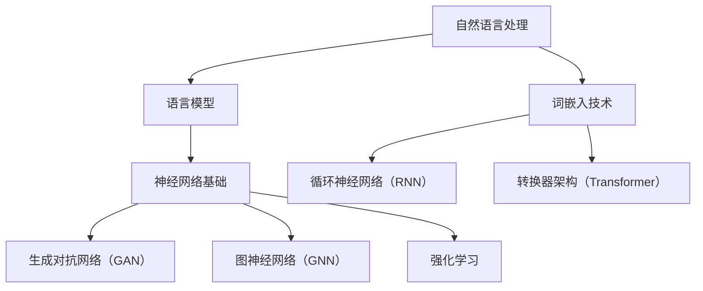

                 

### 文章标题

"神经网络在自然语言理解中的前沿研究：从基础到应用"

#### 关键词：

- 自然语言处理
- 神经网络
- 深度学习
- 语言模型
- 词嵌入
- 自然语言理解

#### 摘要：

本文旨在探讨神经网络在自然语言理解（NLU）领域的前沿研究。从基础理论到具体应用，我们将详细分析神经网络如何改变NLP游戏规则。本文分为五个部分：首先介绍NLP与神经网络的基础知识；接着探讨深度学习在NLP中的应用；然后深入前沿的神经网络模型；随后展示神经网络在NLP中的具体应用；最后展望NLP的未来趋势与挑战。通过本文，读者将获得对神经网络在NLU中的全面理解。

---

### 《神经网络在自然语言理解中的前沿研究》目录大纲

1. **第一部分：自然语言处理与神经网络基础**
   - 第1章：自然语言处理基础
   - 第2章：神经网络基础
   - 第3章：深度学习在自然语言理解中的应用

2. **第二部分：深度学习在自然语言理解中的应用**
   - 第4章：前沿的神经网络模型
   - 第5章：神经网络在NLP中的具体应用

3. **第三部分：神经网络在NLP中的项目实战**
   - 第6章：神经网络在NLP中的项目实战

4. **第四部分：未来展望与挑战**
   - 第7章：未来展望与挑战

5. **附录**
   - 附录 A：常用工具与资源
   - 附录 B：参考书目与论文
   - 附录 C：代码与数据集下载链接

### Mermaid 流程图

---

现在，我们将开始深入探讨自然语言处理与神经网络的基础知识，以及如何将这些基础知识应用于自然语言理解领域。通过逻辑清晰的分析和推理，我们将一步步构建对这一复杂主题的全面理解。接下来，我们将深入第1章，介绍自然语言处理的基础概念。

