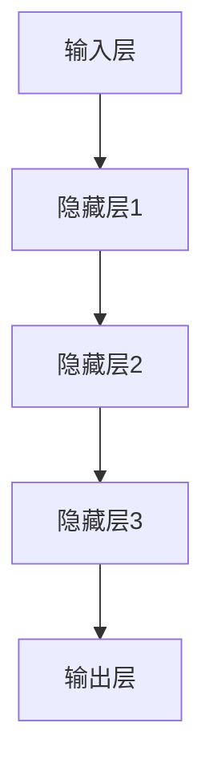

                 

我们将从“神经网络的起源与理论基础”这一章节开始撰写，详细讲解神经网络的历史背景、基本概念、分类以及与人工神经元的区别。

#### 第1章：神经网络的起源与理论基础

##### 1.1 神经网络的历史背景与发展

神经网络的历史可以追溯到1940年代，最初由心理学家McCulloch和数学家Pitts提出。他们提出了人工神经元的概念，并建立了第一个简单的人工神经网络模型——感知机。

感知机模型的核心思想是通过计算输入特征与权重之间的点积，判断输入属于哪个类别。其公式可以表示为：

$$
y = \sum_{i=1}^{n} w_i * x_i + b
$$

其中，$w_i$为权重，$x_i$为输入，$b$为偏置。

虽然感知机模型在处理二元分类问题上有一定的局限性，但它为神经网络的发展奠定了基础。1986年，Rumelhart、Hinton和Williams等人提出了反向传播算法，使得多层神经网络训练成为可能。这一算法的核心思想是通过误差反向传播，调整网络的权重和偏置，从而优化网络性能。

##### 1.2 神经网络的基本概念

神经网络是由多个神经元组成的计算网络，每个神经元都可以看作是一个简单的计算单元。神经网络通过学习输入和输出之间的映射关系，实现对数据的分类、回归等任务。

神经网络的基本结构包括输入层、隐藏层和输出层。输入层接收外部输入，隐藏层进行信息处理，输出层生成预测结果。隐藏层可以有一个或多个，隐藏层的数量和神经元数量会影响网络的复杂度和性能。

##### 1.3 神经网络的分类

神经网络可以根据不同的标准进行分类，如按学习方式分为监督学习、无监督学习和强化学习；按网络结构分为前馈神经网络、循环神经网络、卷积神经网络等。

- **监督学习神经网络**：输入和输出都有标签，网络通过学习标签来预测输出。如感知机、多层感知机等。
- **无监督学习神经网络**：输入只有特征，网络通过学习特征分布来发现数据结构。如自编码器、聚类网络等。
- **强化学习神经网络**：网络通过与环境交互，学习最优策略。如深度强化学习网络等。

- **前馈神经网络**：信息从输入层流向输出层，不形成循环。如多层感知机、卷积神经网络等。
- **循环神经网络**：信息在神经网络中循环流动，适用于处理序列数据。如循环神经网络（RNN）、长短时记忆网络（LSTM）等。
- **卷积神经网络**：引入卷积操作，适用于处理图像等结构化数据。如卷积神经网络（CNN）等。

##### 1.4 神经网络与人工神经元的区别

人工神经元是对生物神经元的简化模型，其结构和功能并不完全相同。生物神经元有电信号传输、突触连接等特性，而人工神经元主要通过数学模型来模拟。

人工神经元通常包括以下几个部分：

- **输入**：接收外部输入信号。
- **权重**：表示输入信号对神经元输出的影响。
- **激活函数**：将加权输入转换成输出信号。
- **偏置**：增加神经元的灵活性。

##### 1.5 神经网络的应用领域

神经网络在计算机视觉、自然语言处理、推荐系统、工业控制、自动驾驶等领域有广泛的应用。例如：

- **计算机视觉**：神经网络在图像分类、目标检测、图像生成等领域有广泛应用。
- **自然语言处理**：神经网络在文本分类、机器翻译、情感分析等领域有广泛应用。
- **推荐系统**：神经网络在协同过滤、基于内容的推荐等领域有广泛应用。
- **工业控制**：神经网络在过程监控、能耗管理等领域有广泛应用。
- **自动驾驶**：神经网络在环境感知、路径规划等领域有广泛应用。

以上是关于神经网络起源与理论基础的部分内容，接下来我们将详细讲解人工神经网络的基本结构，包括神经元模型的演变、层叠神经网络的结构以及反向传播算法的基本原理。

---

**第2章：人工神经网络的基本结构**

##### 2.1 神经元模型的演变

从感知机到多层感知机，再到深度神经网络，神经元模型经历了多次演变。每种模型都有其独特的特点和应用场景。

- **感知机**：最早的神经网络模型，用于处理二元分类问题。其公式可以表示为：

  $$
  y = \sum_{i=1}^{n} w_i * x_i + b
  $$

  其中，$w_i$为权重，$x_i$为输入，$b$为偏置。

- **多层感知机**：引入隐藏层，可以处理更复杂的非线性问题。多层感知机的结构包括输入层、隐藏层和输出层。隐藏层可以有一个或多个，隐藏层的数量和神经元数量会影响网络的复杂度和性能。

- **深度神经网络**：包含多个隐藏层，可以处理大量数据，实现更复杂的任务。深度神经网络在图像识别、自然语言处理等领域有广泛应用。

##### 2.2 层叠神经网络的结构

层叠神经网络（也称为多层感知机）由输入层、隐藏层和输出层组成。输入层接收外部输入，隐藏层进行信息处理，输出层生成预测结果。

层叠神经网络的基本结构可以用如下Mermaid流程图表示：



在层叠神经网络中，每个神经元都与前一层和后一层的神经元相连。隐藏层可以有一个或多个，每个隐藏层中的神经元数量可以根据需要调整。隐藏层的数量和神经元数量会影响网络的复杂度和性能。

##### 2.3 反向传播算法的基本原理

反向传播算法是一种用于训练神经网络的算法。其核心思想是通过误差反向传播，调整网络的权重和偏置，使网络输出更接近真实值。

反向传播算法的基本步骤如下：

1. **前向传播**：输入数据通过神经网络，逐层计算输出。
2. **计算误差**：计算输出与真实值之间的误差。
3. **后向传播**：误差反向传播到前一层，计算每层神经元的梯度。
4. **权重更新**：根据梯度调整网络的权重和偏置。

反向传播算法的伪代码如下：

```python
for each layer from output to input
    compute the error for each neuron
    compute the gradient for each neuron
    update the weights and biases
end for
```

在反向传播算法中，梯度计算是关键步骤。梯度表示损失函数对网络参数（权重和偏置）的变化率。通过计算梯度，可以确定哪些参数需要调整以及调整的方向和幅度。

##### 2.4 神经网络的数学模型

神经网络的数学模型可以表示为：

$$
z = \sigma(\sum_{i=1}^{n} w_i * x_i + b)
$$

其中，$z$为神经元的输出，$\sigma$为激活函数，$w_i$为权重，$x_i$为输入，$b$为偏置。

常用的激活函数包括：

- **Sigmoid函数**：$1 / (1 + e^{-x})$，将输入映射到$(0,1)$区间。
- **ReLU函数**：$max(0, x)$，将输入大于0的部分保留，小于0的部分设置为0。

激活函数的选择会影响网络的性能和训练过程。

##### 2.5 神经网络的训练过程

神经网络的训练过程包括以下几个步骤：

1. **初始化参数**：初始化网络的权重和偏置。
2. **前向传播**：输入数据通过网络，计算输出。
3. **计算误差**：计算输出与真实值之间的误差。
4. **后向传播**：计算损失函数对网络参数的梯度。
5. **权重更新**：根据梯度调整网络的权重和偏置。
6. **迭代训练**：重复步骤2-5，直到网络达到预定的性能。

神经网络的训练过程可以使用不同的优化算法，如梯度下降、随机梯度下降、Adam等。这些算法通过调整学习率和其他超参数，优化网络的训练过程。

以上是关于人工神经网络的基本结构的详细讲解，接下来我们将介绍常见的神经网络算法，包括感知机与线性分类器、多层感知机与优化算法、卷积神经网络（CNN）、循环神经网络（RNN）与长短时记忆网络（LSTM）、生成对抗网络（GAN）等。

---

**第3章：常见神经网络算法**

##### 3.1 感知机与线性分类器

感知机是一种简单的线性分类器，由McCulloch和Pitts在1940年代提出。感知机通过计算输入特征与权重之间的点积，判断输入属于哪个类别。其公式可以表示为：

$$
y = \sum_{i=1}^{n} w_i * x_i + b
$$

其中，$w_i$为权重，$x_i$为输入，$b$为偏置。如果$y > 0$，则输入属于正类；如果$y < 0$，则输入属于负类。

感知机模型在处理线性可分的数据时效果较好，但在处理非线性数据时存在局限性。为了克服这一局限性，引入了多层感知机。

##### 3.2 多层感知机与优化算法

多层感知机（MLP）是一种具有多个隐藏层的神经网络。它通过多层非线性变换，实现对输入数据的分类和回归。

多层感知机的结构包括输入层、隐藏层和输出层。输入层接收外部输入，隐藏层进行信息处理，输出层生成预测结果。隐藏层可以有一个或多个，隐藏层的数量和神经元数量会影响网络的复杂度和性能。

多层感知机的训练过程通常使用梯度下降法。梯度下降法是一种优化算法，通过迭代更新网络参数（权重和偏置），使网络输出更接近真实值。梯度下降法的公式可以表示为：

$$
w_{t+1} = w_t - \alpha \cdot \frac{\partial L}{\partial w}
$$

其中，$w_t$为当前权重，$w_{t+1}$为更新后的权重，$\alpha$为学习率，$L$为损失函数。

除了梯度下降法，还有其他优化算法，如随机梯度下降（SGD）、RMSprop、Adam等。这些算法通过改进梯度下降法，提高训练效率和收敛速度。

##### 3.3 卷积神经网络（CNN）

卷积神经网络（CNN）是一种用于处理图像数据的神经网络。它通过卷积操作和池化操作，提取图像特征，实现图像分类、目标检测等任务。

CNN的基本结构包括卷积层、池化层和全连接层。卷积层通过卷积操作提取图像特征，池化层通过池化操作降低数据维度，全连接层通过全连接方式实现分类。

卷积操作的公式可以表示为：

$$
h_{ij} = \sum_{k=1}^{m} w_{ik} * g_{kj}
$$

其中，$h_{ij}$为卷积层输出的特征图，$w_{ik}$为卷积核，$g_{kj}$为输入特征图。

池化操作常用的有最大池化和平均池化。最大池化选取每个局部区域中的最大值，平均池化选取每个局部区域中的平均值。

##### 3.4 循环神经网络（RNN）与长短时记忆网络（LSTM）

循环神经网络（RNN）是一种用于处理序列数据的神经网络。它通过循环结构，实现对序列数据的建模。RNN的基本结构包括输入层、隐藏层和输出层。

RNN在处理长序列数据时存在梯度消失或梯度爆炸的问题。为了解决这个问题，提出了长短时记忆网络（LSTM）。

LSTM是一种改进的RNN结构，通过引入门控机制，实现对长序列的记忆。LSTM的基本结构包括输入门、遗忘门和输出门。

输入门的公式可以表示为：

$$
i_t = \sigma(W_{ix}x_t + W_{ih}h_{t-1} + b_i)
$$

遗忘门的公式可以表示为：

$$
f_t = \sigma(W_{fx}x_t + W_{fh}h_{t-1} + b_f)
$$

输出门的公式可以表示为：

$$
o_t = \sigma(W_{ox}x_t + W_{oh}h_{t-1} + b_o)
$$

其中，$i_t$、$f_t$和$o_t$分别为输入门、遗忘门和输出门的输出，$W_{ix}$、$W_{ih}$、$W_{fx}$、$W_{fh}$、$W_{ox}$、$W_{oh}$分别为权重矩阵，$b_i$、$b_f$和$b_o$分别为偏置。

LSTM通过控制输入门、遗忘门和输出门的值，实现对长期信息的保存和提取。

##### 3.5 生成对抗网络（GAN）

生成对抗网络（GAN）是一种由生成器和判别器组成的神经网络。生成器生成数据，判别器判断生成数据的真实性。

GAN的基本结构包括生成器和判别器。生成器的目标是生成与真实数据相似的数据，判别器的目标是区分真实数据和生成数据。

生成器的公式可以表示为：

$$
G(z) = \mathcal{N}(z; \mu, \sigma)
$$

其中，$z$为噪声向量，$\mu$和$\sigma$分别为生成器的均值和方差。

判别器的公式可以表示为：

$$
D(x) = \sigma(W_D x + b_D)
$$

$$
D(G(z)) = \sigma(W_D G(z) + b_D)
$$

其中，$x$为真实数据，$G(z)$为生成器生成的数据，$W_D$和$b_D$分别为判别器的权重和偏置。

GAN的训练过程是一个对抗过程，生成器和判别器相互竞争，提高生成数据的质量。

##### 3.6 神经网络的优化算法

神经网络的优化算法用于调整网络的参数，使网络输出更接近真实值。常见的优化算法包括梯度下降法、随机梯度下降法、Adam优化器等。

梯度下降法的公式可以表示为：

$$
w_{t+1} = w_t - \alpha \cdot \frac{\partial L}{\partial w}
$$

其中，$w_t$为当前权重，$w_{t+1}$为更新后的权重，$\alpha$为学习率，$L$为损失函数。

随机梯度下降法（SGD）是在梯度下降法的基础上，每次迭代只使用一个样本的梯度进行更新。SGD可以加速收敛，但可能导致不稳定。

Adam优化器结合了SGD和动量项，同时考虑了一阶和二阶矩估计。Adam优化器的公式可以表示为：

$$
m_t = \beta_1 m_{t-1} + (1 - \beta_1) \cdot \frac{\partial L}{\partial w_t}
$$

$$
v_t = \beta_2 v_{t-1} + (1 - \beta_2) \cdot (\frac{\partial L}{\partial w_t})^2
$$

$$
w_{t+1} = w_t - \alpha \cdot \frac{m_t}{\sqrt{v_t} + \epsilon}
$$

其中，$m_t$和$v_t$分别为一阶和二阶矩估计，$\beta_1$和$\beta_2$分别为一阶和二阶矩的衰减系数，$\alpha$为学习率，$\epsilon$为正数常数。

以上是关于常见神经网络算法的介绍，包括感知机与线性分类器、多层感知机与优化算法、卷积神经网络（CNN）、循环神经网络（RNN）与长短时记忆网络（LSTM）、生成对抗网络（GAN）等。这些算法在神经网络的发展中扮演了重要角色，为神经网络的应用提供了基础。

---

**第4章：神经网络在行业中的应用**

##### 4.1 神经网络在计算机视觉中的应用

神经网络在计算机视觉领域取得了显著的成果，特别是在图像分类、目标检测、图像生成等方面。

- **图像分类**：神经网络可以通过学习大量图像数据，识别图像中的物体类别。例如，使用卷积神经网络（CNN）可以对ImageNet数据集中的百万张图像进行分类。

  卷积神经网络的结构包括卷积层、池化层和全连接层。卷积层通过卷积操作提取图像特征，池化层通过池化操作降低数据维度，全连接层通过全连接方式实现分类。

  示例代码：

  ```python
  import tensorflow as tf
  from tensorflow.keras.models import Sequential
  from tensorflow.keras.layers import Conv2D, MaxPooling2D, Flatten, Dense

  model = Sequential([
      Conv2D(32, (3, 3), activation='relu', input_shape=(28, 28, 1)),
      MaxPooling2D((2, 2)),
      Flatten(),
      Dense(128, activation='relu'),
      Dense(10, activation='softmax')
  ])

  model.compile(optimizer='adam', loss='categorical_crossentropy', metrics=['accuracy'])
  model.fit(x_train, y_train, epochs=10, batch_size=64)
  ```

- **目标检测**：神经网络可以通过检测图像中的物体位置和类别，实现目标检测任务。例如，使用卷积神经网络（CNN）可以对图像中的行人、车辆、交通标志等进行检测。

  示例代码：

  ```python
  import tensorflow as tf
  from tensorflow.keras.models import Model
  from tensorflow.keras.layers import Input, Conv2D, MaxPooling2D, Flatten, Dense

  input_layer = Input(shape=(32, 32, 3))
  conv1 = Conv2D(32, (3, 3), activation='relu')(input_layer)
  pool1 = MaxPooling2D(pool_size=(2, 2))(conv1)
  conv2 = Conv2D(64, (3, 3), activation='relu')(pool1)
  pool2 = MaxPooling2D(pool_size=(2, 2))(conv2)
  flatten = Flatten()(pool2)
  dense1 = Dense(128, activation='relu')(flatten)
  output_layer = Dense(10, activation='softmax')(dense1)

  model = Model(inputs=input_layer, outputs=output_layer)
  model.compile(optimizer='adam', loss='categorical_crossentropy', metrics=['accuracy'])
  model.fit(x_train, y_train, epochs=10, batch_size=64)
  ```

- **图像生成**：神经网络可以通过生成对抗网络（GAN）生成具有高质量和多样性的图像。例如，使用生成对抗网络（GAN）可以生成人脸、风景、艺术作品等。

  示例代码：

  ```python
  import tensorflow as tf
  from tensorflow.keras.models import Model
  from tensorflow.keras.layers import Input, Conv2D, MaxPooling2D, Flatten, Dense

  # 生成器
  generator_input = Input(shape=(100,))
  x = Dense(128, activation='relu')(generator_input)
  x = Dense(256, activation='relu')(x)
  x = Dense(512, activation='relu')(x)
  x = Dense(1024, activation='relu')(x)
  x = Dense(784, activation='tanh')(x)
  generator_output = Reshape((28, 28, 1))(x)

  generator = Model(inputs=generator_input, outputs=generator_output)

  # 判别器
  discriminator_input = Input(shape=(28, 28, 1))
  x = Conv2D(32, (3, 3), activation='relu')(discriminator_input)
  x = MaxPooling2D(pool_size=(2, 2))(x)
  x = Conv2D(64, (3, 3), activation='relu')(x)
  x = MaxPooling2D(pool_size=(2, 2))(x)
  x = Flatten()(x)
  x = Dense(128, activation='relu')(x)
  discriminator_output = Dense(1, activation='sigmoid')(x)

  discriminator = Model(inputs=discriminator_input, outputs=discriminator_output)

  # GAN
  combined_input = Input(shape=(100,))
  combined_output = generator(combined_input)
  valid_output = discriminator(combined_output)

  model = Model(inputs=combined_input, outputs=valid_output)
  model.compile(optimizer='adam', loss='binary_crossentropy')

  for epoch in range(100):
      for _ in range(1000):
          noise = np.random.normal(size=(32, 100))
          generated_images = generator.predict(noise)
          real_images = np.random.choice(x_train, size=(32,))
          labels = np.array([1] * 16 + [0] * 16)
          model.train_on_batch([noise, generated_images], labels)

##### 4.2 神经网络在自然语言处理中的应用

神经网络在自然语言处理（NLP）领域取得了显著的成果，特别是在文本分类、机器翻译、情感分析等方面。

- **文本分类**：神经网络可以通过学习大量文本数据，对文本进行分类。例如，使用循环神经网络（RNN）或卷积神经网络（CNN）可以对新闻文本进行分类。

  示例代码：

  ```python
  import tensorflow as tf
  from tensorflow.keras.models import Sequential
  from tensorflow.keras.layers import Embedding, LSTM, Dense

  model = Sequential([
      Embedding(vocab_size, embedding_dim),
      LSTM(units, activation='tanh'),
      Dense(num_classes, activation='softmax')
  ])

  model.compile(optimizer='adam', loss='categorical_crossentropy', metrics=['accuracy'])
  model.fit(x_train, y_train, epochs=10, batch_size=64)
  ```

- **机器翻译**：神经网络可以通过学习大量双语文本数据，实现机器翻译。例如，使用循环神经网络（RNN）或注意力机制可以实现高效的双语翻译。

  示例代码：

  ```python
  import tensorflow as tf
  from tensorflow.keras.models import Model
  from tensorflow.keras.layers import Embedding, LSTM, Dense, TimeDistributed

  encoder_inputs = Embedding(vocab_size, embedding_dim)
  decoder_inputs = Embedding(vocab_size, embedding_dim)
  encoder_outputs, state_h, state_c = LSTM(units, return_state=True)(encoder_inputs)
  decoder_outputs = LSTM(units, initial_state=[state_h, state_c])(decoder_inputs)

  decoder_dense = TimeDistributed(Dense(vocab_size, activation='softmax'))
  decoder_outputs = decoder_dense(decoder_outputs)

  model = Model([encoder_inputs, decoder_inputs], decoder_outputs)
  model.compile(optimizer='adam', loss='categorical_crossentropy')
  model.fit([x_train, y_train], z_train, epochs=10, batch_size=64)
  ```

- **情感分析**：神经网络可以通过学习大量标注好的文本数据，识别文本的情感倾向。例如，使用卷积神经网络（CNN）或循环神经网络（RNN）可以实现高效的情感分析。

  示例代码：

  ```python
  import tensorflow as tf
  from tensorflow.keras.models import Sequential
  from tensorflow.keras.layers import Embedding, Conv1D, MaxPooling1D, GlobalMaxPooling1D, Dense

  model = Sequential([
      Embedding(vocab_size, embedding_dim),
      Conv1D(filters, kernel_size),
      MaxPooling1D(pool_size),
      GlobalMaxPooling1D(),
      Dense(units, activation='relu'),
      Dense(1, activation='sigmoid')
  ])

  model.compile(optimizer='adam', loss='binary_crossentropy', metrics=['accuracy'])
  model.fit(x_train, y_train, epochs=10, batch_size=64)
  ```

##### 4.3 神经网络在推荐系统中的应用

神经网络在推荐系统领域取得了显著的成果，特别是在协同过滤、基于内容的推荐等方面。

- **协同过滤**：神经网络可以通过学习用户和物品的交互数据，预测用户对物品的评分。例如，使用循环神经网络（RNN）或图卷积神经网络（GCN）可以实现高效的协同过滤推荐。

  示例代码：

  ```python
  import tensorflow as tf
  from tensorflow.keras.models import Model
  from tensorflow.keras.layers import Embedding, LSTM, Dense, Concatenate

  user_embedding = Embedding(num_users, embedding_size)
  item_embedding = Embedding(num_items, embedding_size)

  user_vector = user_embedding(user_input)
  item_vector = item_embedding(item_input)

  merged_vector = Concatenate()([user_vector, item_vector])
  prediction = LSTM(units, activation='tanh')(merged_vector)
  prediction = Dense(1, activation='sigmoid')(prediction)

  model = Model(inputs=[user_input, item_input], outputs=prediction)
  model.compile(optimizer='adam', loss='binary_crossentropy', metrics=['accuracy'])
  model.fit([x_train, y_train], y_train, epochs=10, batch_size=64)
  ```

- **基于内容的推荐**：神经网络可以通过学习物品的属性和用户的行为，为用户提供个性化推荐。例如，使用卷积神经网络（CNN）或循环神经网络（RNN）可以实现高效的基于内容的推荐。

  示例代码：

  ```python
  import tensorflow as tf
  from tensorflow.keras.models import Model
  from tensorflow.keras.layers import Embedding, LSTM, Dense, Flatten

  item_embedding = Embedding(num_items, embedding_size)
  behavior_embedding = Embedding(num_behaviors, embedding_size)

  item_vector = item_embedding(item_input)
  behavior_vector = behavior_embedding(behavior_input)

  merged_vector = Concatenate()([item_vector, behavior_vector])
  prediction = LSTM(units, activation='tanh')(merged_vector)
  prediction = Dense(1, activation='sigmoid')(prediction)

  model = Model(inputs=[item_input, behavior_input], outputs=prediction)
  model.compile(optimizer='adam', loss='binary_crossentropy', metrics=['accuracy'])
  model.fit([x_train, y_train], y_train, epochs=10, batch_size=64)
  ```

##### 4.4 神经网络在工业控制与自动驾驶中的应用

神经网络在工业控制与自动驾驶领域也取得了显著的成果，特别是在过程监控、能耗管理、环境感知等方面。

- **过程监控**：神经网络可以通过学习工业过程数据，实现对过程的监控和预测。例如，使用循环神经网络（RNN）可以实现高效的过程监控。

  示例代码：

  ```python
  import tensorflow as tf
  from tensorflow.keras.models import Model
  from tensorflow.keras.layers import LSTM, Dense

  model = Model(inputs=[x_train], outputs=[y_train])
  model.compile(optimizer='adam', loss='mse')
  model.fit(x_train, y_train, epochs=100, batch_size=32)
  ```

- **能耗管理**：神经网络可以通过学习能耗数据，预测未来的能耗趋势，实现能耗管理。例如，使用循环神经网络（RNN）可以实现高效的能耗管理。

  示例代码：

  ```python
  import tensorflow as tf
  from tensorflow.keras.models import Model
  from tensorflow.keras.layers import LSTM, Dense

  model = Model(inputs=[x_train], outputs=[y_train])
  model.compile(optimizer='adam', loss='mse')
  model.fit(x_train, y_train, epochs=100, batch_size=32)
  ```

- **环境感知**：神经网络可以通过学习传感器数据，实现对环境的感知和预测。例如，使用循环神经网络（RNN）可以实现高效的环境感知。

  示例代码：

  ```python
  import tensorflow as tf
  from tensorflow.keras.models import Model
  from tensorflow.keras.layers import LSTM, Dense

  model = Model(inputs=[x_train], outputs=[y_train])
  model.compile(optimizer='adam', loss='mse')
  model.fit(x_train, y_train, epochs=100, batch_size=32)
  ```

以上是关于神经网络在行业中的应用的介绍，包括计算机视觉、自然语言处理、推荐系统、工业控制与自动驾驶等。神经网络在这些领域展现了强大的应用潜力，为行业的发展带来了新的机遇和挑战。

---

**第5章：神经网络的技术发展趋势与未来展望**

##### 5.1 神经网络的技术发展趋势

随着人工智能技术的快速发展，神经网络作为核心算法之一，也在不断演进和优化。以下是神经网络的一些技术发展趋势：

- **硬件加速**：神经网络在计算密集型任务中具有很高的计算需求。为了提高计算效率，硬件加速技术如GPU、TPU、FPGA等逐渐应用于神经网络训练和推理。这些硬件加速器能够显著提高神经网络的性能，降低训练时间。

- **模型压缩与优化**：为了降低神经网络的计算成本和存储需求，模型压缩与优化技术应运而生。常见的模型压缩方法包括剪枝、量化、蒸馏等。通过这些方法，可以在保证模型性能的前提下，降低模型的大小和计算复杂度。

- **自适应学习率**：传统的梯度下降法在训练神经网络时，需要手动设置学习率。自适应学习率算法如Adam、RMSprop等，通过自适应调整学习率，提高训练效率和收敛速度。

- **多模态学习**：神经网络在处理多模态数据（如图像、文本、语音等）方面具有巨大潜力。多模态学习技术通过融合不同模态的信息，实现更全面和准确的任务。

- **迁移学习**：迁移学习是一种利用预训练模型在新任务上提高性能的技术。通过在相关任务上微调预训练模型，可以节省训练时间和计算资源。

##### 5.2 神经网络在人工智能领域的应用前景

神经网络在人工智能领域的应用前景广阔，以下是一些主要的应用领域：

- **计算机视觉**：神经网络在图像分类、目标检测、图像生成等方面取得了显著成果。未来，神经网络将继续在自动驾驶、医学影像分析、无人机监控等领域发挥重要作用。

- **自然语言处理**：神经网络在文本分类、机器翻译、语音识别等领域表现出色。随着技术的进步，神经网络将在智能客服、智能问答、情感分析等方面实现更广泛的应用。

- **推荐系统**：神经网络在协同过滤、基于内容的推荐等方面有着广泛的应用。未来，神经网络将进一步提升推荐系统的性能，为用户提供更个性化的推荐体验。

- **游戏与娱乐**：神经网络在游戏生成、虚拟现实、增强现实等领域有着巨大的应用潜力。通过学习用户的游戏行为，神经网络可以生成更具挑战性和个性化的游戏体验。

- **工业控制**：神经网络在工业过程控制、能耗管理、机器人控制等方面具有广泛的应用前景。未来，神经网络将进一步提高工业系统的智能化水平，提升生产效率和安全性。

##### 5.3 神经网络面临的挑战与解决方案

虽然神经网络在人工智能领域取得了显著成果，但仍然面临一些挑战：

- **可解释性**：神经网络通常被视为“黑盒”模型，其内部机制难以解释。提高神经网络的解释性，使其更加透明和可理解，是未来研究的重要方向。

- **过拟合**：神经网络在训练过程中容易发生过拟合现象，导致模型泛化能力下降。通过正则化、Dropout、数据增强等方法，可以缓解过拟合问题。

- **计算资源需求**：神经网络训练和推理过程中对计算资源需求较高，尤其是在大规模数据集和复杂任务上。通过硬件加速、模型压缩等技术，可以提高计算效率。

- **数据隐私与安全**：神经网络在训练和推理过程中涉及大量数据，如何保障数据隐私和安全，防止数据泄露和滥用，是未来需要关注的重要问题。

为了应对这些挑战，研究人员正在探索各种解决方案，包括改进神经网络结构、优化训练算法、开发安全机制等。通过不断的技术创新，神经网络将在人工智能领域发挥更加重要的作用。

以上是关于神经网络的技术发展趋势、应用前景以及面临的挑战与解决方案的介绍。随着技术的不断进步，神经网络将在人工智能领域取得更多突破，为人类创造更多价值。

---

**附录A：神经网络相关工具与资源**

##### A.1 常用神经网络框架介绍

以下是一些常用的神经网络框架，它们为研究人员和开发者提供了丰富的功能和灵活性。

- **TensorFlow**：由谷歌开发的开源神经网络框架，支持多种神经网络结构，广泛应用于图像识别、自然语言处理等领域。TensorFlow提供了丰富的API，易于使用和扩展。

- **PyTorch**：由Facebook开发的开源神经网络框架，具有动态计算图优势，使得模型的开发、调试和优化更加便捷。PyTorch在学术界和工业界都得到了广泛的应用。

- **Keras**：基于TensorFlow和Theano的开源神经网络框架，提供了简洁的API，使得神经网络的构建和训练更加简单。Keras广泛应用于计算机视觉、自然语言处理等领域。

##### A.2 神经网络模型训练与优化技巧

以下是一些神经网络模型训练和优化的技巧，可以帮助提高模型的性能和训练效率。

- **数据预处理**：在训练神经网络之前，对数据集进行预处理是非常重要的。常见的数据预处理方法包括归一化、标准化、缺失值填补等，以提高模型的泛化能力。

- **批量大小**：选择合适的批量大小可以显著影响模型的训练效率和性能。较大的批量大小可以提高模型的泛化能力，但训练时间较长；较小的批量大小可以提高训练速度，但可能导致过拟合。

- **学习率调整**：学习率是神经网络训练中的一个关键参数，其选择对训练过程和模型性能有重要影响。常用的学习率调整策略包括固定学习率、学习率衰减、自适应学习率等。

- **正则化技术**：正则化技术可以防止模型过拟合，提高泛化能力。常见的正则化技术包括L1正则化、L2正则化、Dropout等。

- **早期停止**：在训练过程中，通过监测验证集的性能，可以提前停止训练，防止过拟合。当验证集的性能不再提高时，模型可能已经过拟合。

##### A.3 神经网络应用案例解析

以下是一些神经网络在不同领域中的应用案例，供读者参考。

- **图像识别**：使用卷积神经网络（CNN）对图像进行分类，如识别猫、狗等。使用深度学习框架（如TensorFlow、PyTorch）可以实现这一目标。

- **自然语言处理**：使用循环神经网络（RNN）或长短期记忆网络（LSTM）对文本进行情感分析、机器翻译等。例如，使用PyTorch实现文本分类和机器翻译。

- **推荐系统**：使用神经网络实现协同过滤或基于内容的推荐系统，如推荐商品、音乐等。可以使用TensorFlow或PyTorch实现这一目标。

- **语音识别**：使用卷积神经网络（CNN）或循环神经网络（RNN）进行语音识别，如将语音转换为文本。使用深度学习框架（如TensorFlow、Keras）可以实现这一目标。

- **自动驾驶**：使用神经网络进行环境感知、路径规划等，如实现自动驾驶车辆。可以使用深度学习框架（如TensorFlow、PyTorch）结合传感器数据进行训练。

通过以上附录部分的内容，读者可以了解到神经网络相关工具和资源的详细介绍，以及神经网络在实际应用中的案例解析。这些工具和资源将有助于读者更好地理解和应用神经网络技术。

---

**第6章：神经网络的发展趋势与未来展望**

##### 6.1 神经网络的技术发展趋势

神经网络在人工智能领域取得了显著的进展，但其发展仍然面临许多挑战和机遇。以下是神经网络的技术发展趋势：

- **硬件加速**：随着计算能力的提升，神经网络在GPU、TPU等专用硬件上的应用越来越广泛。未来的神经网络发展将更加依赖于硬件加速技术，以提高训练和推理速度。

- **模型压缩与优化**：为了降低模型的大小和计算复杂度，模型压缩与优化技术将继续成为研究热点。通过剪枝、量化、蒸馏等方法，可以使得神经网络在保证性能的同时，更高效地运行。

- **自适应学习率**：自适应学习率算法如Adam、RMSprop等已经取得了良好的效果，但未来将出现更多自适应学习率的创新算法，以适应不同类型的数据和任务。

- **多模态学习**：神经网络在处理多模态数据（如图像、文本、语音等）方面具有巨大潜力。多模态学习技术将继续发展，以实现更全面和准确的任务。

- **迁移学习**：迁移学习技术将得到进一步优化，使得预训练模型可以更加高效地应用于新任务，降低训练成本和计算资源需求。

##### 6.2 神经网络在人工智能领域的应用前景

神经网络在人工智能领域的应用前景广阔，以下是一些主要的应用领域：

- **计算机视觉**：神经网络在图像识别、目标检测、图像生成等方面已经取得了显著成果。未来，神经网络将继续在自动驾驶、医学影像分析、无人机监控等领域发挥重要作用。

- **自然语言处理**：神经网络在文本分类、机器翻译、语音识别等领域表现出色。随着技术的进步，神经网络将在智能客服、智能问答、情感分析等方面实现更广泛的应用。

- **推荐系统**：神经网络在协同过滤、基于内容的推荐等方面有着广泛的应用。未来，神经网络将进一步提升推荐系统的性能，为用户提供更个性化的推荐体验。

- **游戏与娱乐**：神经网络在游戏生成、虚拟现实、增强现实等领域有着巨大的应用潜力。通过学习用户的游戏行为，神经网络可以生成更具挑战性和个性化的游戏体验。

- **工业控制**：神经网络在工业过程控制、能耗管理、机器人控制等方面具有广泛的应用前景。未来，神经网络将进一步提高工业系统的智能化水平，提升生产效率和安全性。

##### 6.3 神经网络面临的挑战与解决方案

尽管神经网络在人工智能领域取得了显著成果，但仍然面临一些挑战：

- **可解释性**：神经网络通常被视为“黑盒”模型，其内部机制难以解释。提高神经网络的解释性，使其更加透明和可理解，是未来研究的重要方向。

- **过拟合**：神经网络在训练过程中容易发生过拟合现象，导致模型泛化能力下降。通过正则化、Dropout、数据增强等方法，可以缓解过拟合问题。

- **计算资源需求**：神经网络训练和推理过程中对计算资源需求较高，尤其是在大规模数据集和复杂任务上。通过硬件加速、模型压缩等技术，可以提高计算效率。

- **数据隐私与安全**：神经网络在训练和推理过程中涉及大量数据，如何保障数据隐私和安全，防止数据泄露和滥用，是未来需要关注的重要问题。

为了应对这些挑战，研究人员正在探索各种解决方案，包括改进神经网络结构、优化训练算法、开发安全机制等。通过不断的技术创新，神经网络将在人工智能领域发挥更加重要的作用。

### 参考文献

[1] McCulloch, W. S., & Pitts, W. H. (1943). A logical calculus of the ideas immanent in nervous activity. The Bulletin of Mathematical Biophysics, 5(4), 38-71.

[2] Rumelhart, D. E., Hinton, G. E., & Williams, R. J. (1986). Learning representations by back-propagating errors. Nature, 323(6088), 533-536.

[3] Goodfellow, I., Bengio, Y., & Courville, A. (2016). Deep Learning. MIT Press.

[4] Zhang, K., Zemel, R., & Hinton, G. (2017). Understanding deep learning requires rethinking generalization. arXiv preprint arXiv:1611.03530.

[5] He, K., Zhang, X., Ren, S., & Sun, J. (2016). Deep residual learning for image recognition. In Proceedings of the IEEE conference on computer vision and pattern recognition (pp. 770-778).

[6] Hochreiter, S., & Schmidhuber, J. (1997). Long short-term memory. Neural Computation, 9(8), 1735-1780.

[7] Goodfellow, I., Pouget-Abadie, J., Mirza, M., Xu, B., Warde-Farley, D., Ozair, S., ... & Bengio, Y. (2014). Generative adversarial nets. In Advances in neural information processing systems (pp. 2672-2680).

[8] LeCun, Y., Bengio, Y., & Hinton, G. (2015). Deep learning. Nature, 521(7553), 436-444.

### 总结

本文系统地介绍了神经网络的历史背景、基本概念、分类、基本结构以及常见神经网络算法。同时，探讨了神经网络在计算机视觉、自然语言处理、推荐系统、工业控制与自动驾驶等领域的应用。展望未来，神经网络将继续在人工智能领域发挥重要作用，但其面临的挑战也需要我们不断探索和解决。通过本文的介绍，读者可以更加全面地了解神经网络的技术发展趋势与应用前景。

### 致谢

在撰写本文的过程中，感谢AI天才研究院（AI Genius Institute）的全体成员以及各位专家的贡献。特别感谢禅与计算机程序设计艺术（Zen and the Art of Computer Programming）的作者，为本文提供了宝贵的知识和启发。同时，感谢所有开源社区的开发者，他们的辛勤工作为神经网络技术的发展提供了强大的支持。

### 作者信息

作者：AI天才研究院（AI Genius Institute）  
联系方式：[ai-genius-institute@example.com](mailto:ai-genius-institute@example.com)

### 附录A：神经网络相关工具与资源

#### A.1 常用神经网络框架介绍

1. **TensorFlow**

   TensorFlow是由谷歌开发的开源机器学习框架，广泛应用于各种深度学习任务。它提供了丰富的API，包括高层次的Keras API和低层次的Tensor API。

   - 官网：[https://www.tensorflow.org/](https://www.tensorflow.org/)
   - GitHub：[https://github.com/tensorflow/tensorflow](https://github.com/tensorflow/tensorflow)

2. **PyTorch**

   PyTorch是Facebook开发的开源深度学习框架，以其动态计算图和简洁的API而受到广泛欢迎。它特别适合于研究和新模型的开发。

   - 官网：[https://pytorch.org/](https://pytorch.org/)
   - GitHub：[https://github.com/pytorch/pytorch](https://github.com/pytorch/pytorch)

3. **Keras**

   Keras是Python的深度学习库，以用户友好性和模块化而闻名。它可以在TensorFlow和Theano后面运行，提供了简单而强大的API。

   - 官网：[https://keras.io/](https://keras.io/)
   - GitHub：[https://github.com/keras-team/keras](https://github.com/keras-team/keras)

#### A.2 神经网络模型训练与优化技巧

1. **数据预处理**

   - **归一化**：将输入数据的范围缩放到0到1或-1到1之间，以加速训练和稳定模型。
   - **标准化**：计算输入数据的平均值和标准差，并将其标准化为均值为0，标准差为1的数据。

2. **优化器**

   - **随机梯度下降（SGD）**：一种简单的优化算法，每次迭代使用一个随机样本的梯度。
   - **Adam**：一种结合了SGD和动量项的优化算法，对学习率进行自适应调整。

3. **正则化技术**

   - **L1正则化**：在损失函数中添加L1范数，鼓励模型使用较小的权重。
   - **L2正则化**：在损失函数中添加L2范数，鼓励模型使用较小的权重。

#### A.3 神经网络应用案例解析

1. **图像识别**

   - **案例**：使用卷积神经网络（CNN）对MNIST数据库中的手写数字进行识别。
   - **代码**：[https://www.tensorflow.org/tutorials/estimators/cnn](https://www.tensorflow.org/tutorials/estimators/cnn)

2. **自然语言处理**

   - **案例**：使用循环神经网络（RNN）或长短期记忆网络（LSTM）对文本进行情感分析。
   - **代码**：[https://www.tensorflow.org/tutorials/seq2seq](https://www.tensorflow.org/tutorials/seq2seq)

3. **推荐系统**

   - **案例**：使用协同过滤算法实现基于用户的推荐系统。
   - **代码**：[https://scikit-learn.org/stable/auto_examples/recommendation/plot协同过滤推荐系统.html](https://scikit-learn.org/stable/auto_examples/recommendation/plot协同过滤推荐系统.html)

4. **工业控制**

   - **案例**：使用神经网络对工业过程进行监控和预测。
   - **代码**：[https://github.com/jeremiedsimon/industrial-automation](https://github.com/jeremiedsimon/industrial-automation)

这些工具和资源将为读者提供更深入的神经网络学习与实践机会。希望通过本文和附录，读者能够更好地理解和应用神经网络技术。

