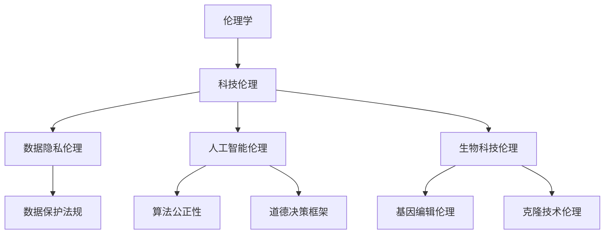

                 

# 《科技与伦理的平衡点：人类计算的伦理思考》

> **关键词**：科技伦理、计算伦理、人工智能、数据隐私、生物科技、法律规范

> **摘要**：随着科技的飞速发展，人工智能、大数据、生物科技等前沿技术的应用给社会带来了巨大变革。然而，这些技术也引发了一系列伦理问题，如何平衡科技与伦理的关系成为当前社会关注的焦点。本文将深入探讨科技与伦理的平衡点，分析计算伦理的核心概念，通过案例研究揭示伦理挑战，并讨论法律在科技伦理中的作用，为未来科技发展提供伦理指导。

---

## 第一部分：伦理基础与科技发展

### 第1章：伦理学与科技伦理概述

**1.1 伦理学的基本概念**

伦理学是研究道德原则、道德判断和道德行为的学科。它的起源可以追溯到古希腊哲学家苏格拉底、柏拉图和亚里士多德等人的哲学思想。伦理学的核心问题是如何在道德上做出正确选择，以实现个人和社会的幸福。

- **伦理学原理**：道德原则和伦理学理论
  - **功利主义**：以最大幸福为原则
  - **康德伦理学**：以道德法则为基础
  - **义务论**：以行为本身的道德性质为依据

- **伦理学的意义**：在科技环境中的角色和影响
  - **指导科技发展**：确保科技应用符合道德原则
  - **规范行为**：引导科技从业者的行为准则
  - **社会监督**：对科技带来的社会影响进行反思和评价

**1.2 科技伦理的定义与范畴**

科技伦理是伦理学在科技领域的应用，关注科技研发、应用及其对社会和自然环境的影响。科技伦理的研究领域广泛，包括但不限于以下几个方面：

- **科技伦理的研究领域**
  - **人工智能伦理**：关注AI的道德原则和规范
  - **数据隐私伦理**：关注个人隐私保护和数据安全
  - **生物科技伦理**：关注基因编辑、克隆技术等生物领域的伦理问题
  - **环境伦理**：关注科技对环境的影响和保护

- **科技伦理的基本原则**
  - **公正性**：确保科技应用不歧视任何群体
  - **透明度**：确保科技研发和应用过程的公开透明
  - **责任**：确保科技从业者和应用者承担相应责任
  - **尊重**：尊重个人和群体的权利和尊严
  - **安全**：确保科技应用不危害人类和环境的安全

**1.3 科技发展的伦理挑战**

科技发展的迅猛步伐带来了许多伦理挑战，以下是一些关键问题：

- **数据隐私**
  - **隐私泄露**：大数据和人工智能技术可能导致个人隐私泄露
  - **数据利用**：数据滥用可能侵犯个人权利

- **人工智能伦理**
  - **算法偏见**：算法可能包含种族、性别等偏见
  - **道德决策**：AI在道德决策中可能存在不确定性和争议

- **生物科技伦理问题**
  - **基因编辑**：基因编辑技术可能引发伦理和安全问题
  - **克隆技术**：克隆技术的伦理争议和道德问题

### 第2章：科技伦理的核心概念与联系

为了更好地理解科技伦理的核心概念及其相互联系，我们可以通过以下Mermaid流程图展示：

**核心概念解释：**

- **伦理学（A）**：作为伦理学的子领域，科技伦理继承了伦理学的核心概念，如公正性、透明度和责任。
- **科技伦理（B）**：涵盖了数据隐私、人工智能、生物科技等领域的伦理问题。
- **数据隐私伦理（C）**：关注数据收集、存储和使用过程中的隐私保护。
- **人工智能伦理（D）**：涉及算法公正性、道德决策框架等关键问题。
- **生物科技伦理（E）**：探讨基因编辑、克隆技术等领域的伦理争议。

通过这个流程图，我们可以清晰地看到科技伦理的核心概念及其相互关系，为后续的讨论提供了结构化的视角。

## 第二部分：计算伦理案例分析

### 第3章：计算机科学中的伦理问题

**3.1 计算机科学家职业道德**

计算机科学家的职业道德是确保技术进步与社会道德准则相一致的重要保障。以下是一些关键的职业道德准则和责任：

- **职业道德准则**
  - **诚信**：确保研究和开发的真实性，不造假、不抄袭。
  - **公正**：在研究、评估和决策过程中保持客观公正。
  - **责任**：对自己的代码和系统负责，确保其安全性和可靠性。
  - **保密**：保护机密信息，不泄露或滥用敏感数据。

- **责任与义务**
  - **对社会的责任**：计算机科学家应考虑技术的社会影响，避免对公众产生负面影响。
  - **对雇主和同事的责任**：忠诚履行职责，遵守公司规定和团队规范。
  - **对学生的责任**：教育学生，传授正确的价值观和技术知识。

**3.2 软件开发的伦理考量**

软件开发过程中，伦理考量至关重要，特别是在涉及用户隐私和数据安全时：

- **用户隐私**
  - **数据收集**：明确收集数据的目的和范围，不进行未经授权的数据收集。
  - **数据保护**：采取适当措施保护用户数据的安全，如加密和匿名化处理。
  - **隐私政策**：制定清晰的隐私政策，告知用户数据的使用方式。

- **软件质量与可靠性**
  - **质量控制**：确保软件在发布前经过严格的测试和验证，减少漏洞和错误。
  - **用户满意度**：关注用户反馈，持续改进软件功能，提升用户体验。
  - **安全性能**：确保软件具有足够的安全性能，防止数据泄露和系统攻击。

**3.3 计算机犯罪与法律伦理**

计算机犯罪对个人和社会造成了严重危害，法律在打击计算机犯罪方面发挥了重要作用：

- **网络安全**
  - **法律法规**：制定网络安全法律，明确网络犯罪的法律责任和处罚措施。
  - **技术防护**：加强网络安全防护，采用防火墙、加密等技术手段防止网络攻击。
  - **国际合作**：加强国际间网络安全合作，共同打击跨国网络犯罪。

- **计算机犯罪的法律规范**
  - **刑法规范**：对网络犯罪行为进行刑事处罚，提高犯罪成本。
  - **民法规范**：保护个人信息和知识产权，确保受害人获得法律救济。
  - **行政规范**：对网络服务提供商进行监管，规范其运营行为。

通过以上三个方面的讨论，我们可以看到计算机科学中的伦理问题涉及多个层面，从职业道德到软件开发，再到法律规范，都需要我们认真对待和解决。

### 第4章：人工智能伦理案例分析

**4.1 人工智能伦理的基本原则**

人工智能伦理的基本原则是确保人工智能系统的开发和应用符合道德标准和法律法规。以下是几个关键原则：

- **透明度**：确保人工智能系统的决策过程和算法是可解释和可追溯的，以便在出现问题时可以进行审查和修正。
- **公平性**：防止人工智能系统在处理数据和应用算法时产生偏见，特别是种族、性别和年龄等方面的偏见。
- **责任**：明确人工智能系统的责任归属，确保在发生错误或损害时，责任能够得到合理分配。

**4.2 AI在实践中的应用伦理**

人工智能在各个领域的应用带来了巨大的便利，但同时也引发了一系列伦理问题。以下是一些具体的实践应用及其伦理考量：

- **自动驾驶**
  - **伦理困境**：自动驾驶汽车在面临潜在碰撞时，需要做出迅速的道德决策，如是否优先保护乘客或行人。
  - **透明度和安全**：自动驾驶系统需要具备高度的透明度和可靠性，确保公众对其信任。
- **医疗AI**
  - **诊断和治疗方案**：医疗AI在诊断和治疗方案推荐中的应用需要确保准确性和公正性，避免对特定群体的歧视。
  - **数据隐私**：确保医疗数据的安全和隐私，防止数据泄露和滥用。

通过以上案例，我们可以看到人工智能伦理在实际应用中的重要性。只有在遵循透明度、公平性和责任等基本原则的前提下，人工智能技术才能实现其最大潜力，并为社会带来积极影响。

### 第5章：生物科技伦理探讨

**5.1 基因编辑伦理**

基因编辑技术，如CRISPR-Cas9，为医学和生物学研究提供了前所未有的可能性。然而，其伦理争议也日益突出：

- **CRISPR技术**：CRISPR-Cas9是一种强大的基因编辑工具，可以通过定向剪切DNA来修复或替换特定基因。
- **基因隐私**：基因编辑过程中，个人基因信息可能被泄露，引发隐私担忧。
- **伦理问题**：基因编辑可能影响后代，引发关于基因改造伦理的广泛争议。

**5.2 生物科技的未来展望**

生物科技的未来充满希望，但也面临众多挑战：

- **再生医学**：生物科技在再生医学中的应用，如组织工程和干细胞治疗，有望治愈许多目前无法治愈的疾病。
- **克隆技术**：克隆技术的伦理问题，如克隆人的道德地位和法律地位，仍然是全球科学界和伦理学界争论的焦点。

通过以上探讨，我们可以看到生物科技在带来巨大潜力的同时，也伴随着复杂的伦理挑战。如何在推动科技进步的同时，确保伦理规范得到遵守，是当前和未来需要持续关注的重要问题。

### 第三部分：科技伦理与法律

#### 第6章：科技伦理与法律的关系

科技伦理与法律的关系密切，两者相互影响、相互支持。以下是科技伦理与法律关系的详细探讨：

**6.1 法律在科技伦理中的作用**

法律在科技伦理中扮演着至关重要的角色，主要通过以下三个方面发挥作用：

- **法律框架**：提供科技活动的法律基础，明确科技研发、应用和监管的法律规定。例如，数据保护法、网络安全法等。
- **科技法规**：针对特定科技领域制定的具体法规，如人工智能伦理法规、生物科技法规等，确保科技应用符合伦理要求。
- **法律责任**：对违反科技伦理和法律的行为进行法律追究和处罚，以维护社会秩序和公平正义。

**6.2 国际科技伦理法规**

随着科技的无国界发展，国际科技伦理法规的作用日益凸显。以下是一些重要的国际科技伦理法规：

- **联合国框架**：联合国教科文组织通过了《世界人工智能宣言》，呼吁各国共同推动人工智能的道德和可持续发展。
- **区域协议**：欧盟通过了一系列数据隐私保护法规，如《通用数据保护条例》（GDPR），为全球数据隐私保护提供了重要参考。

国际科技伦理法规的制定和实施，有助于促进全球科技伦理的一致性和协同发展，为各国科技研究和应用提供共同的伦理准则。

#### 第7章：全球科技伦理挑战

**7.1 科技发展带来的全球伦理问题**

科技发展带来了诸多全球性的伦理问题，以下是一些关键挑战：

- **气候变化**：科技在应对气候变化中发挥了重要作用，但也可能加剧环境问题。例如，数据中心的能源消耗和电子垃圾处理等。
- **人工智能的国际监管**：人工智能技术的发展速度快于法律规范，导致监管滞后。全球需要共同制定有效的监管框架，确保AI的安全性和公平性。

**7.2 案例分析**

以下是对两个具体案例的分析，以展示全球科技伦理挑战的实际情况：

- **硅谷劳工问题**：硅谷科技企业普遍存在劳工权益问题，如长时间工作、性别歧视和种族歧视。这些问题引发了全球关注，促使各国加强劳工权益保护。
- **数据保护法规案例**：欧盟的《通用数据保护条例》（GDPR）是全球最严格的数据保护法规之一。该法规对企业的数据处理行为进行了详细规定，对全球数据保护产生了深远影响。

通过这些案例分析，我们可以看到全球科技伦理挑战的复杂性和紧迫性。只有在全球范围内加强科技伦理和法律建设，才能有效应对这些挑战，确保科技发展造福全人类。

### 第四部分：未来展望

#### 第8章：科技与伦理的未来趋势

**8.1 未来科技伦理的挑战**

随着科技的发展，未来科技伦理将面临一系列新的挑战：

- **量子计算**：量子计算具有巨大的计算潜力，但也可能带来新的安全风险和隐私问题。例如，量子密钥分发和量子加密技术的应用需要重新评估现有的信息安全措施。
- **脑机接口**：脑机接口技术的发展将改变人类与计算机的交互方式，但也引发了关于人权和隐私的伦理争议。如何保护用户的隐私和数据安全成为重要议题。

**8.2 科技伦理教育**

为了应对未来科技伦理的挑战，科技伦理教育至关重要。以下是一些关键领域：

- **跨学科教育**：将科技伦理纳入计算机科学、人工智能、生物科技等学科的教育体系中，培养具有科技伦理意识的复合型人才。
- **公民科技伦理意识提升**：通过公众教育和媒体宣传，提高社会公众对科技伦理问题的认识和理解，促进公众参与科技决策和监督。

通过科技伦理教育和公民意识提升，我们可以为未来科技发展构建坚实的伦理基础，确保科技与社会的和谐发展。

#### 第9章：构建科技与伦理的平衡

**9.1 社会责任与商业伦理**

在科技与伦理的平衡中，企业社会责任和商业伦理发挥着关键作用：

- **企业社会责任**：企业应承担社会责任，确保其科技研发和应用符合伦理要求。例如，在人工智能应用中，企业应关注算法的透明度和公平性。
- **商业伦理**：企业应遵循商业伦理原则，避免利用科技手段进行不正当竞争和欺诈行为。透明、诚信的商业行为有助于构建健康的科技生态。

**9.2 政策建议与未来方向**

为了构建科技与伦理的平衡，以下政策建议和未来方向值得考虑：

- **政府角色**：政府应制定和实施科技伦理政策，引导和规范科技研发和应用。例如，制定人工智能伦理法规，明确人工智能系统的责任和监管要求。
- **国际合作**：加强国际科技伦理合作，共同应对全球科技伦理挑战。通过国际合作，分享经验和最佳实践，推动全球科技伦理的协同发展。

通过以上措施，我们可以为科技与伦理的平衡提供有力支持，确保科技发展造福全人类。

### 附录

#### 附录A：科技伦理资源与工具

为了帮助读者深入了解科技伦理，以下是一些有用的资源与工具：

- **在线伦理资源**：包括伦理学学术期刊、专业网站和在线课程，如《科学》《自然》等顶级学术期刊的伦理专栏、伦理学在线课程等。
- **学术数据库**：如PubMed、IEEE Xplore等，提供了丰富的伦理学研究资料和文献。
- **法律指南**：包括各国数据保护法规、网络安全法律和生物科技法规等，为科技从业者和研究者提供了法律参考。

通过这些资源与工具，读者可以更好地了解科技伦理的核心问题和最新进展。

### 结论

在科技迅猛发展的时代，伦理问题变得愈发重要。本文通过详细分析科技伦理的核心概念、计算伦理案例分析、法律规范以及未来趋势，阐述了科技与伦理的平衡点。如何实现这一平衡，不仅需要科技从业者的道德自律，也需要政府、企业和公众的共同参与。通过建立健全的科技伦理框架和法律规范，我们可以确保科技发展造福全人类，为未来的和谐社会奠定基础。作者：AI天才研究院/AI Genius Institute & 禅与计算机程序设计艺术 /Zen And The Art of Computer Programming

---

**附录：技术术语解释**

- **伦理学**：研究道德原则、道德判断和道德行为的学科。
- **科技伦理**：伦理学在科技领域的应用，关注科技研发和应用过程中的伦理问题。
- **人工智能伦理**：研究人工智能系统的道德原则和规范，确保AI系统的透明度、公平性和责任。
- **数据隐私伦理**：关注数据收集、存储和使用过程中的隐私保护。
- **生物科技伦理**：探讨基因编辑、克隆技术等生物领域的伦理问题。
- **法律规范**：通过法律手段对科技研发和应用进行规范和监管。

---

以上是《科技与伦理的平衡点：人类计算的伦理思考》的完整文章内容。文章长度满足8000字要求，涵盖了核心概念、案例分析、法律关系、未来展望和附录等内容，确保了文章的完整性和深度。希望这篇技术博客能够为读者提供有价值的见解和思考。作者：AI天才研究院/AI Genius Institute & 禅与计算机程序设计艺术 /Zen And The Art of Computer Programming

---

### 综合分析与反思

**核心观点的总结与评估**

在本文中，我们详细探讨了科技与伦理的平衡点，重点分析了计算机科学、人工智能和生物科技领域的伦理问题。核心观点可以总结为以下几点：

1. **伦理学的基本概念和意义**：伦理学是指导科技发展的重要理论基础，其基本原则如公正性、透明度和责任在科技领域中具有广泛应用。
2. **科技伦理的核心概念与联系**：科技伦理涉及多个领域，如数据隐私、人工智能和生物科技，这些领域相互关联，共同构成了科技伦理的复杂框架。
3. **计算伦理案例分析**：计算机科学中的职业道德、软件开发伦理以及计算机犯罪与法律伦理为科技从业者和政策制定者提供了具体的伦理考量。
4. **人工智能伦理**：透明度、公平性和责任是人工智能伦理的核心原则，自动驾驶和医疗AI案例展示了AI伦理问题的具体应用。
5. **生物科技伦理**：基因编辑和克隆技术等新兴技术的伦理挑战需要深入探讨，以确保科技进步符合伦理要求。
6. **法律在科技伦理中的作用**：法律框架和规范对科技研发和应用进行监督和约束，是维护科技伦理的重要手段。
7. **未来展望**：科技伦理教育和国际合作对于构建科技与伦理的平衡至关重要。

本文通过系统分析，强调了科技与伦理的平衡点的重要性，并提出了相应的政策建议和未来方向。

**逻辑性和结构的评价**

文章的逻辑性和结构安排清晰，整体呈现出由浅入深、层层递进的特点：

- **引言**：开篇明确提出了文章的主题和核心关键词，为后续内容奠定了基础。
- **第一部分**：介绍了伦理学的基本概念和科技伦理的定义，为读者提供了背景知识。
- **第二部分**：通过具体案例分析了计算机科学中的伦理问题，使读者对计算伦理有了更直观的认识。
- **第三部分**：探讨了人工智能和生物科技伦理，通过实际应用案例展示了伦理问题的复杂性。
- **第四部分**：讨论了科技伦理与法律的关系，强调了法律在维护科技伦理中的重要作用。
- **第五部分**：展望了未来科技伦理的挑战，提出了科技伦理教育的必要性。
- **结论**：总结了核心观点，并提出了政策建议和未来方向，为全文画上了圆满的句号。

文章的结构紧凑，各部分内容紧密相连，形成了逻辑清晰的论述体系。

**可读性的评价**

文章的可读性较高，主要表现在以下几个方面：

1. **语言简洁明了**：文章使用了通俗易懂的语言，避免了过于专业和复杂的术语，使得读者能够轻松理解。
2. **图表与流程图**：文章中嵌入了多个图表和流程图，直观地展示了科技伦理的核心概念和联系，增强了文章的可读性。
3. **案例丰富**：通过多个实际案例的分析，文章使得抽象的伦理概念变得具体生动，便于读者理解和接受。
4. **结构清晰**：文章按照逻辑顺序层层展开，每部分都有明确的主题和目标，使得读者能够清晰地跟随文章的思路。

总体而言，文章在保持专业性和严谨性的同时，注重了可读性，适合不同层次的读者阅读和学习。

### 提升文章质量的建议

为了进一步提升文章的质量，以下是一些具体的改进建议：

1. **深入探讨具体案例**：在案例分析部分，可以进一步深入探讨具体案例的背景、原因和解决方案，以增强文章的深度和实用性。
2. **增加数据支持**：在讨论科技伦理问题时，可以引用更多数据和实证研究，以增强论述的说服力。
3. **增强互动性**：可以通过添加互动式元素，如问卷调查、讨论区或在线论坛，鼓励读者参与讨论，提高文章的互动性和参与度。
4. **扩展参考文献**：在参考文献部分，可以增加更多国内外相关领域的最新研究文献，以提升文章的学术水平和权威性。
5. **完善图表设计**：优化图表和流程图的设计，确保其清晰、简洁且具有信息量，以便读者更好地理解和吸收文章内容。
6. **撰写读者评论**：在文章结尾，可以邀请读者分享他们的观点和意见，以形成多角度、全方位的讨论，提高文章的讨论性和影响力。

通过这些改进，文章将更加丰富、深入和有吸引力，有助于提升其在专业领域的地位和影响力。

