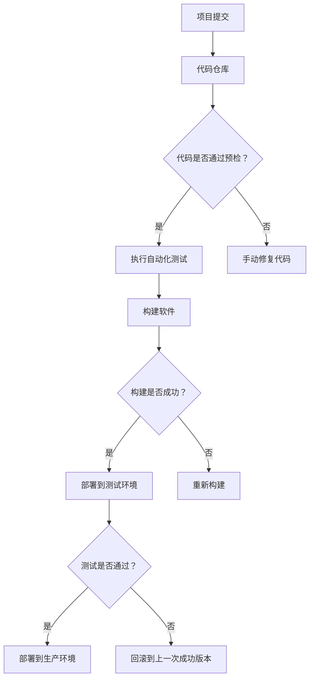
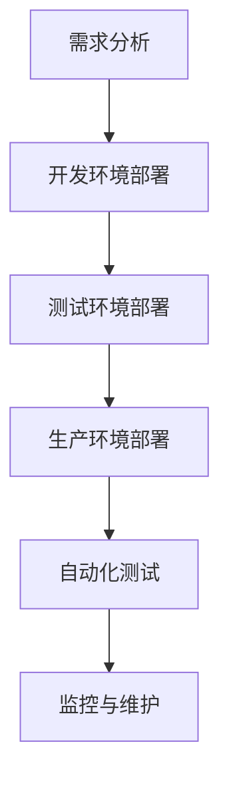

                 

# 程序员创业公司的持续交付与部署自动化

## 关键词

持续交付、部署自动化、持续集成、自动化测试、持续部署、流水线、Jenkins、GitLab CI/CD、GitHub Actions

## 摘要

本文旨在探讨程序员创业公司在软件开发生命周期中持续交付与部署自动化的实践与重要性。通过对持续交付与部署自动化基础、核心概念与架构、自动化工具与环境搭建、自动化测试与质量保证、部署策略与流程以及实战项目的详细分析，本文将帮助创业团队理解和实现高效的软件交付与部署过程。文章还将分享实际项目中的经验与教训，以及持续交付与部署自动化的未来展望。

### 第一部分：持续交付与部署自动化的基础

#### 第1章：持续交付与部署自动化的概述

##### 1.1 什么是持续交付与部署自动化

持续交付（Continuous Delivery，简称CD）与部署自动化是现代软件开发中至关重要的概念。持续交付是一种软件开发和发布实践，旨在确保软件在任何时间都可以快速、安全地交付到用户手中。部署自动化则是指使用脚本、工具和流程来自动化软件的构建、测试和部署过程。

持续交付的定义与历史演进：

- **定义**：持续交付是一种软件开发和发布实践，它强调在持续集成的基础上，通过自动化测试和部署流水线，确保软件始终处于可交付状态。
- **历史演进**：持续交付的概念起源于敏捷开发方法。早期，软件开发主要采用瀑布模型，发布周期长，风险高。随着敏捷开发的兴起，持续集成（Continuous Integration，简称CI）被引入，以缩短开发周期。在此基础上，持续交付进一步提高了软件的可靠性和可交付性。

部署自动化的定义与重要性：

- **定义**：部署自动化是指通过使用脚本、工具和流程来自动化软件的构建、测试和部署过程。
- **重要性**：部署自动化能够显著提高软件发布速度、降低错误率、提高团队协作效率，并减少人为干预的可能性。

持续交付与部署自动化的核心目标：

- **快速反馈**：通过自动化测试和反馈机制，快速识别和修复问题。
- **可靠交付**：确保软件始终处于可交付状态，减少手动操作的风险。
- **持续优化**：通过持续改进，不断提高软件质量和交付效率。

##### 1.2 持续交付与部署自动化的关系

持续交付与部署自动化紧密相关，共同构成了现代软件开发的核心实践。下面将详细解释它们的组成部分、关系以及相互作用与整合。

持续交付的组成部分：

- **持续集成（CI）**：持续集成是一种开发实践，通过将代码定期合并到主干分支，自动执行测试以确保代码质量。
- **自动化测试**：自动化测试是指使用脚本和工具自动执行测试，以验证软件的功能和性能。
- **部署流水线**：部署流水线是一种自动化流程，用于构建、测试和部署软件。

部署自动化的组成部分：

- **构建自动化**：使用工具和脚本自动构建软件，包括编译、打包和构建依赖关系。
- **测试自动化**：使用自动化测试框架和工具执行单元测试、集成测试和性能测试。
- **部署自动化**：使用脚本、工具和流程自动部署软件到不同的环境，包括开发环境、测试环境和生产环境。

两者之间的相互作用与整合：

- **持续集成与部署自动化的整合**：持续集成是实现持续交付的关键环节，它通过自动化测试和部署流水线，确保代码质量和交付效率。部署自动化则是持续集成实现的手段，通过自动化工具和流程，实现软件的快速、可靠交付。

##### 1.3 持续交付与部署自动化的优势

持续交付与部署自动化为软件开发带来了显著的优势，包括提高软件质量、加快软件开发速度和提高团队协作效率。

- **提高软件质量**：通过自动化测试和持续反馈机制，能够快速识别和修复缺陷，确保软件质量。
- **加快软件开发速度**：自动化构建、测试和部署过程，减少了手动操作的时间，提高了开发效率。
- **提高团队协作效率**：自动化流程减少了重复性工作，使团队成员能够专注于高价值的工作，提高了协作效率。

### 第一部分总结

持续交付与部署自动化是现代软件开发的核心理念，通过自动化测试和部署流水线，确保软件始终处于可交付状态，提高了开发效率和软件质量。在接下来的章节中，我们将深入探讨持续交付与部署自动化的核心概念与架构，以及如何在实际项目中实施和优化这些实践。

### 第一部分：持续交付与部署自动化的基础

#### 第2章：持续交付与部署自动化的核心概念与架构

##### 2.1 流水线（Pipeline）的概念与作用

流水线（Pipeline）是持续交付与部署自动化的核心概念之一。流水线是指将软件开发的各个阶段（如代码提交、自动化测试、构建、部署等）通过自动化工具和脚本连接起来，形成一个完整的、自动化的流程。流水线的作用如下：

- **自动化构建与测试**：流水线可以自动执行代码构建和测试，确保软件在不同环境中的一致性和可靠性。
- **快速反馈**：流水线能够快速识别和反馈问题，帮助团队快速修复缺陷。
- **简化部署过程**：流水线自动化了部署过程，减少了手动操作的复杂性和错误。

##### 2.2 持续集成（CI）与持续部署（CD）的区别与联系

持续集成（CI）与持续部署（CD）是持续交付与部署自动化的两个关键组成部分，它们既有区别又有联系。

持续集成（CI）：

- **定义**：持续集成是一种软件开发实践，通过将代码定期合并到主干分支，自动执行测试以确保代码质量。
- **实现**：持续集成通常使用CI工具（如Jenkins、GitLab CI/CD、GitHub Actions等）来实现，这些工具可以自动化执行代码审查、单元测试、集成测试等。

持续部署（CD）：

- **定义**：持续部署是一种软件开发和发布实践，旨在确保软件始终处于可交付状态，可以通过自动化流程快速、安全地部署到生产环境。
- **实现**：持续部署同样使用CI/CD工具来实现，通过流水线自动化构建、测试和部署过程。

区别与联系：

- **区别**：持续集成主要关注代码质量和测试，而持续部署则更侧重于软件的部署过程。
- **联系**：持续集成是持续部署的基础，持续集成确保代码质量，而持续部署则将高质量的代码自动化部署到生产环境。

##### 2.3 持续交付与部署自动化的流程图

为了更好地理解持续交付与部署自动化的工作流程，以下是一个简化的流程图：



### 第2章总结

流水线、持续集成和持续部署是持续交付与部署自动化的核心概念与架构。流水线将软件开发的不同阶段连接起来，形成自动化流程；持续集成确保代码质量，持续部署实现快速、可靠的软件交付。在接下来的章节中，我们将深入探讨自动化工具与环境搭建、自动化测试与质量保证等关键技术，帮助创业团队实现高效的持续交付与部署自动化。

### 第一部分：持续交付与部署自动化的基础

#### 第3章：自动化工具与环境搭建

##### 3.1 自动化工具概述

在实现持续交付与部署自动化的过程中，选择合适的自动化工具至关重要。以下是一些常用的自动化工具及其特点：

1. **Jenkins**：

   - **特点**：Jenkins 是一款开源的自动化服务器，支持多种插件，可以轻松集成各种开发工具和流程。
   - **优势**：强大的插件生态，易于配置和管理。

2. **GitLab CI/CD**：

   - **特点**：GitLab CI/CD 是 GitLab 的一部分，内置持续集成和持续部署功能。
   - **优势**：与 GitLab 自身无缝集成，便于项目管理。

3. **GitHub Actions**：

   - **特点**：GitHub Actions 是 GitHub 的持续集成和持续部署服务。
   - **优势**：与 GitHub 无缝集成，易于使用，支持多种编程语言和操作系统。

##### 3.2 环境搭建与配置

为了实现持续交付与部署自动化，我们需要搭建合适的环境，并进行必要的配置。以下是几种常见工具的环境搭建与配置步骤：

1. **Jenkins 的环境搭建与配置**：

   - **步骤**：

     1. 安装 Jenkins：从 [Jenkins 官网](https://www.jenkins.io/) 下载并安装 Jenkins。
     2. 安装插件：在 Jenkins 管理界面中安装所需插件，如 Git 插件、Maven 插件等。
     3. 配置 Jenkinsfile：创建 Jenkinsfile，定义构建和部署流程。

   - **示例**：

     ```groovy
     pipeline {
         agent any
         stages {
             stage('Build') {
                 steps {
                     sh 'mvn clean install'
                 }
             }
             stage('Test') {
                 steps {
                     sh 'mvn test'
                 }
             }
             stage('Deploy') {
                 steps {
                     sh 'mvn deploy'
                 }
             }
         }
     }
     ```

2. **GitLab CI/CD 的环境搭建与配置**：

   - **步骤**：

     1. 配置 .gitlab-ci.yml：在项目根目录下创建 .gitlab-ci.yml 文件，定义构建和部署流程。
     2. 配置 Runner：在 GitLab 上创建 Jenkins 和 Maven 等插件，用于构建和测试。

   - **示例**：

     ```yaml
     image: maven:3.6.3-jdk-11

     services:
       - docker:19.03.12

     before_script:
       - docker login -u $CI_REGISTRY_USER -p $CI_REGISTRY_PASSWORD $CI_REGISTRY
       - mvn install

     build:
       stage: build
       script:
         - mvn test
       artifacts:
         paths:
           - target/*.jar

     deploy:
       stage: deploy
       script:
         - echo "Deploying to production..."
       only:
         - master
     ```

3. **GitHub Actions 的环境搭建与配置**：

   - **步骤**：

     1. 配置 .github/workflows/main.yml：在项目根目录下创建 .github/workflows/main.yml 文件，定义构建和部署流程。
     2. 配置 Secrets：在 GitHub 仓库的 Secrets 中配置 Jenkins 仓库和 Docker 仓库的凭据。

   - **示例**：

     ```yaml
     name: Java CI/CD

     on: [push, pull_request]

     jobs:
       build:
         runs-on: ubuntu-latest
         steps:
         - uses: actions/checkout@v2
         - name: Set up JDK 11
           uses: actions/setup-java@v2
           with:
             java-version: '11'
             distribution: 'adopt'
         - name: Build
           run: mvn clean install
         - name: Test
           run: mvn test
         - name: Deploy
           if: github.ref == 'refs/heads/master'
           run: echo "Deploying to production..."
     ```

##### 3.3 代码仓库管理

代码仓库管理是持续交付与部署自动化的关键环节。以下是一些常用的代码仓库管理实践：

1. **Git的基本操作**：

   - **提交**：使用 `git commit -m "Commit message"` 提交代码。
   - **推送**：使用 `git push` 将代码推送到远程仓库。
   - **拉取**：使用 `git pull` 从远程仓库拉取代码。

2. **Git分支管理策略**：

   - **主分支（Master）**：主分支用于生产环境的代码。
   - **开发分支（Develop）**：开发分支用于合并功能分支的代码。
   - **功能分支（Feature/*）**：功能分支用于开发和测试新功能。

3. **代码审查与合并**：

   - **代码审查**：在合并代码前，对代码进行审查，确保代码质量。
   - **合并**：使用 `git merge` 将代码从功能分支合并到开发分支。

##### 3.4 持续交付与部署自动化的优势

持续交付与部署自动化为软件开发带来了诸多优势：

- **提高软件质量**：通过自动化测试和持续反馈，快速识别和修复缺陷。
- **加快软件开发速度**：自动化构建、测试和部署过程，减少手动操作的时间。
- **提高团队协作效率**：自动化流程减少了重复性工作，使团队成员能够专注于高价值的工作。

### 第3章总结

自动化工具与环境搭建是实现持续交付与部署自动化的基础。在本章中，我们介绍了常用的自动化工具（Jenkins、GitLab CI/CD、GitHub Actions）及其配置方法，以及代码仓库管理的基本实践。通过合理选择和使用自动化工具，创业团队可以显著提高软件开发和部署的效率和质量。在下一章中，我们将深入探讨自动化测试与质量保证的关键技术。

### 第一部分：持续交付与部署自动化的基础

#### 第4章：自动化测试与质量保证

##### 4.1 自动化测试概述

自动化测试是一种使用脚本和工具自动执行测试的方法，它能够提高测试效率、降低测试成本，并确保软件质量。自动化测试的优势如下：

- **提高测试效率**：自动化测试可以快速执行大量测试用例，节省时间和人力成本。
- **降低测试成本**：自动化测试减少了重复性工作，降低了测试成本。
- **确保软件质量**：自动化测试能够持续监测软件质量，确保软件在不同环境中的一致性和可靠性。

##### 4.2 自动化测试的类型

自动化测试根据测试阶段和测试目标可以分为多种类型：

- **单元测试**：单元测试是针对软件中最小可测试单元（如函数、方法）进行的测试，主要关注代码的正确性和逻辑性。
- **集成测试**：集成测试是针对多个模块或组件集成后的测试，主要关注模块之间的交互和接口的正确性。
- **性能测试**：性能测试是针对软件的性能指标（如响应时间、吞吐量、资源消耗等）进行的测试，主要关注软件在压力下的表现。
- **安全测试**：安全测试是针对软件的安全性进行的测试，主要关注软件是否存在安全漏洞和潜在威胁。

##### 4.3 自动化测试的流程

自动化测试的流程通常包括以下步骤：

1. **测试计划与设计**：根据测试目标制定测试计划和设计测试用例。
2. **测试用例编写**：编写自动化测试脚本，实现测试用例。
3. **测试执行**：使用自动化测试工具执行测试脚本，收集测试结果。
4. **测试结果分析**：分析测试结果，确定测试通过或失败的原因。
5. **测试报告**：生成测试报告，记录测试结果和问题。

##### 4.4 单元测试

单元测试是自动化测试的重要组成部分，它主要关注代码的正确性和逻辑性。以下是单元测试的详细内容：

- **单元测试的定义与作用**：单元测试是针对软件中最小可测试单元（如函数、方法）进行的测试，主要关注代码的正确性和逻辑性。
- **单元测试的编写**：单元测试通常使用单元测试框架（如JUnit、TestNG）编写，框架提供了丰富的断言和测试方法。
- **单元测试框架**：单元测试框架是用于编写和执行单元测试的工具，常见的框架包括JUnit、TestNG、NUnit等。

##### 4.5 集成测试

集成测试是针对多个模块或组件集成后的测试，主要关注模块之间的交互和接口的正确性。以下是集成测试的详细内容：

- **集成测试的定义与作用**：集成测试是针对软件中的多个模块或组件集成后的测试，主要关注模块之间的交互和接口的正确性。
- **集成测试的类型**：集成测试分为功能集成测试和性能集成测试，功能集成测试关注功能实现，性能集成测试关注系统性能。
- **集成测试的流程**：集成测试的流程包括测试计划与设计、测试用例编写、测试执行、测试结果分析和测试报告。

##### 4.6 性能测试

性能测试是针对软件的性能指标（如响应时间、吞吐量、资源消耗等）进行的测试，主要关注软件在压力下的表现。以下是性能测试的详细内容：

- **性能测试的定义与作用**：性能测试是针对软件的性能指标（如响应时间、吞吐量、资源消耗等）进行的测试，主要关注软件在压力下的表现。
- **性能测试的类型**：性能测试分为负载测试、压力测试和性能测试，负载测试关注系统在高负载下的表现，压力测试关注系统在极限负载下的稳定性，性能测试关注系统性能指标。
- **性能测试的工具**：常见的性能测试工具有Apache JMeter、LoadRunner、New Relic等。

##### 4.7 安全测试

安全测试是针对软件的安全性进行的测试，主要关注软件是否存在安全漏洞和潜在威胁。以下是安全测试的详细内容：

- **安全测试的定义与作用**：安全测试是针对软件的安全性进行的测试，主要关注软件是否存在安全漏洞和潜在威胁。
- **安全测试的类型**：安全测试分为漏洞扫描、代码审查、渗透测试等，漏洞扫描关注系统存在的漏洞，代码审查关注代码的安全性问题，渗透测试关注系统在真实攻击下的安全性。
- **安全测试的工具**：常见的安全测试工具有OWASP ZAP、Burp Suite、Nessus等。

### 第4章总结

自动化测试与质量保证是持续交付与部署自动化的重要组成部分。在本章中，我们介绍了自动化测试的概述、类型、流程，以及单元测试、集成测试、性能测试和安全测试的详细内容。通过合理设计和执行自动化测试，创业团队可以显著提高软件质量和交付效率。在下一章中，我们将深入探讨部署策略与部署流程。

### 第一部分：持续交付与部署自动化的基础

#### 第5章：部署策略与部署流程

##### 5.1 部署策略概述

部署策略是指将软件从开发环境部署到生产环境的方法和步骤。合理的部署策略能够提高软件发布速度、降低风险、确保软件质量。以下是一些常见的部署策略：

1. **蓝绿部署**：蓝绿部署是一种无中断部署策略，通过同时运行旧版本（蓝色）和新版本（绿色）的应用，将流量逐渐切换到新版本，从而实现平滑升级。
2. **灰度发布**：灰度发布是一种逐步上线新版本的功能，通过控制部分用户的访问权限，逐步扩大新版本的用户范围，降低上线风险。
3. **滚动更新**：滚动更新是一种逐个实例更新部署，确保在更新过程中，至少有一个实例处于可用的状态，从而提高系统的可用性。

##### 5.2 部署流程

部署流程是指将软件从开发环境部署到生产环境的具体步骤。以下是一个典型的部署流程：

1. **需求分析**：分析软件需求，确定部署目标。
2. **环境准备**：准备部署所需的环境，包括服务器、数据库、配置文件等。
3. **代码检查**：检查代码的版本、一致性等，确保代码质量。
4. **构建与打包**：构建软件，生成可执行文件或安装包。
5. **自动化测试**：执行自动化测试，确保软件质量。
6. **部署**：将软件部署到目标环境，如开发环境、测试环境和生产环境。
7. **监控与维护**：监控部署后的软件，确保其正常运行，并及时处理可能出现的问题。

##### 5.3 部署自动化流程图

为了更好地理解部署流程，以下是一个简化的部署自动化流程图：



### 第5章总结

部署策略与部署流程是持续交付与部署自动化的关键环节。在本章中，我们介绍了常见的部署策略（蓝绿部署、灰度发布、滚动更新）和部署流程（需求分析、环境准备、代码检查、构建与打包、自动化测试、部署、监控与维护）。通过合理设计和执行部署策略与流程，创业团队可以确保软件的顺利部署和高效运行。在下一章中，我们将探讨持续交付与部署自动化的实战项目。

### 第一部分：持续交付与部署自动化的基础

#### 第6章：持续交付与部署自动化项目实战

##### 6.1 项目背景与目标

在本章中，我们将通过一个实际的创业项目来展示如何实现持续交付与部署自动化。该项目是一款在线教育平台，旨在为学习者提供便捷的学习资源和互动交流环境。项目的目标是通过持续交付与部署自动化，提高软件质量和交付效率，确保系统稳定运行。

##### 6.2 项目环境搭建

为了实现持续交付与部署自动化，我们需要搭建一个适合项目需求的开发、测试和生产环境。以下是项目环境搭建的步骤：

1. **开发环境**：配置了开发所需的编程语言、框架、数据库和开发工具。
2. **测试环境**：配置了与生产环境相似的服务器、数据库和其他配置，用于自动化测试。
3. **生产环境**：配置了实际部署的服务器、数据库和其他配置，用于线上运行。

##### 6.3 项目代码管理

代码管理是持续交付与部署自动化的关键环节。以下是项目代码管理的步骤：

1. **版本控制**：使用 Git 进行版本控制，确保代码的一致性和可追溯性。
2. **分支管理**：采用主分支（master）、开发分支（develop）和功能分支（feature/*）的管理策略，确保代码的有序开发。
3. **代码审查**：在合并代码前进行代码审查，确保代码质量。

##### 6.4 自动化测试实施

自动化测试是持续交付与部署自动化的核心环节。以下是自动化测试的实施步骤：

1. **单元测试**：编写单元测试用例，使用 JUnit 或 TestNG 等框架进行自动化测试。
2. **集成测试**：编写集成测试用例，模拟实际使用场景，验证模块之间的交互。
3. **性能测试**：使用 Apache JMeter 或 LoadRunner 等工具进行性能测试，评估系统的性能指标。

##### 6.5 部署过程与优化

部署过程是将软件从开发环境发布到生产环境的过程。以下是项目部署过程的步骤：

1. **构建**：使用 Maven 或 Gradle 进行构建，生成可执行文件或安装包。
2. **测试**：执行自动化测试，确保软件质量。
3. **部署**：使用 Jenkins、GitLab CI/CD 或 GitHub Actions 等工具进行自动化部署。

为了优化部署过程，我们可以采取以下措施：

1. **蓝绿部署**：实现蓝绿部署，降低部署风险。
2. **灰度发布**：逐步上线新版本，减小上线影响。
3. **监控与告警**：监控部署后的系统运行状态，及时发现问题并告警。

##### 6.6 项目总结

通过以上实践，我们成功实现了持续交付与部署自动化。项目在实际运行中，软件质量和交付效率得到了显著提升。以下是项目的总结：

1. **软件质量**：通过自动化测试和持续反馈，及时发现和修复了代码缺陷。
2. **交付效率**：通过部署自动化，减少了手动操作的时间，提高了交付速度。
3. **系统稳定性**：通过优化部署流程，降低了部署风险，提高了系统稳定性。

### 第6章总结

本章通过一个实际的创业项目展示了如何实现持续交付与部署自动化。通过搭建合适的开发、测试和生产环境，实施自动化测试和部署自动化，项目团队成功提高了软件质量和交付效率。在下一章中，我们将总结项目经验与教训，并展望持续交付与部署自动化的未来发展。

### 第一部分：持续交付与部署自动化的基础

#### 第7章：持续交付与部署自动化实践总结

##### 7.1 经验与教训

在持续交付与部署自动化的实践中，我们积累了宝贵的经验与教训，以下是一些关键点：

1. **重视自动化测试**：自动化测试是持续交付与部署自动化的核心环节，必须重视测试用例的设计和执行。通过自动化测试，可以快速发现和修复代码缺陷，提高软件质量。
2. **合理设计部署流程**：部署流程的设计直接影响软件的交付速度和稳定性。合理的部署流程应包括环境准备、构建、测试和部署等步骤，同时应具备灵活性，以适应不同的部署需求。
3. **持续优化**：持续交付与部署自动化是一个不断优化的过程。通过不断收集反馈、改进流程和工具，可以进一步提高软件质量和交付效率。
4. **团队协作**：持续交付与部署自动化需要团队协作，从代码管理、测试、部署到监控，各个环节都需要紧密配合。只有团队成员共同参与，才能实现高效、可靠的交付过程。

##### 7.2 未来展望

持续交付与部署自动化在软件开发生命周期中发挥着越来越重要的作用，未来的发展趋势包括：

1. **更加智能的自动化**：随着人工智能技术的发展，自动化工具将更加智能，能够根据项目需求和实际情况自动调整部署策略和流程。
2. **云原生部署**：随着云计算的普及，越来越多的项目采用云原生部署，持续交付与部署自动化将在云原生环境中得到更广泛的应用。
3. **DevOps文化的深化**：DevOps文化的深化将推动持续交付与部署自动化的普及。企业将更加重视开发与运维的协同工作，实现高效的软件交付。
4. **开源生态的壮大**：开源社区将持续贡献更多优秀的持续交付与部署自动化工具和框架，推动整个领域的发展。

##### 7.3 程序员创业公司的持续交付与部署自动化之路

对于程序员创业公司来说，持续交付与部署自动化是实现高效、可靠软件交付的关键。以下是一些建议：

1. **从小规模开始**：创业初期，可以从简单的自动化测试和部署流程开始，逐步积累经验，再逐步扩大自动化范围。
2. **重视团队培训**：团队成员应熟悉持续交付与部署自动化的概念、工具和流程，确保团队能够高效协同工作。
3. **持续改进**：持续交付与部署自动化是一个不断优化的过程，创业公司应不断收集反馈、改进流程和工具，以适应项目需求的变化。
4. **拥抱开源**：利用开源社区提供的自动化工具和框架，可以降低成本、提高效率，同时也能更好地融入开源生态。

### 第7章总结

通过本章的总结，我们了解了持续交付与部署自动化的实践经验与教训，并对未来的发展趋势进行了展望。对于程序员创业公司来说，持续交付与部署自动化是提高软件质量和交付效率的重要手段。通过合理规划和持续优化，创业公司可以更好地应对市场挑战，实现可持续发展。

### 附录

#### 附录A：工具与资源

##### A.1 自动化工具与框架

1. **Jenkins**：

   - **介绍**：Jenkins 是一款开源的持续集成和持续交付工具，支持多种插件和平台，可以自动化构建、测试和部署。
   - **官网**：[https://www.jenkins.io/](https://www.jenkins.io/)

2. **GitLab CI/CD**：

   - **介绍**：GitLab CI/CD 是 GitLab 的一部分，用于实现持续集成和持续交付。
   - **官网**：[https://gitlab.com/gitlab-org/gitlab-ci-multi-runner](https://gitlab.com/gitlab-org/gitlab-ci-multi-runner)

3. **GitHub Actions**：

   - **介绍**：GitHub Actions 是 GitHub 的持续集成和持续交付服务，可以自动化执行代码构建、测试和部署。
   - **官网**：[https://github.com/features/actions](https://github.com/features/actions)

##### A.2 测试工具与框架

1. **JUnit**：

   - **介绍**：JUnit 是一款流行的 Java 单元测试框架，用于编写和执行单元测试。
   - **官网**：[https://junit.org/junit5/](https://junit.org/junit5/)

2. **TestNG**：

   - **介绍**：TestNG 是一款功能丰富的单元测试框架，支持多线程测试、数据驱动测试等。
   - **官网**：[https://testng.org/](https://testng.org/)

3. **Selenium**：

   - **介绍**：Selenium 是一款自动化测试工具，用于自动化浏览器测试。
   - **官网**：[https://www.selenium.dev/](https://www.selenium.dev/)

##### A.3 部署工具与框架

1. **Docker**：

   - **介绍**：Docker 是一款容器化技术，用于打包、交付和运行应用。
   - **官网**：[https://www.docker.com/](https://www.docker.com/)

2. **Kubernetes**：

   - **介绍**：Kubernetes 是一款开源的容器编排工具，用于自动化部署、扩展和管理容器化应用。
   - **官网**：[https://kubernetes.io/](https://kubernetes.io/)

3. **AWS**：

   - **介绍**：AWS 是 Amazon 提供的云计算服务，包括计算、存储、数据库、网络等各种资源。
   - **官网**：[https://aws.amazon.com/](https://aws.amazon.com/)

##### A.4 实用资源与链接

1. **持续交付与部署自动化教程**：

   - **官方网站**：[持续交付指南](https://www.cncf.io/projects/toc/cdf/)
   - **GitHub 仓库**：[持续交付教程](https://github.com/philosophicalab/continuous-delivery-handbook)

2. **相关社区与论坛**：

   - **Jenkins 论坛**：[https://www.jenkins.io/community/forums/](https://www.jenkins.io/community/forums/)
   - **GitLab 社区**：[https://about.gitlab.com/community/](https://about.gitlab.com/community/)
   - **GitHub 社区**：[https://github.community/](https://github.community/)

3. **开源项目与案例**：

   - **GitLab CI/CD 示例**：[https://gitlab.com/gitlab-examples/ci-yml-examples](https://gitlab.com/gitlab-examples/ci-yml-examples)
   - **GitHub Actions 示例**：[https://github.com/actions-samples](https://github.com/actions-samples)
   - **Docker Hub**：[https://hub.docker.com/](https://hub.docker.com/)

通过附录中的工具与资源，读者可以更深入地了解持续交付与部署自动化的相关内容，并参考实际项目案例进行实践。希望这些资源能够为创业团队在实现持续交付与部署自动化过程中提供帮助。作者：AI天才研究院/AI Genius Institute & 禅与计算机程序设计艺术/Zen And The Art of Computer Programming

