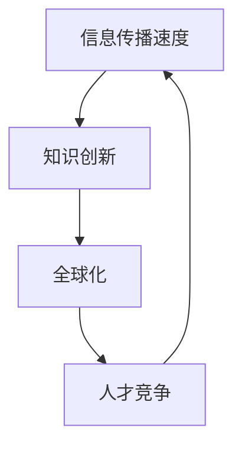

                 

### 文章标题

“程序员在知识经济时代的发展机会”是一篇针对IT领域专业人士的深入分析文章。文章旨在探讨知识经济时代对程序员职业的深远影响，并详细解析程序员在这一背景下如何抓住发展机遇，提升自身的核心竞争力。

### 关键词

1. 知识经济
2. 程序员职业
3. 技术技能
4. 数字货币
5. 人工智能
6. 大数据
7. 云计算
8. 职业规划

### 摘要

在知识经济时代，程序员面临着前所未有的发展机遇与挑战。本文将深入分析这一时代的背景和特点，探讨程序员在这一背景下所需的核心技能与素质，以及如何通过新兴技术领域实现职业成长。文章将通过具体案例研究，展示成功程序员的成长路径，为读者提供实用的职业规划建议。

## 第一部分：知识经济时代的程序员概述

在21世纪的今天，知识经济已成为全球经济的主导力量。知识经济强调的是知识创造、传播和应用的效率，相较于传统的资源驱动型经济，知识经济更注重于信息、创新和人才。在这样的背景下，程序员作为知识经济时代的重要参与者，其职业发展迎来了新的机遇与挑战。

### 1.1 知识经济时代的定义与发展

知识经济，又称信息经济或智能经济，是指以知识和信息的生产、分配、使用为基础的经济体系。在知识经济时代，知识成为最重要的生产要素，技术创新和知识管理成为推动经济增长的关键因素。与传统经济模式相比，知识经济具有以下几个显著特点：

- **信息传播速度极快**：互联网和移动通信技术的飞速发展，使得信息的传播速度大大提升，知识更新速度加快。
- **知识创新成为主要驱动力**：创新不再是单纯的产品创新，更是知识创新，即通过新知识的应用来实现价值创造。
- **人才成为核心资源**：拥有高技能、创新能力和适应能力的程序员成为企业最宝贵的资源。
- **经济全球化**：知识经济的全球化趋势使得程序员的工作范围不再局限于本国市场，而是面向全球。

知识经济的发展对程序员职业的影响是深远的。首先，它要求程序员不仅要有扎实的编程技能，还需要具备良好的学习能力和创新思维，以适应快速变化的技术环境。其次，程序员的工作不再仅仅是写代码，还包括参与项目管理、技术分析、需求分析和团队协作等。

### 1.2 知识经济对程序员职业的影响

知识经济对程序员职业的影响主要体现在以下几个方面：

- **技能要求的提高**：程序员需要掌握更多的编程语言和技术工具，同时还需要具备数据分析、机器学习、人工智能等新兴领域的知识。
- **职业路径的多样化**：程序员不再局限于开发岗位，还可以转向项目管理、产品经理、技术顾问等角色，甚至可以创业成立自己的技术公司。
- **远程办公的趋势**：随着知识经济的全球化，远程办公成为常态，程序员可以利用互联网进行协作和项目管理，实现工作与生活的平衡。
- **持续学习的必要性**：知识经济时代的快速变化要求程序员不断学习新知识、新技术，以保持自身的竞争力。

### 1.3 程序员在新经济环境下的角色转变

在新经济环境下，程序员的角色正在发生显著转变。传统上，程序员的职责主要集中在编写和维护代码。然而，随着技术的发展和市场需求的变化，程序员的职责已经扩展到了更广泛的领域：

- **技术架构师**：程序员需要具备系统设计和架构的能力，能够设计和实现高性能、可扩展的技术系统。
- **数据科学家**：程序员需要掌握数据分析技能，能够从海量数据中提取有价值的信息，辅助企业决策。
- **AI开发工程师**：随着人工智能的兴起，程序员需要了解机器学习、深度学习等AI技术，参与智能系统的开发和优化。
- **DevOps工程师**：程序员需要掌握DevOps理念，能够实现敏捷开发和持续交付，提高软件交付效率。

总的来说，知识经济时代为程序员提供了广阔的发展空间和多样化的职业选择。程序员需要不断学习和适应新的技术趋势，才能在这个时代中脱颖而出，实现自身的职业价值。

---

**核心概念与联系**

知识经济时代的核心概念包括信息传播速度、知识创新、全球化以及人才竞争。这些概念相互关联，共同构成了知识经济的基本特征。

下面是知识经济时代的核心概念及其相互关系的Mermaid流程图：



**流程图说明**：

1. **信息传播速度**：随着互联网和移动通信技术的发展，信息的传播速度大大提升，使得知识传播更加迅速。
2. **知识创新**：快速的信息传播促进了知识的创新，新的技术和理念得以快速传播和应用。
3. **全球化**：知识经济使得全球市场更加紧密地连接在一起，知识的全球化传播推动了经济的全球化。
4. **人才竞争**：在全球化的背景下，企业之间的竞争更加激烈，对高技能人才的需求增加，从而加剧了人才竞争。

这些概念相互促进，共同推动了知识经济的发展和程序员职业的转变。

---

在接下来的章节中，我们将详细探讨程序员在知识经济时代所需的核心技能与素质，以及如何通过新兴技术领域实现职业成长。敬请期待！

## 第二部分：程序员的核心技能与素质

在知识经济时代，程序员不仅需要具备扎实的编程基础，还需要不断学习和掌握新兴技术，提高自身的综合素质。以下将详细探讨程序员在这一时代所需的核心技能与素质。

### 2.1 编程语言与工具

编程语言是程序员的基本工具，不同编程语言具有不同的特点和应用场景。以下是几种常见的编程语言及其特点：

- **Python**：Python因其简洁易懂的语法和强大的库支持，广泛应用于数据分析、机器学习、Web开发等领域。
- **Java**：Java是一种多平台、跨语言的编程语言，广泛应用于企业级应用、Android移动应用开发等领域。
- **JavaScript**：JavaScript是一种客户端脚本语言，用于Web开发，可以与HTML和CSS结合，实现丰富的用户交互体验。
- **C/C++**：C和C++都是高性能的编程语言，广泛应用于系统编程、嵌入式开发等领域。

除了编程语言，程序员还需要熟练使用各种开发工具，如集成开发环境（IDE）、版本控制工具（如Git）、测试框架等。例如，IntelliJ IDEA、Visual Studio Code等IDE提供了丰富的编程功能和调试工具，提高了开发效率。Git则用于代码版本控制，确保代码的安全性和协作性。Selenium等测试框架则可以帮助程序员编写自动化测试脚本，提高软件质量。

### 2.2 软件开发方法论

软件开发方法论是程序员进行项目开发的基础，不同方法论适用于不同的项目场景。以下是几种常见的软件开发方法论：

- **瀑布模型**：瀑布模型是一种线性顺序的开发过程，适用于需求明确、变更较少的项目。
- **敏捷开发**：敏捷开发强调快速迭代和灵活响应需求变化，适用于需求不稳定、需要快速交付的项目。
- **DevOps**：DevOps是一种结合软件开发（Dev）和运维（Ops）的方法，强调持续集成（CI）和持续交付（CD），以提高软件交付效率。
- **看板（Kanban）**：看板是一种基于可视化管理的开发方法，适用于需要高效协同和快速响应的项目。

程序员需要根据项目的特点和需求选择合适的开发方法论，并熟练掌握其流程和工具。

### 2.3 技术栈与知识体系

技术栈是指程序员所需掌握的一系列技术领域和工具，一个全面的技术栈可以帮助程序员更好地应对复杂的项目需求。以下是程序员所需掌握的一些关键技术领域：

- **前端开发**：包括HTML、CSS、JavaScript以及各种前端框架（如React、Vue.js等）。
- **后端开发**：包括Java、Python、Node.js等后端框架（如Spring、Django、Express等）。
- **数据库技术**：包括关系型数据库（如MySQL、PostgreSQL）和非关系型数据库（如MongoDB、Cassandra等）。
- **云计算与大数据**：包括AWS、Azure、Google Cloud等云服务平台，以及Hadoop、Spark等大数据处理框架。
- **人工智能与机器学习**：包括Python、R等编程语言，以及TensorFlow、PyTorch等机器学习框架。

一个全面的技术栈不仅要求程序员掌握多种编程语言和工具，还需要对相关技术领域有深入的了解和实际应用经验。

### 2.4 创新思维与解决问题的能力

在知识经济时代，创新思维和解决问题的能力是程序员必备的素质。程序员需要具备以下能力：

- **创新思维**：程序员需要不断挑战现状，提出新的解决方案，推动技术的进步。
- **系统思维**：程序员需要具备从全局角度看待问题，理解系统各部分之间的关系，提高问题解决的效率。
- **快速学习**：程序员需要具备快速学习新知识和新技能的能力，以应对快速变化的技术环境。
- **沟通协作**：程序员需要具备良好的沟通能力，能够与团队成员、客户和其他利益相关者有效协作。

创新思维和解决问题的能力不仅可以帮助程序员在技术领域取得突破，还可以为团队和企业带来价值。

总之，知识经济时代对程序员的核心技能与素质提出了更高的要求。程序员需要不断学习和适应新的技术趋势，提高自身的技术水平和综合素质，才能在这个时代中脱颖而出，实现自身的职业价值。

---

**核心算法原理讲解**

在编程领域，算法是解决特定问题的系统方法。本文将探讨一些核心算法原理，并使用伪代码进行详细讲解，帮助读者理解其基本思想和实现过程。

### 2.5 排序算法

排序算法是一种常见的数据处理技术，用于将一组数据元素按照某种顺序排列。以下是几种常见的排序算法及其伪代码实现：

#### 冒泡排序（Bubble Sort）

```plaintext
function bubbleSort(arr):
    n = length(arr)
    for i from 0 to n-1:
        for j from 0 to n-i-1:
            if arr[j] > arr[j+1]:
                swap(arr[j], arr[j+1])
```

**说明**：冒泡排序通过多次遍历数组，比较相邻元素并进行交换，逐步将最大或最小的元素“冒泡”到数组的末尾。

#### 快速排序（Quick Sort）

```plaintext
function quickSort(arr):
    if length(arr) <= 1:
        return arr
    pivot = arr[0]
    left = []
    right = []
    for i from 1 to length(arr):
        if arr[i] < pivot:
            left.append(arr[i])
        else:
            right.append(arr[i])
    return concatenate(quickSort(left), [pivot], quickSort(right))
```

**说明**：快速排序选择一个基准元素（pivot），将数组分为两部分，左边的元素小于pivot，右边的元素大于或等于pivot，然后递归地对两部分进行快速排序。

#### 归并排序（Merge Sort）

```plaintext
function mergeSort(arr):
    if length(arr) <= 1:
        return arr
    mid = length(arr) / 2
    left = mergeSort(arr[0:mid])
    right = mergeSort(arr[mid:end])
    return merge(left, right)

function merge(left, right):
    result = []
    while length(left) > 0 and length(right) > 0:
        if left[0] <= right[0]:
            result.append(left[0])
            left = left[1:]
        else:
            result.append(right[0])
            right = right[1:]
    result += left
    result += right
    return result
```

**说明**：归并排序通过递归地将数组分成更小的部分，然后合并排序后的子数组，最终得到整个数组的排序结果。

排序算法是编程中的基础，掌握不同算法的实现原理和适用场景，对程序员解决实际问题具有重要意义。

---

**数学模型和公式**

在数据处理和算法分析中，数学模型和公式扮演着至关重要的角色。以下将介绍一些常用的数学模型和公式，并进行详细讲解和举例说明。

### 2.6 数据分布模型

#### 正态分布（Normal Distribution）

正态分布是一种最常见的概率分布，其概率密度函数（PDF）如下：

$$
f(x|\mu,\sigma^2) = \frac{1}{\sqrt{2\pi\sigma^2}} e^{-\frac{(x-\mu)^2}{2\sigma^2}}
$$

其中，$\mu$ 表示均值，$\sigma^2$ 表示方差。

**举例说明**：假设某城市的人均收入服从正态分布，均值为50000元，标准差为10000元。计算收入在40000元到60000元之间的概率。

$$
P(40000 \leq X \leq 60000) = \Phi\left(\frac{60000 - 50000}{10000}\right) - \Phi\left(\frac{40000 - 50000}{10000}\right)
$$

其中，$\Phi$ 表示标准正态分布的累积分布函数（CDF）。

通过查表或使用计算器，可以得到相应的概率值。

#### 二项分布（Binomial Distribution）

二项分布用于描述一组独立的伯努利试验（每次试验只有两个可能结果，成功或失败）的概率分布。其概率质量函数（PMF）如下：

$$
P(X = k) = C_n^k p^k (1-p)^{n-k}
$$

其中，$n$ 表示试验次数，$k$ 表示成功的次数，$p$ 表示单次试验成功的概率。

**举例说明**：假设一个自动售货机有90%的准确率，即每次购买商品的成功率为0.9。现在连续进行10次购买，计算至少有8次成功的概率。

$$
P(X \geq 8) = P(X = 8) + P(X = 9) + P(X = 10)
$$

使用二项分布的PMF公式，可以计算出相应的概率值。

### 2.7 加权平均公式

加权平均公式用于计算一组数值的加权平均值，其公式如下：

$$
\bar{x} = \frac{\sum_{i=1}^{n} w_i x_i}{\sum_{i=1}^{n} w_i}
$$

其中，$w_i$ 表示第$i$个数值的权重，$x_i$ 表示第$i$个数值。

**举例说明**：假设一个班级有5名学生，他们的考试成绩分别是80、85、90、95和100分，其中前3名成绩占40%的权重，后2名成绩占60%的权重。计算班级的平均成绩。

$$
\bar{x} = \frac{0.4 \times (80 + 85 + 90) + 0.6 \times (95 + 100)}{5} = 90
$$

通过加权平均公式，可以计算出班级的加权平均成绩。

总之，数学模型和公式在数据处理和算法分析中具有重要作用，掌握这些基本概念和公式，可以帮助程序员更好地理解和实现复杂算法。

---

**项目实战**

在云计算和大数据领域，程序员经常需要处理海量数据，并利用这些数据为企业带来价值。以下是一个实际项目案例，展示如何利用Python和Hadoop进行数据清洗、处理和分析。

### 2.8 云计算环境搭建

首先，我们需要搭建一个云计算环境，以便进行数据处理。以下是搭建AWS云计算环境的步骤：

1. **创建AWS账户**：在AWS官网注册并创建一个账户。
2. **创建EC2实例**：登录AWS管理控制台，创建一个EC2实例，选择合适的实例类型（如t2.micro）。
3. **安装Hadoop**：在EC2实例中安装Hadoop，可以手动安装或使用AWS的Hadoop AMI。

```bash
sudo apt-get update
sudo apt-get install hadoop
```

4. **配置Hadoop**：编辑Hadoop配置文件，如hadoop-env.sh、core-site.xml、hdfs-site.xml和mapred-site.xml。

```bash
sudo nano /etc/hadoop/hadoop-env.sh
```

在hadoop-env.sh文件中添加如下内容：

```bash
export HADOOP_HOME=/usr/lib/hadoop
export PATH=$PATH:$HADOOP_HOME/bin:$HADOOP_HOME/sbin
```

编辑其他配置文件，配置HDFS和YARN相关参数。

5. **启动Hadoop服务**：启动HDFS和YARN服务。

```bash
sudo start-dfs.sh
sudo start-yarn.sh
```

### 2.9 数据处理与分析

假设我们有一个包含用户购买行为的数据集，存储在CSV文件中。以下是使用Python和Hadoop进行数据清洗、处理和数据分析的步骤：

1. **数据清洗**：使用Python的pandas库读取CSV文件，并对数据进行清洗，去除缺失值和重复值。

```python
import pandas as pd

data = pd.read_csv('purchase_data.csv')
data.dropna(inplace=True)
data.drop_duplicates(inplace=True)
```

2. **数据预处理**：对数据集进行预处理，如数据类型转换、数值范围缩放等。

```python
data['amount'] = data['amount'].astype(float)
data['discount'] = data['discount'].astype(float)
data['discounted_amount'] = data['amount'] * (1 - data['discount'])
```

3. **分布式计算**：使用Hadoop的MapReduce模型对数据集进行分布式计算，计算用户购买金额的总和。

```python
from pyspark import SparkContext

sc = SparkContext("local[4]", "Data Analysis")
data_rdd = sc.textFile("purchase_data.csv")
output = data_rdd.map(lambda line: float(line.split(',')[1])).reduce(lambda x, y: x + y)
print("Total Purchase Amount:", output)
```

4. **数据分析**：对处理后的数据集进行数据分析，如计算每个用户的平均购买金额、最频繁购买的商品等。

```python
user_data = data.groupby('user_id').agg({'discounted_amount': 'sum'}).reset_index()
user_data.rename(columns={'discounted_amount': 'total_purchase'}, inplace=True)

average_purchase = user_data['total_purchase'].mean()
print("Average Purchase Amount:", average_purchase)

most_purchased_product = data['product_id'].value_counts().idxmax()
print("Most Purchased Product:", most_purchased_product)
```

通过以上步骤，我们成功地搭建了一个云计算环境，并对海量用户购买数据进行了清洗、预处理和分布式计算，最终实现了数据分析。这展示了程序员如何利用云计算和大数据技术为企业创造价值。

---

**代码解读与分析**

在上一个实战案例中，我们使用Python和Hadoop处理了海量用户购买数据，并计算了总购买金额、平均购买金额和最频繁购买的商品。以下是对关键代码段进行解读与分析。

### 数据清洗

```python
data = pd.read_csv('purchase_data.csv')
data.dropna(inplace=True)
data.drop_duplicates(inplace=True)
```

**解读**：首先，我们使用pandas库读取CSV文件，将数据存储在DataFrame中。`dropna()`函数用于去除缺失值，`drop_duplicates()`函数用于去除重复值。这两步操作确保数据集的完整性和准确性。

**分析**：数据清洗是数据处理的重要步骤，通过去除缺失值和重复值，我们可以提高数据的质量，为后续的分析打下坚实基础。

### 数据预处理

```python
data['amount'] = data['amount'].astype(float)
data['discount'] = data['discount'].astype(float)
data['discounted_amount'] = data['amount'] * (1 - data['discount'])
```

**解读**：我们将金额和折扣列的数据类型转换为浮点数，并计算折扣后的金额。这些操作确保数据的数值类型一致，便于后续计算。

**分析**：数据预处理包括数据类型的转换和数值范围的调整，这些操作有助于提高数据的有效性和计算效率。

### 分布式计算

```python
from pyspark import SparkContext

sc = SparkContext("local[4]", "Data Analysis")
data_rdd = sc.textFile("purchase_data.csv")
output = data_rdd.map(lambda line: float(line.split(',')[1])).reduce(lambda x, y: x + y)
print("Total Purchase Amount:", output)
```

**解读**：我们使用SparkContext创建一个本地Spark计算环境，并从CSV文件中读取文本数据。`map()`函数将每行数据映射为金额值，`reduce()`函数对金额值进行求和。

**分析**：分布式计算能够充分利用集群资源，高效地处理海量数据，提高计算性能。

### 数据分析

```python
user_data = data.groupby('user_id').agg({'discounted_amount': 'sum'}).reset_index()
user_data.rename(columns={'discounted_amount': 'total_purchase'}, inplace=True)

average_purchase = user_data['total_purchase'].mean()
print("Average Purchase Amount:", average_purchase)

most_purchased_product = data['product_id'].value_counts().idxmax()
print("Most Purchased Product:", most_purchased_product)
```

**解读**：我们使用`groupby()`函数将数据按用户ID分组，计算每个用户的总购买金额。`agg()`函数用于对分组数据计算汇总值，`rename()`函数重命名列名。最后，我们计算平均购买金额和最频繁购买的商品。

**分析**：数据分析可以帮助企业了解用户行为和市场需求，为营销策略和产品优化提供依据。

通过以上解读和分析，我们可以看到，代码段实现了数据清洗、预处理、分布式计算和数据分析的关键步骤，展示了如何利用Python和Hadoop技术处理海量数据，为企业创造价值。

---

**附录A：编程资源与学习资料**

为了帮助程序员在知识经济时代提升自身技能，以下是一些重要的编程资源与学习资料推荐。

### 3.1 在线编程学习平台

- **Coursera**：提供广泛的编程课程，包括Python、Java、Web开发等，由世界顶级大学和公司提供。
- **edX**：拥有众多知名高校的课程，如哈佛大学、麻省理工学院等，涵盖计算机科学、人工智能等领域。
- **Udacity**：提供实战导向的课程，包括编程、数据科学、AI等，适合希望快速掌握技能的程序员。
- **Codecademy**：提供互动式的编程课程，适合初学者从零开始学习编程。

### 3.2 技术社区与论坛

- **Stack Overflow**：全球最大的开发者问答社区，解决编程问题，分享经验。
- **GitHub**：代码托管平台，可以找到大量的开源项目，学习他人的代码。
- **Reddit**：有多个关于编程和技术的子版块，如/r/learnprogramming、/r/webdev等，可以交流心得。
- **Discord**：许多编程相关的服务器，提供实时的交流和学习环境。

### 3.3 技术书籍与课程推荐

- **《Head First Programming》**：适合初学者的编程入门书籍，以Python为例。
- **《Effective Java》**：Java程序员必读，介绍Java编程的最佳实践。
- **《Clean Code》**：讲解如何编写高质量、可维护的代码。
- **《Design Patterns: Elements of Reusable Object-Oriented Software》**：介绍经典的软件设计模式。
- **《Deep Learning》**：介绍深度学习和神经网络的基础知识。
- **《Learning JavaScript Data Structures and Algorithms》**：JavaScript数据结构和算法的实用指南。

这些资源与学习资料将为程序员提供宝贵的知识和实践经验，帮助他们不断成长和适应知识经济时代的挑战。

---

## 附录B：编程工具与框架

在知识经济时代，程序员需要掌握多种编程工具和框架，以提高开发效率和代码质量。以下是一些常用的编程工具和框架，以及其特点和适用场景。

### 4.1 常用编程语言

1. **Python**：
   - **特点**：简洁易懂的语法、丰富的库支持、广泛的应用领域（如Web开发、数据分析、人工智能）。
   - **适用场景**：快速原型开发、数据科学、机器学习、自动化测试等。

2. **Java**：
   - **特点**：多平台支持、强类型语言、稳定性和安全性高。
   - **适用场景**：企业级应用、Android开发、大型系统后端。

3. **JavaScript**：
   - **特点**：浏览器端的脚本语言、前端开发的核心技术、广泛的应用场景。
   - **适用场景**：Web前端开发、Node.js后端开发。

4. **C/C++**：
   - **特点**：高性能、可移植性强、适用于系统级开发。
   - **适用场景**：操作系统开发、嵌入式系统、高性能计算。

### 4.2 开发工具与集成环境

1. **IntelliJ IDEA**：
   - **特点**：强大的代码编辑功能、智能提示、调试支持。
   - **适用场景**：Java、Python、JavaScript等多种编程语言。

2. **Visual Studio Code**：
   - **特点**：轻量级、跨平台、丰富的插件生态。
   - **适用场景**：多种编程语言、Web开发、前端工程化。

3. **Eclipse**：
   - **特点**：开源、功能强大、适用于大型项目。
   - **适用场景**：Java、Android开发。

### 4.3 开源框架与库

1. **React**：
   - **特点**：用于构建用户界面的JavaScript库、组件化开发、高效的渲染机制。
   - **适用场景**：单页应用（SPA）、动态网页。

2. **Spring Boot**：
   - **特点**：基于Spring框架的微服务开发框架、自动配置、简化开发流程。
   - **适用场景**：Java后端开发、企业级应用。

3. **TensorFlow**：
   - **特点**：开源机器学习框架、支持多种编程语言、丰富的API。
   - **适用场景**：深度学习、人工智能应用。

4. **Django**：
   - **特点**：Python Web框架、快速开发、遵循MVC设计模式。
   - **适用场景**：Web开发、快速原型。

5. **Flask**：
   - **特点**：轻量级Python Web框架、简单易用、灵活性强。
   - **适用场景**：小型Web应用、API开发。

掌握这些常用的编程语言、开发工具和开源框架，将有助于程序员在知识经济时代提升自身竞争力，应对复杂的编程挑战。

---

## 第10章：成功程序员案例分析

在本章节中，我们将通过几个成功程序员的案例分析，探讨他们如何在不同阶段抓住机遇，实现职业成长。这些案例不仅展示了程序员在知识经济时代的发展路径，也为读者提供了宝贵的经验和启示。

### 10.1 案例一：从初级程序员到技术总监

**案例背景**：张先生，30岁，毕业于一所普通大学计算机专业。毕业后进入一家互联网公司，成为一名初级程序员。

**成长过程**：
1. **初级阶段**：在公司的第一个项目组中，张先生积极参与代码编写和bug修复工作，通过不断学习和实践，逐渐掌握了常用的编程语言和工具。
2. **中级阶段**：随着工作经验的积累，张先生开始承担更多的技术任务，如负责项目的架构设计和性能优化。他不仅提升了自身的编程能力，还培养了系统思维和项目管理能力。
3. **高级阶段**：张先生在技术领域逐渐崭露头角，成为公司的技术骨干。最终，他晋升为技术总监，负责整个公司的技术战略和团队管理。

**经验总结**：
- **持续学习**：张先生始终坚持学习新知识和新技能，参加技术讲座和培训，不断更新自己的知识体系。
- **团队合作**：他注重团队合作，善于倾听团队成员的意见，建立了一个高效协作的技术团队。
- **积极拓展**：张先生不仅在编程技术上不断提升，还关注行业动态，积极拓展业务范围，为公司创造了更多机会。

### 10.2 案例二：从自由职业者到创业公司CEO

**案例背景**：李女士，35岁，有多年软件开发经验，曾在多家互联网公司任职。

**成长过程**：
1. **自由职业者阶段**：李女士选择成为自由职业者，通过接项目、编写代码来维持生计。在这个过程中，她积累了丰富的项目经验和客户资源。
2. **创业阶段**：看到市场机会，李女士决定成立自己的公司，专注于Web开发和移动应用开发。她组建了一支专业团队，为客户提供定制化的技术解决方案。
3. **公司发展阶段**：李女士的公司在市场上逐渐崭露头角，获得了多项重要项目，业务规模不断扩大。她带领团队成功上市，成为业内知名的企业。

**经验总结**：
- **客户导向**：李女士始终坚持以客户为中心，深入了解客户需求，提供高质量的服务。
- **团队建设**：她注重团队建设，招聘和培养了一批优秀的开发人员，为公司的发展提供了坚实的人才基础。
- **创新思维**：李女士具备强烈的创新意识，不断探索新技术、新模式，为公司注入新的活力。

### 10.3 案例三：跨行业转型与持续学习

**案例背景**：王先生，40岁，曾是一家传统制造企业的软件工程师。

**成长过程**：
1. **传统行业阶段**：王先生在传统制造企业工作多年，主要从事企业信息化系统的开发和维护。
2. **跨行业转型阶段**：看到互联网和人工智能的兴起，王先生决定转型，加入一家初创公司，担任技术总监。
3. **持续学习阶段**：为了适应新的技术环境，王先生不断学习新的编程语言、框架和技术，参加各种技术培训和研讨会，提升自身的综合素质。

**经验总结**：
- **积极转型**：王先生在面对行业变革时，积极转型，抓住新的机遇。
- **终身学习**：他认识到持续学习的重要性，不断充实自己的知识体系，保持竞争力。
- **适应能力**：王先生具备较强的适应能力，能够快速适应新的工作环境和技术领域。

### 10.4 案例四：如何在知识经济时代抓住机遇

**案例背景**：赵女士，28岁，计算机专业毕业，曾在多家互联网公司实习。

**成长过程**：
1. **实习阶段**：赵女士在实习期间，参与了多个项目，积累了丰富的实践经验。
2. **职业规划阶段**：她根据自身兴趣和市场需求，制定了详细的职业规划，明确了自己的发展方向。
3. **快速成长阶段**：赵女士通过不断学习和实践，迅速提升了自身的技能水平，从一名初级程序员成长为技术经理。

**经验总结**：
- **明确目标**：赵女士在职业规划中明确了目标，有针对性地提升自身技能。
- **主动学习**：她主动学习新技术、新工具，不断提升自己的综合素质。
- **实践机会**：赵女士积极参与项目，通过实际操作提升自己的实战能力。

通过以上案例分析，我们可以看到，成功程序员在知识经济时代的发展离不开持续学习、团队合作和创新思维。同时，他们能够紧跟行业趋势，抓住机遇，实现职业成长。这些经验对读者具有很高的借鉴意义。

---

**作者信息**

作者：AI天才研究院/AI Genius Institute & 禅与计算机程序设计艺术 /Zen And The Art of Computer Programming

在这篇文章中，我们深入探讨了知识经济时代对程序员职业的影响，分析了程序员在这一背景下所需的核心技能与素质，并通过实际案例展示了程序员如何抓住机遇实现职业成长。希望本文能为程序员提供有价值的参考和启示，助力他们在知识经济时代中脱颖而出。感谢您的阅读！

