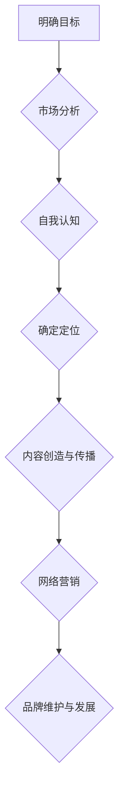

                 

### 《程序员如何打造个人知识品牌》

> **关键词：** 个人知识品牌、程序员、品牌建设、内容创造、社交媒体、网络营销

> **摘要：** 本文旨在探讨程序员如何通过有效的个人品牌建设，提升职业竞争力，实现个人价值的最大化。文章将从个人品牌的定义与价值、自我认知与定位、内容创造与传播、网络营销、个人品牌的维护与发展等多个方面，提供一套系统化的策略和方法，助力程序员打造出具有高度专业性和影响力的个人知识品牌。

---

在信息技术飞速发展的今天，程序员这一职业越来越受到社会的关注和尊重。然而，随着竞争的加剧，程序员们不仅需要在技术上不断精进，还需要具备强大的个人品牌意识。一个成功的个人知识品牌能够显著提升程序员的职业竞争力，为个人的职业发展打开新的大门。本文将详细探讨程序员如何打造个人知识品牌，包括基础构建、自我认知、内容创造、网络营销、品牌维护与发展等多个方面，并提供实际案例分析，旨在为程序员们提供一套切实可行的策略。

### 第一部分：打造个人品牌的基础

在开始具体构建个人品牌之前，我们需要理解几个核心概念，包括个人品牌、个人品牌的价值以及构建个人品牌的步骤。

#### **第1章：理解个人品牌的概念与价值**

**1.1 个人品牌的定义与意义**

个人品牌，顾名思义，就是个人在公众心目中的形象和认知。对于程序员而言，个人品牌不仅仅是一个名字或头衔，更是一个包含专业技能、知识深度、职业素养等多方面因素的综合体现。一个强大的个人品牌能够为程序员带来以下几个方面的价值：

1. **职业晋升**：良好的个人品牌有助于程序员在职场中获得更多的机会，例如晋升、项目负责等。
2. **薪资增长**：一个有影响力的个人品牌能够帮助程序员获得更高的薪资待遇。
3. **人脉扩展**：通过个人品牌的建设，程序员可以接触到更多行业内的资深人士，从而扩展自己的人脉网络。
4. **影响力增强**：个人品牌有助于程序员在技术社区或行业中树立权威形象，提升个人影响力。

**1.2 个人品牌与职业发展的关系**

个人品牌与职业发展紧密相关。一个明确的个人品牌能够帮助程序员在职业生涯中找到自己的定位，从而更加专注地发展自己的专业技能。同时，个人品牌也为程序员提供了一个展示自己的平台，使他们在众多竞争者中脱颖而出。以下是个人品牌与职业发展的几个关键联系：

1. **明确个人定位**：个人品牌可以帮助程序员明确自己的职业定位，从而有针对性地进行技能提升和职业规划。
2. **建立专业形象**：良好的个人品牌能够为程序员在职场中树立专业形象，增强同事和上级的信任。
3. **拓展职业机会**：个人品牌有助于程序员在行业内建立口碑，从而获得更多的职业发展机会。
4. **提升职业价值**：一个有影响力的个人品牌能够显著提升程序员的职业价值，为薪资增长和职业晋升提供强有力的支持。

**1.3 个人品牌的构建步骤**

构建一个成功的个人品牌需要系统化的规划和执行。以下是构建个人品牌的几个关键步骤：

1. **明确个人品牌定位**：首先要明确自己的专业领域、兴趣点和目标受众，从而构建一个清晰的品牌定位。
2. **定义目标受众**：明确自己的目标受众，包括职业群体、技术爱好者等，以便更精准地进行品牌传播。
3. **制定品牌传播策略**：根据品牌定位和目标受众，制定具体的品牌传播策略，包括内容创造、社交媒体运营、网络营销等。
4. **持续优化与调整**：品牌建设是一个持续的过程，需要根据市场反馈和自身情况不断进行调整和优化。

#### **第2章：自我认知与定位**

**2.1 自我认知的重要性**

自我认知是指对自己能力、兴趣、价值观等内在特质的深刻理解。对于程序员来说，自我认知是构建个人品牌的基础。以下是自我认知对个人品牌建设的重要性：

1. **明确个人优势**：通过自我认知，程序员可以明确自己的优势和特长，从而有针对性地进行技能提升。
2. **增强职业自信**：清晰的自我认知有助于程序员在职业发展中保持自信，更好地应对挑战。
3. **精准定位个人品牌**：自我认知有助于程序员找到自己的职业定位，从而构建一个具有高度专业性和影响力的个人品牌。
4. **提升个人魅力**：自我认知有助于程序员在职场中展现出独特的个性和魅力，增强个人吸引力。

**2.2 确定个人品牌定位**

确定个人品牌定位是构建个人品牌的关键步骤。以下是几个关键策略：

1. **分析市场趋势**：通过分析行业趋势和市场需求，找到自己的定位，从而在竞争激烈的市场中占据一席之地。
2. **发挥个人优势**：根据自己的优势和特长，确定个人品牌的核心竞争力。
3. **细分目标受众**：明确自己的目标受众，包括职业群体、技术爱好者等，以便更精准地进行品牌传播。
4. **案例参考**：参考行业内的成功案例，了解他们的定位策略，从中获得启发。

**2.3 个人品牌的差异化**

在构建个人品牌时，差异化策略至关重要。以下是几个差异化策略：

1. **技术专长**：在某个技术领域深耕细作，成为该领域的专家，从而在竞争中脱颖而出。
2. **内容独特性**：创造具有独特性、创新性的内容，避免与他人雷同。
3. **价值观传播**：传递自己的价值观，形成独特的个人风格。
4. **专业认证**：获取相关领域的专业认证，增强个人品牌的专业性。

#### **第3章：内容创造与传播**

**3.1 内容创造的原则**

内容创造是个人品牌建设的重要组成部分。以下是几个内容创造的原则：

1. **专业性与实用性**：内容需要具备专业性和实用性，能够为读者提供价值。
2. **原创性与独特性**：内容应具备原创性和独特性，避免与他人雷同。
3. **系统性**：内容需要具备系统性，帮助读者更好地理解和掌握相关知识点。
4. **简洁性与易读性**：内容应简洁明了，易于阅读和理解。

**3.2 内容传播渠道**

选择合适的内容传播渠道是品牌传播的关键。以下是几个常见的内容传播渠道：

1. **社交媒体**：如微博、微信公众号、知乎等，通过这些平台与读者建立互动。
2. **个人博客**：搭建自己的个人博客，发布高质量的技术文章和博客。
3. **技术社区**：如CSDN、博客园等，参与技术讨论，分享经验。
4. **网络研讨会和直播**：通过线上研讨会和直播，与读者进行实时互动。

**3.3 社交媒体运营技巧**

社交媒体运营技巧对个人品牌的传播至关重要。以下是几个社交媒体运营技巧：

1. **内容发布策略**：定期发布高质量内容，保持活跃度。
2. **互动与反馈**：与读者进行互动，及时回复评论和提问。
3. **话题营销**：结合热门话题，创造有趣的内容，吸引更多关注。
4. **数据分析**：利用数据分析工具，了解读者需求，优化内容策略。

### 第二部分：深化个人品牌建设

在构建了个人品牌的基础后，我们需要进一步深化品牌建设，通过内容创造、网络营销等多方面的努力，使个人品牌在行业内具有更高的知名度和影响力。

#### **第4章：个人品牌的网络营销**

**4.1 网络营销的基础知识**

网络营销是指通过互联网进行的市场营销活动。对于程序员来说，网络营销是实现个人品牌建设的重要手段。以下是网络营销的几个基础知识：

1. **网络营销的定义**：网络营销是指通过网络渠道进行的营销活动，包括搜索引擎优化（SEO）、搜索引擎营销（SEM）、内容营销、社交媒体营销等。
2. **网络营销的目标**：网络营销的目标包括增加品牌知名度、提高网站流量、增加潜在客户、提高销售额等。
3. **网络营销的优势**：网络营销具有成本低、覆盖面广、互动性强等优势，能够有效提升个人品牌的影响力。

**4.2 SEO与SEM策略**

SEO（搜索引擎优化）和SEM（搜索引擎营销）是网络营销的两个核心组成部分。以下是SEO和SEM的详细策略：

**SEO策略**：

1. **关键词研究**：通过关键词研究，找到目标受众常用的关键词，优化网站内容和标题。
2. **网站优化**：优化网站结构、页面速度、内部链接等，提高网站在搜索引擎中的排名。
3. **内容创作**：创作高质量、原创性的内容，增加网站流量和用户粘性。
4. **外链建设**：通过高质量的外链建设，提高网站的权威性和影响力。

**SEM策略**：

1. **广告平台选择**：选择适合的广告平台，如百度推广、谷歌广告等。
2. **关键词竞价**：通过竞价，提高目标关键词的排名，增加曝光度。
3. **广告创意**：创作吸引人的广告文案和图片，提高点击率。
4. **数据分析**：通过数据分析，了解广告效果，不断优化广告策略。

**4.3 网络广告与推广**

网络广告和推广是提升个人品牌影响力的重要手段。以下是几个常见的网络广告与推广策略：

1. **内容广告**：在相关网站或平台上投放内容广告，如文章、视频等。
2. **社交媒体广告**：在社交媒体平台上投放广告，如微博、微信公众号等。
3. **邮件营销**：通过邮件向目标受众发送营销邮件，推广个人品牌和产品。
4. **合作伙伴推广**：与相关领域的合作伙伴进行联合推广，扩大品牌影响力。

### **第三部分：个人品牌的维护与发展**

#### **第5章：个人品牌的维护与发展**

个人品牌的建设是一个持续的过程，需要不断地维护和发展。以下是个人品牌维护与发展的几个关键策略：

**5.1 个人品牌维护的重要性**

个人品牌维护是指通过持续的努力，保持个人品牌的专业性和影响力。以下是个人品牌维护的重要性：

1. **品牌形象管理**：保持良好的品牌形象，避免负面信息对品牌造成影响。
2. **持续学习**：通过不断学习，提升自己的专业能力和知识水平，保持品牌竞争力。
3. **用户参与**：与读者保持互动，了解他们的需求和反馈，不断优化个人品牌内容。
4. **舆论监控**：及时监控网络舆论，应对可能的负面评论和攻击。

**5.2 品牌扩张与延伸**

品牌扩张与延伸是指将个人品牌扩展到新的领域或产品。以下是品牌扩张与延伸的几个策略：

1. **多领域发展**：在原有领域的基础上，探索新的技术领域，扩展品牌影响力。
2. **产品延伸**：通过推出新的产品或服务，实现品牌的多元化发展。
3. **跨界合作**：与不同领域的专家或企业进行合作，共同开发新产品或服务。
4. **品牌延伸案例分析**：通过分析成功的品牌延伸案例，了解其成功的原因和策略。

**5.3 个人品牌持续发展的策略**

个人品牌持续发展需要不断的学习、创新和优化。以下是几个持续发展的策略：

1. **自我提升**：通过不断学习和实践，提升自己的专业技能和知识水平。
2. **内容创新**：创造创新性的内容，吸引更多读者的关注和参与。
3. **社群建设**：建立专业社群，与行业内的专业人士进行交流和合作。
4. **品牌保护**：加强品牌保护意识，防范潜在的侵权行为和负面信息。

### **第四部分：案例分析**

#### **第6章：案例分析**

通过案例分析，我们可以更深入地理解个人品牌建设的成功与失败，并从中获得启示。以下是几个成功与失败的案例分析。

**6.1 成功的个人品牌案例分析**

**案例一：某知名技术大牛的个人品牌建设**

**成功原因分析**：

1. **明确品牌定位**：该技术大牛在早期就明确了自己的品牌定位，专注于某一技术领域，成为该领域的专家。
2. **持续内容创造**：他通过个人博客和社交媒体，持续发布高质量的技术文章和教程，积累了大量的忠实粉丝。
3. **积极参与社区**：他积极参与技术社区，如Stack Overflow、GitHub等，与其他技术爱好者进行交流和合作。
4. **多元化发展**：他在保持技术专长的同时，也尝试了多种形式的内容创造，如视频教程、网络研讨会等，提高了品牌影响力。

**案例二：某AI领域的个人品牌建设**

**成功原因分析**：

1. **领先的技术视角**：该个人品牌在AI领域具有领先的技术视角和深度，他的观点和见解经常被行业媒体报道。
2. **广泛的内容传播**：他通过多种渠道，如个人博客、社交媒体、技术社区等，广泛传播自己的内容和观点。
3. **专业社群建设**：他建立了自己的AI社群，吸引了大量AI领域的专业人士，通过社群互动，增强了个人品牌的凝聚力。
4. **积极合作**：他与多家知名企业和研究机构进行合作，共同开发新技术，提高了品牌的专业性和权威性。

**6.2 失败的个人品牌案例分析**

**案例一：某程序员因负面新闻损失品牌**

**失败原因分析**：

1. **缺乏品牌形象管理**：该程序员在职业生涯中未能有效管理个人品牌形象，导致负面新闻频繁出现。
2. **内容质量不稳定**：他的个人博客内容质量波动较大，有时发布一些低质量或不专业的文章，损害了品牌形象。
3. **缺乏互动与反馈**：他较少与读者进行互动，缺乏对读者反馈的及时回应，导致品牌与读者之间的距离感增加。

**案例二：某程序员因缺乏创新失去市场**

**失败原因分析**：

1. **缺乏创新精神**：该程序员在职业生涯中未能持续创新，他的技术和观点逐渐被市场所淘汰。
2. **内容同质化**：他的内容与其他程序员相似，缺乏独特性和创新性，难以吸引读者的关注。
3. **品牌定位不清**：他的品牌定位不明确，无法在特定领域建立权威形象，导致市场竞争力下降。

**6.3 启示与借鉴**

通过以上成功与失败的案例分析，我们可以得出以下启示：

1. **明确品牌定位**：明确的品牌定位是个人品牌建设的基础，有助于吸引目标受众。
2. **持续内容创造**：高质量的内容是个人品牌的核心，需要持续创新和优化。
3. **积极参与社区**：积极参与技术社区和行业活动，有助于提升个人品牌的知名度和影响力。
4. **品牌形象管理**：有效管理个人品牌形象，避免负面信息对品牌造成影响。
5. **持续学习与提升**：持续学习和提升自己的专业技能，保持个人品牌的竞争力。

### **第五部分：未来趋势与挑战**

#### **第7章：未来趋势与挑战**

随着科技的不断发展，个人品牌建设也面临着新的机遇和挑战。以下是未来趋势与挑战的探讨。

**7.1 个人品牌发展的未来趋势**

1. **技术驱动**：随着人工智能、大数据等技术的发展，个人品牌建设将更加依赖于技术手段，如数据分析、智能推荐等。
2. **数字化营销**：数字化营销将成为个人品牌建设的主要手段，通过多种数字渠道进行品牌传播和互动。
3. **社区互动**：技术社区和在线教育平台将成为个人品牌建设的重要阵地，通过与社区成员的互动，提升个人品牌的影响力。
4. **多元化发展**：个人品牌将不再局限于技术领域，而是向多元化方向发展，包括内容创作、教育培训、咨询服务等。

**7.2 个人品牌面临的挑战**

1. **信息过载**：随着信息的爆炸式增长，个人品牌在传播过程中需要面对信息过载的挑战，如何吸引和保持读者的关注成为关键。
2. **品牌保护**：个人品牌面临侵权和负面信息的威胁，需要加强品牌保护措施，防范可能的侵权行为和负面影响。
3. **技术更新**：技术的快速发展对个人品牌提出了更高的要求，需要持续学习和更新知识，以保持品牌的专业性和竞争力。
4. **道德与伦理**：个人品牌建设过程中需要遵守道德和伦理规范，避免过度营销和虚假宣传。

**7.3 个人品牌发展的战略建议**

1. **技术赋能**：利用人工智能、大数据等技术，提升个人品牌的建设和传播效率。
2. **内容创新**：持续创造高质量、创新性的内容，保持品牌的核心竞争力。
3. **社区互动**：积极参与技术社区和在线教育平台，与行业成员建立良好的互动关系。
4. **品牌保护**：加强品牌保护意识，防范侵权和负面信息，确保品牌形象的稳定。
5. **持续学习**：持续学习和更新知识，保持个人品牌的竞争力。

### **附录：相关工具与资源**

**A.1 个人品牌建设工具推荐**

1. **社交媒体管理工具**：
   - Hootsuite：用于社交媒体内容规划和发布。
   - Buffer：用于社交媒体内容发布和数据分析。
   - Sprout Social：提供全面的社交媒体管理和分析功能。

2. **内容创作与编辑工具**：
   - Canva：用于设计海报、封面等视觉内容。
   - Grammarly：用于校对文章语法和拼写错误。
   - Adobe Creative Cloud：提供全面的图像和视频编辑工具。

**A.2 学习资源与社区推荐**

1. **技术社区**：
   - Stack Overflow：全球最大的编程问答社区。
   - GitHub：代码托管平台，支持开源项目和协作开发。
   - Reddit：技术爱好者和开发者聚集地。

2. **在线课程平台**：
   - Coursera：提供各种技术领域的在线课程。
   - Udemy：包含大量编程和软件开发课程。
   - Pluralsight：专注于技术技能提升的在线学习平台。

### **核心概念与联系**

**Mermaid 流程图：个人品牌构建流程**



### **核心算法原理讲解**

**个人品牌评价模型伪代码**

```python
def evaluateBrandScore(personalBrandAttributes):
    score = 0
    for attribute in personalBrandAttributes:
        score += attributeWeight[attribute] * attributeValue[attribute]
    return score
```

### **数学模型和数学公式**

**个人品牌影响力公式**

$$
I = \frac{C \times P \times A}{1000}
$$

- $I$: 个人品牌影响力
- $C$: 内容质量评分
- $P$: 内容传播效果评分
- $A$: 用户参与度评分

### **项目实战**

**个人知识品牌博客搭建实战**

**1. 开发环境搭建**
- 选择合适的博客平台，如WordPress、Jekyll等。
- 配置域名和服务器，搭建基础环境。

**2. 源代码实现与解读**
- 使用Markdown语法编写文章。
- 添加Mermaid图表、LaTeX公式等高级功能。

**3. 代码解读与分析**
- 分析代码结构，优化内容展示。
- 讨论代码实现中的最佳实践。

### **详细解释说明**

**个人品牌博客搭建步骤**

1. **选择合适的博客平台**：根据个人需求，选择合适的博客平台。
2. **设计博客架构与内容**：规划博客的结构和内容，包括文章、分类、标签等。
3. **编写与发布文章**：创作高质量的内容，并按时发布。
4. **互动与推广**：与读者互动，通过社交媒体、搜索引擎等渠道推广博客。

**案例研究：某技术大牛的个人知识品牌博客**

**博客内容与结构**：内容涵盖技术分享、行业动态、个人感悟等，结构清晰，便于阅读。

**读者反馈与互动**：读者积极留言评论，技术大牛及时回复，形成良好的互动氛围。

**博客推广策略**：通过SEO优化、社交媒体宣传、参与技术社区等方式，提升博客的知名度和影响力。

### **总结**

通过本文的探讨，我们了解到程序员如何通过有效的个人品牌建设，提升职业竞争力，实现个人价值的最大化。从自我认知与定位、内容创造与传播、网络营销到个人品牌的维护与发展，每个环节都有其独特的策略和方法。同时，通过案例分析，我们获得了成功与失败的启示，为个人品牌建设提供了宝贵的经验。在未来的发展中，程序员们需要不断学习、创新和优化，以应对不断变化的市场和技术环境。

**作者：AI天才研究院/AI Genius Institute & 禅与计算机程序设计艺术 /Zen And The Art of Computer Programming**

---

通过上述详细的论述和案例分析，本文为程序员打造个人知识品牌提供了系统化的策略和方法。希望读者能够在实际操作中不断总结经验，优化自己的个人品牌建设过程。在未来的职业生涯中，通过个人知识品牌的塑造，实现更加辉煌的成就。

