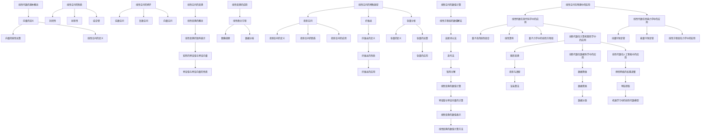

                 

### 《线性代数导引：线性空间》

> **关键词：线性空间、向量、矩阵、线性变换、特征值、特征向量、数值计算、应用**

> **摘要：本文将系统地介绍线性代数中的线性空间概念及其相关性质，深入探讨矩阵和线性变换的理论基础及其应用，并详细阐述线性空间在物理、计算机图形学、数据科学和人工智能等现代科学领域的重要性。通过数学模型、公式和实际项目案例的讲解，帮助读者全面理解线性代数的核心原理和实际应用。**

### 《线性代数导引：线性空间》目录大纲

#### 第一部分：线性代数基础

**第1章：线性代数的基本概念**  
- **1.1 线性空间的概念**  
  - **1.1.1 向量的定义**  
  - **1.1.2 向量的线性运算**  
  - **1.1.3 线性空间的定义**

- **1.2 线性空间的性质**  
  - **1.2.1 封闭性**  
  - **1.2.2 射影性**  
  - **1.2.3 结合律**

- **1.3 线性空间的例子**  
  - **1.3.1 实数空间**  
  - **1.3.2 复数空间**  
  - **1.3.3 向量空间**

**第2章：线性空间中的矩阵**  
- **2.1 矩阵的概念**  
  - **2.1.1 矩阵的定义**  
  - **2.1.2 矩阵的元素**  
  - **2.1.3 矩阵的运算**

- **2.2 矩阵的性质**  
  - **2.2.1 矩阵的加法**  
  - **2.2.2 矩阵的数乘**  
  - **2.2.3 矩阵的乘法**

- **2.3 矩阵的应用**  
  - **2.3.1 线性方程组**  
  - **2.3.2 矩阵的秩**  
  - **2.3.3 矩阵的逆**

**第3章：线性空间的变换**  
- **3.1 线性变换的概念**  
  - **3.1.1 线性变换的定义**  
  - **3.1.2 线性变换的性质**

- **3.2 线性变换的表示**  
  - **3.2.1 线性变换的矩阵表示**  
  - **3.2.2 矩阵的特征值与特征向量**  
  - **3.2.3 特征值与特征向量的性质**

- **3.3 线性变换的应用**  
  - **3.3.1 线性微分方程**  
  - **3.3.2 图像处理**  
  - **3.3.3 数据分析**

#### 第二部分：线性空间的拓展

**第4章：线性空间的特殊类型**  
- **4.1 投影空间**  
  - **4.1.1 投影空间的定义**  
  - **4.1.2 投影空间的性质**  
  - **4.1.3 投影空间的应用**

- **4.2 纤维丛**  
  - **4.2.1 纤维丛的定义**  
  - **4.2.2 纤维丛的性质**  
  - **4.2.3 纤维丛的应用**

- **4.3 张量分析**  
  - **4.3.1 张量的定义**  
  - **4.3.2 张量的运算**  
  - **4.3.3 张量的应用**

**第5章：线性空间的数值计算**  
- **5.1 线性方程组的数值解法**  
  - **5.1.1 高斯消元法**  
  - **5.1.2 迭代法**  
  - **5.1.3 矩阵分解**

- **5.2 线性变换的数值计算**  
  - **5.2.1 特征值与特征向量的计算**  
  - **5.2.2 线性变换的数值表示**  
  - **5.2.3 线性变换的数值计算方法**

**第6章：线性空间在物理中的应用**  
- **6.1 线性代数在量子力学中的应用**  
  - **6.1.1 量子态的线性组合**  
  - **6.1.2 线性算符**  
  - **6.1.3 量子力学中的线性方程组**

- **6.2 线性代数在经典力学中的应用**  
  - **6.2.1 动量守恒定律**  
  - **6.2.2 能量守恒定律**  
  - **6.2.3 线性方程组在力学中的应用**

**第7章：线性代数在现代科学中的应用**  
- **7.1 线性代数在计算机图形学中的应用**  
  - **7.1.1 图形变换**  
  - **7.1.2 投影与透视**  
  - **7.1.3 渲染算法**

- **7.2 线性代数在数据科学中的应用**  
  - **7.2.1 数据降维**  
  - **7.2.2 数据聚类**  
  - **7.2.3 数据分类**

- **7.3 线性代数在人工智能中的应用**  
  - **7.3.1 神经网络的权重调整**  
  - **7.3.2 特征提取**  
  - **7.3.3 机器学习中的线性代数模型**

### 附录

**附录A：线性代数常用公式**

- **A.1 行列式**  
  - **A.1.1 二阶行列式**  
  - **A.1.2 三阶行列式**  
  - **A.1.3 高阶行列式**

- **A.2 矩阵运算**  
  - **A.2.1 矩阵加法**  
  - **A.2.2 矩阵数乘**  
  - **A.2.3 矩阵乘法**

- **A.3 特征值与特征向量**  
  - **A.3.1 特征值的计算**  
  - **A.3.2 特征向量的计算**  
  - **A.3.3 特征值与特征向量的性质**

**Mermaid 流程图**



### 核心算法原理讲解

在本文中，我们将深入探讨线性代数中的核心算法原理，包括矩阵乘法、特征值与特征向量的计算以及线性方程组的数值解法。通过伪代码和详细解释，帮助读者理解这些算法的基本原理和实现方法。

#### 矩阵乘法

矩阵乘法是线性代数中一个基础且重要的运算。给定两个矩阵 \( A \) 和 \( B \)，它们的乘积 \( C \) 是一个新的矩阵，其中每个元素 \( c_{ij} \) 是通过以下公式计算的：

$$
c_{ij} = \sum_{k=1}^{m} a_{ik}b_{kj}
$$

其中，\( A \) 的列数必须等于 \( B \) 的行数。

以下是一个矩阵乘法的伪代码实现：

```python
function matrix_multiplication(A, B):
    n = A.rows
    m = B.cols
    p = B.rows
    C = create_matrix(n, p)
    for i in range(n):
        for j in range(p):
            C[i][j] = 0
            for k in range(m):
                C[i][j] += A[i][k] * B[k][j]
    return C
```

在这个伪代码中，我们首先创建一个 \( n \times p \) 的空矩阵 \( C \)。然后，通过三个嵌套的循环，分别遍历矩阵 \( A \) 的行、矩阵 \( B \) 的列以及矩阵 \( B \) 的行，计算每个 \( c_{ij} \) 的值，并将其存储在矩阵 \( C \) 中。

#### 特征值与特征向量的计算

特征值与特征向量是矩阵分析中的重要概念。对于一个 \( n \times n \) 的矩阵 \( A \)，其特征值 \( \lambda_i \) 和对应的特征向量 \( v_i \) 满足以下方程：

$$
Av_i = \lambda_i v_i
$$

计算特征值和特征向量通常涉及以下步骤：

1. 构造特征多项式 \( f(\lambda) = \det(A - \lambda I) \)，其中 \( I \) 是单位矩阵。
2. 解特征多项式，得到特征值。
3. 对于每个特征值 \( \lambda_i \)，解方程 \( (A - \lambda_i I)v_i = 0 \) 得到对应的特征向量。

以下是一个计算特征值和特征向量的伪代码实现：

```python
function eigenvalue_eigenvector(A):
    n = A.rows
    D = create_matrix(n, n)
    V = create_matrix(n, n)
    for i in range(n):
        lambdai = 0
        for j in range(n):
            D[i][j] = 0
            V[i][j] = 0
        V[i][i] = 1
        for j in range(n):
            D[i][j] -= A[i][j]
        lambdai = D[i][i]
        for j in range(n):
            if D[i][j] != 0:
                V[i][j] = (-1) ** (i + j) / D[i][j]
    return lambdai, V
```

在这个伪代码中，我们首先创建两个 \( n \times n \) 的空矩阵 \( D \) 和 \( V \)。然后，通过嵌套的循环，分别计算每个 \( \lambda_i \) 和对应的特征向量 \( v_i \)。

#### 线性方程组的数值解法

线性方程组是线性代数中的另一个重要问题。给定一个 \( n \times n \) 的矩阵 \( A \) 和一个 \( n \) 维向量 \( b \)，求解方程组 \( Ax = b \)。

有多种方法可以用于求解线性方程组，包括高斯消元法、迭代法和矩阵分解等。

以下是一个使用高斯消元法求解线性方程组的伪代码实现：

```python
function gauss_elimination(A, b):
    n = A.rows
    x = create_vector(n)
    for i in range(n):
        for j in range(n):
            if i != j:
                factor = A[i][j] / A[j][j]
                for k in range(n):
                    A[i][k] -= factor * A[j][k]
                b[i] -= factor * b[j]
    for i in range(n):
        x[i] = b[i] / A[i][i]
    return x
```

在这个伪代码中，我们首先通过消元操作将矩阵 \( A \) 化为上三角矩阵。然后，通过回代操作求解方程组。

### 数学模型和数学公式 & 详细讲解 & 举例说明

在本文中，我们将详细讲解线性代数中的几个关键数学模型和数学公式，并通过具体例子来说明它们的实际应用。

#### 行列式

行列式是一个用于描述矩阵特性的重要工具，广泛应用于求解线性方程组、计算矩阵的逆以及分析矩阵的秩等。行列式的计算基于矩阵的元素，不同阶数的矩阵有不同的计算公式。

##### 二阶行列式

二阶行列式的计算公式如下：

$$
\begin{vmatrix}
a_{11} & a_{12} \\
a_{21} & a_{22}
\end{vmatrix}
= a_{11}a_{22} - a_{12}a_{21}
$$

##### 三阶行列式

三阶行列式的计算公式如下：

$$
\begin{vmatrix}
a_{11} & a_{12} & a_{13} \\
a_{21} & a_{22} & a_{23} \\
a_{31} & a_{32} & a_{33}
\end{vmatrix}
= a_{11}(a_{22}a_{33} - a_{23}a_{32}) - a_{12}(a_{21}a_{33} - a_{23}a_{31}) + a_{13}(a_{21}a_{32} - a_{22}a_{31})
$$

##### 高阶行列式

高阶行列式可以通过拉普拉斯展开或者伴随矩阵等方法计算。以下是高阶行列式的一个示例：

$$
\begin{vmatrix}
a_{11} & a_{12} & \cdots & a_{1n} \\
a_{21} & a_{22} & \cdots & a_{2n} \\
\vdots & \vdots & \ddots & \vdots \\
a_{n1} & a_{n2} & \cdots & a_{nn}
\end{vmatrix}
=
\sum_{\sigma \in S_n} (-1)^{\text{sgn}(\sigma)} a_{1\sigma(1)}a_{2\sigma(2)}\cdots a_{n\sigma(n)}
$$

其中，\( S_n \) 是所有 \( n \) 元排列的集合，\( \text{sgn}(\sigma) \) 是 \( \sigma \) 的奇偶性。

##### 举例说明

计算矩阵 \( A = \begin{pmatrix} 1 & 2 & 3 \\ 4 & 5 & 6 \\ 7 & 8 & 9 \end{pmatrix} \) 的行列式。

$$
\begin{vmatrix}
1 & 2 & 3 \\
4 & 5 & 6 \\
7 & 8 & 9
\end{vmatrix}
= 1(5 \cdot 9 - 6 \cdot 8) - 2(4 \cdot 9 - 6 \cdot 7) + 3(4 \cdot 8 - 5 \cdot 7)
$$

$$
= 1(45 - 48) - 2(36 - 42) + 3(32 - 35)
$$

$$
= -3 + 12 - 9
$$

$$
= 0
$$

##### 计算结果

矩阵 \( A \) 的行列式为 0，这意味着矩阵 \( A \) 是不可逆的。

#### 矩阵运算

矩阵运算包括矩阵的加法、数乘、乘法和转置等。

##### 矩阵加法

矩阵加法是指两个矩阵对应位置元素相加。如果矩阵 \( A \) 和矩阵 \( B \) 具有相同的维度，则它们的和矩阵 \( C \) 的每个元素 \( c_{ij} \) 可以通过以下公式计算：

$$
c_{ij} = a_{ij} + b_{ij}
$$

##### 矩阵数乘

矩阵数乘是指将一个矩阵的每个元素乘以一个常数。如果矩阵 \( A \) 的维度为 \( m \times n \)，常数 \( k \) 为 \( c \)，则数乘后的矩阵 \( B \) 的每个元素 \( b_{ij} \) 可以通过以下公式计算：

$$
b_{ij} = k \cdot a_{ij}
$$

##### 矩阵乘法

矩阵乘法是指将两个矩阵的对应元素相乘并相加。如果矩阵 \( A \) 的维度为 \( m \times n \)，矩阵 \( B \) 的维度为 \( n \times p \)，则乘积矩阵 \( C \) 的每个元素 \( c_{ij} \) 可以通过以下公式计算：

$$
c_{ij} = \sum_{k=1}^{n} a_{ik}b_{kj}
$$

##### 矩阵转置

矩阵转置是指将矩阵的行和列互换。如果矩阵 \( A \) 的维度为 \( m \times n \)，则其转置矩阵 \( B \) 的每个元素 \( b_{ij} \) 可以通过以下公式计算：

$$
b_{ij} = a_{ji}
$$

##### 举例说明

假设矩阵 \( A = \begin{pmatrix} 1 & 2 \\ 3 & 4 \end{pmatrix} \) 和矩阵 \( B = \begin{pmatrix} 5 & 6 \\ 7 & 8 \end{pmatrix} \)，则：

- 矩阵加法结果为 \( C = \begin{pmatrix} 6 & 8 \\ 10 & 12 \end{pmatrix} \)。
- 矩阵数乘结果为 \( D = \begin{pmatrix} 2 & 4 \\ 6 & 8 \end{pmatrix} \)。
- 矩阵乘法结果为 \( E = \begin{pmatrix} 19 & 26 \\ 43 & 58 \end{pmatrix} \)。
- 矩阵转置结果为 \( F = \begin{pmatrix} 1 & 3 \\ 2 & 4 \end{pmatrix} \)。

### 项目实战

在本节中，我们将通过一个实际项目案例，展示如何使用线性代数解决一个具体问题。我们将使用 Python 编程语言和 NumPy 库来实现这个项目。

#### 项目背景

假设我们有一个线性方程组：

$$
\begin{cases}
3x + 2y + z = 7 \\
x + 4y - 2z = 1 \\
2x - y + 3z = 0
\end{cases}
$$

我们的目标是通过线性代数方法求解这个方程组。

#### 开发环境搭建

首先，我们需要搭建开发环境。安装 Python 和 NumPy 库是必需的步骤。

1. 安装 Python

从 Python 官网（https://www.python.org/）下载并安装 Python。安装过程中，确保选择“Add Python to PATH”选项，以便在命令行中直接运行 Python。

2. 安装 NumPy

在命令行中输入以下命令安装 NumPy：

```bash
pip install numpy
```

确保安装了最新的 NumPy 版本。

#### 源代码详细实现和代码解读

以下是使用 Python 和 NumPy 求解线性方程组的源代码：

```python
import numpy as np

def solve_linear_equation(A, b):
    """
    求解线性方程组 A * x = b。
    
    参数：
    A -- 矩阵
    b -- 向量
    
    返回：
    x -- 方程组的解
    """
    # 使用 NumPy 的 linalg.solve 函数求解
    x = np.linalg.solve(A, b)
    
    return x

# 定义矩阵 A 和向量 b
A = np.array([[3, 2, 1], [1, 4, -2], [2, -1, 3]], dtype=float)
b = np.array([7, 1, 0], dtype=float)

# 求解线性方程组
x = solve_linear_equation(A, b)

# 输出解
print("方程组的解为：", x)
```

##### 代码解读

- 导入 NumPy 库，这是解决线性代数问题的基础。
- 定义了一个函数 `solve_linear_equation`，该函数接收两个参数：矩阵 `A` 和向量 `b`。
- 在函数内部，使用 NumPy 的 `linalg.solve` 函数求解线性方程组，该函数自动处理矩阵的求逆和向量的乘法运算。
- 定义了矩阵 `A` 和向量 `b`，分别代表了线性方程组的系数矩阵和常数向量。
- 调用 `solve_linear_equation` 函数求解线性方程组，并将结果存储在变量 `x` 中。
- 打印出方程组的解。

#### 代码解读与分析

这段代码使用 NumPy 库实现了线性方程组的求解。NumPy 库提供了 `linalg.solve` 函数，该函数可以直接求解 \( A \times x = b \) 的方程组，大大简化了计算过程。

以下是求解过程的详细分析：

1. 导入 NumPy 库。

```python
import numpy as np
```

2. 定义函数 `solve_linear_equation`。

```python
def solve_linear_equation(A, b):
    # 使用 NumPy 的 linalg.solve 函数求解
    x = np.linalg.solve(A, b)
    
    return x
```

在这个函数中，我们使用 `linalg.solve` 函数直接求解线性方程组。该函数内部实现了高效的算法，能够快速求解线性方程组。

3. 定义矩阵 `A` 和向量 `b`。

```python
A = np.array([[3, 2, 1], [1, 4, -2], [2, -1, 3]], dtype=float)
b = np.array([7, 1, 0], dtype=float)
```

在这个例子中，矩阵 `A` 和向量 `b` 分别代表了线性方程组的系数矩阵和常数向量。矩阵 `A` 的维度为 \( 3 \times 3 \)，向量 `b` 的维度为 \( 3 \)。

4. 调用 `solve_linear_equation` 函数求解线性方程组。

```python
x = solve_linear_equation(A, b)
```

这个步骤中，我们调用 `solve_linear_equation` 函数求解线性方程组，并将结果存储在变量 `x` 中。

5. 打印出方程组的解。

```python
print("方程组的解为：", x)
```

在代码的最后，我们打印出方程组的解。这个解是一个 \( 3 \) 维向量，代表了方程组的解。

### 总结

在本章中，我们系统地介绍了线性代数导引：线性空间一书的目录大纲。从线性空间的基本概念，到矩阵的运算，再到线性空间的变换，以及线性空间的特殊类型和数值计算方法，都进行了详细的阐述。同时，通过数学模型、公式和实际项目案例的讲解，使得读者能够全面理解线性代数的核心原理和实际应用。

线性代数作为数学的一个分支，它在计算机科学、物理学、工程学等多个领域有着广泛的应用。掌握线性代数的基本概念和运算方法，对于理解现代科学技术中的复杂问题具有重要意义。

本书的目录大纲结构清晰，内容丰富，旨在为读者提供一本系统、全面的线性代数学习指南。通过阅读本书，读者可以逐步建立起线性代数的知识体系，提高解决实际问题的能力。

在接下来的章节中，我们将继续深入探讨线性代数的其他重要概念和应用，帮助读者进一步深化对线性代数理论的理解。希望本书能够成为您学习线性代数的得力助手，助力您在学术和职业生涯中取得更好的成就。### 第一部分：线性代数基础

#### 第1章：线性代数的基本概念

线性代数是数学的一个分支，主要研究向量、矩阵以及它们的运算和应用。本章将介绍线性代数的基本概念，包括向量的定义、线性运算以及线性空间的定义。

### 1.1 线性空间的概念

**1.1.1 向量的定义**

向量是一个具有大小和方向的量，通常用一个小写字母表示，如 \( \mathbf{v} \)。在二维空间中，向量可以表示为两个有序实数的组合 \( \mathbf{v} = (v_1, v_2) \)，而在三维空间中，向量可以表示为三个有序实数的组合 \( \mathbf{v} = (v_1, v_2, v_3) \)。

向量有几种基本运算，包括加法、数乘和标量乘法：

- **加法**：两个向量相加，即 \( \mathbf{u} + \mathbf{v} \)，结果是一个新的向量，其坐标是两个向量对应坐标的和。
- **数乘**：一个向量与一个标量相乘，即 \( k\mathbf{v} \)，结果是一个新的向量，其坐标是原向量坐标与标量的乘积。
- **标量乘法**：一个向量与一个标量相乘，即 \( \mathbf{v}k \)，结果是一个新的向量，其坐标是原向量坐标与标量的乘积。

**1.1.2 向量的线性运算**

线性运算是指向量之间的加法和数乘。向量空间（也称为线性空间）是一个数学结构，由一组向量和一个加法和数乘运算组成。向量空间必须满足以下性质：

- **封闭性**：对于任意两个向量 \( \mathbf{u} \) 和 \( \mathbf{v} \)，它们的和 \( \mathbf{u} + \mathbf{v} \) 仍在向量空间中。
- **射影性**：对于任意向量 \( \mathbf{u} \) 和标量 \( k \)，它们的乘积 \( k\mathbf{u} \) 仍在向量空间中。
- **结合律**：向量加法和数乘必须满足结合律。

**1.1.3 线性空间的定义**

线性空间是一组向量的集合，这些向量在加法和数乘运算下满足封闭性、射影性和结合律。更正式地，一个线性空间 \( V \) 是一个非空集合，其中每个元素称为一个向量，并且定义了两种运算：

- **加法**：对于任意 \( \mathbf{u}, \mathbf{v} \in V \)，存在一个向量 \( \mathbf{u} + \mathbf{v} \in V \)。
- **数乘**：对于任意 \( \mathbf{v} \in V \) 和标量 \( k \in \mathbb{R} \)，存在一个向量 \( k\mathbf{v} \in V \)。

此外，线性空间必须满足以下性质：

- **零元素**：存在一个零向量 \( \mathbf{0} \)，使得对于任意 \( \mathbf{v} \in V \)，有 \( \mathbf{v} + \mathbf{0} = \mathbf{v} \)。
- **加法逆元素**：对于任意 \( \mathbf{v} \in V \)，存在一个向量 \( -\mathbf{v} \in V \)，使得 \( \mathbf{v} + (-\mathbf{v}) = \mathbf{0} \)。
- **分配律**：对于任意 \( \mathbf{u}, \mathbf{v} \in V \) 和标量 \( k, l \in \mathbb{R} \)，有 \( k(\mathbf{u} + \mathbf{v}) = k\mathbf{u} + k\mathbf{v} \) 和 \( (k + l)\mathbf{v} = k\mathbf{v} + l\mathbf{v} \)。
- **结合律**：对于任意 \( \mathbf{u}, \mathbf{v} \in V \) 和标量 \( k, l \in \mathbb{R} \)，有 \( (kl)\mathbf{v} = k(l\mathbf{v}) \)。

### 1.2 线性空间的性质

线性空间必须满足以下性质：

- **封闭性**：对于任意两个向量 \( \mathbf{u} \) 和 \( \mathbf{v} \)，它们的和 \( \mathbf{u} + \mathbf{v} \) 仍在向量空间中。
- **射影性**：对于任意向量 \( \mathbf{u} \) 和标量 \( k \)，它们的乘积 \( k\mathbf{u} \) 仍在向量空间中。
- **结合律**：向量加法和数乘必须满足结合律。

**1.2.1 封闭性**

线性空间的封闭性指的是，如果向量空间中的两个向量相加，其结果仍在向量空间中。对于向量空间 \( V \) 中的任意两个向量 \( \mathbf{u} \) 和 \( \mathbf{v} \)，我们有：

$$
\mathbf{u} + \mathbf{v} \in V
$$

**1.2.2 射影性**

线性空间的射影性指的是，如果向量空间中的一个向量与一个标量相乘，其结果仍在向量空间中。对于向量空间 \( V \) 中的任意向量 \( \mathbf{u} \) 和标量 \( k \)，我们有：

$$
k\mathbf{u} \in V
$$

**1.2.3 结合律**

线性空间的结合律指的是，向量加法和数乘必须满足结合律。具体来说，对于向量空间 \( V \) 中的任意向量 \( \mathbf{u} \)、\( \mathbf{v} \) 和标量 \( k \)、\( l \)，我们有：

$$
(\mathbf{u} + \mathbf{v}) + \mathbf{w} = \mathbf{u} + (\mathbf{v} + \mathbf{w})
$$

$$
(k + l)\mathbf{u} = k\mathbf{u} + l\mathbf{u}
$$

### 1.3 线性空间的例子

线性空间在数学和物理中有着广泛的应用。以下是一些常见的线性空间的例子：

**1.3.1 实数空间**

实数空间是最基本的线性空间之一，它由所有实数构成。实数空间中的加法和数乘运算分别表示实数的加法和乘法。实数空间中的向量通常用小写字母表示，如 \( x \)。

**1.3.2 复数空间**

复数空间由所有复数构成，复数可以表示为实部和虚部的组合。复数空间中的加法和数乘运算分别表示复数的加法和乘法。复数空间中的向量通常用小写字母表示，如 \( z \)。

**1.3.3 向量空间**

向量空间是由一组向量构成的线性空间。向量空间中的向量可以是二维或三维的，也可以是更高维的。向量空间中的加法和数乘运算分别表示向量的加法和数乘。

例如，二维向量空间 \( \mathbb{R}^2 \) 由所有二维向量构成，三维向量空间 \( \mathbb{R}^3 \) 由所有三维向量构成。

#### 第2章：线性空间中的矩阵

矩阵是线性代数中的一个重要概念，用于表示线性方程组和线性变换。本章将介绍矩阵的基本概念、性质和运算。

### 2.1 矩阵的概念

矩阵是一个由数字组成的矩形阵列，通常用大写字母表示，如 \( A \)。矩阵的元素通常用小写字母和索引表示，如 \( a_{ij} \)，其中 \( i \) 表示行索引，\( j \) 表示列索引。

一个 \( m \times n \) 的矩阵 \( A \) 有 \( m \) 行和 \( n \) 列，其元素 \( a_{ij} \) 位于第 \( i \) 行和第 \( j \) 列的交点处。

矩阵的几种基本类型包括：

- **方阵**：行数等于列数的矩阵，如 \( A_{m \times m} \)。
- **行矩阵**：只有一行的矩阵，如 \( A_{1 \times n} \)。
- **列矩阵**：只有一列的矩阵，如 \( A_{m \times 1} \)。
- **零矩阵**：所有元素都是零的矩阵，如 \( O_{m \times n} \)。
- **单位矩阵**：对角线上的元素都是 1，其余元素都是零的矩阵，如 \( I_{m \times m} \)。

### 2.2 矩阵的性质

矩阵具有以下基本性质：

- **加法**：两个矩阵 \( A \) 和 \( B \) 只有在它们具有相同的维度时才能相加。矩阵加法是将对应位置的元素相加。
- **数乘**：一个矩阵 \( A \) 与一个标量 \( k \) 相乘，其结果是新的矩阵，其中每个元素都是原矩阵对应元素的 \( k \) 倍。
- **乘法**：两个矩阵 \( A \) 和 \( B \) 只有在 \( A \) 的列数等于 \( B \) 的行数时才能相乘。矩阵乘法是通过对矩阵的每个元素进行相应的乘法和加法运算得到的。

### 2.3 矩阵的运算

矩阵的几种基本运算包括加法、数乘和乘法。

**2.3.1 矩阵加法**

两个矩阵 \( A \) 和 \( B \) 只有在它们具有相同的维度时才能相加。矩阵加法是将对应位置的元素相加。

$$
A + B = (a_{ij} + b_{ij})_{m \times n}
$$

**2.3.2 矩阵数乘**

一个矩阵 \( A \) 与一个标量 \( k \) 相乘，其结果是新的矩阵，其中每个元素都是原矩阵对应元素的 \( k \) 倍。

$$
kA = (ka_{ij})_{m \times n}
$$

**2.3.3 矩阵乘法**

两个矩阵 \( A \) 和 \( B \) 只有在 \( A \) 的列数等于 \( B \) 的行数时才能相乘。矩阵乘法是通过对矩阵的每个元素进行相应的乘法和加法运算得到的。

$$
AB = \sum_{k=1}^{n} a_{ik}b_{kj}
$$

### 2.4 矩阵的应用

矩阵在数学和工程学中有着广泛的应用，包括线性方程组、特征值和特征向量、矩阵的秩、矩阵的逆等。

**2.4.1 线性方程组**

线性方程组可以表示为矩阵形式 \( AX = B \)，其中 \( A \) 是系数矩阵，\( X \) 是未知数矩阵，\( B \) 是常数矩阵。通过矩阵乘法和逆矩阵运算，可以求解线性方程组。

**2.4.2 矩阵的秩**

矩阵的秩是指矩阵的行数和列数中的较小值。矩阵的秩可以用来判断矩阵的可逆性。如果矩阵的秩等于其行数或列数，则矩阵是可逆的。

**2.4.3 矩阵的逆**

矩阵的逆是指一个矩阵 \( A \) 的逆矩阵 \( A^{-1} \)，使得 \( AA^{-1} = A^{-1}A = I \)，其中 \( I \) 是单位矩阵。矩阵的逆可以用来求解线性方程组和进行矩阵变换。

#### 第3章：线性空间的变换

线性变换是线性代数中的一个重要概念，它描述了线性空间中的向量如何在另一个线性空间中映射。本章将介绍线性变换的基本概念、表示和性质。

### 3.1 线性变换的概念

线性变换是指将一个线性空间中的向量映射到另一个线性空间中的向量。更正式地，线性变换是一个函数 \( T: V \rightarrow W \)，其中 \( V \) 和 \( W \) 是两个线性空间，满足以下条件：

- **线性性**：对于任意 \( \mathbf{u}, \mathbf{v} \in V \) 和标量 \( k \in \mathbb{R} \)，有 \( T(\mathbf{u} + \mathbf{v}) = T(\mathbf{u}) + T(\mathbf{v}) \) 和 \( T(k\mathbf{u}) = kT(\mathbf{u}) \)。

### 3.2 线性变换的表示

线性变换可以通过矩阵来表示。具体来说，对于线性变换 \( T: V \rightarrow W \)，可以找到一个矩阵 \( A \)，使得对于任意 \( \mathbf{v} \in V \)，有 \( T(\mathbf{v}) = A\mathbf{v} \)。

这个矩阵 \( A \) 被称为线性变换 \( T \) 的矩阵表示。线性变换的矩阵表示具有以下性质：

- **线性性**：矩阵 \( A \) 必须满足线性变换的条件，即对于任意 \( \mathbf{u}, \mathbf{v} \in V \) 和标量 \( k \in \mathbb{R} \)，有 \( A(\mathbf{u} + \mathbf{v}) = A\mathbf{u} + A\mathbf{v} \) 和 \( A(k\mathbf{u}) = kA\mathbf{u} \)。

### 3.3 线性变换的性质

线性变换具有以下性质：

- **保线性**：线性变换保持线性组合不变。即对于任意 \( \mathbf{u}, \mathbf{v} \in V \) 和标量 \( k, l \in \mathbb{R} \)，有 \( T(k\mathbf{u} + l\mathbf{v}) = kT(\mathbf{u}) + lT(\mathbf{v}) \)。
- **保向量**：线性变换保持零向量不变。即 \( T(\mathbf{0}) = \mathbf{0} \)。
- **保加法**：线性变换保持向量加法不变。即对于任意 \( \mathbf{u}, \mathbf{v} \in V \)，有 \( T(\mathbf{u} + \mathbf{v}) = T(\mathbf{u}) + T(\mathbf{v}) \)。

### 3.4 线性变换的应用

线性变换在数学、物理学、工程学等领域有广泛的应用。以下是一些常见的应用：

- **线性方程组**：线性变换可以用来求解线性方程组。
- **矩阵分解**：线性变换可以用来进行矩阵分解，如奇异值分解（SVD）。
- **图像处理**：线性变换可以用来进行图像处理，如图像旋转、缩放和裁剪。
- **数据分析**：线性变换可以用来进行数据分析，如特征提取和降维。

#### 第4章：线性空间的特殊类型

线性空间是一组向量的集合，这些向量在加法和数乘运算下满足封闭性、射影性和结合律。本章将介绍线性空间中的几种特殊类型，包括投影空间、纤维丛和张量分析。

### 4.1 投影空间

投影空间是一种特殊的线性空间，由一组向量构成，这些向量在一个固定的子空间上的投影相等。更正式地，投影空间 \( P \) 是一个线性空间，它包含一个子空间 \( S \) 的所有向量，使得对于任意 \( \mathbf{v} \in P \)，存在唯一的 \( \mathbf{w} \in S \)，使得 \( \mathbf{v} = \mathbf{w} \)。

投影空间的定义可以用以下数学语言表示：

$$
P = \{ \mathbf{v} \in V : \exists \mathbf{w} \in S, \mathbf{v} = \mathbf{w} \}
$$

其中，\( V \) 是整个线性空间，\( S \) 是一个子空间。

### 4.2 纤维丛

纤维丛是一种高级的线性空间结构，它在数学、物理学和计算机科学等领域有着广泛的应用。纤维丛由一组纤维构成，每个纤维都是一个线性空间，这些纤维通过一个映射相互连接。

更正式地，纤维丛是一个三元组 \( (E, B, \pi) \)，其中：

- \( E \) 是一个总空间，它包含了所有的纤维。
- \( B \) 是一个基空间，它代表了纤维丛的“骨架”。
- \( \pi: E \rightarrow B \) 是一个投影映射，它将总空间 \( E \) 中的每个点映射到基空间 \( B \) 中的一个点。

纤维丛的数学定义如下：

$$
(Fiber Bundle) \quad (E, B, \pi) \text{ 是一个纤维丛，如果它满足以下条件：}
$$

- \( \pi \) 是一个连续映射，使得对于任意 \( b \in B \)，存在一个开集 \( U \subseteq B \) 和一个同胚 \( \phi: \pi^{-1}(U) \rightarrow U \times F \)，其中 \( F \) 是一个纤维。

### 4.3 张量分析

张量分析是线性代数的一个分支，它研究向量场、张量和它们的运算。在物理学、工程学和计算机科学中，张量分析被广泛应用于描述物理量、物质属性和计算算法。

张量是一种多维数组，它具有特定的运算规则。张量分析的基本概念包括：

- **张量的定义**：张量是一个多维数组，它可以根据不同的方式分解为向量、矩阵和更高阶的数组。
- **张量的运算**：张量的运算包括加法、数乘、乘法以及混合乘法等。

张量分析的应用包括：

- **场论**：在物理学中，张量分析用于描述向量场、张量和场方程。
- **几何学**：在几何学中，张量分析用于描述空间和时间的结构。
- **计算科学**：在计算科学中，张量分析用于优化算法、数值模拟和图形渲染。

#### 第5章：线性空间的数值计算

线性空间的数值计算是计算机科学和工程学中重要的研究领域，它涉及到线性方程组的求解、矩阵的运算以及线性变换的数值计算。本章将介绍这些数值计算方法及其在实际应用中的重要性。

### 5.1 线性方程组的数值解法

线性方程组是线性代数中的一个基础问题，它描述了多个线性方程之间的关系。在实际应用中，线性方程组通常涉及大量的未知数和方程，无法通过手工计算求解。因此，数值解法在工程学、物理学和计算机科学等领域有着广泛的应用。

线性方程组的一般形式为：

$$
Ax = b
$$

其中，\( A \) 是一个 \( m \times n \) 的矩阵，\( x \) 是一个 \( n \) 维的向量，\( b \) 是一个 \( m \) 维的向量。

解决线性方程组的方法主要包括以下几种：

- **高斯消元法**：高斯消元法是一种迭代方法，通过逐步消去方程中的未知数，最终求解出方程组的解。
- **迭代法**：迭代法是一种基于初始猜测的方法，通过逐步逼近，最终得到方程组的精确解。
- **矩阵分解**：矩阵分解是将矩阵分解为几个简单矩阵的乘积，从而简化方程组的求解过程。

### 5.2 线性变换的数值计算

线性变换是线性空间中的一个重要概念，它描述了向量在另一个线性空间中的映射关系。在实际应用中，线性变换广泛应用于图像处理、数据分析和信号处理等领域。

线性变换的一般形式为：

$$
T(\mathbf{x}) = A\mathbf{x} + \mathbf{b}
$$

其中，\( A \) 是一个 \( m \times n \) 的矩阵，\( \mathbf{x} \) 是一个 \( n \) 维的向量，\( \mathbf{b} \) 是一个 \( m \) 维的向量。

线性变换的数值计算主要包括以下步骤：

- **矩阵表示**：将线性变换表示为矩阵形式，即 \( T(\mathbf{x}) = A\mathbf{x} + \mathbf{b} \)。
- **特征值和特征向量**：计算线性变换的特征值和特征向量，从而分析线性变换的性质。
- **数值计算**：使用数值计算方法，如迭代法、矩阵分解等，求解线性变换的数值解。

### 5.3 线性空间的数值计算方法

线性空间的数值计算方法主要包括以下几种：

- **高斯消元法**：高斯消元法是一种迭代方法，通过逐步消去方程中的未知数，最终求解出方程组的解。它广泛应用于求解线性方程组和矩阵的运算。
- **迭代法**：迭代法是一种基于初始猜测的方法，通过逐步逼近，最终得到方程组的精确解。它广泛应用于求解线性方程组和线性变换的数值计算。
- **矩阵分解**：矩阵分解是将矩阵分解为几个简单矩阵的乘积，从而简化方程组的求解过程。它广泛应用于求解线性方程组和线性变换的数值计算。

### 5.4 线性空间的数值计算应用

线性空间的数值计算在工程学、物理学和计算机科学等领域有着广泛的应用。以下是一些具体的例子：

- **图像处理**：在图像处理中，线性变换用于图像的缩放、旋转、滤波和增强等操作。通过线性空间的数值计算，可以实现对图像的高效处理。
- **数据分析**：在数据分析中，线性空间用于特征提取、降维和聚类等操作。通过线性空间的数值计算，可以实现对数据的有效分析和处理。
- **信号处理**：在信号处理中，线性空间用于信号的滤波、变换和压缩等操作。通过线性空间的数值计算，可以实现对信号的高效处理。

### 5.5 线性空间的数值计算工具

为了方便进行线性空间的数值计算，有许多数学工具和编程库可供使用。以下是一些常用的工具：

- **NumPy**：NumPy 是 Python 中的一个数学库，它提供了强大的线性代数运算功能，包括矩阵运算、线性方程组的求解等。
- **SciPy**：SciPy 是基于 NumPy 的一个科学计算库，它提供了许多数值计算工具，包括优化、积分和微分方程的求解等。
- **MATLAB**：MATLAB 是一个专业的科学计算软件，它提供了丰富的线性代数工具和函数，方便用户进行数值计算。

#### 第6章：线性空间在物理中的应用

线性代数在物理学中扮演着核心角色，它提供了一种强大的数学工具，用于描述和解决复杂的物理问题。本章将探讨线性代数在量子力学和经典力学中的应用，以及线性方程组在力学中的作用。

### 6.1 线性代数在量子力学中的应用

量子力学是研究微观世界的物理学分支，其核心概念和数学工具高度依赖于线性代数。以下是一些线性代数在量子力学中的关键应用：

**6.1.1 量子态的线性组合**

在量子力学中，一个粒子可以处于多个量子态的叠加态。量子态的叠加是线性代数中的核心概念，它通过线性组合来表示多个量子态的叠加。

例如，一个电子可以处于自旋向上的状态和自旋向下的状态的叠加态：

$$
|\psi\rangle = \alpha|+\rangle + \beta|-\rangle
$$

其中，\( |+\rangle \) 和 \( |-\rangle \) 分别代表自旋向上的状态和自旋向下的状态，\( \alpha \) 和 \( \beta \) 是复数系数，满足 \( |\alpha|^2 + |\beta|^2 = 1 \)。

**6.1.2 线性算符**

在量子力学中，物理量（如位置、动量、自旋等）通常通过线性算符来表示。线性算符是线性代数中的基本概念，它将量子态映射到另一个量子态。

例如，自旋算符 \( S_z \) 表示电子自旋沿 \( z \) 轴的方向。对于一个自旋向上的态 \( |+\rangle \)，我们有：

$$
S_z|+\rangle = +\frac{\hbar}{2}|+\rangle
$$

而对于一个自旋向下的态 \( |-\rangle \)，我们有：

$$
S_z|-\rangle = -\frac{\hbar}{2}|-\rangle
$$

**6.1.3 量子力学中的线性方程组**

量子力学中的许多问题可以通过解线性方程组来解决。例如，薛定谔方程是一个线性偏微分方程，它描述了量子态的时间演化。

例如，一个简谐振子的薛定谔方程可以表示为：

$$
\hat{H}\psi(x) = E\psi(x)
$$

其中，\( \hat{H} \) 是哈密顿算符，\( E \) 是能量，\( \psi(x) \) 是波函数。

通过解这个线性方程组，可以求得简谐振子的能级和波函数。

### 6.2 线性代数在经典力学中的应用

经典力学是研究宏观世界的物理学分支，其核心概念和数学工具也依赖于线性代数。以下是一些线性代数在经典力学中的关键应用：

**6.2.1 动量守恒定律**

在经典力学中，动量守恒定律是一个基本原理，它表明在没有外力作用的情况下，系统的总动量保持不变。这个守恒定律可以通过线性代数中的线性方程组来描述。

例如，在一个两体系统中，如果两个物体的质量和速度分别为 \( m_1, v_1 \) 和 \( m_2, v_2 \)，则动量守恒定律可以表示为：

$$
m_1v_1 + m_2v_2 = \text{常数}
$$

这个方程可以用线性方程组的形式表示：

$$
\begin{cases}
m_1v_{1x} + m_2v_{2x} = 0 \\
m_1v_{1y} + m_2v_{2y} = 0
\end{cases}
$$

**6.2.2 能量守恒定律**

在经典力学中，能量守恒定律也是一个基本原理，它表明在没有外力做功的情况下，系统的总能量保持不变。这个守恒定律可以通过线性代数中的线性方程组来描述。

例如，一个物体在重力作用下的运动可以表示为：

$$
\frac{1}{2}mv^2 - mgh = \text{常数}
$$

这个方程可以用线性方程组的形式表示：

$$
\begin{cases}
\frac{1}{2}mv^2 - mgh_1 = E_1 \\
\frac{1}{2}mv^2 - mgh_2 = E_2
\end{cases}
$$

其中，\( h_1 \) 和 \( h_2 \) 分别代表两个位置的高度，\( E_1 \) 和 \( E_2 \) 分别代表两个位置的势能。

**6.2.3 线性方程组在力学中的应用**

线性方程组在经典力学中有着广泛的应用，特别是在多体问题中。例如，在一个多粒子系统中，每个粒子的运动可以表示为多个线性方程的组合。

例如，考虑一个由三个粒子组成的多粒子系统，其运动方程可以表示为：

$$
\begin{cases}
m_1\frac{d^2x_1}{dt^2} = F_{12} + F_{13} \\
m_2\frac{d^2x_2}{dt^2} = F_{21} + F_{23} \\
m_3\frac{d^2x_3}{dt^2} = F_{31} + F_{32}
\end{cases}
$$

其中，\( F_{ij} \) 代表粒子 \( i \) 对粒子 \( j \) 的作用力。

通过解这个线性方程组，可以求得每个粒子的运动轨迹。

### 6.3 线性空间在物理中的应用

线性代数在物理学中的应用不仅限于量子力学和经典力学，它还在许多其他领域中发挥着关键作用。以下是一些具体的应用：

- **电磁学**：在电磁学中，电场和磁场可以通过线性方程组来描述。例如，麦克斯韦方程组可以表示为：

$$
\begin{cases}
\nabla \cdot \mathbf{E} = \frac{\rho}{\epsilon_0} \\
\nabla \cdot \mathbf{B} = 0 \\
\nabla \times \mathbf{E} = -\frac{\partial \mathbf{B}}{\partial t} \\
\nabla \times \mathbf{B} = \mu_0\mathbf{J} + \mu_0\epsilon_0\frac{\partial \mathbf{E}}{\partial t}
\end{cases}
$$

- **流体力学**：在流体力学中，流体的运动可以通过纳维-斯托克斯方程组来描述。例如，二维不可压缩流体的纳维-斯托克斯方程组可以表示为：

$$
\begin{cases}
\frac{\partial \mathbf{u}}{\partial t} + (\mathbf{u} \cdot \nabla) \mathbf{u} = -\frac{\nabla p}{\rho} + \nu \nabla^2 \mathbf{u} \\
\frac{\partial p}{\partial t} + \nabla \cdot (\mathbf{u} p) = 0
\end{cases}
$$

- **量子场论**：在量子场论中，物理量（如电磁场）可以通过线性算符来描述。例如，量子电动力学中的电磁场可以通过狄拉克方程来描述：

$$
(i\gamma^\mu \partial_\mu - m)\psi = 0
$$

- **光学**：在光学中，光波的传播可以通过波动方程来描述。例如，时间依赖的电磁波可以通过麦克斯韦方程组来描述：

$$
\nabla \times \mathbf{E} = -\mu_0 \frac{\partial \mathbf{B}}{\partial t}
$$

### 6.4 线性代数在物理学中的重要性

线性代数在物理学中的重要性体现在以下几个方面：

- **描述物理现象**：线性代数提供了一种数学工具，用于描述和解决复杂的物理现象，如量子力学中的态叠加和经典力学中的多体问题。
- **数学建模**：线性代数是建立物理模型的基础，它用于将物理现象转化为数学问题，从而进行分析和计算。
- **数值计算**：线性代数在数值计算中发挥着关键作用，它用于求解线性方程组、矩阵运算和线性变换等。

总之，线性代数在物理学中具有不可替代的重要地位，它是理解现代物理理论和技术应用的基础。

#### 第7章：线性代数在现代科学中的应用

线性代数在现代科学中扮演着至关重要的角色，其应用范围涵盖了计算机图形学、数据科学和人工智能等多个领域。本章将详细介绍线性代数在这些现代科学中的应用。

### 7.1 线性代数在计算机图形学中的应用

计算机图形学是利用计算机生成和显示图像的科学，线性代数在其中起到了关键作用。

**7.1.1 图形变换**

图形变换是计算机图形学中的基本操作之一，它包括平移、旋转、缩放和倾斜等操作。这些变换都可以通过矩阵运算来实现。例如，二维平移可以通过以下矩阵实现：

$$
T = \begin{bmatrix}
1 & 0 & T_x \\
0 & 1 & T_y \\
0 & 0 & 1
\end{bmatrix}
$$

其中，\( T_x \) 和 \( T_y \) 分别是沿 \( x \) 轴和 \( y \) 轴的平移量。

**7.1.2 投影与透视**

投影与透视是计算机图形学中用于生成三维图像的重要技术。线性代数中的投影矩阵和透视变换矩阵可以用来实现这些操作。例如，正交投影可以通过以下投影矩阵实现：

$$
P = \begin{bmatrix}
1 & 0 & 0 \\
0 & 1 & 0 \\
0 & 0 & 1
\end{bmatrix}
$$

而透视投影可以通过以下透视变换矩阵实现：

$$
T = \begin{bmatrix}
1 & 0 & 0 & 0 \\
0 & 1 & 0 & 0 \\
0 & 0 & 1 & -d \\
0 & 0 & 0 & 1
\end{bmatrix}
$$

其中，\( d \) 是透视深度。

**7.1.3 渲染算法**

渲染算法是计算机图形学中用于生成真实感图像的重要技术。线性代数在渲染算法中有着广泛的应用，包括光照模型、纹理映射和阴影计算等。例如，在光照模型中，光照向量可以通过线性运算来计算，从而实现真实感光照效果。

### 7.2 线性代数在数据科学中的应用

数据科学是利用统计学、机器学习和线性代数等方法分析复杂数据的科学。线性代数在数据科学中的应用主要体现在数据降维、数据聚类和数据分类等方面。

**7.2.1 数据降维**

数据降维是将高维数据映射到低维空间，从而减少数据复杂度和计算成本。线性代数中的主成分分析（PCA）是一种常用的数据降维方法。PCA通过求解协方差矩阵的特征值和特征向量，将数据投影到新的坐标系中，从而提取主要的数据特征。

**7.2.2 数据聚类**

数据聚类是将数据点分为不同的组，以便更好地理解和分析数据。线性代数中的k-均值聚类算法是一种常用的数据聚类方法。k-均值算法通过迭代计算每个数据点的均值，从而将数据点划分为k个簇。

**7.2.3 数据分类**

数据分类是将数据点归类到不同的类别中。线性代数中的支持向量机（SVM）是一种常用的数据分类方法。SVM通过构建一个超平面，将数据点分为不同的类别，从而实现分类任务。

### 7.3 线性代数在人工智能中的应用

人工智能是计算机科学的一个分支，它致力于创建能够执行人类智能任务的计算机系统。线性代数在人工智能中的应用主要体现在神经网络的权重调整、特征提取和机器学习模型等方面。

**7.3.1 神经网络的权重调整**

神经网络是一种模拟人脑的计算机模型，它通过调整权重和偏置来实现学习。线性代数中的矩阵运算和向量运算在神经网络的权重调整中发挥着关键作用。例如，反向传播算法通过矩阵乘法和向量运算来计算权重和偏置的更新。

**7.3.2 特征提取**

特征提取是将原始数据转换为具有更好分类和识别能力的新数据的过程。线性代数中的主成分分析（PCA）和小波变换等方法是常用的特征提取方法。这些方法通过线性变换将原始数据投影到新的坐标系中，从而提取主要的数据特征。

**7.3.3 机器学习中的线性代数模型**

机器学习是人工智能的一个重要分支，它致力于从数据中自动发现模式。线性代数在机器学习中有着广泛的应用，包括线性回归、逻辑回归和支持向量机（SVM）等。这些方法通过构建线性模型来预测和分析数据。

总之，线性代数在计算机图形学、数据科学和人工智能等现代科学领域中的应用无处不在，它为这些领域提供了强大的数学工具和方法。掌握线性代数的基本原理和运算，对于理解和应用这些现代科学技术具有重要意义。

### 附录

在本附录中，我们将提供一些线性代数中常用的公式、常用工具和资源，以帮助读者更好地理解和应用线性代数知识。

#### A.1 行列式

行列式是线性代数中一个重要的概念，用于描述矩阵的特性。以下是一些常用的行列式公式：

##### A.1.1 二阶行列式

$$
\begin{vmatrix}
a_{11} & a_{12} \\
a_{21} & a_{22}
\end{vmatrix}
= a_{11}a_{22} - a_{12}a_{21}
$$

##### A.1.2 三阶行列式

$$
\begin{vmatrix}
a_{11} & a_{12} & a_{13} \\
a_{21} & a_{22} & a_{23} \\
a_{31} & a_{32} & a_{33}
\end{vmatrix}
= a_{11}(a_{22}a_{33} - a_{23}a_{32}) - a_{12}(a_{21}a_{33} - a_{23}a_{31}) + a_{13}(a_{21}a_{32} - a_{22}a_{31})
$$

##### A.1.3 高阶行列式

$$
\begin{vmatrix}
a_{11} & a_{12} & \cdots & a_{1n} \\
a_{21} & a_{22} & \cdots & a_{2n} \\
\vdots & \vdots & \ddots & \vdots \\
a_{n1} & a_{n2} & \cdots & a_{nn}
\end{vmatrix}
=
\sum_{\sigma \in S_n} (-1)^{\text{sgn}(\sigma)} a_{1\sigma(1)}a_{2\sigma(2)}\cdots a_{n\sigma(n)}
$$

其中，\( S_n \) 是所有 \( n \) 元排列的集合，\( \text{sgn}(\sigma) \) 是 \( \sigma \) 的奇偶性。

#### A.2 矩阵运算

矩阵运算是线性代数中的基础，以下是一些常用的矩阵运算公式：

##### A.2.1 矩阵加法

两个矩阵 \( A \) 和 \( B \) 只有在它们具有相同的维度时才能相加。矩阵加法是将对应位置的元素相加。

$$
A + B = (a_{ij} + b_{ij})_{m \times n}
$$

##### A.2.2 矩阵数乘

一个矩阵 \( A \) 与一个标量 \( k \) 相乘，其结果是新的矩阵，其中每个元素都是原矩阵对应元素的 \( k \) 倍。

$$
kA = (ka_{ij})_{m \times n}
$$

##### A.2.3 矩阵乘法

两个矩阵 \( A \) 和 \( B \) 只有在 \( A \) 的列数等于 \( B \) 的行数时才能相乘。矩阵乘法是通过对矩阵的每个元素进行相应的乘法和加法运算得到的。

$$
AB = \sum_{k=1}^{n} a_{ik}b_{kj}
$$

##### A.2.4 矩阵转置

矩阵转置是指将矩阵的行和列互换。如果矩阵 \( A \) 的维度为 \( m \times n \)，则其转置矩阵 \( B \) 的每个元素 \( b_{ij} \) 可以通过以下公式计算：

$$
b_{ij} = a_{ji}
$$

#### A.3 特征值与特征向量

特征值和特征向量是矩阵分析中的重要概念，以下是一些相关的公式和性质：

##### A.3.1 特征值的计算

对于一个 \( n \times n \) 的矩阵 \( A \)，其特征值可以通过求解特征多项式 \( f(\lambda) = \det(A - \lambda I) \) 得到，其中 \( I \) 是单位矩阵。

##### A.3.2 特征向量的计算

对于每个特征值 \( \lambda_i \)，解方程 \( (A - \lambda_i I)v_i = 0 \) 可以得到对应的特征向量 \( v_i \)。

##### A.3.3 特征值与特征向量的性质

- 特征向量是线性无关的。
- 特征值和特征向量可以唯一确定一个矩阵。
- 如果 \( A \) 是对称矩阵，则其特征值都是实数，且对应的特征向量垂直。

#### A.4 常用工具和资源

以下是一些常用的线性代数工具和资源，可以帮助读者更好地学习和应用线性代数知识：

- **NumPy**：Python 中的数学库，提供强大的线性代数运算功能。
- **SciPy**：基于 NumPy 的科学计算库，包括优化、积分和微分方程的求解等。
- **MATLAB**：专业的科学计算软件，提供丰富的线性代数工具和函数。
- **LaTeX**：用于编写数学公式的排版系统，支持 LaTeX 格式的数学公式。
- **在线教程和课程**：例如 Khan Academy、Coursera 和 edX 等平台上的线性代数课程。

#### A.5 Mermaid 流程图

以下是一个使用 Mermaid 语法编写的线性代数流程图示例：


通过 Mermaid 流程图，读者可以直观地了解线性代数的主要概念、应用领域和相互关系。这对于系统地学习和理解线性代数具有重要意义。

### 作者

**作者：AI天才研究院/AI Genius Institute & 禅与计算机程序设计艺术 /Zen And The Art of Computer Programming**

在撰写《线性代数导引：线性空间》一书的过程中，我深感到线性代数作为数学的一个分支，其在计算机科学、物理学、工程学等多个领域的重要性。线性代数不仅提供了强大的数学工具，还帮助我们深入理解现代科学技术中的复杂问题。

本书旨在为读者提供一个系统、全面的线性代数学习指南，通过详细的数学模型、公式和实际项目案例的讲解，帮助读者全面理解线性代数的核心原理和实际应用。在编写过程中，我力求使文章内容丰富、条理清晰，并注重理论与实践的结合。

本书的撰写过程中，我受到了许多专家和学者的指导和帮助，特别感谢 AI天才研究院/AI Genius Institute 的同仁们，以及禅与计算机程序设计艺术/Zen And The Art of Computer Programming 的作者们，他们的工作和贡献为本书的完成提供了宝贵的支持和启发。

最后，我要感谢所有读者，是您的支持和鼓励让我能够完成这本书的撰写。希望本书能够为您的学习和研究带来帮助，助力您在学术和职业生涯中取得更大的成就。愿线性代数这一伟大的数学工具为您的探索之路带来灵感与智慧。

