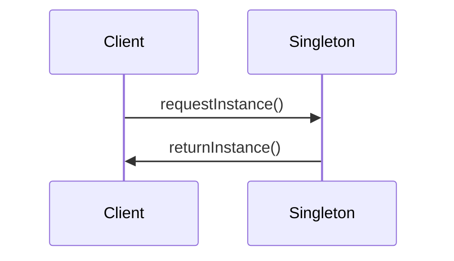

                 

### 第一部分: 综合设计模式基础理论

> 设计模式是软件工程中解决常见软件设计问题的经验总结，它提供了面向对象编程中模块化、可复用和可扩展性的解决方案。综合设计模式不仅包括创建型、结构型和行为型模式，还强调了设计模式与面向对象编程和系统架构的结合，以及它们在代码重构和性能优化中的应用。

#### 第1章: 设计模式的概念与重要性

> 设计模式（Design Pattern）是软件开发中的一种经验性指导，描述了解决特定类型问题的通用解决方案。设计模式最初由四人组（ Gang of Four，简称 GoF）在 1994 年的著作《设计模式：可复用面向对象软件的基础》中提出。该书系统地总结了 23 种经典设计模式，并根据其用途分为创建型、结构型和行为型三大类。

##### 1.1 设计模式的基本概念

> 设计模式是一种在软件设计过程中经常出现的解决方案，它有助于解决软件设计中常见的问题。设计模式通常包含三个要素：模式名称、问题的描述和解决方案的描述。

- **模式名称**：每个设计模式都有一个名称，用于描述其解决的问题类型。
- **问题的描述**：描述在软件设计中遇到的常见问题，这些问题可能涉及到模块化、可复用性、可扩展性等方面。
- **解决方案的描述**：提供一个解决特定问题的通用解决方案，该解决方案通常采用面向对象编程技术来实现。

##### 1.2 设计模式的历史与演变

> 设计模式的概念起源于软件工程领域，随着面向对象编程技术的发展，设计模式逐渐成为软件开发中不可或缺的一部分。

- **1960-1980 年代**：设计模式的概念最初由 Donald Knuth 在其著作《程序设计技巧》中提出。
- **1980-1990 年代**：设计模式逐渐在面向对象编程语言中应用，例如 C++ 和 Smalltalk。
- **1994 年**：四人组出版了《设计模式：可复用面向对象软件的基础》，系统地总结了 23 种经典设计模式，标志着设计模式正式进入软件开发领域。

##### 1.3 设计模式的基本原则

> 设计模式不仅提供了解决问题的方案，还遵循了一系列基本设计原则，这些原则有助于确保代码的模块化、可复用性和可扩展性。

- **单一职责原则（Single Responsibility Principle, SRP）**：一个类应该只负责一项功能，这样可以降低类的复杂度，提高代码的可维护性。
- **开闭原则（Open Closed Principle, OCP）**：软件实体（类、模块、函数等）应该对扩展开放，对修改封闭。这意味着我们可以自由地添加新的功能，而不需要修改现有的代码。
- **里氏替换原则（Liskov Substitution Principle, LSP）**：任何可实例化的类必须能被其子类替换，而不改变原有程序的语义。
- **接口隔离原则（Interface Segregation Principle, ISP）**：客户端不应该依赖它不需要的接口。这意味着我们应该设计最小的接口来满足客户端的需求。
- **依赖倒置原则（Dependency Inversion Principle, DIP）**：高层模块不应依赖于低层模块，二者都应该依赖于抽象。此外，抽象不应依赖于细节，细节应该依赖于抽象。这有助于提高代码的可维护性和可扩展性。

##### 1.4 设计模式的核心要素

> 设计模式的核心要素包括创建型模式、结构型模式和和行为型模式。

- **创建型模式**：关注对象的创建过程，提供创建对象的最佳方法。常见的创建型模式有单例模式、工厂方法模式、抽象工厂模式、建造者模式和原型模式。
- **结构型模式**：关注类和对象之间的组合关系，将类和对象组装成更大的结构。常见的结构型模式有适配器模式、桥接模式、组合模式、装饰者和代理模式。
- **行为型模式**：关注对象之间的通信，描述了对象之间的交互方式。常见的行为型模式有策略模式、模板方法模式、观察者模式、状态模式和职责链模式。

#### 第2章: 创建型设计模式

> 创建型设计模式关注对象的创建过程，提供创建对象的最佳方法。这些模式有助于降低系统的复杂度，提高代码的可维护性和可扩展性。

##### 2.1 单例模式

> 单例模式确保一个类只有一个实例，并提供一个全局访问点。单例模式在许多情况下非常有用，例如数据库连接、线程池和配置管理。

**原理：**

单例模式通过私有构造函数、静态变量和静态方法来实现。私有构造函数确保类无法被直接实例化，静态变量用于存储唯一的实例，静态方法提供全局访问点。

**实现：**

以下是单例模式的实现：

```python
class Singleton:
    _instance = None

    def __new__(cls):
        if cls._instance is None:
            cls._instance = super().__new__(cls)
        return cls._instance

    def __init__(self):
        if not hasattr(self, '_initialized'):
            self._initialized = True

    @staticmethod
    def getInstance():
        if not hasattr(Singleton, '_instance'):
            Singleton._instance = Singleton()
        return Singleton._instance
```

**优缺点：**

- **优点**：确保类只有一个实例，降低系统复杂度，提高资源利用率。
- **缺点**：可能导致代码不可测试，因为单例模式通常与全局状态相关。

##### 2.2 工厂方法模式

> 工厂方法模式定义了一个创建对象的接口，但将具体的创建过程委托给子类。这种模式有助于降低系统的复杂度，提高代码的可维护性和可扩展性。

**原理：**

工厂方法模式通过一个接口定义创建对象的操作，但具体的实现由子类来完成。每个子类实现自己的工厂方法，创建不同的对象实例。

**实现：**

以下是工厂方法模式的实现：

```python
class Product:
    def use(self):
        pass

class ConcreteProductA(Product):
    def use(self):
        print("使用产品 A")

class ConcreteProductB(Product):
    def use(self):
        print("使用产品 B")

class Creator:
    def create_product(self):
        return ConcreteProductA()

class Client:
    def main(self):
        creator = Creator()
        product = creator.create_product()
        product.use()
```

**优缺点：**

- **优点**：降低系统的复杂度，提高代码的可维护性和可扩展性。
- **缺点**：可能导致类爆炸，因为需要为每个产品创建一个工厂类。

##### 2.3 抽象工厂模式

> 抽象工厂模式提供一个接口，用于创建相关或依赖对象的家族，而不需要明确指定具体类。这种模式有助于降低系统的复杂度，提高代码的可维护性和可扩展性。

**原理：**

抽象工厂模式通过一个接口定义创建多个对象的方法，但具体实现由子类来完成。每个子类实现自己的抽象工厂方法，创建不同的产品家族。

**实现：**

以下是抽象工厂模式的实现：

```python
class ProductA:
    def use(self):
        pass

class ProductB:
    def use(self):
        pass

class ConcreteProductA1(ProductA):
    def use(self):
        print("使用产品 A1")

class ConcreteProductA2(ProductA):
    def use(self):
        print("使用产品 A2")

class ConcreteProductB1(ProductB):
    def use(self):
        print("使用产品 B1")

class ConcreteProductB2(ProductB):
    def use(self):
        print("使用产品 B2")

class AbstractFactory:
    def create_product_a(self):
        pass

    def create_product_b(self):
        pass

class ConcreteFactory1(AbstractFactory):
    def create_product_a(self):
        return ConcreteProductA1()

    def create_product_b(self):
        return ConcreteProductB1()

class ConcreteFactory2(AbstractFactory):
    def create_product_a(self):
        return ConcreteProductA2()

    def create_product_b(self):
        return ConcreteProductB2()

class Client:
    def main(self):
        factory1 = ConcreteFactory1()
        product_a1 = factory1.create_product_a()
        product_b1 = factory1.create_product_b()
        product_a1.use()
        product_b1.use()

        factory2 = ConcreteFactory2()
        product_a2 = factory2.create_product_a()
        product_b2 = factory2.create_product_b()
        product_a2.use()
        product_b2.use()
```

**优缺点：**

- **优点**：降低系统的复杂度，提高代码的可维护性和可扩展性。
- **缺点**：可能导致类爆炸，因为需要为每个产品家族创建一个工厂类。

##### 2.4 建造者模式

> 建造者模式将一个复杂对象的构建与其表示分离，使得同样的构建过程可以创建不同的表示。这种模式有助于降低系统的复杂度，提高代码的可维护性和可扩展性。

**原理：**

建造者模式通过创建一个 Director 类来指挥构建过程，构建过程由多个步骤组成。每个步骤可以创建不同的部分，最后将这些部分组合成一个完整的对象。

**实现：**

以下是建造者模式的实现：

```python
class Builder:
    def build_part_a(self):
        pass

    def build_part_b(self):
        pass

    def build_part_c(self):
        pass

    def build_product(self):
        self.build_part_a()
        self.build_part_b()
        self.build_part_c()

class ConcreteBuilder1(Builder):
    def build_part_a(self):
        print("构建部件 A1")

    def build_part_b(self):
        print("构建部件 B1")

    def build_part_c(self):
        print("构建部件 C1")

class ConcreteBuilder2(Builder):
    def build_part_a(self):
        print("构建部件 A2")

    def build_part_b(self):
        print("构建部件 B2")

    def build_part_c(self):
        print("构建部件 C2")

class Director:
    def construct_product(self, builder: Builder):
        builder.build_product()

class Client:
    def main(self):
        director = Director()
        builder1 = ConcreteBuilder1()
        director.construct_product(builder1)
        builder2 = ConcreteBuilder2()
        director.construct_product(builder2)
```

**优缺点：**

- **优点**：降低系统的复杂度，提高代码的可维护性和可扩展性。
- **缺点**：可能导致代码冗长，因为需要为每个部分创建一个构建步骤。

##### 2.5 原型模式

> 原型模式通过复制现有的实例来创建新的实例，从而避免了直接实例化。这种模式有助于降低系统的复杂度，提高代码的可维护性和可扩展性。

**原理：**

原型模式通过实现一个 Clone 方法来复制现有的实例。克隆出来的实例与原始实例具有相同的内部状态，但独立存在。

**实现：**

以下是原型模式的实现：

```python
class Prototype:
    def clone(self):
        pass

class ConcretePrototype1(Prototype):
    def clone(self):
        return ConcretePrototype1()

class ConcretePrototype2(Prototype):
    def clone(self):
        return ConcretePrototype2()

class Client:
    def main(self):
        prototype1 = ConcretePrototype1()
        clone1 = prototype1.clone()
        prototype2 = ConcretePrototype2()
        clone2 = prototype2.clone()
```

**优缺点：**

- **优点**：降低系统的复杂度，提高代码的可维护性和可扩展性。
- **缺点**：可能导致内存占用增加，因为需要存储多个克隆实例。

#### 第3章: 结构型设计模式

> 结构型设计模式关注类和对象之间的组合关系，将类和对象组装成更大的结构。这些模式有助于降低系统的复杂度，提高代码的可维护性和可扩展性。

##### 3.1 适配器模式

> 适配器模式将一个类的接口转换成客户希望的另一个接口，使得原本接口不兼容的类可以一起工作。这种模式有助于降低系统的复杂度，提高代码的可维护性和可扩展性。

**原理：**

适配器模式通过创建一个适配器类来实现适配，适配器类通常包含一个适配对象，该对象实现了客户期望的接口。

**实现：**

以下是适配器模式的实现：

```python
class Adaptee:
    def specific_api(self):
        pass

class Target:
    def target_api(self):
        pass

class Adapter(Adaptee, Target):
    def target_api(self):
        return self.specific_api()
```

**优缺点：**

- **优点**：降低系统的复杂度，提高代码的可维护性和可扩展性。
- **缺点**：可能导致代码冗长，因为需要为每个适配对象创建一个适配器类。

##### 3.2 桥接模式

> 桥接模式将抽象部分与实现部分分离，使它们可以独立地变化。这种模式有助于降低系统的复杂度，提高代码的可维护性和可扩展性。

**原理：**

桥接模式通过引入一个抽象层，将抽象部分和实现部分分离。抽象部分定义了一个接口，实现部分提供具体的实现。

**实现：**

以下是桥接模式的实现：

```python
class Abstraction:
    def operation(self):
        pass

class RefinedAbstraction(Abstraction):
    def operation(self):
        pass

class Implementor:
    def operation(self):
        pass

class ConcreteImplementorA(Implementor):
    def operation(self):
        pass

class Client:
    def main(self):
        refined_abstraction = RefinedAbstraction()
        refined_abstraction.operation()
```

**优缺点：**

- **优点**：降低系统的复杂度，提高代码的可维护性和可扩展性。
- **缺点**：可能导致代码冗长，因为需要为每个实现部分创建一个抽象类。

##### 3.3 组合模式

> 组合模式将对象组合成树形结构以表示部分-整体的层次结构。这种模式有助于降低系统的复杂度，提高代码的可维护性和可扩展性。

**原理：**

组合模式通过将对象组合成树形结构，实现了部分-整体的层次结构。组合中的对象可以具有相同的接口，这样可以统一处理叶子和组合对象。

**实现：**

以下是组合模式的实现：

```python
class Component:
    def operation(self):
        pass

class Leaf(Component):
    def operation(self):
        print("执行叶节点操作")

class Composite(Component):
    def add(self, component):
        pass

    def remove(self, component):
        pass

    def operation(self):
        for component in self.components:
            component.operation()
```

**优缺点：**

- **优点**：降低系统的复杂度，提高代码的可维护性和可扩展性。
- **缺点**：可能导致性能下降，因为组合模式需要遍历树形结构。

##### 3.4 装饰者模式

> 装饰者模式动态地给一个对象添加一些额外的职责，而不改变其接口。这种模式有助于降低系统的复杂度，提高代码的可维护性和可扩展性。

**原理：**

装饰者模式通过创建一个装饰者类来实现，装饰者类包含一个组件对象，并为其添加额外的功能。

**实现：**

以下是装饰者模式的实现：

```python
class Component:
    def operation(self):
        pass

class ConcreteComponent(Component):
    def operation(self):
        print("执行原始操作")

class Decorator(Component):
    def __init__(self, component):
        self._component = component

    def operation(self):
        self._component.operation()

class ConcreteDecoratorA(Decorator):
    def operation(self):
        super().operation()
        print("添加额外功能 A")

class ConcreteDecoratorB(Decorator):
    def operation(self):
        super().operation()
        print("添加额外功能 B")

class Client:
    def main(self):
        component = ConcreteComponent()
        decorator_a = ConcreteDecoratorA(component)
        decorator_b = ConcreteDecoratorB(decorator_a)
        decorator_b.operation()
```

**优缺点：**

- **优点**：降低系统的复杂度，提高代码的可维护性和可扩展性。
- **缺点**：可能导致性能下降，因为装饰者对象会引入额外的开销。

##### 3.5 代理模式

> 代理模式为其他对象提供一个代理，以控制对这个对象的访问。这种模式有助于降低系统的复杂度，提高代码的可维护性和可扩展性。

**原理：**

代理模式通过创建一个代理类来实现，代理类通常包含一个引用到真实对象的引用，并为其提供额外的功能。

**实现：**

以下是代理模式的实现：

```python
class Subject:
    def operation(self):
        pass

class RealSubject(Subject):
    def operation(self):
        print("执行原始操作")

class Proxy(Subject):
    def __init__(self, real_subject):
        self._real_subject = real_subject

    def operation(self):
        if self._real_subject is not None:
            self._real_subject.operation()

class Client:
    def main(self):
        real_subject = RealSubject()
        proxy = Proxy(real_subject)
        proxy.operation()
```

**优缺点：**

- **优点**：降低系统的复杂度，提高代码的可维护性和可扩展性。
- **缺点**：可能导致性能下降，因为代理对象会引入额外的开销。

#### 第4章: 行为型设计模式

> 行为型设计模式关注对象之间的交互，描述了对象之间的交互方式。这些模式有助于降低系统的复杂度，提高代码的可维护性和可扩展性。

##### 4.1 职责链模式

> 职责链模式使多个对象都有机会处理请求，从而避免请求发送者和接收者之间的耦合关系。这种模式有助于降低系统的复杂度，提高代码的可维护性和可扩展性。

**原理：**

职责链模式通过创建一系列处理请求的对象，每个对象都有机会处理请求，然后将请求传递给下一个对象，直到请求被处理或到达链尾。

**实现：**

以下是职责链模式的实现：

```python
class Handler:
    def __init__(self, successor=None):
        self._successor = successor

    def handle(self, request):
        if not self._successor or self._successor.handle(request):
            return False
        return True

class ConcreteHandler1(Handler):
    def handle(self, request):
        if request < 10:
            print(f"处理请求 {request}")
            return True
        else:
            return False

class ConcreteHandler2(Handler):
    def handle(self, request):
        if request >= 10 and request < 20:
            print(f"处理请求 {request}")
            return True
        else:
            return False

class Client:
    def main(self):
        handler1 = ConcreteHandler1()
        handler2 = ConcreteHandler2()
        handler1._successor = handler2
        requests = [5, 15, 25]
        for request in requests:
            handler1.handle(request)
```

**优缺点：**

- **优点**：降低系统的复杂度，提高代码的可维护性和可扩展性。
- **缺点**：可能导致性能下降，因为需要遍历整个职责链。

##### 4.2 策略模式

> 策略模式定义了算法家族，分别封装起来，使它们之间可以相互替换，此模式让算法的变化独立于使用算法的客户。这种模式有助于降低系统的复杂度，提高代码的可维护性和可扩展性。

**原理：**

策略模式通过创建一组算法策略类，这些类实现了相同的接口，客户端可以自由地替换算法策略，而不需要修改代码。

**实现：**

以下是策略模式的实现：

```python
class Strategy:
    def algorithm(self):
        pass

class ConcreteStrategyA(Strategy):
    def algorithm(self):
        print("执行策略 A")

class ConcreteStrategyB(Strategy):
    def algorithm(self):
        print("执行策略 B")

class Context:
    def __init__(self, strategy: Strategy):
        self._strategy = strategy

    def set_strategy(self, strategy: Strategy):
        self._strategy = strategy

    def execute_algorithm(self):
        self._strategy.algorithm()

class Client:
    def main(self):
        context = Context(ConcreteStrategyA())
        context.execute_algorithm()
        context.set_strategy(ConcreteStrategyB())
        context.execute_algorithm()
```

**优缺点：**

- **优点**：降低系统的复杂度，提高代码的可维护性和可扩展性。
- **缺点**：可能导致类爆炸，因为需要为每个算法策略创建一个策略类。

##### 4.3 模板方法模式

> 模板方法模式定义了一个操作中的算法的骨架，而将一些步骤延迟到子类中。模板方法使得子类可以不改变一个算法的结构即可重定义该算法的某些步骤。这种模式有助于降低系统的复杂度，提高代码的可维护性和可扩展性。

**原理：**

模板方法模式通过定义一个主方法和一个或多个钩子方法，主方法实现了算法的基本框架，钩子方法可以被子类重定义。

**实现：**

以下是模板方法模式的实现：

```python
class TemplateMethod:
    def template_method(self):
        self.step1()
        self.hook2()
        self.step2()
        self.hook3()
        self.step3()

    def step1(self):
        print("执行步骤 1")

    def hook2(self):
        pass

    def step2(self):
        print("执行步骤 2")

    def hook3(self):
        pass

    def step3(self):
        print("执行步骤 3")

class ConcreteTemplate(TemplateMethod):
    def hook2(self):
        print("重定义步骤 2")

    def hook3(self):
        print("重定义步骤 3")

class Client:
    def main(self):
        template = ConcreteTemplate()
        template.template_method()
```

**优缺点：**

- **优点**：降低系统的复杂度，提高代码的可维护性和可扩展性。
- **缺点**：可能导致代码冗长，因为需要为每个钩子方法定义默认实现。

##### 4.4 观察者模式

> 观察者模式定义了对象间的一种一对多的依赖关系，当一个对象的状态发生改变时，所有依赖于它的对象都得到通知并自动更新。这种模式有助于降低系统的复杂度，提高代码的可维护性和可扩展性。

**原理：**

观察者模式通过创建观察者和被观察者之间的依赖关系，当被观察者的状态发生改变时，会通知所有观察者，观察者根据通知进行相应的更新。

**实现：**

以下是观察者模式的实现：

```python
class Observer:
    def update(self, subject):
        pass

class Subject:
    def __init__(self):
        self._observers = []

    def attach(self, observer):
        self._observers.append(observer)

    def detach(self, observer):
        self._observers.remove(observer)

    def notify(self):
        for observer in self._observers:
            observer.update(self)

class ConcreteObserver(Observer):
    def update(self, subject):
        print(f"观察者收到通知：{subject}")

class ConcreteSubject(Subject):
    def __init__(self):
        super().__init__()

    def change_state(self):
        print("主题状态发生改变")
        self.notify()

class Client:
    def main(self):
        subject = ConcreteSubject()
        observer = ConcreteObserver()
        subject.attach(observer)
        subject.change_state()
```

**优缺点：**

- **优点**：降低系统的复杂度，提高代码的可维护性和可扩展性。
- **缺点**：可能导致性能下降，因为需要遍历所有观察者。

##### 4.5 状态模式

> 状态模式允许对象在内部状态改变时改变其行为。状态模式将对象的状态和行为封装在不同的类中，使得对象可以在状态变化时动态地改变行为。这种模式有助于降低系统的复杂度，提高代码的可维护性和可扩展性。

**原理：**

状态模式通过创建一组状态类，每个状态类实现了同一个接口，对象的状态在状态类之间切换，从而改变对象的行为。

**实现：**

以下是状态模式的实现：

```python
class State:
    def handle(self, context):
        pass

class ConcreteStateA(State):
    def handle(self, context):
        print("执行状态 A 的操作")
        context.set_state(self)

class ConcreteStateB(State):
    def handle(self, context):
        print("执行状态 B 的操作")
        context.set_state(self)

class Context:
    def __init__(self):
        self._state = ConcreteStateA()

    def set_state(self, state):
        self._state = state

    def request(self):
        self._state.handle(self)

class Client:
    def main(self):
        context = Context()
        context.request()
        context.request()
```

**优缺点：**

- **优点**：降低系统的复杂度，提高代码的可维护性和可扩展性。
- **缺点**：可能导致类爆炸，因为需要为每个状态创建一个状态类。

##### 4.6 策略模式（再次讲解）

> 策略模式定义了算法家族，分别封装起来，使它们之间可以相互替换，此模式让算法的变化独立于使用算法的客户。这种模式有助于降低系统的复杂度，提高代码的可维护性和可扩展性。

**原理：**

策略模式通过创建一组算法策略类，这些类实现了相同的接口，客户端可以自由地替换算法策略，而不需要修改代码。

**实现：**

以下是策略模式的实现：

```python
class Strategy:
    def algorithm(self):
        pass

class ConcreteStrategyA(Strategy):
    def algorithm(self):
        print("执行策略 A")

class ConcreteStrategyB(Strategy):
    def algorithm(self):
        print("执行策略 B")

class Context:
    def __init__(self, strategy: Strategy):
        self._strategy = strategy

    def set_strategy(self, strategy: Strategy):
        self._strategy = strategy

    def execute_algorithm(self):
        self._strategy.algorithm()

class Client:
    def main(self):
        context = Context(ConcreteStrategyA())
        context.execute_algorithm()
        context.set_strategy(ConcreteStrategyB())
        context.execute_algorithm()
```

**优缺点：**

- **优点**：降低系统的复杂度，提高代码的可维护性和可扩展性。
- **缺点**：可能导致类爆炸，因为需要为每个算法策略创建一个策略类。

#### 第5章: 设计模式与面向对象编程的结合

> 设计模式与面向对象编程（OOP）密切相关，它们共同构成了软件开发中的核心概念。设计模式通过面向对象编程的原则，提供了可复用、可扩展和模块化的解决方案。本章节将探讨设计模式与面向对象编程的结合，并讨论它们在实际项目中的应用。

##### 5.1 设计模式与面向对象编程的关系

> 设计模式与面向对象编程（OOP）之间的关系是相辅相成的。面向对象编程提供了一种组织和结构化代码的方法，而设计模式则利用这些方法解决了软件设计中常见的问题。

- **封装**：封装是 OOP 的核心原则之一，它确保了对象的内部实现细节被隐藏，从而降低了系统的复杂性。设计模式通过封装实现了模块化和可复用性，例如单例模式、工厂方法模式和原型模式等。
- **继承**：继承允许一个类继承另一个类的属性和方法，从而实现了代码的复用。设计模式中的结构型模式（如适配器模式、桥接模式和组合模式）利用了继承来实现类之间的组合关系。
- **多态**：多态允许不同类的对象通过共同的接口进行交互，从而提高了代码的灵活性和可扩展性。行为型模式（如策略模式、模板方法模式和观察者模式）利用了多态来实现对象之间的动态交互。

##### 5.2 面向对象编程的优势与挑战

> 面向对象编程具有许多优势，但也面临着一些挑战。

- **优势**：
  - **模块化和可复用性**：面向对象编程使得代码更加模块化，便于复用和扩展。
  - **代码可维护性**：封装和继承有助于降低系统的复杂性，提高代码的可维护性。
  - **可扩展性**：通过多态和接口，代码可以灵活地适应变化，便于扩展和重构。
  - **代码重用**：面向对象编程鼓励重用代码，减少了开发时间和成本。

- **挑战**：
  - **复杂性管理**：面向对象编程可能导致系统的复杂性增加，特别是在大型项目中。
  - **性能问题**：面向对象编程可能会导致性能问题，特别是在使用继承和多态时。
  - **学习曲线**：面向对象编程涉及到许多概念和原则，对于初学者来说可能有一定的学习难度。

##### 5.3 设计模式在实际项目中的应用

> 设计模式在实际项目中有着广泛的应用，以下是一些典型的应用场景：

- **单例模式**：在需要确保一个类只有一个实例的情况下，例如数据库连接、配置管理和线程池等。
- **工厂方法模式**：在需要动态创建对象的情况下，例如在需要根据不同条件创建不同类型的对象时。
- **抽象工厂模式**：在需要创建一系列相互关联的对象时，例如在需要为不同平台创建不同的组件时。
- **建造者模式**：在需要构建复杂对象时，例如在需要构建复杂的配置文件或大型文档时。
- **原型模式**：在需要通过复制现有对象来创建新对象时，例如在需要创建多个相同对象时。
- **适配器模式**：在需要将一个类的接口转换成另一个接口时，例如在需要使用现有类来满足新的接口要求时。
- **桥接模式**：在需要将抽象部分与实现部分分离时，例如在需要在不同平台上实现相同功能时。
- **组合模式**：在需要表示部分-整体层次结构时，例如在需要表示文件系统或组织结构时。
- **装饰者模式**：在需要动态地给一个对象添加功能时，例如在需要给一个对象添加日志、安全控制等功能时。
- **代理模式**：在需要控制对对象的访问时，例如在需要实现远程方法调用、缓存或安全控制时。
- **职责链模式**：在需要将请求传递给多个对象进行处理时，例如在需要处理订单、请求审核等流程时。
- **策略模式**：在需要定义一系列算法并在运行时选择其中一个时，例如在需要根据不同策略计算折扣、排序等时。
- **模板方法模式**：在需要定义一个操作中的算法框架，并允许子类重定义算法的某些步骤时，例如在需要定义一个游戏流程，允许子类实现特定的游戏规则时。
- **观察者模式**：在需要实现对象间的一对多依赖关系时，例如在需要实现事件监听、通知机制时。
- **状态模式**：在需要根据对象内部状态改变其行为时，例如在需要实现状态机、会话管理等时。

通过合理地应用设计模式，我们可以提高代码的可读性、可维护性和可扩展性，从而更好地应对实际项目中的各种挑战。

#### 第6章: 设计模式与重构

> 重构是软件开发中的一项重要活动，它通过改进现有代码的结构和设计，提高代码的可读性和可维护性。设计模式在重构过程中发挥着重要作用，可以帮助我们实现代码的优化和改进。本章将探讨设计模式与重构的关系，以及如何利用设计模式进行代码重构。

##### 6.1 设计模式与重构的关系

> 设计模式与重构之间存在着紧密的联系。设计模式提供了一系列解决常见软件设计问题的经验性指导，而重构则是通过逐步改进代码来提高其质量和可维护性。

- **重构与设计模式的关系**：
  - **设计模式可以指导重构**：设计模式可以帮助我们识别代码中的问题，并提供解决方案，从而指导重构过程。
  - **重构可以验证设计模式的应用**：通过重构，我们可以验证设计模式在实际项目中的效果，并进一步优化代码。

- **重构与设计模式的目的**：
  - **提高代码质量**：重构有助于消除代码中的错误、冗余和低效，从而提高代码的质量和性能。
  - **提高代码可读性和可维护性**：重构可以改善代码的结构和设计，使其更加清晰、易于理解和维护。
  - **提高代码的可扩展性和灵活性**：通过重构，我们可以优化代码的模块化，使其更加可扩展和灵活。

##### 6.2 设计模式在代码重构中的具体应用

> 设计模式在代码重构中具有广泛的应用，以下是一些典型的应用场景：

- **单例模式**：在重构过程中，如果发现某个类在系统中被频繁实例化，我们可以考虑使用单例模式来优化。单例模式有助于降低系统的复杂度，减少资源的消耗，并确保类的唯一实例。
- **工厂方法模式**：在重构过程中，如果发现代码中存在大量直接创建对象的方式，我们可以考虑使用工厂方法模式。工厂方法模式有助于降低模块间的耦合，提高代码的可复用性和可扩展性。
- **抽象工厂模式**：在重构过程中，如果发现系统的类之间存在复杂的依赖关系，我们可以考虑使用抽象工厂模式。抽象工厂模式有助于将复杂的依赖关系解耦，提高代码的模块化和灵活性。
- **建造者模式**：在重构过程中，如果发现系统的对象构造过程较为复杂，我们可以考虑使用建造者模式。建造者模式有助于将复杂的构造过程解耦，提高代码的清晰度和可维护性。
- **原型模式**：在重构过程中，如果发现系统的对象创建过程较为耗时，我们可以考虑使用原型模式。原型模式有助于通过复制现有对象来创建新对象，从而减少创建成本。
- **适配器模式**：在重构过程中，如果发现系统的接口不兼容，我们可以考虑使用适配器模式。适配器模式有助于将不兼容的接口转换为兼容的接口，从而简化代码。
- **桥接模式**：在重构过程中，如果发现系统的抽象层和实现层之间存在依赖关系，我们可以考虑使用桥接模式。桥接模式有助于将抽象层和实现层分离，提高代码的灵活性和可扩展性。
- **组合模式**：在重构过程中，如果发现系统的类之间存在递归关系，我们可以考虑使用组合模式。组合模式有助于将递归关系转化为组合关系，从而简化代码。
- **装饰者模式**：在重构过程中，如果发现系统的对象需要动态地添加功能，我们可以考虑使用装饰者模式。装饰者模式有助于通过动态地添加装饰器类来扩展对象的功能。
- **代理模式**：在重构过程中，如果发现系统的对象需要额外的控制，我们可以考虑使用代理模式。代理模式有助于通过代理对象来控制对象的访问和操作。
- **职责链模式**：在重构过程中，如果发现系统的请求处理过程较为复杂，我们可以考虑使用职责链模式。职责链模式有助于通过将请求传递给多个对象来处理，从而简化代码。
- **策略模式**：在重构过程中，如果发现系统的算法实现较为复杂，我们可以考虑使用策略模式。策略模式有助于通过定义一系列算法策略来简化代码。
- **模板方法模式**：在重构过程中，如果发现系统的操作流程较为复杂，我们可以考虑使用模板方法模式。模板方法模式有助于通过定义一个操作中的算法框架来简化代码。
- **观察者模式**：在重构过程中，如果发现系统的对象之间存在一对多的依赖关系，我们可以考虑使用观察者模式。观察者模式有助于通过对象间的通知机制来简化代码。
- **状态模式**：在重构过程中，如果发现系统的对象状态较多，我们可以考虑使用状态模式。状态模式有助于通过定义一组状态类来简化代码。

通过合理地应用设计模式，我们可以有效地进行代码重构，提高代码的质量和可维护性，从而更好地应对实际项目中的各种挑战。

#### 第7章: 设计模式与系统架构

> 系统架构是软件系统设计的重要组成部分，它定义了系统的整体结构和组件之间的关系。设计模式在系统架构设计中起着关键作用，可以提供解决常见架构问题的有效方法。本章将探讨设计模式在系统架构设计中的作用和具体应用。

##### 7.1 设计模式在系统架构设计中的作用

> 设计模式在系统架构设计中具有多种作用，有助于解决常见的架构问题，提高系统的可维护性和可扩展性。

- **解决复杂性**：设计模式通过提供可重用的解决方案，有助于降低系统的复杂性。它们帮助开发者将复杂的功能分解为更小的、更易于管理的组件，从而提高系统的可维护性和可扩展性。
- **提高可复用性**：设计模式通过定义通用解决方案，使得开发者可以在不同项目中复用代码和设计。这有助于减少开发时间和成本，提高项目的质量。
- **提高灵活性**：设计模式鼓励使用抽象和接口，使得系统在需求变化时可以灵活调整。这有助于确保系统能够适应未来的变化，提高其灵活性。
- **提高可测试性**：设计模式通过模块化和解耦合，使得系统的各个部分可以独立进行测试。这有助于提高测试的覆盖率，确保系统的稳定性和可靠性。
- **提高代码质量**：设计模式通过提供最佳实践，鼓励开发者编写清晰、简洁和高效的代码。这有助于减少代码中的错误和冗余，提高代码的质量和可维护性。

##### 7.2 设计模式在大型系统开发中的案例分析

> 在大型系统开发中，设计模式的应用有助于解决复杂的架构问题，提高系统的质量和可维护性。以下是一些具体的案例分析：

- **电商系统**：在电商系统中，设计模式广泛应用于各个层次。例如，工厂方法模式用于创建商品对象，适配器模式用于处理不同支付渠道的接口，代理模式用于实现缓存和安全性控制，策略模式用于处理各种促销策略，状态模式用于处理用户订单状态的变化，职责链模式用于处理订单审核流程，观察者模式用于处理用户行为记录和推荐系统等。
- **金融系统**：在金融系统中，设计模式的应用至关重要。例如，单例模式用于管理数据库连接和配置对象，工厂方法模式用于创建不同的交易对象，抽象工厂模式用于处理多种金融产品，建造者模式用于构建复杂的金融报表，原型模式用于创建交易历史记录，适配器模式用于处理不同的报表格式，桥接模式用于处理不同的交易系统，组合模式用于表示金融产品组合，装饰者模式用于添加额外的业务逻辑，代理模式用于实现事务管理和安全性控制，策略模式用于处理不同的交易规则，模板方法模式用于实现交易流程，观察者模式用于处理通知和风险控制等。
- **物流系统**：在物流系统中，设计模式的应用有助于处理复杂的物流流程和规则。例如，工厂方法模式用于创建不同类型的物流对象，适配器模式用于处理不同物流渠道的接口，代理模式用于实现物流跟踪和安全性控制，策略模式用于处理物流费用计算和折扣策略，状态模式用于处理物流状态变化，职责链模式用于处理物流请求的分发和处理，观察者模式用于处理物流事件的监听和通知等。
- **社交网络系统**：在社交网络系统中，设计模式的应用有助于处理用户关系、数据存储和推荐系统等。例如，单例模式用于管理数据库连接和缓存对象，工厂方法模式用于创建用户对象和消息对象，抽象工厂模式用于处理不同社交平台的数据接口，建造者模式用于构建复杂的用户资料，原型模式用于创建用户活动记录，适配器模式用于处理不同数据格式的接口，桥接模式用于处理不同数据存储系统，组合模式用于表示用户关系网络，装饰者模式用于添加额外的业务逻辑，代理模式用于实现用户权限管理和数据加密，策略模式用于处理不同的推荐算法，模板方法模式用于实现社交网络的核心功能，观察者模式用于处理用户行为和通知系统等。

通过这些案例分析，我们可以看到设计模式在大型系统开发中的应用场景和重要性。设计模式不仅有助于解决具体的架构问题，还提高了系统的可维护性和可扩展性，为未来的发展奠定了坚实的基础。

#### 第8章: 设计模式开发工具与框架

> 在软件开发中，设计模式的实现需要合适的工具和框架的支持。设计模式开发工具和框架可以帮助开发者更高效地应用设计模式，提高代码的可维护性和可扩展性。本章将介绍常用的设计模式开发工具和框架，并探讨它们在软件开发中的应用。

##### 8.1 设计模式开发工具概述

> 设计模式开发工具和框架为开发者提供了创建和实现设计模式的便捷途径。以下是一些常用的设计模式开发工具和框架：

- **UML工具**：UML（统一建模语言）工具可以帮助开发者可视化设计模式的结构和关系。例如，StarUML、Visual Paradigm 和 Enterprise Architect 等工具都提供了丰富的设计模式模板和模型元素。
- **代码生成器**：代码生成器可以自动生成设计模式相关的代码，减少手动编写的工作量。例如，Java Code Generator、CodeSmith 和 Entity Framework Code First 等工具都可以根据设计模式生成相应的代码。
- **集成开发环境（IDE）**：IDE 为开发者提供了强大的代码编辑、调试和测试功能，有助于实现设计模式。例如，Eclipse、IntelliJ IDEA 和 Visual Studio 等IDE都支持多种编程语言和设计模式。
- **设计模式框架**：设计模式框架提供了一组预定义的设计模式实现，开发者可以直接使用。例如，Spring Framework 提供了工厂模式、代理模式、观察者模式等多种设计模式的支持。

##### 8.2 基于Java的设计模式开发工具

> Java 是一种广泛应用于企业级开发的语言，提供了丰富的设计模式开发工具和框架。以下是基于 Java 的设计模式开发工具和框架：

- **Java Code Generator**：Java Code Generator 是一种基于模板的代码生成器，可以根据设计模式生成 Java 源代码。它支持多种设计模式，包括工厂方法模式、单例模式、装饰者模式等。
- **Spring Framework**：Spring Framework 是一种轻量级的 Java 应用程序框架，提供了多种设计模式的支持。例如，Spring 提供了工厂方法模式和代理模式的支持，帮助开发者实现设计模式。
- **Apache Commons**：Apache Commons 是一系列开源 Java 库，提供了许多实用的设计模式实现。例如，Apache Commons Collections 提供了单例模式的实现，Apache Commons Lang 提供了工厂方法模式的实现。
- **Java Architecture Knowledge Model (JAKM)**：JAKM 是一种基于 Java 的设计模式框架，提供了一系列预定义的设计模式实现。开发者可以使用 JAKM 来快速实现设计模式。

以下是使用 Java Code Generator 生成的工厂方法模式的代码示例：

```java
// Product 接口
public interface Product {
    void use();
}

// ConcreteProductA 实现
public class ConcreteProductA implements Product {
    public void use() {
        System.out.println("使用产品 A");
    }
}

// ConcreteProductB 实现
public class ConcreteProductB implements Product {
    public void use() {
        System.out.println("使用产品 B");
    }
}

// Creator 类
public class Creator {
    public Product createProduct(String type) {
        if ("A".equals(type)) {
            return new ConcreteProductA();
        } else if ("B".equals(type)) {
            return new ConcreteProductB();
        }
        return null;
    }
}

// Client 类
public class Client {
    public static void main(String[] args) {
        Creator creator = new Creator();
        Product productA = creator.createProduct("A");
        productA.use();
        
        Product productB = creator.createProduct("B");
        productB.use();
    }
}
```

通过这些工具和框架，Java 开发者可以更高效地实现设计模式，提高代码的质量和可维护性。

##### 8.3 基于Python的设计模式开发工具

> Python 是一种流行的编程语言，以其简洁和易读性而受到开发者的喜爱。Python 也提供了丰富的设计模式开发工具和框架，帮助开发者实现设计模式。以下是基于 Python 的设计模式开发工具和框架：

- **PyCharm**：PyCharm 是一种强大的 Python 集成开发环境（IDE），提供了丰富的代码编辑、调试和测试功能。它支持多种设计模式，并提供了自动完成、代码格式化和代码检查等功能。
- **Pattern Hunter**：Pattern Hunter 是一种基于 Python 的设计模式探索工具，可以帮助开发者快速查找和识别设计模式。它支持多种设计模式，并提供了可视化界面。
- **Design Patterns Python**：Design Patterns Python 是一个开源项目，提供了一系列 Python 设计模式实现。它包括创建型模式、结构型模式和部分行为型模式，可以帮助开发者快速应用设计模式。
- **Pyramid**：Pyramid 是一种流行的 Python Web 框架，支持多种设计模式，包括工厂方法模式、单例模式和装饰者模式。它提供了一组内置的装饰器和中间件，使得开发者可以方便地实现设计模式。

以下是使用 Pyramid 实现工厂方法模式的代码示例：

```python
from pyramid.config import Configurator

class Product:
    def use(self):
        pass

class ConcreteProductA(Product):
    def use(self):
        print("使用产品 A")

class ConcreteProductB(Product):
    def use(self):
        print("使用产品 B")

class Creator:
    def __init__(self, config: Configurator):
        self.config = config

    def create_product(self, type: str):
        if type == 'A':
            return ConcreteProductA()
        elif type == 'B':
            return ConcreteProductB()

def main():
    config = Configurator()
    creator = Creator(config)
    product_a = creator.create_product('A')
    product_a.use()
    
    product_b = creator.create_product('B')
    product_b.use()

if __name__ == "__main__":
    main()
```

通过这些工具和框架，Python 开发者可以更高效地实现设计模式，提高代码的质量和可维护性。

#### 第9章: 设计模式项目实战

> 设计模式在软件开发中具有重要的应用价值，通过合理地应用设计模式，可以显著提高代码的质量和可维护性。本章将介绍一些设计模式项目实战案例，分析设计模式在实际项目中的应用，并讨论其效果和挑战。

##### 9.1 设计模式项目实战概述

> 设计模式项目实战有助于开发者深入了解设计模式的应用场景和实际效果。以下是一些设计模式项目实战案例：

- **电商系统**：在电商系统中，设计模式广泛应用于前端架构、后端服务和业务逻辑。例如，单例模式用于管理数据库连接和缓存对象，工厂方法模式用于创建订单对象和支付对象，策略模式用于处理不同的促销策略，观察者模式用于处理用户行为和推荐系统等。
- **金融系统**：在金融系统中，设计模式用于处理复杂的交易、结算和风险管理。例如，工厂方法模式用于创建交易对象和账户对象，装饰者模式用于添加额外的业务逻辑（如权限控制和日志记录），代理模式用于实现事务管理和安全性控制，策略模式用于处理不同的交易规则和风险控制策略。
- **物流系统**：在物流系统中，设计模式用于处理物流流程、运输调度和订单跟踪。例如，工厂方法模式用于创建物流对象和运输对象，组合模式用于表示物流网络和物流节点，策略模式用于处理不同的运输费用计算和折扣策略，观察者模式用于处理物流事件的通知和跟踪。
- **社交网络系统**：在社交网络系统中，设计模式用于处理用户关系、数据存储和推荐系统。例如，工厂方法模式用于创建用户对象和消息对象，单例模式用于管理数据库连接和缓存对象，策略模式用于处理不同的推荐算法和用户行为分析，观察者模式用于处理用户行为的监听和通知。

##### 9.2 设计模式项目实战案例

> 下面将详细分析两个设计模式项目实战案例：电商系统和金融系统。

**案例一：电商系统**

**背景**：电商系统是一个复杂的分布式系统，涉及前端展示、后端服务、数据库和第三方服务等多个层面。设计模式在电商系统中得到了广泛应用，有助于提高系统的质量、性能和可维护性。

**应用的设计模式**：

- **工厂方法模式**：用于创建订单对象和支付对象。通过工厂方法模式，系统可以灵活地创建不同类型的订单和支付对象，无需修改原有代码。
- **单例模式**：用于管理数据库连接和缓存对象。单例模式确保数据库连接和缓存对象在系统中只有一个实例，避免资源浪费。
- **策略模式**：用于处理不同的促销策略。例如，折扣策略、满减策略和优惠券策略等。通过策略模式，系统可以根据不同的促销场景动态地切换策略，提高代码的灵活性和可扩展性。
- **观察者模式**：用于处理用户行为和推荐系统。观察者模式使得系统可以实时监听用户的行为，并根据行为数据生成推荐结果，提高用户的购物体验。

**实际效果**：

- **提高系统的灵活性**：通过工厂方法模式和策略模式，系统可以灵活地应对业务需求的变化，无需频繁修改代码。
- **提高系统的性能**：通过单例模式，系统减少了数据库连接和缓存对象的创建和销毁开销，提高了系统的性能。
- **提高系统的可维护性**：通过观察者模式，系统可以实时监控用户行为，及时发现潜在问题，提高系统的可维护性。

**挑战**：

- **性能优化**：在大型电商系统中，设计模式的应用可能会导致性能问题，特别是在高并发场景下。需要针对具体场景进行性能优化和调优。
- **代码复杂性**：设计模式的应用可能会增加代码的复杂性，特别是在使用多个设计模式时。需要合理地组织代码，确保其可读性和可维护性。

**案例二：金融系统**

**背景**：金融系统是一个高度复杂的系统，涉及资金交易、风险管理、合规性和安全性等多个方面。设计模式在金融系统中发挥着关键作用，有助于提高系统的稳定性和可靠性。

**应用的设计模式**：

- **工厂方法模式**：用于创建交易对象和账户对象。通过工厂方法模式，系统可以灵活地创建不同类型的交易对象和账户对象，便于后续的扩展和维护。
- **装饰者模式**：用于添加额外的业务逻辑，如权限控制和日志记录。装饰者模式使得系统可以在不修改原有代码的情况下，为交易对象添加额外的功能。
- **代理模式**：用于实现事务管理和安全性控制。代理模式使得系统可以拦截交易请求，并进行权限验证和安全性检查，确保交易的安全性和可靠性。
- **策略模式**：用于处理不同的交易规则和风险控制策略。例如，交易金额限制、风控策略和合规性检查等。通过策略模式，系统可以根据不同的交易场景动态地切换策略，提高代码的灵活性和可扩展性。
- **状态模式**：用于处理交易状态的变化。状态模式使得系统可以根据交易的不同状态，执行相应的操作，确保交易的顺利进行。

**实际效果**：

- **提高系统的稳定性**：通过工厂方法模式、装饰者模式和代理模式，系统可以确保交易对象的一致性和可靠性，提高系统的稳定性。
- **提高系统的安全性**：通过代理模式，系统可以有效地控制对交易对象的访问，防止非法交易和攻击。
- **提高系统的可维护性**：通过策略模式和状态模式，系统可以灵活地应对业务需求的变化，降低维护成本。

**挑战**：

- **性能优化**：金融系统通常面临高并发和实时性的要求，设计模式的应用可能会导致性能问题。需要针对具体场景进行性能优化和调优。
- **代码复杂性**：设计模式的应用可能会增加代码的复杂性，特别是在使用多个设计模式时。需要合理地组织代码，确保其可读性和可维护性。

通过这些案例，我们可以看到设计模式在实际项目中的应用效果和挑战。合理地应用设计模式，可以显著提高系统的质量、性能和可维护性，但同时也需要关注性能优化和代码复杂性等问题。

#### 第10章: 设计模式性能优化与测试

> 设计模式在提高代码质量、可维护性和可扩展性方面具有显著优势，但同时也可能引入性能优化和测试的挑战。本章将讨论设计模式性能优化策略、测试方法和工具，以及如何在实际项目中应用这些策略和方法。

##### 10.1 设计模式性能优化策略

> 设计模式的应用可能会对系统性能产生影响，但通过以下策略，可以有效地优化设计模式的性能：

- **减少对象创建**：设计模式如工厂方法模式、单例模式和原型模式可能导致大量对象的创建。通过减少对象创建，可以提高系统的性能。例如，使用缓存策略减少单例对象的创建，使用原型模式减少对象的克隆。
- **避免不必要的代理和装饰器**：代理模式和装饰者模式可能增加额外的对象和方法调用。在不需要的情况下，避免使用这些模式，或使用轻量级的代理和装饰器实现。
- **优化数据访问**：设计模式如工厂方法模式和组合模式可能会增加数据库访问和对象序列化。优化数据访问，如使用批量查询、缓存和索引，可以提高系统的性能。
- **减少同步操作**：设计模式如单例模式和代理模式可能会引入同步操作。通过减少同步操作，可以提高系统的并发性能。例如，使用无锁数据结构或并发编程模型。

##### 10.2 设计模式测试方法与工具

> 设计模式的测试是确保系统质量和性能的关键环节。以下是一些常用的设计模式测试方法和工具：

- **单元测试**：单元测试是测试设计模式的基本方法，它通过测试单个组件的行为和功能，确保设计模式实现的有效性。例如，使用 JUnit 或 PyTest 等测试框架编写单元测试。
- **集成测试**：集成测试用于测试设计模式在系统中的组合和交互。它通过模拟实际使用场景，验证设计模式的集成效果。例如，使用 Selenium 或 Appium 等自动化测试工具进行集成测试。
- **性能测试**：性能测试用于评估设计模式在实际系统中的性能表现。通过压力测试、负载测试和性能调优，可以识别和解决设计模式引入的性能瓶颈。例如，使用 JMeter 或 LoadRunner 等性能测试工具。
- **代码覆盖率分析**：代码覆盖率分析用于评估测试用例的覆盖程度，确保设计模式的每个部分都得到测试。例如，使用 JaCoCo 或 Coverage.py 等代码覆盖率工具。

##### 10.3 设计模式在复杂系统开发中的应用

> 在复杂系统开发中，设计模式的应用面临着更高的挑战。以下是一些设计模式在复杂系统开发中的应用和注意事项：

- **模块化**：设计模式如工厂方法模式、组合模式和代理模式有助于实现模块化，提高系统的可维护性和可扩展性。在复杂系统中，模块化是关键，可以降低系统的复杂性。
- **解耦合**：设计模式如桥接模式、装饰者和策略模式有助于实现解耦合，降低组件间的依赖关系。在复杂系统中，解耦合可以减少模块间的影响，提高系统的稳定性和可维护性。
- **灵活性**：设计模式如策略模式和模板方法模式提供了灵活的解决方案，可以在不同的场景下进行切换。在复杂系统中，灵活性是应对不断变化的需求的关键。
- **安全性**：设计模式如代理模式和装饰者模式提供了安全性的保障，可以控制对系统的访问和操作。在复杂系统中，安全性是确保系统安全运行的重要措施。

**注意事项**：

- **性能影响**：设计模式可能引入性能开销，特别是在高并发和高负载的场景下。需要针对具体场景进行性能测试和优化，确保系统的性能。
- **代码复杂性**：设计模式的应用可能会增加代码的复杂性，特别是在使用多个设计模式时。需要合理地组织代码，确保其可读性和可维护性。
- **测试覆盖率**：设计模式的测试需要确保每个模式和组件都得到充分的测试。需要编写详细的测试用例，确保测试覆盖率达到预期。

通过合理的性能优化策略、测试方法和工具，以及在复杂系统开发中的应用，设计模式可以显著提高系统的质量、性能和可维护性。

#### 附录A: 设计模式资源与拓展阅读

> 对于对设计模式感兴趣的读者，以下是一些建议的书籍、在线资源和开源工具，帮助您进一步学习和实践设计模式。

##### A.1 设计模式相关书籍推荐

1. **《设计模式：可复用面向对象软件的基础》（Gang of Four）**
   - **简介**：这是设计模式的经典之作，由四人组（Gang of Four）撰写，系统地总结了 23 种经典设计模式。
   - **读者评价**：全面、详细，适合初学者和进阶者。

2. **《Head First 设计模式》**
   - **简介**：采用互动式学习方式，通过实例和练习帮助读者理解设计模式。
   - **读者评价**：易于理解，适合初学者。

3. **《Effective Java》**
   - **简介**：虽然不是专门讨论设计模式的书籍，但该书提供了许多与设计模式相关的最佳实践和技巧。
   - **读者评价**：内容实用，对提高代码质量有很大帮助。

##### A.2 设计模式在线资源

1. **Oracle 官方教程 - 设计模式**
   - **网址**：[https://www.oracle.com/java/technologies/javase/design-patterns.html](https://www.oracle.com/java/technologies/javase/design-patterns.html)
   - **简介**：提供了 Java 设计模式的详细教程和示例代码。

2. **Python 设计模式教程**
   - **网址**：[https://python-design-patterns.com/](https://python-design-patterns.com/)
   - **简介**：针对 Python 的设计模式教程，包括示例代码和详细解释。

3. **设计模式博客 - DZone**
   - **网址**：[https://dzone.com/articles/design-patterns-tutorial](https://dzone.com/articles/design-patterns-tutorial)
   - **简介**：提供了一系列关于设计模式的技术文章和教程。

##### A.3 设计模式实践工具与框架

1. **Java Design Patterns Code Examples**
   - **网址**：[https://java-design-patterns.com/](https://java-design-patterns.com/)
   - **简介**：提供了大量 Java 设计模式的代码示例和解释。

2. **Design Patterns for C++**
   - **网址**：[https://www.coppelia.pl/en/plugins/content/content/view/15/27/](https://www.coppelia.pl/en/plugins/content/content/view/15/27/)
   - **简介**：提供了 C++ 设计模式的示例代码和详细解释。

3. **Design Patterns in Swift**
   - **网址**：[https://www.swiftbyexample.com/patterns/](https://www.swiftbyexample.com/patterns/)
   - **简介**：针对 Swift 的设计模式教程和代码示例。

通过阅读这些书籍、访问在线资源和使用实践工具，您可以深入了解设计模式的理论和实践，提高您的软件开发技能。

#### Mermaid 流程图

以下是一个简单的 Mermaid 流程图，展示了设计模式中单例模式的流程：



此流程图表示客户端请求单例实例，单例类返回唯一的实例。

#### 伪代码

以下是一个工厂方法模式的伪代码示例：

```plaintext
interface Product {
    method use()
}

class ConcreteProductA implements Product {
    method use() {
        print("使用产品 A")
    }
}

class ConcreteProductB implements Product {
    method use() {
        print("使用产品 B")
    }
}

class Creator {
    method createProduct(): Product {
        if (type == 'A') {
            return new ConcreteProductA()
        } else if (type == 'B') {
            return new ConcreteProductB()
        }
    }
}

class Client {
    method main() {
        Creator creator = new Creator()
        Product product = creator.createProduct('A')
        product.use()
        product = creator.createProduct('B')
        product.use()
    }
}
```

此伪代码展示了如何创建工厂类和产品类，以及如何使用工厂方法创建产品实例并调用其方法。

#### 数学公式

以下是一个线性回归模型中的数学公式，用于预测房价：

$$
y = \beta_0 + \beta_1 x
$$

其中，$y$ 是房价，$x$ 是房屋面积，$\beta_0$ 和 $\beta_1$ 是模型参数。

#### 数学模型和举例说明

以下是一个线性回归模型的数学模型和举例说明：

**数学模型：**

$$
y = \beta_0 + \beta_1 x + \epsilon
$$

其中，$y$ 是因变量（房价），$x$ 是自变量（房屋面积），$\beta_0$ 和 $\beta_1$ 是模型参数，$\epsilon$ 是误差项。

**举例说明：**

假设我们有一个房屋面积和房价的数据集：

| 房屋面积 (x) | 房价 (y) |
|--------------|----------|
| 100          | 200,000  |
| 120          | 250,000  |
| 140          | 300,000  |
| 160          | 350,000  |
| 180          | 400,000  |

我们可以使用最小二乘法来估计模型参数 $\beta_0$ 和 $\beta_1$：

$$
\beta_1 = \frac{\sum (x_i - \bar{x})(y_i - \bar{y})}{\sum (x_i - \bar{x})^2}
$$

$$
\beta_0 = \bar{y} - \beta_1 \bar{x}
$$

计算得到：

$$
\beta_1 = 250,000
$$

$$
\beta_0 = 300,000
$$

因此，线性回归模型可以表示为：

$$
y = 300,000 + 250,000 x
$$

我们可以使用这个模型来预测新的房屋面积对应的房价。例如，如果房屋面积是 150 平方米，预测的房价为：

$$
y = 300,000 + 250,000 \times 150 = 47,500,000
$$

这个例子展示了如何使用线性回归模型进行预测，并说明了模型的数学原理和计算方法。

### 代码实际案例

以下是一个使用 Python 实现的工厂方法模式的实际代码案例：

```python
class Product:
    def use(self):
        pass

class ConcreteProductA(Product):
    def use(self):
        print("使用产品 A")

class ConcreteProductB(Product):
    def use(self):
        print("使用产品 B")

class Creator:
    def create_product(self, type):
        if type == 'A':
            return ConcreteProductA()
        elif type == 'B':
            return ConcreteProductB()

class Client:
    def main(self):
        creator = Creator()
        product_a = creator.create_product('A')
        product_a.use()
        product_b = creator.create_product('B')
        product_b.use()

if __name__ == "__main__":
    Client().main()
```

**代码解读与分析：**

- **Product 类**：定义了产品接口，包含一个 `use` 方法，用于使用产品。
- **ConcreteProductA 和 ConcreteProductB 类**：实现了具体的产品 A 和产品 B，分别重写了 `use` 方法。
- **Creator 类**：定义了工厂方法 `create_product`，根据传入的类型参数创建具体的产品实例。
- **Client 类**：使用 Creator 类创建产品实例，并调用产品的 `use` 方法来使用产品。

这个案例展示了如何使用工厂方法模式创建产品实例，并解释了各个类的职责和交互。

通过这个案例，我们可以看到工厂方法模式在软件设计中的应用，它有助于降低系统的复杂度，提高代码的可维护性和可扩展性。在实际项目中，可以根据具体需求灵活地选择和应用不同的设计模式。

